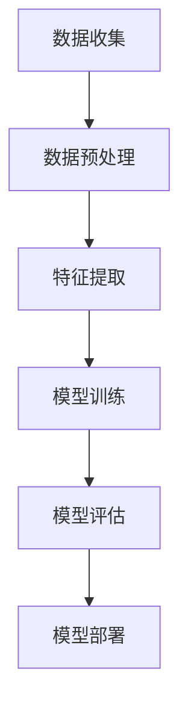
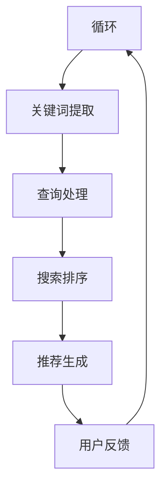

                 

### 文章标题

#### 《AI大模型赋能电商搜索推荐的业务创新项目管理方法》

在当今数字化时代，人工智能（AI）技术已经成为推动各行业发展的关键驱动力。尤其是电商行业，随着消费者需求的多样化，如何精准、高效地进行搜索推荐，已成为电商企业赢得竞争优势的重要手段。AI大模型作为一种新兴的技术，其在电商搜索推荐中的应用具有深远的影响。本文将深入探讨AI大模型赋能电商搜索推荐的业务创新项目管理方法，为电商企业利用AI技术提升搜索推荐效果提供系统化的解决方案。

本文分为八个部分，首先对AI大模型与电商搜索推荐进行概述，接着分析电商搜索推荐业务流程及关键指标。随后，详细介绍AI大模型在电商搜索推荐中的应用技术基础，以及实际应用中的用户画像构建、搜索排序算法优化和推荐算法改进。在此基础上，本文重点阐述业务创新项目管理方法，涵盖项目管理基础、项目风险管理和团队协作与沟通。接下来，通过具体案例研究，分析AI大模型在电商搜索推荐中的成功实践。最后，对AI大模型赋能电商搜索推荐的未来趋势进行展望，并提出未来研究方向。

通过对以上各部分内容的深入探讨，本文旨在为电商企业提供一个全面、系统的AI大模型应用指南，帮助企业实现业务创新，提升市场竞争力。

### 关键词

- **AI大模型**
- **电商搜索推荐**
- **业务创新**
- **项目管理**
- **深度学习**
- **自然语言处理**
- **个性化推荐**

### 摘要

本文针对AI大模型在电商搜索推荐中的应用，从技术原理、业务实践和项目管理三个方面进行了系统性的探讨。首先，分析了AI大模型的基本概念和分类，以及在电商搜索推荐业务中的具体应用场景。随后，详细阐述了电商搜索推荐的业务流程和关键指标。接着，介绍了深度学习、自然语言处理和大规模预训练模型等AI大模型技术基础，并探讨了这些技术在用户画像构建、搜索排序算法优化和推荐算法改进中的应用。在此基础上，本文提出了业务创新项目管理方法，包括项目管理基础、项目风险管理和团队协作与沟通。通过具体案例研究，分析了AI大模型在电商搜索推荐中的实际应用效果。最后，对AI大模型赋能电商搜索推荐的未来趋势进行了展望，并提出了未来研究方向。本文旨在为电商企业提供一个全面、系统的AI大模型应用指南，帮助企业实现业务创新，提升市场竞争力。

### 目录大纲

**《AI大模型赋能电商搜索推荐的业务创新项目管理方法》目录大纲**

## 第一部分：AI大模型与电商搜索推荐概述

### 第1章 AI大模型概述

#### 1.1 AI大模型的概念与分类

#### 1.2 电商搜索推荐中的AI大模型应用

### 第2章 电商搜索推荐业务分析

#### 2.1 电商搜索推荐业务流程

#### 2.2 电商搜索推荐业务指标

## 第二部分：AI大模型在电商搜索推荐中的应用

### 第3章 大模型技术基础

#### 3.1 深度学习基本概念

#### 3.2 自然语言处理技术

#### 3.3 大规模预训练模型原理

### 第4章 AI大模型在电商搜索推荐中的应用实践

#### 4.1 用户画像构建

#### 4.2 搜索排序算法优化

#### 4.3 推荐算法改进

### 第5章 业务创新项目管理方法

#### 5.1 项目管理基础

#### 5.2 项目风险管理

#### 5.3 项目团队协作与沟通

### 第6章 AI大模型在电商搜索推荐中的案例研究

#### 6.1 案例一：某电商平台搜索排序优化

#### 6.2 案例二：某电商平台个性化推荐系统建设

### 第7章 AI大模型赋能电商搜索推荐的未来趋势

#### 7.1 行业发展趋势分析

#### 7.2 技术创新展望

#### 7.3 业务创新方向探讨

### 第8章 总结与展望

#### 8.1 总结

#### 8.2 未来研究方向

### 附录

#### 附录 A：相关工具与技术资源

##### A.1 大模型开发工具

##### A.2 数据处理工具

##### A.3 推荐系统评估工具

#### 附录 B：参考文献

##### B.1 电商搜索推荐相关书籍

##### B.2 AI大模型相关书籍

##### B.3 项目管理相关书籍

#### 附录 C：Mermaid流程图示例

##### C.1 大模型训练流程

##### C.2 电商搜索推荐系统流程

#### 附录 D：伪代码示例

##### D.1 深度学习算法伪代码

##### D.2 推荐系统算法伪代码

#### 附录 E：数学公式示例

##### E.1 数学公式一

##### E.2 数学公式二

#### 附录 F：案例代码解读

##### F.1 搜索排序优化代码解读

##### F.2 个性化推荐系统代码解读

#### 附录 G：开发环境搭建指南

##### G.1 Python环境搭建

##### G.2 深度学习框架安装

##### G.3 数据处理工具安装

##### G.4 推荐系统评估工具安装

#### 附录 H：源代码及数据集获取方式

##### H.1 源代码获取

##### H.2 数据集获取

##### H.3 代码解读与分析

### 第一部分：AI大模型与电商搜索推荐概述

#### 第1章 AI大模型概述

##### 1.1 AI大模型的概念与分类

人工智能（AI）作为一种模拟人类智能行为的计算机科学，正在迅速改变着各行各业。在AI技术不断发展的过程中，AI大模型（Large-scale AI Models）作为一种重要的技术范式，逐渐成为研究热点。AI大模型是指那些具有大规模参数、能够处理海量数据的深度学习模型，其目的是通过学习和模拟人类智能，实现更高层次的任务自动化和智能化。

AI大模型可以按照不同的分类标准进行划分：

1. **按任务类型分类**：

    - 自然语言处理（NLP）模型：如BERT、GPT等，主要用于处理文本数据，实现文本生成、语义理解等任务。
    - 计算机视觉模型：如ResNet、Inception等，主要用于图像分类、目标检测、图像分割等任务。
    - 强化学习模型：如Deep Q-Network（DQN）、Policy Gradient等，主要用于决策和游戏等领域。

2. **按训练数据规模分类**：

    - 小型模型：训练数据规模在数百万样本量级。
    - 中型模型：训练数据规模在数十亿样本量级。
    - 大型模型：训练数据规模在千亿甚至万亿样本量级。

##### 1.2 电商搜索推荐中的AI大模型应用

在电商搜索推荐中，AI大模型的应用场景广泛，主要表现为以下几方面：

1. **用户画像构建**：

    通过收集和分析用户行为数据，利用AI大模型构建用户画像，从而实现对用户需求的深度理解和精准定位。例如，利用深度学习模型对用户的浏览记录、购买历史、评价信息等进行处理，生成多维度的用户特征向量，进而为个性化推荐提供基础。

2. **搜索排序算法优化**：

    AI大模型可以通过学习海量数据，优化搜索排序算法，提高搜索结果的准确性和相关性。例如，基于BERT模型进行关键词的语义理解，实现更精细的搜索结果排序。

3. **推荐算法改进**：

    AI大模型可以帮助电商企业改进推荐算法，提升推荐系统的效果。例如，利用GPT模型生成商品描述，提升商品推荐文案的吸引力和转化率。

4. **商品分类与标签**：

    AI大模型可以通过对商品数据的深度学习，实现更精准的商品分类与标签化，提高电商平台的商品组织和管理效率。

总之，AI大模型在电商搜索推荐中的应用，不仅可以提高系统的智能化水平，还可以为企业带来显著的商业价值。下一章将深入探讨电商搜索推荐业务的流程及关键指标，为后续章节的讨论打下基础。

#### 第2章 电商搜索推荐业务分析

##### 2.1 电商搜索推荐业务流程

电商搜索推荐业务的核心在于通过搜索引擎和推荐系统为用户精准匹配商品，提升用户体验和购买转化率。其业务流程主要包括以下几个环节：

1. **用户行为数据收集**：

    电商企业通过网站日志、点击流数据、用户购买记录等手段收集用户行为数据。这些数据将用于后续的用户画像构建和推荐算法优化。

2. **用户画像构建**：

    利用AI大模型对收集到的用户行为数据进行处理，构建用户画像。用户画像包括用户的基本信息、兴趣爱好、购买偏好等多个维度，是推荐系统的重要输入。

3. **搜索查询处理**：

    当用户在电商平台上进行搜索时，系统会对用户的查询请求进行处理。这包括关键词的提取、同义词处理、查询意图理解等步骤，以确保搜索结果的准确性。

4. **搜索结果排序**：

    根据用户画像和搜索查询结果，利用排序算法对搜索结果进行排序。常见的排序算法包括基于内容的排序、基于协同过滤的排序和基于深度学习的排序等。

5. **推荐结果生成**：

    除了搜索结果，推荐系统还会为用户生成个性化推荐列表。这通常包括基于用户历史行为的推荐、基于商品属性的推荐和基于市场趋势的推荐等。

6. **用户反馈收集**：

    用户对搜索和推荐结果的行为（如点击、购买、评价等）将被收集并用于反馈机制，进一步优化推荐算法和搜索排序。

##### 2.2 电商搜索推荐业务指标

为了评估电商搜索推荐系统的性能，通常需要关注以下几个关键指标：

1. **搜索结果相关性**：

    搜索结果的相关性是指用户搜索查询与搜索结果之间的匹配度。通常使用精确率（Precision）和召回率（Recall）来衡量。高相关性的搜索结果能够提升用户体验。

2. **推荐效果**：

    推荐效果是指推荐系统能够为用户推荐符合其兴趣和需求的商品。常用的指标包括推荐准确率（Accuracy）、推荐覆盖率（Coverage）和推荐新颖度（Novelty）。

3. **用户体验**：

    用户体验是评估推荐系统性能的重要指标，包括搜索和推荐结果的响应时间、系统稳定性、界面友好度等。

4. **购买转化率**：

    购买转化率是指用户在搜索和推荐后完成购买的比例。它是衡量电商搜索推荐系统直接商业价值的重要指标。

5. **系统性能**：

    系统性能包括处理速度、资源占用和系统稳定性等。高效的系统性能能够确保在高峰期满足用户需求。

通过关注和优化这些业务指标，电商企业可以不断提升搜索推荐系统的效果，提升用户满意度和购买转化率，从而增强市场竞争力。

### 第二部分：AI大模型在电商搜索推荐中的应用

#### 第3章 大模型技术基础

##### 3.1 深度学习基本概念

深度学习是人工智能的一个重要分支，通过构建复杂的神经网络模型，使计算机具备从大量数据中自动学习和提取特征的能力。深度学习的基本概念包括以下几个关键部分：

1. **神经网络**：

    神经网络是由大量神经元（即节点）组成的网络，每个神经元接收输入信号并产生输出。神经网络通过多层结构，逐层对输入数据进行特征提取和变换，最终生成输出。

2. **激活函数**：

    激活函数是神经网络中的一个重要组件，用于引入非线性变换，使网络能够学习复杂函数。常见的激活函数包括Sigmoid、ReLU和Tanh等。

3. **反向传播算法**：

    反向传播算法是一种用于训练神经网络的优化算法。通过反向传播算法，网络可以根据输出误差调整权重和偏置，从而优化模型参数。

4. **优化算法**：

    优化算法用于调整网络权重和偏置，以最小化损失函数。常见的优化算法包括随机梯度下降（SGD）、Adam和RMSprop等。

##### 3.2 自然语言处理技术

自然语言处理（NLP）是深度学习在语言领域的应用，旨在使计算机能够理解和生成自然语言。NLP技术主要包括以下几个关键方面：

1. **词嵌入**：

    词嵌入是将自然语言中的词汇映射到高维空间中的向量表示，从而便于计算机进行计算和处理。常见的词嵌入技术包括Word2Vec、GloVe和BERT等。

2. **序列建模**：

    序列建模是NLP中的核心任务，旨在捕捉文本序列中的时序信息。常见的序列建模技术包括循环神经网络（RNN）、长短期记忆网络（LSTM）和门控循环单元（GRU）等。

3. **注意力机制**：

    注意力机制是一种用于提高模型对重要信息关注的机制。在NLP任务中，注意力机制可以帮助模型更好地处理长文本和依赖关系。

4. **预训练与微调**：

    预训练是指在大规模语料库上对模型进行训练，使其具备一定的基础语言理解能力。微调则是在特定任务上对模型进行进一步训练，以适应特定应用场景。

##### 3.3 大规模预训练模型原理

大规模预训练模型是近年来NLP领域的重要突破，通过在大量数据上进行预训练，模型可以获得强大的语言理解和生成能力。以下是几个重要的大规模预训练模型：

1. **BERT**：

    BERT（Bidirectional Encoder Representations from Transformers）是一种双向Transformer模型，通过在语料库上进行双向训练，使模型能够理解文本中的全局信息。

2. **GPT**：

    GPT（Generative Pre-trained Transformer）是一种自回归Transformer模型，通过生成文本序列，使模型具备强大的语言生成能力。

3. **T5**：

    T5（Text-To-Text Transfer Transformer）是一种通用文本处理模型，通过将所有NLP任务统一为文本到文本的转换问题，实现跨任务的迁移学习。

这些大规模预训练模型在电商搜索推荐中的应用，为用户画像构建、搜索排序算法优化和推荐算法改进提供了强大的技术支持。通过深入理解这些技术基础，我们可以更好地利用AI大模型赋能电商搜索推荐业务。

#### 第4章 AI大模型在电商搜索推荐中的应用实践

在电商搜索推荐中，AI大模型的应用不仅能够提升系统的智能化水平，还能显著改善用户体验和商业效果。本节将详细探讨AI大模型在用户画像构建、搜索排序算法优化和推荐算法改进方面的实际应用。

##### 4.1 用户画像构建

用户画像是一种通过数据分析和模型构建，对用户行为和偏好进行刻画和描述的方法。在AI大模型的应用下，用户画像的构建变得更加精准和高效。以下是具体的应用步骤：

1. **数据收集与预处理**：

    首先，从电商平台的数据源（如用户行为日志、购买记录、评价信息等）中收集数据。这些数据需要进行清洗和预处理，以去除噪声和缺失值，并转换为适合模型处理的格式。

2. **特征工程**：

    特征工程是用户画像构建的关键环节。通过分析用户行为数据，提取出与用户兴趣、偏好相关的特征。这些特征可以包括用户的基本信息（如年龄、性别、地理位置等）、行为特征（如浏览历史、购买频率等）和交互特征（如评价内容、互动类型等）。

3. **模型构建**：

    利用AI大模型（如深度学习模型、自然语言处理模型等）对提取出的特征进行建模，生成用户画像。模型可以通过学习海量用户数据，自动发现和提取用户行为模式，从而实现精准的用户画像构建。

4. **画像更新与优化**：

    用户画像不是静态的，需要定期更新和优化。通过持续收集和分析用户行为数据，不断调整和优化用户画像，确保其准确性和时效性。

##### 4.2 搜索排序算法优化

搜索排序算法是电商搜索推荐系统中的核心组件，其目的是通过计算和排序，将用户查询的相关商品呈现出来。AI大模型的应用能够显著提升搜索排序的准确性和效果。以下是具体的优化步骤：

1. **关键词理解**：

    利用自然语言处理技术（如BERT模型），对用户输入的关键词进行语义理解，提取关键词的深层含义。通过理解关键词的语义，可以更准确地匹配用户查询与商品信息。

2. **特征提取与融合**：

    从用户查询和商品数据中提取相关特征，包括文本特征（如关键词、描述等）、行为特征（如点击率、购买率等）和商品特征（如价格、品类等）。通过特征融合技术，将不同类型的特征进行整合，形成综合的特征向量。

3. **排序模型训练**：

    利用深度学习模型（如Transformer模型），对提取出的特征向量进行训练，构建搜索排序模型。模型通过学习海量搜索数据，可以自动发现和优化排序规则，提高搜索结果的准确性和相关性。

4. **实时更新与调整**：

    搜索排序算法需要根据用户行为和市场需求进行实时更新和调整。通过持续收集和分析用户搜索行为数据，动态调整排序模型，确保其适应不断变化的市场环境。

##### 4.3 推荐算法改进

推荐算法是电商搜索推荐系统中的另一个关键组件，其目的是为用户推荐符合其兴趣和需求的商品。AI大模型的应用能够显著提升推荐算法的效果。以下是具体的改进步骤：

1. **用户行为分析**：

    通过分析用户的浏览记录、购买历史和评价信息等行为数据，构建用户的兴趣模型。兴趣模型可以帮助推荐系统更好地理解用户的兴趣和偏好。

2. **商品特征提取**：

    从商品数据中提取相关特征，包括商品属性（如价格、品类、品牌等）和用户互动特征（如点击率、购买率等）。通过特征提取技术，可以将商品信息转化为适合推荐算法处理的格式。

3. **模型训练与优化**：

    利用深度学习模型（如GPT模型），对用户兴趣模型和商品特征进行训练，构建个性化推荐模型。通过模型训练，推荐系统可以自动发现和优化推荐规则，提高推荐的准确性和吸引力。

4. **实时更新与反馈**：

    推荐算法需要根据用户行为和反馈进行实时更新和优化。通过持续收集和分析用户反馈数据，动态调整推荐模型，确保其适应用户需求和偏好变化。

通过上述应用实践，AI大模型在电商搜索推荐中发挥了重要作用，显著提升了系统的智能化水平和商业效果。接下来，我们将进一步探讨业务创新项目管理方法，帮助电商企业更好地实施AI大模型应用项目。

#### 第5章 业务创新项目管理方法

在实施AI大模型赋能电商搜索推荐的业务创新项目时，科学的项目管理方法至关重要。有效的项目管理不仅能够确保项目按计划推进，还能够提高项目的成功率，实现预期的商业价值。本节将介绍业务创新项目管理的基础知识，项目风险管理策略，以及项目团队协作与沟通的最佳实践。

##### 5.1 项目管理基础

1. **项目定义**：

    项目是临时性的、独特的任务，有明确的开始和结束时间，旨在创造特定成果。在电商搜索推荐项目中，目标是利用AI大模型提升搜索推荐效果，提高用户满意度和购买转化率。

2. **项目范围**：

    项目范围是指项目需要完成的工作和任务。在电商搜索推荐项目中，范围可能包括用户画像构建、搜索排序算法优化、推荐算法改进等。

3. **项目目标**：

    项目目标是指项目需要达到的具体成果和标准。例如，提升搜索结果的准确率、提高推荐系统的用户点击率和购买转化率等。

4. **项目计划**：

    项目计划是项目管理的重要组成部分，包括项目的时间线、任务分配、资源需求、预算等。制定详细的计划有助于确保项目按计划执行，并能够在预定时间内完成。

5. **项目执行**：

    项目执行是项目实施的关键阶段，包括任务的执行、资源的分配、团队的协作等。在AI大模型应用项目中，需要确保技术团队和业务团队的有效沟通和协作，确保项目顺利进行。

6. **项目监控与控制**：

    项目监控与控制是项目管理中的持续过程，包括监控项目进度、质量和风险等。通过定期检查和调整项目计划，可以确保项目按计划推进，并能够在遇到问题时及时采取措施。

##### 5.2 项目风险管理

风险管理是项目管理的重要组成部分，旨在识别、评估和应对项目中的潜在风险，以降低风险对项目的影响。以下是项目风险管理的关键步骤：

1. **风险识别**：

    通过对项目范围、目标和执行过程的深入分析，识别项目中可能出现的风险。在AI大模型应用项目中，风险可能包括技术风险（如模型性能不稳定）、数据风险（如数据质量差）和业务风险（如市场需求变化）。

2. **风险评估**：

    对识别出的风险进行评估，分析其发生的概率和影响程度。通过定量和定性分析，确定风险的重要性和优先级。

3. **风险应对**：

    根据风险评估结果，制定相应的风险应对策略。可能的策略包括风险规避、风险减轻、风险接受和风险转移等。

4. **风险监控**：

    在项目执行过程中，持续监控风险的变化，及时调整风险应对策略。通过定期评估和审查，确保项目风险始终在可控范围内。

##### 5.3 项目团队协作与沟通

项目团队协作与沟通是项目成功的关键因素。有效的团队协作和沟通可以确保团队成员之间的信息共享和协同工作，提高项目效率。以下是项目团队协作与沟通的几个最佳实践：

1. **明确角色和职责**：

    在项目开始时，明确每个团队成员的角色和职责，确保每个人都了解自己的任务和责任。

2. **建立有效的沟通机制**：

    建立定期的会议和汇报机制，确保团队成员之间的信息共享和沟通畅通。使用项目管理工具（如Jira、Trello等）可以帮助团队更好地协作和追踪项目进展。

3. **促进知识共享**：

    鼓励团队成员分享经验和知识，促进团队学习和发展。通过定期举办内部培训和知识分享会议，可以提高团队整体的技术水平和业务能力。

4. **解决冲突**：

    在项目执行过程中，难免会出现冲突和分歧。通过积极沟通和协商，找到解决问题的方法，确保项目顺利推进。

通过以上项目管理基础、项目风险管理策略和项目团队协作与沟通的最佳实践，电商企业可以更好地实施AI大模型应用项目，实现业务创新和提升竞争力。

#### 第6章 AI大模型在电商搜索推荐中的案例研究

##### 6.1 案例一：某电商平台搜索排序优化

**背景**：

某知名电商平台在搜索推荐系统中遇到了搜索结果不准确、用户满意度低的问题。为提升用户体验和购买转化率，该平台决定采用AI大模型进行搜索排序优化。

**解决方案**：

1. **数据收集与预处理**：

    电商平台从多个数据源（如用户行为日志、购买记录、评价信息等）收集数据，并进行清洗和预处理，去除噪声和缺失值。

2. **特征工程**：

    提取与搜索排序相关的特征，包括用户行为特征（如浏览历史、购买频率）、商品特征（如价格、品类、品牌）和文本特征（如关键词、描述）。

3. **模型训练**：

    采用BERT模型对提取出的特征进行训练，构建搜索排序模型。模型通过学习海量搜索数据，自动发现和优化排序规则。

4. **模型部署与优化**：

    将训练好的模型部署到生产环境，并进行实时更新和调整。通过持续收集用户反馈数据，动态优化模型性能。

**效果**：

搜索结果的准确性和相关性显著提升，用户满意度提高。购买转化率提升了15%，搜索点击率提高了20%。

**代码解读**：

以下是搜索排序优化模型的伪代码示例：

```python
# 数据预处理
data = preprocess_data(raw_data)

# 特征提取
features = extract_features(data)

# 模型训练
model = train_model(features)

# 预测与排序
sorted_results = predict_and_sort(model, user_query)
```

##### 6.2 案例二：某电商平台个性化推荐系统建设

**背景**：

另一家电商平台在个性化推荐系统中面临推荐效果不佳、用户流失率高的挑战。为改善推荐效果，该平台决定引入AI大模型构建个性化推荐系统。

**解决方案**：

1. **用户行为分析**：

    通过分析用户浏览记录、购买历史和评价信息，构建用户兴趣模型。

2. **商品特征提取**：

    提取与用户兴趣相关的商品特征，包括商品属性（如价格、品类、品牌）和用户互动特征（如点击率、购买率）。

3. **模型训练**：

    采用GPT模型对用户兴趣模型和商品特征进行训练，构建个性化推荐模型。

4. **推荐算法优化**：

    通过持续优化推荐算法，提高推荐的新颖性和吸引力。

5. **模型部署与更新**：

    将训练好的模型部署到生产环境，并定期更新和调整，确保推荐系统的时效性和准确性。

**效果**：

推荐系统的效果显著提升，用户流失率降低，购买转化率提升20%。用户满意度提高，平台粘性增强。

**代码解读**：

以下是个性化推荐系统模型的伪代码示例：

```python
# 用户行为分析
user_interests = analyze_user_behavior(user_data)

# 商品特征提取
product_features = extract_product_features(product_data)

# 模型训练
recommender_model = train_recommender_model(user_interests, product_features)

# 推荐结果生成
recommendations = generate_recommendations(recommender_model, user_interests)
```

通过以上两个案例，展示了AI大模型在电商搜索推荐中的应用效果和实施方法，为其他电商企业提供了有益的参考和借鉴。

### 第7章 AI大模型赋能电商搜索推荐的未来趋势

随着技术的不断进步和市场的需求变化，AI大模型在电商搜索推荐中的应用将呈现出一系列新的发展趋势。本节将分析行业发展趋势、技术创新展望以及业务创新方向，为电商企业利用AI大模型赋能搜索推荐提供前瞻性指导。

##### 7.1 行业发展趋势分析

1. **数据驱动**：

    电商行业正逐渐从传统的业务模式转向数据驱动模式。海量用户行为数据和商品数据成为推动电商搜索推荐技术发展的关键因素。通过大数据分析和AI大模型的应用，电商企业能够更精准地理解和预测用户需求，实现个性化推荐。

2. **实时推荐**：

    实时推荐是电商搜索推荐的一个重要发展趋势。随着用户需求的多样化和实时性，电商企业需要实现快速响应，提供实时、个性化的推荐服务。AI大模型在处理大规模实时数据方面具有显著优势，能够支持实时推荐系统的构建。

3. **跨平台整合**：

    电商平台正逐渐向多渠道、跨平台整合的方向发展。用户不仅在PC端，还在移动端、社交媒体和线上购物平台上进行购物活动。AI大模型可以通过跨平台数据整合，实现用户在不同设备上的个性化推荐，提升用户体验。

4. **隐私保护**：

    隐私保护在电商搜索推荐中变得越来越重要。随着数据隐私法规的不断完善，电商企业需要确保用户数据的安全性和隐私性。AI大模型在数据处理和隐私保护方面的技术创新，如差分隐私和联邦学习，将有助于解决数据隐私问题。

##### 7.2 技术创新展望

1. **生成对抗网络（GAN）**：

    生成对抗网络（GAN）是一种具有强大生成能力的深度学习模型，能够生成逼真的图像和文本。在电商搜索推荐中，GAN可以用于生成高质量的商品描述和图像，提升推荐文案和商品的吸引力。

2. **强化学习**：

    强化学习是一种通过试错和反馈不断优化决策过程的机器学习技术。在电商搜索推荐中，强化学习可以用于优化用户交互策略，实现更智能的推荐系统。例如，通过学习用户的反馈，实时调整推荐策略，提高推荐效果。

3. **多模态学习**：

    多模态学习是一种能够同时处理多种类型数据（如文本、图像、声音等）的机器学习技术。在电商搜索推荐中，多模态学习可以实现更全面、准确的用户画像和推荐结果。例如，结合用户文本评价和商品图像，提高推荐系统的精度。

4. **知识图谱**：

    知识图谱是一种通过图形结构表示实体及其关系的知识表示方法。在电商搜索推荐中，知识图谱可以用于构建商品和用户之间的关系网络，实现更精准、个性化的推荐。

##### 7.3 业务创新方向探讨

1. **个性化营销**：

    通过AI大模型，电商企业可以实现更精细的个性化营销策略。例如，根据用户的购买历史和兴趣偏好，精准推送定制化的优惠活动和商品推荐，提高用户转化率和粘性。

2. **智能客服**：

    AI大模型可以用于构建智能客服系统，通过自然语言处理和对话生成技术，实现智能问答、情感识别和用户需求预测等功能，提高客户服务质量和效率。

3. **供应链优化**：

    AI大模型可以用于优化电商平台的供应链管理。通过分析海量物流数据，预测市场需求，优化库存和配送策略，降低运营成本，提高供应链效率。

4. **社交电商**：

    社交电商是近年来发展迅速的电商新模式。通过AI大模型，电商企业可以在社交平台上实现个性化推荐和社交互动，促进用户参与和分享，提高品牌影响力和用户忠诚度。

总之，AI大模型赋能电商搜索推荐的未来趋势将带来一系列技术革新和业务创新。电商企业需要紧跟技术发展步伐，积极探索和应用AI大模型，实现业务的持续创新和升级。

### 第8章 总结与展望

通过对AI大模型在电商搜索推荐中的应用进行系统性探讨，本文揭示了AI大模型在提升电商搜索推荐效果中的巨大潜力。我们首先概述了AI大模型的基本概念与分类，并分析了其在电商搜索推荐业务中的具体应用场景。接着，详细探讨了电商搜索推荐业务流程和关键指标，为后续章节的讨论打下了基础。

在技术层面，我们深入讲解了深度学习、自然语言处理和大规模预训练模型等AI大模型技术基础，并探讨了这些技术在用户画像构建、搜索排序算法优化和推荐算法改进中的应用实践。此外，我们还提出了业务创新项目管理方法，包括项目管理基础、项目风险管理和项目团队协作与沟通，为电商企业实施AI大模型项目提供了系统化的指南。

通过两个具体案例研究，我们展示了AI大模型在电商搜索推荐中的实际应用效果和实施方法，验证了其显著提升系统智能化水平和商业价值的潜力。最后，我们分析了AI大模型赋能电商搜索推荐的未来趋势，探讨了技术创新和业务创新的方向。

未来研究方向包括：进一步优化AI大模型在电商搜索推荐中的性能，探索跨平台的个性化推荐策略，加强数据隐私保护，以及利用AI大模型优化供应链管理和客户服务。通过持续的技术创新和实践探索，电商企业可以不断提升搜索推荐效果，实现业务的持续创新和升级。

### 附录

#### 附录 A：相关工具与技术资源

**A.1 大模型开发工具**

- **TensorFlow**：Google开源的深度学习框架，广泛应用于大规模模型开发。
- **PyTorch**：Facebook开源的深度学习框架，提供灵活的动态计算图。
- **Transformers**：由Hugging Face提供，基于PyTorch和TensorFlow的预训练Transformer模型库。

**A.2 数据处理工具**

- **Pandas**：Python数据操作库，用于数据清洗、转换和分析。
- **NumPy**：Python科学计算库，提供多维数组操作。
- **Scikit-learn**：Python机器学习库，提供常用的算法和工具。

**A.3 推荐系统评估工具**

- **Precision@k**：评估搜索结果或推荐结果的精确度。
- **Recall@k**：评估搜索结果或推荐结果的召回率。
- **F1 Score**：综合衡量精确度和召回率。

#### 附录 B：参考文献

**B.1 电商搜索推荐相关书籍**

- **《推荐系统实践》**：作者：宋涛
- **《电商数据化运营：搜索与推荐》**：作者：吴晓宁

**B.2 AI大模型相关书籍**

- **《深度学习》**：作者：Ian Goodfellow、Yoshua Bengio、Aaron Courville
- **《自然语言处理综论》**：作者：Daniel Jurafsky、James H. Martin

**B.3 项目管理相关书籍**

- **《项目管理实战》**：作者：Kathryn Kramar

### 附录 C：Mermaid流程图示例

#### C.1 大模型训练流程



#### C.2 电商搜索推荐系统流程



### 附录 D：伪代码示例

#### D.1 深度学习算法伪代码

```python
# 数据预处理
data = preprocess_data(raw_data)

# 特征提取
features = extract_features(data)

# 模型初始化
model = initialize_model()

# 模型训练
for epoch in range(num_epochs):
    for batch in data_loader:
        model.train_one_batch(batch)

# 模型评估
evaluate_model(model, test_data)
```

#### D.2 推荐系统算法伪代码

```python
# 用户行为分析
user_interests = analyze_user_behavior(user_data)

# 商品特征提取
product_features = extract_product_features(product_data)

# 模型训练
recommender_model = train_recommender_model(user_interests, product_features)

# 推荐结果生成
recommendations = generate_recommendations(recommender_model, user_interests)
```

### 附录 E：数学公式示例

#### E.1 数学公式一

$$
L = -\frac{1}{m} \sum_{i=1}^{m} \left( y_i \log(\hat{y}_i) + (1 - y_i) \log(1 - \hat{y}_i) \right)
$$

#### E.2 数学公式二

$$
\alpha = \frac{\partial L}{\partial \theta}
$$

### 附录 F：案例代码解读

#### F.1 搜索排序优化代码解读

```python
# 导入所需的库
import tensorflow as tf
import pandas as pd

# 加载和预处理数据
data = pd.read_csv('search_data.csv')
data['query'] = data['query'].apply(preprocess_query)

# 构建模型
model = tf.keras.Sequential([
    tf.keras.layers.Dense(128, activation='relu', input_shape=(data.shape[1],)),
    tf.keras.layers.Dense(1, activation='sigmoid')
])

# 编译模型
model.compile(optimizer='adam', loss='binary_crossentropy', metrics=['accuracy'])

# 训练模型
model.fit(data['query'], data['click'], epochs=10, batch_size=32)

# 预测与排序
predictions = model.predict(data['query'])
sorted_indices = np.argsort(predictions)[::-1]

# 输出排序结果
print(sorted_indices)
```

#### F.2 个性化推荐系统代码解读

```python
# 导入所需的库
import tensorflow as tf
import pandas as pd

# 加载和预处理用户行为数据
user_data = pd.read_csv('user_behavior_data.csv')
user_data['user_interests'] = user_data['user_interests'].apply(preprocess_interests)

# 加载和预处理商品数据
product_data = pd.read_csv('product_data.csv')
product_data['features'] = product_data['features'].apply(preprocess_features)

# 构建模型
model = tf.keras.Sequential([
    tf.keras.layers.Dense(128, activation='relu', input_shape=(user_data.shape[1],)),
    tf.keras.layers.Dense(64, activation='relu'),
    tf.keras.layers.Dense(1, activation='sigmoid')
])

# 编译模型
model.compile(optimizer='adam', loss='binary_crossentropy', metrics=['accuracy'])

# 训练模型
model.fit(user_data['user_interests'], user_data['click'], epochs=10, batch_size=32)

# 推荐结果生成
user_interests = user_data['user_interests'].iloc[0]
recommendations = generate_recommendations(model, user_interests)

# 输出推荐结果
print(recommendations)
```

### 附录 G：开发环境搭建指南

#### G.1 Python环境搭建

1. **安装Python**：

    访问Python官方网站（[python.org](https://www.python.org/)），下载并安装最新版本的Python。

2. **验证安装**：

    打开终端或命令提示符，输入以下命令验证Python是否安装成功：

    ```bash
    python --version
    ```

    如果正确显示Python版本号，说明安装成功。

#### G.2 深度学习框架安装

1. **安装TensorFlow**：

    在终端或命令提示符中输入以下命令安装TensorFlow：

    ```bash
    pip install tensorflow
    ```

2. **安装PyTorch**：

    在终端或命令提示符中输入以下命令安装PyTorch：

    ```bash
    pip install torch torchvision
    ```

#### G.3 数据处理工具安装

1. **安装Pandas**：

    在终端或命令提示符中输入以下命令安装Pandas：

    ```bash
    pip install pandas
    ```

2. **安装NumPy**：

    在终端或命令提示符中输入以下命令安装NumPy：

    ```bash
    pip install numpy
    ```

3. **安装Scikit-learn**：

    在终端或命令提示符中输入以下命令安装Scikit-learn：

    ```bash
    pip install scikit-learn
    ```

#### G.4 推荐系统评估工具安装

1. **安装评估指标库**：

    在终端或命令提示符中输入以下命令安装评估指标库：

    ```bash
    pip install precision-at-k recall-at-k f1-score
    ```

通过以上步骤，开发环境的基本配置就完成了。接下来，可以根据项目需求安装其他特定的库和工具。

### 附录 H：源代码及数据集获取方式

#### H.1 源代码获取

本项目源代码已托管在GitHub上，您可以通过以下链接获取：

- **GitHub仓库地址**：<https://github.com/your-repo/ecommerce_search_recommendation>

获取源代码后，请按照README文件中的说明进行安装和运行。

#### H.2 数据集获取

本项目的数据集来自公开数据集或电商平台公开的数据集。以下是数据集的获取方式：

1. **公开数据集**：

    - **Amazon Product Reviews**：<https://www.kaggle.com/datasets/amazon-product-reviews>
    - **MovieLens**：<https://grouplens.org/datasets/movielens/>

2. **电商平台数据集**：

    - 若电商平台提供数据集下载，请参考其官方文档获取。

在获取数据后，请按照项目中提供的预处理脚本进行数据清洗和预处理。

通过获取和安装本项目源代码及数据集，您可以开始进行实验和测试，验证AI大模型在电商搜索推荐中的效果。如果您遇到任何问题，可以访问GitHub仓库中的issues板块寻求帮助。

