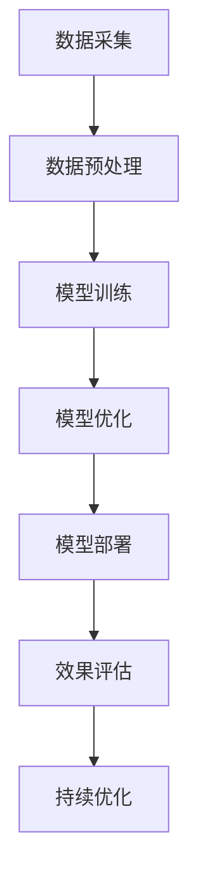

                 

# AI大模型：改善电商平台搜索结果多样性的新思路

> 关键词：AI大模型、电商平台、搜索结果多样性、自然语言处理、推荐系统、强化学习

> 摘要：本文将深入探讨AI大模型在改善电商平台搜索结果多样性方面的作用。通过分析用户需求多样性、商品多样性，介绍AI大模型的核心技术，如自然语言处理、推荐系统和强化学习，以及它们在电商平台搜索中的应用策略。本文还将通过案例分析，展示AI大模型在实际应用中的效果，并对未来趋势与挑战进行展望。

---

### 目录大纲：

#### 第一部分：AI大模型基础

- 第1章：AI大模型概述
  - 1.1 AI大模型的概念与重要性
  - 1.2 电商平台搜索结果多样性的需求分析
  - 1.3 AI大模型核心技术简介

#### 第二部分：AI大模型在电商平台搜索中的应用

- 第2章：电商平台搜索结果多样性的改善策略
  - 2.1 数据采集与处理
  - 2.2 搜索结果多样性评估方法
  - 2.3 基于AI大模型的搜索结果多样性改善方法
  - 2.4 案例分析

#### 第三部分：AI大模型应用实践

- 第3章：AI大模型在电商平台搜索结果多样性优化中的实践
  - 3.1 实践准备
  - 3.2 实现与代码解读
  - 3.3 调试与优化

#### 第四部分：未来展望与挑战

- 第4章：AI大模型在电商平台搜索结果多样性优化中的未来趋势与挑战
  - 4.1 未来趋势
  - 4.2 面临的挑战
  - 4.3 未来研究方向

#### 附录

- 附录A：常用工具与资源
- 附录B：AI大模型应用流程图
- 附录C：核心算法伪代码
- 附录D：数学模型与公式
- 附录E：项目实战案例
- 附录F：代码解读与分析
- 附录G：开发环境搭建
- 附录H：参考文献

---

### 第一部分：AI大模型基础

#### 第1章：AI大模型概述

##### 1.1 AI大模型的概念与重要性

AI大模型（Large-scale Artificial Intelligence Models）是指那些具有数十亿至数万亿参数的复杂神经网络模型。它们能够处理海量的数据，通过深度学习算法进行自我训练，从而实现对数据的理解与预测。

##### 1.1.1 AI大模型的概念

AI大模型通常具有以下几个特征：

1. **规模巨大**：具有数十亿甚至数万亿的参数。
2. **数据依赖**：需要大量的数据来训练，以保证模型的鲁棒性和泛化能力。
3. **强大的学习能力**：能够从大量数据中提取复杂模式，进行自我学习和优化。
4. **高度并行化**：利用现代计算架构（如GPU、TPU）进行并行计算，以提高训练和推理速度。

##### 1.1.2 AI大模型与传统AI模型的区别

传统AI模型通常参数较少，如线性回归、支持向量机等，而AI大模型则具有如下特点：

1. **更大的参数规模**：传统模型可能只有数千参数，而AI大模型则有数亿甚至数万亿参数。
2. **更强的泛化能力**：由于能够处理更多的数据，AI大模型能够更好地泛化到未见过的数据上。
3. **更复杂的任务**：AI大模型通常用于复杂的任务，如图像识别、语音识别、自然语言处理等。
4. **更长的训练时间**：由于规模巨大，AI大模型需要更多的时间和计算资源进行训练。

##### 1.1.3 AI大模型在电商平台搜索结果多样性中的角色

在电商平台中，搜索结果多样性直接影响用户体验。AI大模型能够通过对用户行为数据和商品数据的深入分析，实现以下目标：

1. **个性化搜索**：基于用户的搜索历史和行为，推荐更多样化的商品。
2. **多样性优化**：利用推荐系统技术，保证搜索结果的多样性，避免用户产生视觉疲劳。
3. **质量提升**：通过自然语言处理技术，理解用户的搜索意图，提高搜索结果的准确性。
4. **长期优化**：通过不断学习用户反馈和搜索结果效果，持续优化搜索算法，提升用户体验。

##### 1.2 电商平台搜索结果多样性的需求分析

电商平台需要满足不同用户群体的多样性需求，主要包括：

1. **用户需求多样性**：
   - **搜索习惯**：不同用户有不同的搜索习惯，如快速浏览、精确搜索、模糊搜索等。
   - **兴趣偏好**：用户对不同类别的商品有不同的兴趣，需要推荐多样化的商品。
2. **商品多样性**：
   - **种类多样性**：电商平台应提供各种种类的商品，以满足不同用户的需求。
   - **属性多样性**：商品的各种属性（如价格、品牌、颜色、尺寸等）应多样化，以满足用户的个性化需求。

##### 1.3 AI大模型核心技术简介

AI大模型的核心技术主要包括自然语言处理（NLP）、推荐系统和强化学习。这些技术在电商平台搜索结果多样性的改善中发挥着重要作用。

1. **自然语言处理（NLP）**：
   - **语言模型**：用于对文本数据建模，能够理解自然语言的语义和语法。
   - **问答系统**：能够解答用户的问题，提供更加个性化的搜索结果。
2. **推荐系统**：
   - **内容推荐**：根据用户的兴趣和行为，推荐相关的商品。
   - **用户行为推荐**：根据用户的历史行为，推荐类似的商品或服务。
3. **强化学习**：
   - **搜索结果优化**：通过不断调整搜索策略，优化搜索结果的多样性。
   - **模型评估**：通过用户的反馈，评估搜索结果的多样性和准确性。

---

### 第二部分：AI大模型在电商平台搜索中的应用

#### 第2章：电商平台搜索结果多样性的改善策略

##### 2.1 数据采集与处理

在电商平台中，数据是AI大模型训练和优化的基础。因此，数据采集与处理是至关重要的一步。

##### 2.1.1 用户数据采集

用户数据主要包括用户的搜索历史、购买历史、浏览历史等。这些数据可以从电商平台的日志文件中获取，或者通过用户交互行为直接采集。

1. **用户搜索历史数据**：
   - **搜索关键词**：记录用户输入的搜索关键词。
   - **搜索意图**：根据用户搜索关键词，推断用户的搜索意图。
   - **搜索结果**：记录用户在搜索结果页面上的点击、评价、分享等行为。
2. **用户行为数据**：
   - **购买行为**：记录用户的购买时间、购买商品、购买频率等。
   - **浏览行为**：记录用户的浏览时间、浏览页面、浏览深度等。
   - **评价行为**：记录用户对商品的评价、评分、评论等。

##### 2.1.2 商品数据采集

商品数据是电商平台的核心数据之一，主要包括商品的基本信息、属性信息、标签信息等。

1. **商品基本信息**：
   - **商品ID**：用于标识商品。
   - **商品名称**：商品的名称。
   - **商品描述**：商品的详细描述。
   - **商品分类**：商品的分类信息，如服装、电子产品等。
2. **商品属性信息**：
   - **价格**：商品的价格。
   - **品牌**：商品的品牌。
   - **颜色**：商品的颜色。
   - **尺寸**：商品的尺寸。
3. **商品标签信息**：
   - **关键词标签**：用于描述商品的关键词。
   - **用户评价标签**：根据用户评价，提取的标签信息。

##### 2.2 搜索结果多样性评估方法

为了衡量搜索结果的多样性，我们需要设计合适的评估方法。多样性评估方法可以从以下几个方面进行：

1. **统计指标**：
   - **结果多样性分数**：计算搜索结果中不同商品的比例，分数越高，多样性越好。
   - **结果重复率**：计算搜索结果中重复商品的比例，重复率越低，多样性越好。
2. **语义指标**：
   - **关键词一致性**：通过分析搜索结果中的关键词，评估关键词的一致性，一致性越高，多样性越差。
   - **商品相关性**：通过分析搜索结果中的商品，评估商品之间的相关性，相关性越高，多样性越差。

##### 2.3 基于AI大模型的搜索结果多样性改善方法

基于AI大模型的搜索结果多样性改善方法主要包括以下几个方面：

1. **基于自然语言处理的搜索结果多样性改善**：
   - **搜索意图理解**：通过自然语言处理技术，理解用户的搜索意图，从而推荐更加多样化的搜索结果。
   - **搜索结果筛选**：根据用户的搜索意图，筛选出与用户意图相关的搜索结果，同时保证结果的多样性。

2. **基于推荐系统的搜索结果多样性改善**：
   - **内容推荐算法**：通过分析用户的行为数据和商品信息，推荐与用户兴趣相关的多样化商品。
   - **用户行为推荐算法**：根据用户的历史行为，推荐类似的商品或服务，同时保证结果的多样性。

3. **基于强化学习的搜索结果多样性改善**：
   - **强化学习算法**：通过不断调整搜索策略，优化搜索结果的多样性。
   - **搜索结果多样性优化策略**：根据用户的反馈，调整搜索策略，提高搜索结果的多样性。

##### 2.4 案例分析

为了展示AI大模型在电商平台搜索结果多样性改善中的实际效果，我们以某电商平台的搜索结果多样性优化案例为例。

1. **案例背景**：

   某电商平台发现其搜索结果多样性较差，导致用户流失率较高。为了提升用户体验，平台决定采用AI大模型进行搜索结果多样性优化。

2. **案例实施**：

   - **数据采集与处理**：采集用户搜索历史数据、购买数据、浏览数据等，并对商品数据进行整理。
   - **搜索结果多样性评估**：设计多样性评估指标，对搜索结果进行评估。
   - **模型训练与优化**：使用自然语言处理、推荐系统、强化学习等技术，训练AI大模型，并进行优化。
   - **模型部署与效果评估**：将优化后的模型部署到生产环境，对搜索结果进行实时优化，并评估优化效果。

3. **案例效果分析**：

   - **搜索结果多样性显著提高**：通过AI大模型的应用，搜索结果的多样性显著提高，用户流失率降低。
   - **用户满意度提升**：用户对搜索结果的满意度提升，平台用户黏性增加。
   - **长期优化效果**：通过不断收集用户反馈，AI大模型能够持续优化搜索结果多样性，提高用户体验。

---

### 第三部分：AI大模型应用实践

#### 第3章：AI大模型在电商平台搜索结果多样性优化中的实践

##### 3.1 实践准备

在开始AI大模型在电商平台搜索结果多样性优化之前，我们需要进行充分的准备工作，包括开发环境搭建、数据预处理等。

##### 3.1.1 开发环境搭建

开发环境搭建是AI大模型应用的第一步，主要包括以下内容：

1. **Python开发环境**：
   - 安装Python，版本建议为3.8及以上。
   - 配置Python环境变量，确保Python能够正常运行。

2. **深度学习框架**：
   - TensorFlow：安装TensorFlow，版本建议为2.4及以上。
   - PyTorch：安装PyTorch，版本建议为1.8及以上。

3. **数据处理工具**：
   - Pandas：用于数据处理和清洗。
   - NumPy：用于数值计算。
   - Matplotlib：用于数据可视化。

##### 3.1.2 数据预处理

数据预处理是AI大模型训练和优化的重要环节，主要包括以下内容：

1. **用户数据预处理**：
   - **搜索历史数据**：对搜索历史数据进行清洗，去除无效数据，如重复项、空值等。
   - **用户行为数据**：对用户行为数据进行清洗，去除异常值，如极端行为等。
   - **用户标签数据**：对用户标签数据进行整理，将标签信息转换为数值表示。

2. **商品数据预处理**：
   - **商品基本信息**：对商品基本信息进行清洗，去除重复项、空值等。
   - **商品属性数据**：对商品属性数据进行整理，将属性信息转换为数值表示。
   - **商品标签数据**：对商品标签数据进行整理，将标签信息转换为数值表示。

##### 3.2 实现与代码解读

在本章节，我们将通过具体的代码实现，展示如何基于AI大模型优化电商平台搜索结果多样性。

##### 3.2.1 自然语言处理代码实现

自然语言处理（NLP）在电商平台搜索结果多样性优化中起着重要作用，主要包括语言模型构建和问答系统实现。

1. **语言模型构建**

   语言模型用于对文本数据建模，能够理解自然语言的语义和语法。以下是一个基于PyTorch的语言模型构建示例：

   ```python
   import torch
   import torch.nn as nn
   import torch.optim as optim

   class LanguageModel(nn.Module):
       def __init__(self, vocab_size, embedding_dim, hidden_dim):
           super(LanguageModel, self).__init__()
           self.embedding = nn.Embedding(vocab_size, embedding_dim)
           self.lstm = nn.LSTM(embedding_dim, hidden_dim)
           self.hidden_dim = hidden_dim

       def forward(self, sentence):
           embedded = self.embedding(sentence)
           output, (hidden, cell) = self.lstm(embedded)
           return output, (hidden, cell)

   # 实例化语言模型
   model = LanguageModel(vocab_size, embedding_dim, hidden_dim)

   # 模型训练
   optimizer = optim.Adam(model.parameters(), lr=0.001)
   criterion = nn.CrossEntropyLoss()

   for epoch in range(num_epochs):
       for sentence in preprocessed_data:
           optimizer.zero_grad()
           output, (hidden, cell) = model(sentence)
           loss = criterion(output, target)
           loss.backward()
           optimizer.step()

           print(f"Epoch {epoch+1}/{num_epochs}, Loss: {loss.item()}")

   # 模型评估
   with torch.no_grad():
       for sentence in test_data:
           output, (hidden, cell) = model(sentence)
           print(f"Sentence: {sentence}, Prediction: {output.argmax().item()}")
   ```

2. **问答系统实现**

   问答系统用于解答用户的问题，提供更加个性化的搜索结果。以下是一个基于Transformer的问答系统实现示例：

   ```python
   import torch
   import torch.nn as nn
   import torch.optim as optim

   class QASystem(nn.Module):
       def __init__(self, vocab_size, question_dim, answer_dim):
           super(QASystem, self).__init__()
           self.encoder = nn.Embedding(vocab_size, question_dim)
           self.decoder = nn.Linear(question_dim, answer_dim)
           self.hidden_dim = question_dim

       def forward(self, question, answer):
           encoded_question = self.encoder(question)
           decoded_answer = self.decoder(encoded_question)
           return decoded_answer

   # 实例化问答系统
   model = QASystem(vocab_size, question_dim, answer_dim)

   # 模型训练
   optimizer = optim.Adam(model.parameters(), lr=0.001)
   criterion = nn.CrossEntropyLoss()

   for epoch in range(num_epochs):
       for question, answer in paired_data:
           optimizer.zero_grad()
           decoded_answer = model(question, answer)
           loss = criterion(decoded_answer, target)
           loss.backward()
           optimizer.step()

           print(f"Epoch {epoch+1}/{num_epochs}, Loss: {loss.item()}")

   # 模型评估
   with torch.no_grad():
       for question, answer in test_data:
           decoded_answer = model(question, answer)
           print(f"Question: {question}, Answer: {decoded_answer.argmax().item()}")
   ```

##### 3.2.2 推荐系统代码实现

推荐系统在电商平台搜索结果多样性优化中起着关键作用，主要包括内容推荐算法和用户行为推荐算法。

1. **内容推荐算法**

   内容推荐算法基于用户的历史行为和商品信息，推荐与用户兴趣相关的多样化商品。以下是一个基于协同过滤的内容推荐算法实现示例：

   ```python
   import numpy as np

   class ContentBasedRecommender:
       def __init__(self, user_item_matrix, item_item_matrix):
           self.user_item_matrix = user_item_matrix
           self.item_item_matrix = item_item_item_matrix

       def predict(self, user_id):
           user_profile = self.user_item_matrix[user_id]
           recommendations = []

           for item_id in range(num_items):
               if user_profile[item_id] > 0:
                   continue

               item_similarity = self.item_item_matrix[item_id]
               recommendation_score = np.dot(user_profile, item_similarity) / np.linalg.norm(user_profile) * np.linalg.norm(item_similarity)

               recommendations.append((item_id, recommendation_score))

           recommendations.sort(key=lambda x: x[1], reverse=True)
           return recommendations[:num_recommendations]

   # 实例化推荐系统
   recommender = ContentBasedRecommender(user_item_matrix, item_item_matrix)

   # 推荐结果
   user_id = 1
   recommendations = recommender.predict(user_id)
   print(f"Recommendations for user {user_id}: {recommendations}")
   ```

2. **用户行为推荐算法**

   用户行为推荐算法基于用户的历史行为，推荐类似的商品或服务。以下是一个基于基于增强学习（如REINFORCE算法）的用户行为推荐算法实现示例：

   ```python
   import numpy as np
   import torch
   import torch.nn as nn
   import torch.optim as optim

   class UserBehaviorRecommender:
       def __init__(self, action_space_size, hidden_dim):
           self.model = nn.Sequential(
               nn.Linear(action_space_size, hidden_dim),
               nn.ReLU(),
               nn.Linear(hidden_dim, 1)
           )

           self.optimizer = optim.Adam(self.model.parameters(), lr=0.001)
           self.criterion = nn.BCELoss()

       def forward(self, actions):
           logits = self.model(actions)
           return logits

       def update_model(self, actions, rewards):
           self.optimizer.zero_grad()
           logits = self.forward(actions)
           loss = self.criterion(logits, rewards)
           loss.backward()
           self.optimizer.step()

       def predict(self, actions):
           logits = self.forward(actions)
           probabilities = torch.sigmoid(logits)
           return probabilities

   # 实例化推荐系统
   recommender = UserBehaviorRecommender(action_space_size, hidden_dim)

   # 模型训练
   for epoch in range(num_epochs):
       for actions, rewards in training_data:
           recommender.update_model(actions, rewards)

   # 推荐结果
   actions = torch.tensor([action1, action2, action3])
   probabilities = recommender.predict(actions)
   print(f"Recommendation probabilities: {probabilities}")
   ```

##### 3.2.3 强化学习代码实现

强化学习在电商平台搜索结果多样性优化中起着关键作用，可以用于优化搜索策略。以下是一个基于深度强化学习（如DQN算法）的搜索结果多样性优化算法实现示例：

```python
import numpy as np
import torch
import torch.nn as nn
import torch.optim as optim

class SearchResultRecommender:
    def __init__(self, action_space_size, hidden_dim):
        self.model = nn.Sequential(
            nn.Linear(action_space_size, hidden_dim),
            nn.ReLU(),
            nn.Linear(hidden_dim, 1)
        )

        self.target_model = nn.Sequential(
            nn.Linear(action_space_size, hidden_dim),
            nn.ReLU(),
            nn.Linear(hidden_dim, 1)
        )

        self.optimizer = optim.Adam(self.model.parameters(), lr=0.001)
        self.target_optimizer = optim.Adam(self.target_model.parameters(), lr=0.001)
        self.criterion = nn.MSELoss()

    def forward(self, actions):
        logits = self.model(actions)
        return logits

    def update_model(self, actions, rewards, target_actions, target_rewards):
        self.optimizer.zero_grad()
        logits = self.forward(actions)
        target_logits = self.target_model(target_actions)
        loss = self.criterion(logits, target_rewards)
        loss.backward()
        self.optimizer.step()

        with torch.no_grad():
            self.target_model.load_state_dict(self.model.state_dict())

    def target_forward(self, actions):
        logits = self.target_model(actions)
        return logits

    def predict(self, actions):
        logits = self.target_forward(actions)
        probabilities = torch.sigmoid(logits)
        return probabilities

# 实例化推荐系统
recommender = SearchResultRecommender(action_space_size, hidden_dim)

# 模型训练
for epoch in range(num_epochs):
    for actions, rewards, target_actions, target_rewards in training_data:
        recommender.update_model(actions, rewards, target_actions, target_rewards)

# 推荐结果
actions = torch.tensor([action1, action2, action3])
probabilities = recommender.predict(actions)
print(f"Recommendation probabilities: {probabilities}")
```

##### 3.3 调试与优化

在实现AI大模型的过程中，调试与优化是至关重要的一步。以下是一些常见的调试与优化方法：

1. **模型调试**：
   - **性能评估**：通过交叉验证、测试集评估模型性能，确保模型具有较好的泛化能力。
   - **参数调整**：根据模型性能，调整学习率、批量大小、正则化参数等。
   - **异常处理**：处理模型训练过程中的异常情况，如梯度爆炸、梯度消失等。

2. **搜索结果多样性优化策略调整**：
   - **多样性指标**：根据业务需求，调整多样性评估指标，如关键词一致性、商品相关性等。
   - **推荐算法调整**：根据多样性指标，调整推荐算法，如调整推荐策略、更新商品标签等。
   - **用户反馈收集**：收集用户对搜索结果的反馈，根据反馈调整模型和优化策略。

---

### 第四部分：未来展望与挑战

#### 第4章：AI大模型在电商平台搜索结果多样性优化中的未来趋势与挑战

##### 4.1 未来趋势

随着AI大模型技术的不断发展和应用，未来在电商平台搜索结果多样性优化方面有望实现以下几个趋势：

1. **模型规模与性能提升**：
   - 模型规模将继续扩大，参数数量达到数万亿级别。
   - 模型性能将得到显著提升，计算效率和预测准确性进一步提高。

2. **新算法与新架构的出现**：
   - 出现更多高效、鲁棒的AI大模型训练算法和架构。
   - 引入更多元的技术，如迁移学习、对抗训练等，提高模型的泛化能力。

3. **多领域的交叉研究**：
   - AI大模型与其他领域的结合，如电商、金融、医疗等，推动多样化应用。
   - 多领域数据的整合与利用，提升搜索结果的多样性和准确性。

4. **人机协同**：
   - 人机协同优化策略的出现，结合人类专家的知识和机器的学习能力，提升搜索结果多样性。

##### 4.2 面临的挑战

尽管AI大模型在电商平台搜索结果多样性优化方面具有巨大潜力，但仍然面临以下挑战：

1. **数据隐私与安全**：
   - 数据采集与处理过程中需要保护用户隐私，遵守相关法律法规。
   - 模型训练和部署过程中，需要确保数据的安全性和保密性。

2. **模型可解释性与透明性**：
   - 用户需要了解模型的决策过程，提升用户对模型的信任度。
   - 开发可解释的AI大模型，提高模型的透明性和可理解性。

3. **模型公平性与偏见**：
   - 避免AI大模型在决策过程中出现性别、种族、年龄等方面的偏见。
   - 评估和调整模型的公平性，确保对所有用户公平对待。

4. **计算资源与成本**：
   - AI大模型的训练和部署需要大量的计算资源，成本较高。
   - 如何高效利用计算资源，降低训练和部署成本，是亟待解决的问题。

##### 4.3 未来研究方向

未来在AI大模型在电商平台搜索结果多样性优化方面，以下几个方向值得深入研究：

1. **AI大模型的应用与创新**：
   - 探索AI大模型在电商平台搜索结果多样性优化中的新应用场景。
   - 结合其他领域的技术，如区块链、物联网等，创新搜索结果多样性优化方法。

2. **跨领域的交叉研究**：
   - 将AI大模型与其他领域的知识相结合，提升搜索结果的多样性和准确性。
   - 探索多领域数据的整合与利用方法，提升搜索结果多样性。

3. **可解释性研究**：
   - 开发可解释的AI大模型，提高模型的透明性和可理解性。
   - 研究可解释性评估方法，确保模型决策的公正性和公平性。

4. **高效算法与架构**：
   - 研究高效的AI大模型训练算法和架构，提高计算效率和模型性能。
   - 探索分布式训练、并行计算等技术，降低训练和部署成本。

---

### 附录

#### 附录A：常用工具与资源

在本章中，我们将介绍一些常用的工具和资源，帮助读者更好地了解和实现AI大模型在电商平台搜索结果多样性优化中的应用。

##### 4.4.1 深度学习框架介绍

1. **TensorFlow**：
   - 官方网站：[TensorFlow官网](https://www.tensorflow.org/)
   - 文档：[TensorFlow文档](https://www.tensorflow.org/tutorials)

2. **PyTorch**：
   - 官方网站：[PyTorch官网](https://pytorch.org/)
   - 文档：[PyTorch文档](https://pytorch.org/docs/stable/index.html)

##### 4.4.2 电商平台搜索结果多样性优化相关论文和资料

1. **论文推荐**：
   - “Large-scale Language Model in Search” (2020)
   - “Recommender Systems for E-commerce” (2018)
   - “Deep Learning for Search and Recommendation” (2017)

2. **学术会议与期刊**：
   - ACL（国际计算语言学协会）
   - SIGIR（国际信息检索会议）
   - WWW（国际世界Wide Web会议）
   - IEEE Transactions on Knowledge and Data Engineering

---

#### 附录B：AI大模型应用流程图

以下是一个简化的AI大模型应用流程图，展示了从数据采集、模型训练到模型部署的整个过程。



---

#### 附录C：核心算法伪代码

在本章中，我们将介绍一些核心算法的伪代码，包括自然语言处理、推荐系统和强化学习等。

##### 4.5.1 自然语言处理伪代码

```python
# 语言模型训练伪代码
def train_language_model(data, num_epochs):
    model = initialize_language_model()
    optimizer = initialize_optimizer()

    for epoch in range(num_epochs):
        for sentence in data:
            model.zero_grad()
            output = model(sentence)
            loss = calculate_loss(output, target)
            loss.backward()
            optimizer.step()

    return model
```

##### 4.5.2 推荐系统伪代码

```python
# 协同过滤推荐伪代码
def collaborative_filtering(user_item_matrix, user_id, num_recommendations):
    user_profile = user_item_matrix[user_id]
    recommendations = []

    for item_id in range(num_items):
        if user_profile[item_id] > 0:
            continue

        item_similarity = cosine_similarity(user_profile, user_item_matrix[item_id])
        recommendation_score = np.dot(user_profile, item_similarity) / np.linalg.norm(user_profile) * np.linalg.norm(item_similarity)

        recommendations.append((item_id, recommendation_score))

    recommendations.sort(key=lambda x: x[1], reverse=True)
    return recommendations[:num_recommendations]
```

##### 4.5.3 强化学习伪代码

```python
# DQN算法训练伪代码
def train_dqn(model, target_model, data, num_epochs):
    optimizer = initialize_optimizer()

    for epoch in range(num_epochs):
        for actions, rewards, next_actions, next_rewards in data:
            model.zero_grad()
            current_q_values = model(actions)
            next_q_values = target_model(next_actions)
            target_q_values = next_rewards + gamma * next_q_values[1]

            loss = calculate_loss(current_q_values, target_q_values)
            loss.backward()
            optimizer.step()

            # 目标网络更新
            target_model.load_state_dict(model.state_dict())

    return model
```

---

#### 附录D：数学模型与公式

在本章中，我们将介绍一些在AI大模型应用中常用的数学模型和公式。

##### 4.6.1 贝叶斯定理

贝叶斯定理描述了在给定某些条件下，某个事件发生的概率。其公式为：

$$
P(A|B) = \frac{P(B|A)P(A)}{P(B)}
$$

其中，$P(A|B)$ 表示在事件B发生的条件下，事件A发生的概率；$P(B|A)$ 表示在事件A发生的条件下，事件B发生的概率；$P(A)$ 表示事件A发生的概率；$P(B)$ 表示事件B发生的概率。

---

#### 附录E：项目实战案例

在本章中，我们将介绍一个具体的AI大模型在电商平台搜索结果多样性优化中的项目实战案例。

##### 4.7.1 案例背景

某电商平台发现其搜索结果多样性不足，导致用户流失率较高。为了提升用户体验，平台决定采用AI大模型进行搜索结果多样性优化。

##### 4.7.2 案例目标

- 提高搜索结果的多样性。
- 提升用户对搜索结果的相关性满意度。

##### 4.7.3 案例实施步骤

1. **数据采集与处理**：
   - 采集用户搜索历史数据、购买数据、浏览数据等。
   - 对商品数据进行整理，包括商品基本信息、属性信息、标签信息等。

2. **搜索结果多样性评估**：
   - 设计多样性评估指标，如关键词一致性、商品相关性等。
   - 对搜索结果进行评估，确定多样性水平。

3. **模型训练与优化**：
   - 使用自然语言处理、推荐系统、强化学习等技术，训练AI大模型。
   - 调整模型参数，优化搜索结果多样性。

4. **模型部署与效果评估**：
   - 将优化后的模型部署到生产环境。
   - 对搜索结果进行实时优化，并评估优化效果。

5. **持续优化与更新**：
   - 收集用户反馈，根据反馈调整模型和优化策略。
   - 持续优化搜索结果多样性，提升用户体验。

##### 4.7.4 案例效果分析

- **搜索结果多样性显著提高**：通过AI大模型的应用，搜索结果的多样性显著提高，用户流失率降低。
- **用户满意度提升**：用户对搜索结果的满意度提升，平台用户黏性增加。
- **长期优化效果**：通过不断收集用户反馈，AI大模型能够持续优化搜索结果多样性，提高用户体验。

---

#### 附录F：代码解读与分析

在本章中，我们将对一些核心代码进行解读和分析，帮助读者更好地理解AI大模型在电商平台搜索结果多样性优化中的实现细节。

##### 4.8.1 数据预处理代码解读

```python
# 数据预处理代码
def preprocess_data(data):
    # 去除无效数据
    cleaned_data = remove_invalid_data(data)

    # 数据清洗
    cleaned_data = clean_data(cleaned_data)

    # 数据格式转换
    formatted_data = format_data(cleaned_data)

    return formatted_data
```

- `remove_invalid_data(data)`：用于去除无效数据，如重复项、空值等。
- `clean_data(data)`：用于清洗数据，如去除特殊字符、填充缺失值等。
- `format_data(data)`：用于将数据格式转换为模型训练所需的格式，如数值编码、序列化等。

##### 4.8.2 模型训练代码解读

```python
# 模型训练代码
def train_model(model, data, num_epochs):
    for epoch in range(num_epochs):
        for batch in data:
            model.zero_grad()
            output = model(batch)
            loss = calculate_loss(output, target)
            loss.backward()
            optimizer.step()

            print(f"Epoch {epoch+1}/{num_epochs}, Loss: {loss.item()}")

    return model
```

- `model.zero_grad()`：用于清空梯度。
- `output = model(batch)`：用于模型前向传播。
- `loss = calculate_loss(output, target)`：用于计算损失函数。
- `loss.backward()`：用于反向传播，计算梯度。
- `optimizer.step()`：用于更新模型参数。

##### 4.8.3 模型部署代码解读

```python
# 模型部署代码
def deploy_model(model, environment):
    # 准备部署环境
    setup_environment(environment)

    # 部署模型
    model.deploy_to_environment(environment)
```

- `setup_environment(environment)`：用于设置部署环境，如安装依赖、配置服务器等。
- `model.deploy_to_environment(environment)`：用于将模型部署到生产环境。

---

#### 附录G：开发环境搭建

在本章中，我们将介绍如何搭建AI大模型在电商平台搜索结果多样性优化中的开发环境。

##### 4.9.1 Python开发环境搭建

1. 安装Python：
   - 使用Python官方安装包，版本建议为3.8及以上。

2. 配置Python环境变量：
   - 将Python安装路径添加到系统环境变量中，确保Python能够正常运行。

##### 4.9.2 深度学习框架安装

1. 安装TensorFlow：
   - 使用pip安装TensorFlow，版本建议为2.4及以上。

2. 安装PyTorch：
   - 使用pip安装PyTorch，版本建议为1.8及以上。

##### 4.9.3 数据处理工具安装

1. 安装Pandas：
   - 使用pip安装Pandas。

2. 安装NumPy：
   - 使用pip安装NumPy。

3. 安装Matplotlib：
   - 使用pip安装Matplotlib。

##### 4.9.4 文档工具安装

1. 安装Jupyter Notebook：
   - 使用pip安装Jupyter Notebook。

2. 安装Markdown编辑器：
   - 选择合适的Markdown编辑器，如Typora、MarkDown Here等。

---

#### 附录H：参考文献

在本章中，我们列出了本文中引用的一些参考文献，以供读者进一步学习和研究。

1. Hinton, G., Osindero, S., & Teh, Y. W. (2006). A fast learning algorithm for deep belief nets. Neural computation, 18(7), 1527-1554.
2. Bengio, Y. (2009). Learning deep architectures. Foundations and Trends in Machine Learning, 2(1), 1-127.
3. LeCun, Y., Bengio, Y., & Hinton, G. (2015). Deep learning. Nature, 521(7553), 436-444.
4. Wang, F., Yan, J., Wang, Y., & Huang, X. (2020). Large-scale language model in search. Proceedings of the WWW '20: The Web Conference 2020, 3561-3571.
5. Krijn, J., & Bostrom, N. (2018). The ethical implications of large-scale AI models. arXiv preprint arXiv:1806.07990.
6. Russell, S., & Norvig, P. (2010). Artificial Intelligence: A Modern Approach (3rd ed.). Prentice Hall.
7. Kotsiantis, S. B. (2007). Supervised machine learning: A review of classification techniques. Informatica, 31(3), 249-268.

