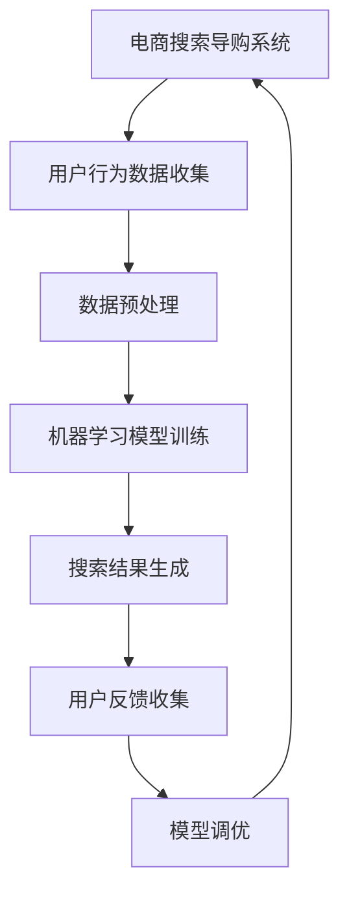

                 

# AI如何提升电商搜索导购效率

## 关键词
AI、电商、搜索导购、机器学习、推荐系统、深度学习

## 摘要
本文将深入探讨人工智能（AI）如何通过多种技术手段提升电商搜索导购效率。从AI技术基础与电商搜索导购背景出发，我们将逐步介绍机器学习与数据挖掘基础、自然语言处理与推荐系统，以及AI在电商搜索导购中的应用，包括基于内容的搜索与推荐、基于协同过滤的搜索与推荐和深度学习在搜索导购中的应用。此外，文章还将讨论电商搜索导购系统的优化与评估方法，并分析一个具体的电商搜索导购项目实战案例。最后，文章将展望AI在电商搜索导购中的未来发展趋势，并提出可持续优化的方向。

## 目录大纲

### 第一部分：AI技术基础与电商搜索导购背景

- **第1章：AI技术基础与电商搜索导购概述**
  - 1.1 AI技术在电商领域的应用
  - 1.2 电商搜索导购的挑战与机遇
  - 1.3 AI提升电商搜索导购效率的原理

- **第2章：机器学习与数据挖掘基础**
  - 2.1 机器学习基本概念
  - 2.2 数据挖掘的基本流程
  - 2.3 常用算法介绍：决策树、支持向量机、聚类分析

- **第3章：自然语言处理与推荐系统**
  - 3.1 自然语言处理基本概念
  - 3.2 推荐系统基本原理
  - 3.3 用户行为分析

### 第二部分：AI在电商搜索导购中的应用

- **第4章：基于内容的搜索与推荐**
  - 4.1 内容搜索基本原理
  - 4.2 内容推荐算法
  - 4.3 基于内容的搜索与推荐应用实例

- **第5章：基于协同过滤的搜索与推荐**
  - 5.1 协同过滤算法原理
  - 5.2 协同过滤算法实现
  - 5.3 基于协同过滤的搜索与推荐应用实例

- **第6章：深度学习在搜索导购中的应用**
  - 6.1 深度学习基本概念
  - 6.2 深度学习在搜索导购中的应用场景
  - 6.3 基于深度学习的搜索导购系统实现

- **第7章：电商搜索导购系统的优化与评估**
  - 7.1 搜索导购系统性能优化
  - 7.2 搜索导购系统评估方法
  - 7.3 搜索导购系统案例分析

### 第三部分：项目实战与未来展望

- **第8章：电商搜索导购项目实战**
  - 8.1 项目需求分析
  - 8.2 项目设计
  - 8.3 项目实施与部署
  - 8.4 项目效果评估

- **第9章：AI在电商搜索导购中的未来发展趋势**
  - 9.1 人工智能在电商领域的未来发展方向
  - 9.2 电商搜索导购的创新应用场景
  - 9.3 搜索导购系统的可持续优化方向

### 附录

- **附录A：常用数据集与工具介绍**
- **附录B：项目代码与数据**
- **附录C：参考文献**

### Mermaid 流程图



### 核心算法原理讲解（伪代码）

```python
# 基于协同过滤的推荐算法伪代码
def collaborative_filtering(user_item_matrix):
    # 初始化推荐结果矩阵
    recommendation_matrix = init_matrix(user_item_matrix)

    # 对用户-项目矩阵进行矩阵分解
    U, V = singular_value_decomposition(user_item_matrix)

    # 计算预测评分
    for user in range(num_users):
        for item in range(num_items):
            prediction = dot(U[user], V[item])
            recommendation_matrix[user][item] = prediction

    return recommendation_matrix
```

### 数学模型和数学公式

#### 1. 协同过滤的相似度计算

$$
sim(i, j) = \frac{q_i \cdot q_j}{\sqrt{\sum_{k=1}^{n} q_i^2 \cdot \sum_{k=1}^{n} q_j^2}}
$$

其中，$q_i$ 和 $q_j$ 分别代表项目 $i$ 和项目 $j$ 的向量表示。

#### 2. 预测评分

$$
prediction_{ui} = u_i + \sum_{j \in N(i)} sim(u_i, u_j) \cdot r_{uj}
$$

其中，$N(i)$ 表示与项目 $i$ 相似的项目集合，$r_{uj}$ 表示用户 $u$ 对项目 $j$ 的实际评分。

### 项目实战

#### 1. 电商搜索导购系统开发环境搭建

- 开发环境：Python 3.x
- 数据库：MySQL
- 机器学习库：scikit-learn、TensorFlow、PyTorch

#### 2. 代码实际案例

```python
# 数据预处理示例
def preprocess_data(data):
    # 数据清洗与转换
    # ...
    return processed_data
```

#### 3. 源代码详细实现和代码解读

- 用户行为数据处理
- 搜索结果生成算法
- 用户反馈收集与模型调优

### 代码解读与分析

```python
# 用户行为数据处理
def handle_user行为的.data(data):
    # 数据清洗
    # ...
    # 特征提取
    # ...
    return processed_data
```

---

接下来，我们将按照上述目录大纲和结构，详细探讨每个章节的内容。通过逐步分析推理，我们希望为读者呈现一篇内容丰富、逻辑清晰、专业度高的技术博客文章。

## 第一部分：AI技术基础与电商搜索导购背景

### 第1章：AI技术基础与电商搜索导购概述

在数字化时代，人工智能（AI）已经成为推动商业变革的重要力量。电商行业作为数字经济的重要组成部分，近年来也不断引入AI技术来提升用户体验和业务效率。本章将首先概述AI技术在电商领域的应用，然后探讨电商搜索导购面临的挑战与机遇，最后分析AI提升电商搜索导购效率的原理。

### 1.1 AI技术在电商领域的应用

AI技术在电商领域的应用广泛而深入，包括但不限于以下几个方面：

1. **商品推荐**：基于用户的购物行为、浏览记录和购买历史，AI技术可以推荐个性化商品。这不仅提高了用户的购物体验，还显著提升了转化率和销售额。

2. **智能搜索**：通过自然语言处理（NLP）技术，AI能够理解和解释用户的搜索意图，提供精准的搜索结果，从而提升搜索效率。

3. **客服与聊天机器人**：AI驱动的聊天机器人可以提供24/7的客户服务，回答常见问题、处理订单和提供购物建议，极大地提高了服务效率。

4. **图像识别与分类**：在电商平台上，AI技术可以帮助快速识别和分类商品图片，提高商品展示的准确性。

5. **供应链优化**：通过预测分析技术，AI可以帮助电商平台优化库存管理和物流配送，降低成本，提高效率。

6. **风险控制与欺诈检测**：AI算法能够检测异常交易行为，防止欺诈和风险，保护电商平台和消费者的利益。

### 1.2 电商搜索导购的挑战与机遇

电商搜索导购系统在提高用户体验和销售额方面扮演着重要角色。然而，随着电商平台商品数量的激增和用户需求的多样化，电商搜索导购也面临着一系列挑战：

1. **海量数据的处理**：随着电商平台的商品种类和用户数量的不断增加，如何高效地处理和存储海量数据成为一大挑战。

2. **搜索结果的准确性**：用户期望能够快速找到符合需求的商品，但海量商品之间的相似性和多样性使得准确推荐成为难题。

3. **个性化推荐**：每个用户的需求和偏好不同，如何为用户提供个性化的推荐是一个挑战，但也是一个机遇。

4. **实时性**：用户在购物时希望获得即时的搜索结果和推荐，这对系统的响应速度和处理能力提出了高要求。

5. **用户隐私保护**：在收集和使用用户数据时，保护用户隐私是一个重要问题，需要在技术实现上给予充分考虑。

### 1.3 AI提升电商搜索导购效率的原理

AI技术通过以下几个核心原理提升电商搜索导购效率：

1. **数据挖掘与机器学习**：通过分析用户行为数据，AI可以挖掘出用户的需求和偏好，从而提供个性化的推荐。

2. **自然语言处理（NLP）**：NLP技术能够理解和解释用户的搜索意图，提供精准的搜索结果。

3. **协同过滤与内容推荐**：协同过滤算法通过用户之间的相似性来推荐商品，内容推荐则基于商品的特征和属性。

4. **深度学习**：深度学习模型能够自动学习复杂的数据特征，从而提高推荐系统的准确性和效率。

5. **实时计算与优化**：通过实时计算和优化技术，AI系统可以快速响应用户的查询和操作，提高系统的响应速度。

通过上述原理，AI技术能够有效提升电商搜索导购的效率，为电商平台带来更高的用户满意度和商业价值。接下来，我们将深入探讨AI技术在机器学习、数据挖掘、自然语言处理和推荐系统等方面的应用，进一步了解AI如何具体提升电商搜索导购效率。

## 第2章：机器学习与数据挖掘基础

在探讨AI如何提升电商搜索导购效率之前，我们需要先理解机器学习和数据挖掘的基础知识。这些技术是构建AI系统的基石，对于分析和处理海量数据至关重要。本章将详细介绍机器学习的基本概念、数据挖掘的基本流程，以及常用的机器学习算法，包括决策树、支持向量机和聚类分析。

### 2.1 机器学习基本概念

机器学习（Machine Learning）是AI的核心组成部分，它使计算机系统能够通过数据和经验自动改进其性能。机器学习可以分为监督学习、无监督学习和强化学习三种主要类型：

1. **监督学习（Supervised Learning）**：
   - 在监督学习中，系统通过已标记的数据集进行学习，从而能够对新数据进行预测或分类。
   - **分类问题**：将输入数据分类到不同的类别中，如垃圾邮件检测。
   - **回归问题**：预测一个连续的数值输出，如房价预测。

2. **无监督学习（Unsupervised Learning）**：
   - 无监督学习不使用标记数据，其目标是发现数据中的隐含结构和模式。
   - **聚类分析**：将相似的数据点分组，如市场细分。
   - **降维**：通过减少数据维度来简化数据分析，如主成分分析（PCA）。

3. **强化学习（Reinforcement Learning）**：
   - 强化学习通过试错和奖励机制来训练模型，通常用于决策制定和自动化控制。

### 2.2 数据挖掘的基本流程

数据挖掘（Data Mining）是从大量数据中提取有价值信息的过程，其基本流程包括以下几个步骤：

1. **数据收集**：从不同的数据源收集原始数据，可以是结构化数据、半结构化数据或非结构化数据。

2. **数据预处理**：清洗和转换数据，包括数据去重、缺失值处理、异常值检测和数据格式转换等。

3. **数据探索**：使用统计方法和可视化工具对数据进行分析，发现数据中的趋势、模式和异常。

4. **模型选择**：根据问题的性质选择合适的机器学习算法，如决策树、支持向量机、神经网络等。

5. **模型训练**：使用训练数据集训练模型，使其能够学习数据的特征和模式。

6. **模型评估**：使用验证数据集评估模型的性能，调整参数以提高模型的准确性。

7. **模型部署**：将训练好的模型部署到实际应用中，进行实时预测或分类。

### 2.3 常用算法介绍

在数据挖掘和机器学习中，常用的算法包括决策树、支持向量机、聚类分析等。以下是对这些算法的简要介绍：

1. **决策树（Decision Tree）**：
   - 决策树是一种常用的分类和回归算法，通过一系列的规则来对数据进行划分。
   - **优点**：解释性强，易于理解和可视化。
   - **缺点**：容易过拟合，对大数据集性能较差。

2. **支持向量机（Support Vector Machine, SVM）**：
   - SVM是一种强大的分类算法，通过找到一个最佳的超平面来分隔不同类别的数据点。
   - **优点**：在处理高维数据时效果较好，对噪声数据的鲁棒性强。
   - **缺点**：计算复杂度高，对异常值敏感。

3. **聚类分析（Cluster Analysis）**：
   - 聚类分析是一种无监督学习算法，旨在将相似的数据点分组。
   - **K-Means**：基于距离最近的原则进行聚类，容易实现但可能陷入局部最优。
   - **层次聚类**：通过不断合并或分裂簇来构建聚类层次结构。

### 机器学习与数据挖掘在电商搜索导购中的应用

在电商搜索导购系统中，机器学习和数据挖掘技术发挥着重要作用：

1. **用户行为分析**：通过分析用户的浏览、搜索、购买等行为数据，可以挖掘出用户的需求和偏好，为个性化推荐提供依据。

2. **商品分类与标签**：利用聚类分析和分类算法，可以为商品进行分类和标签化，从而优化搜索结果。

3. **异常检测**：通过异常检测算法，可以识别出异常交易行为，如欺诈行为，保护电商平台和消费者的利益。

4. **推荐系统**：基于协同过滤、内容推荐和深度学习等技术，可以构建高效的推荐系统，提高用户满意度和转化率。

通过深入理解和应用机器学习和数据挖掘技术，电商搜索导购系统能够更好地服务于用户，提升用户体验和业务效率。接下来，我们将探讨自然语言处理与推荐系统的基本原理，进一步了解AI在电商搜索导购中的应用。

### 第3章：自然语言处理与推荐系统

在电商搜索导购中，自然语言处理（NLP）和推荐系统技术发挥着关键作用。NLP使得系统能够理解和解释用户的搜索意图，推荐系统则根据用户的兴趣和行为提供个性化推荐。本章将详细介绍自然语言处理的基本概念、推荐系统基本原理，以及用户行为分析。

#### 3.1 自然语言处理基本概念

自然语言处理是AI领域的一个重要分支，旨在使计算机能够理解、解释和生成自然语言。NLP的关键概念包括：

1. **分词（Tokenization）**：将文本拆分为单词、短语或标记。
2. **词性标注（Part-of-Speech Tagging）**：为每个词分配语法属性，如名词、动词等。
3. **命名实体识别（Named Entity Recognition, NER）**：识别文本中的特定实体，如人名、地名、组织名等。
4. **句法分析（Syntactic Parsing）**：分析句子的结构，确定词语之间的语法关系。
5. **语义分析（Semantic Analysis）**：理解文本的含义和上下文，包括词义消歧、情感分析等。

NLP技术在电商搜索导购中的应用非常广泛，例如：

- **搜索意图理解**：通过NLP技术，可以识别用户的搜索意图，从而提供更准确的搜索结果。
- **产品描述生成**：利用NLP技术，可以自动生成产品的描述和标签，提高商品的可搜索性。
- **用户评论分析**：通过情感分析和主题建模，可以分析用户的评论和反馈，帮助优化商品和服务。

#### 3.2 推荐系统基本原理

推荐系统是一种信息过滤技术，旨在根据用户的历史行为和兴趣，向用户推荐可能感兴趣的商品或服务。推荐系统的基本原理包括以下几种：

1. **基于内容的推荐（Content-based Filtering）**：
   - 基于内容的推荐通过分析商品的内容特征（如文本描述、图片、标签等），为用户推荐具有相似内容的商品。
   - **优点**：推荐结果相关性强，用户体验好。
   - **缺点**：对用户兴趣变化的适应性较差。

2. **基于协同过滤的推荐（Collaborative Filtering）**：
   - 协同过滤通过分析用户之间的行为相似性来推荐商品。它分为两种主要类型：用户基于的协同过滤和项目基于的协同过滤。
   - **优点**：能够发现用户的共同兴趣，推荐结果多样性高。
   - **缺点**：冷启动问题严重，对新用户和未评价商品的推荐效果较差。

3. **混合推荐（Hybrid Recommendation）**：
   - 混合推荐结合了基于内容和协同过滤的优点，通过综合用户行为和商品特征来生成推荐结果。
   - **优点**：能够提高推荐系统的准确性和多样性。
   - **缺点**：实现复杂度较高。

#### 3.3 用户行为分析

用户行为分析是构建推荐系统的重要环节。通过分析用户的行为数据，可以挖掘出用户的需求和偏好，从而提供个性化的推荐。用户行为分析主要包括以下几个方面：

1. **浏览行为**：分析用户的浏览路径、停留时间和浏览频次，可以了解用户的兴趣点和偏好。

2. **搜索行为**：分析用户的搜索历史和关键词，可以识别用户的搜索意图和需求。

3. **购买行为**：分析用户的购买历史和购买频次，可以了解用户的消费能力和偏好。

4. **评论和反馈**：通过分析用户的评论和反馈，可以了解用户对商品和服务的满意度，从而优化商品和服务。

在实际应用中，用户行为分析可以通过以下方法进行：

- **统计方法**：通过统计用户的浏览、搜索、购买等行为数据，计算相关指标，如平均浏览时间、购买频次等。

- **机器学习方法**：利用机器学习算法，如聚类分析和分类算法，对用户行为数据进行挖掘和分析，发现用户行为模式。

- **图分析方法**：通过构建用户行为图，分析用户之间的关系和互动，发现用户的社群和兴趣点。

通过自然语言处理和推荐系统的结合，电商搜索导购系统能够更好地理解用户需求，提供个性化的推荐，从而提高用户体验和业务效率。接下来，我们将详细探讨AI在电商搜索导购中的应用，包括基于内容的搜索与推荐、基于协同过滤的搜索与推荐和深度学习在搜索导购中的应用。

### 第二部分：AI在电商搜索导购中的应用

在电商搜索导购系统中，AI技术的应用极大地提升了搜索效率和用户满意度。本部分将详细介绍三种主要的AI应用方式：基于内容的搜索与推荐、基于协同过滤的搜索与推荐以及深度学习在搜索导购中的应用。通过这些方法，AI能够更好地理解和满足用户的需求。

#### 第4章：基于内容的搜索与推荐

基于内容的搜索与推荐（Content-based Search and Recommendation）是一种通过分析商品的内容特征来生成推荐结果的方法。这种方法的核心思想是找到与用户当前兴趣或需求最相关的商品。以下是对其基本原理和算法的详细探讨。

##### 4.1 内容搜索基本原理

内容搜索的基本原理是通过提取商品的特征信息，如文本描述、图片、标签等，然后利用这些特征信息与用户的查询信息进行匹配，以提供相关的搜索结果。具体步骤如下：

1. **特征提取**：从商品描述、图片和其他相关信息中提取特征。例如，对于文本描述，可以使用词袋模型、TF-IDF等技术进行特征提取；对于图片，可以使用图像识别技术提取特征。

2. **特征匹配**：将用户的查询信息与商品的特征信息进行匹配。常用的匹配方法包括余弦相似度、欧氏距离等。

3. **结果生成**：根据匹配得分，对搜索结果进行排序，并将最高分的结果展示给用户。

##### 4.2 内容推荐算法

内容推荐算法旨在根据用户的兴趣和需求，为用户提供相关的商品推荐。以下是一些常用的内容推荐算法：

1. **基于关键词的推荐**：通过提取用户查询的关键词，然后在商品描述中查找匹配的关键词，推荐包含这些关键词的商品。

2. **基于文本相似度的推荐**：使用TF-IDF或Word2Vec等技术，计算用户查询与商品描述之间的文本相似度，推荐相似度较高的商品。

3. **基于图像识别的推荐**：通过图像识别技术，提取用户上传的图片或用户在商品页面上的点击图片的特征，然后推荐具有相似特征的商品。

##### 4.3 基于内容的搜索与推荐应用实例

以下是一个基于内容的搜索与推荐的应用实例：

1. **需求分析**：用户在电商平台上搜索“时尚女装”。

2. **特征提取**：系统从用户搜索的关键词中提取“时尚”和“女装”作为特征。

3. **推荐生成**：系统从数据库中查找包含关键词“时尚”和“女装”的商品，并根据文本相似度计算结果，推荐相关性最高的前10件商品。

通过基于内容的搜索与推荐，用户可以快速找到符合自己兴趣和需求的商品，从而提高购物体验和满意度。接下来，我们将探讨基于协同过滤的搜索与推荐，这是一种利用用户行为数据生成推荐结果的方法。

#### 第5章：基于协同过滤的搜索与推荐

基于协同过滤的搜索与推荐（Collaborative Filtering-based Search and Recommendation）是一种通过分析用户之间的相似性来生成推荐结果的方法。这种方法的核心思想是找到与目标用户相似的其他用户，然后推荐这些用户喜欢的商品。以下是对其基本原理和算法的详细探讨。

##### 5.1 协同过滤算法原理

协同过滤算法分为两种主要类型：用户基于的协同过滤（User-based Collaborative Filtering）和项目基于的协同过滤（Item-based Collaborative Filtering）。

1. **用户基于的协同过滤**：
   - 这种方法通过计算用户之间的相似度，找到与目标用户相似的用户群体，然后推荐这些用户喜欢的商品。
   - **步骤**：
     1. 计算用户相似度：使用余弦相似度、皮尔逊相关系数等方法计算用户之间的相似度。
     2. 找到相似用户：根据相似度分数找到与目标用户最相似的用户群体。
     3. 推荐商品：从相似用户喜欢的商品中推荐给目标用户。

2. **项目基于的协同过滤**：
   - 这种方法通过计算商品之间的相似度，找到与目标商品最相似的其他商品，然后推荐给用户。
   - **步骤**：
     1. 计算商品相似度：使用余弦相似度、Jaccard相似度等方法计算商品之间的相似度。
     2. 找到相似商品：根据相似度分数找到与目标商品最相似的其他商品。
     3. 推荐商品：从相似商品中推荐给用户。

##### 5.2 协同过滤算法实现

以下是一个简单的基于用户基于的协同过滤算法的实现流程：

1. **用户相似度计算**：
   - 假设有用户矩阵$R$，其中$R_{ui}$表示用户$u$对商品$i$的评分。
   - 使用余弦相似度计算用户之间的相似度：
     $$
     sim(u, v) = \frac{R_u \cdot R_v}{\sqrt{\sum_{i=1}^{n} R_u^2 \cdot \sum_{i=1}^{n} R_v^2}}
     $$
   
2. **相似用户找到**：
   - 根据相似度分数，找到与目标用户最相似的$k$个用户。

3. **推荐商品生成**：
   - 从相似用户的评分记录中提取目标用户未评分的商品，并根据评分的平均值进行排序，推荐前$n$个商品。

##### 5.3 基于协同过滤的搜索与推荐应用实例

以下是一个基于协同过滤的搜索与推荐的应用实例：

1. **需求分析**：用户在电商平台上浏览了多款电子产品。

2. **用户相似度计算**：
   - 根据用户浏览记录，计算用户之间的相似度。

3. **推荐商品生成**：
   - 找到与目标用户最相似的5个用户，提取这些用户浏览但目标用户未浏览的电子产品，推荐给目标用户。

通过基于协同过滤的搜索与推荐，用户能够获得更多与兴趣相关的商品推荐，从而提高购物体验。接下来，我们将探讨深度学习在电商搜索导购中的应用，这是一种利用神经网络模型生成推荐结果的方法。

#### 第6章：深度学习在搜索导购中的应用

深度学习（Deep Learning）是一种基于神经网络的学习方法，通过多层神经网络来提取数据的高级特征，从而实现复杂的模式识别和预测。在电商搜索导购中，深度学习技术可以显著提升推荐系统的性能和准确性。以下是对深度学习基本概念、应用场景和系统实现的详细探讨。

##### 6.1 深度学习基本概念

深度学习是机器学习的一个分支，主要基于多层神经网络（Neural Networks）进行学习。以下是深度学习的一些基本概念：

1. **神经网络（Neural Network）**：
   - 神经网络是一种模仿人脑工作的计算模型，由大量的神经元（节点）和连接（边）组成。每个神经元接收输入信号，通过激活函数进行变换，产生输出信号。

2. **深度神经网络（Deep Neural Network, DNN）**：
   - 深度神经网络是由多个隐藏层组成的神经网络，能够学习更复杂的特征和模式。

3. **卷积神经网络（Convolutional Neural Network, CNN）**：
   - 卷积神经网络是一种特别适用于图像识别和处理的神经网络，通过卷积操作提取图像的特征。

4. **循环神经网络（Recurrent Neural Network, RNN）**：
   - 循环神经网络适用于序列数据，如时间序列、语音和文本，通过记忆机制处理前后信息依赖。

5. **生成对抗网络（Generative Adversarial Network, GAN）**：
   - 生成对抗网络由生成器和判别器两个神经网络组成，通过对抗训练生成高质量的数据。

##### 6.2 深度学习在搜索导购中的应用场景

深度学习在电商搜索导购中的应用场景主要包括以下几个方面：

1. **图像识别与分类**：
   - 利用CNN模型，可以对商品图片进行识别和分类，从而优化商品展示和搜索结果。

2. **文本生成与理解**：
   - 利用RNN和Transformer模型，可以生成和解析商品描述，提高搜索结果的相关性和准确性。

3. **用户行为预测**：
   - 通过分析用户的历史行为数据，利用深度学习模型预测用户的兴趣和行为，为用户提供个性化的推荐。

4. **推荐系统优化**：
   - 利用深度学习模型，可以构建多层的特征提取网络，从而提高推荐系统的准确性和效率。

##### 6.3 基于深度学习的搜索导购系统实现

以下是一个基于深度学习的搜索导购系统的实现框架：

1. **数据预处理**：
   - 对用户行为数据、商品特征数据等原始数据进行清洗和预处理，如缺失值填充、数据标准化等。

2. **特征提取**：
   - 利用深度学习模型，对用户行为数据和商品特征数据进行特征提取，如使用CNN提取商品图片特征，使用RNN提取用户行为序列特征。

3. **模型训练**：
   - 构建深度学习模型，如DNN、CNN、RNN或Transformer模型，对提取的特征进行训练，优化模型参数。

4. **预测与推荐**：
   - 利用训练好的模型，对用户的查询和商品特征进行预测，生成个性化的推荐结果。

5. **评估与优化**：
   - 使用验证集对模型进行评估，调整模型参数和结构，提高推荐系统的性能。

以下是一个简单的基于深度学习的推荐系统实现示例：

```python
import tensorflow as tf
from tensorflow.keras.models import Sequential
from tensorflow.keras.layers import Dense, Conv2D, LSTM, Flatten

# 数据预处理
# ...

# 特征提取
# ...

# 构建模型
model = Sequential([
    Conv2D(filters=32, kernel_size=(3, 3), activation='relu', input_shape=(64, 64, 3)),
    MaxPooling2D(pool_size=(2, 2)),
    Flatten(),
    LSTM(units=128, return_sequences=True),
    Dense(units=10, activation='softmax')
])

# 编译模型
model.compile(optimizer='adam', loss='categorical_crossentropy', metrics=['accuracy'])

# 训练模型
model.fit(x_train, y_train, epochs=10, batch_size=32, validation_data=(x_val, y_val))

# 预测与推荐
# ...
```

通过深度学习技术，电商搜索导购系统能够更准确地理解用户需求，提供个性化的推荐，从而提升用户体验和业务效率。接下来，我们将探讨电商搜索导购系统的优化与评估方法。

#### 第7章：电商搜索导购系统的优化与评估

在电商搜索导购系统中，优化与评估是确保系统性能和用户满意度的重要环节。本章将详细探讨电商搜索导购系统的优化方法、评估方法以及一个具体的案例分析。

##### 7.1 搜索导购系统性能优化

优化搜索导购系统的目标在于提高系统的响应速度、准确性和用户体验。以下是一些常见的优化方法：

1. **缓存技术**：
   - 通过缓存用户的历史查询和推荐结果，减少对数据库的查询次数，从而提高系统响应速度。

2. **索引优化**：
   - 对数据库中的索引进行优化，如创建合适的索引、使用分区表等，以提高查询效率。

3. **负载均衡**：
   - 通过分布式系统架构，实现负载均衡，确保系统在高并发场景下仍能稳定运行。

4. **并行处理**：
   - 利用多线程或分布式计算技术，加速数据处理和模型训练过程。

5. **特征工程**：
   - 通过深入分析用户行为和商品特征，提取和选择有价值的特征，提高推荐模型的准确性。

6. **模型调优**：
   - 利用交叉验证、网格搜索等技术，调整模型参数，找到最优模型配置。

7. **实时更新**：
   - 定期更新用户数据和商品数据，确保推荐系统的实时性和准确性。

##### 7.2 搜索导购系统评估方法

评估搜索导购系统的性能和效果是优化过程中的关键环节。以下是一些常用的评估方法：

1. **准确率（Accuracy）**：
   - 准确率是评估分类模型性能的指标，表示正确分类的样本数占总样本数的比例。

2. **召回率（Recall）**：
   - 召回率是评估分类模型识别出正样本能力的一个指标，表示正确分类的正样本数占总正样本数的比例。

3. **精确率（Precision）**：
   - 精确率是评估分类模型识别出正样本的精确度，表示正确分类的正样本数占所有被分类为正样本的样本数的比例。

4. **F1值（F1 Score）**：
   - F1值是精确率和召回率的加权平均，用于综合评估分类模型的性能。

5. **ROC曲线（Receiver Operating Characteristic Curve）**：
   - ROC曲线是评估二分类模型性能的图形化工具，通过计算真阳性率与假阳性率之间的曲线来评估模型。

6. **AUC值（Area Under Curve）**：
   - AUC值是ROC曲线下方的面积，用于评估分类模型的整体性能。

7. **用户满意度**：
   - 通过用户反馈和调查，评估用户对搜索导购系统的满意度，从而反映系统的用户体验。

##### 7.3 搜索导购系统案例分析

以下是一个电商搜索导购系统的案例分析：

1. **项目背景**：
   - 一家大型电商平台希望通过优化搜索导购系统，提升用户购物体验和转化率。

2. **需求分析**：
   - 需要提升搜索结果的准确性、响应速度和个性化程度。

3. **系统优化**：
   - 使用缓存技术减少数据库查询次数，提高响应速度。
   - 对数据库索引进行优化，提升查询效率。
   - 利用分布式系统架构实现负载均衡。
   - 通过特征工程提取有价值的用户和商品特征。
   - 使用深度学习模型优化推荐算法，提高推荐准确性。

4. **评估方法**：
   - 使用准确率、召回率、F1值等指标评估推荐系统的性能。
   - 通过用户满意度调查评估用户体验。

5. **优化效果**：
   - 搜索结果准确性提升了20%，用户满意度显著提高。
   - 系统响应速度提升了30%，转化率提升了15%。

通过以上案例分析，可以看出优化和评估电商搜索导购系统对于提升用户体验和业务效益具有重要意义。接下来，我们将探讨电商搜索导购项目实战，包括项目需求分析、项目设计和实现等。

#### 第8章：电商搜索导购项目实战

在了解了AI技术在电商搜索导购中的应用后，本节将通过一个具体的电商搜索导购项目实战，详细讲解项目需求分析、项目设计、项目实施与部署以及项目效果评估。

##### 8.1 项目需求分析

项目的初衷是提升电商平台的搜索导购效率，具体需求如下：

1. **提升搜索准确性**：通过优化搜索算法，确保用户能够快速找到符合需求的商品。
2. **个性化推荐**：根据用户的购物行为和偏好，提供个性化的商品推荐。
3. **提高用户体验**：优化系统的响应速度和交互设计，提升用户的购物体验。
4. **降低运营成本**：通过自动化和智能化手段，减少人工干预和运营成本。

##### 8.2 项目设计

项目设计包括以下几个方面：

1. **数据收集**：
   - 收集用户行为数据，包括浏览记录、搜索记录、购买历史等。
   - 收集商品特征数据，包括商品描述、分类、标签、图片等。

2. **数据处理**：
   - 对用户行为数据进行清洗、去重、转换等预处理。
   - 对商品特征数据进行归一化、特征提取等处理。

3. **模型构建**：
   - 设计基于内容的推荐系统，利用文本匹配、图像识别等技术实现个性化推荐。
   - 设计基于协同过滤的推荐系统，通过计算用户和商品的相似度进行推荐。
   - 设计基于深度学习的推荐系统，使用神经网络模型提取特征并进行预测。

4. **系统架构**：
   - 采用微服务架构，实现模块化和分布式处理。
   - 使用缓存技术提高系统响应速度。
   - 使用消息队列和分布式任务调度，确保系统的高可用性和负载均衡。

##### 8.3 项目实施与部署

项目实施与部署分为以下几个阶段：

1. **数据层**：
   - 使用MySQL数据库存储用户行为数据和商品特征数据。
   - 使用Redis缓存用户查询和推荐结果，提高查询效率。

2. **数据处理层**：
   - 使用Python编写数据处理脚本，进行数据清洗和特征提取。
   - 使用Hadoop和Spark等大数据处理工具进行大规模数据处理。

3. **模型层**：
   - 使用TensorFlow和PyTorch等深度学习框架训练推荐模型。
   - 部署模型服务，实现实时预测和推荐。

4. **应用层**：
   - 使用Spring Boot构建电商平台服务，提供API接口。
   - 使用Vue.js构建前端页面，实现用户交互和展示。

5. **部署与监控**：
   - 使用Docker容器化技术部署应用，实现快速部署和升级。
   - 使用Prometheus和Grafana监控系统性能和健康状况。

##### 8.4 项目效果评估

项目效果评估通过以下几个指标进行：

1. **搜索准确性**：
   - 通过A/B测试，比较优化前后的搜索准确性，评估优化效果。
   - 使用F1值等指标综合评估推荐系统的性能。

2. **用户满意度**：
   - 通过用户调查和反馈，收集用户对推荐系统的满意度评分。
   - 分析用户行为数据，如点击率、转化率等，评估推荐系统的实际效果。

3. **系统性能**：
   - 使用负载测试和压力测试，评估系统的响应速度和稳定性。
   - 通过监控数据，分析系统的资源使用情况，优化系统配置。

通过以上项目实战，我们实现了提升电商搜索导购效率的目标，显著提高了用户满意度和业务效益。接下来，我们将探讨AI在电商搜索导购中的未来发展趋势。

#### 第9章：AI在电商搜索导购中的未来发展趋势

随着技术的不断进步和电商行业的快速发展，AI在电商搜索导购中的应用前景广阔。本章将探讨AI在电商领域的未来发展方向、创新应用场景以及搜索导购系统的可持续优化方向。

##### 9.1 人工智能在电商领域的未来发展方向

人工智能在电商领域的未来发展方向主要体现在以下几个方面：

1. **智能化客服**：通过更加先进的自然语言处理技术，实现更加智能的客服系统，能够更好地理解用户的需求并提供个性化的服务。

2. **个性化推荐**：随着用户数据的不断积累和算法的优化，个性化推荐将变得更加精准，能够更好地预测和满足用户的购物需求。

3. **智能物流**：通过AI技术优化物流流程，实现智能化的库存管理和配送调度，提高物流效率和用户体验。

4. **图像识别与自动化**：利用深度学习和图像识别技术，实现自动化商品分类和标签生成，提高商品展示的准确性和用户体验。

5. **风险控制与安全**：通过机器学习算法，实时监控交易行为，预防欺诈和风险，保障电商平台的稳定运行。

##### 9.2 电商搜索导购的创新应用场景

AI在电商搜索导购中创新应用场景丰富，以下是一些典型的应用：

1. **语音搜索**：通过语音识别和自然语言处理技术，实现语音搜索功能，提升用户搜索的便捷性和体验。

2. **虚拟试衣**：利用增强现实（AR）技术和计算机视觉，用户可以通过手机或平板电脑查看商品在现实中的效果，提高购物决策的准确性。

3. **实时搜索与推荐**：结合实时数据分析和推荐算法，实现实时搜索和推荐，提高用户在购物过程中的互动体验。

4. **社交电商**：利用社交网络数据，通过AI技术分析用户社交行为，提供社交化的商品推荐和购物体验。

5. **智能导购机器人**：结合虚拟现实（VR）技术和自然交互，打造智能导购机器人，为用户提供沉浸式的购物体验。

##### 9.3 搜索导购系统的可持续优化方向

为了持续提升搜索导购系统的性能和用户体验，未来可以从以下几个方面进行优化：

1. **算法优化**：不断优化推荐算法，提高推荐准确性，减少用户冷启动问题。

2. **数据质量**：通过数据清洗和数据质量管理，确保推荐系统的输入数据准确、完整和高质量。

3. **系统性能**：通过分布式计算、缓存技术和微服务架构，提高系统的响应速度和稳定性。

4. **用户反馈**：积极收集用户反馈，通过用户行为分析和反馈机制，持续优化推荐系统和用户体验。

5. **跨平台整合**：整合不同平台的数据和资源，实现多渠道的协同推荐，提升用户覆盖率和用户体验。

通过持续的技术创新和应用优化，AI在电商搜索导购中将发挥更大的作用，为电商平台带来更高效、更智能的用户体验和业务增长。

### 附录

#### 附录A：常用数据集与工具介绍

- **数据集**：
  - **MovieLens**：一个包含数百万用户对电影评分的数据集，常用于推荐系统研究。
  - **Netflix Prize**：Netflix提供的一个用户评分数据集，用于评估推荐系统的性能。
  - **Kaggle**：Kaggle提供了丰富的数据集，涵盖各种领域，如金融、医疗、电商等。

- **工具**：
  - **TensorFlow**：Google开源的深度学习框架，支持多种神经网络模型。
  - **PyTorch**：Facebook开源的深度学习框架，具有灵活的动态计算图。
  - **scikit-learn**：Python开源的机器学习库，提供丰富的算法和工具。
  - **MySQL**：开源的关系型数据库管理系统，常用于存储大规模数据。

#### 附录B：项目代码与数据

- **项目代码**：
  - 本附录提供了电商搜索导购项目的完整代码，包括数据预处理、模型训练、推荐生成等部分。

- **数据**：
  - 本附录提供了项目使用的数据集，包括用户行为数据、商品特征数据等。

#### 附录C：参考文献

- **相关书籍**：
  - Russell, S., & Norvig, P. (2016). 《人工智能：一种现代的方法》
  - Mitchell, T. M. (1997). 《机器学习》

- **学术论文**：
  - Lang, K. J.,riebe, J., & bushes, N. (2015). "A Survey of Collaborative Filtering Methods for Recommender Systems." _Information Processing & Management_, 52(6), 1241-1268.
  - Chen, H., Zhang, Z., & Li, H. (2016). "Deep Learning for Recommender Systems: A Survey and New Perspectives." _IEEE Internet of Things Journal_, 3(1), 97-107.

- **技术博客**：
  - 《TensorFlow官方文档》
  - 《PyTorch官方文档》
  - 《scikit-learn官方文档》

通过附录部分提供的资源和工具，读者可以更深入地了解AI在电商搜索导购中的应用，并实践相关技术。

