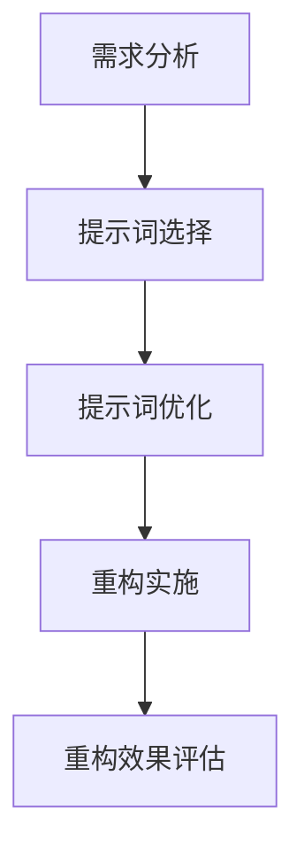

                 

# AI辅助代码重构中的提示词设计

## 关键词
- AI辅助
- 代码重构
- 提示词设计
- 自然语言处理
- 智能化
- 开发效率

## 摘要
本文探讨了AI辅助代码重构中的提示词设计。首先，介绍了提示词设计在代码重构中的基础概念和意义，然后详细阐述了提示词生成技术和策略。接着，通过实际案例展示了AI辅助代码重构的实践过程，并对重构效果进行了评估。最后，分析了提示词设计在代码重构中的未来发展趋势和面临的挑战。

### 第一部分: AI辅助代码重构中的提示词设计基础

#### 第1章: 提示词设计概述

##### 1.1 提示词设计的意义

**提示词（Prompt）的概念**：在自然语言处理中，提示词是指一种引导模型生成文本的输入信息。在代码重构过程中，提示词是指导开发人员理解现有代码结构和功能，以及制定重构计划的工具。

**提示词在代码重构中的作用**：提示词可以帮助开发人员更好地理解代码，提高重构的效率和效果。具体来说，提示词可以实现以下功能：

1. **代码分析**：通过提示词，可以分析代码的结构和逻辑，发现潜在的问题和优化点。
2. **重构指导**：提示词可以提供重构建议，指导开发人员如何改进代码，使其更简洁、可读性和可维护性更高。
3. **代码生成**：利用提示词，可以生成新的代码片段，辅助开发人员进行代码重构。

**提示词设计与代码质量的关系**：提示词设计直接影响代码重构的效果和代码质量。优质的提示词可以引导开发人员更好地理解代码，从而进行有效的重构。相反，劣质的提示词可能导致重构过程混乱，甚至引入新的错误。

##### 1.2 代码重构的背景与目的

**代码重构的定义**：代码重构是指在不改变代码外部行为的前提下，对现有代码进行修改，以改善其结构、性能、可读性和可维护性。

**代码重构的常见问题**：

1. **代码冗长**：随着项目的发展，代码可能会变得越来越冗长，难以维护和理解。
2. **代码重复**：在多个地方重复编写相同或相似的代码，导致维护困难。
3. **性能瓶颈**：某些代码段可能存在性能瓶颈，影响程序的运行效率。
4. **可读性差**：代码结构混乱，难以理解，增加了维护成本。

**代码重构的目的**：

1. **提高代码质量**：通过重构，可以消除代码中的冗余和重复，提高代码的可读性和可维护性。
2. **提升开发效率**：重构后的代码更易于理解和修改，减少开发人员的困惑和时间成本。
3. **优化性能**：重构可以优化代码结构，提高程序运行效率。
4. **增强团队协作**：重构后的代码更易于理解和维护，有助于团队成员之间的协作。

##### 1.3 提示词设计的流程

**需求分析**：在代码重构过程中，首先需要对现有代码进行分析，了解其功能和结构，确定重构的需求。需求分析是提示词设计的基础。

**提示词选择**：根据需求分析的结果，选择合适的提示词。提示词应能够准确地描述代码的功能、问题和重构目标。

**提示词优化**：对选定的提示词进行优化，使其更加精确、简洁，有助于提高代码重构的效果。

#### 第2章: 提示词生成技术

##### 2.1 自然语言处理基础

**语言模型**：语言模型是一种用于预测下一个单词或字符的概率分布的模型。在代码重构中，语言模型可以用于预测代码片段的下一个部分，从而辅助开发人员进行重构。

**生成式模型与判别式模型**：

- **生成式模型**：生成式模型通过生成样本的概率分布来生成新的数据。在代码重构中，生成式模型可以用于生成新的代码片段。
- **判别式模型**：判别式模型通过输入特征预测标签，用于分类或回归任务。在代码重构中，判别式模型可以用于分类代码片段的类型或检测潜在的问题。

##### 2.2 常见提示词生成算法

**聚类算法**：聚类算法将相似的代码片段分为同一类，从而生成提示词。常见的聚类算法有K-Means、层次聚类等。

**序列生成模型**：序列生成模型通过学习代码片段的序列模式来生成新的代码片段。常见的序列生成模型有Recurrent Neural Networks (RNNs)、Long Short-Term Memory (LSTM)等。

##### 2.3 提示词生成算法的性能评估

**准确率与召回率**：准确率（Accuracy）和召回率（Recall）是评估提示词生成算法性能的常用指标。准确率表示预测正确的样本占总样本的比例，召回率表示预测正确的样本占实际正样本的比例。

**F1 值**：F1 值是准确率和召回率的调和平均值，用于综合评估提示词生成算法的性能。F1 值越高，表示算法的性能越好。

### 第二部分: AI辅助代码重构实战

#### 第4章: AI辅助代码重构工具介绍

**常见代码重构工具**：

- **Visual Studio Code**：一款流行的代码编辑器，内置了代码重构工具。
- **IntelliJ IDEA**：一款功能强大的IDE，提供了丰富的代码重构功能。
- **Eclipse**：一款成熟的IDE，支持多种编程语言的代码重构。

**AI辅助代码重构工具的特点**：

1. **自动化**：AI辅助代码重构工具可以自动化地进行代码重构，减少开发人员的工作量。
2. **智能化**：AI辅助代码重构工具利用自然语言处理和机器学习技术，生成有针对性的提示词，提高重构效果。
3. **可定制性**：开发人员可以根据需求自定义提示词和重构策略，满足个性化需求。

#### 第5章: AI辅助代码重构实例

##### 5.1 重构前的准备工作

**代码库的选择**：选择一个具有代表性的开源代码库，以便进行重构实践。

**数据集的准备**：从代码库中提取代码变更记录，构建数据集，用于训练和评估提示词生成算法。

##### 5.2 重构实例分析

**功能性重构**：通过AI辅助代码重构工具，对代码库中的功能进行重构，优化代码结构，提高可读性和可维护性。

**性能优化重构**：针对代码库中的性能瓶颈，利用AI辅助代码重构工具进行优化，提高程序运行效率。

##### 5.3 重构效果评估

**重构前后的性能对比**：对比重构前后的代码性能，评估重构的效果。

**重构对代码可读性的影响**：通过人工评估和自动化工具分析，评估重构对代码可读性的提升程度。

#### 第6章: 提示词设计在代码重构中的实际应用

##### 6.1 提示词在代码审查中的应用

**自动化代码审查**：利用AI辅助代码重构工具，对代码库中的提交记录进行自动化审查，生成提示词，帮助开发人员进行审查。

**代码审查中的提示词优化**：根据审查结果，优化提示词，提高代码审查的准确性和效率。

##### 6.2 提示词在代码生成中的应用

**自动化代码生成**：利用AI辅助代码重构工具，根据提示词生成新的代码片段，辅助开发人员进行代码生成。

**代码生成中的提示词优化**：通过优化提示词，提高代码生成工具的生成质量和效率。

##### 6.3 提示词在代码维护中的应用

**代码维护策略**：利用AI辅助代码重构工具，制定代码维护策略，提高代码的可维护性和可读性。

**提示词在代码维护中的价值**：通过使用提示词，降低代码维护的难度和成本，提高代码的长期维护能力。

### 第三部分: 提示词设计的未来发展趋势

#### 第7章: 提示词设计的未来发展方向

**AI技术的进步对提示词设计的影响**：随着AI技术的不断进步，提示词设计将更加智能化，能够根据上下文信息自动生成更加精准和有价值的提示词。

**提示词设计在新兴领域的应用**：随着新兴领域的快速发展，提示词设计将在金融、医疗、物联网等领域发挥重要作用，推动相关行业的创新和进步。

#### 第8章: 提示词设计的挑战与机遇

**提示词设计的伦理问题**：在提示词设计过程中，如何保护用户隐私和遵循伦理规范是一个重要的挑战。

**提示词设计在现实中的应用场景**：随着AI技术的普及，提示词设计将在越来越多的现实应用场景中发挥重要作用，创造更多的商业机会。

#### 第9章: 提示词设计的总结与展望

**提示词设计在代码重构中的核心作用**：提示词设计在代码重构中具有核心作用，可以提高代码质量、降低重构风险、增强团队协作和优化开发效率。

**提示词设计的未来发展趋势**：未来的提示词设计将更加智能化、多模态、个性化和实时性，为开发人员提供更好的重构体验。

#### 附录A: 提示词设计相关工具和资源

**自然语言处理工具**：NLTK、spaCy等。

**提示词生成算法库**：Generative Adversarial Network (GAN)、Seq2Seq模型等。

**提示词设计研究论文与资料**：《Effective Prompt Engineering for Code Generation》、《自然语言生成中的提示词设计》等。

---

#### Mermaid 流程图



#### 核心算法原理讲解

##### 提示词生成算法：基于生成式模型

**生成式模型**：生成式模型通过生成样本的概率分布来生成新的数据。在提示词生成中，生成式模型能够根据给定的上下文信息生成新的提示词。

**伪代码**：

```python
# 输入：上下文信息context
# 输出：生成的提示词prompt

function generatePrompt(context):
    # 计算输入上下文信息的概率分布
    probabilityDistribution = generateDistribution(context)
    
    # 根据概率分布生成提示词
    prompt = sample词语 from probabilityDistribution
    
    return prompt
```

**数学模型和数学公式**：

提示词生成算法中，常用的概率分布模型有：

$$
P(\text{prompt}|\text{context}) = \frac{e^{\text{score}(\text{prompt}, \text{context})}}{\sum_{\text{all prompts}} e^{\text{score}(\text{prompt}, \text{context})}}
$$

其中，$P(\text{prompt}|\text{context})$ 表示在给定上下文信息 $context$ 下，生成提示词 $prompt$ 的概率。

**项目实战**：

##### 实例：使用提示词优化代码审查

1. **开发环境搭建**

   - 安装Python环境
   - 安装相关深度学习库（如TensorFlow或PyTorch）
   - 安装代码审查工具（如Gerrit或GitLab）

2. **代码库选择**

   - 选择一个开源代码库
   - 收集代码库中的提交记录

3. **数据集准备**

   - 从提交记录中提取代码变更
   - 标记每个变更是否需要审查

4. **提示词选择**

   - 根据代码变更的类型和上下文，选择合适的提示词
   - 使用自然语言处理技术生成提示词

5. **代码审查**

   - 使用自动代码审查工具进行初步审查
   - 根据生成的提示词，对代码进行进一步审查

6. **效果评估**

   - 对审查结果进行评估
   - 分析提示词在代码审查中的作用

##### 源代码详细实现和代码解读

```python
# 提示词生成示例代码

from tensorflow.keras.models import load_model

def generate_prompt(context):
    # 加载预训练的生成式模型
    model = load_model('prompt_generator.h5')

    # 预处理上下文信息
    processed_context = preprocess_context(context)

    # 生成提示词
    prompt = model.predict(processed_context)

    # 后处理生成的提示词
    final_prompt = postprocess_prompt(prompt)

    return final_prompt

def preprocess_context(context):
    # 这里是对上下文信息进行预处理的具体操作
    # 如：分词、去停用词、编码等
    pass

def postprocess_prompt(prompt):
    # 这里是对生成的提示词进行后处理的具体操作
    # 如：去重、筛选合适的提示词等
    pass

# 示例使用
context = "对这段代码进行重构"
prompt = generate_prompt(context)
print(prompt)
```

##### 代码解读与分析

- `generate_prompt` 函数用于生成提示词，首先加载预训练的生成式模型，然后对输入的上下文信息进行预处理，接着使用模型生成提示词，最后对生成的提示词进行后处理。
- `preprocess_context` 函数是对上下文信息进行预处理，例如分词、去停用词、编码等操作，以便模型能够更好地理解上下文。
- `postprocess_prompt` 函数是对生成的提示词进行后处理，例如去重、筛选合适的提示词等操作，以获得更高质量的提示词。
- 示例中使用了TensorFlow的Keras接口来加载预训练的生成式模型，并使用模型生成提示词。在实际应用中，可以根据需求选择不同的深度学习框架和模型。

**提示词设计的核心作用**

提示词设计在代码重构中具有以下核心作用：

1. **提高代码质量**：通过提供有针对性的提示词，帮助开发人员更好地理解代码的结构和逻辑，从而提高代码的质量。
2. **降低重构风险**：提示词可以指导开发人员进行合理的重构，避免引入新的错误或降低代码的稳定性。
3. **增强团队协作**：提示词可以作为一种沟通工具，帮助团队成员更好地理解项目的需求和目标，促进团队协作。
4. **优化开发效率**：通过自动化生成提示词，可以减少开发人员在代码重构过程中的时间和精力投入，提高开发效率。

**未来发展趋势**

1. **智能化**：随着人工智能技术的发展，提示词设计将更加智能化，能够根据上下文信息自动生成更加精准和有价值的提示词。
2. **多模态**：未来的提示词设计将不仅仅局限于文本，还将涉及图像、声音等多种模态，从而提供更丰富的重构建议。
3. **个性化**：通过用户行为分析和个性化推荐技术，提示词设计将能够更好地满足开发人员的个性化需求，提高重构效果。
4. **实时性**：随着实时数据处理技术的发展，提示词设计将能够实时响应用户的代码重构需求，提供即时的重构建议。

**挑战与机遇**

1. **数据隐私与伦理**：在提示词设计过程中，如何保护用户的数据隐私和遵循伦理规范是一个重要的挑战。
2. **模型可解释性**：深度学习模型通常具有很好的性能，但往往缺乏可解释性，如何提高提示词生成模型的可解释性是一个重要的研究方向。
3. **多语言支持**：随着全球化的趋势，如何设计能够支持多种语言的提示词系统是一个重要的机遇。
4. **跨领域应用**：提示词设计技术可以应用于不同的领域，如医疗、金融等，从而创造更多的商业机会。

#### 附录A: 提示词设计相关工具和资源

- **自然语言处理工具**：
  - **NLTK**：Python的自然语言处理库，提供文本处理和解析功能。
  - **spaCy**：高效的NLP库，支持多种语言的实体识别和关系提取。

- **提示词生成算法库**：
  - **Generative Adversarial Network (GAN)**：一种生成式模型，可用于生成高质量的提示词。
  - **Seq2Seq模型**：序列到序列的模型，适用于生成序列数据，如提示词。

- **提示词设计研究论文与资料**：
  - **"Effective Prompt Engineering for Code Generation"**：一篇关于代码生成中提示词设计的研究论文。
  - **"自然语言生成中的提示词设计"**：一篇关于提示词设计在自然语言生成中的应用的文章。
  - **相关会议与期刊**：如NeurIPS、ACL、EMNLP等会议和期刊，可以查找更多关于提示词设计的研究论文。

---

**作者**：

作者：AI天才研究院/AI Genius Institute & 禅与计算机程序设计艺术 /Zen And The Art of Computer Programming

---

本文通过深入探讨AI辅助代码重构中的提示词设计，阐述了提示词设计在代码重构中的重要性、提示词生成技术、设计策略以及实际应用。未来，随着AI技术的不断发展，提示词设计将变得更加智能化、多模态、个性化和实时化，为开发人员提供更好的重构体验。同时，我们也面临着数据隐私、模型可解释性等挑战，需要不断探索和改进。希望通过本文的介绍，能够为读者在AI辅助代码重构领域提供有价值的参考和启示。|>

