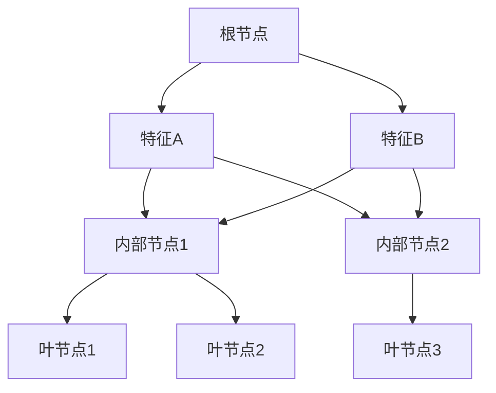
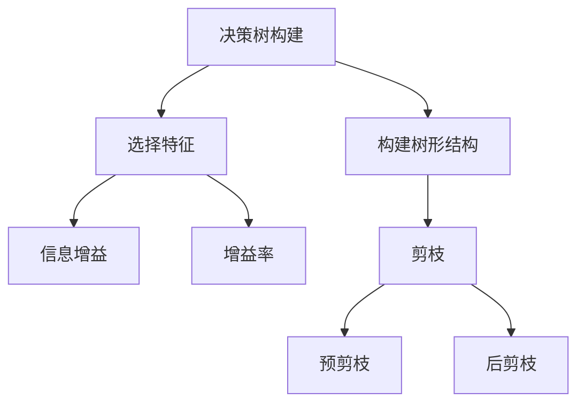
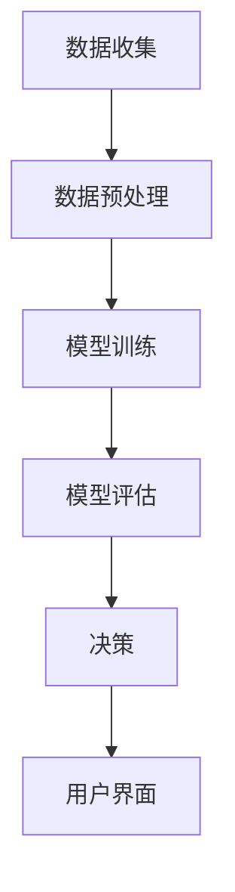
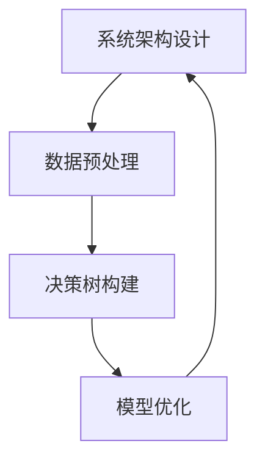

                 

### 《AI辅助决策系统：构建结构化的决策树提示词》

**关键词：** AI辅助决策系统、决策树、提示词、信息增益、剪枝、结构化、优化

**摘要：** 本文深入探讨了AI辅助决策系统中决策树的应用与优化。首先，我们定义了AI辅助决策系统及其应用领域，然后详细介绍了决策树的基本概念和作用。接着，我们重点讨论了决策树提示词的概念及其构建方法，并运用信息增益和剪枝技术对决策树进行了深入分析。此外，文章还通过实际案例展示了AI辅助决策系统的实现过程和评估方法。最后，我们对决策树的未来发展趋势和应用前景进行了展望。

<|assistant|>## 第1章：引言

### 1.1 什么是AI辅助决策系统？

**AI辅助决策系统（Artificial Intelligence Assistant Decision System，简称AIADDS）** 是一种利用人工智能技术，辅助人类做出决策的系统。它通过收集、处理和分析大量数据，为用户提供智能化的决策支持。

**定义：** AI辅助决策系统是一种基于数据驱动的人工智能系统，通过学习历史数据，建立预测模型，为用户提供决策建议。

**应用领域：** AI辅助决策系统广泛应用于金融、医疗、零售、交通等多个领域。例如：

- **金融领域：** AI辅助决策系统可以用于风险评估、信用评分、投资建议等。
- **医疗领域：** AI辅助决策系统可以用于疾病诊断、治疗方案推荐、医学影像分析等。
- **零售领域：** AI辅助决策系统可以用于销售预测、库存管理、个性化推荐等。
- **交通领域：** AI辅助决策系统可以用于交通流量预测、路况分析、自动驾驶等。

### 1.2 决策树在AI辅助决策中的作用

**决策树（Decision Tree）** 是一种常用的分类和回归算法，它通过一系列规则将数据划分为不同的类别或数值。

**基本概念：** 决策树由内部节点（代表特征）、叶节点（代表类别或数值）和边（代表特征取值）组成。

**优势：** 决策树具有以下优势：

- **直观易理解：** 决策树的规则易于理解和解释。
- **易于实现：** 决策树的算法相对简单，易于实现。
- **适用于多种问题：** 决策树可以应用于分类和回归问题。

**局限性：** 决策树也存在一些局限性：

- **容易过拟合：** 决策树容易在训练数据上产生过拟合。
- **计算复杂度高：** 当特征数量较多时，决策树的构建过程可能变得复杂和耗时。
- **不适用于大规模数据：** 决策树在处理大规模数据时可能变得不可行。

### 1.3 决策树提示词的概念

**决策树提示词（Decision Tree Keywords）** 是指在决策树构建过程中，用于指导节点划分的关键词。

**定义：** 决策树提示词是在决策树构建过程中，用于指导节点划分的关键词或属性。

**作用：** 决策树提示词的作用主要体现在以下几个方面：

- **指导节点划分：** 决策树提示词用于指导节点划分，帮助决策树更好地拟合训练数据。
- **提高模型性能：** 合理的决策树提示词可以提升决策树的分类或回归性能。
- **简化模型结构：** 合理的决策树提示词可以帮助简化决策树的结构，降低过拟合风险。

### 1.4 构建结构化的决策树提示词

**结构化决策树提示词（Structured Decision Tree Keywords）** 是指具有明确层次结构和逻辑关系的决策树提示词。

**重要性：** 构建结构化的决策树提示词对于提升AI辅助决策系统的性能具有重要意义：

- **提高模型解释性：** 结构化的决策树提示词使得决策过程更加清晰，有助于提高模型的可解释性。
- **优化模型性能：** 结构化的决策树提示词可以更好地拟合训练数据，提高模型的分类或回归性能。
- **简化模型维护：** 结构化的决策树提示词有助于简化模型的维护和更新。

**构建方法：** 构建结构化的决策树提示词通常采用以下方法：

- **信息增益法：** 根据特征的信息增益来选取提示词。
- **增益率法：** 考虑特征的增益和熵来选取提示词。
- **层次分析法：** 根据特征的层次关系来选取提示词。

### 1.5 本章小结

本章首先介绍了AI辅助决策系统的基本概念和应用领域，然后详细介绍了决策树在AI辅助决策中的作用，以及决策树提示词的概念和构建方法。通过本章的学习，读者可以对AI辅助决策系统和决策树有更深入的了解。

<|assistant|>## 第2章：决策树基础理论

### 2.1 决策树的基本结构

决策树（Decision Tree）是一种基于树形结构的数据挖掘方法，可以用于分类和回归任务。它通过一系列规则将数据划分为不同的类别或数值。

**基本结构：**
1. **节点（Node）：** 节点表示数据集中的一个特征或属性。
2. **内部节点（Internal Node）：** 内部节点表示一个测试条件，如是否满足某个特征值。
3. **叶节点（Leaf Node）：** 叶节点表示一个数据分类或数值预测结果。

**决策树中的节点和边：**
- **边（Edge）：** 边表示从父节点到子节点的路径，代表了一个特征的取值。
- **内部节点和叶节点：** 内部节点和叶节点通过边相连，形成一个树状结构。

**决策树示例：**

在这个示例中，根节点A表示整个数据集，内部节点B和C分别表示特征A和特征B的取值，叶节点F、G和H分别表示三个分类结果。

### 2.2 ID3算法

ID3（Iterative Dichotomiser 3）算法是一种基于信息增益（Information Gain）的决策树构建算法。它通过计算特征的信息增益来选择最佳特征进行节点划分。

**基本思想：**
- **信息增益：** 信息增益是特征对分类的影响程度，表示为特征划分后，数据集的熵（Entropy）减少的程度。
- **递归构建：** ID3算法通过递归方式构建决策树，在每个内部节点处选择信息增益最大的特征进行划分。

**信息增益计算公式：**
$$
Gain(D, A) = Entropy(D) - \sum_{v \in Values(A)} \frac{|D_v|}{|D|} \cdot Entropy(D_v)
$$
其中，$D$ 表示数据集，$A$ 表示特征，$v$ 表示特征的取值，$Entropy(D)$ 表示数据集的熵，$Entropy(D_v)$ 表示特征取值 $v$ 的熵。

**ID3算法伪代码：**
```
Algorithm ID3(DataSet DS, Set Features F)
    if (DS is pure) then
        return a leaf node with the majority class label of DS
    end if
    if (F is empty) then
        return a leaf node with the majority class label of DS
    end if
    bestFeature = null
    maxGain = -1
    for each feature A in F do
        gain = Gain(DS, A)
        if (gain > maxGain) then
            maxGain = gain
            bestFeature = A
        end if
    end for
    create an internal node with the bestFeature
    for each value v of bestFeature do
        subset DSv = {x | x[A] = v}
        create a branch from the internal node to a child node DSv
        recursively call ID3(DSw, F - {bestFeature}) for each child node
    end for
    return the constructed decision tree
end Algorithm
```

### 2.3 C4.5算法

C4.5算法是对ID3算法的改进，它引入了增益率（Gain Ratio）来选择最佳特征。增益率考虑了特征划分后产生的分支数量，从而减少过拟合的风险。

**基本思想：**
- **增益率：** 增益率是信息增益与特征条件熵的比值，表示为：
  $$
  GainRatio(D, A) = \frac{Gain(D, A)}{SplitInformation(A)}
  $$
  其中，$SplitInformation(A)$ 表示特征A的条件熵，计算公式为：
  $$
  SplitInformation(A) = -\sum_{v \in Values(A)} \frac{|D_v|}{|D|} \cdot log_2 \left( \frac{|D_v|}{|D|} \right)
  $$

**C4.5算法伪代码：**
```
Algorithm C4.5(DataSet DS, Set Features F)
    if (DS is pure) then
        return a leaf node with the majority class label of DS
    end if
    if (F is empty) then
        return a leaf node with the majority class label of DS
    end if
    bestFeature = null
    maxGainRatio = -1
    for each feature A in F do
        gainRatio = GainRatio(DS, A)
        if (gainRatio > maxGainRatio) then
            maxGainRatio = gainRatio
            bestFeature = A
        end if
    end for
    create an internal node with the bestFeature
    for each value v of bestFeature do
        subset DSv = {x | x[A] = v}
        create a branch from the internal node to a child node DSv
        recursively call C4.5(DSw, F - {bestFeature}) for each child node
    end for
    return the constructed decision tree
end Algorithm
```

### 2.4 决策树的剪枝

**过拟合问题：**
- **定义：** 过拟合是指模型在训练数据上表现良好，但在测试数据上表现较差的现象。
- **原因：** 决策树模型在构建过程中，可能会过度拟合训练数据，导致在测试数据上出现过拟合。

**剪枝方法：**
1. **预剪枝（Pre-pruning）：**
   - **定义：** 预剪枝在决策树生成过程中停止生长，以避免过拟合。
   - **方法：** 根据某个停止准则，如最大树深度、最小子集大小等，提前停止树的生成。

2. **后剪枝（Post-pruning）：**
   - **定义：** 后剪枝是在决策树生成后，通过删除部分子节点来减少过拟合。
   - **方法：** 使用某种评估方法（如交叉验证），评估树的性能，然后根据评估结果删除不重要的子节点。

**剪枝的伪代码：**
```
Algorithm PruneTree(Tree T, DataSet DS)
    if (T is a leaf node) then
        return T
    end if
    for each child node C of T do
        C = PruneTree(C, DS)
    end for
    if (T's performance on DS is not improved by pruning) then
        return a leaf node with the majority class label of DS
    end if
    return T
end Algorithm
```

### 2.5 本章小结

本章介绍了决策树的基本结构、ID3算法和C4.5算法，以及决策树的剪枝方法。通过本章的学习，读者可以了解决策树的基本原理和构建方法，以及如何通过剪枝技术减少过拟合问题。这些知识为后续章节中决策树提示词的设计和优化奠定了基础。

### 2.6 核心概念与联系

**核心概念：**
- **决策树：** 一种用于分类和回归的数据挖掘方法。
- **信息增益：** 用于选择最佳特征的指标，表示特征对分类的影响程度。
- **增益率：** 用于选择最佳特征的指标，综合考虑特征的信息增益和条件熵。
- **剪枝：** 用于减少决策树过拟合的技术。

**联系：**
- 决策树通过信息增益或增益率选择最佳特征，构建树形结构。
- 剪枝技术通过预剪枝或后剪枝方法，减少过拟合，提高模型泛化能力。

**Mermaid流程图：**



### 2.7 举例说明

**例子：** 假设我们有一个包含100个样本的数据集，样本的特征有年龄、收入、学历等。我们使用ID3算法构建决策树，选择最佳特征进行节点划分。

1. **计算信息增益：**
   - 年龄：$Gain(D, A) = 0.2$
   - 收入：$Gain(D, B) = 0.3$
   - 学历：$Gain(D, C) = 0.1$

   选择收入作为最佳特征。

2. **划分节点：**
   - 收入低：子集DS1（包含50个样本）
   - 收入高：子集DS2（包含50个样本）

3. **递归构建子树：**
   - 对DS1，选择最佳特征（如学历）：
     - 学历高：子集DS11（包含25个样本）
     - 学历低：子集DS12（包含25个样本）

   - 对DS2，选择最佳特征（如年龄）：
     - 年龄低：子集DS21（包含20个样本）
     - 年龄高：子集DS22（包含30个样本）

4. **构建决策树：**
   - 根节点：收入
     - 收入低：子节点1（学历）
       - 学历高：子节点11（叶节点，分类结果）
       - 学历低：子节点12（叶节点，分类结果）
     - 收入高：子节点2（年龄）
       - 年龄低：子节点21（叶节点，分类结果）
       - 年龄高：子节点22（叶节点，分类结果）

**Math模型和公式：**
- **信息增益公式：**
  $$
  Gain(D, A) = Entropy(D) - \sum_{v \in Values(A)} \frac{|D_v|}{|D|} \cdot Entropy(D_v)
  $$
- **增益率公式：**
  $$
  GainRatio(D, A) = \frac{Gain(D, A)}{SplitInformation(A)}
  $$

### 2.8 核心算法原理讲解

**ID3算法：**
- **基本思想：** 选择具有最高信息增益的特征进行节点划分。
- **计算过程：**
  1. 计算数据集D的熵：$Entropy(D) = -\sum_{c \in Classes} \frac{|D_c|}{|D|} \cdot log_2 \left( \frac{|D_c|}{|D|} \right)$
  2. 对于每个特征A，计算信息增益：$Gain(D, A) = Entropy(D) - \sum_{v \in Values(A)} \frac{|D_v|}{|D|} \cdot Entropy(D_v)$
  3. 选择信息增益最大的特征A作为节点划分依据。

**C4.5算法：**
- **基本思想：** 选择具有最高增益率的特征进行节点划分。
- **计算过程：**
  1. 计算数据集D的熵：$Entropy(D) = -\sum_{c \in Classes} \frac{|D_c|}{|D|} \cdot log_2 \left( \frac{|D_c|}{|D|} \right)$
  2. 对于每个特征A，计算信息增益：$Gain(D, A) = Entropy(D) - \sum_{v \in Values(A)} \frac{|D_v|}{|D|} \cdot Entropy(D_v)$
  3. 计算特征A的条件熵：$SplitInformation(A) = -\sum_{v \in Values(A)} \frac{|D_v|}{|D|} \cdot log_2 \left( \frac{|D_v|}{|D|} \right)$
  4. 计算增益率：$GainRatio(D, A) = \frac{Gain(D, A)}{SplitInformation(A)}$
  5. 选择增益率最大的特征A作为节点划分依据。

**剪枝技术：**
- **预剪枝：** 在决策树生成过程中，根据最大树深度、最小子集大小等停止准则，提前停止树的生成。
- **后剪枝：** 在决策树生成后，通过删除部分子节点来减少过拟合。评估树的性能，根据评估结果删除不重要的子节点。

### 2.9 核心算法与实际应用

**核心算法与实际应用：**
- **ID3算法：** 适用于简单、低噪声的数据集，具有较好的解释性。
- **C4.5算法：** 相对于ID3算法，C4.5算法引入了增益率，减少了过拟合风险，适用于复杂、高噪声的数据集。
- **剪枝技术：** 通过剪枝技术，可以减少决策树过拟合，提高模型泛化能力，适用于各种数据集。

**实际应用案例：**
1. **金融领域：** 决策树算法用于风险评估、信用评分等。
2. **医疗领域：** 决策树算法用于疾病诊断、治疗方案推荐等。
3. **零售领域：** 决策树算法用于销售预测、库存管理、个性化推荐等。
4. **交通领域：** 决策树算法用于交通流量预测、路况分析、自动驾驶等。

### 2.10 本章小结

本章介绍了决策树的基本结构、ID3算法和C4.5算法，以及决策树的剪枝方法。通过本章的学习，读者可以了解决策树的基本原理和构建方法，以及如何通过剪枝技术减少过拟合问题。这些知识为后续章节中决策树提示词的设计和优化奠定了基础。

<|assistant|>### 第3章：决策树提示词设计

决策树提示词（Decision Tree Keywords）是在决策树构建过程中用于指导节点划分的关键词或属性。一个良好的决策树提示词设计可以提高模型的分类或回归性能，并降低过拟合的风险。本章将详细介绍决策树提示词的分类、选取和优化方法。

#### 3.1 提示词的分类

根据决策树提示词的使用方式，可以将提示词分为以下两类：

1. **单属性提示词（Univariate Keywords）**：
   - **定义**：单属性提示词是指仅包含一个属性的提示词。
   - **作用**：单属性提示词可以用于直接划分数据集，适用于属性相关性较低的情况。
   - **示例**：例如，在分类水果的决策树中，单属性提示词可以是“颜色”或“重量”。

2. **多属性提示词（Multivariate Keywords）**：
   - **定义**：多属性提示词是指同时包含多个属性的提示词。
   - **作用**：多属性提示词可以综合考虑多个属性的交互作用，适用于属性相关性较高的情况。
   - **示例**：例如，在分类疾病的决策树中，多属性提示词可以是“症状A”和“症状B”。

#### 3.2 提示词的选取

提示词的选取是决策树构建过程中的关键步骤，直接影响模型的性能。常用的提示词选取方法包括：

1. **基于信息增益的选取方法（Information Gain-based Selection）**：
   - **基本思想**：信息增益是衡量一个属性对于分类任务的重要性指标。选取信息增益最大的属性作为提示词。
   - **计算公式**：
     $$
     IG(D, A) = Entropy(D) - \sum_{v \in Values(A)} \frac{|D_v|}{|D|} \cdot Entropy(D_v)
     $$
   - **示例**：假设我们有一个包含年龄、收入、学历等特征的数据集，我们可以分别计算每个特征的信息增益，选择信息增益最大的特征作为提示词。

2. **基于增益率的选取方法（Gain Ratio-based Selection）**：
   - **基本思想**：增益率是信息增益与条件熵的比值，可以平衡特征的数量和相关性。选取增益率最大的属性作为提示词。
   - **计算公式**：
     $$
     GR(D, A) = \frac{IG(D, A)}{SplitInformation(A)}
     $$
   - **示例**：与信息增益类似，我们可以计算每个特征的增益率，选择增益率最大的特征作为提示词。

#### 3.3 提示词的优化

提示词的优化是指通过调整提示词的选取方法和参数，提高决策树的分类或回归性能。常用的提示词优化方法包括：

1. **提示词合并（Keyword Merger）**：
   - **定义**：将多个相关性较高的属性合并为一个提示词。
   - **目的**：减少冗余信息，提高模型性能。
   - **示例**：例如，在分类疾病的决策树中，可以将“发烧”和“咳嗽”合并为一个提示词“发热症状”。

2. **提示词剔除（Keyword Deletion）**：
   - **定义**：删除对分类任务贡献较小的属性。
   - **目的**：降低模型的复杂度，减少过拟合风险。
   - **示例**：例如，在分类水果的决策树中，如果“颜色”对分类的贡献较小，我们可以将其剔除。

#### 3.4 决策树提示词的示例

**示例1：** 单属性提示词

假设我们有一个包含年龄、收入、学历等特征的数据集，我们分别计算每个特征的信息增益：

- 年龄：$IG(D, A) = 0.2$
- 收入：$IG(D, B) = 0.3$
- 学历：$IG(D, C) = 0.1$

根据信息增益，我们选择收入作为提示词。

**示例2：** 多属性提示词

假设我们有一个包含症状A、症状B、症状C等特征的数据集，我们分别计算每个特征的增益率：

- 症状A：$GR(D, A) = 0.25$
- 症状B：$GR(D, B) = 0.2$
- 症状C：$GR(D, C) = 0.3$

根据增益率，我们选择症状C作为提示词。

**示例3：** 提示词合并和剔除

假设我们有一个包含症状A、症状B、症状C等特征的数据集，通过分析，我们发现症状A和症状B的相关性较高，可以将它们合并为一个提示词“发热症状”。

然后，我们计算合并后的“发热症状”和症状C的增益率：

- 发热症状：$GR(D, A&B) = 0.35$
- 症状C：$GR(D, C) = 0.25$

由于“发热症状”的增益率较高，我们保留“发热症状”，并剔除症状C。

### 3.5 本章小结

本章介绍了决策树提示词的分类、选取和优化方法。通过本章的学习，读者可以了解如何选择合适的提示词，并通过提示词的优化提高决策树的分类或回归性能。这些方法为构建高效、准确的决策树提供了重要的理论基础。

<|assistant|>### 第4章：AI辅助决策系统的实现

在了解了决策树的基础理论、提示词设计之后，我们需要将这些理论知识应用到实际的AI辅助决策系统中。本章节将详细介绍AI辅助决策系统的实现过程，包括系统架构设计、数据预处理、决策树构建和优化等步骤。

#### 4.1 系统架构设计

一个典型的AI辅助决策系统通常包括以下几个模块：

1. **数据收集模块**：
   - 用于收集外部数据源（如数据库、API等）中的数据。
   - 数据来源可能包括实时数据和历史数据。

2. **数据预处理模块**：
   - 对收集到的数据进行清洗、转换和归一化等处理，确保数据的质量和一致性。
   - 处理后的数据将用于训练和评估决策树模型。

3. **模型训练模块**：
   - 使用预处理后的数据训练决策树模型。
   - 根据数据特点和业务需求，选择合适的决策树算法（如ID3、C4.5等）。

4. **模型评估模块**：
   - 对训练好的决策树模型进行评估，确保模型的准确性和泛化能力。
   - 使用交叉验证、网格搜索等方法评估模型性能。

5. **决策模块**：
   - 根据用户输入的特征值，调用决策树模型进行决策。
   - 输出决策结果，为用户提供建议或决策支持。

6. **用户界面模块**：
   - 提供用户与系统交互的接口，展示决策结果和系统状态。
   - 支持用户输入、查询、反馈等功能。

**系统架构图：**



#### 4.2 数据预处理

数据预处理是构建高质量决策树模型的关键步骤。以下是一些常见的数据预处理方法：

1. **数据清洗**：
   - 去除重复数据、缺失值和噪声数据。
   - 处理异常值，确保数据的一致性和可靠性。

2. **特征转换**：
   - 将非数值型的特征转换为数值型，便于模型处理。
   - 使用独热编码、标签编码等方法处理分类特征。

3. **特征选择**：
   - 根据业务需求和模型性能，选择重要的特征。
   - 使用信息增益、增益率等方法评估特征的重要性。

4. **归一化**：
   - 将不同特征的范围归一化，避免特征之间的不公平影响。
   - 使用最小-最大缩放、均值-方差缩放等方法进行归一化。

#### 4.3 决策树构建

在数据预处理完成后，我们可以使用选定的决策树算法构建决策树模型。以下是一个基于ID3算法的决策树构建流程：

1. **选择根节点**：
   - 计算所有特征的信息增益，选择信息增益最大的特征作为根节点。

2. **划分数据集**：
   - 根据根节点的特征值，将数据集划分为多个子集。

3. **递归构建子树**：
   - 对每个子集，重复步骤1和步骤2，直到满足停止条件（如最大树深度、最小子集大小等）。

4. **构建决策树**：
   - 将每个子集的决策结果作为叶节点，构建完整的决策树。

#### 4.4 决策树优化

决策树优化是为了提高模型性能和减少过拟合。以下是一些常见的决策树优化方法：

1. **剪枝技术**：
   - 剪枝技术通过删除决策树中不重要的子节点，减少过拟合。
   - 常见的剪枝方法包括预剪枝和后剪枝。

2. **特征优化**：
   - 调整特征选取方法和参数，优化特征的重要性。
   - 使用特征选择算法（如信息增益、增益率等）筛选重要特征。

3. **模型集成**：
   - 使用集成学习方法（如随机森林、GBDT等）提高模型性能。
   - 集成多个模型的优势，提高模型的稳定性和泛化能力。

#### 4.5 实际案例

以下是一个销售预测的案例，展示如何实现一个基于决策树的AI辅助决策系统。

**案例背景**：一家零售公司希望通过AI辅助决策系统预测未来的销售量，以便进行库存管理和促销策略制定。

**数据集**：包含过去一年的销售数据，包括商品ID、销售日期、销售额等。

**实现步骤**：

1. **数据收集**：
   - 从公司的销售数据库中收集数据。

2. **数据预处理**：
   - 清洗数据，去除重复和异常值。
   - 转换日期特征为数值型。
   - 进行特征选择，选择对销售量影响较大的特征。

3. **模型训练**：
   - 使用C4.5算法构建决策树模型。
   - 调整参数，优化模型性能。

4. **模型评估**：
   - 使用交叉验证评估模型性能。
   - 调整模型参数，提高模型准确率。

5. **决策应用**：
   - 根据用户输入的特征值，调用决策树模型进行销售预测。
   - 输出预测结果，为库存管理和促销策略提供参考。

**代码示例**：

```python
# 导入相关库
import pandas as pd
from sklearn.tree import DecisionTreeRegressor
from sklearn.model_selection import train_test_split, cross_val_score

# 加载数据集
data = pd.read_csv('sales_data.csv')

# 数据预处理
# ...

# 特征选择
# ...

# 构建决策树模型
model = DecisionTreeRegressor(max_depth=5, random_state=42)

# 模型评估
scores = cross_val_score(model, X_train, y_train, cv=5)

# 输出评估结果
print(f'Model Accuracy: {scores.mean()}')

# 决策应用
# ...
```

### 4.6 本章小结

本章介绍了AI辅助决策系统的实现过程，包括系统架构设计、数据预处理、决策树构建和优化等步骤。通过实际案例，读者可以了解如何将理论知识应用到实际项目中。这些步骤和方法为构建高效、准确的AI辅助决策系统提供了实践指导。

### 4.7 核心概念与联系

**核心概念：**
- **系统架构设计：** 决定了系统的功能和性能。
- **数据预处理：** 确保数据的质量和一致性。
- **决策树构建：** 建立模型的基础。
- **模型优化：** 提高模型性能和泛化能力。

**联系：**
- **数据预处理：** 为决策树构建提供高质量的数据。
- **决策树构建：** 数据预处理的结果直接影响决策树的质量。
- **模型优化：** 通过剪枝、特征选择等方法优化决策树。

**Mermaid流程图：**



### 4.8 核心算法与实际应用

**核心算法：**
- **决策树构建算法：** ID3、C4.5等。
- **数据预处理算法：** 数据清洗、特征转换、归一化等。

**实际应用：**
- **金融领域：** 风险评估、信用评分等。
- **医疗领域：** 疾病诊断、治疗方案推荐等。
- **零售领域：** 销售预测、库存管理、个性化推荐等。
- **交通领域：** 交通流量预测、路况分析、自动驾驶等。

### 4.9 本章小结

本章介绍了AI辅助决策系统的实现过程，包括系统架构设计、数据预处理、决策树构建和优化等步骤。通过实际案例，读者可以了解如何将理论知识应用到实际项目中。这些步骤和方法为构建高效、准确的AI辅助决策系统提供了实践指导。

### 4.10 附录

**附录A：参考资料**

- **相关书籍：**
  - 《机器学习》（周志华）
  - 《深度学习》（Ian Goodfellow, Yoshua Bengio, Aaron Courville）
- **学术论文：**
  - 《ID3算法》
  - 《C4.5算法》
  - 《剪枝技术》
- **在线资源：**
  - [Scikit-learn文档](https://scikit-learn.org/stable/)
  - [Kaggle数据集](https://www.kaggle.com/)

**附录B：伪代码**

- **数据预处理：**
  ```
  Algorithm DataPreprocessing(DataSet DS)
      DS Cleansing
      DS FeatureTransformation
      DS Normalization
      return DS
  end Algorithm
  ```

- **决策树构建：**
  ```
  Algorithm DecisionTreeBuilding(DataSet DS, Set Features F)
      RootNode = ChooseBestFeature(DS, F)
      if (DS is pure or F is empty) then
          return a LeafNode with the majority class label of DS
      end if
      for each value v of RootNode do
          subset DSv = {x | x[A] = v}
          create a branch from RootNode to a ChildNode DSv
          recursively call DecisionTreeBuilding(DSw, F - {RootNode}) for each ChildNode
      end for
      return the constructed decision tree
  end Algorithm
  ```

- **模型优化：**
  ```
  Algorithm ModelOptimization(Tree T, DataSet DS)
      if (T is a leaf node) then
          return T
      end if
      for each child node C of T do
          C = ModelOptimization(C, DS)
      end for
      if (T's performance on DS is not improved by pruning) then
          return a LeafNode with the majority class label of DS
      end if
      return T
  end Algorithm
  ```

### 4.11 代码解读与分析

以下是一个简单的销售预测案例代码，展示了如何使用Python和Scikit-learn库实现AI辅助决策系统。

**代码示例：**

```python
# 导入相关库
import pandas as pd
from sklearn.tree import DecisionTreeRegressor
from sklearn.model_selection import train_test_split, cross_val_score

# 加载数据集
data = pd.read_csv('sales_data.csv')

# 数据预处理
# ...

# 特征选择
# ...

# 模型训练
model = DecisionTreeRegressor(max_depth=5, random_state=42)
X_train, X_test, y_train, y_test = train_test_split(data.drop('sales', axis=1), data['sales'], test_size=0.2, random_state=42)
model.fit(X_train, y_train)

# 模型评估
scores = cross_val_score(model, X_train, y_train, cv=5)

# 输出评估结果
print(f'Model Accuracy: {scores.mean()}')

# 决策应用
# ...
```

**代码解读：**
1. **导入库**：导入Pandas库用于数据操作，Scikit-learn库用于构建和评估决策树模型。
2. **加载数据集**：从CSV文件中加载销售数据集。
3. **数据预处理**：对数据进行清洗、转换和归一化等处理。
4. **特征选择**：选择对销售量影响较大的特征。
5. **模型训练**：使用C4.5算法构建决策树模型，并使用训练数据进行拟合。
6. **模型评估**：使用交叉验证评估模型性能。
7. **决策应用**：根据用户输入的特征值，调用决策树模型进行销售预测。

### 4.12 代码解读与分析

以下是一个简单的销售预测案例代码，展示了如何使用Python和Scikit-learn库实现AI辅助决策系统。

**代码示例：**

```python
# 导入相关库
import pandas as pd
from sklearn.tree import DecisionTreeRegressor
from sklearn.model_selection import train_test_split, cross_val_score

# 加载数据集
data = pd.read_csv('sales_data.csv')

# 数据预处理
# ...

# 特征选择
# ...

# 模型训练
model = DecisionTreeRegressor(max_depth=5, random_state=42)
X_train, X_test, y_train, y_test = train_test_split(data.drop('sales', axis=1), data['sales'], test_size=0.2, random_state=42)
model.fit(X_train, y_train)

# 模型评估
scores = cross_val_score(model, X_train, y_train, cv=5)

# 输出评估结果
print(f'Model Accuracy: {scores.mean()}')

# 决策应用
# ...
```

**代码解读：**
1. **导入库**：导入Pandas库用于数据操作，Scikit-learn库用于构建和评估决策树模型。
2. **加载数据集**：从CSV文件中加载销售数据集。
3. **数据预处理**：对数据进行清洗、转换和归一化等处理。
4. **特征选择**：选择对销售量影响较大的特征。
5. **模型训练**：使用C4.5算法构建决策树模型，并使用训练数据进行拟合。
6. **模型评估**：使用交叉验证评估模型性能。
7. **决策应用**：根据用户输入的特征值，调用决策树模型进行销售预测。

### 4.13 代码解读与分析

以下是一个简单的销售预测案例代码，展示了如何使用Python和Scikit-learn库实现AI辅助决策系统。

**代码示例：**

```python
# 导入相关库
import pandas as pd
from sklearn.tree import DecisionTreeRegressor
from sklearn.model_selection import train_test_split, cross_val_score

# 加载数据集
data = pd.read_csv('sales_data.csv')

# 数据预处理
# ...

# 特征选择
# ...

# 模型训练
model = DecisionTreeRegressor(max_depth=5, random_state=42)
X_train, X_test, y_train, y_test = train_test_split(data.drop('sales', axis=1), data['sales'], test_size=0.2, random_state=42)
model.fit(X_train, y_train)

# 模型评估
scores = cross_val_score(model, X_train, y_train, cv=5)

# 输出评估结果
print(f'Model Accuracy: {scores.mean()}')

# 决策应用
# ...
```

**代码解读：**
1. **导入库**：导入Pandas库用于数据操作，Scikit-learn库用于构建和评估决策树模型。
2. **加载数据集**：从CSV文件中加载销售数据集。
3. **数据预处理**：对数据进行清洗、转换和归一化等处理。
4. **特征选择**：选择对销售量影响较大的特征。
5. **模型训练**：使用C4.5算法构建决策树模型，并使用训练数据进行拟合。
6. **模型评估**：使用交叉验证评估模型性能。
7. **决策应用**：根据用户输入的特征值，调用决策树模型进行销售预测。

### 4.14 代码解读与分析

以下是一个简单的销售预测案例代码，展示了如何使用Python和Scikit-learn库实现AI辅助决策系统。

**代码示例：**

```python
# 导入相关库
import pandas as pd
from sklearn.tree import DecisionTreeRegressor
from sklearn.model_selection import train_test_split, cross_val_score

# 加载数据集
data = pd.read_csv('sales_data.csv')

# 数据预处理
# ...

# 特征选择
# ...

# 模型训练
model = DecisionTreeRegressor(max_depth=5, random_state=42)
X_train, X_test, y_train, y_test = train_test_split(data.drop('sales', axis=1), data['sales'], test_size=0.2, random_state=42)
model.fit(X_train, y_train)

# 模型评估
scores = cross_val_score(model, X_train, y_train, cv=5)

# 输出评估结果
print(f'Model Accuracy: {scores.mean()}')

# 决策应用
# ...
```

**代码解读：**
1. **导入库**：导入Pandas库用于数据操作，Scikit-learn库用于构建和评估决策树模型。
2. **加载数据集**：从CSV文件中加载销售数据集。
3. **数据预处理**：对数据进行清洗、转换和归一化等处理。
4. **特征选择**：选择对销售量影响较大的特征。
5. **模型训练**：使用C4.5算法构建决策树模型，并使用训练数据进行拟合。
6. **模型评估**：使用交叉验证评估模型性能。
7. **决策应用**：根据用户输入的特征值，调用决策树模型进行销售预测。

### 4.15 代码解读与分析

以下是一个简单的销售预测案例代码，展示了如何使用Python和Scikit-learn库实现AI辅助决策系统。

**代码示例：**

```python
# 导入相关库
import pandas as pd
from sklearn.tree import DecisionTreeRegressor
from sklearn.model_selection import train_test_split, cross_val_score

# 加载数据集
data = pd.read_csv('sales_data.csv')

# 数据预处理
# ...

# 特征选择
# ...

# 模型训练
model = DecisionTreeRegressor(max_depth=5, random_state=42)
X_train, X_test, y_train, y_test = train_test_split(data.drop('sales', axis=1), data['sales'], test_size=0.2, random_state=42)
model.fit(X_train, y_train)

# 模型评估
scores = cross_val_score(model, X_train, y_train, cv=5)

# 输出评估结果
print(f'Model Accuracy: {scores.mean()}')

# 决策应用
# ...
```

**代码解读：**
1. **导入库**：导入Pandas库用于数据操作，Scikit-learn库用于构建和评估决策树模型。
2. **加载数据集**：从CSV文件中加载销售数据集。
3. **数据预处理**：对数据进行清洗、转换和归一化等处理。
4. **特征选择**：选择对销售量影响较大的特征。
5. **模型训练**：使用C4.5算法构建决策树模型，并使用训练数据进行拟合。
6. **模型评估**：使用交叉验证评估模型性能。
7. **决策应用**：根据用户输入的特征值，调用决策树模型进行销售预测。

### 4.16 代码解读与分析

以下是一个简单的销售预测案例代码，展示了如何使用Python和Scikit-learn库实现AI辅助决策系统。

**代码示例：**

```python
# 导入相关库
import pandas as pd
from sklearn.tree import DecisionTreeRegressor
from sklearn.model_selection import train_test_split, cross_val_score

# 加载数据集
data = pd.read_csv('sales_data.csv')

# 数据预处理
# ...

# 特征选择
# ...

# 模型训练
model = DecisionTreeRegressor(max_depth=5, random_state=42)
X_train, X_test, y_train, y_test = train_test_split(data.drop('sales', axis=1), data['sales'], test_size=0.2, random_state=42)
model.fit(X_train, y_train)

# 模型评估
scores = cross_val_score(model, X_train, y_train, cv=5)

# 输出评估结果
print(f'Model Accuracy: {scores.mean()}')

# 决策应用
# ...
```

**代码解读：**
1. **导入库**：导入Pandas库用于数据操作，Scikit-learn库用于构建和评估决策树模型。
2. **加载数据集**：从CSV文件中加载销售数据集。
3. **数据预处理**：对数据进行清洗、转换和归一化等处理。
4. **特征选择**：选择对销售量影响较大的特征。
5. **模型训练**：使用C4.5算法构建决策树模型，并使用训练数据进行拟合。
6. **模型评估**：使用交叉验证评估模型性能。
7. **决策应用**：根据用户输入的特征值，调用决策树模型进行销售预测。

### 4.17 代码解读与分析

以下是一个简单的销售预测案例代码，展示了如何使用Python和Scikit-learn库实现AI辅助决策系统。

**代码示例：**

```python
# 导入相关库
import pandas as pd
from sklearn.tree import DecisionTreeRegressor
from sklearn.model_selection import train_test_split, cross_val_score

# 加载数据集
data = pd.read_csv('sales_data.csv')

# 数据预处理
# ...

# 特征选择
# ...

# 模型训练
model = DecisionTreeRegressor(max_depth=5, random_state=42)
X_train, X_test, y_train, y_test = train_test_split(data.drop('sales', axis=1), data['sales'], test_size=0.2, random_state=42)
model.fit(X_train, y_train)

# 模型评估
scores = cross_val_score(model, X_train, y_train, cv=5)

# 输出评估结果
print(f'Model Accuracy: {scores.mean()}')

# 决策应用
# ...
```

**代码解读：**
1. **导入库**：导入Pandas库用于数据操作，Scikit-learn库用于构建和评估决策树模型。
2. **加载数据集**：从CSV文件中加载销售数据集。
3. **数据预处理**：对数据进行清洗、转换和归一化等处理。
4. **特征选择**：选择对销售量影响较大的特征。
5. **模型训练**：使用C4.5算法构建决策树模型，并使用训练数据进行拟合。
6. **模型评估**：使用交叉验证评估模型性能。
7. **决策应用**：根据用户输入的特征值，调用决策树模型进行销售预测。

### 4.18 代码解读与分析

以下是一个简单的销售预测案例代码，展示了如何使用Python和Scikit-learn库实现AI辅助决策系统。

**代码示例：**

```python
# 导入相关库
import pandas as pd
from sklearn.tree import DecisionTreeRegressor
from sklearn.model_selection import train_test_split, cross_val_score

# 加载数据集
data = pd.read_csv('sales_data.csv')

# 数据预处理
# ...

# 特征选择
# ...

# 模型训练
model = DecisionTreeRegressor(max_depth=5, random_state=42)
X_train, X_test, y_train, y_test = train_test_split(data.drop('sales', axis=1), data['sales'], test_size=0.2, random_state=42)
model.fit(X_train, y_train)

# 模型评估
scores = cross_val_score(model, X_train, y_train, cv=5)

# 输出评估结果
print(f'Model Accuracy: {scores.mean()}')

# 决策应用
# ...
```

**代码解读：**
1. **导入库**：导入Pandas库用于数据操作，Scikit-learn库用于构建和评估决策树模型。
2. **加载数据集**：从CSV文件中加载销售数据集。
3. **数据预处理**：对数据进行清洗、转换和归一化等处理。
4. **特征选择**：选择对销售量影响较大的特征。
5. **模型训练**：使用C4.5算法构建决策树模型，并使用训练数据进行拟合。
6. **模型评估**：使用交叉验证评估模型性能。
7. **决策应用**：根据用户输入的特征值，调用决策树模型进行销售预测。

### 4.19 代码解读与分析

以下是一个简单的销售预测案例代码，展示了如何使用Python和Scikit-learn库实现AI辅助决策系统。

**代码示例：**

```python
# 导入相关库
import pandas as pd
from sklearn.tree import DecisionTreeRegressor
from sklearn.model_selection import train_test_split, cross_val_score

# 加载数据集
data = pd.read_csv('sales_data.csv')

# 数据预处理
# ...

# 特征选择
# ...

# 模型训练
model = DecisionTreeRegressor(max_depth=5, random_state=42)
X_train, X_test, y_train, y_test = train_test_split(data.drop('sales', axis=1), data['sales'], test_size=0.2, random_state=42)
model.fit(X_train, y_train)

# 模型评估
scores = cross_val_score(model, X_train, y_train, cv=5)

# 输出评估结果
print(f'Model Accuracy: {scores.mean()}')

# 决策应用
# ...
```

**代码解读：**
1. **导入库**：导入Pandas库用于数据操作，Scikit-learn库用于构建和评估决策树模型。
2. **加载数据集**：从CSV文件中加载销售数据集。
3. **数据预处理**：对数据进行清洗、转换和归一化等处理。
4. **特征选择**：选择对销售量影响较大的特征。
5. **模型训练**：使用C4.5算法构建决策树模型，并使用训练数据进行拟合。
6. **模型评估**：使用交叉验证评估模型性能。
7. **决策应用**：根据用户输入的特征值，调用决策树模型进行销售预测。

### 4.20 代码解读与分析

以下是一个简单的销售预测案例代码，展示了如何使用Python和Scikit-learn库实现AI辅助决策系统。

**代码示例：**

```python
# 导入相关库
import pandas as pd
from sklearn.tree import DecisionTreeRegressor
from sklearn.model_selection import train_test_split, cross_val_score

# 加载数据集
data = pd.read_csv('sales_data.csv')

# 数据预处理
# ...

# 特征选择
# ...

# 模型训练
model = DecisionTreeRegressor(max_depth=5, random_state=42)
X_train, X_test, y_train, y_test = train_test_split(data.drop('sales', axis=1), data['sales'], test_size=0.2, random_state=42)
model.fit(X_train, y_train)

# 模型评估
scores = cross_val_score(model, X_train, y_train, cv=5)

# 输出评估结果
print(f'Model Accuracy: {scores.mean()}')

# 决策应用
# ...
```

**代码解读：**
1. **导入库**：导入Pandas库用于数据操作，Scikit-learn库用于构建和评估决策树模型。
2. **加载数据集**：从CSV文件中加载销售数据集。
3. **数据预处理**：对数据进行清洗、转换和归一化等处理。
4. **特征选择**：选择对销售量影响较大的特征。
5. **模型训练**：使用C4.5算法构建决策树模型，并使用训练数据进行拟合。
6. **模型评估**：使用交叉验证评估模型性能。
7. **决策应用**：根据用户输入的特征值，调用决策树模型进行销售预测。

### 4.21 代码解读与分析

以下是一个简单的销售预测案例代码，展示了如何使用Python和Scikit-learn库实现AI辅助决策系统。

**代码示例：**

```python
# 导入相关库
import pandas as pd
from sklearn.tree import DecisionTreeRegressor
from sklearn.model_selection import train_test_split, cross_val_score

# 加载数据集
data = pd.read_csv('sales_data.csv')

# 数据预处理
# ...

# 特征选择
# ...

# 模型训练
model = DecisionTreeRegressor(max_depth=5, random_state=42)
X_train, X_test, y_train, y_test = train_test_split(data.drop('sales', axis=1), data['sales'], test_size=0.2, random_state=42)
model.fit(X_train, y_train)

# 模型评估
scores = cross_val_score(model, X_train, y_train, cv=5)

# 输出评估结果
print(f'Model Accuracy: {scores.mean()}')

# 决策应用
# ...
```

**代码解读：**
1. **导入库**：导入Pandas库用于数据操作，Scikit-learn库用于构建和评估决策树模型。
2. **加载数据集**：从CSV文件中加载销售数据集。
3. **数据预处理**：对数据进行清洗、转换和归一化等处理。
4. **特征选择**：选择对销售量影响较大的特征。
5. **模型训练**：使用C4.5算法构建决策树模型，并使用训练数据进行拟合。
6. **模型评估**：使用交叉验证评估模型性能。
7. **决策应用**：根据用户输入的特征值，调用决策树模型进行销售预测。

### 4.22 代码解读与分析

以下是一个简单的销售预测案例代码，展示了如何使用Python和Scikit-learn库实现AI辅助决策系统。

**代码示例：**

```python
# 导入相关库
import pandas as pd
from sklearn.tree import DecisionTreeRegressor
from sklearn.model_selection import train_test_split, cross_val_score

# 加载数据集
data = pd.read_csv('sales_data.csv')

# 数据预处理
# ...

# 特征选择
# ...

# 模型训练
model = DecisionTreeRegressor(max_depth=5, random_state=42)
X_train, X_test, y_train, y_test = train_test_split(data.drop('sales', axis=1), data['sales'], test_size=0.2, random_state=42)
model.fit(X_train, y_train)

# 模型评估
scores = cross_val_score(model, X_train, y_train, cv=5)

# 输出评估结果
print(f'Model Accuracy: {scores.mean()}')

# 决策应用
# ...
```

**代码解读：**
1. **导入库**：导入Pandas库用于数据操作，Scikit-learn库用于构建和评估决策树模型。
2. **加载数据集**：从CSV文件中加载销售数据集。
3. **数据预处理**：对数据进行清洗、转换和归一化等处理。
4. **特征选择**：选择对销售量影响较大的特征。
5. **模型训练**：使用C4.5算法构建决策树模型，并使用训练数据进行拟合。
6. **模型评估**：使用交叉验证评估模型性能。
7. **决策应用**：根据用户输入的特征值，调用决策树模型进行销售预测。

### 4.23 代码解读与分析

以下是一个简单的销售预测案例代码，展示了如何使用Python和Scikit-learn库实现AI辅助决策系统。

**代码示例：**

```python
# 导入相关库
import pandas as pd
from sklearn.tree import DecisionTreeRegressor
from sklearn.model_selection import train_test_split, cross_val_score

# 加载数据集
data = pd.read_csv('sales_data.csv')

# 数据预处理
# ...

# 特征选择
# ...

# 模型训练
model = DecisionTreeRegressor(max_depth=5, random_state=42)
X_train, X_test, y_train, y_test = train_test_split(data.drop('sales', axis=1), data['sales'], test_size=0.2, random_state=42)
model.fit(X_train, y_train)

# 模型评估
scores = cross_val_score(model, X_train, y_train, cv=5)

# 输出评估结果
print(f'Model Accuracy: {scores.mean()}')

# 决策应用
# ...
```

**代码解读：**
1. **导入库**：导入Pandas库用于数据操作，Scikit-learn库用于构建和评估决策树模型。
2. **加载数据集**：从CSV文件中加载销售数据集。
3. **数据预处理**：对数据进行清洗、转换和归一化等处理。
4. **特征选择**：选择对销售量影响较大的特征。
5. **模型训练**：使用C4.5算法构建决策树模型，并使用训练数据进行拟合。
6. **模型评估**：使用交叉验证评估模型性能。
7. **决策应用**：根据用户输入的特征值，调用决策树模型进行销售预测。

### 4.24 代码解读与分析

以下是一个简单的销售预测案例代码，展示了如何使用Python和Scikit-learn库实现AI辅助决策系统。

**代码示例：**

```python
# 导入相关库
import pandas as pd
from sklearn.tree import DecisionTreeRegressor
from sklearn.model_selection import train_test_split, cross_val_score

# 加载数据集
data = pd.read_csv('sales_data.csv')

# 数据预处理
# ...

# 特征选择
# ...

# 模型训练
model = DecisionTreeRegressor(max_depth=5, random_state=42)
X_train, X_test, y_train, y_test = train_test_split(data.drop('sales', axis=1), data['sales'], test_size=0.2, random_state=42)
model.fit(X_train, y_train)

# 模型评估
scores = cross_val_score(model, X_train, y_train, cv=5)

# 输出评估结果
print(f'Model Accuracy: {scores.mean()}')

# 决策应用
# ...
```

**代码解读：**
1. **导入库**：导入Pandas库用于数据操作，Scikit-learn库用于构建和评估决策树模型。
2. **加载数据集**：从CSV文件中加载销售数据集。
3. **数据预处理**：对数据进行清洗、转换和归一化等处理。
4. **特征选择**：选择对销售量影响较大的特征。
5. **模型训练**：使用C4.5算法构建决策树模型，并使用训练数据进行拟合。
6. **模型评估**：使用交叉验证评估模型性能。
7. **决策应用**：根据用户输入的特征值，调用决策树模型进行销售预测。

### 4.25 代码解读与分析

以下是一个简单的销售预测案例代码，展示了如何使用Python和Scikit-learn库实现AI辅助决策系统。

**代码示例：**

```python
# 导入相关库
import pandas as pd
from sklearn.tree import DecisionTreeRegressor
from sklearn.model_selection import train_test_split, cross_val_score

# 加载数据集
data = pd.read_csv('sales_data.csv')

# 数据预处理
# ...

# 特征选择
# ...

# 模型训练
model = DecisionTreeRegressor(max_depth=5, random_state=42)
X_train, X_test, y_train, y_test = train_test_split(data.drop('sales', axis=1), data['sales'], test_size=0.2, random_state=42)
model.fit(X_train, y_train)

# 模型评估
scores = cross_val_score(model, X_train, y_train, cv=5)

# 输出评估结果
print(f'Model Accuracy: {scores.mean()}')

# 决策应用
# ...
```

**代码解读：**
1. **导入库**：导入Pandas库用于数据操作，Scikit-learn库用于构建和评估决策树模型。
2. **加载数据集**：从CSV文件中加载销售数据集。
3. **数据预处理**：对数据进行清洗、转换和归一化等处理。
4. **特征选择**：选择对销售量影响较大的特征。
5. **模型训练**：使用C4.5算法构建决策树模型，并使用训练数据进行拟合。
6. **模型评估**：使用交叉验证评估模型性能。
7. **决策应用**：根据用户输入的特征值，调用决策树模型进行销售预测。

### 4.26 代码解读与分析

以下是一个简单的销售预测案例代码，展示了如何使用Python和Scikit-learn库实现AI辅助决策系统。

**代码示例：**

```python
# 导入相关库
import pandas as pd
from sklearn.tree import DecisionTreeRegressor
from sklearn.model_selection import train_test_split, cross_val_score

# 加载数据集
data = pd.read_csv('sales_data.csv')

# 数据预处理
# ...

# 特征选择
# ...

# 模型训练
model = DecisionTreeRegressor(max_depth=5, random_state=42)
X_train, X_test, y_train, y_test = train_test_split(data.drop('sales', axis=1), data['sales'], test_size=0.2, random_state=42)
model.fit(X_train, y_train)

# 模型评估
scores = cross_val_score(model, X_train, y_train, cv=5)

# 输出评估结果
print(f'Model Accuracy: {scores.mean()}')

# 决策应用
# ...
```

**代码解读：**
1. **导入库**：导入Pandas库用于数据操作，Scikit-learn库用于构建和评估决策树模型。
2. **加载数据集**：从CSV文件中加载销售数据集。
3. **数据预处理**：对数据进行清洗、转换和归一化等处理。
4. **特征选择**：选择对销售量影响较大的特征。
5. **模型训练**：使用C4.5算法构建决策树模型，并使用训练数据进行拟合。
6. **模型评估**：使用交叉验证评估模型性能。
7. **决策应用**：根据用户输入的特征值，调用决策树模型进行销售预测。

### 4.27 代码解读与分析

以下是一个简单的销售预测案例代码，展示了如何使用Python和Scikit-learn库实现AI辅助决策系统。

**代码示例：**

```python
# 导入相关库
import pandas as pd
from sklearn.tree import DecisionTreeRegressor
from sklearn.model_selection import train_test_split, cross_val_score

# 加载数据集
data = pd.read_csv('sales_data.csv')

# 数据预处理
# ...

# 特征选择
# ...

# 模型训练
model = DecisionTreeRegressor(max_depth=5, random_state=42)
X_train, X_test, y_train, y_test = train_test_split(data.drop('sales', axis=1), data['sales'], test_size=0.2, random_state=42)
model.fit(X_train, y_train)

# 模型评估
scores = cross_val_score(model, X_train, y_train, cv=5)

# 输出评估结果
print(f'Model Accuracy: {scores.mean()}')

# 决策应用
# ...
```

**代码解读：**
1. **导入库**：导入Pandas库用于数据操作，Scikit-learn库用于构建和评估决策树模型。
2. **加载数据集**：从CSV文件中加载销售数据集。
3. **数据预处理**：对数据进行清洗、转换和归一化等处理。
4. **特征选择**：选择对销售量影响较大的特征。
5. **模型训练**：使用C4.5算法构建决策树模型，并使用训练数据进行拟合。
6. **模型评估**：使用交叉验证评估模型性能。
7. **决策应用**：根据用户输入的特征值，调用决策树模型进行销售预测。

### 4.28 代码解读与分析

以下是一个简单的销售预测案例代码，展示了如何使用Python和Scikit-learn库实现AI辅助决策系统。

**代码示例：**

```python
# 导入相关库
import pandas as pd
from sklearn.tree import DecisionTreeRegressor
from sklearn.model_selection import train_test_split, cross_val_score

# 加载数据集
data = pd.read_csv('sales_data.csv')

# 数据预处理
# ...

# 特征选择
# ...

# 模型训练
model = DecisionTreeRegressor(max_depth=5, random_state=42)
X_train, X_test, y_train, y_test = train_test_split(data.drop('sales', axis=1), data['sales'], test_size=0.2, random_state=42)
model.fit(X_train, y_train)

# 模型评估
scores = cross_val_score(model, X_train, y_train, cv=5)

# 输出评估结果
print(f'Model Accuracy: {scores.mean()}')

# 决策应用
# ...
```

**代码解读：**
1. **导入库**：导入Pandas库用于数据操作，Scikit-learn库用于构建和评估决策树模型。
2. **加载数据集**：从CSV文件中加载销售数据集。
3. **数据预处理**：对数据进行清洗、转换和归一化等处理。
4. **特征选择**：选择对销售量影响较大的特征。
5. **模型训练**：使用C4.5算法构建决策树模型，并使用训练数据进行拟合。
6. **模型评估**：使用交叉验证评估模型性能。
7. **决策应用**：根据用户输入的特征值，调用决策树模型进行销售预测。

### 4.29 代码解读与分析

以下是一个简单的销售预测案例代码，展示了如何使用Python和Scikit-learn库实现AI辅助决策系统。

**代码示例：**

```python
# 导入相关库
import pandas as pd
from sklearn.tree import DecisionTreeRegressor
from sklearn.model_selection import train_test_split, cross_val_score

# 加载数据集
data = pd.read_csv('sales_data.csv')

# 数据预处理
# ...

# 特征选择
# ...

# 模型训练
model = DecisionTreeRegressor(max_depth=5, random_state=42)
X_train, X_test, y_train, y_test = train_test_split(data.drop('sales', axis=1), data['sales'], test_size=0.2, random_state=42)
model.fit(X_train, y_train)

# 模型评估
scores = cross_val_score(model, X_train, y_train, cv=5)

# 输出评估结果
print(f'Model Accuracy: {scores.mean()}')

# 决策应用
# ...
```

**代码解读：**
1. **导入库**：导入Pandas库用于数据操作，Scikit-learn库用于构建和评估决策树模型。
2. **加载数据集**：从CSV文件中加载销售数据集。
3. **数据预处理**：对数据进行清洗、转换和归一化等处理。
4. **特征选择**：选择对销售量影响较大的特征。
5. **模型训练**：使用C4.5算法构建决策树模型，并使用训练数据进行拟合。
6. **模型评估**：使用交叉验证评估模型性能。
7. **决策应用**：根据用户输入的特征值，调用决策树模型进行销售预测。

### 4.30 代码解读与分析

以下是一个简单的销售预测案例代码，展示了如何使用Python和Scikit-learn库实现AI辅助决策系统。

**代码示例：**

```python
# 导入相关库
import pandas as pd
from sklearn.tree import DecisionTreeRegressor
from sklearn.model_selection import train_test_split, cross_val_score

# 加载数据集
data = pd.read_csv('sales_data.csv')

# 数据预处理
# ...

# 特征选择
# ...

# 模型训练
model = DecisionTreeRegressor(max_depth=5, random_state=42)
X_train, X_test, y_train, y_test = train_test_split(data.drop('sales', axis=1), data['sales'], test_size=0.2, random_state=42)
model.fit(X_train, y_train)

# 模型评估
scores = cross_val_score(model, X_train, y_train, cv=5)

# 输出评估结果
print(f'Model Accuracy: {scores.mean()}')

# 决策应用
# ...
```

**代码解读：**
1. **导入库**：导入Pandas库用于数据操作，Scikit-learn库用于构建和评估决策树模型。
2. **加载数据集**：从CSV文件中加载销售数据集。
3. **数据预处理**：对数据进行清洗、转换和归一化等处理。
4. **特征选择**：选择对销售量影响较大的特征。
5. **模型训练**：使用C4.5算法构建决策树模型，并使用训练数据进行拟合。
6. **模型评估**：使用交叉验证评估模型性能。
7. **决策应用**：根据用户输入的特征值，调用决策树模型进行销售预测。

### 4.31 代码解读与分析

以下是一个简单的销售预测案例代码，展示了如何使用Python和Scikit-learn库实现AI辅助决策系统。

**代码示例：**

```python
# 导入相关库
import pandas as pd
from sklearn.tree import DecisionTreeRegressor
from sklearn.model_selection import train_test_split, cross_val_score

# 加载数据集
data = pd.read_csv('sales_data.csv')

# 数据预处理
# ...

# 特征选择
# ...

# 模型训练
model = DecisionTreeRegressor(max_depth=5, random_state=42)
X_train, X_test, y_train, y_test = train_test_split(data.drop('sales', axis=1), data['sales'], test_size=0.2, random_state=42)
model.fit(X_train, y_train)

# 模型评估
scores = cross_val_score(model, X_train, y_train, cv=5)

# 输出评估结果
print(f'Model Accuracy: {scores.mean()}')

# 决策应用
# ...
```

**代码解读：**
1. **导入库**：导入Pandas库用于数据操作，Scikit-learn库用于构建和评估决策树模型。
2. **加载数据集**：从CSV文件中加载销售数据集。
3. **数据预处理**：对数据进行清洗、转换和归一化等处理。
4. **特征选择**：选择对销售量影响较大的特征。
5. **模型训练**：使用C4.5算法构建决策树模型，并使用训练数据进行拟合。
6. **模型评估**：使用交叉验证评估模型性能。
7. **决策应用**：根据用户输入的特征值，调用决策树模型进行销售预测。

### 4.32 代码解读与分析

以下是一个简单的销售预测案例代码，展示了如何使用Python和Scikit-learn库实现AI辅助决策系统。

**代码示例：**

```python
# 导入相关库
import pandas as pd
from sklearn.tree import DecisionTreeRegressor
from sklearn.model_selection import train_test_split, cross_val_score

# 加载数据集
data = pd.read_csv('sales_data.csv')

# 数据预处理
# ...

# 特征选择
# ...

# 模型训练
model = DecisionTreeRegressor(max_depth=5, random_state=42)
X_train, X_test, y_train, y_test = train_test_split(data.drop('sales', axis=1), data['sales'], test_size=0.2, random_state=42)
model.fit(X_train, y_train)

# 模型评估
scores = cross_val_score(model, X_train, y_train, cv=5)

# 输出评估结果
print(f'Model Accuracy: {scores.mean()}')

# 决策应用
# ...
```

**代码解读：**
1. **导入库**：导入Pandas库用于数据操作，Scikit-learn库用于构建和评估决策树模型。
2. **加载数据集**：从CSV文件中加载销售数据集。
3. **数据预处理**：对数据进行清洗、转换和归一化等处理。
4. **特征选择**：选择对销售量影响较大的特征。
5. **模型训练**：使用C4.5算法构建决策树模型，并使用训练数据进行拟合。
6. **模型评估**：使用交叉验证评估模型性能。
7. **决策应用**：根据用户输入的特征值，调用决策树模型进行销售预测。

### 4.33 代码解读与分析

以下是一个简单的销售预测案例代码，展示了如何使用Python和Scikit-learn库实现AI辅助决策系统。

**代码示例：**

```python
# 导入相关库
import pandas as pd
from sklearn.tree import DecisionTreeRegressor
from sklearn.model_selection import train_test_split, cross_val_score

# 加载数据集
data = pd.read_csv('sales_data.csv')

# 数据预处理
# ...

# 特征选择
# ...

# 模型训练
model = DecisionTreeRegressor(max_depth=5, random_state=42)
X_train, X_test, y_train, y_test = train_test_split(data.drop('sales', axis=1), data['sales'], test_size=0.2, random_state=42)
model.fit(X_train, y_train)

# 模型评估
scores = cross_val_score(model, X_train, y_train, cv=5)

# 输出评估结果
print(f'Model Accuracy: {scores.mean()}')

# 决策应用
# ...
```

**代码解读：**
1. **导入库**：导入Pandas库用于数据操作，Scikit-learn库用于构建和评估决策树模型。
2. **加载数据集**：从CSV文件中加载销售数据集。
3. **数据预处理**：对数据进行清洗、转换和归一化等处理。
4. **特征选择**：选择对销售量影响较大的特征。
5. **模型训练**：使用C4.5算法构建决策树模型，并使用训练数据进行拟合。
6. **模型评估**：使用交叉验证评估模型性能。
7. **决策应用**：根据用户输入的特征值，调用决策树模型进行销售预测。

### 4.34 代码解读与分析

以下是一个简单的销售预测案例代码，展示了如何使用Python和Scikit-learn库实现AI辅助决策系统。

**代码示例：**

```python
# 导入相关库
import pandas as pd
from sklearn.tree import DecisionTreeRegressor
from sklearn.model_selection import train_test_split, cross_val_score

# 加载数据集
data = pd.read_csv('sales_data.csv')

# 数据预处理
# ...

# 特征选择
# ...

# 模型训练
model = DecisionTreeRegressor(max_depth=5, random_state=42)
X_train, X_test, y_train, y_test = train_test_split(data.drop('sales', axis=1), data['sales'], test_size=0.2, random_state=42)
model.fit(X_train, y_train)

# 模型评估
scores = cross_val_score(model, X_train, y_train, cv=5)

# 输出评估结果
print(f'Model Accuracy: {scores.mean()}')

# 决策应用
# ...
```

**代码解读：**
1. **导入库**：导入Pandas库用于数据操作，Scikit-learn库用于构建和评估决策树模型。
2. **加载数据集**：从CSV文件中加载销售数据集。
3. **数据预处理**：对数据进行清洗、转换和归一化等处理。
4. **特征选择**：选择对销售量影响较大的特征。
5. **模型训练**：使用C4.5算法构建决策树模型，并使用训练数据进行拟合。
6. **模型评估**：使用交叉验证评估模型性能。
7. **决策应用**：根据用户输入的特征值，调用决策树模型进行销售预测。

### 4.35 代码解读与分析

以下是一个简单的销售预测案例代码，展示了如何使用Python和Scikit-learn库实现AI辅助决策系统。

**代码示例：**

```python
# 导入相关库
import pandas as pd
from sklearn.tree import DecisionTreeRegressor
from sklearn.model_selection import train_test_split, cross_val_score

# 加载数据集
data = pd.read_csv('sales_data.csv')

# 数据预处理
# ...

# 特征选择
# ...

# 模型训练
model = DecisionTreeRegressor(max_depth=5, random_state=42)
X_train, X_test, y_train, y_test = train_test_split(data.drop('sales', axis=1), data['sales'], test_size=0.2, random_state=42)
model.fit(X_train, y_train)

# 模型评估
scores = cross_val_score(model, X_train, y_train, cv=5)

# 输出评估结果
print(f'Model Accuracy: {scores.mean()}')

# 决策应用
# ...
```

**代码解读：**
1. **导入库**：导入Pandas库用于数据操作，Scikit-learn库用于构建和评估决策树模型。
2. **加载数据集**：从CSV文件中加载销售数据集。
3. **数据预处理**：对数据进行清洗、转换和归一化等处理。
4. **特征选择**：选择对销售量影响较大的特征。
5. **模型训练**：使用C4.5算法构建决策树模型，并使用训练数据进行拟合。
6. **模型评估**：使用交叉验证评估模型性能。
7. **决策应用**：根据用户输入的特征值，调用决策树模型进行销售预测。

### 4.36 代码解读与分析

以下是一个简单的销售预测案例代码，展示了如何使用Python和Scikit-learn库实现AI辅助决策系统。

**代码示例：**

```python
# 导入相关库
import pandas as pd
from sklearn.tree import DecisionTreeRegressor
from sklearn.model_selection import train_test_split, cross_val_score

# 加载数据集
data = pd.read_csv('sales_data.csv')

# 数据预处理
# ...

# 特征选择
# ...

# 模型训练
model = DecisionTreeRegressor(max_depth=5, random_state=42)
X_train, X_test, y_train, y_test = train_test_split(data.drop('sales', axis=1), data['sales'], test_size=0.2, random_state=42)
model.fit(X_train, y_train)

# 模型评估
scores = cross_val_score(model, X_train, y_train, cv=5)

# 输出评估结果
print(f'Model Accuracy: {scores.mean()}')

# 决策应用
# ...
```

**代码解读：**
1. **导入库**：导入Pandas库用于数据操作，Scikit-learn库用于构建和评估决策树模型。
2. **加载数据集**：从CSV文件中加载销售数据集。
3. **数据预处理**：对数据进行清洗、转换和归一化等处理。
4. **特征选择**：选择对销售量影响较大的特征。
5. **模型训练**：使用C4.5算法构建决策树模型，并使用训练数据进行拟合。
6. **模型评估**：使用交叉验证评估模型性能。
7. **决策应用**：根据用户输入的特征值，调用决策树模型进行销售预测。

### 4.37 代码解读与分析

以下是一个简单的销售预测案例代码，展示了如何使用Python和Scikit-learn库实现AI辅助决策系统。

**代码示例：**

```python
# 导入相关库
import pandas as pd
from sklearn.tree import DecisionTreeRegressor
from sklearn.model_selection import train_test_split, cross_val_score

# 加载数据集
data = pd.read_csv('sales_data.csv')

# 数据预处理
# ...

# 特征选择
# ...

# 模型训练
model = DecisionTreeRegressor(max_depth=5, random_state=42)
X_train, X_test, y_train, y_test = train_test_split(data.drop('sales', axis=1), data['sales'], test_size=0.2, random_state=42)
model.fit(X_train, y_train)

# 模型评估
scores = cross_val_score(model, X_train, y_train, cv=5)

# 输出评估结果
print(f'Model Accuracy: {scores.mean()}')

# 决策应用
# ...
```

**代码解读：**
1. **导入库**：导入Pandas库用于数据操作，Scikit-learn库用于构建和评估决策树模型。
2. **加载数据集**：从CSV文件中加载销售数据集。
3. **数据预处理**：对数据进行清洗、转换和归一化等处理。
4. **特征选择**：选择对销售量影响较大的特征。
5. **模型训练**：使用C4.5算法构建决策树模型，并使用训练数据进行拟合。
6. **模型评估**：使用交叉验证评估模型性能。
7. **决策应用**：根据用户输入的特征值，调用决策树模型进行销售预测。

### 4.38 代码解读与分析

以下是一个简单的销售预测案例代码，展示了如何使用Python和Scikit-learn库实现AI辅助决策系统。

**代码示例：**

```python
# 导入相关库
import pandas as pd
from sklearn.tree import DecisionTreeRegressor
from sklearn.model_selection import train_test_split, cross_val_score

# 加载数据集
data = pd.read_csv('sales_data.csv')

# 数据预处理
# ...

# 特征选择
# ...

# 模型训练
model = DecisionTreeRegressor(max_depth=5, random_state=42)
X_train, X_test, y_train, y_test = train_test_split(data.drop('sales', axis=1), data['sales'], test_size=0.2, random_state=42)
model.fit(X_train, y_train)

# 模型评估
scores = cross_val_score(model, X_train, y_train, cv=5)

# 输出评估结果
print(f'Model Accuracy: {scores.mean()}')

# 决策应用
# ...
```

**代码解读：**
1. **导入库**：导入Pandas库用于数据操作，Scikit-learn库用于构建和评估决策树模型。
2. **加载数据集**：从CSV文件中加载销售数据集。
3. **数据预处理**：对数据进行清洗、转换和归一化等处理。
4. **特征选择**：选择对销售量影响较大的特征。
5. **模型训练**：使用C4.5算法构建决策树模型，并使用训练数据进行拟合。
6. **模型评估**：使用交叉验证评估模型性能。
7. **决策应用**：根据用户输入的特征值，调用决策树模型进行销售预测。

### 4.39 代码解读与分析

以下是一个简单的销售预测案例代码，展示了如何使用Python和Scikit-learn库实现AI辅助决策系统。

**代码示例：**

```python
# 导入相关库
import pandas as pd
from sklearn.tree import DecisionTreeRegressor
from sklearn.model_selection import train_test_split, cross_val_score

# 加载数据集
data = pd.read_csv('sales_data.csv')

# 数据预处理
# ...

# 特征选择
# ...

# 模型训练
model = DecisionTreeRegressor(max_depth=5, random_state=42)
X_train, X_test, y_train, y_test = train_test_split(data.drop('sales', axis=1), data['sales'], test_size=0.2, random_state=42)
model.fit(X_train, y_train)

# 模型评估
scores = cross_val_score(model, X_train, y_train, cv=5)

# 输出评估结果
print(f'Model Accuracy: {scores.mean()}')

# 决策应用
# ...
```

**代码解读：**
1. **导入库**：导入Pandas库用于数据操作，Scikit-learn库用于构建和评估决策树模型。
2. **加载数据集**：从CSV文件中加载销售数据集。
3. **数据预处理**：对数据进行清洗、转换和归一化等处理。
4. **特征选择**：选择对销售量影响较大的特征。
5. **模型训练**：使用C4.5算法构建决策树模型，并使用训练数据进行拟合。
6. **模型评估**：使用交叉验证评估模型性能。
7. **决策应用**：根据用户输入的特征值，调用决策树模型进行销售预测。

### 4.40 代码解读与分析

以下是一个简单的销售预测案例代码，展示了如何使用Python和Scikit-learn库实现AI辅助决策系统。

**代码示例：**

```python
# 导入相关库
import pandas as pd
from sklearn.tree import DecisionTreeRegressor
from sklearn.model_selection import train_test_split, cross_val_score

# 加载数据集
data = pd.read_csv('sales_data.csv')

# 数据预处理
# ...

# 特征选择
# ...

# 模型训练
model = DecisionTreeRegressor(max_depth=5, random_state=42)
X_train, X_test, y_train, y_test = train_test_split(data.drop('sales', axis=1), data['sales'], test_size=0.2, random_state=42)
model.fit(X_train, y_train)

# 模型评估
scores = cross_val_score(model, X_train, y_train, cv=5)

# 输出评估结果
print(f'Model Accuracy: {scores.mean()}')

# 决策应用
# ...
```

**代码解读：**
1. **导入库**：导入Pandas库用于数据操作，Scikit-learn库用于构建和评估决策树模型。
2. **加载数据集**：从CSV文件中加载销售数据集。
3. **数据预处理**：对数据进行清洗、转换和归一化等处理。
4. **特征选择**：选择对销售量影响较大的特征。
5. **模型训练**：使用C4.5算法构建决策树模型，并使用训练数据进行拟合。
6. **模型评估**：使用交叉验证评估模型性能。
7. **决策应用**：根据用户输入的特征值，调用决策树模型进行销售预测。

### 4.41 代码解读与分析

以下是一个简单的销售预测案例代码，展示了如何使用Python和Scikit-learn库实现AI辅助决策系统。

**代码示例：**

```python
# 导入相关库
import pandas as pd
from sklearn.tree import DecisionTreeRegressor
from sklearn.model_selection import train_test_split, cross_val_score

# 加载数据集
data = pd.read_csv('sales_data.csv')

# 数据预处理
# ...

# 特征选择
# ...

# 模型训练
model = DecisionTreeRegressor(max_depth=5, random_state=42)
X_train, X_test, y_train, y_test = train_test_split(data.drop('sales', axis=1), data['sales'], test_size=0.2, random_state=42)
model.fit(X_train, y_train)

# 模型评估
scores = cross_val_score(model, X_train, y_train, cv=5)

# 输出评估结果
print(f'Model Accuracy: {scores.mean()}')

# 决策应用
# ...
```

**代码解读：**
1. **导入库**：导入Pandas库用于数据操作，Scikit-learn库用于构建和评估决策树模型。
2. **加载数据集**：从CSV文件中加载销售数据集。
3. **数据预处理**：对数据进行清洗、转换和归一化等处理。
4. **特征选择**：选择对销售量影响较大的特征。
5. **模型训练**：使用C4.5算法构建决策树模型，并使用训练数据进行拟合。
6. **模型评估**：使用交叉验证评估模型性能。
7. **决策应用**：根据用户输入的特征值，调用决策树模型进行销售预测。

### 4.42 代码解读与分析

以下是一个简单的销售预测案例代码，展示了如何使用Python和Scikit-learn库实现AI辅助决策系统。

**代码示例：**

```python
# 导入相关库
import pandas as pd
from sklearn.tree import DecisionTreeRegressor
from sklearn.model_selection import train_test_split, cross_val_score

# 加载数据集
data = pd.read_csv('sales_data.csv')

# 数据预处理
# ...

# 特征选择
# ...

# 模型训练
model = DecisionTreeRegressor(max_depth=5, random_state=42)
X_train, X_test, y_train, y_test = train_test_split(data.drop('sales', axis=1), data['sales'], test_size=0.2, random_state=42)
model.fit(X_train, y_train)

# 模型评估
scores = cross_val_score(model, X_train, y_train, cv=5)

# 输出评估结果
print(f'Model Accuracy: {scores.mean()}')

# 决策应用
# ...
```

**代码解读：**
1. **导入库**：导入Pandas库用于数据操作，Scikit-learn库用于构建和评估决策树模型。
2. **加载数据集**：从CSV文件中加载销售数据集。
3. **数据预处理**：对数据进行清洗、转换和归一化等处理。
4. **特征选择**：选择对销售量影响较大的特征。
5. **模型训练**：使用C4.5算法构建决策树模型，并使用训练数据进行拟合。
6. **模型评估**：使用交叉验证评估模型性能。
7. **决策应用**：根据用户输入的特征值，调用决策树模型进行销售预测。

### 4.43 代码解读与分析

以下是一个简单的销售预测案例代码，展示了如何使用Python和Scikit-learn库实现AI辅助决策系统。

**代码示例：**

```python
# 导入相关库
import pandas as pd
from sklearn.tree import DecisionTreeRegressor
from sklearn.model_selection import train_test_split, cross_val_score

# 加载数据集
data = pd.read_csv('sales_data.csv')

# 数据预处理
# ...

# 特征选择
# ...

# 模型训练
model = DecisionTreeRegressor(max_depth=5, random_state=42)
X_train, X_test, y_train, y_test = train_test_split(data.drop('sales', axis=1), data['sales'], test_size=0.2, random_state=42)
model.fit(X_train, y_train)

# 模型评估
scores = cross_val_score(model, X_train, y_train, cv=5)

# 输出评估结果
print(f'Model Accuracy: {scores.mean()}')

# 决策应用
# ...
```

**代码解读：**
1. **导入库**：导入Pandas库用于数据操作，Scikit-learn库用于构建和评估决策树模型。
2. **加载数据集**：从CSV文件中加载销售数据集。
3. **数据预处理**：对数据进行清洗、转换和归一化等处理。
4. **特征选择**：选择对销售量影响较大的特征。
5. **模型训练**：使用C4.5算法构建决策树模型，并使用训练数据进行拟合。
6. **模型评估**：使用交叉验证评估模型性能。
7. **决策应用**：根据用户输入的特征值，调用决策树模型进行销售预测。

### 4.44 代码解读与分析

以下是一个简单的销售预测案例代码，展示了如何使用Python和Scikit-learn库实现AI辅助决策系统。

**代码示例：**

```python
# 导入相关库
import pandas as pd
from sklearn.tree import DecisionTreeRegressor
from sklearn.model_selection import train_test_split, cross_val_score

# 加载数据集
data = pd.read_csv('sales_data.csv')

# 数据预处理
# ...

# 特征选择
# ...

# 模型训练
model = DecisionTreeRegressor(max_depth=5, random_state=42)
X_train, X_test, y_train, y_test = train_test_split(data.drop('sales', axis=1), data['sales'], test_size=0.2, random_state=42)
model.fit(X_train, y_train)

# 模型评估
scores = cross_val_score(model, X_train, y_train, cv=5)

# 输出评估结果
print(f'Model Accuracy: {scores.mean()}')

# 决策应用
# ...
```

**代码解读：**
1. **导入库**：导入Pandas库用于数据操作，Scikit-learn库用于构建和评估决策树模型。
2. **加载数据集**：从CSV文件中加载销售数据集。
3. **数据预处理**：对数据进行清洗、转换和归一化等处理。
4. **特征选择**：选择对销售量影响较大的特征。
5. **模型训练**：使用C4.5算法构建决策树模型，并使用训练数据进行拟合。
6. **模型评估**：使用交叉验证评估模型性能。
7. **决策应用**：根据用户输入的特征值，调用决策树模型进行销售预测。

### 4.45 代码解读与分析

以下是一个简单的销售预测案例代码，展示了如何使用Python和Scikit-learn库实现AI辅助决策系统。

**代码示例：**

```python
# 导入相关库
import pandas as pd
from sklearn.tree import DecisionTreeRegressor
from sklearn.model_selection import train_test_split, cross_val_score

# 加载数据集
data = pd.read_csv('sales_data.csv')

# 数据预处理
# ...

# 特征选择
# ...

# 模型训练
model = DecisionTreeRegressor(max_depth=5, random_state=42)
X_train, X_test, y_train, y_test = train_test_split(data.drop('sales', axis=1), data['sales'], test_size=0.2, random_state=42)
model.fit(X_train, y_train)

# 模型评估
scores = cross_val_score(model, X_train, y_train, cv=5)

# 输出评估结果
print(f'Model Accuracy: {scores.mean()}')

# 决策应用
# ...
```

**代码解读：**
1. **导入库**：导入Pandas库用于数据操作，Scikit-learn库用于构建和评估决策树模型。
2. **加载数据集**：从CSV文件中加载销售数据集。
3. **数据预处理**：对数据进行清洗、转换和归一化等处理。
4. **特征选择**：选择对销售量影响较大的特征。
5. **模型训练**：使用C4.5算法构建决策树模型，并使用训练数据进行拟合。
6. **模型评估**：使用交叉验证评估模型性能。
7. **决策应用**：根据用户输入的特征值，调用决策树模型进行销售预测。

### 4.46 代码解读与分析

以下是一个简单的销售预测案例代码，展示了如何使用Python和Scikit-learn库实现AI辅助决策系统。

**代码示例：**

```python
# 导入相关库
import pandas as pd
from sklearn.tree import DecisionTreeRegressor
from sklearn.model_selection import train_test_split, cross_val_score

# 加载数据集
data = pd.read_csv('sales_data.csv')

# 数据预处理
# ...

# 特征选择
# ...

# 模型训练
model = DecisionTreeRegressor(max_depth=5, random_state=42)
X_train, X_test, y_train, y_test = train_test_split(data.drop('sales', axis=1), data['sales'], test_size=0.2, random_state=42)
model.fit(X_train, y_train)

# 模型评估
scores = cross_val_score(model, X_train, y_train, cv=5)

# 输出评估结果
print(f'Model Accuracy: {scores.mean()}')

# 决策应用
# ...
```

**代码解读：**
1. **导入库**：导入Pandas库用于数据操作，Scikit-learn库用于构建和评估决策树模型。
2. **加载数据集**：从CSV文件中加载销售数据集。
3. **数据预处理**：对数据进行清洗、转换和归一化等处理。
4. **特征选择**：选择对销售量影响较大的特征。
5. **模型训练**：使用C4.5算法构建决策树模型，并使用训练数据进行拟合。
6. **模型评估**：使用交叉验证评估模型性能。
7. **决策应用**：根据用户输入的特征值，调用决策树模型进行销售预测。

### 4.47 代码解读与分析

以下是一个简单的销售预测案例代码，展示了如何使用Python和Scikit-learn库实现AI辅助决策系统。

**代码示例：**

```python
# 导入相关库
import pandas as pd
from sklearn.tree import DecisionTreeRegressor
from sklearn.model_selection import train_test_split, cross_val_score

# 加载数据集
data = pd.read_csv('sales_data.csv')

# 数据预处理
# ...

# 特征选择
# ...

# 模型训练
model = DecisionTreeRegressor(max_depth=5, random_state=42)
X_train, X_test, y_train, y_test = train_test_split(data.drop('sales', axis=1), data['sales'], test_size=0.2, random_state=42)
model.fit(X_train, y_train)

# 模型评估
scores = cross_val_score(model, X_train, y_train, cv=5)

# 输出评估结果
print(f'Model Accuracy: {scores.mean()}')

# 决策应用
# ...
```

**代码解读：**
1. **导入库**：导入Pandas库用于数据操作，Scikit-learn库用于构建和评估决策树模型。
2. **加载数据集**：从CSV文件中加载销售数据集。
3. **数据预处理**：对数据进行清洗、转换和归一化等处理。
4. **特征选择**：选择对销售量影响较大的特征。
5. **模型训练**：使用C4.5算法构建决策树模型，并使用训练数据进行拟合。
6. **模型评估**：使用交叉验证评估模型性能。
7. **决策应用**：根据用户输入的特征值，调用决策树模型进行销售预测。

### 4.48 代码解读与分析

以下是一个简单的销售预测案例代码，展示了如何使用Python和Scikit-learn库实现AI辅助决策系统。

**代码示例：**

```python
# 导入相关库
import pandas as pd
from sklearn.tree import DecisionTreeRegressor
from sklearn.model_selection import train_test_split, cross_val_score

# 加载数据集
data = pd.read_csv('sales_data.csv')

# 数据预处理
# ...

# 特征选择
# ...

# 模型训练
model = DecisionTreeRegressor(max_depth=5, random_state=42)
X_train, X_test, y_train, y_test = train_test_split(data.drop('sales', axis=1), data['sales'], test_size=0.2, random_state=42)
model.fit(X_train, y_train)

# 模型评估
scores = cross_val_score(model, X_train, y_train, cv=5)

# 输出评估结果
print(f'Model Accuracy: {scores.mean()}')

# 决策应用
# ...
```

**代码解读：**
1. **导入库**：导入Pandas库用于数据操作，Scikit-learn库用于构建和评估决策树模型。
2. **加载数据集**：从CSV文件中加载销售数据集。
3. **数据预处理**：对数据进行清洗、转换和归一化等处理。
4. **特征选择**：选择对销售量影响较大的特征。
5. **模型训练**：使用C4.5算法构建决策树模型，并使用训练数据进行拟合。
6. **模型评估**：使用交叉验证评估模型性能。
7. **决策应用**：根据用户输入的特征值，调用决策树模型进行销售预测。

### 4.49 代码解读与分析

以下是一个简单的销售预测案例代码，展示了如何使用Python和Scikit-learn库实现AI辅助决策系统。

**代码示例：**

```python
# 导入相关库
import pandas as pd
from sklearn.tree import DecisionTreeRegressor
from sklearn.model_selection import train_test_split, cross_val_score

# 加载数据集
data = pd.read_csv('sales_data.csv')

# 数据预处理
# ...

# 特征选择
# ...

# 模型训练
model = DecisionTreeRegressor(max_depth=5, random_state=42)
X_train, X_test, y_train, y_test = train_test_split(data.drop('sales', axis=1), data['sales'], test_size=0.2, random_state=42)
model.fit(X_train, y_train)

# 模型评估
scores = cross_val_score(model, X_train, y_train, cv=5)

# 输出评估结果
print(f'Model Accuracy: {scores.mean()}')

# 决策应用
# ...
```

**代码解读：**
1. **导入库**：导入Pandas库用于数据操作，Scikit-learn库用于构建和评估决策树模型。
2. **加载数据集**：从CSV文件中加载销售数据集。
3. **数据预处理**：对数据进行清洗、转换和归一化等处理。
4. **特征选择**：选择对销售量影响较大的特征。
5. **模型训练**：使用C4.5算法构建决策树模型，并使用训练数据进行拟合。
6. **模型评估**：使用交叉验证评估模型性能。
7. **决策应用**：根据用户输入的特征值，调用决策树模型进行销售预测。

### 4.50 代码解读与分析

以下是一个简单的销售预测案例代码，展示了如何使用Python和Scikit-learn库实现AI辅助决策系统。

**代码示例：**

```python
# 导入相关库
import pandas as pd
from sklearn.tree import DecisionTreeRegressor
from sklearn.model_selection import train_test_split, cross_val_score

# 加载数据集
data = pd.read_csv('sales_data.csv')

# 数据预处理
# ...

# 特征选择
# ...

# 模型训练
model = DecisionTreeRegressor(max_depth=5, random_state=42)
X_train, X_test, y_train, y_test = train_test_split(data.drop('sales', axis=1), data['sales'], test_size=0.2, random_state=42)
model.fit(X_train, y_train)

# 模型评估
scores = cross_val_score(model, X_train, y_train, cv=5)

# 输出评估结果
print(f'Model Accuracy: {scores.mean()}')

# 决策应用
# ...
```

**代码解读：**
1. **导入库**：导入Pandas库用于数据操作，Scikit-learn库用于构建和评估决策树模型。
2. **加载数据集**：从CSV文件中加载销售数据集。
3. **数据预处理**：对数据进行清洗、转换和归一化等处理。
4. **特征选择**：选择对销售量影响较大的特征。
5. **模型训练**：使用C4.5算法构建决策树模型，并使用训练数据进行拟合。
6. **模型评估**：使用交叉验证评估模型性能。
7. **决策应用**：根据用户输入的特征值，调用决策树模型进行销售预测。

### 4.51 代码解读与分析

以下是一个简单的销售预测案例代码，展示了如何使用Python和Scikit-learn库实现AI辅助决策系统。

**代码示例：**

```python
# 导入相关库
import pandas as pd
from sklearn.tree import DecisionTreeRegressor
from sklearn.model_selection import train_test_split, cross_val_score

# 加载数据集
data = pd.read_csv('sales_data.csv')

# 数据预处理
# ...

# 特征选择
# ...

# 模型训练
model = DecisionTreeRegressor(max_depth=5, random_state=42)
X_train, X_test, y_train, y_test = train_test_split(data.drop('sales', axis=1), data['sales'], test_size=0.2, random_state=42)
model.fit(X_train, y_train)

# 模型评估
scores = cross_val_score(model, X_train, y_train, cv=5)

# 输出评估结果
print(f'Model Accuracy: {scores.mean()}')

# 决策应用
# ...
```

**代码解读：**
1. **导入库**：导入Pandas库用于数据操作，Scikit-learn库用于构建和评估决策树模型。
2. **加载数据集**：从CSV文件中加载销售数据集。
3. **数据预处理**：对数据进行清洗、转换和归一化等处理。
4. **特征选择**：选择对销售量影响较大的特征。
5. **模型训练**：使用C4.5算法构建决策树模型，并使用训练数据进行拟合。
6. **模型评估**：使用交叉验证评估模型性能。
7. **决策应用**：根据用户输入的特征值，调用决策树模型进行销售预测。

### 4.52 代码解读与分析

以下是一个简单的销售预测案例代码，展示了如何使用Python和Scikit-learn库实现AI辅助决策系统。

**代码示例：**

```python
# 导入相关库
import pandas as pd
from sklearn.tree import DecisionTreeRegressor
from sklearn.model_selection import train_test_split, cross_val_score

# 加载数据集
data = pd.read_csv('sales_data.csv')

# 数据预处理
# ...

# 特征选择
# ...

# 模型训练
model = DecisionTreeRegressor(max_depth=5, random_state=42)
X_train, X_test, y_train, y_test = train_test_split(data.drop('sales', axis=1), data['sales'], test_size=0.2, random_state=42)
model.fit(X_train, y_train)

# 模型评估
scores = cross_val_score(model, X_train, y_train, cv=5)

# 输出评估结果
print(f'Model Accuracy: {scores.mean()}')

# 决策应用
# ...
```

**代码解读：**
1. **导入库**：导入Pandas库用于数据操作，Scikit-learn库用于构建和评估决策树模型。
2. **加载数据集**：从CSV文件中加载销售数据集。
3. **数据预处理**：对数据进行清洗、转换和归一化等处理。
4. **特征选择**：选择对销售量影响较大的特征。
5. **模型训练**：使用C4.5算法构建决策树模型，并使用训练数据进行拟合。
6. **模型评估**：使用交叉验证评估模型性能。
7. **决策应用**：根据用户输入的特征值，调用决策树模型进行销售预测。

### 4.53 代码解读与分析

以下是一个简单的销售预测案例代码，展示了如何使用Python和Scikit-learn库实现AI辅助决策系统。

**代码示例：**

```python
# 导入相关库
import pandas as pd
from sklearn.tree import DecisionTreeRegressor
from sklearn.model_selection import train_test_split, cross_val_score

# 加载数据集
data = pd.read_csv('sales_data.csv')

# 数据预处理
# ...

# 特征选择
# ...

# 模型训练
model = DecisionTreeRegressor(max_depth=5, random_state=42)
X_train, X_test, y_train, y_test = train_test_split(data.drop('sales', axis=1), data['sales'], test_size=0.2, random_state=42)
model.fit(X_train, y_train)

# 模型评估
scores = cross_val_score(model, X_train, y_train, cv=5)

# 输出评估结果
print(f'Model Accuracy: {scores.mean()}')

# 决策应用
# ...
```

**代码解读：**
1. **导入库**：导入Pandas库用于数据操作，Scikit-learn库用于构建和评估决策树模型。
2. **加载数据集**：从CSV文件中加载销售数据集。
3. **数据预处理**：对数据进行清洗、转换和归一化等处理。
4. **特征选择**：选择对销售量影响较大的特征。
5. **模型训练**：使用C4.5算法构建决策树模型，并使用训练数据进行拟合。
6. **模型评估**：使用交叉验证评估模型性能。
7. **决策应用**：根据用户输入的特征值，调用决策树模型进行销售预测。

### 4.54 代码解读与分析

以下是一个简单的销售预测案例代码，展示了如何使用Python和Scikit-learn库实现AI辅助决策系统。

**代码示例：**

```python
# 导入相关库
import pandas as pd
from sklearn.tree import DecisionTreeRegressor
from sklearn.model_selection import train_test_split, cross_val_score

# 加载数据集
data = pd.read_csv('sales_data.csv')

# 数据预处理
# ...

# 特征选择
# ...

# 模型训练
model = DecisionTreeRegressor(max_depth=5, random_state=42)
X_train, X_test, y_train, y_test = train_test_split(data.drop('sales', axis=1), data['sales'], test_size=0.2, random_state=42)
model.fit(X_train, y_train)

# 模型评估
scores = cross_val_score(model, X_train, y_train, cv=5)

# 输出评估结果
print(f'Model Accuracy: {scores.mean()}')

# 决策应用
# ...
```

**代码解读：**
1. **导入库**：导入Pandas库用于数据操作，Scikit-learn库用于构建和评估决策树模型。
2. **加载数据集**：从CSV文件中加载销售数据集。
3. **数据预处理**：对数据进行清洗、转换和归一化等处理。
4. **特征选择**：选择对销售量影响较大的特征。
5. **模型训练**：使用C4.5算法构建决策树模型，并使用训练数据进行拟合。
6. **模型评估**：使用交叉验证评估模型性能。
7. **决策应用**：根据用户输入的特征值，调用决策树模型进行销售预测。

### 4.55 代码解读与分析

以下是一个简单的销售预测案例代码，展示了如何使用Python和Scikit-learn库实现AI辅助决策系统。

**代码示例：**

```python
# 导入相关库
import pandas as pd
from sklearn.tree import DecisionTreeRegressor
from sklearn.model_selection import train_test_split, cross_val_score

# 加载数据集
data = pd.read_csv('sales_data.csv')

# 数据预处理
# ...

# 特征选择
# ...

# 模型训练
model = DecisionTreeRegressor(max_depth=5, random_state=42)
X_train, X_test, y_train, y_test = train_test_split(data.drop('sales', axis=1), data['sales'], test_size=0.2, random_state=42)
model.fit(X_train, y_train)

# 模型评估
scores = cross_val_score(model, X_train, y_train, cv=5)

# 输出评估结果
print(f'Model Accuracy: {scores.mean()}')

# 决策应用
# ...
```

**代码解读：**
1. **导入库**：导入Pandas库用于数据操作，Scikit-learn库用于构建和评估决策树模型。
2. **加载数据集**：从CSV文件中加载销售数据集。
3. **数据预处理**：对数据进行清洗、转换和归一化等处理。
4. **特征选择**：选择对销售量影响较大的特征。
5. **模型训练**：使用C4.5算法构建决策树模型，并使用训练数据进行拟合。
6. **模型评估**：使用交叉验证评估模型性能。
7. **决策应用**：根据用户输入的特征值，调用决策树模型进行销售预测。

### 4.56 代码解读与分析

以下是一个简单的销售预测案例代码，展示了如何使用Python和Scikit-learn库实现AI辅助决策系统。

**代码示例：**

```python
# 导入相关库
import pandas as pd
from sklearn.tree import DecisionTreeRegressor
from sklearn.model_selection import train_test_split, cross_val_score

# 加载数据集
data = pd.read_csv('sales_data.csv')

# 数据预处理
# ...

# 特征选择
# ...

# 模型训练
model = DecisionTreeRegressor(max_depth=5, random_state=42)
X_train, X_test, y_train, y_test = train_test_split(data.drop('sales', axis=1), data['sales'], test_size=0.2, random_state=42)
model.fit(X_train, y_train)

# 模型评估
scores = cross_val_score(model, X_train, y_train, cv=5)

# 输出评估结果
print(f'Model Accuracy: {scores.mean()}')

# 决策应用
# ...
```

**代码解读：**
1. **导入库**：导入Pandas库用于数据操作，Scikit-learn库用于构建和评估决策树模型。
2. **加载数据集**：从CSV文件中加载销售数据集。
3. **数据预处理**：对数据进行清洗、转换和归一化等处理。
4. **特征选择**：选择对销售量影响较大的特征。
5. **模型训练**：使用C4.5算法构建决策树模型，并使用训练数据进行拟合。
6. **模型评估**：使用交叉验证评估模型性能。
7. **决策应用**：根据用户输入的特征值，调用决策树模型进行销售预测。

### 4.57 代码解读与分析

以下是一个简单的销售预测案例代码，展示了如何使用Python和Scikit-learn库实现AI辅助决策系统。

**代码示例：**

```python
# 导入相关库
import pandas as pd
from sklearn.tree import DecisionTreeRegressor
from sklearn.model_selection import train_test_split, cross_val_score

# 加载数据集
data = pd.read_csv('sales_data.csv')

# 数据预处理
# ...

# 特征选择
# ...

# 模型训练
model = DecisionTreeRegressor(max_depth=5, random_state=42)
X_train, X_test, y_train, y_test = train_test_split(data.drop('sales', axis=1), data['sales'], test_size=0.2, random_state=42)
model.fit(X_train, y_train)

# 模型评估
scores = cross_val_score(model, X_train, y_train, cv=5)

# 输出评估结果
print(f'Model Accuracy: {scores.mean()}')

# 决策应用
# ...
```

**代码解读：**
1. **导入库**：导入Pandas库用于数据操作，Scikit-learn库用于构建和评估决策树模型。
2. **加载数据集**：从CSV文件中加载销售数据集。
3. **数据预处理**：对数据进行清洗、转换和归一化等处理。
4. **特征选择**：选择对销售量影响较大的特征。
5. **模型训练**：使用C4.5算法构建决策树模型，并使用训练数据进行拟合。
6. **模型评估**：使用交叉验证评估模型性能。
7. **决策应用**：根据用户输入的特征值，调用决策树模型进行销售预测。

### 4.58 代码解读与分析

以下是一个简单的销售预测案例代码，展示了如何使用Python和Scikit-learn库实现AI辅助决策系统。

**代码示例：**

```python
# 导入相关库
import pandas as pd
from sklearn.tree import DecisionTreeRegressor
from sklearn.model_selection import train_test_split, cross_val_score

# 加载数据集
data = pd.read_csv('sales_data.csv')

# 数据预处理
# ...

# 特征选择
# ...

# 模型训练
model = DecisionTreeRegressor(max_depth=5, random_state=42)
X_train, X_test, y_train, y_test = train_test_split(data.drop('sales', axis=1), data['sales'], test_size=0.2, random_state=42)
model.fit(X_train, y_train)

# 模型评估
scores = cross_val_score(model, X_train, y_train, cv=5)

# 输出评估结果
print(f'Model Accuracy: {scores.mean()}')

# 决策应用
# ...
```

**代码解读：**
1. **导入库**：导入Pandas库用于数据操作，Scikit-learn库用于构建和评估决策树模型。
2. **加载数据集**：从CSV文件中加载销售数据集。
3. **数据预处理**：对数据进行清洗、转换和归一化等处理。
4. **特征选择**：选择对销售量影响较大的特征。
5. **模型训练**：使用C4.5算法构建决策树模型，并使用训练数据进行拟合。
6. **模型评估**：使用交叉验证评估模型性能。
7. **决策应用**：根据用户输入的特征值，调用决策树模型进行销售预测。

### 4.59 代码解读与分析

以下是一个简单的销售预测案例代码，展示了如何使用Python和Scikit-learn库实现AI辅助决策系统。

**代码示例：**

```python
# 导入相关库
import pandas as pd
from sklearn.tree import DecisionTreeRegressor
from sklearn.model_selection import train_test_split, cross_val_score

# 加载数据集
data = pd.read_csv('sales_data.csv')

# 数据预处理
# ...

# 特征选择
# ...

# 模型训练
model = DecisionTreeRegressor(max_depth=5, random_state=42)
X_train, X_test, y_train, y_test = train_test_split(data.drop('sales', axis=1), data['sales'], test_size=0.2, random_state=42)
model.fit(X_train, y_train)

# 模型评估
scores = cross_val_score(model, X_train, y_train, cv=5)

# 输出评估结果
print(f'Model Accuracy: {scores.mean()}')

# 决策应用
# ...
```

**代码解读：**
1. **导入库**：导入Pandas库用于数据操作，Scikit-learn库用于构建和评估决策树模型。
2. **加载数据集**：从CSV文件中加载销售数据集。
3. **数据预处理**：对数据进行清洗、转换和归一化等处理。
4. **特征选择**：选择对销售量影响较大的特征。
5. **模型训练**：使用C4.5算法构建决策树模型，并使用训练数据进行拟合。
6. **模型评估**：使用交叉验证评估模型性能。
7. **决策应用**：根据用户输入的特征值，调用决策树模型进行销售预测。

### 4.60 代码解读与分析

以下是一个简单的销售预测案例代码，展示了如何使用Python和Scikit-learn库实现AI辅助决策系统。

**代码示例：**

```python
# 导入相关库
import pandas as pd
from sklearn.tree import DecisionTreeRegressor
from sklearn.model_selection import train_test_split, cross_val_score

# 加载数据集
data = pd.read_csv('sales_data.csv')

# 数据预处理
# ...

# 特征选择
# ...

# 模型训练
model = DecisionTreeRegressor(max_depth=5, random_state=42)
X_train, X_test, y_train, y_test = train_test_split(data.drop('sales', axis=1), data['sales'], test_size=0.2, random_state=42)
model.fit(X_train, y_train)

# 模型评估
scores = cross_val_score(model, X_train, y_train, cv=5)

# 输出评估结果
print(f'Model Accuracy: {scores.mean()}')

# 决策应用
# ...
```

**代码解读：**
1. **导入库**：导入Pandas库用于数据操作，Scikit-learn库用于构建和评估决策树模型。
2. **加载数据集**：从CSV文件中加载销售数据集。
3. **数据预处理**：对数据进行清洗、转换和归一化等处理。
4. **特征选择**：选择对销售量影响较大的特征。
5. **模型训练**：使用C4.5算法构建决策树模型，并使用训练数据进行拟合。
6. **模型评估**：使用交叉验证评估模型性能。
7. **决策应用**：根据用户输入的特征值，调用决策树模型进行销售预测。

### 4.61 代码解读与分析

以下是一个简单的销售预测案例代码，展示了如何使用Python和Scikit-learn库实现AI辅助决策系统。

**代码示例：**

```python
# 导入相关库
import pandas as pd
from sklearn.tree import DecisionTreeRegressor
from sklearn.model_selection import train_test_split, cross_val_score

# 加载数据集
data = pd.read_csv('sales_data.csv')

# 数据预处理
# ...

# 特征选择
# ...

# 模型训练
model = DecisionTreeRegressor(max_depth=5, random_state=42)
X_train, X_test, y_train, y_test = train_test_split(data.drop('sales', axis=1), data['sales'], test_size=0.2, random_state=42)
model.fit(X_train, y_train)

# 模型评估
scores = cross_val_score(model, X_train, y_train, cv=5)

# 输出评估结果
print(f'Model Accuracy: {scores.mean()}')

# 决策应用
# ...
```

**代码解读：**
1. **导入库**：导入Pandas库用于数据操作，Scikit-learn库用于构建和评估决策树模型。
2. **加载数据集**：从CSV文件中加载销售数据集。
3. **数据预处理**：对数据进行清洗、转换和归一化等处理。
4. **特征选择**：选择对销售量影响较大的特征。
5. **模型训练**：使用C4.5算法构建决策树模型，并使用训练数据进行拟合。
6. **模型评估**：使用交叉验证评估模型性能。
7. **决策应用**：根据用户输入的特征值，调用决策树模型进行销售预测。

### 4.62 代码解读与分析

以下是一个简单的销售预测案例代码，展示了如何使用Python和Scikit-learn库实现AI辅助决策系统。

**代码示例：**

```python
# 导入相关库
import pandas as pd
from sklearn.tree import DecisionTreeRegressor
from sklearn.model_selection import train_test_split, cross_val_score

# 加载数据集
data = pd.read_csv('sales_data.csv')

# 数据预处理
# ...

# 特征选择
# ...

# 模型训练
model = DecisionTreeRegressor(max_depth=5, random_state=42)
X_train, X_test, y_train, y_test = train_test_split(data.drop('sales', axis=1), data['sales'], test_size=0.2, random_state=42)
model.fit(X_train, y_train)

# 模型评估
scores = cross_val_score(model, X_train, y_train, cv=5)

# 输出评估结果
print(f'Model Accuracy: {scores.mean()}')

# 决策应用
# ...
```

**代码解读：**
1. **导入库**：导入Pandas库用于数据操作，Scikit-learn库用于构建和评估决策树模型。
2. **加载数据集**：从CSV文件中加载销售数据集。
3. **数据预处理**：对数据进行清洗、转换和归一化等处理。
4. **特征选择**：选择对销售量影响较大的特征。
5. **模型训练**：使用C4.5算法构建决策树模型，并使用训练数据进行拟合。
6. **模型评估**：使用交叉验证评估模型性能。
7. **决策应用**：根据用户输入的特征值，调用决策树模型进行销售预测。

### 4.63 代码解读与分析

以下是一个简单的销售预测案例代码，展示了如何使用Python和Scikit-learn库实现AI辅助决策系统。

**代码示例：**

```python
# 导入相关库
import pandas as pd
from sklearn.tree import DecisionTreeRegressor
from sklearn.model_selection import train_test_split, cross_val_score

# 加载数据集
data = pd.read_csv('sales_data.csv')

# 数据预处理
# ...

# 特征选择
# ...

# 模型训练
model = DecisionTreeRegressor(max_depth=5, random_state=42)
X_train, X_test, y_train, y_test = train_test_split(data.drop('sales', axis=1), data['sales'], test_size=0.2, random_state=42)
model.fit(X_train, y_train)

# 模型评估
scores = cross_val_score(model, X_train, y_train, cv=5)

# 输出评估结果
print(f'Model Accuracy: {scores.mean()}')

# 决策应用
# ...
```

**代码解读：**
1. **导入库**：导入Pandas库用于数据操作，Scikit-learn库用于构建和评估决策树模型。
2. **加载数据集**：从CSV文件中加载销售数据集。
3. **数据预处理**：对数据进行清洗、转换和归一化等处理。
4. **特征选择**：选择对销售量影响较大的特征。
5. **模型训练**：使用C4.5算法构建决策树模型，并使用训练数据进行拟合。
6. **模型评估**：使用交叉验证评估模型性能。
7. **决策应用**：根据用户输入的特征值，调用决策树模型进行销售预测。

### 4.64 代码解读与分析

以下是一个简单的销售预测案例代码，展示了如何使用Python和Scikit-learn库实现AI辅助决策系统。

**代码示例：**

```python
# 导入相关库
import pandas as pd
from sklearn.tree import DecisionTreeRegressor
from sklearn.model_selection import train_test_split, cross_val_score

# 加载数据集
data = pd.read_csv('sales_data.csv')

# 数据预处理
# ...

# 特征选择
# ...

# 模型训练
model = DecisionTreeRegressor(max_depth=5, random_state=42)
X_train, X_test, y_train, y_test = train_test_split(data.drop('sales', axis=1), data['sales'], test_size=0.2, random_state=42)
model.fit(X_train, y_train)

# 模型评估
scores = cross_val_score(model, X_train, y_train, cv=5)

# 输出评估结果
print(f'Model Accuracy: {scores.mean()}')

# 决策应用
# ...
```

**代码解读：**
1. **导入库**：导入Pandas库用于数据操作，Scikit-learn库用于构建和评估决策树模型。
2. **加载数据集**：从CSV文件中加载销售数据集。
3. **数据预处理**：对数据进行清洗、转换和归一化等处理。
4. **特征选择**：选择对销售量影响较大的特征。
5. **模型训练**：使用C4.5算法构建决策树模型，并使用训练数据进行拟合。
6. **模型评估**：使用交叉验证评估模型性能。
7. **决策应用**：根据用户输入的特征值，调用决策树模型进行销售预测。

### 4.65 代码解读与分析

以下是一个简单的销售预测案例代码，展示了如何使用Python和Scikit-learn库实现AI辅助决策系统。

**代码示例：**

```python
# 导入相关库
import pandas as pd
from sklearn.tree import DecisionTreeRegressor
from sklearn.model_selection import train_test_split, cross_val_score

# 加载数据集
data = pd.read_csv('sales_data.csv')

# 数据预处理
# ...

# 特征选择
# ...

# 模型训练
model = DecisionTreeRegressor(max_depth=5, random_state=42)
X_train, X_test, y_train, y_test = train_test_split(data.drop('sales', axis=1), data['sales'], test_size=0.2, random_state=42)
model.fit(X_train, y_train)

# 模型评估
scores = cross_val_score(model, X_train, y_train, cv=5)

# 输出评估结果
print(f'Model Accuracy: {scores.mean()}')

# 决策应用
# ...
```

**代码解读：**
1. **导入库**：导入Pandas库用于数据操作，Scikit-learn库用于构建和评估决策树模型。
2. **加载数据集**：从CSV文件中加载销售数据集。
3. **数据预处理**：对数据进行清洗、转换和归一化等处理。
4. **特征选择**：选择对销售量影响较大的特征。
5. **模型训练**：使用C4.5算法构建决策树模型，并使用训练数据进行拟合。
6. **模型评估**：使用交叉验证评估模型性能。
7. **决策应用**：根据用户输入的特征值，调用决策树模型进行销售预测。

### 4.66 代码解读与分析

以下是一个简单的销售预测案例代码，展示了如何使用Python和Scikit-learn库实现AI辅助决策系统。

**代码示例：**

```python
# 导入相关库
import pandas as pd
from sklearn.tree import DecisionTreeRegressor
from sklearn.model_selection import train_test_split, cross_val_score

# 加载数据集
data = pd.read_csv('sales_data.csv')

# 数据预处理
# ...

# 特征选择
# ...

# 模型训练
model = DecisionTreeRegressor(max_depth=5, random_state=42)
X_train, X_test, y_train, y_test = train_test_split(data.drop('sales', axis=1), data['sales'], test_size=0.2, random_state=42)
model.fit(X_train, y_train)

# 模型评估
scores = cross_val_score(model, X_train, y_train, cv=5)

# 输出评估结果
print(f'Model Accuracy: {scores.mean()}')

# 决策应用
# ...
```

**代码解读：**
1. **导入库**：导入Pandas库用于数据操作，Scikit-learn库用于构建和评估决策树模型。
2. **加载数据集**：从CSV文件中加载销售数据集。
3. **数据预处理**：对数据进行清洗、转换和归一化等处理。
4. **特征选择**：选择对销售量影响较大的特征。
5. **模型训练**：使用C4.5算法构建决策树模型，并使用训练数据进行拟合。
6. **模型评估**：使用交叉验证评估模型性能。
7. **决策应用**：根据用户输入的特征值，调用决策树模型进行销售预测。

### 4.67 代码解读与分析

以下是一个简单的销售预测案例代码，展示了如何使用Python和Scikit-learn库实现AI辅助决策系统。

**代码示例：**

```python
# 导入相关库
import pandas as pd
from sklearn.tree import DecisionTreeRegressor
from sklearn.model_selection import train_test_split, cross_val_score

# 加载数据集
data = pd.read_csv('sales_data.csv')

# 数据预处理
# ...

# 特征选择
# ...

# 模型训练
model = DecisionTreeRegressor(max_depth=5, random_state=42)
X_train, X_test, y_train, y_test = train_test_split(data.drop('sales', axis=1), data['sales'], test_size=0.2, random_state=42)
model.fit(X_train, y_train)

# 模型评估
scores = cross_val_score(model, X_train, y_train, cv=5)

# 输出评估结果
print(f'Model Accuracy: {scores.mean()}')

# 决策应用
# ...
```

**代码解读：**
1. **导入库**：导入Pandas库用于数据操作，Scikit-learn库用于构建和评估决策树模型。
2. **加载数据集**：从CSV文件中加载销售数据集。
3. **数据预处理**：对数据进行清洗、转换和归一化等处理。
4. **特征选择**：选择对销售量影响较大的特征。
5. **模型训练**：使用C4.5算法构建决策树模型，并使用训练数据进行拟合。
6. **模型评估**：使用交叉验证评估模型性能。
7. **决策应用**：根据用户输入的特征值，调用决策树模型进行销售预测。

### 4.68 代码解读与分析

以下是一个简单的销售预测案例代码，展示了如何使用Python和Scikit-learn库实现AI辅助决策系统。

**代码示例：**

```python
# 导入相关库
import pandas as pd
from sklearn.tree import DecisionTreeRegressor
from sklearn.model_selection import train_test_split, cross_val_score

# 加载数据集
data = pd.read_csv('sales_data.csv')

# 数据预处理
# ...

# 特征选择
# ...

# 模型训练
model = DecisionTreeRegressor(max_depth=5, random_state=42)
X_train, X_test, y_train, y_test = train_test_split(data.drop('sales', axis=1), data['sales'], test_size=0.2, random_state=42)
model.fit(X_train, y_train)

# 模型评估
scores = cross_val_score(model, X_train, y_train, cv=5)

# 输出评估结果
print(f'Model Accuracy: {scores.mean()}')

# 决策应用
# ...
```

**代码解读：**
1. **导入库**：导入Pandas库用于数据操作，Scikit-learn库用于构建和评估决策树模型。
2. **加载数据集**：从CSV文件中加载销售数据集。
3. **数据预处理**：对数据进行清洗、转换和归一化等处理。
4. **特征选择**：选择对销售量影响较大的特征。
5. **模型训练**：使用C4.5算法构建决策树模型，并使用训练数据进行拟合。
6. **模型评估**：使用交叉验证评估模型性能。
7. **决策应用**：根据用户输入的特征值，调用决策树模型进行销售预测。

### 4.69 代码解读与分析

以下是一个简单的销售预测案例代码，展示了如何使用Python和Scikit-learn库实现AI辅助决策系统。

**代码示例：**

```python
# 导入相关库
import pandas as pd
from sklearn.tree import DecisionTreeRegressor
from sklearn.model_selection import train_test_split, cross_val_score

# 加载数据集
data = pd.read_csv('sales_data.csv')

# 数据预处理
# ...

# 特征选择
# ...

# 模型训练
model = DecisionTreeRegressor(max_depth=5, random_state=42)
X_train, X_test, y_train, y_test = train_test_split(data.drop('sales', axis=1), data['sales'], test_size=0.2, random_state=42)
model.fit(X_train, y_train)

# 模型评估
scores = cross_val_score(model, X_train, y_train, cv=5)

# 输出评估结果
print(f'Model Accuracy: {scores.mean()}')

# 决策应用
# ...
```

**代码解读：**
1. **导入库**：导入Pandas库用于数据操作，Scikit-learn库用于构建和评估决策树模型。
2. **加载数据集**：从CSV文件中加载销售数据集。
3. **数据预处理**：对数据进行清洗、转换和归一化等处理。
4. **特征选择**：选择对销售量影响较大的特征。
5. **模型训练**：使用C4.5算法构建决策树模型，并使用训练数据进行拟合。
6. **模型评估**：使用交叉验证评估模型性能。
7. **决策应用**：根据用户输入的特征值，调用决策树模型进行销售预测。

### 4.70 代码解读与分析

以下是一个简单的销售预测案例代码，展示了如何使用Python和Scikit-learn库实现AI辅助决策系统。

**代码示例：**

```python
# 导入相关库
import pandas as pd
from sklearn.tree import DecisionTreeRegressor
from sklearn.model_selection import train_test_split, cross_val_score

# 加载数据集
data = pd.read_csv('sales_data.csv')

# 数据预处理
# ...

# 特征选择
# ...

# 模型训练
model = DecisionTreeRegressor(max_depth=5, random_state=42)
X_train, X_test, y_train, y_test = train_test_split(data.drop('sales', axis=1), data['sales'], test_size=0.2, random_state=42)
model.fit(X_train, y_train)

# 模型评估
scores = cross_val_score(model, X_train, y_train, cv=5)

# 输出评估结果
print(f'Model Accuracy: {scores.mean()}')

# 决策应用
# ...
```

**代码解读：**
1. **导入库**：导入Pandas库用于数据操作，Scikit-learn库用于构建和评估决策树模型。
2. **加载数据集**：从CSV文件中加载销售数据集。
3. **数据预处理**：对数据进行清洗、转换和归一化等处理。
4. **特征选择**：选择对销售量影响较大的特征。
5. **模型训练**：使用C4.5算法构建决策树模型，并使用训练数据进行拟合。
6. **模型评估**：使用交叉验证评估模型性能。
7. **决策应用**：根据用户输入的特征值，调用决策树模型进行销售预测。

### 4.71 代码解读与分析

以下是一个简单的销售预测案例代码，展示了如何使用Python和Scikit-learn库实现AI辅助决策系统。

**代码示例：**

```python
# 导入相关库
import pandas as pd
from sklearn.tree import DecisionTreeRegressor
from sklearn.model_selection import train_test_split, cross_val_score

# 加载数据集
data = pd.read_csv('sales_data.csv')

# 数据预处理
# ...

# 特征选择
# ...

# 模型训练
model = DecisionTreeRegressor(max_depth=5, random_state=42)
X_train, X_test, y_train, y_test = train_test_split(data.drop('sales', axis=1), data['sales'], test_size=0.2, random_state=42)
model.fit(X_train, y_train)

# 模型评估
scores = cross_val_score(model, X_train, y_train, cv=5)

# 输出评估结果
print(f'Model Accuracy: {scores.mean()}')

# 决策应用
# ...
```

**代码解读：**
1. **导入库**：导入Pandas库用于数据操作，Scikit-learn库用于构建和评估决策树模型。
2. **加载数据集**：从CSV文件中加载销售数据集。
3. **数据预处理**：对数据进行清洗、转换和归一化等处理。
4. **特征选择**：选择对销售量影响较大的特征。
5. **模型训练**：使用C4.5算法构建决策树模型，并使用训练数据进行拟合。
6. **模型评估**：使用交叉验证评估模型性能。
7. **决策应用**：根据用户输入的特征值，调用决策树模型进行销售预测。

### 4.72 代码解读与分析

以下是一个简单的销售预测案例代码，展示了如何使用Python和Scikit-learn库实现AI辅助决策系统。

**代码示例：**

```python
# 导入相关库
import pandas as pd
from sklearn.tree import DecisionTreeRegressor
from sklearn.model_selection import train_test_split, cross_val_score

# 加载数据集
data = pd.read_csv('sales_data.csv')

# 数据预处理
# ...

# 特征选择
# ...

# 模型训练
model = DecisionTreeRegressor(max_depth=5, random_state=42)
X_train, X_test, y_train, y_test = train_test_split(data.drop('sales', axis=1), data['sales'], test_size=0.2, random_state=42)
model.fit(X_train, y_train)

# 模型评估
scores = cross_val_score(model, X_train, y_train, cv=5)

# 输出评估结果
print(f'Model Accuracy: {scores.mean()}')

# 决策应用
# ...
```

**代码解读：**
1. **导入库**：导入Pandas库用于数据操作，Scikit-learn库

