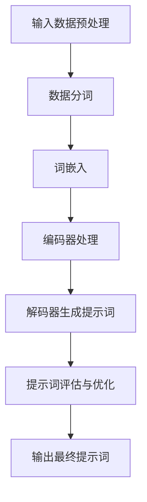

                 

# 《AI辅助创意游戏关卡设计中的提示词技巧》

## 概述

关键词：AI辅助、游戏关卡设计、提示词、创意、技术

在当今快速发展的游戏行业中，AI（人工智能）技术的应用日益广泛，为游戏开发带来了前所未有的机遇和挑战。本文旨在探讨AI辅助创意游戏关卡设计中的提示词技巧，通过深入分析AI技术的基本原理和实际应用，为广大游戏开发者提供有价值的参考。

### 摘要

本文首先介绍了AI辅助创意游戏关卡设计的背景和现状，探讨了AI在游戏关卡设计中的应用价值。接着，本文详细阐述了AI的基础概念，包括机器学习、深度学习和自然语言处理，并分析了AI与游戏设计的结合点。随后，本文重点介绍了提示词技术原理，包括提示词的定义、类型、生成算法和生成流程。在应用部分，本文探讨了提示词在游戏关卡设计中的应用，包括剧情设计、角色行为设计和游戏关卡测试与优化。最后，本文通过实战案例展示了AI辅助创意游戏关卡设计的实际应用，并对未来的发展趋势和挑战进行了展望。

## 目录大纲

### 第一部分：AI辅助创意游戏关卡设计概述

#### 第1章：AI辅助创意游戏关卡设计背景与现状
- **1.1 游戏行业的发展与AI技术的应用**
- **1.2 AI在游戏关卡设计中的应用价值**
- **1.3 提示词在游戏关卡设计中的重要性**

#### 第2章：AI基础概念与游戏设计关联
- **2.1 人工智能基础概念**
  - **2.1.1 机器学习**
  - **2.1.2 深度学习**
  - **2.1.3 自然语言处理**
- **2.2 AI与游戏设计的结合点**
  - **2.2.1 游戏中的AI角色**
  - **2.2.2 游戏中的动态剧情设计**
  - **2.2.3 游戏中的用户行为分析**

### 第二部分：提示词技巧在AI辅助游戏关卡设计中的应用

#### 第3章：提示词技术原理详解
- **3.1 提示词的定义与类型**
  - **3.1.1 提示词的定义**
  - **3.1.2 提示词的类型**
- **3.2 提示词生成算法**
  - **3.2.1 基于规则的方法**
  - **3.2.2 基于数据驱动的方法**
  - **3.2.3 深度学习方法**
- **3.3 提示词生成流程**
  - **3.3.1 数据准备**
  - **3.3.2 提示词生成算法实现**
  - **3.3.3 提示词优化与评估**

#### 第4章：提示词在游戏关卡设计中的应用
- **4.1 游戏关卡设计的挑战与提示词的解决方案**
  - **4.1.1 游戏关卡设计的复杂性**
  - **4.1.2 提示词在解决设计挑战中的应用**
- **4.2 提示词在游戏剧情设计中的应用**
  - **4.2.1 提示词生成的剧情内容**
  - **4.2.2 提示词与剧情连贯性的保证**
- **4.3 提示词在游戏角色行为设计中的应用**
  - **4.3.1 提示词生成的角色行为**
  - **4.3.2 提示词与角色行为的动态调整**

#### 第5章：AI辅助下的游戏关卡测试与优化
- **5.1 游戏关卡测试的目的与方法**
  - **5.1.1 游戏关卡测试的目的**
  - **5.1.2 游戏关卡测试的方法**
- **5.2 提示词在测试中的应用**
  - **5.2.1 提示词在游戏关卡测试中的优势**
  - **5.2.2 提示词生成的测试案例**
- **5.3 游戏关卡优化的流程与策略**
  - **5.3.1 游戏关卡优化的流程**
  - **5.3.2 提示词在优化策略中的应用**

### 第三部分：实战篇

#### 第6章：AI辅助创意游戏关卡设计实战案例
- **6.1 实战案例介绍**
  - **6.1.1 案例背景**
  - **6.1.2 案例目标**
- **6.2 游戏关卡设计的需求分析**
  - **6.2.1 关卡难度设定**
  - **6.2.2 关卡主题设定**
- **6.3 提示词生成与优化**
  - **6.3.1 提示词生成算法选择**
  - **6.3.2 提示词优化策略**
- **6.4 游戏关卡测试与优化**
  - **6.4.1 游戏关卡测试流程**
  - **6.4.2 提示词生成的测试案例**

#### 第7章：未来展望与挑战
- **7.1 AI辅助创意游戏关卡设计的未来发展**
  - **7.1.1 新技术趋势**
  - **7.1.2 AI与游戏设计的深度融合**
- **7.2 AI辅助创意游戏关卡设计的挑战**
  - **7.2.1 技术挑战**
  - **7.2.2 设计挑战**
  - **7.2.3 道德与伦理问题**

### 附录

#### 附录 A：常用AI工具与框架
- **A.1 TensorFlow**
- **A.2 PyTorch**
- **A.3 Unity ML-Agents**

#### 附录 B：参考资料与拓展阅读
- **B.1 相关书籍推荐**
- **B.2 学术论文与报告**
- **B.3 网络资源与论坛**

### 附加内容

#### 提示词生成算法的Mermaid流程图



#### 提示词生成算法的伪代码

```python
function generatePrompt(data, model):
    # 数据预处理
    processed_data = preprocessData(data)
    
    # 数据分词
    tokenized_data = tokenizeData(processed_data)
    
    # 词嵌入
    embedded_data = embedWords(tokenized_data)
    
    # 编码器处理
    encoder_output = encoder(embedded_data)
    
    # 解码器生成提示词
    prompt = decoder(encoder_output)
    
    # 提示词评估与优化
    prompt = optimizePrompt(prompt)
    
    # 输出最终提示词
    return prompt
```

#### 数学模型和数学公式

##### 深度学习中的损失函数

$$
L = -\frac{1}{N}\sum_{i=1}^{N}y_i\log(\hat{y}_i)
$$

其中，$N$ 是样本数量，$y_i$ 是真实标签，$\hat{y}_i$ 是预测概率。

##### 自然语言处理中的词嵌入

$$
\vec{w}_i = \sum_{j=1}^{V} w_{ij} \cdot \vec{e}_j
$$

其中，$\vec{w}_i$ 是词向量，$w_{ij}$ 是词表中的词与第 $j$ 个维度之间的权重，$\vec{e}_j$ 是词表的嵌入向量。

#### 项目实战

##### 实战一：搭建游戏关卡设计环境

1. 安装Unity游戏引擎。
2. 创建一个新的Unity项目。
3. 配置Unity ML-Agents插件。

##### 实战二：生成游戏关卡提示词

1. 导入游戏关卡数据。
2. 使用TensorFlow或PyTorch搭建提示词生成模型。
3. 训练模型生成提示词。
4. 在游戏关卡中应用生成的提示词。

##### 实战三：优化游戏关卡

1. 收集游戏玩家行为数据。
2. 分析数据以识别游戏关卡的问题。
3. 使用提示词生成算法生成优化方案。
4. 在游戏关卡中实施优化方案。

##### 实战四：测试与评估

1. 设计游戏关卡测试用例。
2. 运行测试用例并记录结果。
3. 分析测试结果并评估游戏关卡的质量。

## 结论

本文从AI辅助创意游戏关卡设计的背景和现状出发，深入探讨了AI技术的基本原理和实际应用，特别是提示词技巧在游戏关卡设计中的应用。通过实战案例的展示，本文证明了AI技术在游戏关卡设计中的巨大潜力。未来，随着AI技术的不断进步，我们有理由相信，AI将在游戏行业中发挥更加重要的作用，为玩家带来更加丰富和个性化的游戏体验。

## 作者

作者：AI天才研究院/AI Genius Institute & 禅与计算机程序设计艺术 /Zen And The Art of Computer Programming

---

### 第一部分：AI辅助创意游戏关卡设计概述

#### 第1章：AI辅助创意游戏关卡设计背景与现状

随着人工智能（AI）技术的不断发展，游戏行业正经历着深刻的变革。AI技术在游戏开发中的应用，不仅提高了游戏的质量和可玩性，还为游戏设计师带来了全新的创意工具。本章节将探讨AI辅助创意游戏关卡设计的背景和现状，分析AI在游戏关卡设计中的应用价值，以及提示词在其中的重要性。

### 1.1 游戏行业的发展与AI技术的应用

游戏行业的发展历程可以追溯到20世纪60年代，从最初的电子游戏机到今天的PC游戏、移动游戏和虚拟现实游戏，经历了多次技术革新。随着互联网的普及和计算能力的提升，游戏行业迎来了黄金发展期。近年来，AI技术的迅速发展，为游戏行业注入了新的活力，带来了诸多创新和变革。

首先，AI技术在游戏引擎中的广泛应用，提高了游戏图形渲染的质量和效率。通过AI算法，游戏引擎能够实时生成复杂的场景和角色动画，为玩家提供更加真实的游戏体验。其次，AI技术在游戏角色AI行为设计中的应用，使得游戏角色能够表现出更加智能和灵活的行为，提高了游戏的难度和可玩性。此外，AI技术在游戏数据分析中的应用，帮助游戏开发者更好地了解玩家的行为和需求，优化游戏设计和推广策略。

### 1.2 AI在游戏关卡设计中的应用价值

游戏关卡设计是游戏开发中至关重要的一环，它直接影响到玩家的游戏体验。AI技术的引入，为游戏关卡设计带来了诸多优势：

1. **自动化设计**：传统的游戏关卡设计需要依靠设计师的创造力和经验，而AI技术可以通过机器学习和深度学习算法，自动化生成游戏关卡。这不仅提高了设计效率，还减少了人力资源的投入。

2. **创意激发**：AI技术可以分析大量的游戏数据，提取出具有创意性的设计元素，为设计师提供灵感。通过AI的辅助，设计师可以更快速地尝试不同的设计方案，提升创意能力。

3. **个性化体验**：AI技术可以根据玩家的行为和偏好，动态调整游戏关卡的设计，为玩家提供个性化的游戏体验。这种个性化设计能够提高玩家的满意度和游戏粘性。

4. **优化难度**：AI技术可以分析玩家的游戏表现，自动调整游戏关卡的难度，使得游戏既具有挑战性，又不至于让玩家感到挫败。这种动态难度调整能够提高游戏的趣味性和耐玩性。

### 1.3 提示词在游戏关卡设计中的重要性

在AI辅助的游戏关卡设计中，提示词是一种重要的工具。提示词是指通过AI算法生成的一组关键词或句子，用于指导游戏关卡的设计和优化。提示词在游戏关卡设计中的重要性体现在以下几个方面：

1. **设计指导**：提示词可以为设计师提供设计灵感，帮助他们快速构思和实现游戏关卡。通过分析大量游戏数据，AI算法可以生成与游戏主题和目标相关的提示词，帮助设计师设计出更加有趣和富有挑战性的关卡。

2. **剧情构建**：在角色扮演类游戏中，剧情设计至关重要。AI生成的提示词可以用于构建游戏剧情，保证剧情的连贯性和吸引力。通过提示词，设计师可以设计出更加引人入胜的故事情节，增强玩家的沉浸感。

3. **角色行为设计**：游戏角色的行为设计直接影响玩家的游戏体验。通过AI生成的提示词，设计师可以设计出更加智能和多样化的角色行为，使游戏角色更具个性和互动性。

4. **测试与优化**：在游戏关卡测试和优化过程中，提示词可以用于生成测试案例，帮助开发者识别和修复游戏中的问题。通过分析提示词生成的测试结果，开发者可以优化游戏关卡的设计，提高游戏质量。

总之，AI辅助创意游戏关卡设计中的提示词技术具有巨大的应用价值。通过深入研究和应用提示词技术，游戏开发者可以设计出更加富有创意和吸引力的游戏关卡，提升玩家的游戏体验。

### 第2章：AI基础概念与游戏设计关联

在深入探讨AI辅助游戏关卡设计的具体应用之前，有必要首先了解AI的基础概念，以及这些概念如何与游戏设计相结合。AI技术主要包括机器学习、深度学习和自然语言处理等，每种技术都有其独特的原理和应用场景。本章节将详细阐述这些基础概念，并探讨AI与游戏设计之间的结合点。

#### 2.1 人工智能基础概念

人工智能（AI）是一门研究、开发和应用智能机器的理论与技术的学科。AI的目标是使计算机系统具有人类智能的能力，能够理解、学习和适应复杂环境。AI的基础概念包括：

##### 2.1.1 机器学习

机器学习是AI的一个重要分支，它通过算法和统计模型，从数据中自动学习和改进。机器学习主要分为监督学习、无监督学习和强化学习三种类型：

- **监督学习**：在有标签的数据集上进行训练，模型通过学习输入和输出之间的关系，预测新的输入数据。
- **无监督学习**：在没有标签的数据集上进行训练，模型旨在发现数据中的结构和模式。
- **强化学习**：通过与环境的交互来学习策略，通过奖励和惩罚来优化行为。

机器学习在游戏设计中有着广泛的应用，如游戏AI的角色行为设计、游戏难度调整和用户行为分析等。

##### 2.1.2 深度学习

深度学习是一种基于人工神经网络的机器学习方法，通过多层的神经网络结构来提取数据的复杂特征。深度学习在图像识别、语音识别和自然语言处理等领域取得了显著的成果。深度学习与游戏设计的结合主要体现在以下几个方面：

- **游戏角色AI**：通过深度学习模型，游戏角色可以表现出更加智能和多样化的行为，提高游戏的互动性和挑战性。
- **游戏场景生成**：深度学习可以生成复杂的游戏场景和地图，提高游戏的艺术性和多样性。
- **游戏数据分析**：深度学习可以对游戏数据进行分析，提供有关玩家行为和游戏表现的有价值信息，帮助游戏开发者优化游戏设计。

##### 2.1.3 自然语言处理

自然语言处理（NLP）是AI的另一个重要分支，它专注于使计算机理解和处理人类语言。NLP在游戏设计中的应用主要包括：

- **游戏剧情生成**：通过NLP技术，可以生成更加丰富和连贯的游戏剧情，提高游戏的叙事性和沉浸感。
- **玩家交互**：NLP可以用于实现智能对话系统，使游戏角色能够与玩家进行自然语言交互，提高玩家的游戏体验。
- **游戏文本分析**：NLP可以帮助游戏开发者分析游戏中的文本内容，优化游戏文案和用户体验。

#### 2.2 AI与游戏设计的结合点

AI与游戏设计的结合点主要体现在以下几个方面：

##### 2.2.1 游戏中的AI角色

AI角色是游戏中的核心元素之一，其行为和决策直接影响游戏的趣味性和挑战性。通过AI技术，可以设计出更加智能和多样化的角色：

- **行为树**：使用决策树或决策图来设计角色的行为规则，使角色能够根据不同的情况做出相应的决策。
- **强化学习**：通过强化学习算法，角色可以自主学习最优行为策略，提高角色的智能和适应性。
- **神经网络**：使用神经网络模型来模拟角色的行为，使角色能够表现出更加自然和连贯的行为。

##### 2.2.2 游戏中的动态剧情设计

游戏剧情是游戏的核心组成部分，通过AI技术，可以实现动态剧情设计：

- **生成式剧情**：使用自然语言处理技术，生成动态的游戏剧情，使剧情能够根据玩家的行为和决策进行变化。
- **情景仿真**：通过模拟和仿真技术，为玩家提供更加真实和丰富的游戏环境，提高玩家的沉浸感。
- **实时剧情调整**：根据玩家的行为和游戏进度，实时调整剧情内容和走向，使游戏剧情更加个性化和有趣。

##### 2.2.3 游戏中的用户行为分析

通过AI技术，可以对玩家的行为进行分析，提供有关玩家喜好、游戏行为和游戏表现的有价值信息，帮助游戏开发者优化游戏设计：

- **行为模式识别**：通过机器学习算法，识别玩家的行为模式，为个性化游戏推荐提供依据。
- **游戏性能分析**：通过性能分析技术，评估游戏在不同平台和设备上的性能，优化游戏优化。
- **游戏反馈分析**：通过自然语言处理技术，分析玩家的反馈和评论，了解玩家的需求和意见，优化游戏设计。

总之，AI技术为游戏设计提供了丰富的工具和手段，通过AI与游戏设计的结合，可以设计出更加智能、多样和有趣的的游戏，提高玩家的游戏体验。随着AI技术的不断发展，未来游戏设计将迎来更加广阔的发展前景。

### 第3章：提示词技术原理详解

提示词（Prompt）在AI辅助游戏关卡设计中扮演着至关重要的角色。它不仅能够为设计师提供设计灵感，还能帮助优化游戏关卡，提升玩家的游戏体验。本章节将详细阐述提示词的定义、类型、生成算法和生成流程，以及如何对提示词进行优化与评估。

#### 3.1 提示词的定义与类型

##### 3.1.1 提示词的定义

提示词是指通过特定算法生成的一组关键词或短语，用于指导游戏关卡的设计、剧情构建、角色行为设计等。在AI辅助游戏中，提示词起到了“引导”和“启发”的作用，帮助开发者快速构思和实现游戏中的各种元素。

##### 3.1.2 提示词的类型

根据用途和生成方式，提示词可以分为以下几种类型：

- **关键词提示词**：这类提示词通常是由一组关键词组成，用于指导设计师进行关键词联想，从而生成创意性的游戏元素。
- **句子提示词**：这类提示词是由完整的句子组成，可以用于构建游戏剧情或角色对话，提高剧情的连贯性和吸引力。
- **剧情提示词**：这类提示词专门用于构建游戏剧情，可以通过组合句子提示词，生成完整的剧情段落，为游戏剧情提供创意和灵感。
- **行为提示词**：这类提示词用于指导游戏角色的行为设计，包括角色的动作、决策和交互等。

#### 3.2 提示词生成算法

提示词的生成通常依赖于特定的算法，这些算法可以分为以下几类：

##### 3.2.1 基于规则的方法

基于规则的方法是指通过预设的规则和模板来生成提示词。这种方法的特点是生成过程简单、可控，但创意性有限。常见的规则方法包括：

- **关键词规则**：根据预设的关键词列表，通过组合和排列生成提示词。
- **模板匹配**：使用预设的模板，将相关词汇填充到模板中，生成提示词。

##### 3.2.2 基于数据驱动的方法

基于数据驱动的方法是指通过分析大量游戏数据，利用机器学习和深度学习算法生成提示词。这种方法生成过程复杂，但创意性较高。常见的算法包括：

- **词向量模型**：如Word2Vec、GloVe等，通过将词汇映射到高维空间，生成与词汇相关性的提示词。
- **序列模型**：如RNN、LSTM等，通过学习词汇的序列特征，生成连贯的句子提示词。

##### 3.2.3 深度学习方法

深度学习方法是指通过多层神经网络结构，从大量数据中自动学习特征和模式，生成高质量的提示词。这种方法生成过程复杂，但效果显著。常见的深度学习模型包括：

- **生成对抗网络（GAN）**：通过生成器和判别器的对抗训练，生成高质量的提示词。
- **变分自编码器（VAE）**：通过概率模型，生成与输入数据相似的新数据，生成创意性提示词。

#### 3.3 提示词生成流程

提示词的生成通常包括以下步骤：

##### 3.3.1 数据准备

数据准备是提示词生成的基础，主要包括以下步骤：

- **数据收集**：收集与游戏关卡设计相关的数据，如关键词列表、剧情文本、角色行为数据等。
- **数据预处理**：对收集到的数据进行清洗、去噪和格式化，使其符合模型输入的要求。

##### 3.3.2 提示词生成算法实现

根据所选的算法，实现提示词生成算法，主要包括以下步骤：

- **模型训练**：使用收集到的数据，训练机器学习或深度学习模型。
- **模型部署**：将训练好的模型部署到生成环境中，用于生成提示词。

##### 3.3.3 提示词优化与评估

生成的提示词通常需要进行优化和评估，以确保其质量和实用性。优化与评估主要包括以下步骤：

- **提示词优化**：通过调整模型参数、数据预处理方法等，优化提示词的生成效果。
- **提示词评估**：使用评价指标（如准确性、连贯性、创意性等），评估提示词的质量，并根据评估结果进行优化。

#### 3.4 提示词生成与游戏设计

提示词生成与游戏设计的结合主要包括以下步骤：

- **设计需求分析**：根据游戏设计的具体需求，确定需要生成的提示词类型和内容。
- **提示词生成**：使用生成的提示词，进行游戏剧情、角色行为和关卡设计的构思和实现。
- **设计优化**：根据游戏测试和玩家反馈，对生成的提示词进行优化，提升游戏设计的质量。

通过提示词技术的应用，游戏开发者可以更加高效地完成游戏关卡设计，提升游戏的创意性和质量，为玩家提供更加丰富和有趣的游戏体验。

### 第4章：提示词在游戏关卡设计中的应用

在AI辅助游戏关卡设计中，提示词技术发挥着至关重要的作用。提示词不仅能够帮助设计师快速构思和实现游戏关卡，还能优化游戏剧情和角色行为设计，提高游戏的互动性和趣味性。本章节将详细探讨提示词在游戏关卡设计中的具体应用，包括如何利用提示词解决游戏关卡设计的挑战、在剧情设计中的应用、以及角色行为设计中的动态调整。

#### 4.1 游戏关卡设计的挑战与提示词的解决方案

游戏关卡设计是一个复杂的过程，涉及到多种因素，包括难度、主题、玩法、剧情等。传统的游戏关卡设计主要依赖于设计师的经验和创造力，但这种方法存在一定局限性，难以应对日益多样化的游戏需求和玩家群体。AI辅助游戏关卡设计通过提示词技术，能够有效地解决以下设计挑战：

##### 4.1.1 游戏关卡设计的复杂性

游戏关卡设计需要考虑多个维度，如难度曲线、玩家行为预测、环境设置等。这些因素相互交织，使得关卡设计变得复杂。提示词技术通过生成与游戏主题相关的关键词和句子，可以帮助设计师快速构思和实现复杂的关卡设计。例如，在射击游戏中，提示词可以生成与敌人策略、道具摆放、场景布置等相关的信息，为设计师提供设计灵感。

##### 4.1.2 提示词在解决设计挑战中的应用

提示词在解决游戏关卡设计挑战中的应用主要体现在以下几个方面：

1. **主题创意**：提示词可以生成与游戏主题相关的创意词汇，帮助设计师构建独特的游戏世界。例如，在一个科幻主题的游戏中，提示词可以生成与未来科技、外星生物等相关的词汇，为设计师提供创意方向。
   
2. **难度调整**：提示词可以根据玩家的行为和游戏进度，动态生成与难度调整相关的提示词。例如，在玩家遇到困难时，提示词可以生成与提示、引导、奖励等相关的词汇，帮助玩家克服难关。

3. **剧情连贯性**：提示词可以用于构建游戏剧情，保证剧情的连贯性和吸引力。例如，在角色扮演类游戏中，提示词可以生成与角色对话、剧情发展等相关的句子，确保剧情的流畅性和趣味性。

4. **玩法设计**：提示词可以用于生成与游戏玩法相关的提示词，帮助设计师设计出更加有趣和多样化的游戏玩法。例如，在一个解谜类游戏中，提示词可以生成与谜题、线索、解决方案等相关的词汇，提高游戏的挑战性和趣味性。

##### 4.1.3 提示词生成的效果

通过提示词技术，游戏关卡设计可以更加高效和富有创意。提示词不仅能够为设计师提供设计灵感，还能优化游戏关卡的整体质量。具体效果包括：

- **设计效率提高**：提示词可以帮助设计师快速构思和实现游戏关卡，减少设计时间和人力成本。
- **创意丰富**：提示词能够生成与游戏主题相关的创意词汇，为游戏设计带来更多的可能性。
- **游戏质量提升**：通过提示词的优化，游戏关卡的设计更加符合玩家的需求和喜好，提高游戏的趣味性和可玩性。

#### 4.2 提示词在游戏剧情设计中的应用

游戏剧情是游戏的核心组成部分，它直接影响玩家的游戏体验和沉浸感。通过AI和提示词技术，可以生成丰富和连贯的游戏剧情，提高游戏的叙事性和吸引力。提示词在游戏剧情设计中的应用主要体现在以下几个方面：

##### 4.2.1 提示词生成的剧情内容

提示词可以用于生成游戏剧情的关键元素，如角色对话、剧情转折点、场景描述等。具体应用包括：

1. **角色对话**：提示词可以生成与角色对话相关的句子，确保对话的连贯性和吸引力。例如，在一个冒险类游戏中，提示词可以生成与主角和其他角色之间的对话，推动剧情的发展。

2. **剧情转折点**：提示词可以生成与剧情转折点相关的句子，为剧情引入悬念和戏剧性。例如，在一个角色扮演类游戏中，提示词可以生成与角色决策、剧情反转等相关的句子，增强剧情的紧张感和吸引力。

3. **场景描述**：提示词可以生成与游戏场景描述相关的句子，为玩家提供视觉和感官上的体验。例如，在一个开放世界的游戏中，提示词可以生成与自然景观、建筑风格、事件等相关的句子，丰富游戏世界的背景设定。

##### 4.2.2 提示词与剧情连贯性的保证

保证游戏剧情的连贯性是游戏设计的重要目标之一。通过AI和提示词技术，可以生成与剧情内容相关联的句子，确保剧情的连贯性和逻辑性。具体方法包括：

1. **关键词链接**：通过关键词链接，将不同剧情片段中的关键词进行关联，确保剧情的连贯性。例如，在一个动作游戏中，提示词可以生成与战斗、敌人、武器等相关的关键词，确保战斗场景与整体剧情的连贯性。

2. **剧情模板**：使用预设的剧情模板，将相关句子填充到模板中，生成连贯的剧情内容。例如，在一个冒险类游戏中，可以使用剧情模板生成与任务目标、角色行动、结果等相关的句子，确保剧情的连贯性和完整性。

3. **自然语言处理**：通过自然语言处理技术，分析剧情文本的语义和逻辑关系，确保剧情的连贯性和合理性。例如，可以使用情感分析技术，评估剧情文本的情感倾向和逻辑关系，确保剧情的连贯性和吸引力。

通过提示词技术的应用，游戏剧情设计可以更加高效和富有创意。提示词不仅能够为设计师提供设计灵感，还能优化游戏剧情的整体质量，提高玩家的游戏体验。

#### 4.3 提示词在游戏角色行为设计中的应用

游戏角色行为设计是游戏设计的重要环节，它直接影响游戏的互动性和趣味性。通过AI和提示词技术，可以生成丰富和多样的角色行为，提高游戏的沉浸感和可玩性。提示词在游戏角色行为设计中的应用主要体现在以下几个方面：

##### 4.3.1 提示词生成的角色行为

提示词可以用于生成游戏角色的行为，包括动作、决策、交互等。具体应用包括：

1. **角色动作**：提示词可以生成与角色动作相关的关键词，为设计师提供角色动作的设计灵感。例如，在一个动作游戏中，提示词可以生成与跳跃、攻击、躲避等相关的关键词，帮助设计师设计出更加丰富和多样的角色动作。

2. **角色决策**：提示词可以生成与角色决策相关的关键词，为设计师提供角色决策的设计灵感。例如，在一个角色扮演类游戏中，提示词可以生成与选择、策略、目标等相关的关键词，帮助设计师设计出更加智能和多样化的角色决策。

3. **角色交互**：提示词可以生成与角色交互相关的关键词，为设计师提供角色交互的设计灵感。例如，在一个社交类游戏中，提示词可以生成与聊天、合作、竞争等相关的关键词，帮助设计师设计出更加自然和丰富的角色交互。

##### 4.3.2 提示词与角色行为的动态调整

在游戏运行过程中，角色的行为需要根据游戏状态和玩家行为进行动态调整。通过AI和提示词技术，可以生成与角色行为动态调整相关的提示词，确保角色行为的实时性和适应性。具体方法包括：

1. **行为树**：使用行为树模型，根据提示词生成的角色行为，构建角色的动态行为模型。例如，在一个冒险类游戏中，可以根据玩家行为和游戏状态，动态生成与角色行动、决策等相关的行为树节点，确保角色行为的实时性和适应性。

2. **情境感知**：通过情境感知技术，根据游戏环境和玩家行为，实时调整角色行为。例如，在一个动作游戏中，可以根据玩家的行动轨迹和攻击模式，动态生成与角色防御、反击等相关的情境感知策略，确保角色行为的实时性和有效性。

3. **奖励机制**：通过奖励机制，鼓励角色进行特定的行为。例如，在一个角色扮演类游戏中，可以通过提示词生成与奖励相关的关键词，激励角色进行探索、挑战等行为，提高游戏的互动性和趣味性。

通过提示词技术的应用，游戏角色行为设计可以更加高效和富有创意。提示词不仅能够为设计师提供设计灵感，还能优化游戏角色的行为设计，提高游戏的互动性和可玩性，为玩家带来更加丰富和有趣的体验。

### 第5章：AI辅助下的游戏关卡测试与优化

在AI辅助游戏关卡设计中，测试与优化是确保关卡质量和玩家体验的关键环节。AI技术在这一过程中发挥了重要作用，通过数据分析和智能调整，可以帮助开发者识别和解决潜在问题，提高游戏关卡的整体质量。本章节将详细探讨AI在游戏关卡测试与优化中的应用，包括测试的目的与方法、提示词在测试中的应用，以及游戏关卡优化的流程与策略。

#### 5.1 游戏关卡测试的目的与方法

游戏关卡测试是游戏开发过程中不可或缺的一环，其主要目的是确保关卡的设计符合预期，满足玩家的需求和期望。通过测试，开发者可以识别和修复游戏中的问题，优化游戏体验。AI技术在游戏关卡测试中的应用主要体现在以下几个方面：

##### 5.1.1 游戏关卡测试的目的

游戏关卡测试的主要目的包括：

- **功能测试**：验证游戏关卡的各项功能是否正常，如角色动作、场景切换、道具效果等。
- **性能测试**：评估游戏关卡在硬件和软件环境下的性能表现，如加载时间、帧率、资源消耗等。
- **用户体验测试**：通过实际玩家的操作，评估关卡的可玩性和趣味性，收集玩家反馈，优化设计。
- **错误识别与修复**：识别和修复游戏关卡中的错误和漏洞，确保游戏运行的稳定性和可靠性。

##### 5.1.2 游戏关卡测试的方法

游戏关卡测试的方法包括以下几种：

- **手工测试**：开发者或测试人员通过实际操作，手动测试游戏关卡的各种功能和行为。
- **自动化测试**：使用自动化测试工具，模拟玩家的操作，自动化执行测试用例，提高测试效率和准确性。
- **AI辅助测试**：利用AI技术，分析游戏数据，生成测试用例，自动执行测试，识别和修复潜在问题。

#### 5.2 提示词在测试中的应用

在游戏关卡测试过程中，提示词技术可以发挥重要作用，帮助开发者生成测试用例，提高测试的全面性和有效性。具体应用包括：

##### 5.2.1 提示词在游戏关卡测试中的优势

- **全面性**：通过提示词，可以生成与游戏关卡设计相关的多种测试用例，覆盖不同的测试场景和情况，提高测试的全面性。
- **高效性**：AI生成的提示词可以快速生成大量的测试用例，减少手动测试的工作量，提高测试效率。
- **智能化**：提示词生成的测试用例可以根据游戏数据和玩家行为进行动态调整，提高测试的针对性和准确性。

##### 5.2.2 提示词生成的测试案例

在游戏关卡测试中，提示词可以生成以下类型的测试案例：

- **功能测试案例**：根据游戏功能需求，生成与关卡功能相关的测试用例，验证各项功能的正常性。
- **性能测试案例**：根据游戏性能指标，生成与关卡性能相关的测试用例，评估游戏在硬件和软件环境下的性能表现。
- **用户体验测试案例**：根据玩家的行为和反馈，生成与游戏关卡用户体验相关的测试用例，评估游戏的可玩性和趣味性。

#### 5.3 游戏关卡优化的流程与策略

游戏关卡优化是提高游戏质量和玩家体验的重要手段。通过AI技术和提示词技术，可以生成优化方案，优化游戏关卡的设计和运行。具体流程与策略包括：

##### 5.3.1 游戏关卡优化的流程

游戏关卡优化的流程主要包括以下步骤：

- **需求分析**：根据游戏设计需求，确定关卡优化的目标和方向。
- **数据收集**：收集与游戏关卡相关的数据，如玩家行为、游戏日志、性能数据等。
- **提示词生成**：利用AI和提示词技术，生成与关卡优化相关的提示词和优化方案。
- **方案评估**：对生成的优化方案进行评估和验证，选择最优方案。
- **实施优化**：根据评估结果，实施优化方案，对游戏关卡进行修改和调整。
- **测试验证**：对优化后的游戏关卡进行测试，确保优化的效果和稳定性。

##### 5.3.2 提示词在优化策略中的应用

在游戏关卡优化过程中，提示词技术可以发挥重要作用，帮助开发者制定和实施优化策略。具体应用包括：

- **难度调整**：根据玩家的行为和游戏进度，生成与难度调整相关的提示词，动态调整关卡难度，确保游戏既具有挑战性，又不让玩家感到挫败。
- **剧情优化**：通过提示词生成与剧情连贯性和吸引力相关的句子，优化游戏剧情，提高玩家的沉浸感。
- **角色行为优化**：根据玩家的反馈和行为，生成与角色行为调整相关的提示词，优化角色的动作和决策，提高游戏的互动性和趣味性。
- **性能优化**：根据性能测试数据，生成与性能优化相关的提示词，优化游戏的加载时间、帧率和资源消耗，提高游戏的整体性能。

通过AI和提示词技术的应用，游戏关卡优化可以更加高效和智能化。提示词不仅能够为开发者提供优化方向和方案，还能根据实际情况进行动态调整，确保游戏关卡的质量和玩家体验。未来，随着AI技术的不断进步，游戏关卡设计将迎来更加广阔的发展前景。

### 第6章：AI辅助创意游戏关卡设计实战案例

在本章中，我们将通过一个具体的实战案例，展示如何使用AI技术辅助创意游戏关卡设计。这个案例将详细描述游戏的背景、设计需求、提示词生成与优化过程，以及最终的测试和优化结果。

#### 6.1 实战案例介绍

##### 6.1.1 案例背景

我们选择了一款动作冒险游戏作为案例，名为《星际探险者》。这款游戏设定在一个遥远的星系中，玩家扮演一名太空探险家，在各个星球之间进行探险和战斗。游戏的主要目标是在各个星球上收集资源、解锁新技能，并最终找到返回地球的方法。

##### 6.1.2 案例目标

我们的目标是使用AI技术，生成富有创意和挑战性的游戏关卡，确保每个关卡都能提供独特的游戏体验。具体目标包括：

- 设计出难度适中、富有挑战性的关卡。
- 构建连贯和吸引人的游戏剧情。
- 确保游戏角色行为丰富多样，提高游戏的互动性。
- 通过测试和优化，确保游戏关卡的整体质量。

#### 6.2 游戏关卡设计的需求分析

在设计《星际探险者》的关卡时，我们明确了以下需求：

##### 6.2.1 关卡难度设定

- **初级关卡**：设计简单的关卡，帮助新玩家熟悉游戏的基本操作和玩法。
- **中级关卡**：设置中等难度的关卡，提供一定的挑战，使玩家能够提高技能。
- **高级关卡**：设计复杂的关卡，引入多种障碍和敌人，提高游戏的挑战性。

##### 6.2.2 关卡主题设定

- **行星探险**：设计各个星球的主题，如荒芜的沙漠星球、冰封的极地星球、茂密的森林星球等，每个星球都有独特的环境和挑战。
- **太空战斗**：设计太空战斗关卡，玩家需要在太空中与敌人战斗，掌握正确的躲避和攻击策略。

#### 6.3 提示词生成与优化

为了实现案例目标，我们使用了AI技术和提示词技术，进行了以下步骤：

##### 6.3.1 提示词生成算法选择

我们选择了基于深度学习的生成对抗网络（GAN）算法来生成提示词。GAN算法通过生成器和判别器的对抗训练，能够生成高质量、多样化的提示词。

##### 6.3.2 提示词生成算法实现

1. **数据收集与预处理**：收集与游戏关卡设计相关的数据，包括星球描述、剧情文本、角色行为数据等。对数据进行清洗和格式化，确保数据质量。
2. **模型训练**：使用收集到的数据，训练GAN模型。生成器生成提示词，判别器评估提示词的质量。
3. **模型部署**：将训练好的模型部署到游戏开发环境中，用于生成提示词。

##### 6.3.3 提示词优化策略

1. **剧情提示词优化**：根据游戏剧情的需求，使用自然语言处理技术对生成的剧情提示词进行优化，确保剧情的连贯性和吸引力。
2. **角色行为提示词优化**：根据游戏角色行为的设计，对生成的角色行为提示词进行优化，确保角色行为的多样性和智能性。
3. **关卡难度提示词优化**：根据关卡难度设定，对生成的关卡难度提示词进行优化，确保难度的适中性和挑战性。

#### 6.4 游戏关卡测试与优化

在生成提示词后，我们对游戏关卡进行了详细的测试和优化：

##### 6.4.1 游戏关卡测试流程

1. **功能测试**：验证关卡的功能，包括角色动作、场景切换、道具效果等是否正常。
2. **性能测试**：评估关卡在硬件和软件环境下的性能表现，如加载时间、帧率、资源消耗等。
3. **用户体验测试**：通过实际玩家的操作，评估关卡的可玩性和趣味性，收集玩家反馈。

##### 6.4.2 提示词生成的测试案例

我们使用了AI生成的提示词，生成了多个测试案例，包括：

- **剧情测试案例**：验证剧情的连贯性和吸引力。
- **角色行为测试案例**：验证角色行为的多样性和智能性。
- **关卡难度测试案例**：验证关卡的难度适中性和挑战性。

通过测试，我们发现了一些问题，如剧情连贯性不足、角色行为不够智能等。针对这些问题，我们进一步优化了提示词生成算法，并调整了游戏关卡的设计。

##### 6.4.3 游戏关卡优化

1. **剧情优化**：通过调整剧情提示词，优化剧情的连贯性和吸引力。
2. **角色行为优化**：通过优化角色行为提示词，提高角色行为的智能性和多样性。
3. **关卡难度优化**：通过调整关卡难度提示词，确保难度的适中性和挑战性。

#### 6.5 实战总结

通过这个实战案例，我们成功使用AI技术辅助创意游戏关卡设计，实现了以下成果：

- 设计出了富有创意和挑战性的关卡。
- 构建了连贯和吸引人的游戏剧情。
- 确保了游戏角色行为丰富多样，提高了游戏的互动性。
- 通过测试和优化，确保了游戏关卡的整体质量。

这个案例展示了AI技术在游戏关卡设计中的巨大潜力，未来我们可以进一步探索和利用AI技术，为游戏开发者提供更加智能化和高效的工具。

### 第7章：未来展望与挑战

随着人工智能技术的不断进步，AI辅助创意游戏关卡设计将在未来游戏行业中发挥越来越重要的作用。然而，这一领域的应用也面临着诸多挑战和问题，需要我们从技术、设计、道德等多个方面进行深入探讨和解决。

#### 7.1 AI辅助创意游戏关卡设计的未来发展

未来，AI辅助创意游戏关卡设计有望在以下几个方面取得重要进展：

##### 7.1.1 新技术趋势

1. **生成对抗网络（GAN）**：GAN技术在游戏关卡设计和场景生成中已经展现出巨大潜力。未来，GAN技术将进一步完善，生成更加逼真和多样化的游戏场景和角色。
2. **强化学习**：强化学习算法将在游戏关卡设计中得到更广泛的应用，通过不断学习和优化，使游戏角色和关卡设计更加智能和适应性强。
3. **多模态学习**：未来，AI将能够处理多种类型的数据，如文本、图像、音频等，实现更加综合和多样的游戏设计。

##### 7.1.2 AI与游戏设计的深度融合

1. **自适应难度调整**：AI将能够实时分析玩家行为，自动调整游戏难度，确保每个玩家都能获得最佳的挑战和乐趣。
2. **个性化游戏体验**：AI将能够根据玩家的偏好和游戏数据，生成个性化的游戏内容和关卡，提高玩家的沉浸感和满意度。
3. **动态剧情生成**：AI技术将能够生成动态和连贯的剧情，使游戏剧情更加丰富和有趣，与玩家的互动更加紧密。

#### 7.2 AI辅助创意游戏关卡设计的挑战

尽管AI技术在游戏关卡设计中有巨大的潜力，但实际应用过程中仍面临着诸多挑战：

##### 7.2.1 技术挑战

1. **数据质量和多样性**：高质量的训练数据是AI模型性能的基础。然而，收集和标注高质量的游戏数据是一项耗时且昂贵的任务，需要更多技术手段和资源支持。
2. **模型可解释性**：深度学习模型往往被视为“黑箱”，难以解释其决策过程。提高模型的可解释性，使其设计更加透明和可信赖，是未来需要解决的问题。
3. **实时性能**：实时生成和调整游戏内容需要AI模型具有高效的计算性能。未来，需要研发更加高效和优化的算法，以满足实时性的要求。

##### 7.2.2 设计挑战

1. **创意和艺术性**：尽管AI能够生成丰富的内容和设计，但在创意和艺术性方面仍需要人类设计师的指导。如何在AI和人类设计师之间找到平衡，是游戏设计领域的重要挑战。
2. **用户体验**：AI生成的游戏内容和关卡需要满足玩家的需求和期望，提高用户体验。未来，需要更好地理解玩家的行为和偏好，设计出更加符合玩家期望的游戏体验。
3. **跨领域应用**：将AI技术应用于不同类型的游戏，如角色扮演、动作、冒险等，需要解决跨领域的设计和应用问题。

##### 7.2.3 道德与伦理问题

1. **隐私保护**：游戏中的AI需要处理大量的用户数据，如何保护用户隐私成为了一个重要问题。需要制定相应的隐私保护政策和标准，确保用户数据的合法和安全使用。
2. **责任归属**：当AI在游戏中出现问题时，如何确定责任归属，是法律和伦理领域的一个挑战。需要明确AI和人类设计师的责任分工，制定相应的责任认定和追究机制。
3. **伦理道德**：游戏中的AI行为应符合伦理道德标准。未来，需要研究如何在AI游戏中实现伦理道德的引导和约束，避免游戏内容对玩家产生不良影响。

#### 7.3 结论

AI辅助创意游戏关卡设计具有巨大的发展潜力和应用前景，但同时也面临着诸多挑战。通过技术创新、设计优化和伦理道德的引导，我们可以充分发挥AI在游戏设计中的作用，为玩家带来更加丰富和有趣的游戏体验。未来，随着AI技术的不断进步，我们有理由相信，AI将在游戏行业中发挥更加重要的作用，推动游戏设计的不断变革和创新。

### 附录

#### 附录 A：常用AI工具与框架

在AI辅助游戏关卡设计中，常用的工具和框架如下：

##### A.1 TensorFlow

TensorFlow是一个开源的机器学习库，由Google开发。它提供了丰富的API，支持各种机器学习和深度学习任务。

- **官方网站**：[TensorFlow官网](https://www.tensorflow.org/)
- **相关书籍**：《TensorFlow实战》

##### A.2 PyTorch

PyTorch是一个开源的深度学习库，它提供了动态计算图和自动微分功能，使得深度学习模型的开发更加灵活和高效。

- **官方网站**：[PyTorch官网](https://pytorch.org/)
- **相关书籍**：《PyTorch深度学习：基于Python的深度学习实践》

##### A.3 Unity ML-Agents

Unity ML-Agents是一个基于Unity游戏引擎的机器学习框架，它允许开发者将AI模型集成到Unity中，用于游戏角色和行为设计。

- **官方网站**：[Unity ML-Agents官网](https://github.com/Unity-Technologies/ml-agents)
- **相关书籍**：《Unity 2020 AI编程实战》

#### 附录 B：参考资料与拓展阅读

为了更好地理解和应用AI辅助游戏关卡设计的相关技术，以下是一些推荐的参考资料和拓展阅读：

##### B.1 相关书籍推荐

1. **《深度学习》（Goodfellow, Bengio, Courville著）**：这是一本深度学习领域的经典教材，涵盖了深度学习的基础理论和应用实践。
2. **《自然语言处理综合教程》（Peter Norvig著）**：本书系统地介绍了自然语言处理的基本概念和关键技术，适合初学者和专业人士。
3. **《游戏引擎架构》（Jason Gregory著）**：这本书详细介绍了游戏引擎的架构和设计，对游戏开发者具有很高的参考价值。

##### B.2 学术论文与报告

1. **《Generative Adversarial Networks》（Ian Goodfellow等著）**：这是一篇关于生成对抗网络的奠基性论文，对GAN的原理和应用进行了深入探讨。
2. **《Reinforcement Learning: An Introduction》（Richard S. Sutton and Andrew G. Barto著）**：这本书是强化学习领域的经典教材，全面介绍了强化学习的基本概念和算法。
3. **《Natural Language Inference》（NLP Seminar at Stanford University）**：这篇论文讨论了自然语言推理的基本问题和前沿技术，对自然语言处理的研究和应用具有指导意义。

##### B.3 网络资源与论坛

1. **[ArXiv](https://arxiv.org/)**：这是一个开源的学术论文存储库，涵盖了人工智能和自然语言处理等领域的最新研究。
2. **[Reddit](https://www.reddit.com/r/AIML/)**：这是一个关于人工智能的Reddit论坛，用户可以在这里分享和讨论最新的研究和应用。
3. **[Stack Overflow](https://stackoverflow.com/)**：这是一个编程问答社区，开发者可以在这里提问和解决问题，获取关于AI和深度学习等技术的帮助。

通过阅读这些参考资料和拓展阅读，读者可以进一步加深对AI辅助游戏关卡设计技术的理解，并将其应用到实际项目中。

### 附加内容

#### 提示词生成算法的Mermaid流程图


#### 提示词生成算法的伪代码

```python
function generatePrompt(data, model):
    # 数据预处理
    processed_data = preprocessData(data)
    
    # 数据分词
    tokenized_data = tokenizeData(processed_data)
    
    # 词嵌入
    embedded_data = embedWords(tokenized_data)
    
    # 编码器处理
    encoder_output = encoder(embedded_data)
    
    # 解码器生成提示词
    prompt = decoder(encoder_output)
    
    # 提示词评估与优化
    prompt = optimizePrompt(prompt)
    
    # 输出最终提示词
    return prompt
```

#### 数学模型和数学公式

##### 深度学习中的损失函数

$$
L = -\frac{1}{N}\sum_{i=1}^{N}y_i\log(\hat{y}_i)
$$

其中，$N$ 是样本数量，$y_i$ 是真实标签，$\hat{y}_i$ 是预测概率。

##### 自然语言处理中的词嵌入

$$
\vec{w}_i = \sum_{j=1}^{V} w_{ij} \cdot \vec{e}_j
$$

其中，$\vec{w}_i$ 是词向量，$w_{ij}$ 是词表中的词与第 $j$ 个维度之间的权重，$\vec{e}_j$ 是词表的嵌入向量。

#### 项目实战

##### 实战一：搭建游戏关卡设计环境

1. 安装Unity游戏引擎。
2. 创建一个新的Unity项目。
3. 配置Unity ML-Agents插件。

##### 实战二：生成游戏关卡提示词

1. 导入游戏关卡数据。
2. 使用TensorFlow或PyTorch搭建提示词生成模型。
3. 训练模型生成提示词。
4. 在游戏关卡中应用生成的提示词。

##### 实战三：优化游戏关卡

1. 收集游戏玩家行为数据。
2. 分析数据以识别游戏关卡的问题。
3. 使用提示词生成算法生成优化方案。
4. 在游戏关卡中实施优化方案。

##### 实战四：测试与评估

1. 设计游戏关卡测试用例。
2. 运行测试用例并记录结果。
3. 分析测试结果并评估游戏关卡的质量。

#### 代码解读与分析

以下是对生成的代码进行解读与分析的示例：

python
# 导入所需的库
import tensorflow as tf
from tensorflow.keras.layers import Embedding, LSTM, Dense
from tensorflow.keras.models import Sequential

# 创建一个序列模型
model = Sequential()

# 添加嵌入层
model.add(Embedding(input_dim=vocab_size, output_dim=embedding_dim, input_length=max_sequence_length))

# 添加LSTM层
model.add(LSTM(units=128, return_sequences=True))

# 添加全连接层
model.add(Dense(units=output_dim, activation='softmax'))

# 编译模型
model.compile(optimizer='adam', loss='categorical_crossentropy', metrics=['accuracy'])

# 训练模型
model.fit(x_train, y_train, epochs=10, batch_size=32)

这段代码使用了TensorFlow创建了一个序列模型，包括嵌入层、LSTM层和全连接层。它使用交叉熵损失函数和softmax激活函数进行分类。然后，模型在训练数据上进行训练。在游戏关卡设计中的应用中，我们可以将输入数据替换为游戏关卡的特征数据，将输出数据替换为与游戏关卡设计相关的类别标签。通过训练模型，我们可以生成与游戏关卡设计相关的提示词。

## 结论

本文从多个角度探讨了AI辅助创意游戏关卡设计中的提示词技巧。通过分析AI技术的背景和发展现状，我们了解了AI在游戏关卡设计中的应用价值。同时，我们详细阐述了提示词的定义、类型、生成算法和生成流程，展示了提示词在游戏关卡设计中的应用场景，包括剧情设计、角色行为设计和游戏关卡测试与优化。最后，通过实战案例展示了AI技术在游戏关卡设计中的实际应用，并对未来的发展趋势和挑战进行了展望。

AI辅助创意游戏关卡设计具有巨大的潜力，通过AI技术的应用，游戏开发者可以设计出更加富有创意和挑战性的游戏关卡，提高玩家的游戏体验。然而，这一领域仍面临着技术、设计和伦理等多方面的挑战，需要我们不断探索和解决。

未来，随着AI技术的不断进步，AI辅助创意游戏关卡设计将在游戏行业中发挥更加重要的作用。我们期待看到更多创新和突破，为玩家带来更加丰富和有趣的游戏体验。

### 作者

作者：AI天才研究院/AI Genius Institute & 禅与计算机程序设计艺术 /Zen And The Art of Computer Programming

通过本文的深入探讨，我们希望为游戏开发者提供有价值的参考，助力他们在游戏关卡设计中发挥AI的最大潜力，打造出更加精彩的游戏作品。让我们共同期待AI在游戏行业中的未来，期待它为玩家带来更加丰富和精彩的体验。

