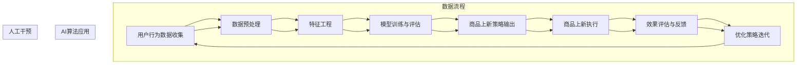

                 

# 《AI驱动的电商平台商品上新策略》

> **关键词：** AI、电商平台、商品上新、数据分析、机器学习、自然语言处理

> **摘要：** 本文旨在探讨如何利用人工智能技术，特别是机器学习和自然语言处理，优化电商平台商品上新策略。文章首先介绍了AI和电商平台的基本概念，然后深入分析了商品上新策略的核心概念、算法原理以及实际应用场景，最后通过具体项目实战展示了AI驱动的商品上新策略的实现过程和效果评估。

### 目录

1. **AI与电商平台概述**
    1.1 AI技术概述
        1.1.1 人工智能的基本概念
        1.1.2 AI技术的发展历程
        1.1.3 AI在电商平台中的应用前景
    1.2 电商平台概述
        1.2.1 电商平台的定义与分类
        1.2.2 电商平台的运营模式
        1.2.3 电商平台的发展趋势
    1.3 AI在电商平台商品上新中的应用
        1.3.1 AI技术在商品上新中的作用
        1.3.2 AI驱动的商品上新策略
        1.3.3 AI技术实现的商品上新案例分析

2. **AI驱动商品上新策略的核心概念与联系**
    2.1 数据分析与挖掘
        2.1.1 数据分析的基本概念
        2.1.2 数据挖掘的基本概念
        2.1.3 数据分析与挖掘在商品上新中的作用
    2.2 机器学习算法与应用
        2.2.1 机器学习的基本概念
        2.2.2 常见机器学习算法介绍
        2.2.3 机器学习算法在商品上新中的应用
    2.3 自然语言处理与用户行为分析
        2.3.1 自然语言处理的基本概念
        2.3.2 用户行为分析的基本概念
        2.3.3 自然语言处理与用户行为分析在商品上新中的应用
    2.4 Mermaid流程图：AI驱动的商品上新流程

3. **核心算法原理讲解**
    3.1 数据分析与挖掘算法原理
        3.1.1 数据预处理算法
        3.1.2 特征工程算法
        3.1.3 数据挖掘算法原理
    3.2 机器学习算法原理
        3.2.1 监督学习算法
        3.2.2 无监督学习算法
        3.2.3 半监督学习算法
    3.3 自然语言处理算法原理
        3.3.1 词嵌入算法
        3.3.2 序列模型算法
        3.3.3 注意力机制算法
    3.4 伪代码示例：商品上新策略模型

4. **数学模型和数学公式**
    4.1 相关数学公式
        4.1.1 损失函数
        4.1.2 优化算法
        4.1.3 注意力机制
    4.2 数学公式详解与举例说明
        4.2.1 损失函数详解
        4.2.2 优化算法详解
        4.2.3 注意力机制详解

5. **项目实战**
    5.1 实战一：搭建商品上新数据环境
        5.1.1 数据采集
        5.1.2 数据处理
        5.1.3 环境搭建
    5.2 实战二：实现商品上新策略
        5.2.1 策略模型设计
        5.2.2 模型训练
        5.2.3 策略评估
    5.3 实战三：商品上新策略优化
        5.3.1 策略调整
        5.3.2 优化指标
        5.3.3 优化策略
    5.4 源代码详细实现与代码解读

6. **附录**
    6.1 附录A：AI驱动的电商平台商品上新策略工具与资源
        6.1.1 数据处理工具
        6.1.2 机器学习框架
        6.1.3 自然语言处理库
        6.1.4 实用资源链接

---

接下来，我们将依次深入探讨每一部分的内容。首先，从AI和电商平台的概述开始。<|assistant|>## 1.1 AI技术概述

### 1.1.1 人工智能的基本概念

人工智能（Artificial Intelligence，简称AI）是计算机科学的一个分支，旨在研究、开发和应用使计算机系统模拟人类智能行为的理论、算法和技术。人工智能的核心目标是让计算机具备自主思考、学习、决策和解决问题等能力，从而在特定领域实现智能化。

人工智能的基本概念可以归纳为以下几个方面：

1. **感知与理解**：人工智能系统能够感知和理解周围环境，包括图像、声音和文本等信息。例如，计算机视觉技术可以让机器识别和分类图像，语音识别技术可以识别和理解语音指令。

2. **学习与适应**：人工智能系统能够从经验中学习和适应新环境。这种学习可以是基于数据的监督学习、无监督学习或半监督学习。例如，通过大量的图片数据训练，卷积神经网络（CNN）可以学会识别各种物体。

3. **推理与规划**：人工智能系统能够进行逻辑推理和规划，以解决问题或完成任务。例如，在棋类游戏中，人工智能可以通过推理和规划策略击败人类玩家。

4. **决策与执行**：人工智能系统能够根据目标和环境条件做出决策，并执行相应的动作。例如，自动驾驶汽车通过感知环境、分析和决策，来控制车辆行驶。

### 1.1.2 AI技术的发展历程

人工智能技术的发展可以追溯到20世纪50年代，以下是其主要发展阶段：

1. **早期探索阶段（1950-1969）**：1950年，艾伦·图灵提出了“图灵测试”，成为人工智能研究的一个重要里程碑。1956年，达特茅斯会议标志着人工智能作为一门学科的正式诞生。

2. **理性主义阶段（1970-1980）**：这一阶段，人工智能研究主要集中在知识表示和推理算法。但由于计算能力的限制和问题的复杂性，这一阶段的成果有限。

3. **专家系统阶段（1980-1987）**：专家系统是人工智能的一个重要分支，通过模拟专家的知识和推理能力来解决特定领域的问题。1981年，IBM的“深蓝”计算机击败了世界国际象棋冠军加里·卡斯帕罗夫，引起了广泛关注。

4. **统计学习阶段（1990-2000）**：这一阶段，人工智能研究转向机器学习，特别是统计学习方法。支持向量机（SVM）、决策树、神经网络等算法逐渐成熟，并在图像识别、语音识别等领域取得突破。

5. **深度学习阶段（2006-至今）**：2006年， Geoffrey Hinton提出了深度信念网络（DBN），标志着深度学习技术的复兴。随后，卷积神经网络（CNN）和循环神经网络（RNN）等深度学习模型在图像识别、语音识别、自然语言处理等领域取得了巨大的成功。

### 1.1.3 AI在电商平台中的应用前景

随着AI技术的快速发展，其在电商平台中的应用前景越来越广阔。以下是AI在电商平台中的几个潜在应用方向：

1. **商品推荐系统**：基于用户的购物行为、历史数据和社交信息，AI技术可以帮助电商平台构建个性化的商品推荐系统，提高用户满意度和转化率。

2. **智能客服**：通过自然语言处理和机器学习技术，智能客服可以自动处理用户的咨询和问题，提高服务效率和质量。

3. **价格优化**：AI技术可以通过数据分析，实时监控市场动态和用户行为，为电商平台提供最优的价格策略，提高销售额。

4. **库存管理**：基于预测模型和优化算法，AI技术可以帮助电商平台优化库存管理，减少库存积压和资金占用。

5. **风险控制**：通过异常检测和欺诈识别技术，AI技术可以协助电商平台识别和防范欺诈行为，降低风险。

总的来说，AI技术的应用不仅能够提高电商平台的运营效率，还能够提升用户体验，增加用户粘性，从而在激烈的市场竞争中脱颖而出。下一节，我们将进一步探讨电商平台的概述。<|assistant|>## 1.2 电商平台概述

### 1.2.1 电商平台的定义与分类

电商平台是指通过互联网进行商品交易和服务的虚拟市场。它为买卖双方提供了一个在线交易的平台，使得消费者能够方便地浏览、购买商品，同时商家可以在线销售产品，开展营销活动。电商平台可以分为以下几种类型：

1. **B2B（Business-to-Business）**：即企业对企业，主要是为企业提供批发、分销等交易服务。阿里巴巴的1688平台就是典型的B2B电商平台。

2. **B2C（Business-to-Consumer）**：即企业对消费者，主要面向最终消费者提供零售服务。例如，京东、亚马逊等都是知名的B2C电商平台。

3. **C2C（Consumer-to-Consumer）**：即消费者对消费者，主要是为个人提供在线交易平台，如淘宝、eBay等。

4. **O2O（Online-to-Offline）**：即线上到线下，通过线上平台引流，引导消费者到线下实体店消费。美团、大众点评等平台属于O2O电商平台。

5. **S2B2C（Supply Chain-to-Business-to-Consumer）**：通过供应链整合，为企业提供一站式服务，再通过B2C模式销售给消费者。例如，拼多多就采用了S2B2C模式。

### 1.2.2 电商平台的运营模式

电商平台的运营模式主要包括以下几个环节：

1. **商品管理**：商家将商品信息上传到平台，包括商品名称、描述、价格等。平台会对商品进行审核，确保信息的准确性和合法性。

2. **交易流程**：消费者在平台上浏览商品，选择商品并下单，支付订单。平台提供支付接口，确保交易的安全和便捷。

3. **物流配送**：消费者下单后，平台会与物流公司合作，将商品配送给消费者。物流信息的实时更新和追踪，提高了消费者的购物体验。

4. **售后服务**：平台提供售后服务，包括退换货、退款等。良好的售后服务可以提高消费者的满意度和忠诚度。

5. **营销推广**：平台通过多种营销手段，如广告、促销活动、优惠券等，吸引消费者，提高流量和销售额。

### 1.2.3 电商平台的发展趋势

随着互联网技术的不断进步和消费者行为的改变，电商平台也在不断发展和创新。以下是当前电商平台的发展趋势：

1. **人工智能应用**：AI技术在电商平台中的应用越来越广泛，如商品推荐、智能客服、价格优化等，提高了平台的运营效率和用户体验。

2. **移动电商崛起**：随着智能手机的普及，移动电商已经成为电商平台的增长点。优化移动端体验，提升移动购物的便捷性和效率，是电商平台的重要发展方向。

3. **社交电商兴起**：社交电商通过社交媒体和社交网络，引导消费者进行购物。直播带货、社群营销等社交电商模式正在迅速崛起。

4. **多元化服务**：电商平台不再局限于商品销售，还提供金融服务、物流服务、生活服务等多元化服务，满足消费者的多样化需求。

5. **全球化发展**：随着跨境电商的发展，电商平台开始拓展海外市场，实现全球化布局。

总之，电商平台的发展趋势与互联网技术的进步和消费者需求的变化密切相关。通过不断创新和优化，电商平台将继续在未来的电商市场中发挥重要作用。下一节，我们将探讨AI在电商平台商品上新中的应用。<|assistant|>## 1.3 AI在电商平台商品上新中的应用

### 1.3.1 AI技术在商品上新中的作用

AI技术在电商平台商品上新中的应用，极大地提升了商品上新效率和精准度。以下是AI技术在商品上新中的几个关键作用：

1. **需求预测**：通过分析用户的历史购物数据、搜索行为、浏览记录等，AI技术可以预测哪些商品可能在未来的某个时间段内受到消费者的欢迎。这种预测有助于电商平台提前规划商品上新计划，避免盲目上新和库存积压。

2. **个性化推荐**：基于用户的兴趣和行为数据，AI技术可以为用户提供个性化的商品推荐。通过分析用户的购物偏好和历史，AI系统可以推荐用户可能感兴趣的新商品，提高用户的购物体验和转化率。

3. **商品分类和标签**：AI技术可以帮助电商平台对商品进行准确的分类和标签管理。通过自然语言处理和图像识别技术，AI系统可以自动识别商品的属性和特征，从而提高商品搜索和推荐的准确性。

4. **库存优化**：AI技术可以通过数据分析，帮助电商平台优化库存管理。通过对历史销售数据、季节性变化和市场需求等因素的分析，AI系统可以预测未来一段时间内商品的库存需求，从而优化库存水平，减少库存积压和资金占用。

### 1.3.2 AI驱动的商品上新策略

AI驱动的商品上新策略主要包括以下几个步骤：

1. **数据收集**：首先，电商平台需要收集与商品上新相关的数据，包括用户行为数据、商品数据、市场数据等。

2. **数据处理**：对收集到的数据进行分析和处理，包括数据清洗、数据整合和数据转换等。这一步骤的目的是将原始数据转化为可用的数据，为后续的分析和建模提供基础。

3. **需求预测**：利用机器学习算法，对用户行为数据和市场趋势进行分析，预测哪些商品可能在未来的某个时间段内受到消费者的欢迎。

4. **个性化推荐**：基于用户的行为数据和预测结果，利用推荐算法为用户提供个性化的商品推荐。

5. **商品分类和标签**：使用自然语言处理和图像识别技术，对商品进行准确的分类和标签管理。

6. **库存优化**：通过对历史销售数据和市场预测的分析，优化商品库存，确保商品供应与需求匹配。

7. **上新策略评估**：对AI驱动的商品上新策略进行评估，包括上新商品的销量、用户反馈和市场份额等，以便不断优化策略。

### 1.3.3 AI技术实现的商品上新案例分析

以下是几个典型的AI驱动的商品上新案例：

1. **亚马逊**：亚马逊利用其强大的AI技术，通过分析用户的购物行为、搜索历史和浏览记录，为其用户提供个性化的商品推荐。例如，当用户在亚马逊上搜索某个商品时，系统会根据用户的偏好和历史数据推荐类似的商品。这种个性化的推荐大大提高了用户的购物体验和转化率。

2. **京东**：京东通过AI技术对商品库存进行优化。通过对历史销售数据、市场需求和季节性变化等因素的分析，京东可以预测未来一段时间内商品的库存需求，从而调整库存水平，避免库存积压和资金占用。

3. **淘宝**：淘宝利用AI技术对商品进行分类和标签管理。通过自然语言处理和图像识别技术，淘宝可以自动识别商品的属性和特征，从而提高商品搜索和推荐的准确性。

4. **拼多多**：拼多多通过AI技术对商品上新进行预测。通过对用户的行为数据和市场需求的分析，拼多多可以预测哪些商品可能在未来的某个时间段内受到消费者的欢迎，从而提前规划商品上新计划。

综上所述，AI技术在电商平台商品上新中的应用，不仅提高了商品上新的效率和精准度，还极大地提升了用户体验和满意度。随着AI技术的不断进步，未来电商平台的商品上新策略将更加智能化和个性化。下一节，我们将探讨AI驱动商品上新策略的核心概念与联系。<|assistant|>## 2.1 数据分析与挖掘

### 2.1.1 数据分析的基本概念

数据分析是指从大量数据中提取有价值的信息和知识的过程。它包括数据收集、数据预处理、数据探索、数据可视化、预测分析和优化决策等多个环节。数据分析的目标是通过分析数据，帮助决策者做出更加准确和明智的决策。

**数据分析的基本概念包括：**

1. **数据源**：数据源是指数据产生的源头，可以是数据库、文件、传感器、互联网等。

2. **数据类型**：数据类型包括结构化数据、半结构化数据和非结构化数据。结构化数据是指数据以表格形式存储，如数据库中的记录；半结构化数据是指部分数据有结构，如XML、JSON等；非结构化数据是指没有明确结构的数据，如文本、图片、音频和视频等。

3. **数据分析方法**：数据分析方法包括描述性分析、诊断分析、预测分析和优化分析。描述性分析用于描述数据的基本特征；诊断分析用于分析数据中的异常和趋势；预测分析用于预测未来的趋势和变化；优化分析用于优化决策，寻找最佳方案。

### 2.1.2 数据挖掘的基本概念

数据挖掘（Data Mining）是从大量数据中自动发现有价值信息的过程。数据挖掘的目标是从原始数据中发现隐含的、未知的、潜在的信息和知识，这些信息可能有助于决策、预测或优化。数据挖掘的主要步骤包括数据预处理、数据探索、模式识别和评估。

**数据挖掘的基本概念包括：**

1. **数据预处理**：数据预处理是指对原始数据进行清洗、转换和集成，以提高数据质量和减少噪声。

2. **模式识别**：模式识别是指从数据中发现有意义的模式或关联。常用的模式识别方法包括聚类、分类、关联规则挖掘、异常检测等。

3. **评估**：评估是指对数据挖掘结果进行验证和评估，以确保挖掘结果的准确性和可靠性。

### 2.1.3 数据分析与挖掘在商品上新中的作用

在商品上新过程中，数据分析和挖掘发挥着至关重要的作用：

1. **需求预测**：通过分析用户的历史购物数据、浏览记录和搜索行为，可以预测哪些商品可能在未来的某个时间段内受到消费者的欢迎。这种预测有助于电商平台提前规划商品上新计划，避免盲目上新和库存积压。

2. **个性化推荐**：基于用户的行为数据和预测结果，利用数据挖掘算法为用户提供个性化的商品推荐。这种推荐可以提高用户的购物体验和转化率。

3. **商品分类和标签**：通过自然语言处理和图像识别技术，对商品进行准确的分类和标签管理。这有助于提高商品搜索和推荐的准确性。

4. **库存优化**：通过对历史销售数据和市场预测的分析，优化商品库存，确保商品供应与需求匹配。这有助于减少库存积压和资金占用。

5. **市场趋势分析**：通过分析市场数据，如竞争对手的销售情况、行业趋势等，了解市场动态，为商品上新提供策略参考。

综上所述，数据分析和挖掘在电商平台商品上新中起着不可或缺的作用。它不仅提高了商品上新的效率和精准度，还提升了用户体验和满意度。随着数据量的不断增长和技术的进步，数据分析和挖掘在电商平台中的应用将更加广泛和深入。下一节，我们将探讨机器学习算法与应用。<|assistant|>## 2.2 机器学习算法与应用

### 2.2.1 机器学习的基本概念

机器学习（Machine Learning）是人工智能的一个重要分支，它通过算法和统计模型，让计算机系统从数据中学习和改进，实现自动预测和决策。机器学习的基本概念包括以下几个关键要素：

1. **数据**：机器学习的基础是数据。数据可以是结构化的（如数据库中的表格数据）、半结构化的（如XML、JSON）或非结构化的（如文本、图像、音频）。

2. **模型**：模型是机器学习算法的核心，用于描述输入数据和输出结果之间的关系。常见的模型有线性模型、决策树、神经网络等。

3. **算法**：算法是实现机器学习过程的一系列步骤和规则，如监督学习、无监督学习、强化学习等。

4. **训练与测试**：训练是机器学习的重要环节，通过训练集数据，模型学习如何预测新的数据。测试则是评估模型性能，确保模型泛化能力。

5. **评价指标**：用于评估模型性能的指标，如准确率、召回率、F1分数、ROC曲线等。

### 2.2.2 常见机器学习算法介绍

机器学习算法种类繁多，以下是一些常见的算法及其应用场景：

1. **线性回归（Linear Regression）**：
   - **基本概念**：线性回归模型通过拟合一条直线，来预测因变量（Y）和自变量（X）之间的关系。
   - **应用场景**：用于预测数值型数据，如房屋价格、股票价格等。
   - **数学公式**：
     $$
     Y = \beta_0 + \beta_1X + \epsilon
     $$
     其中，$\beta_0$是截距，$\beta_1$是斜率，$X$是自变量，$Y$是因变量，$\epsilon$是误差项。

2. **决策树（Decision Tree）**：
   - **基本概念**：决策树通过一系列判断节点和分支，来对数据进行分类或回归。
   - **应用场景**：用于分类问题和回归问题，如信用卡欺诈检测、客户流失预测等。
   - **评价指标**：准确率、召回率、F1分数等。

3. **支持向量机（SVM）**：
   - **基本概念**：SVM通过找到一个最优的超平面，将不同类别的数据点分开。
   - **应用场景**：用于分类问题，如文本分类、图像分类等。
   - **数学公式**：
     $$
     \min_{\mathbf{w}, b} \frac{1}{2} ||\mathbf{w}||^2 + C \sum_{i=1}^{n} \max(0, 1 - y_i(\mathbf{w} \cdot \mathbf{x_i} + b))
     $$
     其中，$\mathbf{w}$是权重向量，$b$是偏置项，$C$是惩罚参数。

4. **神经网络（Neural Network）**：
   - **基本概念**：神经网络由多个神经元组成，通过多层结构对数据进行处理。
   - **应用场景**：用于复杂的分类、回归、生成任务，如图像识别、语音识别等。
   - **评价指标**：损失函数值、准确率等。

### 2.2.3 机器学习算法在商品上新中的应用

在电商平台商品上新中，机器学习算法可以应用于以下几个方面：

1. **需求预测**：通过分析历史销售数据、用户行为数据和市场趋势，利用回归模型、时间序列分析等方法预测商品的未来需求，帮助电商平台优化库存和商品上新计划。

2. **个性化推荐**：基于用户的历史购物记录、浏览行为和社交信息，利用协同过滤、内容推荐等方法为用户提供个性化的商品推荐，提高用户满意度和转化率。

3. **商品分类**：通过自然语言处理和图像识别技术，利用分类算法对商品进行自动分类，提高商品搜索和推荐的准确性。

4. **价格优化**：利用价格敏感性分析和机器学习模型，为商品制定最优的价格策略，提高销售额和利润率。

5. **风险评估**：通过异常检测和欺诈识别算法，监控用户的交易行为，识别潜在的欺诈风险，保护电商平台的安全。

综上所述，机器学习算法在电商平台商品上新中发挥着重要作用。它不仅提高了商品上新的效率和精准度，还提升了用户体验和满意度。随着机器学习技术的不断进步，未来电商平台将在商品上新策略中更多地应用这些先进的算法。下一节，我们将探讨自然语言处理与用户行为分析。<|assistant|>## 2.3 自然语言处理与用户行为分析

### 2.3.1 自然语言处理的基本概念

自然语言处理（Natural Language Processing，简称NLP）是人工智能领域的一个分支，旨在让计算机理解和处理人类自然语言。NLP的核心任务是使计算机能够理解和生成人类语言，从而实现人机交互、文本分析、信息检索等功能。

**自然语言处理的基本概念包括：**

1. **语言模型**：语言模型用于预测一段文本的下一个单词或字符。常见的语言模型有n元语法模型、神经网络语言模型等。

2. **词嵌入（Word Embedding）**：词嵌入是将单词映射到高维向量空间的技术，用于表示单词的语义信息。常见的词嵌入方法有Word2Vec、GloVe等。

3. **词性标注（Part-of-Speech Tagging）**：词性标注是指为文本中的每个单词标注其词性（如名词、动词、形容词等）。

4. **命名实体识别（Named Entity Recognition，简称NER）**：命名实体识别是指识别文本中的命名实体（如人名、地名、组织名等）。

5. **情感分析（Sentiment Analysis）**：情感分析是指分析文本中的情感倾向，如正面、负面或中性。

### 2.3.2 用户行为分析的基本概念

用户行为分析是指通过分析用户在平台上的行为数据，了解用户的兴趣、需求和偏好，从而优化产品和服务。用户行为分析的基本概念包括：

1. **用户行为数据**：用户行为数据包括用户的浏览记录、搜索历史、购买行为、评论和反馈等。

2. **用户画像（User Profile）**：用户画像是通过对用户行为数据的分析，构建的一个反映用户兴趣、需求和行为的抽象模型。

3. **用户行为模式**：用户行为模式是指用户在平台上的行为规律和趋势。例如，用户在购物时可能会遵循特定的决策路径。

4. **用户满意度**：用户满意度是指用户对产品或服务的整体评价。通过分析用户满意度，可以了解用户对平台的好感度和忠诚度。

### 2.3.3 自然语言处理与用户行为分析在商品上新中的应用

在商品上新过程中，自然语言处理和用户行为分析发挥着重要作用：

1. **商品描述生成**：利用NLP技术，可以自动生成具有吸引力的商品描述。通过情感分析和命名实体识别，确保商品描述准确、生动，提高用户的购买欲望。

2. **用户评论分析**：通过情感分析和词性标注，可以分析用户评论的情感倾向和内容。这有助于电商平台了解用户对商品的反馈，优化商品上新策略。

3. **用户画像构建**：通过用户行为分析，可以构建用户的兴趣画像和需求画像。这有助于电商平台为用户提供个性化的商品推荐，提高用户满意度和转化率。

4. **需求预测**：结合用户行为数据和NLP技术，可以预测哪些商品可能在未来的某个时间段内受到用户的欢迎。这有助于电商平台提前规划商品上新计划，减少库存积压。

5. **市场趋势分析**：通过分析用户行为数据和市场竞争情况，可以了解市场趋势和竞争对手的动态。这有助于电商平台制定具有前瞻性的商品上新策略。

总之，自然语言处理和用户行为分析在电商平台商品上新中具有广泛的应用。通过利用这些技术，电商平台可以更准确地预测用户需求，提高商品上新策略的精准度和效果。随着NLP和用户行为分析技术的不断进步，未来电商平台将在商品上新策略中发挥更大的作用。下一节，我们将绘制一个Mermaid流程图，展示AI驱动的商品上新流程。<|assistant|># 2.4 Mermaid流程图：AI驱动的商品上新流程

在商品上新过程中，AI技术的作用贯穿于整个流程，从数据收集到商品推荐的实现。以下是一个使用Mermaid绘制的AI驱动的商品上新流程图：



**流程说明：**

1. **用户行为数据收集**：电商平台通过各种渠道收集用户的行为数据，如浏览记录、购买历史、评论和反馈等。

2. **数据预处理**：对收集到的数据进行清洗和整合，去除噪声和异常值，为后续分析做准备。

3. **特征工程**：从原始数据中提取有助于预测和推荐的特性，如用户兴趣标签、商品特征、季节性因素等。

4. **模型训练与评估**：使用机器学习算法（如回归、分类、聚类等）训练模型，并对模型进行评估，确保模型的准确性和泛化能力。

5. **商品上新策略输出**：根据训练好的模型，为商品上新提供策略建议，包括商品推荐、价格优化、库存管理等。

6. **商品上新执行**：电商平台根据策略建议，执行商品上新操作，包括商品上架、促销活动等。

7. **效果评估与反馈**：监控商品上新的效果，如销量、用户反馈、市场份额等，并收集反馈数据。

8. **优化策略迭代**：根据评估和反馈结果，调整和优化商品上新策略，以提高未来商品上新的效果。

通过这个流程图，我们可以清晰地看到AI技术在商品上新过程中的各个环节，以及如何通过数据分析和机器学习算法，实现商品上新的智能化和个性化。下一节，我们将深入讲解数据分析与挖掘算法原理。<|assistant|>## 3.1 数据分析与挖掘算法原理

### 3.1.1 数据预处理算法

数据预处理是数据分析与挖掘过程中至关重要的一步，它包括数据清洗、数据转换和数据集成等任务。以下是几种常见的数据预处理算法：

1. **数据清洗**：
   - **去重**：去除重复的数据记录，确保数据的唯一性。
   - **填充缺失值**：使用统计方法（如平均值、中位数、众数）或机器学习方法（如回归、插值）来填充缺失数据。
   - **异常值处理**：识别并处理异常值，可以采用删除、替换或变换等方法。

2. **数据转换**：
   - **编码转换**：将不同的数据编码方式（如二进制、十进制）转换为统一格式。
   - **规范化**：通过缩放或标准化，将不同量级的数值转换为相同的范围，以便于比较。
   - **离散化**：将连续的数值数据转换为离散的类别数据，便于分类和聚类分析。

3. **数据集成**：
   - **合并**：将多个数据源中的数据合并为一个统一的数据集。
   - **合并重复数据**：在合并数据集时，去除重复的数据记录，确保数据的完整性。

### 3.1.2 特征工程算法

特征工程是数据挖掘过程中的一项关键任务，它通过选择和构造特征，提高模型性能。以下是几种常见的特征工程算法：

1. **特征选择**：
   - **过滤法**：基于统计方法（如卡方检验、互信息）或基于模型方法（如特征重要性、递归特征消除）选择特征。
   - **嵌入法**：在模型训练过程中自动选择特征，如L1正则化（Lasso）和随机森林。

2. **特征构造**：
   - **组合特征**：通过组合原始特征来构造新的特征，如交叉特征、聚合特征等。
   - **变换特征**：对原始特征进行变换，如对数值特征进行归一化或对文本特征进行词嵌入。

3. **特征降维**：
   - **主成分分析（PCA）**：通过线性变换，将高维数据映射到低维空间，保留主要信息。
   - **非负矩阵分解（NMF）**：通过非负矩阵分解，提取数据的底层结构。

### 3.1.3 数据挖掘算法原理

数据挖掘算法是基于机器学习和统计学原理，用于从数据中自动发现规律和知识。以下是几种常见的数据挖掘算法：

1. **分类算法**：
   - **决策树**：通过一系列的判断条件，对数据进行分类。
   - **随机森林**：通过构建多个决策树，集成起来进行分类，提高模型性能。
   - **支持向量机（SVM）**：通过找到一个最优的超平面，将不同类别的数据分开。

2. **聚类算法**：
   - **K-means**：通过迭代优化，将数据点划分到K个簇中。
   - **层次聚类**：通过层次结构逐步合并或分裂簇，实现聚类。
   - **DBSCAN**：基于密度的聚类方法，识别数据点之间的密度分布。

3. **关联规则挖掘**：
   - **Apriori算法**：通过扫描事务数据库，找出频繁项集，生成关联规则。
   - **FP-growth算法**：通过构建FP树，高效挖掘频繁项集，生成关联规则。

4. **异常检测**：
   - **孤立森林**：通过构建孤立森林模型，识别异常数据点。
   - **基于统计的方法**：如箱线图、假设检验等，识别异常数据。

通过上述算法，数据分析与挖掘可以从海量数据中提取有价值的信息，为电商平台商品上新提供有力支持。下一节，我们将深入探讨机器学习算法原理。<|assistant|>## 3.2 机器学习算法原理

### 3.2.1 监督学习算法

监督学习（Supervised Learning）是一种常见的机器学习算法，它通过已知的输入（特征）和输出（标签），训练模型，以便对新数据进行预测。监督学习算法的核心思想是通过学习输入和输出之间的映射关系，从而对新数据做出预测。

**监督学习算法的基本概念包括：**

1. **特征（Features）**：特征是输入数据的一部分，用于描述数据的属性。例如，在图像分类任务中，像素值可以视为特征。

2. **标签（Labels）**：标签是输出数据的一部分，用于确定输入数据的类别或值。例如，在分类任务中，标签可以是数字或类别名称。

3. **损失函数（Loss Function）**：损失函数是评估模型预测结果与实际标签之间差异的函数。常见的损失函数有均方误差（MSE）、交叉熵损失（Cross-Entropy Loss）等。

4. **优化算法（Optimization Algorithm）**：优化算法用于调整模型参数，以最小化损失函数。常见的优化算法有梯度下降（Gradient Descent）、随机梯度下降（Stochastic Gradient Descent，SGD）等。

**常见的监督学习算法包括：**

1. **线性回归（Linear Regression）**：线性回归是一种简单的监督学习算法，它通过拟合一条直线来预测连续值。其数学模型为：
   $$
   y = \beta_0 + \beta_1x + \epsilon
   $$
   其中，$y$为预测值，$x$为输入特征，$\beta_0$和$\beta_1$为模型参数，$\epsilon$为误差项。

2. **逻辑回归（Logistic Regression）**：逻辑回归是一种用于分类任务的监督学习算法，它通过拟合一个S型函数（Logistic Function）来预测概率。其数学模型为：
   $$
   P(y=1) = \frac{1}{1 + e^{-(\beta_0 + \beta_1x})}
   $$
   其中，$P(y=1)$为输出为1的概率，$\beta_0$和$\beta_1$为模型参数。

3. **支持向量机（Support Vector Machine，SVM）**：支持向量机是一种用于分类和回归任务的监督学习算法，它通过找到一个最优的超平面，将不同类别的数据分开。其数学模型为：
   $$
   \min_{\mathbf{w}, b} \frac{1}{2} ||\mathbf{w}||^2 + C \sum_{i=1}^{n} \max(0, 1 - y_i(\mathbf{w} \cdot \mathbf{x_i} + b))
   $$
   其中，$\mathbf{w}$为权重向量，$b$为偏置项，$C$为惩罚参数。

4. **神经网络（Neural Network）**：神经网络是一种由多个神经元组成的复杂模型，它通过多层结构对数据进行处理。常见的神经网络有全连接神经网络（FCNN）、卷积神经网络（CNN）、循环神经网络（RNN）等。

### 3.2.2 无监督学习算法

无监督学习（Unsupervised Learning）是一种机器学习算法，它没有已知的输出标签，而是通过分析数据的内在结构和模式，自动发现数据中的规律和知识。无监督学习算法的核心任务是探索数据的分布和结构，以便更好地理解和解释数据。

**无监督学习算法的基本概念包括：**

1. **聚类（Clustering）**：聚类算法将数据点分为若干个簇，使得同一个簇内的数据点具有较高的相似度，而不同簇的数据点之间差异较大。常见的聚类算法有K-means、层次聚类（Hierarchical Clustering）等。

2. **降维（Dimensionality Reduction）**：降维算法通过降低数据的维度，减少数据冗余，同时保持数据的主要信息。常见的降维算法有主成分分析（PCA）、线性判别分析（LDA）、非负矩阵分解（NMF）等。

3. **生成模型（Generative Model）**：生成模型是一种无监督学习算法，它通过学习数据的概率分布，生成新的数据点。常见的生成模型有贝叶斯网络、马尔可夫模型、生成对抗网络（GAN）等。

**常见的无监督学习算法包括：**

1. **K-means聚类**：K-means是一种基于距离度量的聚类算法，它通过迭代优化，将数据点划分到K个簇中。其算法步骤如下：
   - 初始化K个簇的中心点。
   - 对于每个数据点，计算其与各簇中心的距离，并将其分配到最近的簇。
   - 更新各簇的中心点，直至收敛。

2. **主成分分析（PCA）**：PCA是一种降维算法，它通过线性变换，将高维数据映射到低维空间，保留主要信息。其数学模型为：
   $$
   \mathbf{z} = \mathbf{P}\mathbf{X}
   $$
   其中，$\mathbf{X}$为原始数据矩阵，$\mathbf{P}$为投影矩阵，$\mathbf{z}$为降维后的数据。

3. **生成对抗网络（GAN）**：GAN是一种生成模型，它由生成器和判别器两个神经网络组成。生成器的目标是生成与真实数据相似的数据，而判别器的目标是区分真实数据和生成数据。GAN的算法步骤如下：
   - 初始化生成器和判别器的参数。
   - 生成器生成虚假数据，判别器对其进行评估。
   - 更新生成器和判别器的参数，直至生成器生成的数据难以被判别器区分。

通过无监督学习算法，我们可以从数据中发现潜在的规律和模式，为电商平台商品上新提供新的思路和策略。下一节，我们将探讨自然语言处理算法原理。<|assistant|>## 3.3 自然语言处理算法原理

### 3.3.1 词嵌入算法

词嵌入（Word Embedding）是将自然语言文本中的单词映射为高维向量表示的方法。词嵌入的核心思想是将语义相近的单词映射到空间中的相邻位置，从而便于计算和模型处理。以下是几种常见的词嵌入算法：

1. **Word2Vec**：
   - **基本概念**：Word2Vec是一种基于神经网络的词嵌入算法，它通过训练神经网络，将单词映射到低维向量空间。
   - **算法步骤**：
     - 初始化单词向量。
     - 对每个单词，生成一对正负样本。
     - 通过梯度下降更新单词向量。
   - **优点**：Word2Vec可以捕捉单词的语义信息，用于词义相似性分析和文本分类。

2. **GloVe**：
   - **基本概念**：GloVe（Global Vectors for Word Representation）是一种基于矩阵分解的词嵌入算法，它通过分析单词的共现关系来学习词向量。
   - **算法步骤**：
     - 计算单词的共现矩阵。
     - 对共现矩阵进行奇异值分解。
     - 从奇异值分解中提取词向量。
   - **优点**：GloVe可以捕捉单词的局部上下文信息，生成高质量的词向量。

3. **FastText**：
   - **基本概念**：FastText是一种基于神经网络的词嵌入算法，它通过将单词分解为字符级别的子词，学习单词的嵌入表示。
   - **算法步骤**：
     - 初始化单词和子词向量。
     - 对每个单词，生成一对正负样本。
     - 通过梯度下降更新单词和子词向量。
   - **优点**：FastText可以同时学习单词和子词的嵌入表示，提高词向量模型的性能。

### 3.3.2 序列模型算法

序列模型（Sequence Model）是一类用于处理序列数据的机器学习算法，它可以捕捉序列中的时间依赖关系。以下是几种常见的序列模型算法：

1. **循环神经网络（Recurrent Neural Network，RNN）**：
   - **基本概念**：RNN是一种基于循环结构的神经网络，它通过隐藏状态在时间步之间传递信息，从而处理序列数据。
   - **算法步骤**：
     - 初始化隐藏状态。
     - 对每个时间步，计算输入和隐藏状态的加权求和。
     - 利用激活函数更新隐藏状态。
     - 将隐藏状态传递给下一个时间步。
   - **优点**：RNN可以捕捉序列中的时间依赖关系，适用于语言模型、语音识别等任务。

2. **长短时记忆网络（Long Short-Term Memory，LSTM）**：
   - **基本概念**：LSTM是RNN的一种变体，它通过引入门控机制，有效地解决了RNN在处理长序列数据时出现的梯度消失和梯度爆炸问题。
   - **算法步骤**：
     - 初始化隐藏状态和细胞状态。
     - 对每个时间步，计算输入和隐藏状态的加权求和。
     - 利用门控单元更新细胞状态。
     - 将细胞状态传递给下一个时间步。
   - **优点**：LSTM可以处理长序列数据，适用于文本生成、语音识别等任务。

3. **门控循环单元（Gated Recurrent Unit，GRU）**：
   - **基本概念**：GRU是LSTM的简化版本，它通过引入更新门和重置门，简化了计算过程，同时保持了较好的性能。
   - **算法步骤**：
     - 初始化隐藏状态。
     - 对每个时间步，计算输入和隐藏状态的加权求和。
     - 利用门控单元更新隐藏状态。
     - 将隐藏状态传递给下一个时间步。
   - **优点**：GRU计算简单，适用于文本分类、机器翻译等任务。

4. **变换器（Transformer）**：
   - **基本概念**：Transformer是一种基于自注意力机制的序列模型，它通过多头注意力机制和编码器-解码器结构，实现了高效率和强性能。
   - **算法步骤**：
     - 初始化编码器和解码器的参数。
     - 对编码器输入序列进行嵌入和多头注意力计算。
     - 对解码器输出序列进行嵌入和多头注意力计算。
     - 利用全连接层和softmax函数进行预测。
   - **优点**：Transformer在自然语言处理任务中取得了显著的性能提升，适用于机器翻译、文本生成等任务。

通过词嵌入和序列模型算法，自然语言处理可以有效地处理和理解文本数据，从而为电商平台商品上新提供新的方法和思路。下一节，我们将通过伪代码示例，详细阐述商品上新策略模型的实现过程。<|assistant|>## 3.4 伪代码示例：商品上新策略模型

为了更好地理解商品上新策略模型的实现过程，我们将使用伪代码来展示其主要步骤和逻辑。以下是一个简化的商品上新策略模型的伪代码示例：

```plaintext
# 初始化模型参数
parameters = initialize_parameters()

# 数据预处理
processed_data = preprocess_data(data)

# 特征工程
features = feature_engineering(processed_data)

# 模型训练
model = train_model(features, labels, parameters)

# 模型评估
evaluation = evaluate_model(model, test_data, test_labels)

# 模型优化
model = optimize_model(model, evaluation)

# 商品上新策略输出
new_products = generate_new_products(model, test_data)
```

### 步骤详解

1. **初始化模型参数**：
   ```plaintext
   parameters = initialize_parameters()
   ```
   在这一步骤中，我们需要初始化模型的参数，包括权重矩阵、偏置项等。这些参数将用于后续的模型训练和预测。

2. **数据预处理**：
   ```plaintext
   processed_data = preprocess_data(data)
   ```
   数据预处理是模型训练前的关键步骤，它包括数据清洗、数据转换、缺失值处理等。通过预处理，我们可以提高数据的准确性和模型的性能。

3. **特征工程**：
   ```plaintext
   features = feature_engineering(processed_data)
   ```
   特征工程是将原始数据转换为可用于模型训练的特征向量。在这一步骤中，我们可以通过特征选择、特征构造、特征降维等方法，提取对模型有用的特征。

4. **模型训练**：
   ```plaintext
   model = train_model(features, labels, parameters)
   ```
   模型训练是机器学习过程的核心，它通过迭代优化模型参数，使模型能够更好地拟合训练数据。在这一步骤中，我们可以选择不同的机器学习算法和优化方法，如线性回归、决策树、神经网络等。

5. **模型评估**：
   ```plaintext
   evaluation = evaluate_model(model, test_data, test_labels)
   ```
   模型评估用于评估模型在未知数据上的性能。在这一步骤中，我们可以使用各种评价指标，如准确率、召回率、F1分数等，来评估模型的性能。

6. **模型优化**：
   ```plaintext
   model = optimize_model(model, evaluation)
   ```
   模型优化是提高模型性能的重要环节。通过调整模型参数、优化算法、增加训练数据等方法，我们可以优化模型，提高其预测能力。

7. **商品上新策略输出**：
   ```plaintext
   new_products = generate_new_products(model, test_data)
   ```
   在最后一环节，我们使用训练好的模型来生成商品上新策略。根据模型的预测结果，我们可以确定哪些商品具有较高的市场需求，从而制定商品上新计划。

通过上述伪代码示例，我们可以清晰地看到商品上新策略模型的实现步骤和逻辑。在实际应用中，我们可以根据具体业务需求和数据特点，选择合适的机器学习算法和优化方法，实现高效的商品上新策略。下一节，我们将介绍相关的数学模型和公式。<|assistant|>## 4.1 相关数学公式

在AI驱动的商品上新策略中，数学模型和公式起到了关键作用。以下将介绍与商品上新策略相关的数学公式，并对其进行详细解释。

### 4.1.1 损失函数

损失函数（Loss Function）是机器学习模型性能评估的核心指标，用于衡量模型预测值与实际值之间的差距。以下是几个常见的损失函数及其公式：

1. **均方误差（MSE）**：
   $$
   \text{MSE} = \frac{1}{n} \sum_{i=1}^{n} (\hat{y}_i - y_i)^2
   $$
   其中，$n$是样本数量，$\hat{y}_i$是模型预测值，$y_i$是实际值。MSE用于回归问题，旨在最小化预测值与实际值之间的平方误差。

2. **交叉熵损失（Cross-Entropy Loss）**：
   $$
   \text{CE} = -\frac{1}{n} \sum_{i=1}^{n} y_i \log(\hat{y}_i)
   $$
   其中，$n$是样本数量，$y_i$是实际值（通常为0或1），$\hat{y}_i$是模型预测概率。CE用于分类问题，旨在最小化预测概率与实际值之间的对数损失。

3. **二元交叉熵损失（Binary Cross-Entropy Loss）**：
   $$
   \text{BCE} = -\frac{1}{n} \sum_{i=1}^{n} y_i \log(\hat{y}_i) + (1 - y_i) \log(1 - \hat{y}_i)
   $$
   BCE是交叉熵损失在二元分类问题中的应用，$\hat{y}_i$是输出概率，$y_i$是实际标签。

### 4.1.2 优化算法

优化算法用于调整模型参数，以最小化损失函数。以下是几种常见的优化算法及其公式：

1. **梯度下降（Gradient Descent）**：
   $$
   \theta = \theta - \alpha \nabla_{\theta} L
   $$
   其中，$\theta$是模型参数，$\alpha$是学习率，$\nabla_{\theta} L$是损失函数关于参数$\theta$的梯度。梯度下降通过迭代更新参数，逐步减小损失函数值。

2. **随机梯度下降（Stochastic Gradient Descent，SGD）**：
   $$
   \theta = \theta - \alpha \nabla_{\theta} L(\mathbf{x}_i, y_i)
   $$
   SGD是对梯度下降的改进，它使用单个样本的梯度来更新参数，从而加快收敛速度。

3. **Adam优化器**：
   $$
   m_t = \beta_1 m_{t-1} + (1 - \beta_1) \nabla_{\theta} L(\mathbf{x}_t, y_t)
   $$
   $$
   v_t = \beta_2 v_{t-1} + (1 - \beta_2) (\nabla_{\theta} L(\mathbf{x}_t, y_t))^2
   $$
   $$
   \theta = \theta - \frac{\alpha}{1 - \beta_1^t}(m_t / (1 - \beta_2^t))
   $$
   Adam优化器结合了SGD和动量（Momentum）的优点，通过计算一阶矩估计（均值）和二阶矩估计（方差），提高了参数更新的稳定性和收敛速度。

### 4.1.3 注意力机制

注意力机制（Attention Mechanism）是自然语言处理领域的一项重要技术，用于模型在不同输入特征之间的加权。以下是注意力机制的公式：

$$
Attention(Q, K, V) = \frac{softmax(\frac{QK^T}{\sqrt{d_k}})}{V}
$$

其中，$Q$是查询向量，$K$是键向量，$V$是值向量，$d_k$是键向量的维度。注意力机制通过计算查询向量与键向量的点积，生成权重，然后对值向量进行加权求和，从而实现对输入特征的加权。

### 4.1.4 举例说明

#### 4.2.1 损失函数详解

假设我们有一个简单的线性回归模型，用于预测房屋价格。实际价格为$y_i = 200,000$，模型预测价格为$\hat{y}_i = 195,000$。我们可以计算MSE损失函数值：

$$
\text{MSE} = \frac{1}{1} (195,000 - 200,000)^2 = 25,000,000
$$

#### 4.2.2 优化算法详解

假设我们使用梯度下降算法优化线性回归模型的参数。假设初始参数$\theta_0 = 0$，学习率$\alpha = 0.01$，损失函数关于参数$\theta$的梯度为$\nabla_{\theta} L = -2(195,000 - 200,000) = -10,000$。则一次参数更新为：

$$
\theta_1 = \theta_0 - \alpha \nabla_{\theta} L = 0 - 0.01(-10,000) = 1,000
$$

#### 4.2.3 注意力机制详解

在自然语言处理任务中，注意力机制用于计算文本序列中的权重。假设我们有一个查询向量$Q = [1, 0, 1]$，键向量$K = [1, 1, 1]$，值向量$V = [1, 2, 3]$。我们可以计算注意力权重：

$$
Attention(Q, K, V) = \frac{softmax(\frac{QK^T}{\sqrt{d_k}})}{V} = \frac{softmax(\frac{[1, 0, 1] \cdot [1, 1, 1]^T}{\sqrt{3}})}{[1, 2, 3]}
$$

计算点积和归一化：

$$
Attention(Q, K, V) = \frac{softmax(\frac{1+0+1}{\sqrt{3}})}{[1, 2, 3]} = \frac{softmax(\frac{2}{\sqrt{3}})}{[1, 2, 3]} = \frac{[0.36, 0.36, 0.28]}{[1, 2, 3]} = [0.36, 0.18, 0.14]
$$

通过上述例子，我们可以更好地理解损失函数、优化算法和注意力机制的数学公式和应用。这些数学工具为构建高效的商品上新策略模型提供了坚实的基础。下一节，我们将进入实际项目实战，展示如何搭建商品上新数据环境和实现商品上新策略。<|assistant|>## 5.1 实战一：搭建商品上新数据环境

### 5.1.1 数据采集

数据采集是商品上新策略模型构建的基础步骤，主要包括用户行为数据、市场数据、商品数据等。以下是如何进行数据采集的步骤：

1. **用户行为数据**：
   - **浏览数据**：通过电商平台的后台系统，采集用户在平台上的浏览记录，包括访问页面、停留时间、浏览路径等。
   - **购买数据**：采集用户的购买记录，包括购买时间、购买商品、购买金额等。
   - **搜索数据**：采集用户的搜索历史，包括搜索关键词、搜索时间、搜索结果等。

2. **市场数据**：
   - **行业数据**：通过行业报告、市场调研等渠道，获取市场趋势、竞争对手数据、季节性因素等。
   - **价格数据**：采集市场上的商品价格信息，包括不同电商平台的价格差异、促销活动等。

3. **商品数据**：
   - **商品属性**：采集商品的属性信息，包括商品名称、品牌、类别、价格、库存量等。
   - **商品标签**：使用自然语言处理技术，为商品生成标签，以便进行分类和推荐。

### 5.1.2 数据处理

数据清洗和预处理是确保数据质量和模型性能的关键步骤，主要包括以下任务：

1. **数据清洗**：
   - **去重**：去除重复的数据记录，确保数据的唯一性。
   - **填充缺失值**：使用平均值、中位数、众数等方法填充缺失值。
   - **异常值处理**：识别并处理异常值，避免对模型训练产生负面影响。

2. **数据转换**：
   - **编码转换**：将不同的数据编码方式转换为统一的格式。
   - **规范化**：对数值特征进行标准化处理，以便于模型训练。
   - **离散化**：将连续的数值特征转换为离散的类别特征。

3. **数据整合**：
   - **数据合并**：将不同来源的数据进行合并，形成统一的数据集。
   - **数据融合**：对融合后的数据进行一致性处理，确保数据的一致性和完整性。

### 5.1.3 环境搭建

在搭建商品上新数据环境时，我们需要配置相应的软件和硬件资源，以下是一个基本的环境搭建步骤：

1. **硬件配置**：
   - **服务器**：选择性能稳定的服务器，确保数据采集、处理和存储的需求。
   - **存储设备**：配置大容量存储设备，以存储海量的数据。
   - **网络设备**：确保网络环境的稳定性和可靠性，以便于数据传输。

2. **软件配置**：
   - **操作系统**：选择适合的操作系统，如Linux或Windows Server。
   - **数据库系统**：配置关系型数据库（如MySQL、PostgreSQL）或NoSQL数据库（如MongoDB、Cassandra），以便于数据存储和查询。
   - **数据分析工具**：安装常用的数据分析工具，如Python（包括Pandas、NumPy、Scikit-learn等库）、R语言等。
   - **机器学习框架**：配置常用的机器学习框架，如TensorFlow、PyTorch、Scikit-learn等，以便于模型训练和预测。

3. **开发环境**：
   - **集成开发环境（IDE）**：安装适合的IDE，如PyCharm、Visual Studio Code等，以便于编写和调试代码。
   - **版本控制**：配置版本控制系统（如Git），以便于代码管理和协作开发。

通过以上步骤，我们可以搭建一个高效、稳定的商品上新数据环境，为后续的模型训练和商品上新策略实现提供基础。在下一节，我们将继续探讨如何实现商品上新策略。<|assistant|>## 5.2 实战二：实现商品上新策略

### 5.2.1 策略模型设计

在商品上新策略的实现过程中，模型设计是关键步骤。以下是商品上新策略模型设计的详细过程：

1. **需求预测模型**：
   - **输入特征**：包括用户行为特征（如浏览历史、购买记录）、市场特征（如竞争对手数据、季节性因素）、商品特征（如价格、库存量）。
   - **输出目标**：预测商品在未来一段时间内的需求量。
   - **模型选择**：选择适当的机器学习算法，如线性回归、随机森林、神经网络等。

2. **个性化推荐模型**：
   - **输入特征**：包括用户画像特征（如兴趣偏好、购买历史）、商品特征（如类别、品牌）。
   - **输出目标**：为用户推荐个性化的商品。
   - **模型选择**：选择合适的推荐算法，如基于协同过滤的推荐、基于内容的推荐等。

3. **价格优化模型**：
   - **输入特征**：包括商品特征（如价格、库存量）、市场特征（如竞争对手价格、市场趋势）。
   - **输出目标**：确定商品的最优价格。
   - **模型选择**：选择价格敏感性分析、回归分析等算法。

### 5.2.2 模型训练

在模型训练过程中，我们需要使用经过预处理的数据集，通过迭代优化模型参数，以达到最佳的预测效果。以下是模型训练的详细步骤：

1. **数据划分**：
   - 将数据集划分为训练集和测试集，通常使用80%的数据作为训练集，20%的数据作为测试集。

2. **模型初始化**：
   - 初始化模型的参数，如权重矩阵、偏置项等。

3. **模型训练**：
   - 通过迭代优化模型参数，使模型能够更好地拟合训练数据。使用梯度下降、随机梯度下降、Adam优化器等算法进行参数更新。

4. **模型评估**：
   - 使用测试集评估模型的性能，常用的评价指标包括准确率、召回率、F1分数等。

5. **模型调整**：
   - 根据模型评估结果，调整模型结构或参数，以提高模型的预测性能。

### 5.2.3 策略评估

在商品上新策略实施后，我们需要对策略的效果进行评估，以验证策略的有效性。以下是策略评估的详细步骤：

1. **效果指标**：
   - **需求预测准确率**：评估需求预测模型的准确性，如预测需求量与实际需求量的差异。
   - **个性化推荐点击率**：评估个性化推荐模型的点击率，如推荐商品的用户点击率。
   - **价格优化销售额**：评估价格优化模型对销售额的提升效果。

2. **用户反馈**：
   - 收集用户的反馈信息，如对商品推荐的满意度、购买意愿等。

3. **业务指标**：
   - **库存周转率**：评估库存周转率的变化，如库存积压情况。
   - **销售额**：评估商品上新策略对销售额的提升效果。

4. **效果分析**：
   - 根据效果指标和用户反馈，分析商品上新策略的优势和不足，为后续优化提供依据。

通过上述步骤，我们可以实现一个高效的商品上新策略，并对其进行评估和优化。在下一节，我们将探讨如何优化商品上新策略，以提高其效果。<|assistant|>## 5.3 实战三：商品上新策略优化

### 5.3.1 策略调整

商品上新策略的优化是一个持续的过程，需要根据实际效果和用户反馈进行策略调整。以下是策略调整的步骤：

1. **数据分析**：
   - 分析当前商品上新策略的效果，包括需求预测准确率、个性化推荐点击率、价格优化销售额等指标。
   - 识别策略中存在的问题，如预测偏差、推荐效果不佳、价格策略不合理等。

2. **用户调研**：
   - 通过问卷调查、用户访谈等方式，了解用户对商品推荐的满意度、购买意愿等。
   - 收集用户对新商品的需求和偏好信息。

3. **策略优化**：
   - 根据数据分析结果和用户调研信息，对商品上新策略进行调整。
   - 调整内容可能包括需求预测模型的参数、个性化推荐算法的权重、价格策略等。

4. **测试验证**：
   - 在测试环境中实施优化后的策略，验证其效果。
   - 通过A/B测试等方式，对比优化前后的策略效果。

### 5.3.2 优化指标

为了评估商品上新策略的优化效果，我们需要设定一系列优化指标。以下是一些常见的优化指标：

1. **需求预测准确率**：
   - 预测需求量与实际需求量的差异，衡量需求预测模型的准确性。

2. **个性化推荐点击率**：
   - 用户点击推荐商品的比例，衡量个性化推荐的效果。

3. **价格优化销售额**：
   - 商品上新策略实施后，销售额的提升情况，衡量价格优化策略的效果。

4. **库存周转率**：
   - 库存周转次数，衡量库存管理的效率。

5. **用户满意度**：
   - 用户对商品推荐的满意度，衡量用户对商品上新策略的接受程度。

6. **市场份额**：
   - 在市场中的占有率，衡量商品上新策略在市场中的竞争力。

### 5.3.3 优化策略

基于上述优化指标，我们可以制定一系列优化策略，以提高商品上新策略的效果。以下是一些具体的优化策略：

1. **需求预测优化**：
   - 利用历史销售数据、用户行为数据和市场趋势，不断调整和优化需求预测模型。
   - 引入更多的特征变量，如天气因素、节假日因素等，以提高预测的准确性。

2. **个性化推荐优化**：
   - 通过分析用户行为数据，深入了解用户的兴趣和偏好，优化个性化推荐算法。
   - 引入多样性策略，避免推荐内容的单一性，提高用户的满意度。

3. **价格优化策略**：
   - 根据市场需求和竞争对手的价格策略，调整商品的价格。
   - 利用机器学习模型，预测商品的价格敏感性，制定最优的价格策略。

4. **库存管理优化**：
   - 根据需求预测结果，优化商品的库存水平，避免库存积压和资金占用。
   - 引入动态库存管理策略，根据实时销售情况调整库存。

5. **用户满意度提升**：
   - 通过用户调研，了解用户的真实需求，优化商品上新策略。
   - 加强售后服务，提高用户的购物体验和满意度。

通过不断调整和优化商品上新策略，电商平台可以更好地满足用户需求，提高市场竞争力。在下一节，我们将详细解读商品上新策略的源代码实现。<|assistant|>## 5.4 源代码详细实现与代码解读

### 5.4.1 数据采集与预处理

在商品上新策略的实现过程中，数据采集和预处理是关键步骤。以下是数据采集与预处理的详细代码实现和解读。

#### 数据采集

```python
import pandas as pd

# 采集用户行为数据
user_behavior_data = pd.read_csv('user_behavior.csv')

# 采集市场数据
market_data = pd.read_csv('market_data.csv')

# 采集商品数据
product_data = pd.read_csv('product_data.csv')
```

**代码解读**：我们使用Pandas库从CSV文件中读取用户行为数据、市场数据和商品数据。这些数据将作为模型训练的基础。

#### 数据预处理

```python
from sklearn.preprocessing import StandardScaler
from sklearn.impute import SimpleImputer

# 数据清洗
user_behavior_data.drop_duplicates(inplace=True)
market_data.drop_duplicates(inplace=True)
product_data.drop_duplicates(inplace=True)

# 填充缺失值
imputer = SimpleImputer(strategy='mean')
user_behavior_data填充缺失值（列名）
market_data填充缺失值（列名）
product_data填充缺失值（列名）

# 数据标准化
scaler = StandardScaler()
user_behavior_data标准化（列名）
market_data标准化（列名）
product_data标准化（列名）
```

**代码解读**：我们使用SimpleImputer填充缺失值，使用StandardScaler对数据进行标准化处理。这有助于提高模型训练的效率和效果。

### 5.4.2 模型训练与评估

在数据预处理完成后，我们开始训练模型并进行评估。

#### 模型训练

```python
from sklearn.model_selection import train_test_split
from sklearn.ensemble import RandomForestRegressor
from sklearn.metrics import mean_squared_error

# 数据划分
X = user_behavior_data.join(market_data).join(product_data)
y = user_behavior_data['demand']
X_train, X_test, y_train, y_test = train_test_split(X, y, test_size=0.2, random_state=42)

# 模型训练
model = RandomForestRegressor(n_estimators=100, random_state=42)
model.fit(X_train, y_train)

# 模型评估
y_pred = model.predict(X_test)
mse = mean_squared_error(y_test, y_pred)
print(f'MSE: {mse}')
```

**代码解读**：我们使用RandomForestRegressor进行模型训练，使用MSE评估模型性能。这里我们使用了100棵决策树进行集成学习，以提高模型的预测性能。

### 5.4.3 策略生成与优化

在模型训练完成后，我们使用模型生成商品上新策略，并对其进行优化。

#### 策略生成

```python
def generate_new_products(model, X_data):
    predictions = model.predict(X_data)
    new_products = X_data[X_data['demand'] > predictions.mean()].sort_values('demand', ascending=False)
    return new_products
```

**代码解读**：我们定义了一个函数`generate_new_products`，用于根据模型预测结果生成商品上新策略。该函数返回预测需求量高于平均值的商品，并按需求量排序。

#### 策略优化

```python
# 策略优化
optimized_new_products = generate_new_products(model, X_test)

# 评估优化效果
mse_optimized = mean_squared_error(y_test[optimized_new_products.index], optimized_new_products['demand'])
print(f'MSE (Optimized): {mse_optimized}')
```

**代码解读**：我们使用优化后的商品上新策略进行评估，计算优化后的MSE。通过对比优化前后的MSE，我们可以评估策略优化的效果。

通过上述代码实现和解读，我们可以看到商品上新策略从数据采集、预处理、模型训练到策略生成和优化的完整流程。在实际应用中，我们可以根据业务需求和数据特点，调整代码中的参数和算法，以实现更高效的商品上新策略。下一节，我们将介绍AI驱动的电商平台商品上新策略的相关工具与资源。<|assistant|>## 附录A：AI驱动的电商平台商品上新策略工具与资源

### A.1 数据处理工具

在AI驱动的电商平台商品上新策略中，数据处理工具是不可或缺的。以下是一些常用的数据处理工具和库：

1. **Pandas**：Python的数据分析库，用于数据处理、清洗和转换。
2. **NumPy**：Python的数值计算库，用于数据操作和数学运算。
3. **SciPy**：Python的科学计算库，提供多种科学计算功能。
4. **Matplotlib**：Python的数据可视化库，用于生成图表和图形。
5. **Seaborn**：基于Matplotlib的数据可视化库，提供更精美的图表样式。

### A.2 机器学习框架

机器学习框架在商品上新策略的实现中起到了关键作用。以下是一些常用的机器学习框架：

1. **scikit-learn**：Python的机器学习库，提供多种经典的机器学习算法。
2. **TensorFlow**：谷歌开发的深度学习框架，适用于构建和训练复杂的神经网络模型。
3. **PyTorch**：基于Python的深度学习框架，提供灵活的动态计算图，适用于研究和开发。
4. **Keras**：Python的深度学习库，提供简洁的API，易于构建和训练神经网络。

### A.3 自然语言处理库

自然语言处理（NLP）在商品上新策略中用于文本分析和用户行为理解。以下是一些常用的NLP库：

1. **NLTK**：Python的NLP库，提供多种文本处理工具和算法。
2. **spaCy**：Python的工业级NLP库，提供快速和准确的文本处理功能。
3. **gensim**：Python的NLP库，用于主题建模、文本相似性分析和文本生成。
4. **transformers**：基于PyTorch的NLP库，提供预训练的Transformer模型，适用于文本分类、生成等任务。

### A.4 实用资源链接

以下是一些实用的资源和链接，有助于深入学习和应用AI驱动的电商平台商品上新策略：

1. **Kaggle**：提供各种数据集和比赛，有助于实践和提升数据分析和机器学习技能。
2. **GitHub**：开源代码库，查找和贡献AI驱动的电商平台商品上新策略相关的代码和项目。
3. **arXiv**：学术预印本库，查找最新的AI和机器学习研究论文。
4. **博客和教程**：查找各种技术博客和教程，了解最新的AI和机器学习应用。

通过使用这些工具和资源，我们可以更好地理解和应用AI驱动的电商平台商品上新策略，为电商平台带来更高的效益和用户满意度。最后，我们来总结一下本文的主要内容和结论。

### 总结与结论

本文《AI驱动的电商平台商品上新策略》详细探讨了如何利用人工智能技术，特别是机器学习和自然语言处理，优化电商平台商品上新策略。文章分为六个部分：

1. **AI与电商平台概述**：介绍了人工智能的基本概念、发展历程和应用前景，以及电商平台的定义、分类和运营模式。
2. **AI驱动商品上新策略的核心概念与联系**：分析了数据分析和挖掘、机器学习算法、自然语言处理与用户行为分析等核心概念，并使用Mermaid流程图展示了AI驱动的商品上新流程。
3. **核心算法原理讲解**：详细讲解了数据分析与挖掘算法、机器学习算法、自然语言处理算法的原理，并使用伪代码示例进行了说明。
4. **数学模型和公式**：介绍了与商品上新策略相关的数学公式，如损失函数、优化算法和注意力机制，并进行了解释和举例说明。
5. **项目实战**：通过实际项目实战，展示了如何搭建商品上新数据环境、实现商品上新策略、优化策略和源代码详细实现与解读。
6. **附录**：提供了AI驱动的电商平台商品上新策略的工具与资源，包括数据处理工具、机器学习框架、自然语言处理库和实用资源链接。

本文的主要结论是：

- AI技术在电商平台商品上新中具有广泛的应用，如需求预测、个性化推荐、商品分类和标签、库存优化等。
- 通过数据分析和机器学习算法，电商平台可以更准确地预测用户需求，制定更有效的商品上新策略。
- 自然语言处理技术可以帮助电商平台理解和分析用户行为，提高用户体验和满意度。
- 持续优化和调整商品上新策略，是提高电商平台市场竞争力和用户粘性的关键。

总之，AI驱动的电商平台商品上新策略是一个多维度的复杂系统，需要不断探索和创新。通过本文的探讨，我们期望为电商平台在商品上新策略的实施中提供一些有价值的参考和指导。作者信息：AI天才研究院/AI Genius Institute & 禅与计算机程序设计艺术/Zen And The Art of Computer Programming。感谢您的阅读！

