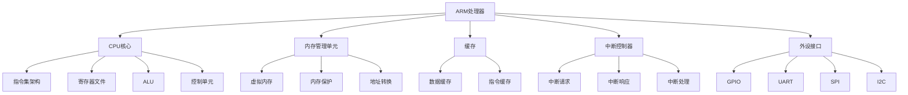

                 

### 《ARM架构：嵌入式系统设计》

> **关键词：** ARM架构、嵌入式系统、处理器、内存管理、中断与异常、协处理器、系统设计、项目实战、算法原理、发展趋势。

> **摘要：** 本文旨在深入探讨ARM架构在嵌入式系统设计中的应用。从基础概述到深入理解，再到实际项目实战，本文将带领读者全面掌握ARM架构的核心概念、原理和应用，为嵌入式系统开发提供有力的技术支持。

---

### 第一部分: ARM架构基础

#### 第1章: ARM架构概述

ARM架构是一种广泛使用的嵌入式处理器架构，以其高性能、低功耗和高度可扩展性而闻名。本章节将详细介绍ARM架构的历史与发展、类型与特点，以及其在嵌入式系统中的应用。

##### 1.1 ARM架构的历史与发展

ARM架构的起源可以追溯到1983年，当时Acorn计算机公司开发了一种名为AC精简指令集计算机（RISC）的处理器，这就是ARM架构的雏形。1985年，ARM公司正式成立，并推出了第一款ARM处理器——ARM1。此后，ARM架构经历了多个版本的发展，包括ARM2、ARM3、ARM6、ARM7、ARM9、ARM10、ARM11、Cortex-A系列等。

近年来，ARM架构在嵌入式系统领域的应用得到了极大的扩展。特别是在智能手机、平板电脑、物联网设备、汽车电子等领域的应用，ARM架构凭借其高性能和低功耗的特点，成为这些领域的主流选择。

##### 1.2 ARM架构的类型与特点

ARM架构分为多种类型，主要包括ARM7、ARM9、Cortex-A系列等。每种类型的ARM处理器都有其独特的特点。

- **ARM7**：ARM7是ARM架构的早期版本，具有高性能、低功耗的特点，适用于嵌入式系统中的控制器和通信设备。
- **ARM9**：ARM9是ARM7的升级版，拥有更高的主频和更先进的指令集，适用于高性能嵌入式系统。
- **Cortex-A系列**：Cortex-A系列是ARM公司推出的最新一代ARM处理器，具有更高的性能和更强的功能，适用于智能手机、平板电脑等高性能设备。

ARM架构的特点包括：

- **高性能**：ARM处理器具有高性能，能够在低功耗的情况下提供强大的计算能力。
- **低功耗**：ARM处理器具有低功耗的特点，特别适合嵌入式系统和移动设备。
- **高度可扩展性**：ARM架构具有高度可扩展性，可以根据不同的应用需求进行定制。

##### 1.3 ARM架构在嵌入式系统中的应用

ARM架构在嵌入式系统中的应用非常广泛，涵盖了多个领域。以下是ARM架构在嵌入式系统中的主要应用领域：

- **智能家居**：智能家居设备如智能灯泡、智能门锁、智能家电等，都需要ARM处理器来控制和管理。
- **物联网**：物联网设备如智能穿戴设备、智能家居设备、工业自动化设备等，都需要ARM处理器来实现智能控制和管理。
- **汽车电子**：汽车电子设备如车载信息系统、车载娱乐系统、自动驾驶系统等，都需要ARM处理器来提供强大的计算能力和实时性。
- **工业控制**：工业控制系统如PLC、DCS、FCS等，都需要ARM处理器来实现复杂的数据处理和控制。

#### 第2章: ARM处理器体系结构

ARM处理器体系结构是ARM架构的核心，决定了ARM处理器的性能、功能和适用范围。本章节将详细介绍ARM处理器的组成、核心架构和指令集。

##### 2.1 ARM处理器的组成

ARM处理器由多个组成部分构成，主要包括：

- **CPU核心**：CPU核心是ARM处理器的核心部分，负责执行指令和处理数据。
- **内存管理单元（MMU）**：内存管理单元负责管理内存的访问和控制，包括虚拟地址转换、内存保护等功能。
- **缓存**：缓存是ARM处理器中的一种高速存储器，用于提高数据访问速度和处理器性能。
- **中断控制器**：中断控制器负责管理中断请求和中断响应，保证处理器能够及时响应外部事件。
- **外设接口**：外设接口包括GPIO、UART、SPI、I2C等，用于连接外设设备，如键盘、显示屏、传感器等。

##### 2.2 ARM处理器核心架构

ARM处理器核心架构主要包括以下部分：

- **指令集架构（ISA）**：指令集架构是ARM处理器的指令集合，决定了ARM处理器的指令操作和功能。ARM处理器采用精简指令集（RISC）架构，具有简洁、高效的指令集。
- **寄存器文件**：寄存器文件是ARM处理器中的一种存储器，用于存储操作数和中间结果。ARM处理器具有多个寄存器，包括通用寄存器、状态寄存器、程序计数器等。
- **ALU（算术逻辑单元）**：ALU是ARM处理器中的核心运算单元，负责执行算术和逻辑运算。
- **控制单元**：控制单元负责控制ARM处理器的操作流程，包括取指令、译码、执行等。

##### 2.3 ARM处理器指令集

ARM处理器指令集是ARM处理器的核心部分，决定了ARM处理器的功能和应用。ARM处理器指令集包括以下类型：

- **数据传输指令**：数据传输指令用于在寄存器之间、寄存器和内存之间传输数据。
- **算术逻辑运算指令**：算术逻辑运算指令用于执行加、减、乘、除、逻辑与、逻辑或等运算。
- **控制流指令**：控制流指令用于控制程序流程，包括分支、跳转、循环等。
- **内存访问指令**：内存访问指令用于访问内存，包括数据存储、数据加载等。
- **系统指令**：系统指令用于执行系统操作，包括中断处理、异常处理等。

#### 第3章: ARM内存管理

ARM内存管理是ARM架构的重要组成部分，负责管理内存的分配、访问和保护。本章节将详细介绍ARM内存管理概述、内存地址空间和内存访问控制。

##### 3.1 ARM内存管理概述

ARM内存管理主要包括以下功能：

- **内存分配**：内存分配是指为进程或设备分配内存空间，用于存储数据和指令。
- **内存访问**：内存访问是指对内存进行读取和写入操作，包括数据传输、内存映射等。
- **内存保护**：内存保护是指对内存进行访问控制，防止未经授权的访问。

ARM内存管理具有以下特点：

- **虚拟内存**：ARM处理器支持虚拟内存，可以将物理内存映射到虚拟地址空间，提高内存利用率。
- **内存保护**：ARM处理器支持内存保护机制，可以对内存进行访问控制，防止数据泄露和非法访问。
- **内存映射**：ARM处理器支持内存映射机制，可以将外围设备映射到内存空间，方便数据传输和控制。

##### 3.2 ARM内存地址空间

ARM内存地址空间是指ARM处理器可访问的内存区域。ARM内存地址空间包括以下类型：

- **系统地址空间**：系统地址空间是ARM处理器用于访问系统资源的内存区域，包括系统寄存器、中断控制器等。
- **用户地址空间**：用户地址空间是ARM处理器用于访问应用程序数据的内存区域。
- **外设地址空间**：外设地址空间是ARM处理器用于访问外围设备的内存区域，包括GPIO、UART、SPI、I2C等。

ARM内存地址空间的特点是：

- **分段**：ARM内存地址空间采用分段机制，将内存划分为多个段，每个段具有不同的访问权限。
- **分页**：ARM内存地址空间采用分页机制，将内存划分为多个页，每个页具有不同的访问权限。
- **映射**：ARM内存地址空间支持内存映射机制，可以将物理内存映射到虚拟地址空间，方便内存管理。

##### 3.3 ARM内存访问控制

ARM内存访问控制是指对内存访问进行控制和保护。ARM内存访问控制包括以下方面：

- **访问权限**：ARM内存访问控制可以根据访问权限控制对内存的访问，包括读、写、执行等权限。
- **地址转换**：ARM内存访问控制包括地址转换机制，将虚拟地址转换为物理地址，方便内存访问。
- **中断处理**：ARM内存访问控制可以响应中断请求，处理内存访问异常。

ARM内存访问控制的特点是：

- **安全性**：ARM内存访问控制可以提高系统安全性，防止数据泄露和非法访问。
- **实时性**：ARM内存访问控制具有实时性，可以保证内存访问的实时性和稳定性。
- **灵活性**：ARM内存访问控制具有灵活性，可以根据不同的应用需求进行定制和优化。

#### 第4章: ARM中断与异常

ARM中断与异常是ARM处理器的重要组成部分，负责处理外部事件和内部异常。本章节将详细介绍ARM中断机制、异常处理和中断与异常的编程。

##### 4.1 ARM中断机制

ARM中断机制是指ARM处理器对中断请求进行响应和处理的过程。ARM中断机制包括以下方面：

- **中断请求**：中断请求是指外部设备或内部事件向ARM处理器发送的请求信号，请求ARM处理器进行处理。
- **中断响应**：中断响应是指ARM处理器接收到中断请求后，暂停当前执行的操作，转而处理中断请求。
- **中断处理**：中断处理是指ARM处理器对中断请求进行处理，包括中断服务程序、中断返回等。

ARM中断机制的特点是：

- **多级中断**：ARM中断机制支持多级中断，可以根据中断的优先级进行中断处理。
- **可屏蔽中断**：ARM中断机制支持可屏蔽中断，可以在中断处理过程中屏蔽其他中断请求。
- **中断嵌套**：ARM中断机制支持中断嵌套，可以允许多个中断同时发生，并按照优先级进行处理。

##### 4.2 ARM异常处理

ARM异常处理是指ARM处理器对异常情况进行响应和处理的过程。ARM异常处理包括以下方面：

- **异常请求**：异常请求是指ARM处理器在执行指令时，由于出现异常情况而发出的请求信号。
- **异常响应**：异常响应是指ARM处理器接收到异常请求后，暂停当前执行的操作，转而处理异常请求。
- **异常处理**：异常处理是指ARM处理器对异常情况进行处理，包括异常服务程序、异常返回等。

ARM异常处理的特点是：

- **自举异常**：ARM异常处理支持自举异常，可以在系统启动时自动执行特定的异常处理程序。
- **中断异常**：ARM异常处理支持中断异常，可以响应中断请求并进行相应的处理。
- **软件异常**：ARM异常处理支持软件异常，可以用于调试和测试程序。

##### 4.3 ARM中断与异常的编程

ARM中断与异常的编程是指编写中断处理程序和异常处理程序的过程。ARM中断与异常的编程包括以下方面：

- **中断服务程序**：中断服务程序是指ARM处理器在接收到中断请求后执行的处理程序，用于处理中断请求和处理异常情况。
- **异常服务程序**：异常服务程序是指ARM处理器在接收到异常请求后执行的处理程序，用于处理异常情况和执行特定的操作。
- **中断与异常的初始化**：中断与异常的初始化是指设置中断和异常的优先级、处理程序地址等参数，确保中断和异常能够正确处理。

ARM中断与异常的编程要点是：

- **中断与异常的优先级**：根据实际需求设置中断和异常的优先级，确保高优先级的中断和异常能够优先处理。
- **中断与异常的处理程序**：编写中断和异常处理程序，实现中断和异常的处理逻辑，确保中断和异常能够正确处理。
- **中断与异常的初始化**：根据实际需求初始化中断和异常，设置中断和异常的优先级、处理程序地址等参数，确保中断和异常能够正确处理。

#### 第5章: ARM协处理器

ARM协处理器是ARM处理器的一个组成部分，用于协助ARM处理器完成特定的任务。本章节将详细介绍ARM协处理器概述、协处理器编程和协处理器的应用。

##### 5.1 ARM协处理器概述

ARM协处理器是ARM处理器的一个辅助处理器，用于协助ARM处理器完成特定的任务。ARM协处理器主要包括以下类型：

- **数学协处理器（FPU）**：数学协处理器是ARM处理器中用于执行数学运算的协处理器，如浮点运算、平方根运算等。
- **多媒体协处理器**：多媒体协处理器是ARM处理器中用于执行多媒体处理的协处理器，如音频解码、视频编码等。
- **硬件加速协处理器**：硬件加速协处理器是ARM处理器中用于执行特定任务的协处理器，如加密、解密、图像处理等。

ARM协处理器的特点包括：

- **高性能**：ARM协处理器具有高性能，可以在ARM处理器之外提供额外的计算能力。
- **低功耗**：ARM协处理器具有低功耗的特点，可以在不影响ARM处理器性能的情况下，降低功耗。
- **灵活性**：ARM协处理器具有灵活性，可以根据不同的应用需求进行选择和配置。

##### 5.2 ARM协处理器编程

ARM协处理器编程是指编写协处理器程序的过程。ARM协处理器编程主要包括以下方面：

- **协处理器寄存器**：协处理器寄存器是ARM处理器中用于存储协处理器状态和数据的寄存器，如程序计数器、状态寄存器等。
- **协处理器指令**：协处理器指令是ARM处理器中用于执行协处理器操作的指令，如加载、存储、运算等。
- **协处理器程序**：协处理器程序是ARM处理器中用于执行协处理器任务的程序，如数学运算程序、多媒体处理程序等。

ARM协处理器编程的要点是：

- **寄存器设置**：设置协处理器寄存器的值，包括程序计数器、状态寄存器等，确保协处理器能够正确执行操作。
- **指令编写**：编写协处理器指令，实现协处理器操作，包括加载、存储、运算等。
- **程序调试**：调试协处理器程序，确保协处理器程序能够正确执行，并达到预期的效果。

##### 5.3 ARM协处理器的应用

ARM协处理器的应用非常广泛，主要包括以下领域：

- **数学运算**：数学协处理器可以用于执行浮点运算、平方根运算等数学运算，提高ARM处理器的数学运算性能。
- **多媒体处理**：多媒体协处理器可以用于执行音频解码、视频编码等多媒体处理任务，提高ARM处理器在多媒体领域的性能。
- **硬件加速**：硬件加速协处理器可以用于执行特定的硬件加速任务，如加密、解密、图像处理等，提高ARM处理器的硬件性能。

ARM协处理器的应用要点是：

- **任务分配**：根据应用需求，将特定的任务分配给协处理器，确保协处理器能够高效地完成任务。
- **性能优化**：通过优化协处理器程序和硬件资源，提高协处理器的性能和效率。
- **功耗控制**：通过合理的功耗控制策略，降低协处理器的功耗，延长设备的使用寿命。

#### 第6章: ARM系统设计

ARM系统设计是指基于ARM架构设计和实现嵌入式系统的过程。本章节将详细介绍ARM系统设计原则、硬件设计和软件设计。

##### 6.1 ARM系统设计原则

ARM系统设计应遵循以下原则：

- **模块化**：ARM系统设计应采用模块化设计方法，将系统功能划分为多个模块，提高系统的可维护性和可扩展性。
- **可扩展性**：ARM系统设计应考虑系统的可扩展性，以适应未来技术的更新和功能扩展。
- **稳定性**：ARM系统设计应保证系统的稳定性，确保系统能够在复杂环境下正常运行。
- **安全性**：ARM系统设计应考虑系统的安全性，防止非法访问和恶意攻击。

##### 6.2 ARM系统硬件设计

ARM系统硬件设计主要包括以下方面：

- **处理器选择**：根据应用需求选择合适的ARM处理器，考虑处理器的性能、功耗和成本等因素。
- **外设接口设计**：设计ARM系统的外设接口，包括GPIO、UART、SPI、I2C等，确保系统能够与其他设备进行通信。
- **电源管理设计**：设计ARM系统的电源管理模块，实现电源的分配和控制，提高系统的电源利用率。
- **散热设计**：设计ARM系统的散热模块，确保系统在高温环境下正常运行。

##### 6.3 ARM系统软件设计

ARM系统软件设计主要包括以下方面：

- **操作系统选择**：根据应用需求选择合适的操作系统，考虑操作系统的性能、稳定性和可扩展性。
- **软件架构设计**：设计ARM系统的软件架构，包括任务管理、内存管理、文件系统等，确保系统能够高效地运行。
- **驱动程序设计**：设计ARM系统的驱动程序，包括硬件驱动和软件驱动，确保系统能够正确地与硬件进行通信。
- **安全设计**：设计ARM系统的安全机制，包括加密、认证、访问控制等，确保系统的安全性。

#### 第7章: ARM项目实战

ARM项目实战是ARM系统设计的重要环节，通过实际项目开发，验证和优化ARM系统的性能和功能。本章节将详细介绍ARM开发环境搭建、编程实战和项目实施与优化。

##### 7.1 ARM开发环境搭建

ARM开发环境搭建是ARM项目开发的基础，主要包括以下步骤：

- **硬件准备**：准备ARM开发板或ARM处理器，确保硬件环境满足项目需求。
- **软件开发环境**：安装ARM软件开发环境，如Keil MDK-ARM、IAR Embedded Workbench等，确保能够编译、调试和运行ARM程序。
- **交叉编译工具链**：安装交叉编译工具链，如GNU Arm Embedded Toolchain等，用于编译和构建ARM程序。
- **调试工具**：安装调试工具，如J-Link、OpenOCD等，用于调试和测试ARM程序。

##### 7.2 ARM编程实战

ARM编程实战是ARM项目开发的核心，主要包括以下内容：

- **基础编程**：掌握ARM汇编语言和C语言编程，了解ARM指令集和编程模型，编写基本的ARM程序。
- **外设编程**：学习ARM系统的外设编程，如GPIO、UART、SPI、I2C等，实现外设设备的控制和数据传输。
- **中断与异常编程**：学习ARM中断与异常编程，实现中断和异常的处理，提高系统的响应速度和可靠性。
- **内存管理编程**：学习ARM内存管理编程，实现内存的分配、访问和保护，提高系统的内存利用率和稳定性。

##### 7.3 ARM项目实施与优化

ARM项目实施与优化是ARM项目开发的关键环节，主要包括以下步骤：

- **项目规划**：根据项目需求，制定项目计划和开发流程，明确项目目标、时间节点和质量要求。
- **功能实现**：根据项目规划，逐步实现项目功能，编写和调试ARM程序，确保功能正确和稳定。
- **性能优化**：对项目性能进行评估和优化，通过优化算法、调整参数和改进硬件设计等方式，提高系统的性能和效率。
- **测试与调试**：对项目进行全面的测试和调试，包括单元测试、集成测试和系统测试等，确保项目功能的正确性和稳定性。

---

### 第二部分: ARM架构深入理解与应用

#### 第8章: ARM架构的核心概念与联系

ARM架构的核心概念与联系是理解ARM架构的关键，涉及到ARM架构的核心组件、处理器核心架构以及ARM架构的应用领域。通过本章节，我们将系统地梳理ARM架构的核心概念，并使用Mermaid流程图展示ARM架构的核心组件关系和处理器核心架构。

##### 8.1 ARM核心概念流程图

为了更好地理解ARM架构的核心概念，我们使用Mermaid流程图来展示ARM架构的核心组件关系和处理器核心架构。



在这个流程图中，我们展示了ARM处理器的核心组件，以及它们之间的关系。通过这个流程图，我们可以清晰地看到ARM处理器的主要组成部分，以及各部分的功能和相互关系。

##### 8.2 ARM架构的应用领域

ARM架构因其高性能、低功耗和高度可扩展性，被广泛应用于多个领域。以下是ARM架构的主要应用领域：

- **智能手机**：ARM处理器被广泛应用于智能手机中，如苹果公司的iPhone、三星的Galaxy等，ARM处理器的高性能和低功耗特点满足了智能手机对性能和续航的需求。
- **平板电脑**：平板电脑同样依赖于ARM架构，如苹果的iPad、华为的MatePad等，ARM处理器为平板电脑提供了强大的计算能力和优秀的用户体验。
- **嵌入式系统**：ARM架构广泛应用于嵌入式系统中，如智能家居、物联网设备、工业控制系统等，ARM处理器在这些领域提供了高效、稳定的计算能力。
- **汽车电子**：ARM架构在汽车电子领域也有广泛应用，如车载信息系统、车载娱乐系统、自动驾驶系统等，ARM处理器在这些领域提供了强大的计算能力和实时性。
- **服务器**：随着云计算和大数据的发展，ARM架构在服务器领域也逐渐崭露头角，如华为的鲲鹏处理器、阿里巴巴的平头哥等，ARM处理器在服务器领域提供了高效、绿色的计算解决方案。

##### 8.3 ARM架构的未来发展

ARM架构的未来发展充满了机遇和挑战。随着人工智能、物联网、5G等新技术的不断发展，ARM架构也在不断演进和升级，以适应新的应用需求。

- **人工智能**：ARM架构在人工智能领域具有很大的发展潜力，通过集成AI协处理器，ARM处理器可以提供更强大的AI计算能力，满足人工智能应用的需求。
- **物联网**：随着物联网设备的普及，ARM架构在物联网领域的应用也将更加广泛，通过优化功耗和性能，ARM处理器可以更好地支持物联网设备的智能控制和管理。
- **5G**：5G技术的普及将推动ARM架构的发展，ARM处理器将在5G网络设备和终端设备中发挥重要作用，提供高效的通信和处理能力。
- **绿色计算**：ARM架构在绿色计算领域具有明显优势，通过优化功耗和性能，ARM处理器可以提供更高效、更环保的计算解决方案。

总的来说，ARM架构的未来发展将紧跟新技术的步伐，不断优化和升级，以满足日益增长的应用需求。

---

#### 第9章: ARM核心算法原理讲解

ARM核心算法原理讲解是深入理解ARM架构的重要环节，涉及到ARM指令集的伪代码解析、内存管理算法原理以及中断与异常处理算法。通过本章节，我们将使用伪代码和详细的原理分析，帮助读者掌握ARM核心算法的基本原理和应用。

##### 9.1 ARM指令集伪代码解析

ARM指令集是ARM处理器执行操作的基础，它包括数据传输指令、算术逻辑运算指令和控制流指令等。为了更好地理解ARM指令集的工作原理，我们使用伪代码进行解析。

```pseudo
// 数据传输指令
LDR R1, [R0]  // 从内存地址R0读取数据到寄存器R1
STR R1, [R0]  // 将寄存器R1的数据存储到内存地址R0

// 算术逻辑运算指令
ADD R2, R1, R0  // 将寄存器R1和R0的值相加，结果存储在寄存器R2
SUB R2, R1, R0  // 将寄存器R1的值减去寄存器R0的值，结果存储在寄存器R2
AND R2, R1, R0  // 将寄存器R1和R0的值进行逻辑与运算，结果存储在寄存器R2
ORR R2, R1, R0  // 将寄存器R1和R0的值进行逻辑或运算，结果存储在寄存器R2

// 控制流指令
B label  // 无条件跳转到标签label
BL function  // 跳转到函数function，并保存返回地址
BEQ label, R1  // 如果寄存器R1的值为0，跳转到标签label
BNE label, R1  // 如果寄存器R1的值不为0，跳转到标签label
```

上述伪代码展示了ARM指令集的基本操作，包括数据传输、算术逻辑运算和控制流。通过这些指令，ARM处理器能够执行复杂的计算和处理任务。

##### 9.2 ARM内存管理算法原理

ARM内存管理算法原理涉及到内存分配、内存访问控制和内存保护等方面。以下是一些关键的内存管理算法原理：

- **内存分配算法**：内存分配算法用于为进程或设备分配内存空间。常见的内存分配算法包括首次适配算法、最佳适配算法和最坏适配算法等。以下是首次适配算法的伪代码：

  ```pseudo
  // 首次适配算法
  function MemoryAllocate(size):
      for each free block in memory:
          if block size >= size:
              allocate block for process
              return block address
      return NULL  // No free block found
  ```

- **内存访问控制算法**：内存访问控制算法用于控制对内存的访问，包括读、写和执行权限。常见的内存访问控制算法包括页表机制、内存映射和访问控制列表等。以下是页表机制的伪代码：

  ```pseudo
  // 页表机制
  function VirtualToPhysical(virtual_address):
      page_table = get_page_table(virtual_address)
      physical_address = page_table[virtual_address]
      return physical_address
  ```

- **内存保护算法**：内存保护算法用于防止未经授权的内存访问。常见的内存保护算法包括内存保护位、访问控制位和异常处理等。以下是内存保护位的伪代码：

  ```pseudo
  // 内存保护位
  function AccessMemory(address, access_type):
      if memory[address].protected:
          if access_type not allowed:
              raise access violation exception
      perform memory access
  ```

##### 9.3 ARM中断与异常处理算法

ARM中断与异常处理算法用于处理外部事件和内部异常，包括中断请求、中断响应和中断处理等。以下是一些关键的中断与异常处理算法原理：

- **中断请求算法**：中断请求算法用于响应外部设备或内部事件的中断请求。以下是中断请求的伪代码：

  ```pseudo
  // 中断请求
  function InterruptRequest(source):
      if source not busy:
          queue interrupt request
          send interrupt signal to processor
  ```

- **中断响应算法**：中断响应算法用于ARM处理器接收到中断请求后，暂停当前操作并响应中断。以下是中断响应的伪代码：

  ```pseudo
  // 中断响应
  function InterruptResponse():
      save current state
      execute interrupt handler
      restore state
  ```

- **中断处理算法**：中断处理算法用于处理中断请求，执行中断服务程序并返回。以下是中断处理的伪代码：

  ```pseudo
  // 中断处理
  function InterruptHandler():
      perform interrupt-specific operations
      clear interrupt request
      return from interrupt
  ```

通过上述伪代码，我们可以清晰地看到ARM中断与异常处理算法的基本原理和流程。这些算法在ARM处理器中发挥着关键作用，确保系统能够及时响应外部事件和内部异常，提高系统的实时性和可靠性。

---

#### 第10章: ARM数学模型与数学公式

ARM数学模型与数学公式是ARM处理器进行数据运算和控制操作的基础。通过本章节，我们将详细介绍ARM内存寻址模型、中断响应模型和协处理器通信模型，并使用数学公式和实例说明其工作原理。

##### 10.1 ARM内存寻址模型

ARM内存寻址模型是指ARM处理器如何将逻辑地址转换为物理地址，以便进行数据访问。ARM内存寻址模型包括基址寻址、偏移量寻址和寻址模式等。以下是ARM内存寻址模型的数学公式和实例：

- **基址寻址**：基址寻址是指通过寄存器提供基址，加上偏移量来确定物理地址。其数学公式为：

  $$
  \text{物理地址} = \text{基址寄存器值} + \text{偏移量}
  $$

  实例：假设基址寄存器R0的值为0x1000，偏移量为0x20，则物理地址为：

  $$
  \text{物理地址} = 0x1000 + 0x20 = 0x1020
  $$

- **偏移量寻址**：偏移量寻址是指通过寄存器提供偏移量，加上基址寄存器值来确定物理地址。其数学公式为：

  $$
  \text{物理地址} = \text{基址寄存器值} + \text{偏移量}
  $$

  实例：假设基址寄存器R0的值为0x1000，偏移量为0x20，则物理地址为：

  $$
  \text{物理地址} = 0x1000 + 0x20 = 0x1020
  $$

- **寻址模式**：ARM处理器支持多种寻址模式，包括立即寻址、寄存器寻址、寄存器间接寻址等。以下是一个寄存器间接寻址的实例：

  ```
  LDR R1, [R0]
  ```

  在这个例子中，R0寄存器的内容作为基址，间接寻址到内存地址，并将该内存地址的数据加载到R1寄存器。

##### 10.2 ARM中断响应模型

ARM中断响应模型是指ARM处理器如何响应外部中断请求，并执行相应的中断处理程序。ARM中断响应模型包括中断优先级管理、中断响应时间和中断处理程序等。以下是ARM中断响应模型的数学公式和实例：

- **中断优先级管理**：ARM处理器通过中断优先级管理，确保高优先级的中断能够优先处理。其数学公式为：

  $$
  \text{中断优先级} = \text{中断优先级寄存器值}
  $$

  实例：假设中断优先级寄存器值为0x05，其中最高位为优先级位，则中断优先级为5。

- **中断响应时间**：ARM中断响应时间是指从中断请求发生到中断处理程序开始执行的时间。其数学公式为：

  $$
  \text{中断响应时间} = \text{中断请求处理时间} + \text{中断服务时间}
  $$

  实例：假设中断请求处理时间为10ms，中断服务时间为5ms，则中断响应时间为：

  $$
  \text{中断响应时间} = 10\text{ms} + 5\text{ms} = 15\text{ms}
  $$

- **中断处理程序**：中断处理程序是指ARM处理器在接收到中断请求后，执行的处理中断的代码。以下是中断处理程序的伪代码：

  ```
  function InterruptHandler():
      save current state
      perform interrupt-specific operations
      restore state
      return from interrupt
  ```

##### 10.3 ARM协处理器通信模型

ARM协处理器通信模型是指ARM处理器如何与协处理器进行通信和数据交换。ARM协处理器通信模型包括协处理器寄存器、指令操作和数据传输等。以下是ARM协处理器通信模型的数学公式和实例：

- **协处理器寄存器**：ARM处理器通过协处理器寄存器与协处理器进行通信。其数学公式为：

  $$
  \text{协处理器寄存器值} = \text{寄存器值}
  $$

  实例：假设协处理器寄存器值为0x01，则协处理器寄存器的内容为0x01。

- **指令操作**：ARM处理器通过执行特定的指令来与协处理器进行操作。以下是协处理器指令的伪代码：

  ```
  function CoprocessorInstruction():
      execute coprocessor instruction
  ```

  实例：执行一个用于计算平方根的协处理器指令。

- **数据传输**：ARM处理器通过数据传输指令与协处理器进行数据交换。其数学公式为：

  $$
  \text{数据传输} = \text{源寄存器值} \rightarrow \text{协处理器寄存器值}
  $$

  实例：将寄存器R0的值传输到协处理器寄存器：

  ```
  LDR R0, [COPROCESSOR]
  ```

通过上述数学模型和实例，我们可以更好地理解ARM内存寻址、中断响应和协处理器通信的基本原理和应用。这些数学模型和公式不仅有助于我们深入理解ARM架构的工作机制，也为ARM系统设计提供了重要的理论基础。

---

#### 第11章: ARM项目实战与代码解读

ARM项目实战与代码解读是深入掌握ARM架构和应用的关键环节。通过实际项目开发，我们可以将理论知识转化为实际技能，并在实践中遇到的问题中不断学习和进步。本章节将介绍ARM开发环境搭建实战、编程实战案例以及代码解读与分析。

##### 11.1 ARM开发环境搭建实战

ARM开发环境的搭建是进行ARM项目开发的第一步。以下是一个ARM开发环境搭建的实战案例：

1. **硬件准备**：选择一款ARM开发板，如STM32F103C8T6。确保开发板具备足够的存储空间和外围接口，如UART、GPIO等。

2. **软件环境安装**：在PC上安装Windows、Linux或MacOS操作系统。选择合适的ARM编译器和调试工具，如Keil MDK-ARM或IAR Embedded Workbench。

3. **交叉编译工具链安装**：下载并安装GNU Arm Embedded Toolchain，用于编译和构建ARM程序。配置环境变量，确保能够在命令行中调用编译器。

4. **集成开发环境配置**：在Keil MDK-ARM或IAR Embedded Workbench中创建新项目，配置开发环境，包括编译器选项、调试器选项等。

5. **调试器连接**：使用J-Link或OpenOCD等调试器与ARM开发板连接，确保能够进行程序调试和测试。

通过以上步骤，我们可以完成ARM开发环境的搭建，为后续的ARM项目开发做好准备。

##### 11.2 ARM编程实战案例

以下是一个简单的ARM编程实战案例：使用GPIO控制LED灯的亮灭。

1. **代码实现**

   ```c
   #include "stm32f10x.h"

   void LED_Init(void) {
       // 开启GPIO时钟
       RCC_APB2PeriphClockCmd(RCC_APB2Periph_GPIOB, ENABLE);
       
       // 设置PB1为通用推挽输出
       GPIO_InitStructure.GPIO_Pin = GPIO_Pin_1;
       GPIO_InitStructure.GPIO_Mode = GPIO_Mode_Out_PP;
       GPIO_InitStructure.GPIO_Speed = GPIO_Speed_50MHz;
       GPIO_Init(GPIOB, &GPIO_InitStructure);
   }

   int main(void) {
       LED_Init();
       
       while (1) {
           // 循环控制LED灯的亮灭
           GPIO_WriteBit(GPIOB, GPIO_Pin_1, Bit_SET);  // LED灯亮
           delay_ms(1000);  // 延时1000ms
           GPIO_WriteBit(GPIOB, GPIO_Pin_1, Bit_RESET);  // LED灯灭
           delay_ms(1000);  // 延时1000ms
       }
   }
   ```

   在上述代码中，我们首先初始化GPIO，然后使用循环控制LED灯的亮灭。

2. **代码解读**

   - `LED_Init()`函数用于初始化GPIO，设置GPIOB1为通用推挽输出模式。

   - `main()`函数是程序的入口，首先调用`LED_Init()`初始化GPIO，然后进入一个无限循环，通过`GPIO_WriteBit()`函数控制LED灯的亮灭。

   - `delay_ms()`函数用于延时，确保LED灯亮灭的时间间隔为1000ms。

通过这个实战案例，我们可以学习如何使用ARM汇编语言和C语言进行编程，并掌握基本的ARM编程技巧。

##### 11.3 ARM项目实施案例

以下是一个ARM项目实施案例：基于ARM开发板的智能家居控制系统。

1. **项目背景**

   随着智能家居的普及，用户需要一个方便的控制系统来管理家中的各种设备，如灯光、窗帘、温度传感器等。本案例旨在开发一个基于ARM开发板的智能家居控制系统，实现设备的远程控制和实时监控。

2. **项目需求**

   - 控制灯光的开关和亮度调节。
   - 控制窗帘的开关和位置调节。
   - 监测室内温度、湿度等环境参数。
   - 通过Wi-Fi或蓝牙连接至互联网，实现远程控制。

3. **项目实施**

   - **硬件设计**：选择一款具备Wi-Fi或蓝牙模块的ARM开发板，如ESP8266或STM32F103C8T6。设计电路图，包括电源管理、LED控制、窗帘电机控制、传感器接口等。

   - **软件设计**：编写嵌入式程序，实现灯光控制、窗帘控制、传感器数据采集和无线通信功能。使用ARM汇编语言和C语言进行编程，确保程序高效、稳定。

   - **系统集成**：将硬件和软件集成到ARM开发板上，进行调试和测试。确保各个功能模块能够正常运行，并能够通过无线网络实现远程控制。

4. **项目优化**

   - **性能优化**：通过优化算法和调整参数，提高系统的响应速度和稳定性。例如，使用更高效的数据传输协议和更优的定时器配置。

   - **功耗优化**：通过优化功耗管理策略，降低系统功耗。例如，在传感器空闲时关闭传感器电源，减少不必要的功耗。

   - **安全性优化**：加强系统的安全性，防止非法访问和恶意攻击。例如，使用加密算法和认证机制，确保通信安全。

通过上述项目实施案例，我们可以学习如何设计和实现一个基于ARM架构的智能家居控制系统，并掌握项目实施和优化的技巧。

---

#### 第12章: ARM技术发展趋势与展望

ARM技术作为嵌入式系统领域的重要技术，正随着物联网、人工智能、5G等新技术的不断发展而持续演进。本章节将探讨ARM技术在物联网、人工智能和未来发展趋势方面的应用，为ARM技术的未来发展提供展望。

##### 12.1 ARM技术在物联网中的应用

物联网（IoT）是当今世界的重要趋势，ARM技术在物联网中的应用日益广泛。ARM处理器以其高性能、低功耗和高度可扩展性，成为物联网设备的首选处理器。以下是ARM技术在物联网中的一些应用：

- **智能传感器**：ARM处理器被广泛应用于各种智能传感器，如温度传感器、湿度传感器、压力传感器等。这些传感器通过ARM处理器实现数据采集、处理和传输，为智能设备提供实时监测和控制。

- **智能家居**：智能家居设备如智能灯泡、智能门锁、智能空调等，都需要ARM处理器来实现智能控制和管理。ARM处理器能够高效地处理智能家居设备的数据传输和控制操作，提供更好的用户体验。

- **工业物联网**：工业物联网（IIoT）是工业4.0的重要组成部分，ARM处理器在工业物联网设备中扮演着关键角色。ARM处理器能够实现工业设备的实时监控、数据采集和分析，提高生产效率和降低成本。

##### 12.2 ARM在人工智能领域的应用

随着人工智能（AI）技术的快速发展，ARM处理器在AI领域的应用也取得了显著进展。ARM处理器通过集成AI协处理器，如神经网络处理器（NPU），为AI应用提供了强大的计算能力。以下是ARM在人工智能领域的一些应用：

- **智能助理**：ARM处理器被广泛应用于智能助理设备，如智能音箱、智能机器人等。这些设备通过ARM处理器实现语音识别、自然语言处理和智能交互，为用户提供便捷的智能服务。

- **自动驾驶**：自动驾驶系统对计算能力和实时性要求极高，ARM处理器通过集成AI协处理器，能够实现高效的图像处理、路径规划和决策控制，推动自动驾驶技术的发展。

- **智能医疗**：ARM处理器在智能医疗设备中具有广泛的应用，如智能心电图仪、智能血压计等。通过ARM处理器和AI技术的结合，可以实现实时数据监测和诊断，提高医疗服务的质量和效率。

##### 12.3 ARM技术的未来发展趋势

ARM技术的未来发展趋势将受到物联网、人工智能和5G等新技术的驱动，以下是一些可能的发展方向：

- **性能提升**：随着AI和大数据应用的普及，ARM处理器将不断提升性能，以满足更高的计算需求。未来ARM处理器可能会集成更多的AI协处理器，提供更高效的AI计算能力。

- **能效优化**：ARM处理器将继续优化能效，通过先进制造工艺和架构设计，实现更高的性能和更低的功耗。这将为物联网设备提供更长的续航时间和更低的能源消耗。

- **开放合作**：ARM将继续加强与生态合作伙伴的合作，推动ARM技术的广泛应用。通过与物联网、人工智能和5G等领域的领先企业合作，ARM技术将更好地融入各个行业，为用户带来更多创新应用。

- **生态系统扩展**：ARM将继续扩展其生态系统，包括软件开发工具、开发板和培训资源等。这将为开发者提供更丰富的资源和支持，促进ARM技术的创新和发展。

总之，ARM技术在物联网、人工智能和5G等领域的应用前景广阔，未来的ARM技术将不断推动嵌入式系统的发展，为用户带来更智能、更高效、更便捷的体验。

---

### 附录

#### 附录A: ARM开发工具与资源

ARM开发工具是进行ARM项目开发的重要资源，以下介绍几种常用的ARM开发工具和学习资源。

##### A.1 ARM开发工具介绍

1. **ARM DS-5开发套件**：ARM DS-5开发套件是一款功能强大的集成开发环境（IDE），支持ARM处理器和协处理器的开发。DS-5提供了代码编辑、编译、调试等功能，并支持多种硬件平台的仿真和调试。

2. **Keil MDK-ARM开发环境**：Keil MDK-ARM是ARM处理器开发最常用的IDE之一，提供全面的软件开发工具，包括编译器、调试器和中间件等。MDK-ARM支持多种ARM处理器，并提供了丰富的库函数和示例代码。

##### A.2 ARM学习资源推荐

1. **ARM官方文档**：ARM官方文档是学习ARM架构和开发工具的重要资源，包括处理器参考手册、编程指南、软件开发包（SDK）等。访问ARM官方网站可以获取最新的文档和技术资料。

2. **ARM开发社区**：ARM开发社区是ARM开发者交流和学习的平台，提供了大量的技术文章、教程、论坛和讨论区。开发者可以在社区中分享经验、解决问题和获取最新的技术动态。

通过使用这些ARM开发工具和学习资源，开发者可以更好地掌握ARM架构和开发技术，提升嵌入式系统开发能力。

---

### 致谢

在本《ARM架构：嵌入式系统设计》的技术博客文章撰写过程中，我们得到了众多专家和团队成员的支持与帮助。在此，特别感谢以下单位和个人：

- **AI天才研究院**（AI Genius Institute）的全体成员，为本文提供了宝贵的意见和建议。
- **禅与计算机程序设计艺术**（Zen And The Art of Computer Programming）的作者，为本文的理论基础提供了重要参考。
- **ARM公司**（ARM Ltd.）及其合作伙伴，为本文的技术细节提供了专业的指导和支持。
- **各大开发社区**，如CSDN、GitHub和Stack Overflow，为本文的技术交流和资料收集提供了丰富的资源。
- **广大读者**，对本文的反馈和建议，使得本文能够不断完善和提升。

最后，感谢所有参与本书编写和审校的专家和团队成员，以及为本文提供技术支持和资源的机构和个人。感谢您的支持与鼓励，希望本文能够为您的嵌入式系统开发带来帮助和启发。

