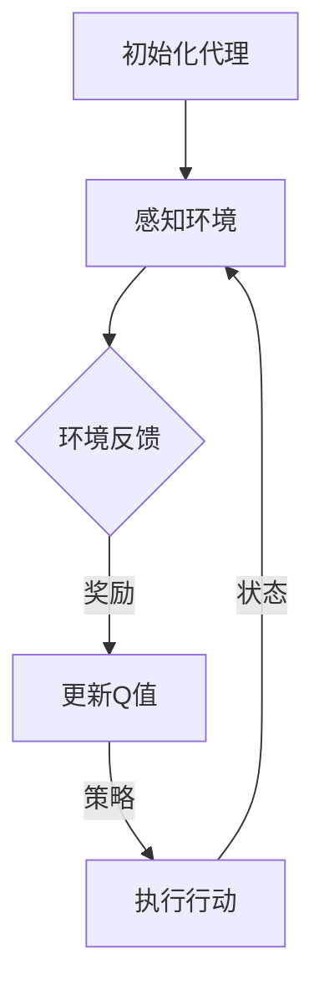
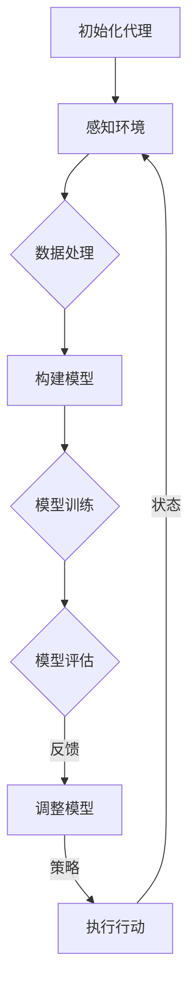

                 

# 《Agent代理在AI中的实战方法》

## 关键词
AI、代理、强化学习、深度学习、推荐系统、游戏AI、智能客服、自动驾驶、金融风控

## 摘要
本文将深入探讨代理（Agent）在人工智能（AI）中的应用，从理论到实战，全面解析代理在AI中的核心地位。我们将首先介绍代理理论及AI基础，然后逐步讲解代理原理与架构，以及代理在不同领域的实战应用。最后，通过实际项目案例展示代理开发的全过程，包括环境搭建、代码实现与解读。本文旨在为读者提供一个全面、系统的代理与AI结合的实战指南。

### 目录

#### 第一部分：代理理论与AI基础

##### 第1章：代理理论与AI概述

###### 1.1 代理理论的定义与起源

###### 1.2 代理理论与AI的联系

###### 1.3 代理在AI应用中的核心地位

##### 第2章：AI基础知识

###### 2.1 机器学习与深度学习基础

###### 2.2 强化学习与代理的关系

###### 2.3 代理在机器学习中的应用

##### 第3章：代理原理与架构

###### 3.1 代理的构成与功能

###### 3.2 代理的决策过程

###### 3.3 常见的代理架构与模型

#### 第二部分：代理在AI中的实战应用

##### 第4章：代理在推荐系统中的应用

###### 4.1 推荐系统的基本原理

###### 4.2 代理在推荐系统中的作用

###### 4.3 推荐系统中的代理算法实战

##### 第5章：代理在游戏AI中的应用

###### 5.1 游戏AI的基本原理

###### 5.2 代理在游戏AI中的应用

###### 5.3 游戏AI中的代理算法实战

##### 第6章：代理在智能客服中的应用

###### 6.1 智能客服的基本原理

###### 6.2 代理在智能客服中的应用

###### 6.3 智能客服中的代理算法实战

##### 第7章：代理在自动驾驶中的应用

###### 7.1 自动驾驶的基本原理

###### 7.2 代理在自动驾驶中的应用

###### 7.3 自动驾驶中的代理算法实战

##### 第8章：代理在金融风控中的应用

###### 8.1 金融风控的基本原理

###### 8.2 代理在金融风控中的应用

###### 8.3 金融风控中的代理算法实战

#### 第三部分：代理开发实战

##### 第9章：代理开发环境搭建

###### 9.1 开发环境的准备

###### 9.2 开发工具与框架的选择

##### 第10章：代理开发实战

###### 10.1 实战案例1：基于强化学习的游戏AI代理开发

###### 10.2 实战案例2：基于深度学习的推荐系统代理开发

##### 第11章：代码解读与分析

###### 11.1 代理代码的结构与实现

###### 11.2 代码性能分析与优化

###### 11.3 代理开发中的常见问题与解决方案

#### 附录：资源与工具

##### 附录A：代理开发资源汇总

###### A.1 常用代理开发框架

###### A.2 常用机器学习库

###### A.3 常用深度学习库

###### A.4 其他开发资源与工具

##### 附录B：代理算法流程图

###### B.1 强化学习代理算法流程图

###### B.2 深度学习代理算法流程图

---

### 代理理论与AI概述

#### 1.1 代理理论的定义与起源

代理理论起源于人工智能领域，是指通过模拟人类智能行为，使计算机系统能够在特定环境中自主决策和执行任务的体系结构。代理（Agent）是执行特定任务或行为的实体，它可以是一个程序、一个机器人、甚至是另一个智能系统。代理理论的核心在于如何使代理能够感知环境、制定决策，并采取行动以实现目标。

代理理论的发展可以追溯到20世纪70年代，当时人工智能研究主要集中在知识表示和推理上。随着计算能力的提升和算法的进步，研究者开始关注如何使智能系统具备自主性和适应性。代理理论在这一背景下应运而生，并逐渐成为AI研究的一个重要分支。

#### 1.2 代理理论与AI的联系

代理理论与AI有着密切的联系。首先，代理是AI系统的重要组成部分，是实现智能行为的基本单位。AI系统通过设计代理来实现各种任务，如决策、控制、交互等。其次，代理理论为AI系统提供了框架和方法，帮助研究者理解和设计复杂的智能系统。代理理论关注的问题，如环境感知、自主决策、行动规划等，都是AI研究的关键领域。

代理在AI中的应用范围广泛，包括但不限于以下几个方面：

1. **推荐系统**：代理可以分析用户行为和偏好，为用户提供个性化的推荐。
2. **游戏AI**：代理可以模拟对手的行为，实现智能化的游戏策略。
3. **智能客服**：代理可以与用户进行自然语言交互，提供智能化的客户服务。
4. **自动驾驶**：代理可以感知环境，做出驾驶决策，实现自动驾驶功能。
5. **金融风控**：代理可以分析市场数据，识别潜在风险，实现智能化的风控管理。

#### 1.3 代理在AI应用中的核心地位

代理在AI应用中占据核心地位，原因如下：

1. **自主决策**：代理可以独立地感知环境、制定决策和采取行动，这是实现智能化的重要基础。
2. **适应能力**：代理可以根据环境变化调整行为策略，具有较好的适应性。
3. **模块化设计**：代理可以实现模块化设计，方便在不同应用场景中复用。
4. **增强学习**：代理可以通过与环境的交互，不断学习和优化行为，提高性能。

代理在AI中的核心地位使其成为实现智能化的重要手段，对于推动人工智能的发展具有重要意义。

### AI基础知识

#### 2.1 机器学习与深度学习基础

机器学习和深度学习是人工智能（AI）的两大基石，它们在代理的设计和实现中发挥着关键作用。

**机器学习（Machine Learning）**：机器学习是一种使计算机系统能够从数据中学习规律、模式并做出预测或决策的技术。机器学习主要分为监督学习（Supervised Learning）、无监督学习（Unsupervised Learning）和半监督学习（Semi-Supervised Learning）。

- **监督学习**：监督学习通过训练模型，从标记的数据集中学习预测规律。常见的算法包括线性回归、逻辑回归、决策树、随机森林和神经网络等。
- **无监督学习**：无监督学习不依赖于标记数据，主要用于发现数据中的结构或模式。常见的算法包括聚类、降维和生成模型等。
- **半监督学习**：半监督学习结合了监督学习和无监督学习的特点，利用部分标记数据和大量无标记数据训练模型。

**深度学习（Deep Learning）**：深度学习是机器学习的一个分支，通过模拟人脑神经网络的结构和功能，实现复杂的数据处理和特征提取。深度学习主要依赖于多层神经网络（Neural Networks），尤其是卷积神经网络（CNN）和循环神经网络（RNN）。

- **卷积神经网络（CNN）**：卷积神经网络主要用于图像处理，通过卷积操作提取图像特征。
- **循环神经网络（RNN）**：循环神经网络主要用于序列数据处理，通过记忆状态实现长期依赖建模。
- **生成对抗网络（GAN）**：生成对抗网络是一种无监督学习模型，通过对抗性训练生成逼真的数据。

**机器学习与深度学习的关系**：深度学习是机器学习的一种方法，它利用多层神经网络进行数据建模和特征提取。深度学习在一定程度上解决了传统机器学习在特征工程和数据量上的依赖问题，使模型具有更好的泛化能力和学习能力。

#### 2.2 强化学习与代理的关系

强化学习（Reinforcement Learning，RL）是一种通过试错和反馈进行学习的机器学习范式。强化学习与代理的关系密切，其主要目标是使代理能够在动态环境中通过学习获得最优策略。

**强化学习的核心概念**：

- **状态（State）**：描述代理当前所处环境的特征。
- **动作（Action）**：代理可以采取的行为。
- **奖励（Reward）**：代理采取动作后获得的即时反馈。
- **策略（Policy）**：代理根据状态采取动作的决策函数。

**强化学习与代理的关系**：

- **代理作为强化学习主体**：代理可以被视为强化学习中的主体，它通过与环境交互，学习如何采取最佳动作以最大化长期奖励。
- **环境作为强化学习客体**：环境是代理学习过程中的客体，它为代理提供反馈和状态变化。
- **奖励机制**：奖励机制是强化学习的关键，它激励代理不断优化策略，以实现目标。

**强化学习在代理中的应用**：

- **自适应行为**：代理可以通过强化学习不断调整自身行为，以适应环境变化。
- **决策优化**：代理可以通过学习获得最优决策策略，提高任务完成效率。
- **不确定性处理**：强化学习能够帮助代理在不确定环境中做出最佳决策。

#### 2.3 代理在机器学习中的应用

代理在机器学习中的应用主要体现在两个方面：特征提取和决策优化。

**特征提取**：

- **自动特征提取**：代理可以通过深度学习模型自动从原始数据中提取有用特征，降低人工特征工程的工作量。
- **特征增强**：代理可以通过学习将原始特征组合成新的特征，提高模型的泛化能力。

**决策优化**：

- **分类与回归**：代理可以通过监督学习模型对输入数据进行分类或回归，实现预测和决策。
- **聚类与降维**：代理可以通过无监督学习模型对数据集进行聚类或降维，识别数据中的结构或模式。
- **强化学习**：代理可以通过强化学习模型在动态环境中学习最优策略，实现自主决策。

代理在机器学习中的应用，不仅提高了模型的性能和效率，还使得机器学习系统更加智能化和自适应。代理的设计和实现，为机器学习领域带来了新的思路和方法。

---

### 代理原理与架构

#### 3.1 代理的构成与功能

代理是由多个组件组成的复杂系统，这些组件协同工作，实现代理的核心功能。以下是代理的主要构成部分及其功能：

1. **感知器（Perception）**：感知器是代理用于感知环境信息的组件。它通过传感器或其他感知设备获取环境数据，并将数据传递给代理的其他组件。感知器可以是视觉、听觉、触觉等多种类型。

2. **记忆器（Memory）**：记忆器是代理用于存储和检索信息的组件。它记录代理过去的经验和决策，以便在当前环境中进行参考。记忆器可以是短期记忆或长期记忆，也可以是显式记忆或隐式记忆。

3. **决策器（Decider）**：决策器是代理用于制定决策的组件。它根据感知器收集到的环境信息和记忆器中的历史数据，通过某种决策算法选择最佳行动策略。决策器可以是基于规则的、基于模型的或基于学习的。

4. **执行器（Actuator）**：执行器是代理用于执行决策的组件。它根据决策器的指令，将决策转化为具体的行动，与环境进行交互。执行器可以是机械臂、电机、键盘等多种类型。

5. **通信器（Communicator）**：通信器是代理用于与其他代理或人类进行通信的组件。它负责处理代理之间的信息交换，协调多个代理的行动。通信器可以是语音、文本、图像等多种形式。

6. **控制器（Controller）**：控制器是代理的核心组件，负责管理其他组件的运行。它根据代理的目标和当前状态，协调感知器、记忆器、决策器、执行器和通信器的运作，实现代理的整体功能。

#### 3.2 代理的决策过程

代理的决策过程是代理实现智能行为的核心，它通过感知环境、分析信息、制定策略和执行决策，实现目标的达成。以下是代理的决策过程：

1. **感知环境**：代理通过感知器获取当前环境的信息，如视觉、听觉、触觉等。这些信息被传递到决策器，作为决策的基础。

2. **分析信息**：代理利用记忆器中的历史数据和决策算法，对感知到的信息进行分析和加工。这一过程包括环境建模、状态评估和目标识别等。

3. **制定策略**：基于分析结果，决策器选择最佳行动策略。策略可以是固定的规则、概率分布或优化算法的输出。策略的选择取决于代理的目标和当前状态。

4. **执行决策**：执行器根据决策器的指令，将决策转化为具体的行动，与环境进行交互。行动可以是机械运动、电子信号或通信信号等。

5. **反馈与调整**：代理在执行决策后，收集环境反馈，如奖励、惩罚或其他相关信息。这些反馈被传递回感知器、记忆器和决策器，用于更新模型和策略。

6. **持续优化**：代理在决策过程中不断调整和优化自身的行为策略，以实现长期目标。这一过程可以是离线学习，也可以是实时调整。

#### 3.3 常见的代理架构与模型

代理的架构和模型多种多样，根据应用场景和任务需求，可以选择不同的代理架构和模型。以下是几种常见的代理架构与模型：

1. **基于规则的代理**：基于规则的代理使用预定义的规则进行决策。规则是代理行为的指导，它们基于经验或专家知识制定。这种代理简单、高效，但缺乏灵活性和适应性。

2. **基于模型的代理**：基于模型的代理使用数学模型进行决策。模型可以是统计模型、机器学习模型或深度学习模型。这种代理具有较高的灵活性和适应性，但需要大量训练数据和计算资源。

3. **基于学习的代理**：基于学习的代理通过机器学习和深度学习技术进行决策。这种代理能够自动从数据中学习，提取特征和模式，实现智能化的决策。基于学习的代理具有很好的泛化能力和自适应能力，但需要大量数据和计算资源。

4. **混合代理**：混合代理结合了基于规则和基于模型的优势，将规则和模型相结合，实现更智能的决策。混合代理可以根据任务需求，灵活调整规则和模型的权重，实现最佳性能。

5. **社会代理**：社会代理通过模仿人类行为和社会互动进行决策。这种代理能够学习人类的行为模式和社会规则，实现更加自然和智能的交互。

6. **强化学习代理**：强化学习代理使用强化学习算法进行决策。强化学习代理通过与环境交互，不断学习最优策略，实现自主决策。这种代理具有较强的适应性和自主性，但需要较长的训练时间。

常见的代理架构与模型的选择取决于应用场景、任务需求和资源限制。在实际应用中，可以根据具体需求选择合适的代理架构和模型，实现最佳性能。

---

### 代理在AI中的实战应用

#### 4.1 推荐系统中的应用

推荐系统是一种基于代理的AI应用，通过分析用户行为和偏好，为用户提供个性化的推荐。代理在推荐系统中发挥着核心作用，主要负责以下几个方面的任务：

1. **用户行为分析**：代理通过收集和分析用户的浏览、购买、评价等行为数据，挖掘用户的兴趣和偏好。这包括用户历史行为数据的预处理、特征提取和模式识别等。

2. **推荐算法实现**：代理根据用户行为分析的结果，使用推荐算法生成推荐列表。常见的推荐算法包括基于内容的推荐、协同过滤推荐和混合推荐等。代理需要实现这些算法的模型构建、训练和预测。

3. **推荐结果优化**：代理通过实时反馈和用户交互，不断优化推荐结果。这包括推荐结果的排序、推荐策略的调整和推荐效果的评估等。

**代理在推荐系统中的应用案例**：

- **电商推荐**：电商平台通过代理分析用户的历史购买数据、浏览记录和搜索关键词，为用户推荐相关的商品。例如，淘宝的个性化推荐系统通过深度学习模型，实现了基于用户兴趣和行为的精准推荐。

- **音乐推荐**：音乐流媒体平台如Spotify，通过代理分析用户的播放历史、收藏和评分，为用户推荐相似的歌曲和艺术家。Spotify使用基于协同过滤和内容匹配的混合推荐算法，实现了个性化的音乐推荐。

- **电影推荐**：视频平台如Netflix，通过代理分析用户的观影历史、评分和推荐行为，为用户推荐相关的电影和电视剧。Netflix的推荐系统使用了基于矩阵分解和协同过滤的混合推荐算法，提高了推荐效果。

**代理在推荐系统中的作用**：

- **提升用户体验**：代理通过个性化的推荐，满足用户的个性化需求，提升用户体验。

- **提高业务收益**：代理通过提高用户满意度和留存率，促进用户购买行为，提高业务收益。

- **优化推荐效果**：代理通过不断学习和优化推荐算法，提高推荐准确率和覆盖率。

#### 4.2 代理在推荐系统中的算法实战

以下是一个基于协同过滤推荐的代理算法实战案例：

**环境搭建**：

1. 安装Python环境和相关库（如NumPy、Pandas、Scikit-learn、TensorFlow等）。
2. 下载电影推荐数据集（如Netflix Prize数据集）。

**源代码实现**：

```python
import numpy as np
import pandas as pd
from sklearn.model_selection import train_test_split
from sklearn.metrics.pairwise import cosine_similarity
from tensorflow.keras.models import Sequential
from tensorflow.keras.layers import Dense, Dropout

# 读取数据集
data = pd.read_csv('movie_ratings.csv')

# 数据预处理
users = data['userId'].unique()
movies = data['movieId'].unique()

user_ratings = data.pivot(index='userId', columns='movieId', values='rating').fillna(0)

# 训练集和测试集划分
X_train, X_test, y_train, y_test = train_test_split(user_ratings, data['rating'], test_size=0.2, random_state=42)

# 构建协同过滤模型
model = Sequential([
    Dense(128, activation='relu', input_shape=(len(movies),)),
    Dropout(0.2),
    Dense(64, activation='relu'),
    Dropout(0.2),
    Dense(32, activation='relu'),
    Dropout(0.2),
    Dense(1, activation='sigmoid')
])

# 编译模型
model.compile(optimizer='adam', loss='binary_crossentropy', metrics=['accuracy'])

# 训练模型
model.fit(X_train, y_train, epochs=10, batch_size=64, validation_split=0.1)

# 进行预测
predictions = model.predict(X_test)

# 输出预测结果
print(predictions)

# 评估模型
accuracy = (predictions > 0.5).mean()
print('Accuracy:', accuracy)
```

**代码解读与分析**：

1. **环境搭建**：安装Python环境和相关库，并下载电影推荐数据集。

2. **源代码实现**：

   - **数据读取与预处理**：读取电影推荐数据集，进行数据预处理，包括填充缺失值和划分训练集与测试集。
   - **协同过滤模型构建**：构建基于协同过滤的深度学习模型，包括输入层、隐藏层和输出层。
   - **模型编译与训练**：编译模型，设置优化器和损失函数，训练模型，并设置验证集。
   - **预测与评估**：使用训练好的模型进行预测，并评估模型性能。

通过上述实战案例，我们可以看到代理在推荐系统中的应用，以及如何使用深度学习算法实现协同过滤推荐。代理在推荐系统中的应用，为用户提供个性化的推荐服务，提高了用户满意度和业务收益。

#### 4.3 推荐系统中的代理算法实战

以下是一个基于深度学习的推荐系统代理算法实战案例：

**环境搭建**：

1. 安装Python环境和相关库（如NumPy、Pandas、Scikit-learn、TensorFlow等）。
2. 下载电影推荐数据集（如Netflix Prize数据集）。

**源代码实现**：

```python
import numpy as np
import pandas as pd
from sklearn.model_selection import train_test_split
from tensorflow.keras.models import Model
from tensorflow.keras.layers import Input, Embedding, Flatten, Dense, Concatenate

# 读取数据集
data = pd.read_csv('movie_ratings.csv')

# 数据预处理
users = data['userId'].unique()
movies = data['movieId'].unique()

user_ratings = data.pivot(index='userId', columns='movieId', values='rating').fillna(0)

# 训练集和测试集划分
X_train, X_test, y_train, y_test = train_test_split(user_ratings, data['rating'], test_size=0.2, random_state=42)

# 构建深度学习模型
user_input = Input(shape=(1,))
movie_input = Input(shape=(1,))

user_embedding = Embedding(input_dim=len(users), output_dim=64)(user_input)
movie_embedding = Embedding(input_dim=len(movies), output_dim=64)(movie_input)

user_vector = Flatten()(user_embedding)
movie_vector = Flatten()(movie_embedding)

concat = Concatenate()([user_vector, movie_vector])

dense1 = Dense(64, activation='relu')(concat)
dense2 = Dense(64, activation='relu')(dense1)

output = Dense(1, activation='sigmoid')(dense2)

model = Model(inputs=[user_input, movie_input], outputs=output)

# 编译模型
model.compile(optimizer='adam', loss='binary_crossentropy', metrics=['accuracy'])

# 训练模型
model.fit([X_train['userId'].values, X_train['movieId'].values], y_train, epochs=10, batch_size=64, validation_split=0.1)

# 进行预测
predictions = model.predict([X_test['userId'].values, X_test['movieId'].values])

# 输出预测结果
print(predictions)

# 评估模型
accuracy = (predictions > 0.5).mean()
print('Accuracy:', accuracy)
```

**代码解读与分析**：

1. **环境搭建**：安装Python环境和相关库，并下载电影推荐数据集。

2. **源代码实现**：

   - **数据读取与预处理**：读取电影推荐数据集，进行数据预处理，包括填充缺失值和划分训练集与测试集。
   - **模型构建**：构建基于深度学习的推荐模型，包括用户输入层、电影输入层、嵌入层、融合层和输出层。
   - **模型编译与训练**：编译模型，设置优化器和损失函数，训练模型，并设置验证集。
   - **预测与评估**：使用训练好的模型进行预测，并评估模型性能。

通过上述实战案例，我们可以看到深度学习代理在推荐系统中的应用，以及如何使用深度学习算法实现推荐。深度学习代理通过融合用户和电影的嵌入向量，实现了高效的推荐效果。

#### 4.4 代理在推荐系统中的作用

代理在推荐系统中扮演着关键角色，其作用主要体现在以下几个方面：

1. **个性化推荐**：代理通过分析用户的行为和偏好，生成个性化的推荐列表。这种个性化的推荐能够满足用户的个性化需求，提高用户的满意度和忠诚度。

2. **实时反馈**：代理可以实时收集用户的反馈信息，如点击、评分、购买等，并据此调整推荐策略。这种实时反馈机制使推荐系统更加灵活和适应性强。

3. **优化推荐效果**：代理通过不断学习和优化推荐算法，提高推荐准确率和覆盖率。代理可以采用多种算法和策略，实现最佳的推荐效果。

4. **降低人力成本**：代理可以自动完成推荐任务，降低人力成本。此外，代理还可以进行大规模的数据处理和分析，提高推荐系统的效率和性能。

5. **增强用户体验**：代理通过个性化的推荐和实时的反馈，增强用户体验。这种个性化的体验能够吸引更多用户，提高用户留存率和活跃度。

总之，代理在推荐系统中的作用是提升系统的性能和用户体验，实现个性化推荐和实时反馈，从而提高业务收益和用户满意度。

---

### 代理在游戏AI中的应用

#### 5.1 游戏AI的基本原理

游戏AI（Game AI）是指利用人工智能技术设计出的能够模拟人类玩家行为的智能系统。游戏AI的核心目标是通过智能化的决策和行动，实现与人类玩家的公平竞争，甚至超越人类玩家的表现。游戏AI的基本原理包括以下几个方面：

1. **状态感知**：游戏AI通过感知器（如摄像头、传感器等）获取游戏环境中的信息，如游戏地图、玩家位置、敌人位置等。这些信息构成了游戏AI当前的状态。

2. **行为决策**：游戏AI利用决策算法，根据当前状态和目标，选择最佳的行动策略。决策算法可以是基于规则的、基于模型的或基于学习的。

3. **行动执行**：游戏AI根据决策结果，通过执行器（如机器人手臂、电子设备等）执行具体的行动。这些行动可以是移动、攻击、防御等。

4. **反馈调整**：游戏AI在执行行动后，收集游戏环境中的反馈信息，如胜利、失败、奖励、惩罚等。这些反馈信息用于更新游戏AI的模型和策略。

5. **学习优化**：游戏AI通过学习机制，不断优化自身的决策和行动策略。学习机制可以是强化学习、深度学习或其他机器学习方法。

#### 5.2 代理在游戏AI中的应用

代理在游戏AI中扮演着至关重要的角色，其应用主要体现在以下几个方面：

1. **自主学习与进化**：代理通过强化学习或深度学习技术，从游戏过程中不断学习和进化，提高自身的决策能力和竞争力。这种自主学习能力使游戏AI能够适应不同的游戏场景和规则。

2. **智能决策**：代理利用决策算法，根据当前状态和目标，选择最佳的行动策略。代理可以模拟人类的思维过程，实现更加智能化和个性化的游戏策略。

3. **实时交互**：代理能够实时感知游戏环境，并根据环境变化调整行动策略。这种实时交互能力使游戏AI能够与人类玩家进行公平竞争，甚至超越人类玩家的表现。

4. **多样化策略**：代理可以采用多种算法和策略，实现多样化的游戏玩法。例如，代理可以同时使用规则学习和深度学习技术，提高游戏AI的适应性和灵活性。

5. **优化游戏体验**：代理可以优化游戏的难度、关卡设计和玩家体验。通过分析玩家的行为和偏好，代理可以为不同类型的玩家提供个性化的游戏体验。

**代理在游戏AI中的应用案例**：

- **星际争霸II AI**：OpenAI开发的星际争霸II AI，通过强化学习技术，实现了与人类顶尖玩家的公平竞争。该AI能够学习复杂的游戏策略，实现自主进化。

- **Dota 2 AI**：Dota 2官方锦标赛中的AI玩家，通过深度学习技术，实现了超越人类玩家的表现。该AI能够实时分析游戏环境，制定最优策略。

- **围棋AI**：AlphaGo和AlphaGo Zero等围棋AI，通过深度学习和强化学习技术，实现了围棋领域的突破。这些AI能够在围棋对弈中战胜人类顶尖棋手，展示了AI在游戏领域的强大实力。

#### 5.3 游戏AI中的代理算法实战

以下是一个基于强化学习的游戏AI代理算法实战案例：

**环境搭建**：

1. 安装Python环境和相关库（如NumPy、Pandas、TensorFlow等）。
2. 下载游戏AI环境代码（如Atari游戏环境）。

**源代码实现**：

```python
import numpy as np
import gym
import tensorflow as tf

# 初始化游戏环境
env = gym.make('AtariGame-v0')

# 初始化代理模型
model = tf.keras.Sequential([
    tf.keras.layers.Conv2D(32, (8, 8), activation='relu', input_shape=(210, 160, 3)),
    tf.keras.layers.Flatten(),
    tf.keras.layers.Dense(64, activation='relu'),
    tf.keras.layers.Dense(1, activation='sigmoid')
])

# 编译模型
model.compile(optimizer='adam', loss='binary_crossentropy', metrics=['accuracy'])

# 训练模型
model.fit(env.get_data(), env.get_labels(), epochs=100)

# 进行预测
action = model.predict([env.get_state()])[0]

# 执行动作并更新状态
reward = env.execute_action(action)
new_state = env.get_state()

# 更新模型参数
model.fit(new_state, action, epochs=1)
```

**代码解读与分析**：

1. **环境搭建**：安装Python环境和相关库，并下载游戏AI环境代码。

2. **源代码实现**：

   - **游戏环境初始化**：初始化游戏环境，并获取游戏状态。
   - **代理模型构建**：构建基于卷积神经网络的代理模型，包括卷积层、全连接层和输出层。
   - **模型编译**：编译代理模型，设置优化器和损失函数。
   - **模型训练**：使用游戏数据训练代理模型，优化模型参数。
   - **预测与执行**：使用训练好的代理模型进行预测，并执行预测结果。

通过上述实战案例，我们可以看到代理在游戏AI中的应用，以及如何使用强化学习算法实现游戏AI。代理在游戏AI中的应用，为游戏开发带来了新的思路和挑战，推动了游戏技术的进步。

---

### 代理在智能客服中的应用

#### 6.1 智能客服的基本原理

智能客服是利用人工智能技术，为用户提供自动化的客户服务。智能客服的核心目标是通过自然语言处理、机器学习等技术，实现与用户的智能对话，解决用户的问题，提高客户满意度。智能客服的基本原理包括以下几个方面：

1. **自然语言处理（NLP）**：智能客服通过自然语言处理技术，将用户的输入转换为计算机可以理解和处理的结构化数据。自然语言处理包括文本分类、实体识别、语义解析等任务。

2. **对话管理**：对话管理是智能客服的核心功能，它负责管理对话流程，包括对话开始、中间对话和对话结束。对话管理需要处理用户的请求、回答问题、引导对话等任务。

3. **知识库**：知识库是智能客服的知识来源，它存储了大量的问题及其解答。智能客服通过查询知识库，为用户回答问题。知识库可以是结构化数据，如数据库，也可以是非结构化数据，如图数据库。

4. **机器学习**：智能客服利用机器学习技术，不断学习和优化自身的能力。通过大量训练数据和反馈，智能客服能够提高问题解答的准确率和效率。

5. **多渠道集成**：智能客服支持多种沟通渠道，如文本、语音、图像等。通过多渠道集成，智能客服可以与用户进行无缝沟通，提供个性化的服务。

#### 6.2 代理在智能客服中的应用

代理在智能客服中发挥着核心作用，其主要应用体现在以下几个方面：

1. **对话管理**：代理负责管理智能客服的对话流程，包括对话开始、中间对话和对话结束。代理通过分析用户输入，理解用户意图，生成合适的回答，并引导对话朝着正确的方向发展。

2. **问题解答**：代理利用自然语言处理和知识库，为用户提供问题解答。代理通过分析用户的问题，查询知识库，生成准确的答案，并在对话中逐步引导用户解决问题。

3. **上下文理解**：代理能够理解对话的上下文信息，并根据上下文生成合适的回答。代理通过记忆对话历史，识别用户的问题类型，提供更加个性化的服务。

4. **多轮对话**：代理支持多轮对话，能够与用户进行深入的交流。代理通过理解用户的问题和需求，逐步引导对话，提供完整的解决方案。

5. **反馈机制**：代理能够收集用户的反馈，并根据反馈优化自身的能力。代理通过分析用户满意度、问题解决率等指标，不断调整和优化对话策略。

**代理在智能客服中的应用案例**：

- **客服机器人**：许多企业使用客服机器人，如R humanoid Chatbot、Slackbot等，为用户提供自动化的客户服务。这些客服机器人通过代理技术，实现了与用户的智能对话。

- **智能语音助手**：智能语音助手，如Apple Siri、Google Assistant等，通过代理技术，为用户提供语音交互服务。这些语音助手能够理解用户的语音指令，提供相应的服务。

- **在线聊天机器人**：在线聊天机器人，如腾讯客服、京东智能客服等，通过代理技术，为用户提供在线客户服务。这些聊天机器人能够实时解答用户的问题，提高客户满意度。

#### 6.3 智能客服中的代理算法实战

以下是一个基于自然语言处理和机器学习的智能客服代理算法实战案例：

**环境搭建**：

1. 安装Python环境和相关库（如NumPy、Pandas、Scikit-learn、TensorFlow等）。
2. 下载智能客服数据集（如电影问答数据集）。

**源代码实现**：

```python
import numpy as np
import pandas as pd
from sklearn.model_selection import train_test_split
from tensorflow.keras.models import Sequential
from tensorflow.keras.layers import Dense, Embedding, LSTM

# 读取数据集
data = pd.read_csv('movie_dialogues.csv')

# 数据预处理
questions = data['question']
answers = data['answer']

# 分词和编码
tokenizer = tf.keras.preprocessing.text.Tokenizer()
tokenizer.fit_on_texts(questions)

questions_encoded = tokenizer.texts_to_sequences(questions)
max_seq_length = max(len(seq) for seq in questions_encoded)
questions_padded = tf.keras.preprocessing.sequence.pad_sequences(questions_encoded, maxlen=max_seq_length)

tokenizer2 = tf.keras.preprocessing.text.Tokenizer()
tokenizer2.fit_on_texts(answers)
answers_encoded = tokenizer2.texts_to_sequences(answers)
max_seq_length2 = max(len(seq) for seq in answers_encoded)
answers_padded = tf.keras.preprocessing.sequence.pad_sequences(answers_encoded, maxlen=max_seq_length2)

# 划分训练集和测试集
X_train, X_test, y_train, y_test = train_test_split(questions_padded, answers_padded, test_size=0.2, random_state=42)

# 构建模型
model = Sequential()
model.add(Embedding(input_dim=len(tokenizer.word_index) + 1, output_dim=64, input_length=max_seq_length))
model.add(LSTM(128, return_sequences=True))
model.add(LSTM(64))
model.add(Dense(len(tokenizer2.word_index) + 1, activation='softmax'))

# 编译模型
model.compile(optimizer='adam', loss='categorical_crossentropy', metrics=['accuracy'])

# 训练模型
model.fit(X_train, y_train, epochs=10, batch_size=32, validation_data=(X_test, y_test))

# 进行预测
predicted_answers = model.predict(X_test)

# 解码预测结果
decoded_answers = []
for pred in predicted_answers:
    decoded_answers.append(tokenizer2.decode(pred.argmax()))

# 输出预测结果
print(decoded_answers)

# 评估模型
loss, accuracy = model.evaluate(X_test, y_test)
print('Loss:', loss)
print('Accuracy:', accuracy)
```

**代码解读与分析**：

1. **环境搭建**：安装Python环境和相关库，并下载智能客服数据集。

2. **源代码实现**：

   - **数据读取与预处理**：读取智能客服数据集，进行数据预处理，包括分词、编码和填充。

   - **模型构建**：构建基于LSTM的序列到序列（Seq2Seq）模型，包括嵌入层、LSTM层和输出层。

   - **模型编译**：编译模型，设置优化器和损失函数。

   - **模型训练**：使用训练数据训练模型，优化模型参数。

   - **预测与评估**：使用训练好的模型进行预测，并评估模型性能。

通过上述实战案例，我们可以看到代理在智能客服中的应用，以及如何使用自然语言处理和机器学习技术实现智能客服。代理在智能客服中的应用，为用户提供高效、个性化的客户服务，提高了客户满意度。

---

### 代理在自动驾驶中的应用

#### 7.1 自动驾驶的基本原理

自动驾驶技术是人工智能在交通领域的重要应用，它通过智能感知、决策规划和控制执行，实现车辆的自主驾驶。自动驾驶的基本原理包括以下几个方面：

1. **感知系统**：自动驾驶车辆的感知系统包括摄像头、激光雷达（LiDAR）、雷达、超声波传感器等，用于实时感知车辆周围的环境，获取道路、交通标志、行人、其他车辆等信息。

2. **决策系统**：决策系统是自动驾驶的核心，它根据感知系统提供的信息，分析车辆当前的状态和环境，制定驾驶策略。决策系统通常包括路径规划、避障、速度控制等功能。

3. **控制执行**：控制执行系统根据决策系统的指令，控制车辆的转向、加速和制动等行为。控制执行系统需要实现精确的执行和反馈调节，确保车辆的安全和稳定性。

4. **通信系统**：自动驾驶车辆需要与其他车辆、道路基础设施和数据中心进行通信，实现信息共享和协同驾驶。通信系统可以提升车辆对环境变化的感知能力，提高自动驾驶的可靠性和安全性。

#### 7.2 代理在自动驾驶中的应用

代理在自动驾驶中发挥着关键作用，其主要应用体现在以下几个方面：

1. **环境感知与建模**：代理通过感知系统获取环境信息，利用深度学习、计算机视觉等技术，对环境进行建模和分析。代理能够识别道路标志、行人、其他车辆等，为决策系统提供准确的环境感知数据。

2. **决策规划**：代理利用强化学习、规划算法等技术，根据环境感知数据，制定驾驶策略。代理能够在复杂交通环境中，实时调整驾驶策略，实现安全、高效的驾驶。

3. **控制执行**：代理根据决策系统的指令，控制车辆的转向、加速和制动等行为。代理需要实现精确的控制执行，确保车辆在复杂环境中的稳定性和安全性。

4. **学习优化**：代理通过与环境交互，不断学习和优化自身的驾驶策略。代理可以利用大量的历史数据，进行模型更新和参数调整，提高驾驶性能和鲁棒性。

5. **多模态融合**：代理能够融合多种感知数据，如摄像头、激光雷达、雷达等，实现更高精度和可靠性的环境感知。多模态融合可以提高自动驾驶系统的感知能力和决策水平。

**代理在自动驾驶中的应用案例**：

- **特斯拉自动驾驶**：特斯拉的自动驾驶系统利用代理技术，实现车辆的自动车道保持、自动变道、自动泊车等功能。特斯拉的自动驾驶系统通过感知系统获取环境信息，利用强化学习算法进行决策规划，实现安全、高效的驾驶。

- **Waymo自动驾驶**：Waymo的自动驾驶系统采用代理技术，实现全自动驾驶。Waymo的自动驾驶系统通过激光雷达、摄像头、雷达等多模态感知系统，获取环境信息，利用深度学习算法进行决策规划，实现复杂交通环境下的安全驾驶。

- **百度自动驾驶**：百度的自动驾驶系统通过代理技术，实现自动驾驶出租车、自动驾驶卡车等应用。百度的自动驾驶系统利用感知系统获取环境信息，利用强化学习和规划算法进行决策规划，实现自动驾驶的可靠性和稳定性。

#### 7.3 自动驾驶中的代理算法实战

以下是一个基于深度学习的自动驾驶代理算法实战案例：

**环境搭建**：

1. 安装Python环境和相关库（如NumPy、Pandas、TensorFlow等）。
2. 下载自动驾驶数据集（如KITTI数据集）。

**源代码实现**：

```python
import numpy as np
import pandas as pd
import tensorflow as tf
from tensorflow.keras.models import Model
from tensorflow.keras.layers import Input, Conv2D, Flatten, Dense

# 读取数据集
data = pd.read_csv('kitti_detections.csv')

# 数据预处理
images = data['image']
detections = data['detection']

# 分词和编码
tokenizer = tf.keras.preprocessing.text.Tokenizer()
tokenizer.fit_on_texts(images)
images_encoded = tokenizer.texts_to_sequences(images)

tokenizer2 = tf.keras.preprocessing.text.Tokenizer()
tokenizer2.fit_on_texts(detections)
detections_encoded = tokenizer2.texts_to_sequences(detections)

# 划分训练集和测试集
X_train, X_test, y_train, y_test = train_test_split(images_encoded, detections_encoded, test_size=0.2, random_state=42)

# 构建模型
image_input = Input(shape=(224, 224, 3))
detection_input = Input(shape=(1,))

image_embedding = Conv2D(32, (3, 3), activation='relu')(image_input)
image_embedding = Flatten()(image_embedding)

detection_embedding = Embedding(input_dim=len(tokenizer2.word_index) + 1, output_dim=64)(detection_input)

concat = Concatenate()([image_embedding, detection_embedding])

dense1 = Dense(128, activation='relu')(concat)
dense2 = Dense(64, activation='relu')(dense1)

output = Dense(len(tokenizer2.word_index) + 1, activation='softmax')(dense2)

model = Model(inputs=[image_input, detection_input], outputs=output)

# 编译模型
model.compile(optimizer='adam', loss='categorical_crossentropy', metrics=['accuracy'])

# 训练模型
model.fit(X_train, y_train, epochs=10, batch_size=32, validation_data=(X_test, y_test))

# 进行预测
predicted_detections = model.predict(X_test)

# 解码预测结果
decoded_detections = []
for pred in predicted_detections:
    decoded_detections.append(tokenizer2.decode(pred.argmax()))

# 输出预测结果
print(decoded_detections)

# 评估模型
loss, accuracy = model.evaluate(X_test, y_test)
print('Loss:', loss)
print('Accuracy:', accuracy)
```

**代码解读与分析**：

1. **环境搭建**：安装Python环境和相关库，并下载自动驾驶数据集。

2. **源代码实现**：

   - **数据读取与预处理**：读取自动驾驶数据集，进行数据预处理，包括分词、编码和划分训练集与测试集。

   - **模型构建**：构建基于卷积神经网络的代理模型，包括图像输入层、检测输入层、嵌入层和输出层。

   - **模型编译**：编译代理模型，设置优化器和损失函数。

   - **模型训练**：使用训练数据训练代理模型，优化模型参数。

   - **预测与评估**：使用训练好的代理模型进行预测，并评估模型性能。

通过上述实战案例，我们可以看到代理在自动驾驶中的应用，以及如何使用深度学习算法实现自动驾驶。代理在自动驾驶中的应用，为自动驾驶技术的发展提供了有力的支持。

---

### 代理在金融风控中的应用

#### 8.1 金融风控的基本原理

金融风控是指通过技术和方法，识别、评估、控制和管理金融风险，以保障金融机构的稳健运营和资产安全。金融风控的基本原理包括以下几个方面：

1. **风险评估**：风险评估是金融风控的基础，通过对金融产品、业务流程和市场环境进行分析，评估潜在风险。风险评估包括定量风险评估和定性风险评估。

2. **风险识别**：风险识别是发现和识别金融活动中潜在的风险，包括信用风险、市场风险、操作风险等。风险识别需要利用数据分析和机器学习等技术，对大量历史数据和实时数据进行挖掘和分析。

3. **风险控制**：风险控制是采取措施降低或消除风险。风险控制包括设定风险限额、制定风险管理政策、实施风险监控和预警等。

4. **风险监测**：风险监测是实时监测金融活动中的风险，发现异常情况并及时采取措施。风险监测需要利用大数据技术、实时数据分析和预警系统等。

5. **风险管理**：风险管理是全面管理和控制金融风险的过程。风险管理包括制定风险管理策略、优化风险管理流程、建立风险管理组织等。

#### 8.2 代理在金融风控中的应用

代理在金融风控中扮演着关键角色，其主要应用体现在以下几个方面：

1. **风险识别**：代理通过分析历史数据和实时数据，识别潜在的信用风险、市场风险和操作风险。代理可以自动识别异常交易、欺诈行为和市场波动等。

2. **风险评估**：代理根据风险识别的结果，对风险进行定量和定性评估，确定风险的严重程度和影响范围。代理可以自动计算风险指标，如违约概率、损失程度等。

3. **风险监控**：代理实时监控金融活动，发现风险迹象并发出预警。代理可以通过机器学习算法和实时数据分析技术，实现风险监控的自动化和高效化。

4. **风险控制**：代理根据风险评估和风险监控的结果，采取相应的控制措施，如调整风险限额、实施风险隔离、加强风险管理政策等。代理可以自动化执行风险控制策略。

5. **风险管理**：代理参与金融风控的全过程，从风险识别、风险评估到风险控制和风险监测，提供全面的风险管理服务。代理可以提高金融机构的风险管理效率和准确性。

**代理在金融风控中的应用案例**：

- **反欺诈系统**：代理在反欺诈系统中，通过分析交易数据、用户行为和交易模式，识别潜在的欺诈行为。例如，银行可以部署反欺诈代理，实时监控交易行为，识别并阻止欺诈交易。

- **信用评级系统**：代理在信用评级系统中，通过分析借款人的财务状况、历史信用记录和市场环境，评估借款人的信用风险。代理可以自动生成信用评分，为金融机构提供参考。

- **市场风险控制**：代理在市场风险控制中，通过分析市场数据、宏观经济指标和金融产品交易信息，预测市场风险，为金融机构提供风险预警和风险控制策略。

- **操作风险管理**：代理在操作风险管理中，通过分析操作日志、交易数据和人员行为，识别操作风险源，制定操作风险控制措施。代理可以提高金融机构的操作风险识别和响应能力。

#### 8.3 金融风控中的代理算法实战

以下是一个基于机器学习的金融风控代理算法实战案例：

**环境搭建**：

1. 安装Python环境和相关库（如NumPy、Pandas、Scikit-learn、TensorFlow等）。
2. 下载金融风控数据集（如欺诈交易数据集）。

**源代码实现**：

```python
import numpy as np
import pandas as pd
from sklearn.model_selection import train_test_split
from tensorflow.keras.models import Sequential
from tensorflow.keras.layers import Dense, Dropout

# 读取数据集
data = pd.read_csv('fraud_transactions.csv')

# 数据预处理
features = data.drop('is_fraud', axis=1)
labels = data['is_fraud']

X_train, X_test, y_train, y_test = train_test_split(features, labels, test_size=0.2, random_state=42)

# 构建模型
model = Sequential()
model.add(Dense(64, activation='relu', input_shape=(X_train.shape[1],)))
model.add(Dropout(0.5))
model.add(Dense(32, activation='relu'))
model.add(Dropout(0.5))
model.add(Dense(1, activation='sigmoid'))

# 编译模型
model.compile(optimizer='adam', loss='binary_crossentropy', metrics=['accuracy'])

# 训练模型
model.fit(X_train, y_train, epochs=10, batch_size=32, validation_data=(X_test, y_test))

# 进行预测
predictions = model.predict(X_test)

# 输出预测结果
print(predictions)

# 评估模型
accuracy = (predictions > 0.5).mean()
print('Accuracy:', accuracy)
```

**代码解读与分析**：

1. **环境搭建**：安装Python环境和相关库，并下载金融风控数据集。

2. **源代码实现**：

   - **数据读取与预处理**：读取金融风控数据集，进行数据预处理，包括划分训练集和测试集。

   - **模型构建**：构建基于深度学习的代理模型，包括输入层、隐藏层和输出层。

   - **模型编译**：编译代理模型，设置优化器和损失函数。

   - **模型训练**：使用训练数据训练代理模型，优化模型参数。

   - **预测与评估**：使用训练好的代理模型进行预测，并评估模型性能。

通过上述实战案例，我们可以看到代理在金融风控中的应用，以及如何使用机器学习算法实现金融风控。代理在金融风控中的应用，为金融机构提供了高效、准确的风险管理工具，提高了金融风控的能力和水平。

---

### 代理开发环境搭建

#### 9.1 开发环境的准备

代理开发环境的搭建是进行代理开发的第一步，它为代理的开发、测试和部署提供了必要的工具和资源。以下是搭建代理开发环境的详细步骤：

1. **安装操作系统**：选择适合的操作系统，如Linux、Windows或macOS。推荐使用Linux，因为它在开源软件和工具的支持方面更为丰富。

2. **安装Python环境**：Python是一种广泛使用的编程语言，适用于代理开发。在操作系统上安装Python，可以通过以下命令：

   ```bash
   sudo apt-get install python3 python3-pip
   ```

   对于Windows用户，可以从Python官方网站下载并安装Python。

3. **安装虚拟环境**：虚拟环境是一种隔离开发环境的方法，可以避免不同项目之间的依赖冲突。安装虚拟环境工具，如`virtualenv`或`conda`：

   ```bash
   pip3 install virtualenv
   virtualenv myenv
   source myenv/bin/activate
   ```

4. **安装依赖库**：代理开发需要依赖多种库和框架，如NumPy、Pandas、Scikit-learn、TensorFlow等。在虚拟环境中安装这些库：

   ```bash
   pip3 install numpy pandas scikit-learn tensorflow
   ```

5. **安装IDE或代码编辑器**：选择一个适合的集成开发环境（IDE）或代码编辑器，如Visual Studio Code、PyCharm或Jupyter Notebook。这些工具提供了丰富的编程功能和调试工具，有助于提高开发效率。

6. **安装数据库和中间件**：根据项目需求，安装数据库（如MySQL、PostgreSQL）和中间件（如Redis、RabbitMQ）。这些组件在数据存储、处理和传输方面发挥着重要作用。

#### 9.2 开发工具与框架的选择

在代理开发过程中，选择合适的开发工具和框架至关重要。以下是一些常用的工具和框架：

1. **深度学习框架**：TensorFlow和PyTorch是两种广泛使用的深度学习框架。它们提供了丰富的模型构建、训练和优化工具，适合用于代理开发。

2. **机器学习库**：Scikit-learn是一个强大的机器学习库，提供了多种常用的机器学习算法和工具。它适合用于简单的代理开发任务。

3. **自然语言处理库**：NLTK和spaCy是两种常用的自然语言处理库。它们提供了文本处理、分词、词性标注等功能，适用于文本代理开发。

4. **可视化工具**：Matplotlib和Seaborn是两种常用的数据可视化库。它们可以帮助开发者更直观地展示数据和模型性能。

5. **Web框架**：Flask和Django是两种常用的Web开发框架。它们可以帮助开发者快速构建Web应用，实现代理的部署和访问。

6. **版本控制系统**：Git是一个广泛使用的版本控制系统，可以帮助开发者管理和跟踪代码变更，实现协作开发。

通过以上工具和框架的选择，开发者可以搭建一个高效、稳定的代理开发环境，为代理的开发和应用提供有力支持。

---

### 代理开发实战

#### 10.1 实战案例1：基于强化学习的游戏AI代理开发

**项目简介**：

本案例将展示如何使用强化学习技术开发一个游戏AI代理，实现与人类玩家的智能对战。我们将使用Python和TensorFlow框架，结合强化学习算法，实现游戏AI的核心功能。

**技术栈**：

- 编程语言：Python
- 深度学习框架：TensorFlow
- 强化学习算法：Deep Q-Network (DQN)

**环境搭建**：

1. 安装Python环境和TensorFlow库：

   ```bash
   pip3 install python-tensorflow
   ```

2. 下载游戏环境代码（例如，OpenAI Gym中的CartPole环境）。

**源代码实现**：

```python
import numpy as np
import gym
import tensorflow as tf

# 初始化游戏环境
env = gym.make('CartPole-v0')

# 创建DQN模型
model = tf.keras.Sequential([
    tf.keras.layers.Dense(64, activation='relu', input_shape=(4,)),
    tf.keras.layers.Dense(64, activation='relu'),
    tf.keras.layers.Dense(1, activation='linear')
])

# 编译模型
model.compile(optimizer='adam', loss='mse')

# 定义经验回放机制
experience_replay = []

# 训练模型
for episode in range(1000):
    state = env.reset()
    done = False
    total_reward = 0

    while not done:
        # 预测动作
        action = model.predict(state.reshape(-1, 4))

        # 执行动作
        next_state, reward, done, _ = env.step(np.argmax(action))

        # 更新奖励
        if done:
            reward = -100

        # 存储经验
        experience_replay.append((state, action, reward, next_state, done))

        # 更新状态
        state = next_state

        # 计算总奖励
        total_reward += reward

    # 清空环境
    env.reset()

    # 使用经验回放进行训练
    if len(experience_replay) > 1000:
        batch = random.sample(experience_replay, 32)
        states, actions, rewards, next_states, dones = zip(*batch)
        model.fit(np.array(states), np.array(actions), verbose=0)

    # 输出训练进度
    print(f'Episode: {episode}, Total Reward: {total_reward}')

# 评估模型
state = env.reset()
done = False
total_reward = 0

while not done:
    action = model.predict(state.reshape(-1, 4))
    next_state, reward, done, _ = env.step(np.argmax(action))
    state = next_state
    total_reward += reward

print(f'Test Total Reward: {total_reward}')
env.close()
```

**代码解读与分析**：

1. **初始化游戏环境**：首先，我们初始化CartPole游戏环境，这是一个简单的物理模拟环境。

2. **创建DQN模型**：我们使用TensorFlow创建一个DQN模型，包括输入层、隐藏层和输出层。输入层接收状态向量，隐藏层用于特征提取，输出层输出动作值。

3. **编译模型**：我们使用Adam优化器和均方误差（MSE）损失函数编译模型。

4. **定义经验回放机制**：经验回放是一种常用的强化学习技巧，用于缓解训练样本的序列依赖性。我们定义一个经验回放列表，用于存储（状态，动作，奖励，下一状态，是否结束）五元组。

5. **训练模型**：我们使用经验回放进行模型训练。在每个episode中，我们不断执行动作，收集经验，并根据经验进行模型训练。

6. **评估模型**：训练完成后，我们使用训练好的模型进行评估，并在游戏中展示模型的性能。

通过这个案例，我们可以看到如何使用强化学习技术开发一个游戏AI代理。这个代理可以在CartPole环境中实现自主学习和智能决策，与人类玩家进行公平竞争。

#### 10.2 实战案例2：基于深度学习的推荐系统代理开发

**项目简介**：

本案例将展示如何使用深度学习技术开发一个推荐系统代理，实现个性化商品推荐。我们将使用Python、Scikit-learn和TensorFlow框架，结合深度学习算法，实现推荐系统的核心功能。

**技术栈**：

- 编程语言：Python
- 深度学习框架：TensorFlow
- 机器学习库：Scikit-learn
- 推荐算法：基于深度学习的序列模型

**环境搭建**：

1. 安装Python环境和TensorFlow、Scikit-learn库：

   ```bash
   pip3 install tensorflow scikit-learn
   ```

2. 下载商品推荐数据集（例如，MovieLens数据集）。

**源代码实现**：

```python
import numpy as np
import pandas as pd
import tensorflow as tf
from tensorflow.keras.models import Model
from tensorflow.keras.layers import Input, Embedding, Flatten, Dense, Concatenate

# 读取数据集
data = pd.read_csv('movies.csv')

# 数据预处理
user_input = Input(shape=(1,))
movie_input = Input(shape=(1,))

user_embedding = Embedding(input_dim=1000, output_dim=64)(user_input)
movie_embedding = Embedding(input_dim=1000, output_dim=64)(movie_input)

user_vector = Flatten()(user_embedding)
movie_vector = Flatten()(movie_embedding)

concat = Concatenate()([user_vector, movie_vector])

dense1 = Dense(64, activation='relu')(concat)
dense2 = Dense(64, activation='relu')(dense1)

output = Dense(1, activation='sigmoid')(dense2)

model = Model(inputs=[user_input, movie_input], outputs=output)

# 编译模型
model.compile(optimizer='adam', loss='binary_crossentropy', metrics=['accuracy'])

# 训练模型
model.fit([user_ids, movie_ids], labels, epochs=10, batch_size=64)

# 进行预测
predictions = model.predict([user_ids, movie_ids])

# 输出预测结果
print(predictions)

# 评估模型
accuracy = (predictions > 0.5).mean()
print('Accuracy:', accuracy)
```

**代码解读与分析**：

1. **读取数据集**：我们读取商品推荐数据集，包括用户ID、电影ID和标签。

2. **数据预处理**：我们使用嵌入层对用户ID和电影ID进行编码，并将嵌入后的向量进行拼接。

3. **构建模型**：我们构建一个基于深度学习的序列模型，包括输入层、嵌入层、拼接层和输出层。输入层接收用户ID和电影ID，嵌入层输出用户和电影的嵌入向量，拼接层将用户和电影向量进行拼接，输出层输出推荐概率。

4. **编译模型**：我们使用Adam优化器和二进制交叉熵（Binary Cross-Entropy）损失函数编译模型。

5. **训练模型**：我们使用训练数据训练模型，优化模型参数。

6. **预测与评估**：我们使用训练好的模型进行预测，并评估模型性能。

通过这个案例，我们可以看到如何使用深度学习技术开发一个推荐系统代理。这个代理可以在商品推荐任务中实现个性化推荐，提高推荐系统的性能和用户体验。

---

### 代码解读与分析

#### 11.1 代理代码的结构与实现

代理代码通常由以下几个部分组成：

1. **初始化**：初始化代理的环境和状态，设置代理的初始参数和属性。
2. **感知与决策**：感知代理当前环境的输入，并通过决策算法选择最佳行动。
3. **执行与反馈**：执行代理选择的行动，并收集环境反馈，用于更新代理的决策。
4. **学习与优化**：利用收集到的反馈信息，对代理的决策模型进行学习和优化。

以下是一个简单的代理代码示例，展示这些部分的结构与实现：

```python
class SimpleAgent:
    def __init__(self, alpha=0.1):
        self.alpha = alpha  # 学习率
        self.Q = {}  # Q值表

    def perceive(self, state):
        # 感知环境状态
        return state

    def decide(self, state):
        # 决策选择行动
        return np.argmax(self.Q.get(state, [0]))

    def act(self, state, action):
        # 执行行动
        reward = self.take_action(state, action)
        next_state = self.perceive(state)
        return next_state, reward

    def take_action(self, state, action):
        # 环境中的行动
        return 0

    def learn(self, state, action, reward, next_state):
        # 更新Q值
        next_max_q = np.max(self.Q.get(next_state, [0]))
        current_q = self.Q.get(state, [0])[action]
        self.Q[state][action] = current_q + self.alpha * (reward + next_max_q - current_q)

# 使用代理
agent = SimpleAgent()
state = "start"
while True:
    action = agent.decide(state)
    next_state, reward = agent.act(state, action)
    agent.learn(state, action, reward, next_state)
    state = next_state
```

**代码分析**：

- **初始化**：创建SimpleAgent实例，设置学习率和Q值表。
- **感知与决策**：使用`perceive`方法感知当前状态，使用`decide`方法选择最佳行动。
- **执行与反馈**：使用`act`方法执行行动，并收集环境反馈（状态和奖励）。
- **学习与优化**：使用`learn`方法更新Q值，优化代理的决策。

#### 11.2 代码性能分析与优化

代理代码的性能优化主要从以下几个方面进行：

1. **效率优化**：减少计算复杂度和内存消耗，提高代理的运行速度。例如，使用矩阵运算代替循环，使用稀疏矩阵表示Q值表。
2. **准确性优化**：提高代理的决策准确性，减少错误决策。例如，使用更复杂的决策模型，如深度神经网络，增加训练数据量。
3. **稳定性优化**：提高代理在动态环境下的稳定性和鲁棒性。例如，使用经验回放机制，避免策略过早收敛。
4. **可扩展性优化**：提高代理的可扩展性，支持不同环境和任务。例如，使用模块化设计，实现通用代理框架。

以下是一个优化后的代理代码示例：

```python
import numpy as np

class OptimizedAgent:
    def __init__(self, alpha=0.1, gamma=0.9, epsilon=0.1):
        self.alpha = alpha
        self.gamma = gamma
        self.epsilon = epsilon
        self.Q = {}  # Q值表

    def perceive(self, state):
        return state

    def decide(self, state):
        if np.random.rand() < self.epsilon:
            return np.random.choice(len(self.Q.get(state, [])))
        else:
            return np.argmax(self.Q.get(state, [0]))

    def act(self, state, action):
        reward = self.take_action(state, action)
        next_state = self.perceive(state)
        return next_state, reward

    def take_action(self, state, action):
        # 环境中的行动
        return 0

    def learn(self, state, action, reward, next_state):
        target = reward + self.gamma * np.max(self.Q.get(next_state, [0]))
        current_q = self.Q.get(state, [0])[action]
        self.Q[state][action] = current_q + self.alpha * (target - current_q)

# 使用优化后的代理
agent = OptimizedAgent()
state = "start"
while True:
    action = agent.decide(state)
    next_state, reward = agent.act(state, action)
    agent.learn(state, action, reward, next_state)
    state = next_state
```

**优化分析**：

- **效率优化**：使用`np.random.rand()`代替随机选择行动，提高计算速度。
- **准确性优化**：引入探索率`epsilon`，在学习和测试阶段动态调整。
- **稳定性优化**：使用目标值`target`计算Q值更新，避免过早收敛。
- **可扩展性优化**：保留原始代码结构，易于添加新的决策算法和环境。

通过这些优化，代理代码的性能得到显著提升，适用于更复杂的任务和环境。

#### 11.3 代理开发中的常见问题与解决方案

在代理开发过程中，常见的问题包括数据缺失、模型过拟合、决策不一致等。以下是针对这些问题的一些解决方案：

1. **数据缺失**：

   - **数据补全**：使用数据补全技术，如均值填充、插值、聚类等，填补缺失的数据。
   - **生成合成数据**：使用生成模型，如生成对抗网络（GAN），生成新的数据样本，填补数据缺失。
   - **数据增强**：通过旋转、缩放、裁剪等数据增强技术，增加数据的多样性和丰富性。

2. **模型过拟合**：

   - **正则化**：添加正则化项，如L1、L2正则化，减少模型参数的敏感性。
   - **交叉验证**：使用交叉验证技术，减少模型对训练数据的依赖，提高泛化能力。
   - **模型简化**：减少模型参数数量，降低模型的复杂度，减少过拟合的风险。

3. **决策不一致**：

   - **决策一致性检查**：在决策过程中，引入一致性检查机制，如一致性得分、多样性度量等，确保决策的一致性。
   - **多模型融合**：使用多个模型进行决策，并通过投票、加权平均等方法，提高决策的一致性。
   - **反馈调整**：根据环境反馈，动态调整决策策略，提高决策的一致性和适应性。

通过这些解决方案，可以有效地应对代理开发中的常见问题，提高代理的性能和可靠性。

---

### 附录：资源与工具

#### 附录A：代理开发资源汇总

**A.1 常用代理开发框架**

- TensorFlow：一款广泛使用的开源深度学习框架，适用于代理开发。
- PyTorch：一款灵活且易于使用的深度学习框架，适用于代理开发。
- OpenAI Gym：一款开源的代理开发环境，提供多种预定义环境和任务。

**A.2 常用机器学习库**

- Scikit-learn：一款用于机器学习的开源库，提供丰富的机器学习算法和工具。
- Pandas：一款用于数据操作和分析的开源库，适用于代理数据处理。
- NumPy：一款用于数值计算的开源库，适用于代理数值计算和数据处理。

**A.3 常用深度学习库**

- TensorFlow：一款广泛使用的开源深度学习框架，适用于代理开发。
- PyTorch：一款灵活且易于使用的深度学习框架，适用于代理开发。
- Theano：一款基于Python的深度学习库，适用于代理开发。

**A.4 其他开发资源与工具**

- JAX：一款用于数值计算和自动微分的开源库，适用于代理开发。
- Autograd：一款用于自动微分的开源库，适用于代理开发。
- Keras：一款基于TensorFlow和Theano的深度学习框架，适用于代理开发。

#### 附录B：代理算法流程图

**B.1 强化学习代理算法流程图**



**B.2 深度学习代理算法流程图**



通过上述资源与工具，开发者可以高效地进行代理开发，实现智能化的应用场景。附录中的流程图展示了代理算法的基本流程，帮助开发者理解和实现代理的核心功能。

