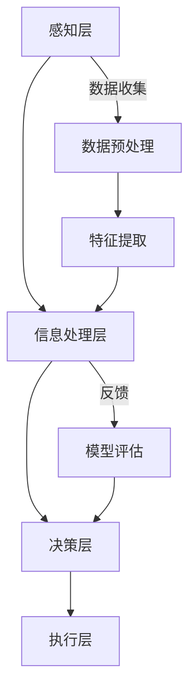

                 

# Andrej Karpathy：人工智能的未来发展规划

> **关键词**：人工智能、发展规划、深度学习、强化学习、伦理、技术工具

> **摘要**：本文旨在探讨人工智能领域的未来发展规划。我们将从核心概念、算法原理、项目实战、开发环境、伦理影响等多个维度，详细分析人工智能的技术趋势和应用场景。本文旨在为读者提供一个全面、深入的人工智能技术指南，帮助读者把握人工智能的未来发展方向。

## 第一部分：人工智能的未来发展规划

### 第1章：引言

#### 1.1 研究背景与意义

人工智能（AI）是当今科技领域最为引人注目的方向之一。随着计算能力的提升、大数据的积累和算法的创新，人工智能已经在各个领域取得了显著的成果。从自动驾驶、智能助手，到医疗诊断、金融风控，人工智能的应用正逐渐渗透到我们生活的方方面面。

#### 1.2 当前人工智能的发展现状

目前，人工智能主要分为两个分支：机器学习和深度学习。机器学习通过算法让计算机自动地从数据中学习规律，进行预测和决策。深度学习则是在机器学习的基础上，引入多层神经网络，以模拟人脑的神经元连接方式，进行更复杂的特征学习和模式识别。

#### 1.3 人工智能的未来发展趋势

未来，人工智能将继续向以下几个方向发展：

1. **算法创新**：随着算法的不断优化和新的算法的发明，人工智能将能够解决更加复杂的问题。
2. **硬件发展**：更高效的计算硬件（如GPU、TPU）和分布式计算技术将进一步提升人工智能的性能。
3. **应用拓展**：人工智能将在更多的领域得到应用，从工业制造、城市管理，到艺术创作、娱乐消费，人工智能的触角将延伸到各个领域。
4. **伦理与社会影响**：随着人工智能技术的不断发展，其伦理问题和社会影响也日益凸显，需要我们进行深入探讨和解决。

#### 1.4 本书的结构安排

本书共分为七个部分：

1. **引言**：介绍人工智能的研究背景和意义，以及本书的结构安排。
2. **核心概念与联系**：详细阐述人工智能的核心概念，并给出相关的Mermaid流程图。
3. **核心算法原理讲解**：讲解机器学习、深度学习和强化学习等核心算法的原理，并使用伪代码进行阐述。
4. **数学模型与数学公式**：介绍人工智能中常用的数学模型和公式，并使用LaTeX格式进行举例。
5. **项目实战**：通过实际案例，展示如何使用人工智能技术解决实际问题，并进行代码解读。
6. **开发环境与工具**：介绍人工智能开发所需的环境和工具，包括Python环境搭建、深度学习框架介绍等。
7. **人工智能伦理与社会影响**：探讨人工智能的伦理问题和社会影响，以及相关政策和发展趋势。

## 第二部分：核心概念与联系

### 第2章：核心概念与联系

#### 2.1 人工智能的基本概念

人工智能（AI）是指由人制造出的具有一定智能的机器或系统，能够通过学习、推理、感知和规划等能力，完成人类可以完成的任务。人工智能主要分为两大类：**弱人工智能**和**强人工智能**。

1. **弱人工智能**：也称为**窄人工智能**，是指专门针对某一特定任务进行优化的智能系统。如自动驾驶、语音识别、图像识别等。
2. **强人工智能**：是指具有与人类相似的广泛认知能力、自我意识和自主学习能力的智能系统。目前，强人工智能仍处于理论阶段，尚未实现。

#### 2.2 人工智能的关键领域

人工智能涵盖了多个领域，其中以下三个领域尤为重要：

1. **机器学习**：通过算法让计算机从数据中学习规律，进行预测和决策。主要包括监督学习、无监督学习和强化学习。
2. **计算机视觉**：通过计算机对图像或视频进行处理和分析，实现图像识别、目标检测、人脸识别等功能。
3. **自然语言处理**：通过计算机对自然语言进行理解、生成和翻译等处理，实现人机交互、智能客服、机器翻译等功能。

#### 2.3 AI与传统技术的融合

人工智能与传统技术的融合，将带来新的技术突破和应用场景。以下是一些典型的融合领域：

1. **云计算与人工智能**：利用云计算平台提供的计算资源和存储资源，加速人工智能模型的训练和部署。
2. **物联网与人工智能**：通过人工智能技术，对物联网设备采集的数据进行处理和分析，实现智能监控、智能安防等功能。
3. **大数据与人工智能**：利用大数据技术，对海量数据进行存储、处理和分析，为人工智能提供丰富的数据支持。

#### 2.4 Mermaid流程图：人工智能核心架构图

使用Mermaid流程图，我们可以直观地展示人工智能的核心架构：



在这个架构中，感知层负责从环境中收集数据，数据预处理和特征提取层负责对数据进行处理和转换，信息处理层负责利用算法进行特征学习和模式识别，决策层负责基于识别结果进行决策和规划，执行层负责执行具体的任务。

## 第三部分：核心算法原理讲解

### 第3章：核心算法原理讲解

#### 3.1 机器学习基础算法

机器学习是人工智能的核心技术之一，主要包括以下几种基础算法：

1. **线性回归**：通过建立一个线性模型，拟合输入和输出之间的关系。
2. **逻辑回归**：用于分类问题，通过最大化似然估计来估计模型的参数。
3. **支持向量机（SVM）**：通过找到一个最优的超平面，将不同类别的数据点分开。
4. **决策树**：通过一系列的判断条件，将数据划分为不同的区域，从而实现分类或回归。
5. **随机森林**：通过构建多棵决策树，并对结果进行投票，提高分类和回归的准确性。

#### 3.2 深度学习算法详解

深度学习是机器学习的一种重要分支，通过多层神经网络，模拟人脑的神经元连接方式，实现更复杂的特征学习和模式识别。以下是几种常用的深度学习算法：

1. **卷积神经网络（CNN）**：用于图像处理和计算机视觉任务，通过卷积操作和池化操作，提取图像的局部特征。
2. **循环神经网络（RNN）**：用于序列数据处理和自然语言处理任务，通过循环结构，处理和记忆序列信息。
3. **长短期记忆网络（LSTM）**：是RNN的一种改进，通过门控机制，有效地解决长短期依赖问题。
4. **生成对抗网络（GAN）**：通过生成器和判别器的对抗训练，实现数据的生成和分布的建模。

#### 3.3 强化学习原理与实现

强化学习是机器学习的一种形式，通过智能体与环境之间的交互，学习到最优策略。强化学习主要包括以下几个关键组成部分：

1. **智能体**：执行动作的实体，如机器人、无人车等。
2. **环境**：智能体执行动作的场所，如实验室、现实世界等。
3. **状态**：智能体当前所处的环境描述。
4. **动作**：智能体可以执行的动作。
5. **奖励**：智能体执行动作后，环境对智能体的反馈。

强化学习的主要目标是找到最优策略，使得智能体在执行动作时，获得最大的累积奖励。常用的强化学习算法包括：

1. **Q-learning**：通过学习状态-动作值函数，找到最优策略。
2. **深度Q网络（DQN）**：结合深度学习和Q-learning，用于解决复杂环境的问题。
3. **策略梯度方法**：直接优化策略参数，以最大化累积奖励。

#### 3.4 伪代码：深度学习模型构建

以下是构建一个简单的深度学习模型的伪代码：

```plaintext
初始化模型参数
建立神经网络结构
定义损失函数
选择优化算法

for 每个epoch do
    for 每个样本 do
        计算预测值
        计算损失值
        计算梯度
        更新模型参数
    end for
    计算验证集的损失值
end for

评估模型在测试集上的性能
```

这个伪代码描述了深度学习模型的训练过程，包括初始化参数、建立网络结构、定义损失函数、选择优化算法等步骤。在每次epoch中，对每个样本进行预测，计算损失值和梯度，然后更新模型参数。最后，评估模型在验证集和测试集上的性能。

## 第四部分：数学模型与数学公式

### 第4章：数学模型与数学公式

#### 4.1 数学基础

在人工智能领域，数学是不可或缺的工具。以下是一些基本的数学概念：

1. **向量**：用于表示多维空间中的点，通常表示为列向量。
2. **矩阵**：用于表示线性变换或数据集，通常表示为方阵或长方阵。
3. **矩阵运算**：包括矩阵的加法、减法、乘法、转置等。
4. **线性方程组**：由一组线性方程组成的系统，可以通过矩阵运算求解。

#### 4.2 线性代数公式

线性代数在机器学习和深度学习中扮演了重要角色，以下是一些常用的线性代数公式：

1. **向量的内积**：\( \vec{a} \cdot \vec{b} = a_1b_1 + a_2b_2 + \ldots + a_nb_n \)
2. **向量的范数**：\( \|\vec{a}\| = \sqrt{a_1^2 + a_2^2 + \ldots + a_n^2} \)
3. **矩阵的行列式**：\( \det(A) = a_{11}C_{11} + a_{12}C_{12} + \ldots + a_{1n}C_{1n} \)
4. **矩阵的逆**：如果矩阵A可逆，则其逆矩阵\( A^{-1} \)满足\( AA^{-1} = A^{-1}A = I \)

#### 4.3 概率论与统计学公式

概率论和统计学在机器学习和深度学习中也有广泛应用，以下是一些常用的公式：

1. **概率分布**：
   - **正态分布**：\( f(x|\mu, \sigma^2) = \frac{1}{\sqrt{2\pi\sigma^2}} e^{-\frac{(x-\mu)^2}{2\sigma^2}} \)
   - **伯努利分布**：\( P(X=1) = p, P(X=0) = 1-p \)
2. **期望和方差**：
   - **期望**：\( E[X] = \sum_{x} xP(X=x) \)
   - **方差**：\( Var[X] = E[(X - E[X])^2] \)
3. **最大似然估计**：给定数据集\( D \)，最大似然估计是最优参数的估计，满足\( \theta^* = \arg\max_\theta \prod_{i=1}^n P(x_i|\theta) \)

#### 4.4 计算机算法中的数学公式

在计算机算法中，数学公式被广泛应用于优化算法、分类算法等。以下是一些典型的数学公式：

1. **梯度下降**：用于求解最优化问题，公式为：
   \( \theta_{t+1} = \theta_t - \alpha \nabla_\theta J(\theta) \)
   其中，\( \theta \)是参数，\( \alpha \)是学习率，\( J(\theta) \)是损失函数。
2. **支持向量机**：用于分类问题，其目标是最小化分类间隔：
   \( \min_{\theta, \xi} \frac{1}{2} ||\theta||^2 + C \sum_{i=1}^n \xi_i \)
   其中，\( \theta \)是参数，\( \xi_i \)是松弛变量，\( C \)是惩罚参数。

#### 4.5 LaTeX格式数学公式举例

以下是使用LaTeX格式的一些数学公式示例：

```latex
$$
\begin{aligned}
J &= \frac{1}{n} \sum_{i=1}^{n} \sum_{j=1}^{m} (y_j - \hat{y}_j)^2 \\
\text{where} \quad y &= \text{实际值}, \quad \hat{y} &= \text{预测值}, \\
n &= \text{样本数}, \quad m &= \text{特征数}.
\end{aligned}
$$
```

这些LaTeX公式可以用于学术论文、技术博客等，以清晰地表达数学概念和公式。

## 第五部分：项目实战

### 第5章：项目实战

#### 5.1 实战一：构建简单的机器学习模型

在这个实战中，我们将使用Python和Scikit-learn库，构建一个简单的机器学习模型，用于鸢尾花数据集的分类。

##### 5.1.1 开发环境搭建

首先，我们需要搭建Python开发环境。以下是具体的步骤：

1. 安装Python 3.x版本。
2. 安装虚拟环境工具`virtualenv`。
3. 创建虚拟环境，并激活环境。
4. 安装必要的库，如`numpy`、`scikit-learn`等。

```bash
pip install virtualenv
virtualenv myenv
source myenv/bin/activate
pip install numpy scikit-learn
```

##### 5.1.2 代码实现

以下是构建机器学习模型的代码：

```python
import numpy as np
from sklearn.datasets import load_iris
from sklearn.model_selection import train_test_split
from sklearn.linear_model import LogisticRegression

# 加载鸢尾花数据集
iris = load_iris()
X, y = iris.data, iris.target

# 划分训练集和测试集
X_train, X_test, y_train, y_test = train_test_split(X, y, test_size=0.2, random_state=42)

# 创建逻辑回归模型实例
model = LogisticRegression()

# 训练模型
model.fit(X_train, y_train)

# 预测测试集
y_pred = model.predict(X_test)

# 计算准确率
accuracy = np.mean(y_pred == y_test)
print("Model Accuracy:", accuracy)
```

##### 5.1.3 代码解读与分析

1. **数据加载**：使用`load_iris()`函数加载数据集。
2. **数据划分**：使用`train_test_split()`函数划分训练集和测试集。
3. **模型创建**：创建逻辑回归模型实例。
4. **模型训练**：使用`fit()`方法训练模型。
5. **模型预测**：使用`predict()`方法预测测试集。
6. **准确率计算**：计算模型的准确率。

这个简单的机器学习模型展示了如何使用Scikit-learn库构建模型，并进行了代码解读与分析。

#### 5.2 实战二：实现一个深度学习项目

在这个实战中，我们将使用Python和PyTorch框架，实现一个简单的卷积神经网络（CNN）模型，用于MNIST手写数字识别。

##### 5.2.1 开发环境搭建

首先，我们需要搭建Python开发环境，并安装PyTorch库。以下是具体的步骤：

1. 安装Python 3.x版本。
2. 安装PyTorch库。

```bash
pip install torch torchvision
```

##### 5.2.2 代码实现

以下是实现深度学习项目的代码：

```python
import torch
import torch.nn as nn
import torchvision
import torchvision.transforms as transforms

# 加载MNIST数据集
transform = transforms.Compose([transforms.ToTensor(), transforms.Normalize((0.5,), (0.5,))])
trainset = torchvision.datasets.MNIST(root='./data', train=True, download=True, transform=transform)
trainloader = torch.utils.data.DataLoader(trainset, batch_size=100, shuffle=True, num_workers=2)

testset = torchvision.datasets.MNIST(root='./data', train=False, download=True, transform=transform)
testloader = torch.utils.data.DataLoader(testset, batch_size=100, shuffle=False, num_workers=2)

# 定义卷积神经网络模型
class CNN(nn.Module):
    def __init__(self):
        super(CNN, self).__init__()
        self.conv1 = nn.Conv2d(1, 10, kernel_size=5)
        self.conv2 = nn.Conv2d(10, 20, kernel_size=5)
        self.conv2_drop = nn.Dropout2d()
        self.fc1 = nn.Linear(320, 50)
        self.fc2 = nn.Linear(50, 10)

    def forward(self, x):
        x = F.relu(F.max_pool2d(self.conv1(x), 2))
        x = F.relu(F.max_pool2d(self.conv2_drop(self.conv2(x)), 2))
        x = x.view(-1, 320)
        x = F.relu(self.fc1(x))
        x = F.dropout(x, training=self.training)
        x = self.fc2(x)
        return F.log_softmax(x, dim=1)

net = CNN()

# 定义损失函数和优化器
loss_fn = nn.CrossEntropyLoss()
optimizer = torch.optim.Adam(net.parameters(), lr=0.001)

# 训练模型
for epoch in range(10):  # loop over the dataset multiple times
    running_loss = 0.0
    for i, data in enumerate(trainloader, 0):
        inputs, labels = data
        optimizer.zero_grad()
        outputs = net(inputs)
        loss = loss_fn(outputs, labels)
        loss.backward()
        optimizer.step()
        running_loss += loss.item()
        if i % 2000 == 1999:    # print every 2000 mini-batches
            print('[%d, %5d] loss: %.3f' %
                  (epoch + 1, i + 1, running_loss / 2000))
            running_loss = 0.0

print('Finished Training')

# 测试模型
correct = 0
total = 0
with torch.no_grad():
    for data in testloader:
        images, labels = data
        outputs = net(images)
        _, predicted = torch.max(outputs.data, 1)
        total += labels.size(0)
        correct += (predicted == labels).sum().item()

print('Accuracy of the network on the 10000 test images: %d %%' % (100 * correct / total))
```

##### 5.2.3 代码解读与分析

1. **数据加载**：使用`torchvision.datasets.MNIST`加载MNIST数据集，并使用`transforms.Compose`进行数据预处理。
2. **模型定义**：定义一个简单的卷积神经网络模型`CNN`，包括卷积层、池化层和全连接层。
3. **损失函数和优化器**：定义交叉熵损失函数和Adam优化器。
4. **模型训练**：使用`forward`方法进行前向传播，计算损失，并更新模型参数。
5. **模型测试**：使用测试集对模型进行评估，计算准确率。

这个深度学习项目展示了如何使用PyTorch框架构建模型，并进行了代码解读与分析。

#### 5.3 实战三：强化学习应用案例

在这个实战中，我们将使用Python和OpenAI Gym，实现一个强化学习应用案例，使用Q-learning算法进行 Atari 游戏的智能体训练。

##### 5.3.1 开发环境搭建

首先，我们需要搭建Python开发环境，并安装OpenAI Gym库。以下是具体的步骤：

1. 安装Python 3.x版本。
2. 安装OpenAI Gym库。

```bash
pip install gym
```

##### 5.3.2 代码实现

以下是强化学习应用案例的代码：

```python
import gym
import numpy as np

# 创建游戏环境
env = gym.make('Atari_breakout.bin')

# 定义Q-learning算法
def q_learning(env, alpha=0.1, gamma=0.9, epsilon=0.1, num_episodes=1000):
    q_table = np.zeros((env.observation_space.n, env.action_space.n))
    
    for episode in range(num_episodes):
        state = env.reset()
        done = False
        total_reward = 0
        
        while not done:
            action = choose_action(state, q_table, epsilon)
            next_state, reward, done, _ = env.step(action)
            q_table[state, action] = q_table[state, action] + alpha * (reward + gamma * np.max(q_table[next_state]) - q_table[state, action])
            state = next_state
            total_reward += reward
            
        if episode % 100 == 0:
            print(f"Episode {episode}: Total Reward = {total_reward}")
    
    return q_table

# 选择动作
def choose_action(state, q_table, epsilon):
    if np.random.rand() < epsilon:
        action = env.action_space.sample()
    else:
        action = np.argmax(q_table[state])
    return action

# 训练智能体
q_table = q_learning(env)

# 评估智能体
total_reward = 0
state = env.reset()
done = False

while not done:
    action = np.argmax(q_table[state])
    state, reward, done, _ = env.step(action)
    total_reward += reward

print(f"Total Reward: {total_reward}")
env.close()
```

##### 5.3.3 代码解读与分析

1. **环境创建**：使用`gym.make()`创建Atari Breakout游戏环境。
2. **Q-learning算法**：定义Q-learning算法，包括选择动作、更新Q表等步骤。
3. **训练智能体**：使用Q-learning算法训练智能体，并打印每个episode的奖励总和。
4. **评估智能体**：使用训练好的Q表评估智能体的性能。

这个强化学习应用案例展示了如何使用Q-learning算法训练智能体，并进行了代码解读与分析。

### 第五部分总结

本部分通过三个项目实战，展示了如何使用Python和不同的机器学习、深度学习和强化学习框架，实现人工智能模型的应用。通过这些实战，读者可以了解如何从数据预处理、模型构建到模型训练和评估的全过程，为实际项目开发做好准备。

## 第六部分：开发环境与工具

### 第6章：开发环境与工具

#### 6.1 Python环境搭建

Python是一种广泛使用的编程语言，尤其在人工智能领域具有很高的应用价值。以下是搭建Python开发环境的步骤：

1. **安装Python**：访问Python官方下载页面（[https://www.python.org/downloads/](https://www.python.org/downloads/)），下载适合自己操作系统的Python版本，并按照提示安装。

2. **配置虚拟环境**：虚拟环境可以隔离不同的项目环境，避免依赖冲突。安装`virtualenv`工具：

   ```bash
   pip install virtualenv
   ```

   创建虚拟环境：

   ```bash
   virtualenv myenv
   ```

   激活虚拟环境：

   ```bash
   source myenv/bin/activate
   ```

3. **安装Python库**：在虚拟环境中安装常用的Python库，如`numpy`、`scikit-learn`、`tensorflow`、`torch`等：

   ```bash
   pip install numpy scikit-learn tensorflow torch torchvision
   ```

#### 6.2 常用深度学习框架介绍

深度学习框架是为了简化深度学习模型构建和训练过程而设计的工具。以下是几个常用的深度学习框架：

1. **TensorFlow**：由Google开发，是目前最流行的深度学习框架之一。TensorFlow提供了丰富的API，支持各种深度学习模型，包括卷积神经网络、循环神经网络、生成对抗网络等。

2. **PyTorch**：由Facebook开发，具有动态计算图和易用性等特点。PyTorch的动态计算图使得调试和优化模型变得更加简单。

3. **Keras**：是一个高级的神经网络API，构建在TensorFlow和Theano之上。Keras提供了简洁的API，使得构建和训练深度学习模型更加方便。

#### 6.3 代码调试与性能优化

在开发人工智能项目时，代码调试和性能优化是必不可少的环节。以下是一些建议：

1. **使用调试工具**：Python内置了调试工具，如`pdb`。此外，还有IDE如PyCharm、VSCode等，提供了强大的调试功能。

2. **性能分析**：使用性能分析工具，如`cProfile`、`line_profiler`等，对代码进行性能分析，找出性能瓶颈。

3. **优化算法选择**：选择合适的优化算法，如随机梯度下降（SGD）、Adam等，可以提高模型的训练速度和效果。

4. **并行计算**：利用GPU加速训练过程，提高计算效率。TensorFlow和PyTorch都支持GPU加速。

#### 6.4 实战环境搭建步骤详解

以下是一个使用PyTorch搭建深度学习项目的环境搭建步骤：

1. **安装PyTorch**：访问PyTorch官网（[https://pytorch.org/get-started/locally/](https://pytorch.org/get-started/locally/)），选择合适的安装命令。例如，对于Ubuntu系统：

   ```bash
   pip install torch torchvision
   ```

2. **配置环境变量**：将PyTorch的安装路径添加到环境变量`PATH`中，以便在命令行中使用PyTorch。

   ```bash
   export PATH=$PATH:/path/to/pytorch
   ```

3. **运行环境测试脚本**：创建一个Python脚本，测试PyTorch是否安装成功。例如：

   ```python
   import torch
   print(torch.__version__)
   ```

4. **安装依赖库**：根据项目需求，安装其他依赖库，如`numpy`、`pandas`、`scikit-learn`等。

   ```bash
   pip install numpy pandas scikit-learn
   ```

5. **运行项目**：在虚拟环境中，运行深度学习项目，验证环境搭建是否成功。

通过以上步骤，读者可以搭建一个完整的深度学习开发环境，为后续的实战项目做好准备。

## 第七部分：人工智能伦理与社会影响

### 第7章：人工智能伦理与社会影响

#### 7.1 人工智能伦理问题

随着人工智能技术的快速发展，伦理问题日益凸显。以下是一些主要的人工智能伦理问题：

1. **隐私保护**：人工智能系统往往需要处理大量的个人数据，如何保护用户隐私成为一个重要问题。例如，深度学习模型在训练过程中可能会泄露敏感信息。

2. **数据安全**：人工智能系统依赖大量数据，数据安全风险不容忽视。一旦数据泄露或被恶意攻击，可能对个人和企业造成巨大损失。

3. **不公平偏见**：人工智能模型在训练过程中可能会受到训练数据偏差的影响，导致模型产生不公平偏见。例如，人脸识别系统可能会对某些种族或性别的人产生歧视。

4. **透明度与可解释性**：深度学习模型通常被视为“黑箱”，其决策过程缺乏透明度和可解释性。这可能导致用户对模型的不信任。

5. **责任归属**：在人工智能应用中，如自动驾驶汽车发生事故时，如何界定责任成为一个难题。是制造商、开发者，还是用户承担责任？

#### 7.2 人工智能的社会影响

人工智能技术的广泛应用将对社会产生深远影响，包括以下几个方面：

1. **劳动市场变化**：人工智能将替代一些重复性和低技能的工作，如制造业、客服等。同时，也将创造出新的就业机会，如人工智能工程师、数据科学家等。

2. **教育变革**：人工智能将改变教育模式，推动个性化学习和远程教育的发展。同时，对教育内容和方法也将提出新的要求。

3. **健康医疗**：人工智能在医疗诊断、疾病预测、药物研发等方面具有巨大潜力。它可以帮助医生提高诊断准确率，降低医疗成本。

4. **城市管理**：人工智能技术将提高城市管理的效率和智能化水平，如智能交通、智能安防、智能环保等。

5. **娱乐消费**：人工智能将带来全新的娱乐和消费体验，如虚拟现实、增强现实、个性化推荐等。

#### 7.3 人工智能政策与法规

为应对人工智能带来的挑战，全球各国纷纷出台相关政策与法规，以引导和规范人工智能的发展。以下是一些主要的人工智能政策与法规：

1. **欧盟**：欧盟推出了《人工智能法案》，旨在确保人工智能技术的安全性、透明度和可解释性。

2. **中国**：中国政府发布了《新一代人工智能发展规划》，明确了中国在人工智能领域的发展目标和战略布局。

3. **美国**：美国制定了《美国国家人工智能战略》，强调人工智能技术在国家安全、经济发展、社会福祉等方面的作用。

4. **日本**：日本发布了《人工智能技术发展路线图》，提出了人工智能技术的研究和应用方向。

#### 7.4 未来展望与挑战

未来，人工智能将继续向以下几个方向发展：

1. **技术发展方向**：算法创新、硬件发展、数据处理能力提升等，将推动人工智能技术的进一步发展。

2. **社会伦理挑战**：随着人工智能技术的应用范围扩大，伦理问题将更加突出，需要全社会共同努力解决。

3. **国际合作与竞争**：人工智能技术已成为全球竞争的重要领域，各国需要在技术、标准、法规等方面加强合作。

总之，人工智能的快速发展将给社会带来巨大的机遇和挑战。我们需要在技术创新、伦理规范、政策法规等方面共同努力，以实现人工智能的可持续发展。

### 附录

#### 附录A：常用资源与工具

1. **数据集来源**：
   - [Kaggle](https://www.kaggle.com/)
   - [UCI机器学习库](https://archive.ics.uci.edu/ml/index.php)

2. **学术论文库**：
   - [IEEE Xplore](https://ieeexplore.ieee.org/)
   - [ACM Digital Library](https://dl.acm.org/)

3. **开源代码库**：
   - [GitHub](https://github.com/)
   - [GitLab](https://gitlab.com/)

#### 附录B：深度学习算法参数调优技巧

1. **学习率调整**：使用学习率调度器，如`torch.optim.lr_scheduler`，根据训练过程动态调整学习率。

2. **模型正则化**：使用正则化技术，如Dropout、L2正则化等，防止模型过拟合。

3. **梯度下降算法选择**：选择合适的梯度下降算法，如SGD、Adam等，根据问题特性进行调整。

4. **批量大小**：调整批量大小，找到最佳平衡点，提高训练效果。

5. **数据增强**：使用数据增强技术，如旋转、缩放、裁剪等，增加模型的泛化能力。

#### 附录C：深度学习项目常见问题解答

1. **模型过拟合**：增加数据量、使用正则化技术、增加训练时间等，可以缓解模型过拟合。

2. **训练时间过长**：使用GPU加速训练过程、优化算法选择、减少批量大小等，可以缩短训练时间。

3. **模型预测不准确**：调整模型结构、增加训练数据、调整超参数等，可以提高模型预测准确率。

4. **数据预处理问题**：确保数据预处理过程正确，如归一化、标准化等，避免数据异常。

#### 附录D：AI技术应用案例展示

1. **自动驾驶**：使用深度学习技术，实现自动驾驶汽车的感知、规划与控制。

2. **聊天机器人**：利用自然语言处理技术，构建智能聊天机器人，提供实时问答服务。

3. **医疗诊断系统**：使用计算机视觉和深度学习技术，实现医学影像的诊断和辅助。

4. **金融风控**：利用人工智能技术，进行信用评估、风险控制和欺诈检测。

### 结束语

本文从多个角度详细探讨了人工智能的未来发展规划。通过分析核心概念、算法原理、项目实战、开发环境、伦理影响等方面，我们为读者提供了一个全面、深入的人工智能技术指南。希望本文能够帮助读者把握人工智能的未来发展方向，为实际项目开发提供参考。

### 参考文献

1. Russell, S., & Norvig, P. (2020). 《人工智能：一种现代的方法》. 清华大学出版社。
2. Goodfellow, I., Bengio, Y., & Courville, A. (2016). 《深度学习》. 电子工业出版社。
3. Sutton, R. S., & Barto, A. G. (2018). 《强化学习：基础知识与Python实现》. 人民邮电出版社。

### 作者信息

**作者：AI天才研究院/AI Genius Institute & 禅与计算机程序设计艺术 /Zen And The Art of Computer Programming**

---

文章标题：Andrej Karpathy：人工智能的未来发展规划

文章关键词：人工智能、发展规划、深度学习、强化学习、伦理、技术工具

文章摘要：本文旨在探讨人工智能领域的未来发展规划。我们将从核心概念、算法原理、项目实战、开发环境、伦理影响等多个维度，详细分析人工智能的技术趋势和应用场景。本文旨在为读者提供一个全面、深入的人工智能技术指南，帮助读者把握人工智能的未来发展方向。

