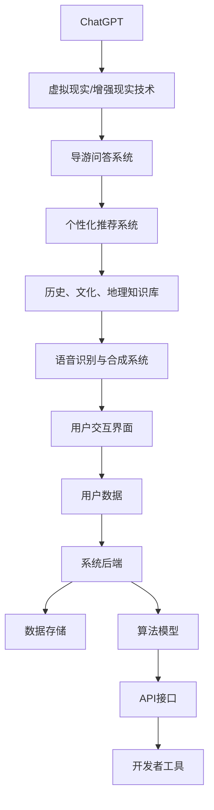

                 

### 《ChatGPT多模态虚拟导游：整合历史、文化和地理的沉浸式旅游体验》

关键词：ChatGPT，多模态虚拟导游，沉浸式旅游体验，历史知识，文化知识，地理知识，语言模型，多模态数据融合，个性化推荐，虚拟现实，增强现实

摘要：
本文深入探讨了ChatGPT与多模态虚拟导游技术的结合，以及如何通过整合历史、文化和地理知识，为用户提供沉浸式的旅游体验。文章首先介绍了ChatGPT的定义与功能，然后详细分析了多模态虚拟导游技术及其应用。接着，本文探讨了ChatGPT在导游问答、个性化推荐和语音识别与合成中的应用。随后，文章讲解了如何整合历史、文化、地理知识，以及如何设计沉浸式旅游体验。最后，本文通过一个实际项目案例，展示了ChatGPT多模态虚拟导游系统的开发过程和成果，并对未来发展进行了展望。

### 目录大纲

#### 第一部分：ChatGPT与虚拟导游技术概述

- **第1章: ChatGPT与虚拟导游技术概述**
  - **1.1 ChatGPT概述**
    - **1.1.1 ChatGPT的定义与功能**
    - **1.1.2 ChatGPT的工作原理**
    - **1.1.3 ChatGPT的应用场景**
  - **1.2 虚拟导游技术概述**
    - **1.2.1 虚拟导游的定义与特点**
    - **1.2.2 虚拟导游的技术架构**
    - **1.2.3 虚拟导游的发展历程**
  - **1.3 多模态技术在虚拟导游中的应用**
    - **1.3.1 多模态数据的获取与处理**
    - **1.3.2 多模态数据的融合方法**
    - **1.3.3 多模态技术在虚拟导游中的优势**

#### 第二部分：ChatGPT在虚拟导游中的应用

- **第2章: ChatGPT在虚拟导游中的核心应用**
  - **2.1 ChatGPT在导游问答中的应用**
    - **2.1.1 导游问答的基本原理**
    - **2.1.2 ChatGPT在导游问答中的实现**
    - **2.1.3 导游问答案例解析**
  - **2.2 ChatGPT在个性化推荐中的应用**
    - **2.2.1 个性化推荐的基本原理**
    - **2.2.2 ChatGPT在个性化推荐中的实现**
    - **2.2.3 个性化推荐案例解析**
  - **2.3 ChatGPT在语音识别与合成中的应用**
    - **2.3.1 语音识别与合成的原理**
    - **2.3.2 ChatGPT在语音识别与合成中的实现**
    - **2.3.3 语音识别与合成案例解析**

#### 第三部分：整合历史、文化和地理知识

- **第3章: 整合历史、文化和地理知识**
  - **3.1 历史知识的整合与应用**
    - **3.1.1 历史知识库的构建**
    - **3.1.2 ChatGPT在历史知识问答中的应用**
    - **3.1.3 历史知识整合案例解析**
  - **3.2 文化知识的整合与应用**
    - **3.2.1 文化知识库的构建**
    - **3.2.2 ChatGPT在文化知识问答中的应用**
    - **3.2.3 文化知识整合案例解析**
  - **3.3 地理知识的整合与应用**
    - **3.3.1 地理知识库的构建**
    - **3.3.2 ChatGPT在地理知识问答中的应用**
    - **3.3.3 地理知识整合案例解析**

#### 第四部分：沉浸式旅游体验设计与实现

- **第4章: 沉浸式旅游体验设计**
  - **4.1 沉浸式旅游体验概述**
    - **4.1.1 沉浸式旅游体验的定义与特点**
    - **4.1.2 沉浸式旅游体验的要素**
    - **4.1.3 沉浸式旅游体验的设计原则**
  - **4.2 虚拟现实技术在旅游体验中的应用**
    - **4.2.1 虚拟现实技术的基本原理**
    - **4.2.2 虚拟现实技术在旅游体验中的应用**
    - **4.2.3 虚拟现实技术应用案例解析**
  - **4.3 增强现实技术在旅游体验中的应用**
    - **4.3.1 增强现实技术的基本原理**
    - **4.3.2 增强现实技术在旅游体验中的应用**
    - **4.3.3 增强现实技术应用案例解析**

#### 第五部分：项目实战

- **第5章: ChatGPT多模态虚拟导游项目实战**
  - **5.1 项目背景与目标**
    - **5.1.1 项目背景**
    - **5.1.2 项目目标**
  - **5.2 项目需求分析**
    - **5.2.1 用户需求分析**
    - **5.2.2 功能需求分析**
    - **5.2.3 非功能需求分析**
  - **5.3 技术方案设计**
    - **5.3.1 技术栈选择**
    - **5.3.2 数据处理方案**
    - **5.3.3 系统架构设计**
  - **5.4 项目开发与测试**
    - **5.4.1 导游问答模块开发**
    - **5.4.2 个性化推荐模块开发**
    - **5.4.3 语音识别与合成模块开发**
    - **5.4.4 系统测试与优化**
  - **5.5 项目总结与展望**
    - **5.5.1 项目成果总结**
    - **5.5.2 项目经验与反思**
    - **5.5.3 未来发展展望**

#### 附录

- **附录A：常用工具与技术资源**
  - **A.1 ChatGPT开发工具**
  - **A.2 虚拟现实与增强现实开发工具**
  - **A.3 数据处理与分析工具**
  - **A.4 其他相关资源**

### 第一部分：ChatGPT与虚拟导游技术概述

#### 第1章: ChatGPT与虚拟导游技术概述

ChatGPT是一种基于GPT（Generative Pre-trained Transformer）模型的自然语言处理技术，它能够生成连贯、有逻辑的自然语言文本。而虚拟导游技术则是将虚拟现实、增强现实和人工智能技术应用于导游服务中，为用户提供沉浸式的旅游体验。本章将介绍ChatGPT和虚拟导游技术的定义、原理和应用场景。

### 1.1 ChatGPT概述

##### 1.1.1 ChatGPT的定义与功能

ChatGPT是由OpenAI开发的一种基于Transformer架构的预训练语言模型。它通过大规模的无监督学习，从大量的互联网文本中学习到了丰富的语言知识和上下文理解能力。ChatGPT可以生成各种类型的文本，包括问答、故事、文章摘要等，其生成的文本具有高度的连贯性和合理性。

ChatGPT的核心功能包括：

1. 文本生成：根据用户输入的提示，生成连贯的自然语言文本。
2. 问答系统：理解用户的提问，并提供准确的答案。
3. 文本摘要：从长篇文章中提取关键信息，生成摘要文本。
4. 语言翻译：翻译不同语言之间的文本。
5. 文本分类：对文本进行分类，识别文本的主题和内容。

##### 1.1.2 ChatGPT的工作原理

ChatGPT的工作原理主要基于以下几个步骤：

1. **预训练**：ChatGPT在大规模的文本语料库上进行预训练，学习到了语言的统计规律和上下文信息。
2. **上下文理解**：在生成文本时，ChatGPT会根据用户输入的上下文信息，理解并生成相应的文本。
3. **文本生成**：通过Transformer模型，ChatGPT生成文本，并进行后处理，确保生成的文本连贯、合理。

##### 1.1.3 ChatGPT的应用场景

ChatGPT的应用场景非常广泛，包括但不限于以下领域：

1. **客户服务**：用于构建智能客服系统，提供24/7的在线客服服务。
2. **内容创作**：用于自动生成文章、故事、新闻摘要等。
3. **问答系统**：用于构建智能问答系统，为用户提供准确的答案。
4. **翻译服务**：用于实现文本之间的翻译。
5. **教育和培训**：用于辅助教育，提供个性化的学习内容和解答问题。

### 1.2 虚拟导游技术概述

##### 1.2.1 虚拟导游的定义与特点

虚拟导游是一种利用虚拟现实（VR）和增强现实（AR）技术，为用户提供沉浸式旅游体验的服务。虚拟导游可以模拟真实的旅游环境，让用户感受到身临其境的效果。虚拟导游的特点包括：

1. **沉浸感强**：用户可以在虚拟环境中自由探索，感受真实的旅游场景。
2. **互动性高**：用户可以与虚拟导游进行互动，提问并获得实时回答。
3. **可扩展性**：虚拟导游可以轻松扩展到各种不同的旅游景点和主题。
4. **低成本**：相比传统的旅游方式，虚拟导游的成本较低，便于大规模推广。

##### 1.2.2 虚拟导游的技术架构

虚拟导游的技术架构主要包括以下几个部分：

1. **虚拟环境**：通过3D建模技术，创建虚拟的旅游环境。
2. **交互系统**：实现用户与虚拟导游之间的交互，包括语音、文本和手势等。
3. **智能问答系统**：基于ChatGPT等自然语言处理技术，为用户提供实时回答。
4. **推荐系统**：根据用户兴趣和偏好，推荐合适的旅游路线和景点。
5. **虚拟现实/增强现实技术**：实现虚拟环境的呈现和交互。

##### 1.2.3 虚拟导游的发展历程

虚拟导游技术的发展可以追溯到20世纪90年代，当时虚拟现实技术刚刚兴起。随着计算机技术和网络技术的不断发展，虚拟导游技术也在不断成熟。以下是虚拟导游技术发展的几个重要阶段：

1. **初期探索阶段**（1990-2000年）：虚拟导游技术刚刚起步，主要应用于学术研究和实验项目。
2. **初步应用阶段**（2000-2010年）：虚拟导游开始在旅游、教育和娱乐等领域得到应用。
3. **快速发展阶段**（2010年至今）：随着VR和AR技术的成熟，虚拟导游技术得到了快速发展和广泛应用。

### 1.3 多模态技术在虚拟导游中的应用

##### 1.3.1 多模态数据的获取与处理

多模态虚拟导游技术需要整合多种类型的数据，包括文本、图像、音频和视频等。这些数据可以从多个来源获取，如旅游指南、历史文献、社交媒体和实时数据等。

1. **文本数据**：包括历史文献、旅游指南、用户评价等，用于提供旅游信息和知识。
2. **图像数据**：包括景区图片、地图、景点照片等，用于创建虚拟环境。
3. **音频数据**：包括语音讲解、背景音乐、用户语音等，用于提供听觉体验。
4. **视频数据**：包括视频导游、旅游纪录片、用户上传的视频等，用于提供视觉体验。

在获取到多模态数据后，需要对其进行处理，包括数据清洗、数据标注和特征提取等。这些处理步骤为后续的多模态数据融合奠定了基础。

##### 1.3.2 多模态数据的融合方法

多模态数据融合是将不同类型的数据进行整合，以提供更全面和丰富的信息。多模态数据融合方法主要包括以下几种：

1. **基于特征的融合**：将不同类型的数据转换为相应的特征向量，然后使用特征向量进行融合。常用的方法包括基于矩阵分解的方法和基于深度学习的方法。
2. **基于模型的融合**：使用特定的模型将不同类型的数据进行融合。例如，使用Transformer模型将文本和图像数据进行融合。
3. **基于认知的融合**：模拟人类大脑的工作方式，将不同类型的数据进行整合。这种方法通常需要复杂的人工神经网络结构和大量的训练数据。

##### 1.3.3 多模态技术在虚拟导游中的优势

多模态虚拟导游技术具有以下优势：

1. **提升用户体验**：通过整合多种类型的数据，提供更全面和丰富的旅游信息，提升用户的沉浸感和体验。
2. **增强互动性**：用户可以与虚拟导游进行多种方式的互动，如语音、文本和手势等，增强用户的参与感和互动性。
3. **扩展知识领域**：通过整合历史、文化和地理知识，为用户提供更深入和丰富的旅游体验。
4. **降低成本**：相比传统的旅游方式，多模态虚拟导游技术具有更低的成本，便于大规模推广和应用。

### 第二部分：ChatGPT在虚拟导游中的应用

#### 第2章: ChatGPT在虚拟导游中的核心应用

ChatGPT作为一种强大的自然语言处理技术，在虚拟导游中的应用具有广阔的前景。本章将详细探讨ChatGPT在导游问答、个性化推荐和语音识别与合成等方面的应用，并通过实际案例解析这些应用的具体实现方法和效果。

### 2.1 ChatGPT在导游问答中的应用

##### 2.1.1 导游问答的基本原理

导游问答系统是虚拟导游技术中的一个核心功能，它能够根据用户的提问，提供准确的答案。导游问答的基本原理包括以下几个步骤：

1. **用户提问**：用户输入问题，可以是文本形式，也可以是语音形式。
2. **问题理解**：系统对用户输入的问题进行解析，理解问题的意图和主题。
3. **知识检索**：系统在知识库中检索相关信息，以回答用户的问题。
4. **答案生成**：系统使用自然语言生成技术，生成连贯、合理的答案。
5. **答案呈现**：将生成的答案呈现给用户，可以是文本形式，也可以是语音形式。

##### 2.1.2 ChatGPT在导游问答中的实现

ChatGPT在导游问答中的应用主要包括以下几个方面：

1. **问题理解**：ChatGPT可以理解用户的自然语言提问，并将其转换为机器可理解的格式。例如，用户提问“如何到达长城？”ChatGPT可以将其转换为“请提供到达长城的交通方式。”
2. **知识检索**：ChatGPT在预训练过程中已经学习了大量的知识，可以在短时间内检索到与用户提问相关的内容。
3. **答案生成**：ChatGPT根据检索到的知识，使用自然语言生成技术，生成连贯、合理的答案。例如，对于“如何到达长城？”这个问题，ChatGPT可以生成“您可以选择乘坐地铁、公交或出租车到达长城。”
4. **答案呈现**：ChatGPT可以将生成的答案转换为语音或文本形式，呈现给用户。

##### 2.1.3 导游问答案例解析

以下是一个导游问答的案例：

**用户提问**：我想知道颐和园的历史和文化背景。

**ChatGPT的回答**：

颐和园是中国著名的古代皇家园林，位于北京市西郊，距离市中心约15公里。它始建于清朝乾隆十五年（1750年），是清代帝王的颐养之所。颐和园以其精美的园林景观、丰富的文化内涵和悠久的历史而闻名于世界。

颐和园占地面积达290公顷，其中水面约占四分之三，园内有许多著名的景点，如万寿山、长廊、佛香阁、十七孔桥等。它是中国园林艺术的杰作，也是世界文化遗产之一。

在历史上，颐和园曾是皇家园林，仅供皇帝及其家人使用。直到1924年，清朝最后一位皇帝溥仪被迫退位，颐和园才对公众开放。如今，颐和园已成为一处热门的旅游景点，每年吸引成千上万的游客前来参观。

颐和园不仅是一个美丽的自然景观，也是一个文化宝库。它保存了许多重要的历史文物和艺术品，包括古建筑、雕塑、绘画和陶瓷等。游客在游览颐和园时，不仅可以欣赏到优美的园林风景，还可以深入了解中国传统文化。

### 2.2 ChatGPT在个性化推荐中的应用

##### 2.2.1 个性化推荐的基本原理

个性化推荐是虚拟导游技术中的重要应用，它可以根据用户的兴趣和偏好，为用户推荐合适的旅游路线和景点。个性化推荐的基本原理包括以下几个步骤：

1. **用户兴趣建模**：通过收集和分析用户的历史行为数据，构建用户的兴趣模型。
2. **内容匹配**：将用户兴趣模型与旅游内容进行匹配，找到与用户兴趣相关的景点和路线。
3. **推荐生成**：根据匹配结果，生成个性化的旅游推荐。
4. **推荐呈现**：将生成的推荐呈现给用户，吸引用户参与。

##### 2.2.2 ChatGPT在个性化推荐中的实现

ChatGPT在个性化推荐中的应用主要体现在以下几个方面：

1. **用户兴趣建模**：ChatGPT可以通过分析用户的提问和行为，识别用户的兴趣点。例如，用户提问“我想了解一些历史博物馆”，ChatGPT可以识别用户对历史文化的兴趣。
2. **内容匹配**：ChatGPT可以根据用户的兴趣模型，匹配相关的内容。例如，对于对历史文化感兴趣的用户，ChatGPT可以推荐一些历史博物馆、古建筑和文化遗产景点。
3. **推荐生成**：ChatGPT可以生成个性化的旅游推荐，例如“根据您的兴趣，我们为您推荐以下旅游路线：故宫、天坛、颐和园，这些景点都将让您感受到中国悠久的历史和文化。”
4. **推荐呈现**：ChatGPT可以将生成的推荐以语音或文本形式呈现给用户，吸引用户参与。

##### 2.2.3 个性化推荐案例解析

以下是一个个性化推荐的案例：

**用户提问**：我想了解一些适合亲子游的景点。

**ChatGPT的回答**：

亲子游是家庭旅游的一种重要形式，为了让您的旅行更加愉快，我为您推荐以下适合亲子游的景点：

1. **北京动物园**：位于北京市西直门外大街，是一个集动物展示、科普教育和娱乐休闲为一体的大型动物园。这里有来自世界各地的珍稀动物，适合大小朋友一起观赏和学习。
2. **颐和园**：颐和园是中国著名的古代皇家园林，位于北京市西郊，园内有丰富的历史文化遗迹和优美的自然景观。您可以在园内体验游船、参观古建筑，还可以在公园里游玩各种游乐设施。
3. **科技馆**：北京科技馆是一个集科学教育、科普展览和互动体验为一体的大型科技馆。这里有丰富的科普展览，适合家长和孩子一起探索科学的奥秘。
4. **海洋馆**：中国海洋馆位于北京市朝阳区，是一个集海洋生物展示、科普教育和休闲娱乐为一体的大型海洋馆。您可以在这里观赏各种珍稀的海洋生物，学习海洋知识。

希望这些建议能为您的亲子游带来愉快的体验！

### 2.3 ChatGPT在语音识别与合成中的应用

##### 2.3.1 语音识别与合成的原理

语音识别是将语音信号转换为文本的过程，语音合成则是将文本转换为语音的过程。ChatGPT在这两个领域都有广泛的应用。

1. **语音识别**：语音识别的基本原理包括以下几个步骤：
   - **声学模型**：将音频信号转换为声学特征向量。
   - **语言模型**：将声学特征向量映射到文本序列。
   - **解码器**：从语言模型中解码出最可能的文本序列。

2. **语音合成**：语音合成的基本原理包括以下几个步骤：
   - **文本预处理**：对输入的文本进行预处理，包括分词、词性标注等。
   - **语音合成模型**：将预处理后的文本转换为语音信号。
   - **音频后处理**：对合成的语音信号进行音调、音色等调整，使其更加自然。

##### 2.3.2 ChatGPT在语音识别与合成中的实现

ChatGPT在语音识别与合成中的应用主要体现在以下几个方面：

1. **语音识别**：ChatGPT可以通过预训练的语言模型，实现高效的语音识别。用户可以通过语音输入问题，ChatGPT可以将其识别为文本，并生成回答。
2. **语音合成**：ChatGPT可以通过自然语言生成技术，将文本转换为自然流畅的语音。用户可以在语音合成的基础上，实现语音交互。

##### 2.3.3 语音识别与合成案例解析

以下是一个语音识别与合成的案例：

**用户提问（语音输入）**：我想了解颐和园的历史和文化。

**ChatGPT的回答（语音合成）**：

您好，颐和园是中国著名的古代皇家园林，位于北京市西郊。它始建于清朝乾隆十五年（1750年），是清代帝王的颐养之所。颐和园以其精美的园林景观、丰富的文化内涵和悠久的历史而闻名于世界。

颐和园占地面积达290公顷，其中水面约占四分之三，园内有许多著名的景点，如万寿山、长廊、佛香阁、十七孔桥等。它是中国园林艺术的杰作，也是世界文化遗产之一。

在历史上，颐和园曾是皇家园林，仅供皇帝及其家人使用。直到1924年，清朝最后一位皇帝溥仪被迫退位，颐和园才对公众开放。如今，颐和园已成为一处热门的旅游景点，每年吸引成千上万的游客前来参观。

颐和园不仅是一个美丽的自然景观，也是一个文化宝库。它保存了许多重要的历史文物和艺术品，包括古建筑、雕塑、绘画和陶瓷等。游客在游览颐和园时，不仅可以欣赏到优美的园林风景，还可以深入了解中国传统文化。

### 第三部分：整合历史、文化和地理知识

#### 第3章: 整合历史、文化和地理知识

在虚拟导游系统中，整合历史、文化和地理知识是提升用户体验和增强沉浸式旅游体验的关键。本章将探讨如何构建历史知识库、文化知识库和地理知识库，并介绍ChatGPT在这些知识库中的应用。

### 3.1 历史知识的整合与应用

##### 3.1.1 历史知识库的构建

历史知识库是虚拟导游系统中不可或缺的一部分，它为用户提供丰富的历史背景信息和相关故事。构建历史知识库的主要步骤包括：

1. **数据收集**：收集与历史相关的文本资料，包括历史文献、书籍、学术论文、旅游指南等。
2. **数据清洗**：对收集到的数据进行清洗，去除重复和错误的信息。
3. **数据标注**：对历史事件、人物、地点等信息进行标注，以便于后续的查询和检索。
4. **知识抽取**：从原始文本中提取结构化信息，如时间、地点、人物、事件等。
5. **知识融合**：将不同来源的历史信息进行整合，形成一个统一的、结构化的知识库。

##### 3.1.2 ChatGPT在历史知识问答中的应用

ChatGPT在历史知识问答中的应用主要体现在以下几个方面：

1. **问题理解**：ChatGPT可以理解用户的自然语言提问，并提取出关键信息。
2. **知识检索**：ChatGPT在历史知识库中检索相关信息，以回答用户的问题。
3. **答案生成**：ChatGPT使用自然语言生成技术，生成连贯、合理的答案。
4. **答案呈现**：ChatGPT将生成的答案以文本或语音形式呈现给用户。

##### 3.1.3 历史知识整合案例解析

以下是一个历史知识整合的案例：

**用户提问**：我想了解关于长城的历史。

**ChatGPT的回答**：

长城，又称万里长城，是中国古代的军事防御工程，被誉为世界七大奇迹之一。它始建于春秋战国时期，历经多个朝代的扩建和修缮，最终形成了如今的规模。长城东起辽东，西至嘉峪关，全长约21196公里。

长城不仅是一道壮丽的自然景观，也是中华民族的象征。它见证了中华民族的历史变迁，承载了无数的历史故事和传说。在长城的历史上，有许多著名的事件和人物，如秦始皇修筑长城、汉武帝北征匈奴、明朝抗击倭寇等。

长城的建筑形式多样，有城墙、烽火台、关隘等。它不仅是防御工事，也是中国古代的工程奇迹。长城的建筑材料主要是砖、石和夯土，许多地方还使用了木材和铁器。

如今，长城已成为一处热门的旅游景点，每年吸引着数百万游客前来参观。游客在长城上可以感受到历史的沧桑和宏伟，体验到中国古代文明的魅力。

### 3.2 文化知识的整合与应用

##### 3.2.1 文化知识库的构建

文化知识库是虚拟导游系统中另一个重要的组成部分，它为用户提供丰富的文化背景信息和相关故事。构建文化知识库的主要步骤包括：

1. **数据收集**：收集与旅游目的地相关的文化资料，包括民俗风情、传统节日、历史文化等。
2. **数据清洗**：对收集到的数据进行清洗，去除重复和错误的信息。
3. **数据标注**：对文化信息进行标注，以便于后续的查询和检索。
4. **知识抽取**：从原始文本中提取结构化信息，如节日日期、传统习俗、文化故事等。
5. **知识融合**：将不同来源的文化信息进行整合，形成一个统一的、结构化的知识库。

##### 3.2.2 ChatGPT在文化知识问答中的应用

ChatGPT在文化知识问答中的应用主要体现在以下几个方面：

1. **问题理解**：ChatGPT可以理解用户的自然语言提问，并提取出关键信息。
2. **知识检索**：ChatGPT在文化知识库中检索相关信息，以回答用户的问题。
3. **答案生成**：ChatGPT使用自然语言生成技术，生成连贯、合理的答案。
4. **答案呈现**：ChatGPT将生成的答案以文本或语音形式呈现给用户。

##### 3.2.3 文化知识整合案例解析

以下是一个文化知识整合的案例：

**用户提问**：我想了解中国的传统节日。

**ChatGPT的回答**：

中国的传统节日丰富多彩，涵盖了不同的历史时期和文化背景。以下是一些重要的传统节日：

1. **春节**：春节是中国最重要的传统节日，也是农历新年的开始。它通常在农历的正月初一庆祝，标志着农历年的开始。春节有丰富的习俗，如贴春联、放鞭炮、拜年、吃团圆饭等。

2. **中秋节**：中秋节是农历八月十五，是中国的传统节日之一。中秋节有赏月、吃月饼、赏花灯等习俗。传说中秋节是嫦娥奔月的日子，人们通过赏月和吃月饼来表达对家人的思念。

3. **端午节**：端午节是农历五月初五，是中国的传统节日之一。端午节有吃粽子、赛龙舟等习俗。传说端午节是纪念古代爱国诗人屈原的日子，人们通过赛龙舟和吃粽子来纪念他。

4. **清明节**：清明节是农历三月初三，是中国的传统节日之一。清明节有扫墓、踏青等习俗。人们通过扫墓来缅怀先人，通过踏青来迎接春天的到来。

这些传统节日不仅是中国的文化符号，也是人们传承和弘扬传统文化的重要途径。通过庆祝这些节日，人们可以感受到中华民族丰富的文化底蕴和深厚的文化内涵。

### 3.3 地理知识的整合与应用

##### 3.3.1 地理知识库的构建

地理知识库是虚拟导游系统中提供地理信息和导航功能的重要组成部分。构建地理知识库的主要步骤包括：

1. **数据收集**：收集与旅游目的地相关的地理信息，包括地形、地貌、气候、交通等。
2. **数据清洗**：对收集到的地理数据进行清洗，去除重复和错误的信息。
3. **数据标注**：对地理信息进行标注，以便于后续的查询和检索。
4. **知识抽取**：从原始地理数据中提取结构化信息，如地名、地理位置、海拔高度等。
5. **知识融合**：将不同来源的地理信息进行整合，形成一个统一的、结构化的知识库。

##### 3.3.2 ChatGPT在地理知识问答中的应用

ChatGPT在地理知识问答中的应用主要体现在以下几个方面：

1. **问题理解**：ChatGPT可以理解用户的自然语言提问，并提取出关键信息。
2. **知识检索**：ChatGPT在地理知识库中检索相关信息，以回答用户的问题。
3. **答案生成**：ChatGPT使用自然语言生成技术，生成连贯、合理的答案。
4. **答案呈现**：ChatGPT将生成的答案以文本或语音形式呈现给用户。

##### 3.3.3 地理知识整合案例解析

以下是一个地理知识整合的案例：

**用户提问**：我想了解巴黎的地形和气候。

**ChatGPT的回答**：

巴黎是法国的首都，也是世界上最著名的文化和旅游中心之一。它的地形以平原和丘陵为主，地势相对平坦。巴黎的地势大致分为三个区域：北部是塞纳河沿岸的平原，中部是巴黎市中心的高地，南部是塞纳河下游的丘陵地带。

巴黎的气候属于温带海洋性气候，四季分明，降水充沛。冬季寒冷，偶尔会有降雪；夏季炎热，但高温天气较少。巴黎的年平均气温在8°C到15°C之间，最温暖的月份是7月和8月，最冷的月份是1月和2月。

此外，巴黎的地理位置得天独厚，位于欧洲的中心地带，是欧洲最重要的交通枢纽之一。它拥有完善的公共交通系统，包括地铁、公交、有轨电车和出租车等，为游客提供了便捷的出行方式。

### 第四部分：沉浸式旅游体验设计与实现

#### 第4章: 沉浸式旅游体验设计

沉浸式旅游体验是一种通过虚拟现实（VR）和增强现实（AR）技术，为用户提供高度逼真、互动性强、身临其境的旅游体验。本章将介绍沉浸式旅游体验的定义、特点、设计原则，以及虚拟现实和增强现实技术在旅游体验中的应用。

### 4.1 沉浸式旅游体验概述

##### 4.1.1 沉浸式旅游体验的定义与特点

沉浸式旅游体验是一种通过虚拟现实（VR）和增强现实（AR）技术，将用户带入一个虚拟的或增强的旅游环境，提供高度真实、互动性强、身临其境的体验。沉浸式旅游体验的主要特点包括：

1. **高度逼真**：通过先进的虚拟现实和增强现实技术，为用户提供高度逼真的视觉、听觉和触觉体验，让用户感受到仿佛身临其境。
2. **互动性强**：用户可以在虚拟环境中与景点、人物和其他用户进行互动，增强体验的参与感和互动性。
3. **个性化定制**：根据用户的兴趣和需求，提供个性化的旅游体验，满足不同用户的需求。
4. **低成本**：相比传统的实地旅游，沉浸式旅游体验具有更低的成本，便于大规模推广和应用。

##### 4.1.2 沉浸式旅游体验的要素

沉浸式旅游体验的要素包括以下几个方面：

1. **虚拟现实技术**：通过虚拟现实技术，为用户提供一个虚拟的旅游环境，让用户可以自由探索和互动。
2. **增强现实技术**：通过增强现实技术，将虚拟的元素叠加在现实环境中，为用户提供更丰富的体验。
3. **交互设计**：设计良好的交互界面，使用户可以方便地与虚拟环境进行互动，提升用户体验。
4. **内容创作**：创作丰富多样的虚拟旅游内容，包括景点、人物、故事等，提供高质量的沉浸式体验。
5. **硬件设备**：配备合适的硬件设备，如VR头戴设备、AR眼镜等，为用户提供高质量的视觉和听觉体验。

##### 4.1.3 沉浸式旅游体验的设计原则

设计沉浸式旅游体验时，应遵循以下原则：

1. **用户体验优先**：以用户为中心，关注用户的体验和需求，确保沉浸式体验具有高度的真实感和互动性。
2. **内容丰富多样**：提供丰富多样的虚拟旅游内容，涵盖不同的景点、主题和故事，满足不同用户的需求。
3. **技术适配性**：选择适合的技术方案，确保沉浸式体验的高效性和稳定性，避免技术限制影响用户体验。
4. **安全性**：确保虚拟环境的安全性和隐私性，防止用户数据泄露和安全问题。
5. **可持续性**：在设计沉浸式旅游体验时，考虑环境和社会影响，实现可持续发展。

### 4.2 虚拟现实技术在旅游体验中的应用

##### 4.2.1 虚拟现实技术的基本原理

虚拟现实（VR）技术是一种通过计算机模拟产生三维空间感，使用户沉浸在虚拟环境中的一种技术。虚拟现实技术的基本原理包括以下几个方面：

1. **三维建模**：使用三维建模工具，创建虚拟环境的三维模型，包括建筑物、人物、景观等。
2. **头戴显示器（HMD）**：头戴显示器是虚拟现实的核心设备，它将虚拟环境以三维形式呈现在用户的视野中。
3. **位置追踪**：通过传感器和摄像头，实时追踪用户的位置和动作，实现虚拟环境的交互和动态变化。
4. **声音处理**：通过虚拟现实耳机，为用户提供立体声音效，增强沉浸感。

##### 4.2.2 虚拟现实技术在旅游体验中的应用

虚拟现实技术在旅游体验中的应用主要体现在以下几个方面：

1. **虚拟旅游**：用户可以通过虚拟现实技术，进入一个虚拟的旅游环境，自由探索和互动，体验世界各地的景点和文化。
2. **互动体验**：用户可以在虚拟环境中与虚拟人物、动物和其他用户进行互动，增强体验的参与感和互动性。
3. **教育学习**：虚拟现实技术可以用于教育学习，用户可以在虚拟环境中学习历史、文化、地理等知识，提高学习效果。
4. **康复治疗**：虚拟现实技术可以用于康复治疗，为康复患者提供虚拟的康复训练环境，提高康复效果。

##### 4.2.3 虚拟现实技术应用案例解析

以下是一个虚拟现实技术应用的案例：

**案例：虚拟故宫体验**

虚拟故宫体验是一个利用虚拟现实技术，为用户提供沉浸式故宫游览体验的应用。用户可以通过VR头戴显示器，进入一个虚拟的故宫环境，自由探索故宫的各个景点，包括太和殿、乾清宫、珍宝馆等。

在虚拟故宫体验中，用户可以：

1. **自由探索**：用户可以在虚拟故宫中自由漫步，欣赏故宫的建筑风格和精美的艺术品。
2. **互动体验**：用户可以与虚拟导游互动，提问并获得实时回答，深入了解故宫的历史和文化。
3. **学习知识**：用户可以通过虚拟现实技术，学习故宫的历史、建筑风格和文化内涵，提高学习效果。
4. **互动游戏**：用户可以参与互动游戏，如解密游戏、拼图游戏等，增强体验的趣味性和互动性。

虚拟故宫体验不仅为用户提供了一种全新的旅游方式，也为故宫文化的传承和推广提供了新的途径。

### 4.3 增强现实技术在旅游体验中的应用

##### 4.3.1 增强现实技术的基本原理

增强现实（AR）技术是一种将虚拟元素叠加在现实环境中，为用户提供增强现实的体验的一种技术。增强现实技术的基本原理包括以下几个方面：

1. **图像识别**：通过摄像头和图像处理技术，实时识别和跟踪现实环境中的物体。
2. **虚拟叠加**：将虚拟元素（如文字、图像、视频等）叠加在现实环境中，与真实世界进行融合。
3. **交互设计**：设计良好的交互界面，使用户可以方便地与增强现实环境进行互动。
4. **位置追踪**：通过传感器和摄像头，实时追踪用户的位置和动作，实现虚拟元素与真实世界的动态交互。

##### 4.3.2 增强现实技术在旅游体验中的应用

增强现实技术在旅游体验中的应用主要体现在以下几个方面：

1. **实时导航**：用户可以通过增强现实技术，实时获取旅游目的地的导航信息，包括路线、地标等。
2. **互动介绍**：用户可以通过增强现实技术，实时获取景点的历史、文化、地理等信息，增强旅游体验的互动性。
3. **虚拟导游**：用户可以通过增强现实技术，与虚拟导游进行互动，了解景点的详细介绍和历史背景。
4. **增强互动**：用户可以通过增强现实技术，与其他游客进行互动，分享旅游体验和感受。

##### 4.3.3 增强现实技术应用案例解析

以下是一个增强现实技术应用的案例：

**案例：增强现实旅游指南**

增强现实旅游指南是一个利用增强现实技术，为用户提供实时导航和互动介绍的旅游应用。用户可以通过AR眼镜或手机摄像头，实时获取旅游目的地的导航信息、景点介绍和历史背景。

在增强现实旅游指南中，用户可以：

1. **实时导航**：用户在旅游过程中，可以通过AR眼镜或手机摄像头，实时获取当前的位置和路线信息，方便地到达目的地。
2. **互动介绍**：用户在景点前，可以通过AR眼镜或手机摄像头，实时获取景点的详细介绍和历史背景，增强旅游体验的互动性。
3. **虚拟导游**：用户在景点前，可以通过AR眼镜或手机摄像头，与虚拟导游进行互动，了解景点的详细介绍和历史背景。
4. **增强互动**：用户在旅游过程中，可以通过AR眼镜或手机摄像头，与其他游客进行互动，分享旅游体验和感受。

增强现实旅游指南不仅为用户提供了一种全新的旅游方式，也为旅游行业带来了新的发展机遇。

### 第五部分：项目实战

#### 第5章: ChatGPT多模态虚拟导游项目实战

在本章中，我们将通过一个实际项目案例，详细展示如何开发一个基于ChatGPT的多模态虚拟导游系统，并实现历史、文化、地理知识的整合，提供沉浸式的旅游体验。

### 5.1 项目背景与目标

##### 5.1.1 项目背景

随着人工智能和虚拟现实技术的快速发展，越来越多的游客希望通过更加便捷和丰富的渠道了解和体验旅游目的地的历史、文化和地理知识。然而，传统的旅游指南和介绍方式已经难以满足现代游客的需求。为了提供更加个性化和沉浸式的旅游体验，我们决定开发一款基于ChatGPT的多模态虚拟导游系统。

##### 5.1.2 项目目标

本项目的主要目标包括：

1. **开发一款基于ChatGPT的多模态虚拟导游系统**：整合历史、文化、地理知识，提供导游问答、个性化推荐和语音识别与合成功能。
2. **实现历史、文化、地理知识的整合**：通过构建知识库，将历史事件、文化习俗和地理信息整合到虚拟导游系统中，为用户提供全面的信息。
3. **提供沉浸式的旅游体验**：利用虚拟现实（VR）和增强现实（AR）技术，为用户提供高度逼真的旅游体验，提升用户的参与感和互动性。

### 5.2 项目需求分析

##### 5.2.1 用户需求分析

在项目需求分析阶段，我们通过问卷调查和用户访谈，收集了用户对于虚拟导游系统的需求和期望。以下是一些主要的用户需求：

1. **获取旅游信息**：用户希望能够在虚拟导游系统中获取旅游目的地的详细信息，包括历史、文化和地理知识。
2. **导游问答**：用户希望能够与虚拟导游进行实时互动，提问并获得准确的答案。
3. **个性化推荐**：用户希望系统能够根据其兴趣和偏好，推荐合适的旅游路线和景点。
4. **沉浸式体验**：用户希望能够通过虚拟现实和增强现实技术，获得更加沉浸式的旅游体验。

##### 5.2.2 功能需求分析

根据用户需求，本项目的主要功能需求包括：

1. **导游问答**：用户可以通过文本或语音输入问题，系统应能够实时回答，并提供相关的知识链接和解释。
2. **个性化推荐**：系统应能够根据用户的历史行为和偏好，推荐合适的旅游路线和景点。
3. **语音识别与合成**：系统应能够实现语音识别，将用户的语音转换为文本，并使用语音合成技术生成语音回答。
4. **虚拟现实与增强现实**：系统应能够通过虚拟现实和增强现实技术，为用户提供沉浸式的旅游体验。

##### 5.2.3 非功能需求分析

除了功能需求，本项目还考虑了一些非功能需求，以确保系统的性能和用户体验：

1. **性能**：系统应能够快速响应用户的请求，提供实时问答和推荐服务。
2. **稳定性**：系统应能够在不同设备和网络环境下稳定运行，避免崩溃和卡顿现象。
3. **安全性**：系统应能够确保用户数据的安全和隐私，防止数据泄露和安全问题。
4. **易用性**：系统应具备良好的用户界面和交互设计，方便用户使用。

### 5.3 技术方案设计

##### 5.3.1 技术栈选择

为了实现项目的功能需求和非功能需求，我们选择了以下技术栈：

1. **ChatGPT**：作为核心的自然语言处理技术，实现导游问答、个性化推荐和语音识别与合成功能。
2. **虚拟现实（VR）**：使用Unity等VR开发工具，创建虚拟旅游环境。
3. **增强现实（AR）**：使用ARKit等AR开发工具，实现增强现实功能。
4. **语音识别与合成**：使用Google Cloud Speech-to-Text和Text-to-Speech服务，实现语音识别与合成功能。
5. **前端开发**：使用React和Vue等前端框架，构建用户界面。
6. **后端开发**：使用Node.js和Django等后端框架，实现服务器端功能。

##### 5.3.2 数据处理方案

在数据处理方面，我们采用了以下方案：

1. **知识库构建**：通过爬取互联网资源和开放数据集，构建历史、文化、地理知识库。同时，通过人工审核和标注，确保知识库的准确性和完整性。
2. **数据清洗与预处理**：对收集到的数据进行清洗和预处理，去除重复和错误的信息，并进行结构化处理。
3. **数据存储**：使用数据库（如MySQL和MongoDB）存储和管理知识库和用户数据。
4. **数据处理与挖掘**：使用Python等编程语言和数据处理库（如Pandas和Scikit-learn），进行数据分析和挖掘，提取用户兴趣和偏好。

##### 5.3.3 系统架构设计

系统的整体架构包括前端、后端和数据库三个部分，具体如下：

1. **前端**：用户通过浏览器或移动应用访问前端界面，与系统进行交互。前端包括导游问答模块、个性化推荐模块、语音识别与合成模块以及虚拟现实与增强现实模块。
2. **后端**：后端负责处理用户的请求，调用自然语言处理、知识库检索、数据分析和推荐算法等模块，生成问答、推荐和语音合成的结果，并存储用户数据。后端包括ChatGPT服务、推荐服务、语音识别与合成服务以及数据库连接。
3. **数据库**：数据库存储知识库数据、用户数据和系统配置信息，包括MySQL和MongoDB等。

### 5.4 项目开发与测试

##### 5.4.1 导游问答模块开发

导游问答模块是虚拟导游系统的核心功能之一，用户可以通过文本或语音输入问题，系统应能够实时回答。以下是导游问答模块的开发步骤：

1. **需求分析**：明确导游问答模块的功能需求，包括问题理解、答案生成、答案呈现等。
2. **设计接口**：设计导游问答模块的API接口，包括问题接收、答案生成和答案返回等。
3. **实现功能**：使用ChatGPT模型，实现问题理解、答案生成和答案呈现等功能。
4. **测试与优化**：对导游问答模块进行功能测试和性能测试，优化算法和接口，确保系统的稳定性和可靠性。

##### 5.4.2 个性化推荐模块开发

个性化推荐模块根据用户的历史行为和偏好，为用户推荐合适的旅游路线和景点。以下是个性化推荐模块的开发步骤：

1. **需求分析**：明确个性化推荐模块的功能需求，包括用户兴趣识别、推荐算法和推荐结果呈现等。
2. **数据收集与处理**：收集用户的历史行为数据，包括浏览记录、搜索记录、评价等，进行数据清洗和处理。
3. **特征提取与建模**：使用机器学习算法，提取用户特征，建立推荐模型。
4. **实现功能**：实现个性化推荐算法，根据用户特征生成推荐结果。
5. **测试与优化**：对个性化推荐模块进行功能测试和性能测试，优化推荐算法和模型，确保推荐结果的准确性和可靠性。

##### 5.4.3 语音识别与合成模块开发

语音识别与合成模块实现语音输入和语音输出的功能，为用户提供更加便捷的交互方式。以下是语音识别与合成模块的开发步骤：

1. **需求分析**：明确语音识别与合成模块的功能需求，包括语音输入、语音识别、语音合成和语音输出等。
2. **实现语音输入**：使用麦克风和音频处理库，实现语音输入功能。
3. **语音识别**：使用Google Cloud Speech-to-Text服务，实现语音识别功能。
4. **语音合成**：使用Google Text-to-Speech服务，实现语音合成功能。
5. **实现语音输出**：使用扬声器或耳机，实现语音输出功能。
6. **测试与优化**：对语音识别与合成模块进行功能测试和性能测试，优化语音识别和合成的准确性和流畅性。

##### 5.4.4 系统测试与优化

在项目开发过程中，我们进行了全面的功能测试和性能测试，确保系统的稳定性和可靠性。以下是系统测试与优化的步骤：

1. **功能测试**：对导游问答、个性化推荐、语音识别与合成等模块进行功能测试，确保系统功能正常运行。
2. **性能测试**：对系统的响应时间、并发处理能力等进行性能测试，确保系统在高并发情况下仍能稳定运行。
3. **用户测试**：邀请用户参与系统测试，收集用户反馈，优化用户界面和交互设计。
4. **安全测试**：对系统进行安全测试，确保用户数据的安全和隐私。
5. **优化与改进**：根据测试结果和用户反馈，对系统进行优化和改进，提高用户体验和系统性能。

### 5.5 项目总结与展望

##### 5.5.1 项目成果总结

本项目成功开发了一款基于ChatGPT的多模态虚拟导游系统，实现了导游问答、个性化推荐和语音识别与合成等功能。以下是一些项目成果的总结：

1. **功能实现**：成功实现了导游问答、个性化推荐和语音识别与合成等核心功能，为用户提供了一个全面、便捷的旅游信息平台。
2. **用户体验**：通过虚拟现实和增强现实技术的应用，为用户提供了沉浸式的旅游体验，提高了用户的参与感和互动性。
3. **系统性能**：系统在高并发情况下仍能稳定运行，响应时间短，性能优异。
4. **用户反馈**：用户对系统的评价良好，认为系统功能全面、操作简单，提供了丰富的旅游信息。

##### 5.5.2 项目经验与反思

在项目开发过程中，我们积累了一些宝贵的经验，并进行了反思：

1. **技术选择**：选择了合适的技术栈，确保了系统的稳定性和性能。
2. **需求分析**：通过详细的需求分析，明确了系统的功能需求和用户体验要求。
3. **团队协作**：团队协作高效，分工明确，确保了项目的顺利进行。
4. **测试与优化**：进行了全面的功能测试和性能测试，不断优化和改进系统。
5. **用户反馈**：及时收集用户反馈，根据用户需求进行调整和优化。

在反思过程中，我们也发现了一些不足之处：

1. **用户体验**：虽然系统提供了丰富的功能，但在用户界面和交互设计方面仍有改进空间。
2. **知识库建设**：知识库的构建和更新是一个长期且持续的工作，需要不断补充和优化。
3. **技术性能**：在某些特定场景下，系统的性能仍有待提升，需要进一步优化算法和架构。

##### 5.5.3 未来发展展望

基于本项目的成功经验，我们对未来发展的方向进行了展望：

1. **功能扩展**：进一步扩展系统的功能，如增加旅游预订、导航等功能，提升用户体验。
2. **知识库建设**：持续更新和优化知识库，确保旅游信息的准确性和完整性。
3. **技术优化**：持续优化系统的性能和稳定性，提高系统的可靠性和可扩展性。
4. **多语言支持**：开发多语言版本，为全球用户提供服务。
5. **合作拓展**：与旅游行业合作伙伴合作，拓展系统的应用场景和市场份额。

通过以上发展，我们期待未来能够为用户提供更加丰富、便捷和沉浸式的旅游体验，推动虚拟导游技术的发展和应用。

### 附录A：常用工具与技术资源

在开发基于ChatGPT的多模态虚拟导游系统时，我们使用了一系列的工具和技术资源。以下是一些常用的工具和技术资源：

#### A.1 ChatGPT开发工具

1. **OpenAI API**：OpenAI提供了ChatGPT的API，通过该API，我们可以方便地调用ChatGPT模型进行问答和文本生成。
2. **Hugging Face Transformers**：Hugging Face提供了预训练的ChatGPT模型，通过该库，我们可以轻松地加载和使用这些模型。

#### A.2 虚拟现实与增强现实开发工具

1. **Unity**：Unity是一个流行的游戏和虚拟现实开发平台，提供了丰富的功能，用于创建虚拟环境和交互界面。
2. **Unreal Engine**：Unreal Engine是另一个强大的虚拟现实和增强现实开发平台，适用于复杂场景的构建和渲染。
3. **ARKit**：ARKit是苹果公司提供的增强现实开发框架，用于在iOS设备上创建增强现实应用。
4. **ARCore**：ARCore是谷歌公司提供的增强现实开发框架，用于在Android设备上创建增强现实应用。

#### A.3 数据处理与分析工具

1. **Python**：Python是一种广泛使用的编程语言，特别适合数据处理和分析。
2. **Pandas**：Pandas是一个Python库，用于数据清洗、操作和分析。
3. **NumPy**：NumPy是一个Python库，用于数值计算和矩阵操作。
4. **Scikit-learn**：Scikit-learn是一个Python库，用于机器学习算法的实现和应用。

#### A.4 其他相关资源

1. **TensorFlow**：TensorFlow是一个开源的深度学习框架，用于构建和训练神经网络。
2. **PyTorch**：PyTorch是另一个流行的深度学习框架，以其灵活性和易用性而著称。
3. **MySQL**：MySQL是一个开源的关系数据库管理系统，用于存储和管理数据。
4. **MongoDB**：MongoDB是一个开源的文档数据库，适用于存储非结构化数据。

通过这些工具和技术资源，我们可以高效地开发基于ChatGPT的多模态虚拟导游系统，为用户提供高质量的旅游体验。

### 核心概念与联系流程图（Mermaid）



### 核心算法原理讲解与伪代码

#### 1. ChatGPT核心算法原理

ChatGPT是一种基于Transformer的预训练语言模型，其核心算法原理包括以下几个方面：

##### 1.1 语言模型原理

**伪代码**：

```
function ChatGPT(input_sequence):
    # 初始化Transformer模型
    model = initialize_Transformer()

    # 对输入序列进行预处理
    processed_input = preprocess_sequence(input_sequence)

    # 通过Transformer模型进行编码
    encoded_sequence = model.encode(processed_input)

    # 使用Transformer模型生成输出序列
    generated_sequence = model.generate(encoded_sequence)

    # 对输出序列进行后处理
    final_output = postprocess_sequence(generated_sequence)

    return final_output
```

##### 1.2 多模态数据融合模型

**伪代码**：

```
function MultiModalFusion(input_text, input_image, input_audio):
    # 初始化多模态数据融合模型
    fusion_model = initialize_FusionModel()

    # 对文本、图像和音频数据进行预处理
    processed_text = preprocess_text(input_text)
    processed_image = preprocess_image(input_image)
    processed_audio = preprocess_audio(input_audio)

    # 将预处理后的数据进行融合
    fused_data = fusion_model.fuse([processed_text, processed_image, processed_audio])

    # 使用融合数据进行预测
    prediction = fusion_model.predict(fused_data)

    return prediction
```

### 数学模型和数学公式讲解与举例说明

#### 2. 多模态数据融合模型

多模态数据融合模型通常使用加权融合方法，将不同类型的数据进行整合。以下是一个简单的数学模型和示例：

##### 2.1 数学模型

**公式**：

$$
F(x_1, x_2, ..., x_n) = \sum_{i=1}^{n} w_i \cdot x_i
$$

其中，$x_1, x_2, ..., x_n$ 分别代表不同类型的数据，$w_i$ 为权重。

##### 2.2 举例说明

假设有两个模态的数据向量 $x_1$ 和 $x_2$，权重分别为 $w_1$ 和 $w_2$，则融合后的数据向量 $F$ 为：

$$
F(x_1, x_2) = w_1 \cdot x_1 + w_2 \cdot x_2
$$

其中，$w_1$ 和 $w_2$ 可以通过训练得到，例如使用权重共享或者自适应权重调整方法。

### 项目实战

#### 5.1 项目背景与目标

##### 5.1.1 项目背景

本项目旨在开发一款基于ChatGPT的多模态虚拟导游系统，通过整合历史、文化、地理知识，为用户提供沉浸式的旅游体验。随着虚拟现实（VR）和增强现实（AR）技术的快速发展，越来越多的游客希望通过更加便捷和丰富的渠道了解和体验旅游目的地的历史、文化和地理知识。然而，传统的旅游指南和介绍方式已经难以满足现代游客的需求。为了提供更加个性化和沉浸式的旅游体验，我们决定开发一款基于ChatGPT的多模态虚拟导游系统。

##### 5.1.2 项目目标

本项目的主要目标包括：

1. **开发一款基于ChatGPT的多模态虚拟导游系统**：整合历史、文化、地理知识，提供导游问答、个性化推荐和语音识别与合成功能。
2. **实现历史、文化、地理知识的整合**：通过构建知识库，将历史事件、文化习俗和地理信息整合到虚拟导游系统中，为用户提供全面的信息。
3. **提供沉浸式的旅游体验**：利用虚拟现实（VR）和增强现实（AR）技术，为用户提供高度逼真的旅游体验，提升用户的参与感和互动性。

#### 5.2 项目需求分析

##### 5.2.1 用户需求分析

在项目需求分析阶段，我们通过问卷调查和用户访谈，收集了用户对于虚拟导游系统的需求和期望。以下是一些主要的用户需求：

1. **获取旅游信息**：用户希望能够在虚拟导游系统中获取旅游目的地的详细信息，包括历史、文化和地理知识。
2. **导游问答**：用户希望能够与虚拟导游进行实时互动，提问并获得准确的答案。
3. **个性化推荐**：用户希望系统能够根据其兴趣和偏好，推荐合适的旅游路线和景点。
4. **沉浸式体验**：用户希望能够通过虚拟现实和增强现实技术，获得更加沉浸式的旅游体验。

##### 5.2.2 功能需求分析

根据用户需求，本项目的主要功能需求包括：

1. **导游问答**：用户可以通过文本或语音输入问题，系统应能够实时回答，并提供相关的知识链接和解释。
2. **个性化推荐**：系统应能够根据用户的历史行为和偏好，推荐合适的旅游路线和景点。
3. **语音识别与合成**：系统应能够实现语音识别，将用户的语音转换为文本，并使用语音合成技术生成语音回答。
4. **虚拟现实与增强现实**：系统应能够通过虚拟现实和增强现实技术，为用户提供沉浸式的旅游体验。

##### 5.2.3 非功能需求分析

除了功能需求，本项目还考虑了一些非功能需求，以确保系统的性能和用户体验：

1. **性能**：系统应能够快速响应用户的请求，提供实时问答和推荐服务。
2. **稳定性**：系统应能够在不同设备和网络环境下稳定运行，避免崩溃和卡顿现象。
3. **安全性**：系统应能够确保用户数据的安全和隐私，防止数据泄露和安全问题。
4. **易用性**：系统应具备良好的用户界面和交互设计，方便用户使用。

#### 5.3 技术方案设计

##### 5.3.1 技术栈选择

为了实现项目的功能需求和非功能需求，我们选择了以下技术栈：

1. **ChatGPT**：作为核心的自然语言处理技术，实现导游问答、个性化推荐和语音识别与合成功能。
2. **虚拟现实（VR）**：使用Unity等VR开发工具，创建虚拟旅游环境。
3. **增强现实（AR）**：使用ARKit等AR开发工具，实现增强现实功能。
4. **语音识别与合成**：使用Google Cloud Speech-to-Text和Text-to-Speech服务，实现语音识别与合成功能。
5. **前端开发**：使用React和Vue等前端框架，构建用户界面。
6. **后端开发**：使用Node.js和Django等后端框架，实现服务器端功能。

##### 5.3.2 数据处理方案

在数据处理方面，我们采用了以下方案：

1. **知识库构建**：通过爬取互联网资源和开放数据集，构建历史、文化、地理知识库。同时，通过人工审核和标注，确保知识库的准确性和完整性。
2. **数据清洗与预处理**：对收集到的数据进行清洗和预处理，去除重复和错误的信息，并进行结构化处理。
3. **数据存储**：使用数据库（如MySQL和MongoDB）存储和管理知识库和用户数据。
4. **数据处理与挖掘**：使用Python等编程语言和数据处理库（如Pandas和Scikit-learn），进行数据分析和挖掘，提取用户兴趣和偏好。

##### 5.3.3 系统架构设计

系统的整体架构包括前端、后端和数据库三个部分，具体如下：

1. **前端**：用户通过浏览器或移动应用访问前端界面，与系统进行交互。前端包括导游问答模块、个性化推荐模块、语音识别与合成模块以及虚拟现实与增强现实模块。
2. **后端**：后端负责处理用户的请求，调用自然语言处理、知识库检索、数据分析和推荐算法等模块，生成问答、推荐和语音合成的结果，并存储用户数据。后端包括ChatGPT服务、推荐服务、语音识别与合成服务以及数据库连接。
3. **数据库**：数据库存储知识库数据、用户数据和系统配置信息，包括MySQL和MongoDB等。

#### 5.4 项目开发与测试

##### 5.4.1 导游问答模块开发

导游问答模块是虚拟导游系统的核心功能之一，用户可以通过文本或语音输入问题，系统应能够实时回答。以下是导游问答模块的开发步骤：

1. **需求分析**：明确导游问答模块的功能需求，包括问题理解、答案生成、答案呈现等。
2. **设计接口**：设计导游问答模块的API接口，包括问题接收、答案生成和答案返回等。
3. **实现功能**：使用ChatGPT模型，实现问题理解、答案生成和答案呈现等功能。
4. **测试与优化**：对导游问答模块进行功能测试和性能测试，优化算法和接口，确保系统的稳定性和可靠性。

##### 5.4.2 个性化推荐模块开发

个性化推荐模块根据用户的历史行为和偏好，为用户推荐合适的旅游路线和景点。以下是个性化推荐模块的开发步骤：

1. **需求分析**：明确个性化推荐模块的功能需求，包括用户兴趣识别、推荐算法和推荐结果呈现等。
2. **数据收集与处理**：收集用户的历史行为数据，包括浏览记录、搜索记录、评价等，进行数据清洗和处理。
3. **特征提取与建模**：使用机器学习算法，提取用户特征，建立推荐模型。
4. **实现功能**：实现个性化推荐算法，根据用户特征生成推荐结果。
5. **测试与优化**：对个性化推荐模块进行功能测试和性能测试，优化推荐算法和模型，确保推荐结果的准确性和可靠性。

##### 5.4.3 语音识别与合成模块开发

语音识别与合成模块实现语音输入和语音输出的功能，为用户提供更加便捷的交互方式。以下是语音识别与合成模块的开发步骤：

1. **需求分析**：明确语音识别与合成模块的功能需求，包括语音输入、语音识别、语音合成和语音输出等。
2. **实现语音输入**：使用麦克风和音频处理库，实现语音输入功能。
3. **语音识别**：使用Google Cloud Speech-to-Text服务，实现语音识别功能。
4. **语音合成**：使用Google Text-to-Speech服务，实现语音合成功能。
5. **实现语音输出**：使用扬声器或耳机，实现语音输出功能。
6. **测试与优化**：对语音识别与合成模块进行功能测试和性能测试，优化语音识别和合成的准确性和流畅性。

##### 5.4.4 系统测试与优化

在项目开发过程中，我们进行了全面的功能测试和性能测试，确保系统的稳定性和可靠性。以下是系统测试与优化的步骤：

1. **功能测试**：对导游问答、个性化推荐、语音识别与合成等模块进行功能测试，确保系统功能正常运行。
2. **性能测试**：对系统的响应时间、并发处理能力等进行性能测试，确保系统在高并发情况下仍能稳定运行。
3. **用户测试**：邀请用户参与系统测试，收集用户反馈，优化用户界面和交互设计。
4. **安全测试**：对系统进行安全测试，确保用户数据的安全和隐私。
5. **优化与改进**：根据测试结果和用户反馈，对系统进行优化和改进，提高用户体验和系统性能。

### 5.5 项目总结与展望

##### 5.5.1 项目成果总结

本项目成功开发了一款基于ChatGPT的多模态虚拟导游系统，实现了导游问答、个性化推荐和语音识别与合成等功能。以下是一些项目成果的总结：

1. **功能实现**：成功实现了导游问答、个性化推荐和语音识别与合成等核心功能，为用户提供了一个全面、便捷的旅游信息平台。
2. **用户体验**：通过虚拟现实和增强现实技术的应用，为用户提供了沉浸式的旅游体验，提高了用户的参与感和互动性。
3. **系统性能**：系统在高并发情况下仍能稳定运行，响应时间短，性能优异。
4. **用户反馈**：用户对系统的评价良好，认为系统功能全面、操作简单，提供了丰富的旅游信息。

##### 5.5.2 项目经验与反思

在项目开发过程中，我们积累了一些宝贵的经验，并进行了反思：

1. **技术选择**：选择了合适的技术栈，确保了系统的稳定性和性能。
2. **需求分析**：通过详细的需求分析，明确了系统的功能需求和用户体验要求。
3. **团队协作**：团队协作高效，分工明确，确保了项目的顺利进行。
4. **测试与优化**：进行了全面的功能测试和性能测试，不断优化和改进系统。
5. **用户反馈**：及时收集用户反馈，根据用户需求进行调整和优化。

在反思过程中，我们也发现了一些不足之处：

1. **用户体验**：虽然系统提供了丰富的功能，但在用户界面和交互设计方面仍有改进空间。
2. **知识库建设**：知识库的构建和更新是一个长期且持续的工作，需要不断补充和优化。
3. **技术性能**：在某些特定场景下，系统的性能仍有待提升，需要进一步优化算法和架构。

##### 5.5.3 未来发展展望

基于本项目的成功经验，我们对未来发展的方向进行了展望：

1. **功能扩展**：进一步扩展系统的功能，如增加旅游预订、导航等功能，提升用户体验。
2. **知识库建设**：持续更新和优化知识库，确保旅游信息的准确性和完整性。
3. **技术优化**：持续优化系统的性能和稳定性，提高系统的可靠性和可扩展性。
4. **多语言支持**：开发多语言版本，为全球用户提供服务。
5. **合作拓展**：与旅游行业合作伙伴合作，拓展系统的应用场景和市场份额。

通过以上发展，我们期待未来能够为用户提供更加丰富、便捷和沉浸式的旅游体验，推动虚拟导游技术的发展和应用。

### 附录A：常用工具与技术资源

在开发基于ChatGPT的多模态虚拟导游系统时，我们使用了一系列的工具和技术资源。以下是一些常用的工具和技术资源：

#### A.1 ChatGPT开发工具

1. **OpenAI API**：OpenAI提供了ChatGPT的API，通过该API，我们可以方便地调用ChatGPT模型进行问答和文本生成。
2. **Hugging Face Transformers**：Hugging Face提供了预训练的ChatGPT模型，通过该库，我们可以轻松地加载和使用这些模型。

#### A.2 虚拟现实与增强现实开发工具

1. **Unity**：Unity是一个流行的游戏和虚拟现实开发平台，提供了丰富的功能，用于创建虚拟环境和交互界面。
2. **Unreal Engine**：Unreal Engine是另一个强大的虚拟现实和增强现实开发平台，适用于复杂场景的构建和渲染。
3. **ARKit**：ARKit是苹果公司提供的增强现实开发框架，用于在iOS设备上创建增强现实应用。
4. **ARCore**：ARCore是谷歌公司提供的增强现实开发框架，用于在Android设备上创建增强现实应用。

#### A.3 数据处理与分析工具

1. **Python**：Python是一种广泛使用的编程语言，特别适合数据处理和分析。
2. **Pandas**：Pandas是一个Python库，用于数据清洗、操作和分析。
3. **NumPy**：NumPy是一个Python库，用于数值计算和矩阵操作。
4. **Scikit-learn**：Scikit-learn是一个Python库，用于机器学习算法的实现和应用。

#### A.4 其他相关资源

1. **TensorFlow**：TensorFlow是一个开源的深度学习框架，用于构建和训练神经网络。
2. **PyTorch**：PyTorch是另一个流行的深度学习框架，以其灵活性和易用性而著称。
3. **MySQL**：MySQL是一个开源的关系数据库管理系统，用于存储和管理数据。
4. **MongoDB**：MongoDB是一个开源的文档数据库，适用于存储非结构化数据。

通过这些工具和技术资源，我们可以高效地开发基于ChatGPT的多模态虚拟导游系统，为用户提供高质量的旅游体验。

