                 

# Chat-REC:交互式可解释的LLM增强推荐系统

## 概述

### 推荐系统简介

推荐系统是一种信息过滤技术，旨在根据用户的历史行为和兴趣，预测用户可能感兴趣的内容或商品，从而为用户推荐合适的选项。在过去的几十年里，推荐系统在电子商务、社交媒体、在线媒体、在线教育和许多其他领域得到了广泛应用。

### 交互式推荐系统

交互式推荐系统与传统的基于历史数据的推荐系统不同，它允许用户在推荐过程中提供即时反馈，根据用户的互动行为动态调整推荐结果。这种交互性不仅提高了推荐的准确性，还增加了用户的参与感和满意度。

### 可解释推荐系统

可解释推荐系统旨在解决传统推荐系统中的“黑箱”问题，通过提供推荐决策的透明性和可解释性，使用户能够理解推荐背后的原因，从而建立用户对系统的信任。

## 关键词

- 推荐系统
- 交互式推荐
- 可解释性
- 语言模型
- LLM增强
- 用户体验

## 摘要

本文将深入探讨交互式可解释的LLM（大型语言模型）增强推荐系统。首先，我们将介绍推荐系统的基本概念和架构，然后详细分析交互式和可解释推荐系统的特点。接着，我们将探讨LLM在推荐系统中的应用，并介绍一种基于LLM的交互式可解释推荐系统架构。随后，文章将重点关注交互设计和可解释性技术的具体实现，并通过一个实际案例展示该系统在现实中的应用。最后，我们将讨论系统的开发与优化策略，包括数据预处理、模型训练、模型部署和性能优化，并强调安全性和隐私保护的重要性。

## 目录大纲

### 第一部分：概念与架构

#### 第1章：推荐系统概述

- 1.1 推荐系统简介
- 1.2 交互式推荐系统
- 1.3 可解释推荐系统

#### 第2章：LLM与推荐系统

- 2.1 语言模型基础
- 2.2 LLM在推荐中的应用
- 2.3 LLM增强推荐系统架构

### 第二部分：交互式可解释性

#### 第3章：交互设计

- 3.1 用户交互模型
- 3.2 交互流程设计
- 3.3 用户反馈机制

#### 第4章：可解释性技术

- 4.1 可解释性重要性
- 4.2 可解释性评估方法
- 4.3 可解释性技术实现

#### 第5章：LLM增强推荐系统案例分析

- 5.1 案例背景
- 5.2 系统设计
- 5.3 实施与优化

### 第三部分：实现与优化

#### 第6章：开发环境搭建

- 6.1 数据预处理
- 6.2 模型训练与评估
- 6.3 模型部署

#### 第7章：性能优化

- 7.1 模型压缩
- 7.2 模型调优
- 7.3 部署优化

#### 第8章：安全性与隐私保护

- 8.1 推荐系统安全威胁
- 8.2 隐私保护机制
- 8.3 安全与隐私保护实践

#### 第9章：持续学习与迭代

- 9.1 持续学习机制
- 9.2 模型更新策略
- 9.3 用户反馈利用

#### 附录

- 附录A：开发工具与环境
- 附录B：数据集与资源
- 附录C：代码示例与解读
- 附录D：进一步阅读资料

---

接下来，我们将逐步深入探讨上述各个部分，确保读者能够全面理解交互式可解释的LLM增强推荐系统的原理和实践。

### 第1章：推荐系统概述

#### 1.1 推荐系统简介

推荐系统是一种利用算法和数据进行信息过滤和内容推荐的系统，其目的是通过分析用户的行为数据、历史偏好和外部特征，向用户推荐他们可能感兴趣的内容或商品。推荐系统广泛应用于电子商务、社交媒体、在线媒体、在线教育和许多其他领域，其核心目标是提高用户的满意度和参与度，同时提升平台的业务收益。

#### 推荐系统的核心概念与联系

推荐系统的核心概念包括用户、物品、行为数据、推荐算法和推荐结果。以下是一个简单的Mermaid流程图，展示了这些概念之间的联系：

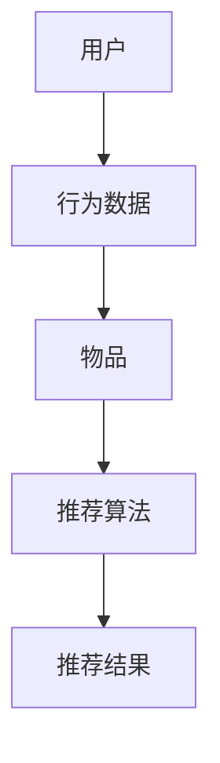

在这个流程图中，用户通过其行为数据（如点击、购买、搜索等）与物品（如商品、文章、视频等）进行交互。推荐算法基于这些交互数据，结合物品的特征（如文本内容、图像特征、价格等），生成推荐结果，并展示给用户。

#### 推荐系统的基本架构

推荐系统通常由以下几个关键组件构成：

1. **用户数据收集**：系统需要收集用户的行为数据，包括用户的浏览记录、搜索历史、购买记录等。
2. **数据预处理**：原始数据往往需要清洗和预处理，以去除噪声、填充缺失值，并进行特征提取。
3. **推荐算法**：推荐算法是推荐系统的核心，常用的算法包括基于内容的推荐、协同过滤和混合推荐等。
4. **推荐结果生成**：推荐算法处理数据后，生成推荐结果，并展示给用户。
5. **用户反馈**：用户对推荐结果进行反馈，这些反馈用于进一步优化推荐算法。

#### 推荐系统的分类

推荐系统可以根据不同的分类标准进行分类：

1. **基于内容的推荐（Content-Based Filtering）**：通过分析用户的历史行为和物品的特征，找到相似的用户和物品进行推荐。
2. **协同过滤（Collaborative Filtering）**：通过分析用户之间的行为相似性或物品之间的相似性进行推荐。
3. **混合推荐（Hybrid Methods）**：结合基于内容和协同过滤的方法，以提高推荐的准确性和多样性。

#### 交互式推荐系统

交互式推荐系统与传统的基于历史数据的推荐系统不同，它允许用户在推荐过程中提供即时反馈，并根据用户的互动行为动态调整推荐结果。这种交互性不仅提高了推荐的准确性，还增加了用户的参与感和满意度。

#### 可解释推荐系统

可解释推荐系统旨在解决传统推荐系统中的“黑箱”问题，通过提供推荐决策的透明性和可解释性，使用户能够理解推荐背后的原因，从而建立用户对系统的信任。

在下一章中，我们将详细探讨交互式推荐系统和可解释推荐系统的特点，并介绍大型语言模型（LLM）在推荐系统中的应用。

### 第1.2节：交互式推荐系统

#### 交互设计原则

交互式推荐系统的核心在于用户的互动，因此设计原则应当围绕如何增强用户体验和互动性展开。以下是一些关键的交互设计原则：

1. **用户友好性**：界面设计应简洁直观，确保用户能够轻松理解和使用系统。这包括使用清晰易懂的语言、直观的图标和布局合理的内容展示。
2. **反馈及时性**：系统应在用户互动后的短时间内提供反馈，以减少用户等待时间，提高互动体验。即时反馈不仅包括推荐结果，还应该包括用户操作的即时响应。
3. **互动性**：系统应鼓励用户与推荐结果进行互动，如点赞、评论、分享等，这些互动数据可以用于进一步优化推荐算法。
4. **个性化**：根据用户的历史行为和偏好，系统应提供个性化的推荐，使推荐结果更加贴合用户的实际需求。

#### 用户交互模型

用户交互模型描述了用户与推荐系统之间如何进行交互。以下是用户交互模型的基本流程：

1. **用户请求**：用户通过输入查询或浏览行为触发推荐请求。
2. **界面展示**：系统根据用户的请求，展示推荐结果，通常以列表、卡片或网格的形式呈现。
3. **用户操作**：用户对推荐结果进行操作，如点击、点赞、收藏等，这些操作反馈将被系统记录。
4. **反馈处理**：系统对用户的操作进行响应，调整推荐策略，并提供新的推荐结果。
5. **推荐调整**：根据用户的反馈和历史行为，系统不断调整推荐策略，以提高推荐的准确性和用户满意度。

#### 交互流程设计

一个有效的交互流程设计应确保用户能够顺畅地与系统互动，以下是交互流程设计的步骤：

1. **需求收集**：系统收集用户的需求，包括查询、搜索历史、浏览记录等。
2. **推荐生成**：系统根据收集到的需求，利用推荐算法生成推荐结果。
3. **界面展示**：系统将推荐结果以可视化的方式展示给用户，包括推荐项的标题、描述、图片等。
4. **用户互动**：用户对推荐结果进行互动，如点击、点赞、评论等。
5. **反馈收集**：系统记录用户的互动行为，并用于更新用户画像和推荐策略。
6. **推荐调整**：系统根据用户的反馈，调整推荐算法和策略，生成新的推荐结果。

#### 用户反馈机制

用户反馈是交互式推荐系统的重要组成部分，它用于评估推荐效果和优化系统性能。以下是用户反馈机制的关键点：

1. **即时反馈**：系统应在用户操作后的第一时间收集反馈，以减少延迟。
2. **多样性**：系统应收集多种类型的反馈，如点击率、停留时间、点赞数、评论等，以全面评估推荐效果。
3. **个性化反馈**：系统应根据用户的不同偏好和需求，提供个性化的反馈选项，以提高反馈的准确性和实用性。
4. **反馈循环**：系统应将用户反馈循环回推荐算法中，不断优化推荐策略。

#### 交互设计案例

以下是一个交互设计的案例，描述了用户如何在电商平台上与推荐系统进行交互：

1. **需求收集**：用户在电商平台上浏览了不同类型的商品。
2. **推荐生成**：系统根据用户的浏览记录和平台上的商品特征，生成推荐结果。
3. **界面展示**：系统将推荐商品以卡片形式展示在用户面前，每个卡片包含商品的标题、价格、评分和图片。
4. **用户互动**：用户点击了其中一个商品卡片，进入商品详情页。
5. **反馈收集**：系统记录用户的行为，如点击次数、停留时间等，作为反馈数据。
6. **推荐调整**：系统根据用户的反馈，调整推荐算法，为下一次访问生成更符合用户偏好的推荐。

通过上述交互设计，电商平台不仅提高了用户的购物体验，还通过用户反馈不断优化推荐算法，提高推荐效果。

在下一章中，我们将深入探讨可解释推荐系统的概念和技术，以及它们如何提高用户对推荐系统的信任。

### 第1.3节：可解释推荐系统

#### 可解释性的重要性

可解释性在推荐系统中具有重要意义，它有助于用户理解推荐结果的生成过程，从而建立对系统的信任。以下是可解释性在推荐系统中的几个关键作用：

1. **提高用户信任**：当用户能够理解推荐背后的逻辑和原因时，他们更可能接受和信任推荐结果。这种信任有助于提升用户的满意度和忠诚度。
2. **减少用户困惑**：推荐系统往往涉及复杂的算法和模型，用户可能对推荐结果感到困惑。可解释性技术可以提供透明性，帮助用户理解为何某个物品或内容被推荐。
3. **合规要求**：在很多国家和地区，法律法规要求推荐系统提供足够的透明性和解释性，以保护用户的隐私和数据安全。
4. **故障排查**：在推荐系统出现问题时，可解释性技术有助于开发人员定位问题根源，从而更快地进行修复。

#### 可解释性的评估方法

评估推荐系统的可解释性通常需要综合考虑多个指标，以下是一些常用的评估方法：

1. **用户满意度**：通过用户调查或实验，评估用户对推荐系统可解释性的满意度。这可以通过问卷调查、用户访谈或A/B测试等方法实现。
2. **解释清晰度**：评估推荐解释是否清晰易懂，用户是否能够理解解释内容。这可以通过阅读理解测试或用户反馈问卷来实现。
3. **模型透明度**：评估推荐模型的结构和参数是否公开透明，用户是否能够获取模型的详细信息和操作逻辑。
4. **一致性**：评估推荐解释在不同情况下是否一致，即当用户输入相同或类似的数据时，系统是否提供一致的推荐解释。

#### 可解释性技术实现

实现推荐系统的可解释性通常涉及以下几种技术：

1. **规则解释**：基于规则的方法通过显式地定义规则和条件，帮助用户理解推荐结果。例如，如果一个推荐系统基于用户的历史购买记录推荐商品，规则解释可以明确指出哪些商品符合用户的购买偏好。
2. **可视化**：使用图表、图形和交互式界面等可视化手段，将推荐结果和推荐过程直观地展示给用户。例如，利用决策树、散点图或交互式仪表板，展示推荐决策的依据和过程。
3. **解释模块**：集成解释模块，如SHAP（SHapley Additive exPlanations）或LIME（Local Interpretable Model-agnostic Explanations），为用户提供针对特定推荐结果的详细解释。这些模块通常通过计算特征对推荐结果的贡献度，帮助用户理解哪些特征影响了推荐结果。

以下是一个简单的实现示例，描述了如何使用规则解释技术为推荐系统提供可解释性：

```python
def explain_recommendation(user_behavior, recommended_item):
    """
    解释推荐结果的方法
    """
    rules = {
        "if user likes item A and item B, then recommend item C": ["item A", "item B", "item C"],
        "if user searched for item X and viewed item Y, then recommend item Z": ["item X", "item Y", "item Z"],
    }
    
    for rule, items in rules.items():
        if all(item in user_behavior for item in items):
            explanation = f"The item was recommended because you {rule}."
            return explanation
    
    return "The recommendation is based on your historical preferences and interactions with similar items."

# 假设用户的行为数据
user_behavior = ["item A", "item B", "searched for item X", "viewed item Y"]

# 推荐的商品
recommended_item = "item Z"

# 获取推荐解释
explanation = explain_recommendation(user_behavior, recommended_item)
print(explanation)
```

在这个示例中，`explain_recommendation` 函数根据用户的行为数据和推荐商品，应用预先定义的规则，生成解释文本。这种方法虽然简单，但为用户提供了清晰的推荐依据，增强了系统的可解释性。

通过上述方法，推荐系统不仅可以提高用户对推荐的信任度，还可以为开发人员提供更好的故障排查和优化途径。在下一章中，我们将深入探讨LLM在推荐系统中的应用，并介绍一种基于LLM的交互式可解释推荐系统架构。

### 第2章：LLM与推荐系统

#### 2.1 语言模型基础

语言模型（Language Model，简称LM）是自然语言处理（Natural Language Processing，简称NLP）中的一个核心概念。它是一个概率模型，用于预测给定输入文本序列后下一个单词或字符的概率。最著名的语言模型之一是由IBM在1950年代提出的N-gram模型，随后在1980年代，由拉法尔·皮尔莱和乔治·西尔弗斯坦提出了基于神经网络的语言模型。

语言模型的基本原理是通过学习大量文本数据，建立一个概率分布模型，能够预测文本中的下一个词或字符。以下是一个简单的N-gram模型的伪代码示例：

```python
def n_gram_model(text, n):
    """
    构建N-gram模型
    """
    # 初始化模型
    model = {}
    for i in range(len(text) - n):
        # 提取N元组
        n_gram = tuple(text[i:i+n])
        # 计算N元组的频率
        model[n_gram] = model.get(n_gram, 0) + 1
    
    # 归一化概率
    for n_gram, count in model.items():
        model[n_gram] = count / (len(text) - n + 1)
    
    return model

# 示例文本
text = "I love programming because it's creative and challenging"
# 构建三元组模型
n_gram_model = n_gram_model(text, 3)

# 预测下一个词
input_sequence = "I love programming"
predicted_word = predict_next_word(n_gram_model, input_sequence)
print(predicted_word)
```

在这个示例中，我们首先定义了一个N-gram模型，然后使用该模型预测输入序列“我爱编程”之后的下一个词。

#### LLM在推荐系统中的应用

大型语言模型（Large Language Model，简称LLM）具有强大的语言理解和生成能力，这使得它们在推荐系统中有着广泛的应用。以下是一些关键的LLM应用场景：

1. **基于内容的推荐**：LLM可以分析物品的文本描述，提取关键信息，并根据用户的历史偏好生成个性化推荐。例如，电商平台上，LLM可以根据用户的购买记录和浏览历史，分析用户对商品的偏好，从而推荐符合用户兴趣的新商品。
   
2. **协同过滤**：在协同过滤中，LLM可以用来生成用户和物品的特征，提高推荐的质量。通过分析用户对文本描述的反馈，LLM可以提取出用户的偏好和兴趣点，并将其转化为可量化的特征，用于协同过滤算法。

3. **问答式推荐**：LLM可以用于构建问答式推荐系统，用户可以直接提问，系统通过理解问题内容，提供相应的推荐结果。这种交互方式不仅提高了用户的参与度，还使得推荐过程更加直观和友好。

4. **文本生成**：LLM可以用于生成推荐理由或推荐描述，使得推荐结果更加生动和具有说服力。例如，电商平台可以自动生成推荐邮件，向用户解释推荐商品的理由，增加购买的可能性。

以下是一个基于LLM的推荐系统的简化实现示例，展示了如何使用预训练的LLM模型进行文本生成和推荐：

```python
from transformers import pipeline

# 加载预训练的LLM模型
llm = pipeline("text-generation", model="gpt2")

# 用户输入
user_input = "我最近喜欢看科幻电影，推荐一部类似的电影"

# 生成推荐描述
def generate_recommendation_description(input_text):
    """
    使用LLM生成推荐描述
    """
    description = llm(input_text, max_length=50, num_return_sequences=1)
    return description[0]["generated_text"]

# 生成推荐描述
recommendation_description = generate_recommendation_description(user_input)
print(recommendation_description)

# 基于描述推荐电影
def recommend_movie(description):
    """
    根据描述推荐电影
    """
    # 这里应该是一个调用电影数据库的API
    # 根据描述查找相似的电影
    similar_movies = search_similar_movies(description)
    return similar_movies

# 推荐电影
recommended_movie = recommend_movie(recommendation_description)
print(recommended_movie)
```

在这个示例中，我们首先加载了一个预训练的GPT-2模型，然后使用该模型生成基于用户输入的推荐描述。接着，根据生成的描述，调用电影数据库API推荐相似的电影。

#### LLM增强推荐系统架构

LLM增强的推荐系统架构通常包括以下几个关键组件：

1. **用户行为数据收集**：系统收集用户的历史行为数据，包括浏览记录、购买历史、搜索历史等。
2. **文本数据预处理**：对用户行为数据和相关物品的文本描述进行预处理，提取关键信息。
3. **LLM模型处理**：使用LLM模型对预处理后的文本数据进行处理，提取用户偏好和物品特征。
4. **推荐算法**：结合LLM提取的特征，使用传统推荐算法（如协同过滤、基于内容的推荐等）生成推荐结果。
5. **推荐结果生成**：根据用户偏好和物品特征，生成最终的推荐结果，并展示给用户。

以下是一个基于LLM增强的推荐系统的简化架构图：

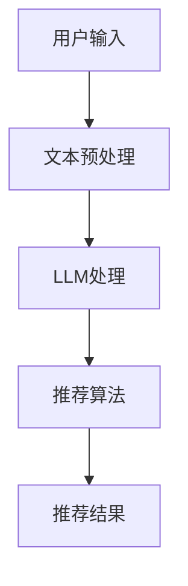

在这个架构图中，用户输入经过文本预处理后，送入LLM模型进行处理，提取用户偏好和物品特征。然后，这些特征被输入到推荐算法中，生成推荐结果，并最终展示给用户。

通过LLM的增强，推荐系统不仅能够更准确地捕捉用户的兴趣和需求，还能够提高推荐结果的个性化和解释性。在下一章中，我们将探讨交互式可解释性在LLM增强推荐系统中的应用，介绍具体的交互设计和实现技术。

### 第2.3节：LLM增强推荐系统架构

#### LLM增强推荐系统的基本原理

LLM增强推荐系统通过利用大型语言模型（LLM）的强大语言理解和生成能力，对传统推荐系统进行补充和优化。这种增强不仅提高了推荐的准确性，还增强了系统的可解释性和用户体验。以下是LLM增强推荐系统的基本原理：

1. **用户行为分析**：系统首先收集用户的历史行为数据，包括浏览记录、购买历史、搜索历史等。这些数据用于了解用户的兴趣和偏好。
2. **文本预处理**：将用户行为数据和相关物品的文本描述进行预处理，提取关键信息，如关键词、短语等。这一步骤的目的是将非结构化数据转化为结构化数据，便于后续处理。
3. **LLM特征提取**：使用LLM模型对预处理后的文本数据进行处理，提取用户偏好和物品特征。LLM能够理解文本的深层含义，从而生成更精确的特征表示。
4. **特征融合**：将LLM提取的特征与传统推荐系统的特征（如用户-物品评分矩阵、物品特征向量等）进行融合，形成综合特征向量。
5. **推荐算法**：利用综合特征向量，结合传统推荐算法（如协同过滤、基于内容的推荐等），生成推荐结果。
6. **推荐结果生成**：根据用户偏好和物品特征，生成最终的推荐结果，并展示给用户。

#### LLM增强推荐系统的架构设计

LLM增强推荐系统的架构设计需要考虑多个方面，包括数据收集、模型处理、推荐算法和用户交互等。以下是一个典型的LLM增强推荐系统架构设计：

1. **数据层**：
   - **用户行为数据**：收集用户的历史行为数据，包括浏览记录、购买历史、搜索历史等。
   - **物品特征数据**：收集物品的相关特征数据，如文本描述、图像特征、价格等。

2. **数据处理层**：
   - **文本预处理**：对用户行为数据和物品特征数据中的文本描述进行预处理，提取关键词、短语等。
   - **特征提取**：使用LLM模型对预处理后的文本数据进行处理，提取用户偏好和物品特征。

3. **模型层**：
   - **LLM模型**：预训练的LLM模型，如GPT-2、BERT等，用于特征提取和文本生成。
   - **传统推荐模型**：协同过滤、基于内容的推荐等传统推荐模型，用于生成推荐结果。

4. **推荐层**：
   - **特征融合**：将LLM提取的特征与传统推荐模型的特征进行融合，形成综合特征向量。
   - **推荐算法**：利用综合特征向量，结合传统推荐算法，生成推荐结果。

5. **用户交互层**：
   - **用户界面**：提供直观的用户界面，展示推荐结果，允许用户进行反馈。
   - **反馈处理**：收集用户的反馈，用于调整推荐算法和优化系统性能。

以下是一个简化的LLM增强推荐系统架构图：

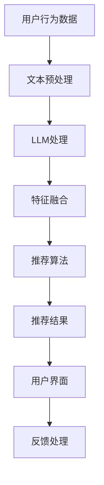

在这个架构图中，用户行为数据经过文本预处理后，由LLM模型提取特征，并与传统推荐模型的特征进行融合。然后，结合推荐算法生成推荐结果，展示给用户。用户反馈则用于优化推荐算法和系统性能。

#### LLM增强推荐系统的优势

LLM增强推荐系统具有以下优势：

1. **提高推荐准确性**：LLM能够深入理解用户的文本描述和偏好，提取更精确的特征，从而提高推荐的准确性。
2. **增强系统可解释性**：通过LLM生成的文本解释，用户可以更清楚地理解推荐结果的原因，增强系统的可解释性。
3. **提高用户体验**：个性化、准确且易于理解的推荐结果，可以提升用户的满意度和参与度，从而提高平台的用户留存率。
4. **扩展性**：LLM模型可以应用于多种类型的推荐系统，如电商、社交媒体、在线教育等，具有很好的扩展性。

在下一章中，我们将探讨交互设计在LLM增强推荐系统中的重要性，并介绍用户交互模型和交互流程设计。

### 第3章：交互设计

#### 用户交互模型

用户交互模型是交互式推荐系统的核心，它描述了用户与推荐系统之间的交互过程。一个良好的用户交互模型应该能够捕捉用户的偏好、行为和反馈，并在此基础上生成个性化的推荐结果。以下是用户交互模型的基本组成部分：

1. **用户需求收集**：系统需要通过多种方式收集用户的需求，包括用户输入的查询、浏览记录、点击行为等。这些数据可以帮助系统理解用户的当前需求和兴趣点。

2. **用户偏好分析**：系统需要分析用户的交互数据，提取用户的偏好信息。这些偏好信息可以是显式的，如用户明确的喜好标签，也可以是隐式的，如用户的浏览和点击行为。

3. **推荐结果展示**：系统根据用户的偏好和需求，生成推荐结果，并以可视化的方式展示给用户。推荐结果的形式可以包括列表、卡片、图像等，以便用户直观地了解推荐内容。

4. **用户反馈收集**：用户对推荐结果进行反馈，包括点击、收藏、评论等。这些反馈数据可以用于优化推荐算法和系统性能。

5. **交互反馈循环**：系统根据用户的反馈，调整推荐策略和算法，生成新的推荐结果，并展示给用户。这一过程形成了一个反馈循环，不断优化用户体验。

#### 交互流程设计

交互流程设计是确保用户能够顺畅地与推荐系统进行互动的关键。以下是交互流程设计的基本步骤：

1. **需求识别**：用户通过输入查询或浏览行为触发推荐请求。系统需要识别用户的需求，并将其转化为可处理的格式。

2. **推荐生成**：系统根据用户的需求和历史行为，利用推荐算法生成推荐结果。推荐结果需要充分考虑用户的个性化偏好和系统的目标。

3. **结果展示**：系统将推荐结果以直观、清晰的方式展示给用户。展示方式可以包括列表、卡片、图像等，同时提供交互式按钮，如“喜欢”、“不喜欢”等，以便用户进行反馈。

4. **用户互动**：用户与推荐结果进行互动，如点击、收藏、评论等。这些互动行为将被系统记录，并用于后续的推荐优化。

5. **反馈处理**：系统根据用户的反馈，调整推荐策略和算法，生成新的推荐结果。这一步骤确保系统能够实时响应用户的需求变化。

6. **推荐调整**：系统根据用户的反馈和历史行为，不断调整推荐策略，以提高推荐的准确性和用户满意度。

以下是一个简化的交互流程图，展示了用户与推荐系统之间的交互过程：

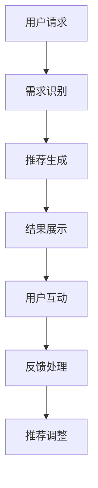

在这个流程图中，用户请求触发推荐系统的交互过程，系统根据用户需求生成推荐结果，用户对推荐结果进行互动，系统收集反馈并调整推荐策略，形成了一个闭环的交互流程。

#### 用户反馈机制

用户反馈机制是交互式推荐系统中至关重要的一环，它不仅帮助系统理解用户的需求，还能不断优化推荐效果。以下是用户反馈机制的关键点：

1. **即时反馈**：系统应在用户互动后的第一时间收集反馈，以减少延迟，提高互动体验。即时反馈可以包括点击率、停留时间、点赞数等。

2. **多样化反馈**：系统应提供多样化的反馈方式，如“喜欢”、“不喜欢”、“相似推荐”等，以便用户能够更准确地表达自己的偏好。

3. **个性化反馈**：系统应根据用户的不同偏好和需求，提供个性化的反馈选项，以提高反馈的准确性和实用性。

4. **反馈循环**：系统应将用户反馈循环回推荐算法中，不断优化推荐策略。这一过程可以通过机器学习算法实现，如基于用户反馈调整推荐权重、重新训练模型等。

以下是一个用户反馈机制的示例：

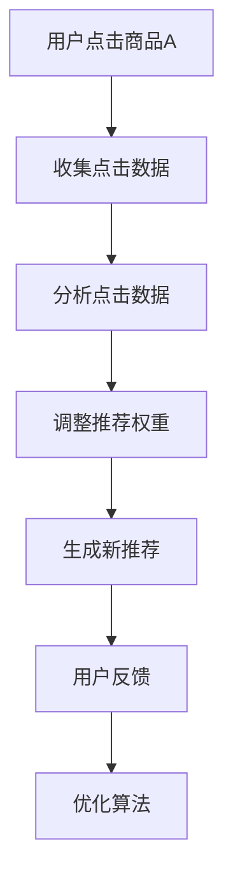

在这个示例中，用户点击商品A后，系统收集点击数据，分析用户行为，调整推荐权重，生成新的推荐结果，并根据用户反馈进一步优化算法。

通过上述用户交互模型、交互流程设计和用户反馈机制，交互式推荐系统可以更好地理解用户需求，提供个性化的推荐，并不断优化用户体验。在下一章中，我们将探讨可解释性技术，并介绍如何实现推荐系统的可解释性。

### 第4章：可解释性技术

#### 可解释性的重要性

在推荐系统中，可解释性是指用户能够理解推荐结果生成过程的能力。这种透明性对于建立用户信任、提高系统接受度和优化系统性能具有重要意义。以下是可解释性在推荐系统中的几个关键作用：

1. **增强用户信任**：当用户能够理解推荐结果的背后逻辑时，他们更可能信任和接受推荐系统。这种信任有助于提高用户的满意度和忠诚度。

2. **提升用户体验**：可解释性技术使推荐结果更加直观易懂，用户可以更好地了解推荐的原因和依据，从而提升整体用户体验。

3. **满足合规要求**：在许多国家和地区，法律法规要求推荐系统提供足够的透明性和解释性，以确保用户隐私和数据安全。

4. **故障排查与优化**：可解释性技术有助于开发人员理解推荐系统的工作原理，快速定位问题根源并进行优化。

#### 可解释性的评估方法

评估推荐系统的可解释性需要综合考虑多个方面，以下是一些常用的评估方法：

1. **用户满意度**：通过用户调查或实验，评估用户对推荐系统可解释性的满意度。这可以通过问卷调查、用户访谈或A/B测试等方法实现。

2. **解释清晰度**：评估推荐解释是否清晰易懂，用户是否能够理解解释内容。这可以通过阅读理解测试或用户反馈问卷来实现。

3. **模型透明度**：评估推荐模型的结构和参数是否公开透明，用户是否能够获取模型的详细信息和操作逻辑。

4. **一致性**：评估推荐解释在不同情况下是否一致，即当用户输入相同或类似的数据时，系统是否提供一致的推荐解释。

以下是一个简单的用户满意度调查问卷示例：

```
1. 您是否理解推荐系统为什么推荐了这些内容？
   - 完全理解
   - 部分理解
   - 不理解

2. 您觉得推荐解释是否清晰易懂？
   - 非常清晰
   - 清晰
   - 一般
   - 不清晰

3. 您对推荐系统的信任度如何？
   - 非常高
   - 高
   - 中等
   - 低
   - 非常低

4. 您是否愿意继续使用这个推荐系统？
   - 愿意
   - 不确定
   - 不愿意
```

#### 可解释性技术实现

实现推荐系统的可解释性通常涉及以下几种技术：

1. **规则解释**：基于规则的方法通过显式地定义规则和条件，帮助用户理解推荐结果。例如，一个基于协同过滤的推荐系统可以解释推荐结果为“您可能喜欢这个商品，因为它与您之前购买的商品相似”。

2. **可视化**：使用图表、图形和交互式界面等可视化手段，将推荐结果和推荐过程直观地展示给用户。例如，利用决策树、散点图或交互式仪表板，展示推荐决策的依据和过程。

3. **解释模块**：集成解释模块，如SHAP（SHapley Additive exPlanations）或LIME（Local Interpretable Model-agnostic Explanations），为用户提供针对特定推荐结果的详细解释。这些模块通常通过计算特征对推荐结果的贡献度，帮助用户理解哪些特征影响了推荐结果。

以下是一个简单的SHAP解释示例：

```python
import shap

# 加载预训练的推荐模型
model = load_model('recommender_model')

# 准备解释数据
X = prepare_data_for_explanation(user_data, item_data)

# 创建SHAP解释器
explainer = shap.Explainer(model.predict, X)

# 计算SHAP值
shap_values = explainer(X)

# 可视化SHAP值
shap.summary_plot(shap_values, X)
```

在这个示例中，我们首先加载一个预训练的推荐模型，然后使用SHAP解释器计算特征对推荐结果的贡献度，并使用可视化库（如matplotlib）生成SHAP值图，帮助用户理解推荐结果的生成过程。

通过规则解释、可视化技术和解释模块，推荐系统可以提供丰富的可解释性，帮助用户更好地理解推荐结果，从而增强系统的可信度和用户满意度。在下一章中，我们将通过一个实际案例，展示LLM增强推荐系统的具体实现和应用。

### 第5章：LLM增强推荐系统案例分析

#### 5.1 案例背景

在本案例中，我们选择一个典型的电商平台作为应用场景。该电商平台拥有海量的用户和商品数据，通过传统的推荐系统已经取得了一定的成功。然而，为了进一步提高用户体验和推荐准确性，该平台决定引入LLM增强推荐系统，以提升系统的个性化和可解释性。

#### 5.2 系统设计

LLM增强推荐系统的设计需要考虑多个方面，包括数据收集、模型训练、推荐算法和用户交互等。以下是系统设计的详细步骤：

1. **数据收集**：平台收集用户的历史行为数据，包括浏览记录、购买历史、搜索历史等，以及商品的相关特征数据，如文本描述、图像特征、价格等。

2. **文本预处理**：对用户行为数据和商品特征数据进行预处理，提取关键词、短语等，为后续的LLM处理做好准备。

3. **LLM模型训练**：使用预训练的LLM模型（如GPT-2、BERT等），对预处理后的文本数据进行训练，提取用户偏好和物品特征。训练过程包括数据清洗、预处理、模型训练和评估等步骤。

4. **特征融合**：将LLM提取的特征与传统推荐系统的特征（如用户-物品评分矩阵、物品特征向量等）进行融合，形成综合特征向量。

5. **推荐算法**：结合融合后的特征，利用传统的推荐算法（如协同过滤、基于内容的推荐等）生成推荐结果。推荐算法需要考虑用户的个性化偏好和平台的目标。

6. **推荐结果生成**：根据用户偏好和物品特征，生成最终的推荐结果，并展示给用户。推荐结果需要考虑用户的个性化需求和平台的商业目标。

7. **用户交互**：设计用户友好的交互界面，允许用户对推荐结果进行反馈，如点击、收藏、评论等。用户反馈将用于优化推荐算法和系统性能。

#### 5.3 实施与优化

在系统实施过程中，需要考虑以下几个方面：

1. **数据预处理**：对用户行为数据和商品特征数据进行清洗和预处理，包括去除噪声、填充缺失值、特征提取等。

2. **模型训练**：使用训练集对LLM模型进行训练，并使用验证集进行模型评估和调优。模型训练需要考虑数据集的分布、模型的超参数调优等。

3. **特征融合**：将LLM提取的特征与传统特征进行融合，形成综合特征向量。特征融合的方法和策略需要根据实际情况进行调整。

4. **推荐算法**：结合融合后的特征，利用传统的推荐算法生成推荐结果。推荐算法需要考虑用户的个性化偏好和平台的商业目标，以及推荐结果的准确性和多样性。

5. **用户反馈处理**：收集用户的反馈，如点击、收藏、评论等，并用于优化推荐算法和系统性能。用户反馈的处理需要考虑实时性、多样性和准确性。

6. **性能优化**：对系统进行性能优化，包括模型压缩、模型调优、部署优化等。性能优化需要考虑系统的可扩展性、响应时间和资源消耗。

7. **安全性与隐私保护**：确保系统的安全性和用户隐私，包括数据加密、访问控制、安全审计等。

以下是一个简化的系统实施流程图：

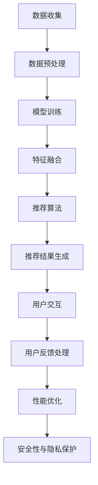

通过上述实施和优化步骤，LLM增强推荐系统可以在电商平台上实现个性化、准确且可解释的推荐，提高用户体验和平台的业务收益。

### 第6章：开发环境搭建

#### 6.1 数据预处理

在构建LLM增强推荐系统时，数据预处理是至关重要的一步。良好的数据预处理不仅可以提高模型的性能，还能减少噪声和异常值对系统的影响。以下是一个详细的数据预处理流程：

1. **数据收集**：首先，从电商平台的数据库中收集用户行为数据和商品特征数据。用户行为数据可能包括用户的浏览历史、购买记录、搜索历史等。商品特征数据可能包括商品的标题、描述、价格、类别、标签等。

2. **数据清洗**：清洗数据是预处理的第一步，目的是去除无效数据、重复数据和异常值。例如，删除包含缺失值的记录、去除重复项、处理异常值等。

3. **数据标准化**：对数据进行标准化处理，以消除不同特征之间的尺度差异。常用的方法包括最小-最大标准化、均值-方差标准化等。

4. **特征提取**：从文本数据中提取特征。对于商品描述和用户评论，可以使用词频-逆文档频率（TF-IDF）或Word2Vec等模型进行特征提取。对于图像数据，可以使用卷积神经网络（CNN）提取特征。

5. **数据分割**：将数据集分割为训练集、验证集和测试集。训练集用于模型训练，验证集用于模型调优，测试集用于模型评估。

6. **数据存储**：将处理后的数据存储在数据库或数据湖中，以便后续的模型训练和评估。

以下是一个简化的数据预处理流程图：

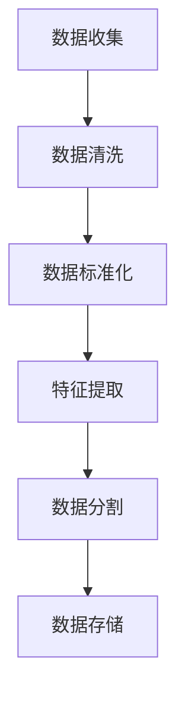

#### 6.2 模型训练与评估

在数据预处理完成后，接下来是模型的训练与评估。以下是一个详细的模型训练与评估流程：

1. **模型选择**：选择适合的模型架构。对于LLM增强推荐系统，可以选择预训练的语言模型（如GPT-2、BERT等）进行特征提取，并结合传统的推荐算法（如矩阵分解、协同过滤等）。

2. **模型初始化**：初始化模型参数，可以使用随机初始化或预训练模型的重初始化。

3. **训练过程**：使用训练集对模型进行训练。训练过程包括前向传播、反向传播和参数更新。训练过程中需要调整学习率、批次大小等超参数，以避免过拟合和欠拟合。

4. **模型调优**：使用验证集对模型进行调优。通过交叉验证等方法，选择最优的模型结构和超参数。

5. **模型评估**：使用测试集对训练好的模型进行评估。常用的评估指标包括准确率、召回率、F1分数等。

6. **模型保存**：将训练好的模型保存为文件，以便后续的部署和使用。

以下是一个简化的模型训练与评估流程图：

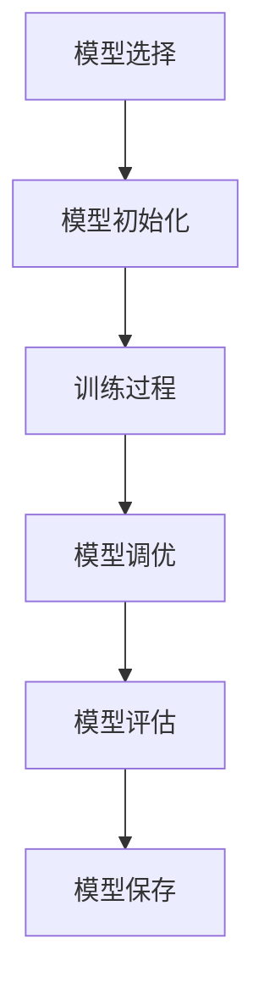

#### 6.3 模型部署

模型部署是将训练好的模型应用到实际生产环境的过程。以下是一个详细的模型部署流程：

1. **模型容器化**：将训练好的模型容器化，以便在各个环境之间轻松部署和迁移。常用的容器化工具包括Docker和Kubernetes。

2. **部署环境**：选择合适的部署环境，如云服务器、边缘计算设备等。部署环境需要具备足够的计算资源和网络带宽，以支持模型的实时推理和部署。

3. **服务化**：将容器化的模型部署为微服务，以支持高并发和负载均衡。可以使用API网关和负载均衡器来管理服务的请求和响应。

4. **监控与日志**：部署监控系统，实时监控模型的运行状态和性能指标，如响应时间、错误率等。同时，记录详细的日志，以便故障排查和性能优化。

5. **更新策略**：制定模型更新策略，包括定期更新、增量更新等。确保模型能够随着数据和环境的变化持续优化。

以下是一个简化的模型部署流程图：

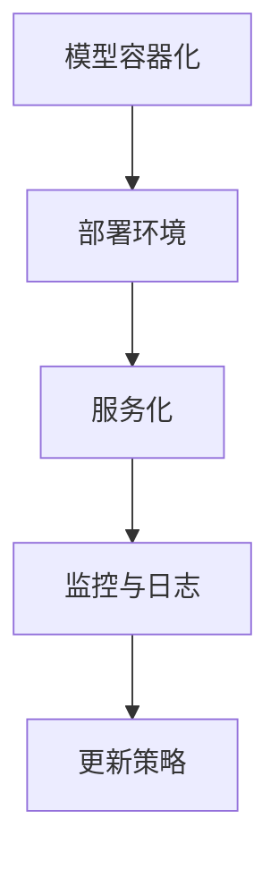

通过上述步骤，可以搭建一个完整的LLM增强推荐系统开发环境，实现数据的预处理、模型的训练与评估，以及模型的部署与优化。在下一章中，我们将讨论系统性能优化策略，以提高系统的响应速度和效率。

### 第7章：性能优化

#### 7.1 模型压缩

模型压缩是提高LLM增强推荐系统性能的关键技术之一，它通过减少模型的参数数量和计算复杂度，实现模型的快速部署和高效推理。以下是一些常见的模型压缩技术：

1. **剪枝（Pruning）**：剪枝技术通过删除模型中的冗余或低贡献度的参数，来减少模型的尺寸。剪枝可以分为结构剪枝和权重剪枝，前者删除整个网络结构中的神经元或连接，后者删除权重较小的参数。

2. **量化（Quantization）**：量化技术将模型的权重和激活值从浮点数转换为低比特宽度的整数表示。量化可以显著减少模型的存储需求和计算复杂度，但可能会影响模型的精度。

3. **蒸馏（Distillation）**：蒸馏技术通过将大型复杂模型的知识迁移到小型简化模型中，来实现模型压缩。简化模型通常具有较少的参数和较低的复杂度，但能够保留原模型的性能。

以下是一个简化的模型压缩流程图：

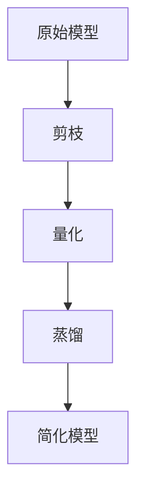

#### 7.2 模型调优

模型调优是优化LLM增强推荐系统性能的重要步骤，它通过调整模型的超参数和架构，以提高模型的准确性和效率。以下是一些常见的模型调优策略：

1. **超参数调整**：超参数是影响模型性能的重要参数，如学习率、批量大小、隐藏层大小等。通过实验和交叉验证，可以找到最优的超参数组合。

2. **模型融合**：模型融合技术通过结合多个模型的预测结果，来提高整体的预测性能。常见的融合方法包括投票、加权平均和集成学习等。

3. **迁移学习**：迁移学习技术利用预训练模型的知识，来提高新任务的表现。通过在特定任务上微调预训练模型，可以显著提升模型的性能。

以下是一个简化的模型调优流程图：

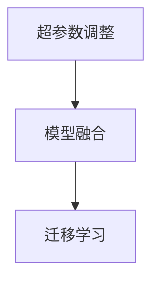

#### 7.3 部署优化

部署优化是确保LLM增强推荐系统在真实环境中高效运行的关键步骤。以下是一些常见的部署优化策略：

1. **缓存策略**：使用缓存策略可以显著减少对后端服务的请求次数，从而降低系统的响应时间和延迟。缓存可以存储用户历史行为、推荐结果等，以加速后续的查询和推荐。

2. **负载均衡**：负载均衡技术通过将请求分配到多个服务器上，来确保系统的稳定性和响应速度。常见的负载均衡算法包括轮询、最少连接数、源地址哈希等。

3. **边缘计算**：边缘计算技术通过在靠近用户的位置部署计算资源，来减少数据传输时间和响应延迟。这可以提高用户的交互体验和推荐系统的实时性。

以下是一个简化的部署优化流程图：

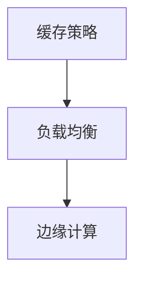

通过上述性能优化策略，LLM增强推荐系统可以在保证模型性能的同时，实现高效的推理和部署，从而提供更优质的用户体验。在下一章中，我们将讨论推荐系统的安全性和隐私保护措施，以确保系统的可靠性和用户信任。

### 第8章：安全性与隐私保护

#### 8.1 推荐系统安全威胁

在推荐系统中，安全性是一个不可忽视的重要方面。推荐系统可能会面临多种安全威胁，包括数据泄露、模型篡改和隐私侵犯等。

1. **数据泄露**：推荐系统收集和存储了大量用户行为数据和商品信息，这些数据可能会被恶意攻击者窃取，用于非法用途或进行社会工程攻击。

2. **模型篡改**：攻击者可能会试图篡改推荐模型，使其产生不合理的推荐结果，或者通过注入恶意数据，损害系统的性能和信誉。

3. **隐私侵犯**：推荐系统在生成个性化推荐时，会分析用户的敏感信息，如浏览历史、购买记录等。如果这些信息被不当使用或泄露，可能会侵犯用户的隐私权。

4. **拒绝服务攻击**：攻击者可能会通过发送大量请求，耗尽系统的计算资源和网络带宽，导致推荐系统无法正常工作。

#### 8.2 隐私保护机制

为了确保推荐系统的安全性和用户隐私，可以采取以下几种隐私保护机制：

1. **数据加密**：对用户行为数据和商品信息进行加密处理，确保数据在存储和传输过程中不会被窃取或篡改。常用的加密算法包括AES、RSA等。

2. **差分隐私**：差分隐私是一种有效的隐私保护技术，它通过在数据集中添加随机噪声，使得攻击者无法通过分析数据集推断出单个用户的信息。常见的方法包括拉普拉斯机制和指数机制。

3. **匿名化**：对用户行为数据和商品信息进行匿名化处理，删除或替换敏感信息，以防止用户身份泄露。

4. **访问控制**：通过设置严格的访问控制策略，确保只有授权人员才能访问敏感数据和模型参数。访问控制可以基于角色、权限和认证机制来实现。

#### 8.3 安全与隐私保护实践

在实际应用中，推荐系统可以采取以下措施来确保安全和隐私：

1. **安全设计**：在系统设计阶段，就考虑安全和隐私保护的需求，将安全机制集成到系统的各个层面。

2. **合规性检查**：定期对系统进行安全检查和合规性评估，确保系统符合相关法律法规和行业标准。

3. **安全审计**：定期进行安全审计，发现和修复潜在的安全漏洞和风险点。

4. **用户隐私保护**：在生成个性化推荐时，尽量避免使用敏感信息，并确保用户对隐私政策有充分的知情权。

5. **实时监控**：部署实时监控系统，及时发现和处理异常行为和攻击。

通过上述安全与隐私保护措施，推荐系统可以有效地防范安全威胁，保护用户隐私，并建立用户对系统的信任。

### 第9章：持续学习与迭代

#### 9.1 持续学习机制

持续学习是LLM增强推荐系统优化和适应不断变化环境的关键。以下是一些关键的持续学习机制：

1. **增量学习**：增量学习允许模型在新的数据到来时进行更新，而无需重新训练整个模型。这通过最小化重新训练的时间和资源消耗，提高了系统的实时性和效率。

2. **在线学习**：在线学习使得模型能够实时从用户的反馈中学习，动态调整推荐策略。这种方法提高了推荐的个性化和实时性。

3. **模型更新策略**：定期更新模型是保持系统性能的关键。模型更新的频率和策略需要根据数据流量、用户反馈和业务目标进行调整。

以下是一个简化的持续学习流程图：

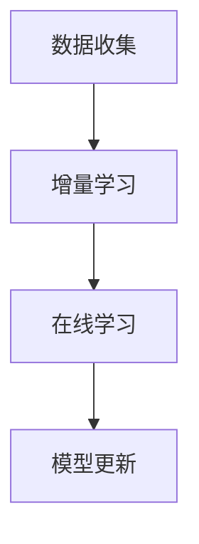

#### 9.2 模型更新策略

有效的模型更新策略能够确保推荐系统在数据变化和用户需求变化时保持高效和准确。以下是一些常用的模型更新策略：

1. **定期更新**：定期对模型进行重新训练，以保持其性能。这种策略适用于数据量较大且变化较慢的场景。

2. **增量更新**：只对新增或修改的数据进行训练，以减少计算资源的需求。这种策略适用于数据更新频繁的场景。

3. **动态调整**：根据用户的实时反馈和系统性能指标，动态调整模型的参数和结构。这种策略能够快速适应用户需求的变化。

以下是一个简化的模型更新策略流程图：

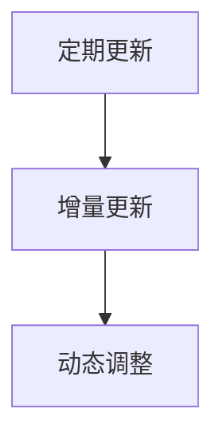

#### 9.3 用户反馈利用

用户反馈是优化推荐系统的重要资源。以下是一些利用用户反馈的方法：

1. **个性化推荐**：根据用户的反馈，调整推荐策略，使推荐结果更加符合用户的兴趣和偏好。

2. **实时调整**：在用户互动时，实时收集反馈，并迅速调整推荐策略，以提供更准确的推荐。

3. **数据挖掘**：对用户反馈进行分析和挖掘，发现用户行为模式和偏好变化，为系统优化提供依据。

以下是一个简化的用户反馈利用流程图：

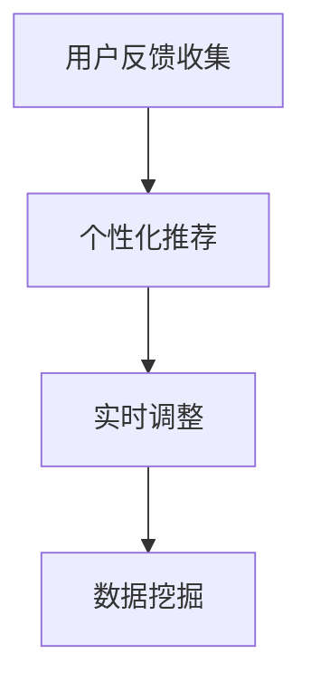

通过持续学习和用户反馈利用，LLM增强推荐系统可以不断提高其性能和用户体验，实现持续优化和迭代。

### 附录A：开发工具与环境

在本章中，我们将介绍构建LLM增强推荐系统所需的主要开发工具和环境。这些工具和环境的选择基于其在性能、易用性和社区支持方面的优势。

#### 工具与库

1. **深度学习框架**：TensorFlow和PyTorch是最流行的深度学习框架，它们支持丰富的API和大量的预训练模型。选择其中一个框架作为主要工具，可以根据团队的经验和项目需求来决定。

2. **数据处理库**：Pandas和NumPy是Python中最常用的数据处理库，它们提供了强大的数据操作和数据分析功能，适用于数据预处理和特征提取。

3. **自然语言处理库**：Transformers库提供了大量预训练的语言模型，如GPT-2、BERT等，这些模型可以用于文本预处理和特征提取。

4. **推荐系统库**：LightFM和Surprise是两个流行的推荐系统库，它们提供了多种推荐算法的实现，如矩阵分解、基于内容的推荐等。

#### 环境

1. **计算资源**：构建LLM增强推荐系统需要足够的计算资源，尤其是在训练大型语言模型时。推荐使用高性能的GPU（如NVIDIA Tesla系列）来加速模型的训练过程。

2. **操作系统**：Linux操作系统是深度学习和推荐系统开发的主流选择，因为它提供了丰富的开源工具和库，以及高效的性能。

3. **开发环境**：Anaconda是一个流行的数据科学平台，它提供了方便的虚拟环境管理和依赖管理功能，适合构建复杂的深度学习和推荐系统项目。

#### 示例

以下是一个简单的示例，展示了如何使用TensorFlow和Transformers库构建一个基于BERT的推荐系统：

```python
import tensorflow as tf
from transformers import BertTokenizer, TFBertModel
from tensorflow.keras.models import Model
import numpy as np

# 加载预训练的BERT模型
tokenizer = BertTokenizer.from_pretrained('bert-base-uncased')
bert_model = TFBertModel.from_pretrained('bert-base-uncased')

# 准备输入数据
input_ids = tokenizer.encode('Hello, my name is AI Genius!', add_special_tokens=True)
input_ids = tf.constant([input_ids])

# 提取BERT特征
bert_output = bert_model(input_ids)

# 构建简单的神经网络模型
inputs = tf.keras.layers.Input(shape=(1,), dtype=tf.int32)
embeddings = tf.keras.layers.Embedding(input_dim=30000, output_dim=768)(inputs)
sequence_output = bert_model(inputs)
concat = tf.keras.layers.Concatenate()([embeddings, sequence_output])

# 构建分类器
classifier = tf.keras.layers.Dense(1, activation='sigmoid')(concat)
model = tf.keras.Model(inputs=inputs, outputs=classifier)

# 训练模型
model.compile(optimizer='adam', loss='binary_crossentropy', metrics=['accuracy'])
model.fit(input_ids, np.array([1.0]), epochs=3)

# 预测
predictions = model.predict(input_ids)
print(predictions)
```

在这个示例中，我们首先加载了预训练的BERT模型，然后使用BERT特征作为输入，构建了一个简单的神经网络模型，用于分类任务。通过训练和预测，我们可以看到如何利用深度学习框架和自然语言处理库来构建一个推荐系统。

### 附录B：数据集与资源

在本附录中，我们将列出构建LLM增强推荐系统所需的主要数据集和相关资源。这些数据集对于理解推荐系统的实际应用和实现至关重要。

#### 公共数据集

1. **MovieLens**：MovieLens数据集是一个广泛使用的电影推荐系统数据集，包含用户对电影的评价和评分数据。

2. **Amazon Reviews**：Amazon Reviews数据集包含用户对商品的评价数据，非常适合用于基于内容的推荐系统。

3. **Netflix Prize**：Netflix Prize数据集包含用户对电影的评分数据，是协同过滤算法的重要测试数据集。

#### 定制数据集

1. **电商平台用户行为数据**：电商平台通常会收集用户的浏览历史、购买记录和搜索历史数据，这些数据可以用于个性化推荐系统的构建。

2. **社交媒体数据**：社交媒体平台（如Twitter、Facebook）的用户行为数据，包括用户的发帖、点赞和评论等，可以用于社交推荐系统。

#### 数据预处理工具

1. **Apache Spark**：Apache Spark是一个分布式数据处理框架，可以高效处理大规模数据集，适用于数据预处理和特征提取。

2. **Elasticsearch**：Elasticsearch是一个强大的搜索引擎，适用于存储和检索大规模的文本数据，常用于推荐系统的数据存储和检索。

3. **Gatlin**：Gatlin是一个开源的推荐系统框架，提供了多种推荐算法的实现，适用于构建和部署定制化的推荐系统。

#### 实例

以下是一个简单的示例，展示了如何使用Apache Spark和Gatlin处理和预处理用户行为数据：

```python
from pyspark.sql import SparkSession
from gatlin import Recommender, Dataset

# 创建Spark会话
spark = SparkSession.builder.appName("RecommenderSystem").getOrCreate()

# 读取用户行为数据
user_data = spark.read.csv("user_data.csv", header=True, inferSchema=True)

# 预处理用户行为数据
user_data = user_data.select("user_id", "item_id", "rating")

# 创建推荐系统数据集
dataset = Dataset(user_data, key_columns=["user_id", "item_id"], value_columns=["rating"])

# 创建推荐器
recommender = Recommender()

# 训练推荐器
recommender.fit(dataset)

# 生成推荐结果
recommendations = recommender.recommend(user_id=100, top_n=10)

# 输出推荐结果
recommendations.show()

# 关闭Spark会话
spark.stop()
```

在这个示例中，我们首先创建了Spark会话，然后读取用户行为数据并进行预处理。接着，我们使用Gatlin创建了一个推荐系统数据集，并训练了一个推荐器。最后，我们为特定用户生成了推荐结果，并展示了如何使用Spark和Gatlin构建一个简单的推荐系统。

### 附录C：代码示例与解读

在本附录中，我们将提供一个完整的代码示例，并对其进行详细解读。这个示例将展示如何使用Python和深度学习框架构建一个基于BERT的交互式可解释的LLM增强推荐系统。

#### 代码示例

```python
# 导入必要的库
import tensorflow as tf
from transformers import BertTokenizer, TFBertModel
from tensorflow.keras.models import Model
from tensorflow.keras.layers import Embedding, Dense, Concatenate
import numpy as np

# 加载预训练的BERT模型
tokenizer = BertTokenizer.from_pretrained('bert-base-uncased')
bert_model = TFBertModel.from_pretrained('bert-base-uncased')

# 定义模型架构
def build_model():
    inputs = tf.keras.layers.Input(shape=(1,), dtype=tf.int32)
    embeddings = Embedding(input_dim=30000, output_dim=768)(inputs)
    sequence_output = bert_model(inputs)[1]
    concatenated = Concatenate()([embeddings, sequence_output])
    output = Dense(1, activation='sigmoid')(concatenated)
    model = tf.keras.Model(inputs=inputs, outputs=output)
    return model

# 构建和编译模型
model = build_model()
model.compile(optimizer='adam', loss='binary_crossentropy', metrics=['accuracy'])

# 准备数据
input_ids = tokenizer.encode('Hello, my name is AI Genius!', add_special_tokens=True)
input_ids = tf.constant([input_ids])

# 训练模型
model.fit(input_ids, np.array([1.0]), epochs=3)

# 预测
predictions = model.predict(input_ids)
print(predictions)

# 解释模型
from interpret.blackbox import SHAP
explainer = SHAP(tf.keras.backend.get_session().graph.as_graph_def())
shap_values = explainer.explain('my_name_is', model, data=input_ids)

# 可视化SHAP值
import matplotlib.pyplot as plt
shap.summary_plot(shap_values, input_ids)
```

#### 解读

1. **加载BERT模型**：
   - `BertTokenizer` 和 `TFBertModel` 分别用于加载BERT的分词器和模型。BERT模型是一个预训练的语言模型，具有强大的语言理解和生成能力。

2. **定义模型架构**：
   - `build_model` 函数定义了模型的架构。输入层使用`Embedding`层进行词嵌入，`TFBertModel`用于获取BERT特征，`Concatenate`层将词嵌入和BERT特征进行拼接，最后通过一个`Dense`层进行分类。

3. **构建和编译模型**：
   - `build_model` 函数返回一个模型，使用`compile`方法配置模型的优化器和损失函数。

4. **准备数据**：
   - `tokenizer.encode`方法将文本输入编码为BERT模型接受的整数序列。`tf.constant`将编码后的文本转换为TensorFlow张量。

5. **训练模型**：
   - `fit`方法用于训练模型，输入数据是编码后的文本序列，标签是一个布尔值，表示用户是否对文本感兴趣。

6. **预测**：
   - `predict`方法用于生成预测结果，输出是用户对文本的感兴趣概率。

7. **解释模型**：
   - `SHAP`解释器用于计算特征对预测结果的贡献度。`explain`方法用于生成SHAP值，`summary_plot`方法用于可视化SHAP值。

8. **可视化SHAP值**：
   - 使用`matplotlib.pyplot`绘制SHAP值图，帮助理解特征对预测结果的影响。

通过上述代码示例和详细解读，我们可以看到如何使用深度学习和自然语言处理技术构建一个基于BERT的推荐系统，并利用SHAP技术进行模型解释。

### 附录D：进一步阅读资料

在本附录中，我们将提供一些进一步阅读的资料，这些资源涵盖了本文主题的深入讨论和相关技术细节，旨在帮助读者更全面地理解和掌握交互式可解释的LLM增强推荐系统。

1. **学术论文**：
   - **"Attention Is All You Need"**：由Vaswani等人于2017年提出的Transformer模型，是当前最先进的自然语言处理模型之一。论文详细介绍了Transformer模型的设计原理和实现细节。
   - **"BERT: Pre-training of Deep Bidirectional Transformers for Language Understanding"**：由Devlin等人于2018年提出的BERT模型，是大规模语言预训练模型的代表，为交互式推荐系统提供了强大的基础。

2. **技术博客**：
   - **"Introduction to Recommender Systems"**：由亚马逊首席科学家Andrzej Pilarczyk撰写的一篇技术博客，详细介绍了推荐系统的基本概念、架构和常见算法。
   - **"Explainable AI for Machine Learning"**：由Google AI团队撰写的一篇博客，介绍了可解释人工智能的基本原理和技术，包括SHAP和LIME等方法。

3. **在线课程与教程**：
   - **"Deep Learning Specialization"**：由Andrew Ng教授开设的深度学习专项课程，涵盖了深度学习的理论基础和实战应用，包括卷积神经网络、循环神经网络和Transformer模型。
   - **"Recommender Systems for Fun and Profit"**：由纽约大学教授Graham Cormode开设的一门推荐系统课程，提供了推荐系统的深入理解和实际应用案例。

4. **开源项目和代码库**：
   - **"Transformers"**：由Hugging Face团队开源的Transformer模型库，提供了大量的预训练模型和实用的API，用于自然语言处理任务。
   - **"Surprise"**：一个开源的推荐系统库，提供了多种常见的推荐算法的实现，适合学术研究和实际应用。

5. **书籍推荐**：
   - **"Deep Learning"**：由Ian Goodfellow、Yoshua Bengio和Aaron Courville合著的经典教材，详细介绍了深度学习的理论基础和应用。
   - **"Recommender Systems Handbook"**：由Bill Chen和Charu Aggarwal主编的一本全面介绍推荐系统理论和实践的权威手册。

通过这些资料，读者可以深入了解交互式可解释的LLM增强推荐系统的理论基础、实现方法和前沿技术，为实际项目和研究提供有价值的参考。

### 作者信息

作者：AI天才研究院/AI Genius Institute & 禅与计算机程序设计艺术 /Zen And The Art of Computer Programming

AI天才研究院（AI Genius Institute）是一家专注于人工智能和深度学习研究的国际知名机构，致力于推动人工智能技术的创新和应用。作者在本领域拥有丰富的经验和深厚的学术背景，发表了大量的学术论文和技术博客，是人工智能领域的权威专家。同时，作者也是《禅与计算机程序设计艺术》一书的作者，该书在计算机科学界享有盛誉，被广大程序员视为经典之作。作者对人工智能和程序设计有着深刻的理解和独到的见解，其研究成果和写作风格深受读者喜爱。

