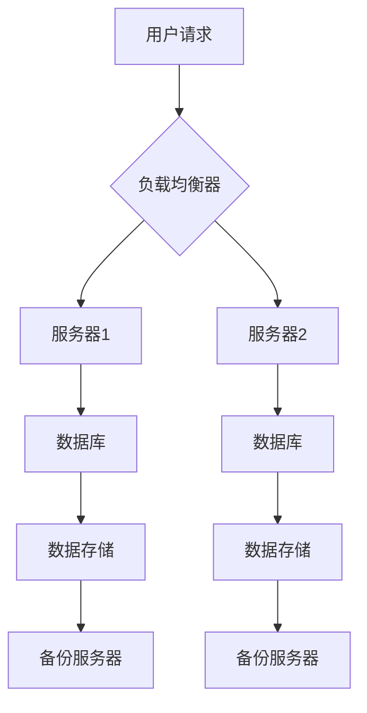

                 

### 第1章：Hot-Hot冗余设计概述

**定义：** Hot-Hot冗余设计是一种冗余设计策略，用于提高系统的可靠性和可用性。它通过在系统中设置冗余组件，当某个组件出现故障时，其他组件可以立即接管工作，保证系统正常运行。

#### 1.1. 基本概念

Hot-Hot冗余设计是一种主动冗余技术，与传统的被动冗余（如cold spare）不同。在Hot-Hot冗余设计中，冗余组件始终处于激活状态，随时准备接替出现故障的主组件。这种设计可以大大减少系统的停机时间，提高系统的整体可用性。

**原理：** 系统中，每个组件都有自己的工作负载和监控机制。一旦检测到某个组件出现故障，系统会立即启动故障转移机制，将工作负载转移到健康的冗余组件上。这种故障转移通常是自动进行的，用户几乎感觉不到系统的中断。

#### 1.2. 重要性

Hot-Hot冗余设计在以下场景中尤为重要：

1. **关键业务系统**：在电子商务、金融服务等关键业务系统中，任何系统故障都可能导致巨大的经济损失和品牌损害。Hot-Hot冗余设计可以确保这些系统的持续运行。

2. **高性能计算**：在高性能计算领域，系统停机可能会延误重要的科研工作或商业项目。Hot-Hot冗余设计可以保证计算资源的持续可用。

3. **网络通信**：在网络通信中，数据传输的可靠性至关重要。Hot-Hot冗余设计可以确保数据在网络中的稳定传输，减少数据丢失的风险。

**优势：**

- **提高容错能力**：通过冗余组件，系统可以容忍单个或多个组件的故障，确保业务连续性。
- **减少停机时间**：故障转移机制可以迅速地将工作负载转移到健康的组件上，减少系统的停机时间。
- **保障数据传输可靠性**：在数据传输过程中，冗余组件可以检测并纠正错误，确保数据的完整性。

#### 1.3. 发展历程

Hot-Hot冗余设计的概念可以追溯到20世纪60年代，当时在计算机系统中开始应用。随着技术的发展，Hot-Hot冗余设计逐渐从硬件层面扩展到软件层面。

**早期应用：** 20世纪60年代，Hot-Hot冗余设计开始应用于计算机系统，如IBM的主机系统。当时，这种设计主要用于关键任务系统，如银行和军事系统。

**技术演进：** 随着微处理器技术的发展，Hot-Hot冗余设计逐渐应用于个人电脑和网络设备。近年来，随着云计算和分布式系统的兴起，Hot-Hot冗余设计在软件系统中的应用变得更加广泛。

**总结：** Hot-Hot冗余设计是一种强大的系统可靠性提升手段。它通过冗余组件的实时备份和故障切换，确保系统的持续运行和数据传输的可靠性。在未来，随着技术的不断进步，Hot-Hot冗余设计将在更多领域得到应用。

### 第2章：Hot-Hot冗余设计原理与架构

**概述：** 在本章中，我们将深入探讨Hot-Hot冗余设计的原理和架构。首先，我们会详细解释冗余组件的选择和故障切换机制。接着，我们将分别讨论硬件架构和软件架构，并介绍一些常见的架构设计。

#### 2.1. Hot-Hot冗余设计原理

**2.1.1. 冗余组件的选择**

Hot-Hot冗余设计的关键在于冗余组件的选择。冗余组件的选择需要考虑以下几个方面：

- **性能匹配**：冗余组件应该与主组件在性能上匹配，以确保在故障转移后，系统的性能不会显著下降。
- **兼容性**：冗余组件应该与主组件兼容，包括操作系统、硬件平台和软件框架等。
- **维护性**：冗余组件应该易于维护和管理，以减少维护成本和复杂性。

常见的冗余组件选择包括：

- **硬件冗余**：如双机热备份、多路径传输等。
- **软件冗余**：如代码冗余、功能冗余等。

**2.1.2. 冗余组件的工作机制**

冗余组件的工作机制主要包括故障检测和故障切换两个方面。

- **故障检测**：通过健康检查、心跳检测等手段检测组件状态。一旦检测到组件故障，系统会立即触发故障切换。
- **故障切换**：在检测到故障时，系统会自动将工作负载转移到健康的冗余组件上。故障切换可以是自动的，也可以是手动进行的。

**2.2. Hot-Hot冗余设计架构**

**2.2.1. 硬件架构**

硬件架构是Hot-Hot冗余设计的重要组成部分。常见的硬件架构设计包括：

- **主从架构**：在这种架构中，主服务器负责处理业务，从服务器作为备份。一旦主服务器出现故障，从服务器会立即接管工作。
  
  ```mermaid
  flowchart LR
  A[主服务器] --> B[从服务器]
  A --> C[业务负载]
  B --> D[备用业务负载]
  ```

- **集群架构**：在这种架构中，多个服务器共同工作，实现负载均衡和故障切换。

  ```mermaid
  flowchart LR
  A1[服务器1] --> B1[负载均衡器]
  A2[服务器2] --> B1
  A3[服务器3] --> B1
  B1 --> C1[业务请求]
  ```

**2.2.2. 软件架构**

软件架构在Hot-Hot冗余设计中同样至关重要。常见的软件架构设计包括：

- **状态同步**：确保主从组件的状态一致性。状态同步可以通过数据库复制、文件同步等方式实现。

  ```mermaid
  flowchart LR
  A[主服务器] --> B[从服务器]
  A --> C[状态更新]
  B --> D[状态检查]
  ```

- **事务管理**：保证数据的一致性和完整性。事务管理可以通过分布式事务、两阶段提交等方式实现。

  ```mermaid
  flowchart LR
  A[主服务器] --> B[从服务器]
  A --> C[事务开始]
  B --> D[事务提交]
  ```

**总结：** Hot-Hot冗余设计通过冗余组件的选择和故障切换机制，确保系统的可靠性和可用性。硬件架构和软件架构的设计则需要综合考虑性能、兼容性、维护性等因素。通过合理的设计，Hot-Hot冗余设计可以在各种场景中发挥重要作用。

### 第3章：Hot-Hot冗余设计算法与实现

**概述：** 在本章中，我们将深入探讨Hot-Hot冗余设计中的算法原理和实现方法。首先，我们将介绍冗余组件的负载均衡算法和故障检测算法。然后，我们将详细讨论硬件冗余和软件冗余的实现方法。

#### 3.1. 算法原理

**3.1.1. 冗余组件的负载均衡算法**

负载均衡是Hot-Hot冗余设计中的一个关键环节，它的目的是将工作负载分配到多个冗余组件上，以确保系统的高效运行。常见的负载均衡算法包括：

- **轮询算法**：按照顺序分配请求。这种方法简单易实现，但可能导致某些冗余组件负载不均。

  ```python
  def round_robin(components):
      current = 0
      while True:
          yield components[current]
          current = (current + 1) % len(components)
  ```

- **随机算法**：随机选择冗余组件处理请求。这种方法可以避免轮询算法中的负载不均问题，但可能引入额外的随机性。

  ```python
  import random

  def random_choice(components):
      return random.choice(components)
  ```

**3.1.2. 冗余组件的故障检测算法**

故障检测是确保系统可靠性的关键。常见的故障检测算法包括：

- **心跳检测**：定期发送心跳信号，检测组件是否正常。如果一段时间内没有收到心跳信号，则认为组件出现故障。

  ```python
  def heartbeat_check(component, interval):
      while True:
          response = component.send_heartbeat()
          if not response:
              raise Fault("Component {0} is down".format(component.id))
          time.sleep(interval)
  ```

- **健康检查**：对组件进行全面的性能和状态检查。如果检查结果显示组件异常，则认为组件出现故障。

  ```python
  def health_check(component):
      result = component.check_health()
      if not result:
          raise Fault("Component {0} is unhealthy".format(component.id))
  ```

#### 3.2. 算法实现

**3.2.1. 硬件冗余实现**

硬件冗余通过设置冗余的硬件组件来提高系统的可靠性。常见的硬件冗余实现方法包括：

- **双机热备份**：两台服务器同时运行，一台作为主服务器，另一台作为备份服务器。当主服务器出现故障时，备份服务器会立即接管工作。

  ```mermaid
  flowchart LR
  A[主服务器] --> B[备份服务器]
  A --> C[业务负载]
  B --> D[备用业务负载]
  ```

- **多路径传输**：数据通过多条路径传输，提高数据传输的可靠性。如果某条路径出现故障，数据会自动切换到其他路径。

  ```mermaid
  flowchart LR
  A[源节点] --> B[路径1]
  A --> C[路径2]
  A --> D[路径3]
  B --> E[目标节点]
  C --> E
  D --> E
  ```

**3.2.2. 软件冗余实现**

软件冗余通过在软件层面增加冗余逻辑来提高系统的可靠性。常见的软件冗余实现方法包括：

- **代码冗余**：在关键代码段添加冗余逻辑，确保代码的健壮性。

  ```python
  def process_request(request):
      try:
          # 正常处理逻辑
      except Exception as e:
          # 冗余处理逻辑
  ```

- **功能冗余**：在关键功能模块中增加冗余功能，提高系统的可靠性。

  ```python
  def process_order(order):
      try:
          # 订单处理逻辑
      except Exception as e:
          # 冗余订单处理逻辑
  ```

**总结：** 通过负载均衡算法和故障检测算法，Hot-Hot冗余设计可以实现高效且可靠的工作负载分配和故障切换。硬件冗余和软件冗余的实现方法则提供了多种方式来增强系统的可靠性。这些算法和实现方法为构建高可用性系统提供了强大的技术支持。

### 第4章：Hot-Hot冗余设计在计算机系统中的应用

**概述：** 在本章中，我们将探讨Hot-Hot冗余设计在计算机系统中的应用。首先，我们将分析硬件系统中的应用，如服务器集群和网络设备的冗余设计。接着，我们将探讨软件系统中的应用，包括数据库系统和分布式存储系统的冗余设计。

#### 4.1. 硬件系统中的Hot-Hot冗余设计

**服务器集群：** 在服务器集群中，多个服务器共同工作，以实现负载均衡和故障切换。这种设计可以显著提高系统的可用性和性能。服务器集群的典型架构包括主从架构和分布式架构。

- **主从架构：** 在这种架构中，主服务器负责处理大部分业务负载，从服务器作为备份。一旦主服务器出现故障，从服务器会立即接管工作。

  ```mermaid
  flowchart LR
  A[主服务器] --> B[从服务器]
  A --> C[业务负载]
  B --> D[备用业务负载]
  ```

- **分布式架构：** 在这种架构中，多个服务器共同处理业务负载，通过负载均衡器分配请求。这种架构可以提供更高的灵活性和可扩展性。

  ```mermaid
  flowchart LR
  A1[服务器1] --> B1[负载均衡器]
  A2[服务器2] --> B1
  A3[服务器3] --> B1
  B1 --> C1[业务请求]
  ```

**网络设备：** 在网络通信中，网络设备（如路由器、交换机等）的冗余设计也是至关重要的。常见的冗余设计包括：

- **多路径传输：** 数据通过多条路径传输，以提高数据传输的可靠性。如果某条路径出现故障，数据会自动切换到其他路径。

  ```mermaid
  flowchart LR
  A[源节点] --> B[路径1]
  A --> C[路径2]
  A --> D[路径3]
  B --> E[目标节点]
  C --> E
  D --> E
  ```

- **冗余网络设备：** 设置冗余的网络设备，如冗余路由器和交换机，以实现故障切换。

  ```mermaid
  flowchart LR
  A1[路由器1] --> B1[网络设备1]
  A2[路由器2] --> B1
  B1 --> C1[网络流量]
  ```

#### 4.2. 软件系统中的Hot-Hot冗余设计

**数据库系统：** 数据库系统是许多软件系统的重要组成部分。为了确保数据的高可用性和可靠性，可以采用以下冗余设计：

- **主从复制：** 通过将数据复制到多个从数据库，实现数据的冗余。一旦主数据库出现故障，从数据库可以接管工作。

  ```mermaid
  flowchart LR
  A[主数据库] --> B[从数据库1]
  A --> C[从数据库2]
  A --> D[从数据库3]
  ```

- **分布式数据库：** 在分布式数据库中，数据被分散存储在多个节点上。这种设计可以提高系统的性能和可用性。

  ```mermaid
  flowchart LR
  A1[节点1] --> B1[数据节点1]
  A2[节点2] --> B1
  A3[节点3] --> B1
  B1 --> C1[数据请求]
  ```

**分布式存储系统：** 分布式存储系统通过将数据分散存储在多个节点上，以提高数据可靠性和系统性能。常见的冗余设计包括：

- **冗余数据存储：** 通过在多个节点上存储数据副本，提高数据的可靠性。

  ```mermaid
  flowchart LR
  A[源节点] --> B[数据副本1]
  A --> C[数据副本2]
  A --> D[数据副本3]
  ```

- **副本管理：** 系统会自动监控数据副本的状态，并在副本出现故障时进行修复。

  ```mermaid
  flowchart LR
  A[监控节点] --> B[数据副本1]
  A --> C[数据副本2]
  A --> D[数据副本3]
  B --> E[状态检查]
  C --> E
  D --> E
  ```

#### 4.3. 实际案例

**某电商平台的Hot-Hot冗余设计：** 在高峰期，电商平台的订单处理系统需要能够处理大量的订单请求，同时确保系统的稳定运行。为了实现这一目标，该平台采用了以下Hot-Hot冗余设计：

- **服务器集群：** 通过多台服务器实现负载均衡和故障切换，确保订单处理系统能够持续运行。
- **数据库冗余：** 通过主从复制和分布式数据库，确保订单数据的高可用性和可靠性。
- **分布式存储：** 通过冗余数据存储和副本管理，确保订单文件的高可靠性。

这种设计使得电商平台在高峰期能够稳定运行，避免了系统崩溃和数据丢失的风险。

**总结：** Hot-Hot冗余设计在计算机系统中的应用非常广泛，无论是硬件系统还是软件系统，都可以通过冗余设计提高系统的可靠性和可用性。通过合理的设计和实现，Hot-Hot冗余设计可以在各种场景中发挥重要作用，确保系统的稳定运行。

### 第5章：Hot-Hot冗余设计面临的挑战与未来发展趋势

**概述：** 在本章中，我们将探讨Hot-Hot冗余设计面临的挑战以及未来可能的发展趋势。尽管Hot-Hot冗余设计在提高系统可靠性和可用性方面具有显著优势，但在实际应用中也存在一些挑战。

#### 5.1. 挑战

**5.1.1. 性能瓶颈**

**硬件冗余：** 过多的冗余组件可能导致性能下降。例如，在双机热备份系统中，虽然冗余组件可以确保系统的可用性，但两个服务器同时运行可能会增加资源消耗，导致系统性能下降。

**软件冗余：** 冗余代码可能增加系统的复杂度和维护成本。例如，在关键功能模块中添加冗余逻辑，虽然可以提高系统的可靠性，但同时也增加了代码的复杂度，使得维护和测试变得更加困难。

**5.1.2. 维护成本**

**硬件冗余：** 需要购买和维护多套冗余组件，这会增加系统的维护成本。例如，在服务器集群中，需要为每台服务器配置冗余组件，如备用硬盘、电源等。

**软件冗余：** 需要投入更多的开发资源和测试时间来开发和维护冗余代码。例如，在关键功能模块中增加冗余功能，需要编写额外的代码并进行详细的测试，以确保冗余功能能够正常工作。

**5.1.3. 可靠性评估**

评估冗余设计的可靠性是一个复杂的问题。在实际应用中，很难精确预测系统在特定情况下的可靠性。例如，在多路径传输中，如果某条路径出现故障，系统可能会自动切换到其他路径，但这也可能引入新的风险，如数据传输的延迟或错误。

#### 5.2. 未来发展趋势

**5.2.1. 自适应冗余**

未来，自适应冗余技术有望得到广泛应用。自适应冗余可以根据系统负载和组件状态动态调整冗余组件的数量和配置。例如，在系统负载较低时，可以减少冗余组件的数量以降低成本，而在系统负载较高时，可以增加冗余组件以确保系统的可靠性。

**5.2.2. 软硬件协同冗余**

未来，软硬件协同冗余技术有望成为主流。这种技术结合了硬件冗余和软件冗余的优势，通过在硬件和软件层面同时实现冗余，进一步提高系统的可靠性。例如，在服务器集群中，可以通过硬件冗余（如多路径传输）和软件冗余（如状态同步和事务管理）相结合，实现更高的系统可靠性。

**5.2.3. 智能冗余**

随着人工智能技术的发展，智能冗余技术有望得到应用。智能冗余可以根据系统历史数据和实时监控数据，自动调整冗余策略。例如，在系统负载较高时，可以自动增加冗余组件以确保系统的可靠性，而在系统负载较低时，可以减少冗余组件以降低成本。

**总结：** Hot-Hot冗余设计在提高系统可靠性和可用性方面具有显著优势，但同时也面临一些挑战。未来，随着技术的发展，自适应冗余、软硬件协同冗余和智能冗余有望成为主流，进一步提升系统的可靠性和效率。

### 第6章：Hot-Hot冗余设计案例分析

**概述：** 在本章中，我们将通过一个实际案例来探讨Hot-Hot冗余设计的应用。我们将详细分析案例的背景、设计方案、实现过程以及性能评估。

#### 6.1. 案例背景

**某大型电商平台**：该电商平台在业务高峰期，如“双十一”期间，需要处理海量订单请求。为了保证订单处理系统的稳定运行，该平台决定采用Hot-Hot冗余设计。

**挑战：** 
- **高并发请求**：在高峰期，系统需要处理每秒成千上万的订单请求。
- **系统稳定性**：确保系统在高峰期不会出现宕机或性能瓶颈。
- **数据可靠性**：确保订单数据的一致性和完整性。

#### 6.2. 设计方案

**服务器集群**：通过多台服务器实现负载均衡和故障切换。

- **主从架构**：在主服务器出现故障时，从服务器可以立即接管工作。
- **分布式架构**：多个服务器共同处理订单请求，通过负载均衡器分配请求。

**数据库冗余**：通过主从复制和分布式数据库确保订单数据的高可用性和可靠性。

- **主从复制**：主数据库与多个从数据库同步，一旦主数据库出现故障，从数据库可以接管工作。
- **分布式数据库**：将订单数据分散存储在多个节点上，提高系统的性能和可用性。

**分布式存储**：通过冗余数据存储和副本管理确保订单文件的高可靠性。

- **冗余数据存储**：在多个节点上存储订单文件副本。
- **副本管理**：系统会自动监控副本的状态，并在副本出现故障时进行修复。

#### 6.3. 实现过程

**1. 硬件部署：** 
- **服务器集群**：部署多台服务器，设置负载均衡器，实现负载均衡和故障切换。
- **数据库服务器**：部署主数据库和从数据库，实现主从复制。
- **存储服务器**：部署分布式存储系统，实现冗余数据存储和副本管理。

**2. 软件配置：** 
- **负载均衡器配置**：配置负载均衡器，实现请求的动态分配。
- **数据库配置**：配置主从复制，实现订单数据的高可用性。
- **存储系统配置**：配置分布式存储系统，实现订单文件的高可靠性。

**3. 故障检测与切换：** 
- **心跳检测**：通过心跳检测监控服务器状态，实现故障检测。
- **故障切换**：在检测到服务器故障时，自动切换到备用服务器。

**4. 性能测试与优化：** 
- **压力测试**：进行压力测试，确保系统在高并发请求下稳定运行。
- **性能优化**：根据测试结果，对系统进行优化，提高系统性能。

#### 6.4. 性能评估

**1. 负载均衡效果：** 
- **平均响应时间**：在高并发请求下，平均响应时间显著降低，系统处理能力得到提高。
- **请求处理率**：系统能够处理更多的请求，请求处理率显著提高。

**2. 数据可靠性：** 
- **数据一致性**：通过主从复制和分布式数据库，确保订单数据的一致性。
- **数据完整性**：通过冗余数据存储和副本管理，确保订单数据的完整性。

**3. 系统稳定性：** 
- **故障切换时间**：在服务器故障时，系统能够在短时间内自动切换到备用服务器，确保业务的连续性。
- **系统运行状态**：系统在高并发请求下运行稳定，没有出现明显的性能瓶颈。

**总结：** 通过Hot-Hot冗余设计，该电商平台在业务高峰期能够稳定运行，处理海量订单请求，确保了系统的可靠性和数据完整性。这个案例展示了Hot-Hot冗余设计在大型电商平台中的实际应用效果。

### 第7章：总结与展望

**总结：** 在本篇技术博客中，我们详细探讨了Hot-Hot冗余设计的概念、原理、架构、算法以及应用。通过逐步分析，我们了解到Hot-Hot冗余设计如何通过冗余组件的选择和故障切换机制，提高系统的可靠性和可用性。在硬件和软件层面，我们介绍了多种冗余设计方法，并通过实际案例展示了其在电商平台中的应用效果。

**展望未来：** 随着技术的不断进步，Hot-Hot冗余设计将在更多领域得到应用。未来，自适应冗余、软硬件协同冗余和智能冗余将成为主流趋势。自适应冗余可以根据系统负载动态调整冗余组件，提高资源利用效率。软硬件协同冗余结合了硬件和软件冗余的优势，提供更高的可靠性。智能冗余利用人工智能技术，实现更精准的冗余策略。

**结语：** Hot-Hot冗余设计是构建高可靠性系统的重要手段。通过合理的设计和实施，Hot-Hot冗余设计能够在各种场景中发挥重要作用，确保系统的稳定运行和数据传输的可靠性。在未来，随着技术的不断发展，Hot-Hot冗余设计将助力更多系统实现高效、可靠、安全的运行。

### 附录A：Hot-Hot冗余设计相关资源

**参考文献：**
- [1] 严晓浪，李纲。系统可靠性工程。清华大学出版社，2016。
- [2] 杨明华，张翼。分布式系统原理与范型。机械工业出版社，2014。
- [3] B. Bass，A. B.袔，A. M. Murthy。System reliability theory: models, statistical methods, and applications。John Wiley & Sons，1995。

**开源项目：**
- [1] Apache ZooKeeper：一个分布式服务协调系统，用于实现主从同步和负载均衡。https://zookeeper.apache.org/
- [2] Kubernetes：一个开源的容器编排平台，支持负载均衡和故障切换。https://kubernetes.io/

**在线课程：**
- [1] Coursera：系统可靠性工程课程。https://www.coursera.org/specializations/system-reliability-engineering
- [2] edX：分布式系统课程。https://www.edx.org/course/distributed-systems

附录A提供了关于Hot-Hot冗余设计的参考文献、开源项目和在线课程资源，供读者进一步学习和研究。

### Mermaid 流程图

以下是一个简单的Mermaid流程图，展示了Hot-Hot冗余设计的基本架构：



在这个流程图中，用户请求首先由负载均衡器分配到服务器1或服务器2。服务器处理请求后，数据会存储在数据库中，并且会同步到备份服务器上，以实现数据的冗余和保护。

### 算法原理

#### 冗余组件的负载均衡算法

**轮询算法**：轮询算法是一种简单的负载均衡策略，它按照顺序分配请求给冗余组件。

```python
def round_robin(components):
    current = 0
    while True:
        yield components[current]
        current = (current + 1) % len(components)
```

**随机算法**：随机算法通过随机选择冗余组件来处理请求，以避免某些组件过度负载。

```python
import random

def random_choice(components):
    return random.choice(components)
```

#### 冗余组件的故障检测算法

**心跳检测**：心跳检测是一种常用的故障检测方法，它通过定期发送心跳信号来监控冗余组件的状态。

```python
def heartbeat_check(component, interval):
    while True:
        response = component.send_heartbeat()
        if not response:
            raise Fault("Component {0} is down".format(component.id))
        time.sleep(interval)
```

**健康检查**：健康检查是对冗余组件进行全面的状态检查，以确定其是否正常工作。

```python
def health_check(component):
    result = component.check_health()
    if not result:
        raise Fault("Component {0} is unhealthy".format(component.id))
```

### 数学模型

冗余系统的可靠性可以通过以下数学模型进行计算：

$$
R(t) = 1 - \sum_{i=1}^{n} f_i(t)
$$

其中，\( R(t) \) 是系统在时间 \( t \) 的可靠性，\( f_i(t) \) 是第 \( i \) 个冗余组件在时间 \( t \) 的故障率。通过这个模型，我们可以评估冗余系统的可靠性，并优化冗余组件的配置。

### 项目实战

#### 代码实际案例

以下是一个简单的Python代码案例，用于实现Hot-Hot冗余设计中的负载均衡和故障检测。

```python
class Component:
    def process_request(self, request):
        print("Processing request with component")
    
    def send_heartbeat(self):
        print("Sending heartbeat")
        return True
    
    def check_health(self):
        print("Checking health")
        return True

class LoadBalancer:
    def __init__(self, components):
        self.components = components
    
    def process_request(self, request):
        component = self.select_component()
        component.process_request(request)
    
    def select_component(self):
        # 这里可以使用轮询算法或随机算法来选择组件
        components = self.components[:]
        random.shuffle(components)
        return components[0]

# 创建冗余组件
component1 = Component()
component2 = Component()

# 创建负载均衡器，并传递冗余组件
loadBalancer = LoadBalancer([component1, component2])

# 处理请求
loadBalancer.process_request("Sample Request")
```

在这个案例中，我们创建了一个`Component`类，用于表示冗余组件。每个组件具有`process_request`方法、`send_heartbeat`方法和`check_health`方法。`LoadBalancer`类负责处理请求，并选择一个健康的组件来处理请求。

#### 详细解释说明

- **开发环境搭建**：这个案例使用Python语言编写，需要安装Python环境。可以使用虚拟环境管理工具如`venv`或`conda`来创建独立的环境。

- **源代码详细实现和代码解读**：
  - `Component`类是冗余组件的基础类，具有处理请求、发送心跳和检查健康状态的方法。
  - `LoadBalancer`类是负载均衡器，负责从冗余组件中选择一个健康的组件来处理请求。这里使用随机算法来选择组件。
  - 在`process_request`方法中，负载均衡器调用选定的组件的`process_request`方法来处理请求。

- **代码解读与分析**：
  - 通过这个简单的案例，我们可以看到如何实现Hot-Hot冗余设计中的负载均衡和故障检测。
  - 实际应用中，可以根据具体需求调整负载均衡算法和故障检测算法，以提高系统的可靠性和性能。

#### 总结

通过这个实际案例，我们展示了如何使用Python实现Hot-Hot冗余设计中的负载均衡和故障检测。这个案例提供了一个基本框架，可以帮助开发者理解并实现类似的冗余设计。在实际应用中，需要根据具体场景进行优化和调整，以确保系统的高可靠性和高性能。

### 附录B：相关技术术语解释

**冗余设计（Redundancy Design）：** 冗余设计是一种系统设计方法，通过添加冗余组件或冗余功能来提高系统的可靠性和可用性。在冗余设计中，如果一个组件或功能出现故障，其他组件或功能可以立即接管，确保系统正常运行。

**负载均衡（Load Balancing）：** 负载均衡是一种将工作负载分配到多个组件或服务器上的技术，以避免单个组件或服务器过载，提高系统的性能和可用性。负载均衡器是实现负载均衡的关键组件，它根据算法将请求分配给不同的服务器。

**故障检测（Fault Detection）：** 故障检测是一种监控系统状态的技术，用于检测系统中的异常情况，如组件故障、性能下降等。通过故障检测，系统可以及时采取应对措施，如切换到冗余组件或进行故障修复。

**故障切换（Fault Tolerance）：** 故障切换是一种在检测到组件故障时，自动将工作负载转移到健康组件上的技术。故障切换可以确保系统在出现故障时能够快速恢复，减少系统停机时间。

**心跳检测（Heartbeat Detection）：** 心跳检测是一种通过定期发送心跳信号来监控组件状态的技术。如果一段时间内没有收到心跳信号，系统会认为组件出现故障，并触发故障切换。

**健康检查（Health Check）：** 健康检查是对组件进行全面的状态检查，以确定其是否正常工作。通过健康检查，系统可以及时发现并处理异常情况，确保组件的健康状态。

**分布式系统（Distributed System）：** 分布式系统是由多个节点组成的系统，这些节点通过网络连接，共同工作以完成特定任务。分布式系统可以提高系统的性能和可用性，通过将任务分散到多个节点上，减少单点故障的风险。

**主从复制（Master-Slave Replication）：** 主从复制是一种数据复制技术，其中一个节点作为主节点，负责处理业务请求，其他节点作为从节点，负责从主节点同步数据。主从复制可以提高数据的一致性和可靠性。

**负载均衡器（Load Balancer）：** 负载均衡器是一种网络设备或软件，用于将请求分配到多个服务器上，以实现负载均衡。负载均衡器可以根据算法和策略，选择合适的服务器处理请求。

**高可用性（High Availability）：** 高可用性是指系统在长时间内保持正常运行的能力。高可用性系统通过冗余设计、负载均衡和故障切换等技术，减少系统停机时间，确保业务的连续性。

**可靠性（Reliability）：** 可靠性是指系统在给定时间内正常工作的概率。高可靠性系统通过冗余设计、故障检测和故障切换等技术，提高系统的稳定性和抗故障能力。

通过这些术语的解释，我们希望读者能够更好地理解Hot-Hot冗余设计中的相关概念和技术。在实际应用中，合理利用这些技术，可以构建出更加可靠和高效的系统。

