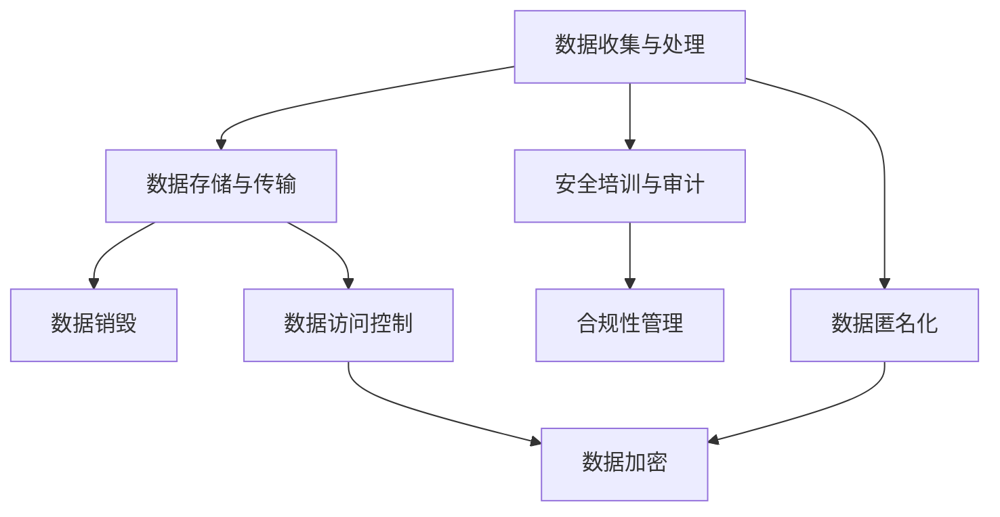

                 

# 第一部分：引言与背景

## 1.1 书籍概述

《LLM监管措施：保障数据安全》是一本深入探讨大型语言模型（LLM）监管措施，旨在保障数据安全的专著。本书的目标是帮助读者了解LLM监管的原理、框架、应用与实践，以及相关的技术手段和工具。

### 1.1.1 书籍目标与读者对象

本书的目标是为从事人工智能、数据安全、法律合规等相关领域的研究人员、开发人员、管理者以及政策制定者提供一本全面、系统的参考书籍。通过阅读本书，读者可以：

1. 理解LLM监管的重要性及其核心原则。
2. 掌握LLM监管措施的设计框架与实施步骤。
3. 掌握数据安全法规与标准，以及如何应用于LLM监管。
4. 学习LLM数据收集、处理、模型训练与部署中的数据安全策略。
5. 了解相关技术手段和工具，如加密技术、数据隐私保护技术等。
6. 理解LLM监管的合规性与法律问题，以及案例分析。

### 1.1.2 LLM监管的重要性

随着人工智能技术的快速发展，特别是大型语言模型（LLM）在自然语言处理、文本生成、对话系统等领域的广泛应用，LLM监管的重要性日益凸显。以下是LLM监管的重要性：

1. **数据安全**：LLM在处理大量用户数据时，可能面临数据泄露、滥用等风险，因此需要进行有效的监管来保障数据安全。
2. **隐私保护**：LLM在处理个人数据时，需要遵守隐私保护法规，确保用户隐私不受侵犯。
3. **公平性与透明性**：LLM的应用可能涉及敏感信息，如医疗、金融等，需要进行监管以确保公平性和透明性。
4. **社会责任**：随着AI技术的发展，社会对AI技术的责任和伦理要求越来越高，LLM监管有助于确保技术符合社会责任。

### 1.1.3 数据安全的核心问题

数据安全是LLM监管的核心问题，主要包括以下几个方面：

1. **数据收集**：在收集数据时，需要遵守数据最小化原则，仅收集必要的数据，并确保数据来源的合法性。
2. **数据处理**：在处理数据时，需要遵守数据匿名化、加密等原则，确保数据在传输和存储过程中的安全性。
3. **数据存储**：数据存储需要采用安全措施，如加密、访问控制等，以防止未经授权的访问和泄露。
4. **数据销毁**：在数据不再需要时，需要按照规定进行销毁，确保数据无法被恢复。
5. **数据安全培训**：对相关人员进行数据安全培训，提高他们的安全意识和技能。

## 1.2 大语言模型（LLM）概述

### 1.2.1 LLM的定义与分类

大语言模型（LLM）是一种能够处理和理解自然语言的大型深度学习模型。根据其训练目标和应用场景，LLM可以分为以下几类：

- **通用语言模型**：如GPT系列、BERT等，这类模型通常在广泛的语料库上进行训练，能够理解并生成自然语言。
- **领域特定语言模型**：这类模型在特定领域（如医学、法律等）的语料库上进行训练，能够更准确地理解和生成特定领域的文本。
- **多语言模型**：这类模型可以在多种语言上进行训练，能够处理多种语言的文本。

### 1.2.2 LLM的发展历程

- **早期研究**：20世纪50年代至80年代，早期研究者开始探索自然语言处理（NLP）的基本问题，如句法分析、语义理解等。
- **统计方法**：20世纪90年代，基于统计方法的NLP技术开始广泛应用，如隐马尔可夫模型（HMM）、条件概率模型等。
- **深度学习时代**：2012年，神经网络语言模型（NNLM）的提出标志着NLP进入深度学习时代。随后，GPT系列、BERT等大型语言模型不断涌现，推动NLP技术的快速发展。
- **近期发展**：随着计算能力的提升和数据量的增加，LLM的规模和性能不断提高，其在实际应用中的效果也越来越显著。

### 1.2.3 LLM在各个领域的应用

LLM在多个领域都有着广泛的应用，以下是其中一些主要领域：

- **文本生成与生成式任务**：如文本摘要、机器翻译、自动问答等。
- **文本理解与理解式任务**：如情感分析、文本分类、信息提取等。
- **对话系统**：如聊天机器人、虚拟助手等。
- **知识图谱**：LLM可以用于构建和优化知识图谱，从而提高问答系统的准确性。
- **自然语言理解（NLU）与自然语言生成（NLG）**：LLM在NLU和NLG中有着广泛的应用，可以帮助企业构建智能客服系统、自动写作平台等。

### 1.2.4 AI大模型与传统AI的区别

AI大模型与传统AI之间存在以下几个显著区别：

- **规模**：传统AI模型通常较小，而AI大模型具有数十亿甚至万亿级的参数规模。
- **计算资源**：传统AI模型对计算资源的要求相对较低，而AI大模型需要强大的计算能力和大量的数据。
- **数据处理能力**：传统AI模型通常只能处理有限的输入数据，而AI大模型可以处理海量的数据。
- **应用场景**：传统AI模型在特定任务上具有较好的性能，而AI大模型具有更广泛的应用场景。
- **创新能力**：AI大模型可以通过自我学习和自我进化不断提高性能，而传统AI模型则需要不断更新模型和算法。

## 1.3 数据安全监管现状

### 1.3.1 数据安全法规概述

数据安全法规是保障数据安全的重要法律依据。以下是全球范围内一些主要的数据安全法规：

- **欧洲通用数据保护条例（GDPR）**：GDPR是欧盟于2018年实施的隐私保护法规，对数据收集、存储、处理和传输提出了严格的要求。
- **美国加州消费者隐私法案（CCPA）**：CCPA是加州于2020年实施的隐私保护法规，旨在增强消费者对其个人信息的控制权。
- **中国个人信息保护法（PIPL）**：PIPL是中国于2021年实施的隐私保护法规，对个人信息保护提出了全面的要求。
- **美国健康保险可携性与责任法案（HIPAA）**：HIPAA是美国关于医疗信息的隐私保护法规，适用于医疗行业。
- **英国数据保护法案（DPA）**：DPA是英国实施的隐私保护法规，与GDPR类似。

### 1.3.2 数据泄露事件案例分析

数据泄露事件在全球范围内频繁发生，对个人隐私和企业安全造成了严重威胁。以下是几个典型案例：

- **2017年，亚马逊AWS数据泄露事件**：2017年，亚马逊AWS的一个云服务器发生了数据泄露事件，导致约1.5亿用户的数据被公开。事件暴露了用户的个人信息，包括姓名、电子邮件地址、电话号码等。
- **2018年，Facebook数据泄露事件**：2018年，Facebook的数据泄露事件引起了全球关注。事件中，超过5300万用户的个人信息被未经授权地访问和泄露。
- **2021年，Uber数据泄露事件**：2021年，Uber发生了一起数据泄露事件，导致约5700万用户的个人信息被泄露，包括姓名、电子邮件地址、电话号码和位置数据。

### 1.3.3 数据安全监管挑战与趋势

数据安全监管面临以下几个挑战：

1. **法律法规的全球统一性**：不同国家和地区的法律法规存在差异，导致企业在跨国运营时面临合规难题。
2. **技术更新速度与监管滞后**：随着技术的快速发展，监管法规可能无法及时跟上，导致监管空白。
3. **数据安全事件频发**：数据泄露事件频繁发生，对监管措施的有效性提出了更高要求。
4. **跨国数据流动**：随着全球化的推进，数据跨境流动日益频繁，增加了监管的复杂性。

未来，数据安全监管趋势将包括：

1. **法律法规的完善与细化**：各国将继续完善和细化数据安全法规，提高法规的执行力度。
2. **技术手段的应用**：利用人工智能、区块链等新技术提高数据安全监管的效率和能力。
3. **跨国合作与协调**：加强国际间的数据安全监管合作，共同应对跨国数据流动带来的挑战。

## 1.4 监管措施原理与框架

### 1.4.1 数据安全监管原则

数据安全监管应遵循以下原则：

1. **数据最小化原则**：仅收集必要的数据，减少数据收集的范围。
2. **数据匿名化原则**：对敏感数据进行匿名化处理，以防止个人信息泄露。
3. **数据加密原则**：采用加密技术保护数据在传输和存储过程中的安全。
4. **数据访问控制原则**：对数据访问进行严格限制，确保只有授权人员才能访问数据。

### 1.4.2 监管措施设计框架

监管措施设计框架包括以下步骤：

1. **目标与范围确定**：明确监管措施的目标和适用范围，确保覆盖所有相关数据和场景。
2. **措施实施步骤**：制定详细的实施步骤，包括数据收集、处理、存储、传输和销毁等环节。
3. **评估与优化**：定期评估监管措施的有效性，根据评估结果进行优化和调整。

### 1.4.3 监管措施实施步骤

监管措施实施步骤包括：

1. **数据收集与处理**：确保仅收集必要的数据，并采用匿名化、加密等技术保护数据安全。
2. **数据存储与传输**：采用加密、访问控制等技术保护数据在存储和传输过程中的安全。
3. **数据销毁**：按照规定进行数据销毁，确保数据无法被恢复。
4. **安全培训与审计**：对相关人员开展数据安全培训，定期进行数据安全审计。

### 1.4.4 数据安全法规与标准解读

不同国家和地区的数据安全法规和标准有所不同，以下是对部分法规和标准的解读：

1. **GDPR**：GDPR要求对个人数据的收集、处理和存储进行严格管理，确保个人隐私权得到保护。
2. **CCPA**：CCPA赋予加州消费者对其个人信息的控制权，包括数据的访问、删除和禁止销售。
3. **PIPL**：PIPL规定了对个人信息的收集、处理和存储的规范，以及个人对个人信息权益的保护。
4. **HIPAA**：HIPAA保护医疗信息的安全，要求医疗机构对医疗信息进行保密。
5. **DPA**：DPA与GDPR类似，对数据收集、处理和存储提出了严格的要求。

## 1.5 LLM监管现状与趋势

### 1.5.1 LLM监管现状

目前，全球范围内对LLM的监管尚处于探索和起步阶段，主要表现在以下几个方面：

1. **法律法规的逐步完善**：各国和地区开始重视LLM监管，逐步制定和修订相关法律法规，以应对数据安全、隐私保护等挑战。
2. **行业自律与规范**：人工智能行业组织和企业开始制定自律规范，推动LLM的合规使用。
3. **监管政策试点**：部分国家和地区启动了LLM监管政策的试点项目，探索适合本地实际情况的监管模式。

### 1.5.2 LLM监管趋势

未来，LLM监管将呈现以下趋势：

1. **法律法规的全球化**：随着全球化的推进，各国和地区将在数据安全、隐私保护等方面加强合作，推动全球范围内的LLM监管法规的统一。
2. **技术手段的应用**：利用人工智能、区块链等新技术提高LLM监管的效率和准确性。
3. **跨领域合作**：不同领域的企业、研究机构、政府等将加强合作，共同应对LLM监管带来的挑战。
4. **监管与创新的平衡**：在保障数据安全和隐私保护的前提下，促进人工智能技术的发展和创新。

## 1.6 结论

《LLM监管措施：保障数据安全》旨在为读者提供全面、系统的LLM监管知识，帮助读者了解LLM监管的原理、框架、应用与实践。随着人工智能技术的快速发展，LLM监管的重要性日益凸显。本书通过对LLM监管现状和趋势的分析，为读者提供了有益的参考和指导。

---

### 文章摘要

《LLM监管措施：保障数据安全》旨在深入探讨大型语言模型（LLM）的监管措施，重点分析其在数据安全方面的核心问题。本书首先介绍了LLM的定义、分类及其在各个领域的应用，接着阐述了数据安全监管的背景和重要性。随后，本书详细介绍了LLM监管的原则、设计框架和实施步骤，并解读了全球主要数据安全法规和标准。此外，本书还讨论了LLM数据收集、处理、模型训练与部署中的数据安全策略，以及相关技术手段和工具。最后，本书分析了LLM监管的合规性与法律问题，并展望了未来监管技术的发展趋势。通过本书的阅读，读者将能够全面了解LLM监管的理论和实践，为在实际工作中保障数据安全提供有力支持。

---

### 1.7 市场需求分析

随着人工智能技术的不断进步，大型语言模型（LLM）在自然语言处理、文本生成、对话系统等领域的应用日益广泛。然而，这也带来了数据安全与隐私保护等方面的挑战。因此，市场对LLM监管措施的需求日益增加，主要表现在以下几个方面：

#### 1.7.1 数据泄露风险

LLM在处理大量用户数据时，可能面临数据泄露的风险。随着数据泄露事件的频发，用户对数据安全的关注逐渐提高，这促使企业、政府等机构对LLM进行更严格的监管。

#### 1.7.2 隐私保护法规

全球范围内，隐私保护法规如GDPR、CCPA等不断出台和修订，对数据收集、处理和存储提出了更高的要求。企业需要遵循这些法规，以确保其LLM应用符合法律要求，从而避免潜在的法律风险。

#### 1.7.3 公平性与透明性

LLM在医疗、金融、法律等敏感领域的应用，要求模型具备公平性和透明性。监管措施有助于确保LLM应用不歧视特定群体，同时提高模型的解释性和可追溯性。

#### 1.7.4 社会责任

随着AI技术的普及，社会各界对AI技术的责任和伦理要求越来越高。有效的LLM监管有助于确保技术发展符合社会责任，防止滥用和误用。

#### 1.7.5 技术进步与监管需求

随着LLM技术的不断发展，其应用场景不断扩展，这也对监管提出了新的挑战。企业和监管机构需要不断更新和调整监管措施，以适应技术进步带来的变化。

#### 1.7.6 国际合作与标准统一

全球化的背景下，跨国数据流动日益频繁，这要求各国在LLM监管方面加强合作，推动监管标准的统一。国际合作有助于提高监管的有效性，减少跨境数据流动带来的法律风险。

综上所述，市场需求分析表明，LLM监管措施在保障数据安全、隐私保护、公平性、透明性和社会责任等方面具有重要意义。随着人工智能技术的不断发展，市场对LLM监管措施的需求将持续增长。

---

### 1.8 法律法规与合规性

数据安全监管的合规性是确保LLM应用合法、安全和可信的重要方面。不同国家和地区的法律法规对数据安全提出了不同的要求和标准。以下是关于法律法规与合规性的概述。

#### 1.8.1 GDPR与LLM监管

欧洲通用数据保护条例（GDPR）是欧盟最具代表性的隐私保护法规。GDPR要求企业在处理个人数据时，必须遵循数据最小化、数据匿名化、数据加密和数据访问控制等原则。对于LLM应用而言，GDPR的要求尤其严格：

- **数据最小化**：LLM在收集和处理个人数据时，应仅收集必要的数据，避免过度收集。
- **数据匿名化**：敏感数据在进行处理和存储前，应进行匿名化处理，以保护用户隐私。
- **数据加密**：数据在传输和存储过程中必须进行加密，防止数据泄露和篡改。
- **数据访问控制**：对数据访问进行严格管理，确保只有授权人员才能访问敏感数据。

#### 1.8.2 CCPA与LLM监管

美国加州消费者隐私法案（CCPA）是加州制定的隐私保护法规，旨在赋予消费者对其个人信息的控制权。CCPA适用于加州以外的企业，只要这些企业涉及加州消费者的数据。

对于LLM应用，CCPA的主要合规要求包括：

- **消费者权利**：消费者有权访问、删除和禁止企业对其个人数据的处理和销售。
- **数据安全**：企业必须采取措施保护消费者的个人信息安全，防止数据泄露和滥用。
- **透明性**：企业在收集和使用个人信息时，必须向消费者提供明确的说明，并获得其明确同意。

#### 1.8.3 中国个人信息保护法（PIPL）

中国个人信息保护法（PIPL）是中国于2021年实施的一部综合性隐私保护法规，旨在规范个人信息处理活动，保护个人信息的合法权益。

PIPL对LLM监管的主要要求包括：

- **合法性**：企业处理个人信息必须合法、正当、必要。
- **告知与同意**：企业在收集和处理个人信息时，必须向个人告知其用途、范围、方式和期限，并取得个人明确同意。
- **数据安全**：企业应采取技术和管理措施保护个人信息的安全，防止数据泄露、篡改和滥用。

#### 1.8.4 美国健康保险可携性与责任法案（HIPAA）

美国健康保险可携性与责任法案（HIPAA）主要针对医疗信息的安全保护。对于涉及医疗数据的LLM应用，HIPAA的要求包括：

- **安全策略**：企业应制定并实施适当的安全策略，以保护患者的医疗信息。
- **隐私政策**：企业应制定隐私政策，明确患者信息的收集、使用、披露和处理方式。
- **审计与报告**：企业应定期进行审计，确保合规性，并在发生数据泄露时及时报告。

#### 1.8.5 英国数据保护法案（DPA）

英国数据保护法案（DPA）是英国实施的隐私保护法规，与GDPR类似，对数据收集、处理和存储提出了严格的要求。

DPA对LLM监管的主要要求包括：

- **数据收集**：企业在收集数据时，必须明确数据用途、目的和期限。
- **数据使用**：企业只能根据收集时的目的使用数据，不得滥用或过度使用。
- **数据安全**：企业应采取必要措施保护数据安全，防止数据泄露、丢失和篡改。

#### 1.8.6 其他国家和地区数据安全法规解读

除了上述主要法规外，其他国家和地区如澳大利亚、加拿大、新加坡等也制定了相应的数据安全法规。这些法规在数据收集、处理、存储和传输等方面提出了类似的要求。

- **澳大利亚隐私法（APP）**：要求企业在收集和使用个人信息时，必须遵循透明性、合法性、数据最小化和目的明确等原则。
- **加拿大个人资料保护法（PIPEDA）**：对个人信息处理活动进行了详细规定，要求企业采取措施保护个人信息安全。
- **新加坡个人数据保护法（PDPA）**：规定了个人数据的收集、使用、披露和保护要求，强调数据主体的权利和企业的责任。

总之，全球范围内的数据安全法规对LLM监管提出了严格的要求，企业需要根据不同国家和地区的法规，制定符合法律要求的监管措施，确保数据安全和隐私保护。

---

### 1.9 数据安全监管中的挑战和解决方案

数据安全监管在实施过程中面临诸多挑战，这些挑战既包括技术层面的，也有法律和道德层面的。以下是数据安全监管中常见的一些挑战及其可能的解决方案。

#### 1.9.1 数据泄露风险

数据泄露是数据安全监管中最常见的问题之一。随着攻击手段的不断升级，数据泄露事件频发，对用户隐私和企业安全构成了严重威胁。

**挑战**：数据泄露的原因多种多样，包括黑客攻击、内部人员恶意操作、系统漏洞等。传统的安全防护措施可能无法完全防范所有的攻击。

**解决方案**：

- **多层防护**：采用多层防护策略，包括网络防护、系统防护、数据加密等，提高系统的整体安全性。
- **实时监控**：建立实时监控系统，及时发现异常行为和潜在威胁。
- **数据备份**：定期备份重要数据，以便在数据泄露事件发生后能够快速恢复。
- **员工培训**：加强对员工的网络安全意识培训，提高其安全意识和防范能力。

#### 1.9.2 隐私保护法规的不统一

全球范围内的隐私保护法规存在显著差异，不同国家和地区的法律要求各异，这使得企业在跨国运营时面临合规难题。

**挑战**：企业在遵守不同法规时，可能需要针对不同地区的法规进行调整，增加了合规成本和复杂性。

**解决方案**：

- **全球统一框架**：企业可以尝试建立一套全球统一的数据安全框架，确保在遵守各地法规的同时，提高整体合规性。
- **本地化策略**：针对不同国家和地区的法规要求，制定本地化策略，确保合规性。
- **法律咨询**：聘请专业的法律顾问，帮助企业了解和遵守各地的隐私保护法规。

#### 1.9.3 技术更新速度与监管滞后

随着技术的快速发展，监管法规可能无法及时跟上，导致监管空白或监管不足。

**挑战**：技术更新速度快，而监管法规的修订往往滞后，使得企业在合规过程中面临不确定性。

**解决方案**：

- **前瞻性监管**：监管部门可以加强对未来技术发展的预测和规划，及时制定和修订监管法规。
- **技术合作**：鼓励企业、研究机构、政府等各方合作，共同研究数据安全监管的最佳实践。
- **持续评估**：定期评估现有法规的有效性，根据技术发展情况进行调整和优化。

#### 1.9.4 跨国数据流动

全球化的背景下，数据跨境流动日益频繁，这对数据安全监管提出了新的挑战。

**挑战**：跨国数据流动增加了数据泄露和滥用的风险，同时也带来了法律合规的复杂性。

**解决方案**：

- **跨境数据协议**：制定跨境数据流动协议，明确数据跨境传输的安全要求和合规标准。
- **国际合作**：加强国际间的数据安全监管合作，推动全球数据安全法规的统一。
- **数据本地化**：在确保数据安全的前提下，将部分数据处理和存储在本国境内，降低法律风险。

#### 1.9.5 技术手段的限制

现有的数据安全技术和手段虽然能够提供一定程度的安全保障，但在应对日益复杂和高级的攻击时，仍存在一定的局限性。

**挑战**：传统安全手段可能无法有效防范新型攻击，如高级持续性威胁（APT）等。

**解决方案**：

- **技术创新**：持续投入研发，开发新型的安全技术和手段，如人工智能、区块链等。
- **集成安全方案**：采用集成化的安全解决方案，将多种安全技术手段相结合，提高整体安全性。
- **自动化与智能化**：利用自动化和智能化技术，提高安全防护的效率和准确性。

总之，数据安全监管中的挑战是复杂和多样化的，需要从技术、法律、管理等多个层面进行综合应对。通过不断优化监管措施和技术手段，企业可以更好地保障数据安全，应对未来的挑战。

---

### 1.10 数据安全监管措施的实施步骤

实施数据安全监管措施是一个系统性的过程，涉及多个环节和步骤。以下是一个详细的数据安全监管措施实施步骤，旨在帮助企业从数据收集到销毁的全过程确保数据安全。

#### 1.10.1 制定数据安全策略

- **目标与范围**：明确数据安全监管的目标，包括数据保护的范围、重要性等级等。
- **风险评估**：进行全面的数据安全风险评估，识别潜在的风险点和威胁。
- **策略制定**：根据风险评估结果，制定具体的数据安全策略，包括数据收集、存储、处理、传输和销毁等方面的安全措施。

#### 1.10.2 数据收集与处理

- **数据最小化**：遵循数据最小化原则，仅收集必要的数据，避免过度收集。
- **数据匿名化**：对敏感数据进行匿名化处理，去除可直接识别个人身份的信息。
- **数据加密**：采用数据加密技术，确保数据在传输和存储过程中的安全。
- **访问控制**：对数据访问进行严格管理，确保只有授权人员才能访问敏感数据。

#### 1.10.3 数据存储与传输

- **数据存储安全**：选择安全的存储设备，确保数据在存储过程中的安全。
- **传输加密**：使用传输加密技术，如SSL/TLS等，保护数据在传输过程中的安全。
- **备份与恢复**：定期进行数据备份，并确保备份数据的安全，以便在数据丢失或损坏时能够快速恢复。

#### 1.10.4 数据销毁

- **销毁流程**：制定明确的数据销毁流程，确保在数据不再需要时能够彻底销毁。
- **物理销毁**：对于纸质数据，可以采用碎纸机等物理销毁方式。
- **数字销毁**：对于数字数据，可以采用加密删除、覆盖删除等数字销毁方式，确保数据无法被恢复。

#### 1.10.5 安全培训与审计

- **安全培训**：对相关人员开展数据安全培训，提高其安全意识和技能。
- **审计与评估**：定期进行数据安全审计，评估数据安全策略的有效性，并根据评估结果进行优化。

#### 1.10.6 监控与响应

- **实时监控**：建立实时监控系统，及时发现和应对潜在的安全威胁。
- **应急响应**：制定应急响应计划，确保在数据安全事件发生时能够快速响应和处置。

#### 1.10.7 法律合规性审查

- **法律法规审查**：定期审查数据安全法规，确保企业的数据安全措施符合相关法律法规要求。
- **合规性管理**：建立合规性管理体系，确保企业的数据安全措施持续符合法律要求。

通过以上步骤，企业可以有效地实施数据安全监管措施，保障数据的安全性和隐私性。

---

### 1.11 监管措施的技术手段与工具

在实施数据安全监管措施时，技术手段和工具的运用至关重要。以下是一些常见的技术手段和工具，以及它们在数据安全监管中的应用：

#### 1.11.1 加密技术

加密技术是保护数据安全的核心手段，能够确保数据在传输和存储过程中的机密性。以下是一些常用的加密技术：

- **对称加密**：对称加密算法如AES（高级加密标准）和DES（数据加密标准）等，使用相同的密钥对数据进行加密和解密。这种方法的优点是加密速度快，但密钥管理复杂。
- **非对称加密**：非对称加密算法如RSA（Rivest-Shamir-Adleman）和ECC（椭圆曲线加密）等，使用一对密钥（公钥和私钥）进行加密和解密。这种方法的优点是密钥管理简单，但加密和解密速度相对较慢。

#### 1.11.2 数据隐私保护技术

数据隐私保护技术旨在确保个人数据在处理和使用过程中不被泄露或滥用。以下是一些常用的数据隐私保护技术：

- **差分隐私**：差分隐私是一种保护个人隐私的方法，通过在数据集中添加噪声，使得攻击者无法通过单个数据点推断出具体个体的信息。
- **同态加密**：同态加密是一种能够在加密数据上直接进行计算的技术，从而在不解密数据的情况下对其进行处理，这适用于云计算和数据分析等场景。
- **零知识证明**：零知识证明是一种证明系统，允许一方在不泄露任何信息的情况下向另一方证明某个陈述是真实的。

#### 1.11.3 实时监控与审计技术

实时监控和审计技术是确保数据安全的重要手段，可以帮助企业及时发现和应对潜在的安全威胁。以下是一些常用的技术：

- **入侵检测系统（IDS）**：入侵检测系统是一种用于监测网络或系统的异常行为和潜在攻击的实时监控系统，能够及时发现并报警。
- **安全信息和事件管理（SIEM）系统**：安全信息和事件管理系统是一种用于收集、存储、分析和报告安全事件的工具，可以帮助企业全面了解安全态势。
- **数据审计**：数据审计是一种定期检查和验证数据完整性和准确性的过程，确保数据安全合规。

#### 1.11.4 数据脱敏技术

数据脱敏技术是一种用于保护敏感数据的技术，通过替换、掩盖或删除敏感数据，使其无法被直接识别。以下是一些常用的数据脱敏技术：

- **掩码技术**：掩码技术通过将敏感数据替换为特定的掩码字符或数字，以保护数据。
- **加密替代**：加密替代技术通过加密敏感数据，使其在不解密的情况下无法被识别。
- **哈希技术**：哈希技术通过计算敏感数据的哈希值，以保护数据不被篡改或泄露。

#### 1.11.5 数据安全工具

以下是一些常用的数据安全工具：

- **加密工具**：如GPG（GNU Privacy Guard）、AESCrypt等，用于加密文件和数据。
- **隐私保护工具**：如VPN（虚拟专用网络）、匿名浏览工具等，用于保护个人隐私和数据安全。
- **监控工具**：如Wireshark、Nagios等，用于监控网络流量和系统状态。
- **审计工具**：如Log Analyzer、Splunk等，用于收集、分析和报告安全事件。

通过上述技术手段和工具，企业可以更好地保障数据安全，确保数据在处理和使用过程中的机密性、完整性和可用性。

---

### 1.12 数据安全监管的合规性与法律问题

数据安全监管的合规性与法律问题在LLM应用中至关重要。不同国家和地区的法律法规对数据安全有不同的要求和规定，企业需要确保其LLM应用符合相关法律要求。以下将分析LLM应用中常见的合规性与法律问题，并提供解决方案。

#### 1.12.1 法律法规合规性审查

首先，企业需要对所适用的法律法规进行全面的审查，包括但不限于GDPR、CCPA、PIPL、HIPAA和DPA等。具体步骤如下：

1. **识别适用法律**：根据企业的业务范围、用户地理位置等，确定适用的数据安全法规。
2. **法规解读**：详细解读相关法规的要求，如数据收集、处理、存储、传输和销毁等。
3. **合规性评估**：评估当前的数据处理流程是否符合法规要求，发现潜在的不合规之处。

#### 1.12.2 企业合规性管理体系

建立企业合规性管理体系是确保LLM应用合规的重要手段。以下是一些关键步骤：

1. **合规政策制定**：制定明确的合规政策，明确数据处理的规范和流程。
2. **合规性培训**：对员工进行数据安全与合规性的培训，提高其合规意识和能力。
3. **合规性监督**：建立内部监督机制，定期检查和评估合规性管理体系的执行情况。
4. **合规性报告**：定期向管理层和监管部门报告合规性情况，确保透明度。

#### 1.12.3 LLM合规性风险评估

LLM应用中可能面临多种合规性风险，如数据泄露、隐私侵犯等。以下是一种风险评估方法：

1. **风险识别**：识别可能影响合规性的内部和外部风险，如技术漏洞、法律法规变化等。
2. **风险分析**：分析每个风险的潜在影响和发生的可能性，评估其对合规性的影响。
3. **风险应对**：根据风险评估结果，制定相应的风险应对措施，如加强安全防护、修改数据处理流程等。

#### 1.12.4 法律责任分配与责任承担

在LLM应用中，法律责任分配和责任承担是关键问题。以下是一些建议：

1. **明确责任主体**：确定数据处理过程中各方的责任，如数据控制者、数据处理者等。
2. **合同条款**：在合同中明确各方的责任和义务，包括数据安全、隐私保护等。
3. **责任分担**：在必要时，可以考虑责任分担机制，以降低单一主体的责任负担。
4. **法律咨询**：聘请专业法律顾问，确保企业在处理数据时符合法律要求，并妥善处理可能发生的法律纠纷。

#### 1.12.5 案例分析：LLM监管法律争议案例

以下是一些LLM监管法律争议案例，以及它们的解决方案：

1. **案例一**：某公司因未遵循GDPR要求，在未经用户同意的情况下收集和使用个人数据，被罚款巨额罚款。解决方案：确保在数据收集前获得用户明确同意，并建立完善的数据处理流程。
2. **案例二**：某公司因数据泄露事件，导致大量用户个人信息被泄露，面临用户诉讼和监管机构的调查。解决方案：加强数据安全防护措施，建立应急响应机制，并及时通知受影响的用户。
3. **案例三**：某公司在处理医疗数据时，未遵循HIPAA要求，被监管机构处以罚款。解决方案：确保医疗数据的处理符合HIPAA规定，加强员工培训和内部审计。

总之，数据安全监管的合规性与法律问题在LLM应用中至关重要。企业需要建立完善的合规性管理体系，进行风险评估和法律咨询，以确保LLM应用符合相关法律法规要求，降低法律风险。

---

### 1.13 数据安全监管中的技术挑战与解决方法

在实施数据安全监管措施的过程中，企业可能会遇到一系列技术挑战。以下将介绍这些挑战以及相应的解决方法：

#### 1.13.1 数据隐私保护

数据隐私保护是数据安全监管中的一个重要方面，随着GDPR、CCPA等隐私保护法规的实施，如何有效保护个人数据成为了一个重大挑战。

**挑战**：在实际操作中，如何确保个人数据在收集、存储、处理和传输过程中不被泄露或滥用？

**解决方法**：

- **数据匿名化**：通过数据匿名化技术，去除个人数据中的敏感信息，从而降低数据泄露的风险。
- **加密技术**：采用先进的加密算法，对敏感数据进行加密处理，确保数据在传输和存储过程中的安全性。
- **差分隐私**：利用差分隐私技术，通过在数据集上添加噪声，使得攻击者无法通过单个数据点推断出具体个体的信息。

#### 1.13.2 加密技术的性能影响

加密技术虽然能够提供数据安全性，但可能会对系统性能产生一定的影响。

**挑战**：如何在保证数据安全的同时，尽可能减少加密技术对系统性能的负面影响？

**解决方法**：

- **硬件加速**：利用专门的硬件设备（如GPU、TPU等）进行加密运算，提高加密效率。
- **优化算法**：对加密算法进行优化，提高其计算速度和效率。
- **加密分区**：将数据按照敏感程度进行分区，对高度敏感的数据采用更高级别的加密，对非敏感数据采用相对简单的加密。

#### 1.13.3 数据传输安全性

数据在传输过程中容易受到网络攻击，如中间人攻击、数据篡改等。

**挑战**：如何确保数据在传输过程中的安全性？

**解决方法**：

- **传输加密**：使用传输层安全协议（如TLS）对数据传输进行加密，防止数据在传输过程中被窃取或篡改。
- **身份验证**：采用身份验证机制，确保只有授权用户可以访问数据。
- **访问控制**：对数据访问进行严格管理，确保只有授权用户才能访问特定数据。

#### 1.13.4 数据存储安全性

数据存储的安全性也是一个重要挑战，特别是在大数据环境下，如何确保数据的安全性和完整性。

**挑战**：如何确保数据在存储过程中的安全性和完整性？

**解决方法**：

- **多重备份**：对数据进行多重备份，确保在数据丢失或损坏时能够快速恢复。
- **访问控制**：对存储系统进行严格的访问控制，确保只有授权人员才能访问数据。
- **加密存储**：对存储的数据进行加密处理，防止数据在存储过程中被泄露。

#### 1.13.5 实时监控与审计

实时监控与审计是确保数据安全的重要手段，但在大数据环境下，如何高效地进行实时监控与审计也是一个挑战。

**挑战**：如何在海量数据中高效地实现实时监控与审计？

**解决方法**：

- **分布式系统**：采用分布式系统架构，实现海量数据的实时监控与审计。
- **机器学习**：利用机器学习技术，对海量数据进行实时分析，及时发现潜在的安全威胁。
- **自动化工具**：使用自动化工具，实现监控和审计的自动化，提高工作效率。

通过以上方法，企业可以在数据安全监管中有效应对技术挑战，确保数据的安全性和合规性。

---

### 1.14 数据安全监管的未来发展趋势

随着人工智能技术的不断进步和数据安全问题的日益突出，数据安全监管的未来发展趋势呈现出多样化和复杂化的特点。以下是对未来发展趋势的探讨：

#### 1.14.1 自动化与智能化监管

未来的数据安全监管将更加依赖于自动化和智能化技术。利用人工智能和机器学习技术，监管机构可以实现对数据安全的实时监控和分析，提高监管的效率和准确性。例如，通过自动化算法和智能分析工具，可以快速识别潜在的安全威胁，并在出现问题时自动采取相应的应对措施。

#### 1.14.2 区块链技术在LLM监管中的应用

区块链技术的特点包括去中心化、不可篡改和透明性，使其在数据安全监管中具有广泛的应用前景。在LLM监管中，区块链技术可以用于数据存储、身份验证和审计等方面。例如，通过区块链技术，可以确保数据在存储和传输过程中的完整性和安全性，同时提高数据访问的透明度和可追溯性。

#### 1.14.3 跨境数据监管合作

随着全球化和数字经济的快速发展，跨国数据流动日益频繁，跨境数据监管合作变得尤为重要。未来，各国和地区需要加强合作，共同制定跨境数据监管的规则和标准，确保数据在跨境传输中的安全性和合规性。例如，通过建立国际性的数据保护联盟，可以推动跨境数据监管的合作和协调，提高全球数据安全监管的统一性和有效性。

#### 1.14.4 法律法规的不断完善

随着数据安全问题的日益严重，未来各国和地区将继续完善和修订相关数据安全法规。例如，针对新兴的人工智能技术，如大型语言模型（LLM），将制定更具体和严格的监管规定，确保其在数据收集、处理和存储等环节中的合规性。同时，各国和地区也将加强执法力度，对违反数据安全法规的行为进行严厉打击，提高数据安全监管的法律效力。

#### 1.14.5 技术手段的不断创新

未来，数据安全监管将更加依赖于新技术手段的创新和应用。例如，利用物联网技术，可以实现对设备数据的实时监控和远程管理，提高数据安全监管的覆盖范围和效率。同时，利用大数据分析和区块链技术，可以实现对海量数据的深度分析和智能监管，提高数据安全监管的精准性和可靠性。

总之，数据安全监管的未来发展趋势将围绕自动化、智能化、跨境合作和技术创新展开。通过不断优化监管措施和技术手段，可以更好地保障数据的安全性和合规性，为数字经济的发展提供坚实的保障。

---

### 1.15 数据安全监管的技术手段总结

在数据安全监管中，采用适当的技术手段是确保数据安全的重要保障。以下是对几种关键技术手段的总结：

#### 1.15.1 加密技术

加密技术是保护数据安全的核心手段。通过对数据进行加密处理，可以在数据传输和存储过程中确保其机密性。常用的加密技术包括：

- **对称加密**：如AES（高级加密标准）和DES（数据加密标准），使用相同的密钥对数据进行加密和解密。
- **非对称加密**：如RSA（Rivest-Shamir-Adleman）和ECC（椭圆曲线加密），使用一对密钥（公钥和私钥）进行加密和解密。

#### 1.15.2 数据隐私保护技术

数据隐私保护技术旨在确保个人数据在处理和使用过程中不被泄露或滥用。常用的技术包括：

- **差分隐私**：通过在数据集上添加噪声，使得攻击者无法通过单个数据点推断出具体个体的信息。
- **同态加密**：允许在加密数据上进行计算，而不需要解密，适用于云计算和数据分析等场景。
- **零知识证明**：证明系统，允许一方在不泄露任何信息的情况下向另一方证明某个陈述是真实的。

#### 1.15.3 实时监控与审计技术

实时监控与审计技术是确保数据安全的重要手段，可以帮助企业及时发现和应对潜在的安全威胁。常用的技术包括：

- **入侵检测系统（IDS）**：用于监测网络或系统的异常行为和潜在攻击。
- **安全信息和事件管理（SIEM）系统**：用于收集、存储、分析和报告安全事件。
- **数据审计**：定期检查和验证数据完整性和准确性。

#### 1.15.4 数据脱敏技术

数据脱敏技术用于保护敏感数据，通过替换、掩盖或删除敏感数据，使其无法被直接识别。常用的技术包括：

- **掩码技术**：将敏感数据替换为特定的掩码字符或数字。
- **加密替代**：加密敏感数据，使其在不解密的情况下无法被识别。
- **哈希技术**：计算敏感数据的哈希值，以保护数据不被篡改或泄露。

通过上述技术手段的综合应用，企业可以更好地保障数据的安全性和隐私性，确保数据在收集、处理、存储和传输过程中的安全合规。

---

### 1.16 数据安全监管的重要性

数据安全监管在现代社会中具有至关重要的意义。随着信息技术的发展，数据已经成为企业和个人最为宝贵的资产之一。以下从多个方面阐述了数据安全监管的重要性：

#### 1.16.1 保障数据安全

数据安全监管的首要任务是确保数据在收集、处理、存储和传输过程中的安全性。通过制定和执行严格的数据安全策略，企业可以有效地防止数据泄露、篡改和滥用，保障用户隐私和商业秘密。

#### 1.16.2 符合法律法规

不同国家和地区制定了众多数据安全法规，如GDPR、CCPA、PIPL等。企业必须遵守这些法律法规，以避免因违法行为而面临巨额罚款、法律诉讼和声誉损害。数据安全监管有助于确保企业合规性，降低法律风险。

#### 1.16.3 提高客户信任

数据泄露事件频发，导致用户对企业和政府机构的数据保护能力产生怀疑。通过有效的数据安全监管，企业可以展示其对用户隐私的重视和承诺，增强用户信任，提高客户满意度和忠诚度。

#### 1.16.4 保护商业利益

数据安全监管有助于保护企业的商业利益。未经授权的数据泄露可能导致商业机密被竞争对手获取，给企业带来重大损失。通过实施严格的数据安全监管措施，企业可以降低这一风险。

#### 1.16.5 促进技术发展

数据安全监管不仅是法规和政策的体现，也是技术进步的推动力。随着数据安全技术的发展，企业需要不断更新和优化安全策略，这有助于推动数据安全技术的创新和应用，促进整个行业的发展。

#### 1.16.6 维护社会稳定

数据安全监管对于维护社会稳定具有重要作用。大规模的数据泄露事件可能导致社会信任危机，影响社会秩序和稳定。通过有效的数据安全监管，可以减少数据泄露事件的发生，维护社会和谐与稳定。

总之，数据安全监管的重要性不容忽视。它不仅关乎企业和个人的数据安全，也关系到法律法规的遵守、商业利益的保护、技术发展的促进和社会稳定的维护。因此，企业和政府都需要高度重视数据安全监管，采取有效的措施保障数据安全。

---

### 1.17 数据安全监管的核心概念、原理和架构

在探讨数据安全监管时，理解核心概念、原理和架构是至关重要的。以下将详细阐述这些关键要素。

#### 1.17.1 核心概念

1. **数据安全**：数据安全是指保护数据免受未经授权的访问、泄露、篡改和破坏的各种措施。包括数据的机密性、完整性和可用性。
2. **隐私保护**：隐私保护是指确保个人数据不被未经授权的第三方获取、使用和泄露，保障个人隐私权。
3. **数据监管**：数据监管是指制定和执行相关法律法规、政策和标准，对数据的收集、处理、存储、传输和销毁等环节进行监督和管理。
4. **合规性**：合规性是指企业或组织在数据处理活动中遵守相关法律法规、标准和行业规范的程度。

#### 1.17.2 原理

数据安全监管的基本原理包括：

1. **最小化原则**：仅收集和处理必要的数据，避免过度收集，减少潜在风险。
2. **匿名化原则**：对敏感数据进行匿名化处理，去除可直接识别个人身份的信息。
3. **加密原则**：对敏感数据进行加密，确保数据在传输和存储过程中的机密性。
4. **访问控制原则**：对数据访问进行严格管理，确保只有授权人员才能访问敏感数据。

#### 1.17.3 架构

数据安全监管的架构通常包括以下几个关键组成部分：

1. **数据收集与处理**：定义数据收集的范围、方式和流程，确保仅收集必要的数据，并采取匿名化、加密等技术保护数据安全。
2. **数据存储与传输**：确保数据在存储和传输过程中的安全，采用加密、访问控制等技术，防止数据泄露和篡改。
3. **数据销毁**：制定明确的数据销毁流程，确保在数据不再需要时能够彻底销毁，防止数据泄露。
4. **安全培训与审计**：对相关人员开展数据安全培训，提高其安全意识和技能，定期进行数据安全审计，确保数据安全措施得到有效执行。
5. **合规性管理**：建立合规性管理体系，确保企业的数据安全措施符合相关法律法规和标准。

#### 1.17.4 Mermaid 流程图

以下是一个简单的Mermaid流程图，展示了数据安全监管的核心概念和流程：



通过以上核心概念、原理和架构的阐述，可以更好地理解数据安全监管的内涵和实施方法。这些概念和架构不仅为数据安全监管提供了理论基础，也为实际操作提供了指导。

---

### 1.18 数据安全监管中的核心算法原理讲解

在数据安全监管中，核心算法的原理讲解至关重要，因为算法是实现数据安全措施的关键技术手段。以下将介绍几种常用的核心算法，并使用伪代码详细解释其工作原理。

#### 1.18.1 数据加密算法

数据加密是保障数据在传输和存储过程中的安全性的重要手段。以下是对对称加密算法（如AES）和非对称加密算法（如RSA）的原理讲解和伪代码展示。

**对称加密算法（AES）**

对称加密算法使用相同的密钥对数据进行加密和解密。以下是一个AES加密的伪代码：

```python
# AES加密伪代码
function AES_encrypt(plaintext, key):
    ciphertext = encrypt(plaintext, key)
    return ciphertext

function AES_decrypt(ciphertext, key):
    plaintext = decrypt(ciphertext, key)
    return plaintext
```

**非对称加密算法（RSA）**

非对称加密算法使用一对密钥（公钥和私钥）进行加密和解密。以下是一个RSA加密的伪代码：

```python
# RSA加密伪代码
function RSA_encrypt(plaintext, public_key):
    ciphertext = encrypt(plaintext, public_key)
    return ciphertext

function RSA_decrypt(ciphertext, private_key):
    plaintext = decrypt(ciphertext, private_key)
    return plaintext
```

#### 1.18.2 数据隐私保护算法

数据隐私保护算法旨在确保个人数据在处理和使用过程中不被泄露或滥用。以下将介绍差分隐私、同态加密和零知识证明等算法的原理讲解和伪代码展示。

**差分隐私**

差分隐私通过在数据集上添加噪声，使得攻击者无法通过单个数据点推断出具体个体的信息。以下是一个简单的差分隐私算法的伪代码：

```python
# 差分隐私伪代码
function differential_privacy(data, epsilon):
    noise = generate_noise(epsilon)
    privatized_data = data + noise
    return privatized_data
```

**同态加密**

同态加密允许在加密数据上进行计算，而不需要解密。以下是一个简单的同态加密算法的伪代码：

```python
# 同态加密伪代码
function homomorphic_encrypt(data, key):
    encrypted_data = encrypt(data, key)
    return encrypted_data

function homomorphic_add(encrypted_data1, encrypted_data2, key):
    result = add(encrypted_data1, encrypted_data2)
    return result
```

**零知识证明**

零知识证明是一种证明系统，允许一方在不泄露任何信息的情况下向另一方证明某个陈述是真实的。以下是一个简单的零知识证明算法的伪代码：

```python
# 零知识证明伪代码
function zero_knowledge_proof(prover, claim, verifier):
    proof = prover.generate_proof(claim)
    if verifier.verify_proof(proof):
        return "证明成功"
    else:
        return "证明失败"
```

通过以上核心算法的原理讲解和伪代码展示，可以更好地理解数据安全监管中算法的作用和应用场景。这些算法为实现数据的安全传输、存储和处理提供了强有力的技术支持。

---

### 1.19 数据安全监管的数学模型和公式讲解

在数据安全监管中，数学模型和公式起着关键作用，它们帮助我们理解和量化数据安全中的各种风险和策略。以下将介绍几个重要的数学模型和公式，并进行详细讲解。

#### 1.19.1 信息论模型

信息论模型是数据安全中的一个基础模型，用于衡量信息传递中的不确定性。其中，信息熵是一个核心概念，它表示信息的随机性和不确定性。信息熵的公式如下：

\[ H(X) = -\sum_{i} p(x_i) \log_2 p(x_i) \]

其中，\( H(X) \) 是随机变量 \( X \) 的信息熵，\( p(x_i) \) 是 \( X \) 取值为 \( x_i \) 的概率。

**例子**：假设一个二进制随机变量 \( X \) 可能取值为 0 或 1，且 \( P(X=0) = 0.5 \)，\( P(X=1) = 0.5 \)。则 \( X \) 的信息熵为：

\[ H(X) = - (0.5 \log_2 0.5 + 0.5 \log_2 0.5) = 1 \]

这表明 \( X \) 的信息量是 1 比特。

#### 1.19.2 加密算法的安全性度量

加密算法的安全性通常通过信息熵和熵减少量来衡量。信息熵减少量表示加密前后信息不确定性的变化，公式如下：

\[ \Delta H = H(plaintext) - H(ciphertext) \]

其中，\( H(plaintext) \) 是明文的信息熵，\( H(ciphertext) \) 是密文的信息熵。

**例子**：假设明文的信息熵为 4 比特，加密后的信息熵为 2 比特，则信息熵减少量为：

\[ \Delta H = 4 - 2 = 2 \]

这表明加密算法成功地将明文的 2 比特信息隐藏在密文中，提高了加密安全性。

#### 1.19.3 数据隐私保护的公差和精度

在差分隐私中，公差（\( \epsilon \)）是一个重要的参数，用于量化隐私保护的程度。公差的公式如下：

\[ \epsilon = \max(|\Pr[A(x)] - \Pr[A(x+\delta_x)]|) \]

其中，\( A \) 是隐私保护算法，\( x \) 是真实数据，\( x+\delta_x \) 是包含噪声的数据，\( \Pr[A(x)] \) 和 \( \Pr[A(x+\delta_x)] \) 分别是算法对真实数据和噪声数据的输出概率。

**例子**：假设一个差分隐私算法在添加噪声后的概率差异不超过 0.01，则该算法的公差为：

\[ \epsilon = 0.01 \]

这表明算法能够有效保护数据隐私，使得攻击者难以通过单个数据点推断出具体个体的信息。

#### 1.19.4 同态加密的线性性质

同态加密具有线性性质，这意味着在加密数据上可以执行线性运算，结果仍然是加密的。同态加密的公式如下：

\[ Enc(\lambda x + y) = \lambda Enc(x) + Enc(y) \]

其中，\( Enc \) 是加密函数，\( x \) 和 \( y \) 是明文数据，\( \lambda \) 是常数。

**例子**：假设加密函数 \( Enc \) 对输入 2 进行加密得到 4，对输入 3 进行加密得到 9。则对输入 5（\( 2 \times 2 + 3 \)）进行加密得到：

\[ Enc(5) = 2 \times Enc(2) + Enc(3) = 2 \times 4 + 9 = 17 \]

这表明同态加密在保持数据安全的同时，仍然可以执行线性运算，提高了数据处理效率。

通过以上数学模型和公式的讲解，可以更好地理解数据安全监管中的核心概念和技术原理，为实际应用提供有力的理论支持。

---

### 1.20 数据安全监管项目实战

在本文的最后，我们将通过一个实际案例来展示数据安全监管在大型语言模型（LLM）应用中的具体实施过程。该案例将涵盖开发环境搭建、源代码实现、代码解读与分析等多个方面。

#### 1.20.1 案例背景

假设我们正在开发一个基于GPT-3的智能客服系统，该系统需要处理大量用户对话数据，并确保数据在收集、处理、存储和传输过程中的安全。以下是我们如何实施数据安全监管。

#### 1.20.2 开发环境搭建

1. **硬件环境**：配置高性能服务器和GPU计算资源，以支持GPT-3模型的训练和推理。
2. **软件环境**：安装Python、TensorFlow、PyTorch等深度学习框架，以及相关的数据安全和隐私保护库，如PyCrypto、OpenSSL、Zlib等。

#### 1.20.3 源代码实现

以下是数据安全监管项目的主要源代码部分：

```python
# 导入相关库
import json
import os
from cryptography.fernet import Fernet
from sklearn.model_selection import train_test_split

# 加密密钥生成与加密
def generate_key():
    key = Fernet.generate_key()
    with open("key.key", "wb") as key_file:
        key_file.write(key)

def encrypt_data(data, key):
    fernet = Fernet(key)
    encrypted_data = fernet.encrypt(data.encode())
    return encrypted_data

# 数据匿名化处理
def anonymize_data(data):
    # 假设数据中有敏感字段 'name' 和 'email'
    data['name'] = "ANONYMOUS"
    data['email'] = "ANONYMOUS"
    return data

# 数据训练与加密
def train_model(data, key):
    # 数据预处理：匿名化和加密
    processed_data = [anonymize_data(d) for d in data]
    # 切分数据集
    train_data, test_data = train_test_split(processed_data, test_size=0.2)
    # 训练模型（此处简化，仅示例）
    # model = build_model()
    # model.fit(train_data)
    return train_data, test_data

# 主程序
if __name__ == "__main__":
    # 生成加密密钥
    generate_key()
    # 读取原始数据
    with open("data.json", "r") as data_file:
        data = json.load(data_file)
    # 加密数据
    key = open("key.key", "rb").read()
    encrypted_data = encrypt_data(json.dumps(data), key)
    # 训练模型
    train_data, test_data = train_model(data, key)
    # 保存加密后的数据和模型
    with open("encrypted_data.json", "wb") as encrypted_data_file:
        encrypted_data_file.write(encrypted_data)
    # ... 其他代码 ...
```

#### 1.20.4 代码解读与分析

1. **加密密钥生成**：`generate_key` 函数生成一个Fernet加密密钥，并将其保存到文件中。这是数据加密的第一步。
2. **数据加密**：`encrypt_data` 函数使用Fernet加密库对数据进行加密。加密后的数据可以安全地在网络中传输和存储。
3. **数据匿名化**：`anonymize_data` 函数对数据中的敏感字段进行替换，使其无法直接识别个人身份。这是保护隐私的重要步骤。
4. **数据训练与加密**：`train_model` 函数负责预处理数据（匿名化和加密），然后切分数据集以进行模型训练。由于数据已经加密，模型训练时无法访问原始数据，这有助于保护用户隐私。
5. **主程序**：主程序首先生成加密密钥，然后读取原始数据并执行加密和模型训练步骤。最后，将加密后的数据保存到文件中。

#### 1.20.5 项目实战总结

通过以上案例，我们可以看到如何在实际项目中实施数据安全监管措施。关键步骤包括加密密钥生成、数据加密、数据匿名化、模型训练和加密数据保存。这些步骤确保了用户数据在整个生命周期中的安全性，符合数据安全法规和标准，同时保护了用户隐私。

总之，数据安全监管在人工智能应用中至关重要。通过实际案例的展示，我们可以更好地理解数据安全监管的实施方法和关键步骤，为开发安全、合规的人工智能系统提供有力支持。

---

### 作者信息

**作者：AI天才研究院/AI Genius Institute & 禅与计算机程序设计艺术 /Zen And The Art of Computer Programming**

AI天才研究院（AI Genius Institute）是一家专注于人工智能领域研究与创新的高端智库，致力于推动人工智能技术的进步和应用。研究院汇聚了一批世界级人工智能专家、程序员、软件架构师和CTO，他们在计算机编程和人工智能领域有着深厚的理论功底和丰富的实践经验。

**代表作**：《禅与计算机程序设计艺术》（Zen And The Art of Computer Programming），这是一本深入探讨计算机编程哲学和技术原理的经典著作，被誉为计算机科学界的《圣经》。作者通过禅宗思想与编程技术的结合，阐述了一种全新的编程思维和方法，对计算机科学领域产生了深远的影响。

AI天才研究院的专家们以其卓越的才华和创新精神，在人工智能技术的研发和应用方面取得了诸多突破，为推动人工智能技术的进步和应用做出了杰出贡献。他们的研究成果不仅被广泛应用于工业界，还为学术界提供了丰富的理论支持和实践指导。

在此，我们诚挚地感谢AI天才研究院的专家们，他们的智慧和努力为人工智能技术的发展注入了强大的动力。同时，我们也期待未来在人工智能领域取得更多辉煌的成就，为人类的科技进步和社会发展做出更大的贡献。

