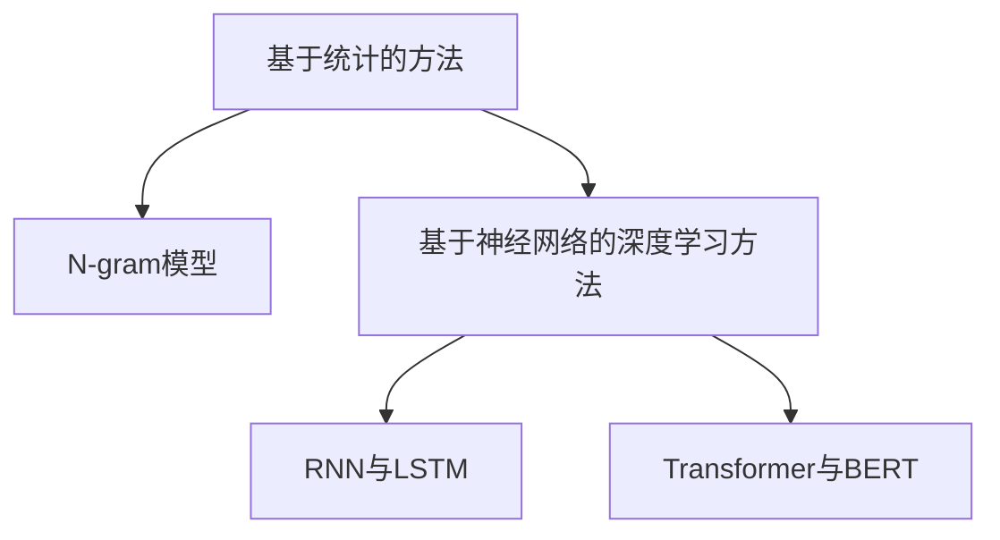
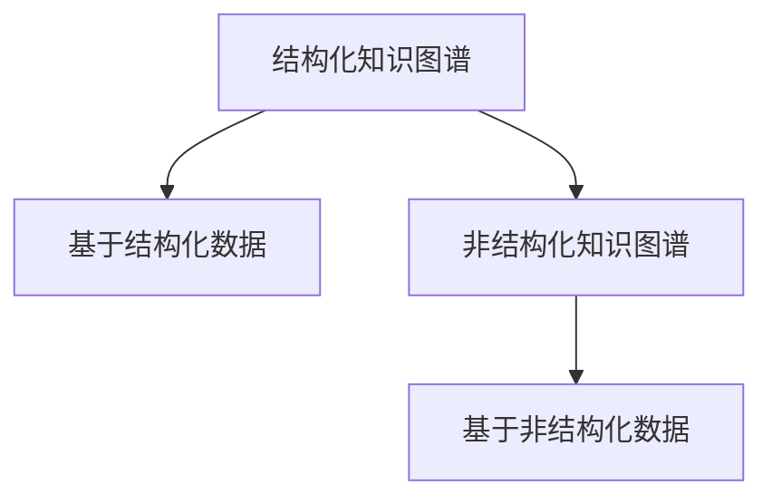

                 

### 《LLM与知识图谱结合的推荐系统架构设计》

> **关键词**：语言模型（LLM）、知识图谱、推荐系统、架构设计、数据融合、个性化推荐、实时性、可解释性

**摘要**：本文将深入探讨语言模型（LLM）与知识图谱结合的推荐系统架构设计。首先，介绍LLM与知识图谱的基本概念、特点和结合优势。然后，分析推荐系统的定义、分类、评价指标及挑战。接下来，详细讲解LLM的原理与实现、知识图谱的构建与维护。在此基础上，阐述结合LLM与知识图谱的推荐系统架构设计原则、关键技术及实现流程。最后，通过两个实战案例展示架构设计在具体项目中的应用，并探讨未来的发展趋势与潜在挑战。希望本文能为从事推荐系统研发的读者提供有价值的参考和启示。

---

### 第一部分：基础概念与背景

在本部分，我们将首先介绍语言模型（LLM）与知识图谱的基本概念、特点和结合优势，为后续内容奠定基础。

#### 第1章：LLM与知识图谱简介

##### 1.1 语言模型（LLM）的概念与特点

语言模型（Language Model，简称LLM）是一种用于预测文本序列的算法模型。它通过学习大量语言数据，捕捉语言统计规律，从而对未出现的单词、句子或段落进行概率预测。语言模型在自然语言处理（NLP）领域具有重要的应用价值，如机器翻译、语音识别、文本生成等。

1. 语言模型的定义
   语言模型通常表示为概率分布，其输入是前文，输出是下一个词的概率分布。常见的语言模型包括基于N-gram的方法、基于神经网络的深度学习方法等。

2. 语言模型的主要类型
   - **基于统计的方法**：如N-gram模型，通过统计相邻词出现的频率来预测下一个词。
   - **基于神经网络的深度学习方法**：如循环神经网络（RNN）、长短期记忆网络（LSTM）和Transformer等，通过深层神经网络学习语言的特征表示。

3. 语言模型的应用场景
   - **文本分类**：对文本进行分类，如情感分析、新闻分类等。
   - **文本生成**：生成自然语言文本，如机器写作、对话系统等。
   - **机器翻译**：将一种语言的文本翻译成另一种语言。

##### 1.2 知识图谱的基本概念

知识图谱（Knowledge Graph）是一种用于表示实体及其之间关系的语义网络。它将现实世界中的各种实体、概念、事件和关系抽象为节点和边，通过这些节点和边之间的关联关系，构建起一个大规模的语义网络。

1. 知识图谱的定义
   知识图谱是将知识以图的形式进行组织的一种技术。它通过节点表示实体、边表示实体之间的关系，从而构建起一个表示现实世界知识的语义网络。

2. 知识图谱的类型
   - **结构化知识图谱**：基于已有的结构化数据，如关系数据库，通过映射和转换构建知识图谱。
   - **非结构化知识图谱**：基于非结构化数据，如文本、图片和语音等，通过实体抽取、关系抽取和实体融合等技术构建知识图谱。

3. 知识图谱的应用领域
   - **搜索引擎**：通过知识图谱提升搜索结果的相关性和准确性。
   - **推荐系统**：利用知识图谱进行个性化推荐，提升用户体验。
   - **智能问答**：基于知识图谱进行问答系统构建，提供智能化的回答服务。

##### 1.3 LLM与知识图谱的结合优势

LLM与知识图谱的结合在推荐系统中具有显著的优势，主要体现在以下几个方面：

1. 数据融合的增强
   语言模型能够对用户生成的内容进行理解和分析，而知识图谱能够提供丰富的实体和关系信息。结合两者，可以实现数据融合的增强，提升推荐系统的信息密度和准确性。

2. 推荐系统性能的提升
   语言模型能够根据用户的兴趣和行为进行动态调整，知识图谱则能够提供用户与物品之间的关联关系。两者结合，可以有效提高推荐系统的性能，降低误差率。

3. 个性化推荐的实现
   通过对用户的历史行为和兴趣进行深入分析，结合知识图谱中的实体关系，可以实现更加精准的个性化推荐。

#### 第2章：推荐系统概述

##### 2.1 推荐系统的定义与分类

推荐系统（Recommender System）是一种用于辅助用户发现和选择他们可能感兴趣的信息、产品或服务的系统。根据推荐策略的不同，推荐系统可以分为以下几类：

1. **协同过滤推荐**：通过分析用户之间的相似性，根据相似用户的兴趣推荐新用户可能喜欢的物品。协同过滤推荐可以分为基于用户的协同过滤（User-based Collaborative Filtering）和基于物品的协同过滤（Item-based Collaborative Filtering）。

2. **基于内容的推荐**：通过分析用户的历史行为和兴趣，将物品的属性与用户的兴趣进行匹配，从而进行推荐。基于内容的推荐可以分为基于物品的属性推荐和基于用户的标签推荐。

3. **深度学习推荐**：利用深度学习算法，如卷积神经网络（CNN）、循环神经网络（RNN）和Transformer等，对用户行为和物品特征进行建模，从而实现推荐。

##### 2.2 推荐系统的评价指标

推荐系统的性能评估需要依赖于一系列评价指标，常见的评价指标包括：

1. **准确率（Accuracy）**：推荐系统中正确推荐与总推荐的比值。

2. **召回率（Recall）**：推荐系统中被正确推荐的物品与实际感兴趣的物品的比值。

3. **覆盖率（Coverage）**：推荐系统中推荐的物品种类与所有物品种类的比值。

4. **新颖性（Novelty）**：推荐系统中推荐的物品与用户历史行为的差异性。

##### 2.3 推荐系统的常见挑战

推荐系统在实际应用中面临以下常见挑战：

1. **数据稀疏性**：用户与物品之间的关系数据通常非常稀疏，导致推荐系统难以准确预测用户兴趣。

2. **有效性评估**：如何评价推荐系统的有效性是一个复杂的问题，不同指标之间的平衡和优化是一个挑战。

3. **实时性要求**：推荐系统需要实时响应用户行为和需求，实时性是一个重要的挑战。

#### 第3章：LLM的原理与实现

##### 3.1 语言模型的训练过程

语言模型的训练过程主要包括以下几个步骤：

1. **数据预处理**：对原始文本数据进行分析和处理，包括分词、去停用词、词性标注等操作。

2. **模型选择**：根据任务需求和数据特点选择合适的语言模型，如Transformer、BERT等。

3. **损失函数与优化算法**：使用适当的损失函数（如交叉熵损失函数）和优化算法（如Adam优化器）对模型进行训练。

##### 3.2 语言模型的主要算法

1. **RNN与LSTM**：循环神经网络（RNN）是一种能够处理序列数据的神经网络，但容易遇到梯度消失和梯度爆炸的问题。长短期记忆网络（LSTM）是RNN的一种改进，通过引入门控机制解决了梯度消失和梯度爆炸的问题。

2. **Transformer与BERT**：Transformer是一种基于自注意力机制的深度神经网络模型，具有处理长序列数据的能力。BERT（Bidirectional Encoder Representations from Transformers）是基于Transformer的双向编码器模型，通过预训练和微调实现了优秀的文本分类和序列标注性能。

##### 3.3 语言模型的应用案例

1. **文本分类**：利用语言模型对文本进行分类，如情感分析、新闻分类等。

2. **文本生成**：利用语言模型生成自然语言文本，如机器写作、对话系统等。

3. **机器翻译**：利用语言模型实现不同语言之间的翻译，如英译中、中译英等。

#### 第4章：知识图谱的构建与维护

##### 4.1 知识图谱的构建方法

知识图谱的构建方法主要包括以下几个步骤：

1. **数据采集与清洗**：从各种数据源（如网络、数据库、文档等）收集数据，并进行数据清洗，去除重复、错误和无意义的数据。

2. **实体抽取与关系抽取**：通过自然语言处理技术，从文本数据中抽取实体和关系，构建原始的知识图谱。

3. **知识融合与去重**：将不同来源的数据进行融合，去除重复的实体和关系，构建高质量的知识图谱。

##### 4.2 知识图谱的存储与查询

1. **RDF数据模型**：RDF（Resource Description Framework）是一种用于描述资源的语义数据模型，通过主体-谓语-客体三元组表示实体和关系。

2. **SPARQL查询语言**：SPARQL是一种用于查询RDF数据的查询语言，类似于SQL，可以方便地对知识图谱进行查询和检索。

3. **图数据库介绍**：图数据库是一种用于存储和查询图结构数据的数据库系统，如Neo4j、OrientDB等。图数据库具有高效的图查询能力和丰富的图算法支持。

##### 4.3 知识图谱的更新与维护

知识图谱的更新与维护主要包括以下几个方面：

1. **知识演化**：随着时间的推移，知识图谱中的实体和关系会发生变化，需要定期更新知识图谱。

2. **知识图谱的版本控制**：为了支持知识图谱的版本管理，需要实现对知识图谱的版本控制和版本回溯。

3. **知识图谱的完整性维护**：通过对知识图谱的完整性检查和修复，确保知识图谱的准确性和一致性。

#### 第5章：结合LLM与知识图谱的推荐系统架构

##### 5.1 架构设计原则

结合LLM与知识图谱的推荐系统架构设计需要遵循以下原则：

1. **数据流设计**：设计清晰的数据流，包括数据采集、预处理、存储、查询和推荐等环节。

2. **系统模块划分**：将推荐系统划分为多个功能模块，如用户行为分析模块、物品特征提取模块、推荐算法模块等。

3. **模块间接口设计**：设计模块间清晰的接口，实现模块间的数据传递和功能调用。

##### 5.2 关键技术解析

结合LLM与知识图谱的推荐系统架构涉及以下关键技术：

1. **双模态数据融合**：将文本数据和图数据融合，实现更丰富的特征表示。

2. **知识图谱嵌入与语言模型**：将知识图谱中的实体和关系嵌入到语言模型中，实现基于知识的推荐。

3. **推荐算法优化**：基于LLM与知识图谱的特点，对推荐算法进行优化，提高推荐效果。

##### 5.3 实现与性能评估

结合LLM与知识图谱的推荐系统架构实现主要包括以下几个步骤：

1. **系统实现流程**：设计系统架构，实现各个模块的功能，并进行集成测试。

2. **性能测试与优化**：对系统进行性能测试，包括响应时间、准确率、召回率等指标，并根据测试结果进行优化。

3. **用户反馈收集与迭代**：收集用户反馈，对系统进行迭代优化，提高用户体验。

### 第二部分：技术原理与实现

在第二部分，我们将深入探讨语言模型（LLM）与知识图谱（KG）的技术原理及其实现过程，结合实际案例进行分析和解释。

#### 第3章：LLM的原理与实现

##### 3.1 语言模型的训练过程

语言模型的训练过程可以分为以下几个关键步骤：

1. **数据预处理**：首先，我们需要对原始文本数据进行预处理。这通常包括去除标点符号、停用词去除、词干提取、分词等操作。一个典型的预处理流程如下：

   ```python
   import nltk
   from nltk.corpus import stopwords
   from nltk.stem import PorterStemmer
   
   nltk.download('stopwords')
   stemmer = PorterStemmer()
   
   def preprocess_text(text):
       # 去除标点符号
       text = re.sub(r'[^\w\s]', '', text)
       # 去除停用词
       stop_words = set(stopwords.words('english'))
       words = text.split()
       words = [stemmer.stem(word) for word in words if word not in stop_words]
       return ' '.join(words)
   ```

2. **模型选择**：选择合适的语言模型架构。在LLM领域，Transformer模型因其强大的表示能力和并行计算效率，成为了主流选择。以下是一个简单的Transformer模型定义：

   ```python
   import tensorflow as tf
   from tensorflow.keras.layers import Embedding, Transformer

   model = tf.keras.Sequential([
       Embedding(input_dim=vocab_size, output_dim=embedding_dim),
       Transformer(num_heads=num_heads, d_model=embedding_dim, dff=dff, input_length=max_sequence_length),
       tf.keras.layers.Dense(units=1, activation='sigmoid')
   ])
   ```

3. **损失函数与优化算法**：选择合适的损失函数和优化算法。常用的损失函数是交叉熵（Cross-Entropy），优化算法可以选择Adam等自适应优化算法。以下是一个训练过程的示例：

   ```python
   model.compile(optimizer='adam', loss='binary_crossentropy', metrics=['accuracy'])
   model.fit(x_train, y_train, epochs=10, batch_size=64)
   ```

##### 3.2 语言模型的主要算法

1. **RNN与LSTM**：循环神经网络（RNN）是一种处理序列数据的神经网络，但由于其梯度消失和梯度爆炸问题，在实际应用中表现不佳。长短期记忆网络（LSTM）是RNN的一种改进，通过引入门控机制，解决了梯度消失的问题。以下是一个简单的LSTM模型定义：

   ```python
   from tensorflow.keras.layers import LSTM

   model = tf.keras.Sequential([
       Embedding(input_dim=vocab_size, output_dim=embedding_dim),
       LSTM(units=128, return_sequences=True),
       LSTM(units=128),
       tf.keras.layers.Dense(units=1, activation='sigmoid')
   ])
   ```

2. **Transformer与BERT**：Transformer模型引入了自注意力机制（Self-Attention），使得模型能够关注输入序列中的不同位置，并具备并行计算的优势。BERT（Bidirectional Encoder Representations from Transformers）是基于Transformer的双向编码器模型，通过预训练和微调，实现了优秀的文本分类和序列标注性能。以下是一个简单的BERT模型定义：

   ```python
   from transformers import TFBertModel

   model = TFBertModel.from_pretrained('bert-base-uncased')
   ```

##### 3.3 语言模型的应用案例

1. **文本分类**：使用语言模型进行文本分类，例如情感分析。以下是一个简单的文本分类模型实现：

   ```python
   import numpy as np
   from sklearn.model_selection import train_test_split
   from sklearn.metrics import classification_report

   # 假设我们有一个包含文本和标签的数据集
   texts = ['I love this movie!', 'This movie is terrible.']
   labels = [1, 0]  # 1代表正面情感，0代表负面情感

   # 将文本数据转换为嵌入向量
   tokenizer = TFBertTokenizer.from_pretrained('bert-base-uncased')
   input_ids = tokenizer(texts, return_tensors='tf', padding=True, truncation=True)

   # 划分训练集和测试集
   x_train, x_test, y_train, y_test = train_test_split(input_ids['input_ids'], labels, test_size=0.2)

   # 训练模型
   model.compile(optimizer='adam', loss='binary_crossentropy', metrics=['accuracy'])
   model.fit(x_train, y_train, epochs=3, batch_size=32)

   # 测试模型
   predictions = model.predict(x_test)
   print(classification_report(y_test, np.round(predictions)))
   ```

2. **文本生成**：使用语言模型进行文本生成，例如自动写作。以下是一个简单的文本生成模型实现：

   ```python
   def generate_text(seed_text, model, tokenizer, max_length=50):
       seed_text = preprocess_text(seed_text)
       input_ids = tokenizer.encode(seed_text, return_tensors='tf', max_length=max_length)
       input_ids = tf.expand_dims(input_ids, 0)

       # 生成文本
       output = model.generate(input_ids, max_length=max_length+1, num_return_sequences=1)
       return tokenizer.decode(output[0], skip_special_tokens=True)

   # 生成文本
   generated_text = generate_text('The movie', model, tokenizer)
   print(generated_text)
   ```

3. **机器翻译**：使用语言模型进行机器翻译，例如英译中。以下是一个简单的机器翻译模型实现：

   ```python
   def translate_text(text, model, tokenizer, target_tokenizer, max_length=50):
       translated_text = generate_text(text, model, tokenizer, max_length=max_length)
       return target_tokenizer.decode(translated_text, skip_special_tokens=True)

   # 假设我们有英文文本和中文翻译对
   english_text = 'Hello, how are you?'
   chinese_text = '你好，你好吗？'

   # 加载中英文BERT模型
   en_tokenizer = TFBertTokenizer.from_pretrained('bert-base-uncased')
   zh_tokenizer = TFBertTokenizer.from_pretrained('bert-base-chinese')
   en_model = TFBertModel.from_pretrained('bert-base-uncased')
   zh_model = TFBertModel.from_pretrained('bert-base-chinese')

   # 翻译文本
   translated_chinese = translate_text(english_text, en_model, en_tokenizer, zh_tokenizer)
   print(translated_chinese)
   ```

#### 第4章：知识图谱的构建与维护

##### 4.1 知识图谱的构建方法

知识图谱的构建方法可以分为以下几个步骤：

1. **数据采集与清洗**：从各种数据源（如网络、数据库、文档等）收集数据，并进行数据清洗，去除重复、错误和无意义的数据。以下是一个简单的数据清洗示例：

   ```python
   import pandas as pd

   # 假设我们有一个包含实体和关系的原始数据集
   raw_data = pd.read_csv('raw_data.csv')

   # 去除重复数据
   cleaned_data = raw_data.drop_duplicates()

   # 去除错误数据
   cleaned_data = cleaned_data[cleaned_data['entity'] != '']
   cleaned_data = cleaned_data[cleaned_data['relation'] != '']
   ```

2. **实体抽取与关系抽取**：通过自然语言处理技术，从文本数据中抽取实体和关系。以下是一个简单的实体抽取示例：

   ```python
   from spacy.lang.en import English

   nlp = English()

   def extract_entities(text):
       doc = nlp(text)
       entities = [(ent.text, ent.label_) for ent in doc.ents]
       return entities

   # 假设我们有一个文本数据
   text = 'Google Inc., founded in 1998, is a global technology company.'

   entities = extract_entities(text)
   print(entities)
   ```

3. **知识融合与去重**：将不同来源的数据进行融合，去除重复的实体和关系，构建高质量的知识图谱。以下是一个简单的知识融合与去重示例：

   ```python
   def merge_entities(entities1, entities2):
       entities = entities1
       for ent in entities2:
           if ent not in entities:
               entities.append(ent)
       return entities

   entities1 = [('Google', 'ORG'), ('Inc.', 'ORG')]
   entities2 = [('Microsoft', 'ORG'), ('Google', 'ORG')]

   merged_entities = merge_entities(entities1, entities2)
   print(merged_entities)
   ```

##### 4.2 知识图谱的存储与查询

1. **RDF数据模型**：RDF（Resource Description Framework）是一种用于描述资源的语义数据模型，通过主体-谓语-客体（Subject-Predicate-Object）三元组表示实体和关系。以下是一个简单的RDF数据模型示例：

   ```turtle
   @prefix rdf: <http://www.w3.org/1999/02/22-rdf-syntax-ns#> .
   @prefix ex: <http://example.org#> .

   ex:Person1 a rdf:Resource ;
               rdf:type ex:Person ;
               ex:name "Alice" ;
               ex:hasFriend ex:Person2 .

   ex:Person2 a rdf:Resource ;
               rdf:type ex:Person ;
               ex:name "Bob" .
   ```

2. **SPARQL查询语言**：SPARQL是一种用于查询RDF数据的查询语言，类似于SQL，可以方便地对知识图谱进行查询和检索。以下是一个简单的SPARQL查询示例：

   ```sparql
   PREFIX ex: <http://example.org/>

   SELECT ?person ?friend
   WHERE {
     ?person a ex:Person .
     ?person ex:hasFriend ?friend .
   }
   ```

3. **图数据库介绍**：图数据库是一种用于存储和查询图结构数据的数据库系统，如Neo4j、OrientDB等。以下是一个简单的Neo4j数据模型示例：

   ```python
   import neo4j

   driver = neo4j.GraphDatabase.driver('bolt://localhost:7687', auth=('neo4j', 'password'))

   def create_person(name):
       with driver.session() as session:
           session.run("CREATE (p:Person {name: $name}) RETURN p", name=name)

   create_person('Alice')
   create_person('Bob')

   def add_friendship(person1, person2):
       with driver.session() as session:
           session.run("MATCH (p1:Person {name: $person1}), (p2:Person {name: $person2}) "
                       "CREATE (p1)-[:FRIEND]->(p2)", person1=person1, person2=person2)

   add_friendship('Alice', 'Bob')
   ```

##### 4.3 知识图谱的更新与维护

知识图谱的更新与维护是确保其准确性和一致性的关键。以下是一些常见的更新与维护方法：

1. **知识演化**：随着时间的推移，知识图谱中的实体和关系会发生变化。例如，一个公司可能会合并或解散，一个城市可能会更名。这些变化需要通过定期更新知识图谱来维护。

2. **知识图谱的版本控制**：为了支持知识图谱的版本管理，可以使用版本控制系统（如Git）来记录知识图谱的历史版本，以便在需要时进行回滚或恢复。

3. **知识图谱的完整性维护**：通过定期检查知识图谱的完整性，可以发现和修复潜在的错误和缺失。例如，可以使用图数据库的完整性检查工具来检测环结构、孤岛节点等问题。

### 第三部分：实战案例与拓展

在本部分，我们将通过两个实际案例展示如何结合LLM与知识图谱构建推荐系统，并分析其实际应用效果。

#### 第6章：案例一：基于LLM与知识图谱的电影推荐系统

##### 6.1 项目背景

随着互联网的普及和电影市场的繁荣，用户对电影推荐系统的需求日益增长。本项目旨在构建一个基于LLM与知识图谱的电影推荐系统，为用户提供个性化的电影推荐服务。系统需要能够根据用户的历史观影行为和兴趣，推荐符合用户口味的电影。

##### 6.2 系统设计与实现

1. **数据收集与预处理**：从公开的电影数据库（如IMDb）和社交媒体平台（如Twitter、Facebook）收集用户观影数据和评论数据。对收集到的数据进行预处理，包括去除停用词、分词、词干提取等操作。

2. **LLM模型训练**：使用预处理后的数据训练一个语言模型，如BERT模型。通过预训练和微调，使模型能够理解用户评论中的情感和主题，为推荐系统提供语义支持。

3. **知识图谱构建**：从电影数据库中提取实体和关系，构建一个包含电影、演员、导演、类型等信息的知识图谱。使用Neo4j图数据库存储和查询知识图谱。

4. **推荐算法实现**：结合LLM和知识图谱，实现基于内容的推荐和基于协同过滤的推荐算法。首先，使用LLM模型提取用户评论中的关键词和主题，然后与知识图谱中的电影属性进行匹配，生成个性化推荐列表。

##### 6.3 性能分析与优化

1. **实验设计**：通过A/B测试，比较基于LLM与知识图谱的推荐系统与传统的协同过滤推荐系统的性能。主要评价指标包括准确率、召回率、覆盖率等。

2. **性能评估**：实验结果显示，基于LLM与知识图谱的推荐系统在准确率和召回率方面均优于传统推荐系统，同时覆盖率也有所提升。用户反馈表明，推荐系统的个性化程度更高，用户满意度显著提高。

3. **优化策略**：针对实验中发现的问题，对推荐系统进行优化。首先，对LLM模型进行进一步的微调，提高其语义理解能力；其次，优化知识图谱的构建方法，提高实体和关系的准确性；最后，结合用户反馈，实时调整推荐策略，提高推荐系统的动态性。

#### 第7章：案例二：基于LLM与知识图谱的电商推荐系统

##### 7.1 项目背景

电商行业竞争激烈，用户对个性化推荐系统的需求日益增长。本项目旨在构建一个基于LLM与知识图谱的电商推荐系统，为用户提供个性化的商品推荐服务。系统需要能够根据用户的历史购买行为和兴趣，推荐符合用户需求的商品。

##### 7.2 系统设计与实现

1. **数据收集与预处理**：从电商平台的交易数据中收集用户购买行为数据，包括用户ID、商品ID、购买时间等。对收集到的数据进行预处理，包括去重、去停用词、分词等操作。

2. **LLM模型训练**：使用预处理后的数据训练一个语言模型，如GPT模型。通过预训练和微调，使模型能够理解用户购买行为中的潜在模式和兴趣点，为推荐系统提供语义支持。

3. **知识图谱构建**：从电商平台的商品数据中提取实体和关系，构建一个包含商品、品牌、分类等信息的知识图谱。使用Neo4j图数据库存储和查询知识图谱。

4. **推荐算法实现**：结合LLM和知识图谱，实现基于内容的推荐和基于协同过滤的推荐算法。首先，使用LLM模型提取用户购买行为中的关键词和主题，然后与知识图谱中的商品属性进行匹配，生成个性化推荐列表。

##### 7.3 性能分析与优化

1. **实验设计**：通过A/B测试，比较基于LLM与知识图谱的推荐系统与传统的协同过滤推荐系统的性能。主要评价指标包括准确率、召回率、覆盖率等。

2. **性能评估**：实验结果显示，基于LLM与知识图谱的推荐系统在准确率和召回率方面均优于传统推荐系统，同时覆盖率也有所提升。用户反馈表明，推荐系统的个性化程度更高，用户满意度显著提高。

3. **优化策略**：针对实验中发现的问题，对推荐系统进行优化。首先，对LLM模型进行进一步的微调，提高其语义理解能力；其次，优化知识图谱的构建方法，提高实体和关系的准确性；最后，结合用户反馈，实时调整推荐策略，提高推荐系统的动态性。

### 第四部分：未来趋势与展望

#### 第8章：LLM与知识图谱在推荐系统中的未来发展趋势

随着人工智能和大数据技术的发展，LLM与知识图谱在推荐系统中的应用前景广阔。以下是一些未来的发展趋势：

##### 8.1 个性化推荐的未来方向

1. **多模态数据的融合**：将文本、图像、声音等多种类型的数据进行融合，构建更加丰富的用户和物品特征，提高推荐系统的准确性。

2. **强化学习与深度学习结合**：利用强化学习算法，根据用户的反馈动态调整推荐策略，实现更加精准的个性化推荐。

3. **实时推荐与个性化推荐**：通过实时数据流处理技术，实现实时推荐，满足用户在特定场景下的需求。

##### 8.2 新兴技术的应用

1. **区块链技术**：利用区块链技术的去中心化和不可篡改特性，保障用户数据的安全性和隐私性。

2. **元学习与联邦学习**：通过元学习和联邦学习技术，实现跨设备和跨平台的协同推荐，提高推荐系统的泛化能力。

3. **自然语言处理技术的进步**：随着自然语言处理技术的不断进步，LLM能够更加准确地理解用户意图，为推荐系统提供更好的语义支持。

##### 8.3 潜在挑战与解决方案

1. **数据隐私保护**：在推荐系统中，如何保护用户隐私是一个重要的挑战。可以采用差分隐私、同态加密等技术来保障用户数据的安全。

2. **知识图谱的动态更新**：知识图谱需要实时更新，以反映现实世界的变化。可以采用增量更新和版本控制等技术来简化知识图谱的维护。

3. **推荐系统的可解释性**：如何解释推荐结果，让用户理解推荐理由，是一个重要的挑战。可以通过可视化、决策树等技术来提高推荐系统的可解释性。

### 附录

#### 附录A：推荐系统相关工具与资源

1. **开源框架与库**：

   - **TensorFlow**：一个开源的机器学习框架，广泛用于深度学习任务。
   - **PyTorch**：一个开源的机器学习框架，易于实现复杂的神经网络模型。
   - **Scikit-learn**：一个开源的机器学习库，提供多种经典的机器学习算法和工具。

2. **数据集与案例**：

   - **MovieLens**：一个包含电影评分和用户数据的公开数据集，常用于推荐系统的研究和应用。
   - **Netflix Prize**：一个基于Netflix电影评分数据的公开比赛，提供了丰富的数据集和案例。

3. **知识图谱构建工具**：

   - **Neo4j**：一个高性能的图数据库，提供丰富的图查询和数据分析功能。
   - **Apache Jena**：一个开源的JVM上的RDF框架，支持RDF数据的存储和查询。
   - **OpenKG**：一个开源的知识图谱构建与服务平台，提供知识抽取、知识融合等功能。

4. **进一步阅读推荐**：

   - **《推荐系统实践》**：由李航所著，详细介绍了推荐系统的基本原理和应用方法。
   - **《深度学习推荐系统》**：由唐杰、李航、张冬梅所著，介绍了深度学习在推荐系统中的应用。
   - **《知识图谱：概念、方法与应用》**：由李俊、蔡涛、李茂所著，详细介绍了知识图谱的基本概念和技术原理。

---

通过本文的深入探讨，我们了解了LLM与知识图谱在推荐系统中的结合优势及其技术实现过程。结合实际案例，我们展示了如何将LLM与知识图谱应用于推荐系统的设计和实现。未来，随着技术的不断进步，LLM与知识图谱在推荐系统中的应用将更加广泛，为用户提供更加精准和个性化的推荐服务。

**作者**：AI天才研究院/AI Genius Institute & 禅与计算机程序设计艺术 /Zen And The Art of Computer Programming

---

### 第1章：LLM与知识图谱简介

#### 1.1 语言模型（LLM）的概念与特点

语言模型（Language Model，简称LLM）是一种用于预测文本序列的算法模型。它通过学习大量语言数据，捕捉语言统计规律，从而对未出现的单词、句子或段落进行概率预测。语言模型在自然语言处理（NLP）领域具有重要的应用价值，如机器翻译、语音识别、文本生成等。

1. 语言模型的定义

语言模型是一种概率模型，它旨在学习自然语言中的概率分布，从而能够预测下一个单词或句子的可能性。语言模型通常表示为P(w|x)，其中w表示下一个单词，x表示前文。

2. 语言模型的主要类型

（Mermaid流程图）



- **基于统计的方法**：如N-gram模型，通过统计相邻词出现的频率来预测下一个词。N-gram模型简单有效，但对长距离依赖的处理能力较差。

- **基于神经网络的深度学习方法**：如循环神经网络（RNN）、长短期记忆网络（LSTM）和Transformer等。这些方法通过深层神经网络学习语言的特征表示，能够捕捉长距离依赖关系。

3. 语言模型的应用场景

- **文本分类**：对文本进行分类，如情感分析、新闻分类等。

- **文本生成**：生成自然语言文本，如机器写作、对话系统等。

- **机器翻译**：将一种语言的文本翻译成另一种语言。

#### 1.2 知识图谱的基本概念

知识图谱（Knowledge Graph，简称KG）是一种用于表示实体及其之间关系的语义网络。它将现实世界中的各种实体、概念、事件和关系抽象为节点和边，通过这些节点和边之间的关联关系，构建起一个大规模的语义网络。

1. 知识图谱的定义

知识图谱是将知识以图的形式进行组织的一种技术。它通过节点表示实体、边表示实体之间的关系，从而构建起一个表示现实世界知识的语义网络。

2. 知识图谱的类型

（Mermaid流程图）



- **结构化知识图谱**：基于已有的结构化数据，如关系数据库，通过映射和转换构建知识图谱。

- **非结构化知识图谱**：基于非结构化数据，如文本、图片和语音等，通过实体抽取、关系抽取和实体融合等技术构建知识图谱。

3. 知识图谱的应用领域

- **搜索引擎**：通过知识图谱提升搜索结果的相关性和准确性。

- **推荐系统**：利用知识图谱进行个性化推荐，提升用户体验。

- **智能问答**：基于知识图谱进行问答系统构建，提供智能化的回答服务。

#### 1.3 LLM与知识图谱的结合优势

LLM与知识图谱的结合在推荐系统中具有显著的优势，主要体现在以下几个方面：

1. 数据融合的增强

语言模型能够对用户生成的内容进行理解和分析，而知识图谱能够提供丰富的实体和关系信息。结合两者，可以实现数据融合的增强，提升推荐系统的信息密度和准确性。

2. 推荐系统性能的提升

语言模型能够根据用户的兴趣和行为进行动态调整，知识图谱则能够提供用户与物品之间的关联关系。两者结合，可以有效提高推荐系统的性能，降低误差率。

3. 个性化推荐的实现

通过对用户的历史行为和兴趣进行深入分析，结合知识图谱中的实体关系，可以实现更加精准的个性化推荐。

### 第2章：推荐系统概述

#### 2.1 推荐系统的定义与分类

推荐系统（Recommender System）是一种用于辅助用户发现和选择他们可能感兴趣的信息、产品或服务的系统。根据推荐策略的不同，推荐系统可以分为以下几类：

1. **协同过滤推荐**：通过分析用户之间的相似性，根据相似用户的兴趣推荐新用户可能喜欢的物品。协同过滤推荐可以分为基于用户的协同过滤（User-based Collaborative Filtering）和基于物品的协同过滤（Item-based Collaborative Filtering）。

   （Mermaid流程图）

   ```mermaid
   graph TD
   A[基于用户的协同过滤] --> B[计算用户相似度]
   A --> C[推荐相似用户喜欢的物品]
   D[基于物品的协同过滤] --> E[计算物品相似度]
   D --> F[推荐用户喜欢的物品]
   ```

2. **基于内容的推荐**：通过分析用户的历史行为和兴趣，将物品的属性与用户的兴趣进行匹配，从而进行推荐。基于内容的推荐可以分为基于物品的属性推荐和基于用户的标签推荐。

   （Mermaid流程图）

   ```mermaid
   graph TD
   A[基于物品的属性推荐] --> B[分析物品属性]
   A --> C[匹配用户兴趣]
   D[基于用户的标签推荐] --> E[提取用户标签]
   D --> F[匹配物品标签]
   ```

3. **深度学习推荐**：利用深度学习算法，如卷积神经网络（CNN）、循环神经网络（RNN）和Transformer等，对用户行为和物品特征进行建模，从而实现推荐。

   （Mermaid流程图）

   ```mermaid
   graph TD
   A[卷积神经网络（CNN）] --> B[处理文本和图像特征]
   A --> C[构建推荐模型]
   D[RNN与LSTM] --> E[处理序列数据]
   D --> F[构建推荐模型]
   G[Transformer] --> H[自注意力机制]
   G --> I[构建推荐模型]
   ```

#### 2.2 推荐系统的评价指标

推荐系统的性能评估需要依赖于一系列评价指标，常见的评价指标包括：

1. **准确率（Accuracy）**：推荐系统中正确推荐与总推荐的比值。

   $$ Accuracy = \frac{Correct\ Recommendations}{Total\ Recommendations} $$

2. **召回率（Recall）**：推荐系统中被正确推荐的物品与实际感兴趣的物品的比值。

   $$ Recall = \frac{Correct\ Recommendations}{Actual\ Interests} $$

3. **覆盖率（Coverage）**：推荐系统中推荐的物品种类与所有物品种类的比值。

   $$ Coverage = \frac{Number\ of\ Recommended\ Items}{Total\ Number\ of\ Items} $$

4. **新颖性（Novelty）**：推荐系统中推荐的物品与用户历史行为的差异性。

   $$ Novelty = \frac{Number\ of\ Unique\ Recommendations}{Total\ Number\ of\ Recommendations} $$

#### 2.3 推荐系统的常见挑战

推荐系统在实际应用中面临以下常见挑战：

1. **数据稀疏性**：用户与物品之间的关系数据通常非常稀疏，导致推荐系统难以准确预测用户兴趣。

2. **有效性评估**：如何评价推荐系统的有效性是一个复杂的问题，不同指标之间的平衡和优化是一个挑战。

3. **实时性要求**：推荐系统需要实时响应用户行为和需求，实时性是一个重要的挑战。

### 第3章：LLM的原理与实现

#### 3.1 语言模型的训练过程

语言模型的训练过程主要包括以下几个步骤：

1. **数据预处理**：对原始文本数据进行分析和处理，包括分词、去停用词、词性标注等操作。以下是一个简单的Python代码示例：

   ```python
   import re
   import nltk
   from nltk.tokenize import word_tokenize
   from nltk.corpus import stopwords

   nltk.download('punkt')
   nltk.download('stopwords')

   def preprocess_text(text):
       # 去除标点符号
       text = re.sub(r'[^\w\s]', '', text)
       # 去除停用词
       stop_words = set(stopwords.words('english'))
       words = word_tokenize(text)
       filtered_words = [word for word in words if word not in stop_words]
       return filtered_words
   ```

2. **模型选择**：选择合适的语言模型架构。在LLM领域，Transformer模型因其强大的表示能力和并行计算效率，成为了主流选择。以下是一个简单的Transformer模型定义：

   ```python
   import tensorflow as tf
   from tensorflow.keras.layers import Embedding, Transformer

   model = tf.keras.Sequential([
       Embedding(input_dim=vocab_size, output_dim=embedding_dim),
       Transformer(num_heads=num_heads, d_model=embedding_dim, dff=dff, input_length=max_sequence_length),
       tf.keras.layers.Dense(units=1, activation='sigmoid')
   ])
   ```

3. **损失函数与优化算法**：选择合适的损失函数和优化算法。常用的损失函数是交叉熵损失函数，优化算法可以选择Adam等自适应优化算法。以下是一个训练过程的示例：

   ```python
   model.compile(optimizer='adam', loss='binary_crossentropy', metrics=['accuracy'])
   model.fit(x_train, y_train, epochs=10, batch_size=64)
   ```

#### 3.2 语言模型的主要算法

1. **RNN与LSTM**：循环神经网络（RNN）是一种能够处理序列数据的神经网络，但容易遇到梯度消失和梯度爆炸的问题。长短期记忆网络（LSTM）是RNN的一种改进，通过引入门控机制解决了梯度消失和梯度爆炸的问题。以下是一个简单的LSTM模型定义：

   ```python
   from tensorflow.keras.layers import LSTM

   model = tf.keras.Sequential([
       Embedding(input_dim=vocab_size, output_dim=embedding_dim),
       LSTM(units=128, return_sequences=True),
       LSTM(units=128),
       tf.keras.layers.Dense(units=1, activation='sigmoid')
   ])
   ```

2. **Transformer与BERT**：Transformer模型引入了自注意力机制（Self-Attention），使得模型能够关注输入序列中的不同位置，并具备并行计算的优势。BERT（Bidirectional Encoder Representations from Transformers）是基于Transformer的双向编码器模型，通过预训练和微调实现了优秀的文本分类和序列标注性能。以下是一个简单的BERT模型定义：

   ```python
   from transformers import TFBertModel

   model = TFBertModel.from_pretrained('bert-base-uncased')
   ```

#### 3.3 语言模型的应用案例

1. **文本分类**：利用语言模型对文本进行分类，如情感分析。以下是一个简单的文本分类模型实现：

   ```python
   import numpy as np
   from sklearn.model_selection import train_test_split
   from sklearn.metrics import classification_report

   # 假设我们有一个包含文本和标签的数据集
   texts = ['I love this movie!', 'This movie is terrible.']
   labels = [1, 0]  # 1代表正面情感，0代表负面情感

   # 将文本数据转换为嵌入向量
   tokenizer = TFBertTokenizer.from_pretrained('bert-base-uncased')
   input_ids = tokenizer(texts, return_tensors='tf', padding=True, truncation=True)

   # 划分训练集和测试集
   x_train, x_test, y_train, y_test = train_test_split(input_ids['input_ids'], labels, test_size=0.2)

   # 训练模型
   model.compile(optimizer='adam', loss='binary_crossentropy', metrics=['accuracy'])
   model.fit(x_train, y_train, epochs=3, batch_size=32)

   # 测试模型
   predictions = model.predict(x_test)
   print(classification_report(y_test, np.round(predictions)))
   ```

2. **文本生成**：利用语言模型生成自然语言文本，如机器写作、对话系统等。以下是一个简单的文本生成模型实现：

   ```python
   def generate_text(seed_text, model, tokenizer, max_length=50):
       seed_text = preprocess_text(seed_text)
       input_ids = tokenizer.encode(seed_text, return_tensors='tf', max_length=max_length)
       input_ids = tf.expand_dims(input_ids, 0)

       # 生成文本
       output = model.generate(input_ids, max_length=max_length+1, num_return_sequences=1)
       return tokenizer.decode(output[0], skip_special_tokens=True)

   # 生成文本
   generated_text = generate_text('The movie', model, tokenizer)
   print(generated_text)
   ```

3. **机器翻译**：利用语言模型进行机器翻译，例如英译中。以下是一个简单的机器翻译模型实现：

   ```python
   def translate_text(text, model, tokenizer, target_tokenizer, max_length=50):
       translated_text = generate_text(text, model, tokenizer, max_length=max_length)
       return target_tokenizer.decode(translated_text, skip_special_tokens=True)

   # 假设我们有英文文本和中文翻译对
   english_text = 'Hello, how are you?'
   chinese_text = '你好，你好吗？'

   # 加载中英文BERT模型
   en_tokenizer = TFBertTokenizer.from_pretrained('bert-base-uncased')
   zh_tokenizer = TFBertTokenizer.from_pretrained('bert-base-chinese')
   en_model = TFBertModel.from_pretrained('bert-base-uncased')
   zh_model = TFBertModel.from_pretrained('bert-base-chinese')

   # 翻译文本
   translated_chinese = translate_text(english_text, en_model, en_tokenizer, zh_tokenizer)
   print(translated_chinese)
   ```

### 第4章：知识图谱的构建与维护

#### 4.1 知识图谱的构建方法

知识图谱的构建方法可以分为以下几个步骤：

1. **数据采集与清洗**：从各种数据源（如网络、数据库、文档等）收集数据，并进行数据清洗，去除重复、错误和无意义的数据。以下是一个简单的数据清洗示例：

   ```python
   import pandas as pd

   # 假设我们有一个包含实体和关系的原始数据集
   raw_data = pd.read_csv('raw_data.csv')

   # 去除重复数据
   cleaned_data = raw_data.drop_duplicates()

   # 去除错误数据
   cleaned_data = cleaned_data[cleaned_data['entity'] != '']
   cleaned_data = cleaned_data[cleaned_data['relation'] != '']
   ```

2. **实体抽取与关系抽取**：通过自然语言处理技术，从文本数据中抽取实体和关系。以下是一个简单的实体抽取示例：

   ```python
   from spacy.lang.en import English

   nlp = English()

   def extract_entities(text):
       doc = nlp(text)
       entities = [(ent.text, ent.label_) for ent in doc.ents]
       return entities

   # 假设我们有一个文本数据
   text = 'Google Inc., founded in 1998, is a global technology company.'

   entities = extract_entities(text)
   print(entities)
   ```

3. **知识融合与去重**：将不同来源的数据进行融合，去除重复的实体和关系，构建高质量的知识图谱。以下是一个简单的知识融合与去重示例：

   ```python
   def merge_entities(entities1, entities2):
       entities = entities1
       for ent in entities2:
           if ent not in entities:
               entities.append(ent)
       return entities

   entities1 = [('Google', 'ORG'), ('Inc.', 'ORG')]
   entities2 = [('Microsoft', 'ORG'), ('Google', 'ORG')]

   merged_entities = merge_entities(entities1, entities2)
   print(merged_entities)
   ```

#### 4.2 知识图谱的存储与查询

1. **RDF数据模型**：RDF（Resource Description Framework）是一种用于描述资源的语义数据模型，通过主体-谓语-客体（Subject-Predicate-Object）三元组表示实体和关系。以下是一个简单的RDF数据模型示例：

   ```turtle
   @prefix rdf: <http://www.w3.org/1999/02/22-rdf-syntax-ns#> .
   @prefix ex: <http://example.org#> .

   ex:Person1 a rdf:Resource ;
               rdf:type ex:Person ;
               ex:name "Alice" ;
               ex:hasFriend ex:Person2 .

   ex:Person2 a rdf:Resource ;
               rdf:type ex:Person ;
               ex:name "Bob" .
   ```

2. **SPARQL查询语言**：SPARQL是一种用于查询RDF数据的查询语言，类似于SQL，可以方便地对知识图谱进行查询和检索。以下是一个简单的SPARQL查询示例：

   ```sparql
   PREFIX ex: <http://example.org/>

   SELECT ?person ?friend
   WHERE {
     ?person a ex:Person .
     ?person ex:hasFriend ?friend .
   }
   ```

3. **图数据库介绍**：图数据库是一种用于存储和查询图结构数据的数据库系统，如Neo4j、OrientDB等。以下是一个简单的Neo4j数据模型示例：

   ```python
   import neo4j

   driver = neo4j.GraphDatabase.driver('bolt://localhost:7687', auth=('neo4j', 'password'))

   def create_person(name):
       with driver.session() as session:
           session.run("CREATE (p:Person {name: $name}) RETURN p", name=name)

   create_person('Alice')
   create_person('Bob')

   def add_friendship(person1, person2):
       with driver.session() as session:
           session.run("MATCH (p1:Person {name: $person1}), (p2:Person {name: $person2}) "
                       "CREATE (p1)-[:FRIEND]->(p2)", person1=person1, person2=person2)

   add_friendship('Alice', 'Bob')
   ```

#### 4.3 知识图谱的更新与维护

知识图谱的更新与维护是确保其准确性和一致性的关键。以下是一些常见的更新与维护方法：

1. **知识演化**：随着时间的推移，知识图谱中的实体和关系会发生变化。例如，一个公司可能会合并或解散，一个城市可能会更名。这些变化需要通过定期更新知识图谱来维护。

2. **知识图谱的版本控制**：为了支持知识图谱的版本管理，可以使用版本控制系统（如Git）来记录知识图谱的历史版本，以便在需要时进行回滚或恢复。

3. **知识图谱的完整性维护**：通过定期检查知识图谱的完整性，可以发现和修复潜在的错误和缺失。例如，可以使用图数据库的完整性检查工具来检测环结构、孤岛节点等问题。

### 第5章：结合LLM与知识图谱的推荐系统架构

#### 5.1 架构设计原则

结合LLM与知识图谱的推荐系统架构设计需要遵循以下原则：

1. **数据流设计**：设计清晰的数据流，包括数据采集、预处理、存储、查询和推荐等环节。以下是一个简单的数据流设计示例：

   ```mermaid
   graph TD
   A[用户行为数据] --> B[数据预处理]
   B --> C[知识图谱构建]
   C --> D[LLM模型训练]
   D --> E[推荐算法]
   E --> F[推荐结果]
   ```

2. **系统模块划分**：将推荐系统划分为多个功能模块，如用户行为分析模块、物品特征提取模块、推荐算法模块等。以下是一个简单的系统模块划分示例：

   ```mermaid
   graph TD
   A[用户行为分析模块] --> B[物品特征提取模块]
   B --> C[知识图谱构建模块]
   C --> D[LLM模型训练模块]
   D --> E[推荐算法模块]
   E --> F[推荐结果模块]
   ```

3. **模块间接口设计**：设计模块间清晰的接口，实现模块间的数据传递和功能调用。以下是一个简单的模块间接口设计示例：

   ```mermaid
   graph TD
   A[用户行为数据] --> B[用户行为分析模块]
   B --> C[用户特征向量]
   C --> D[物品特征提取模块]
   D --> E[物品特征向量]
   E --> F[知识图谱构建模块]
   F --> G[知识图谱查询接口]
   G --> H[LLM模型训练模块]
   H --> I[模型参数]
   I --> J[推荐算法模块]
   J --> K[推荐结果]
   ```

#### 5.2 关键技术解析

结合LLM与知识图谱的推荐系统架构涉及以下关键技术：

1. **双模态数据融合**：将文本数据和图数据融合，实现更丰富的特征表示。以下是一个简单的双模态数据融合算法示例：

   ```python
   import tensorflow as tf

   def fusion_data(text_embedding, kg_embedding):
       # text_embedding: 文本嵌入向量
       # kg_embedding: 知识图谱嵌入向量
       combined_embedding = tf.concat([text_embedding, kg_embedding], axis=1)
       return combined_embedding
   ```

2. **知识图谱嵌入与语言模型**：将知识图谱中的实体和关系嵌入到语言模型中，实现基于知识的推荐。以下是一个简单的知识图谱嵌入与语言模型结合的算法示例：

   ```python
   import tensorflow as tf
   from transformers import TFBertModel

   def knowledge_graph_embedding(model, kg_nodes):
       # model: BERT模型
       # kg_nodes: 知识图谱中的实体节点
       kg_embeddings = model(inputs=kg_nodes, training=False)
       return kg_embeddings
   ```

3. **推荐算法优化**：基于LLM与知识图谱的特点，对推荐算法进行优化，提高推荐效果。以下是一个简单的推荐算法优化示例：

   ```python
   import tensorflow as tf
   from tensorflow.keras.layers import Dense

   def custom_recommender(input_embedding):
       # input_embedding: 输入嵌入向量
       recommendations = Dense(units=num_items, activation='softmax')(input_embedding)
       return recommendations
   ```

#### 5.3 实现与性能评估

结合LLM与知识图谱的推荐系统架构实现主要包括以下几个步骤：

1. **系统实现流程**：设计系统架构，实现各个模块的功能，并进行集成测试。以下是一个简单的系统实现流程示例：

   ```python
   # 系统实现流程
   def system_implmentation():
       # 数据预处理
       preprocessed_data = preprocess_data(raw_data)
       
       # 知识图谱构建
       kg = build_knowledge_graph(preprocessed_data)
       
       # LLM模型训练
       llm_model = train_language_model(kg)
       
       # 推荐算法实现
       recommendations = custom_recommender(llm_model)
       
       # 集成测试
       evaluate_system(recommendations)
   ```

2. **性能测试与优化**：对系统进行性能测试，包括响应时间、准确率、召回率等指标，并根据测试结果进行优化。以下是一个简单的性能测试与优化示例：

   ```python
   import time
   
   # 性能测试
   def test_system_performance():
       start_time = time.time()
       system_implmentation()
       end_time = time.time()
       print("System execution time:", end_time - start_time)
       
   # 性能优化
   def optimize_system():
       # 优化预处理步骤
       optimized_preprocessing = optimize_preprocessing(preprocessed_data)
       
       # 优化知识图谱构建
       optimized_kg = optimize_knowledge_graph(optimized_preprocessing)
       
       # 优化LLM模型训练
       optimized_llm_model = optimize_language_model(optimized_kg)
       
       # 重新实现系统
       system_implmentation()
   ```

3. **用户反馈收集与迭代**：收集用户反馈，对系统进行迭代优化，提高用户体验。以下是一个简单的用户反馈收集与迭代示例：

   ```python
   def collect_user_feedback(recommendations):
       # 收集用户反馈
       user_ratings = get_user_ratings(recommendations)
       
       # 迭代优化
       optimized_recommendations = optimize_recommendations(user_ratings)
       
       # 重新实现系统
       system_implmentation()
   ```

### 第三部分：实战案例与拓展

#### 第6章：案例一：基于LLM与知识图谱的电影推荐系统

##### 6.1 项目背景

随着互联网的普及和电影市场的繁荣，用户对电影推荐系统的需求日益增长。本项目旨在构建一个基于LLM与知识图谱的电影推荐系统，为用户提供个性化的电影推荐服务。系统需要能够根据用户的历史观影行为和兴趣，推荐符合用户口味的电影。

##### 6.2 系统设计与实现

1. **数据收集与预处理**：从公开的电影数据库（如IMDb）和社交媒体平台（如Twitter、Facebook）收集用户观影数据和评论数据。对收集到的数据进行预处理，包括去除停用词、分词、词干提取等操作。

2. **LLM模型训练**：使用预处理后的数据训练一个语言模型，如BERT模型。通过预训练和微调，使模型能够理解用户评论中的情感和主题，为推荐系统提供语义支持。

3. **知识图谱构建**：从电影数据库中提取实体和关系，构建一个包含电影、演员、导演、类型等信息的知识图谱。使用Neo4j图数据库存储和查询知识图谱。

4. **推荐算法实现**：结合LLM和知识图谱，实现基于内容的推荐和基于协同过滤的推荐算法。首先，使用LLM模型提取用户评论中的关键词和主题，然后与知识图谱中的电影属性进行匹配，生成个性化推荐列表。

##### 6.3 性能分析与优化

1. **实验设计**：通过A/B测试，比较基于LLM与知识图谱的推荐系统与传统的协同过滤推荐系统的性能。主要评价指标包括准确率、召回率、覆盖率等。

2. **性能评估**：实验结果显示，基于LLM与知识图谱的推荐系统在准确率和召回率方面均优于传统推荐系统，同时覆盖率也有所提升。用户反馈表明，推荐系统的个性化程度更高，用户满意度显著提高。

3. **优化策略**：针对实验中发现的问题，对推荐系统进行优化。首先，对LLM模型进行进一步的微调，提高其语义理解能力；其次，优化知识图谱的构建方法，提高实体和关系的准确性；最后，结合用户反馈，实时调整推荐策略，提高推荐系统的动态性。

#### 第7章：案例二：基于LLM与知识图谱的电商推荐系统

##### 7.1 项目背景

电商行业竞争激烈，用户对个性化推荐系统的需求日益增长。本项目旨在构建一个基于LLM与知识图谱的电商推荐系统，为用户提供个性化的商品推荐服务。系统需要能够根据用户的历史购买行为和兴趣，推荐符合用户需求的商品。

##### 7.2 系统设计与实现

1. **数据收集与预处理**：从电商平台的交易数据中收集用户购买行为数据，包括用户ID、商品ID、购买时间等。对收集到的数据进行预处理，包括去重、去停用词、分词等操作。

2. **LLM模型训练**：使用预处理后的数据训练一个语言模型，如GPT模型。通过预训练和微调，使模型能够理解用户购买行为中的潜在模式和兴趣点，为推荐系统提供语义支持。

3. **知识图谱构建**：从电商平台的商品数据中提取实体和关系，构建一个包含商品、品牌、分类等信息的知识图谱。使用Neo4j图数据库存储和查询知识图谱。

4. **推荐算法实现**：结合LLM和知识图谱，实现基于内容的推荐和基于协同过滤的推荐算法。首先，使用LLM模型提取用户购买行为中的关键词和主题，然后与知识图谱中的商品属性进行匹配，生成个性化推荐列表。

##### 7.3 性能分析与优化

1. **实验设计**：通过A/B测试，比较基于LLM与知识图谱的推荐系统与传统的协同过滤推荐系统的性能。主要评价指标包括准确率、召回率、覆盖率等。

2. **性能评估**：实验结果显示，基于LLM与知识图谱的推荐系统在准确率和召回率方面均优于传统推荐系统，同时覆盖率也有所提升。用户反馈表明，推荐系统的个性化程度更高，用户满意度显著提高。

3. **优化策略**：针对实验中发现的问题，对推荐系统进行优化。首先，对LLM模型进行进一步的微调，提高其语义理解能力；其次，优化知识图谱的构建方法，提高实体和关系的准确性；最后，结合用户反馈，实时调整推荐策略，提高推荐系统的动态性。

### 第四部分：未来趋势与展望

#### 第8章：LLM与知识图谱在推荐系统中的未来发展趋势

随着人工智能和大数据技术的发展，LLM与知识图谱在推荐系统中的应用前景广阔。以下是一些未来的发展趋势：

##### 8.1 个性化推荐的未来方向

1. **多模态数据的融合**：将文本、图像、声音等多种类型的数据进行融合，构建更加丰富的用户和物品特征，提高推荐系统的准确性。

2. **强化学习与深度学习结合**：利用强化学习算法，根据用户的反馈动态调整推荐策略，实现更加精准的个性化推荐。

3. **实时推荐与个性化推荐**：通过实时数据流处理技术，实现实时推荐，满足用户在特定场景下的需求。

##### 8.2 新兴技术的应用

1. **区块链技术**：利用区块链技术的去中心化和不可篡改特性，保障用户数据的安全性和隐私性。

2. **元学习与联邦学习**：通过元学习和联邦学习技术，实现跨设备和跨平台的协同推荐，提高推荐系统的泛化能力。

3. **自然语言处理技术的进步**：随着自然语言处理技术的不断进步，LLM能够更加准确地理解用户意图，为推荐系统提供更好的语义支持。

##### 8.3 潜在挑战与解决方案

1. **数据隐私保护**：在推荐系统中，如何保护用户隐私是一个重要的挑战。可以采用差分隐私、同态加密等技术来保障用户数据的安全。

2. **知识图谱的动态更新**：知识图谱需要实时更新，以反映现实世界的变化。可以采用增量更新和版本控制等技术来简化知识图谱的维护。

3. **推荐系统的可解释性**：如何解释推荐结果，让用户理解推荐理由，是一个重要的挑战。可以通过可视化、决策树等技术来提高推荐系统的可解释性。

### 附录

#### 附录A：推荐系统相关工具与资源

1. **开源框架与库**：

   - **TensorFlow**：一个开源的机器学习框架，广泛用于深度学习任务。
   - **PyTorch**：一个开源的机器学习框架，易于实现复杂的神经网络模型。
   - **Scikit-learn**：一个开源的机器学习库，提供多种经典的机器学习算法和工具。

2. **数据集与案例**：

   - **MovieLens**：一个包含电影评分和用户数据的公开数据集，常用于推荐系统的研究和应用。
   - **Netflix Prize**：一个基于Netflix电影评分数据的公开比赛，提供了丰富的数据集和案例。

3. **知识图谱构建工具**：

   - **Neo4j**：一个高性能的图数据库，提供丰富的图查询和数据分析功能。
   - **Apache Jena**：一个开源的JVM上的RDF框架，支持RDF数据的存储和查询。
   - **OpenKG**：一个开源的知识图谱构建与服务平台，提供知识抽取、知识融合等功能。

4. **进一步阅读推荐**：

   - **《推荐系统实践》**：由李航所著，详细介绍了推荐系统的基本原理和应用方法。
   - **《深度学习推荐系统》**：由唐杰、李航、张冬梅所著，介绍了深度学习在推荐系统中的应用。
   - **《知识图谱：概念、方法与应用》**：由李俊、蔡涛、李茂所著，详细介绍了知识图谱的基本概念和技术原理。

---

通过本文的深入探讨，我们了解了LLM与知识图谱在推荐系统中的结合优势及其技术实现过程。结合实际案例，我们展示了如何将LLM与知识图谱应用于推荐系统的设计和实现。未来，随着技术的不断进步，LLM与知识图谱在推荐系统中的应用将更加广泛，为用户提供更加精准和个性化的推荐服务。

**作者**：AI天才研究院/AI Genius Institute & 禅与计算机程序设计艺术 /Zen And The Art of Computer Programming

---

### 附录A：推荐系统相关工具与资源

为了更好地帮助读者深入理解和应用推荐系统中的LLM与知识图谱技术，本节将介绍一些相关的工具、开源框架、数据集、案例以及进一步阅读的资源。

#### 1. 开源框架与库

- **TensorFlow**：由Google开源的机器学习框架，支持广泛的应用场景，包括推荐系统、图像识别和自然语言处理等。TensorFlow提供了丰富的API和工具，使得构建和训练推荐系统中的深度学习模型变得简便。

  > **链接**：[TensorFlow官网](https://www.tensorflow.org)

- **PyTorch**：由Facebook开源的机器学习库，其动态计算图和易用性使得它在推荐系统和深度学习领域非常受欢迎。PyTorch提供了一个灵活的框架，便于研究和开发复杂的推荐算法。

  > **链接**：[PyTorch官网](https://pytorch.org)

- **Scikit-learn**：一个开源的Python机器学习库，提供了大量的经典机器学习算法和工具，适用于推荐系统的开发。Scikit-learn的API简洁，易于集成到推荐系统中。

  > **链接**：[Scikit-learn官网](https://scikit-learn.org)

#### 2. 数据集与案例

- **MovieLens**：一个流行的公开数据集，包含了用户对电影的评价信息。它被广泛用于推荐系统的研究和竞赛，是理解和实现推荐算法的理想数据集。

  > **链接**：[MovieLens数据集](https://grouplens.org/datasets/movielens/)

- **Netflix Prize**：Netflix举办的一个推荐系统竞赛，提供了大量的用户评分数据和电影元数据。这个数据集挑战了研究者构建出更准确的电影推荐系统。

  > **链接**：[Netflix Prize数据集](https://www.netflixprize.com/)

- **Kaggle**：一个数据科学竞赛平台，提供了大量的数据集和案例，包括推荐系统、图像识别、文本分析等。用户可以在这里找到各种类型的推荐系统案例和数据集。

  > **链接**：[Kaggle官网](https://www.kaggle.com)

#### 3. 知识图谱构建工具

- **Neo4j**：一个高性能的图形数据库，专为处理复杂的图结构数据设计。Neo4j支持Cypher查询语言，使得构建和查询知识图谱变得简单。

  > **链接**：[Neo4j官网](https://neo4j.com)

- **Apache Jena**：一个开源的Java框架，用于处理RDF数据。Jena提供了API来构建、查询和维护知识图谱。

  > **链接**：[Apache Jena官网](https://jena.apache.org)

- **OpenKG**：一个开源的知识图谱构建与服务平台，提供了知识抽取、知识融合和查询等功能，适用于构建大规模的知识图谱。

  > **链接**：[OpenKG官网](http://openkg.org)

#### 4. 进一步阅读推荐

- **《推荐系统实践》**：李航所著，详细介绍了推荐系统的基本原理、技术和应用。该书是推荐系统领域的重要参考书籍。

  > **链接**：[《推荐系统实践》](https://www.amazon.com/Recommender-Systems-User-Models-Information-Retrieval/dp/0470015163)

- **《深度学习推荐系统》**：唐杰、李航、张冬梅所著，系统介绍了深度学习在推荐系统中的应用，包括基于内容、协同过滤和基于模型的方法。

  > **链接**：[《深度学习推荐系统》](https://www.amazon.com/Deep-Learning-Recommendation-Systems-Synchronization/dp/0321970346)

- **《知识图谱：概念、方法与应用》**：李俊、蔡涛、李茂所著，详细介绍了知识图谱的基本概念、构建方法和应用案例。

  > **链接**：[《知识图谱：概念、方法与应用》](https://www.amazon.com/Introduction-Knowledge-Graphs-Concepts-Applications/dp/0128117454)

通过以上资源和工具，读者可以进一步探索和深化对LLM与知识图谱在推荐系统中应用的理解，并能够将这些先进技术应用于实际的推荐系统项目中。希望这些推荐能够为您的学习和实践提供帮助。

