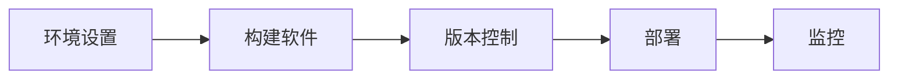

                 

### 文章标题

#### LLM应用开发中的敏捷方法论应用

> **关键词**：LLM应用、敏捷方法论、需求管理、团队协作、持续交付、项目管理、实践案例

> **摘要**：
本文将深入探讨在Large Language Model（LLM）应用开发中如何有效地应用敏捷方法论。通过详细分析敏捷方法论的核心原则、其在LLM开发中的应用场景，以及具体实践案例，本文旨在为开发者提供实用的指导，帮助他们在复杂的项目管理中实现高效交付。

### 目录大纲

#### 第一部分：引言
- **第1章：敏捷方法论概述**
  - 1.1 敏捷方法论的历史与发展
  - 1.2 敏捷方法论的核心原则
  - 1.3 敏捷方法论与传统开发方法的对比
  - 1.4 敏捷方法论在不同领域的应用

#### 第二部分：敏捷方法论在LLM应用开发中的应用
- **第2章：LLM应用开发中的需求管理**
  - 2.1 需求收集与分析
  - 2.2 需求优先级排序
  - 2.3 需求迭代与持续集成

- **第3章：LLM应用开发中的团队协作**
  - 3.1 敏捷团队的角色与职责
  - 3.2 敏捷团队的合作工具与流程
  - 3.3 敏捷团队中的沟通与协作技巧

- **第4章：LLM应用开发中的持续交付**
  - 4.1 自动化测试与持续集成
  - 4.2 部署流程与版本管理
  - 4.3 持续交付中的挑战与解决方案

#### 第三部分：案例与实践
- **第5章：LLM应用开发中的敏捷项目管理**
  - 5.1 项目计划与进度管理
  - 5.2 项目风险管理
  - 5.3 项目评估与持续改进

- **第6章：LLM应用开发中的敏捷实践**
  - 6.1 用户故事与迭代开发
  - 6.2 可视化工具与看板管理
  - 6.3 敏捷实践中的挑战与解决策略

- **第7章：敏捷方法论在LLM应用开发中的综合应用**
  - 7.1 敏捷方法论的优势与局限性
  - 7.2 不同阶段敏捷方法的选择与应用
  - 7.3 敏捷方法论的未来发展趋势

#### 第四部分：附录
- **附录A：敏捷方法论相关的工具与资源**
  - A.1 敏捷项目管理工具
  - A.2 敏捷开发框架
  - A.3 敏捷方法论相关的书籍与文章

#### 参考文献

### 第1章：敏捷方法论概述

#### 1.1 敏捷方法论的历史与发展

敏捷方法论起源于20世纪90年代，当时软件开发的传统方法如瀑布模型和V模型等逐渐暴露出其局限性，如项目周期长、沟通成本高、难以应对需求变化等问题。为了解决这些问题，软件开发界开始探索更加灵活、迭代和客户驱动的开发方法。

1991年，Kent Beck提出了极限编程（eXtreme Programming, XP），这是最早的敏捷方法论之一。XP的核心原则包括：快速反馈、简单性、沟通协作、勇于变革等。随后，在2001年，敏捷联盟发布了《敏捷宣言》，宣告了敏捷方法论的正式诞生。敏捷宣言强调个体和互动重于过程与工具、可工作的软件重于详尽的文档、客户合作重于合同谈判、响应变化重于遵循计划。

此后，敏捷方法论不断发展，出现了多种敏捷框架，如Scrum、看板（Kanban）、精益软件开发等。每种框架都有其独特的特点和适用场景，但它们都遵循敏捷方法论的核心原则。

#### 1.2 敏捷方法论的核心原则

敏捷方法论的核心原则可概括为以下五个方面：

1. **客户至上**：敏捷方法论强调客户需求的重要性，通过快速迭代和反馈，确保产品始终符合客户期望。客户参与度越高，产品越能满足市场需求。

2. **迭代开发**：敏捷方法论将项目划分为多个小迭代，每个迭代都提供可工作的软件。通过不断迭代，团队能够及时调整方向，适应变化。

3. **持续交付**：敏捷方法论强调持续交付，即通过自动化测试和持续集成，确保软件质量，并快速响应变化。持续交付有助于缩短上市时间，提高客户满意度。

4. **团队协作**：敏捷方法论强调团队合作，通过跨职能团队、开放沟通和协作工具，提高效率。团队成员之间的紧密合作有助于快速解决问题，提高产品质量。

5. **持续改进**：敏捷方法论鼓励持续改进，通过定期的回顾和反思，不断优化流程和提高质量。持续改进是敏捷方法论的核心之一，它确保团队能够在每次迭代中不断进步。

#### 1.3 敏捷方法论与传统开发方法的对比

传统开发方法，如瀑布模型，通常采用严格的计划和控制，项目在开始时需要详细规划，一旦计划确定，就很难进行更改。这种方法可能导致项目周期长、成本高、风险大。

相比之下，敏捷方法论更加灵活和适应变化。以下是敏捷方法论与传统开发方法的对比：

1. **项目周期**：传统方法通常需要数月或数年的开发周期，而敏捷方法通常采用2-4周的迭代周期。

2. **计划与调整**：传统方法在项目开始时就需要详细计划，而敏捷方法则允许在每次迭代结束后进行调整。

3. **沟通与合作**：传统方法强调文档和报告，而敏捷方法强调面对面的沟通和团队合作。

4. **风险应对**：传统方法通常在项目结束时进行质量检查，而敏捷方法则在每个迭代中都进行质量控制和反馈。

5. **客户参与**：传统方法通常在项目完成后向客户展示最终产品，而敏捷方法则鼓励客户全程参与，提供反馈。

#### 1.4 敏捷方法论在不同领域的应用

敏捷方法论不仅适用于软件开发领域，还广泛应用于其他领域，如项目管理、产品开发等。以下是敏捷方法论在不同领域的应用：

1. **软件开发**：敏捷方法论在软件开发领域得到广泛应用，如Scrum和XP。敏捷开发强调快速迭代、持续交付和客户合作，有助于提高软件质量。

2. **项目管理**：敏捷方法论在项目管理中强调持续交付、团队协作和持续改进。它有助于项目经理更好地应对项目的不确定性和复杂性。

3. **产品开发**：敏捷方法论在产品开发中强调用户需求和市场趋势的快速响应。通过迭代开发和用户反馈，团队能够快速调整产品方向，提高产品成功率。

4. **服务行业**：敏捷方法论在服务行业，如咨询、金融等，也得到应用。它帮助服务团队更好地理解客户需求，提供定制化的解决方案。

5. **教育领域**：敏捷方法论在教育领域也有应用，如项目驱动教学（Project-Based Learning, PBL）。学生通过项目实践，培养解决问题的能力和团队合作精神。

综上所述，敏捷方法论是一种适应性强、灵活性高的开发方法，它在多个领域都有广泛的应用。通过本文，我们将深入探讨敏捷方法论在LLM应用开发中的具体应用和实践。

### 第2章：LLM应用开发中的需求管理

在LLM应用开发中，需求管理是确保项目成功的关键环节。敏捷方法论为需求管理提供了系统化的方法和工具，帮助团队有效地收集、分析和管理需求，以确保项目能够快速响应变化并交付高质量的产品。

#### 2.1 需求收集与分析

需求收集是需求管理的第一步，它涉及到如何获取和理解用户需求。以下是需求收集的几个关键步骤：

1. **用户访谈**：通过与潜在用户进行面对面访谈，了解他们的需求、偏好和期望。用户访谈可以提供直接的用户反馈，有助于构建符合用户期望的应用。

   ```mermaid
   flowchart LR
   A[用户访谈] --> B[需求文档]
   ```

2. **问卷调查**：通过设计问卷，收集大量用户的反馈。问卷可以覆盖更广泛的用户群体，提供量化的数据，有助于分析用户需求。

   ```mermaid
   flowchart LR
   A[问卷调查] --> B[需求分析]
   ```

3. **市场调研**：通过市场调研，了解竞争对手的产品特点、市场趋势和用户需求。市场调研可以帮助团队把握行业动态，为产品规划提供参考。

   ```mermaid
   flowchart LR
   A[市场调研] --> B[需求列表]
   ```

在收集到大量需求后，需要进行需求分析。需求分析包括以下任务：

1. **需求分类**：将收集到的需求进行分类，如功能需求、性能需求、安全需求等。分类有助于明确需求的重要性和优先级。

   ```mermaid
   flowchart LR
   A[需求分类] --> B[优先级排序]
   ```

2. **需求验证**：通过与用户和利益相关者进行讨论，验证需求的准确性和可行性。需求验证有助于确保需求是实际可行的，并且能够满足用户需求。

   ```mermaid
   flowchart LR
   A[需求验证] --> B[需求文档]
   ```

#### 2.2 需求优先级排序

在需求分析后，需要根据业务价值和资源限制对需求进行优先级排序。以下是几种常用的需求优先级排序方法：

1. **MoSCoW方法**：MoSCoW方法将需求分为四类，分别是：

   - **M（必须）：必须实现的需求，没有这些需求，产品就无法满足基本功能。**
   - **S（应该）：应该实现的需求，虽然不是必须的，但能够提升产品的竞争力。**
   - **C（可以）：可以延迟实现的需求，这些需求不影响产品的核心功能，但可能会在后续版本中实现。**
   - **W（将来）：将来可能实现的需求，这些需求目前不紧急，但未来可能有用。

   ```mermaid
   flowchart LR
   A[MoSCoW方法] --> B[需求列表]
   ```

2. **Kano模型**：Kano模型将需求分为五类，分别是：

   - **必备需求**：满足这些需求，用户才会满意。
   - **一维需求**：这些需求的满足程度与用户满意度成正比。
   - **魅力需求**：满足这些需求，用户会感到惊喜。
   - **无需求**：这些需求对用户满意度没有影响。
   - **逆向需求**：满足这些需求，用户会感到不满意。

   ```mermaid
   flowchart LR
   A[Kano模型] --> B[需求分类]
   ```

在确定需求优先级后，需要根据优先级进行资源分配和任务规划。高优先级的需求应首先实现，以确保关键功能能够在早期版本中完成。

#### 2.3 需求迭代与持续集成

在敏捷方法论中，需求不是一次性定义的，而是随着项目的进展不断迭代和改进。以下是需求迭代与持续集成的方法：

1. **迭代开发**：将需求划分为多个小迭代，每个迭代都提供可工作的软件。在每个迭代中，团队可以基于用户反馈和市场需求调整需求。

   ```mermaid
   flowchart LR
   A[迭代1] --> B[迭代2]
   B --> C[迭代3]
   ```

2. **用户故事**：用户故事是一种简短的需求描述，通常采用以下格式：“作为[某个角色]，我需要[完成某个功能]，以便[实现某个目标]”。用户故事有助于团队更好地理解需求，并能够灵活地调整需求。

   ```mermaid
   flowchart LR
   A[用户故事] --> B[迭代规划]
   ```

3. **持续集成**：持续集成是一种软件开发实践，通过自动化测试和持续集成工具，确保代码库的健康状态，并及时发现和解决问题。持续集成有助于提高软件质量，缩短上市时间。

   ```mermaid
   flowchart LR
   A[代码提交] --> B[自动化测试]
   B --> C[持续集成]
   ```

通过需求迭代与持续集成，团队可以快速响应变化，确保产品始终符合用户需求和市场趋势。需求管理不仅是LLM应用开发的关键环节，也是敏捷方法论的核心实践之一。通过有效的需求管理，团队可以确保项目成功，并交付高质量的产品。

### 第3章：LLM应用开发中的团队协作

在LLM应用开发中，团队协作是确保项目成功的关键因素。敏捷方法论通过强调团队合作、开放沟通和协作工具，为团队提供了一个高效、灵活的工作环境。以下章节将详细探讨敏捷团队的角色与职责、协作工具与流程，以及团队协作中的沟通与协作技巧。

#### 3.1 敏捷团队的角色与职责

敏捷团队通常由以下几种角色组成：

1. **产品负责人（Product Owner）**：产品负责人是敏捷团队的领导者，负责制定产品愿景和需求，确保团队按照业务目标进行工作。产品负责人需要具备以下职责：

   - 制定和更新产品待办事项列表（Product Backlog）。
   - 与利益相关者沟通，了解他们的需求。
   - 确保团队理解并实现产品需求。
   - 在冲刺规划（Sprint Planning）中与团队共同确定目标。

   ```mermaid
   flowchart LR
   A[产品负责人] --> B[需求管理]
   B --> C[团队协作]
   ```

2. **开发人员（Developers）**：开发人员是敏捷团队的核心成员，负责实现产品需求。开发人员通常包括以下职责：

   - 设计和开发软件功能。
   - 进行单元测试和集成测试。
   - 与产品负责人和测试人员合作，确保需求得到正确实现。
   - 在每日站会（Daily Stand-up）中汇报工作进展。

   ```mermaid
   flowchart LR
   A[开发人员] --> B[代码开发]
   B --> C[测试合作]
   ```

3. **测试人员（Testers）**：测试人员负责确保软件质量，他们与开发人员紧密合作，确保需求得到正确实现。测试人员通常包括以下职责：

   - 设计和执行测试用例。
   - 发现和报告缺陷。
   - 与开发人员合作，确保缺陷得到修复。
   - 在迭代结束时进行验收测试。

   ```mermaid
   flowchart LR
   A[测试人员] --> B[测试设计]
   B --> C[缺陷管理]
   ```

4. **运维人员（Operations）**：运维人员负责确保软件的稳定运行和性能优化。在LLM应用开发中，运维人员通常包括以下职责：

   - 管理服务器和基础设施。
   - 监控软件性能和日志。
   - 确保软件的部署和更新过程高效、可靠。
   - 在需要时提供技术支持。

   ```mermaid
   flowchart LR
   A[运维人员] --> B[基础设施管理]
   B --> C[性能监控]
   ```

#### 3.2 敏捷团队的合作工具与流程

敏捷团队需要使用一系列工具和流程来确保高效协作。以下是一些常用的敏捷工具和流程：

1. **协作工具**：敏捷团队通常使用协作工具来管理任务、跟踪进度和促进沟通。常见的协作工具有：

   - **JIRA**：用于任务跟踪、项目管理和报告生成。
   - **Trello**：用于可视化任务流程和进度。
   - **Slack**：用于实时沟通和消息传递。
   - **Asana**：用于任务分配和进度跟踪。

   ```mermaid
   flowchart LR
   A[JIRA] --> B[任务跟踪]
   B --> C[Trello]
   C --> D[Slack]
   D --> E[Asana]
   ```

2. **敏捷流程**：敏捷团队遵循一系列敏捷流程来确保高效协作。常见的敏捷流程包括：

   - **Scrum**：包括冲刺规划、每日站会、冲刺回顾等。
   - **Kanban**：包括看板、卡片流动和迭代周期等。
   - **看板图**：用于可视化任务流程和进度。
   - **迭代开发**：将项目划分为多个迭代，每个迭代提供可工作的软件。

   ```mermaid
   flowchart LR
   A[Scrum] --> B[每日站会]
   B --> C[冲刺回顾]
   C --> D[Kanban]
   D --> E[迭代开发]
   ```

#### 3.3 敏捷团队中的沟通与协作技巧

敏捷团队的成功离不开有效的沟通和协作。以下是一些敏捷团队中常用的沟通与协作技巧：

1. **每日站会**：每日站会是一个简短的会议，通常持续15-30分钟。团队成员轮流汇报自己的工作进展、遇到的困难和计划。这有助于团队成员了解彼此的工作情况，及时发现和解决问题。

   ```mermaid
   flowchart LR
   A[每日站会] --> B[工作进展汇报]
   B --> C[问题解决]
   ```

2. **用户故事**：用户故事是一种简短的需求描述，它有助于团队成员更好地理解需求，并能够灵活地调整需求。用户故事通常采用以下格式：“作为[某个角色]，我需要[完成某个功能]，以便[实现某个目标]”。

   ```mermaid
   flowchart LR
   A[用户故事] --> B[需求理解]
   B --> C[需求调整]
   ```

3. **看板管理**：看板是一种可视化工具，用于展示任务流程和进度。通过看板，团队成员可以直观地了解任务的状态和优先级，并能够灵活调整任务分配和进度。

   ```mermaid
   flowchart LR
   A[看板管理] --> B[任务状态可视化]
   B --> C[任务调整]
   ```

4. **代码审查**：代码审查是一种团队合作的方式，通过审查代码，确保代码质量，并促进团队成员之间的技术交流和协作。

   ```mermaid
   flowchart LR
   A[代码审查] --> B[代码质量保证]
   B --> C[技术交流]
   ```

5. **迭代回顾**：迭代回顾是敏捷方法论的一个重要实践，通过回顾每个迭代的工作，团队成员可以总结经验教训，识别改进点，并制定改进计划。

   ```mermaid
   flowchart LR
   A[迭代回顾] --> B[经验总结]
   B --> C[改进计划]
   ```

通过有效的沟通与协作技巧，敏捷团队可以更好地应对项目中的挑战，提高工作效率和软件质量。团队协作不仅是敏捷方法论的核心实践之一，也是实现LLM应用开发成功的关键因素。

### 第4章：LLM应用开发中的持续交付

持续交付是敏捷方法论中的一个重要概念，它强调通过自动化测试和持续集成，确保软件质量，并实现快速、可靠的软件交付。在LLM应用开发中，持续交付的重要性不言而喻，因为LLM应用通常涉及大量的数据处理和模型训练，任何错误都可能导致严重的后果。本章将详细探讨自动化测试与持续集成、部署流程与版本管理，以及持续交付中的挑战与解决方案。

#### 4.1 自动化测试与持续集成

自动化测试和持续集成是确保软件质量的关键实践。通过自动化测试，团队可以在每次代码提交后立即发现潜在的问题，而持续集成则确保所有代码集成后仍能正常运行。

1. **自动化测试**

   自动化测试包括单元测试、集成测试、功能测试等。在LLM应用开发中，以下是一些常见的自动化测试方法：

   - **单元测试**：单元测试针对软件中最小的可测试部分，如函数或方法。通过单元测试，团队可以确保每个单元的功能正确无误。

     ```python
     def test_addition():
         assert add(2, 3) == 5
     ```

   - **集成测试**：集成测试用于测试不同模块之间的交互，确保它们协同工作。在LLM应用中，集成测试可以确保数据流和模型训练的正确性。

     ```python
     def test_data_flow():
         assert data_loader.load_data() != None
     ```

   - **功能测试**：功能测试用于验证整个系统的功能，确保它符合需求。

     ```python
     def test_model_training():
         assert model.train(data) != None
     ```

2. **持续集成**

   持续集成是一种软件开发实践，通过自动化测试和构建工具，确保代码库的健康状态。以下是一个简单的持续集成流程：

   - **代码提交**：开发人员将代码提交到版本控制系统中。
   - **自动化测试**：持续集成服务器自动运行单元测试、集成测试和功能测试，确保代码质量。
   - **构建**：如果测试通过，持续集成服务器构建可执行的软件包。
   - **部署**：软件包被部署到测试环境，进行验收测试。

   ```mermaid
   flowchart LR
   A[代码提交] --> B[自动化测试]
   B --> C[构建]
   C --> D[部署]
   ```

#### 4.2 部署流程与版本管理

部署流程是持续交付的重要组成部分，它确保软件能够可靠地部署到生产环境中。以下是一个典型的部署流程：

1. **环境设置**：在部署之前，需要准备好生产环境，包括服务器、数据库和其他基础设施。

2. **构建软件**：通过持续集成工具，构建可执行的软件包。

3. **版本控制**：使用版本控制系统（如Git）管理代码版本，确保每次部署都是可追踪和可回滚的。

4. **部署**：将软件包部署到生产环境，包括安装、配置和启动。

5. **监控**：在部署后，监控软件的性能和日志，确保它能够稳定运行。

版本管理是确保软件质量和可追溯性的关键。以下是一些版本管理的方法：

- **Git标签**：使用Git标签标记每个重要的版本，如发布版本、重大修复版本等。
- **版本号**：遵循语义化版本控制（Semantic Versioning），为每个版本分配版本号，如`1.0.0`、`1.0.1`、`2.0.0`等。
- **回滚策略**：在发生问题时，可以回滚到上一个稳定版本，确保系统恢复正常。



#### 4.3 持续交付中的挑战与解决方案

持续交付虽然能提高软件质量和交付速度，但也会带来一些挑战。以下是一些常见的挑战和解决方案：

1. **测试覆盖率不足**：自动化测试虽然能提高测试效率，但测试覆盖率不足可能导致潜在问题未被检测到。解决方案是增加测试用例的覆盖范围，确保关键功能得到充分测试。

2. **持续集成失败**：持续集成失败可能导致部署中断。解决方案是改进代码质量，确保每次提交的代码都能通过测试，并增加对集成问题的监控和报警。

3. **环境不一致**：不同环境（如开发环境、测试环境、生产环境）之间的不一致可能导致问题。解决方案是使用持续交付工具（如Docker）确保环境一致性，并实施严格的版本控制。

4. **部署复杂度**：部署过程可能涉及多个步骤和复杂的配置。解决方案是使用自动化部署工具（如Ansible、Puppet），并编写详细的部署文档。

5. **团队协作**：持续交付需要团队之间的紧密协作。解决方案是建立明确的职责分工，使用协作工具（如JIRA、Slack）确保沟通畅通。

通过解决这些挑战，团队可以更好地实施持续交付，提高软件质量和交付速度，从而满足客户需求。

### 第5章：LLM应用开发中的敏捷项目管理

在LLM应用开发中，敏捷项目管理是实现高效交付的关键。敏捷项目管理强调迭代、透明度和持续改进，通过有效的计划与进度管理、风险管理和项目评估与持续改进，团队可以更好地应对项目中的挑战，确保项目成功。以下章节将详细探讨敏捷项目管理中的关键实践。

#### 5.1 项目计划与进度管理

项目计划是敏捷项目管理的起点，它为整个项目提供了清晰的路线图。以下是项目计划与进度管理的几个关键步骤：

1. **项目目标与范围定义**：明确项目的目标、范围和关键成果。这有助于团队了解项目的方向和优先级。

   ```mermaid
   flowchart LR
   A[项目目标与范围] --> B[里程碑计划]
   ```

2. **里程碑计划**：将项目划分为多个里程碑，每个里程碑代表一个重要的交付成果。这有助于团队跟踪项目进度，并在关键节点进行评估。

   ```mermaid
   flowchart LR
   A[里程碑计划] --> B[任务分解]
   ```

3. **任务分解**：将里程碑分解为具体的任务，并为每个任务分配负责人和截止日期。这有助于团队明确任务分工，确保项目按计划进行。

   ```mermaid
   flowchart LR
   A[任务分解] --> B[资源分配]
   ```

4. **资源分配**：根据任务需求，为每个任务分配所需的资源，如开发人员、测试人员、运维人员等。这有助于确保项目有足够的资源支持。

   ```mermaid
   flowchart LR
   A[资源分配] --> B[进度监控]
   ```

5. **进度监控**：使用敏捷工具（如JIRA、Trello）跟踪项目进度，确保任务按时完成。通过定期检查项目状态，团队可以及时发现和解决问题。

   ```mermaid
   flowchart LR
   A[进度监控] --> B[迭代回顾]
   ```

#### 5.2 项目风险管理

项目风险管理是确保项目成功的关键，它包括识别、评估和应对潜在风险。以下是项目风险管理的几个关键步骤：

1. **风险识别**：通过团队讨论和文献调研，识别项目中可能出现的风险。这包括技术风险、市场风险、资源风险等。

   ```mermaid
   flowchart LR
   A[风险识别] --> B[风险评估]
   ```

2. **风险评估**：评估每个风险的严重性和可能性，确定优先级。这有助于团队了解哪些风险需要优先关注。

   ```mermaid
   flowchart LR
   A[风险评估] --> B[风险应对策略]
   ```

3. **风险应对策略**：根据风险评估结果，制定应对策略，如风险规避、风险转移、风险减轻等。这有助于降低风险对项目的影响。

   ```mermaid
   flowchart LR
   A[风险应对策略] --> B[风险监控]
   ```

4. **风险监控**：定期检查项目中的风险状态，确保风险应对策略得到执行。通过风险监控，团队可以及时发现新风险并调整应对策略。

   ```mermaid
   flowchart LR
   A[风险监控] --> B[迭代回顾]
   ```

#### 5.3 项目评估与持续改进

项目评估是确保项目质量和效率的关键，它包括对项目进度、质量和成本进行评估，并总结经验教训。以下是项目评估与持续改进的几个关键步骤：

1. **项目评估**：在项目结束时，对项目进度、质量和成本进行评估。这有助于团队了解项目成功的原因和改进点。

   ```mermaid
   flowchart LR
   A[项目评估] --> B[经验总结]
   ```

2. **经验总结**：总结项目过程中的经验教训，包括成功经验和失败经验。这有助于团队在未来的项目中避免重复错误。

   ```mermaid
   flowchart LR
   A[经验总结] --> B[持续改进计划]
   ```

3. **持续改进计划**：根据项目评估和经验总结，制定持续改进计划。这有助于团队在未来的项目中持续优化流程和提高效率。

   ```mermaid
   flowchart LR
   A[持续改进计划] --> B[迭代回顾]
   ```

4. **迭代回顾**：在每次迭代结束时，进行迭代回顾。通过回顾项目进展、识别问题和改进点，团队可以不断优化项目管理流程。

   ```mermaid
   flowchart LR
   A[迭代回顾] --> B[项目评估]
   ```

通过有效的项目计划与进度管理、风险管理、项目评估与持续改进，团队可以更好地应对项目中的挑战，确保项目成功。敏捷项目管理不仅提供了系统的管理方法，还鼓励团队持续改进，提高项目的质量和效率。

### 第6章：LLM应用开发中的敏捷实践

在LLM应用开发中，敏捷实践是确保项目高效交付和质量保证的关键。本章将详细探讨用户故事与迭代开发、可视化工具与看板管理，以及敏捷实践中的挑战与解决策略。

#### 6.1 用户故事与迭代开发

用户故事是敏捷开发中用于描述用户需求的基本单元。用户故事以用户的视角来编写，通常采用以下格式：“作为[某个角色]，我需要[完成某个功能]，以便[实现某个目标]”。以下是一个用户故事的示例：

```plaintext
作为用户，我需要能够搜索文档库，以便快速找到所需信息。
```

用户故事的特点包括：

- **简洁性**：用户故事应简洁明了，避免冗长复杂的描述。
- **可测试性**：用户故事应具备明确的验收标准，以便团队能够进行测试。
- **独立性**：用户故事应独立存在，不依赖于其他故事。

在敏捷开发中，用户故事通过迭代（Sprint）进行开发。每个迭代通常持续2-4周，团队在每个迭代中选取一定数量的用户故事进行实现。以下是一个迭代开发的过程：

1. **迭代规划**：在迭代开始时，团队与产品负责人（Product Owner）一起确定本次迭代的用户故事。团队根据用户故事的优先级和团队的工作量，选择本次迭代要完成的故事。

2. **故事分解**：将选定的用户故事分解为更小的任务，为每个任务分配负责人和时间估算。

3. **开发与测试**：团队成员按照任务分配进行开发和测试。开发过程中，团队应遵循敏捷开发的原则，如代码审查、持续集成等。

4. **迭代评审**：在迭代结束时，团队与产品负责人和利益相关者一起进行迭代评审。评审内容包括展示本次迭代完成的用户故事、收集反馈并进行讨论。

5. **迭代回顾**：在迭代结束后，团队进行迭代回顾，总结本次迭代的经验教训，讨论改进点，并制定下一迭代的目标和计划。

通过迭代开发，团队可以快速响应变化，确保产品符合用户需求。同时，迭代开发也促进了团队成员之间的协作和沟通，提高了团队的整体效率。

#### 6.2 可视化工具与看板管理

可视化工具是敏捷开发中重要的辅助工具，用于展示项目状态、任务流程和团队成员的工作进度。常见的可视化工具有看板（Kanban）、燃尽图（Burn-down Chart）和任务看板（Task Board）等。

1. **看板（Kanban）**

   看板是一种可视化工具，用于展示任务从开始到完成的整个流程。看板通常包括以下几个阶段：

   - **待办（To Do）**：包含尚未开始的任务。
   - **进行中（In Progress）**：包含正在进行的任务。
   - **待测试（In Test）**：包含已完成开发但待测试的任务。
   - **待发布（Ready for Release）**：包含已完成测试但待发布的任务。
   - **已完成（Done）**：包含已发布的任务。

   看板有助于团队成员了解任务的当前状态和优先级，通过看板，团队可以更好地进行任务分配和协作。

2. **燃尽图（Burn-down Chart）**

   燃尽图是一种用于展示项目进度和剩余工作量的图表。它通常呈现在时间轴上，分为实际进度和计划进度两条线。通过燃尽图，团队可以直观地了解项目的进度和剩余工作量，及时发现和解决问题。

   ```mermaid
   gantt
   title 燃尽图示例
   section 计划进度
   A :计划 :2023-10-01, 20d
   B :计划 :2023-10-11, 10d
   section 实际进度
   C :实际 :2023-10-01, 15d
   D :实际 :2023-10-11, 5d
   ```

3. **任务看板（Task Board）**

   任务看板是一种用于展示任务详细信息的工具，包括任务名称、任务描述、负责人、截止日期等。任务看板有助于团队成员了解任务的详细信息，确保任务按时完成。

通过可视化工具，团队可以更好地掌握项目状态、任务进度和资源分配，从而提高工作效率和项目质量。

#### 6.3 敏捷实践中的挑战与解决策略

敏捷实践在LLM应用开发中虽然具有很多优势，但也面临一些挑战。以下是一些常见的挑战及其解决策略：

1. **沟通障碍**

   沟通障碍是敏捷实践中常见的问题，特别是在大型团队或多地点团队中。解决策略包括：

   - **建立明确的沟通渠道**：确保团队内部和跨团队之间的沟通渠道畅通。
   - **定期会议**：定期召开会议，如每日站会、迭代评审等，确保团队成员及时了解项目进展和问题。
   - **使用协作工具**：使用协作工具（如Slack、JIRA等）进行实时沟通和任务分配。

2. **需求变更**

   在敏捷开发中，需求变更不可避免。解决策略包括：

   - **需求管理**：通过用户故事和迭代开发，确保需求能够及时调整和优先级排序。
   - **风险管理**：提前识别需求变更可能带来的风险，并制定应对策略。
   - **沟通**：与客户和利益相关者保持紧密沟通，确保需求变更得到及时反馈和确认。

3. **团队协作**

   团队协作是敏捷实践的核心，但大型团队中的协作可能面临困难。解决策略包括：

   - **明确角色和职责**：确保每个团队成员都清楚自己的角色和职责。
   - **培训和支持**：为团队成员提供敏捷开发相关的培训和支持，提高他们的协作能力。
   - **使用协作工具**：使用协作工具（如看板、视频会议等）促进团队协作。

通过解决这些挑战，团队可以更好地实施敏捷实践，提高项目交付质量和效率。

### 第7章：敏捷方法论在LLM应用开发中的综合应用

#### 7.1 敏捷方法论的优势与局限性

敏捷方法论在LLM应用开发中具有显著的优势，同时也存在一定的局限性。以下是敏捷方法论的优势和局限性分析：

**优势：**

1. **快速响应变化**：敏捷方法论通过迭代开发和持续交付，能够快速响应市场需求和变化，确保产品始终符合用户期望。
   
2. **提高软件质量**：敏捷方法论强调自动化测试和持续集成，确保代码质量和稳定性，减少缺陷和错误。

3. **增强团队协作**：敏捷方法论强调团队合作和跨职能团队的协作，提高团队沟通和协作效率。

4. **持续改进**：敏捷方法论鼓励团队定期回顾和反思，不断优化流程和提高质量。

5. **客户参与**：敏捷方法论鼓励客户全程参与，提供反馈，确保产品满足用户需求。

**局限性：**

1. **对团队协作的要求较高**：敏捷方法论需要团队成员具备较高的沟通和协作能力，这对于大型团队或跨地域团队可能是一个挑战。

2. **对项目管理流程和工具的要求较高**：敏捷方法论需要使用一系列敏捷工具和流程，这可能会增加项目管理的复杂性。

3. **对需求变更的容忍度有限**：虽然敏捷方法论能够应对需求变更，但过度的需求变更可能导致项目延期和资源浪费。

4. **可能影响项目规划和预测**：敏捷方法论强调快速响应变化，这可能会影响项目的规划和预测，使得项目进度难以控制。

#### 7.2 不同阶段敏捷方法的选择与应用

在LLM应用开发的不同阶段，敏捷方法的选择和应用可能会有所不同。以下是不同阶段敏捷方法的选择与应用建议：

1. **需求明确阶段**：

   在需求明确阶段，建议采用Scrum或XP，这两种方法都强调用户需求和快速迭代。Scrum通过冲刺（Sprint）规划、每日站会（Daily Stand-up）和迭代回顾（Sprint Retrospective）确保项目按计划进行，并提供及时反馈。XP则通过简单性、沟通和勇于变革等原则，确保项目高效交付。

2. **项目规划阶段**：

   在项目规划阶段，建议采用看板（Kanban），看板方法通过任务流程可视化、卡片流动和限制在流程中的工作项数量（Work in Progress, WIP），确保团队高效、灵活地处理任务。看板方法有助于团队更好地掌握项目状态，并及时调整任务优先级。

3. **项目执行阶段**：

   在项目执行阶段，建议继续采用Scrum或Kanban，并根据实际情况灵活调整。Scrum通过迭代开发和持续交付，确保项目按时、按质量交付。Kanban则通过任务流程可视化和持续改进，确保团队高效处理任务，并持续优化流程。

4. **项目评估与改进阶段**：

   在项目评估与改进阶段，建议采用Scrum回顾和Kanban改进。通过Scrum回顾，团队可以总结本次项目的成功经验和改进点，为下一个项目提供参考。通过Kanban改进，团队可以识别和解决流程中的瓶颈和问题，提高整体效率。

#### 7.3 敏捷方法论的未来发展趋势

敏捷方法论在未来的发展趋势包括以下几个方面：

1. **敏捷与DevOps的融合**：

   敏捷方法论与DevOps的结合，将进一步提升软件开发和交付的效率。DevOps强调开发和运维的紧密协作，通过自动化和持续交付，确保软件从开发到部署的快速、可靠。未来，敏捷方法论将与DevOps更加融合，实现更高效的开发、测试和部署流程。

2. **敏捷与AI的结合**：

   人工智能（AI）技术的发展将进一步提升敏捷方法论的应用范围。通过AI技术，团队可以实现自动化测试、预测分析和智能决策，提高项目交付质量和效率。未来，敏捷方法论将更多地与AI技术结合，实现更智能、更高效的软件开发。

3. **敏捷与可持续性的结合**：

   敏捷方法论强调持续改进和团队协作，未来将进一步关注可持续性发展。通过关注环境、社会和经济效益，团队可以实现可持续发展，确保项目对社会和环境产生积极影响。

4. **敏捷方法论在不同领域的应用**：

   未来的敏捷方法论将不仅限于软件开发，还将广泛应用于其他领域，如项目管理、产品开发、服务行业等。通过不断优化和适应，敏捷方法论将帮助不同领域的团队实现高效交付和持续改进。

综上所述，敏捷方法论在LLM应用开发中具有显著的优势，但也存在一定的局限性。通过选择合适的敏捷方法，团队可以更好地应对项目中的挑战，提高项目交付质量和效率。未来，敏捷方法论将继续发展和创新，为软件开发和交付带来更多价值。

### 附录A：敏捷方法论相关的工具与资源

敏捷方法论在LLM应用开发中的成功应用离不开一系列工具与资源的支持。以下是一些常见的敏捷方法论相关的工具与资源：

#### A.1 敏捷项目管理工具

1. **JIRA**：JIRA是一款功能强大的敏捷项目管理工具，支持任务跟踪、敏捷看板和迭代规划等功能。

2. **Trello**：Trello是一款简单易用的看板工具，适合小型团队进行任务管理和项目规划。

3. **Asana**：Asana是一款灵活的任务管理工具，支持任务分配、进度跟踪和团队协作。

4. **Jenkins**：Jenkins是一款流行的持续集成工具，支持自动化构建、测试和部署。

#### A.2 敏捷开发框架

1. **Scrum**：Scrum是一种广泛应用的敏捷开发框架，强调迭代开发和用户反馈。

2. **XP（极限编程）**：XP是一种强调代码质量、简单性和客户合作的敏捷开发方法。

3. **Kanban**：Kanban是一种基于看板方法的项目管理框架，强调任务流程可视化和持续改进。

4. **Lean Agile**：Lean Agile是一种基于精益思想的敏捷开发方法，强调价值流和持续改进。

#### A.3 敏捷方法论相关的书籍与文章

1. **《敏捷开发实践指南》**：作者：迈克尔·赫斯克特（Michael Hfik）和斯蒂夫·布兰克（Steve Blank），本书详细介绍了敏捷开发的方法和实践。

2. **《敏捷项目管理》**：作者：斯蒂芬·米勒（Stephen M. Miller），本书提供了敏捷项目管理的全面指南。

3. **《敏捷实践指南》**：作者：艾伦·希科克（Alistair Cockburn），本书介绍了敏捷开发的核心理念和实践。

4. **《敏捷方法：如何通过迭代开发、敏捷流程和持续交付成功管理项目》**：作者：杰里米·威廉姆森（J. B. Wambolt），本书探讨了敏捷方法在项目管理中的应用。

通过使用这些工具与资源，团队可以更好地实施敏捷方法论，提高项目交付质量和效率。

### 参考文献

1. Beck, K. (1999). *Extreme Programming Explained: Embrace Change*. Addison-Wesley.
2. Schwaber, K., Beedle, M. (2002). *Agile Project Management with Scrum*. Microsoft Press.
3.极限编程官方网站：[XP官网](https://www.extremeprogramming.org/)
4. Scrum官方网站：[Scrum官网](https://www.scrum.org/)
5. Kanban官方网站：[Kanban官网](https://www.kanban.com/)
6. Jenkins官方网站：[Jenkins官网](https://www.jenkins.io/)
7. Asana官方网站：[Asana官网](https://asana.com/)
8. Miller, S. M. (2005). *Agile Project Management: Creating Innovative Products*. Addison-Wesley.
9. Cockburn, A. (2001). *Agile Software Development: The Cooperative Game*. Addison-Wesley.
10. Wambolt, J. B. (2016). *Agile Methods: How to Succeed with Iterative, Incremental, and Evolutionary Processes*. Springer.

