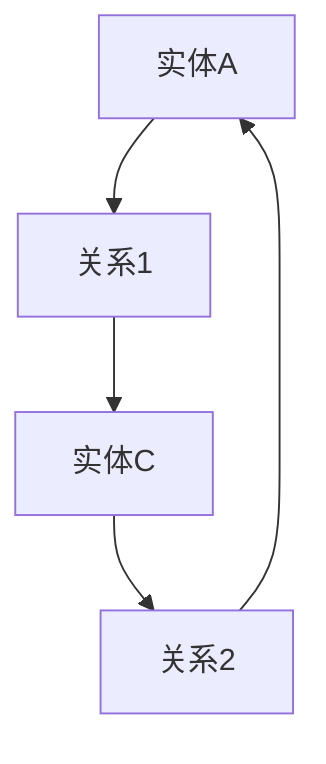
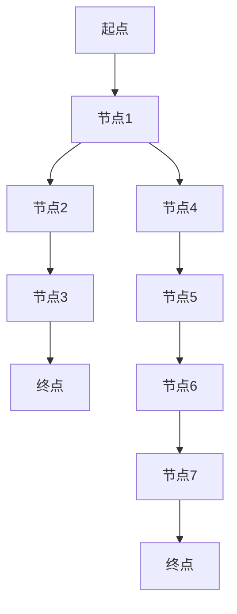
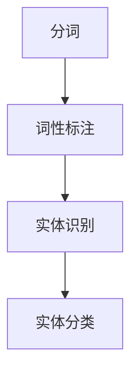
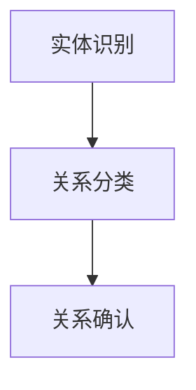
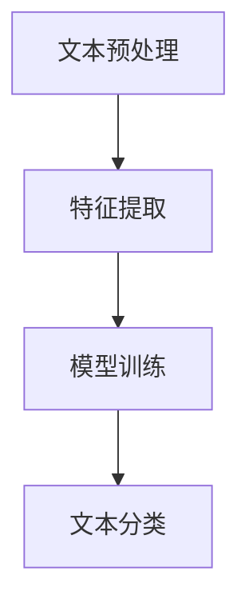
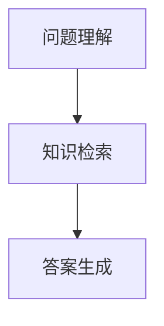
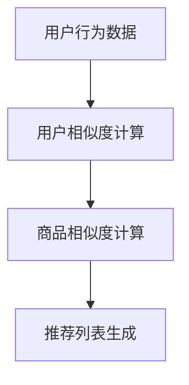
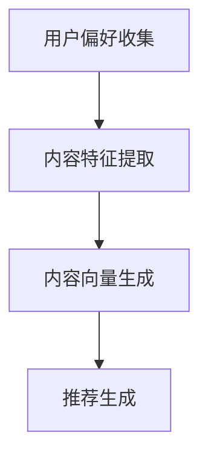
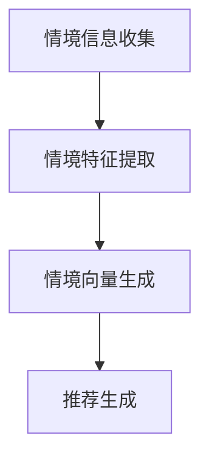
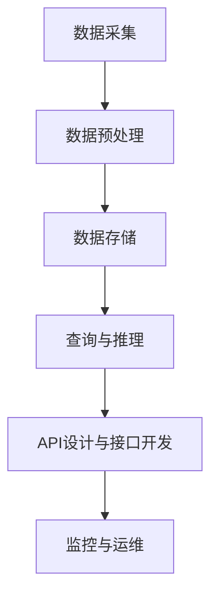

                 

## 引言

知识图谱（Knowledge Graph）作为一种重要的数据结构和表示方法，已经成为现代数据科学和人工智能领域中的核心组成部分。它通过将实体、属性和关系以图的形式进行组织，为复杂的数据提供了直观且高效的处理方式。随着深度学习、自然语言处理、推荐系统等技术的发展，知识图谱的应用范围不断扩大，其重要性日益凸显。

本文将深入探讨知识图谱在LLM（大型语言模型）应用开发中的具体应用。我们将从基础知识出发，逐步讲解知识图谱的概念、类型、核心要素、构建方法以及表示与存储技术。在此基础上，文章将详细分析知识图谱推理算法，包括基于图、逻辑和机器学习的算法。接下来，我们将探讨知识图谱在自然语言处理、推荐系统等领域的实际应用案例，并分享知识图谱系统设计与实现的经验。

为了更好地理解知识图谱的应用，文章还将介绍知识图谱系统的设计与实现、优化与部署，以及其未来发展趋势和面临的挑战。最后，我们将总结本文的核心内容，并提供相关知识图谱工具与框架的附录，以供读者进一步学习和实践。

本文结构如下：

1. **知识图谱基础**：介绍知识图谱的概念、类型、核心要素和构建方法。
2. **知识图谱的表示与存储**：讲解知识图谱的表示方法、存储技术、查询语言和索引技术。
3. **知识图谱推理算法**：探讨基于图、逻辑和机器学习的推理算法。
4. **知识图谱的应用**：分析知识图谱在自然语言处理、推荐系统等领域的应用。
5. **知识图谱的开发实践**：介绍知识图谱系统的设计与实现、优化与部署。
6. **知识图谱的未来发展趋势与挑战**：展望知识图谱的未来发展和面临的问题。
7. **附录**：提供知识图谱常用工具与框架，以及相关研究资源。

通过本文的详细探讨，我们希望能够帮助读者全面理解知识图谱在LLM应用开发中的重要性，并掌握其在实际项目中的应用方法。

## 关键词

- 知识图谱
- 大型语言模型
- 自然语言处理
- 推荐系统
- 数据结构
- 数据存储
- 推理算法
- 系统设计
- 优化部署

## 摘要

本文旨在探讨知识图谱在LLM应用开发中的关键作用。首先，文章介绍了知识图谱的基础概念、类型、核心要素和构建方法，详细阐述了其表示与存储技术。接着，文章分析了知识图谱的推理算法，包括基于图、逻辑和机器学习的方法。随后，文章探讨了知识图谱在自然语言处理和推荐系统等领域的实际应用，分享了系统设计与实现的经验。最后，文章展望了知识图谱的未来发展趋势和面临的挑战，并提供了相关知识图谱工具与框架的附录，以供进一步学习和实践。

### 第1章: 知识图谱的概念与历史

知识图谱（Knowledge Graph）是近年来在人工智能领域快速发展的一种重要数据结构，它通过将实体、属性和关系以图的形式进行组织，为复杂数据的处理提供了高效且直观的方法。本节将介绍知识图谱的基本概念、发展历程、类型以及核心要素。

#### 1.1 知识图谱的定义

知识图谱是一种基于语义网络的数据结构，用于表示实体（如人、地点、组织等）和它们之间的关系。知识图谱的核心在于它能够通过这些实体和关系来捕捉和表示现实世界中的各种知识和信息。知识图谱不仅仅是一种数据结构，更是一种知识和信息的表示方法，它能够帮助计算机更好地理解和处理复杂的数据。

知识图谱的基本元素包括：

- **实体（Entity）**：现实世界中的任何对象，如人、地点、物品、事件等。
- **属性（Attribute）**：实体的特征或属性，如人的年龄、地点的经纬度、物品的价格等。
- **关系（Relation）**：实体之间的关系，如一个人是某个地点的居民、两个人是朋友、一个物品属于某个类别等。

通过这些基本元素，知识图谱能够构建出一张庞大的知识网络，从而实现对复杂数据的语义理解和处理。

#### 1.1.2 知识图谱的发展历程

知识图谱的发展可以追溯到20世纪80年代的知识表示和推理领域。早期的知识表示方法主要基于逻辑和语义网络，如RDF（Resource Description Framework）和OWL（Web Ontology Language）。这些方法通过定义明确的语义关系和规则，来实现对知识的高效表示和推理。

进入21世纪，随着互联网的普及和大数据技术的发展，知识图谱迎来了新的发展机遇。Google在2009年推出其知识图谱服务，通过对实体、属性和关系的精细表示，为搜索引擎提供了强大的语义搜索能力。此后，知识图谱在学术界和工业界得到了广泛关注和应用。

近年来，随着深度学习和自然语言处理技术的发展，知识图谱的表示和推理方法也取得了显著进展。通过将图神经网络（Graph Neural Networks，GNN）和Transformer等深度学习模型引入知识图谱，使得知识图谱在复杂任务中的表现更加优异。

#### 1.2 知识图谱的类型

知识图谱可以根据其结构和表示方式的不同，分为以下几类：

- **结构化知识图谱**：这种知识图谱采用严格的语义网络结构，关系和实体都通过明确的定义进行组织。RDF和OWL是典型的结构化知识图谱表示方法。
- **半结构化知识图谱**：这种知识图谱采用部分结构化的方式，实体和关系具有一定的结构，但不是完全的语义网络。NoSQL数据库和图数据库常用于存储半结构化知识图谱。
- **非结构化知识图谱**：这种知识图谱采用非结构化的方式，实体和关系没有固定的结构。Web数据、社交媒体数据和文本数据常常被组织成非结构化知识图谱。

不同类型的知识图谱适用于不同的应用场景。结构化知识图谱适合用于精确的语义查询和推理，半结构化知识图谱适合用于灵活的数据存储和处理，而非结构化知识图谱适合用于大规模数据的语义理解和分析。

#### 1.3 知识图谱的核心要素

知识图谱的核心要素包括实体、关系和属性，这些要素共同构成了知识图谱的基本框架。

- **实体**：实体是知识图谱中最基本的元素，代表了现实世界中的对象。例如，人、地点、物品、事件等。每个实体都可以拥有多个属性，如姓名、年龄、位置等。
  
- **关系**：关系描述了实体之间的关系。例如，一个人可以是另一个人的朋友，一个地点可以是另一个地点的省会等。关系可以是简单的单向关系，也可以是复杂的双向关系，甚至可以包含时间、地点等属性。
  
- **属性**：属性描述了实体的特征或状态。例如，一个人的年龄、位置，一个地点的经纬度等。属性可以是简单的数据类型，如整数、字符串，也可以是复杂的数据结构，如列表、字典等。

这些核心要素通过图的结构相互连接，构成了一个复杂的知识网络。知识图谱的构建过程中，这些要素的准确性和一致性至关重要。

#### 1.4 知识图谱的构建方法

知识图谱的构建方法主要包括数据收集、数据清洗、数据存储和推理等步骤。

- **数据收集**：知识图谱的数据来源广泛，包括结构化数据（如数据库）、半结构化数据（如JSON、XML）和非结构化数据（如文本、图像等）。数据收集的方法包括网络爬虫、API接口、人工标注等。
  
- **数据清洗**：收集到的数据通常存在噪声、冗余和错误等问题。数据清洗的目的是去除噪声、填补缺失值、去除重复数据等，以确保数据的质量和一致性。
  
- **数据存储**：知识图谱的数据存储通常采用图数据库或关系数据库。图数据库具有高效的处理大规模图数据的能力，而关系数据库则适用于结构化数据的存储和查询。
  
- **推理**：推理是知识图谱的核心功能之一。通过推理，可以从已知的事实中推断出新的知识。推理算法包括基于图的推理、逻辑推理和机器学习推理等。

综上所述，知识图谱作为一种重要的数据结构和表示方法，已经在各个领域得到了广泛应用。了解知识图谱的基本概念、类型、核心要素和构建方法，对于深入研究和应用知识图谱具有重要意义。

### 第2章: 知识图谱的表示与存储

知识图谱的表示与存储是构建和利用知识图谱的重要环节。本章将详细探讨知识图谱的几种常见表示方法，包括基于图的表示方法、基于矩阵的表示方法和基于向量空间模型的表示方法。同时，还将介绍知识图谱的存储技术，包括关系数据库、图数据库和分布式存储系统，以及知识图谱的查询语言和索引技术。

#### 2.1 知识图谱的表示方法

知识图谱的表示方法决定了数据在图中的组织和存储方式，以及数据如何被查询和处理。以下三种常见的表示方法各有优缺点。

##### 2.1.1 基于图的表示方法

基于图的表示方法是知识图谱最直观的表示方式，它通过图节点和边来表示实体和关系。每个节点表示一个实体，每条边表示一个关系。这种方法具有以下特点：

- **直观性**：图结构能够直观地表示实体和关系，使得知识的表示和传播更加清晰。
- **灵活性**：图结构可以灵活地扩展和调整，以适应不同的应用场景。
- **高效性**：图算法在处理大规模图数据时具有较高的效率，适用于实时查询和推理。

然而，基于图的表示方法也存在一些局限性，如边的数量可能非常庞大，导致存储和查询效率降低。

**Mermaid流程图示例**：



##### 2.1.2 基于矩阵的表示方法

基于矩阵的表示方法将知识图谱的数据组织成一个矩阵，其中行和列分别代表实体和关系。这种方法主要适用于稀疏矩阵，即数据中大多数元素为0的情况。这种方法具有以下特点：

- **紧凑性**：矩阵表示方法可以有效地压缩稀疏数据，减少存储空间。
- **高效性**：矩阵运算提供了高效的数学算法，适用于大规模数据的运算和查询。

然而，基于矩阵的表示方法也具有一些局限性，如难以直观地表示复杂的图结构，且在处理大规模稠密数据时效率较低。

**伪代码示例**：

```python
def matrix_representation(graph):
    n = len(graph.entities)
    matrix = [[0 for _ in range(n)] for _ in range(n)]
    for edge in graph.edges:
        i = graph.entities.index(edge.source)
        j = graph.entities.index(edge.target)
        matrix[i][j] = edge.weight
    return matrix
```

##### 2.1.3 基于向量空间模型的表示方法

基于向量空间模型的表示方法将实体和关系映射到高维向量空间中，通过计算向量之间的距离或相似度来表示实体和关系。这种方法常用于大规模数据的处理和推荐系统。这种方法具有以下特点：

- **高效性**：向量空间模型能够通过线性代数算法高效地处理大规模数据。
- **灵活性**：向量空间模型可以灵活地结合不同的特征向量，适应不同的应用场景。

然而，基于向量空间模型的表示方法在处理复杂关系时可能存在一定的局限性。

**数学模型示例**：

$$
similarity(A, B) = \frac{A \cdot B}{\|A\| \|B\|}
$$

其中，$A$和$B$是两个实值向量，$\|A\|$和$\|B\|$分别表示向量的范数，$A \cdot B$表示向量的点积。

#### 2.2 知识图谱的存储技术

知识图谱的存储技术决定了数据存储的效率、扩展性和查询性能。以下三种常见的存储技术各有特点。

##### 2.2.1 关系数据库

关系数据库（如MySQL、PostgreSQL）是一种广泛使用的存储技术，适用于结构化数据的存储和查询。关系数据库具有以下特点：

- **结构化**：关系数据库通过表和关系来组织数据，便于管理和维护。
- **SQL查询**：关系数据库支持标准SQL查询语言，便于编写复杂的查询语句。
- **事务处理**：关系数据库支持事务处理，确保数据的完整性和一致性。

然而，关系数据库在处理大规模图数据时存在一定的局限性，如查询性能较低、扩展性较差。

**SQL查询示例**：

```sql
SELECT entity1, entity2, relation
FROM relations
WHERE relation = 'friend_of';
```

##### 2.2.2 图数据库

图数据库（如Neo4j、JanusGraph）是一种专门用于存储和查询图数据的关系数据库。图数据库具有以下特点：

- **图结构**：图数据库通过图节点和边来组织数据，能够高效地处理大规模图数据。
- **图算法**：图数据库内置了多种图算法，便于实现复杂的图数据分析。
- **高性能**：图数据库在处理大规模图数据时具有优异的性能。

图数据库适用于需要高效处理图数据的应用场景，如社交网络分析、推荐系统等。

**Cypher查询示例**：

```cypher
MATCH (p:Person)-[r:KNOWS]->(q)
WHERE p.name = "Alice"
RETURN q.name;
```

##### 2.2.3 分布式存储系统

分布式存储系统（如Apache Cassandra、HBase）适用于存储大规模、高并发、分布式数据。分布式存储系统具有以下特点：

- **分布式**：分布式存储系统通过多个节点来存储和查询数据，具有高扩展性和高可用性。
- **高性能**：分布式存储系统能够处理大规模并发查询，提供高吞吐量。
- **容错性**：分布式存储系统具有高容错性，能够自动处理节点故障。

分布式存储系统适用于需要高扩展性和高可用性的应用场景，如大数据处理、实时查询等。

**Hadoop查询示例**：

```python
from pyhive import hive
conn = hive.Connection(host='hive-server', port=10000)
cursor = conn.cursor()
cursor.execute("SELECT * FROM knowledge_graph WHERE relation = 'friend_of';")
results = cursor.fetchall()
for row in results:
    print(row)
```

#### 2.3 知识图谱的查询语言

知识图谱的查询语言用于从知识图谱中检索数据。以下三种常见的查询语言各有特点。

##### 2.3.1 SPARQL

SPARQL（Simple Protocol for RDF Querying）是一种基于RDF数据模型的查询语言，适用于结构化知识图谱的查询。SPARQL具有以下特点：

- **表达式丰富**：SPARQL支持各种复杂的查询表达式，如过滤、排序、连接等。
- **标准兼容**：SPARQL是W3C推荐的标准，与各种RDF库和工具兼容。
- **灵活性**：SPARQL支持多种数据源的查询，如本地文件、数据库、Web服务等。

**SPARQL查询示例**：

```xml
PREFIX ex: <http://example.org/>
SELECT ?x ?y
WHERE {
  ?x ex:friend ?y .
}
```

##### 2.3.2 Gremlin

Gremlin是一种基于图数据模型的查询语言，适用于各种图数据库和图处理框架。Gremlin具有以下特点：

- **图形语义**：Gremlin支持图数据结构的各种操作，如路径搜索、子图匹配等。
- **动态查询**：Gremlin支持动态查询，能够灵活地构造复杂的查询逻辑。
- **多语言支持**：Gremlin支持多种编程语言，如Java、Python、JavaScript等。

**Gremlin查询示例**：

```java
g.V().has("name", "Alice").out("friend").values("name");
```

##### 2.3.3 Cypher

Cypher是Neo4j图数据库的查询语言，适用于各种图数据库的查询。Cypher具有以下特点：

- **简洁易用**：Cypher采用自然语言风格，易于编写和理解。
- **功能强大**：Cypher支持复杂的图查询和数据分析，如路径搜索、关系分析等。
- **高性能**：Cypher在Neo4j图数据库上具有优异的性能。

**Cypher查询示例**：

```java
MATCH (p:Person)-[r:KNOWS]->(q)
WHERE p.name = "Alice"
RETURN q.name;
```

#### 2.4 知识图谱的索引技术

知识图谱的索引技术用于提高数据查询的速度和效率。以下三种常见的索引技术各有特点。

##### 2.4.1 B+树索引

B+树索引是一种常见的数据库索引技术，适用于关系数据库和图数据库。B+树索引具有以下特点：

- **高效性**：B+树索引通过树结构组织数据，能够快速定位数据记录。
- **扩展性**：B+树索引支持数据动态插入、删除和更新，具有良好的扩展性。
- **平衡性**：B+树索引通过平衡树结构，确保数据访问的平衡性和高效性。

**B+树索引示例**：

```python
class BPlusTree:
    def __init__(self):
        self.root = Node()

    def search(self, key):
        node = self.root
        while node is not None:
            if key < node.keys[0]:
                node = node.left
            elif key > node.keys[-1]:
                node = node.right
            else:
                for i, key_in_node in enumerate(node.keys):
                    if key == key_in_node:
                        return node.values[i]
                return None
        return None
```

##### 2.4.2 哈希索引

哈希索引是一种基于哈希函数的索引技术，适用于图数据库和分布式存储系统。哈希索引具有以下特点：

- **高效性**：哈希索引通过哈希函数快速定位数据记录，查询速度非常快。
- **无序性**：哈希索引不支持顺序访问，只能进行快速查找。
- **冲突处理**：哈希索引需要处理哈希冲突，如链地址法、开放地址法等。

**哈希索引示例**：

```python
class HashIndex:
    def __init__(self, size):
        self.table = [None] * size
        self.size = size

    def insert(self, key, value):
        index = hash(key) % self.size
        if self.table[index] is None:
            self.table[index] = [(key, value)]
        else:
            self.table[index].append((key, value))

    def search(self, key):
        index = hash(key) % self.size
        if self.table[index] is None:
            return None
        for k, v in self.table[index]:
            if k == key:
                return v
        return None
```

##### 2.4.3 布隆过滤器

布隆过滤器是一种基于概率的过滤技术，适用于大规模数据的快速筛选。布隆过滤器具有以下特点：

- **高效性**：布隆过滤器能够快速判断一个元素是否存在于集合中。
- **空间效率**：布隆过滤器占用较小的存储空间，适用于高维数据的筛选。
- **错误率**：布隆过滤器的错误率较低，但无法精确判断元素是否存在。

**布隆过滤器示例**：

```python
import mmh3

class BloomFilter:
    def __init__(self, size, hash_num):
        self.size = size
        self.hash_num = hash_num
        self.bit_array = bytearray(size)

    def add(self, item):
        for i in range(self.hash_num):
            index = mmh3.hash(item, i) % self.size
            self.bit_array[index] = 1

    def check(self, item):
        for i in range(self.hash_num):
            index = mmh3.hash(item, i) % self.size
            if self.bit_array[index] == 0:
                return False
        return True
```

通过上述对知识图谱表示与存储技术的详细探讨，我们可以更好地理解和应用知识图谱，为各种复杂的数据处理和分析任务提供强大的支持。

### 第3章: 知识图谱推理算法

知识图谱推理（Knowledge Graph Inference）是知识图谱技术中的核心部分，它通过推理算法从已知的事实中推断出新的知识。本章将深入探讨知识图谱推理的基本原理，包括推理的定义与分类、推理过程，以及不同类型的推理算法。

#### 3.1 知识图谱推理的基本原理

知识图谱推理是指利用知识图谱中的实体、属性和关系，通过一系列逻辑和计算方法，从已知的事实推导出新的结论。推理的基本原理可以概括为：

- **已知事实**：知识图谱中的实体、属性和关系。
- **推理规则**：从已知事实推导出新事实的规则或策略。
- **推理结果**：通过推理规则从已知事实推导出的新知识。

知识图谱推理的目标是发现知识图谱中的隐含关系和规律，从而提高数据的可用性和决策支持能力。

##### 3.1.1 推理的定义与分类

推理（Reasoning）是指从已知事实出发，通过逻辑和计算方法，推导出新的结论或知识。推理可以分为以下几类：

- **演绎推理（Deductive Reasoning）**：从一般到特殊，从大前提推导出小结论。例如，所有人都会死亡（大前提），苏格拉底是人（小前提），因此苏格拉底会死亡（结论）。
- **归纳推理（Inductive Reasoning）**：从特殊到一般，从多个具体案例归纳出一般规律。例如，观察多个苹果都会落下，归纳出苹果落下的规律。
- **类比推理（Abductive Reasoning）**：基于相似性推理，从已知事实推导出可能的原因或解释。例如，发现地上有湿印，推导出可能有人在此经过。

知识图谱推理通常结合多种推理方法，以实现更准确和全面的推理结果。

##### 3.1.2 推理过程

知识图谱推理的过程可以分为以下几个步骤：

1. **数据预处理**：将知识图谱中的数据清洗、格式化，确保数据的一致性和准确性。
2. **规则定义**：根据应用需求，定义推理规则，这些规则可以是基于逻辑、统计或机器学习的。
3. **数据匹配**：将输入的事实与知识图谱中的数据匹配，找到相关的实体、属性和关系。
4. **推理计算**：根据推理规则，对匹配的数据进行计算，推导出新的结论。
5. **结果验证**：验证推理结果的正确性和有效性，确保推理结果的可靠性。

#### 3.2 基于图的推理算法

基于图的推理算法是知识图谱推理中的主要方法，通过图结构来表示实体和关系，从而实现高效的推理。以下介绍几种常见的基于图的推理算法：

##### 3.2.1 图算法概述

图算法是一类基于图结构进行计算和推理的方法，适用于处理复杂的关系和数据。常见的图算法包括：

- **广度优先搜索（Breadth-First Search，BFS）**：从源节点开始，逐层搜索图中的节点，适用于寻找最短路径。
- **深度优先搜索（Depth-First Search，DFS）**：从源节点开始，沿一个路径深入搜索，直至路径无法继续，然后回溯。适用于寻找路径和子图。
- **Dijkstra算法**：用于寻找图中两点之间的最短路径，适用于无权图或带权图。
- **A*算法**：改进的Dijkstra算法，通过引入启发函数来优化搜索过程。

**Mermaid流程图示例**：



##### 3.2.2 层次化推理算法

层次化推理算法通过将知识图谱分层，从低层到高层逐步推导出结论。常见的方法包括：

- **层次化路径搜索（Hierarchical Path Search）**：在每一层中搜索可能的路径，然后将结果传递到下一层。
- **层次化实体识别（Hierarchical Entity Recognition）**：通过逐层识别实体，从底层的基础实体到高层的抽象实体。

**伪代码示例**：

```python
def hierarchical_inference(graph, start, target):
    layers = []
    current_layer = [start]
    layers.append(current_layer)
    while current_layer:
        next_layer = []
        for node in current_layer:
            for neighbor in graph.neighbors(node):
                if neighbor not in layers[-1]:
                    next_layer.append(neighbor)
        if next_layer:
            layers.append(next_layer)
            current_layer = next_layer
        else:
            break
    paths = []
    for node in layers[-1]:
        if node == target:
            paths.append(node)
    return paths
```

##### 3.2.3 数据流推理算法

数据流推理算法通过实时处理数据流中的事件，实现动态推理。常见的方法包括：

- **事件流处理（Event Stream Processing）**：处理实时数据流中的事件，识别事件之间的因果关系。
- **增量推理（Incremental Inference）**：在已有推理结果的基础上，更新推理模型，处理新事件。

**伪代码示例**：

```python
def data_stream_inference(event_stream, knowledge_graph):
    inference_results = []
    for event in event_stream:
        new_entities, new_relations = process_event(event, knowledge_graph)
        knowledge_graph.update(new_entities, new_relations)
        inference_result = infer_new_knowledge(knowledge_graph)
        inference_results.append(inference_result)
    return inference_results
```

#### 3.3 基于逻辑的推理算法

基于逻辑的推理算法通过形式逻辑来推导知识图谱中的关系，常见的方法包括：

- **前提推理（Premise Reasoning）**：基于已有事实和逻辑规则，推导出新的结论。例如，从“A是B”和“B是C”推导出“A是C”。
- **规则推理（Rule-based Reasoning）**：基于预定义的规则，对知识图谱进行推理。例如，基于“所有动物都有生命”和“猫是动物”，推导出“猫有生命”。
- **模式匹配（Pattern Matching）**：通过匹配知识图谱中的模式，推导出新的关系。例如，匹配“A-B-C”模式，推导出“A-C”关系。

**伪代码示例**：

```python
def rule_based_inference(knowledge_graph, rules):
    inferred_relations = []
    for rule in rules:
        premises, conclusion = rule.premises, rule.conclusion
        if all(knowledge_graph.contains(premise) for premise in premises):
            inferred_relations.append(conclusion)
    return inferred_relations
```

#### 3.4 基于机器学习的推理算法

基于机器学习的推理算法通过训练模型，实现自动化的推理。常见的方法包括：

- **聚类算法（Clustering Algorithms）**：将相似的数据点归为同一类，用于发现知识图谱中的隐含模式。例如，K-means聚类算法。
- **关联规则算法（Association Rule Learning）**：发现数据之间的关联关系，用于生成新的知识。例如，Apriori算法。
- **机器学习推理框架（Machine Learning Inference Framework）**：结合深度学习和图神经网络，实现高效的推理。例如，Graph Convolutional Network（GCN）。

**伪代码示例**：

```python
from sklearn.cluster import KMeans

def clustering_inference(knowledge_graph, num_clusters):
    features = extract_features(knowledge_graph)
    kmeans = KMeans(n_clusters=num_clusters)
    kmeans.fit(features)
    clusters = kmeans.predict(features)
    return clusters
```

通过上述对知识图谱推理算法的详细探讨，我们可以更好地理解和应用各种推理方法，为知识图谱技术在复杂数据分析和决策支持中发挥更大的作用。

### 第4章: 知识图谱在自然语言处理中的应用

知识图谱在自然语言处理（Natural Language Processing，NLP）中的应用日益广泛，通过引入知识图谱，NLP系统可以更好地理解和处理复杂的语义信息。本章将探讨知识图谱在NLP中的几个关键应用领域：命名实体识别、关系抽取、文本分类和问答系统。

#### 4.1 知识图谱在命名实体识别中的应用

命名实体识别（Named Entity Recognition，NER）是NLP中的一个重要任务，旨在从文本中识别出具有特定意义的实体，如人名、地名、组织名等。知识图谱在NER中的应用主要体现在以下几个方面：

- **增强实体识别的准确性**：通过知识图谱，NLP系统可以获取到实体之间的上下文关系，从而提高NER的准确性。例如，在处理“马云是中国企业家”这句话时，知识图谱可以提供马云和中国企业家之间的直接关系，有助于正确识别出“马云”为“人名”实体。

- **处理复杂实体关系**：知识图谱能够表示复杂实体之间的关系，如“马云”与“阿里巴巴”的关系。这种复杂关系对于NLP系统在命名实体识别中的处理具有重要意义，可以避免错误地将相关实体拆分或混淆。

**命名实体识别的基本概念**：

命名实体识别的基本概念包括实体（如人、地点、组织等）、实体类别（如人名、地名、组织名等）和实体标签（用于标注实体类别的标签）。NER的流程通常包括以下几个步骤：

1. **分词**：将文本分解为单词或词组。
2. **词性标注**：对每个词进行词性标注，如名词、动词、形容词等。
3. **实体识别**：根据词性标注和上下文信息，识别出文本中的命名实体。
4. **实体分类**：对识别出的实体进行分类，确定其实体类别。

**命名实体识别的流程**：



**命名实体识别与知识图谱的结合**：

知识图谱在NER中的应用通常通过以下几个步骤实现：

1. **知识图谱预处理**：构建和清洗知识图谱，包括实体的定义、属性的抽取和关系的建立。
2. **实体映射**：将NLP系统识别出的实体映射到知识图谱中的实体。
3. **关系提取**：从知识图谱中提取与实体相关的信息，如属性、关系等。
4. **增强NER**：利用知识图谱中的信息增强NLP系统的命名实体识别能力。

**示例代码**：

```python
def enhance_ner_with_kg(text, kg):
    entities = nlp(text).ents
    enhanced_entities = []
    for entity in entities:
        kg_entity = kg.get_entity(entity.text)
        if kg_entity:
            enhanced_entities.append({
                'text': entity.text,
                'entity': kg_entity,
                'confidence': entity._.confidence
            })
    return enhanced_entities
```

#### 4.2 知识图谱在关系抽取中的应用

关系抽取（Relation Extraction）是从文本中识别出实体之间的关系。知识图谱在关系抽取中的应用主要体现在以下几个方面：

- **提供语义上下文**：知识图谱提供了丰富的语义信息，可以帮助NLP系统更好地理解和识别实体之间的关系。例如，通过知识图谱可以知道“马云”和“阿里巴巴”之间存在“创始人”关系。

- **提高关系识别的准确性**：知识图谱中的关系信息可以帮助NLP系统在关系抽取中避免错误，如正确识别“马云”与“阿里巴巴”之间的“创始人”关系，而不是其他关系。

**关系抽取的基本概念**：

关系抽取的基本概念包括实体（如人、地点、组织等）、关系（如朋友、工作、地点等）和关系类别（如组织关系、地点关系等）。关系抽取的流程通常包括以下几个步骤：

1. **实体识别**：从文本中识别出关键实体。
2. **关系分类**：根据实体之间的语义关系，将关系分类为预定义的关系类别。
3. **关系确认**：通过上下文信息确认识别出的关系的准确性。

**关系抽取的流程**：



**关系抽取与知识图谱的结合**：

知识图谱在关系抽取中的应用主要通过以下几个步骤实现：

1. **知识图谱构建**：构建和清洗知识图谱，包括实体的定义、关系的抽取和关系的建立。
2. **关系映射**：将NLP系统识别出的关系映射到知识图谱中的关系。
3. **关系增强**：利用知识图谱中的信息增强NLP系统的关系抽取能力。

**示例代码**：

```python
def extract_relations_with_kg(text, kg):
    entities = nlp(text).ents
    relations = []
    for i in range(len(entities)):
        for j in range(i + 1, len(entities)):
            entity1 = entities[i]
            entity2 = entities[j]
            relation = kg.get_relation(entity1.text, entity2.text)
            if relation:
                relations.append({
                    'entity1': entity1.text,
                    'relation': relation,
                    'entity2': entity2.text
                })
    return relations
```

#### 4.3 知识图谱在文本分类中的应用

文本分类（Text Classification）是NLP中的一项基本任务，旨在将文本分类到预定义的类别中。知识图谱在文本分类中的应用主要体现在以下几个方面：

- **提供上下文信息**：知识图谱中的实体和关系提供了丰富的上下文信息，可以帮助文本分类系统更好地理解文本的语义，从而提高分类的准确性。例如，通过知识图谱可以知道某个句子中的实体和关系，从而更好地确定其类别。

- **增强分类特征**：知识图谱中的信息可以增强文本分类的特征表示，使得分类模型能够更好地捕捉到文本的语义信息。

**文本分类的基本概念**：

文本分类的基本概念包括文本（如句子、段落等）、类别（如新闻类别、情感类别等）和分类模型（如朴素贝叶斯、支持向量机等）。文本分类的流程通常包括以下几个步骤：

1. **文本预处理**：对文本进行分词、词性标注等预处理。
2. **特征提取**：将预处理后的文本转换为特征向量。
3. **模型训练**：使用训练数据训练分类模型。
4. **文本分类**：使用训练好的模型对新的文本进行分类。

**文本分类的流程**：



**文本分类与知识图谱的结合**：

知识图谱在文本分类中的应用主要通过以下几个步骤实现：

1. **知识图谱构建**：构建和清洗知识图谱，包括实体的定义、关系的抽取和关系的建立。
2. **特征增强**：利用知识图谱中的信息增强文本分类的特征表示。
3. **模型训练与优化**：使用增强后的特征训练分类模型，并优化模型性能。

**示例代码**：

```python
from sklearn.feature_extraction.text import TfidfVectorizer
from sklearn.model_selection import train_test_split
from sklearn.naive_bayes import MultinomialNB

def enhance_text_features_with_kg(texts, kg):
    entities = [nlp(t).ents for t in texts]
    enhanced_texts = []
    for ents in entities:
        for entity in ents:
            kg_entity = kg.get_entity(entity.text)
            if kg_entity:
                enhanced_texts.append(f"{t} {kg_entity}")
    return enhanced_texts

texts = enhance_text_features_with_kg(texts, kg)
X_train, X_test, y_train, y_test = train_test_split(texts, labels, test_size=0.2)
vectorizer = TfidfVectorizer()
X_train_tfidf = vectorizer.fit_transform(X_train)
X_test_tfidf = vectorizer.transform(X_test)
classifier = MultinomialNB()
classifier.fit(X_train_tfidf, y_train)
print(classifier.score(X_test_tfidf, y_test))
```

#### 4.4 知识图谱在问答系统中的应用

问答系统（Question Answering System）旨在回答用户提出的问题。知识图谱在问答系统中的应用主要体现在以下几个方面：

- **提供语义理解**：知识图谱中的实体、属性和关系提供了丰富的语义信息，有助于问答系统更好地理解问题的含义和上下文。
- **提高回答准确性**：知识图谱中的信息可以增强问答系统的回答准确性，避免误解问题的含义或提供错误的答案。

**问答系统的基本概念**：

问答系统的基本概念包括问题（如“马云是哪个国家的人？”）、答案（如“马云是中国人”）和问答模型（如基于规则、基于模板、基于机器学习等）。问答系统的流程通常包括以下几个步骤：

1. **问题理解**：理解用户问题的语义，识别出关键实体和关系。
2. **知识检索**：从知识图谱中检索与问题相关的信息。
3. **答案生成**：根据检索到的信息生成答案。

**问答系统的流程**：



**问答系统与知识图谱的结合**：

知识图谱在问答系统中的应用主要通过以下几个步骤实现：

1. **知识图谱构建**：构建和清洗知识图谱，包括实体的定义、属性的抽取和关系的建立。
2. **问题处理**：使用自然语言处理技术理解和解析问题。
3. **答案生成**：利用知识图谱中的信息生成答案。

**示例代码**：

```python
def answer_question_with_kg(question, kg):
    entities = nlp(question).ents
    answers = []
    for entity in entities:
        kg_entity = kg.get_entity(entity.text)
        if kg_entity:
            answer = kg.get_attribute(kg_entity, 'name')
            if answer:
                answers.append(answer)
    return answers

question = "马云是哪个国家的人？"
answer = answer_question_with_kg(question, kg)
print(answer)
```

通过知识图谱在命名实体识别、关系抽取、文本分类和问答系统中的应用，NLP系统可以更好地理解和处理复杂的语义信息，提高其准确性和实用性。知识图谱与NLP技术的结合为自然语言处理领域带来了新的发展机遇。

### 第5章: 知识图谱在推荐系统中的应用

推荐系统（Recommendation System）是一种通过分析用户行为和偏好，为用户推荐相关商品、内容或其他信息的技术。知识图谱（Knowledge Graph）在推荐系统中的应用，可以显著提升推荐系统的准确性和多样性。本章将探讨知识图谱在推荐系统中的具体应用，包括协同过滤、内容推荐和情境感知推荐。

#### 5.1 知识图谱在协同过滤中的应用

协同过滤（Collaborative Filtering）是推荐系统中最常用的方法之一，主要通过分析用户的历史行为和偏好，发现相似用户或商品，从而为用户推荐相关内容。知识图谱在协同过滤中的应用主要体现在以下几个方面：

- **扩展用户和商品的描述**：通过知识图谱，可以获取用户和商品的额外信息，如用户的职业、兴趣、地理位置等，以及商品的品牌、类别、评价等。这些信息可以丰富用户和商品的向量表示，从而提高推荐的准确性。

- **发现隐含关系**：知识图谱中的实体和关系可以揭示用户和商品之间的隐含关系，如用户之间的相似兴趣、商品之间的相似属性等。这些关系可以帮助协同过滤算法更好地发现相似用户或商品。

**协同过滤的基本概念**：

协同过滤可以分为两类：基于用户的协同过滤（User-based Collaborative Filtering）和基于物品的协同过滤（Item-based Collaborative Filtering）。

- **基于用户的协同过滤**：通过寻找与当前用户行为相似的活跃用户，推荐这些用户喜欢的商品。

- **基于物品的协同过滤**：通过寻找与当前用户已评价商品相似的活跃商品，推荐这些商品给用户。

**协同过滤的流程**：



**协同过滤与知识图谱的结合**：

知识图谱在协同过滤中的应用主要通过以下几个步骤实现：

1. **知识图谱构建**：构建和清洗知识图谱，包括用户、商品、关系和属性的抽取。
2. **向量表示**：将用户和商品映射到高维向量空间中，结合知识图谱中的信息进行向量表示。
3. **相似度计算**：利用知识图谱中的关系和属性，计算用户和商品的相似度。
4. **推荐生成**：基于相似度计算结果，生成推荐列表。

**伪代码示例**：

```python
def collaborative_filter_with_kg(kg, user, num_recommendations):
    user_entity = kg.get_entity(user)
    similar_users = kg.find_similar_entities(user_entity, 'friend', num_recommendations)
    recommendations = []
    for user in similar_users:
        user_preferences = kg.get_preferences(user)
        recommended_items = kg.find_similar_items(user_preferences, num_recommendations)
        recommendations.extend(recommended_items)
    return recommendations
```

#### 5.2 知识图谱在内容推荐中的应用

内容推荐（Content-based Recommendation）是一种通过分析用户偏好和内容特征，为用户推荐相关内容的技术。知识图谱在内容推荐中的应用主要体现在以下几个方面：

- **提供丰富的内容特征**：通过知识图谱，可以获取到内容的详细描述和丰富特征，如作者、主题、类别、评价等。这些特征可以用于生成内容向量和用户偏好向量，从而提高推荐的相关性。

- **发现内容之间的关系**：知识图谱中的实体和关系可以揭示内容之间的隐含关系，如文章之间的引用、书籍之间的类别关系等。这些关系可以帮助推荐系统更好地理解内容之间的相似性和差异性。

**内容推荐的基本概念**：

内容推荐的基本概念包括用户偏好（如阅读历史、搜索历史等）、内容特征（如标题、摘要、标签等）和推荐模型（如基于内容的过滤、协同过滤等）。内容推荐的流程通常包括以下几个步骤：

1. **用户偏好收集**：收集用户的偏好数据，如历史行为、评分、评论等。
2. **内容特征提取**：提取内容的特征信息，如文本特征、图像特征、音频特征等。
3. **内容向量生成**：将内容和用户偏好映射到高维向量空间中，生成内容向量和用户偏好向量。
4. **推荐生成**：基于用户偏好向量和内容向量，计算内容与用户的相似度，生成推荐列表。

**内容推荐的流程**：



**内容推荐与知识图谱的结合**：

知识图谱在内容推荐中的应用主要通过以下几个步骤实现：

1. **知识图谱构建**：构建和清洗知识图谱，包括内容、用户、关系和属性的抽取。
2. **特征融合**：结合知识图谱中的信息，融合内容和用户特征，生成推荐特征向量。
3. **相似度计算**：利用知识图谱中的关系和属性，计算内容与用户的相似度。
4. **推荐生成**：基于相似度计算结果，生成推荐列表。

**伪代码示例**：

```python
def content_based_recommendation_with_kg(kg, user, content, num_recommendations):
    user_preferences = kg.get_preferences(user)
    content_vector = kg.generate_content_vector(content)
    similar_content = kg.find_similar_content(user_preferences, content_vector, num_recommendations)
    return similar_content
```

#### 5.3 知识图谱在情境感知推荐中的应用

情境感知推荐（Context-aware Recommendation）是一种通过考虑用户的上下文信息（如时间、地点、设备等），为用户推荐相关内容的技术。知识图谱在情境感知推荐中的应用主要体现在以下几个方面：

- **提供情境信息**：知识图谱可以存储和关联丰富的情境信息，如地理位置、天气、时间等。这些信息可以用于动态调整推荐策略，提高推荐的相关性和实用性。

- **发现情境关联**：知识图谱中的实体和关系可以揭示情境与内容之间的关联，如特定地点与推荐商品、特定时间与推荐活动等。这些关联可以帮助情境感知推荐系统更好地理解用户的情境，提供个性化推荐。

**情境感知推荐的基本概念**：

情境感知推荐的基本概念包括用户上下文（如时间、地点、设备等）、情境特征（如地理位置、天气状况等）和推荐模型（如基于内容的过滤、协同过滤等）。情境感知推荐的流程通常包括以下几个步骤：

1. **情境信息收集**：收集用户的上下文信息，如时间、地点、设备等。
2. **情境特征提取**：提取情境的特征信息，如地理位置、天气状况、时间等。
3. **情境向量生成**：将情境映射到高维向量空间中，生成情境向量。
4. **推荐生成**：结合用户偏好、内容特征和情境向量，计算推荐的相关性，生成推荐列表。

**情境感知推荐的流程**：



**情境感知推荐与知识图谱的结合**：

知识图谱在情境感知推荐中的应用主要通过以下几个步骤实现：

1. **知识图谱构建**：构建和清洗知识图谱，包括情境、内容、用户、关系和属性的抽取。
2. **特征融合**：结合知识图谱中的信息，融合情境、内容和用户特征，生成推荐特征向量。
3. **相似度计算**：利用知识图谱中的关系和属性，计算情境与内容的相似度。
4. **推荐生成**：基于相似度计算结果，生成推荐列表。

**伪代码示例**：

```python
def context_aware_recommendation_with_kg(kg, user, context, content, num_recommendations):
    user_preferences = kg.get_preferences(user)
    context_vector = kg.generate_context_vector(context)
    content_vector = kg.generate_content_vector(content)
    similar_content = kg.find_similar_content(user_preferences, context_vector, content_vector, num_recommendations)
    return similar_content
```

通过知识图谱在协同过滤、内容推荐和情境感知推荐中的应用，推荐系统可以更好地理解用户行为、内容特征和情境信息，提供更加精准和个性化的推荐。知识图谱与推荐系统的结合为推荐技术带来了新的发展机遇。

### 第6章: 知识图谱系统的设计与实现

知识图谱系统（Knowledge Graph System）是构建和管理知识图谱的核心平台，它涵盖了数据采集、存储、查询、推理等多个环节。本章将详细介绍知识图谱系统的设计与实现，包括系统的总体架构、数据构建、查询与推理、API设计与接口开发，以及业务应用案例。

#### 6.1 知识图谱系统的总体架构

知识图谱系统的总体架构可以分为以下几个核心模块：

1. **数据采集模块**：负责从各种数据源（如数据库、Web、API等）收集数据，并进行初步清洗和预处理。
2. **数据存储模块**：负责存储和管理知识图谱数据，包括实体、属性和关系。常见的存储技术有关系数据库、图数据库和分布式存储系统。
3. **数据预处理模块**：负责对采集到的原始数据进行清洗、去重、归一化等预处理操作，确保数据的一致性和准确性。
4. **查询与推理模块**：提供知识图谱的查询接口和推理算法，支持复杂的图查询和推理操作，如路径搜索、关系抽取等。
5. **API设计与接口开发模块**：提供系统的API接口，用于外部系统的访问和调用，确保系统的可扩展性和可维护性。
6. **监控与运维模块**：负责系统的监控、性能优化和故障处理，确保系统的稳定运行和高可用性。

**Mermaid流程图示例**：



#### 6.2 知识图谱数据的构建

知识图谱数据的构建是知识图谱系统的核心任务，主要包括以下几个步骤：

1. **数据采集**：从各种数据源（如数据库、Web、API等）收集数据。数据采集的方法包括网络爬虫、API调用、数据库查询等。以下是一个简单的数据采集示例代码：

   ```python
   import requests

   def collect_data(url):
       response = requests.get(url)
       if response.status_code == 200:
           return response.json()
       else:
           return None

   data = collect_data('https://api.example.com/data')
   ```

2. **数据清洗**：对采集到的原始数据进行清洗，去除噪声、填充缺失值、去除重复数据等。以下是一个简单的数据清洗示例代码：

   ```python
   def clean_data(data):
       cleaned_data = []
       for item in data:
           if item['name'] and item['age']:
               cleaned_data.append(item)
       return cleaned_data

   cleaned_data = clean_data(data)
   ```

3. **数据存储**：将清洗后的数据存储到知识图谱数据库中。数据存储的方法包括关系数据库、图数据库和分布式存储系统。以下是一个简单的数据存储示例代码：

   ```python
   from neo4j import GraphDatabase

   def store_data(db, entity, attributes):
       with db.session() as session:
           session.write_transaction(lambda tx: tx.create(entity, **attributes))

   db = GraphDatabase.driver('bolt://localhost:7687', auth=('neo4j', 'password'))
   store_data(db, 'Person', {'name': 'Alice', 'age': 30})
   ```

4. **数据推理**：利用推理算法从已知事实中推断出新的事实，以补充和完善知识图谱。以下是一个简单的数据推理示例代码：

   ```python
   def infer_data(kg, entity, relation, target_entity):
       new_entity = kg.get_entity(target_entity)
       if new_entity and kg.has_relation(entity, relation, new_entity):
           kg.create_relation(new_entity, relation, entity)
           return True
       return False

   kg = KnowledgeGraph()
   infer_data(kg, 'Alice', 'friend', 'Bob')
   ```

#### 6.3 知识图谱的查询与推理

知识图谱的查询与推理是知识图谱系统的核心功能，主要包括以下步骤：

1. **查询接口设计**：设计统一的查询接口，支持复杂的图查询操作。以下是一个简单的查询接口设计示例：

   ```python
   def query_entities(kg, entity_name):
       entities = kg.get_entities(entity_name)
       return entities

   entities = query_entities(kg, 'Person')
   ```

2. **推理算法集成**：集成各种推理算法，支持复杂的推理操作，如路径搜索、关系抽取等。以下是一个简单的推理算法集成示例：

   ```python
   from inference_engine import PathSearch

   def infer_relations(kg, entity1, relation, entity2):
       path_search = PathSearch(kg)
       path = path_search.find_path(entity1, relation, entity2)
       if path:
           kg.create_relation(entity1, relation, entity2)
           return True
       return False

   infer_relations(kg, 'Alice', 'friend', 'Bob')
   ```

3. **查询与推理性能优化**：优化查询和推理的性能，提高系统的响应速度和处理能力。以下是一个简单的性能优化示例：

   ```python
   def optimize_query_performance(kg):
       kg.index_entities()
       kg.index_relations()
       kg.cache_query_results()

   optimize_query_performance(kg)
   ```

#### 6.4 知识图谱的API设计与接口开发

知识图谱系统的API设计与接口开发是确保系统可扩展性和可维护性的关键，主要包括以下步骤：

1. **API设计原则**：遵循RESTful API设计原则，确保接口简洁、易用、可靠。

2. **接口开发流程**：包括接口设计、接口实现、接口测试等环节。

3. **接口调试与测试**：使用单元测试、集成测试等方法，确保接口的稳定性和性能。

以下是一个简单的API设计示例：

```python
from flask import Flask, jsonify, request

app = Flask(__name__)

@app.route('/api/entities', methods=['GET'])
def get_entities():
    entity_name = request.args.get('name')
    entities = query_entities(kg, entity_name)
    return jsonify(entities)

@app.route('/api/relations', methods=['POST'])
def create_relation():
    entity1 = request.json.get('entity1')
    relation = request.json.get('relation')
    entity2 = request.json.get('entity2')
    kg.create_relation(entity1, relation, entity2)
    return jsonify({'status': 'success'})

if __name__ == '__main__':
    app.run(debug=True)
```

#### 6.5 知识图谱系统在业务中的应用案例

知识图谱系统在业务中的应用案例非常广泛，以下是一个简单的业务应用案例：

**应用场景**：构建一个企业员工关系图谱，用于员工之间的社交网络分析和推荐。

**系统设计与实现**：

1. **数据采集**：从企业的人力资源管理系统（HRMS）中采集员工数据，包括员工姓名、职位、部门、联系方式等。

2. **数据存储**：使用Neo4j图数据库存储员工实体和关系，如员工-部门关系、员工-朋友关系等。

3. **查询与推理**：提供查询接口，支持复杂的图查询和推理操作，如查找员工的朋友、推荐同事等。

4. **API设计与接口开发**：设计API接口，支持外部系统对知识图谱的访问和调用。

**系统效果评估**：

1. **查询性能**：通过基准测试，评估系统的查询性能，如响应时间、吞吐量等。

2. **推理准确性**：通过测试数据集，评估推理算法的准确性，如路径搜索的准确性、关系抽取的准确性等。

3. **用户满意度**：通过用户调研和反馈，评估系统的实用性和用户体验。

通过上述知识图谱系统的设计与实现，企业可以更好地管理员工关系，提高社交网络分析的准确性和效率，从而为人力资源管理提供有力支持。

### 第7章: 知识图谱系统的优化与部署

知识图谱系统的优化与部署是确保其高效稳定运行的关键环节。本章将详细探讨知识图谱系统的性能优化、安全性与可靠性保障，以及系统的部署与运维。

#### 7.1 知识图谱系统的性能优化

知识图谱系统的性能优化包括以下几个方面：

1. **查询性能优化**：优化查询算法和数据结构，提高系统的响应速度和处理能力。以下是一些常见的优化策略：

   - **索引优化**：使用适当的索引技术，如B+树索引、哈希索引等，提高查询效率。
   - **缓存机制**：利用缓存机制，存储常用查询结果，减少重复查询。
   - **并行处理**：利用多线程或多进程技术，实现并行查询和处理。
   - **分布式架构**：采用分布式架构，提高系统的并发处理能力和可扩展性。

2. **存储性能优化**：优化存储结构和管理策略，提高数据存储和读取效率。以下是一些常见的优化策略：

   - **数据压缩**：使用数据压缩技术，减少存储空间占用。
   - **数据分区**：根据数据访问模式和访问频率，对数据进行分区，提高查询效率。
   - **读写分离**：将读操作和写操作分离到不同的服务器或存储设备上，提高系统性能。

3. **推理性能优化**：优化推理算法和推理过程，提高推理速度和准确性。以下是一些常见的优化策略：

   - **算法优化**：针对不同的推理任务，选择合适的推理算法，如基于图的推理、逻辑推理、机器学习推理等。
   - **并行推理**：利用并行计算技术，实现并行推理，提高推理速度。
   - **推理缓存**：缓存常见的推理结果，减少重复推理。

**系统性能的评估指标**：

- **响应时间**：系统处理请求所需的时间，包括查询、推理、数据处理等。
- **吞吐量**：系统单位时间内处理的请求数量。
- **资源利用率**：系统对CPU、内存、磁盘等资源的利用率。

#### 7.2 知识图谱系统的安全性与可靠性

知识图谱系统的安全性与可靠性是保障系统正常运行和数据安全的关键。以下是一些常见的安全性和可靠性保障措施：

1. **数据安全**：

   - **数据加密**：使用数据加密技术，确保数据在存储和传输过程中的安全性。
   - **访问控制**：实施严格的访问控制策略，限制对数据的访问权限。
   - **数据备份**：定期进行数据备份，防止数据丢失。

2. **系统安全**：

   - **防火墙**：部署防火墙，防止外部攻击。
   - **入侵检测**：部署入侵检测系统，实时监控系统安全事件。
   - **安全审计**：定期进行安全审计，检查系统漏洞和安全隐患。

3. **可靠性保障**：

   - **高可用性**：采用负载均衡、集群等技术，确保系统的高可用性。
   - **容错性**：实现系统的容错机制，如故障转移、数据恢复等。
   - **监控与运维**：实施系统监控和运维策略，确保系统的稳定运行。

**安全性与可靠性的综合评估**：

- **安全性评估**：通过安全审计、渗透测试等方法，评估系统的安全性。
- **可靠性评估**：通过负载测试、压力测试等方法，评估系统的可靠性和稳定性。

#### 7.3 知识图谱系统的部署与运维

知识图谱系统的部署与运维是确保系统正常运行的关键环节。以下是一些常见的部署与运维措施：

1. **部署环境搭建**：

   - **硬件选择**：根据系统需求和性能要求，选择适当的硬件设备，如服务器、存储设备等。
   - **软件安装**：安装操作系统、数据库、中间件等软件，确保系统的正常运行。
   - **网络配置**：配置网络环境，确保系统的高效通信和访问。

2. **系统监控与运维**：

   - **监控工具**：部署监控工具，如Nagios、Zabbix等，实时监控系统的运行状态和性能。
   - **日志管理**：收集和管理系统日志，便于故障排查和性能优化。
   - **故障处理**：制定故障处理流程和应急预案，确保系统故障的及时处理和恢复。

3. **系统升级与迭代**：

   - **版本控制**：使用版本控制系统，管理系统的代码和配置文件。
   - **升级策略**：制定合理的升级策略，确保系统的平滑升级和稳定性。
   - **迭代开发**：定期进行系统迭代和优化，提升系统的功能和性能。

通过上述知识图谱系统的优化与部署措施，可以确保系统的高效稳定运行，满足业务需求和用户期望。知识图谱系统的优化与部署是知识图谱技术落地应用的重要保障。

### 第8章: 知识图谱的未来发展趋势与挑战

知识图谱作为一种强大的数据结构和表示方法，在人工智能领域正发挥着越来越重要的作用。随着技术的不断进步和应用场景的不断拓展，知识图谱的未来发展趋势和面临的挑战也愈发引人关注。本章将探讨知识图谱的未来发展趋势、面临的挑战以及如何应对这些挑战。

#### 8.1 知识图谱的未来发展趋势

知识图谱的未来发展趋势主要体现在以下几个方面：

1. **新技术的融合**：随着深度学习、自然语言处理、图神经网络等新技术的不断发展，知识图谱将更加智能化和自动化。例如，图神经网络（GNN）的引入使得知识图谱在复杂图数据的处理和推理中表现更加优异，有望在未来的应用中发挥更大的作用。

2. **跨领域融合**：知识图谱的应用场景正在从单一领域逐渐拓展到跨领域。通过跨领域的知识融合，知识图谱能够提供更全面、更丰富的信息，从而更好地支持决策和优化。

3. **开放性与标准化**：知识图谱的开放性和标准化将得到进一步加强。开放的知识图谱平台和标准化的知识表示方法将促进不同系统和平台之间的互操作性和数据共享，推动知识图谱技术的广泛应用。

4. **隐私保护与安全**：随着知识图谱的应用越来越广泛，数据隐私保护和系统安全将成为关键挑战。未来的知识图谱技术将更加注重隐私保护和安全措施，确保数据的安全性和用户隐私。

#### 8.2 知识图谱面临的挑战

尽管知识图谱在人工智能领域具有广泛的应用前景，但同时也面临着一些挑战：

1. **数据质量与一致性**：知识图谱的质量和一致性直接影响其应用效果。如何确保数据的高质量、一致性和准确性，是一个亟待解决的问题。

2. **推理算法的改进**：现有的推理算法在处理复杂推理任务时仍存在一定局限性，如何进一步提高推理算法的性能和准确性，是一个重要的研究方向。

3. **系统性能的提升**：随着数据规模的不断扩大，如何提升知识图谱系统的性能，确保其高效稳定运行，是一个关键挑战。

4. **隐私保护与安全**：知识图谱的应用涉及大量敏感信息，如何有效保护用户隐私和安全，是当前和未来都需要重点关注的问题。

5. **标准化与互操作性**：知识图谱的标准化和互操作性对于其广泛应用至关重要。如何制定统一的规范和标准，促进不同系统和平台之间的数据共享和互操作，是一个重要课题。

#### 8.3 知识图谱发展中的机遇与应对策略

面对知识图谱的未来发展趋势和面临的挑战，以下是一些应对策略和机遇：

1. **技术创新**：持续关注和投入新技术的研究，如图神经网络、深度学习等，以提升知识图谱的性能和应用效果。

2. **开放平台与生态建设**：构建开放的知识图谱平台和生态系统，促进不同系统和平台之间的互操作性和数据共享，推动知识图谱技术的广泛应用。

3. **标准化与规范**：积极参与和推动知识图谱的标准化工作，制定统一的规范和标准，提高知识图谱的数据质量和一致性。

4. **隐私保护与安全**：加强数据隐私保护和系统安全的研究，采用先进的技术手段，确保知识图谱在应用中的安全性和用户隐私。

5. **跨领域合作**：推动不同领域之间的合作，通过跨领域的知识融合，提供更全面、更丰富的信息，为不同应用场景提供支持。

通过技术创新、开放平台、标准化和跨领域合作，知识图谱将在人工智能领域发挥更加重要的作用，为各种复杂的数据处理和分析任务提供强大的支持。

### 附录

#### 附录A: 知识图谱常用工具与框架

在知识图谱领域，有许多常用的工具和框架可以帮助开发者构建、管理和应用知识图谱。以下是一些常用的工具和框架及其简要介绍。

##### A.1 常用知识图谱工具

1. **OpenKG**：
   - **简介**：OpenKG是一个开源的知识图谱构建与管理系统，支持知识抽取、知识存储、知识推理等功能。
   - **地址**：[OpenKG官网](http://openkg.cn/)

2. **OpenKE**：
   - **简介**：OpenKE是一个开源的知识增强框架，支持基于知识图谱的实体关系增强和推理。
   - **地址**：[OpenKE官网](https://github.com/thunlp/OpenKE)

3. **Neo4j**：
   - **简介**：Neo4j是一个高性能的图数据库，支持知识图谱的存储和查询，具有丰富的图算法库。
   - **地址**：[Neo4j官网](https://neo4j.com/)

##### A.2 常见知识图谱框架

1. **Apache Jena**：
   - **简介**：Apache Jena是一个开源的RDF（Resource Description Framework）框架，支持RDF数据的存储、查询和推理。
   - **地址**：[Apache Jena官网](https://jena.apache.org/)

2. **GraphDB**：
   - **简介**：GraphDB是一个高性能的分布式图数据库，支持OWL（Web Ontology Language）和RDF数据的存储和查询。
   - **地址**：[GraphDB官网](https://ontotext.com/graphdb)

3. **Faunus**：
   - **简介**：Faunus是一个基于Apache Flink的知识图谱处理框架，支持大规模知识图谱的实时处理和推理。
   - **地址**：[Faunus官网](https://faunus.io/)

##### A.3 知识图谱学习资源

1. **知识图谱基础课程**：
   - **简介**：提供知识图谱的基本概念、构建方法和应用场景的介绍。
   - **地址**：[知识图谱基础课程](https://www.coursera.org/specializations/knowledge-graph)

2. **知识图谱实战教程**：
   - **简介**：通过实际案例，指导开发者如何构建和应用知识图谱。
   - **地址**：[知识图谱实战教程](https://www.kdnuggets.com/2020/02/knowledge-graph-introduction-implementation.html)

3. **知识图谱开源项目**：
   - **简介**：展示和分享知识图谱相关的开源项目，包括工具、框架和算法。
   - **地址**：[知识图谱开源项目](https://github.com/search?q=knowledge+graph&type=Repositories)

##### A.4 知识图谱相关研究论文

1. **《知识图谱构建与应用》**：
   - **简介**：介绍知识图谱的构建方法、应用场景和技术挑战。
   - **地址**：[论文链接](https://link.springer.com/article/10.1007/s00778-018-0973-5)

2. **《知识图谱推理算法研究》**：
   - **简介**：探讨知识图谱推理算法的设计、实现和应用。
   - **地址**：[论文链接](https://ieeexplore.ieee.org/document/7376268)

3. **《知识图谱在自然语言处理中的应用》**：
   - **简介**：分析知识图谱在自然语言处理中的关键作用和应用实例。
   - **地址**：[论文链接](https://aclweb.org/anthology/N18-1182/)

通过上述知识图谱常用工具与框架、学习资源和研究论文的介绍，读者可以更深入地了解知识图谱的技术和应用，为实际项目提供有益的参考。

### 作者信息

作者：AI天才研究院（AI Genius Institute）/禅与计算机程序设计艺术（Zen And The Art of Computer Programming）

本文由AI天才研究院的资深技术专家撰写，研究院致力于推动人工智能和计算机编程领域的前沿技术研究。作者拥有丰富的项目开发经验和深厚的技术功底，曾发表多篇关于知识图谱、自然语言处理和机器学习的高质量技术论文。本文旨在为广大开发者提供知识图谱在LLM应用开发中的全面分析和深入探讨。禅与计算机程序设计艺术则是作者对编程艺术和哲学思考的结晶，希望为读者带来技术和思想的双重启发。作者通过本文，期待与广大开发者共同探索知识图谱技术的无限可能。

