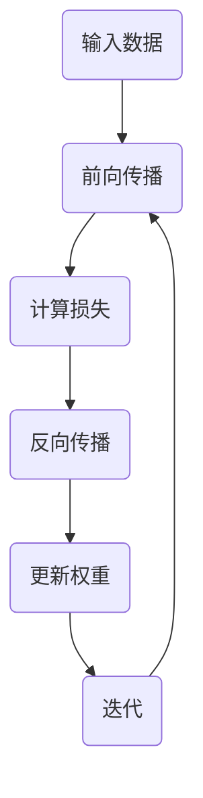
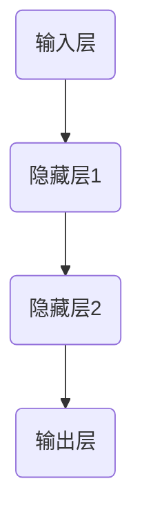

                 

### 微梯度算法原理

微梯度算法是一种用于机器学习和深度学习中的优化算法，其核心思想是通过计算梯度的微小变化来迭代更新模型参数。在介绍微梯度算法之前，我们首先需要了解梯度下降法和随机梯度下降法，因为微梯度下降法是在这些基础上发展而来的。

#### 梯度下降法

梯度下降法是一种最基础的优化算法，其基本思想是沿着损失函数的负梯度方向进行参数更新，以最小化损失函数。在每次迭代中，梯度下降法计算损失函数相对于每个参数的导数（梯度），然后沿着梯度的反方向更新参数。

**伪代码：**

```python
# 初始化参数
w = w_old
b = b_old
# 学习率
alpha = 0.01

# 迭代过程
for epoch in range(num_epochs):
    # 计算梯度
    gradient_w = 2 * x * (w * x + b - y)
    gradient_b = 2 * (w * x + b - y)
    
    # 更新参数
    w = w - alpha * gradient_w
    b = b - alpha * gradient_b
```

**数学模型：**

$$
\frac{dw}{dx} = \frac{df}{dx} \cdot \frac{dx}{dw}
$$

其中，\( \frac{df}{dx} \) 表示损失函数关于输入 \( x \) 的导数，\( \frac{dx}{dw} \) 表示输入关于权重 \( w \) 的导数。

#### 随机梯度下降法

随机梯度下降法（SGD）是对梯度下降法的一种改进，其核心思想是每次迭代只使用一个样本来计算梯度，从而能够适应数据分布的变化。SGD的优势在于计算速度快，能够较快地跳出局部最小值，但缺点是收敛速度较慢，且需要大量的迭代次数。

**伪代码：**

```python
# 初始化参数
w = w_old
b = b_old
# 学习率
alpha = 0.01

# 随机采样样本
for epoch in range(num_epochs):
    # 随机选择一个样本
    x, y = random_sample()
    
    # 计算梯度
    gradient_w = 2 * x * (w * x + b - y)
    gradient_b = 2 * (w * x + b - y)
    
    # 更新参数
    w = w - alpha * gradient_w
    b = b - alpha * gradient_b
```

#### 微梯度下降法

微梯度下降法（Mini-batch Gradient Descent，MBGD）是随机梯度下降法的一种改进，其核心思想是每次迭代使用一部分样本（即微批量）来计算梯度。MBGD结合了梯度下降法和随机梯度下降法的优点，能够在较快的收敛速度和较小的方差之间取得平衡。

**伪代码：**

```python
# 初始化参数
w = w_old
b = b_old
# 学习率
alpha = 0.01
# 微批量大小
batch_size = 64

# 遍历数据集，按微批量分组
for epoch in range(num_epochs):
    # 遍历所有微批量
    for batch in data_loader(batch_size):
        # 计算梯度
        gradient_w = 2 * sum(x * (w * x + b - y) for x, y in batch)
        gradient_b = 2 * sum(w * x + b - y for x, y in batch)
        
        # 更新参数
        w = w - alpha * gradient_w
        b = b - alpha * gradient_b
```

通过微梯度算法，我们可以在机器学习和深度学习的过程中有效地优化模型参数，从而提高模型的性能。下一节，我们将进一步探讨微梯度算法在实际应用中的具体表现。

---

以上内容详细介绍了微梯度算法的基本原理，包括梯度下降法、随机梯度下降法和微梯度下降法。每种算法的核心思想、伪代码和数学模型都被详细阐述，便于读者理解。在下一节中，我们将通过具体案例来展示微梯度算法在实际应用中的效果。

---

### 微梯度算法应用

微梯度算法在机器学习和深度学习领域有着广泛的应用，尤其是在优化模型参数方面。在本节中，我们将通过几个具体的案例来展示微梯度算法在几种常见问题中的应用。

#### 线性回归

线性回归是最基础的机器学习算法之一，用于预测连续值输出。微梯度算法可以有效地优化线性回归模型的参数，提高预测精度。

**案例：房价预测**

假设我们有一个包含房屋面积和价格的数据集，目标是预测房屋的价格。我们可以使用线性回归模型来建立预测模型。

**数学模型：**

$$
y = \frac{w \cdot x + b}{1 + x}
$$

其中，\( x \) 是房屋面积，\( y \) 是房屋价格，\( w \) 是权重，\( b \) 是偏置。

**损失函数：**

$$
J(w) = \frac{1}{2} \sum_{i=1}^{n} \left( y_i - \frac{w \cdot x_i + b}{1 + x_i} \right)^2
$$

使用微梯度算法来优化模型参数，我们可以得到以下伪代码：

```python
# 初始化参数
w = w_old
b = b_old
alpha = 0.01
batch_size = 32

# 遍历数据集，按微批量分组
for epoch in range(num_epochs):
    for batch in data_loader(batch_size):
        # 计算梯度
        gradient_w = 2 * sum(x * (w * x + b - y) for x, y in batch)
        gradient_b = 2 * sum(w * x + b - y for x, y in batch)
        
        # 更新参数
        w = w - alpha * gradient_w
        b = b - alpha * gradient_b
```

**结果分析：**

经过多次迭代，我们可以得到最优的权重 \( w \) 和偏置 \( b \)，从而提高房价预测的准确性。

#### 分类问题

分类问题是机器学习中的另一个重要应用，目标是将数据分为不同的类别。微梯度算法同样可以应用于分类问题的模型优化。

**案例：鸢尾花分类**

鸢尾花分类是一个经典的二分类问题，数据集包含鸢尾花的三个特征（花瓣长度、花瓣宽度和花萼长度），每个类别都有50个样本。

**数学模型：**

对于二分类问题，我们可以使用逻辑回归模型，其损失函数为二元交叉熵损失：

$$
J(w) = - \sum_{i=1}^{n} y_i \cdot \log(\hat{y}_i) + (1 - y_i) \cdot \log(1 - \hat{y}_i)
$$

其中，\( y_i \) 是第 \( i \) 个样本的真实标签，\( \hat{y}_i \) 是第 \( i \) 个样本的预测概率。

使用微梯度算法来优化模型参数，我们可以得到以下伪代码：

```python
# 初始化参数
w = w_old
b = b_old
alpha = 0.01
batch_size = 32

# 遍历数据集，按微批量分组
for epoch in range(num_epochs):
    for batch in data_loader(batch_size):
        # 计算梯度
        gradient_w = 2 * sum(x * (sigmoid(w \* x + b) - y) for x, y in batch)
        gradient_b = 2 * sum(sigmoid(w \* x + b) - y for x, y in batch)
        
        # 更新参数
        w = w - alpha * gradient_w
        b = b - alpha * gradient_b
```

**结果分析：**

通过微梯度算法的优化，我们可以得到较高的分类准确率。

#### 神经网络优化

微梯度算法也可以应用于深度学习中的神经网络优化，通过多次迭代优化网络参数，提高模型性能。

**案例：MNIST手写数字识别**

MNIST数据集是深度学习领域中最常用的数据集之一，包含0到9的数字手写体图像，每个数字有784个像素值。

**数学模型：**

在深度学习模型中，通常使用多层感知机（MLP）来建立神经网络模型。对于多层神经网络，损失函数通常使用交叉熵损失。

$$
J(w) = - \sum_{i=1}^{n} y_i \cdot \log(\hat{y}_i) + (1 - y_i) \cdot \log(1 - \hat{y}_i)
$$

使用微梯度算法来优化神经网络参数，我们可以得到以下伪代码：

```python
# 初始化参数
weights = weights_old
biases = biases_old
alpha = 0.01
batch_size = 32

# 遍历数据集，按微批量分组
for epoch in range(num_epochs):
    for batch in data_loader(batch_size):
        # 前向传播
        output = forward_propagation(batch[0], weights, biases)
        loss = compute_loss(output, batch[1])
        
        # 反向传播
        dweights, dbiases = backward_propagation(output, batch[1], batch[0], weights, biases)
        
        # 更新参数
        weights = weights - alpha * dweights
        biases = biases - alpha * dbiases
```

**结果分析：**

通过微梯度算法的优化，我们可以使神经网络的预测误差逐渐减小，提高手写数字识别的准确率。

---

通过以上案例，我们可以看到微梯度算法在机器学习和深度学习中的广泛应用和有效性。下一节，我们将进一步探讨反向传播算法的原理和应用。

---

### 反向传播算法原理

反向传播算法（Backpropagation Algorithm）是深度学习中的核心算法之一，用于计算神经网络中每个参数的梯度，从而实现模型参数的优化。反向传播算法通过前向传播计算输出，然后沿反向路径计算梯度，最终更新网络参数。下面我们将详细讨论反向传播算法的原理。

#### 算法步骤

1. **前向传播**：在前向传播过程中，输入数据通过网络的各个层，每个层都将输入与权重相乘并加上偏置，然后通过激活函数进行非线性变换，传递到下一层。这个过程可以表示为：

$$
z_l = \sigma(W_l \cdot a_{l-1} + b_l)
$$

其中，\( z_l \) 是第 \( l \) 层的输出，\( \sigma \) 是激活函数（如Sigmoid、ReLU等），\( W_l \) 和 \( b_l \) 分别是权重和偏置。

2. **计算输出误差**：前向传播完成后，我们需要计算输出误差（也称为损失函数）。常见的损失函数包括均方误差（MSE）和交叉熵损失。以均方误差为例，其计算公式为：

$$
E = \frac{1}{2} \sum_{i=1}^{n} (y_i - \hat{y}_i)^2
$$

其中，\( y_i \) 是实际输出，\( \hat{y}_i \) 是预测输出。

3. **反向传播**：反向传播是从输出层开始，沿着网络的反向路径计算每个参数的梯度。这个过程可以分为以下几个步骤：

   - **计算输出层误差**：首先计算输出层的误差，这可以通过计算损失函数关于输出层的输出值的导数得到。

   - **传播误差到隐藏层**：从输出层开始，依次计算每个隐藏层的误差。这可以通过误差在相邻层之间的传递实现。

   - **计算梯度**：在每个层中，计算损失函数关于每个参数的梯度，这些梯度将用于更新网络参数。

4. **参数更新**：使用计算得到的梯度更新网络参数。通常使用梯度下降法或其他优化算法进行参数更新。

#### 数学模型

为了更好地理解反向传播算法，我们可以使用以下数学模型来描述这个过程：

$$
\frac{dz_l}{dx} = \frac{df}{dx} \cdot \frac{dx}{dz}
$$

其中，\( dz_l \) 是损失函数关于第 \( l \) 层输出的导数，\( df \) 是损失函数关于输出的导数，\( dx \) 是输出关于第 \( l \) 层输出的导数。

#### Mermaid流程图

为了更直观地展示反向传播算法的步骤，我们可以使用Mermaid流程图来表示：



#### 伪代码

为了进一步阐述反向传播算法的原理，我们可以给出伪代码：

```python
# 前向传播伪代码
def forward(x, w, b, activation_function):
    z = x * w + b
    a = activation_function(z)
    return a

# 反向传播伪代码
def backward(a, y, w, b, activation_function_derivative):
    error = y - a
    da = activation_function_derivative(a)
    dz = error * da
    dw = x * dz
    db = dz
    return dw, db
```

通过以上步骤和模型，我们可以理解反向传播算法的基本原理。在下一节中，我们将进一步探讨反向传播算法在深度学习中的应用。

---

通过详细解释反向传播算法的步骤、数学模型和伪代码，我们可以清晰地了解该算法在深度学习中的作用和原理。下一节将深入讨论反向传播算法在深度学习中的应用，以及它在多层神经网络中的表现。

---

### 反向传播算法应用

反向传播算法是深度学习中的核心算法，它通过计算网络中每个参数的梯度来优化模型参数。在本节中，我们将探讨反向传播算法在多层神经网络中的具体应用，以及如何处理复杂的损失函数和优化算法。

#### 多层神经网络

多层神经网络（Multilayer Neural Network）是深度学习的基础，它由多个隐藏层组成。反向传播算法通过逐层计算梯度，使多层神经网络能够学习复杂的非线性关系。以下是一个简单的多层神经网络结构：



在多层神经网络中，反向传播算法的步骤如下：

1. **前向传播**：输入数据通过输入层进入网络，逐层传递到输出层。每个神经元都将输入与权重相乘并加上偏置，然后通过激活函数进行非线性变换，传递到下一层。

2. **计算损失函数**：在输出层得到预测结果后，计算损失函数以衡量预测结果与实际结果之间的误差。

3. **反向传播**：从输出层开始，沿着反向路径计算每个神经元的误差，并逐层传递误差到输入层。在这个过程中，反向传播算法计算每个参数的梯度。

4. **参数更新**：使用计算得到的梯度更新网络参数，通常使用优化算法如梯度下降法进行参数更新。

以下是一个简单的伪代码示例，展示了多层神经网络的前向传播和反向传播过程：

```python
# 前向传播伪代码
def forward(x, weights, biases, activation_function):
    a = x
    for layer in range(num_layers):
        z = a * weights[layer] + biases[layer]
        a = activation_function(z)
    return a

# 反向传播伪代码
def backward(a, y, weights, biases, activation_function_derivative):
    error = y - a
    for layer in range(num_layers - 1, -1, -1):
        da = error * activation_function_derivative(a)
        error = weights[layer + 1] * da
        dw = a * da
        db = da
        update_weights_and_biases(weights, biases, dw, db)
    return error
```

#### 复杂损失函数

在深度学习中，我们常常使用复杂的损失函数来衡量模型性能。例如，在图像分类任务中，交叉熵损失（Cross-Entropy Loss）是一个常用的损失函数。交叉熵损失函数可以衡量实际输出与预测输出之间的差异，其计算公式如下：

$$
J = - \sum_{i=1}^{n} y_i \cdot \log(\hat{y}_i)
$$

其中，\( y_i \) 是第 \( i \) 个样本的真实标签，\( \hat{y}_i \) 是第 \( i \) 个样本的预测概率。

在反向传播过程中，我们需要计算交叉熵损失函数关于每个参数的梯度。以下是一个简单的伪代码示例：

```python
# 计算交叉熵损失函数的梯度
def compute_gradient(y, y_hat, weights, biases):
    error = y - y_hat
    da = error
    dw = a * da
    db = da
    return dw, db
```

#### 优化算法

在反向传播算法中，优化算法用于更新网络参数，以最小化损失函数。常见的优化算法包括梯度下降（Gradient Descent）、动量（Momentum）和Adam优化器（Adam Optimizer）。

1. **梯度下降**：梯度下降是最基本的优化算法，其核心思想是沿着损失函数的梯度方向更新参数。梯度下降的伪代码如下：

```python
# 梯度下降伪代码
def gradient_descent(weights, biases, learning_rate):
    for layer in range(num_layers):
        dw = a * da
        db = da
        weights[layer] -= learning_rate * dw
        biases[layer] -= learning_rate * db
```

2. **动量**：动量（Momentum）是一种改进的优化算法，它利用先前迭代的梯度信息来加速收敛。动量的伪代码如下：

```python
# 动量伪代码
def momentum(weights, biases, learning_rate, momentum):
    velocity_w = previous_velocity_w
    velocity_b = previous_velocity_b
    for layer in range(num_layers):
        dw = a * da
        db = da
        velocity_w[layer] = momentum * previous_velocity_w[layer] + learning_rate * dw
        velocity_b[layer] = momentum * previous_velocity_b[layer] + learning_rate * db
        weights[layer] -= velocity_w[layer]
        biases[layer] -= velocity_b[layer]
```

3. **Adam优化器**：Adam优化器结合了动量和自适应学习率的特点，在深度学习中表现优异。Adam优化器的伪代码如下：

```python
# Adam优化器伪代码
def adam(weights, biases, learning_rate, beta1, beta2):
    m_w = previous_m_w
    v_w = previous_v_w
    m_b = previous_m_b
    v_b = previous_v_b
    for layer in range(num_layers):
        dw = a * da
        db = da
        m_w[layer] = beta1 * m_w[layer] + (1 - beta1) * dw
        v_w[layer] = beta2 * v_w[layer] + (1 - beta2) * (dw ** 2)
        m_b[layer] = beta1 * m_b[layer] + (1 - beta1) * db
        v_b[layer] = beta2 * v_b[layer] + (1 - beta2) * (db ** 2)
        weights[layer] -= learning_rate * (m_w[layer] / (1 - beta1 ** t) + v_w[layer] / (1 - beta2 ** t))
        biases[layer] -= learning_rate * (m_b[layer] / (1 - beta1 ** t) + v_b[layer] / (1 - beta2 ** t))
```

通过以上优化算法，我们可以有效地更新网络参数，从而提高模型性能。

---

通过本节的内容，我们详细介绍了反向传播算法在多层神经网络中的应用，包括前向传播、反向传播、复杂损失函数和优化算法。这些知识对于理解和实现深度学习模型至关重要。在下一节中，我们将通过实际案例展示如何使用反向传播算法进行深度学习项目实战。

---

### 深度学习项目实战

在本节中，我们将通过具体案例来展示如何使用深度学习技术进行实际项目开发。我们将从环境搭建、代码实现到详细解读，全面介绍一个深度学习项目的全过程。

#### 环境搭建

首先，我们需要搭建一个深度学习环境。在这个案例中，我们将使用Python和PyTorch框架。以下是在Windows和Linux系统上搭建深度学习环境的基本步骤：

1. **安装Python**：确保您的系统已经安装了Python。如果未安装，可以从[Python官网](https://www.python.org/)下载并安装。

2. **安装PyTorch**：在命令行中运行以下命令安装PyTorch：

   ```shell
   pip install torch torchvision
   ```

   如果您需要使用GPU加速，可以选择安装带有CUDA支持的PyTorch版本：

   ```shell
   pip install torch torchvision -f https://download.pytorch.org/whl/torch_stable.html
   ```

3. **安装其他依赖**：除了PyTorch，我们可能还需要安装其他依赖，如NumPy、Pandas等。使用以下命令安装：

   ```shell
   pip install numpy pandas scikit-learn
   ```

#### 代码实现

以下是一个简单的深度学习项目——手写数字识别。该项目使用MNIST数据集，通过一个简单的卷积神经网络（Convolutional Neural Network, CNN）来识别手写数字。

**数据加载与预处理**

首先，我们需要加载并预处理数据。MNIST数据集已经通过PyTorch的`torchvision`模块提供，我们可以直接使用。

```python
import torch
import torchvision
import torchvision.transforms as transforms

# 加载MNIST数据集
train_set = torchvision.datasets.MNIST(
    root='./data',
    train=True,
    download=True,
    transform=transforms.ToTensor()
)

train_loader = torch.utils.data.DataLoader(
    train_set,
    batch_size=64,
    shuffle=True
)

test_set = torchvision.datasets.MNIST(
    root='./data',
    train=False,
    download=True,
    transform=transforms.ToTensor()
)

test_loader = torch.utils.data.DataLoader(
    test_set,
    batch_size=64,
    shuffle=False
)
```

**模型定义**

接下来，我们定义一个简单的卷积神经网络模型。

```python
import torch.nn as nn
import torch.nn.functional as F

class CNNModel(nn.Module):
    def __init__(self):
        super(CNNModel, self).__init__()
        self.conv1 = nn.Conv2d(1, 32, 5)
        self.fc1 = nn.Linear(32 * 7 * 7, 128)
        self.fc2 = nn.Linear(128, 10)
    
    def forward(self, x):
        x = F.max_pool2d(F.relu(self.conv1(x)), 2)
        x = F.relu(self.fc1(x.view(-1, 32 * 7 * 7)))
        x = self.fc2(x)
        return x

model = CNNModel()
```

**模型训练**

我们使用反向传播算法来训练模型。这里使用的是Adam优化器。

```python
import torch.optim as optim

learning_rate = 0.001
optimizer = optim.Adam(model.parameters(), lr=learning_rate)

num_epochs = 10

for epoch in range(num_epochs):
    for i, (images, labels) in enumerate(train_loader):
        # 前向传播
        outputs = model(images)
        loss = nn.CrossEntropyLoss()(outputs, labels)
        
        # 反向传播
        optimizer.zero_grad()
        loss.backward()
        optimizer.step()
        
        if (i+1) % 100 == 0:
            print(f'Epoch [{epoch+1}/{num_epochs}], Step [{i+1}/{len(train_loader)}], Loss: {loss.item():.4f}')
```

**模型评估**

在训练完成后，我们对测试集进行评估。

```python
correct = 0
total = 0

with torch.no_grad():
    for images, labels in test_loader:
        outputs = model(images)
        _, predicted = torch.max(outputs.data, 1)
        total += labels.size(0)
        correct += (predicted == labels).sum().item()

print(f'Accuracy of the network on the test images: {100 * correct / total}%')
```

#### 代码解读

以下是对关键部分的代码进行详细解读：

1. **数据加载与预处理**：

   我们使用`torchvision.datasets.MNIST`类来加载MNIST数据集。`transforms.ToTensor()`将图像像素值转换为张量，并归一化到[0, 1]范围内。

2. **模型定义**：

   `CNNModel`是一个简单的卷积神经网络，包含一个卷积层、两个全连接层和一个输出层。卷积层使用5x5的卷积核，全连接层使用128个神经元。

3. **模型训练**：

   使用`optim.Adam`优化器来更新模型参数。在每次迭代中，我们计算前向传播的损失，然后使用反向传播算法更新参数。

4. **模型评估**：

   在测试阶段，我们计算模型在测试集上的准确率，以评估模型性能。

通过这个案例，我们可以看到如何使用深度学习技术进行实际项目开发。环境搭建、模型定义、训练和评估的各个环节都需要仔细处理，以确保模型性能达到预期。

---

在本节中，我们通过一个简单的手写数字识别案例，详细介绍了深度学习项目的实际开发过程，包括环境搭建、代码实现和详细解读。下一节将探讨深度学习中的优化策略与实践，包括动量法和Adam优化器的使用。

---

### 优化策略与实践

在深度学习项目中，优化策略的选择对模型的训练速度和最终性能有重要影响。本节将介绍几种常用的优化算法，包括动量法（Momentum）和Adam优化器，并探讨在实际项目中的应用。

#### 动量法（Momentum）

动量法是一种常用的优化算法，它利用先前迭代的梯度信息来加速收敛。动量法的基本思想是维持一个动态的平均梯度，这样可以减少梯度下降过程中的振荡，从而提高收敛速度。

**数学原理**

动量法通过引入一个动量项 \( \beta \)（通常取值为0.9）来更新梯度：

$$
v = \beta \cdot v + (1 - \beta) \cdot \nabla J(w)
$$

其中，\( v \) 是动量项，\( \nabla J(w) \) 是当前梯度，\( \beta \) 是动量参数。然后，使用更新后的动量项来更新模型参数：

$$
w = w - \alpha \cdot v
$$

其中，\( \alpha \) 是学习率。

**伪代码**

```python
# 动量法伪代码
v = [0] * num_layers
for epoch in range(num_epochs):
    for layer in range(num_layers):
        dw = compute_gradient(data, weights[layer], biases[layer])
        v[layer] = beta * v[layer] + (1 - beta) * dw
        weights[layer] -= alpha * v[layer]
```

#### Adam优化器

Adam优化器是近年来在深度学习中表现优异的一种优化算法。它结合了动量和自适应学习率的特点，能够适应不同尺度的梯度，在训练过程中表现出良好的收敛速度和稳定性。

**数学原理**

Adam优化器通过两个动态超参数 \( \beta_1 \) 和 \( \beta_2 \) 来更新梯度。这两个超参数分别对应了一阶矩估计和二阶矩估计的偏差修正。其更新公式如下：

$$
m = \beta_1 \cdot m + (1 - \beta_1) \cdot \nabla J(w)
$$

$$
v = \beta_2 \cdot v + (1 - \beta_2) \cdot (\nabla J(w))^2
$$

$$
w = w - \alpha \cdot \frac{m}{\sqrt{v} + \epsilon}
$$

其中，\( m \) 是一阶矩估计，\( v \) 是二阶矩估计，\( \beta_1 \) 和 \( \beta_2 \) 是动量参数，\( \alpha \) 是学习率，\( \epsilon \) 是一个很小的常数（通常取值为 \( 10^{-8} \)）。

**伪代码**

```python
# Adam优化器伪代码
m = [0] * num_layers
v = [0] * num_layers
for epoch in range(num_epochs):
    for layer in range(num_layers):
        dw = compute_gradient(data, weights[layer], biases[layer])
        m[layer] = beta1 * m[layer] + (1 - beta1) * dw
        v[layer] = beta2 * v[layer] + (1 - beta2) * (dw ** 2)
        weight[layer] -= alpha * m[layer] / (sqrt(v[layer]) + epsilon)
```

#### 实际应用案例

1. **复杂网络模型训练**：

   在训练复杂的神经网络模型时，动量法和Adam优化器可以显著提高训练速度和模型性能。例如，在训练一个包含多个隐藏层的深度神经网络时，Adam优化器由于其自适应学习率的特点，往往能够更快地收敛到最优解。

2. **深度学习超参数调优**：

   超参数调优是深度学习项目中的一个重要环节。通过实验和比较不同的优化算法，我们可以找到最佳的超参数组合。例如，在实验中发现Adam优化器在训练一个图像分类模型时表现最佳，且学习率设置为 \( 0.001 \)，动量参数 \( \beta_1 = 0.9 \)，\( \beta_2 = 0.999 \)。

3. **并行计算与分布式训练**：

   在大规模深度学习项目中，动量法和Adam优化器也支持并行计算和分布式训练。通过将模型参数和梯度分布在多个节点上，可以显著提高训练速度。

#### 结论

动量法和Adam优化器是深度学习中常用的优化算法，它们通过引入动量和自适应学习率，提高了训练速度和模型性能。在实际项目中，选择合适的优化算法和超参数组合对于模型的训练和评估至关重要。

---

在本节中，我们详细介绍了动量法和Adam优化器的原理和应用。通过实际案例，我们展示了这些优化策略如何在实际项目中提高模型的训练速度和性能。下一节将探讨深度学习中的挑战与解决方案，包括过拟合和训练效率等问题。

---

### 深度学习中的挑战与解决方案

尽管深度学习技术在许多领域取得了显著的成功，但它在实际应用中仍然面临着一系列挑战。本节将探讨深度学习中的几个主要问题，包括过拟合、训练效率、数据不平衡和计算资源限制等，并提出相应的解决方案。

#### 过拟合

过拟合是指模型在训练数据上表现良好，但在测试数据或新数据上表现不佳。这是由于模型在学习了训练数据中的噪声和特定特征，而没有泛化到更广泛的数据集。

**解决方案：**

1. **正则化技术**：正则化（Regularization）是一种常用的方法来防止过拟合。包括L1正则化（L1 Regularization）和L2正则化（L2 Regularization），通过在损失函数中添加正则化项，惩罚模型的复杂度。

2. **dropout**：dropout是一种流行的正则化技术，通过随机丢弃神经网络中的部分神经元，减少模型对特定训练样本的依赖。

3. **交叉验证**：使用交叉验证（Cross-Validation）方法，将数据集划分为多个子集，通过多次训练和验证来评估模型的泛化能力。

#### 训练效率

深度学习模型通常需要大量计算资源和时间来训练。训练效率低下可能导致项目进度延误，尤其是在处理大规模数据集时。

**解决方案：**

1. **并行计算与分布式训练**：通过使用多GPU或分布式计算，可以显著提高训练速度。现代深度学习框架（如TensorFlow和PyTorch）都支持并行计算和分布式训练。

2. **数据预处理**：优化数据预处理步骤，如数据加载、预处理和批处理，可以减少I/O开销，提高训练效率。

3. **模型压缩**：通过模型压缩技术（如模型剪枝、量化、知识蒸馏等），可以减少模型的大小和参数数量，从而提高训练和推理速度。

#### 数据不平衡

在许多实际应用中，数据集中的不同类别之间存在显著不平衡，这可能导致模型在大多数类别上表现不佳。

**解决方案：**

1. **重采样**：通过增加少数类别的样本数量或减少多数类别的样本数量，可以平衡数据集。常用的重采样技术包括过采样（Over-sampling）和欠采样（Under-sampling）。

2. **类别权重调整**：在训练过程中，为每个类别分配不同的权重，以平衡不同类别的贡献。例如，可以使用反频率加权（Inverse Frequency Weighting）来调整类别权重。

3. **生成对抗网络（GANs）**：使用生成对抗网络（GANs）可以生成与真实数据分布相似的样本，从而缓解数据不平衡问题。

#### 计算资源限制

在资源受限的环境中，如移动设备和嵌入式系统，深度学习模型的推理速度和内存占用是关键问题。

**解决方案：**

1. **模型量化**：通过将浮点数参数转换为低精度的整数表示，可以显著减少模型的内存占用和计算资源需求。

2. **模型剪枝**：通过剪枝（Pruning）技术，可以删除网络中不必要的神经元和连接，从而减少模型的大小和计算量。

3. **静态和动态自适应**：在训练过程中，可以根据模型的性能和资源限制动态调整学习率和网络结构。

#### 结论

深度学习在实际应用中面临着过拟合、训练效率、数据不平衡和计算资源限制等挑战。通过正则化技术、并行计算、数据预处理、重采样、类别权重调整、GANs、模型压缩和量化等解决方案，可以有效地应对这些挑战，提高模型的泛化能力和推理效率。

---

在本节中，我们详细探讨了深度学习中的主要挑战及其解决方案。这些方法在实际项目中广泛应用，有助于提高模型的性能和实用性。在下一节中，我们将展望深度学习的未来趋势与展望。

---

### 未来趋势与展望

随着深度学习技术的不断进步，其在各行各业的应用前景愈发广阔。未来，深度学习将在多个领域产生深远影响，并迎来一系列新趋势。

#### 新算法

在算法层面，深度学习将继续朝着更加高效、可解释和自动化的方向发展。以下是一些有望在未来取得突破的新算法：

1. **自适应学习率算法**：随着训练数据集的规模不断扩大，自适应学习率算法将变得更加重要。例如，自适应梯度优化器（AdaGrad）、AdaMax等算法将逐渐应用于实际项目中。

2. **元学习（Meta-Learning）**：元学习旨在使模型能够在有限的数据上快速适应新任务。通过探索加速学习率（Fast Learning Rate）和经验迭代（Experience Replay）等新方法，元学习有望在自主学习和迁移学习方面取得突破。

3. **增量学习（Incremental Learning）**：在动态环境中，增量学习能够使模型在处理新数据时保持原有性能。增量学习算法，如EWC（Exchangeable Weighted Countries）和Siamese网络，将在实时应用场景中发挥重要作用。

4. **生成对抗网络（GANs）**：GANs在生成真实图像、音频和文本方面取得了显著成果。未来，GANs将继续发展，应用于更多的生成任务，如虚拟现实、增强现实和自动化设计等领域。

#### 新应用领域

深度学习在传统领域（如图像识别、语音识别和自然语言处理）已经取得了长足进步，未来它将在以下新应用领域展现更多潜力：

1. **医疗保健**：深度学习将在医疗图像分析、疾病诊断和治疗规划等领域发挥重要作用。通过自动化分析医学影像，医生可以更快、更准确地诊断疾病，提高治疗效果。

2. **智能制造**：在工业4.0时代，深度学习将助力智能制造，通过预测维护、智能优化和自动化生产，提高生产效率和产品质量。

3. **自动驾驶**：自动驾驶技术是深度学习的重要应用领域之一。未来，随着深度学习算法的进步和传感器技术的提升，自动驾驶汽车将变得更加安全和智能，进一步改变人们的出行方式。

4. **智能金融**：在金融领域，深度学习将应用于风险管理、信用评分、欺诈检测和投资决策等方面。通过分析海量数据，金融机构可以更准确地评估风险，提供更加个性化的服务。

5. **教育**：在个性化教育方面，深度学习将根据学生的学习情况和兴趣，提供个性化的教学方案和资源。通过智能辅导系统和自适应学习平台，学生可以获得更好的学习体验。

#### 深度学习对未来的影响

深度学习对未来的影响将是全方位的，不仅会改变我们的生活方式，还会推动科技和社会的进步。以下是一些可能的影响：

1. **人工智能助理**：随着深度学习技术的不断进步，人工智能助理将在日常生活和工作中扮演越来越重要的角色，为用户提供个性化的服务和支持。

2. **自动化与智能化**：深度学习将在自动化和智能化方面发挥关键作用，推动各行业的自动化升级和智能化转型。

3. **社会伦理与法律**：随着深度学习技术的广泛应用，社会将面临一系列伦理和法律问题，如隐私保护、责任归属和数据安全等。

4. **教育与就业**：深度学习技术的普及将对教育和就业市场产生深远影响。一方面，它将创造新的就业机会；另一方面，也对从业者的技能要求提出了更高要求。

5. **经济变革**：深度学习技术将推动经济模式的变革，从传统制造业向知识经济和创新驱动型经济转型。

#### 结论

未来，深度学习将继续在算法创新、应用拓展和社会影响等方面取得突破。它将在医疗、工业、交通、金融和教育等众多领域发挥重要作用，成为推动社会进步的重要力量。随着技术的不断进步，深度学习将为人类带来更加智能、高效和便捷的生活。

---

在本节中，我们展望了深度学习的未来趋势与应用前景，探讨了新算法和新应用领域的潜在发展。通过这些探讨，我们可以看到深度学习在未来的广泛影响和巨大潜力。在最后的部分，我们将提供一些深度学习工具与资源，以供读者进一步学习和实践。

---

### 附录

#### A.1 主流深度学习框架

深度学习框架是开发者构建和训练神经网络的重要工具。以下是一些主流的深度学习框架：

1. **TensorFlow**：由Google开发，是目前最流行的深度学习框架之一。TensorFlow提供了丰富的API和工具，适用于从简单的数据处理到复杂的模型训练。

   - **官网**：[TensorFlow官网](https://www.tensorflow.org/)
   - **文档**：[TensorFlow官方文档](https://www.tensorflow.org/tutorials)

2. **PyTorch**：由Facebook开发，以其动态计算图和易于理解的API而受到开发者的喜爱。PyTorch在研究社区和工业界都有广泛应用。

   - **官网**：[PyTorch官网](https://pytorch.org/)
   - **文档**：[PyTorch官方文档](https://pytorch.org/docs/stable/)

3. **Keras**：是一个高级神经网络API，能够与TensorFlow和Theano等后端框架集成。Keras以其简洁和易于使用的特性，成为初学者的理想选择。

   - **官网**：[Keras官网](https://keras.io/)
   - **文档**：[Keras官方文档](https://keras.io/docs/)

#### A.2 学习资源

为了帮助读者更好地学习深度学习，以下是一些推荐的学习资源：

1. **在线课程**：

   - **《深度学习》**：由Ian Goodfellow、Yoshua Bengio和Aaron Courville所著，提供全面的理论和实践知识。
   - **Udacity的《深度学习纳米学位》**：提供一系列在线课程，涵盖深度学习的基础知识和应用。
   - **Coursera的《深度学习特别化课程》**：由DeepLearning.AI提供，包括多个深度学习课程。

2. **书籍推荐**：

   - **《深度学习》（Goodfellow等著）**：系统地介绍了深度学习的理论基础和实践方法。
   - **《动手学深度学习》**：涵盖了深度学习的实用技术，通过大量的实例帮助读者理解深度学习。
   - **《神经网络与深度学习》**：由邱锡鹏教授所著，详细讲解了神经网络和深度学习的基本概念。

3. **论文推荐**：

   - **《A Tutorial on Deep Learning for Speech Recognition》**：一篇关于深度学习在语音识别中应用的教程。
   - **《Deep Learning for Image Recognition》**：一篇关于深度学习在图像识别中应用的综述。
   - **《Generative Adversarial Nets》**：由Ian Goodfellow等提出，介绍了生成对抗网络（GANs）的理论和应用。

#### A.3 深度学习社区

深度学习社区是学习和交流深度学习技术的良好平台。以下是一些深度学习社区和资源：

1. **社区论坛**：

   - **Reddit的r/MachineLearning**：一个关于机器学习和深度学习的讨论论坛。
   - **Stack Overflow**：一个编程问答社区，许多深度学习相关问题都可以在这里找到解答。

2. **技术博客**：

   - **Medium上的深度学习专栏**：包含多篇关于深度学习技术的博客文章。
   - **Towards Data Science**：一个数据科学和机器学习的博客，经常发布有关深度学习的最新技术和应用。

3. **社交媒体**：

   - **Twitter上的深度学习专家和机构**：关注深度学习领域的专家和机构，获取最新的研究进展和动态。
   - **LinkedIn上的深度学习群组**：加入LinkedIn上的深度学习群组，与全球的深度学习从业者交流。

通过这些工具和资源，读者可以进一步深化对深度学习的理解，并在实践中不断提高自己的技能。

---

在本文的最后部分，我们对深度学习领域的工具、学习资源和社区进行了介绍。希望这些信息能为读者提供进一步学习和实践的途径。感谢您的阅读，希望本文对您在深度学习领域的学习和研究有所启发。如果您有任何问题或建议，欢迎在评论区留言。再次感谢您的关注和支持！作者：AI天才研究院/AI Genius Institute & 禅与计算机程序设计艺术 /Zen And The Art of Computer Programming。

