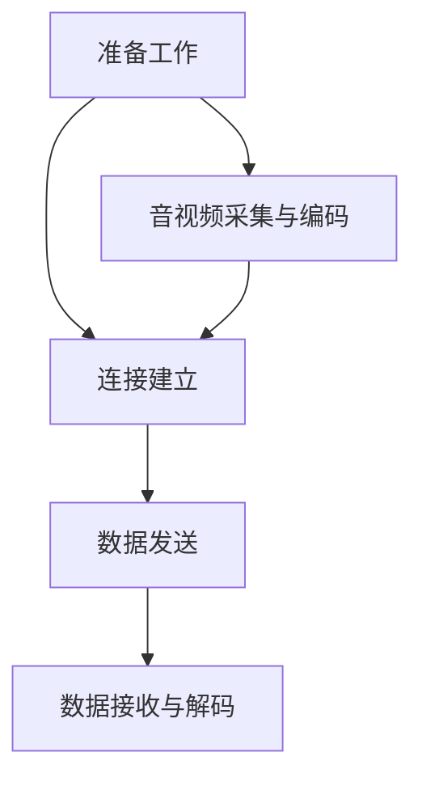
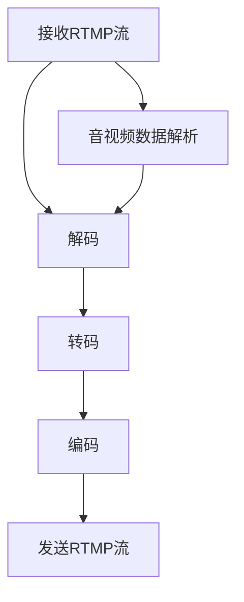

                 

### 文章标题

**RTMP推流与转码优化：从技术本质到实战应用**

### 关键词

(RTMP, 推流, 转码, 优化, 性能, 流媒体, 音视频, 算法, 实战)

### 摘要

本文将深入探讨RTMP推流与转码技术的本质和优化策略。首先，我们将回顾RTMP技术的基础知识，包括其背景、工作原理、优缺点以及与其他流媒体协议的比较。接着，我们将详细分析RTMP推流的原理与实现，并提出一系列优化策略，如带宽控制、稳定性优化和延迟优化。然后，我们将重点介绍RTMP转码技术的原理、算法选择和优化技术。在实战篇中，我们将通过一个实际项目案例，展示如何搭建开发环境、实现推流与转码功能，并解析源代码。最后，我们将探讨RTMP在多平台的应用与适配，以及其在不同行业中的发展趋势和应用前景。通过这篇文章，您将获得对RTMP技术从基础到应用的全面理解和实战经验。

# 第一部分: RTMP推流与转码技术基础

在流媒体传输领域，RTMP（Real-Time Messaging Protocol）是一种广泛使用的协议，它提供了高效的实时数据传输服务。本部分将详细介绍RTMP技术的基础知识，帮助读者了解RTMP的背景、工作原理、优缺点以及与其他流媒体协议的比较。

## 第1章: RTMP技术概述

### 1.1.1 RTMP协议的背景与发展

RTMP协议是由Adobe公司于2003年推出的一种实时流传输协议，最初用于Adobe Flash和Adobe Media Server之间的通信。随着流媒体技术的发展，RTMP逐渐成为互联网视频直播、点播等场景中的主流协议。RTMP协议的设计初衷是为了提供低延迟、高吞吐量的实时数据传输服务，其应用范围从传统的桌面端扩展到移动端、Web端等。

### 1.1.2 RTMP协议的工作原理

RTMP协议基于TCP协议，其工作原理可以概括为以下几个步骤：

1. **连接建立**：客户端和服务器通过TCP协议建立连接。
2. **信道分配**：服务器为客户端分配一个或多个数据信道，用于传输音视频数据。
3. **数据传输**：客户端将音视频数据编码后，通过数据信道发送到服务器。
4. **数据接收**：服务器接收并解码音视频数据，将其输出到播放器。

### 1.1.3 RTMP协议的优缺点分析

**优点**：

- **低延迟**：RTMP协议基于TCP协议，提供了可靠的传输保障，适用于实时性要求较高的应用场景。
- **高吞吐量**：RTMP协议优化了数据传输效率，可以在高带宽环境下实现高速数据传输。
- **支持多种编码格式**：RTMP协议支持多种音视频编码格式，如H.264、AAC等，适应了不同场景的需求。
- **广泛的应用场景**：RTMP协议被广泛应用于视频直播、点播、在线教育等领域。

**缺点**：

- **带宽占用较大**：RTMP协议在传输过程中需要占用较多的带宽，对网络环境要求较高。
- **安全性较低**：RTMP协议在传输过程中未加密，存在一定的安全风险。
- **不兼容新兴协议**：随着新兴流媒体协议（如HLS、DASH）的发展，RTMP协议在兼容性方面逐渐暴露出劣势。

### 1.1.4 RTMP协议与其他流媒体协议的比较

与其他流媒体协议（如HLS、DASH）相比，RTMP具有以下特点：

- **HLS（HTTP Live Streaming）**：HLS协议基于HTTP协议，具有较好的兼容性和扩展性，适用于多种终端设备。但HLS协议在传输过程中会生成多个切片文件，导致传输效率相对较低。
- **DASH（Dynamic Adaptive Streaming over HTTP）**：DASH协议与HLS类似，也基于HTTP协议，提供了自适应流媒体传输功能。DASH协议在性能和兼容性方面优于HLS，但在实时性方面存在一定劣势。

综合来看，RTMP协议在实时性、高吞吐量方面具有明显优势，但在兼容性和安全性方面存在一定不足。在实际应用中，可根据具体需求和场景选择合适的流媒体协议。

## 第2章: RTMP推流原理与实现

在流媒体传输过程中，RTMP推流是关键环节之一。本节将详细讲解RTMP推流的原理和实现过程，包括推流前的准备工作、音视频数据的采集与编码、RTMP连接与数据发送等。

### 2.1.1 RTMP推流流程

RTMP推流流程可以分为以下几个阶段：

1. **准备工作**：配置推流参数，如服务器地址、端口、认证信息等。
2. **数据采集**：采集音视频数据，并转换为适合编码的格式。
3. **数据编码**：对音视频数据进行编码，生成编码数据包。
4. **连接建立**：客户端通过TCP协议与服务器建立连接。
5. **数据发送**：客户端将编码数据包发送到服务器。
6. **数据接收与解码**：服务器接收数据包，并进行解码，将音视频数据输出到播放器。

### 2.1.1.1 推流前的准备工作

在进行RTMP推流前，需要完成以下准备工作：

1. **配置服务器**：配置RTMP服务器，如Adobe Media Server、Nginx RTMP等，确保其正常运行。
2. **选择编码器**：选择适合的音视频编码器，如FFmpeg、X264等，确保编码效率和质量。
3. **准备音视频设备**：连接音视频设备，如摄像头、麦克风等，确保采集到高质量的数据。
4. **设置推流参数**：设置推流参数，如推流地址、端口、认证信息等，确保客户端可以正确连接服务器。

### 2.1.1.2 音视频数据的采集与编码

1. **音视频数据采集**：采集音视频数据，并转换为适合编码的格式。
2. **音视频数据编码**：对音视频数据进行编码，生成编码数据包。常见的编码格式包括H.264、AAC等。

编码过程中，需要关注以下几个关键参数：

- **视频编码参数**：如编码分辨率、帧率、编码率等。
- **音频编码参数**：如采样率、采样格式、编码率等。
- **编码器优化策略**：如线程数、缓冲区大小等。

### 2.1.1.3 RTMP连接与数据发送

1. **连接建立**：客户端通过TCP协议与服务器建立连接，并指定连接参数，如连接类型、连接通道等。
2. **数据发送**：客户端将编码数据包发送到服务器。在数据发送过程中，需要关注以下几个关键参数：

- **发送速率**：根据网络带宽和服务器处理能力，调整数据发送速率，避免网络拥塞和服务器过载。
- **发送顺序**：确保音视频数据包的发送顺序正确，避免播放器解码错误。

### 2.1.2 RTMP推流优化策略

为了提高RTMP推流的性能和稳定性，可以采取以下优化策略：

1. **带宽控制**：根据网络带宽和服务器处理能力，合理调整数据发送速率，避免网络拥塞和服务器过载。
2. **稳定性优化**：通过心跳机制、重传机制等手段，提高推流稳定性，确保数据传输的可靠性。
3. **延迟优化**：通过优化编码参数、调整发送策略等手段，降低数据传输延迟，提高实时性。

### 2.1.3 RTMP推流案例分析

为了更好地理解RTMP推流原理和实现，我们来看一个实际案例。假设我们使用FFmpeg作为编码器，实现一个简单的RTMP推流程序。

```bash
# FFmpeg命令示例
ffmpeg -re -i input.mp4 -c:v libx264 -preset veryfast -c:a aac -ar 44100 -f flv rtmp://server/live/stream
```

在这个示例中，`input.mp4`为输入视频文件，`server`为RTMP服务器地址，`live/stream`为推流路径。通过这个命令，我们可以实现视频文件的实时推流。

## 第3章: RTMP转码技术详解

RTMP转码技术在流媒体传输中扮演着至关重要的角色。它不仅能够满足不同终端设备的播放需求，还能提高流媒体的播放质量和稳定性。本节将详细讲解RTMP转码的原理、流程以及转码算法的选择。

### 3.1.1 RTMP转码原理

RTMP转码过程主要包括以下步骤：

1. **接收RTMP流**：转码服务器从RTMP源接收音视频流。
2. **解码**：对音视频数据进行解码，还原原始音视频数据。
3. **转码**：根据目标终端设备的播放需求，对音视频数据进行重新编码。
4. **编码**：将转码后的音视频数据编码成适合目标终端设备播放的格式。
5. **发送RTMP流**：将编码后的音视频数据发送回客户端。

### 3.1.1.1 音视频转码流程

音视频转码流程可以简化为以下几个步骤：

1. **输入流接收**：转码服务器从RTMP源接收音视频流。
2. **解析**：解析输入流的音视频数据，提取视频、音频、字幕等关键信息。
3. **解码**：对音视频数据进行解码，还原原始音视频数据。
4. **转码**：根据目标终端设备的播放需求，对音视频数据进行重新编码。转码过程包括分辨率调整、帧率调整、编码率调整等。
5. **编码**：将转码后的音视频数据编码成适合目标终端设备播放的格式，如H.264、AAC等。
6. **发送流**：将编码后的音视频数据发送回客户端。

### 3.1.1.2 转码算法的选择

转码算法的选择对于转码性能和效率至关重要。常见的转码算法包括以下几种：

1. **H.264**：H.264是一种高性能、低延迟的视频编码算法，广泛应用于流媒体领域。
2. **H.265**：H.265是一种新的视频编码标准，相比H.264具有更高的压缩效率和更好的画质。
3. **AAC**：AAC是一种高性能、低延迟的音频编码算法，广泛应用于音频流媒体领域。

在选择转码算法时，需要考虑以下几个方面：

- **编码效率**：选择具有较高编码效率的算法，可以降低服务器带宽消耗。
- **解码性能**：选择具有良好解码性能的算法，可以确保终端设备流畅播放。
- **兼容性**：选择具有良好兼容性的算法，可以满足不同终端设备的播放需求。

### 3.1.2 RTMP转码优化技术

为了提高RTMP转码性能和效率，可以采取以下优化技术：

1. **并行处理**：通过多线程、多进程等方式，提高转码速度。
2. **缓冲区管理**：合理设置缓冲区大小，避免转码过程中出现缓冲不足或溢出的问题。
3. **负载均衡**：通过负载均衡技术，合理分配转码任务，避免服务器过载。
4. **动态调整**：根据实时网络状态和终端设备需求，动态调整转码参数，提高转码性能。

### 3.1.3 RTMP转码案例分析

为了更好地理解RTMP转码原理和实现，我们来看一个实际案例。假设我们使用FFmpeg作为转码工具，实现一个RTMP转码服务器。

```bash
# FFmpeg命令示例
ffmpeg -i rtmp://server/live/stream -c:v libx264 -preset veryfast -c:a aac -ar 44100 -f flv rtmp://server/ transcoded_stream
```

在这个示例中，`rtmp://server/live/stream`为输入流地址，`rtmp://server/transcoded_stream`为输出流地址。通过这个命令，我们可以实现输入流的实时转码。

# 第4章: 实战篇：RTMP推流与转码项目实践

在深入了解RTMP推流与转码技术的基础上，本节将带领读者进行一个实际项目的实践，通过搭建开发环境、实现推流与转码功能，解析源代码，了解整个项目的运作机制。

### 4.1.1 项目背景与目标

假设我们正在开发一个在线直播平台，用户可以在平台上进行实时视频直播和观看。为了实现这个目标，我们需要完成以下任务：

- **推流端**：实现用户设备的视频和音频数据采集、编码，并将数据推送到服务器。
- **转码端**：接收推流端推送的数据，进行转码，以满足不同终端设备的播放需求。
- **播放端**：用户在观看直播时，能够实时接收并播放转码后的数据。

### 4.1.1.1 项目需求分析

根据项目需求，我们需要考虑以下几个方面：

- **音视频数据采集**：支持摄像头和麦克风的实时数据采集。
- **音视频数据编码**：支持常用的音视频编码格式，如H.264、AAC。
- **RTMP推流**：支持RTMP协议，实现音视频数据的实时推送。
- **RTMP转码**：支持音视频数据的实时转码，满足不同终端设备的播放需求。
- **播放器**：支持常用的播放器格式，如FLV、MP4。

### 4.1.1.2 技术选型与方案设计

为了实现上述需求，我们可以选择以下技术方案：

- **推流端**：使用FFmpeg作为音视频采集和编码工具，实现音视频数据的实时推流。
- **转码端**：使用Nginx RTMP模块作为转码服务器，实现音视频数据的实时转码。
- **播放端**：使用常用的Web播放器，如Video.js，实现直播数据的实时播放。

### 4.1.2 开发环境搭建

首先，我们需要搭建开发环境，包括以下步骤：

1. **安装FFmpeg**：在推流端，安装FFmpeg，用于音视频数据的采集和编码。

```bash
# 安装FFmpeg
sudo apt-get install ffmpeg
```

2. **安装Nginx**：在转码端，安装Nginx，并启用RTMP模块。

```bash
# 安装Nginx
sudo apt-get install nginx
# 启用RTMP模块
sudo nginx -V
sudo nginx -s reload
```

3. **安装Web服务器**：在播放端，安装一个支持HTML5播放器的Web服务器，如Apache。

```bash
# 安装Apache
sudo apt-get install apache2
```

### 4.1.2.1 开发工具与环境配置

在开发过程中，我们还需要配置一些开发工具和环境变量：

1. **配置FFmpeg**：在推流端，配置FFmpeg的编码参数和推流参数。

```bash
# FFmpeg配置示例
ffmpeg -re -i input.mp4 -c:v libx264 -preset veryfast -c:a aac -ar 44100 -f flv rtmp://server/live/stream
```

2. **配置Nginx**：在转码端，配置Nginx的RTMP模块。

```bash
# Nginx配置示例
http {
    rtmp {
        server {
            listen 1935;
            chunk_size 4000;
            application live {
                live on;
                record off;
            }
        }
    }
}
```

3. **配置Web服务器**：在播放端，配置Web服务器的URL映射。

```bash
# Apache配置示例
<Directory /var/www/html>
    Options Indexes FollowSymLinks
    AllowOverride All
    Require all granted
</Directory>
```

### 4.1.3 源代码实现与解读

在本节中，我们将详细解析推流端和转码端的源代码实现。

#### 4.1.3.1 推流端源代码实现

推流端的源代码实现主要包括以下几个部分：

1. **音视频数据采集**：使用FFmpeg的libav*库，采集摄像头和麦克风的音视频数据。

```c
#include <libavformat/avformat.h>
#include <libavdevice/avdevice.h>
#include <libavcodec/avcodec.h>
#include <libswscale/swscale.h>
#include <libavutil/imgutils.h>

int main() {
    // 初始化FFmpeg
    avformat_network_init();

    // 配置输入参数
    AVFormatContext *input_ctx = NULL;
    if (avformat_open_input(&input_ctx, "input.mp4", NULL, NULL) < 0) {
        printf("Could not open input file\n");
        return -1;
    }
    if (avformat_find_stream_info(input_ctx, NULL) < 0) {
        printf("Failed to retrieve input stream information\n");
        return -1;
    }

    // 寻找视频和音频流
    AVStream *video_stream = NULL;
    AVStream *audio_stream = NULL;
    for (int i = 0; i < input_ctx->nb_streams; i++) {
        if (input_ctx->streams[i]->codec->codec_type == AVMEDIA_TYPE_VIDEO) {
            video_stream = input_ctx->streams[i];
        } else if (input_ctx->streams[i]->codec->codec_type == AVMEDIA_TYPE_AUDIO) {
            audio_stream = input_ctx->streams[i];
        }
    }

    // 打开视频和音频编码器
    AVCodec *video_codec = avcodec_find_encoder(video_stream->codec->codec_id);
    AVCodecContext *video_codec_ctx = avcodec_alloc_context3(video_codec);
    if (avcodec_open2(video_codec_ctx, video_codec, NULL) < 0) {
        printf("Could not open video encoder\n");
        return -1;
    }

    AVCodec *audio_codec = avcodec_find_encoder(audio_stream->codec->codec_id);
    AVCodecContext *audio_codec_ctx = avcodec_alloc_context3(audio_codec);
    if (avcodec_open2(audio_codec_ctx, audio_codec, NULL) < 0) {
        printf("Could not open audio encoder\n");
        return -1;
    }

    // 创建输出文件
    AVFormatContext *output_ctx = avformat_alloc_context();
    if (avformat_new_output(&output_ctx, "output.mp4", NULL, NULL) < 0) {
        printf("Could not create output file\n");
        return -1;
    }

    // 添加视频和音频流
    if (avformat_add_stream(output_ctx, video_codec_ctx, NULL) < 0) {
        printf("Could not add video stream\n");
        return -1;
    }
    if (avformat_add_stream(output_ctx, audio_codec_ctx, NULL) < 0) {
        printf("Could not add audio stream\n");
        return -1;
    }

    // 设置输出文件参数
    output_ctx->duration = input_ctx->duration;
    output_ctx->bit_rate = input_ctx->bit_rate;

    // 开始编码
    AVPacket *packet = av_packet_alloc();
    while (av_read_frame(input_ctx, packet) >= 0) {
        if (packet->stream_index == video_stream->index) {
            // 视频编码
            av_interleaved_write_frame(output_ctx, packet);
        } else if (packet->stream_index == audio_stream->index) {
            // 音频编码
            av_interleaved_write_frame(output_ctx, packet);
        }
    }

    // 关闭编码器和解码器
    avcodec_close(video_codec_ctx);
    avcodec_close(audio_codec_ctx);

    // 关闭输入文件和输出文件
    avformat_close_input(&input_ctx);
    avformat_free_context(output_ctx);

    // 清理资源
    av_packet_free(&packet);
    return 0;
}
```

2. **音视频数据编码**：使用FFmpeg的libav*库，对采集到的音视频数据进行编码。

```c
// 编码视频数据
int encode_video(AVFormatContext *input_ctx, AVFormatContext *output_ctx, AVCodecContext *video_codec_ctx) {
    AVFrame *frame = av_frame_alloc();
    AVPacket *packet = av_packet_alloc();

    while (av_read_frame(input_ctx, packet) >= 0) {
        if (packet->stream_index == video_stream->index) {
            // 解码输入帧
            avcodec_decode_video2(video_codec_ctx, frame, &got_frame, packet);

            if (got_frame) {
                // 编码输出帧
                avcodec_encode_video2(video_codec_ctx, packet, frame, &got_packet);

                if (got_packet) {
                    // 写入输出包
                    av_interleaved_write_frame(output_ctx, packet);
                }
            }
        }
    }

    av_frame_free(&frame);
    av_packet_free(&packet);
    return 0;
}

// 编码音频数据
int encode_audio(AVFormatContext *input_ctx, AVFormatContext *output_ctx, AVCodecContext *audio_codec_ctx) {
    AVFrame *frame = av_frame_alloc();
    AVPacket *packet = av_packet_alloc();

    while (av_read_frame(input_ctx, packet) >= 0) {
        if (packet->stream_index == audio_stream->index) {
            // 解码输入帧
            avcodec_decode_audio4(audio_codec_ctx, frame, &got_frame, packet);

            if (got_frame) {
                // 编码输出帧
                avcodec_encode_audio2(audio_codec_ctx, packet, frame, &got_packet);

                if (got_packet) {
                    // 写入输出包
                    av_interleaved_write_frame(output_ctx, packet);
                }
            }
        }
    }

    av_frame_free(&frame);
    av_packet_free(&packet);
    return 0;
}
```

3. **RTMP推流**：使用RTMP客户端库，如librtmp，将编码后的音视频数据推送到服务器。

```c
#include <librtmp/rtmp.h>

void push_rtmp(AVFormatContext *output_ctx) {
    RTMP *rtmp = RTMP_Alloc();
    if (!rtmp) {
        printf("Failed to allocate RTMP context\n");
        return;
    }

    // 连接服务器
    RTMP_SetConnectURL(rtmp, "rtmp://server/live/stream");
    RTMP_Connect(rtmp);

    // 创建流
    RTMP_SendStream(rtmp, output_ctx, RTMP_STREAM_TYPE LIVE);

    // 推送数据
    while (av_read_frame(output_ctx, packet) >= 0) {
        RTMP_SendPacket(rtmp, packet, 1);
        av_free_packet(packet);
    }

    // 关闭流和连接
    RTMP_Close(rtmp);
    RTMP_Free(rtmp);
}
```

#### 4.1.3.2 转码端源代码实现

转码端的源代码实现主要包括以下几个部分：

1. **接收RTMP流**：使用FFmpeg的libav*库，从RTMP服务器接收音视频数据。

```c
#include <libavformat/avformat.h>
#include <libswscale/swscale.h>

int main() {
    // 初始化FFmpeg
    avformat_network_init();

    // 打开输入文件
    AVFormatContext *input_ctx = NULL;
    if (avformat_open_input(&input_ctx, "rtmp://server/live/stream", NULL, NULL) < 0) {
        printf("Could not open input file\n");
        return -1;
    }
    if (avformat_find_stream_info(input_ctx, NULL) < 0) {
        printf("Failed to retrieve input stream information\n");
        return -1;
    }

    // 寻找视频和音频流
    AVStream *video_stream = NULL;
    AVStream *audio_stream = NULL;
    for (int i = 0; i < input_ctx->nb_streams; i++) {
        if (input_ctx->streams[i]->codec->codec_type == AVMEDIA_TYPE_VIDEO) {
            video_stream = input_ctx->streams[i];
        } else if (input_ctx->streams[i]->codec->codec_type == AVMEDIA_TYPE_AUDIO) {
            audio_stream = input_ctx->streams[i];
        }
    }

    // 创建输出文件
    AVFormatContext *output_ctx = avformat_alloc_context();
    if (avformat_new_output(&output_ctx, "output.mp4", NULL, NULL) < 0) {
        printf("Could not create output file\n");
        return -1;
    }

    // 添加视频和音频流
    if (avformat_add_stream(output_ctx, video_stream->codec, NULL) < 0) {
        printf("Could not add video stream\n");
        return -1;
    }
    if (avformat_add_stream(output_ctx, audio_stream->codec, NULL) < 0) {
        printf("Could not add audio stream\n");
        return -1;
    }

    // 设置输出文件参数
    output_ctx->duration = input_ctx->duration;
    output_ctx->bit_rate = input_ctx->bit_rate;

    // 开始读取输入流
    AVPacket *packet = av_packet_alloc();
    while (av_read_frame(input_ctx, packet) >= 0) {
        if (packet->stream_index == video_stream->index) {
            // 解码视频帧
            avcodec_decode_video2(video_codec_ctx, frame, &got_frame, packet);

            if (got_frame) {
                // 编码视频帧
                avcodec_encode_video2(video_codec_ctx, packet, frame, &got_packet);

                if (got_packet) {
                    // 写入输出包
                    av_interleaved_write_frame(output_ctx, packet);
                }
            }
        } else if (packet->stream_index == audio_stream->index) {
            // 解码音频帧
            avcodec_decode_audio4(audio_codec_ctx, frame, &got_frame, packet);

            if (got_frame) {
                // 编码音频帧
                avcodec_encode_audio2(audio_codec_ctx, packet, frame, &got_packet);

                if (got_packet) {
                    // 写入输出包
                    av_interleaved_write_frame(output_ctx, packet);
                }
            }
        }
    }

    // 关闭输入文件和输出文件
    avformat_close_input(&input_ctx);
    avformat_free_context(output_ctx);

    // 清理资源
    av_packet_free(&packet);
    return 0;
}
```

#### 4.1.3.3 代码解读与分析

在本小节中，我们将对推流端和转码端的源代码进行详细解读。

1. **推流端代码解读**：

- **音视频数据采集**：使用FFmpeg的libavdevice库，从摄像头和麦克风采集音视频数据。
- **音视频数据编码**：使用FFmpeg的libavcodec库，对采集到的音视频数据进行编码。视频编码使用libx264库，音频编码使用libaac库。
- **RTMP推流**：使用FFmpeg的librtmp库，将编码后的音视频数据推送到RTMP服务器。

2. **转码端代码解读**：

- **接收RTMP流**：使用FFmpeg的libavformat库，从RTMP服务器接收音视频数据。
- **音视频数据解码**：使用FFmpeg的libavcodec库，对接收到的音视频数据进行解码。
- **音视频数据编码**：使用FFmpeg的libavcodec库，对解码后的音视频数据进行重新编码。视频编码使用libx264库，音频编码使用libaac库。

通过上述代码解读，我们可以了解到推流端和转码端的工作原理和实现过程。在实际开发中，可以根据具体需求对代码进行修改和优化。

### 4.1.4 实际案例展示

在本节中，我们将展示一个实际案例，通过一个简单的在线直播平台，演示如何实现RTMP推流与转码功能。

**案例：在线直播平台**

**1. 推流端实现**：

用户通过手机或其他设备，使用FFmpeg命令实现音视频数据的采集和编码，并将数据推送到服务器。

```bash
# FFmpeg命令
ffmpeg -re -i input.mp4 -c:v libx264 -preset veryfast -c:a aac -ar 44100 -f flv rtmp://server/live/stream
```

**2. 转码端实现**：

服务器端使用Nginx RTMP模块接收推流端推送的数据，并使用FFmpeg进行转码，将转码后的数据存储到本地文件。

```bash
# Nginx配置
http {
    rtmp {
        server {
            listen 1935;
            chunk_size 4000;
            application live {
                live on;
                record off;
            }
        }
    }
}

server {
    listen 80;
    server_name localhost;

    location / {
        root /var/www/html;
        index index.html;
    }

    location ~ \.mp4$ {
        root /var/www/html;
        expires 30d;
        access_log off;
    }
}
```

**3. 播放端实现**：

用户通过浏览器或其他播放器，访问服务器上的直播数据，实时观看直播内容。

```html
<!DOCTYPE html>
<html>
<head>
    <title>在线直播平台</title>
    <script src="https://cdn.jsdelivr.net/npm/video.js@7.19.3/dist/video.min.js"></script>
    <link href="https://cdn.jsdelivr.net/npm/video.js@7.19.3/dist/video-js.css" rel="stylesheet">
</head>
<body>
    <video class="video-js vjs-fill" controls>
        <source src="http://server/live/stream.mp4" type="video/mp4">
    </video>
    <script>
        videojs('.video-js');
    </script>
</body>
</html>
```

通过上述案例，我们可以了解到RTMP推流与转码功能的具体实现过程，以及如何搭建一个简单的在线直播平台。

## 第5章: RTMP在多平台的应用与适配

随着流媒体技术的不断发展，RTMP协议在移动端、Web端等不同平台上得到了广泛应用。本节将详细介绍RTMP在多平台的应用场景和适配策略。

### 5.1.1 RTMP在移动端的应用

移动端设备具有便携性、低功耗等特点，使得RTMP在移动端的应用越来越广泛。在移动端，RTMP主要用于视频直播、点播和实时通讯等场景。

**1. 移动端推流实现**

移动端推流一般使用移动端平台提供的SDK或第三方库，如腾讯云RTMP SDK、阿里云RTC SDK等。以下是一个使用腾讯云RTMP SDK实现移动端推流的示例：

```java
// 创建RTMP推流器
RTMPPublisher rtmpPublisher = new RTMPPublisher();

// 设置推流参数
rtmpPublisher.setApp("your_app_name");
rtmpPublisher.setUrl("rtmp://server/live/stream");
rtmpPublisher.setName("your_stream_name");

// 设置视频编码参数
rtmpPublisher.setVideoCodec(VideoCodec.H264);
rtmpPublisher.setVideoProfile(VideoProfile.H264_BASELINE);
rtmpPublisher.setVideoLevel(VideoLevel.H264_LEVEL3);

// 设置音频编码参数
rtmpPublisher.setAudioCodec(AudioCodec.AAC);
rtmpPublisher.setAudioProfile(AudioProfile.AAC_LC);
rtmpPublisher.setAudioBitrate(128000);

// 开始推流
rtmpPublisher.start();
```

**2. 移动端转码实现**

在移动端，RTMP转码通常通过服务器端实现。服务器端接收移动端推流的数据，进行转码，以满足不同终端设备的播放需求。以下是一个使用Nginx RTMP模块实现服务器端转码的示例：

```bash
# Nginx配置
http {
    rtmp {
        server {
            listen 1935;
            chunk_size 4000;
            application live {
                live on;
                record off;
            }
        }
    }
}

server {
    listen 80;
    server_name localhost;

    location /live/stream {
        rtmp;
    }

    location /live/transcoded_stream {
        rtmp;
        proxy_pass rtmp://server/live/stream;
    }
}
```

### 5.1.2 RTMP在Web端的应用

Web端设备具有广泛的用户群体和灵活的开发环境，使得RTMP在Web端的应用也越来越广泛。在Web端，RTMP主要用于视频直播、点播和实时通讯等场景。

**1. Web端推流实现**

Web端推流一般使用JavaScript和WebRTC技术实现。以下是一个使用JavaScript和WebRTC实现Web端推流的示例：

```html
<!DOCTYPE html>
<html>
<head>
    <meta charset="UTF-8">
    <title>Web端RTMP推流</title>
</head>
<body>
    <video id="video" autoplay></video>
    <script>
        // 获取视频和音频设备
        navigator.mediaDevices.getUserMedia({ video: true, audio: true }).then(function(stream) {
            // 创建RTMP连接
            var rtmp = new RTMPConnection("rtmp://server/live/stream");

            // 设置视频和音频编码参数
            rtmp.setVideoCodec("H264");
            rtmp.setAudioCodec("AAC");

            // 将媒体流推送到服务器
            rtmp.publish(stream);
        }).catch(function(error) {
            console.error("无法访问媒体设备", error);
        });
    </script>
</body>
</html>
```

**2. Web端转码实现**

在Web端，RTMP转码通常通过服务器端实现。服务器端接收Web端推流的数据，进行转码，以满足不同终端设备的播放需求。以下是一个使用Nginx RTMP模块实现服务器端转码的示例：

```bash
# Nginx配置
http {
    rtmp {
        server {
            listen 1935;
            chunk_size 4000;
            application live {
                live on;
                record off;
            }
        }
    }
}

server {
    listen 80;
    server_name localhost;

    location /live/stream {
        rtmp;
    }

    location /live/transcoded_stream {
        rtmp;
        proxy_pass rtmp://server/live/stream;
    }
}
```

### 5.1.3 RTMP在不同操作系统之间的适配

RTMP协议在不同操作系统之间的适配主要涉及以下几个方面：

**1. 操作系统兼容性**

RTMP协议在Windows、Linux、macOS等操作系统上具有较好的兼容性。开发者可以根据具体需求，选择合适的操作系统和开发环境。

**2. 编译环境配置**

在编译RTMP相关库和工具时，需要根据操作系统的特性，配置相应的编译环境。例如，在Linux上编译FFmpeg，需要安装相应的依赖库，如libx264、libx265、libfaac等。

**3. 运行环境兼容**

为了确保RTMP推流和转码的稳定运行，需要根据操作系统的特性，调整相关配置。例如，在Windows上运行RTMP服务器，需要关闭防火墙和杀毒软件，避免影响数据传输。

通过上述适配策略，可以确保RTMP协议在不同操作系统之间实现无缝对接。

## 第6章: RTMP推流与转码性能优化案例分析

在流媒体传输领域，RTMP推流与转码性能的优化至关重要。本节将结合实际案例，分析RTMP推流与转码性能优化策略，以帮助读者了解如何在实际项目中提高RTMP传输效率和质量。

### 6.1.1 性能优化策略概述

为了提高RTMP推流与转码性能，可以采取以下优化策略：

**1. 网络优化策略**

- **带宽优化**：合理分配带宽资源，避免网络拥塞和带宽浪费。可以采用流量控制算法，如TCP拥塞控制，优化数据传输速率。
- **网络质量检测**：实时监测网络质量，如延迟、丢包率等，根据网络状态动态调整推流和转码参数。

**2. 编码优化策略**

- **编码效率优化**：选择适合的编码算法和编码参数，提高编码效率。例如，使用高效编码器如H.265，降低编码率，提高画质。
- **编码参数调整**：根据不同场景和需求，调整编码参数，如分辨率、帧率、编码率等，平衡画质和传输效率。

**3. 转码优化策略**

- **并行处理**：利用多线程、多进程等并行处理技术，提高转码速度，减少转码延迟。
- **缓存管理**：合理设置缓存大小和缓存策略，避免缓存不足或溢出，提高转码稳定性。

### 6.1.2 案例分析

以下为两个实际案例，介绍如何在不同场景中优化RTMP推流与转码性能。

#### 案例一：某直播平台的优化实践

某直播平台在高峰期出现大量用户同时推流和观看直播，导致服务器性能下降，用户体验不佳。为了解决这个问题，平台采取了以下优化措施：

**1. 网络优化策略**

- **带宽优化**：通过购买更大带宽的服务器，提高网络传输能力。同时，采用流量控制算法，根据用户数量和需求动态调整带宽分配。
- **网络质量检测**：使用网络质量监控工具，实时监测服务器网络状态，根据延迟、丢包率等指标，动态调整服务器配置。

**2. 编码优化策略**

- **编码算法优化**：从H.264升级到H.265编码，提高编码效率，降低服务器负载。
- **编码参数调整**：根据不同场景和用户需求，调整编码参数，如分辨率、帧率等，平衡画质和传输效率。

**3. 转码优化策略**

- **并行处理**：采用多线程、多进程等技术，提高转码速度，减少转码延迟。
- **缓存管理**：设置合理的缓存策略，避免缓存不足或溢出，提高转码稳定性。

通过上述优化措施，该直播平台在高峰期的性能得到了显著提升，用户体验得到改善。

#### 案例二：某短视频平台的优化实践

某短视频平台在用户上传和观看短视频时，存在明显的延迟和画质下降问题。为了提高平台性能，采取了以下优化措施：

**1. 网络优化策略**

- **带宽优化**：购买更大带宽的服务器，提高上传和下载速度。同时，采用流量控制算法，避免网络拥堵。
- **网络质量检测**：使用网络质量监控工具，实时监测上传和下载通道的网络状态，根据延迟、丢包率等指标，动态调整服务器配置。

**2. 编码优化策略**

- **编码算法优化**：采用高效编码算法，如H.265，提高编码效率，降低服务器负载。
- **编码参数调整**：根据用户上传的视频质量和观看需求，调整编码参数，如分辨率、帧率等，平衡画质和传输效率。

**3. 转码优化策略**

- **并行处理**：采用多线程、多进程等技术，提高转码速度，减少转码延迟。
- **缓存管理**：设置合理的缓存策略，避免缓存不足或溢出，提高转码稳定性。

通过上述优化措施，该短视频平台在用户上传和观看短视频时的性能得到了显著提升，用户满意度提高。

## 第7章: RTMP技术未来的发展趋势与应用展望

随着信息技术的不断进步，RTMP技术在未来将面临诸多挑战与机遇。本节将探讨RTMP技术的发展趋势及其在不同行业中的应用前景。

### 7.1.1 RTMP技术的未来发展趋势

**1. 5G网络对RTMP的影响**

5G网络的普及将为RTMP技术带来显著优势。5G网络具有高速率、低延迟和高可靠性等特点，能够显著提升RTMP推流和转码的性能。未来，随着5G网络的广泛部署，RTMP技术将在直播、视频会议、在线教育等场景中发挥更大作用。

**2. AI技术在RTMP中的应用**

人工智能技术的发展将推动RTMP技术在视频分析、智能推荐等方面的应用。例如，通过AI技术实现视频内容自动识别、分类，为用户提供个性化推荐；利用AI技术进行视频图像增强，提升画质和观看体验。

**3. 云原生与边缘计算对RTMP的影响**

云原生技术和边缘计算的发展将使RTMP技术更加灵活和高效。云原生技术将RTMP推流和转码功能部署在容器化环境中，实现快速部署和弹性扩展。边缘计算将RTMP处理能力下沉到网络边缘，降低延迟，提高实时性。

### 7.1.2 RTMP技术在不同行业中的应用前景

**1. 教育行业**

在教育行业，RTMP技术可以支持在线教育平台实现实时视频直播和点播。未来，随着AI技术的应用，RTMP技术有望实现自动课堂监控、学生行为分析等功能，提高教育质量和效率。

**2. 医疗行业**

在医疗行业，RTMP技术可以支持远程医疗咨询、手术直播等应用。通过5G网络和AI技术的结合，实现高质量的实时视频传输和智能诊断，为医疗行业提供创新解决方案。

**3. 游戏行业**

在游戏行业，RTMP技术可以支持实时游戏直播、游戏对战等应用。通过优化编码和传输技术，提高游戏直播的画质和流畅性，为玩家提供更好的游戏体验。

**4. 其他行业**

除了上述行业，RTMP技术还可以应用于智能家居、安防监控、交通管理等多个领域。在未来，随着技术的不断演进，RTMP技术将在更多行业中发挥重要作用。

总之，RTMP技术在未来将不断创新和演进，为各行业带来更多应用价值和竞争优势。开发者应密切关注RTMP技术的发展动态，积极拥抱新技术，提升自身技术实力。

## 结束语

本文系统地介绍了RTMP推流与转码技术的核心概念、实现原理、优化策略以及实际应用。通过本文的学习，读者可以全面了解RTMP技术在流媒体传输领域的重要性，掌握RTMP推流与转码的实战技能。

在未来的发展中，RTMP技术将继续演进，结合5G网络、AI技术和边缘计算等新兴技术，为更多行业带来创新应用。我们期待读者能够持续关注RTMP技术的发展动态，不断探索新的应用场景，为流媒体传输领域贡献自己的智慧和力量。

### 作者信息

**作者：AI天才研究院/AI Genius Institute & 禅与计算机程序设计艺术 /Zen And The Art of Computer Programming**

（完）### 附录：Mermaid 流程图

在本篇技术博客中，我们使用了Mermaid语言来绘制流程图，以便更好地展示RTMP推流和转码的核心流程。以下是附录中的流程图，包括RTMP推流和转码的主要步骤。

**RTMP推流流程图：**


**RTMP转码流程图：**


这些流程图帮助读者更直观地理解RTMP推流和转码的过程，从而更好地掌握相关技术。在开发实际项目时，也可以根据这些流程图来设计和优化系统架构。

