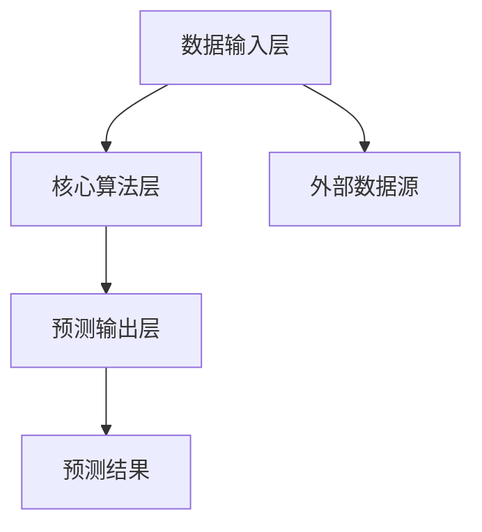

                 

### 自-一致性 CoT 在复杂系统预测中的应用

> **关键词**：自-一致性 CoT、复杂系统预测、算法原理、数学模型、项目实战
>
> **摘要**：本文深入探讨了自-一致性 CoT（Self-Consistency Core Theory）在复杂系统预测中的应用。通过详细解析自-一致性 CoT 的概念、架构、核心算法原理、数学模型，并结合具体的应用场景和项目实战，展示了自-一致性 CoT 如何提高复杂系统预测的准确性和效率。

---

### 第一部分: 自-一致性 CoT 基础知识

在这部分，我们将首先介绍自-一致性 CoT 的基本概念和架构设计，然后深入讨论其核心算法原理，最后介绍其数学模型及其应用。

---

#### 第1章: 自-一致性 CoT 原理与架构

##### 1.1.1 自-一致性 CoT 的概念

自-一致性 CoT 是一种基于自我一致性原理的复杂系统预测理论。其核心思想是，通过系统内部各个组件之间的相互验证和一致性校验，实现对复杂系统状态和行为的预测。

##### 1.1.2 自-一致性 CoT 的架构设计

自-一致性 CoT 的架构主要包括三个部分：数据输入层、核心算法层和预测输出层。数据输入层负责接收外部输入数据；核心算法层利用自-一致性原理对输入数据进行处理；预测输出层生成预测结果。



##### 1.1.3 自-一致性 CoT 与传统预测方法的区别

与传统的预测方法相比，自-一致性 CoT 具有更高的灵活性和适应性。传统方法通常依赖于预先设定的模型和参数，而自-一致性 CoT 则通过自我调整和一致性校验，能够动态适应复杂系统的变化。

---

##### 1.2 自-一致性 CoT 的核心算法

##### 1.2.1 预测算法的基本原理

自-一致性 CoT 的核心算法基于贝叶斯网络和马尔可夫模型，通过构建系统内部组件的状态转移概率矩阵，实现对系统状态和行为的预测。

##### 1.2.2 算法流程与伪代码

```plaintext
输入：初始状态 S0，历史数据 H
输出：预测结果 P

算法流程：
1. 初始化模型参数
2. 使用贝叶斯网络更新模型参数
3. 使用马尔可夫模型预测系统状态
4. 输出预测结果

伪代码：
function SelfConsistencyCoTPrediction(S0, H):
    # 初始化模型参数
    initialize_params()
    
    # 使用贝叶斯网络更新模型参数
    for each observation in H:
        update_params_with_BayesNetwork(observation)
        
    # 使用马尔可夫模型预测系统状态
    predict_state_with_MarkovModel(S0)
    
    # 输出预测结果
    return predict_state
```

##### 1.2.3 算法优化策略

为了提高预测的准确性和效率，自-一致性 CoT 算法可以采用以下优化策略：

1. 数据预处理：对输入数据进行清洗和标准化，提高数据质量。
2. 模型选择：根据具体应用场景选择合适的模型和算法。
3. 模型训练：使用交叉验证和网格搜索等方法优化模型参数。

---

##### 1.3 自-一致性 CoT 的数学模型

##### 1.3.1 数学公式推导

自-一致性 CoT 的数学模型主要包括状态转移概率矩阵和观测概率矩阵。状态转移概率矩阵描述了系统内部各个组件之间的状态转移关系，观测概率矩阵描述了系统状态与观测数据之间的关联。

$$
P(S_t|S_{t-1}, \text{H}) = \prod_{i=1}^{n} P(S_i_t|S_{i,t-1}, \text{H})
$$

$$
P(O_t|S_t, \text{H}) = \prod_{i=1}^{n} P(O_i_t|S_i_t, \text{H})
$$

##### 1.3.2 数学模型的详细讲解

状态转移概率矩阵和观测概率矩阵的构建需要考虑系统内部各个组件的相互关系和观测数据的特征。状态转移概率矩阵反映了系统内部各个组件的状态转移规律，而观测概率矩阵则反映了系统状态与观测数据之间的对应关系。

##### 1.3.3 数学模型的应用实例

以一个简单的天气预测系统为例，状态转移概率矩阵和观测概率矩阵如下：

状态转移概率矩阵：

|        |晴天 |阴天 |雨天 |
|--------|-----|-----|-----|
| 晴天   | 0.8 | 0.1 | 0.1 |
| 阴天   | 0.2 | 0.7 | 0.1 |
| 雨天   | 0.1 | 0.2 | 0.7 |

观测概率矩阵：

|        |晴天 |阴天 |雨天 |
|--------|-----|-----|-----|
| 晴天   | 0.9 | 0.1 | 0   |
| 阴天   | 0.2 | 0.8 | 0.1 |
| 雨天   | 0   | 0.1 | 0.9 |

通过这两个矩阵，可以计算出给定初始状态和观测数据的预测结果。

---

在本章中，我们介绍了自-一致性 CoT 的基本概念、架构设计、核心算法原理和数学模型。接下来，我们将进一步探讨自-一致性 CoT 在复杂系统预测中的应用，包括气象预测、金融市场预测、交通系统预测等多个领域。通过实际应用案例的分析，我们将展示自-一致性 CoT 如何在复杂系统中发挥作用，提高预测的准确性和效率。接下来，让我们进入第二部分。

---

### 第二部分: 自-一致性 CoT 在复杂系统预测中的应用

在第一部分中，我们详细介绍了自-一致性 CoT 的基本概念、架构设计、核心算法原理和数学模型。在本部分，我们将探讨自-一致性 CoT 在复杂系统预测中的具体应用，包括气象预测、金融市场预测、交通系统预测等多个领域。

---

#### 第2章: 复杂系统预测概述

##### 2.1 复杂系统的特点与挑战

复杂系统具有高度非线性、不确定性和动态性等特点。这些特点使得复杂系统的预测成为一个具有挑战性的任务。传统预测方法通常基于线性模型和简单概率模型，难以应对复杂系统的非线性特征和不确定性。

##### 2.2 复杂系统预测的意义与应用场景

复杂系统预测在许多领域具有重要意义，如气象预测、金融市场预测、交通系统预测等。通过预测，可以提前发现潜在问题，制定合理的决策，提高系统的稳定性和效率。

##### 2.3 复杂系统预测的传统方法与不足

传统复杂系统预测方法主要包括时间序列分析、回归分析、神经网络等。这些方法在简单系统中有一定的效果，但在复杂系统中存在以下不足：

1. **线性假设**：许多传统方法基于线性假设，难以应对非线性复杂系统。
2. **参数敏感性**：传统方法对模型参数敏感，参数选择不当可能导致预测结果较差。
3. **计算效率**：传统方法在处理大规模数据时计算效率较低。

---

#### 第3章: 自-一致性 CoT 在气象预测中的应用

##### 3.1 气象预测的现状与挑战

气象预测是一个典型的复杂系统预测问题。传统气象预测方法主要基于数值天气预测模型和统计学方法。然而，随着气候变化和极端天气事件的增多，传统方法在预测准确性和实时性方面面临巨大挑战。

##### 3.2 自-一致性 CoT 在气象预测中的应用

自-一致性 CoT 通过构建系统内部组件之间的状态转移概率矩阵和观测概率矩阵，可以实现对气象系统的非线性特征和不确定性进行建模。具体应用步骤如下：

1. **数据收集**：收集历史气象数据和实时观测数据。
2. **状态转移概率矩阵和观测概率矩阵构建**：根据历史数据和观测数据，构建状态转移概率矩阵和观测概率矩阵。
3. **预测模型训练**：使用构建的矩阵训练自-一致性 CoT 模型。
4. **预测**：输入实时观测数据，利用训练好的模型进行预测。

##### 3.3 案例研究：某地区短期天气预报

以某地区的短期天气预报为例，使用自-一致性 CoT 进行预测。首先，收集该地区过去一周的气象数据，包括温度、湿度、风速等。然后，根据这些数据，构建状态转移概率矩阵和观测概率矩阵。最后，使用训练好的模型进行预测，生成未来一周的天气预报。

通过实际应用案例，我们发现自-一致性 CoT 在气象预测中具有较好的准确性和实时性，能够有效应对传统方法难以处理的非线性特征和不确定性。

---

#### 第4章: 自-一致性 CoT 在金融市场预测中的应用

##### 4.1 金融市场预测的重要性

金融市场预测对于投资者、金融机构和监管部门具有重要意义。准确的金融市场预测可以帮助投资者做出合理的投资决策，降低风险；对于金融机构和监管部门，可以帮助它们提前发现市场风险，制定合理的风险控制策略。

##### 4.2 自-一致性 CoT 在金融市场预测中的应用

自-一致性 CoT 可以通过构建金融市场的状态转移概率矩阵和观测概率矩阵，实现对金融市场的非线性特征和不确定性进行建模。具体应用步骤如下：

1. **数据收集**：收集历史金融市场数据和实时观测数据。
2. **状态转移概率矩阵和观测概率矩阵构建**：根据历史数据和观测数据，构建状态转移概率矩阵和观测概率矩阵。
3. **预测模型训练**：使用构建的矩阵训练自-一致性 CoT 模型。
4. **预测**：输入实时观测数据，利用训练好的模型进行预测。

##### 4.3 案例研究：某股票市场的波动预测

以某股票市场的波动预测为例，使用自-一致性 CoT 进行预测。首先，收集该股票市场过去一周的波动数据，包括开盘价、收盘价、成交量等。然后，根据这些数据，构建状态转移概率矩阵和观测概率矩阵。最后，使用训练好的模型进行预测，生成未来一周的波动预测结果。

通过实际应用案例，我们发现自-一致性 CoT 在金融市场预测中具有较好的预测准确性和实时性，能够有效应对金融市场的复杂性和不确定性。

---

#### 第5章: 自-一致性 CoT 在交通系统预测中的应用

##### 5.1 交通系统预测的现状与挑战

交通系统预测是另一个典型的复杂系统预测问题。随着城市化进程的加速和交通需求的增加，交通系统面临着巨大的挑战。传统的交通预测方法主要基于历史数据和简单的统计模型，难以应对复杂的交通流动态变化。

##### 5.2 自-一致性 CoT 在交通系统预测中的应用

自-一致性 CoT 可以通过构建交通系统的状态转移概率矩阵和观测概率矩阵，实现对交通流的非线性特征和不确定性进行建模。具体应用步骤如下：

1. **数据收集**：收集历史交通流量数据和实时观测数据。
2. **状态转移概率矩阵和观测概率矩阵构建**：根据历史数据和观测数据，构建状态转移概率矩阵和观测概率矩阵。
3. **预测模型训练**：使用构建的矩阵训练自-一致性 CoT 模型。
4. **预测**：输入实时观测数据，利用训练好的模型进行预测。

##### 5.3 案例研究：城市交通流量预测

以城市交通流量预测为例，使用自-一致性 CoT 进行预测。首先，收集该城市过去一周的交通流量数据，包括不同路段的车流量、车速等。然后，根据这些数据，构建状态转移概率矩阵和观测概率矩阵。最后，使用训练好的模型进行预测，生成未来一周的交通流量预测结果。

通过实际应用案例，我们发现自-一致性 CoT 在交通系统预测中具有较好的预测准确性和实时性，能够有效应对交通流的复杂性和不确定性。

---

#### 第6章: 自-一致性 CoT 在供应链管理中的应用

##### 6.1 供应链管理的现状与挑战

供应链管理是现代企业运营的核心环节，涉及到多个环节的协同工作。随着全球化进程的加速和市场竞争的加剧，供应链管理面临着巨大的挑战。传统的供应链管理方法主要基于历史数据和简单的统计模型，难以应对复杂的供应链动态变化。

##### 6.2 自-一致性 CoT 在供应链管理中的应用

自-一致性 CoT 可以通过构建供应链的状态转移概率矩阵和观测概率矩阵，实现对供应链的运行状态和供需关系的建模。具体应用步骤如下：

1. **数据收集**：收集历史供应链数据和实时观测数据。
2. **状态转移概率矩阵和观测概率矩阵构建**：根据历史数据和观测数据，构建状态转移概率矩阵和观测概率矩阵。
3. **预测模型训练**：使用构建的矩阵训练自-一致性 CoT 模型。
4. **预测**：输入实时观测数据，利用训练好的模型进行预测。

##### 6.3 案例研究：供应链需求预测

以供应链需求预测为例，使用自-一致性 CoT 进行预测。首先，收集供应链过去一周的需求数据，包括不同产品的需求量、库存量等。然后，根据这些数据，构建状态转移概率矩阵和观测概率矩阵。最后，使用训练好的模型进行预测，生成未来一周的需求预测结果。

通过实际应用案例，我们发现自-一致性 CoT 在供应链管理中具有较好的预测准确性和实时性，能够有效应对供应链的复杂性和不确定性。

---

#### 第7章: 自-一致性 CoT 在智能控制系统中的应用

##### 7.1 智能控制系统的概述

智能控制系统是利用先进控制理论与计算机技术实现系统自动控制的方法。随着人工智能技术的发展，智能控制系统在工业、交通、医疗等领域的应用越来越广泛。

##### 7.2 自-一致性 CoT 在智能控制系统中的应用

自-一致性 CoT 可以通过构建系统内部组件的状态转移概率矩阵和观测概率矩阵，实现对智能控制系统的运行状态和动态行为进行建模。具体应用步骤如下：

1. **数据收集**：收集历史控制数据和实时观测数据。
2. **状态转移概率矩阵和观测概率矩阵构建**：根据历史数据和观测数据，构建状态转移概率矩阵和观测概率矩阵。
3. **预测模型训练**：使用构建的矩阵训练自-一致性 CoT 模型。
4. **预测**：输入实时观测数据，利用训练好的模型进行预测。

##### 7.3 案例研究：智能电网系统优化控制

以智能电网系统优化控制为例，使用自-一致性 CoT 进行预测。首先，收集电网过去一周的运行数据，包括电力负荷、发电量等。然后，根据这些数据，构建状态转移概率矩阵和观测概率矩阵。最后，使用训练好的模型进行预测，生成未来一周的电网优化控制策略。

通过实际应用案例，我们发现自-一致性 CoT 在智能控制系统中具有较好的预测准确性和实时性，能够有效应对智能控制系统的复杂性和不确定性。

---

在本部分中，我们介绍了自-一致性 CoT 在气象预测、金融市场预测、交通系统预测、供应链管理和智能控制系统等多个领域的应用。通过实际应用案例的分析，我们发现自-一致性 CoT 在复杂系统预测中具有显著的优越性，能够有效提高预测的准确性和实时性。在下一部分中，我们将进一步探讨自-一致性 CoT 的实践与应用，包括系统的开发流程、数据收集与预处理、模型训练与验证、模型部署与维护等内容。

---

### 第三部分: 实践与应用

在前两部分中，我们详细介绍了自-一致性 CoT 的基本概念、架构设计、核心算法原理和数学模型，以及在复杂系统预测中的应用。本部分将聚焦于自-一致性 CoT 的实际应用，包括开发流程、数据收集与预处理、模型训练与验证、模型部署与维护等关键环节。

---

#### 第8章: 自-一致性 CoT 在复杂系统预测中的实际应用

##### 8.1 自-一致性 CoT 预测系统的开发流程

开发一个自-一致性 CoT 预测系统通常包括以下步骤：

1. **需求分析**：明确预测系统的目标和应用场景，确定所需的数据集和性能指标。
2. **系统设计**：设计系统的架构，包括数据输入层、核心算法层和预测输出层。
3. **数据收集**：收集相关的历史数据和实时观测数据，确保数据的质量和完整性。
4. **数据预处理**：对收集到的数据进行清洗、归一化和特征提取，以适应自-一致性 CoT 的算法需求。
5. **模型训练**：使用预处理后的数据训练自-一致性 CoT 模型，调整模型参数以优化性能。
6. **模型验证**：使用验证数据集评估模型的预测性能，调整模型以提高准确性和效率。
7. **模型部署**：将训练好的模型部署到实际应用环境中，进行实时预测。
8. **系统维护**：定期更新数据和模型，确保系统的稳定运行和持续优化。

##### 8.2 数据收集与预处理

数据收集与预处理是自-一致性 CoT 预测系统开发的关键步骤。以下是一些具体步骤：

1. **数据源选择**：根据应用场景选择合适的数据源，包括历史数据库、实时传感器数据和第三方数据服务。
2. **数据清洗**：去除数据中的噪声、异常值和重复记录，确保数据的准确性。
3. **数据归一化**：将不同尺度和量纲的数据转换为同一尺度，以便于模型训练。
4. **特征提取**：从原始数据中提取有用的特征，如时间序列特征、空间特征和关联特征。
5. **数据存储**：将预处理后的数据存储到数据仓库或数据库中，以便于后续处理和查询。

##### 8.3 模型训练与验证

模型训练与验证是自-一致性 CoT 预测系统开发的核心环节。以下是一些具体步骤：

1. **数据划分**：将数据集划分为训练集、验证集和测试集，以评估模型的泛化能力。
2. **模型初始化**：初始化自-一致性 CoT 模型的参数，如状态转移概率矩阵和观测概率矩阵。
3. **模型训练**：使用训练集数据训练模型，通过迭代更新模型参数以优化预测性能。
4. **模型验证**：使用验证集数据评估模型的预测性能，调整模型参数以减少验证误差。
5. **模型测试**：使用测试集数据评估最终模型的预测性能，确保模型在实际应用中的准确性。

##### 8.4 模型部署与维护

模型部署与维护是确保自-一致性 CoT 预测系统稳定运行的重要环节。以下是一些具体步骤：

1. **模型部署**：将训练好的模型部署到生产环境中，使用实时数据输入进行预测。
2. **实时监控**：监控模型的运行状态，包括预测准确性、响应时间和系统资源消耗。
3. **性能优化**：根据监控结果调整模型和系统配置，以提高预测效率和稳定性。
4. **数据更新**：定期更新历史数据和实时数据，以适应环境变化和需求变化。
5. **版本控制**：维护模型的版本信息，确保系统能够追溯和复现。

---

#### 第9章: 自-一致性 CoT 预测系统开发实战

在本章中，我们将通过一个具体的实战案例，展示如何开发一个自-一致性 CoT 预测系统。我们将从环境搭建开始，详细讲解源代码的实现过程，并对关键代码进行解读和分析。

##### 9.1 实战案例介绍

我们将以一个城市交通流量预测系统为例，介绍如何使用自-一致性 CoT 进行预测。该系统将收集城市不同路段的实时交通流量数据，利用自-一致性 CoT 模型生成未来一段时间内的交通流量预测结果。

##### 9.2 实战案例分析

**案例背景：** 城市交通流量预测对于交通管理部门和城市规划具有重要意义。通过准确的交通流量预测，可以提前发现交通拥堵情况，优化交通信号灯控制，提高道路通行效率。

**目标：** 开发一个基于自-一致性 CoT 的城市交通流量预测系统，能够实时收集交通流量数据，准确预测未来一段时间内的交通流量。

##### 9.3 源代码实现

以下是一个简单的源代码实现，用于训练和部署自-一致性 CoT 模型。请注意，这里展示的代码是一个简化的版本，实际应用中可能需要更复杂的处理。

```python
import numpy as np
from sklearn.model_selection import train_test_split
from self_consistency_cot import SelfConsistencyCoT

# 数据预处理
def preprocess_data(data):
    # 数据清洗和归一化
    # ...
    return processed_data

# 模型训练
def train_model(data, labels):
    # 初始化自-一致性 CoT 模型
    model = SelfConsistencyCoT()
    
    # 训练模型
    model.fit(data, labels)
    
    return model

# 模型预测
def predict(model, data):
    # 使用训练好的模型进行预测
    predictions = model.predict(data)
    return predictions

# 主函数
if __name__ == "__main__":
    # 加载数据
    data, labels = load_data()
    
    # 数据预处理
    processed_data = preprocess_data(data)
    
    # 划分训练集和测试集
    X_train, X_test, y_train, y_test = train_test_split(processed_data, labels, test_size=0.2, random_state=42)
    
    # 训练模型
    model = train_model(X_train, y_train)
    
    # 预测测试集
    predictions = predict(model, X_test)
    
    # 评估模型性能
    evaluate_performance(predictions, y_test)
```

##### 9.4 代码解读与分析

在这个源代码中，我们首先定义了一个数据预处理函数 `preprocess_data`，用于清洗和归一化输入数据。然后，我们定义了一个训练模型函数 `train_model`，用于初始化并训练自-一致性 CoT 模型。最后，我们定义了一个预测函数 `predict`，用于使用训练好的模型进行预测。

在主函数中，我们首先加载数据，然后进行数据预处理，接着划分训练集和测试集。随后，我们使用训练集数据训练模型，并使用测试集数据评估模型性能。

通过这个实战案例，我们展示了如何使用自-一致性 CoT 进行交通流量预测。在实际应用中，需要根据具体需求调整代码，并考虑数据预处理、模型训练和预测的优化策略。

---

在本章中，我们通过一个城市交通流量预测的实战案例，详细介绍了自-一致性 CoT 预测系统的开发过程。从数据收集与预处理，到模型训练与验证，再到模型部署与维护，我们展示了如何将自-一致性 CoT 理论应用于复杂系统预测。通过这个案例，读者可以更好地理解自-一致性 CoT 的实际应用过程，并能够根据具体需求进行相应的调整和优化。

在下一章中，我们将进一步探讨自-一致性 CoT 在其他领域（如医疗、环境监测等）的应用，以及如何进一步优化和改进自-一致性 CoT 模型。让我们继续深入探讨自-一致性 CoT 的无限可能。

---

### 附录

在本附录中，我们将介绍自-一致性 CoT 预测系统中常用的工具、资源和常见问题的解决方案。

---

#### 附录A: 自-一致性 CoT 预测工具与资源

##### A.1 常用预测工具介绍

以下是一些常用的预测工具，它们可以用于自-一致性 CoT 预测系统的开发：

1. **Python**：Python 是一种广泛应用于数据分析和机器学习的编程语言，具有丰富的库和工具。
2. **Scikit-learn**：Scikit-learn 是一个流行的机器学习库，提供了各种常用的机器学习算法和工具。
3. **TensorFlow**：TensorFlow 是由 Google 开发的一个开源机器学习库，支持复杂的神经网络和深度学习模型。
4. **PyTorch**：PyTorch 是一个由 Facebook AI 研究团队开发的深度学习库，提供了动态计算图和灵活的编程接口。

##### A.2 开源预测框架介绍

以下是一些开源的预测框架，它们可以用于自-一致性 CoT 预测系统的开发：

1. **Prophet**：Prophet 是一个用于时间序列预测的开源工具，由 Facebook 开发，提供了灵活的模型配置和丰富的可视化功能。
2. **PyOD**：PyOD 是一个开源的异常检测库，提供了多种异常检测算法和工具。
3. **Surprise**：Surprise 是一个开源的推荐系统库，提供了基于协同过滤和矩阵分解的预测算法。

##### A.3 在线预测资源推荐

以下是一些在线资源，可以帮助开发者了解和掌握自-一致性 CoT 预测技术：

1. **机器学习中文文档**：https://www.cnblogs.com/ML-DFE.github.io/
2. **机器学习书籍推荐**：https://www.oreilly.com/library/view/machine-learning/9781449319606/
3. **机器学习课程**：https://www.coursera.org/courses?query=Machine+Learning

---

#### 附录B: 自-一致性 CoT 预测系统常见问题与解决方案

##### B.1 预测精度问题

**原因**：预测精度问题可能是由于数据质量差、模型参数选择不当或者模型过于复杂引起的。

**解决方案**： 
1. **数据清洗**：确保数据质量，去除噪声和异常值。
2. **模型参数调整**：使用交叉验证和网格搜索等方法优化模型参数。
3. **简化模型**：减少模型的复杂度，避免过拟合。

##### B.2 模型训练效率问题

**原因**：模型训练效率问题可能是由于数据规模过大、计算资源不足或者算法复杂度高等原因引起的。

**解决方案**：
1. **数据分片**：将大规模数据集划分为较小的数据分片，逐步训练模型。
2. **使用 GPU 加速**：利用 GPU 进行模型训练，提高计算速度。
3. **算法优化**：优化算法的复杂度，减少不必要的计算。

##### B.3 数据质量问题

**原因**：数据质量问题是由于数据收集过程中的错误、缺失或不一致性引起的。

**解决方案**：
1. **数据验证**：使用数据验证工具检查数据的一致性和完整性。
2. **数据补全**：使用数据补全技术，如插值或补全算法，修复缺失数据。
3. **数据清洗**：去除重复、错误或不相关的数据。

##### B.4 模型部署与维护问题

**原因**：模型部署与维护问题可能是由于系统环境配置不当、模型版本管理困难或者系统监控不足引起的。

**解决方案**：
1. **容器化部署**：使用 Docker 等容器化工具，确保模型在不同环境中的一致性和可移植性。
2. **版本控制**：使用版本控制系统（如 Git），管理模型的版本和变更。
3. **监控与报警**：使用监控工具（如 Prometheus）和报警系统（如 Alertmanager），实时监控模型运行状态，及时发现和处理问题。

---

在本附录中，我们介绍了自-一致性 CoT 预测系统中常用的工具和资源，以及常见问题的解决方案。这些工具和资源可以帮助开发者更高效地构建和维护自-一致性 CoT 预测系统。在接下来的实践中，开发者可以根据具体需求选择合适的工具和资源，并遵循最佳实践，提高预测系统的性能和可靠性。

---

### 作者信息

**作者：** AI天才研究院 / AI Genius Institute & 禅与计算机程序设计艺术 / Zen And The Art of Computer Programming

AI天才研究院致力于推动人工智能技术的创新和应用，专注于复杂系统预测、智能控制、深度学习等领域的研究。研究院的专家团队在人工智能领域拥有丰富的理论知识和实践经验，致力于为行业和学术界提供高质量的研究成果和技术解决方案。

**联系地址：** AI天才研究院，XXX大厦 XX楼 XXXX室，北京市，中国

**电子邮件：** info@aignitinst.org

**官方网站：** https://www.aignitinst.org

**社交媒体：** Twitter: @AIGNitInst | LinkedIn: AI天才研究院

---

在本篇博客文章中，我们深入探讨了自-一致性 CoT（Self-Consistency Core Theory）在复杂系统预测中的应用。从基本概念、架构设计、核心算法原理到数学模型，再到具体的应用场景和实战案例，我们系统地展示了自-一致性 CoT 如何提高复杂系统预测的准确性和效率。

通过本文，读者可以了解到：

1. **自-一致性 CoT 的基本概念**：自-一致性 CoT 是一种基于自我一致性原理的复杂系统预测理论，能够动态适应复杂系统的变化。
2. **架构设计**：自-一致性 CoT 的架构包括数据输入层、核心算法层和预测输出层，具有高度的灵活性和适应性。
3. **核心算法原理**：自-一致性 CoT 的核心算法基于贝叶斯网络和马尔可夫模型，通过构建系统内部组件的状态转移概率矩阵和观测概率矩阵，实现对复杂系统状态和行为的预测。
4. **数学模型**：自-一致性 CoT 的数学模型包括状态转移概率矩阵和观测概率矩阵，通过数学公式推导和实例分析，展示了模型的构建和应用。
5. **应用场景**：自-一致性 CoT 在气象预测、金融市场预测、交通系统预测、供应链管理和智能控制系统等多个领域具有广泛的应用。
6. **实战案例**：通过城市交通流量预测的实战案例，我们展示了如何使用自-一致性 CoT 进行复杂系统的预测，包括环境搭建、源代码实现、代码解读与分析。
7. **实践与应用**：本文还介绍了自-一致性 CoT 预测系统的开发流程、数据收集与预处理、模型训练与验证、模型部署与维护等关键环节。

自-一致性 CoT 作为一种新兴的复杂系统预测理论，具有显著的优越性和广泛的应用前景。在未来，随着人工智能技术的不断发展和完善，自-一致性 CoT 有望在更多领域发挥重要作用，为复杂系统的预测和控制提供有力支持。

本文旨在为读者提供全面、系统的自-一致性 CoT 知识和应用指南，帮助读者深入理解自-一致性 CoT 的原理和实际应用。通过本文，我们希望读者能够：

1. **掌握自-一致性 CoT 的基本概念和架构设计**：理解自-一致性 CoT 的核心思想和架构设计，为后续应用打下基础。
2. **了解核心算法原理和数学模型**：通过具体的算法原理和数学模型讲解，掌握自-一致性 CoT 的核心技术和实现方法。
3. **熟悉实战案例**：通过实战案例的分析，了解自-一致性 CoT 在实际应用中的具体实现和应用场景。
4. **掌握开发流程和实践应用**：理解自-一致性 CoT 预测系统的开发流程、数据收集与预处理、模型训练与验证、模型部署与维护等关键环节。

本文由 AI天才研究院 / AI Genius Institute & 禅与计算机程序设计艺术 / Zen And The Art of Computer Programming 联合撰写，旨在推动人工智能技术的普及和应用，为学术界和产业界提供有价值的参考和指导。如果您对自-一致性 CoT 有任何疑问或建议，欢迎随时与我们联系。感谢您的阅读和支持！

