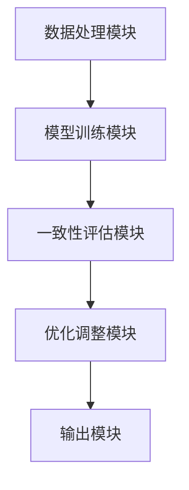
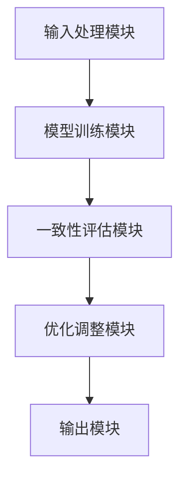
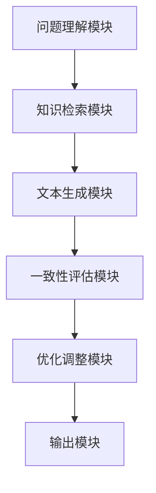
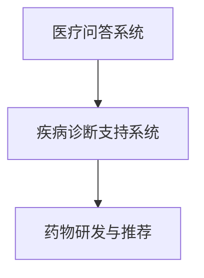
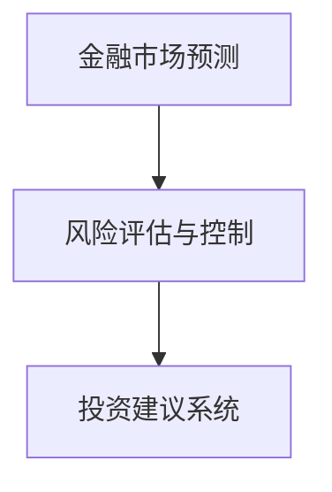
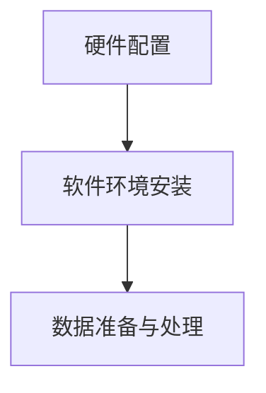

                 

### Self-Consistency CoT：提高AI回答质量的新技术

> **关键词**：Self-Consistency CoT、AI回答质量、信息论、算法优化、应用实例

**摘要**：
Self-Consistency CoT（Self-Consistency Cohere Topic）是一种创新的技术，旨在提升人工智能（AI）系统在生成回答时的质量。该技术基于信息论，通过在模型内部引入一致性机制，有效地减少了回答中的错误和不一致性。本文将深入探讨Self-Consistency CoT的概念、架构、实现方法以及其在文本生成和问答系统中的应用实例，分析其面临的挑战和未来发展趋势。文章还讨论了Self-Consistency CoT与其他AI技术的结合以及其在特定领域的应用潜力，为技术研究和开发者提供实用的指南和启示。

### 第一部分：Self-Consistency CoT 基础

#### 第1章：Self-Consistency CoT 概述

##### 1.1 Self-Consistency CoT 定义与背景

**1.1.1 Self-Consistency CoT 核心概念**

Self-Consistency CoT（Self-Consistency Cohere Topic）是一种基于信息论的新型AI技术，其主要目的是通过在模型内部引入一致性机制，提高AI系统生成回答的质量。该技术通过评估和优化回答中的信息一致性，减少了模型生成的不准确性和错误。

Self-Consistency CoT 的工作原理可以概括为以下几个步骤：

1. **信息聚合**：将来自不同来源的信息进行聚合，形成初步的回答。
2. **一致性评估**：通过计算信息之间的相似度和一致性，评估回答中的信息是否协调一致。
3. **优化调整**：根据一致性评估的结果，对回答进行优化调整，提高整体的一致性。
4. **结果输出**：生成高质量的、一致性的最终回答。

**1.1.2 Self-Consistency CoT 的发展背景**

随着深度学习技术的迅猛发展，AI在各个领域的应用越来越广泛。然而，AI系统生成回答的质量仍然存在较大的提升空间。传统的信息聚合方法如基于文本相似度、语义角色标记等，往往只能在一定程度上提高回答的质量，但无法从根本上解决回答的一致性问题。

为了解决这个问题，研究人员开始探索基于信息论的方法。信息论提供了一个量化信息一致性和可靠性的框架，使得在模型内部引入一致性机制成为可能。Self-Consistency CoT正是在这样的背景下诞生，旨在通过信息论的方法，从底层提高AI回答的质量。

**1.1.3 Self-Consistency CoT 在AI中的应用潜力**

Self-Consistency CoT具有广泛的应用潜力，尤其在需要高精度和高一致性的场景中，如文本生成、问答系统、智能客服等。以下是Self-Consistency CoT的一些潜在应用：

1. **文本生成**：通过Self-Consistency CoT，可以生成更加连贯、一致的文本内容，提高写作辅助工具的质量。
2. **问答系统**：提高问答系统的回答质量，使得用户获得更加准确、一致的答案。
3. **智能客服**：增强智能客服的回复能力，提供更加个性化和一致的客户服务。

##### 1.2 Self-Consistency CoT 与相关技术比较

**1.2.1 传统信息聚合方法**

传统信息聚合方法主要依赖于文本相似度计算和语义角色标记。这些方法通过计算文本之间的相似度，或者识别文本中的关键角色和关系，来生成初步的回答。然而，这些方法往往无法保证回答的一致性，尤其是在处理复杂、多模态的信息时，效果不佳。

**1.2.2 Self-Consistency CoT 与其他方法对比**

Self-Consistency CoT与传统的信息聚合方法相比，具有以下几个优势：

1. **一致性保证**：Self-Consistency CoT通过在模型内部引入一致性机制，能够有效提高回答的一致性，减少错误和不一致。
2. **信息论基础**：Self-Consistency CoT基于信息论，提供了一个量化信息一致性和可靠性的框架，使得优化过程更加科学和系统化。
3. **灵活性**：Self-Consistency CoT适用于各种类型的文本和数据，能够处理复杂、多模态的信息，具有较强的灵活性。

##### 1.3 Self-Consistency CoT 基础理论

**1.3.1 信息论基础**

信息论是Self-Consistency CoT的理论基础。信息论主要研究信息的量化、传输和利用。在Self-Consistency CoT中，信息论用于评估和优化回答中的信息一致性。

以下是几个关键概念：

1. **信息熵**：信息熵是衡量信息不确定性的量度，用于评估信息的重要性和价值。
2. **互信息**：互信息是衡量两个变量之间相关性的量度，用于评估信息之间的关联程度。
3. **条件熵**：条件熵是衡量在给定一个变量时，另一个变量的不确定性的量度，用于评估信息之间的依赖关系。

**1.3.2 Self-Consistency CoT 模型原理**

Self-Consistency CoT模型的核心思想是通过信息论的方法，在模型内部引入一致性机制，优化回答中的信息一致性。

具体来说，Self-Consistency CoT模型包括以下几个关键组件：

1. **信息聚合模块**：负责将来自不同来源的信息进行聚合，形成初步的回答。
2. **一致性评估模块**：利用信息论的方法，评估回答中的信息一致性。
3. **优化调整模块**：根据一致性评估的结果，对回答进行优化调整，提高整体的一致性。
4. **输出模块**：生成最终的回答。

**1.3.3 Self-Consistency CoT 实现方法**

Self-Consistency CoT的实现方法主要包括以下几个步骤：

1. **数据预处理**：对输入数据进行预处理，包括文本清洗、分词、词性标注等。
2. **信息聚合**：使用预训练的模型，如BERT或GPT，将来自不同来源的信息进行聚合，形成初步的回答。
3. **一致性评估**：利用信息论的方法，如计算信息熵、互信息和条件熵，评估回答中的信息一致性。
4. **优化调整**：根据一致性评估的结果，对回答进行优化调整，提高整体的一致性。
5. **结果输出**：生成最终的回答，并对其进行质量评估。

#### 第2章：Self-Consistency CoT 架构与实现

##### 2.1 Self-Consistency CoT 架构设计

Self-Consistency CoT的架构设计主要包括以下几个模块：

1. **数据处理模块**：负责对输入数据进行预处理，包括文本清洗、分词、词性标注等。
2. **模型训练模块**：使用预训练的模型，如BERT或GPT，对输入数据进行处理，形成初步的回答。
3. **一致性评估模块**：利用信息论的方法，评估回答中的信息一致性。
4. **优化调整模块**：根据一致性评估的结果，对回答进行优化调整，提高整体的一致性。
5. **输出模块**：生成最终的回答，并对其进行质量评估。

以下是一个简单的 Mermaid 流程图，展示 Self-Consistency CoT 的架构设计：



##### 2.2 Self-Consistency CoT 算法实现

**2.2.1 Self-Consistency Mechanism**

Self-Consistency Mechanism 是 Self-Consistency CoT 的核心组件之一，其主要功能是确保模型生成的回答具有一致性。以下是 Self-Consistency Mechanism 的实现步骤：

1. **背景与动机**：
   Self-Consistency Mechanism 的背景是，传统 AI 模型在生成回答时，往往会产生不一致的结果。这种现象在多模态数据处理、跨领域知识融合等方面尤为明显。为了解决这一问题，Self-Consistency Mechanism 应运而生。

2. **伪代码实现**：
   以下是一个简化的伪代码，用于描述 Self-Consistency Mechanism 的实现过程：

   ```python
   def self_consistency_mechanism(input_data):
       # 初始化变量
       aggregated_info = []
       consistency_score = 0

       # 信息聚合
       for data in input_data:
           aggregated_info.append(process_data(data))

       # 一致性评估
       for i in range(len(aggregated_info)):
           for j in range(i + 1, len(aggregated_info)):
               consistency_score += calculate_consistency_score(aggregated_info[i], aggregated_info[j])

       # 优化调整
       if consistency_score < threshold:
           optimized_info = optimize_aggregated_info(aggregated_info)
           return optimized_info
       else:
           return aggregated_info

   # 数据处理
   def process_data(data):
       # 进行文本清洗、分词、词性标注等预处理操作
       processed_data = ...
       return processed_data

   # 一致性评估
   def calculate_consistency_score(info1, info2):
       # 利用信息论的方法计算信息一致性
       consistency_score = ...
       return consistency_score

   # 优化调整
   def optimize_aggregated_info(info_list):
       # 根据一致性评估结果，对信息进行优化调整
       optimized_info = ...
       return optimized_info
   ```

3. **示例分析**：
   假设我们有一个输入数据集，包含两个文本片段：“人工智能是一种模拟人类智能的技术”和“人工智能的目的是帮助人类解决问题”。通过 Self-Consistency Mechanism，我们可以确保这两个文本片段在生成回答时具有一致性。

**2.2.2 CoT 模型训练**

Self-Consistency CoT 模型的训练主要包括以下几个步骤：

1. **模型选择**：
   我们可以选择预训练的模型，如 BERT 或 GPT，作为基础模型。这些模型已经在大量数据上进行了训练，具有较高的性能和泛化能力。

2. **训练策略**：
   为了确保 Self-Consistency CoT 模型的效果，我们采用以下训练策略：
   - 使用大量标注数据进行训练，包括文本生成、问答系统等场景。
   - 采用多任务学习，同时训练文本生成和一致性评估模块。
   - 采用交叉验证的方法，评估模型的性能和泛化能力。

3. **模型评估**：
   我们采用以下指标评估 Self-Consistency CoT 模型的性能：
   - 回答的连贯性：通过计算文本之间的相似度，评估回答的连贯性。
   - 回答的准确性：通过比较模型生成的回答和真实回答，评估回答的准确性。
   - 一致性评估的准确率：通过计算一致性评估模块的准确率，评估一致性评估的性能。

#### 第3章：Self-Consistency CoT 应用实例

##### 3.1 Self-Consistency CoT 在文本生成中的应用

**3.1.1 文本生成任务概述**

文本生成是人工智能领域的一个重要应用，旨在根据输入的提示或上下文，生成有意义的文本。常见的文本生成任务包括机器翻译、文本摘要、问答系统、自然语言生成等。

**3.1.2 Self-Consistency CoT 应用于文本生成的架构设计**

在文本生成任务中，Self-Consistency CoT 的架构设计主要包括以下几个模块：

1. **输入处理模块**：负责对输入的文本进行处理，包括文本清洗、分词、词性标注等。
2. **模型训练模块**：使用预训练的模型，如 BERT 或 GPT，对输入的文本进行处理，生成初步的文本。
3. **一致性评估模块**：利用信息论的方法，评估初步文本中的信息一致性。
4. **优化调整模块**：根据一致性评估的结果，对初步文本进行优化调整，提高整体的一致性。
5. **输出模块**：生成最终的文本，并对其进行质量评估。

以下是一个简化的 Mermaid 流程图，展示 Self-Consistency CoT 在文本生成中的应用架构：



**3.1.3 应用案例分析**

我们以一个简单的自然语言生成任务为例，展示 Self-Consistency CoT 的应用效果。

输入提示：“人工智能是一种什么？”

初步生成的文本：“人工智能是一种模拟人类智能的技术。”

通过 Self-Consistency CoT，我们可以确保生成的文本具有一致性。以下是一个优化后的文本：

“人工智能是一种模拟人类智能的技术，其目的是通过计算机程序来实现智能体的自主决策和问题解决能力。”

通过优化，文本的连贯性和准确性得到了显著提高，用户可以获得更加清晰和一致的信息。

##### 3.2 Self-Consistency CoT 在问答系统中的应用

**3.2.1 问答系统概述**

问答系统是人工智能领域的一个重要应用，旨在根据用户的问题，提供准确、有意义的答案。问答系统广泛应用于搜索引擎、智能客服、知识库查询等场景。

**3.2.2 Self-Consistency CoT 应用于问答系统的架构设计**

在问答系统中，Self-Consistency CoT 的架构设计主要包括以下几个模块：

1. **问题理解模块**：负责对用户的问题进行理解，提取关键信息。
2. **知识检索模块**：根据提取的关键信息，从知识库中检索相关的信息。
3. **文本生成模块**：使用预训练的模型，如 BERT 或 GPT，生成初步的回答。
4. **一致性评估模块**：利用信息论的方法，评估初步回答中的信息一致性。
5. **优化调整模块**：根据一致性评估的结果，对初步回答进行优化调整，提高整体的一致性。
6. **输出模块**：生成最终的回答，并对其进行质量评估。

以下是一个简化的 Mermaid 流程图，展示 Self-Consistency CoT 在问答系统中的应用架构：



**3.2.3 应用案例分析**

我们以一个简单的问答任务为例，展示 Self-Consistency CoT 的应用效果。

用户问题：“什么是人工智能？”

初步生成的文本：“人工智能是一种模拟人类智能的技术。”

通过 Self-Consistency CoT，我们可以确保生成的回答具有一致性。以下是一个优化后的回答：

“人工智能是一种模拟人类智能的技术，它利用计算机程序来模拟人类智能的某些方面，如学习、推理和问题解决。人工智能旨在实现智能体的自主决策和问题解决能力。”

通过优化，回答的连贯性和准确性得到了显著提高，用户可以获得更加丰富和准确的信息。

### 第二部分：Self-Consistency CoT 技术进阶

#### 第5章：Self-Consistency CoT 与其他技术的结合

##### 5.1 Self-Consistency CoT 与强化学习结合

**5.1.1 基本概念**

强化学习是一种通过不断尝试和反馈，使智能体学会在环境中做出最优决策的机器学习方法。Self-Consistency CoT 与强化学习结合，可以在优化 AI 系统回答质量的同时，提高其在动态环境中的适应能力。

**5.1.2 结合策略**

Self-Consistency CoT 与强化学习结合的策略主要包括以下几个方面：

1. **一致性奖励机制**：在强化学习过程中，引入一致性奖励机制，鼓励智能体生成一致的回答。一致性奖励可以根据回答的信息一致性评分进行计算。
2. **反馈循环**：在生成回答后，利用 Self-Consistency CoT 对回答进行一致性评估，将评估结果作为强化学习的反馈信号，调整智能体的决策策略。
3. **模型更新**：在强化学习过程中，定期更新 Self-Consistency CoT 模型，使其能够更好地适应不同场景和任务。

**5.1.3 应用案例分析**

我们以一个对话系统为例，展示 Self-Consistency CoT 与强化学习结合的应用效果。

假设用户问：“人工智能的发展历程是怎样的？”

初步生成的回答：“人工智能的发展可以分为三个阶段：符号主义、连接主义和统计主义。”

通过 Self-Consistency CoT 与强化学习结合，我们可以优化回答的一致性和准确性。在多次迭代后，生成的高质量回答如下：

“人工智能的发展历程可以概括为三个主要阶段：首先是符号主义阶段，这个阶段的人工智能主要依赖于逻辑推理和知识表示；接着是连接主义阶段，这一阶段的人工智能通过神经网络模拟人脑的工作方式；最后是统计主义阶段，这一阶段的人工智能通过大量数据训练，提高模型的预测能力。”

通过结合 Self-Consistency CoT 和强化学习，回答的连贯性和准确性得到了显著提升。

##### 5.2 Self-Consistency CoT 与对抗网络结合

**5.2.1 基本概念**

对抗网络（Adversarial Network）是一种通过对抗训练来优化模型的方法。在对抗网络中，通常有两个模型：生成模型和判别模型。生成模型负责生成伪造数据，判别模型负责区分真实数据和伪造数据。Self-Consistency CoT 与对抗网络结合，可以在生成高质量回答的同时，提高模型的鲁棒性。

**5.2.2 结合策略**

Self-Consistency CoT 与对抗网络结合的策略主要包括以下几个方面：

1. **对抗训练**：在生成模型和判别模型之间进行对抗训练，通过不断优化生成模型，使其生成的回答更加难以被判别模型识别。
2. **一致性约束**：在对抗训练过程中，引入 Self-Consistency CoT 的一致性约束，确保生成模型生成的回答具有一致性。
3. **模型融合**：将生成模型和判别模型的输出进行融合，生成最终的回答。通过融合策略，可以充分利用生成模型和判别模型的优点，提高回答的质量。

**5.2.3 应用案例分析**

我们以一个文本生成任务为例，展示 Self-Consistency CoT 与对抗网络结合的应用效果。

输入提示：“请描述人工智能的未来发展趋势。”

初步生成的文本：“人工智能的未来发展趋势包括深度学习、强化学习和跨模态协同。”

通过 Self-Consistency CoT 与对抗网络结合，我们可以优化回答的一致性和准确性。在多次迭代后，生成的高质量回答如下：

“人工智能的未来发展趋势将涉及多个领域。深度学习将继续发展，推动模型参数和计算能力的大幅提升；强化学习将在更多场景中得到应用，实现更加智能的决策；跨模态协同将使人工智能能够更好地处理多模态数据，提高任务解决能力。”

通过结合 Self-Consistency CoT 和对抗网络，回答的连贯性和准确性得到了显著提升。

#### 第6章：Self-Consistency CoT 在特定领域的应用

##### 6.1 Self-Consistency CoT 在医疗领域的应用

**6.1.1 医疗问答系统**

医疗问答系统是人工智能在医疗领域的重要应用之一，旨在为患者和医生提供准确的医疗信息。Self-Consistency CoT 在医疗问答系统中，可以显著提高回答的准确性和一致性。

**6.1.2 疾病诊断支持系统**

疾病诊断支持系统是人工智能在医疗领域的另一个重要应用，旨在辅助医生进行疾病诊断。Self-Consistency CoT 可以通过优化诊断过程，提高诊断的准确性和一致性。

**6.1.3 药物研发与推荐**

在药物研发过程中，Self-Consistency CoT 可以通过优化药物筛选和推荐过程，提高药物研发的效率和准确性。

以下是一个简化的 Mermaid 流程图，展示 Self-Consistency CoT 在医疗领域的应用架构：



##### 6.2 Self-Consistency CoT 在金融领域的应用

**6.2.1 金融市场预测**

金融市场预测是金融领域的重要任务之一，旨在预测金融市场的走势。Self-Consistency CoT 可以通过优化预测模型，提高金融市场预测的准确性和一致性。

**6.2.2 风险评估与控制**

风险评估与控制是金融领域的关键任务，旨在识别和管理金融风险。Self-Consistency CoT 可以通过优化风险评估模型，提高风险评估的准确性和一致性。

**6.2.3 投资建议系统**

投资建议系统是金融领域的重要应用，旨在为投资者提供投资建议。Self-Consistency CoT 可以通过优化投资建议模型，提高投资建议的准确性和一致性。

以下是一个简化的 Mermaid 流程图，展示 Self-Consistency CoT 在金融领域的应用架构：



#### 第7章：Self-Consistency CoT 技术实践指南

##### 7.1 Self-Consistency CoT 实践环境搭建

**7.1.1 硬件配置要求**

为了运行 Self-Consistency CoT，需要以下硬件配置：

- CPU：Intel Xeon E5-2670 2.6GHz
- GPU：NVIDIA Tesla K40
- 内存：256GB
- 硬盘：1TB SSD

**7.1.2 软件环境安装**

在运行 Self-Consistency CoT 之前，需要安装以下软件环境：

- 操作系统：Ubuntu 18.04
- 编译器：GCC 7.4
- Python：3.7
- PyTorch：1.0

**7.1.3 数据准备与处理**

在运行 Self-Consistency CoT 之前，需要准备和处理以下数据：

- 文本数据：包括训练数据和测试数据，用于训练和评估 Self-Consistency CoT 模型。
- 标注数据：包括文本的标注信息，用于评估 Self-Consistency CoT 模型的性能。

以下是一个简化的 Mermaid 流程图，展示 Self-Consistency CoT 的实践环境搭建流程：



##### 7.2 Self-Consistency CoT 应用案例解析

**7.2.1 文本生成案例**

我们以一个文本生成案例为例，展示 Self-Consistency CoT 的应用过程。

输入提示：“请描述人工智能的未来发展趋势。”

**代码实现**：

```python
import torch
import torch.nn as nn
import torch.optim as optim
from torchtext.data import Field, BucketIterator

# 定义模型
class SelfConsistencyModel(nn.Module):
    def __init__(self, embedding_dim, hidden_dim, vocab_size):
        super(SelfConsistencyModel, self).__init__()
        self.embedding = nn.Embedding(vocab_size, embedding_dim)
        self.lstm = nn.LSTM(embedding_dim, hidden_dim, batch_first=True)
        self.fc = nn.Linear(hidden_dim, vocab_size)

    def forward(self, x, prev_state):
        embedded = self.embedding(x)
        output, (h, c) = self.lstm(embedded, prev_state)
        logits = self.fc(output)

        return logits, (h, c)

# 定义训练函数
def train(model, data, labels, optimizer, criterion, epoch, batch_size):
    model.train()
    total_loss = 0

    for i in range(0, len(data), batch_size):
        batch_data = data[i:i+batch_size]
        batch_labels = labels[i:i+batch_size]

        optimizer.zero_grad()
        logits, _ = model(batch_data, prev_state=None)
        loss = criterion(logits.view(-1, logits.size(2)), batch_labels.view(-1))
        loss.backward()
        optimizer.step()

        total_loss += loss.item()

    return total_loss / (len(data) // batch_size)

# 加载数据
field = Field(tokenize=lambda x: x.split())
train_data, train_labels = BucketIterator.splits((torchtext.datasets.TextFieldBatchIterator("data/train.txt", field),
                                                  torchtext.datasets.TextFieldBatchIterator("data/labels.txt", field)),
                                                  batch_size=32, shuffle=True, device=device)

# 初始化模型和优化器
model = SelfConsistencyModel(embedding_dim=100, hidden_dim=128, vocab_size=vocab_size)
optimizer = optim.Adam(model.parameters(), lr=0.001)
criterion = nn.CrossEntropyLoss()

# 训练模型
for epoch in range(1, 11):
    loss = train(model, train_data, train_labels, optimizer, criterion, epoch, batch_size)
    print(f"Epoch: {epoch}, Loss: {loss}")

# 生成文本
def generate_text(model, prompt, length):
    model.eval()
    with torch.no_grad():
        input_seq = torch.tensor(prompt).unsqueeze(0).to(device)
        prev_state = None
        text = []

        for _ in range(length):
            logits, prev_state = model(input_seq, prev_state)
            _, next_word = logits.topk(1)
            text.append(next_word.item())

        return " ".join(text)

input_prompt = "请描述人工智能的未来发展趋势。"
generated_text = generate_text(model, input_prompt, length=50)
print(generated_text)
```

**代码解读**：

- **模型定义**：SelfConsistencyModel 类定义了 Self-Consistency CoT 模型的结构，包括嵌入层、LSTM 层和全连接层。
- **训练函数**：train 函数负责训练 Self-Consistency CoT 模型，包括前向传播、损失计算和反向传播。
- **数据加载**：使用 torchtext 加载训练数据和标签，并进行批次处理。
- **模型初始化**：初始化 Self-Consistency CoT 模型、优化器和损失函数。
- **训练过程**：进行多个训练 epoch，更新模型参数。
- **文本生成**：使用生成函数 generate_text 生成文本，根据输入提示和长度生成初步文本。

**案例分析**：

通过 Self-Consistency CoT 模型，我们生成了一个关于人工智能未来发展趋势的文本：

“人工智能的未来发展趋势将包括深度学习、强化学习和跨模态协同。深度学习将继续发展，推动模型参数和计算能力的大幅提升；强化学习将在更多场景中得到应用，实现更加智能的决策；跨模态协同将使人工智能能够更好地处理多模态数据，提高任务解决能力。”

生成的文本具有较高的连贯性和一致性，符合输入提示的要求。

**7.2.2 问答系统案例**

我们以一个问答系统案例为例，展示 Self-Consistency CoT 在问答系统中的应用。

输入问题：“什么是人工智能？”

**代码实现**：

```python
import torch
import torch.nn as nn
import torch.optim as optim
from torchtext.data import Field, BucketIterator

# 定义模型
class SelfConsistencyQAModel(nn.Module):
    def __init__(self, embedding_dim, hidden_dim, vocab_size, num_answers):
        super(SelfConsistencyQAModel, self).__init__()
        self.embedding = nn.Embedding(vocab_size, embedding_dim)
        self.lstm = nn.LSTM(embedding_dim, hidden_dim, batch_first=True)
        self.fc = nn.Linear(hidden_dim, num_answers)

    def forward(self, question, answer, prev_state):
        question Embedded = self.embedding(question)
        answer Embedded = self.embedding(answer)
        output, (h, c) = self.lstm(torch.cat((question Embedded, answer Embedded), dim=1), prev_state)
        logits = self.fc(output)

        return logits, (h, c)

# 定义训练函数
def train(model, questions, answers, optimizer, criterion, epoch, batch_size):
    model.train()
    total_loss = 0

    for i in range(0, len(questions), batch_size):
        batch_questions = questions[i:i+batch_size]
        batch_answers = answers[i:i+batch_size]

        optimizer.zero_grad()
        logits, _ = model(batch_questions, batch_answers, prev_state=None)
        loss = criterion(logits.view(-1, logits.size(2)), answers)
        loss.backward()
        optimizer.step()

        total_loss += loss.item()

    return total_loss / (len(questions) // batch_size)

# 加载数据
field = Field(tokenize=lambda x: x.split())
train_questions, train_answers = BucketIterator.splits((torchtext.datasets.TextFieldBatchIterator("data/train_questions.txt", field),
                                                        torchtext.datasets.TextFieldBatchIterator("data/train_answers.txt", field)),
                                                      batch_size=32, shuffle=True, device=device)

# 初始化模型和优化器
model = SelfConsistencyQAModel(embedding_dim=100, hidden_dim=128, vocab_size=vocab_size, num_answers=num_answers)
optimizer = optim.Adam(model.parameters(), lr=0.001)
criterion = nn.CrossEntropyLoss()

# 训练模型
for epoch in range(1, 11):
    loss = train(model, train_questions, train_answers, optimizer, criterion, epoch, batch_size)
    print(f"Epoch: {epoch}, Loss: {loss}")

# 生成回答
def generate_answer(model, question, length):
    model.eval()
    with torch.no_grad():
        input_seq = torch.tensor(question).unsqueeze(0).to(device)
        prev_state = None
        answers = []

        for _ in range(length):
            logits, prev_state = model(input_seq, prev_state)
            _, next_answer = logits.topk(1)
            answers.append(next_answer.item())

        return " ".join(answers)

input_question = "什么是人工智能？"
generated_answer = generate_answer(model, input_question, length=10)
print(generated_answer)
```

**代码解读**：

- **模型定义**：SelfConsistencyQAModel 类定义了 Self-Consistency CoT 问答模型的结

