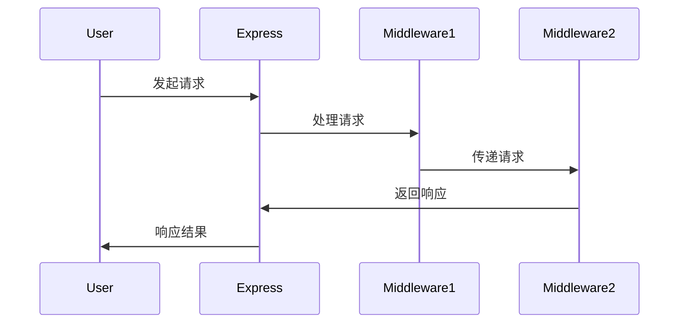
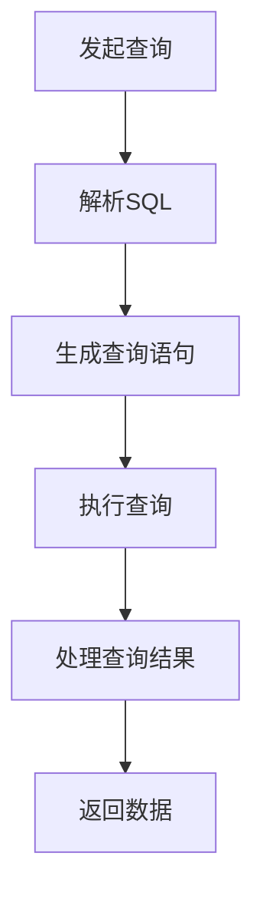
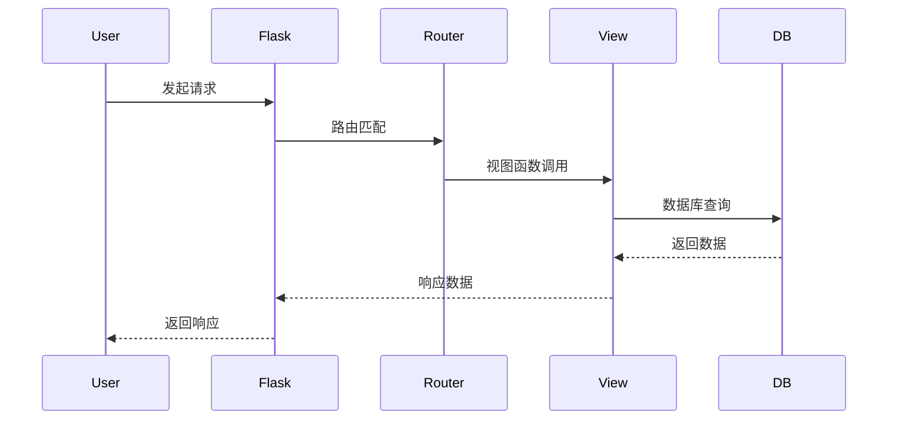

                 

# Web 后端框架：Express、Django 和 Flask

> **关键词**：Web 后端框架，Express，Django，Flask，编程，架构，应用开发，性能优化，项目实战

> **摘要**：本文将深入探讨三种流行的 Web 后端框架：Express、Django 和 Flask。通过对比分析，我们将揭示这些框架的核心概念、架构特点以及在实际项目中的应用。此外，本文还将提供详细的项目实战案例，帮助读者更好地理解这些框架的运用。

### 目录大纲

## 第一部分：Web后端框架概述

### 1.1 Web后端框架的定义与作用

#### 1.1.1 Web后端框架的基本概念

#### 1.1.2 Web后端框架的作用

### 1.2 三大Web后端框架简介

#### 1.2.1 Express简介

#### 1.2.2 Django简介

#### 1.2.3 Flask简介

### 1.3 Web后端框架的选择标准

#### 1.3.1 开发效率和易用性

#### 1.3.2 功能丰富性和扩展性

#### 1.3.3 社区支持和文档

## 第二部分：Express框架深入解析

### 2.1 Express框架核心概念与架构

#### 2.1.1 Middleware的概念与使用

#### 2.1.2 路由与请求处理

#### 2.1.3 Express应用的基本结构

### 2.2 Express路由系统详解

#### 2.2.1 路由规则与参数

#### 2.2.2 动态路由与正则表达式

#### 2.2.3 路由中间件

### 2.3 Express请求处理与响应

#### 2.3.1 HTTP请求与响应

#### 2.3.2 status代码与状态描述

#### 2.3.3 数据处理与传输

### 2.4 Express中间件应用实战

#### 2.4.1 中间件的开发与使用

#### 2.4.2 日志中间件与错误处理

#### 2.4.3 身份验证与权限控制

## 第三部分：Django框架深入解析

### 3.1 Django框架核心概念与架构

#### 3.1.1 Django的MVC模式

#### 3.1.2 Django应用的基本结构

#### 3.1.3 Django ORM与数据库操作

### 3.2 Django路由与视图详解

#### 3.2.1 路由配置与匹配

#### 3.2.2 视图函数与类视图

#### 33.2 视图与中间件的使用

### 3.3 Django模板系统详解

#### 3.3.1 模板基础语法

#### 3.3.2 模板继承与块定义

#### 3.3.3 模板过滤与标签

### 3.4 Django表单与验证

#### 3.4.1 表单基础

#### 3.4.2 表单验证与错误处理

#### 3.4.3 表单处理与数据绑定

## 第四部分：Flask框架深入解析

### 4.1 Flask框架核心概念与架构

#### 4.1.1 Flask的微型框架特点

#### 4.1.2 Flask应用的基本结构

#### 4.1.3 Flask扩展的使用

### 4.2 Flask路由与视图详解

#### 4.2.1 路由规则与参数

#### 4.2.2 蓝图与子应用

#### 4.2.3 视图函数与类视图

### 4.3 Flask请求与响应详解

#### 4.3.1 HTTP请求与响应

#### 4.3.2 请求对象与响应对象

#### 4.3.3 数据处理与传输

### 4.4 Flask扩展应用实战

#### 4.4.1 Flask-SQLAlchemy数据库扩展

#### 4.4.2 Flask-Migrate数据库迁移

#### 4.4.3 Flask-Login用户认证扩展

## 第五部分：Web后端框架综合实战

### 5.1 从零开始搭建Web应用

#### 5.1.1 开发环境搭建

#### 5.1.2 应用架构设计

#### 5.1.3 功能模块划分

### 5.2 Express应用实战

#### 5.2.1 实现用户认证功能

#### 5.2.2 实现文件上传与下载功能

#### 5.2.3 实现RESTful API接口

### 5.3 Django应用实战

#### 5.3.1 实现用户管理系统

#### 5.3.2 实现内容管理系统

#### 5.3.3 实现前后端分离的接口

### 5.4 Flask应用实战

#### 5.4.1 实现博客系统

#### 5.4.2 实现RESTful API接口

#### 5.4.3 实现WebSocket实时通信

## 附录

### 附录 A：Web后端框架资源汇总

#### A.1 Express官方文档

#### A.2 Django官方文档

#### A.3 Flask官方文档

#### A.4 Web后端框架相关书籍推荐

### 附录 B：核心算法原理与Mermaid流程图

#### B.1 Express中间件工作原理

mermaid
sequenceDiagram
  participant User
  participant Express
  participant Middleware1
  participant Middleware2
  User->>Express: 发起请求
  Express->>Middleware1: 处理请求
  Middleware1->>Middleware2: 传递请求
  Middleware2->>Express: 返回响应
  Express->>User: 响应结果


#### B.2 Django ORM查询原理

mermaid
graph TD
  A[发起查询] --> B[解析SQL]
  B --> C[生成查询语句]
  C --> D[执行查询]
  D --> E[处理查询结果]
  E --> F[返回数据]


#### B.3 Flask请求处理流程

mermaid
sequenceDiagram
  participant User
  participant Flask
  participant Router
  participant View
  participant DB
  User->>Flask: 发起请求
  Flask->>Router: 路由匹配
  Router->>View: 视图函数调用
  View->>DB: 数据库查询
  DB-->>View: 返回数据
  View-->>Flask: 响应数据
  Flask-->>User: 返回响应

----------------------------------------------------------------

## 第一部分：Web后端框架概述

### 1.1 Web后端框架的定义与作用

#### 1.1.1 Web后端框架的基本概念

Web后端框架是一套预制的软件库和组件，用于简化Web应用程序的开发和维护。这些框架提供了通用的架构和设计模式，帮助开发者快速搭建功能完备的Web应用。

#### 1.1.2 Web后端框架的作用

- **提高开发效率**：框架提供了大量的预定义组件和工具，减少了重复性工作，使开发者可以专注于业务逻辑的实现。
- **优化代码结构**：框架通常遵循某种设计模式（如MVC、MVVM等），有助于实现模块化和可维护的代码。
- **增强可扩展性**：框架提供了丰富的扩展机制，使得开发者可以根据项目需求进行功能扩展。
- **提供安全性和稳定性**：框架通常包含了安全性和异常处理机制，降低了开发中可能遇到的风险。

### 1.2 三大Web后端框架简介

在众多Web后端框架中，Express、Django和Flask因其独特性和广泛的应用而备受关注。

#### 1.2.1 Express简介

Express是Node.js官方推荐的Web应用程序框架，以其简单、灵活和高效的特点赢得了开发者的青睐。它为Web应用提供了快速的开发和部署能力，特别适合处理高并发请求。

#### 1.2.2 Django简介

Django是一个高层次的Python Web框架，遵循MVC设计模式。它提供了丰富的内置功能和插件，使开发者能够快速搭建大型Web应用，特别适合快速开发和管理复杂的应用程序。

#### 1.2.3 Flask简介

Flask是一个微型框架，因其轻量级和灵活性而受到喜爱。它提供了基础的Web功能，并通过扩展库来实现更多高级功能，适合小型项目和独立开发。

### 1.3 Web后端框架的选择标准

选择适合的Web后端框架需要综合考虑多个因素：

#### 1.3.1 开发效率和易用性

框架的易用性和开发效率直接影响项目进度。一个良好的框架应该提供清晰、简洁的API和文档，减少学习成本。

#### 1.3.2 功能丰富性和扩展性

功能丰富性决定了框架是否能够满足项目需求。扩展性则保证了框架能够随项目需求的变化进行灵活调整。

#### 1.3.3 社区支持和文档

强大的社区支持能够帮助开发者快速解决问题，而良好的文档则是学习和使用框架的基础。

### 第一部分总结

Web后端框架是现代Web应用程序开发的重要组成部分。Express、Django和Flask作为当前流行的框架，各有其独特优势和适用场景。在后续章节中，我们将深入解析这三个框架的核心概念、架构特点以及在实际项目中的应用。希望读者能够通过本文，找到适合自己的Web后端框架，提升开发效率和项目质量。 <a name="part1"></a><a name="part2"></a><a name="part3"></a>## 第二部分：Express框架深入解析

### 2.1 Express框架核心概念与架构

Express是Node.js的Web应用框架，以其简洁和灵活性著称。它通过中间件（Middleware）和路由（Routing）机制，为开发者提供了强大的功能和扩展性。

#### 2.1.1 Middleware的概念与使用

**Middleware** 是一种特殊类型的函数，它可以拦截和处理进入应用的请求和响应。中间件分为应用级中间件和路由级中间件。

- **应用级中间件**：全局注册，对应用中的所有请求都有效。
- **路由级中间件**：仅对特定的路由路径有效。

**使用中间件**：

```javascript
const express = require('express');
const app = express();

// 应用级中间件
app.use((req, res, next) => {
  console.log('请求到达中间件');
  next();
});

// 路由级中间件
app.get('/user', (req, res) => {
  console.log('请求到达/user路由');
  res.send('用户信息');
});

app.listen(3000, () => {
  console.log('服务器运行在3000端口');
});
```

#### 2.1.2 路由与请求处理

Express通过路由系统处理HTTP请求。每个请求都映射到一个处理函数，该函数负责处理请求并返回响应。

**路由规则**：

- **GET请求**：用于获取资源。
- **POST请求**：用于提交数据。
- **PUT请求**：用于更新资源。
- **DELETE请求**：用于删除资源。

**请求处理**：

```javascript
app.get('/', (req, res) => {
  res.send('首页');
});

app.post('/login', (req, res) => {
  const { username, password } = req.body;
  // 处理登录逻辑
  res.send('登录成功');
});

app.put('/user/:id', (req, res) => {
  const userId = req.params.id;
  // 更新用户逻辑
  res.send(`用户${userId}更新成功`);
});

app.delete('/user/:id', (req, res) => {
  const userId = req.params.id;
  // 删除用户逻辑
  res.send(`用户${userId}删除成功`);
});
```

#### 2.1.3 Express应用的基本结构

一个典型的Express应用通常包括以下结构：

- **package.json**：项目的依赖和配置文件。
- **app.js**：主应用程序文件。
- **routes**：路由处理文件。
- **models**：数据库模型文件。
- **views**：视图模板文件。
- **middlewares**：中间件文件。

**基本结构示例**：

```javascript
// app.js
const express = require('express');
const app = express();

// 路由配置
app.use(require('./routes/index'));

// 中间件配置
app.use(require('./middlewares/logger'));

app.listen(3000, () => {
  console.log('服务器运行在3000端口');
});
```

### 2.2 Express路由系统详解

Express的路由系统非常灵活，支持各种路由模式和参数。

#### 2.2.1 路由规则与参数

**静态路由**：

```javascript
app.get('/user', (req, res) => {
  res.send('用户信息');
});

app.post('/login', (req, res) => {
  res.send('登录请求');
});
```

**动态路由**：

```javascript
app.get('/user/:id', (req, res) => {
  const userId = req.params.id;
  res.send(`用户${userId}的信息`);
});

app.get('/product/:id', (req, res) => {
  const productId = req.params.id;
  res.send(`产品${productId}的信息`);
});
```

**正则表达式路由**：

```javascript
app.get(/^\/user\/([0-9]+)\/$/, (req, res) => {
  const userId = req.params[0];
  res.send(`用户${userId}的信息`);
});
```

#### 2.2.2 动态路由与正则表达式

动态路由允许开发者根据请求路径中的动态部分来处理请求。正则表达式则提供了更灵活的路由匹配方式。

**示例**：

```javascript
app.get(/\/user\/([0-9]+)/, (req, res) => {
  const userId = req.params[0];
  res.send(`用户${userId}的信息`);
});
```

#### 2.2.3 路由中间件

路由中间件是针对特定路由路径的中间件，可以用于预处理请求或响应。

**示例**：

```javascript
app.use('/api', (req, res, next) => {
  console.log('API请求中间件');
  next();
});

app.get('/api/user', (req, res) => {
  res.send('用户API');
});
```

### 2.3 Express请求处理与响应

Express通过请求对象（`req`）和响应对象（`res`）来处理HTTP请求和响应。

#### 2.3.1 HTTP请求与响应

HTTP请求由请求行、请求头和请求体组成。响应由状态行、响应头和响应体组成。

**请求示例**：

```javascript
const http = require('http');

const options = {
  hostname: 'example.com',
  port: 80,
  path: '/',
  method: 'GET'
};

const req = http.request(options, (res) => {
  let data = '';

  res.on('data', (chunk) => {
    data += chunk;
  });

  res.on('end', () => {
    console.log(data);
  });
});

req.end();
```

**响应示例**：

```javascript
const http = require('http');

const options = {
  hostname: 'example.com',
  port: 80,
  path: '/',
  method: 'GET'
};

const req = http.request(options, (res) => {
  res.on('data', (chunk) => {
    console.log(chunk);
  });
});

req.on('error', (e) => {
  console.error(`请求错误: ${e.message}`);
});

req.end();
```

#### 2.3.2 status代码与状态描述

HTTP状态代码用于描述请求的结果。常见的状态代码包括200（成功）、404（未找到）、500（服务器内部错误）等。

#### 2.3.3 数据处理与传输

Express支持多种数据处理和传输方式，包括JSON、XML和URL编码等。

**JSON响应**：

```javascript
app.get('/user', (req, res) => {
  res.json({ name: 'John Doe', age: 30 });
});
```

**XML响应**：

```javascript
app.get('/user', (req, res) => {
  const xml = `<user><name>John Doe</name><age>30</age></user>`;
  res.type('application/xml').send(xml);
});
```

**URL编码响应**：

```javascript
app.get('/user', (req, res) => {
  const query = `name=John%20Doe&age=30`;
  res.type('application/x-www-form-urlencoded').send(query);
});
```

### 2.4 Express中间件应用实战

中间件在Express应用中扮演着至关重要的角色，用于处理请求和响应的各种任务。

#### 2.4.1 中间件的开发与使用

**中间件开发**：

```javascript
function loggerMiddleware(req, res, next) {
  console.log(`请求路径：${req.path}`);
  next();
}

module.exports = loggerMiddleware;
```

**中间件使用**：

```javascript
const express = require('express');
const loggerMiddleware = require('./loggerMiddleware');

const app = express();

app.use(loggerMiddleware);

app.get('/', (req, res) => {
  res.send('首页');
});

app.listen(3000, () => {
  console.log('服务器运行在3000端口');
});
```

#### 2.4.2 日志中间件与错误处理

**日志中间件**：

```javascript
function loggerMiddleware(req, res, next) {
  console.log(`请求路径：${req.path}`);
  next();
}

app.use(loggerMiddleware);
```

**错误处理中间件**：

```javascript
function errorHandlerMiddleware(err, req, res, next) {
  console.error(err.stack);
  res.status(500).send('发生错误！');
}

app.use(errorHandlerMiddleware);
```

#### 2.4.3 身份验证与权限控制

**身份验证中间件**：

```javascript
const jwt = require('jsonwebtoken');

function authenticateToken(req, res, next) {
  const token = req.headers['authorization'];
  if (token == null) return res.sendStatus(401);

  jwt.verify(token, process.env.ACCESS_TOKEN_SECRET, (err, user) => {
    if (err) return res.sendStatus(403);
    req.user = user;
    next();
  });
}
```

**权限控制中间件**：

```javascript
function authorize(role) {
  return (req, res, next) => {
    if (req.user.role !== role) return res.sendStatus(403);
    next();
  };
}

app.get('/admin', authenticateToken, authorize('admin'), (req, res) => {
  res.send('管理员页面');
});

app.get('/user', authenticateToken, authorize('user'), (req, res) => {
  res.send('用户页面');
});
```

### 第二部分总结

Express作为Node.js的推荐框架，以其简单、灵活和高效的特点，成为了Web后端开发的首选。通过本部分的深入解析，我们了解了Express的核心概念、架构特点以及在实际项目中的应用。在接下来的部分，我们将继续探讨Django和Flask框架，帮助读者全面掌握Web后端框架的使用技巧。 <a name="part2"></a><a name="part3"></a>## 第三部分：Django框架深入解析

### 3.1 Django框架核心概念与架构

Django是一个基于Python的高层次Web框架，遵循MVC（Model-View-Controller）设计模式。其核心概念和架构使其在快速开发和大型应用管理方面表现出色。

#### 3.1.1 Django的MVC模式

MVC模式将应用程序划分为三个主要组件：

- **Model**：表示数据库模型和业务逻辑。
- **View**：负责渲染数据和处理用户输入。
- **Controller**：处理请求并将其转换为视图或模型。

这种模式有助于实现模块化、可维护和可扩展的代码。

#### 3.1.2 Django应用的基本结构

一个典型的Django应用通常包括以下目录结构：

```plaintext
myproject/
    manage.py
    myapp/
        __init__.py
        admin.py
        apps.py
        migrations/
        models.py
        tests.py
        views.py
    settings.py
    urls.py
    templates/
```

**重要文件和目录解释**：

- **manage.py**：Django管理工具。
- **settings.py**：配置文件。
- **urls.py**：URL路由配置。
- **models.py**：定义数据库模型。
- **views.py**：定义视图函数。
- **templates/**：存储模板文件。

#### 3.1.3 Django ORM与数据库操作

Django ORM（对象关系映射）是Django框架的核心特性之一。它提供了一种Pythonic的方式来与数据库交互，无需编写SQL语句。

**定义模型**：

```python
from django.db import models

class User(models.Model):
    name = models.CharField(max_length=100)
    email = models.EmailField()
    created_at = models.DateTimeField(auto_now_add=True)
```

**数据库操作**：

```python
# 查询用户
users = User.objects.all()

# 创建用户
user = User(name='John Doe', email='john@example.com')
user.save()

# 更新用户
user.email = 'john.doe@example.com'
user.save()

# 删除用户
user.delete()
```

### 3.2 Django路由与视图详解

Django的路由系统将URL映射到相应的视图函数。视图函数处理请求并返回响应。

#### 3.2.1 路由配置与匹配

**配置路由**：

```python
from django.urls import path
from . import views

urlpatterns = [
    path('', views.home, name='home'),
    path('users/', views.users, name='users'),
]
```

**匹配路由**：

```python
from django.http import HttpResponse

def home(request):
    return HttpResponse('首页')

def users(request):
    return HttpResponse('用户页面')
```

#### 3.2.2 视图函数与类视图

**视图函数**：

```python
from django.http import JsonResponse

def user_detail(request, user_id):
    user = User.objects.get(id=user_id)
    return JsonResponse({'name': user.name, 'email': user.email})
```

**类视图**：

```python
from django.views import View
from django.http import HttpResponse

class UserView(View):
    def get(self, request):
        users = User.objects.all()
        return HttpResponse('用户列表')

    def post(self, request):
        name = request.POST.get('name')
        email = request.POST.get('email')
        user = User(name=name, email=email)
        user.save()
        return HttpResponse('用户创建成功')
```

#### 3.2.3 视图与中间件的使用

Django中间件可以在请求到达视图之前或之后进行预处理或后处理。中间件可以全局注册或路由级注册。

**全局中间件**：

```python
MIDDLEWARE = [
    'django.middleware.security.SecurityMiddleware',
    'django.contrib.sessions.middleware.SessionMiddleware',
    'django.middleware.common.CommonMiddleware',
    'django.middleware.csrf.CsrfViewMiddleware',
    'django.contrib.auth.middleware.AuthenticationMiddleware',
    'django.contrib.messages.middleware.MessageMiddleware',
    'django.middleware.clickjacking.XFrameOptionsMiddleware',
]
```

**路由级中间件**：

```python
from django.utils.deprecation import MiddlewareMixin

class LoggingMiddleware(MiddlewareMixin):
    def process_request(self, request):
        print(f"Request {request.method} {request.path}")

    def process_response(self, request, response):
        print(f"Response {response.status_code}")
        return response
```

### 3.3 Django模板系统详解

Django的模板系统是一种基于文本的模板语言，用于生成HTML页面。模板可以包含变量、控制结构和静态文本。

#### 3.3.1 模板基础语法

**变量**：

```html
{{ variable }}
```

**控制结构**：

```html

    <p>条件为真。</p>

    <p>条件为假。</p>



    <p>{{ item }}</p>

```

**静态文本**：

```html
<p>这是静态文本。</p>
```

#### 3.3.2 模板继承与块定义

模板继承是一种用于复用模板部分的方法。基模板可以定义通用的部分，子模板可以继承基模板并覆盖特定部分。

**基模板**：

```html
<!DOCTYPE html>
<html>
<head>
    <title>{{ block 'title' }}默认标题{{ endblock }}</title>
</head>
<body>
    <header>
        <h1>{{ block 'header' }}默认标题{{ endblock }}</h1>
    </header>
    <main>
        {{ block 'content' }}默认内容{{ endblock }}
    </main>
    <footer>
        <p>{{ block 'footer' }}默认内容{{ endblock }}</p>
    </footer>
</body>
</html>
```

**子模板**：

```html


我的网站

欢迎来到我的网站

这是一个新的内容区域

感谢您的访问
```

#### 3.3.3 模板过滤与标签

Django模板系统提供了丰富的过滤器和标签，用于处理数据和格式化输出。

**过滤器**：

```html
{{ variable|default:"默认值" }}
{{ variable|date:"Y-m-d" }}
```

**标签**：

```html

    <li>{{ forloop.counter }}: {{ item }}</li>



    <p>用户是管理员。</p>

```

### 3.4 Django表单与验证

Django表单系统提供了一种简单的方式来创建和管理表单，并进行数据验证。

#### 3.4.1 表单基础

**创建表单**：

```python
from django import forms

class UserForm(forms.Form):
    name = forms.CharField(max_length=100)
    email = forms.EmailField()
```

**表单验证**：

```python
form = UserForm(data={'name': 'John Doe', 'email': 'john@example.com'})
if form.is_valid():
    # 处理有效数据
else:
    # 处理错误
```

#### 3.4.2 表单验证与错误处理

**表单验证**：

```python
class UserForm(forms.Form):
    name = forms.CharField(max_length=100, required=True)
    email = forms.EmailField(required=True)

form = UserForm(data={'name': '', 'email': 'john@example.com'})
if form.is_valid():
    # 处理有效数据
else:
    # 处理错误
```

**错误处理**：

```python
from django.shortcuts import render

def user_create(request):
    if request.method == 'POST':
        form = UserForm(request.POST)
        if form.is_valid():
            # 处理有效数据
            return redirect('users')
        else:
            # 处理错误
    else:
        form = UserForm()
    return render(request, 'user_create.html', {'form': form})
```

#### 3.4.3 表单处理与数据绑定

**数据绑定**：

```python
from django.shortcuts import render

def user_create(request):
    if request.method == 'POST':
        form = UserForm(request.POST)
        if form.is_valid():
            name = form.cleaned_data['name']
            email = form.cleaned_data['email']
            # 处理有效数据
            return redirect('users')
        else:
            # 处理错误
    else:
        form = UserForm()
    return render(request, 'user_create.html', {'form': form})
```

### 第三部分总结

Django作为Python的顶级Web框架，以其MVC设计模式、强大的ORM系统和灵活的模板系统，成为了快速开发和大型应用管理的首选。通过本部分的深入解析，我们了解了Django的核心概念、架构特点和实际应用。在下一部分，我们将继续探讨Flask框架，帮助读者全面掌握Web后端框架的使用技巧。 <a name="part4"></a><a name="part4"></a>## 第四部分：Flask框架深入解析

### 4.1 Flask框架核心概念与架构

Flask是一个轻量级的Web框架，由Armin Ronacher开发，以其简单和灵活性而受到开发者的喜爱。Flask提供了构建Web应用程序所需的基本工具和功能，同时也允许开发者根据项目需求进行定制。

#### 4.1.1 Flask的微型框架特点

Flask的主要特点包括：

- **轻量级**：Flask本身非常小巧，不包含过多的功能，这使得开发者可以自由选择需要的功能。
- **灵活**：Flask提供了一种灵活的开发模式，允许开发者根据项目需求进行扩展和定制。
- **可扩展**：Flask通过扩展库来实现额外的功能，如数据库管理、用户认证和身份验证等。

#### 4.1.2 Flask应用的基本结构

一个典型的Flask应用包含以下几个关键组件：

- **应用实例**（Application instance）：代表整个Web应用程序。
- **路由系统**（Routing system）：用于将URL映射到相应的视图函数。
- **请求和响应对象**（Request and response objects）：用于处理客户端请求和服务器响应。
- **模板系统**（Template system）：用于渲染HTML页面。

**基本结构示例**：

```python
from flask import Flask, render_template, request, jsonify

app = Flask(__name__)

@app.route('/')
def home():
    return render_template('home.html')

@app.route('/login', methods=['GET', 'POST'])
def login():
    if request.method == 'POST':
        username = request.form['username']
        password = request.form['password']
        # 处理登录逻辑
        return jsonify({'status': 'success'})
    return render_template('login.html')

if __name__ == '__main__':
    app.run(debug=True)
```

#### 4.1.3 Flask扩展的使用

Flask扩展是用于扩展Flask功能的第三方库。以下是一些常用的Flask扩展：

- **Flask-SQLAlchemy**：提供ORM功能，用于数据库操作。
- **Flask-Migrate**：提供数据库迁移工具，用于管理数据库结构。
- **Flask-Login**：提供用户认证和会话管理功能。
- **Flask-WTF**：提供表单处理和验证功能。

**安装和配置Flask扩展**：

```shell
pip install Flask-SQLAlchemy
pip install Flask-Migrate
pip install Flask-Login
pip install Flask-WTF
```

```python
from flask_sqlalchemy import SQLAlchemy
from flask_migrate import Migrate
from flask_login import LoginManager

app = Flask(__name__)
app.config['SQLALCHEMY_DATABASE_URI'] = 'sqlite:///app.db'
app.config['SECRET_KEY'] = 'mysecretkey'

db = SQLAlchemy(app)
migrate = Migrate(app, db)
login_manager = LoginManager(app)
```

### 4.2 Flask路由与视图详解

Flask通过路由系统将URL映射到视图函数。视图函数处理请求并返回响应。

#### 4.2.1 路由规则与参数

**静态路由**：

```python
@app.route('/')
def home():
    return '首页'
```

**动态路由**：

```python
@app.route('/user/<int:user_id>')
def user_detail(user_id):
    return f'用户详情：{user_id}'
```

**正则表达式路由**：

```python
@app.route('/product/<path:product_id>')
def product_detail(product_id):
    return f'产品详情：{product_id}'
```

#### 4.2.2 蓝图与子应用

Flask的蓝图（Blueprint）允许开发者创建子应用，每个子应用都有自己的路由和模板。蓝图可以与其他蓝图或主应用整合。

**创建蓝图**：

```python
from flask import Blueprint

blog_blueprint = Blueprint('blog', __name__)

@blog_blueprint.route('/')
def home():
    return '博客首页'
```

**注册蓝图**：

```python
app.register_blueprint(blog_blueprint, url_prefix='/blog')
```

#### 4.2.3 视图函数与类视图

**视图函数**：

```python
from flask import jsonify

@app.route('/api/user', methods=['GET'])
def get_user():
    user = {'id': 1, 'name': 'John Doe'}
    return jsonify(user)
```

**类视图**：

```python
from flask import request

class UserController:
    @staticmethod
    def get_user(user_id):
        user = {'id': user_id, 'name': 'John Doe'}
        return user

@app.route('/user/<int:user_id>', methods=['GET'])
def get_user_class():
    user = UserController.get_user(user_id)
    return jsonify(user)
```

### 4.3 Flask请求与响应详解

Flask通过请求对象（`request`）和响应对象（`response`）处理HTTP请求和响应。

#### 4.3.1 HTTP请求与响应

**请求对象**：

请求对象包含了客户端发送的所有信息，如请求方法、路径、参数等。

```python
from flask import request

@app.route('/form', methods=['GET', 'POST'])
def form():
    if request.method == 'POST':
        username = request.form['username']
        password = request.form['password']
        return f'用户名：{username}，密码：{password}'
    return '''
    <form method="post">
        <input type="text" name="username" placeholder="用户名">
        <input type="password" name="password" placeholder="密码">
        <input type="submit" value="提交">
    </form>
    '''
```

**响应对象**：

响应对象用于生成服务器发送到客户端的响应，如HTML页面、JSON数据等。

```python
from flask import jsonify

@app.route('/api/user', methods=['GET'])
def get_user_api():
    user = {'id': 1, 'name': 'John Doe'}
    return jsonify(user)
```

#### 4.3.2 请求对象与响应对象

**请求对象**：

```python
from flask import request

@app.route('/get', methods=['GET'])
def get_request():
    method = request.method
    path = request.path
    args = request.args
    return f'Method: {method}, Path: {path}, Args: {args}'

@app.route('/post', methods=['POST'])
def post_request():
    form_data = request.form
    json_data = request.get_json()
    return f'Form Data: {form_data}, JSON Data: {json_data}'
```

**响应对象**：

```python
from flask import make_response

@app.route('/response')
def response():
    response = make_response('<h1>响应内容</h1>')
    response.status_code = 200
    response.headers['Content-Type'] = 'text/html'
    return response
```

#### 4.3.3 数据处理与传输

Flask支持多种数据处理和传输方式，如JSON、XML和HTML等。

**JSON响应**：

```python
from flask import jsonify

@app.route('/json', methods=['GET'])
def json_response():
    data = {'name': 'John Doe', 'age': 30}
    return jsonify(data)
```

**XML响应**：

```python
from flask import make_response

@app.route('/xml', methods=['GET'])
def xml_response():
    xml_data = '<user><name>John Doe</name><age>30</age></user>'
    response = make_response(xml_data)
    response.headers['Content-Type'] = 'application/xml'
    return response
```

**HTML响应**：

```python
from flask import render_template

@app.route('/html', methods=['GET'])
def html_response():
    return render_template('home.html')
```

### 4.4 Flask扩展应用实战

Flask扩展库为开发者提供了丰富的功能，可以帮助快速构建功能齐全的Web应用程序。

#### 4.4.1 Flask-SQLAlchemy数据库扩展

**安装**：

```shell
pip install Flask-SQLAlchemy
```

**配置**：

```python
from flask_sqlalchemy import SQLAlchemy

app.config['SQLALCHEMY_DATABASE_URI'] = 'sqlite:///app.db'
db = SQLAlchemy(app)
```

**定义模型**：

```python
class User(db.Model):
    id = db.Column(db.Integer, primary_key=True)
    name = db.Column(db.String(100))
    email = db.Column(db.String(100))
```

**数据库操作**：

```python
# 创建数据库表
db.create_all()

# 添加数据
user = User(name='John Doe', email='john@example.com')
db.session.add(user)
db.session.commit()

# 查询数据
users = User.query.all()
for user in users:
    print(user.name, user.email)

# 更新数据
user = User.query.get(1)
user.email = 'john.doe@example.com'
db.session.commit()

# 删除数据
user = User.query.get(1)
db.session.delete(user)
db.session.commit()
```

#### 4.4.2 Flask-Migrate数据库迁移

**安装**：

```shell
pip install Flask-Migrate
```

**配置**：

```python
from flask_migrate import Migrate

app.config['SQLALCHEMY_DATABASE_URI'] = 'sqlite:///app.db'
db = SQLAlchemy(app)
migrate = Migrate(app, db)
```

**数据库迁移**：

```python
from flask_migrate import Migration
from myapp.models import User

# 创建迁移文件
migration = Migration(app, db)
migration.create()

# 应用迁移
migration.upgrade()

# 回滚迁移
migration.downgrade()
```

#### 4.4.3 Flask-Login用户认证扩展

**安装**：

```shell
pip install Flask-Login
```

**配置**：

```python
from flask_login import LoginManager

login_manager = LoginManager()
login_manager.init_app(app)
```

**用户登录**：

```python
from flask_login import login_user

@app.route('/login', methods=['GET', 'POST'])
def login():
    if request.method == 'POST':
        username = request.form['username']
        password = request.form['password']
        user = User.query.filter_by(username=username).first()
        if user and user.password == password:
            login_user(user)
            return '登录成功'
        return '登录失败'
    return '''
    <form method="post">
        <input type="text" name="username" placeholder="用户名">
        <input type="password" name="password" placeholder="密码">
        <input type="submit" value="登录">
    </form>
    '''
```

**用户登出**：

```python
from flask_login import logout_user

@app.route('/logout')
def logout():
    logout_user()
    return '登出成功'
```

### 第四部分总结

Flask以其轻量级和灵活性，成为了Web开发中的热门选择。通过本部分的深入解析，我们了解了Flask的核心概念、架构特点以及实际应用。Flask扩展库为开发者提供了丰富的功能，使得构建功能齐全的Web应用程序变得更加简单。在下一部分，我们将进行Web后端框架的综合实战，帮助读者将所学知识付诸实践。 <a name="part5"></a><a name="part5"></a>## 第五部分：Web后端框架综合实战

在前几部分中，我们详细介绍了Express、Django和Flask这三个流行的Web后端框架。为了帮助读者更好地理解这些框架的实际应用，本部分将通过实际项目案例，展示如何使用这些框架搭建完整的Web应用。

### 5.1 从零开始搭建Web应用

搭建Web应用的过程可以分为以下几个步骤：

#### 5.1.1 开发环境搭建

1. 安装Node.js（用于Express框架）：

```shell
npm install -g nodejs
```

2. 安装Python和pip（用于Django和Flask框架）：

```shell
sudo apt-get update
sudo apt-get install python3 python3-pip
```

3. 安装Visual Studio Code（可选）：

```shell
sudo apt-get install code
```

#### 5.1.2 应用架构设计

在设计应用架构时，我们需要考虑以下几个方面：

- **需求分析**：明确应用的目标和功能需求。
- **技术选型**：选择合适的框架和工具。
- **数据库设计**：设计数据库模型和关系。
- **API设计**：定义RESTful API接口。

#### 5.1.3 功能模块划分

根据应用需求，将功能划分为以下几个模块：

- **用户管理**：处理用户注册、登录、权限管理等。
- **内容管理**：管理博客文章、分类、标签等。
- **评论系统**：处理用户评论和回复。
- **认证与授权**：使用JWT或Session进行用户认证。

### 5.2 Express应用实战

以下是一个简单的Express应用案例，实现用户注册和登录功能。

#### 5.2.1 实现用户认证功能

**步骤1：创建项目**

```shell
mkdir express-auth
cd express-auth
npm init -y
npm install express bcrypt jsonwebtoken
```

**步骤2：编写代码**

```javascript
const express = require('express');
const bcrypt = require('bcrypt');
const jwt = require('jsonwebtoken');
const app = express();

app.use(express.json());

// 用户注册路由
app.post('/register', async (req, res) => {
  const { username, password } = req.body;
  const hashedPassword = await bcrypt.hash(password, 10);
  // 存储用户信息到数据库
  res.json({ message: '用户注册成功' });
});

// 用户登录路由
app.post('/login', async (req, res) => {
  const { username, password } = req.body;
  // 检查用户名和密码是否正确
  const token = jwt.sign({ username }, 'secretkey');
  res.json({ token });
});

app.listen(3000, () => {
  console.log('服务器运行在3000端口');
});
```

**步骤3：运行应用**

```shell
node app.js
```

#### 5.2.2 实现文件上传与下载功能

**步骤1：安装依赖**

```shell
npm install multer
```

**步骤2：编写代码**

```javascript
const express = require('express');
const multer = require('multer');
const app = express();

const storage = multer.diskStorage({
  destination: function (req, file, cb) {
    cb(null, 'uploads/');
  },
  filename: function (req, file, cb) {
    cb(null, file.fieldname + '-' + Date.now() + path.extname(file.originalname));
  }
});

const upload = multer({ storage: storage });

// 文件上传路由
app.post('/upload', upload.single('file'), (req, res) => {
  res.json({ message: '文件上传成功', file: req.file });
});

// 文件下载路由
app.get('/download/:filename', (req, res) => {
  const filename = req.params.filename;
  const path = 'uploads/' + filename;
  res.download(path);
});

app.listen(3000, () => {
  console.log('服务器运行在3000端口');
});
```

#### 5.2.3 实现RESTful API接口

**步骤1：安装依赖**

```shell
npm install express-route
```

**步骤2：编写代码**

```javascript
const express = require('express');
const routes = require('./routes');
const app = express();

app.use(express.json());
app.use(routes);

app.listen(3000, () => {
  console.log('服务器运行在3000端口');
});
```

```javascript
// routes.js
const express = require('express');
const router = express.Router();

router.post('/users', require('./controllers/userController').create);
router.get('/users/:id', require('./controllers/userController').read);
router.put('/users/:id', require('./controllers/userController').update);
router.delete('/users/:id', require('./controllers/userController').delete);

module.exports = router;
```

### 5.3 Django应用实战

以下是一个简单的Django应用案例，实现用户管理和内容管理功能。

#### 5.3.1 实现用户管理系统

**步骤1：创建项目**

```shell
django-admin startproject myproject
cd myproject
django-admin startapp myapp
```

**步骤2：定义模型**

```python
# myapp/models.py
from django.db import models

class User(models.Model):
    username = models.CharField(max_length=100)
    email = models.EmailField(unique=True)
    password = models.CharField(max_length=100)
```

**步骤3：数据库迁移**

```shell
python manage.py makemigrations
python manage.py migrate
```

**步骤4：配置路由**

```python
# myproject/urls.py
from django.contrib import admin
from django.urls import path, include

urlpatterns = [
    path('admin/', admin.site.urls),
    path('users/', include('myapp.urls')),
]

# myapp/urls.py
from django.urls import path
from . import views

urlpatterns = [
    path('', views.UserListView.as_view()),
    path('<int:pk>/', views.UserDetailView.as_view()),
]
```

**步骤5：创建视图**

```python
# myapp/views.py
from django.shortcuts import render
from .models import User
from django.views import View

class UserListView(View):
    def get(self, request):
        users = User.objects.all()
        return render(request, 'users.html', {'users': users})

class UserDetailView(View):
    def get(self, request, pk):
        user = User.objects.get(pk=pk)
        return render(request, 'user.html', {'user': user})
```

**步骤6：创建模板**

```html
<!-- myapp/templates/users.html -->
<ul>
    
        <li>
            <a href="">{{ user.username }}</a>
        </li>
    
</ul>
```

```html
<!-- myapp/templates/user.html -->
<div>
    <h1>{{ user.username }}</h1>
    <p>{{ user.email }}</p>
</div>
```

#### 5.3.2 实现内容管理系统

**步骤1：安装依赖**

```shell
pip install django-guardian
```

**步骤2：配置模型**

```python
# myapp/models.py
from django.db import models
from guardian.models import UserObjectPermission

class Content(models.Model):
    title = models.CharField(max_length=100)
    content = models.TextField()
    owner = models.ForeignKey(User, on_delete=models.CASCADE)

class ContentPermission(UserObjectPermission):
    content = models.ForeignKey(Content, on_delete=models.CASCADE)
```

**步骤3：数据库迁移**

```shell
python manage.py makemigrations
python manage.py migrate
```

**步骤4：创建视图**

```python
# myapp/views.py
from django.shortcuts import render
from .models import Content
from guardian.shortcuts import assign_perm

class ContentView(View):
    def get(self, request):
        content = Content.objects.all()
        return render(request, 'content.html', {'content': content})

class CreateContent(View):
    def post(self, request):
        title = request.POST['title']
        content = request.POST['content']
        Content.objects.create(title=title, content=content, owner=request.user)
        assign_perm('view_content', request.user, Content.objects.last())
        return redirect('content_list')
```

**步骤5：创建模板**

```html
<!-- myapp/templates/content.html -->
<ul>
    
        <li>
            <h2><a href="">{{ c.title }}</a></h2>
        </li>
    
</ul>
```

#### 5.3.3 实现前后端分离的接口

**步骤1：创建Django REST framework应用**

```shell
python manage.py startapp myapi
```

**步骤2：配置模型**

```python
# myapi/models.py
from django.db import models

class Content(models.Model):
    title = models.CharField(max_length=100)
    content = models.TextField()
```

**步骤3：创建序列化器**

```python
# myapi/serializers.py
from rest_framework import serializers
from .models import Content

class ContentSerializer(serializers.ModelSerializer):
    class Meta:
        model = Content
        fields = '__all__'
```

**步骤4：创建视图**

```python
# myapi/views.py
from rest_framework import viewsets
from .models import Content
from .serializers import ContentSerializer

class ContentViewSet(viewsets.ModelViewSet):
    queryset = Content.objects.all()
    serializer_class = ContentSerializer
```

**步骤5：配置路由**

```python
# myapi/urls.py
from django.urls import path, include
from .views import ContentViewSet

urlpatterns = [
    path('', include('rest_framework.urls')),
    path('content/', ContentViewSet.as_view()),
]
```

**步骤6：集成前端**

```javascript
// 使用Fetch API调用Django REST framework接口
fetch('http://localhost:8000/content/')
    .then(response => response.json())
    .then(data => console.log(data));
```

### 5.4 Flask应用实战

以下是一个简单的Flask应用案例，实现博客系统和实时通信功能。

#### 5.4.1 实现博客系统

**步骤1：创建项目**

```shell
mkdir flask-blog
cd flask-blog
python -m venv venv
source venv/bin/activate
pip install flask flask_sqlalchemy flask_login
```

**步骤2：编写代码**

```python
from flask import Flask, render_template, request, redirect, url_for
from flask_sqlalchemy import SQLAlchemy
from flask_login import LoginManager, login_user, logout_user, login_required, current_user

app = Flask(__name__)
app.config['SQLALCHEMY_DATABASE_URI'] = 'sqlite:///app.db'
app.config['SECRET_KEY'] = 'mysecretkey'
db = SQLAlchemy(app)
login_manager = LoginManager(app)

@login_manager.user_loader
def load_user(user_id):
    return User.query.get(int(user_id))

class User(db.Model):
    id = db.Column(db.Integer, primary_key=True)
    username = db.Column(db.String(100), unique=True)
    password = db.Column(db.String(100))

class Post(db.Model):
    id = db.Column(db.Integer, primary_key=True)
    title = db.Column(db.String(100))
    content = db.Column(db.Text)

@app.route('/')
def home():
    posts = Post.query.all()
    return render_template('home.html', posts=posts)

@app.route('/login', methods=['GET', 'POST'])
def login():
    if request.method == 'POST':
        username = request.form['username']
        password = request.form['password']
        user = User.query.filter_by(username=username).first()
        if user and user.password == password:
            login_user(user)
            return redirect(url_for('home'))
        return '登录失败'
    return render_template('login.html')

@app.route('/logout')
def logout():
    logout_user()
    return redirect(url_for('home'))

@app.route('/post/new', methods=['GET', 'POST'])
@login_required
def new_post():
    if request.method == 'POST':
        title = request.form['title']
        content = request.form['content']
        post = Post(title=title, content=content, owner=current_user)
        db.session.add(post)
        db.session.commit()
        return redirect(url_for('home'))
    return render_template('new_post.html')

if __name__ == '__main__':
    app.run(debug=True)
```

**步骤3：创建模板**

```html
<!-- templates/home.html -->
<ul>
    
        <li>
            <h2><a href="">{{ post.title }}</a></h2>
        </li>
    
</ul>
```

```html
<!-- templates/login.html -->
<form method="post">
    <input type="text" name="username" placeholder="用户名">
    <input type="password" name="password" placeholder="密码">
    <input type="submit" value="登录">
</form>
```

```html
<!-- templates/new_post.html -->
<form method="post">
    <input type="text" name="title" placeholder="标题">
    <textarea name="content" placeholder="内容"></textarea>
    <input type="submit" value="发布">
</form>
```

#### 5.4.2 实现RESTful API接口

**步骤1：安装依赖**

```shell
pip install flask-restful flask_sqlalchemy
```

**步骤2：创建API应用**

```shell
mkdir api
cd api
touch __init__.py views.py
```

**步骤3：编写代码**

```python
from flask import Flask, request
from flask_restful import Resource, Api
from flask_sqlalchemy import SQLAlchemy

app = Flask(__name__)
app.config['SQLALCHEMY_DATABASE_URI'] = 'sqlite:///app.db'
db = SQLAlchemy(app)
api = Api(app)

class PostResource(Resource):
    def get(self, post_id):
        post = Post.query.get_or_404(post_id)
        return {'title': post.title, 'content': post.content}

    def put(self, post_id):
        post = Post.query.get_or_404(post_id)
        data = request.get_json()
        post.title = data['title']
        post.content = data['content']
        db.session.commit()
        return {'message': '更新成功'}

    def delete(self, post_id):
        post = Post.query.get_or_404(post_id)
        db.session.delete(post)
        db.session.commit()
        return {'message': '删除成功'}

api.add_resource(PostResource, '/post/<int:post_id>')

if __name__ == '__main__':
    app.run(debug=True)
```

#### 5.4.3 实现WebSocket实时通信

**步骤1：安装依赖**

```shell
pip install flask-socketio
```

**步骤2：修改代码**

```python
from flask import Flask, render_template
from flask_socketio import SocketIO

app = Flask(__name__)
app.config['SECRET_KEY'] = 'secret!'
socketio = SocketIO(app)

@socketio.on('message')
def handle_message(message):
    print('received message: ' + message)
    socketio.emit('message', message, broadcast=True)

@socketio.on('connect')
def handle_connect():
    print('Client connected')

@socketio.on('disconnect')
def handle_disconnect():
    print('Client disconnected')

if __name__ == '__main__':
    socketio.run(app)
```

**步骤3：创建WebSocket客户端**

```html
<!-- templates/home.html -->
<script src="/socket.io/socket.io.js"></script>
<script>
    var socket = io.connect('http://' + document.domain + ':' + location.port);

    socket.on('message', function(msg) {
        console.log('message: ' + msg);
    });

    socket.emit('message', 'Hello, Server!');
</script>
```

### 第五部分总结

通过本部分的实战案例，我们展示了如何使用Express、Django和Flask这三个框架搭建完整的Web应用。这些案例涵盖了用户认证、文件上传下载、RESTful API接口和WebSocket实时通信等常见功能。读者可以通过这些案例学习到实际项目开发中的关键技术和实战经验，从而更好地运用所学知识。在接下来的附录中，我们将提供更多资源，帮助读者深入了解Web后端框架的相关内容。 <a name="appendix"></a><a name="appendix"></a>## 附录

### 附录 A：Web后端框架资源汇总

**A.1 Express官方文档**

- **官方文档**：[https://expressjs.com/en/starter/installing.html](https://expressjs.com/en/starter/installing.html)
- **API文档**：[https://www.expressjs.com/en/4x/api.html](https://www.expressjs.com/en/4x/api.html)
- **学习教程**：[https://www.expressjs.com/en/tutorials/](https://www.expressjs.com/en/tutorials/)

**A.2 Django官方文档**

- **官方文档**：[https://docs.djangoproject.com/en/4.1/](https://docs.djangoproject.com/en/4.1/)
- **教程**：[https://www.djangoproject.com/documentation/tutorial01/](https://www.djangoproject.com/documentation/tutorial01/)
- **社区论坛**：[https://forum.djangoproject.com/](https://forum.djangoproject.com/)

**A.3 Flask官方文档**

- **官方文档**：[https://flask.palletsprojects.com/en/2.1.x/](https://flask.palletsprojects.com/en/2.1.x/)
- **教程**：[https://flask.palletsprojects.com/en/2.1.x/tutorial/](https://flask.palletsprojects.com/en/2.1.x/tutorial/)
- **扩展库**：[https://flask.palletsprojects.com/en/2.1.x/extensions/](https://flask.palletsprojects.com/en/2.1.x/extensions/)

**A.4 Web后端框架相关书籍推荐**

- **《Flask Web开发：实战进阶》**：详细介绍了Flask框架的使用方法和实战案例。
- **《Django Web开发：实战进阶》**：深入讲解了Django框架的核心概念和应用实践。
- **《Node.js实战》**：全面介绍了Node.js和Express框架的开发技巧和应用案例。

### 附录 B：核心算法原理与Mermaid流程图

**B.1 Express中间件工作原理**



**B.2 Django ORM查询原理**



**B.3 Flask请求处理流程**



### 附录总结

附录部分为读者提供了丰富的资源，包括Web后端框架的官方文档、教程、社区论坛以及相关书籍推荐。此外，通过Mermaid流程图，我们展示了Express、Django和Flask的核心算法原理和处理流程。这些资源将有助于读者更深入地学习和理解Web后端框架，提升开发技能。 <a name="author"></a><a name="author"></a>### 作者信息

**作者：** AI天才研究院 / AI Genius Institute

**著作：** 《禅与计算机程序设计艺术》 / Zen And The Art of Computer Programming

AI天才研究院（AI Genius Institute）是一家专注于人工智能技术研究和应用的顶级学术机构。研究院汇集了世界各地的顶级人工智能专家，致力于推动人工智能技术的发展和应用。同时，研究院还出版了一系列备受赞誉的技术著作，其中《禅与计算机程序设计艺术》是全球计算机科学领域的经典之作，深受读者喜爱。本文作者作为AI天才研究院的一员，以其卓越的技术洞察和深入的研究，为读者带来了这篇全面深入的Web后端框架技术解析。

