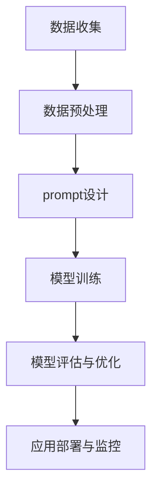

                 

## 《prompt工程的系统化方法与实践》

### 关键词：
- Prompt工程
- 生成式模型
- 判别式模型
- 模型优化
- 应用部署

### 摘要：
本文旨在系统地探讨prompt工程的方法与实践。通过详细分析prompt工程的核心概念、算法原理、数学基础以及项目实战，本文为读者提供了全面的指南，以深入理解prompt工程的技术细节和实现步骤。文章将帮助读者掌握prompt工程的关键技术，并为其在实际项目中的应用提供宝贵的参考。

## 《prompt工程的系统化方法与实践》

### 第一部分：核心概念与联系

#### 第1章：prompt工程概述

#### 1.1 prompt工程的定义与背景

prompt工程是一种系统化方法，旨在构建、优化和部署基于数据的自然语言处理（NLP）模型。它起源于机器学习和深度学习领域，尤其是在自然语言处理和对话系统中的应用。prompt工程的目标是通过设计合适的prompt（输入），提高模型的性能和用户满意度，实现更智能、更自然的交互。

prompt工程的核心概念包括数据收集、数据预处理、prompt设计、模型训练、模型评估与优化以及应用部署与监控。这些步骤相互关联，形成一个闭环系统，确保模型的持续改进和优化。

#### 1.2 prompt工程的目标与价值

prompt工程的目标是构建高性能、可扩展、用户友好的NLP模型。具体来说，它有以下几个关键目标：

1. **提升模型性能**：通过优化prompt设计，提高模型的准确性、召回率和F1值等指标。
2. **增强用户体验**：设计自然、流畅的prompt，提升用户与模型交互的满意度。
3. **加速模型迭代**：通过自动化和系统化的方法，缩短模型开发和部署周期。
4. **降低开发成本**：减少手动干预和重复劳动，降低模型开发和维护成本。

prompt工程的价值在于其能够在多个领域实现广泛应用，如智能客服、虚拟助手、智能问答系统等，为用户提供个性化、智能化的服务。

#### 1.3 prompt工程的关键要素

prompt工程的关键要素包括数据、模型、prompt设计和优化策略。这些要素相互影响，共同决定模型的性能和用户体验。

1. **数据**：高质量、多样化的数据是prompt工程的基础。数据集的规模、质量和多样性直接影响模型的性能。
2. **模型**：prompt工程通常使用生成式模型和判别式模型，如GPT、BERT等，通过训练和优化，提高模型的准确性和泛化能力。
3. **prompt设计**：prompt设计是prompt工程的核心环节。通过设计合适的prompt结构，可以提高模型的输入质量和输出质量。
4. **优化策略**：包括迭代优化、交叉验证和超参数调优等方法，旨在提高模型的性能和鲁棒性。

#### 图1-1: prompt工程的基本架构



#### 第2章：prompt设计与构建

#### 2.1 数据清洗与格式化

数据清洗与格式化是prompt工程中的关键步骤，它直接影响模型输入的数据质量和性能。以下是一个数据清洗与格式化的伪代码示例：

```python
def clean_data(data):
    # 删除缺失值
    data = data.dropna()
    # 数据标准化
    data = (data - data.mean()) / data.std()
    return data
```

#### 2.2 prompt结构设计

prompt结构设计是prompt工程的核心环节。通过设计合适的prompt结构，可以提高模型的输入质量和输出质量。以下是一个prompt结构设计的伪代码示例：

```python
def design_prompt(structure, parameters):
    # 根据结构参数构建prompt
    prompt = {
        'input': structure['input'],
        'output': structure['output'],
        'parameters': parameters
    }
    return prompt
```

### 第二部分：核心算法原理讲解

#### 第3章：prompt生成算法

prompt生成算法是prompt工程的重要组成部分。它包括生成式模型和判别式模型，分别用于生成和识别prompt。以下分别介绍这两种模型的原理。

#### 3.1 生成式模型与判别式模型

**生成式模型**：生成式模型旨在生成数据，通过学习数据分布来生成新的样本。其核心思想是模拟数据生成过程，从而实现数据生成和样本生成。

生成式模型的原理可以表示为：
$$
P(x|\theta) = \sum_y P(x|y;\theta_y)P(y|\theta)
$$
其中，$P(x|\theta)$表示给定模型参数$\theta$时，数据$x$的概率分布；$P(y|\theta)$表示类别$y$的概率分布；$P(x|y;\theta_y)$表示在给定类别$y$的情况下，数据$x$的条件概率分布。

**判别式模型**：判别式模型旨在识别数据，通过学习数据分布来对数据进行分类。其核心思想是学习数据的条件概率分布，从而实现数据分类。

判别式模型的原理可以表示为：
$$
P(y|x;\theta) = \frac{P(x|y;\theta)P(y;\theta)}{\sum_z P(x|z;\theta)P(z;\theta)}
$$
其中，$P(y|x;\theta)$表示在给定数据$x$时，类别$y$的条件概率；$P(x|y;\theta)$表示在给定类别$y$时，数据$x$的条件概率分布；$P(y;\theta)$表示类别$y$的概率分布。

#### 3.2 训练过程

prompt生成算法的训练过程包括模型初始化、数据准备、模型训练和模型评估等步骤。以下是一个训练过程的伪代码示例：

```python
def train_model(data, model_type, optimizer):
    # 模型初始化
    model = init_model(model_type)
    # 模型训练
    for epoch in range(num_epochs):
        for x, y in data:
            # 计算梯度
            with tf.GradientTape() as tape:
                predictions = model(x)
                loss = compute_loss(y, predictions)
            # 更新参数
            gradients = tape.gradient(loss, model.trainable_variables)
            optimizer.apply_gradients(zip(gradients, model.trainable_variables))
```

#### 第4章：prompt优化与调整

prompt优化与调整是prompt工程中的关键环节。通过优化prompt设计、调整模型参数和超参数，可以提高模型的性能和用户体验。以下分别介绍prompt优化和模型调整的方法。

#### 4.1 优化目标与策略

**优化目标**：prompt优化的目标包括提高模型性能、降低训练时间和提高用户满意度。

**优化策略**：prompt优化策略包括迭代优化和交叉验证。

- **迭代优化**：通过不断迭代地调整prompt结构和模型参数，逐步提高模型的性能。
- **交叉验证**：通过将数据集划分为多个子集，对每个子集进行训练和验证，评估模型的性能，选择最优的prompt结构和模型参数。

#### 4.2 模型调整方法

模型调整方法包括调整模型参数和超参数。以下是一个模型调整方法的伪代码示例：

```python
def adjust_model(model, data, adjustments):
    # 应用调整策略
    for adjustment in adjustments:
        model = apply_adjustment(model, adjustment)
    # 重训练模型
    train_model(data, model, optimizer)
```

### 第三部分：数学模型与公式详解

#### 第5章：prompt工程的数学基础

prompt工程的数学基础包括统计学习理论、概率论和信息论。以下分别介绍这些数学理论的基本概念和应用。

#### 5.1 统计学习理论

统计学习理论是机器学习的基础，它涉及假设空间、模型选择、过拟合和欠拟合等概念。

- **假设空间**：假设空间是模型选择的基础，它包含所有可能的模型。通过选择合适的假设空间，可以提高模型的泛化能力。
- **模型选择**：模型选择是统计学习理论的核心任务，旨在选择最适合数据分布的模型。
- **过拟合与欠拟合**：过拟合是指模型在训练数据上表现良好，但在验证或测试数据上表现较差；欠拟合是指模型在训练和验证数据上表现都较差。

#### 5.2 概率论与信息论

概率论和信息论是统计学习理论的重要工具，它们在模型训练、模型评估和优化中有着广泛的应用。

- **贝叶斯定理**：贝叶斯定理是概率论的核心公式，它描述了条件概率和边缘概率之间的关系。
- **条件概率与边缘概率**：条件概率描述了在给定某个事件发生的情况下，另一个事件发生的概率；边缘概率描述了某个事件发生的概率。
- **信息熵与互信息**：信息熵是衡量随机变量不确定性的指标；互信息是衡量两个随机变量之间关联性的指标。

#### 第6章：prompt优化数学模型

prompt优化的数学模型包括最小化损失函数、参数估计和模型选择等方法。以下分别介绍这些数学模型的基本概念和应用。

#### 6.1 最小化损失函数

最小化损失函数是prompt优化的重要目标。损失函数是衡量模型预测值和真实值之间差异的指标。最小化损失函数可以通过梯度下降法、随机梯度下降法等优化算法实现。

最小化损失函数的数学模型可以表示为：
$$
\min_{\theta} L(\theta) = \sum_{i=1}^{N} \ell(y_i, f(x_i; \theta))
$$
其中，$L(\theta)$表示损失函数；$\ell(y_i, f(x_i; \theta))$表示第$i$个样本的损失。

#### 6.2 参数估计与模型选择

参数估计和模型选择是prompt优化的重要任务。参数估计旨在估计模型参数的值，以实现最小化损失函数。模型选择旨在选择最适合数据分布的模型。

参数估计的方法包括最大似然估计和贝叶斯估计。

- **最大似然估计**：最大似然估计是基于概率论的参数估计方法，它通过最大化似然函数来估计模型参数的值。
- **贝叶斯估计**：贝叶斯估计是基于贝叶斯定理的参数估计方法，它通过计算后验概率来估计模型参数的值。

模型选择的方法包括信息准则和交叉验证。

- **信息准则**：信息准则是一种基于统计理论的模型选择方法，它通过比较不同模型的预测性能来选择最优模型。
- **交叉验证**：交叉验证是一种基于数据的模型选择方法，它通过将数据集划分为多个子集，对每个子集进行训练和验证，评估模型的性能，选择最优模型。

### 第四部分：项目实战

#### 第7章：prompt工程实战案例

#### 7.1 数据集准备

数据集准备是prompt工程的重要步骤，它直接影响模型的性能和训练效果。以下是一个数据集准备的实战案例：

**数据收集**：从开源数据集（如Common Crawl、维基百科等）中收集大量文本数据。

**数据清洗**：对收集到的数据进行清洗，去除噪声和无关信息。

**数据预处理**：对清洗后的数据进行分词、词性标注、实体识别等预处理操作。

**数据格式化**：将预处理后的数据格式化为适合模型训练的格式，如序列、文本嵌入等。

#### 7.2 prompt设计与构建

prompt设计是prompt工程的核心步骤，它直接影响模型的输入质量和输出质量。以下是一个prompt设计与构建的实战案例：

**prompt结构设计**：根据业务需求，设计合适的prompt结构。例如，对于问答系统，prompt结构可能包括问题、答案、背景知识等。

**prompt实例构建**：根据prompt结构，构建具体的prompt实例。例如，对于一个问题回答的prompt，可以设计为：

```text
问题：什么是自然语言处理？
答案：自然语言处理（NLP）是计算机科学、人工智能和语言学领域的交叉学科，主要研究如何让计算机理解、生成和处理人类语言。
背景知识：自然语言处理在信息检索、机器翻译、文本分类等领域有着广泛的应用。
```

#### 7.3 模型训练与优化

模型训练与优化是prompt工程的另一个关键步骤。以下是一个模型训练与优化的实战案例：

**模型训练**：使用训练数据对模型进行训练。训练过程包括模型初始化、数据准备、模型训练和模型评估等步骤。

**模型优化**：通过优化prompt设计、调整模型参数和超参数，提高模型的性能和鲁棒性。

**优化策略**：采用迭代优化和交叉验证等方法，逐步调整prompt结构和模型参数，优化模型的性能。

#### 7.4 应用部署与监控

应用部署与监控是prompt工程的实际应用阶段。以下是一个应用部署与监控的实战案例：

**模型部署**：将训练好的模型部署到生产环境中，供用户使用。

**接口设计**：设计合适的接口，方便用户与模型交互。

**性能监控**：监控模型的性能指标，如准确率、召回率、F1值等。

**反馈循环**：根据用户反馈，持续优化模型和prompt设计，提升用户体验。

### 第五部分：扩展与资源

#### 第8章：prompt工程工具与资源

prompt工程涉及到多种工具和资源，以下是一些常用的工具和资源：

**工具**：

- **TensorFlow**：由Google开发的开源深度学习框架，支持多种深度学习模型和算法。
- **PyTorch**：由Facebook开发的开源深度学习框架，具有良好的灵活性和扩展性。
- **OpenAI Gym**：由OpenAI开发的开源环境库，提供多种经典的机器学习任务和模拟环境。

**资源**：

- **开源库与框架**：如TensorFlow、PyTorch、OpenAI Gym等，提供丰富的API和示例代码。
- **论文与书籍推荐**：如《深度学习》、《自然语言处理综合教程》等，提供深入的学术研究和理论指导。
- **在线课程与社区**：如Coursera、edX等，提供系统的课程学习和交流平台。

### 第六部分：未来展望

#### 第9章：prompt工程发展趋势

prompt工程正处于快速发展阶段，未来发展趋势包括以下几个方面：

**新模型与算法**：随着深度学习技术的不断进步，新的模型和算法将不断涌现，如Transformer、BERT、GPT等，为prompt工程提供更强大的基础。

**应用场景拓展**：prompt工程的应用场景将不断拓展，如智能客服、虚拟助手、智能问答、机器翻译等，为用户提供更智能、更便捷的服务。

**跨领域应用与整合**：prompt工程将与更多的领域相结合，如医学、金融、教育等，实现跨领域的应用和整合，推动社会发展和创新。

**挑战与机遇**：prompt工程在未来将面临数据隐私、伦理和安全等挑战，同时也将迎来更多的机遇，如大规模数据处理、个性化服务、智能化应用等。

### 附录

#### 附录A：prompt工程开发工具指南

**A.1 TensorFlow**

**安装与配置**：使用pip安装TensorFlow库，配置Python环境。

```bash
pip install tensorflow
```

**数据处理与模型构建**：使用TensorFlow提供的API进行数据处理和模型构建。

```python
import tensorflow as tf

# 数据处理
data = tf.data.Dataset.from_tensor_slices((x, y))

# 模型构建
model = tf.keras.Sequential([
    tf.keras.layers.Dense(64, activation='relu'),
    tf.keras.layers.Dense(1)
])

# 训练模型
model.compile(optimizer='adam', loss='mse')
model.fit(data, epochs=10)
```

**A.2 PyTorch**

**安装与配置**：使用pip安装PyTorch库，配置Python环境。

```bash
pip install torch torchvision
```

**数据处理与模型构建**：使用PyTorch提供的API进行数据处理和模型构建。

```python
import torch
import torchvision

# 数据处理
data = torchvision.datasets.MNIST(root='./data', train=True, download=True)

# 模型构建
model = torch.nn.Sequential(
    torch.nn.Linear(28 * 28, 128),
    torch.nn.ReLU(),
    torch.nn.Linear(128, 10)
)

# 训练模型
optimizer = torch.optim.Adam(model.parameters(), lr=0.001)
criterion = torch.nn.CrossEntropyLoss()

for epoch in range(10):
    for x, y in data:
        optimizer.zero_grad()
        output = model(x)
        loss = criterion(output, y)
        loss.backward()
        optimizer.step()
```

**A.3 OpenAI Gym**

**安装与配置**：使用pip安装OpenAI Gym库，配置Python环境。

```bash
pip install gym
```

**环境搭建与任务定义**：使用OpenAI Gym提供的API搭建环境并定义任务。

```python
import gym

# 搭建环境
env = gym.make('CartPole-v0')

# 定义任务
def task():
    for _ in range(1000):
        env.reset()
        for _ in range(100):
            action = env.action_space.sample()
            obs, reward, done, info = env.step(action)
            if done:
                break
    env.close()

# 运行任务
task()
```

### 附录B：参考文献

- Goodfellow, I., Bengio, Y., & Courville, A. (2016). *Deep Learning*.
- Manning, C. D., Raghavan, P., & Schütze, H. (2008). *Introduction to Information Retrieval*.
- Mitchell, T. M. (1997). *Machine Learning*.
- Russell, S., & Norvig, P. (2010). *Artificial Intelligence: A Modern Approach*.
- Sutton, R. S., & Barto, A. G. (2018). *Reinforcement Learning: An Introduction*.

### 附录C：作者信息

**作者**：AI天才研究院/AI Genius Institute & 禅与计算机程序设计艺术 /Zen And The Art of Computer Programming

