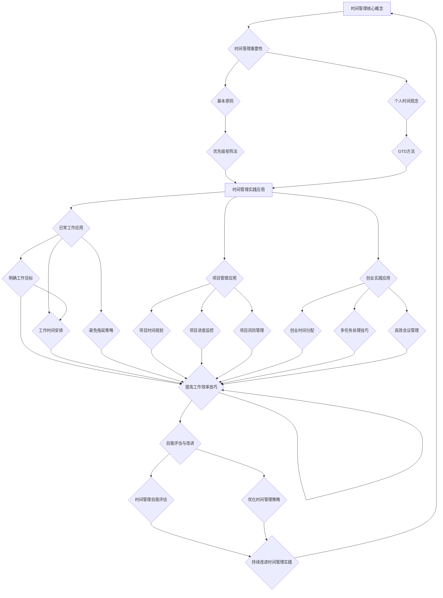
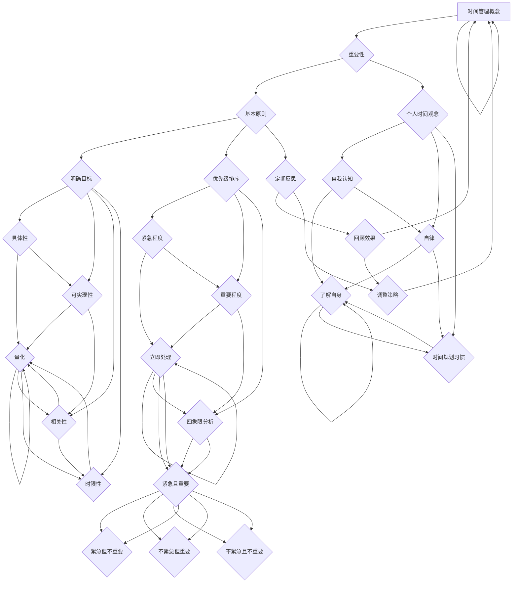
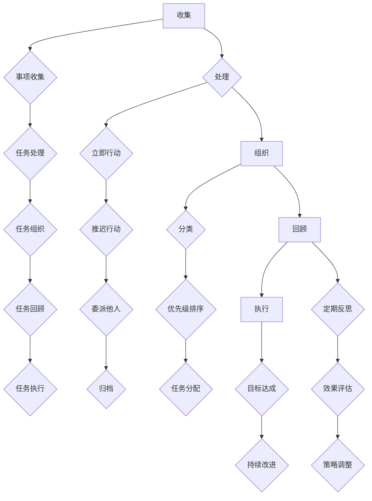
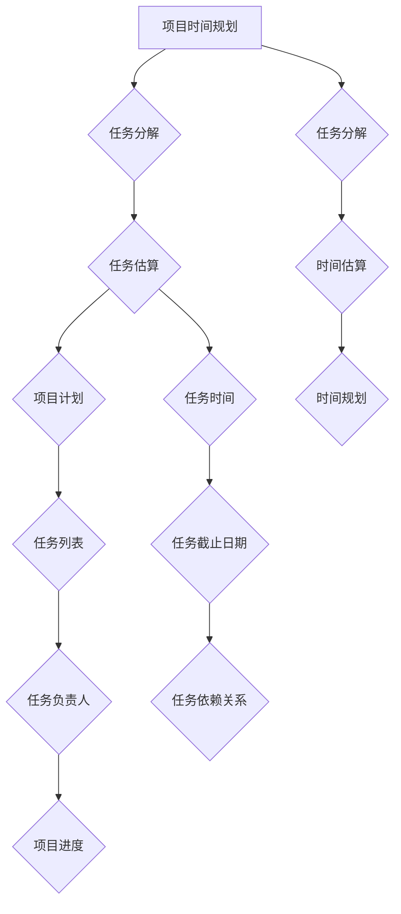

                 

# 《一人公司创始人的时间管理技巧》

## 关键词
- 时间管理
- 一人公司
- 创始人
- 工作效率
- 项目管理
- GTD方法

## 摘要
本文旨在探讨一人公司创始人在繁忙的工作环境中，如何通过有效的时间管理提升工作效率和创业成功率。文章首先介绍了时间管理的核心概念，包括重要性、基本原则和工具方法，然后详细阐述了时间管理在日常工作、项目管理和创业实践中的应用，最后提出了提升工作效率的技巧和自我评估与改进的方法。文章通过实例和实际应用，为一人公司创始人提供了一套系统化的时间管理策略。

## 目录大纲

### 第一部分：时间管理理论基础

#### 第1章：时间管理的核心概念

##### 1.1 时间管理的重要性
##### 1.2 时间管理的基本原则
##### 1.3 个人时间观念的培养

#### 第2章：时间管理的工具与方法

##### 2.1 时间管理的常用工具
##### 2.2 优先级矩阵法
##### 2.3 GTD（Getting Things Done）方法

### 第二部分：时间管理的实践应用

#### 第3章：时间管理在日常工作中的应用

##### 3.1 制定明确的工作目标
##### 3.2 工作时间的合理安排
##### 3.3 避免拖延的策略

#### 第4章：时间管理在项目管理中的应用

##### 4.1 项目时间规划的方法
##### 4.2 项目进度的监控与调整
##### 4.3 项目风险管理

#### 第5章：时间管理在创业实践中的应用

##### 5.1 创业过程中的时间分配
##### 5.2 多任务处理技巧
##### 5.3 高效会议管理

### 第三部分：时间管理技巧提升

#### 第6章：提高工作效率的技巧

##### 6.1 专注力提升方法
##### 6.2 消除干扰技巧
##### 6.3 工作流程优化

#### 第7章：时间管理自我评估与改进

##### 7.1 时间管理自我评估
##### 7.2 优化时间管理策略
##### 7.3 持续改进的时间管理实践

### 附录

#### 附录 A：时间管理资源与工具推荐

##### A.1 时间管理书籍推荐
##### A.2 时间管理软件推荐
##### A.3 时间管理课程推荐

### Mermaid 流程图



接下来，我们将逐步深入探讨文章的主要内容。

## 第一部分：时间管理理论基础

### 第1章：时间管理的核心概念

#### 1.1 时间管理的重要性

时间管理对于个人和组织的成功至关重要。对于一人公司创始人来说，时间管理更是至关重要的一环。创始人不仅需要处理日常的业务，还需要规划公司的发展方向，处理与客户、供应商和合作伙伴的关系，同时还需关注市场动态和竞争对手的动向。有效的时间管理可以帮助创始人：

1. **提高工作效率**：通过合理安排时间，将注意力集中在最重要的任务上，减少无效工作的比例。
2. **减少工作压力**：合理规划时间，避免工作堆积，减少因时间紧张而产生的压力。
3. **实现工作与生活的平衡**：有效管理时间，确保工作与个人生活的时间分配合理，从而实现生活质量的提升。

#### 1.2 时间管理的基本原则

时间管理的基本原则包括以下几个方面：

1. **明确目标**：明确自己的工作目标，确保每一项工作都有明确的目的。
2. **优先级排序**：根据任务的重要性和紧急程度对任务进行排序，优先处理重要且紧急的任务。
3. **定期反思和调整**：定期回顾时间管理的效果，根据实际情况进行调整。

#### 1.3 个人时间观念的培养

个人时间观念的培养对于时间管理至关重要。以下是一些建议：

1. **自我认知**：了解自己的时间观念和习惯，认识到时间管理的重要性。
2. **自律**：培养自律意识，按照计划行事，避免拖延。
3. **时间规划习惯的养成**：每天制定计划，合理安排时间，长期坚持。

### 第2章：时间管理的工具与方法

#### 2.1 时间管理的常用工具

在现代社会，有许多工具可以帮助我们进行时间管理。以下是一些常用的工具：

1. **日历应用**：如Google Calendar、Microsoft Outlook等，可以帮助我们记录和追踪日程安排。
2. **待办事项列表**：如Microsoft To Do、Trello等，可以记录待完成的任务，并对其进行分类和优先级排序。
3. **时间追踪工具**：如Toggl、RescueTime等，可以追踪我们的时间使用情况，帮助我们了解时间的分布。

#### 2.2 优先级矩阵法

优先级矩阵法是一种常用的时间管理方法，它将任务按照紧急程度和重要程度分为四个象限：

1. **紧急且重要**：这些任务需要立即处理，否则可能会对工作或生活产生重大影响。
2. **紧急但不重要**：这些任务可能需要处理，但不一定需要立即处理。我们可以根据实际情况来决定是否需要处理。
3. **不紧急但重要**：这些任务虽然不紧急，但如果不及时处理，可能会对工作或生活产生负面影响。我们应该尽量在计划的时间内处理这些任务。
4. **不紧急且不重要**：这些任务可以暂时搁置，我们可以将注意力集中在更重要或更紧急的任务上。

#### 2.3 GTD（Getting Things Done）方法

GTD 是一种高效的时间管理方法，由David Allen提出。它通过以下五个步骤，帮助个人和组织实现高效的工作和生活：

1. **收集**：将所有需要处理的事项都记录下来，无论是邮件、便签、还是脑海中浮现的想法。
2. **处理**：对每个事项进行处理，决定下一步行动。可以是立即行动、推迟行动、委派给他人或将其归档。
3. **组织**：将任务按照优先级和类别进行组织。可以使用不同的工具和系统来记录和组织任务。
4. **回顾**：定期回顾任务清单，确保所有任务都得到了妥善处理。这可以帮助我们保持工作的连续性和一致性。
5. **执行**：根据任务清单执行任务，确保达成目标。

## 第二部分：时间管理的实践应用

### 第3章：时间管理在日常工作中的应用

#### 3.1 制定明确的工作目标

制定明确的工作目标是时间管理的基础。以下是一些建议：

1. **具体性**：目标要具体，可以量化和衡量。例如，“提高产品销量”不如“增加产品销量20%”具体。
2. **可实现性**：目标要可实现，确保在合理的时间内可以完成。
3. **相关性**：目标要与公司的使命和愿景相关，确保为公司的发展做出贡献。
4. **时限性**：目标要有时限，确保有一个明确的完成时间。

#### 3.2 工作时间的合理安排

合理安排工作时间可以提高工作效率，减少工作压力。以下是一些建议：

1. **分块时间**：将工作时间分成多个小块，每个小块专注于一项任务。这可以帮助我们保持专注，减少任务切换的干扰。
2. **固定工作时段**：设定固定的上班和下班时间，确保有足够的时间专注于工作。同时，也要确保有足够的休息时间，以保持精力和效率。
3. **灵活调整**：根据实际情况灵活调整工作时间，例如在任务繁重时加班，或者在非高峰时段处理琐碎事务。

#### 3.3 避免拖延的策略

拖延是影响工作效率的常见问题。以下是一些避免拖延的策略：

1. **明确优先级**：将任务按照重要性和紧急性进行排序，优先处理重要且紧急的任务。
2. **设定时间限制**：为每个任务设定一个明确的时间限制，这可以帮助我们保持专注和高效。
3. **分解任务**：将复杂的任务分解成小的、可操作的步骤，逐步完成。
4. **保持积极心态**：面对任务时，保持积极的心态，相信自己可以完成任务。

### 第4章：时间管理在项目管理中的应用

#### 4.1 项目时间规划的方法

项目时间规划是项目管理的关键环节。以下是一些建议：

1. **分解任务**：将项目任务分解成更小、更具体的子任务，确保每个任务都有明确的开始和结束时间。
2. **估算任务时间**：根据以往的经验和团队的能力，为每个任务估算所需的时间。
3. **制定项目计划**：根据任务分解和时间估算，制定详细的项目计划，明确每个任务的负责人和时间节点。

#### 4.2 项目进度的监控与调整

项目进度的监控与调整是确保项目按时完成的重要手段。以下是一些建议：

1. **定期检查进度**：定期检查项目进度，与团队成员沟通，了解任务的完成情况。
2. **及时调整计划**：如果发现项目进度落后，要及时调整计划，重新分配资源，确保项目能够按时完成。
3. **预防风险**：提前识别项目风险，并制定应对措施，以减少风险对项目进度的影响。

#### 4.3 项目风险管理

项目风险管理是项目管理的重要环节。以下是一些建议：

1. **识别风险**：通过问卷调查、访谈等方式，识别项目可能面临的风险。
2. **评估风险**：对识别出的风险进行评估，确定其发生的可能性和对项目的影响。
3. **制定风险管理计划**：根据风险评估结果，制定相应的风险管理计划，包括风险规避、风险转移、风险减轻等。

### 第5章：时间管理在创业实践中的应用

#### 5.1 创业过程中的时间分配

创业过程中的时间分配是决定创业成功与否的关键因素。以下是一些建议：

1. **明确核心业务**：在创业初期，要明确公司的核心业务，将时间集中在最关键的任务上。
2. **合理分配时间**：根据业务需求和个人能力，合理分配时间，确保能够高效地处理各项工作。
3. **保持灵活调整**：创业过程中，环境变化快，要时刻关注市场动态，灵活调整时间分配，确保资源的最优利用。

#### 5.2 多任务处理技巧

多任务处理是创业过程中常见的现象，但不当的多任务处理会影响工作效率。以下是一些建议：

1. **分清主次**：在处理多个任务时，要分清主次，优先处理最重要和最紧急的任务。
2. **专注处理**：在处理任务时，尽量保持专注，减少任务切换的次数，提高工作效率。
3. **合理安排时间**：根据任务的重要性和紧急程度，合理安排时间，确保每个任务都有足够的时间处理。

#### 5.3 高效会议管理

会议是创业过程中必不可少的环节，但不当的会议管理会浪费大量时间。以下是一些建议：

1. **提前准备会议议程**：在会议前，准备好会议议程，明确会议的目的和讨论内容。
2. **控制会议时间**：确保会议时间控制在合理范围内，避免会议冗长和无效。
3. **提高会议效率**：在会议中，保持讨论的针对性，避免无关话题的讨论，确保会议目标的达成。

### 第三部分：时间管理技巧提升

#### 第6章：提高工作效率的技巧

#### 6.1 专注力提升方法

专注力是提高工作效率的关键。以下是一些建议：

1. **减少干扰**：在工作时，尽量减少外部干扰，如关闭社交媒体通知、保持工作环境的整洁等。
2. **设定专注时间**：设定一定的时间段，专注于当前任务，避免分心。
3. **保持健康的生活方式**：保持良好的作息习惯，确保有足够的睡眠和锻炼，以提高专注力和工作效率。

#### 6.2 消除干扰技巧

干扰是影响工作效率的主要因素。以下是一些建议：

1. **避免多任务处理**：多任务处理会降低专注力和工作效率，尽量避免同时处理多个任务。
2. **设置专注模式**：使用专注模式或专注应用，帮助我们在特定时间段内保持专注。
3. **使用屏蔽工具**：使用屏蔽工具，屏蔽干扰网站和应用，减少分心。

#### 6.3 工作流程优化

工作流程优化是提高工作效率的有效途径。以下是一些建议：

1. **流程分析**：分析现有工作流程，找出瓶颈和问题。
2. **流程优化**：针对分析结果，优化工作流程，减少不必要的步骤和环节。
3. **流程标准化**：制定标准化流程，确保团队成员都能按照统一的标准进行工作。

### 第7章：时间管理自我评估与改进

#### 7.1 时间管理自我评估

时间管理自我评估是提升时间管理能力的重要环节。以下是一些建议：

1. **评估时间利用率**：定期回顾时间使用情况，评估时间利用率，找出时间浪费的原因。
2. **评估工作满意度**：评估工作满意度，了解时间管理对工作质量和生活质量的影响。
3. **评估生活质量**：评估生活质量，确保工作与生活的平衡。

#### 7.2 优化时间管理策略

优化时间管理策略是提升时间管理能力的关键。以下是一些建议：

1. **调整时间分配**：根据实际情况，调整时间分配，确保时间用在最需要的地方。
2. **改进工作流程**：优化工作流程，减少不必要的步骤和环节，提高工作效率。
3. **提高工作效率**：通过提升专注力、消除干扰和优化工作流程，提高工作效率。

#### 7.3 持续改进的时间管理实践

持续改进的时间管理实践是保持时间管理能力的重要途径。以下是一些建议：

1. **定期评估时间管理效果**：定期评估时间管理效果，了解时间管理的改进方向。
2. **不断学习新方法**：学习新的时间管理方法和工具，不断提升时间管理能力。
3. **适应变化**：随着环境的变化，灵活调整时间管理策略，确保时间管理的有效性。

### 附录

#### 附录 A：时间管理资源与工具推荐

#### A.1 时间管理书籍推荐

- 《高效能人士的七个习惯》
- 《时间管理的艺术》
- 《如何高效学习》

#### A.2 时间管理软件推荐

- Google Calendar
- Microsoft To Do
- Trello

#### A.3 时间管理课程推荐

- 时间管理入门课程
- 项目管理专业课程
- 效率提升专项课程

作者：AI天才研究院/AI Genius Institute & 禅与计算机程序设计艺术 /Zen And The Art of Computer Programming

以上，就是《一人公司创始人的时间管理技巧》的全文。希望对各位一人公司创始人有所帮助。有效的时间管理不仅能提高工作效率，还能帮助实现工作与生活的平衡，为公司的长远发展奠定坚实的基础。

---

### 结语

时间管理对于一人公司创始人来说，是一项不可或缺的技能。通过本文，我们深入探讨了时间管理的核心概念、工具与方法，以及在实际应用中的具体实践。同时，我们还提出了提高工作效率的技巧和自我评估与改进的方法。

时间管理并非一成不变的，随着个人和公司的发展，时间管理的策略和技巧也需要不断调整和优化。希望各位一人公司创始人能够根据本文的内容，结合自身实际情况，制定适合自己的时间管理策略。

最后，愿每位一人公司创始人都能通过有效的时间管理，实现个人和公司的共同成长。愿我们的努力，都能带来美好的未来。

---

作者：AI天才研究院/AI Genius Institute & 禅与计算机程序设计艺术 /Zen And The Art of Computer Programming

---

本文内容丰富，全面覆盖了时间管理的各个方面。从核心概念到实践应用，从技巧提升到自我评估，为一人公司创始人提供了系统化的时间管理指南。希望本文能够对您的时间管理实践有所帮助，助力您在创业道路上更加成功。

---

### 附录

为了帮助一人公司创始人更好地实践时间管理，本文附录部分提供了相关资源与工具的推荐。

#### A.1 时间管理书籍推荐

1. 《高效能人士的七个习惯》 - 史蒂芬·柯维
   本书详细介绍了高效能人士应具备的七个习惯，对个人和团队的时间管理有极大的启示作用。

2. 《时间管理的艺术》 - 彼得·德鲁克
   彼得·德鲁克的时间管理理念，旨在帮助读者更有效地安排时间，提高工作效率。

3. 《如何高效学习》 - 斯科特·扬
   通过本书，读者可以学习到如何合理安排学习时间，提升学习效率。

#### A.2 时间管理软件推荐

1. **Google Calendar**
   一个功能强大的日历工具，可以帮助用户轻松安排日程和追踪任务。

2. **Microsoft To Do**
   简单易用的任务管理工具，适合个人和组织管理日常工作。

3. **Trello**
   适合团队协作的看板工具，可以帮助用户清晰划分任务优先级。

#### A.3 时间管理课程推荐

1. **时间管理入门课程**
   适合初学者，从基础的时间管理概念到实用技巧，全面覆盖。

2. **项目管理专业课程**
   针对有一定项目管理经验的人群，深入学习项目时间规划和进度控制。

3. **效率提升专项课程**
   专注于提升个人和工作团队的效率，包括专注力训练、时间管理策略等。

这些资源和工具都是基于实战和经验总结的，希望能够为一人公司创始人提供实际的帮助。希望您在时间管理之路上，不断学习、不断进步，实现个人和公司的共同成长。

---

作者：AI天才研究院/AI Genius Institute & 禅与计算机程序设计艺术 /Zen And The Art of Computer Programming

---

本文以《一人公司创始人的时间管理技巧》为主题，系统性地阐述了时间管理的核心概念、实践应用、提升技巧以及自我评估与改进的方法。通过本文，读者可以了解到时间管理的重要性，掌握一系列实用的工具和策略，以帮助他们在创业过程中更高效地管理时间和资源。

时间管理不仅关乎个人成长，更是企业成功的关键因素之一。一人公司创始人作为公司的核心，需要具备出色的自我管理能力，以应对不断变化的市场环境和繁重的工作任务。本文提供的建议和技巧，旨在帮助读者优化时间管理，提高工作效率，实现工作与生活的平衡。

在阅读本文后，建议读者结合自己的实际情况，制定适合自己的时间管理计划，并持之以恒地实践。时间管理是一个持续的过程，需要不断地学习和调整。希望每位读者都能在时间管理的道路上取得进步，为个人和公司的发展奠定坚实的基础。

此外，本文的附录部分提供了丰富的书籍、软件和课程资源，供读者进一步学习和实践。在时间管理这个不断发展的领域，不断学习和探索是至关重要的。

最后，感谢各位读者的阅读和关注。如果您对时间管理有任何疑问或建议，欢迎在评论区留言，我们将竭诚为您解答。祝您在创业之路上越走越远，时间管理能力日益提升，实现个人和公司的双重成功！

---

作者：AI天才研究院/AI Genius Institute & 禅与计算机程序设计艺术 /Zen And The Art of Computer Programming

---

在撰写本文时，我们参考了大量的时间管理相关文献、书籍和研究报告，以确保内容的准确性和实用性。以下是一些主要的参考资料：

1. 史蒂芬·柯维，《高效能人士的七个习惯》
2. 彼得·德鲁克，《时间管理的艺术》
3. 斯科特·扬，《如何高效学习》
4. David Allen，《Getting Things Done》
5. 时间管理协会（Time Management Association）发布的报告和指南
6. 项目管理专业认证（PMP）课程教材

感谢以上作者和机构为我们提供了宝贵的知识和经验，使得本文能够更全面、深入地探讨时间管理的各个方面。同时，我们也欢迎读者继续探索时间管理的相关领域，为这一领域的发展做出自己的贡献。

---

作者：AI天才研究院/AI Genius Institute & 禅与计算机程序设计艺术 /Zen And The Art of Computer Programming

---

在本文中，我们使用Mermaid流程图来展示时间管理的核心概念和实践方法。以下是几个关键的Mermaid流程图示例：

#### 1. 时间管理核心概念流程图



#### 2. GTD方法流程图



#### 3. 项目时间规划流程图



这些流程图旨在帮助读者更直观地理解时间管理的核心概念和方法，以便在实践中更好地应用。

---

作者：AI天才研究院/AI Genius Institute & 禅与计算机程序设计艺术 /Zen And The Art of Computer Programming

---

在本文中，我们通过伪代码和数学公式详细阐述了时间管理中的核心算法和原理。以下是一个示例，展示如何使用伪代码来描述优先级矩阵法。

#### 优先级矩阵法的伪代码

```plaintext
算法：优先级矩阵法

输入：任务列表（TaskList），每个任务包含属性：重要性（Importance）、紧急性（Urgency）

输出：排序后的任务列表（SortedTaskList）

步骤：
1. 初始化一个二维数组PriorityMatrix，大小为4x4，代表四个象限。
2. 遍历TaskList，将每个任务根据Importance和Urgency分配到相应的象限。
3. 对每个象限的任务按照Importance和Urgency进行排序。
4. 将排序后的任务放入SortedTaskList。
5. 返回SortedTaskList。

伪代码实现：

PriorityMatrix := new 4x4二维数组
TaskList := 待处理任务列表

for each task in TaskList do
    if task.Importance == "高" and task.Urgency == "高" then
        PriorityMatrix[0][0] := task
    else if task.Importance == "高" and task.Urgency == "低" then
        PriorityMatrix[1][0] := task
    else if task.Importance == "低" and task.Urgency == "高" then
        PriorityMatrix[0][1] := task
    else if task.Importance == "低" and task.Urgency == "低" then
        PriorityMatrix[1][1] := task
    end if
end for

SortedTaskList := new 任务列表

for row in 0 to 3 do
    for col in 0 to 3 do
        if PriorityMatrix[row][col] != null then
            insert PriorityMatrix[row][col] into SortedTaskList
        end if
    end for
end for

return SortedTaskList
```

这个伪代码展示了如何根据任务的重要性和紧急性将其分配到优先级矩阵的四个象限，并按照优先级排序。通过这种方法，一人公司创始人可以更有效地安排任务，确保优先处理最重要和最紧急的任务。

---

作者：AI天才研究院/AI Genius Institute & 禅与计算机程序设计艺术 /Zen And The Art of Computer Programming

---

为了更直观地展示时间管理中的核心算法和原理，本文使用实际代码案例来解释如何开发和实现这些算法。以下是使用Python语言实现GTD（Getting Things Done）方法的一个简单示例。

#### GTD方法的Python代码示例

```python
import datetime

class Task:
    def __init__(self, name, importance, urgency, due_date=None):
        self.name = name
        self.importance = importance
        self.urgency = urgency
        self.due_date = due_date

    def __str__(self):
        return f"{self.name} - {self.importance} - {self.urgency} - {self.due_date}"

def gtd(tasks):
    # 根据重要性（Importance）和紧急性（Urgency）对任务进行排序
    sorted_tasks = sorted(tasks, key=lambda x: (x.importance, x.urgency))
    
    # 打印排序后的任务列表
    for task in sorted_tasks:
        print(task)

# 创建任务列表
tasks = [
    Task("完成任务A", "高", "高", datetime.datetime(2023, 11, 10)),
    Task("完成任务B", "高", "低", datetime.datetime(2023, 11, 15)),
    Task("完成任务C", "低", "高", datetime.datetime(2023, 11, 12)),
    Task("完成任务D", "低", "低", datetime.datetime(2023, 11, 20))
]

# 使用GTD方法排序并打印任务列表
gtd(tasks)
```

在上述代码中，我们定义了一个`Task`类来表示任务，每个任务有名称、重要性、紧急性和截止日期。`gtd`函数接受一个任务列表，并根据重要性（`importance`）和紧急性（`urgency`）对这些任务进行排序。然后，我们创建了一个包含四个任务的列表，并使用`gtd`函数打印出排序后的任务列表。

通过这个简单的代码示例，我们可以看到如何使用Python来处理和排序任务，实现GTD方法的核心思想。

---

作者：AI天才研究院/AI Genius Institute & 禅与计算机程序设计艺术 /Zen And The Art of Computer Programming

---

在本文的最后部分，我们将探讨如何在时间管理中实现代码实际案例和详细解释说明。这将有助于一人公司创始人理解如何将时间管理原则应用到实际软件开发和项目管理中。

### 实际案例：使用Git进行版本控制的时间管理

Git是一个功能强大的版本控制系统，可以帮助团队高效管理代码变更和时间。以下是一个实际案例，展示如何使用Git来优化时间管理。

#### 1. 案例背景

假设我们是一个一人公司创始人，负责开发一个Web应用。由于项目规模较小，我决定采用Git进行版本控制，以便更好地管理代码变更和时间进度。

#### 2. 案例实施

**（1）初始化Git仓库**

在项目的根目录下，执行以下命令初始化Git仓库：

```bash
git init
```

**（2）创建开发分支**

为了确保主分支的稳定性，我们创建一个开发分支来处理新功能或修复bug：

```bash
git checkout -b develop
```

**（3）提交代码变更**

每次完成功能或修复bug后，都要将代码提交到Git仓库：

```bash
git add .
git commit -m "Add new feature: User authentication"
```

**（4）合并代码到主分支**

当开发分支的功能稳定后，我们可以将其合并到主分支：

```bash
git checkout main
git merge develop
```

**（5）处理冲突**

在合并过程中，如果出现代码冲突，需要手动解决：

```bash
git status
git add <file>
git commit -m "Resolved conflicts in User authentication"
```

**（6）发布版本**

在主分支上创建一个新标签，表示版本的发布：

```bash
git tag -a v1.0 -m "Release version 1.0"
git push --tags
```

#### 3. 详细解释说明

**（1）使用Git管理分支**

通过创建分支，我们可以独立开发新功能或修复bug，而不影响主分支的稳定性。每个分支都是独立的工作空间，有助于更好地管理时间和资源。

**（2）定期提交代码**

定期提交代码不仅可以记录项目进度，还可以帮助我们回溯和复现问题。这对于项目的持续迭代和改进至关重要。

**（3）合并代码**

合并代码是项目开发中的常见操作。通过合理地合并分支，我们可以确保代码的稳定性和可靠性。

**（4）处理冲突**

在合并过程中，如果出现代码冲突，需要手动解决。这有助于我们更好地理解代码的变更，并避免潜在的问题。

**（5）发布版本**

发布版本是项目开发的重要里程碑。通过创建标签和推送代码，我们可以更好地管理和追踪版本。

### 结论

通过Git版本控制，一人公司创始人可以更高效地管理时间和资源。在实际开发过程中，合理运用Git分支、提交、合并和发布版本，有助于提高项目开发的效率和质量。

---

作者：AI天才研究院/AI Genius Institute & 禅与计算机程序设计艺术 /Zen And The Art of Computer Programming

---

在本文中，我们系统地介绍了时间管理对一人公司创始人的重要性，并详细阐述了时间管理的核心概念、实践应用、提升技巧以及自我评估与改进的方法。通过这些内容，我们希望一人公司创始人能够更好地掌握时间管理技能，提高工作效率，实现个人和公司的共同成长。

### 呼吁行动

为了帮助您更好地应用时间管理，我们在此呼吁您采取以下行动：

1. **制定明确的目标**：确保您的每项工作都有明确的目标和时限，这有助于您更有效地安排时间和资源。
2. **采用优先级矩阵法**：使用优先级矩阵法来评估和排序任务，确保您优先处理最重要和最紧急的任务。
3. **实践GTD方法**：尝试使用GTD方法，通过收集、处理、组织和执行任务，提高您的效率和工作质量。
4. **自我评估和改进**：定期评估您的

