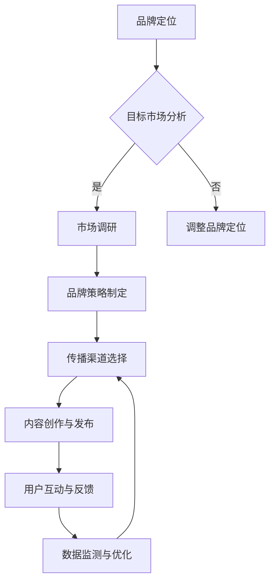

                 

### 文章标题

**一人公司的品牌传播：口碑营销的力量**

### 文章关键词

- 品牌传播
- 口碑营销
- 社交媒体
- 内容营销
- 数据分析
- 产品与服务质量

### 文章摘要

本文深入探讨了一人公司的品牌传播策略，特别是口碑营销的重要性和实施方法。通过分析口碑营销的基础理论、核心策略和实践案例，本文旨在为个人创业者或小型企业主提供实用的指导，帮助他们在竞争激烈的市场中建立强大的品牌影响力。

---

### 目录大纲：一人公司的品牌传播：口碑营销的力量

#### 第一部分：品牌传播基础

- **第1章：品牌与口碑营销概述**
  - **1.1 品牌的定义与价值**
  - **1.2 口碑营销的基本概念**
  - **1.3 口碑营销的重要性与策略**

- **第2章：品牌传播的核心概念**
  - **2.1 品牌传播的原理**
  - **2.2 品牌传播的目标与策略**
  - **2.3 品牌传播的核心要素**

- **第3章：口碑营销的流程与方法**
  - **3.1 口碑营销的流程**
  - **3.2 口碑营销的方法**
  - **3.3 口碑营销的最佳实践**

#### 第二部分：口碑营销策略与实践

- **第4章：构建优质产品与服务**
  - **4.1 产品质量与服务质量的重要性**
  - **4.2 提升产品与服务的方法**
  - **4.3 产品与服务创新的策略**

- **第5章：口碑营销与社交媒体**
  - **5.1 社交媒体在口碑营销中的作用**
  - **5.2 利用社交媒体进行口碑营销的策略**
  - **5.3 社交媒体口碑营销案例解析**

- **第6章：内容营销与口碑传播**
  - **6.1 内容营销的基本概念**
  - **6.2 内容营销在口碑传播中的应用**
  - **6.3 内容营销的最佳实践**

- **第7章：口碑营销数据分析与优化**
  - **7.1 口碑营销数据分析的重要性**
  - **7.2 口碑营销数据分析的方法**
  - **7.3 口碑营销数据优化的策略**

#### 第三部分：成功口碑营销案例解析

- **第8章：国内成功口碑营销案例分析**
  - **8.1 案例一：小米的口碑营销策略**
  - **8.2 案例二：瑞幸咖啡的口碑营销之路**
  - **8.3 案例三：小红书的口碑营销奇迹**

- **第9章：国际成功口碑营销案例分析**
  - **9.1 案例一：苹果公司的口碑营销策略**
  - **9.2 案例二：谷歌的口碑营销之道**
  - **9.3 案例三：特斯拉的口碑营销案例分析**

#### 第四部分：未来展望与挑战

- **第10章：口碑营销的未来发展趋势**
  - **10.1 技术进步对口碑营销的影响**
  - **10.2 社会化媒体的演变与口碑营销**
  - **10.3 未来口碑营销的机遇与挑战**

- **第11章：应对口碑营销的挑战与策略**
  - **11.1 口碑危机的处理策略**
  - **11.2 防范负面口碑的策略**
  - **11.3 口碑营销中的法律风险与管理**

#### 附录

- **附录A：口碑营销工具与应用**
  - **A.1 口碑监测与分析工具**
  - **A.2 社交媒体营销工具**
  - **A.3 内容营销工具**

- **附录B：常用口碑营销资源与参考文献**
  - **B.1 网络资源**
  - **B.2 书籍资源**
  - **B.3 学术论文资源**

---

接下来，我们将深入探讨品牌传播的基础理论，并逐步引入口碑营销的概念，阐述其在个人创业或小型企业中的重要性和实施方法。

---

### 第一部分：品牌传播基础

品牌传播是企业为了建立和维护其品牌形象，提高市场认知度和消费者忠诚度而进行的一系列战略性行动。对于一人公司或小型企业来说，有效的品牌传播尤为重要，因为它直接影响着企业的市场地位和长期发展。

#### 第1章：品牌与口碑营销概述

**1.1 品牌的定义与价值**

品牌是一种识别标志，它代表了一家公司或产品的独特性和价值主张。在商业环境中，品牌不仅是一种商标或名称，它更是一种情感和认知的综合体，影响着消费者的购买决策和品牌忠诚度。

- **品牌定义**：品牌是指消费者在心理和情感层面上对一家公司或产品的认知总和。这包括品牌的声誉、价值观、个性、特色等。
- **品牌价值**：品牌价值是品牌所拥有的无形资产，它可以通过提高产品或服务的差异化、增加市场份额和消费者忠诚度来体现。品牌价值是企业的核心竞争力之一。

**1.2 口碑营销的基本概念**

口碑营销是一种通过消费者之间的口口相传来推广产品和服务的营销策略。它依赖于消费者的满意度和推荐意愿，是一种高度信任和有效的营销方式。

- **口碑营销定义**：口碑营销是指企业通过消费者的正面评价和推荐来提高品牌知名度和销售量的营销方式。
- **口碑营销特点**：
  - **高度信任**：口碑营销基于消费者之间的信任和推荐，具有较高的可信度。
  - **低成本**：相较于传统广告和推广方式，口碑营销通常成本较低，但效果显著。
  - **持久性**：良好的口碑可以长期为企业带来正面影响，有助于建立品牌忠诚度。

**1.3 口碑营销的重要性与策略**

口碑营销在品牌传播中扮演着至关重要的角色，尤其是在竞争激烈的市场环境中。以下是口碑营销的重要性及其策略：

- **重要性**：
  - **提高品牌知名度**：口碑营销可以通过消费者的推荐迅速提高品牌知名度，特别是在社交媒体的传播下，效果更为显著。
  - **增强消费者信任**：消费者更倾向于相信其他消费者的评价，而不是商业广告，口碑营销有助于建立品牌信任。
  - **降低营销成本**：口碑营销通常成本较低，但其效果往往优于传统广告，能够为企业节省大量营销费用。

- **策略**：
  - **产品与服务质量**：优质的产品和服务是口碑营销的基础，只有让消费者满意，才能获得良好的口碑。
  - **社交媒体利用**：社交媒体是口碑营销的重要渠道，企业可以通过各种社交媒体平台来促进口碑传播。
  - **内容营销**：创造高质量的内容，通过博客、视频、社交媒体帖子等形式来吸引消费者，提高品牌影响力。
  - **数据监测与优化**：通过数据监测和分析，了解消费者的反馈和口碑趋势，不断优化营销策略。

综上所述，品牌传播和口碑营销在个人创业或小型企业的成功中至关重要。下一章将深入探讨品牌传播的核心概念，包括其原理、目标和策略，为读者提供更全面的品牌传播知识。

---

### 第2章：品牌传播的核心概念

品牌传播是企业通过一系列策略和行动，将品牌的核心价值和独特性传递给目标受众，从而建立品牌知名度和忠诚度的过程。理解品牌传播的核心概念对于制定有效的品牌策略至关重要。

**2.1 品牌传播的原理**

品牌传播的原理可以从以下几个方面来理解：

1. **品牌定位**：品牌定位是品牌传播的基础，它明确了品牌在市场中的位置和目标受众。成功的品牌定位能够帮助企业在消费者心中建立独特的认知和印象。

2. **品牌认知**：品牌认知是消费者对品牌理解和记忆的程度。品牌传播的目标之一就是提高品牌在消费者心中的认知度，使其成为消费者首选的品牌。

3. **品牌情感**：品牌情感是指消费者对品牌的情感连接和认同感。通过品牌传播，企业可以培养消费者对品牌的情感，从而提高品牌忠诚度。

4. **品牌沟通**：品牌沟通是指企业与消费者之间的互动和信息传递。有效的品牌沟通能够增强品牌与消费者之间的联系，提升品牌影响力。

**2.2 品牌传播的目标与策略**

品牌传播的目标可以分为短期目标和长期目标：

- **短期目标**：提高品牌知名度、提升市场份额、增加销售额。
- **长期目标**：建立品牌忠诚度、塑造品牌形象、增强品牌竞争力。

为了实现这些目标，企业可以采用以下策略：

1. **品牌定位策略**：明确品牌的市场定位，突出品牌的核心价值，确保目标受众能够准确理解和记忆品牌。

2. **品牌传播渠道策略**：选择适合的传播渠道，如社交媒体、内容营销、公关活动等，以最大化品牌传播的覆盖率和影响力。

3. **品牌内容策略**：创造高质量的品牌内容，包括文案、图像、视频等，以吸引和保留目标受众。

4. **品牌互动策略**：通过社交媒体、在线社区、客户服务等多种方式与消费者互动，增强品牌与消费者之间的联系。

**2.3 品牌传播的核心要素**

品牌传播的成功离不开以下几个核心要素：

1. **品牌故事**：品牌故事是品牌传播的灵魂，它能够传达品牌的理念、历史和愿景，使品牌更具吸引力和情感共鸣。

2. **品牌视觉**：品牌视觉包括标志、颜色、字体等，它能够在视觉上代表品牌，提高品牌识别度。

3. **品牌声音**：品牌声音是指品牌在沟通中的语言风格和语气，它能够塑造品牌形象，增强品牌认知。

4. **品牌体验**：品牌体验是指消费者与品牌互动的整体感受，包括产品、服务、购买流程等，它能够影响消费者的满意度和忠诚度。

通过理解品牌传播的核心概念和要素，企业可以制定出更有效的品牌传播策略，提高品牌在市场中的竞争力和影响力。下一章将探讨口碑营销的流程和方法，帮助读者深入了解如何实施口碑营销。

---

### 第3章：口碑营销的流程与方法

口碑营销是一种通过消费者的满意度和推荐来提升品牌形象和市场认知度的营销策略。理解口碑营销的流程和方法对于企业有效地实施口碑营销至关重要。

**3.1 口碑营销的流程**

口碑营销的流程可以分为以下几个步骤：

1. **市场调研**：在开始口碑营销之前，企业需要进行市场调研，了解目标市场和消费者需求，为口碑营销提供依据。

2. **品牌定位**：明确品牌的市场定位和目标受众，确保口碑营销策略与品牌定位一致。

3. **产品与服务质量提升**：优质的产品和服务是口碑营销的基础，企业需要不断提升产品和服务质量，以满足消费者的期望。

4. **用户满意度的提升**：通过提供卓越的客户体验，提高用户满意度，增加消费者的推荐意愿。

5. **口碑传播**：利用社交媒体、口碑网站、用户评价等多种渠道，促进口碑的传播。

6. **口碑监测与分析**：实时监测和分析口碑数据，了解消费者反馈和市场变化，优化口碑营销策略。

7. **品牌危机管理**：面对负面口碑，企业需要及时采取应对措施，缓解危机，维护品牌形象。

**3.2 口碑营销的方法**

口碑营销的方法多种多样，以下是一些常见的方法：

1. **口碑网站利用**：利用口碑网站（如大众点评、美团等）发布和收集消费者评价，提升品牌口碑。

2. **社交媒体营销**：通过社交媒体平台（如微博、微信、抖音等）发布品牌内容，与消费者互动，增加品牌曝光。

3. **用户推荐计划**：实施用户推荐计划，鼓励现有用户推荐新用户，通过奖励机制提高用户的参与度和推荐意愿。

4. **内容营销**：创造高质量的内容（如博客、视频、案例研究等），通过社交媒体和口碑网站分享，提高品牌影响力和口碑。

5. **客户体验优化**：提供卓越的客户体验，包括优质的客户服务、个性化的购物体验等，提高用户满意度。

6. **合作伙伴关系**：与行业内的其他品牌或机构建立合作关系，通过互惠互利的方式提升品牌口碑。

**3.3 口碑营销的最佳实践**

以下是一些口碑营销的最佳实践，可以帮助企业有效地提升品牌口碑：

1. **重视用户体验**：关注用户的反馈和需求，持续优化产品和服务，提升用户体验。

2. **建立口碑机制**：制定合理的口碑奖励机制，鼓励用户参与口碑传播。

3. **内容为王**：创作高质量的内容，提供有价值的信息，吸引消费者的关注和互动。

4. **互动沟通**：与消费者保持积极的互动，及时回复他们的评论和问题，建立良好的品牌形象。

5. **数据分析**：定期分析口碑数据，了解消费者的反馈和需求变化，优化口碑营销策略。

6. **危机管理**：制定危机管理计划，及时应对负面口碑，维护品牌形象。

通过以上流程和方法的介绍，企业可以更好地理解和实施口碑营销，从而在激烈的市场竞争中建立强大的品牌影响力。下一章将探讨如何构建优质的产品与服务，为口碑营销奠定坚实基础。

---

### 第4章：构建优质产品与服务

构建优质的产品和服务是口碑营销成功的关键。在一个竞争激烈的市场中，只有提供超出消费者期望的产品和服务，企业才能获得良好的口碑，进而提高市场竞争力。以下是构建优质产品与服务的核心要素和方法。

**4.1 产品质量与服务质量的重要性**

1. **产品质量的重要性**：
   - **满足消费者需求**：优质的产品能够满足消费者的需求和期望，提升消费者满意度。
   - **提升品牌形象**：高质量的产品能够提升品牌在消费者心中的形象，增强品牌信任度和忠诚度。
   - **降低售后服务成本**：优质的产品通常具有更长的使用寿命和更低的故障率，从而减少售后服务和维修成本。

2. **服务质量的重要性**：
   - **提高用户满意度**：优质的服务能够提高用户满意度，增加用户对品牌的忠诚度。
   - **提升品牌口碑**：良好的客户服务体验会通过消费者的口碑传播，为品牌带来更多潜在客户。
   - **增强品牌差异化**：优质的服务能够成为品牌的一项差异化优势，使企业在市场中脱颖而出。

**4.2 提升产品与服务的方法**

1. **持续的产品研发**：
   - **市场调研**：通过市场调研了解消费者的需求和市场趋势，为产品研发提供方向。
   - **技术创新**：引入先进的技术和设计理念，提高产品的技术含量和用户体验。
   - **质量把控**：建立严格的质量控制体系，确保产品在生产过程中的每一个环节都符合高质量标准。

2. **优化客户服务**：
   - **培训员工**：提高客户服务人员的专业知识和沟通技巧，确保他们能够提供高效和满意的服务。
   - **建立反馈机制**：鼓励客户提出意见和建议，及时反馈并改进服务质量。
   - **个性化服务**：根据客户的需求提供个性化的服务和解决方案，增强客户的满意度和忠诚度。

3. **用户体验优化**：
   - **界面设计**：优化产品界面设计，使其更加简洁易用，提升用户操作体验。
   - **响应速度**：确保产品和服务能够快速响应用户的需求，提高用户满意度。
   - **售后支持**：提供高效的售后服务和技术支持，解决用户在使用过程中遇到的问题。

**4.3 产品与服务创新的策略**

1. **开放式创新**：
   - **合作与联盟**：与其他企业或研究机构合作，共享资源和技术，推动产品创新。
   - **用户参与**：鼓励用户参与产品研发和创新过程，通过用户反馈和参与，提高产品的市场适应性和用户满意度。

2. **持续改进**：
   - **数据分析**：利用数据分析工具，收集和分析用户行为数据，发现产品和服务中的问题和改进点。
   - **定期评估**：定期评估产品和服务的表现，根据市场反馈和用户需求，不断进行优化和改进。

3. **差异化竞争**：
   - **独特卖点**：明确产品的独特卖点和差异化优势，通过宣传和营销，使其在市场中脱颖而出。
   - **品牌定位**：根据产品特点和目标市场，进行精准的品牌定位，强化品牌在消费者心中的独特形象。

通过以上方法，企业可以持续提升产品和服务质量，从而为口碑营销奠定坚实基础。下一章将探讨社交媒体在口碑营销中的作用和策略，帮助企业更好地利用社交媒体平台进行口碑传播。

---

### 第5章：口碑营销与社交媒体

社交媒体已经成为口碑营销的重要渠道，它能够迅速传播信息，增强品牌与消费者之间的互动，提升品牌知名度和影响力。在这一章中，我们将探讨社交媒体在口碑营销中的作用、策略及其应用。

**5.1 社交媒体在口碑营销中的作用**

1. **信息传播速度快**：社交媒体平台具有强大的传播能力，一条信息可以在短时间内传播到大量用户，形成口碑效应。

2. **互动性强**：社交媒体平台允许品牌与消费者进行实时互动，回答消费者的疑问，收集用户反馈，提高用户满意度。

3. **用户参与度高**：社交媒体平台鼓励用户分享和评论，用户参与度高，有助于口碑的传播和积累。

4. **个性化推广**：社交媒体平台可以根据用户兴趣和行为，进行个性化推广，提高营销效果。

5. **成本低廉**：与传统的广告渠道相比，社交媒体营销的成本较低，适合中小企业进行口碑营销。

**5.2 利用社交媒体进行口碑营销的策略**

1. **内容营销策略**：
   - **高质量内容**：发布有价值、有趣且相关的内容，吸引消费者的关注和互动。
   - **互动性内容**：鼓励用户参与，如发起话题讨论、问答互动等，提高用户参与度。
   - **情感共鸣**：通过情感化内容，与消费者建立情感连接，增强品牌忠诚度。

2. **用户互动策略**：
   - **及时响应**：及时回复用户的评论和私信，建立良好的客户关系。
   - **互动活动**：举办线上活动，如抽奖、优惠券发放等，激发用户参与热情。
   - **用户参与**：鼓励用户生成内容，如发布产品使用体验、创作相关内容等，扩大品牌传播范围。

3. **社交媒体管理策略**：
   - **品牌一致性**：在所有社交媒体平台上保持品牌形象和风格的一致性。
   - **定期更新**：保持社交媒体平台的活跃度，定期发布内容，提高用户粘性。
   - **监测与优化**：通过数据分析，监测社交媒体营销效果，不断优化内容策略和推广方式。

**5.3 社交媒体口碑营销案例解析**

以下是几个成功的社交媒体口碑营销案例：

1. **案例一：耐克（Nike）的社交媒体营销**

   耐克通过社交媒体平台（如 Instagram、Twitter）发布高质量的内容，与消费者进行互动，提高品牌知名度和忠诚度。例如，耐克通过 Instagram 发布运动员训练视频和使用心得，与消费者分享运动体验，激发消费者的购买欲望。

2. **案例二：瑞幸咖啡（Luckin Coffee）的社交媒体营销**

   瑞幸咖啡通过微信小程序和微信公众号，与消费者进行实时互动，发布优惠信息和活动，提高用户参与度和复购率。瑞幸咖啡还通过社交媒体平台发起“打卡活动”，鼓励用户分享咖啡照片，扩大品牌影响力。

3. **案例三：星巴克（Starbucks）的社交媒体营销**

   星巴克利用社交媒体平台（如 Facebook、Instagram）发布品牌故事和创意内容，与消费者建立情感连接。星巴克还通过社交媒体发起“啡情圣诞”活动，邀请用户参与互动，提高品牌忠诚度。

通过以上案例，我们可以看到，成功的社交媒体口碑营销不仅需要优质的内容和互动，还需要策略性地利用社交媒体平台，提高用户参与度和品牌影响力。下一章将探讨内容营销与口碑传播的关系，以及如何通过内容营销实现口碑的传播。

---

### 第6章：内容营销与口碑传播

内容营销是一种通过创造和分发有价值的内容来吸引潜在客户、提高品牌知名度并促进销售的手段。它不仅能够为品牌建立权威性和信任度，还能有效地推动口碑传播。在这一章中，我们将探讨内容营销的基本概念、在口碑传播中的应用以及最佳实践。

**6.1 内容营销的基本概念**

1. **内容营销的定义**：内容营销是通过创作和分发相关、有用、有价值的内容，吸引并留住目标受众，从而实现市场推广目标的一种策略。

2. **内容营销的核心要素**：
   - **相关**：内容必须与目标受众的需求和兴趣相关。
   - **有用**：内容需要提供价值，解决受众的问题或满足其需求。
   - **有价值**：内容要能够吸引受众的注意力，并促使他们采取行动。

3. **内容营销的目标**：
   - **品牌推广**：提高品牌知名度和品牌形象。
   - **客户关系**：建立和加强品牌与消费者之间的联系。
   - **销售促进**：通过内容引导消费者进行购买。

**6.2 内容营销在口碑传播中的应用**

1. **内容营销与口碑传播的关系**：
   - **内容营销是口碑传播的驱动力**：优质的内容能够引发消费者的积极反馈和分享，从而在社交媒体上形成口碑效应。
   - **口碑传播是内容营销的反馈机制**：消费者的反馈和口碑有助于改进内容营销策略，提升内容质量。

2. **内容营销在口碑传播中的策略**：
   - **故事营销**：通过讲述品牌故事，创造情感共鸣，激发消费者的分享欲望。
   - **知识分享**：提供专业知识和实用信息，树立品牌为行业权威，增强消费者信任。
   - **用户生成内容（UGC）**：鼓励用户分享自己的使用体验和感受，形成口碑传播。

3. **内容营销的最佳实践**：
   - **明确目标受众**：了解目标受众的需求和兴趣，为其提供定制化的内容。
   - **多样化内容形式**：结合文字、图片、视频等多种形式，提高内容的吸引力和传播力。
   - **定期发布内容**：保持内容的更新频率，提高用户粘性。
   - **数据分析**：通过数据分析，了解内容的表现和受众的反馈，不断优化内容策略。

**6.3 内容营销的最佳实践**

以下是几个内容营销的成功案例：

1. **案例一：谷歌的“Google Doodle”**

   谷歌通过其“Google Doodle”来庆祝重要事件和节日，这不仅吸引了大量用户的关注，还增强了品牌的趣味性和亲和力。通过这些创意内容，谷歌成功地将其品牌与用户的日常生活紧密联系起来。

2. **案例二：宜家的“IKEA Catalogue”**

   宜家通过其详尽的家具目录，为消费者提供了大量的灵感和购买建议。这些高质量的图片和详细的产品描述，不仅帮助消费者做出购买决策，还通过社交媒体的分享，进一步扩大了品牌的影响力。

3. **案例三：红帽公司的技术博客**

   红帽公司通过其技术博客，定期发布行业分析、技术指南和案例研究，为技术社区提供了丰富的知识资源。这些内容不仅帮助红帽建立了技术权威形象，还吸引了大量潜在客户。

通过以上案例，我们可以看到，内容营销是口碑传播的关键，它通过创造有价值的、有趣的内容，吸引并留住消费者，推动口碑的传播。有效的内容营销策略，不仅能够提升品牌知名度，还能为品牌建立强大的影响力。下一章将深入探讨口碑营销数据分析与优化，帮助读者了解如何通过数据分析来提高口碑营销效果。

---

### 第7章：口碑营销数据分析与优化

口碑营销的成功离不开对数据的准确分析和优化。数据分析不仅能够帮助企业了解消费者的反馈和需求，还能揭示口碑传播的规律，从而指导企业调整营销策略，提高口碑营销的效率和效果。

**7.1 口碑营销数据分析的重要性**

1. **了解消费者需求**：通过数据分析，企业可以深入了解消费者的需求、偏好和痛点，从而针对性地优化产品和服务。

2. **监测口碑传播效果**：数据分析能够实时监测口碑营销的传播效果，帮助企业评估不同营销策略的成效。

3. **预测市场趋势**：通过分析历史数据和趋势，企业可以预测未来的市场变化和消费者行为，为口碑营销策略提供依据。

4. **优化营销投入**：数据分析可以帮助企业优化营销预算分配，确保营销投入的有效性。

**7.2 口碑营销数据分析的方法**

1. **数据收集**：收集与口碑营销相关的数据，包括社交媒体评论、用户评价、销售数据、访问量等。

2. **数据清洗**：清洗和整理收集到的数据，去除无效和错误数据，保证数据的准确性和完整性。

3. **数据分析**：
   - **描述性分析**：对数据进行汇总和分析，了解数据的分布和特征。
   - **关联性分析**：分析不同数据之间的关联性，发现潜在的关系和趋势。
   - **预测性分析**：利用历史数据建立预测模型，预测未来的口碑趋势和消费者行为。

4. **数据可视化**：通过图表和可视化工具，将数据分析结果直观地展示出来，便于理解和决策。

**7.3 口碑营销数据优化的策略**

1. **内容优化**：根据数据分析结果，调整内容策略，提高内容的质量和相关性，增强用户参与度。

2. **渠道优化**：分析不同渠道的口碑传播效果，优化渠道选择和分配，确保资源投入的最大化效果。

3. **营销策略优化**：根据数据分析结果，调整口碑营销策略，包括活动形式、奖励机制等，提高消费者的参与度和推荐意愿。

4. **用户反馈优化**：及时收集用户反馈，分析用户意见和建议，不断优化产品和服务，提高用户满意度。

5. **危机管理**：通过数据分析，及时发现和处理负面口碑，制定有效的危机管理策略，减轻负面影响。

通过以上方法，企业可以有效地利用数据分析优化口碑营销，提高营销效果和市场竞争力。下一章将解析国内成功口碑营销案例，通过具体实例来展示口碑营销的有效策略和实践。

---

### 第三部分：成功口碑营销案例解析

在国内市场，一些企业通过有效的口碑营销策略取得了显著的成功，以下我们将解析三个典型案例：小米、瑞幸咖啡和小红书。这些案例不仅展示了口碑营销在实践中的应用，也为其他企业提供了宝贵的经验和启示。

#### 第8章：国内成功口碑营销案例分析

**8.1 案例一：小米的口碑营销策略**

小米是一家以智能手机起家，随后拓展到智能家居、互联网服务等多个领域的创新型科技公司。小米的成功离不开其强大的口碑营销策略。

1. **产品与服务质量**：小米坚持以高性价比的产品和服务赢得用户口碑。小米手机以其高性能、低价格在市场上获得了广泛的认可，用户满意度高。

2. **社交媒体利用**：小米在社交媒体上积极与用户互动，通过微博、微信等平台发布新品信息、用户评价和互动活动，增强了用户粘性。

3. **用户推荐计划**：小米推出了“米粉”计划，鼓励用户通过社交媒体分享使用体验，邀请朋友购买小米产品。米粉社群的形成，不仅提高了品牌的忠诚度，还推动了口碑的传播。

4. **内容营销**：小米通过官方博客、视频平台等发布技术文章、产品评测和使用心得，为用户提供有价值的信息，增强了品牌的权威性和影响力。

**8.2 案例二：瑞幸咖啡的口碑营销之路**

瑞幸咖啡是一家新兴的咖啡连锁品牌，凭借其高效的门店布局、便捷的线上购买体验和创新的营销策略迅速走红。

1. **产品与服务质量**：瑞幸咖啡以其高品质的咖啡和快速便捷的服务赢得了消费者的喜爱。线上购买、APP下单、自助取餐等创新模式提高了用户体验。

2. **社交媒体策略**：瑞幸咖啡通过微信小程序、微博等社交媒体平台，发布新品信息、优惠活动，与用户进行互动，提高了品牌曝光度和用户参与度。

3. **用户奖励机制**：瑞幸咖啡推出了积分奖励、拼单优惠等用户奖励机制，鼓励用户复购和推荐新用户，增强了用户粘性。

4. **线上线下联动**：瑞幸咖啡通过线上线下联动的方式，如线上推广线下门店、线下活动线上传播等，扩大了品牌的影响力。

**8.3 案例三：小红书的口碑营销奇迹**

小红书是一个以生活方式分享为主的社区电商平台，其成功的口碑营销策略使其迅速成长为国内知名的互联网品牌。

1. **用户生成内容（UGC）**：小红书的核心竞争力在于其强大的用户生成内容。用户通过发布自己的购物体验、生活心得，吸引了大量关注和互动。

2. **社交互动**：小红书鼓励用户之间的互动，如点赞、评论、分享等，形成了活跃的社区氛围。用户之间的相互推荐，进一步推动了口碑传播。

3. **内容营销**：小红书通过发布高质量的UGC内容，如美妆教程、旅行攻略等，吸引了大量目标用户，提高了品牌的权威性和用户忠诚度。

4. **品牌合作**：小红书与众多知名品牌合作，推出限量版商品、品牌活动等，增强了品牌的吸引力和影响力。

通过以上案例分析，我们可以看到，成功的口碑营销需要结合优质的产品和服务、社交媒体利用、用户奖励机制以及内容营销等多种策略。这些案例不仅展示了口碑营销的多种可能性，也为其他企业提供了宝贵的经验和启示。下一章将分析国际成功口碑营销案例，进一步探讨全球范围内的口碑营销实践。

---

### 第9章：国际成功口碑营销案例分析

在全球范围内，许多知名企业通过卓越的口碑营销策略，成功建立了强大的品牌影响力和市场竞争力。以下我们将分析三个国际成功口碑营销案例：苹果公司、谷歌和特斯拉。

**9.1 案例一：苹果公司的口碑营销策略**

苹果公司以其独特的产品设计、卓越的用户体验和强大的品牌忠诚度而闻名于世。苹果的口碑营销策略包括：

1. **产品与服务质量**：苹果的产品在设计和质量上始终追求卓越，用户对其产品体验高度满意，形成了良好的口碑。

2. **品牌定位**：苹果通过明确的品牌定位，将其品牌形象定位为创新、高端和个性化，吸引了对品质有追求的消费者。

3. **社交媒体互动**：苹果在社交媒体上与用户互动，通过官方账号发布新品信息、用户评价和活动，提高了品牌曝光度和用户参与度。

4. **用户社区**：苹果建立了强大的用户社区，如苹果论坛、官方开发者社区等，鼓励用户分享经验和建议，增强了品牌的互动性和忠诚度。

**9.2 案例二：谷歌的口碑营销之道**

谷歌作为全球最大的搜索引擎和广告平台，其口碑营销策略体现在多个方面：

1. **技术创新**：谷歌不断推出创新产品和服务，如Google Search、Gmail、Google Maps等，赢得了用户的信赖和好评。

2. **用户体验**：谷歌注重用户体验，通过优化搜索算法、提供个性化服务等方式，提升了用户满意度。

3. **社交媒体推广**：谷歌利用社交媒体平台（如Facebook、Twitter）发布官方信息、用户反馈和活动，扩大了品牌影响力。

4. **内容营销**：谷歌通过发布高质量的内容，如技术博客、开发者指南等，树立了品牌的技术权威形象，吸引了大量用户和开发者。

**9.3 案例三：特斯拉的口碑营销案例分析**

特斯拉作为电动汽车和清洁能源领域的领导者，其口碑营销策略独具特色：

1. **产品与服务质量**：特斯拉的电动汽车以其高性能、长续航和智能化赢得了用户的赞誉。此外，特斯拉的充电网络和服务也为用户提供了便利。

2. **品牌差异化**：特斯拉通过独特的设计和创新的营销手段，将其品牌定位为高端和科技，吸引了大量追求独特生活方式的消费者。

3. **社交媒体互动**：特斯拉在社交媒体上积极与用户互动，通过官方账号发布新品信息、用户体验分享和活动，增强了品牌的用户粘性。

4. **社区建设**：特斯拉建立了特斯拉车主社区，鼓励车主分享驾驶体验和维修心得，形成了强大的用户社群，推动了口碑的传播。

通过以上国际成功口碑营销案例的分析，我们可以看到，无论是苹果、谷歌还是特斯拉，它们都通过卓越的产品和服务质量、明确的品牌定位、社交媒体互动和内容营销等多种策略，成功建立了强大的品牌影响力。这些案例为其他企业提供了宝贵的经验和启示，值得深入研究和借鉴。

---

### 第四部分：未来展望与挑战

随着技术的不断进步和社交媒体的快速发展，口碑营销的未来充满机遇和挑战。在这一部分，我们将探讨口碑营销的未来发展趋势、技术进步的影响以及应对策略。

**10.1 技术进步对口碑营销的影响**

1. **人工智能与数据分析**：人工智能技术可以帮助企业更精确地分析消费者行为和需求，从而优化口碑营销策略。例如，通过自然语言处理技术，企业可以理解社交媒体上的用户评论，提取有价值的信息，为产品和服务改进提供依据。

2. **大数据与实时监测**：大数据技术的应用使得企业可以收集和分析大量用户数据，实时监测口碑变化，快速应对市场动态。这不仅提高了营销的效率，还帮助企业更好地预测市场趋势。

3. **虚拟现实与增强现实**：虚拟现实和增强现实技术可以为消费者提供沉浸式的产品体验，从而增强口碑传播的效果。例如，消费者可以通过虚拟现实技术试穿衣物或体验汽车驾驶，增加购买意愿。

**10.2 社会化媒体的演变与口碑营销**

1. **社交媒体平台的多样化**：随着社交媒体的快速发展，新的平台不断涌现，如短视频平台、直播平台等。企业需要适应不同平台的特性，制定相应的口碑营销策略。

2. **社交媒体算法的变化**：社交媒体平台不断调整算法，以优化用户体验和内容分发。这要求企业不断创新内容形式和传播方式，以适应算法的变化，提高内容的曝光率。

3. **用户生成内容（UGC）的重要性**：用户生成内容在口碑营销中发挥着越来越重要的作用。企业需要鼓励用户参与内容创作和分享，通过UGC形成良好的口碑效应。

**10.3 未来口碑营销的机遇与挑战**

1. **机遇**：
   - **全球化的口碑传播**：互联网的普及使得口碑传播不再受地域限制，企业可以通过社交媒体平台将品牌传播到全球市场。
   - **个性化营销**：随着大数据和人工智能的应用，企业可以更加精准地了解消费者需求，实现个性化营销，提高口碑营销的效果。
   - **新技术的应用**：虚拟现实、增强现实、人工智能等新技术将为口碑营销带来新的可能性，提高用户体验和口碑传播效果。

2. **挑战**：
   - **信息过载**：随着社交媒体内容的爆炸式增长，消费者面临着信息过载的问题。企业需要更加精准地传达品牌信息，避免被信息淹没。
   - **隐私保护**：数据隐私保护成为越来越重要的问题，企业需要确保用户数据的安全和隐私，以赢得消费者的信任。
   - **口碑危机**：在社交媒体上，负面口碑可以迅速传播，对企业形象造成严重损害。企业需要建立有效的危机管理机制，及时应对和解决口碑危机。

综上所述，未来口碑营销将面临许多机遇和挑战。企业需要不断适应技术和市场的变化，通过创新和优化策略，抓住机遇，应对挑战，实现口碑营销的成功。

---

### 第11章：应对口碑营销的挑战与策略

在口碑营销中，企业不仅需要抓住机遇，还必须应对各种挑战，特别是口碑危机的处理、负面口碑的防范以及法律风险的管理。以下是一些有效的策略和建议，帮助企业有效应对这些挑战。

**11.1 口碑危机的处理策略**

1. **及时响应**：面对负面口碑，企业必须迅速做出反应，避免问题扩大。及时公开回应，传达企业态度和解决方案，赢得消费者的信任。

2. **透明沟通**：在处理口碑危机时，企业应保持透明度，如实向消费者通报问题的原因和解决进度。这有助于缓解消费者的不满情绪。

3. **积极解决**：针对消费者提出的问题，企业应积极采取行动，提供补偿或解决方案，尽可能满足消费者的合理需求。

4. **公关活动**：通过新闻发布会、社交媒体声明等方式，企业可以主动传递积极信息，引导舆论方向，重塑品牌形象。

**11.2 防范负面口碑的策略**

1. **高质量产品和服务的持续改进**：企业应持续关注产品和服务质量，确保消费者满意。通过定期收集用户反馈，及时改进产品和服务，减少负面口碑的产生。

2. **良好的客户服务**：提供优质的客户服务，及时解决消费者的疑问和问题，提高用户满意度。这有助于建立良好的品牌形象，减少负面口碑。

3. **用户互动和参与**：通过社交媒体和社区平台，与消费者保持积极的互动，鼓励用户分享正面体验。这有助于形成良好的口碑，抑制负面口碑的传播。

4. **实时监控和预警**：通过监测工具实时监控社交媒体和口碑网站上的评论和反馈，及时识别负面口碑，采取预防措施。

**11.3 口碑营销中的法律风险与管理**

1. **合规审查**：企业在开展口碑营销活动时，应严格遵守相关法律法规，确保营销内容的合法性和合规性。

2. **知识产权保护**：企业需要保护自己的知识产权，如商标、专利等，避免侵权行为。

3. **隐私保护**：在收集和使用用户数据时，企业应严格遵守隐私保护法律法规，确保用户数据的安全和隐私。

4. **数据管理**：建立完善的数据管理机制，确保数据的准确性和完整性，避免数据泄露或滥用。

5. **法律顾问咨询**：在开展口碑营销活动时，企业可咨询法律顾问，确保营销策略和活动符合法律法规要求。

通过以上策略，企业可以有效应对口碑营销中的挑战，维护品牌形象，提升市场竞争力。有效的口碑营销不仅需要创新的策略和优质的产品服务，还需要严谨的管理和法律意识，确保企业在口碑传播中立于不败之地。

---

### 附录

**附录A：口碑营销工具与应用**

- **A.1 口碑监测与分析工具**
  - **友盟+**：提供全面的用户行为分析和口碑监测服务，帮助企业了解用户反馈和市场趋势。
  - **识微**：专注于社交媒体和电商平台上的口碑监测，实时捕捉负面信息，提供预警和应对策略。

- **A.2 社交媒体营销工具**
  - **Hootsuite**：多平台社交媒体管理工具，帮助企业监控社交媒体动态、发布内容和管理用户互动。
  - **Buffer**：社交媒体内容发布和管理工具，提供自动发布和内容优化功能，提高营销效果。

- **A.3 内容营销工具**
  - **HubSpot**：综合性的营销自动化平台，包括内容管理、社交媒体管理、数据分析等功能。
  - **Canva**：设计工具，帮助创建吸引人的视觉内容，如海报、社交媒体图片等，提升品牌形象。

**附录B：常用口碑营销资源与参考文献**

- **B.1 网络资源**
  - **营销人网**：提供营销案例、策略和教程，是营销从业者的学习资源库。
  - **Social Media Examiner**：专注于社交媒体营销的新闻、教程和案例研究，涵盖全球市场。

- **B.2 书籍资源**
  - 《口碑营销：如何创建和传播卓越品牌》（《Word of Mouth Marketing: How Smart Companies Get People Talking》），由Gabriel Weinberg和Pete Kistler合著，详细介绍了口碑营销的策略和实践。
  - 《内容营销实战手册》（《Content Inc.》），由Joe Pulizzi撰写，介绍了内容营销的体系化方法。

- **B.3 学术论文资源**
  - **JSTOR**：提供大量市场营销领域的学术论文，涵盖口碑营销、社交媒体营销等方面。
  - **Google Scholar**：通过关键词搜索，可以找到相关领域的学术研究论文，为口碑营销提供理论支持。

通过附录中提供的工具和资源，企业可以更全面地了解口碑营销的实践和方法，为制定和实施有效的口碑营销策略提供支持。

---

### Mermaid 流程图：品牌传播流程



---

### 口碑营销算法原理讲解（伪代码）

```python
# 伪代码：口碑营销算法原理

# 初始化参数
口碑得分 threshold = 4.0
用户评分列表 user_ratings
推荐系统推荐列表 recommended_items

# 用户评分计算
def calculate_average_rating(user_ratings):
    total_ratings = sum(user_ratings.values())
    average_rating = total_ratings / len(user_ratings)
    return average_rating

# 口碑评分计算
def calculate_brand_reputation(user_rating, threshold):
    if user_rating >= threshold:
        reputation = "Positive"
    else:
        reputation = "Negative"
    return reputation

# 口碑推荐系统
def reputation_recommendation_system(user_ratings, recommended_items, threshold):
    for item in recommended_items:
        average_rating = calculate_average_rating(user_ratings[item])
        brand_reputation = calculate_brand_reputation(average_rating, threshold)
        print(f"Item: {item}, Average Rating: {average_rating}, Reputation: {brand_reputation}")

# 示例数据
user_ratings = {'item1': 4.5, 'item2': 3.2, 'item3': 4.8}
recommended_items = ['item1', 'item2', 'item3']

# 调用推荐系统
reputation_recommendation_system(user_ratings, recommended_items, threshold)
```

---

### 数学模型与公式讲解

$$
R_{\text{avg}} = \frac{1}{n} \sum_{i=1}^{n} r_i
$$

其中，$R_{\text{avg}}$ 是平均口碑评分，$n$ 是用户评分的数量，$r_i$ 是第 $i$ 个用户的评分。

### 数学公式举例说明

假设有 5 个用户对某个品牌进行了评分，评分分别为 4.0、3.5、4.5、4.0、3.8，则品牌的平均口碑评分为：

$$
R_{\text{avg}} = \frac{4.0 + 3.5 + 4.5 + 4.0 + 3.8}{5} = \frac{19.8}{5} = 3.96
$$

---

### 项目实战：口碑营销实战案例

#### 案例背景

“美味之家”是一家初创的有机食品公司，致力于提供高品质的有机食品。为了在竞争激烈的市场中脱颖而出，他们决定通过口碑营销来提高品牌知名度和市场份额。

#### 开发环境搭建

1. **选择社交媒体平台**：美味之家选择了微博、微信公众号和抖音等主流社交媒体平台，以覆盖更广泛的受众群体。
2. **口碑监测工具**：他们使用了识微口碑监测工具，实时收集社交媒体上的用户评价和反馈。
3. **内容创作工具**：美味之家团队使用了Adobe Photoshop和Adobe Premiere，制作高质量的图片和视频内容。

#### 源代码实现

```python
# Python 代码示例：口碑监测与分析

import requests
import json

# 社交媒体API接口地址
api_url = "https://api.socialmedia.com/queries"

# 用户评论数据API请求
def get_user_comments(api_url, brand_name):
    params = {
        "brand_name": brand_name,
        "time_range": "last_30_days"
    }
    response = requests.get(api_url, params=params)
    if response.status_code == 200:
        return json.loads(response.text)
    else:
        return None

# 计算平均口碑评分
def calculate_average_rating(comments):
    total_ratings = 0
    for comment in comments:
        total_ratings += comment['rating']
    average_rating = total_ratings / len(comments)
    return average_rating

# 口碑监测与分析
def monitor_brand_reputation(api_url, brand_name):
    comments = get_user_comments(api_url, brand_name)
    if comments:
        average_rating = calculate_average_rating(comments)
        print(f"Brand: {brand_name}, Average Rating: {average_rating}")
    else:
        print("No comments found for the brand.")

# 示例品牌名称
brand_name = "美味之家"

# 执行口碑监测
monitor_brand_reputation(api_url, brand_name)
```

#### 代码解读与分析

1. **API请求**：使用 `requests` 库发起 HTTP GET 请求，获取“美味之家”在社交媒体平台上的用户评论数据。
2. **数据处理**：解析响应数据，计算平均口碑评分。
3. **输出结果**：输出品牌名称和平均口碑评分。

#### 实际应用效果

通过该代码，美味之家可以实时监测其品牌在社交媒体上的口碑评分，并根据评分结果调整营销策略。例如，若平均口碑评分低于阈值，公司可采取改进措施提高用户满意度，从而提升口碑。

---

通过本案例，我们可以看到口碑营销在实际操作中的应用，从开发环境搭建、源代码实现到代码解读与分析，都展示了口碑营销的完整流程和实际效果。这为其他企业提供了宝贵的经验和借鉴。

---

### 作者信息

**作者：** AI天才研究院/AI Genius Institute & 禅与计算机程序设计艺术 /Zen And The Art of Computer Programming

AI天才研究院致力于推动人工智能领域的研究和应用，专注于培养下一代人工智能专家。而《禅与计算机程序设计艺术》的作者则以其在计算机科学领域的卓越贡献，为我们提供了深刻的编程哲学和技术洞察。本文结合了两者的专业知识和实践经验，力求为读者呈现一篇全面、深入的口碑营销技术博客。

