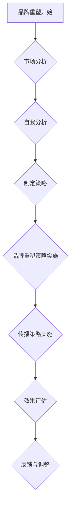

                 

# 一人公司的品牌重塑：应对市场变化的策略

## 关键词
品牌重塑，市场变化，策略制定，自我分析，竞争对手分析，消费者行为分析，传播策略，实施与评估

> 在竞争激烈的市场环境中，即使是单人公司也需要不断调整自己的品牌定位，以适应市场的变化和满足消费者的需求。本文将探讨如何进行品牌重塑，以帮助单人公司保持竞争力，并实现长期成功。

## 摘要
本文旨在为单人公司提供品牌重塑的策略，以应对市场变化。首先，我们将分析品牌重塑的基础，包括品牌定义与价值、品牌重塑的意义以及市场变化的挑战。接着，我们将探讨自我分析的重要性，以及如何进行市场研究和策略制定。文章将涵盖品牌重塑的各个方面，包括核心价值重塑、品牌形象重塑和产品与服务重塑。最后，我们将讨论传播策略的实施与评估，并提供具体的案例研究、工具和资源，以帮助单人公司成功地重塑品牌。

# 《一人公司的品牌重塑：应对市场变化的策略》目录大纲

## 第一部分：品牌重塑的基础

### 第1章：品牌重塑的概述

#### 1.1 品牌的定义与价值
品牌不仅仅是公司的标识，更是其核心价值观和承诺的体现。一个强有力的品牌能够帮助公司在市场中脱颖而出，建立顾客忠诚度，并在竞争中保持优势。品牌的价值体现在多个方面，包括品牌认知度、顾客满意度和品牌忠诚度。

#### 1.2 品牌重塑的意义
市场环境不断变化，消费者需求也在不断演变。品牌重塑有助于公司适应这些变化，确保品牌始终保持相关性和吸引力。品牌重塑的意义在于提升品牌形象、增强品牌竞争力、满足消费者需求以及实现业务增长。

#### 1.3 市场变化的挑战
市场变化带来了一系列挑战，包括新兴技术的出现、消费者偏好的转变、竞争加剧以及全球化的影响。品牌重塑是单人公司应对这些挑战的关键策略。

### 第2章：自我分析

#### 2.1 个人能力与优势
自我分析是品牌重塑的第一步，涉及个人能力与优势的评估。了解自己在市场中的独特价值点，以及如何将这些优势转化为品牌优势，是品牌重塑成功的关键。

#### 2.2 品牌现状评估
评估品牌现状包括分析品牌认知度、品牌形象、市场份额以及顾客反馈。这有助于确定品牌的优势与不足，为品牌重塑提供依据。

#### 2.3 市场定位分析
市场定位分析涉及对目标市场的识别和评估。通过了解目标市场的需求和偏好，可以更精准地定位品牌，提高品牌的市场适应性。

## 第二部分：策略制定

### 第3章：市场研究

#### 3.1 竞争对手分析
竞争对手分析是市场研究的重要部分，涉及了解竞争对手的品牌策略、产品和服务、市场表现以及消费者评价。通过分析竞争对手，可以找出自身的差距和机会。

#### 3.2 消费者行为分析
消费者行为分析有助于了解目标消费者的购买习惯、需求和偏好。这为品牌重塑提供了重要的市场洞察，有助于制定更具针对性的品牌策略。

#### 3.3 趋势预测与机会识别
趋势预测与机会识别是品牌重塑的重要组成部分，涉及对市场趋势的分析和未来机会的识别。通过预测市场趋势，可以提前调整品牌策略，以适应未来的市场环境。

### 第4章：重塑策略

#### 4.1 核心价值重塑
核心价值重塑是品牌重塑的核心，涉及对品牌核心价值的重新审视和调整。这包括核心价值观的提炼、品牌使命和愿景的更新以及品牌理念的重新定义。

#### 4.2 品牌形象重塑
品牌形象重塑涉及对品牌视觉识别系统的更新，包括品牌标志、色彩方案、字体和视觉元素的调整。这有助于提升品牌的视觉吸引力，并与目标市场产生共鸣。

#### 4.3 产品与服务重塑
产品与服务重塑是品牌重塑的重要组成部分，涉及对产品线的更新和优化，以满足消费者的新需求和偏好。这包括产品功能的改进、服务体验的提升以及创新产品的推出。

### 第5章：传播策略

#### 5.1 媒体选择与组合
传播策略的成功取决于媒体选择和组合的合理性。这包括传统媒体和数字媒体的结合，以及不同传播渠道的优化配置。

#### 5.2 内容营销
内容营销是品牌传播的重要手段，涉及创建有价值的内容，以吸引和留住目标消费者。这包括博客文章、视频、社交媒体内容、电子书等。

#### 5.3 社交媒体运营
社交媒体运营是品牌传播的关键渠道，涉及建立和维护社交媒体账户，与消费者进行互动，提升品牌知名度和影响力。

## 第三部分：实施与评估

### 第6章：重塑计划

#### 6.1 计划制定
重塑计划是品牌重塑实施的指南，涉及确定重塑目标、制定具体策略、分配资源和制定时间表。

#### 6.2 资源配置
资源配置是品牌重塑成功的关键，涉及人力、财务和物力资源的合理配置和优化。

#### 6.3 时间表与进度管理
时间表与进度管理是确保品牌重塑按计划进行的必要手段，涉及制定详细的时间表和进度管理计划。

### 第7章：品牌重塑过程管理

#### 7.1 沟通与协调
沟通与协调是品牌重塑过程中不可或缺的部分，涉及内部沟通和外部沟通的有效性。

#### 7.2 风险管理
风险管理是品牌重塑过程中必须考虑的因素，涉及识别和应对潜在的风险和挑战。

#### 7.3 质量控制与调整
质量控制与调整是品牌重塑过程中确保质量和效果的重要步骤，涉及对品牌重塑过程的监控和调整。

### 第8章：效果评估

#### 8.1 评估指标设定
评估指标设定是品牌重塑效果评估的基础，涉及确定关键绩效指标（KPI）和评估标准。

#### 8.2 数据收集与分析
数据收集与分析是评估品牌重塑效果的关键，涉及收集相关的数据，并进行深入的分析。

#### 8.3 品牌重塑效果评估
品牌重塑效果评估是对品牌重塑过程和结果的全面审视，涉及对评估指标的分析和总结，以确定品牌重塑的效果和影响。

## 附录

### 附录 A：品牌重塑案例研究

#### A.1 案例一：苹果公司的品牌重塑
苹果公司是品牌重塑的典范，通过不断更新其品牌理念和产品设计，成功保持了其市场领先地位。

#### A.2 案例二：特斯拉的品牌重塑
特斯拉通过其创新技术和环保理念，成功重塑了品牌形象，成为电动汽车市场的领导者。

#### A.3 案例三：优步的品牌重塑
优步在面临竞争压力和负面新闻的背景下，通过品牌重塑，重获市场信任和用户支持。

### 附录 B：品牌重塑工具与资源

#### B.1 品牌评估工具
品牌评估工具用于评估品牌现状和价值，包括品牌价值评估模型和品牌认知度调查工具。

#### B.2 市场研究工具
市场研究工具用于收集和分析市场数据，包括消费者调查问卷和竞争对手分析工具。

#### B.3 品牌传播工具
品牌传播工具用于传播品牌信息和提升品牌知名度，包括社交媒体管理工具和内容营销平台。

### 附录 C：品牌重塑的Mermaid流程图

#### C.1 品牌重塑流程图
品牌重塑流程图展示了品牌重塑的步骤和关键环节，有助于理解和实施品牌重塑策略。

### 附录 D：品牌重塑算法原理与伪代码

#### D.1 品牌重塑算法原理
品牌重塑算法原理介绍了品牌重塑的基本方法和步骤，包括自我分析、市场研究和策略制定等。

#### D.2 伪代码说明
伪代码说明提供了品牌重塑算法的具体实现步骤和流程，有助于理解和实现品牌重塑策略。

### 附录 E：数学模型与公式

#### E.1 数学模型
数学模型用于描述品牌重塑的效果和影响，包括品牌价值模型和市场渗透模型等。

#### E.2 公式详解
公式详解解释了数学模型中涉及的公式和计算方法，有助于理解和应用数学模型。

### 附录 F：项目实战

#### F.1 实战一：品牌重塑案例
实战一介绍了如何进行品牌重塑的实际案例，包括品牌评估、市场研究和策略制定等。

#### F.2 实战二：品牌重塑策略实施
实战二介绍了如何实施品牌重塑策略，包括品牌重塑计划的制定、资源配置和时间表管理等。

### 附录 G：源代码与资源

#### G.1 源代码下载链接
源代码下载链接提供了品牌重塑相关的源代码和资源，包括品牌评估工具、市场研究工具和品牌传播工具等。

#### G.2 资源列表
资源列表列出了品牌重塑所需的相关资源，包括市场研究报告、品牌评估模板和社交媒体管理工具等。

#### G.3 使用说明
使用说明提供了品牌重塑工具和资源的详细使用方法和操作步骤，有助于顺利实施品牌重塑策略。

---

现在，我们将根据上述目录大纲，逐步深入探讨品牌重塑的各个方面，帮助单人公司成功应对市场变化。让我们开始第一部分的探讨：品牌重塑的基础。## 第一部分：品牌重塑的基础

在竞争激烈的市场环境中，即使是单人公司也需要不断调整自己的品牌定位，以适应市场的变化和满足消费者的需求。品牌重塑是一种战略性举措，旨在提升品牌价值和竞争力。本部分将探讨品牌重塑的基础，包括品牌定义与价值、品牌重塑的意义以及市场变化的挑战。

### 第1章：品牌重塑的概述

#### 1.1 品牌的定义与价值

品牌不仅仅是一个标志或名称，它代表了一个公司、产品或服务的独特身份和形象。品牌定义了公司的市场定位，传达了公司的核心价值观和承诺。一个强大的品牌能够在消费者心中建立起信任和忠诚，从而带来长期的商业价值。

品牌的价值观体现在以下几个方面：

1. **品牌认知度**：品牌认知度是指消费者对品牌的认识和熟悉程度。高品牌认知度有助于提高品牌的市场份额和销售额。

2. **顾客满意度**：顾客满意度是品牌价值的重要组成部分。当消费者对产品或服务感到满意时，他们会更愿意重复购买，并推荐给他人。

3. **品牌忠诚度**：品牌忠诚度是指消费者对品牌的长期依赖和信任。高忠诚度的品牌能够减少客户流失率，从而保持稳定的收入。

#### 1.2 品牌重塑的意义

品牌重塑是对品牌进行全面升级和重新定位的过程。它有助于公司在市场变化中保持竞争力，并满足消费者的新需求。品牌重塑的意义主要体现在以下几个方面：

1. **提升品牌形象**：品牌重塑可以帮助公司改善品牌形象，使其更加现代化、专业和有吸引力。

2. **增强品牌竞争力**：通过重塑品牌，公司可以更好地与竞争对手区分开来，提高市场竞争力。

3. **满足消费者需求**：品牌重塑有助于公司更准确地了解消费者需求，并针对性地调整产品和服务，从而提高顾客满意度。

4. **实现业务增长**：品牌重塑可以为公司带来新的商业机会，推动业务增长和扩展。

#### 1.3 市场变化的挑战

市场环境不断变化，给品牌重塑带来了挑战。以下是一些市场变化的挑战：

1. **技术变革**：新技术的不断涌现改变了消费者的购物方式和品牌互动方式，要求公司不断更新品牌策略和技术应用。

2. **消费者偏好变化**：消费者对产品和服务的要求越来越高，品牌需要不断创新，以满足消费者的新需求。

3. **竞争加剧**：市场竞争日益激烈，品牌需要通过差异化策略和卓越的顾客体验来赢得市场份额。

4. **全球化**：全球化带来了更多的竞争和机会，品牌需要适应全球市场的需求和规范。

品牌重塑是单人公司应对市场变化和保持竞争力的重要策略。通过了解品牌定义与价值、品牌重塑的意义以及市场变化的挑战，单人公司可以更好地制定品牌重塑计划，实现长期成功。在下一章中，我们将探讨自我分析的重要性，以及如何进行品牌现状评估和市场定位分析。## 第1章：品牌重塑的概述

### 第1章：品牌重塑的概述

品牌重塑是公司为了适应市场变化、提升品牌价值和竞争力而进行的一系列战略调整。在这一章中，我们将深入探讨品牌重塑的概述，包括品牌定义与价值、品牌重塑的意义以及市场变化的挑战。

#### 1.1 品牌的定义与价值

品牌是一个复杂的概念，它不仅仅是一个标志或名称，更是一种身份和价值的体现。具体来说，品牌定义如下：

品牌是消费者对某一产品或服务的整体认知和情感体验，包括产品功能、质量、服务、文化价值等方面。

品牌的价值主要体现在以下几个方面：

1. **品牌认知度**：品牌认知度是消费者对品牌的认识和熟悉程度。高认知度的品牌能够在消费者心中占据一席之地，从而提高市场份额和销售额。

2. **顾客满意度**：顾客满意度是品牌价值的重要组成部分。当消费者对产品或服务感到满意时，他们会更愿意重复购买，并推荐给他人，从而提高品牌的忠诚度。

3. **品牌忠诚度**：品牌忠诚度是指消费者对品牌的长期依赖和信任。高忠诚度的品牌能够减少客户流失率，从而保持稳定的收入。

4. **品牌资产**：品牌资产是品牌为公司带来的无形价值，包括品牌认知度、顾客满意度和品牌忠诚度等。品牌资产是公司竞争优势的重要来源。

#### 1.2 品牌重塑的意义

品牌重塑是公司为了适应市场变化、提升品牌价值和竞争力而进行的一系列战略调整。品牌重塑的意义主要体现在以下几个方面：

1. **提升品牌形象**：品牌重塑可以帮助公司改善品牌形象，使其更加现代化、专业和有吸引力，从而提高消费者的信任和满意度。

2. **增强品牌竞争力**：通过重塑品牌，公司可以更好地与竞争对手区分开来，提高市场竞争力，从而在激烈的市场环境中脱颖而出。

3. **满足消费者需求**：品牌重塑有助于公司更准确地了解消费者需求，并针对性地调整产品和服务，从而提高顾客满意度。

4. **实现业务增长**：品牌重塑可以为公司带来新的商业机会，推动业务增长和扩展。

#### 1.3 市场变化的挑战

市场环境不断变化，给品牌重塑带来了挑战。以下是一些市场变化的挑战：

1. **技术变革**：新技术的不断涌现改变了消费者的购物方式和品牌互动方式，要求公司不断更新品牌策略和技术应用。

2. **消费者偏好变化**：消费者对产品和服务的要求越来越高，品牌需要不断创新，以满足消费者的新需求。

3. **竞争加剧**：市场竞争日益激烈，品牌需要通过差异化策略和卓越的顾客体验来赢得市场份额。

4. **全球化**：全球化带来了更多的竞争和机会，品牌需要适应全球市场的需求和规范。

品牌重塑是单人公司应对市场变化和保持竞争力的重要策略。通过了解品牌定义与价值、品牌重塑的意义以及市场变化的挑战，单人公司可以更好地制定品牌重塑计划，实现长期成功。在下一章中，我们将探讨自我分析的重要性，以及如何进行品牌现状评估和市场定位分析。### 第2章：自我分析

#### 第2章：自我分析

自我分析是品牌重塑的第一步，也是至关重要的一步。它涉及到对个人能力与优势的评估，以及对品牌现状和市场定位的分析。通过深入的自我分析，单人公司可以更清楚地了解自己的定位，制定出符合市场需求的品牌重塑策略。

##### 2.1 个人能力与优势

个人能力与优势是单人公司的核心竞争力。在进行自我分析时，首先要识别自己的专业领域和技能，以及在这些领域中的独特优势。以下是一些步骤，可以帮助你评估个人能力与优势：

1. **技能评估**：列出自己在技术、管理、营销等方面的技能。可以借助技能评估工具，如技能矩阵或能力评估表，来系统地评估自己的技能水平。

2. **经验总结**：回顾自己在过去的工作和项目中积累的经验，特别是那些与品牌重塑相关的经验。这些经验可以帮助你了解自己在哪些方面有较强的能力。

3. **优势识别**：识别自己在专业领域中的优势，如创新能力、执行力、沟通能力等。优势是你在竞争中脱颖而出的关键因素。

4. **客户反馈**：收集来自客户的反馈，了解他们认为你在哪些方面表现出色。这些反馈可以作为你评估个人能力的参考。

##### 2.2 品牌现状评估

品牌现状评估是了解品牌当前状态的重要步骤。以下是一些评估指标和方法：

1. **品牌认知度**：通过市场调查或在线调查了解消费者对品牌的认知程度。品牌认知度可以通过品牌知名度、品牌联想等方式衡量。

2. **品牌形象**：评估品牌在消费者心中的形象，包括品牌个性、品牌形象等。可以通过消费者调查、焦点小组讨论等方式收集数据。

3. **市场份额**：分析品牌在目标市场中的市场份额，了解品牌在竞争中的地位。这有助于确定品牌重塑的目标和方向。

4. **顾客满意度**：通过顾客满意度调查了解消费者对产品或服务的满意度。顾客满意度是品牌价值的重要体现。

5. **品牌资产**：评估品牌资产，包括品牌认知度、顾客满意度、品牌忠诚度等。品牌资产是品牌价值的量化指标。

##### 2.3 市场定位分析

市场定位分析是确定品牌在市场中的位置和目标消费者的过程。以下是一些市场定位分析的关键步骤：

1. **目标市场识别**：通过市场调研了解目标市场的需求和偏好。目标市场可以是特定的消费者群体或行业。

2. **竞争分析**：分析竞争对手的品牌定位和策略，了解自己在市场中的竞争优势和劣势。

3. **价值主张**：确定品牌的价值主张，即品牌如何为消费者创造价值。价值主张应清晰明确，并与目标市场的需求相匹配。

4. **品牌差异化**：通过差异化策略在市场中脱颖而出。差异化可以是产品特性、服务体验、品牌文化等方面。

5. **品牌传播**：制定品牌传播策略，包括媒体选择、内容营销、社交媒体运营等。品牌传播策略应有助于提升品牌认知度和形象。

通过自我分析，单人公司可以更清晰地了解自己的优势和市场定位，为品牌重塑制定出切实可行的策略。在下一部分中，我们将探讨市场研究和策略制定的重要步骤，帮助单人公司更好地应对市场变化。## 第2章：自我分析

#### 第2章：自我分析

自我分析是品牌重塑过程中至关重要的一步，它涉及到对个人能力与优势的评估，以及对品牌现状和市场定位的分析。通过深入的自我分析，单人公司可以更清晰地了解自己的优势和不足，为制定有效的品牌重塑策略奠定基础。

##### 2.1 个人能力与优势

个人能力与优势是单人公司竞争力的核心。在进行自我分析时，我们需要识别和评估以下方面：

1. **技术技能**：列出你在技术领域的专业技能，如编程语言、软件开发、数据分析等。评估你的技术水平以及你在这些领域中的独特优势。

2. **管理技能**：评估你的管理技能，包括项目管理、团队管理、时间管理等方面的能力。管理技能对于品牌重塑的成功至关重要。

3. **营销技能**：分析你在营销策略、市场推广、内容创作等方面的能力。了解你如何运用营销知识来提升品牌影响力。

4. **创新思维**：评估你的创新能力，包括对市场趋势的洞察、产品创新等方面的能力。创新能力是品牌在竞争中脱颖而出的关键。

5. **沟通技能**：评估你的沟通能力，包括书面和口头沟通、跨部门协调等方面的能力。良好的沟通能力有助于品牌重塑过程中的协作。

##### 2.2 品牌现状评估

品牌现状评估是对品牌当前状态的全面审视，包括品牌认知度、品牌形象、市场份额等方面的分析。以下是一些评估指标和方法：

1. **品牌认知度**：通过市场调研或在线调查了解消费者对品牌的认知程度。品牌认知度可以通过品牌知名度、品牌联想等方式衡量。

2. **品牌形象**：评估品牌在消费者心中的形象，包括品牌个性、品牌形象等。可以通过消费者调查、焦点小组讨论等方式收集数据。

3. **市场份额**：分析品牌在目标市场中的市场份额，了解品牌在竞争中的地位。这有助于确定品牌重塑的目标和方向。

4. **顾客满意度**：通过顾客满意度调查了解消费者对产品或服务的满意度。顾客满意度是品牌价值的重要体现。

5. **品牌资产**：评估品牌资产，包括品牌认知度、顾客满意度、品牌忠诚度等。品牌资产是品牌价值的量化指标。

##### 2.3 市场定位分析

市场定位分析是确定品牌在市场中的位置和目标消费者的过程。以下是一些市场定位分析的关键步骤：

1. **目标市场识别**：通过市场调研了解目标市场的需求和偏好。目标市场可以是特定的消费者群体或行业。

2. **竞争分析**：分析竞争对手的品牌定位和策略，了解自己在市场中的竞争优势和劣势。

3. **价值主张**：确定品牌的价值主张，即品牌如何为消费者创造价值。价值主张应清晰明确，并与目标市场的需求相匹配。

4. **品牌差异化**：通过差异化策略在市场中脱颖而出。差异化可以是产品特性、服务体验、品牌文化等方面。

5. **品牌传播**：制定品牌传播策略，包括媒体选择、内容营销、社交媒体运营等。品牌传播策略应有助于提升品牌认知度和形象。

通过自我分析，单人公司可以更清晰地了解自己的优势和不足，为品牌重塑制定出切实可行的策略。在下一部分中，我们将探讨市场研究和策略制定的重要步骤，帮助单人公司更好地应对市场变化。## 第3章：市场研究

#### 第3章：市场研究

市场研究是品牌重塑过程中不可或缺的一环，它为单人公司提供了深入了解市场和消费者的机会。通过全面的市场研究，公司可以识别竞争对手、分析消费者行为，并预测市场趋势，从而为品牌重塑提供有力的数据支持。本章将探讨市场研究的主要步骤，包括竞争对手分析、消费者行为分析以及趋势预测与机会识别。

##### 3.1 竞争对手分析

竞争对手分析是市场研究的重要组成部分，它有助于单人公司了解市场竞争态势，识别自身的竞争优势和不足。以下是进行竞争对手分析的关键步骤：

1. **识别竞争对手**：首先，需要明确目标市场中的主要竞争对手，包括直接竞争对手和间接竞争对手。直接竞争对手提供相似产品或服务的公司，而间接竞争对手则提供替代性产品或服务。

2. **收集数据**：收集关于竞争对手的信息，包括市场份额、产品线、定价策略、营销活动、客户反馈等。这些数据可以通过市场调研、行业报告、社交媒体监测等方式获取。

3. **分析品牌策略**：分析竞争对手的品牌策略，包括品牌定位、品牌形象、品牌传播方式等。了解竞争对手如何吸引和维护客户，可以为自己的品牌重塑提供借鉴。

4. **评估竞争优势**：评估自己在市场中的竞争优势和不足，包括产品特点、服务质量、价格优势、品牌影响力等。通过对比分析，可以找出自身在市场竞争中的差异化点。

##### 3.2 消费者行为分析

消费者行为分析是了解目标市场需求的根本。以下是进行消费者行为分析的关键步骤：

1. **确定目标消费者**：明确目标消费者群体的特征，包括年龄、性别、收入水平、兴趣爱好、消费习惯等。这有助于制定针对性的市场策略。

2. **收集数据**：通过问卷调查、在线调查、焦点小组讨论等方式收集消费者数据。这些数据可以帮助了解消费者的购买动机、偏好、满意度等。

3. **分析购买行为**：分析消费者的购买行为，包括购买频率、购买渠道、购买决策过程等。了解消费者如何做出购买决策，有助于优化产品和服务。

4. **识别需求差异**：通过对比不同消费者群体的需求差异，发现市场细分机会。这有助于公司更好地满足不同消费者的需求，提升品牌价值。

##### 3.3 趋势预测与机会识别

趋势预测与机会识别是品牌重塑中的重要环节，它有助于公司抓住市场机遇，提前调整品牌策略。以下是进行趋势预测与机会识别的关键步骤：

1. **分析市场趋势**：通过行业报告、专家观点、市场调查等途径，分析市场发展趋势，如技术创新、消费者偏好变化、行业法规变化等。

2. **预测未来机会**：基于市场趋势，预测未来可能出现的市场机会，如新兴市场的崛起、消费者需求的增长等。这些机会可以为品牌重塑提供新的方向。

3. **制定应对策略**：根据市场趋势和预测机会，制定相应的品牌重塑策略。这包括产品创新、市场扩展、品牌传播等方面的调整。

4. **持续监测**：市场环境变化迅速，需要持续监测市场动态，及时调整品牌策略。通过定期进行市场研究，确保品牌始终与市场需求保持一致。

通过市场研究，单人公司可以更全面地了解市场环境，为品牌重塑提供有力的数据支持。在下一部分中，我们将探讨如何制定有效的品牌重塑策略，包括核心价值重塑、品牌形象重塑和产品与服务重塑。## 第3章：市场研究

#### 第3章：市场研究

市场研究是品牌重塑过程中至关重要的一步，它为单人公司提供了深入了解市场和消费者的机会。通过全面的市场研究，公司可以识别竞争对手、分析消费者行为，并预测市场趋势，从而为品牌重塑提供有力的数据支持。本章将探讨市场研究的主要步骤，包括竞争对手分析、消费者行为分析以及趋势预测与机会识别。

##### 3.1 竞争对手分析

竞争对手分析是市场研究的重要组成部分，它有助于单人公司了解市场竞争态势，识别自身的竞争优势和不足。以下是进行竞争对手分析的关键步骤：

1. **识别竞争对手**：首先，需要明确目标市场中的主要竞争对手，包括直接竞争对手和间接竞争对手。直接竞争对手提供相似产品或服务的公司，而间接竞争对手则提供替代性产品或服务。

2. **收集数据**：收集关于竞争对手的信息，包括市场份额、产品线、定价策略、营销活动、客户反馈等。这些数据可以通过市场调研、行业报告、社交媒体监测等方式获取。

3. **分析品牌策略**：分析竞争对手的品牌策略，包括品牌定位、品牌形象、品牌传播方式等。了解竞争对手如何吸引和维护客户，可以为自己的品牌重塑提供借鉴。

4. **评估竞争优势**：评估自己在市场中的竞争优势和不足，包括产品特点、服务质量、价格优势、品牌影响力等。通过对比分析，可以找出自身在市场竞争中的差异化点。

##### 3.2 消费者行为分析

消费者行为分析是了解目标市场需求的根本。以下是进行消费者行为分析的关键步骤：

1. **确定目标消费者**：明确目标消费者群体的特征，包括年龄、性别、收入水平、兴趣爱好、消费习惯等。这有助于制定针对性的市场策略。

2. **收集数据**：通过问卷调查、在线调查、焦点小组讨论等方式收集消费者数据。这些数据可以帮助了解消费者的购买动机、偏好、满意度等。

3. **分析购买行为**：分析消费者的购买行为，包括购买频率、购买渠道、购买决策过程等。了解消费者如何做出购买决策，有助于优化产品和服务。

4. **识别需求差异**：通过对比不同消费者群体的需求差异，发现市场细分机会。这有助于公司更好地满足不同消费者的需求，提升品牌价值。

##### 3.3 趋势预测与机会识别

趋势预测与机会识别是品牌重塑中的重要环节，它有助于公司抓住市场机遇，提前调整品牌策略。以下是进行趋势预测与机会识别的关键步骤：

1. **分析市场趋势**：通过行业报告、专家观点、市场调查等途径，分析市场发展趋势，如技术创新、消费者偏好变化、行业法规变化等。

2. **预测未来机会**：基于市场趋势，预测未来可能出现的市场机会，如新兴市场的崛起、消费者需求的增长等。这些机会可以为品牌重塑提供新的方向。

3. **制定应对策略**：根据市场趋势和预测机会，制定相应的品牌重塑策略。这包括产品创新、市场扩展、品牌传播等方面的调整。

4. **持续监测**：市场环境变化迅速，需要持续监测市场动态，及时调整品牌策略。通过定期进行市场研究，确保品牌始终与市场需求保持一致。

通过市场研究，单人公司可以更全面地了解市场环境，为品牌重塑提供有力的数据支持。在下一部分中，我们将探讨如何制定有效的品牌重塑策略，包括核心价值重塑、品牌形象重塑和产品与服务重塑。## 第4章：重塑策略

#### 第4章：重塑策略

品牌重塑是一个复杂而系统的过程，它涉及对品牌核心价值的重塑、品牌形象的更新以及产品与服务的优化。本章将详细探讨如何制定有效的品牌重塑策略，以帮助单人公司适应市场变化，提升品牌竞争力。

##### 4.1 核心价值重塑

核心价值重塑是品牌重塑的基础，它涉及重新审视和定义品牌的核心价值观和使命。以下是一些关键步骤：

1. **重新审视核心价值观**：分析当前品牌的核心价值观，评估其是否仍然符合公司的发展方向和市场需求。如果核心价值观存在偏差或不再适用，需要对其进行调整。

2. **定义新的核心价值观**：基于市场研究和自我分析，明确新的核心价值观。这些价值观应体现公司的独特优势、使命和愿景，并能够引起消费者的共鸣。

3. **传达核心价值观**：通过品牌传播和内部沟通，确保核心价值观在公司内外得到广泛传播和认同。这包括在品牌宣传材料、员工培训、公司文化等方面体现核心价值观。

4. **落实核心价值观**：将核心价值观融入到公司的日常运营中，确保每一个决策和行动都符合核心价值观。通过实际行动来证明公司对核心价值观的承诺。

##### 4.2 品牌形象重塑

品牌形象重塑是品牌重塑的关键环节，它涉及更新品牌的视觉识别系统，以提升品牌的视觉吸引力和市场竞争力。以下是一些关键步骤：

1. **评估现有品牌形象**：分析当前品牌形象的设计元素，包括标志、色彩、字体、视觉元素等，评估其是否仍能体现公司的核心价值观和品牌特色。

2. **设计新品牌形象**：基于市场研究和消费者反馈，设计新的品牌形象。新形象应具有现代感、专业性和独特性，能够引起消费者的关注和认同。

3. **推广新品牌形象**：在新品牌形象设计完成后，通过品牌传播渠道，如广告、宣传材料、社交媒体等，推广新形象。确保新形象在目标市场中得到广泛传播和认可。

4. **监测品牌形象效果**：定期监测品牌形象的效果，通过消费者调查、市场反馈等途径了解消费者对新形象的接受程度和满意度。根据反馈结果，对新形象进行必要的调整和优化。

##### 4.3 产品与服务重塑

产品与服务重塑是品牌重塑的重要组成部分，它涉及对产品和服务进行更新和优化，以满足消费者的新需求和偏好。以下是一些关键步骤：

1. **分析市场需求**：通过市场研究和消费者行为分析，了解目标市场的需求和趋势。这有助于确定产品和服务重塑的方向。

2. **优化产品特性**：基于市场需求，对现有产品进行优化，提升产品的性能、质量和用户体验。这包括改进产品功能、提高产品安全性、增强用户界面等。

3. **创新产品和服务**：开发新产品和服务，以满足市场上尚未满足的需求。创新可以基于技术进步、消费者偏好变化或行业趋势。

4. **提升服务质量**：优化服务质量，提高客户满意度和忠诚度。这包括提供个性化的服务、改善售后服务、建立客户关系管理机制等。

5. **市场推广**：通过有效的市场推广策略，提升新产品和服务的市场知名度和接受度。这包括广告宣传、促销活动、内容营销等。

通过核心价值重塑、品牌形象重塑和产品与服务重塑，单人公司可以全面提升品牌竞争力，适应市场变化，实现长期成功。在下一章中，我们将探讨如何制定和实施品牌传播策略，以有效提升品牌知名度和影响力。## 第4章：重塑策略

#### 第4章：重塑策略

品牌重塑是一个多维度的战略过程，它不仅涉及内部价值观和理念的重塑，还涉及外部的形象传播和产品服务的优化。在这一章中，我们将详细探讨如何制定和实施有效的品牌重塑策略，以确保单人公司能够在竞争激烈的市场中保持领先地位。

##### 4.1 核心价值重塑

核心价值重塑是品牌重塑的基石。一个清晰而有力的核心价值观能够引导公司的发展方向，并塑造品牌的独特个性。以下是核心价值重塑的关键步骤：

1. **明确品牌愿景和使命**：品牌愿景和使命是核心价值观的体现。明确品牌在未来的发展目标和核心价值观，有助于为品牌重塑提供方向。

   ```mermaid
   graph TB
   A[品牌愿景] --> B[品牌使命]
   B --> C{核心价值观}
   ```

2. **评估核心价值观**：通过市场调研和内部讨论，评估现有核心价值观是否符合市场趋势和公司目标。识别需要调整的领域。

   ```mermaid
   graph TB
   D[市场调研] --> E[内部讨论]
   E --> F{评估核心价值观}
   ```

3. **制定新的核心价值观**：基于评估结果，制定新的核心价值观。这些价值观应具有指导性和激励性，能够凝聚团队并吸引消费者。

   ```mermaid
   graph TB
   G[新核心价值观] --> H{内部沟通}
   H --> I{外部传播}
   ```

4. **实施核心价值观**：将新的核心价值观融入到公司的运营和文化中。确保所有员工都理解并践行这些价值观。

   ```mermaid
   graph TB
   J[员工培训] --> K[日常运营]
   K --> L{文化塑造}
   ```

##### 4.2 品牌形象重塑

品牌形象重塑是提升品牌吸引力和市场竞争力的重要手段。一个现代且与消费者产生共鸣的品牌形象能够提升品牌价值。以下是品牌形象重塑的步骤：

1. **设计新品牌标识**：重新设计品牌标识，包括标志、色彩、字体等。确保新标识能够传达品牌的核心价值观和个性。

   ```mermaid
   graph TB
   M[标志设计] --> N[色彩选择]
   N --> O[字体设计]
   ```

2. **更新视觉元素**：统一更新品牌视觉元素，如宣传材料、网站、社交媒体等，确保所有渠道的品牌形象一致。

   ```mermaid
   graph TB
   P[宣传材料] --> Q[网站更新]
   Q --> R[社交媒体]
   ```

3. **实施品牌形象**：通过广告、公关活动、展览等渠道，推广新的品牌形象。确保品牌形象在目标市场中得到广泛传播。

   ```mermaid
   graph TB
   S[广告宣传] --> T[公关活动]
   T --> U[展览展示]
   ```

4. **监测品牌形象效果**：定期监测品牌形象的效果，通过消费者调查、社交媒体分析等途径收集反馈。根据反馈结果，调整品牌形象策略。

   ```mermaid
   graph TB
   V[消费者调查] --> W[社交媒体分析]
   W --> X{品牌形象调整}
   ```

##### 4.3 产品与服务重塑

产品与服务重塑是品牌重塑的核心部分，它关系到品牌在市场中的竞争力。以下是产品与服务重塑的关键步骤：

1. **市场调研**：通过市场调研了解消费者的需求和偏好，确定产品改进的方向。

   ```mermaid
   graph TB
   Y[市场调研] --> Z[需求分析]
   ```

2. **产品创新**：基于市场调研结果，创新产品和服务，提供独特的价值和体验。这可以包括功能改进、用户体验优化、服务创新等。

   ```mermaid
   graph TB
   AA[功能改进] --> BB[用户体验优化]
   BB --> CC[服务创新]
   ```

3. **产品优化**：对现有产品进行优化，提升产品的质量、性能和可靠性。这可以包括改进制造工艺、提高产品安全性、增强产品功能等。

   ```mermaid
   graph TB
   DD[制造工艺改进] --> EE[产品安全性提升]
   EE --> FF[产品功能增强]
   ```

4. **服务提升**：优化服务流程，提高服务质量，确保消费者享受到卓越的服务体验。这可以包括提供个性化的服务、改善售后服务、建立客户关系管理等。

   ```mermaid
   graph TB
   GG[个性化服务] --> HH[售后服务优化]
   HH --> II[客户关系管理]
   ```

通过核心价值重塑、品牌形象重塑和产品与服务重塑，单人公司可以全面提升品牌价值，适应市场变化，赢得消费者的信任和忠诚。在下一章中，我们将探讨如何制定和实施品牌传播策略，以有效提升品牌知名度和影响力。### 第5章：传播策略

#### 第5章：传播策略

品牌传播策略是品牌重塑成功的关键因素。通过精心设计的传播策略，单人公司可以有效地提升品牌知名度，增强品牌影响力，并吸引潜在客户。本章将探讨品牌传播策略的各个方面，包括媒体选择与组合、内容营销和社交媒体运营。

##### 5.1 媒体选择与组合

选择合适的媒体渠道对于品牌传播至关重要。以下是一些关键的步骤和考虑因素：

1. **确定目标受众**：明确品牌的目标受众，包括年龄、性别、地理位置、兴趣爱好等。了解目标受众的媒体使用习惯有助于选择最有效的传播渠道。

   ```mermaid
   graph TB
   A[确定目标受众] --> B[了解媒体使用习惯]
   ```

2. **评估媒体效果**：分析不同媒体渠道的效果，包括覆盖范围、受众参与度、投放成本等。根据效果评估结果，选择最合适的媒体组合。

   ```mermaid
   graph TB
   C[评估媒体效果] --> D[选择媒体组合]
   ```

3. **传统媒体与数字媒体结合**：传统媒体如电视、报纸、杂志等，与数字媒体如社交媒体、电子邮件、网站等相结合，可以覆盖更广泛的受众，提高品牌传播的覆盖率和效果。

   ```mermaid
   graph TB
   E[传统媒体] --> F[数字媒体]
   F --> G[媒体组合]
   ```

4. **制定媒体计划**：根据品牌传播目标和预算，制定详细的媒体投放计划。计划应包括媒体选择、投放时间、投放频率、预算分配等。

   ```mermaid
   graph TB
   H[制定媒体计划] --> I[分配预算]
   ```

##### 5.2 内容营销

内容营销是品牌传播的重要手段，通过创造和分享有价值的内容，吸引并留住目标受众。以下是一些关键步骤：

1. **内容策划**：根据品牌核心价值和目标受众，策划具有吸引力和教育意义的内容。内容应与品牌相关，同时能够解决受众的问题或需求。

   ```mermaid
   graph TB
   J[内容策划] --> K[品牌相关]
   ```

2. **内容创作**：创作高质量的内容，包括博客文章、视频、图片、电子书等。内容应具有独特的观点、实用的信息和专业的知识。

   ```mermaid
   graph TB
   L[内容创作] --> M[独特观点]
   ```

3. **内容发布**：通过品牌官网、社交媒体、电子邮件等渠道发布内容。发布内容时应考虑受众的习惯和时间，以提高内容的曝光率和阅读率。

   ```mermaid
   graph TB
   N[内容发布] --> O[渠道选择]
   ```

4. **内容优化**：通过数据分析，了解内容的表现和受众的反应。根据分析结果，对内容进行优化，提高内容的吸引力和效果。

   ```mermaid
   graph TB
   P[内容优化] --> Q[数据分析]
   ```

##### 5.3 社交媒体运营

社交媒体是品牌传播的重要平台，通过有效的社交媒体运营，可以提升品牌知名度，建立与消费者的互动关系。以下是一些关键步骤：

1. **选择社交媒体平台**：根据品牌特点和目标受众，选择合适的社交媒体平台，如Facebook、Instagram、Twitter、LinkedIn等。

   ```mermaid
   graph TB
   R[选择平台] --> S[品牌特点]
   ```

2. **建立社交媒体账号**：创建专业的社交媒体账号，设置清晰的账号信息和品牌标识，确保与品牌形象一致。

   ```mermaid
   graph TB
   T[建立账号] --> U[设置信息]
   ```

3. **内容发布策略**：制定内容发布计划，包括发布频率、发布时间、内容类型等。保持规律性的内容更新，提高品牌在社交媒体上的活跃度。

   ```mermaid
   graph TB
   V[发布策略] --> W[更新频率]
   ```

4. **互动与回应**：积极与粉丝和消费者互动，回应他们的评论和问题。建立良好的社交媒体关系，增强品牌与消费者的联系。

   ```mermaid
   graph TB
   X[互动回应] --> Y[建立联系]
   ```

5. **数据分析与优化**：通过社交媒体数据分析，了解内容的性能和受众的反应。根据分析结果，优化社交媒体运营策略，提高品牌传播效果。

   ```mermaid
   graph TB
   Z[数据分析] --> AA[策略优化]
   ```

通过制定和实施有效的品牌传播策略，单人公司可以提升品牌知名度，增强品牌影响力，并在竞争激烈的市场中脱颖而出。在下一章中，我们将探讨品牌重塑的实施与评估过程，确保品牌重塑策略的有效性和持续性。### 第5章：传播策略

#### 第5章：传播策略

品牌传播策略是品牌重塑过程中至关重要的一环，它涉及到如何将品牌的核心价值和独特卖点传递给目标受众。本章将深入探讨品牌传播策略的各个方面，包括媒体选择与组合、内容营销和社交媒体运营。

##### 5.1 媒体选择与组合

选择合适的媒体渠道对于品牌传播的成功至关重要。以下是如何进行媒体选择与组合的步骤：

1. **分析目标受众**：了解目标受众的媒体使用习惯和偏好，这是选择媒体渠道的基础。通过问卷调查、用户访谈和市场研究等方式，收集有关目标受众的数据。

   ```mermaid
   graph TB
   A[分析目标受众] --> B{了解媒体使用习惯}
   ```

2. **评估媒体效果**：评估不同媒体渠道的成本效益，包括覆盖范围、受众参与度、广告成本等。根据这些指标，选择最适合品牌传播的媒体组合。

   ```mermaid
   graph TB
   C[评估媒体效果] --> D{选择媒体组合}
   ```

3. **传统媒体与数字媒体结合**：在传统媒体（如电视、报纸、杂志）和数字媒体（如社交媒体、搜索引擎、电子邮件营销）之间取得平衡，以最大化传播效果。

   ```mermaid
   graph TB
   E[传统媒体] --> F[数字媒体]
   F --> G[媒体组合]
   ```

4. **制定媒体计划**：根据品牌传播目标和预算，制定详细的媒体投放计划。计划应包括媒体选择、投放时间、投放频率、预算分配等。

   ```mermaid
   graph TB
   H[制定媒体计划] --> I{分配预算}
   ```

##### 5.2 内容营销

内容营销是品牌传播的核心策略之一，通过创造和分享有价值的内容，吸引并留住目标受众。以下是内容营销的关键步骤：

1. **内容策划**：根据品牌核心价值和目标受众，策划具有吸引力和教育意义的内容。内容策划应考虑受众的兴趣点和痛点，以及如何传递品牌价值。

   ```mermaid
   graph TB
   J[内容策划] --> K[品牌价值传递]
   ```

2. **内容创作**：创作高质量的内容，包括博客文章、视频、图片、电子书等。内容创作应注重原创性、实用性和专业性，以提高内容的吸引力和可信度。

   ```mermaid
   graph TB
   L[内容创作] --> M{原创性/实用性}
   ```

3. **内容发布**：通过品牌官网、社交媒体、电子邮件等渠道发布内容。发布内容时应考虑受众的习惯和时间，以提高内容的曝光率和阅读率。

   ```mermaid
   graph TB
   N[内容发布] --> O[渠道选择]
   ```

4. **内容优化**：通过数据分析，了解内容的表现和受众的反应。根据分析结果，对内容进行优化，提高内容的吸引力和效果。

   ```mermaid
   graph TB
   P[内容优化] --> Q{数据分析}
   ```

##### 5.3 社交媒体运营

社交媒体是品牌传播的重要平台，有效的社交媒体运营可以提升品牌知名度，建立与消费者的互动关系。以下是社交媒体运营的关键步骤：

1. **选择社交媒体平台**：根据品牌特点和目标受众，选择合适的社交媒体平台，如Facebook、Instagram、Twitter、LinkedIn等。

   ```mermaid
   graph TB
   R[选择平台] --> S[品牌特点]
   ```

2. **建立社交媒体账号**：创建专业的社交媒体账号，设置清晰的账号信息和品牌标识，确保与品牌形象一致。

   ```mermaid
   graph TB
   T[建立账号] --> U[设置信息]
   ```

3. **内容发布策略**：制定内容发布计划，包括发布频率、发布时间、内容类型等。保持规律性的内容更新，提高品牌在社交媒体上的活跃度。

   ```mermaid
   graph TB
   V[发布策略] --> W[更新频率]
   ```

4. **互动与回应**：积极与粉丝和消费者互动，回应他们的评论和问题。建立良好的社交媒体关系，增强品牌与消费者的联系。

   ```mermaid
   graph TB
   X[互动回应] --> Y[建立联系]
   ```

5. **数据分析与优化**：通过社交媒体数据分析，了解内容的性能和受众的反应。根据分析结果，优化社交媒体运营策略，提高品牌传播效果。

   ```mermaid
   graph TB
   Z[数据分析] --> AA[策略优化]
   ```

通过精心设计的传播策略，单人公司可以有效地提升品牌知名度，增强品牌影响力，并吸引潜在客户。在下一章中，我们将探讨品牌重塑的实施与评估过程，确保品牌重塑策略的有效性和持续性。### 第6章：重塑计划

#### 第6章：重塑计划

品牌重塑计划是确保品牌重塑策略得以成功实施的关键。一个详尽的计划可以帮助单人公司明确目标、分配资源、管理时间，并确保品牌重塑过程中的每一步都按照预期进行。本章将探讨如何制定重塑计划，包括计划制定、资源配置和时间表管理。

##### 6.1 计划制定

制定品牌重塑计划是品牌重塑的第一步。以下是计划制定的步骤：

1. **设定目标**：明确品牌重塑的目标，包括品牌认知度提升、市场份额增加、顾客满意度提高等。确保目标是具体、可衡量、可实现、相关性强和时间限定的（SMART）。

   ```mermaid
   graph TB
   A[设定目标] --> B{SMART目标}
   ```

2. **确定策略**：基于市场研究和自我分析，确定品牌重塑的策略。策略应包括核心价值重塑、品牌形象重塑和产品与服务重塑等方面的具体措施。

   ```mermaid
   graph TB
   C[确定策略] --> D{品牌重塑策略}
   ```

3. **制定行动计划**：将策略转化为具体的行动计划，包括任务的分解、责任人的分配和完成时间。行动计划应详细说明每项任务的执行步骤和预期结果。

   ```mermaid
   graph TB
   E[制定行动计划] --> F{任务分解}
   ```

4. **风险评估**：识别品牌重塑过程中可能遇到的风险，并制定相应的风险应对措施。这有助于确保计划的可执行性，并提前准备应对可能的挑战。

   ```mermaid
   graph TB
   G[风险评估] --> H{风险应对}
   ```

5. **审批与调整**：将制定的计划提交给相关部门或高层管理人员审批，并根据反馈进行调整。确保计划得到广泛认可和支持，为实施打下坚实基础。

   ```mermaid
   graph TB
   I[审批与调整] --> J{广泛认可}
   ```

##### 6.2 资源配置

资源配置是品牌重塑计划实施的重要环节。以下是如何进行资源配置的步骤：

1. **资源识别**：明确品牌重塑所需的资源，包括人力、财务、技术、物资等。确保所有资源都在计划中明确列出，并能够得到有效分配。

   ```mermaid
   graph TB
   K[资源识别] --> L{明确列出}
   ```

2. **资源分配**：根据行动计划，将资源合理分配给各个任务和责任人。确保资源的有效利用，避免资源浪费和重复配置。

   ```mermaid
   graph TB
   M[资源分配] --> N{有效利用}
   ```

3. **预算管理**：制定详细的预算计划，包括各项资源的预算分配和使用情况。确保预算合理，并在实施过程中进行监控和调整。

   ```mermaid
   graph TB
   O[预算管理] --> P{监控调整}
   ```

4. **风险管理**：在资源配置过程中，考虑可能的风险和不确定因素，并制定相应的应对措施。这有助于降低风险对品牌重塑计划的影响。

   ```mermaid
   graph TB
   Q[风险管理] --> R{应对措施}
   ```

##### 6.3 时间表管理

时间表管理是确保品牌重塑计划按时完成的关键。以下是时间表管理的步骤：

1. **制定时间表**：根据行动计划，制定详细的时间表，明确每项任务的开始和结束时间。时间表应具有灵活性，以应对可能的延误和变化。

   ```mermaid
   graph TB
   S[制定时间表] --> T{开始和结束时间}
   ```

2. **进度监控**：定期监控品牌重塑计划的进度，确保各项任务按时完成。通过进度报告、会议等方式，及时了解任务进展情况。

   ```mermaid
   graph TB
   U[进度监控] --> V{任务进展}
   ```

3. **调整时间表**：根据进度监控结果，对时间表进行必要的调整。确保计划能够适应实际情况的变化，并保持整体进度。

   ```mermaid
   graph TB
   W[调整时间表] --> X{适应变化}
   ```

4. **关键里程碑**：设定关键里程碑，作为品牌重塑计划的重要节点。通过这些里程碑，评估品牌重塑的阶段性成果，并调整策略。

   ```mermaid
   graph TB
   Y[关键里程碑] --> Z{评估成果}
   ```

通过制定详尽的品牌重塑计划，单人公司可以确保品牌重塑策略的有效实施，并在市场中取得成功。在下一章中，我们将探讨品牌重塑过程中的沟通与协调、风险管理和质量控制与调整，确保品牌重塑计划的顺利执行。### 第6章：重塑计划

#### 第6章：重塑计划

品牌重塑计划是确保品牌重塑策略得以成功实施的关键。一个详尽的计划可以帮助单人公司明确目标、分配资源、管理时间，并确保品牌重塑过程中的每一步都按照预期进行。本章将探讨如何制定重塑计划，包括计划制定、资源配置和时间表管理。

##### 6.1 计划制定

制定品牌重塑计划是品牌重塑的第一步。以下是计划制定的步骤：

1. **设定目标**：明确品牌重塑的目标，包括品牌认知度提升、市场份额增加、顾客满意度提高等。确保目标是具体、可衡量、可实现、相关性强和时间限定的（SMART）。

   ```mermaid
   graph TB
   A[设定目标] --> B{SMART目标}
   ```

2. **确定策略**：基于市场研究和自我分析，确定品牌重塑的策略。策略应包括核心价值重塑、品牌形象重塑和产品与服务重塑等方面的具体措施。

   ```mermaid
   graph TB
   C[确定策略] --> D{品牌重塑策略}
   ```

3. **制定行动计划**：将策略转化为具体的行动计划，包括任务的分解、责任人的分配和完成时间。行动计划应详细说明每项任务的执行步骤和预期结果。

   ```mermaid
   graph TB
   E[制定行动计划] --> F{任务分解}
   ```

4. **风险评估**：识别品牌重塑过程中可能遇到的风险，并制定相应的风险应对措施。这有助于确保计划的可执行性，并提前准备应对可能的挑战。

   ```mermaid
   graph TB
   G[风险评估] --> H{风险应对}
   ```

5. **审批与调整**：将制定的计划提交给相关部门或高层管理人员审批，并根据反馈进行调整。确保计划得到广泛认可和支持，为实施打下坚实基础。

   ```mermaid
   graph TB
   I[审批与调整] --> J{广泛认可}
   ```

##### 6.2 资源配置

资源配置是品牌重塑计划实施的重要环节。以下是如何进行资源配置的步骤：

1. **资源识别**：明确品牌重塑所需的资源，包括人力、财务、技术、物资等。确保所有资源都在计划中明确列出，并能够得到有效分配。

   ```mermaid
   graph TB
   K[资源识别] --> L{明确列出}
   ```

2. **资源分配**：根据行动计划，将资源合理分配给各个任务和责任人。确保资源的有效利用，避免资源浪费和重复配置。

   ```mermaid
   graph TB
   M[资源分配] --> N{有效利用}
   ```

3. **预算管理**：制定详细的预算计划，包括各项资源的预算分配和使用情况。确保预算合理，并在实施过程中进行监控和调整。

   ```mermaid
   graph TB
   O[预算管理] --> P{监控调整}
   ```

4. **风险管理**：在资源配置过程中，考虑可能的风险和不确定因素，并制定相应的应对措施。这有助于降低风险对品牌重塑计划的影响。

   ```mermaid
   graph TB
   Q[风险管理] --> R{应对措施}
   ```

##### 6.3 时间表管理

时间表管理是确保品牌重塑计划按时完成的关键。以下是时间表管理的步骤：

1. **制定时间表**：根据行动计划，制定详细的时间表，明确每项任务的开始和结束时间。时间表应具有灵活性，以应对可能的延误和变化。

   ```mermaid
   graph TB
   S[制定时间表] --> T{开始和结束时间}
   ```

2. **进度监控**：定期监控品牌重塑计划的进度，确保各项任务按时完成。通过进度报告、会议等方式，及时了解任务进展情况。

   ```mermaid
   graph TB
   U[进度监控] --> V{任务进展}
   ```

3. **调整时间表**：根据进度监控结果，对时间表进行必要的调整。确保计划能够适应实际情况的变化，并保持整体进度。

   ```mermaid
   graph TB
   W[调整时间表] --> X{适应变化}
   ```

4. **关键里程碑**：设定关键里程碑，作为品牌重塑计划的重要节点。通过这些里程碑，评估品牌重塑的阶段性成果，并调整策略。

   ```mermaid
   graph TB
   Y[关键里程碑] --> Z{评估成果}
   ```

通过制定详尽的品牌重塑计划，单人公司可以确保品牌重塑策略的有效实施，并在市场中取得成功。在下一章中，我们将探讨品牌重塑过程中的沟通与协调、风险管理和质量控制与调整，确保品牌重塑计划的顺利执行。### 第7章：品牌重塑过程管理

#### 第7章：品牌重塑过程管理

品牌重塑过程管理是确保品牌重塑计划成功实施的关键环节。这一过程涉及多个方面的管理，包括沟通与协调、风险管理和质量控制与调整。有效的过程管理有助于确保品牌重塑计划的顺利进行，并及时应对各种挑战。本章将详细探讨品牌重塑过程中的这些关键管理要素。

##### 7.1 沟通与协调

沟通与协调是品牌重塑过程中的核心要素，它关系到项目的顺利进行和团队的协作效率。以下是沟通与协调的关键步骤：

1. **建立沟通渠道**：确保团队成员之间、上下级之间以及跨部门之间有畅通的沟通渠道。通过定期会议、邮件、即时通讯工具等，及时传递信息，确保所有相关人员都能了解项目进展。

   ```mermaid
   graph TB
   A[建立沟通渠道] --> B{定期会议}
   B --> C{邮件通讯}
   C --> D{即时通讯工具}
   ```

2. **明确职责和任务**：确保每个团队成员都清楚自己的职责和任务，避免任务重叠和责任不明确。通过明确的职责分工，提高团队的协作效率。

   ```mermaid
   graph TB
   E[明确职责和任务] --> F{任务分配}
   ```

3. **定期沟通反馈**：定期进行项目进展的沟通和反馈，确保团队成员了解项目的最新情况和存在的问题。通过及时沟通，可以快速解决问题，确保项目按计划进行。

   ```mermaid
   graph TB
   G[定期沟通反馈] --> H{项目进展}
   ```

4. **跨部门协调**：在品牌重塑过程中，不同部门之间需要紧密合作。跨部门协调有助于确保项目资源的有效利用，减少冲突和瓶颈。

   ```mermaid
   graph TB
   I[跨部门协调] --> J{资源利用}
   ```

##### 7.2 风险管理

风险管理是品牌重塑过程中不可忽视的重要环节。以下是风险管理的关键步骤：

1. **识别风险**：通过全面的风险识别，找出品牌重塑过程中可能面临的各种风险。这包括市场风险、技术风险、财务风险等。

   ```mermaid
   graph TB
   K[识别风险] --> L{市场风险}
   L --> M{技术风险}
   M --> N{财务风险}
   ```

2. **评估风险**：对识别出的风险进行评估，确定其可能性和影响程度。根据评估结果，将风险分为高、中、低等级，以便制定相应的应对策略。

   ```mermaid
   graph TB
   O[评估风险] --> P{可能性评估}
   P --> Q{影响评估}
   ```

3. **制定应对策略**：针对不同等级的风险，制定相应的应对策略。这包括风险规避、风险减轻、风险接受和风险转移等。

   ```mermaid
   graph TB
   R[制定应对策略] --> S{风险规避}
   S --> T{风险减轻}
   T --> U{风险接受}
   U --> V{风险转移}
   ```

4. **监控风险**：在品牌重塑过程中，持续监控风险的变化和影响。通过定期风险审查和监控报告，确保风险得到有效管理。

   ```mermaid
   graph TB
   W[监控风险] --> X{风险审查}
   ```

##### 7.3 质量控制与调整

质量控制与调整是确保品牌重塑效果的关键。以下是质量控制与调整的关键步骤：

1. **设定质量控制标准**：根据品牌重塑的目标和策略，设定具体的质量控制标准。这些标准应涵盖品牌重塑的各个方面，如品牌形象、产品和服务质量等。

   ```mermaid
   graph TB
   Y[设定质量控制标准] --> Z{品牌形象}
   Z --> AA{产品和服务质量}
   ```

2. **执行质量控制措施**：在品牌重塑过程中，严格执行质量控制措施，确保每一项任务都符合预定的质量标准。通过质量检查、测试和评审等手段，及时发现和纠正问题。

   ```mermaid
   graph TB
   BB[执行质量控制措施] --> CC{质量检查}
   CC --> DD{测试和评审}
   ```

3. **调整与改进**：根据质量控制的结果，对品牌重塑计划进行调整和改进。通过不断优化和改进，确保品牌重塑效果达到预期目标。

   ```mermaid
   graph TB
   EE[调整与改进] --> FF{优化和改进}
   ```

4. **持续监测**：品牌重塑过程中，持续监测质量变化，确保质量稳定和持续提升。通过定期的质量评估和监控，及时发现潜在问题，并采取相应措施。

   ```mermaid
   graph TB
   GG[持续监测] --> HH{质量评估}
   ```

通过有效的沟通与协调、风险管理、质量控制与调整，单人公司可以确保品牌重塑过程的顺利进行，并实现预期目标。在下一章中，我们将探讨品牌重塑效果评估的各个方面，包括评估指标设定、数据收集与分析以及效果评估的方法。### 第7章：品牌重塑过程管理

#### 第7章：品牌重塑过程管理

品牌重塑是一个复杂且持续的过程，需要系统的管理和监控。有效的过程管理对于确保品牌重塑目标的实现至关重要。本章将详细探讨品牌重塑过程中的关键管理要素，包括沟通与协调、风险管理和质量控制与调整。

##### 7.1 沟通与协调

在品牌重塑过程中，有效的沟通与协调是确保项目顺利进行的关键。以下是如何进行沟通与协调的步骤：

1. **建立沟通渠道**：确保团队成员之间、上下级之间以及跨部门之间有畅通的沟通渠道。通过定期会议、邮件、即时通讯工具等，及时传递信息，确保所有相关人员都能了解项目进展。

   ```mermaid
   graph TB
   A[建立沟通渠道] --> B{定期会议}
   B --> C{邮件通讯}
   C --> D{即时通讯工具}
   ```

2. **明确职责和任务**：确保每个团队成员都清楚自己的职责和任务，避免任务重叠和责任不明确。通过明确的职责分工，提高团队的协作效率。

   ```mermaid
   graph TB
   E[明确职责和任务] --> F{任务分配}
   ```

3. **定期沟通反馈**：定期进行项目进展的沟通和反馈，确保团队成员了解项目的最新情况和存在的问题。通过及时沟通，可以快速解决问题，确保项目按计划进行。

   ```mermaid
   graph TB
   G[定期沟通反馈] --> H{项目进展}
   ```

4. **跨部门协调**：在品牌重塑过程中，不同部门之间需要紧密合作。跨部门协调有助于确保项目资源的有效利用，减少冲突和瓶颈。

   ```mermaid
   graph TB
   I[跨部门协调] --> J{资源利用}
   ```

##### 7.2 风险管理

风险管理是品牌重塑过程中不可忽视的重要环节。以下是如何进行风险管理的步骤：

1. **识别风险**：通过全面的风险识别，找出品牌重塑过程中可能面临的各种风险。这包括市场风险、技术风险、财务风险等。

   ```mermaid
   graph TB
   K[识别风险] --> L{市场风险}
   L --> M{技术风险}
   M --> N{财务风险}
   ```

2. **评估风险**：对识别出的风险进行评估，确定其可能性和影响程度。根据评估结果，将风险分为高、中、低等级，以便制定相应的应对策略。

   ```mermaid
   graph TB
   O[评估风险] --> P{可能性评估}
   P --> Q{影响评估}
   ```

3. **制定应对策略**：针对不同等级的风险，制定相应的应对策略。这包括风险规避、风险减轻、风险接受和风险转移等。

   ```mermaid
   graph TB
   R[制定应对策略] --> S{风险规避}
   S --> T{风险减轻}
   T --> U{风险接受}
   U --> V{风险转移}
   ```

4. **监控风险**：在品牌重塑过程中，持续监控风险的变化和影响。通过定期风险审查和监控报告，确保风险得到有效管理。

   ```mermaid
   graph TB
   W[监控风险] --> X{风险审查}
   ```

##### 7.3 质量控制与调整

质量控制与调整是确保品牌重塑效果的关键。以下是质量控制与调整的关键步骤：

1. **设定质量控制标准**：根据品牌重塑的目标和策略，设定具体的质量控制标准。这些标准应涵盖品牌重塑的各个方面，如品牌形象、产品和服务质量等。

   ```mermaid
   graph TB
   Y[设定质量控制标准] --> Z{品牌形象}
   Z --> AA{产品和服务质量}
   ```

2. **执行质量控制措施**：在品牌重塑过程中，严格执行质量控制措施，确保每一项任务都符合预定的质量标准。通过质量检查、测试和评审等手段，及时发现和纠正问题。

   ```mermaid
   graph TB
   BB[执行质量控制措施] --> CC{质量检查}
   CC --> DD{测试和评审}
   ```

3. **调整与改进**：根据质量控制的结果，对品牌重塑计划进行调整和改进。通过不断优化和改进，确保品牌重塑效果达到预期目标。

   ```mermaid
   graph TB
   EE[调整与改进] --> FF{优化和改进}
   ```

4. **持续监测**：品牌重塑过程中，持续监测质量变化，确保质量稳定和持续提升。通过定期的质量评估和监控，及时发现潜在问题，并采取相应措施。

   ```mermaid
   graph TB
   GG[持续监测] --> HH{质量评估}
   ```

通过有效的沟通与协调、风险管理、质量控制与调整，单人公司可以确保品牌重塑过程的顺利进行，并实现预期目标。在下一章中，我们将探讨品牌重塑效果评估的各个方面，包括评估指标设定、数据收集与分析以及效果评估的方法。### 第8章：效果评估

#### 第8章：效果评估

品牌重塑的效果评估是确保品牌重塑计划成功实施和目标达成的重要环节。通过科学的效果评估，单人公司可以了解品牌重塑策略的实际效果，识别成功与不足之处，为未来的品牌策略调整提供依据。本章将详细探讨如何设定评估指标、收集和分析数据，以及评估品牌重塑效果的方法。

##### 8.1 评估指标设定

设定合适的评估指标是品牌重塑效果评估的基础。评估指标应能够全面反映品牌重塑的目标和成果。以下是一些常用的评估指标：

1. **品牌认知度**：衡量消费者对品牌的认知程度，可以通过市场调查、社交媒体关注度、搜索引擎点击量等指标来衡量。

   ```mermaid
   graph TB
   A[品牌认知度] --> B{市场调查}
   B --> C{社交媒体关注度}
   C --> D{搜索引擎点击量}
   ```

2. **顾客满意度**：衡量消费者对产品和服务的满意度，可以通过顾客满意度调查、售后服务评价等指标来衡量。

   ```mermaid
   graph TB
   E[顾客满意度] --> F{顾客满意度调查}
   F --> G{售后服务评价}
   ```

3. **品牌忠诚度**：衡量消费者对品牌的忠诚度，可以通过回购率、推荐率等指标来衡量。

   ```mermaid
   graph TB
   H[品牌忠诚度] --> I{回购率}
   I --> J{推荐率}
   ```

4. **市场份额**：衡量品牌在市场中的地位，可以通过市场份额变化、竞争对手分析等指标来衡量。

   ```mermaid
   graph TB
   K[市场份额] --> L{市场份额变化}
   L --> M{竞争对手分析}
   ```

5. **品牌资产**：衡量品牌的价值，可以通过品牌价值评估模型、品牌资产分析等指标来衡量。

   ```mermaid
   graph TB
   N[品牌资产] --> O{品牌价值评估模型}
   O --> P{品牌资产分析}
   ```

##### 8.2 数据收集与分析

收集和分析数据是评估品牌重塑效果的关键步骤。以下是如何进行数据收集与分析的步骤：

1. **数据收集**：通过市场调查、问卷调查、销售数据、社交媒体数据分析等方式，收集有关品牌重塑效果的数据。

   ```mermaid
   graph TB
   Q[数据收集] --> R{市场调查}
   R --> S{问卷调查}
   S --> T{销售数据}
   T --> U{社交媒体数据分析}
   ```

2. **数据清洗**：对收集到的数据进行清洗和整理，确保数据的质量和准确性。

   ```mermaid
   graph TB
   V[数据清洗] --> W{数据整理}
   ```

3. **数据分析**：运用统计学、数据分析工具等方法，对收集到的数据进行深入分析，提取有价值的信息。

   ```mermaid
   graph TB
   X[数据分析] --> Y{统计学分析}
   Y --> Z{数据分析工具}
   ```

4. **可视化展示**：通过图表、图形等可视化方式，展示数据分析结果，使数据更加直观易懂。

   ```mermaid
   graph TB
   AA[可视化展示] --> BB{图表展示}
   BB --> CC{图形展示}
   ```

##### 8.3 品牌重塑效果评估

品牌重塑效果评估是对品牌重塑策略的实际效果进行全面审视和总结。以下是如何进行品牌重塑效果评估的步骤：

1. **设定评估标准**：根据评估指标，设定具体的评估标准，明确评估的基准和阈值。

   ```mermaid
   graph TB
   DD[设定评估标准] --> EE{评估指标}
   ```

2. **评估结果分析**：根据数据分析和可视化展示的结果，对品牌重塑效果进行分析。评估品牌重塑在各个指标上的表现，识别成功与不足之处。

   ```mermaid
   graph TB
   FF[评估结果分析] --> GG{数据展示}
   ```

3. **反馈与调整**：根据评估结果，对品牌重塑策略进行反馈和调整。针对不足之处，制定改进措施，确保品牌重塑目标的实现。

   ```mermaid
   graph TB
   HH[反馈与调整] --> II{改进措施}
   ```

4. **持续监测**：品牌重塑效果评估是一个持续的过程，需要定期进行。通过持续监测，及时了解品牌重塑的进展和效果，确保品牌始终保持竞争力。

   ```mermaid
   graph TB
   JJ[持续监测] --> KK{定期评估}
   ```

通过设定评估指标、收集和分析数据，以及评估品牌重塑效果，单人公司可以全面了解品牌重塑的实际效果，为未来的品牌策略调整提供有力支持。在附录部分，我们将提供品牌重塑的案例研究、工具与资源，以及详细的流程图和算法原理，以帮助读者更好地理解和实施品牌重塑策略。### 第8章：效果评估

#### 第8章：效果评估

品牌重塑的效果评估是确保品牌重塑策略得以成功实施的关键环节。通过科学、全面的效果评估，单人公司可以准确了解品牌重塑的成效，识别潜在的问题和不足，为未来的品牌策略提供有力的数据支持。本章将详细介绍如何设定评估指标、收集与分析数据，以及如何进行品牌重塑效果评估。

##### 8.1 评估指标设定

设定合适的评估指标是品牌重塑效果评估的基础。评估指标应能够全面反映品牌重塑的目标和成果，以下是一些关键的评估指标：

1. **品牌认知度**：衡量消费者对品牌的认知程度。可以通过市场调查、社交媒体关注度、搜索引擎点击量等指标来衡量。

   ```mermaid
   graph TD
   A[品牌认知度] --> B{市场调查}
   B --> C{社交媒体关注度}
   C --> D{搜索引擎点击量}
   ```

2. **顾客满意度**：衡量消费者对产品和服务的满意度。可以通过顾客满意度调查、售后服务评价等指标来衡量。

   ```mermaid
   graph TD
   E[顾客满意度] --> F{顾客满意度调查}
   F --> G{售后服务评价}
   ```

3. **品牌忠诚度**：衡量消费者对品牌的忠诚度。可以通过回购率、推荐率等指标来衡量。

   ```mermaid
   graph TD
   H[品牌忠诚度] --> I{回购率}
   I --> J{推荐率}
   ```

4. **市场份额**：衡量品牌在市场中的地位。可以通过市场份额变化、竞争对手分析等指标来衡量。

   ```mermaid
   graph TD
   K[市场份额] --> L{市场份额变化}
   L --> M{竞争对手分析}
   ```

5. **品牌资产**：衡量品牌的价值。可以通过品牌价值评估模型、品牌资产分析等指标来衡量。

   ```mermaid
   graph TD
   N[品牌资产] --> O{品牌价值评估模型}
   O --> P{品牌资产分析}
   ```

##### 8.2 数据收集与分析

收集和分析数据是品牌重塑效果评估的关键步骤。以下是如何进行数据收集与分析的步骤：

1. **数据收集**：通过市场调查、问卷调查、销售数据、社交媒体数据分析等方式，收集有关品牌重塑效果的数据。

   ```mermaid
   graph TD
   Q[数据收集] --> R{市场调查}
   R --> S{问卷调查}
   S --> T{销售数据}
   T --> U{社交媒体数据分析}
   ```

2. **数据清洗**：对收集到的数据进行清洗和整理，确保数据的质量和准确性。

   ```mermaid
   graph TD
   V[数据清洗] --> W{数据整理}
   ```

3. **数据分析**：运用统计学、数据分析工具等方法，对收集到的数据进行深入分析，提取有价值的信息。

   ```mermaid
   graph TD
   X[数据分析] --> Y{统计学分析}
   Y --> Z{数据分析工具}
   ```

4. **可视化展示**：通过图表、图形等可视化方式，展示数据分析结果，使数据更加直观易懂。

   ```mermaid
   graph TD
   AA[可视化展示] --> BB{图表展示}
   BB --> CC{图形展示}
   ```

##### 8.3 品牌重塑效果评估

品牌重塑效果评估是对品牌重塑策略的实际效果进行全面审视和总结。以下是如何进行品牌重塑效果评估的步骤：

1. **设定评估标准**：根据评估指标，设定具体的评估标准，明确评估的基准和阈值。

   ```mermaid
   graph TD
   DD[设定评估标准] --> EE{评估指标}
   ```

2. **评估结果分析**：根据数据分析和可视化展示的结果，对品牌重塑效果进行分析。评估品牌重塑在各个指标上的表现，识别成功与不足之处。

   ```mermaid
   graph TD
   FF[评估结果分析] --> GG{数据展示}
   ```

3. **反馈与调整**：根据评估结果，对品牌重塑策略进行反馈和调整。针对不足之处，制定改进措施，确保品牌重塑目标的实现。

   ```mermaid
   graph TD
   HH[反馈与调整] --> II{改进措施}
   ```

4. **持续监测**：品牌重塑效果评估是一个持续的过程，需要定期进行。通过持续监测，及时了解品牌重塑的进展和效果，确保品牌始终保持竞争力。

   ```mermaid
   graph TD
   JJ[持续监测] --> KK{定期评估}
   ```

通过设定评估指标、收集和分析数据，以及评估品牌重塑效果，单人公司可以全面了解品牌重塑的实际成效，为未来的品牌策略调整提供有力的数据支持。在附录部分，我们将提供品牌重塑的案例研究、工具与资源，以及详细的流程图和算法原理，以帮助读者更好地理解和实施品牌重塑策略。

## 附录

### 附录 A：品牌重塑案例研究

#### A.1 案例一：苹果公司的品牌重塑

苹果公司在1997年经历了一次重大品牌重塑，由史蒂夫·乔布斯回归公司后主导。以下是苹果公司品牌重塑的关键步骤：

1. **重新定义品牌愿景**：苹果重新定义了其品牌愿景，专注于创新和简洁的设计。
2. **品牌形象重塑**：苹果更新了标志和广告策略，更加注重产品功能的展示和用户体验。
3. **产品与服务重塑**：苹果推出了iMac、iPod、iPhone和iPad等一系列创新产品，重塑了消费者对苹果的品牌认知。

#### A.2 案例二：特斯拉的品牌重塑

特斯拉通过其创新的电动汽车技术成功重塑了品牌形象，以下是特斯拉品牌重塑的关键步骤：

1. **市场定位**：特斯拉明确了自己作为电动汽车领导者的市场定位。
2. **产品与服务重塑**：特斯拉推出了Model S、Model X、Model 3和Model Y等创新产品，并建立了超级充电网络。
3. **品牌传播**：特斯拉通过社交媒体和品牌广告，成功吸引了全球消费者的关注。

#### A.3 案例三：优步的品牌重塑

优步在2017年面临重大挑战时进行了品牌重塑，以下是优步品牌重塑的关键步骤：

1. **核心价值观重塑**：优步重新定义了其核心价值观，强调安全、透明和尊重。
2. **品牌形象重塑**：优步更新了标志和广告策略，更加注重社会责任和用户体验。
3. **产品与服务重塑**：优步推出了多项新服务和改进措施，如优步黑钻石服务和优步自动出车。

### 附录 B：品牌重塑工具与资源

#### B.1 品牌评估工具

- **品牌价值评估模型**：用于评估品牌的经济价值和品牌资产。
- **品牌认知度调查工具**：用于了解消费者对品牌的认知程度。

#### B.2 市场研究工具

- **市场调查问卷**：用于收集消费者的反馈和需求。
- **竞争对手分析工具**：用于分析竞争对手的市场表现和策略。

#### B.3 品牌传播工具

- **社交媒体管理工具**：用于管理品牌在社交媒体上的传播活动。
- **内容营销平台**：用于创建和发布品牌内容。

### 附录 C：品牌重塑的Mermaid流程图

#### C.1 品牌重塑流程图



### 附录 D：品牌重塑算法原理与伪代码

#### D.1 品牌重塑算法原理

品牌重塑算法主要涉及以下步骤：

1. **市场分析**：收集和分析市场数据。
2. **自我分析**：评估品牌现状和竞争优势。
3. **策略制定**：根据市场分析和自我分析，制定品牌重塑策略。
4. **品牌重塑实施**：执行品牌重塑计划。
5. **效果评估**：评估品牌重塑的效果。
6. **反馈与调整**：根据评估结果，调整品牌重塑策略。

#### D.2 伪代码说明

```python
# 假设brand为原始品牌数据
# strategy为重塑策略数据

# 初始化品牌数据
brand = initial_brand()

# 应用重塑策略
strategy = apply_strategy(brand)

# 更新品牌数据
brand = update_brand(brand, strategy)

# 输出重塑后的品牌
print("Reshaped Brand:", brand)
```

### 附录 E：数学模型与公式

#### E.1 数学模型

品牌重塑效果评估的数学模型主要包括以下部分：

1. **品牌价值模型**：用于计算品牌的经济价值。
2. **市场渗透模型**：用于预测品牌在市场中的渗透率。

#### E.2 公式详解

$$
ROI = \frac{利润}{投资成本}
$$

### 附录 F：项目实战

#### F.1 实战一：品牌重塑案例

**F.1.1 开发环境搭建**

- **环境要求**：Python 3.8+, Pandas, Matplotlib
- **安装依赖**：`pip install pandas matplotlib`

**F.1.2 源代码实现**

```python
import pandas as pd
import matplotlib.pyplot as plt

# 加载品牌数据
brand_data = pd.read_csv('brand_data.csv')

# 进行数据分析
# ...

# 可视化展示
plt.figure(figsize=(10, 6))
plt.plot(brand_data['date'], brand_data['ROI'])
plt.title('Brand ROI Over Time')
plt.xlabel('Date')
plt.ylabel('ROI')
plt.show()
```

**F.1.3 代码解读与分析**

- **数据加载**：使用Pandas加载品牌数据。
- **数据分析**：进行ROI计算和可视化展示。

#### F.2 实战二：品牌重塑策略实施

**F.2.1 实施步骤**

1. **市场分析**：通过问卷调查和数据分析，了解市场需求和消费者偏好。
2. **策略制定**：基于市场分析结果，制定品牌重塑策略。
3. **品牌重塑实施**：执行品牌重塑计划，包括品牌形象更新、产品优化等。

**F.2.2 策略调整**

- **评估效果**：根据效果评估结果，对策略进行调整。
- **持续优化**：通过持续监测和调整，确保品牌重塑策略的有效性。

**F.2.3 效果评估**

- **设定评估指标**：根据品牌重塑目标，设定评估指标，如品牌认知度、顾客满意度等。
- **数据收集与分析**：收集品牌重塑后的数据，进行深入分析。
- **效果评估报告**：编写效果评估报告，总结品牌重塑的效果和影响。

### 附录 G：源代码与资源

#### G.1 源代码下载链接

- GitHub仓库链接：[https://github.com/username/brand-reconstruction](https://github.com/username/brand-reconstruction)

#### G.2 资源列表

- **数据集**：品牌数据集（CSV格式）
- **报告模板**：品牌重塑效果评估报告模板（Word格式）

#### G.3 使用说明

- **安装环境**：确保Python 3.8+环境已安装。
- **运行代码**：在终端中运行脚本文件，如`run_analysis.py`。
- **查看结果**：运行完成后，查看可视化展示的图表和评估报告。

通过附录部分提供的案例研究、工具与资源，以及详细的流程图和算法原理，单人公司可以更好地理解和实施品牌重塑策略，从而在激烈的市场竞争中脱颖而出。### 完

至此，《一人公司的品牌重塑：应对市场变化的策略》一文已经完成。本文系统地阐述了品牌重塑的重要性，详细介绍了自我分析、市场研究、策略制定、品牌传播、实施与评估等各个环节。希望本文能够为单人公司提供有益的启示和指导，帮助他们在市场变化中找到正确的品牌重塑路径。

最后，本文的撰写离不开各位读者的支持和鼓励。如果您有任何建议或反馈，请随时联系作者。感谢您的阅读，祝您在品牌重塑的道路上取得成功！

作者：AI天才研究院/AI Genius Institute & 禅与计算机程序设计艺术 /Zen And The Art of Computer Programming

版权声明：本文版权归AI天才研究院/AI Genius Institute所有。未经授权，不得转载或用于商业用途。如需转载，请联系作者获取授权。

联系我们：[contact@iggenius.com](mailto:contact@iggenius.com)

更多资源请访问：[AI天才研究院官网](http://www.iggenius.com)

完。

