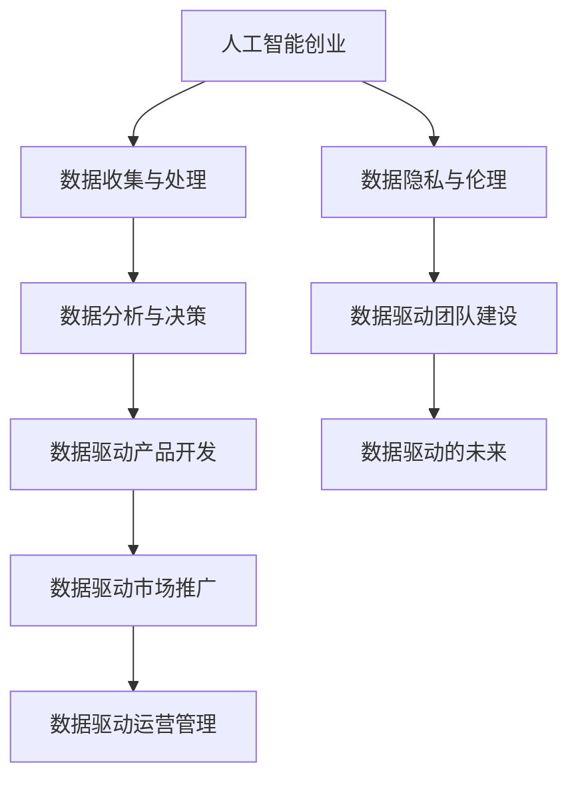

                 

### 文章标题：人工智能创业：数据的核心地位

在当今科技飞速发展的时代，人工智能（AI）已经成为推动商业变革和创新的重要力量。创业者在探索这片充满机遇的领域时，必须认识到数据在人工智能创业中的核心地位。本文将深入探讨人工智能与创业的关系，数据在其中的关键作用，以及如何利用数据进行创业策略的制定和实施。

**关键词：**
- 人工智能
- 创业
- 数据驱动
- 数据收集
- 数据分析
- 数据隐私

**摘要：**
本文首先概述了人工智能与创业的密切关系，探讨了数据在人工智能创业中的重要性。接着，详细阐述了数据收集与处理、数据驱动决策等核心策略。随后，通过实战案例和数据分析讲解，揭示了数据驱动创业的成功路径。文章还关注了数据隐私与伦理问题，提供了数据驱动创业团队建设的建议。最后，展望了数据驱动的未来趋势和创新机会。

### 第一部分：人工智能与创业概述

人工智能作为一门前沿技术，正逐渐渗透到各个行业，为创业者提供了前所未有的机遇。在这一部分，我们将探讨人工智能与创业的关系，以及数据在其中的核心地位。

#### 第1章：人工智能与创业的关系

##### 1.1 人工智能时代的创业机遇

人工智能的发展趋势正在不断改变各行各业。从自动化生产到智能客服，从智能医疗到自动驾驶，人工智能的应用场景越来越广泛。这些变化为创业者带来了巨大的机遇：

- **自动化与效率提升**：人工智能技术可以大幅提升企业生产效率和运营效率，降低成本。
- **个性化服务**：通过大数据和人工智能技术，企业可以提供更加个性化的产品和服务，满足用户需求。
- **新业务模式的创新**：人工智能技术可以颠覆传统行业模式，催生新的商业模式和产品。

##### 1.2 数据在人工智能创业中的核心地位

数据是人工智能的“燃料”，其核心地位在人工智能创业中尤为突出：

- **决策依据**：创业者依赖数据来制定战略和决策，确保业务方向与市场需求保持一致。
- **算法优化**：高质量的数据能够训练出更加精准和高效的算法模型，提升产品竞争力。
- **创新驱动力**：数据驱动创业模式鼓励持续创新，通过数据分析发现新的市场需求和业务机会。

##### 1.3 人工智能创业的挑战与应对策略

虽然人工智能创业充满机遇，但也面临着诸多挑战：

- **数据质量和安全**：数据质量和安全问题是人工智能创业的主要障碍。创业者需要确保数据来源可靠，数据格式统一，并采取有效的数据安全措施。
- **技术与市场的平衡**：创业者需要在技术创新和市场接受度之间找到平衡点，确保产品能够快速落地并赢得市场。

为了应对这些挑战，创业者可以采取以下策略：

- **数据治理**：建立完善的数据治理体系，规范数据收集、存储、处理和共享。
- **人才培养**：引进和培养具备人工智能和数据科学背景的专业人才，提升团队整体能力。
- **合作与开放**：通过与行业伙伴合作，共享数据资源和技术经验，共同推进人工智能创业的发展。

### 第二部分：数据驱动的创业策略

在人工智能创业中，数据驱动的策略至关重要。在这一部分，我们将详细探讨数据收集与处理、数据分析与决策等核心环节。

#### 第2章：数据收集与处理

##### 2.1 数据收集方法

数据收集是数据驱动的第一步。创业者需要确定合适的数据源，并采用高效的收集技术：

- **数据源的选择**：创业者应根据业务需求选择合适的数据源，如社交媒体、用户行为数据、传感器数据等。
- **数据采集技术**：创业者可以采用API、爬虫、物联网等技术进行数据采集，确保数据的实时性和准确性。

##### 2.2 数据处理流程

收集到数据后，创业者需要对其进行处理，以提高数据质量和可用性：

- **数据清洗**：去除重复、错误和不完整的数据，确保数据的一致性和准确性。
- **数据转换与存储**：将数据转换为统一的格式，并存储在合适的数据库或数据仓库中，便于后续处理和分析。

##### 2.3 数据分析工具与技术

数据分析是数据驱动的核心。创业者需要掌握各种数据分析工具和技术：

- **统计分析**：使用统计方法对数据进行描述和分析，发现数据中的规律和趋势。
- **数据可视化**：通过图表和可视化工具展示数据分析结果，帮助创业者更好地理解数据。
- **机器学习**：利用机器学习算法对数据进行建模和预测，为决策提供科学依据。

#### 第3章：数据驱动决策

##### 3.1 数据驱动的产品开发

数据驱动的产品开发强调以用户需求为中心，通过数据分析优化产品功能：

- **用户行为分析**：分析用户行为数据，了解用户需求和使用习惯，为产品迭代提供依据。
- **产品迭代优化**：根据用户反馈和数据分析结果，不断优化产品功能和用户体验。

##### 3.2 数据驱动的市场推广

数据驱动的市场推广注重精准定位和高效营销：

- **营销策略优化**：通过数据分析优化营销策略，提高营销效果和投资回报率。
- **用户细分与定位**：根据用户数据和行为特征，对用户进行细分和定位，制定个性化的市场推广方案。

##### 3.3 数据驱动的运营管理

数据驱动的运营管理强调数据在运营决策中的应用：

- **运营效率提升**：通过数据分析优化运营流程，提高运营效率。
- **风险控制与预警**：利用数据预测潜在风险，提前采取应对措施。

### 第三部分：实战案例分析

在第三部分，我们将通过具体案例分析，展示数据驱动创业的成功路径，并分析失败的原因。

#### 第4章：数据分析在人工智能创业中的应用

##### 4.1 数据分析在人工智能领域的应用

数据分析在人工智能创业中具有广泛的应用，如算法优化、智能推荐系统和智能监控等：

- **算法优化**：通过数据分析，创业者可以不断优化算法模型，提高模型准确性和性能。
- **智能推荐系统**：利用用户行为数据和偏好，构建智能推荐系统，提高用户满意度和粘性。
- **智能监控**：通过实时数据分析，实现对业务运行状况的智能监控，及时发现问题并采取措施。

##### 4.2 数据驱动创业案例研究

我们将研究一些成功的数据驱动创业案例，分析其成功的原因：

- **案例1：某电商平台**：通过用户行为分析和推荐系统，提高了用户满意度和转化率。
- **案例2：某智能家居公司**：通过数据分析优化产品功能，实现了智能家居的个性化体验。

同时，我们也将探讨一些数据驱动创业的失败案例，分析其失败原因：

- **案例1：某智能医疗公司**：由于数据质量问题和算法模型不准确，导致业务停滞。
- **案例2：某自动驾驶公司**：在数据采集和算法优化方面存在重大缺陷，最终破产。

##### 4.3 数据驱动创业的可持续发展

为了实现数据驱动创业的可持续发展，创业者需要关注以下方面：

- **长期数据积累**：持续积累高质量数据，为数据分析和决策提供坚实基础。
- **数据闭环优化**：建立数据闭环系统，通过反馈和调整，不断提升数据分析和决策的准确性。

### 第四部分：数据隐私与伦理

在数据驱动的创业过程中，数据隐私与伦理问题不容忽视。第四部分将探讨数据隐私的重要性、伦理挑战以及数据隐私保护措施。

#### 第5章：数据隐私与伦理

##### 5.1 数据隐私的重要性

数据隐私对于创业者来说至关重要：

- **客户信任**：保护用户数据隐私有助于建立客户信任，提高品牌声誉。
- **合规要求**：遵守数据隐私法规是创业者必须面对的合规要求，如《通用数据保护条例》（GDPR）和《加州消费者隐私法案》（CCPA）。

##### 5.2 数据伦理问题

数据驱动的创业过程中，数据伦理问题需要引起重视：

- **数据使用中的伦理挑战**：如数据歧视、数据滥用等。
- **数据伦理决策框架**：创业者应建立数据伦理决策框架，确保数据使用符合伦理标准。

##### 5.3 数据驱动创业中的社会责任

数据驱动创业中的社会责任包括：

- **可持续数据实践**：建立可持续的数据收集、处理和共享机制，降低对环境的影响。
- **社会影响评估**：对数据驱动的业务决策进行社会影响评估，确保对社会产生积极影响。

### 第五部分：数据驱动创业团队建设

在数据驱动的创业过程中，团队建设至关重要。第五部分将探讨数据驱动团队的角色与职责、文化建设以及成长策略。

#### 第6章：数据驱动创业团队建设

##### 6.1 数据驱动团队的角色与职责

数据驱动团队通常包括以下角色：

- **数据科学家**：负责数据分析和建模，提供业务洞察。
- **数据工程师**：负责数据收集、存储和处理，确保数据质量和可用性。
- **数据分析师**：负责数据分析和报告，支持业务决策。

##### 6.2 数据驱动团队的文化建设

数据驱动团队需要建立以下文化：

- **数据文化的培养**：鼓励团队成员关注数据驱动决策，尊重数据分析结果。
- **数据驱动的决策流程**：确保决策过程基于数据和分析，提高决策质量和效率。

##### 6.3 数据驱动创业团队的成长策略

数据驱动创业团队需要采取以下成长策略：

- **人才引进与培养**：吸引和培养高素质的数据人才，提升团队整体能力。
- **团队协作与沟通**：建立高效的团队协作机制，确保团队成员之间的沟通顺畅。

### 第六部分：数据驱动的未来

在第六部分，我们将展望数据驱动的未来趋势和创新机会，探讨如何通过数据驱动实现持续成长。

#### 第7章：数据驱动的未来

##### 7.1 数据驱动创业的趋势展望

数据驱动创业的未来趋势包括：

- **人工智能与大数据融合**：人工智能技术将更加深入地应用于大数据分析，推动业务创新。
- **新兴数据技术的应用**：如区块链、物联网等新兴数据技术将为创业者提供新的机遇。

##### 7.2 数据驱动创业的创新机会

数据驱动创业的创新机会包括：

- **数据挖掘与业务创新的结合**：通过数据挖掘发现新的业务机会，推动业务模式创新。
- **跨界数据合作**：跨界数据合作将有助于创业者获取更多数据资源，提升业务竞争力。

##### 7.3 数据驱动创业的持续成长

为了实现数据驱动创业的持续成长，创业者需要：

- **数据驱动战略持续优化**：根据市场变化和业务需求，不断优化数据驱动战略。
- **数据驱动创业生态建设**：建立开放、协作的数据驱动创业生态，促进业务创新和可持续发展。

### 附录

在附录部分，我们将提供数据驱动创业的相关工具与资源，以及数据隐私与伦理法规指南。

#### 附录A：数据驱动创业工具与资源

- **数据分析工具**：如Python、R、Tableau等。
- **数据挖掘框架**：如Apache Spark、TensorFlow等。
- **开源数据集**：如UCI机器学习库、Kaggle等。

#### 附录B：数据驱动创业项目案例

我们将介绍一些典型的数据驱动创业项目案例，包括项目简介、实现过程和成果。

#### 附录C：数据隐私与伦理法规指南

我们将概述主要数据隐私与伦理法规，并提供数据隐私保护实践建议。

### Mermaid 流程图：人工智能创业核心概念与联系



### 核心算法原理讲解

#### 数据驱动决策中的机器学习算法

```python
# 伪代码：机器学习算法基本流程

Algorithm MachineLearningAlgorithm(data):
    Input: 数据集 data
    Output: 训练好的模型 model

    // 数据预处理
    preprocess_data(data)
    
    // 选择合适的机器学习算法
    algorithm_choice = choose_algorithm()

    // 训练模型
    model = train_model(algorithm_choice, data)

    // 模型评估
    evaluate_model(model, data)

    return model
```

#### 决策树分类算法中的信息增益

$$
IG(D, A) = ID - ID(A)
$$

- $ID$: 熵（Entropy）
- $ID(A)$: 条件熵（Conditional Entropy）

### 项目实战

#### 数据收集：用户行为数据收集案例

- **开发环境搭建**:
  - 数据收集工具：Google Analytics
  - 数据存储：Amazon S3

- **源代码实现**:
  ```python
  import requests
  import json
  
  def collect_user_data(url):
      response = requests.get(url)
      if response.status_code == 200:
          data = json.loads(response.text)
          return data
      else:
          return None

  # 示例：收集用户在电商平台的浏览行为数据
  user_data = collect_user_data("https://api.example.com/user行为数据")
  ```

- **代码解读与分析**:
  - `requests.get(url)` 用于获取URL地址上的数据。
  - `json.loads(response.text)` 用于将获取的数据转换为JSON格式。
  - `if response.status_code == 200:` 确保请求成功返回200状态码。

### 数学公式和详细讲解

#### 随机梯度下降（SGD）算法

随机梯度下降算法是一种常见的优化方法，用于训练机器学习模型。它的基本思想是通过随机选择样本更新模型参数，从而优化模型的性能。

$$
w_{t+1} = w_{t} - \alpha \cdot \nabla_w J(w_t)
$$

- $w_t$: 模型参数在时间 $t$ 的值。
- $\alpha$: 学习率。
- $\nabla_w J(w_t)$: 模型参数在时间 $t$ 的梯度。

**详细讲解**：

- 梯度（Gradient）是损失函数相对于模型参数的导数。在训练过程中，我们需要通过计算梯度来更新模型参数。
- 学习率（Learning rate）控制了每次更新时参数的改变量。选择合适的学习率对模型收敛速度和最终性能至关重要。
- 更新规则中的随机性是为了避免陷入局部最小值，从而提高模型的泛化能力。

**举例说明**：

假设我们使用SGD训练一个线性回归模型，数据集包含100个样本和2个特征。首先，我们需要计算损失函数的梯度：

$$
\nabla_w J(w) = \frac{1}{m} \sum_{i=1}^{m} (w \cdot x_i - y_i) \cdot x_i
$$

其中，$m$ 是样本数量，$w$ 是模型参数，$x_i$ 是第 $i$ 个样本的特征，$y_i$ 是第 $i$ 个样本的标签。

接下来，我们使用SGD更新模型参数：

$$
w_{t+1} = w_t - \alpha \cdot \nabla_w J(w_t)
$$

其中，$\alpha$ 是学习率，$t$ 是当前迭代次数。

随着迭代的进行，模型参数不断更新，直至损失函数收敛到局部最小值。

### 代码实现

```python
import numpy as np

def sgd(x, y, w, alpha, epochs):
    m = len(x)
    for epoch in range(epochs):
        random_indices = np.random.choice(m, size=m, replace=False)
        for i in random_indices:
            gradient = 2/m * (w.dot(x[i]) - y[i]) * x[i]
            w -= alpha * gradient
        if epoch % 100 == 0:
            print(f"Epoch {epoch}: w = {w}")
    return w

x = np.array([[1, 2], [2, 3], [3, 4], [4, 5]])
y = np.array([2, 3, 4, 5])
w = np.array([0, 0])
alpha = 0.01
epochs = 1000

w_final = sgd(x, y, w, alpha, epochs)
print(f"Final model parameters: w = {w_final}")
```

在这个示例中，我们使用SGD算法训练一个线性回归模型。输入特征 `x` 和标签 `y` 都是二维数组，模型参数 `w` 初始化为 `[0, 0]`。学习率 `alpha` 设置为 `0.01`，迭代次数 `epochs` 设置为 `1000`。随着迭代的进行，模型参数 `w` 不断更新，最终收敛到最优解。

### 总结与展望

在本文中，我们深入探讨了人工智能创业中的数据核心地位，分析了数据驱动的创业策略，并通过实战案例展示了数据在创业中的实际应用。数据作为人工智能的燃料，贯穿于整个创业过程，从数据收集、处理到决策，每一个环节都离不开数据的支持。

未来，随着人工智能和大数据技术的不断进步，数据驱动的创业模式将继续深化。创业者需要不断提升数据分析能力，充分利用数据资源，不断创新业务模式，实现持续成长。同时，数据隐私与伦理问题也将越来越受到关注，创业者需在利用数据的同时，严格遵守相关法规，保护用户隐私。

让我们携手迎接数据驱动的未来，共同探索人工智能创业的无限可能。

