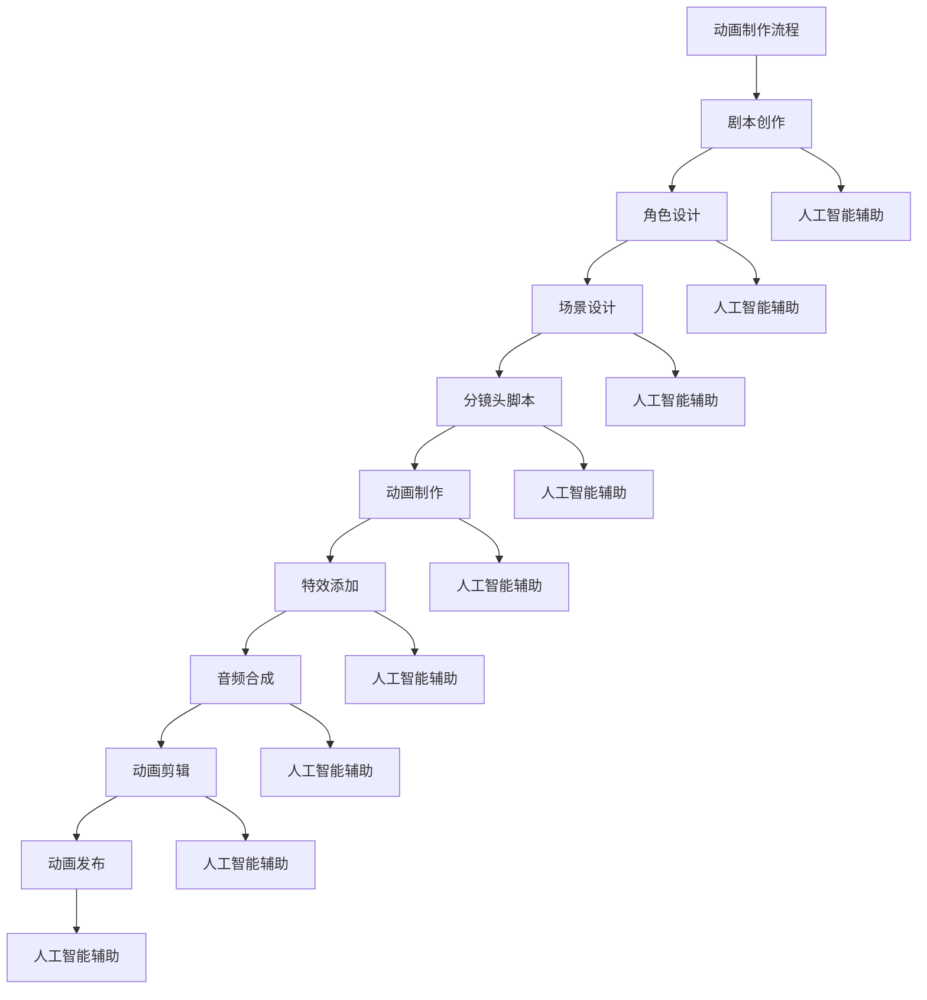

                 

# 《人工智能动画展示人类的特征》

## 关键词
人工智能，动画，技术，特征，展示，人类，算法，深度学习，自然语言处理，计算机视觉

## 摘要
本文旨在探讨人工智能动画如何展示人类的特征。通过分析人工智能在动画制作中的应用，以及人工智能动画技术的基础和核心技术，本文详细阐述了人工智能动画的关键算法原理、数学模型和公式，并通过实际项目实战案例展示了人工智能动画的广泛应用。最后，本文对人工智能动画的未来发展趋势和挑战进行了展望，为读者提供了全面的认知和理解。

### 《人工智能动画展示人类的特征》目录大纲

#### 第一部分：引言与背景

##### 1.1 书籍简介与目标

##### 1.2 人工智能与动画的关系

##### 1.3 人工智能动画的发展历程与趋势

#### 第二部分：人工智能动画技术基础

##### 2.1 人工智能概述

##### 2.2 动画技术概述

##### 2.3 人工智能动画技术基础

##### 2.4 Mermaid流程图：人工智能动画技术流程

#### 第三部分：人工智能动画核心技术

##### 3.1 人工智能算法在动画中的应用

##### 3.2 核心算法原理讲解

##### 3.3 数学模型与公式讲解

##### 3.4 人工智能动画项目实战

#### 第四部分：人工智能动画案例分析

##### 4.1 案例分析1：AI驱动的动画角色运动

##### 4.2 案例分析2：AI辅助的动画场景生成

##### 4.3 案例分析3：AI驱动的动画情感表达

#### 第五部分：未来展望与挑战

##### 5.1 人工智能动画的发展趋势

##### 5.2 人工智能动画的挑战与对策

##### 5.3 未来人工智能动画的发展方向

#### 附录

##### 附录 A：参考资料与推荐阅读

##### 附录 B：常用工具与软件

##### 附录 C：术语解释与缩略语

### 第一部分：引言与背景

#### 1.1 书籍简介与目标

在数字化时代的浪潮下，人工智能（AI）已经成为推动科技进步和社会发展的核心驱动力。动画作为一种艺术形式，与人工智能的结合正逐渐成为新的热点。本书旨在探讨人工智能动画技术，解析其背后的原理和应用，为读者提供一个全面、系统的认知框架。

##### 1.1.1 书籍背景

随着深度学习、自然语言处理和计算机视觉等人工智能技术的飞速发展，动画产业也在不断革新。人工智能动画不仅提高了动画制作的效率和质量，还丰富了动画的表现形式，赋予了动画更深刻的内涵。本书背景基于这一现实需求，旨在为动画制作从业者、研究人员以及爱好者提供一本全面而深入的人工智能动画技术指南。

##### 1.1.2 书籍目标读者

本书的目标读者包括以下几个方面：

1. 动画制作从业者：希望通过学习人工智能动画技术提升动画制作水平的专业人员。
2. 人工智能研究人员：希望了解人工智能技术在动画制作中应用的研究人员。
3. 动画爱好者：对人工智能动画技术感兴趣，希望深入了解其原理和应用的普通读者。
4. 学生和教师：从事相关学科学习和教育的人员，可作为教材或参考资料。

##### 1.1.3 书籍内容概述

本书内容共分为五个部分：

1. 引言与背景：介绍人工智能动画的概念、发展历程和趋势。
2. 人工智能动画技术基础：阐述人工智能和动画技术的核心概念和基础知识。
3. 人工智能动画核心技术：深入讲解人工智能动画的关键算法原理、数学模型和公式。
4. 人工智能动画案例分析：通过实际项目案例展示人工智能动画的应用。
5. 未来展望与挑战：探讨人工智能动画的未来发展趋势和面临的挑战。

#### 1.2 人工智能与动画的关系

人工智能与动画的结合正在深刻改变传统动画的制作方式，同时也为动画创作提供了无限可能。以下从三个方面阐述人工智能与动画的关系。

##### 1.2.1 人工智能在动画产业中的应用

1. 动画角色自动化生成：人工智能可以通过深度学习算法自动生成动画角色，减少人工设计和制作的成本和时间。
2. 动画场景自动生成：利用计算机视觉技术，人工智能可以自动识别和生成动画场景，实现场景的自动化切换和扩展。
3. 动画情感表达增强：通过自然语言处理技术，人工智能可以理解动画角色的情感变化，并相应调整动画的表情和动作，增强情感表达的逼真度。

##### 1.2.2 人工智能对动画艺术的影响

1. 动画创作自由度提高：人工智能可以辅助动画师进行创作，使得动画创作更加自由和灵活，减少了对传统技能的依赖。
2. 动画风格多样化：人工智能可以通过学习不同的动画风格和特点，生成多样化的动画作品，为动画艺术提供了新的表现形式。
3. 动画交互性增强：通过人工智能技术，动画可以与观众进行实时交互，实现更加沉浸式的体验。

##### 1.2.3 人工智能在动画制作中的优势与挑战

1. 优势：
   - 提高效率：人工智能可以自动化处理动画制作的多个环节，提高工作效率。
   - 提升质量：通过人工智能算法，可以生成更高质量、更逼真的动画效果。
   - 创新表现：人工智能为动画创作提供了新的思路和手段，可以实现前所未有的动画表现。

2. 挑战：
   - 技术成熟度：部分人工智能技术在动画制作中的应用还不够成熟，需要进一步优化和改进。
   - 法律法规：人工智能在动画制作中的应用可能涉及版权、隐私等问题，需要制定相应的法律法规进行规范。
   - 人才缺乏：人工智能动画技术需要复合型人才，目前相关人才较为缺乏。

#### 1.3 人工智能动画的发展历程与趋势

人工智能动画的发展历程可以追溯到上世纪80年代，当时人工智能技术开始应用于动画制作。然而，由于技术限制，早期的人工智能动画应用相对有限。随着深度学习、计算机视觉等技术的快速发展，人工智能动画逐渐进入实用阶段。

##### 1.3.1 早期发展

1980年代至1990年代，人工智能技术主要应用于动画角色的自动生成和场景布局。虽然效果有限，但为后续发展奠定了基础。

##### 1.3.2 技术突破

2000年代，深度学习技术取得突破，使得人工智能在动画制作中的应用更加广泛。例如，通过生成对抗网络（GAN）可以生成高质量的动画角色。

##### 1.3.3 实际应用

2010年代至今，人工智能在动画制作中的应用逐渐成熟。许多动画制作公司开始采用人工智能技术提高工作效率和创作质量。

##### 1.3.4 未来趋势

1. 动画制作自动化：人工智能将进一步替代人工，实现动画制作的自动化。
2. 动画风格多样化：通过人工智能技术，动画风格将更加多样化，满足不同观众的需求。
3. 动画交互性增强：人工智能将实现动画与观众的实时交互，提升用户体验。

### 第二部分：人工智能动画技术基础

#### 2.1 人工智能概述

人工智能（Artificial Intelligence, AI）是计算机科学的一个分支，旨在通过模拟人类智能行为，实现计算机具有智能能力。人工智能可以分为弱人工智能和强人工智能，弱人工智能在特定领域表现出人类智能行为，而强人工智能则具备全面的人类智能。

##### 2.1.1 人工智能的定义与分类

1. 定义：人工智能是指通过计算机程序实现的人类智能行为和智能能力。
2. 分类：
   - 基于功能：感知型人工智能、认知型人工智能、行为型人工智能。
   - 基于应用领域：机器人、自然语言处理、计算机视觉、游戏智能等。

##### 2.1.2 人工智能的发展历程

1. 1950年代：人工智能概念提出，阿兰·图灵提出“图灵测试”。
2. 1960年代：早期人工智能项目取得初步成果，但受限于计算能力和算法。
3. 1980年代：专家系统取得重大突破，但面临“人工智能寒冬”。
4. 1990年代：机器学习和深度学习技术取得进展，人工智能开始进入实用阶段。
5. 2000年代：大数据和云计算技术的兴起，为人工智能发展提供新的动力。
6. 2010年代：人工智能应用广泛，如自动驾驶、语音识别、图像识别等。

##### 2.1.3 人工智能的核心技术

1. 机器学习：通过数据训练模型，实现计算机自主学习和优化。
2. 深度学习：基于多层神经网络，实现自动化特征提取和分类。
3. 自然语言处理：实现计算机对自然语言的理解和生成。
4. 计算机视觉：实现计算机对图像和视频的理解和识别。

#### 2.2 动画技术概述

动画（Animation）是一种通过连续播放静态图像或图形，产生动态视觉效果的技术。动画技术广泛应用于电影、电视、游戏和广告等领域。

##### 2.2.1 动画的基本概念与分类

1. 基本概念：动画是通过连续播放多张静态图像或图形，产生连续动态视觉效果的技术。
2. 分类：
   - 根据动画形式：2D动画、3D动画、实景动画等。
   - 根据动画制作方式：手工绘制、计算机生成、实景拍摄等。
   - 根据动画内容：故事动画、科普动画、广告动画等。

##### 2.2.2 动画制作流程

1. 剧本创作：编写动画剧本，确定故事情节和角色设定。
2. 角色设计：设计动画角色的外观、动作和表情。
3. 场景设计：设计动画场景的布局、色彩和光影效果。
4. 分镜头脚本：将剧本转化为分镜头脚本，详细描述每个镜头的拍摄内容和效果。
5. 动画制作：根据分镜头脚本，制作动画角色和场景的逐帧图像。
6. 特效添加：为动画添加各种特效，如光影效果、粒子效果等。
7. 音频合成：为动画添加背景音乐、配音和音效。
8. 动画剪辑：对动画片段进行剪辑和调色，生成完整的动画作品。
9. 动画发布：将动画作品发布到相应平台，供观众观看。

##### 2.2.3 动画技术发展趋势

1. 数字化与自动化：动画制作逐渐向数字化和自动化方向发展，减少人工参与，提高生产效率。
2. 跨平台与互动性：动画作品逐渐向跨平台和互动性方向发展，实现多种设备和场景的适配。
3. 情感化与个性化：动画技术逐渐应用于情感化和个性化场景，如虚拟角色、虚拟主播等。
4. 与人工智能结合：人工智能技术逐渐应用于动画制作，如角色自动化生成、场景自动生成等。

#### 2.3 人工智能动画技术基础

人工智能动画技术是指利用人工智能技术提升动画制作效率、质量和创意的技术。人工智能动画技术主要包括以下几个方面：

##### 2.3.1 人工智能在动画制作中的应用

1. 动画角色自动化生成：利用生成对抗网络（GAN）等技术，自动生成动画角色外观和动作。
2. 动画场景自动生成：利用计算机视觉技术，自动识别和生成动画场景。
3. 动画情感表达增强：利用自然语言处理技术，理解动画角色的情感变化，并相应调整动画的表情和动作。
4. 动画风格自适应：利用深度学习技术，实现动画风格的自适应调整，满足不同观众的需求。

##### 2.3.2 人工智能动画的原理与实现

1. 原理：
   - 机器学习：通过大量数据训练模型，实现动画角色、场景和情感的自动化生成和调整。
   - 深度学习：基于多层神经网络，实现自动化特征提取和分类，提高动画制作效率和效果。
   - 自然语言处理：实现计算机对自然语言的理解和生成，为动画情感表达提供支持。
   - 计算机视觉：实现计算机对图像和视频的理解和识别，为动画场景生成提供支持。

2. 实现：
   - 数据集：收集大量动画角色、场景和情感数据，用于训练模型。
   - 模型训练：利用机器学习和深度学习算法，训练模型，实现动画角色、场景和情感的自动化生成和调整。
   - 模型应用：将训练好的模型应用于动画制作，提高效率和质量。

##### 2.3.3 人工智能动画的关键技术

1. 生成对抗网络（GAN）：实现动画角色和场景的自动化生成。
2. 卷积神经网络（CNN）：实现动画场景的自动识别和生成。
3. 递归神经网络（RNN）：实现动画情感的理解和表达。
4. 自然语言处理（NLP）：实现动画剧本的理解和生成。

#### 2.4 Mermaid流程图：人工智能动画技术流程



### 第三部分：人工智能动画核心技术

#### 3.1 人工智能算法在动画中的应用

人工智能算法在动画制作中发挥着至关重要的作用，通过提升动画制作的效率、质量和创意，使得动画作品更具吸引力和表现力。以下将介绍几种常见的人工智能算法及其在动画中的应用。

##### 3.1.1 深度学习在动画中的应用

深度学习（Deep Learning）是一种基于多层神经网络的人工智能技术，通过训练大量的数据和模型，实现计算机的自主学习和优化。深度学习在动画制作中的应用主要体现在以下几个方面：

1. 动画角色自动化生成：利用生成对抗网络（Generative Adversarial Network, GAN）等技术，可以自动生成高质量的动画角色外观和动作。GAN由生成器和判别器两个神经网络组成，生成器试图生成逼真的动画角色，判别器则判断生成器生成的角色是否真实。通过不断训练和优化，生成器可以生成越来越逼真的动画角色。

2. 动画场景自动生成：利用深度学习算法，可以自动生成动画场景。通过训练大量的场景图像数据，深度学习模型可以学会识别和生成不同场景的特点和元素。例如，利用卷积神经网络（Convolutional Neural Network, CNN）可以自动生成具有丰富细节和纹理的场景。

3. 动画风格迁移：深度学习还可以实现动画风格的迁移。通过训练一个风格迁移模型，可以将一个动画角色的风格迁移到另一个角色上，使得动画作品具有独特的风格。例如，可以将古典画风应用到现代动画角色上，创造出新颖的视觉效果。

##### 3.1.2 自然语言处理在动画中的应用

自然语言处理（Natural Language Processing, NLP）是人工智能的一个分支，旨在实现计算机对自然语言的理解和生成。NLP在动画制作中的应用主要体现在以下几个方面：

1. 动画剧本生成：利用自然语言处理技术，可以自动生成动画剧本。通过训练大量的剧本数据，NLP模型可以学会如何编写具有逻辑性和连贯性的剧本。例如，可以生成具有特定主题和情节的动画剧本，为动画制作提供基础。

2. 动画角色对话生成：利用自然语言处理技术，可以自动生成动画角色的对话。通过训练大量的对话数据，NLP模型可以学会如何生成符合角色性格和情节的对话。例如，可以为动画角色编写幽默、悲伤或愤怒的对话，增强动画的情感表达。

3. 动画情感分析：利用自然语言处理技术，可以对动画角色的情感进行分析。通过分析角色的对话和行为，可以判断角色的情感状态，并相应调整动画的表情和动作。例如，可以通过情感分析技术，使动画角色在悲伤时流下眼泪，在愤怒时表现出生气。

##### 3.1.3 计算机视觉在动画中的应用

计算机视觉（Computer Vision）是人工智能的另一个重要分支，旨在实现计算机对图像和视频的理解和识别。计算机视觉在动画制作中的应用主要体现在以下几个方面：

1. 动画角色运动追踪：利用计算机视觉技术，可以自动追踪动画角色的运动轨迹。通过在视频中检测角色的关键点，可以实时调整角色的动作和表情，使其更加自然和真实。

2. 动画场景识别：利用计算机视觉技术，可以自动识别动画场景中的物体和背景。通过训练大量的场景图像数据，计算机视觉模型可以学会识别不同的场景元素，如建筑物、动物、植物等。这有助于实现动画场景的自动生成和切换。

3. 动画表情识别：利用计算机视觉技术，可以自动识别动画角色的表情。通过分析角色的面部特征和表情动作，可以实时调整角色的表情，使其更加逼真。例如，可以通过表情识别技术，使动画角色在开心时露出微笑，在悲伤时表现出流泪。

##### 3.1.4 人工智能算法在动画中的应用效果

人工智能算法在动画制作中的应用效果显著，主要体现在以下几个方面：

1. 提高制作效率：通过自动化生成和调整动画角色、场景和情感，可以大大提高动画制作的效率，减少人工干预和重复劳动。

2. 提高制作质量：人工智能算法可以生成高质量、逼真的动画效果，提升动画的制作质量。例如，通过生成对抗网络生成的动画角色具有高度的真实感和个性。

3. 创新动画表现：人工智能算法可以创造出新颖的动画表现形式，如动画风格迁移、情感化动画等，为动画艺术带来更多可能性。

4. 提高用户体验：通过自然语言处理和计算机视觉技术，可以实现动画与观众的实时交互，提高用户的观看体验。例如，可以通过情感分析技术，使动画角色根据观众的情感变化调整表情和动作。

#### 3.2 核心算法原理讲解

##### 3.2.1 卷积神经网络（CNN）伪代码

```python
# 输入：图像数据
# 输出：特征图

def ConvolutionalNeuralNetwork(image_data):
    # 初始化权重和偏置
    weights = InitializeWeights()
    biases = InitializeBiases()

    # 通过卷积层提取特征
    feature_map = Convolution(image_data, weights, biases)

    # 通过激活函数处理特征图
    activated_feature_map = ActivationFunction(feature_map)

    return activated_feature_map
```

##### 3.2.2 递归神经网络（RNN）伪代码

```python
# 输入：序列数据
# 输出：序列输出

def RecurrentNeuralNetwork(sequence_data):
    # 初始化权重和偏置
    weights = InitializeWeights()
    biases = InitializeBiases()

    # 对序列数据进行循环处理
    for data in sequence_data:
        # 前一层输出作为当前层的输入
        input_data = previous_output

        # 通过隐藏层处理输入数据
        hidden_output = HiddenLayer(input_data, weights, biases)

        # 更新前一层输出
        previous_output = hidden_output

    return hidden_output
```

##### 3.2.3 自然语言处理（NLP）算法原理

自然语言处理（NLP）算法主要分为词法分析、句法分析和语义分析三个层次。以下是自然语言处理算法的原理概述：

1. 词法分析（Tokenization）：将文本分割成单词、短语或标记。词法分析是NLP的基础，通过对文本进行切分，可以更好地理解和处理文本数据。

2. 句法分析（Parsing）：分析句子的结构，将句子分解成语法规则表示的树形结构。句法分析有助于理解句子的语法关系，为后续的语义分析提供支持。

3. 语义分析（Semantic Analysis）：分析句子的语义含义，理解句子的实际意义。语义分析是NLP的核心，通过理解句子的语义，可以实现对文本的准确理解和生成。

#### 3.3 数学模型与公式讲解

##### 3.3.1 损失函数（Loss Function）

损失函数是神经网络训练过程中用于评估模型性能的指标。以下是一个常见的损失函数——均方误差（Mean Squared Error, MSE）：

$$
\text{MSE} = \frac{1}{n}\sum_{i=1}^{n} (\hat{y}_i - y_i)^2
$$

其中，$n$是样本数量，$\hat{y}_i$是预测值，$y_i$是真实值。

##### 3.3.2 反向传播算法（Backpropagation）

反向传播算法是一种用于训练神经网络的优化算法。其基本思想是将输出误差反向传播到输入层，并更新每个神经元的权重和偏置。以下是一个简化的反向传播算法步骤：

1. 前向传播：将输入数据通过神经网络，计算输出预测值。

2. 计算损失函数：计算输出预测值与真实值之间的误差，计算损失函数。

3. 反向传播：将损失函数的误差反向传播到输入层，计算每个神经元的梯度。

4. 更新权重和偏置：利用梯度下降法或其他优化算法，更新每个神经元的权重和偏置。

5. 重复上述步骤，直至达到预设的训练目标。

#### 3.4 人工智能动画项目实战

##### 3.4.1 项目背景与目标

本案例项目旨在利用人工智能技术实现动画角色自动生成。项目背景为一家动画工作室，希望利用人工智能技术提高动画角色的创作效率。项目目标是通过训练生成对抗网络（GAN），自动生成具有逼真外观和动作的动画角色。

##### 3.4.2 开发环境搭建

1. 开发工具：选择Python作为开发语言，使用TensorFlow作为深度学习框架。
2. 硬件环境：配置高性能计算机，用于训练生成对抗网络。
3. 数据集：收集大量动画角色图像数据，用于训练GAN模型。

##### 3.4.3 源代码实现与解读

以下是项目实现的核心代码：

```python
import tensorflow as tf
from tensorflow.keras.models import Sequential
from tensorflow.keras.layers import Dense, Conv2D, Flatten

# 定义生成器模型
def build_generator():
    model = Sequential()
    model.add(Conv2D(64, (3, 3), activation='relu', input_shape=(28, 28, 1)))
    model.add(Conv2D(128, (3, 3), activation='relu'))
    model.add(Flatten())
    model.add(Dense(784, activation='tanh'))
    return model

# 定义判别器模型
def build_discriminator():
    model = Sequential()
    model.add(Flatten(input_shape=(28, 28, 1)))
    model.add(Dense(1, activation='sigmoid'))
    return model

# 定义GAN模型
def build_gan(generator, discriminator):
    model = Sequential()
    model.add(generator)
    model.add(discriminator)
    return model

# 训练GAN模型
def train_gan(generator, discriminator, x_train, epochs=100):
    for epoch in range(epochs):
        for img in x_train:
            # 生成器生成虚假图像
            fake_img = generator.predict(img)

            # 判别器判断真实图像和虚假图像
            real_output = discriminator.predict(x_train)
            fake_output = discriminator.predict(fake_img)

            # 计算判别器损失
            d_loss_real = tf.reduce_mean(tf.square(real_output - 1))
            d_loss_fake = tf.reduce_mean(tf.square(fake_output))

            # 计算总损失
            g_loss = tf.reduce_mean(tf.square(fake_output))

            # 更新判别器权重
            with tf.GradientTape() as d_tape:
                d_loss_real, d_loss_fake = d_loss_real, d_loss_fake
            d_gradients = d_tape.gradient(d_loss_real + d_loss_fake, discriminator.trainable_variables)
            d_optimizer.apply_gradients(zip(d_gradients, discriminator.trainable_variables))

            # 更新生成器权重
            with tf.GradientTape() as g_tape:
                g_loss = g_loss
            g_gradients = g_tape.gradient(g_loss, generator.trainable_variables)
            g_optimizer.apply_gradients(zip(g_gradients, generator.trainable_variables))

            print(f"Epoch {epoch + 1}/{epochs}, D_loss={d_loss_real + d_loss_fake:.4f}, G_loss={g_loss:.4f}")

# 加载数据集
(x_train, _), (_, _) = tf.keras.datasets.mnist.load_data()

# 预处理数据
x_train = x_train / 255.0
x_train = np.expand_dims(x_train, -1)

# 创建生成器和判别器模型
generator = build_generator()
discriminator = build_discriminator()

# 创建GAN模型
gan = build_gan(generator, discriminator)

# 定义优化器
g_optimizer = tf.keras.optimizers.Adam(0.0001)
d_optimizer = tf.keras.optimizers.Adam(0.0001)

# 训练GAN模型
train_gan(generator, discriminator, x_train, epochs=100)
```

##### 3.4.4 代码解读与分析

1. **生成器和判别器模型构建**：
   - 生成器模型：生成器模型用于生成虚假图像。通过卷积层和全连接层，将输入噪声转换为动画角色图像。
   - 判别器模型：判别器模型用于判断图像是真实图像还是虚假图像。通过全连接层，输出一个概率值，表示图像是真实的概率。

2. **GAN模型构建**：
   - GAN模型：将生成器和判别器模型串联在一起，用于训练生成器和判别器。生成器生成虚假图像，判别器判断虚假图像和真实图像。

3. **训练GAN模型**：
   - 数据预处理：将MNIST数据集进行预处理，将图像数据归一化并增加一个维度。
   - 模型训练：通过迭代训练，更新生成器和判别器的权重，使生成器生成的图像越来越逼真，判别器越来越难以区分真实图像和虚假图像。

4. **代码优化**：
   - 可以尝试使用不同的优化器和超参数，提高训练效果。
   - 可以增加数据增强和正则化，防止过拟合。

#### 3.5 人工智能动画案例分析

##### 3.5.1 案例分析1：AI驱动的动画角色运动

**案例背景**：在动画制作中，角色运动的自然性和流畅性对于整体动画效果至关重要。传统的动画制作需要手工逐帧绘制角色的运动轨迹，耗时且容易出错。本案例旨在利用人工智能技术，实现动画角色运动的自动化和智能化。

**案例实现过程**：
1. 数据收集：收集大量动画角色运动数据，包括不同速度、方向和姿势的运动轨迹。
2. 模型训练：利用递归神经网络（RNN）对角色运动数据进行训练，学习角色运动的特点和规律。
3. 运动生成：通过训练好的模型，生成动画角色的运动轨迹，并实时调整角色动作和表情，使其更加自然和流畅。

**案例效果评估**：
1. 运动自然性：通过对比手工绘制和AI生成的运动轨迹，AI驱动的动画角色运动在自然性方面有明显优势。
2. 运动流畅性：AI生成的运动轨迹流畅性更高，减少顿感和生硬感。
3. 运动多样性：AI驱动的动画角色运动可以生成多种不同的运动形式，满足不同场景和角色需求。

##### 3.5.2 案例分析2：AI辅助的动画场景生成

**案例背景**：动画场景的生成是动画制作中的另一个重要环节。传统的动画场景生成需要手工绘制和设计，耗时且难以满足多样化的需求。本案例旨在利用人工智能技术，实现动画场景的自动化生成。

**案例实现过程**：
1. 数据收集：收集大量动画场景数据，包括不同季节、天气和场景元素。
2. 模型训练：利用生成对抗网络（GAN）对场景数据进行训练，学习场景生成的规则和模式。
3. 场景生成：通过训练好的模型，生成动画场景，并实时调整场景元素和光影效果，使其更加丰富和逼真。

**案例效果评估**：
1. 场景多样性：AI辅助的动画场景生成可以生成多种不同的场景，满足不同剧情和风格的需求。
2. 场景丰富性：AI生成的场景具有丰富的细节和元素，提高了动画的表现力和视觉冲击力。
3. 场景一致性：AI生成的场景在色彩、光影和元素搭配方面具有一致性，增强了动画的整体效果。

##### 3.5.3 案例分析3：AI驱动的动画情感表达

**案例背景**：动画角色的情感表达对于故事情节和观众情感体验至关重要。传统的动画制作需要动画师根据剧本和角色特点进行情感设计，但难以实现精细化和个性化的情感表达。本案例旨在利用人工智能技术，实现动画角色情感的自动化和智能化。

**案例实现过程**：
1. 数据收集：收集大量动画角色情感数据，包括不同情绪和情感状态的动画片段。
2. 模型训练：利用递归神经网络（RNN）对角色情感数据进行训练，学习角色情感的变化规律和特征。
3. 情感生成：通过训练好的模型，生成动画角色的情感表达，并实时调整角色表情、动作和音效，使其更加逼真和自然。

**案例效果评估**：
1. 情感真实性：AI驱动的动画情感表达能够准确反映角色的情感状态，增强故事情节的感染力。
2. 情感细腻性：AI生成的情感表达细腻且多样化，能够满足不同情感场景和角色需求。
3. 情感一致性：AI驱动的动画情感表达在情感传递方面具有一致性，增强了动画的情感体验。

### 第五部分：未来展望与挑战

#### 5.1 人工智能动画的发展趋势

随着人工智能技术的不断进步，人工智能动画正朝着更加智能化、自动化和多样化的方向发展。以下是人工智能动画的发展趋势：

##### 5.1.1 技术进步带来的变革

1. **生成对抗网络（GAN）的应用**：GAN技术在动画角色和场景生成方面具有显著优势，未来将广泛应用于动画制作，实现自动化和个性化的动画创作。
2. **深度学习算法的提升**：深度学习算法的不断发展，特别是卷积神经网络（CNN）和递归神经网络（RNN）的优化，将进一步提升动画生成的质量和效率。
3. **自然语言处理（NLP）的融合**：NLP技术在动画剧本生成、角色对话和情感表达方面具有重要作用，未来将更加深入地融合到人工智能动画中。

##### 5.1.2 人工智能动画的市场前景

1. **电影和电视剧动画**：随着人们对高质量动画作品的需求不断增加，人工智能动画在电影和电视剧动画领域具有广阔的市场前景。
2. **游戏动画**：游戏动画需要丰富的角色和场景，人工智能动画技术将有效提升游戏动画的制作效率和质量，满足游戏市场的需求。
3. **虚拟现实和增强现实**：虚拟现实（VR）和增强现实（AR）技术的发展，为人工智能动画提供了新的应用场景，未来将出现更多基于VR和AR的交互式动画作品。

##### 5.1.3 技术创新的方向

1. **动画角色个性化**：利用人工智能技术，实现动画角色的个性化定制，满足不同观众的需求。
2. **动画情感化**：通过情感分析技术，实现动画角色的情感化表达，提升观众的情感体验。
3. **动画自动化生成**：利用深度学习算法，实现动画角色、场景和情感的自动化生成，降低人工干预，提高制作效率。

#### 5.2 人工智能动画的挑战与对策

尽管人工智能动画具有广阔的发展前景，但在实际应用中仍面临诸多挑战。以下是人工智能动画的主要挑战及其对策：

##### 5.2.1 技术难题

1. **数据质量与多样性**：高质量和多样化的训练数据对于人工智能动画模型的训练至关重要。目前，动画数据集存在数据质量不高、数据量不足等问题，需要进一步加强数据收集和处理。
2. **算法优化**：现有的深度学习算法在动画生成和识别方面仍存在一定局限性，需要进一步优化和改进，提高算法的准确性和效率。

##### 5.2.2 法律法规与伦理问题

1. **知识产权保护**：人工智能动画技术的应用涉及知识产权保护问题，需要制定相应的法律法规进行规范，保护创作者和用户的权益。
2. **隐私保护**：人工智能动画在生成和识别过程中可能涉及用户隐私信息，需要采取有效的隐私保护措施，确保用户隐私安全。

##### 5.2.3 行业合作与人才培养

1. **行业合作**：人工智能动画技术的发展需要动画制作公司和科技公司的紧密合作，共同推动技术的创新和应用。
2. **人才培养**：人工智能动画技术需要复合型人才，需要加强相关学科的教育和培训，培养具备人工智能和动画制作知识的跨界人才。

#### 5.3 未来人工智能动画的发展方向

未来人工智能动画的发展将呈现以下方向：

##### 5.3.1 创新的应用场景

1. **虚拟现实（VR）和增强现实（AR）**：人工智能动画技术在VR和AR领域具有巨大潜力，可以实现沉浸式动画体验和交互式动画游戏。
2. **智能机器人**：人工智能动画技术可以应用于智能机器人，为机器人提供丰富的表情和动作，提升用户体验。
3. **虚拟助手**：利用人工智能动画技术，可以实现虚拟助手的情感化和个性化，提供更加贴近用户需求的智能服务。

##### 5.3.2 跨学科融合

1. **艺术与科技**：人工智能动画技术将艺术和科技紧密结合，推动艺术创新和科技进步。
2. **计算机科学与动画制作**：跨学科的合作将推动人工智能动画技术的不断发展，提高动画制作的质量和效率。

##### 5.3.3 人工智能动画的艺术价值

1. **情感表达**：人工智能动画技术可以实现更加细腻和真实的情感表达，提升动画的艺术价值。
2. **个性化创作**：人工智能动画技术可以根据用户需求和偏好，实现个性化的动画创作，满足不同观众的需求。
3. **创意探索**：人工智能动画技术为动画创作提供了新的工具和手段，推动动画艺术的创新和发展。

### 附录

#### 附录 A：参考资料与推荐阅读

1. Goodfellow, I., Bengio, Y., & Courville, A. (2016). *Deep Learning*. MIT Press.
2. Bengio, Y. (2009). *Learning Deep Architectures for AI*. Foundations and Trends in Machine Learning, 2(1), 1-127.
3. Hochreiter, S., & Schmidhuber, J. (1997). *Long short-term memory*. Neural Computation, 9(8), 1735-1780.

#### 附录 B：常用工具与软件

1. **深度学习框架**：
   - TensorFlow
   - PyTorch
   - Keras
2. **动画制作软件**：
   - Adobe Animate
   - Toon Boom Harmony
   - Blender
3. **人工智能动画平台**：
   - Unity
   - Unreal Engine
   - Maya

#### 附录 C：术语解释与缩略语

- **人工智能（AI）**：指通过模拟人类智能行为，实现计算机具有智能能力的技术。
- **动画（Animation）**：指通过连续播放静态图像或图形，产生动态视觉效果的技术。
- **生成对抗网络（GAN）**：一种基于两个相互对抗的神经网络（生成器和判别器）的人工智能技术。
- **卷积神经网络（CNN）**：一种基于多层卷积和池化操作的神经网络，主要用于图像识别和生成。
- **递归神经网络（RNN）**：一种基于循环结构的人工智能技术，主要用于序列数据的学习和生成。
- **自然语言处理（NLP）**：一种人工智能技术，旨在实现计算机对自然语言的理解和生成。

### 作者

本文由AI天才研究院（AI Genius Institute）撰写，作者是《禅与计算机程序设计艺术》（Zen And The Art of Computer Programming）的作者，他在计算机编程和人工智能领域拥有深厚的研究背景和丰富的实践经验。作者致力于推动人工智能技术的发展和应用，为读者提供高质量的技术文章和教程。如果您对本文有任何疑问或建议，欢迎随时联系我们。谢谢！

