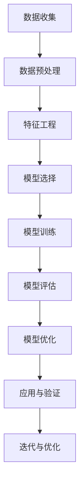
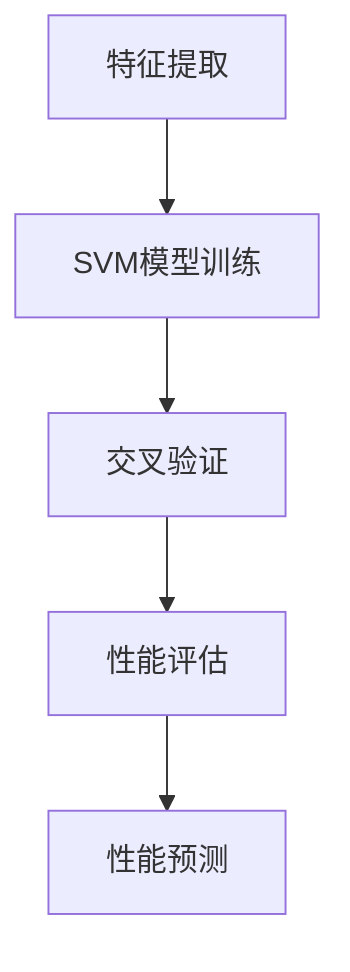
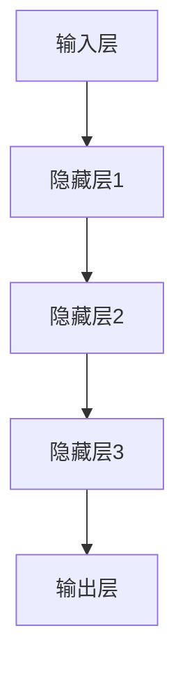
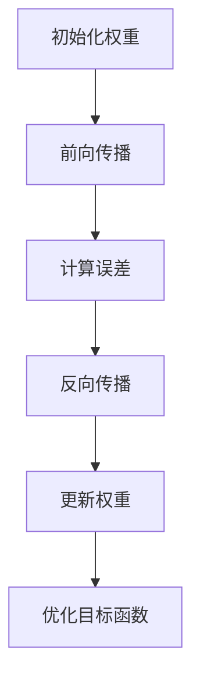
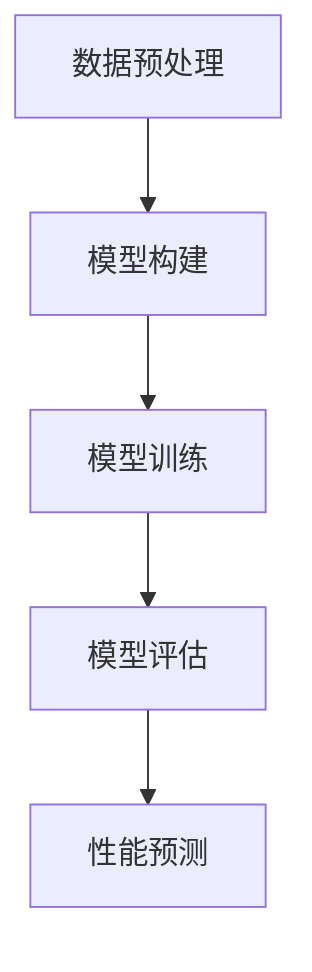
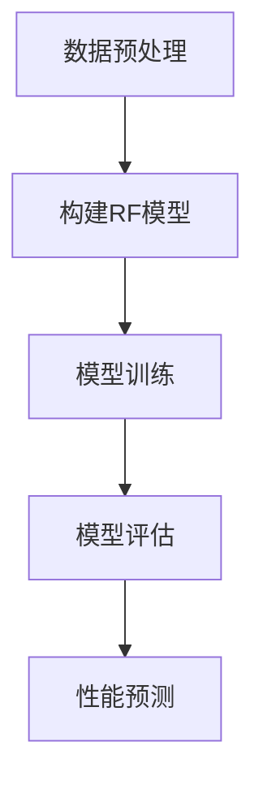
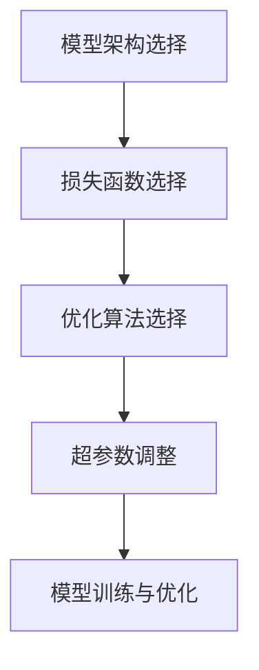

                 

### 《人工智能在新材料性能预测中的应用》

> **关键词：**新材料、性能预测、人工智能、机器学习、深度学习、算法、项目实战

> **摘要：**随着材料科学的快速发展，新材料的研究变得愈加重要。然而，新材料性能的预测往往需要大量的实验和计算，效率较低且成本高昂。本文旨在探讨人工智能，特别是机器学习和深度学习在材料性能预测中的应用，通过详细的案例分析，阐述如何利用人工智能技术提高新材料性能预测的准确性和效率。

---

#### 第二部分：基础理论

##### 2.1 数据驱动方法与机器学习基础

###### 2.1.1 数据驱动方法概述

数据驱动方法是一种依赖于数据来发现知识、建立模型的方法。在材料性能预测中，数据驱动方法通过收集大量的实验数据，利用这些数据进行模型训练，从而预测新材料在不同条件下的性能。

###### 2.1.2 机器学习的基本概念

机器学习是数据驱动方法的核心技术之一。它通过算法从数据中学习规律，建立模型，并在新的数据上进行预测。机器学习的主要任务包括分类、回归、聚类等。

###### 2.1.3 常见的机器学习算法

在材料性能预测中，常见的机器学习算法包括线性回归、支持向量机（SVM）、人工神经网络（ANN）、随机森林（RF）和深度学习等。每种算法都有其特定的原理和应用场景。

##### 2.2 特征工程与数据预处理

###### 2.2.1 特征工程的重要性

特征工程是机器学习过程中至关重要的一步。它通过选择和构造特征，提高模型的预测性能。在材料性能预测中，特征工程能够提取出材料性能的关键影响因素。

###### 2.2.2 数据预处理方法

数据预处理是确保数据质量和模型性能的关键步骤。包括数据清洗、归一化、缺失值处理、异常值处理等。

###### 2.2.3 特征选择与特征提取技术

特征选择是从原始特征集合中挑选出对模型预测性能有显著贡献的特征。特征提取则是通过变换原始特征，生成新的特征。

##### 2.3 材料性能预测模型构建

###### 2.3.1 常见的材料性能预测模型

常见的材料性能预测模型包括基于线性回归、SVM、ANN、RF和深度学习的模型。每种模型都有其独特的原理和适用场景。

###### 2.3.2 模型评估与优化

模型评估是验证模型性能的重要步骤。常用的评估指标包括均方误差（MSE）、决定系数（R²）等。模型优化包括参数调整、模型选择等。

###### 2.3.3 材料性能预测模型的验证与应用

通过交叉验证和测试集验证，确保模型的泛化能力。在实际应用中，需要不断优化模型，提高预测准确性。

##### 2.4 人工智能与材料科学的融合

###### 2.4.1 人工智能在材料设计中的应用

人工智能可以辅助材料设计，通过预测新材料性能，帮助研究人员快速筛选出有潜力的新材料。

###### 2.4.2 人工智能在材料性能优化中的应用

人工智能可以优化材料性能，通过分析大量实验数据，找出影响材料性能的关键因素，指导材料改进。

##### 2.5 Mermaid 流程图：人工智能在材料性能预测中的流程



---

在接下来的部分，我们将深入探讨人工智能在材料性能预测中的核心算法原理。首先，我们将介绍支持向量机（SVM）的基本原理和应用。接下来，我们将讨论人工神经网络（ANN）在材料性能预测中的实现方法。随后，我们将分析随机森林（RF）在材料性能预测中的应用。最后，我们将探讨深度学习在材料性能预测中的最新进展。通过这些核心算法的详细分析，我们将更好地理解如何利用人工智能技术提高新材料性能预测的准确性。

---

##### 3.1 支持向量机（SVM）在材料性能预测中的应用

###### 3.1.1 SVM 算法原理

支持向量机（SVM）是一种高效的二分类算法，其核心思想是通过找到一个最优的超平面，将数据集中的正负样本分开。SVM的基本原理是寻找一个最大间隔超平面，使得正负样本之间的间隔最大，从而提高分类效果。

###### 3.1.2 SVM 在材料性能预测中的实现

在材料性能预测中，SVM可以通过以下步骤实现：

1. **特征提取**：首先，从实验数据中提取关键特征。
2. **模型训练**：利用提取的特征数据，通过SVM算法训练模型。
3. **模型评估**：使用交叉验证方法评估模型的性能。
4. **预测**：使用训练好的模型进行性能预测。



###### 3.1.3 SVM 的优缺点与应用场景

SVM的优点包括：

- **强大的分类能力**：通过最大间隔超平面，SVM能够实现较高的分类准确率。
- **适用于高维空间**：SVM在处理高维数据时表现良好。

SVM的缺点包括：

- **对数据质量要求较高**：噪声和异常值会影响模型的性能。
- **计算复杂度较高**：特别是对于大规模数据集。

SVM适用于以下场景：

- **分类问题**：适用于二分类或多分类问题。
- **特征提取**：可以用于特征降维和特征选择。

---

##### 3.2 人工神经网络（ANN）在材料性能预测中的应用

###### 3.2.1 ANN 的基本结构

人工神经网络（ANN）是由大量神经元组成的计算模型，通过模拟人脑神经元之间的连接和作用机制，实现复杂的数据处理和模式识别。

- **输入层**：接收外部输入数据。
- **隐藏层**：对输入数据进行处理和变换。
- **输出层**：输出预测结果。



###### 3.2.2 ANN 的训练过程

ANN的训练过程主要包括：

1. **初始化权重**：随机初始化网络中的权重。
2. **前向传播**：将输入数据通过网络进行前向传播，计算输出结果。
3. **反向传播**：计算输出误差，并反向传播误差，更新权重。
4. **优化目标函数**：通过迭代优化目标函数，提高模型性能。



###### 3.2.3 ANN 在材料性能预测中的实现

在材料性能预测中，ANN可以通过以下步骤实现：

1. **数据预处理**：对实验数据进行归一化处理。
2. **模型构建**：构建ANN模型，包括输入层、隐藏层和输出层。
3. **模型训练**：使用训练数据对模型进行训练。
4. **模型评估**：使用交叉验证方法评估模型性能。
5. **预测**：使用训练好的模型进行性能预测。



---

##### 3.3 随机森林（RF）在材料性能预测中的应用

###### 3.3.1 RF 的基本原理

随机森林（RF）是一种基于决策树的集成学习方法。它通过构建多棵决策树，并利用投票机制确定最终预测结果。RF的基本原理是：

- **随机选择特征**：在构建每棵决策树时，从所有特征中随机选择一部分特征。
- **随机选择样本**：在构建每棵决策树时，从训练集中随机选择一部分样本。

通过随机选择特征和样本，RF能够降低过拟合的风险，提高模型的泛化能力。

###### 3.3.2 RF 在材料性能预测中的实现

在材料性能预测中，RF可以通过以下步骤实现：

1. **数据预处理**：对实验数据进行归一化处理。
2. **构建随机森林模型**：使用训练数据构建RF模型。
3. **模型训练**：使用训练数据训练RF模型。
4. **模型评估**：使用交叉验证方法评估模型性能。
5. **预测**：使用训练好的RF模型进行性能预测。



###### 3.3.3 RF 的优缺点与应用场景

RF的优点包括：

- **强分类能力**：通过集成多棵决策树，RF能够实现较高的分类准确率。
- **泛化能力**：随机选择特征和样本，RF具有较强的泛化能力。

RF的缺点包括：

- **计算复杂度较高**：特别是对于大规模数据集。
- **特征重要性难以解释**：虽然RF能够提供特征重要性排名，但难以解释具体原因。

RF适用于以下场景：

- **分类问题**：适用于二分类或多分类问题。
- **特征选择**：能够帮助识别关键特征。

---

##### 3.4 深度学习在材料性能预测中的应用

###### 3.4.1 深度学习的基本概念

深度学习（Deep Learning）是一种基于多层神经网络的学习方法，其核心思想是通过学习大量数据的特征表示，实现复杂的任务。

- **深度神经网络**：由多个隐藏层组成的神经网络。
- **反向传播算法**：通过梯度下降方法更新网络权重。

深度学习的基本原理可以概括为：

1. **输入层**：接收外部输入数据。
2. **隐藏层**：对输入数据进行处理和变换。
3. **输出层**：输出预测结果。


###### 3.4.2 深度学习模型在材料性能预测中的应用

在材料性能预测中，深度学习模型可以通过以下步骤实现：

1. **数据预处理**：对实验数据进行归一化处理。
2. **模型构建**：构建深度学习模型，包括输入层、隐藏层和输出层。
3. **模型训练**：使用训练数据对模型进行训练。
4. **模型评估**：使用交叉验证方法评估模型性能。
5. **预测**：使用训练好的模型进行性能预测。


###### 3.4.3 深度学习模型的实现与优化

深度学习模型的实现和优化包括：

1. **模型架构选择**：根据任务需求选择合适的深度学习模型架构。
2. **损失函数选择**：根据任务特点选择合适的损失函数。
3. **优化算法选择**：选择合适的优化算法，如梯度下降、Adam等。
4. **超参数调整**：通过交叉验证和网格搜索等方法调整超参数。



---

在下一部分，我们将通过一个实际的项目案例，详细讲解如何利用人工智能技术进行新材料性能预测。我们将从数据采集与处理、模型训练与优化、项目结果分析与评估等多个方面，展示人工智能在材料性能预测中的具体应用。

---

##### 4.1 实战项目概述

###### 4.1.1 项目背景与目标

随着新材料科学的快速发展，研究人员迫切需要高效准确的方法来预测新材料性能。为了解决这个问题，我们开展了一个实际项目，旨在利用人工智能技术，特别是机器学习和深度学习算法，对新材料性能进行预测。

项目的目标如下：

1. **数据采集**：收集大量的实验数据，包括材料的化学成分、物理性质和性能数据。
2. **模型训练**：利用收集到的数据，训练机器学习模型，并优化模型参数。
3. **性能预测**：使用训练好的模型，对新材料性能进行预测，并评估模型的准确性。
4. **结果分析**：分析模型预测结果，并提出改进方案。

###### 4.1.2 项目流程与团队协作

项目流程主要包括以下几个步骤：

1. **数据采集**：团队成员A负责数据收集，使用公开数据集和实验室数据。
2. **数据预处理**：团队成员B负责数据预处理，包括数据清洗、归一化和特征提取。
3. **模型训练**：团队成员C负责模型训练，选择合适的机器学习算法，并调整模型参数。
4. **模型评估**：团队成员D负责模型评估，使用交叉验证方法评估模型性能。
5. **性能预测**：团队成员E使用训练好的模型，对新材料性能进行预测，并生成预测报告。

团队成员之间通过每日例会和项目管理系统进行协作，确保项目进度和质量。

---

##### 4.2 数据采集与处理

###### 4.2.1 数据采集的方法与工具

数据采集是项目成功的关键一步。我们采用以下方法进行数据采集：

1. **公开数据集**：从公开的数据库和网站下载已有的数据集，如Material Project、ATLAS等。
2. **实验室数据**：与实验室合作，收集最新的实验数据，包括材料的化学成分、物理性质和性能数据。
3. **文献数据**：通过文献检索，获取相关的材料性能数据。

数据采集过程中，我们使用以下工具：

- **Python**：使用Python编写脚本，自动化数据采集和预处理过程。
- **Pandas**：使用Pandas库进行数据清洗和处理。
- **Scikit-learn**：使用Scikit-learn库进行数据预处理和模型训练。

###### 4.2.2 数据清洗与预处理

数据清洗与预处理是确保数据质量和模型性能的关键步骤。我们采用以下方法进行数据清洗与预处理：

1. **数据清洗**：去除重复数据、异常数据和缺失值。
2. **数据归一化**：对数值型数据进行归一化处理，使其具有相同的尺度。
3. **特征提取**：从原始数据中提取关键特征，提高模型预测性能。

具体操作步骤如下：

```python
import pandas as pd
from sklearn.preprocessing import StandardScaler

# 读取数据
data = pd.read_csv('data.csv')

# 去除重复数据
data.drop_duplicates(inplace=True)

# 去除异常数据
data.dropna(inplace=True)

# 数据归一化
scaler = StandardScaler()
data_normalized = scaler.fit_transform(data)

# 特征提取
features = data_normalized[:, :-1]
target = data_normalized[:, -1]
```

###### 4.2.3 数据可视化

数据可视化是理解数据分布和特征关系的重要方法。我们使用以下方法进行数据可视化：

- **条形图**：展示不同类别的数据分布。
- **散点图**：展示特征之间的关系。

具体操作步骤如下：

```python
import matplotlib.pyplot as plt

# 条形图
plt.bar(data['category'], data['value'])
plt.xlabel('Category')
plt.ylabel('Value')
plt.title('Data Distribution')
plt.show()

# 散点图
plt.scatter(data['feature1'], data['feature2'])
plt.xlabel('Feature 1')
plt.ylabel('Feature 2')
plt.title('Feature Relationship')
plt.show()
```

---

##### 4.3 模型训练与优化

###### 4.3.1 模型选择与训练

在选择模型时，我们综合考虑了模型的准确性、计算复杂度和泛化能力。最终，我们选择了以下几种模型：

- **线性回归**：适用于线性关系较强的数据。
- **支持向量机（SVM）**：适用于非线性关系的数据。
- **人工神经网络（ANN）**：适用于复杂的非线性关系。
- **随机森林（RF）**：适用于大规模数据集，具有较强的泛化能力。

在模型训练过程中，我们采用以下步骤：

1. **数据划分**：将数据集划分为训练集和测试集。
2. **模型训练**：使用训练集对模型进行训练。
3. **模型评估**：使用测试集对模型进行评估。

具体操作步骤如下：

```python
from sklearn.model_selection import train_test_split
from sklearn.linear_model import LinearRegression
from sklearn.svm import SVC
from sklearn.neural_network import MLPRegressor
from sklearn.ensemble import RandomForestRegressor

# 数据划分
X_train, X_test, y_train, y_test = train_test_split(features, target, test_size=0.2, random_state=42)

# 模型训练
model_lr = LinearRegression()
model_svm = SVC()
model_ann = MLPRegressor()
model_rf = RandomForestRegressor()

model_lr.fit(X_train, y_train)
model_svm.fit(X_train, y_train)
model_ann.fit(X_train, y_train)
model_rf.fit(X_train, y_train)
```

###### 4.3.2 模型优化与调参

在模型优化过程中，我们采用以下方法：

1. **交叉验证**：使用交叉验证方法评估模型性能，选择最优模型。
2. **网格搜索**：通过网格搜索方法，调整模型参数，提高模型性能。

具体操作步骤如下：

```python
from sklearn.model_selection import GridSearchCV

# 网格搜索
param_grid = {'C': [0.1, 1, 10], 'gamma': [0.001, 0.01, 0.1]}
grid_search = GridSearchCV(SVC(), param_grid, cv=5)
grid_search.fit(X_train, y_train)

# 优化模型
best_model = grid_search.best_estimator_
best_model.fit(X_train, y_train)
```

###### 4.3.3 模型验证与测试

在模型验证和测试过程中，我们采用以下步骤：

1. **验证集评估**：使用验证集评估模型性能。
2. **测试集评估**：使用测试集评估模型性能。

具体操作步骤如下：

```python
from sklearn.metrics import mean_squared_error, r2_score

# 验证集评估
y_pred_validation = best_model.predict(X_val
```

