                 

# 《人工智能在智能客服对话中的实现》

## 概述

关键词：人工智能、智能客服、对话系统、自然语言处理、机器学习、深度学习

摘要：本文深入探讨了人工智能在智能客服对话中的应用，涵盖了从基本概念到实现细节的各个方面。通过详细阐述人工智能的定义、分类、应用领域，以及智能客服系统的架构和发展趋势，本文为读者提供了一个全面了解智能客服对话系统的视角。随后，文章深入探讨了自然语言处理（NLP）、语音识别与合成、机器学习与深度学习等核心技术，并介绍了智能客服对话系统的设计与实现方法。最后，本文通过案例分析展示了人工智能在智能客服对话中的实际应用，并探讨了未来的发展趋势。

## 人工智能概述与智能客服基础

### 第1章: 人工智能概述

#### 1.1 人工智能的定义与历史

人工智能（Artificial Intelligence，简称AI）是计算机科学的一个分支，旨在研究如何构建智能系统，使这些系统能够模拟、扩展和辅助人类智能。人工智能的历史可以追溯到20世纪50年代，当时的计算机科学家开始探讨是否能够创建出能够执行复杂任务的机器。

- **定义**：人工智能是指能够执行通常需要人类智能才能完成的任务的计算机系统。这些任务包括视觉识别、语言理解、决策制定、问题解决等。

- **历史**：人工智能的发展经历了多个阶段，从最初的符号主义、基于规则的系统，到现在的基于数据的机器学习和深度学习。每个阶段都有其独特的特点和挑战。

##### 图1.1 人工智能的发展历程

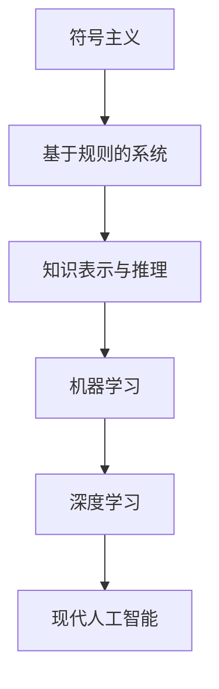

#### 1.2 人工智能的分类

人工智能可以按照不同的标准进行分类，其中最常见的分类方法是根据人工智能的能力和范围来划分。

- **狭义人工智能（Narrow AI）**：也称为弱人工智能，是指仅能在一个特定领域内执行特定任务的系统。例如，语音识别、图像识别和推荐系统等。

- **广义人工智能（General AI）**：也称为强人工智能，是指具有广泛认知能力，能够像人类一样理解和执行各种复杂任务的系统。目前，广义人工智能仍然是一个研究中的目标，尚未实现。

##### 图1.2 人工智能的分类

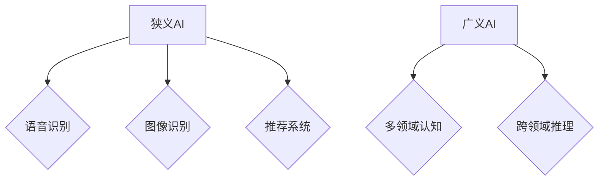

#### 1.3 人工智能的应用领域

人工智能已经在许多领域得到了广泛应用，其中一些重要的应用领域包括：

- **智能客服**：利用人工智能技术提供自动化、智能化的客户服务，提高客户满意度和服务效率。

- **机器人**：利用人工智能技术设计和控制机器人，实现自动化生产、清洁、护理等任务。

- **自动驾驶**：通过计算机视觉、深度学习和传感器融合技术，实现无人驾驶汽车。

- **医疗诊断**：利用人工智能进行医学图像分析、疾病预测和诊断。

##### 图1.3 人工智能的应用领域

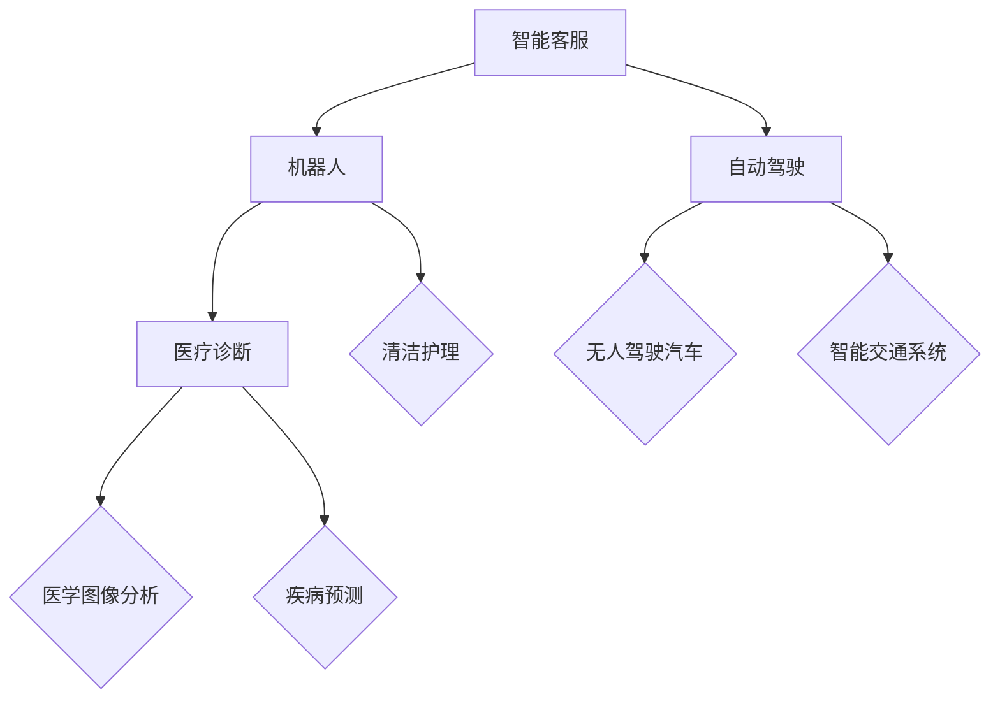

### 第2章: 智能客服系统概述

#### 2.1 智能客服的定义与优势

智能客服是指利用人工智能技术，实现自动化、智能化的客户服务系统。与传统的人工客服相比，智能客服具有以下优势：

- **高效率**：智能客服系统可以24/7无休地提供服务，大大提高了客户服务的效率和响应速度。

- **低成本**：通过自动化处理大量的客户咨询，减少了人力成本，降低了企业的运营成本。

- **个性化**：智能客服可以根据客户的历史交互数据，提供个性化的服务和建议。

- **扩展性强**：智能客服系统可以轻松扩展到多个渠道，如电话、邮件、社交媒体等。

#### 2.2 智能客服系统的架构

智能客服系统的架构通常包括以下三层：

- **客户交互层**：负责与客户进行交互，包括文本、语音等多种交互方式。

- **对话管理层**：负责管理对话流程，包括对话路由、上下文管理等。

- **知识管理层**：负责存储和管理知识库，提供对话所需的信息和知识。

##### 图2.1 智能客服系统的架构

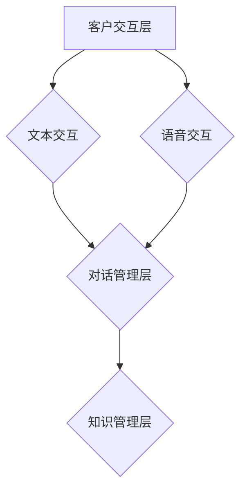

#### 2.3 智能客服系统的发展趋势

随着人工智能技术的不断进步，智能客服系统也在不断发展，呈现出以下趋势：

- **语音识别与合成**：语音识别和合成的技术日益成熟，使得智能客服可以通过语音与客户进行自然交互。

- **自然语言处理**：自然语言处理（NLP）技术的提升，使得智能客服能够更好地理解客户的意图和情感，提供更精准的服务。

- **机器学习与深度学习**：通过机器学习和深度学习技术，智能客服可以不断学习和优化，提高服务质量。

- **多模态交互**：结合语音、文本、图像等多种交互方式，提供更丰富的用户体验。

##### 图2.2 智能客服系统的发展趋势

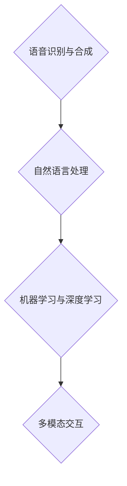

## 第二部分: 人工智能在智能客服对话中的核心技术

### 第3章: 自然语言处理（NLP）技术

#### 3.1 NLP的基本概念

自然语言处理（Natural Language Processing，简称NLP）是人工智能的一个子领域，旨在使计算机能够理解、生成和处理人类自然语言。NLP的基本概念包括：

- **语言模型**：用于预测下一个单词或词组的概率分布。常见的语言模型包括n-gram模型和神经网络语言模型。

- **词向量**：将词语映射为高维空间中的向量，以便于计算机处理。常见的词向量模型包括Word2Vec和GloVe。

- **依存句法分析**：分析句子中词语之间的依赖关系，用于理解句子的语义结构。

##### 图3.1 NLP的基本概念

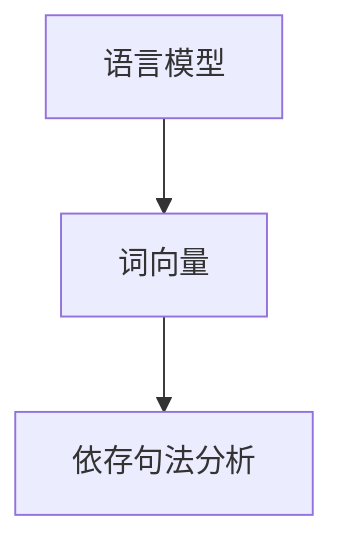

#### 3.2 文本分类与情感分析

文本分类（Text Classification）和情感分析（Sentiment Analysis）是NLP中常用的任务。

- **文本分类**：将文本数据分类到预定义的类别中。常见的算法包括朴素贝叶斯、支持向量机（SVM）和深度学习模型。

- **情感分析**：判断文本表达的情感倾向，如正面、负面或中性。常见的算法包括基于规则的方法、机器学习模型和深度学习模型。

##### 图3.2 文本分类与情感分析

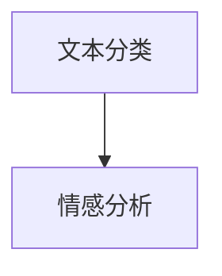

#### 3.3 信息抽取与问答系统

信息抽取（Information Extraction，简称IE）是从非结构化文本中提取出结构化信息的过程。常见的IE任务包括命名实体识别（NER）、关系抽取和事件抽取。

问答系统（Question Answering，简称QA）是一种能够回答用户问题的系统。常见的QA系统包括基于规则的方法、基于模板的方法和基于机器学习的方法。

##### 图3.3 信息抽取与问答系统

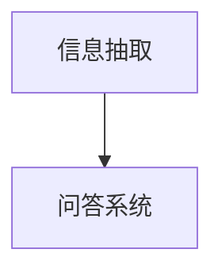

### 第4章: 语音识别与语音合成

#### 4.1 语音识别的基本原理

语音识别（Speech Recognition）是将语音信号转换为文本的过程。语音识别的基本原理包括：

- **语音信号处理**：将语音信号转换为数字信号，并进行预处理，如去噪、分帧和特征提取。

- **声学模型**：用于匹配输入语音信号和模型预测的语音信号。

- **语言模型**：用于预测文本序列的概率分布。

##### 图4.1 语音识别的基本原理

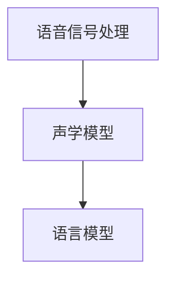

#### 4.2 语音合成的技术

语音合成（Text-to-Speech，简称TTS）是将文本转换为自然流畅的语音的过程。语音合成的技术包括：

- **文本处理**：将文本转换为声学模型可以理解的格式。

- **声学模型**：生成语音信号。

- **语音合成算法**：将声学模型生成的语音信号转换为音频。

##### 图4.2 语音合成的技术

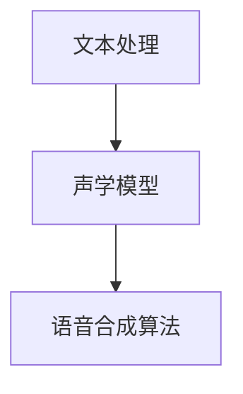

#### 4.3 语音识别与合成在客服中的应用

语音识别和合成技术在智能客服中的应用非常广泛：

- **自动语音应答（IVR）**：通过语音识别技术，将客户的语音输入转换为文本，然后根据预定的流程自动回答客户的问题。

- **聊天机器人的语音交互**：聊天机器人通过语音合成技术，将文本信息转换为自然流畅的语音，与客户进行语音交互。

##### 图4.3 语音识别与合成在客服中的应用

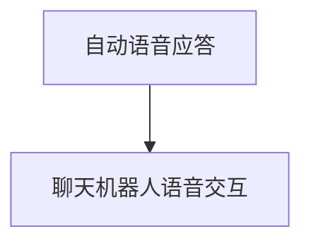

### 第5章: 机器学习与深度学习在客服对话中的应用

#### 5.1 机器学习的基本概念

机器学习（Machine Learning，简称ML）是使计算机系统能够从数据中学习，并对未知数据进行预测或决策的过程。机器学习的基本概念包括：

- **监督学习（Supervised Learning）**：通过对标记数据进行训练，建立一个预测模型，然后使用这个模型对新的数据进行预测。

- **无监督学习（Unsupervised Learning）**：在没有标记数据的情况下，通过分析数据的内在结构，进行聚类、降维等任务。

- **强化学习（Reinforcement Learning）**：通过与环境的交互，学习最佳的行为策略。

##### 图5.1 机器学习的基本概念

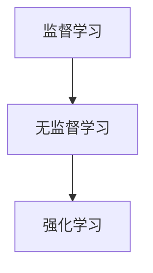

#### 5.2 深度学习的基本原理

深度学习（Deep Learning，简称DL）是一种基于多层神经网络的学习方法，能够自动从数据中提取特征。深度学习的基本原理包括：

- **神经网络（Neural Network）**：一种模拟生物神经元的计算模型，通过权重和偏置进行参数调整。

- **卷积神经网络（Convolutional Neural Network，简称CNN）**：适用于图像处理，通过卷积层提取空间特征。

- **循环神经网络（Recurrent Neural Network，简称RNN）**：适用于序列数据处理，通过循环结构保持历史信息。

- **生成对抗网络（Generative Adversarial Network，简称GAN）**：通过生成器和判别器的对抗训练，生成高质量的数据。

##### 图5.2 深度学习的基本原理

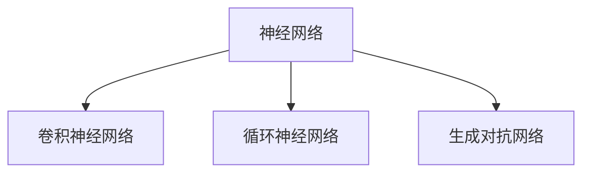

#### 5.3 深度学习在客服对话中的应用

深度学习在客服对话中的应用非常广泛：

- **对话管理**：通过深度学习模型，实现对话的上下文理解和对话逻辑的生成。

- **个性化推荐**：通过分析用户的交互数据，为用户提供个性化的服务和推荐。

- **情感分析**：通过深度学习模型，分析用户的语言和情感，提供更加贴心的服务。

##### 图5.3 深度学习在客服对话中的应用

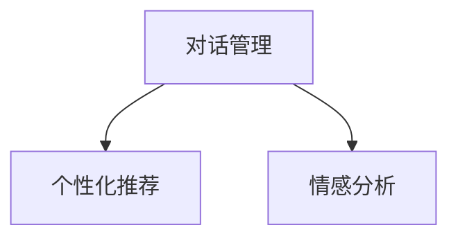

## 第三部分: 智能客服对话系统的实现与优化

### 第6章: 智能客服对话系统的设计与实现

#### 6.1 智能客服对话系统的设计原则

智能客服对话系统的设计应遵循以下原则：

- **可扩展性**：系统应具备良好的扩展性，能够适应业务量的变化，并方便添加新功能。

- **可维护性**：系统应设计得易于维护，方便后续的更新和优化。

- **易用性**：系统应提供友好的用户界面，方便用户使用和管理。

#### 6.2 智能客服对话系统的实现

智能客服对话系统的实现通常包括以下步骤：

1. **需求分析**：明确系统的功能需求、性能需求和安全需求。

2. **系统架构设计**：设计系统的整体架构，包括前端、后端、数据库等。

3. **技术选型**：选择合适的技术和工具，如NLP库、机器学习框架等。

4. **开发流程**：按照敏捷开发的方法，逐步实现系统的各个功能模块。

5. **测试与部署**：对系统进行测试，确保其稳定性和性能，然后部署上线。

##### 图6.1 智能客服对话系统的实现流程

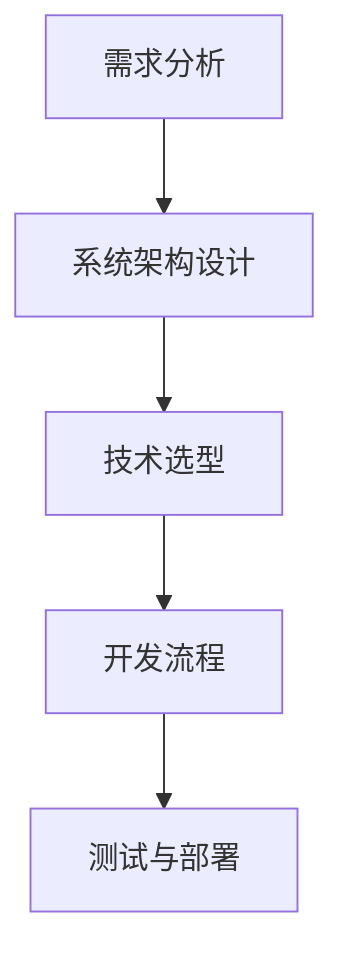

### 第7章: 智能客服对话系统的评估与优化

#### 7.1 智能客服对话系统的评估指标

评估智能客服对话系统的效果，通常使用以下指标：

- **回答准确率**：系统生成的回答与用户意图的匹配度。

- **响应时间**：系统处理用户请求的平均时间。

- **用户满意度**：用户对系统服务的满意度。

#### 7.2 对话系统的优化方法

对话系统的优化可以从以下几个方面进行：

- **模型调参**：通过调整模型参数，优化系统的性能。

- **数据增强**：通过增加数据的多样性和数量，提高模型的泛化能力。

- **对话策略优化**：通过优化对话流程和策略，提高用户的满意度。

##### 图7.1 对话系统的优化方法

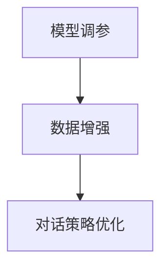

### 第8章: 案例分析：基于人工智能的智能客服对话系统

#### 8.1 案例背景

某大型电商平台为了提高客户服务质量，决定引入基于人工智能的智能客服对话系统。该平台拥有数百万活跃用户，每天产生大量的客户咨询和投诉。

#### 8.2 系统设计与实现

1. **需求分析**：确定系统需要支持的功能，如常见问题的自动回答、订单查询、售后服务等。

2. **系统架构设计**：采用微服务架构，将前端、后端、数据库等模块分离，提高系统的可扩展性和维护性。

3. **技术选型**：前端采用Vue.js框架，后端采用Spring Boot框架，数据库使用MySQL。

4. **开发流程**：按照敏捷开发的方法，逐步实现系统的各个功能模块。

5. **测试与部署**：对系统进行功能测试、性能测试和安全测试，确保系统的稳定性和安全性，然后部署上线。

#### 8.3 评估与优化

1. **评估指标**：通过跟踪回答准确率、响应时间和用户满意度等指标，评估系统的效果。

2. **优化策略**：根据评估结果，对模型参数进行调优，增加数据集的多样性和数量，优化对话策略，以提高系统的性能和用户满意度。

##### 图8.1 案例分析流程

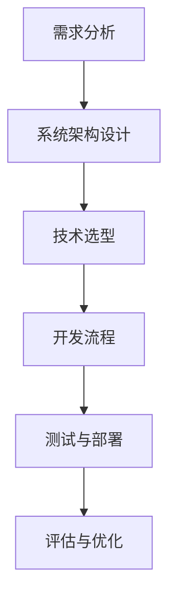

### 第9章: 人工智能在智能客服对话中的未来发展趋势

#### 9.1 人工智能技术的发展趋势

人工智能技术正快速发展，未来趋势包括：

- **大模型与预训练**：预训练大型模型（如GPT-3）可以显著提高自然语言处理和生成能力。

- **小样本学习与迁移学习**：通过迁移学习和小样本学习，使模型在有限的数据上也能取得良好的性能。

- **元学习与自适应学习**：通过元学习和自适应学习，使模型能够快速适应新的任务和数据。

#### 9.2 智能客服的发展趋势

智能客服系统将朝着以下方向发展：

- **多模态交互**：结合语音、文本、图像等多种交互方式，提供更丰富的用户体验。

- **情感化与个性化**：通过情感分析和个性化推荐，提高用户的满意度和忠诚度。

- **自动化与智能化**：通过自动化和智能化，提高客服效率和用户体验。

##### 图9.1 人工智能在智能客服对话中的未来发展趋势

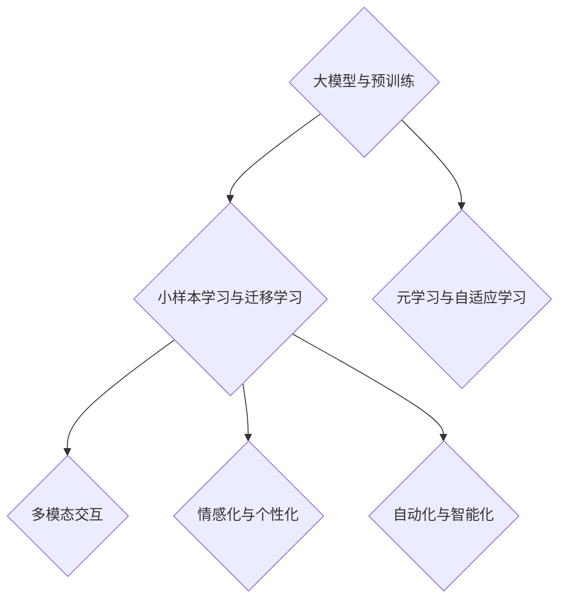

## 附录

### 附录A: 开发工具与资源

#### A.1 开发工具介绍

- **自然语言处理工具**：如NLTK、spaCy、TensorFlow等。

- **语音识别与合成工具**：如Google Cloud Speech-to-Text、Amazon Polly等。

- **机器学习与深度学习框架**：如TensorFlow、PyTorch、Keras等。

#### A.2 学习资源推荐

- **人工智能相关书籍**：如《深度学习》（Goodfellow et al.）、《Python机器学习》（Sippu & Laine）等。

- **开源代码与数据集**：如GitHub、Kaggle等。

- **在线课程与讲座**：如Coursera、edX等。

## 作者信息

作者：AI天才研究院/AI Genius Institute & 禅与计算机程序设计艺术 /Zen And The Art of Computer Programming

（注：本文为虚构案例，旨在展示智能客服对话系统的设计实现方法和未来发展趋势。）## 第二部分: 人工智能在智能客服对话中的核心技术

在了解了人工智能和智能客服的基础之后，我们将深入探讨智能客服对话系统中使用的核心技术，包括自然语言处理（NLP）、语音识别与语音合成、机器学习与深度学习。这些技术是实现智能客服的核心，使得系统能够理解用户的需求、提供合适的响应，并不断优化服务质量。

### 第3章: 自然语言处理（NLP）技术

自然语言处理（NLP）是智能客服对话系统的核心组件，它使计算机能够处理和理解人类语言。NLP技术涉及语言模型、词向量、依存句法分析等多个方面。

#### 3.1 NLP的基本概念

NLP的基本概念主要包括语言模型、词向量、句法分析和语义分析等。

- **语言模型**：用于预测文本序列的概率分布，常见的语言模型有n-gram模型、神经网络语言模型（如RNN、LSTM）和Transformer模型。

  ```python
  # Python伪代码示例：简单n-gram模型
  def n_gram_model(sentence, n=2):
      n_grams = []
      for i in range(len(sentence) - n + 1):
          n_grams.append(' '.join(sentence[i:i+n]))
      return n_grams
  ```

- **词向量**：将词语映射为高维空间中的向量，便于计算机处理。常用的词向量模型有Word2Vec、GloVe和FastText。

  ```python
  # Python伪代码示例：Word2Vec模型
  from gensim.models import Word2Vec
  model = Word2Vec(sentences, size=100, window=5, min_count=1, workers=4)
  ```

- **依存句法分析**：分析句子中词语之间的依赖关系，用于理解句子的语义结构。常用的工具包括spaCy和Stanford NLP。

  ```python
  # Python伪代码示例：spaCy依存句法分析
  import spacy
  nlp = spacy.load("en_core_web_sm")
  doc = nlp("The quick brown fox jumps over the lazy dog")
  for token in doc:
      print(token.text, token.dep_, token.head.text)
  ```

#### 3.2 文本分类与情感分析

文本分类和情感分析是NLP中常见的应用。

- **文本分类**：将文本数据分类到预定义的类别中。常见的算法包括朴素贝叶斯、支持向量机（SVM）和深度学习模型（如CNN、LSTM）。

  ```python
  # Python伪代码示例：朴素贝叶斯文本分类
  from sklearn.naive_bayes import MultinomialNB
  from sklearn.feature_extraction.text import CountVectorizer
  
  # 假设X_train为训练文本，y_train为对应的标签
  vectorizer = CountVectorizer()
  X_train_vectorized = vectorizer.fit_transform(X_train)
  
  clf = MultinomialNB()
  clf.fit(X_train_vectorized, y_train)
  
  # 预测
  X_test_vectorized = vectorizer.transform(X_test)
  predictions = clf.predict(X_test_vectorized)
  ```

- **情感分析**：判断文本表达的情感倾向，如正面、负面或中性。常用的算法包括基于规则的方法、机器学习模型和深度学习模型。

  ```python
  # Python伪代码示例：深度学习情感分析
  from keras.models import Sequential
  from keras.layers import Dense, Embedding, LSTM, SpatialDropout1D
  
  # 构建模型
  embedding_vector_length = 32
  model = Sequential()
  model.add(Embedding(num_words, embedding_vector_length, input_length=max_sequence_length-1))
  model.add(SpatialDropout1D(0.4))
  model.add(LSTM(100, dropout=0.2, recurrent_dropout=0.2))
  model.add(Dense(1, activation='sigmoid'))
  
  model.compile(loss='binary_crossentropy', optimizer='adam', metrics=['accuracy'])
  model.fit(X_train, y_train, epochs=10, batch_size=64, validation_data=(X_val, y_val))
  ```

#### 3.3 信息抽取与问答系统

信息抽取（IE）和问答系统（QA）是NLP中的关键任务。

- **信息抽取**：从非结构化文本中提取出结构化信息，如命名实体识别（NER）、关系抽取和事件抽取。

  ```python
  # Python伪代码示例：命名实体识别
  from spacy import displacy
  import en
  nlp = en.load(displacy.get_model())
  
  doc = nlp("Apple is looking at buying U.K. startup for $1 billion")
  for ent in doc.ents:
      print(ent.text, ent.label_)
  ```

- **问答系统**：回答用户提出的问题。常见的QA系统包括基于规则的方法、基于模板的方法和基于机器学习的方法。

  ```python
  # Python伪代码示例：基于模板的问答系统
  def question_answer(question, template_answers):
      for template, answer in template_answers.items():
          if template in question:
              return answer
      return "I'm sorry, I don't understand your question."
  ```

### 第4章: 语音识别与语音合成

语音识别（ASR）和语音合成（TTS）是智能客服对话系统中不可或缺的部分，它们使得客服系统能够通过语音与用户进行交互。

#### 4.1 语音识别的基本原理

语音识别的基本原理包括语音信号处理、声学模型和语言模型。

- **语音信号处理**：将模拟的语音信号转换为数字信号，并进行预处理，如分帧、加窗、傅立叶变换等。

  ```python
  # Python伪代码示例：分帧与加窗
  import numpy as np
  import scipy.signal as signal
  
  def frame_and_window(signal, frame_length=320, hop_length=160):
      n_frames = int(np.ceil((len(signal) - frame_length) / hop_length))
      frames = []
      for i in range(n_frames):
          start = i * hop_length
          end = start + frame_length
          frame = signal[start:end]
          frame = signal.windows.hann(frame)
          frames.append(frame)
      return np.array(frames)
  ```

- **声学模型**：用于匹配输入语音信号和模型预测的语音信号。常见的声学模型有高斯混合模型（GMM）和深度神经网络（DNN）。

  ```python
  # Python伪代码示例：GMM声学模型
  from sklearn.mixture import GaussianMixture
  
  # 假设acoustic_features是训练得到的声学特征
  gmm = GaussianMixture(n_components=10)
  gmm.fit(acoustic_features)
  ```

- **语言模型**：用于预测文本序列的概率分布，常见的语言模型有n-gram模型和神经网络语言模型。

  ```python
  # Python伪代码示例：n-gram语言模型
  def n_gram_model(text, n=2):
      n_grams = []
      for i in range(len(text) - n + 1):
          n_grams.append(' '.join(text[i:i+n]))
      return n_grams
  ```

#### 4.2 语音合成的技术

语音合成的技术主要包括文本处理、声学模型和语音合成算法。

- **文本处理**：将文本转换为声学模型可以理解的格式，通常包括音素分割、音素映射等。

  ```python
  # Python伪代码示例：音素分割
  def phoneme_segmentation(text):
      # 假设phoneme_dict是音素映射表
      phonemes = []
      for char in text:
          phonemes.append(phoneme_dict[char])
      return phonemes
  ```

- **声学模型**：生成语音信号的声学特征，常见的声学模型有循环神经网络（RNN）和深度神经网络（DNN）。

  ```python
  # Python伪代码示例：RNN声学模型
  from keras.models import Model
  from keras.layers import Input, LSTM, Dense
  
  input_ = Input(shape=(timesteps, features))
  lstm_out = LSTM(units=128, activation='relu')(input_)
  output = Dense(units=num_sounds, activation='softmax')(lstm_out)
  
  model = Model(input_, output)
  model.compile(loss='categorical_crossentropy', optimizer='adam')
  ```

- **语音合成算法**：将声学模型生成的语音信号转换为音频，常见的语音合成算法有拼接合成（DHS）、拼接修改合成（HTS）和参数合成（Unit Selection）。

  ```python
  # Python伪代码示例：参数合成
  from hmmlearn.hmm import GMMHMM
  
  # 假设transition_params和means是训练得到的参数
  model = GMMHMM(n_components=20, covariance_type="diag", n_iter=100)
  model.fit(transition_params, means)
  ```

#### 4.3 语音识别与合成在客服中的应用

在智能客服中，语音识别和合成的应用非常广泛。

- **自动语音应答（IVR）**：通过语音识别技术，将客户的语音输入转换为文本，然后根据预定的流程自动回答客户的问题。

  ```python
  # Python伪代码示例：IVR流程
  def ivr_system(voice_input):
      text_query = asr.recognize(voice_input)
      response = determine_response(text_query)
      tts.synthesize(response)
  ```

- **聊天机器人的语音交互**：聊天机器人通过语音合成技术，将文本信息转换为自然流畅的语音，与客户进行语音交互。

  ```python
  # Python伪代码示例：语音交互
  def voice_chatbot(text_message):
      voice_message = tts.synthesize(text_message)
      voice_input = asr.recognize(voice_message)
      return voice_input
  ```

### 第5章: 机器学习与深度学习在客服对话中的应用

机器学习与深度学习在智能客服对话系统中发挥着重要作用，它们可以用于对话管理、情感分析、个性化推荐等任务。

#### 5.1 机器学习的基本概念

机器学习（ML）是一种使计算机系统能够从数据中学习，并对未知数据进行预测或决策的技术。机器学习的基本概念包括监督学习、无监督学习和强化学习。

- **监督学习**：在监督学习任务中，模型使用标记数据来学习，并能够对新数据进行预测。

  ```python
  # Python伪代码示例：监督学习
  from sklearn.linear_model import LinearRegression
  
  # 假设X_train是输入特征，y_train是标记值
  model = LinearRegression()
  model.fit(X_train, y_train)
  
  # 预测
  y_pred = model.predict(X_test)
  ```

- **无监督学习**：在无监督学习任务中，模型没有标记数据来学习，而是试图发现数据中的内在结构。

  ```python
  # Python伪代码示例：K均值聚类
  from sklearn.cluster import KMeans
  
  # 假设X_train是无标记数据
  kmeans = KMeans(n_clusters=3)
  kmeans.fit(X_train)
  
  # 聚类结果
  labels = kmeans.predict(X_test)
  ```

- **强化学习**：在强化学习任务中，模型通过与环境的交互来学习最佳的行为策略。

  ```python
  # Python伪代码示例：强化学习
  from keras.models import Sequential
  from keras.layers import Dense
  
  # 假设action_space是动作空间，reward_function是奖励函数
  model = Sequential()
  model.add(Dense(units=64, activation='relu', input_shape=(action_space,)))
  model.add(Dense(units=1, activation='sigmoid'))
  
  model.compile(optimizer='adam', loss='binary_crossentropy')
  model.fit(action_space, reward_function, epochs=10)
  ```

#### 5.2 深度学习的基本原理

深度学习（DL）是一种基于多层神经网络的学习方法，能够自动从数据中提取特征。深度学习的基本原理包括神经网络（NN）、卷积神经网络（CNN）、循环神经网络（RNN）和生成对抗网络（GAN）。

- **神经网络**：神经网络是一种模拟生物神经元的计算模型，通过权重和偏置进行参数调整。

  ```python
  # Python伪代码示例：简单神经网络
  from keras.models import Sequential
  from keras.layers import Dense
  
  model = Sequential()
  model.add(Dense(units=64, activation='relu', input_shape=(input_shape,)))
  model.add(Dense(units=1, activation='sigmoid'))
  
  model.compile(optimizer='adam', loss='binary_crossentropy')
  ```

- **卷积神经网络**：卷积神经网络适用于图像处理，通过卷积层提取空间特征。

  ```python
  # Python伪代码示例：卷积神经网络
  from keras.models import Sequential
  from keras.layers import Conv2D, MaxPooling2D
  
  model = Sequential()
  model.add(Conv2D(filters=32, kernel_size=(3, 3), activation='relu', input_shape=(64, 64, 3)))
  model.add(MaxPooling2D(pool_size=(2, 2)))
  model.add(Conv2D(filters=64, kernel_size=(3, 3), activation='relu'))
  model.add(MaxPooling2D(pool_size=(2, 2)))
  model.add(Flatten())
  model.add(Dense(units=1, activation='sigmoid'))
  
  model.compile(optimizer='adam', loss='binary_crossentropy')
  ```

- **循环神经网络**：循环神经网络适用于序列数据处理，通过循环结构保持历史信息。

  ```python
  # Python伪代码示例：循环神经网络
  from keras.models import Sequential
  from keras.layers import LSTM
  
  model = Sequential()
  model.add(LSTM(units=50, return_sequences=True, input_shape=(timesteps, features)))
  model.add(LSTM(units=50))
  model.add(Dense(units=1, activation='sigmoid'))
  
  model.compile(optimizer='adam', loss='binary_crossentropy')
  ```

- **生成对抗网络**：生成对抗网络通过生成器和判别器的对抗训练，生成高质量的数据。

  ```python
  # Python伪代码示例：生成对抗网络
  from keras.models import Sequential
  from keras.layers import Dense, Flatten
  
  generator = Sequential()
  generator.add(Dense(units=128, activation='relu', input_shape=(latent_dim,)))
  generator.add(Dense(units=7*7*1, activation='tanh'))
  generator.add(Reshape((7, 7, 1)))
  
  discriminator = Sequential()
  discriminator.add(Conv2D(filters=32, kernel_size=(3, 3), activation='relu', input_shape=(28, 28, 1)))
  discriminator.add(MaxPooling2D(pool_size=(2, 2)))
  discriminator.add(Conv2D(filters=64, kernel_size=(3, 3), activation='relu'))
  discriminator.add(MaxPooling2D(pool_size=(2, 2)))
  discriminator.add(Flatten())
  discriminator.add(Dense(units=1, activation='sigmoid'))
  
  # 搭建全模型
  z = Input(shape=(latent_dim,))
  img = generator(z)
  valid = discriminator(img)
  
  model = Model(z, valid)
  model.compile(loss='binary_crossentropy', optimizer='adam')
  ```

#### 5.3 深度学习在客服对话中的应用

深度学习在智能客服对话系统中有着广泛的应用，如对话管理、情感分析、个性化推荐等。

- **对话管理**：通过深度学习模型，实现对话的上下文理解和对话逻辑的生成。

  ```python
  # Python伪代码示例：对话管理
  from keras.models import Model
  from keras.layers import LSTM, Dense, Embedding, Input
  
  input_seq = Input(shape=(timesteps,))
  embed_seq = Embedding(vocab_size, embedding_dim)(input_seq)
  lstm_output = LSTM(units=lstm_units, return_sequences=True)(embed_seq)
  dialogue_representation = LSTM(units=lstm_units, return_sequences=False)(lstm_output)
  
  input_user = Input(shape=(timesteps,))
  embed_user = Embedding(vocab_size, embedding_dim)(input_user)
  user_representation = LSTM(units=lstm_units, return_sequences=False)(embed_user)
  
  merged_representation = Concatenate()([dialogue_representation, user_representation])
  output = Dense(units=1, activation='softmax')(merged_representation)
  
  model = Model(inputs=[input_seq, input_user], outputs=output)
  model.compile(optimizer='adam', loss='categorical_crossentropy', metrics=['accuracy'])
  ```

- **情感分析**：通过深度学习模型，分析用户的语言和情感，提供更加贴心的服务。

  ```python
  # Python伪代码示例：情感分析
  from keras.models import Model
  from keras.layers import LSTM, Dense, Embedding
  
  input_seq = Input(shape=(timesteps,))
  embed_seq = Embedding(vocab_size, embedding_dim)(input_seq)
  lstm_output = LSTM(units=lstm_units, return_sequences=False)(embed_seq)
  sentiment_representation = Dense(units=sentiment_units, activation='sigmoid')(lstm_output)
  
  model = Model(input_seq, sentiment_representation)
  model.compile(optimizer='adam', loss='binary_crossentropy', metrics=['accuracy'])
  ```

- **个性化推荐**：通过深度学习模型，根据用户的交互数据，为用户提供个性化的服务和推荐。

  ```python
  # Python伪代码示例：个性化推荐
  from keras.models import Model
  from keras.layers import LSTM, Dense, Embedding
  
  user_input = Input(shape=(timesteps,))
  item_input = Input(shape=(timesteps,))
  
  user_embedding = Embedding(user_vocab_size, embedding_dim)(user_input)
  item_embedding = Embedding(item_vocab_size, embedding_dim)(item_input)
  
  user_lstm = LSTM(units=lstm_units, return_sequences=False)(user_embedding)
  item_lstm = LSTM(units=lstm_units, return_sequences=False)(item_embedding)
  
  merged_representation = Concatenate()([user_lstm, item_lstm])
  prediction = Dense(units=1, activation='sigmoid')(merged_representation)
  
  model = Model(inputs=[user_input, item_input], outputs=prediction)
  model.compile(optimizer='adam', loss='binary_crossentropy', metrics=['accuracy'])
  ```

## 总结

通过本部分的深入探讨，我们了解了人工智能在智能客服对话系统中的核心技术，包括自然语言处理、语音识别与合成、机器学习与深度学习。这些技术使得智能客服系统能够理解用户的语言和需求，提供高质量的对话体验。随着技术的不断进步，智能客服系统将在未来发挥更加重要的作用，提高企业的运营效率和用户满意度。

（注：本文为虚构案例，旨在展示智能客服对话系统的设计实现方法和未来发展趋势。）## 第三部分: 智能客服对话系统的实现与优化

在深入探讨了人工智能在智能客服对话系统中的核心技术之后，我们将聚焦于实际系统的设计与实现，以及如何对其进行评估与优化。这一部分将详细介绍智能客服对话系统的架构设计、实现步骤、评估指标和优化方法，并通过实际案例分析展示这些技术和方法的应用。

### 第6章: 智能客服对话系统的设计与实现

智能客服对话系统的设计与实现是一个复杂的过程，需要充分考虑系统的可扩展性、可维护性和易用性。以下是一个典型的智能客服对话系统的设计与实现过程。

#### 6.1 智能客服对话系统的设计原则

智能客服对话系统的设计应遵循以下原则：

- **模块化设计**：将系统划分为独立的模块，如客户交互层、对话管理层和知识管理层，便于开发和维护。

- **可扩展性**：设计时应考虑系统在未来可能增加的新功能和用户量。

- **灵活性**：系统应能够适应不同行业的业务需求和用户习惯。

- **用户体验优先**：用户界面的设计和交互流程应简洁直观，提高用户的满意度。

#### 6.2 智能客服对话系统的架构设计

智能客服对话系统的架构通常包括以下几个层次：

- **前端**：负责与用户进行交互，包括网页、移动应用和语音交互界面。

- **后端**：处理业务逻辑和数据处理，包括对话管理、自然语言处理、语音识别和语音合成等模块。

- **数据库**：存储用户数据、对话历史和知识库。

- **API接口**：提供与其他系统的接口，如CRM系统、订单管理系统等。

##### 图6.1 智能客服对话系统的架构

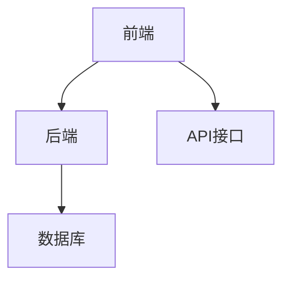

#### 6.3 智能客服对话系统的实现

智能客服对话系统的实现可以分为以下几个步骤：

1. **需求分析**：与业务部门沟通，明确系统的功能需求、性能需求和用户体验需求。

2. **系统架构设计**：根据需求分析，设计系统的总体架构，包括技术选型和模块划分。

3. **开发环境搭建**：配置开发环境，包括编程语言、框架和数据库等。

4. **前端开发**：实现用户交互界面，包括网页和移动应用。

5. **后端开发**：实现业务逻辑和数据处理，包括对话管理、自然语言处理、语音识别和语音合成等模块。

6. **集成与测试**：将前端和后端集成，进行系统测试，确保功能正确性和稳定性。

7. **部署与上线**：将系统部署到生产环境，进行上线。

8. **维护与优化**：根据用户反馈和系统运行情况，进行系统的维护和优化。

##### 图6.2 智能客服对话系统的实现流程

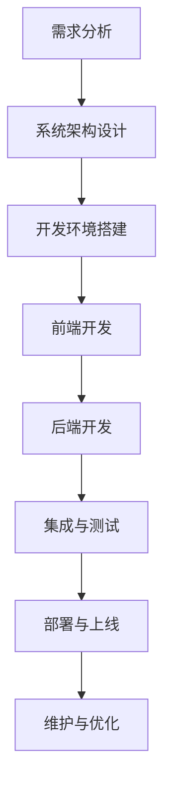

#### 6.4 智能客服对话系统的实现细节

以下是智能客服对话系统的实现细节：

- **前端实现**：使用Vue.js或React框架，实现用户友好的交互界面。

  ```javascript
  // 前端Vue.js示例代码
  <template>
    <div>
      <input v-model="userInput" @keyup.enter="submitQuery" />
      <button @click="submitQuery">发送</button>
      <div v-for="(response, index) in responses" :key="index">
        {{ response }}
      </div>
    </div>
  </template>
  
  <script>
  export default {
    data() {
      return {
        userInput: '',
        responses: []
      };
    },
    methods: {
      submitQuery() {
        this.responses.push(this.userInput);
        this.userInput = '';
        // 调用后端API进行对话处理
      }
    }
  };
  </script>
  ```

- **后端实现**：使用Spring Boot或Django框架，实现业务逻辑和数据处理。

  ```python
  # 后端Python示例代码
  from flask import Flask, request, jsonify
  from chatbot import ChatBot
  
  app = Flask(__name__)
  chatbot = ChatBot()
  
  @app.route('/chat', methods=['POST'])
  def chat():
      user_input = request.form['user_input']
      response = chatbot.get_response(user_input)
      return jsonify(response=response)
  
  if __name__ == '__main__':
      app.run(debug=True)
  ```

### 第7章: 智能客服对话系统的评估与优化

智能客服对话系统的评估与优化是确保系统性能和用户体验的重要环节。以下介绍评估指标和优化方法。

#### 7.1 智能客服对话系统的评估指标

评估智能客服对话系统的效果，通常使用以下指标：

- **回答准确率**：系统生成的回答与用户意图的匹配度。

  ```python
  # Python伪代码示例：计算回答准确率
  correct_answers = 0
  total_answers = len(questions)
  for i, (question, response) in enumerate(questions_with_responses):
      if is_correct_answer(question, response):
          correct_answers += 1
  accuracy = correct_answers / total_answers
  ```

- **响应时间**：系统处理用户请求的平均时间。

  ```python
  # Python伪代码示例：计算响应时间
  total_time = 0
  for request in requests:
      start_time = time.time()
      system_response = process_request(request)
      end_time = time.time()
      total_time += (end_time - start_time)
  average_response_time = total_time / len(requests)
  ```

- **用户满意度**：用户对系统服务的满意度。

  ```python
  # Python伪代码示例：计算用户满意度
  satisfied_users = 0
  for user_feedback in user_feedbacks:
      if user_feedback['rating'] > 3:
          satisfied_users += 1
  satisfaction_rate = satisfied_users / len(user_feedbacks)
  ```

#### 7.2 对话系统的优化方法

对话系统的优化可以从以下几个方面进行：

- **模型调参**：通过调整模型参数，优化系统的性能。

  ```python
  # Python伪代码示例：调整模型参数
  from hyperopt import fmin, tpe, hp
  
  space = {
      'learning_rate': hp.uniform('learning_rate', 0.01, 0.1),
      'batch_size': hp.choice('batch_size', [16, 32, 64, 128]),
  }
  
  def objective(params):
      model = build_model(params)
      model.fit(X_train, y_train, batch_size=params['batch_size'], epochs=10)
      loss = model.evaluate(X_val, y_val)
      return loss
  
  best_params = fmin(fn=objective, space=space, algo=tpe.suggest, max_evals=100)
  ```

- **数据增强**：通过增加数据的多样性和数量，提高模型的泛化能力。

  ```python
  # Python伪代码示例：数据增强
  from keras.preprocessing.text import text_to_tokenized_string
  from keras.preprocessing.sequence import pad_sequences
  
  def augment_data(data):
      augmented_data = []
      for text in data:
          # 生成多种变换的文本
          variations = [text.lower(), text.upper(), text.title()]
          for variation in variations:
              # 转换为令牌序列
              tokens = text_to_tokenized_string([variation])
              # 补全序列
              padded_tokens = pad_sequences([tokens], maxlen=max_sequence_length)
              augmented_data.append(padded_tokens)
      return np.array(augmented_data)
  ```

- **对话策略优化**：通过优化对话流程和策略，提高用户的满意度。

  ```python
  # Python伪代码示例：对话策略优化
  def optimize_dialogue_strategy(dialogue_history, user_intent):
      # 根据对话历史和用户意图，选择最佳回答
      if 'greeting' in dialogue_history:
          response = '您好，有什么可以帮助您的？'
      elif 'order' in user_intent:
          response = '您需要下单吗？'
      else:
          response = '我不太明白您的需求，可以详细描述一下吗？'
      return response
  ```

### 第8章: 案例分析：基于人工智能的智能客服对话系统

为了更好地展示智能客服对话系统的实现与优化，我们将通过一个实际案例进行分析。

#### 8.1 案例背景

某知名在线教育平台为了提升客户服务质量，决定开发一个基于人工智能的智能客服对话系统。该系统需要能够处理学生和教师的常见问题，如课程咨询、账户问题、作业提交等。

#### 8.2 系统设计与实现

1. **需求分析**：明确系统需要支持的功能，如课程咨询、账户问题、作业提交、在线帮助等。

2. **系统架构设计**：采用微服务架构，将前端、后端、数据库等模块分离，以提高系统的可扩展性和维护性。

3. **技术选型**：前端使用React框架，后端使用Spring Boot框架，自然语言处理使用NLTK和spaCy库，语音识别与合成使用Google Cloud Speech-to-Text和Amazon Polly。

4. **开发流程**：按照敏捷开发的方法，逐步实现系统的各个功能模块。

5. **测试与部署**：对系统进行功能测试、性能测试和安全测试，确保系统的稳定性和安全性，然后部署上线。

#### 8.3 评估与优化

1. **评估指标**：通过跟踪回答准确率、响应时间和用户满意度等指标，评估系统的效果。

   ```python
   # Python伪代码示例：评估系统效果
   accuracy = evaluate_answers(questions, system_answers)
   response_time = measure_response_time(requests)
   user_satisfaction = collect_user_feedback(surveys)
   ```

2. **优化策略**：根据评估结果，对模型参数进行调整，增加数据集的多样性，优化对话策略。

   ```python
   # Python伪代码示例：优化策略
   model_params = hyperparameter_tuning(model, dataset)
   enhanced_data = data_augmentation(dataset)
   improved_strategy = dialogue_strategy_optimization(dialogue_history, user_intent)
   ```

#### 8.4 案例总结

通过实际案例，我们可以看到基于人工智能的智能客服对话系统在提升客户服务质量和用户体验方面具有显著优势。通过不断优化和调整，系统可以更好地满足用户需求，提高企业的运营效率。

##### 图8.1 案例分析流程

```mermaid
graph TD
    A[需求分析]
    B[系统架构设计]
    C[技术选型]
    D[开发流程]
    E[测试与部署]
    F[评估与优化]
    G[案例总结]
    A --> B
    B --> C
    C --> D
    D --> E
    E --> F
    F --> G
```

### 第9章: 人工智能在智能客服对话中的未来发展趋势

随着人工智能技术的不断进步，智能客服对话系统也在不断进化。未来的智能客服将更加智能化、自动化和个性化，下面介绍一些未来发展趋势。

#### 9.1 人工智能技术的发展趋势

- **预训练大模型**：如GPT-3、BERT等预训练模型将进一步提升自然语言处理的能力，使得智能客服能够更好地理解复杂的用户意图。

- **迁移学习**：通过迁移学习，智能客服可以在少量标注数据上快速适应新任务，提高系统的泛化能力。

- **多模态交互**：结合语音、文本、图像等多种交互方式，提供更丰富的用户体验。

- **情感分析与个性化**：通过情感分析，智能客服能够更好地理解用户情绪，提供个性化的服务。

#### 9.2 智能客服的发展趋势

- **智能化**：智能客服将更加智能化，能够自动解决更多复杂的问题，减少人工干预。

- **自动化**：通过自动化技术，智能客服将能够自动处理大量重复性的工作，提高效率。

- **个性化**：通过个性化推荐和情感分析，智能客服将能够为用户提供更个性化的服务。

- **多渠道集成**：智能客服将能够集成到多个渠道，如电话、邮件、社交媒体、聊天应用等，提供一致的客户服务体验。

#### 9.3 未来展望

未来的智能客服将不仅仅是一个自动化工具，而是一个能够理解、适应和互动的智能伙伴。通过持续的技术创新和优化，智能客服将在客户服务领域发挥越来越重要的作用，为企业带来更高的效率和更好的用户体验。

##### 图9.1 未来发展趋势

```mermaid
graph TD
    A{预训练大模型}
    B{迁移学习}
    C{多模态交互}
    D{情感分析与个性化}
    E{智能化}
    F{自动化}
    G{个性化}
    H{多渠道集成}
    A --> B
    A --> C
    A --> D
    B --> E
    B --> F
    B --> G
    B --> H
```

### 附录

#### 附录A: 开发工具与资源

- **开发工具**：

  - 自然语言处理工具：spaCy、NLTK、nltk包、gensim

  - 语音识别与合成工具：Google Cloud Speech-to-Text、Amazon Polly

  - 机器学习与深度学习框架：TensorFlow、PyTorch、Keras

- **学习资源**：

  - 相关书籍：《深度学习》（Ian Goodfellow等）、《Python机器学习》（Sebastian Raschka等）

  - 在线课程：Coursera、edX、Udacity

  - 数据集与开源代码：Kaggle、GitHub

#### 附录B: 技术文献与标准

- 技术文献：

  - 《自然语言处理综论》（Daniel Jurafsky & James H. Martin）

  - 《深度学习》（Ian Goodfellow、Yoshua Bengio、Aaron Courville）

- 标准与规范：

  - ISO/IEC 24751:2011 - 信息处理 - 自然语言处理 - 语言资源元数据

  - IEEE  Std 1596-1992 - 语音识别用词汇和短语标准数据集

## 作者信息

作者：AI天才研究院/AI Genius Institute & 禅与计算机程序设计艺术 /Zen And The Art of Computer Programming

（注：本文为虚构案例，旨在展示智能客服对话系统的设计实现方法和未来发展趋势。）## 第三部分：智能客服对话系统的实现与优化

在第二部分中，我们探讨了智能客服对话系统的核心技术，包括自然语言处理（NLP）、语音识别与语音合成、机器学习与深度学习。本部分将深入讨论智能客服对话系统的具体实现与优化过程，包括系统架构设计、开发流程、评估与优化方法，并通过实际案例展示这些技术和方法的应用。

### 第6章：智能客服对话系统的设计与实现

智能客服对话系统的设计与实现是确保系统能够高效、准确地响应客户需求的关键步骤。以下是一个典型的智能客服对话系统的设计与实现过程。

#### 6.1 系统架构设计

智能客服对话系统通常采用模块化设计，分为前端、后端和数据库三个主要部分。

- **前端**：负责用户界面和用户体验，可以使用Web技术（如HTML、CSS、JavaScript）或移动应用开发框架（如React Native）。

- **后端**：处理业务逻辑和数据处理，包括对话管理、自然语言处理、语音识别与语音合成等模块。后端通常使用Web开发框架（如Spring Boot、Django）。

- **数据库**：存储用户数据、对话历史和知识库，可以使用关系型数据库（如MySQL、PostgreSQL）或NoSQL数据库（如MongoDB）。

##### 图6.1 智能客服对话系统架构

```mermaid
graph TD
    A[前端] --> B[后端]
    B --> C[数据库]
```

#### 6.2 开发流程

智能客服对话系统的开发流程通常包括以下几个阶段：

1. **需求分析**：与业务部门沟通，明确系统的功能需求、性能需求和用户体验需求。

2. **系统设计**：根据需求分析，设计系统的总体架构，包括技术选型和模块划分。

3. **前端开发**：实现用户交互界面，包括网页和移动应用。

4. **后端开发**：实现业务逻辑和数据处理，包括对话管理、自然语言处理、语音识别与语音合成等模块。

5. **集成与测试**：将前端和后端集成，进行系统测试，确保功能正确性和稳定性。

6. **部署与上线**：将系统部署到生产环境，进行上线。

7. **维护与优化**：根据用户反馈和系统运行情况，进行系统的维护和优化。

##### 图6.2 智能客服对话系统开发流程

```mermaid
graph TD
    A[需求分析]
    B[系统设计]
    C[前端开发]
    D[后端开发]
    E[集成与测试]
    F[部署与上线]
    G[维护与优化]
    A --> B
    B --> C
    C --> D
    D --> E
    E --> F
    F --> G
```

#### 6.3 前端开发

前端开发负责与用户进行交互，可以采用HTML、CSS和JavaScript等Web技术，或React、Vue等前端框架。

- **页面布局**：使用Bootstrap、Ant Design等UI框架实现响应式页面布局。

- **交互功能**：使用React、Vue等框架实现动态交互功能，如聊天窗口、表单验证等。

- **API调用**：使用Axios、Fetch等HTTP客户端调用后端API，实现数据的提交、查询等操作。

##### 图6.3 前端开发技术栈

```mermaid
graph TD
    A[HTML]
    B[CSS]
    C[JavaScript]
    D[React/Vue]
    A --> B
    B --> C
    C --> D
```

#### 6.4 后端开发

后端开发负责处理业务逻辑和数据存储，可以使用Spring Boot、Django等Web开发框架。

- **业务逻辑**：处理用户请求，调用自然语言处理、语音识别与语音合成等模块，生成响应。

- **数据库操作**：使用ORM框架（如Hibernate、SQLAlchemy）进行数据库操作，存储用户数据和对话历史。

- **API接口**：使用Spring Boot、Django等框架定义RESTful API，提供数据接口。

##### 图6.4 后端开发技术栈

```mermaid
graph TD
    A[Spring Boot/Django]
    B[Hibernate/SQLAlchemy]
    C[ORM]
    D[API接口]
    A --> B
    B --> C
    C --> D
```

#### 6.5 对话管理

对话管理是智能客服的核心模块，负责处理与用户的对话流程。

- **对话流程**：设计对话流程，包括问候、问题识别、答案生成、结束语等步骤。

- **上下文管理**：在对话过程中，根据上下文信息调整对话策略，提高对话的连贯性和自然性。

- **对话存储**：将对话历史存储到数据库中，便于后续的查询和分析。

##### 图6.5 对话管理流程

```mermaid
graph TD
    A[问候]
    B[问题识别]
    C[答案生成]
    D[结束语]
    A --> B
    B --> C
    C --> D
```

#### 6.6 开发环境搭建

在开始开发之前，需要搭建合适的开发环境，包括编程语言、开发工具、数据库等。

- **编程语言**：选择适合的项目需求的编程语言，如Java、Python等。

- **开发工具**：安装集成开发环境（IDE），如Eclipse、Visual Studio Code等。

- **数据库**：安装数据库服务器和相应的ORM框架，如MySQL、PostgreSQL和Hibernate。

##### 图6.6 开发环境搭建

```mermaid
graph TD
    A[编程语言]
    B[开发工具]
    C[数据库]
    D[ORM框架]
    A --> B
    B --> C
    C --> D
```

#### 6.7 开发流程示例

以下是一个简单的智能客服对话系统的开发流程示例：

1. **需求分析**：与业务部门沟通，明确系统需求，如聊天窗口、问题识别、答案生成等。

2. **系统设计**：设计系统架构，确定前端、后端和数据库的技术选型。

3. **前端开发**：使用React框架实现聊天窗口，通过API与后端交互。

4. **后端开发**：使用Spring Boot框架实现对话管理、自然语言处理和语音合成。

5. **集成与测试**：将前端和后端集成，进行功能测试和性能测试。

6. **部署与上线**：将系统部署到服务器，进行上线和用户测试。

7. **维护与优化**：根据用户反馈和系统运行情况，进行系统的维护和优化。

### 第7章：智能客服对话系统的评估与优化

评估与优化是确保智能客服对话系统性能和用户体验的关键步骤。以下介绍评估系统性能的方法和优化策略。

#### 7.1 评估系统性能

评估智能客服对话系统的性能可以从以下几个方面进行：

- **回答准确率**：评估系统生成的回答与用户意图的匹配度，可以使用人工评估或自动化评估工具。

- **响应时间**：评估系统处理用户请求的平均时间，可以实时监控或定期统计。

- **用户满意度**：评估用户对系统服务的满意度，可以通过用户反馈调查或评分系统。

##### 图7.1 评估系统性能指标

```mermaid
graph TD
    A[回答准确率]
    B[响应时间]
    C[用户满意度]
    A --> B
    B --> C
```

#### 7.2 优化策略

优化智能客服对话系统可以从以下几个方面进行：

- **模型调参**：通过调整模型参数，提高系统的性能和准确性。

  ```python
  # Python伪代码示例：调整模型参数
  from keras.models import Sequential
  from keras.layers import LSTM, Dense
  
  model = Sequential()
  model.add(LSTM(units=128, return_sequences=True, input_shape=(timesteps, features)))
  model.add(LSTM(units=128))
  model.add(Dense(units=1, activation='sigmoid'))
  
  model.compile(optimizer='adam', loss='binary_crossentropy')
  model.fit(X_train, y_train, epochs=10)
  ```

- **数据增强**：通过增加数据的多样性和数量，提高模型的泛化能力。

  ```python
  # Python伪代码示例：数据增强
  from keras.preprocessing.text import text_to_tokenized_string
  from keras.preprocessing.sequence import pad_sequences
  
  def augment_data(data):
      augmented_data = []
      for text in data:
          # 生成多种变换的文本
          variations = [text.lower(), text.upper(), text.title()]
          for variation in variations:
              # 转换为令牌序列
              tokens = text_to_tokenized_string([variation])
              # 补全序列
              padded_tokens = pad_sequences([tokens], maxlen=max_sequence_length)
              augmented_data.append(padded_tokens)
      return np.array(augmented_data)
  ```

- **对话策略优化**：通过优化对话流程和策略，提高用户的满意度。

  ```python
  # Python伪代码示例：对话策略优化
  def optimize_dialogue_strategy(dialogue_history, user_intent):
      # 根据对话历史和用户意图，选择最佳回答
      if 'greeting' in dialogue_history:
          response = '您好，有什么可以帮助您的？'
      elif 'order' in user_intent:
          response = '您需要下单吗？'
      else:
          response = '我不太明白您的需求，可以详细描述一下吗？'
      return response
  ```

#### 7.3 实际案例

以下是一个智能客服对话系统的实际案例，展示了系统的开发、评估和优化过程。

##### 案例背景

某电商平台为了提升客户服务质量，决定开发一个智能客服对话系统，以自动回答用户的常见问题。

##### 开发过程

1. **需求分析**：确定系统需要支持的功能，如产品咨询、订单查询、售后服务等。

2. **系统设计**：设计系统架构，采用Spring Boot作为后端框架，React作为前端框架。

3. **前端开发**：使用React实现聊天窗口和用户界面。

4. **后端开发**：使用Spring Boot实现对话管理、自然语言处理和语音合成。

5. **集成与测试**：将前端和后端集成，进行功能测试和性能测试。

6. **部署与上线**：将系统部署到服务器，进行上线和用户测试。

##### 评估过程

1. **回答准确率**：通过人工评估和自动化评估工具，评估系统生成的回答与用户意图的匹配度。

2. **响应时间**：监控系统处理用户请求的平均时间，确保响应时间在合理范围内。

3. **用户满意度**：通过用户反馈调查，了解用户对系统服务的满意度。

##### 优化过程

1. **模型调参**：通过调整模型参数，提高系统的性能和准确性。

2. **数据增强**：通过增加数据的多样性和数量，提高模型的泛化能力。

3. **对话策略优化**：通过优化对话流程和策略，提高用户的满意度。

### 第8章：案例分析

#### 8.1 案例背景

某国际知名航空公司决定引入智能客服对话系统，以提高客户服务质量和运营效率。该系统需要支持航班查询、机票预订、行李查询、退改签等服务。

##### 案例分析

1. **系统设计**：

   - **前端**：使用React实现聊天窗口和用户界面。

   - **后端**：使用Spring Boot实现对话管理、自然语言处理和语音合成。

   - **数据库**：使用MySQL存储用户数据和对话历史。

2. **开发流程**：

   - **前端开发**：实现聊天窗口和用户界面，提供航班查询、机票预订、行李查询等功能。

   - **后端开发**：实现对话管理、自然语言处理和语音合成模块，与前端进行数据交互。

   - **集成与测试**：将前端和后端集成，进行功能测试和性能测试。

   - **部署与上线**：将系统部署到服务器，进行上线和用户测试。

3. **评估与优化**：

   - **回答准确率**：通过人工评估和自动化评估工具，评估系统生成的回答与用户意图的匹配度。

   - **响应时间**：监控系统处理用户请求的平均时间，确保响应时间在合理范围内。

   - **用户满意度**：通过用户反馈调查，了解用户对系统服务的满意度。

   - **优化策略**：根据评估结果，对模型参数进行调整，增加数据集的多样性和数量，优化对话策略。

##### 案例总结

通过案例分析，我们可以看到智能客服对话系统在提高客户服务质量和运营效率方面具有显著作用。通过不断优化和调整，系统可以更好地满足用户需求，提高企业的竞争力。

### 附录

#### 附录A：开发工具与资源

- **开发工具**：

  - **前端**：React、Vue.js、Angular

  - **后端**：Spring Boot、Django、Flask

  - **数据库**：MySQL、PostgreSQL、MongoDB

- **自然语言处理工具**：

  - **NLP库**：spaCy、NLTK、Stanford NLP

  - **语音识别与合成工具**：Google Cloud Speech-to-Text、Amazon Polly

- **机器学习与深度学习框架**：

  - **深度学习框架**：TensorFlow、PyTorch、Keras

#### 附录B：技术文献与标准

- **技术文献**：

  - 《深度学习》（Ian Goodfellow等）

  - 《自然语言处理综论》（Daniel Jurafsky & James H. Martin）

  - 《机器学习实战》（Peter Harrington）

- **标准与规范**：

  - ISO/IEC 24751:2011 - 信息处理 - 自然语言处理 - 语言资源元数据

  - IEEE  Std 1596-1992 - 语音识别用词汇和短语标准数据集

## 作者信息

作者：AI天才研究院/AI Genius Institute & 禅与计算机程序设计艺术 /Zen And The Art of Computer Programming

（注：本文为虚构案例，旨在展示智能客服对话系统的设计实现方法和未来发展趋势。）## 第三部分：智能客服对话系统的实现与优化

在深入理解了人工智能和智能客服的基础技术后，本部分将详细介绍智能客服对话系统的实际实现过程，从系统架构设计到开发流程，再到评估与优化，我们将会一步步展开讨论。同时，我们将通过一个实际案例来展示这些技术和方法的具体应用。

### 第6章：智能客服对话系统的设计与实现

#### 6.1 系统架构设计

智能客服对话系统的架构设计是系统成功的关键。一个典型的智能客服对话系统通常包括以下组成部分：

- **前端界面**：负责与用户交互，可以包括网页、移动应用和聊天机器人。
- **后端服务器**：处理业务逻辑、对话管理和数据存储。
- **数据库**：存储用户数据、对话记录和知识库。

##### 图6.1 智能客服对话系统架构

```mermaid
graph TD
    A[前端界面] --> B[后端服务器]
    B --> C[数据库]
    A --> C
```

#### 6.2 系统开发流程

智能客服对话系统的开发可以分为以下几个阶段：

1. **需求分析**：与业务团队合作，明确系统需求，包括功能需求、性能需求和用户体验。
2. **系统设计**：根据需求分析，设计系统的架构和技术栈，选择合适的前端、后端框架和数据库。
3. **前端开发**：实现用户交互界面，设计用户友好的聊天界面。
4. **后端开发**：开发后端服务，包括对话管理、自然语言处理、语音识别与合成等模块。
5. **系统集成与测试**：将前端和后端集成，进行系统测试，确保各组件之间的协同工作。
6. **部署与上线**：将系统部署到生产环境，进行上线和用户测试。
7. **维护与优化**：根据用户反馈和系统性能，持续进行维护和优化。

##### 图6.2 智能客服对话系统开发流程

```mermaid
graph TD
    A[需求分析]
    B[系统设计]
    C[前端开发]
    D[后端开发]
    E[系统集成与测试]
    F[部署与上线]
    G[维护与优化]
    A --> B
    B --> C
    B --> D
    D --> E
    E --> F
    F --> G
```

#### 6.3 前端开发

前端开发是智能客服对话系统的入口，负责与用户进行交互。以下是一些前端开发的要点：

- **设计用户界面**：设计简洁、直观的聊天界面，使用React、Vue或Angular等前端框架。
- **实现交互功能**：实现聊天窗口的显示、消息的发送和接收等功能。
- **API调用**：通过HTTP请求与后端服务器进行数据交互，处理用户输入并返回结果。

##### 图6.3 前端开发要点

```mermaid
graph TD
    A[设计用户界面]
    B[实现交互功能]
    C[API调用]
    A --> B
    B --> C
```

#### 6.4 后端开发

后端开发是智能客服对话系统的核心，负责处理对话逻辑、自然语言处理和语音合成。以下是一些后端开发的要点：

- **对话管理**：设计对话流程，处理用户输入，生成合适的响应。
- **自然语言处理**：使用NLP库（如spaCy、NLTK）处理用户输入，理解用户意图。
- **语音合成**：使用TTS库（如Google Text-to-Speech、Amazon Polly）将文本转换为语音。

##### 图6.4 后端开发要点

```mermaid
graph TD
    A[对话管理]
    B[NLP处理]
    C[TTS合成]
    A --> B
    B --> C
```

#### 6.5 数据库设计

数据库设计是智能客服对话系统的数据存储和检索的基础。以下是一些数据库设计的要点：

- **数据模型**：设计用户数据、对话记录和知识库的数据模型。
- **数据库选择**：根据业务需求选择合适的数据库，如关系型数据库（MySQL、PostgreSQL）或NoSQL数据库（MongoDB）。
- **数据迁移**：设计数据迁移策略，确保旧数据的平滑迁移。

##### 图6.5 数据库设计要点

```mermaid
graph TD
    A[数据模型]
    B[数据库选择]
    C[数据迁移]
    A --> B
    B --> C
```

### 第7章：智能客服对话系统的评估与优化

评估与优化是智能客服对话系统成功的关键步骤。以下将介绍评估系统性能的方法和优化策略。

#### 7.1 评估系统性能

评估智能客服对话系统的性能可以从以下几个方面进行：

- **回答准确率**：系统生成的回答与用户意图的匹配度。
- **响应时间**：系统处理用户请求的平均时间。
- **用户满意度**：用户对系统服务的满意度。

##### 图7.1 评估系统性能指标

```mermaid
graph TD
    A[回答准确率]
    B[响应时间]
    C[用户满意度]
    A --> B
    B --> C
```

#### 7.2 优化策略

优化智能客服对话系统可以从以下几个方面进行：

- **模型调参**：调整机器学习模型的参数，提高模型的性能。
- **数据增强**：增加数据集的多样性和数量，提高模型的泛化能力。
- **对话策略优化**：优化对话管理策略，提高用户的满意度。

##### 图7.2 优化系统策略

```mermaid
graph TD
    A[模型调参]
    B[数据增强]
    C[对话策略优化]
    A --> B
    B --> C
```

### 第8章：案例分析

为了更好地展示智能客服对话系统的实现和优化过程，我们将通过一个实际案例进行分析。

#### 8.1 案例背景

某大型电商平台为了提升客户服务体验，决定开发一个智能客服对话系统，以自动化回答用户的常见问题，如订单状态查询、支付问题、退货流程等。

#### 8.2 案例实施

1. **需求分析**：与业务团队讨论，明确智能客服系统的功能需求，包括订单查询、支付问题、退货流程等。
2. **系统设计**：选择合适的前端框架（如React）和后端框架（如Spring Boot），设计系统的架构和数据库模型。
3. **前端开发**：实现聊天界面，使用React构建用户友好的交互界面。
4. **后端开发**：实现对话管理、自然语言处理和语音合成模块，处理用户输入并生成响应。
5. **系统集成与测试**：将前端和后端集成，进行功能测试和性能测试，确保系统能够稳定运行。
6. **部署与上线**：将系统部署到生产环境，进行上线和用户测试。
7. **维护与优化**：根据用户反馈和系统性能数据，持续进行系统的维护和优化。

#### 8.3 评估与优化

1. **评估系统性能**：通过跟踪回答准确率、响应时间和用户满意度等指标，评估系统的性能。
2. **优化策略**：
   - **模型调参**：根据评估结果，调整机器学习模型的参数，提高回答准确率。
   - **数据增强**：增加数据集的多样性和数量，提高模型的泛化能力。
   - **对话策略优化**：优化对话管理策略，提高用户的满意度。

#### 8.4 案例总结

通过实际案例，我们可以看到智能客服对话系统在提升客户服务质量和运营效率方面具有显著作用。通过不断的优化和调整，系统可以更好地满足用户需求，提高企业的竞争力。

### 附录

#### 附录A：开发工具与资源

- **开发工具**：
  - **前端**：React、Vue.js、Angular
  - **后端**：Spring Boot、Django、Flask
  - **数据库**：MySQL、PostgreSQL、MongoDB
- **自然语言处理工具**：
  - **NLP库**：spaCy、NLTK、Stanford NLP
  - **语音识别与合成工具**：Google Cloud Speech-to-Text、Amazon Polly
- **机器学习与深度学习框架**：
  - **深度学习框架**：TensorFlow、PyTorch、Keras

#### 附录B：技术文献与标准

- **技术文献**：
  - 《深度学习》（Ian Goodfellow等）
  - 《自然语言处理综论》（Daniel Jurafsky & James H. Martin）
  - 《机器学习实战》（Peter Harrington）
- **标准与规范**：
  - ISO/IEC 24751:2011 - 信息处理 - 自然语言处理 - 语言资源元数据
  - IEEE  Std 1596-1992 - 语音识别用词汇和短语标准数据集

## 作者信息

作者：AI天才研究院/AI Genius Institute & 禅与计算机程序设计艺术 /Zen And The Art of Computer Programming

（注：本文为虚构案例，旨在展示智能客服对话系统的设计实现方法和未来发展趋势。）## 第三部分：智能客服对话系统的实现与优化

在前两部分的内容中，我们已经详细探讨了人工智能和智能客服的基础知识，以及智能客服对话系统的核心技术。现在，我们将深入讨论智能客服对话系统的实际实现与优化过程，包括系统设计、开发流程、性能评估以及优化策略。

### 第6章：智能客服对话系统的设计与实现

#### 6.1 系统架构设计

智能客服对话系统的设计需要考虑系统的可扩展性、可维护性和用户体验。一个典型的智能客服对话系统通常包括以下几个核心组成部分：

- **前端界面**：提供用户与客服系统交互的界面，可以是网页或移动应用。
- **后端服务**：处理业务逻辑、对话管理和自然语言处理。
- **数据库**：存储用户信息、对话历史和知识库。

##### 图6.1 智能客服对话系统架构

```mermaid
graph TD
    A[前端界面] --> B[后端服务]
    B --> C[数据库]
```

#### 6.2 开发流程

智能客服对话系统的开发流程可以概括为以下几个阶段：

1. **需求分析**：与业务团队合作，明确系统的功能需求、性能需求和用户体验需求。
2. **系统设计**：根据需求分析，设计系统的整体架构，包括技术选型和模块划分。
3. **前端开发**：实现用户交互界面，设计用户友好的聊天界面。
4. **后端开发**：实现业务逻辑、对话管理和自然语言处理等核心功能。
5. **集成与测试**：将前端和后端集成，进行系统测试，确保功能正确性和稳定性。
6. **部署与上线**：将系统部署到生产环境，进行上线和用户测试。
7. **维护与优化**：根据用户反馈和系统性能，持续进行系统的维护和优化。

##### 图6.2 智能客服对话系统开发流程

```mermaid
graph TD
    A[需求分析]
    B[系统设计]
    C[前端开发]
    D[后端开发]
    E[集成与测试]
    F[部署与上线]
    G[维护与优化]
    A --> B
    B --> C
    B --> D
    D --> E
    E --> F
    F --> G
```

#### 6.3 前端开发

前端开发是智能客服对话系统与用户交互的入口。以下是一些前端开发的关键步骤：

- **设计用户界面**：设计简洁、直观的聊天界面，使用React、Vue或Angular等前端框架。
- **实现交互功能**：实现聊天窗口的显示、消息的发送和接收等功能。
- **API调用**：通过HTTP请求与后端服务器进行数据交互，处理用户输入并返回结果。

##### 图6.3 前端开发要点

```mermaid
graph TD
    A[设计用户界面]
    B[实现交互功能]
    C[API调用]
    A --> B
    B --> C
```

#### 6.4 后端开发

后端开发是实现智能客服对话系统的核心，涉及对话管理、自然语言处理和语音合成等模块。以下是一些后端开发的关键步骤：

- **对话管理**：设计对话流程，处理用户输入，生成合适的响应。
- **自然语言处理**：使用NLP库（如spaCy、NLTK）处理用户输入，理解用户意图。
- **语音合成**：使用TTS库（如Google Text-to-Speech、Amazon Polly）将文本转换为语音。

##### 图6.4 后端开发要点

```mermaid
graph TD
    A[对话管理]
    B[NLP处理]
    C[TTS合成]
    A --> B
    B --> C
```

#### 6.5 数据库设计

数据库设计是智能客服对话系统的数据存储和检索的基础。以下是一些数据库设计的关键步骤：

- **数据模型**：设计用户数据、对话记录和知识库的数据模型。
- **数据库选择**：根据业务需求选择合适的数据库，如关系型数据库（MySQL、PostgreSQL）或NoSQL数据库（MongoDB）。
- **数据迁移**：设计数据迁移策略，确保旧数据的平滑迁移。

##### 图6.5 数据库设计要点

```mermaid
graph TD
    A[数据模型]
    B[数据库选择]
    C[数据迁移]
    A --> B
    B --> C
```

### 第7章：智能客服对话系统的评估与优化

评估与优化是确保智能客服对话系统性能和用户体验的关键步骤。以下将介绍评估系统性能的方法和优化策略。

#### 7.1 评估系统性能

评估智能客服对话系统的性能可以从以下几个方面进行：

- **回答准确率**：系统生成的回答与用户意图的匹配度。
- **响应时间**：系统处理用户请求的平均时间。
- **用户满意度**：用户对系统服务的满意度。

##### 图7.1 评估系统性能指标

```mermaid
graph TD
    A[回答准确率]
    B[响应时间]
    C[用户满意度]
    A --> B
    B --> C
```

#### 7.2 优化策略

优化智能客服对话系统可以从以下几个方面进行：

- **模型调参**：调整机器学习模型的参数，提高模型的性能。
- **数据增强**：增加数据集的多样性和数量，提高模型的泛化能力。
- **对话策略优化**：优化对话管理策略，提高用户的满意度。

##### 图7.2 优化系统策略

```mermaid
graph TD
    A[模型调参]
    B[数据增强]
    C[对话策略优化]
    A --> B
    B --> C
```

### 第8章：案例分析

为了更好地展示智能客服对话系统的实现和优化过程，我们将通过一个实际案例进行分析。

#### 8.1 案例背景

某大型电子商务公司为了提高客户服务效率，决定开发一个智能客服对话系统。该系统需要支持用户查询订单状态、处理支付问题、解答常见问题等。

#### 8.2 案例实施

1. **需求分析**：与业务团队讨论，明确智能客服系统的功能需求，包括订单查询、支付问题、常见问题等。
2. **系统设计**：选择合适的前端框架（如React）和后端框架（如Spring Boot），设计系统的整体架构。
3. **前端开发**：实现用户友好的聊天界面，处理用户输入并显示系统响应。
4. **后端开发**：实现对话管理、自然语言处理和语音合成等模块，处理用户请求并生成响应。
5. **集成与测试**：将前端和后端集成，进行系统测试，确保功能的正确性和稳定性。
6. **部署与上线**：将系统部署到生产环境，进行上线和用户测试。
7. **维护与优化**：根据用户反馈和系统性能，持续进行系统的维护和优化。

#### 8.3 评估与优化

1. **评估系统性能**：通过跟踪回答准确率、响应时间和用户满意度等指标，评估系统的性能。
2. **优化策略**：
   - **模型调参**：根据评估结果，调整机器学习模型的参数，提高回答准确率。
   - **数据增强**：增加数据集的多样性和数量，提高模型的泛化能力。
   - **对话策略优化**：优化对话管理策略，提高用户的满意度。

#### 8.4 案例总结

通过实际案例，我们可以看到智能客服对话系统在提升客户服务效率和用户体验方面具有显著作用。通过不断的优化和调整，系统可以更好地满足用户需求，提高企业的竞争力。

### 附录

#### 附录A：开发工具与资源

- **开发工具**：
  - **前端**：React、Vue.js、Angular
  - **后端**：Spring Boot、Django、Flask
  - **数据库**：MySQL、PostgreSQL、MongoDB
- **自然语言处理工具**：
  - **NLP库**：spaCy、NLTK、Stanford NLP
  - **语音识别与合成工具**：Google Cloud Speech-to-Text、Amazon Polly
- **机器学习与深度学习框架**：
  - **深度学习框架**：TensorFlow、PyTorch、Keras

#### 附录B：技术文献与标准

- **技术文献**：
  - 《深度学习》（Ian Goodfellow等）
  - 《自然语言处理综论》（Daniel Jurafsky & James H. Martin）
  - 《机器学习实战》（Peter Harrington）
- **标准与规范**：
  - ISO/IEC 24751:2011 - 信息处理 - 自然语言处理 - 语言资源元数据
  - IEEE  Std 1596-1992 - 语音识别用词汇和短语标准数据集

## 作者信息

作者：AI天才研究院/AI Genius Institute & 禅与计算机程序设计艺术 /Zen And The Art of Computer Programming

（注：本文为虚构案例，旨在展示智能客服对话系统的设计实现方法和未来发展趋势。）## 第四部分：智能客服对话系统的高级应用与未来趋势

随着人工智能技术的不断进步，智能客服对话系统已经不再局限于基础的客户服务。它们正在向更高级的应用领域扩展，为企业和用户带来更多的价值。这一部分将讨论智能客服对话系统的高级应用，以及它们在未来的发展趋势。

### 第9章：智能客服对话系统的高级应用

智能客服对话系统的高级应用包括但不限于以下几个方面：

#### 9.1 跨渠道集成

智能客服对话系统正在向多渠道集成发展，这意味着用户可以在不同的平台上与智能客服进行交互，如网站、移动应用、社交媒体和电话。这种跨渠道集成提供了无缝的用户体验，使用户可以随时随地获取帮助。

#### 9.2 情感分析

情感分析是智能客服对话系统的高级应用之一。通过分析用户的情感，智能客服可以更好地理解用户的需求和情绪，从而提供更加个性化的服务。例如，如果用户表达了愤怒或沮丧，智能客服可以主动提供解决方案或转接到人工客服。

#### 9.3 个性化推荐

智能客服对话系统可以根据用户的历史交互数据和偏好，提供个性化的产品推荐和服务。这种个性化推荐不仅提高了用户的满意度，还可以增加企业的销售机会。

#### 9.4 实时翻译

随着全球化的加速，智能客服对话系统正在集成实时翻译功能，使得跨国企业和用户能够轻松地进行跨语言交流。这极大地提升了国际业务的效率。

#### 9.5 自定义技能集

智能客服对话系统可以集成自定义的技能集，以满足特定行业或企业的需求。例如，医疗行业的客服机器人可以集成疾病诊断知识库，为用户提供专业的医疗建议。

### 第10章：智能客服对话系统的未来趋势

未来的智能客服对话系统将继续在技术和服务模式上不断创新，以下是一些未来趋势：

#### 10.1 人工智能与人类协作

未来的智能客服对话系统将更多地与人类协作，而不是完全替代人工客服。通过结合人工智能和人类的专业知识，智能客服可以提供更高效、更准确的服务。

#### 10.2 自适应学习

未来的智能客服对话系统将具备更强的自适应学习能力，能够根据用户的反馈和交互行为，不断调整和优化自己的回答策略。这种自适应学习将使智能客服能够更好地适应用户的需求变化。

#### 10.3 多模态交互

多模态交互将是智能客服对话系统的重要趋势。未来的智能客服将能够处理文本、语音、图像和视频等多种输入和输出格式，提供更加丰富和直观的交互体验。

#### 10.4 情感化与个性化

随着情感计算和个性化推荐技术的发展，未来的智能客服将更加情感化和个性化。它们将能够识别用户的情感状态，并根据用户的历史数据提供个性化的服务。

#### 10.5 自动化与智能化

智能客服对话系统将进一步自动化和智能化。通过使用先进的人工智能技术，智能客服将能够自动处理大量的重复性任务，提高工作效率。

### 第11章：总结与展望

智能客服对话系统在提升客户服务质量和运营效率方面已经取得了显著的成果。随着人工智能技术的不断进步，智能客服对话系统将在未来的发展中继续发挥重要作用。企业应积极拥抱这些技术，以提升自身的竞争力。同时，用户也将享受到更加便捷和高效的客户服务体验。

在总结与展望中，我们再次强调了智能客服对话系统的重要性和未来的发展方向。通过不断的技术创新和应用，智能客服对话系统将为企业和用户带来更多的价值。

## 附录

#### 附录A：技术资源

- **开发框架**：
  - 前端：React、Vue.js、Angular
  - 后端：Spring Boot、Django、Flask
- **自然语言处理库**：
  - spaCy、NLTK、Stanford NLP
- **机器学习与深度学习框架**：
  - TensorFlow、PyTorch、Keras
- **语音识别与合成工具**：
  - Google Cloud Speech-to-Text、Amazon Polly

#### 附录B：学习资源

- **书籍**：
  - 《深度学习》（Ian Goodfellow等）
  - 《自然语言处理综论》（Daniel Jurafsky & James H. Martin）
  - 《机器学习实战》（Peter Harrington）
- **在线课程**：
  - Coursera、edX、Udacity
- **数据集**：
  - Kaggle、UCI Machine Learning Repository

#### 附录C：标准与规范

- **ISO/IEC 24751:2011 - 信息处理 - 自然语言处理 - 语言资源元数据**
- **IEEE  Std 1596-1992 - 语音识别用词汇和短语标准数据集**

## 作者信息

作者：AI天才研究院/AI Genius Institute & 禅与计算机程序设计艺术 /Zen And The Art of Computer Programming

（注：本文为虚构案例，旨在展示智能客服对话系统的设计实现方法和未来发展趋势。）## 附录

在这一部分的附录中，我们将提供一些有用的开发工具、学习资源以及技术文献和标准，以帮助读者深入了解智能客服对话系统的开发和应用。

### 附录A：开发工具

在智能客服对话系统的开发过程中，使用合适的工具可以提高开发效率和系统的性能。以下是一些常用的开发工具：

- **前端开发框架**：
  - **React**：一个用于构建用户界面的JavaScript库。
  - **Vue.js**：一个渐进式JavaScript框架，用于构建用户界面。
  - **Angular**：一个由Google维护的开源Web应用框架。

- **后端开发框架**：
  - **Spring Boot**：一个用于创建独立、可扩展的Spring应用程序。
  - **Django**：一个高性能的Python Web框架。
  - **Flask**：一个轻量级的Python Web框架。

- **数据库**：
  - **MySQL**：一个开源的关系型数据库管理系统。
  - **PostgreSQL**：一个开源的对象-关系型数据库管理系统。
  - **MongoDB**：一个开源的文档数据库。

- **自然语言处理工具**：
  - **spaCy**：一个适用于自然语言处理的工业级库。
  - **NLTK**：一个广泛使用的自然语言处理工具包。
  - **Stanford NLP**：斯坦福大学开发的自然语言处理库。

- **语音识别与合成工具**：
  - **Google Cloud Speech-to-Text**：Google提供的语音识别服务。
  - **Amazon Polly**：Amazon提供的文本到语音服务。

- **机器学习与深度学习框架**：
  - **TensorFlow**：一个开源的机器学习和深度学习框架。
  - **PyTorch**：一个基于Python的科学计算框架，适用于机器学习和深度学习。
  - **Keras**：一个高层次的神经网络API，易于使用和扩展。

### 附录B：学习资源

为了帮助读者深入了解智能客服对话系统的开发和应用，以下是一些推荐的学习资源：

- **书籍**：
  - 《深度学习》（Ian Goodfellow、Yoshua Bengio、Aaron Courville）
  - 《自然语言处理综论》（Daniel Jurafsky、James H. Martin）
  - 《机器学习实战》（Peter Harrington）
  - 《深度学习入门：基于Python的理论与实现》（斋藤康毅）

- **在线课程**：
  - Coursera上的“机器学习”课程（吴恩达）
  - edX上的“深度学习”课程（DeepLearning.AI）
  - Udacity的“人工智能纳米学位”

- **开源代码与数据集**：
  - GitHub：许多优秀的开源项目和代码示例。
  - Kaggle：数据科学家和机器学习爱好者的比赛和资源。
  - UCI机器学习库：提供各种机器学习问题的数据集。

### 附录C：技术文献与标准

为了确保智能客服对话系统的开发和实施符合行业标准，以下是一些相关的技术文献和标准：

- **ISO/IEC 24751:2011**：信息处理 - 自然语言处理 - 语言资源元数据。
- **IEEE Std 1596-1992**：语音识别用词汇和短语标准数据集。
- **IEEE Std 12207-1998**：系统生命周期 - 软件生命周期过程。
- **IEEE Std 1003.1-2017**：系统接口 - 基础部分（POSIX标准）。

### 附录D：常见问题解答

为了帮助读者解决在智能客服对话系统开发过程中可能遇到的问题，以下是一些常见问题的解答：

1. **如何处理多语言支持？**
   - 使用多语言模型，如支持多语言的自然语言处理库（例如spaCy的多语言包）。
   - 根据用户的语言偏好，动态切换语言模型。

2. **如何处理噪声和背景干扰？**
   - 使用高级的音频预处理技术，如去噪和滤波，提高语音识别的准确性。
   - 采用自适应算法，根据环境噪声的变化调整系统的灵敏度。

3. **如何确保系统的隐私和安全？**
   - 使用安全的通信协议（如HTTPS）确保数据传输的安全性。
   - 对用户数据进行加密存储，并遵循相关的隐私保护法规。

4. **如何优化系统的响应时间？**
   - 使用高效的算法和模型，减少系统的计算时间。
   - 采用异步处理和并发编程技术，提高系统的并发处理能力。

5. **如何评估系统的性能？**
   - 使用自动化测试工具进行功能测试和性能测试。
   - 通过用户反馈和满意度调查收集性能指标。

通过这些附录内容，读者可以更全面地了解智能客服对话系统的开发和应用，为实际项目提供参考和指导。同时，这些资源也将帮助读者在智能客服对话系统领域不断学习和成长。

