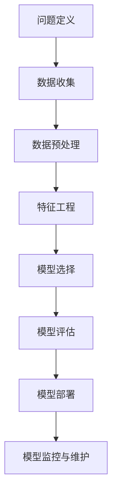

                 

## 《人类计算：AI时代的未来技能发展趋势》

### 关键词：人工智能、未来技能、职业发展、人机交互、数据分析

在人工智能（AI）迅猛发展的今天，技术变革正在深刻地影响人类的职业和生活。从自动化生产线的普及到智能家居的广泛应用，AI正在逐步接管许多传统的人类工作。与此同时，新的职业机会和技能需求也在不断涌现。本文旨在探讨AI时代人类所需的关键技能，以及这些技能如何影响未来职业的发展趋势。

> 摘要：本文通过深入分析人工智能的基本概念、核心技术，以及其在各个领域的应用，探讨了AI时代人类所需的关键技能，包括数据分析、自动化与脚本编程、机器学习实践、人机交互设计和情感计算等。同时，文章还分析了技能发展趋势和未来工作场景，提供了跨学科合作、新兴职业以及教育培训的相关见解。通过案例与实践部分，文章展示了如何在实际项目中应用这些技能，并提出了未来发展策略和教育培训建议。

本文结构如下：

1. **引言**：介绍书籍的主题、目标、AI时代的背景与趋势，以及人类计算的概念与范畴。
2. **AI技术基础**：讲解人工智能的定义、机器学习与深度学习基础、神经网络与深度学习架构。
3. **AI时代的未来技能**：详细介绍数据分析与可视化、自动化与脚本编程、机器学习实践、人机交互设计、情感计算与情感分析。
4. **技能发展趋势与未来工作场景**：分析技能需求的变化、未来工作场景的预测，以及技能提升策略。
5. **跨学科合作与新兴职业**：探讨跨学科合作的重要性、新兴职业的涌现，以及职业规划与个人发展。
6. **教育与培训**：讨论教育体系的变革、在线教育与培训趋势，以及教育资源和平台介绍。
7. **案例与实践**：展示AI企业案例、个人成长与转型案例，以及实践与探索的经验。
8. **附录**：提供常用工具与资源、参考文献和讨论。

让我们一步一步深入探讨这些主题，理解AI时代人类计算的未来发展趋势。

### 《人类计算：AI时代的未来技能发展趋势》目录大纲

#### 第一部分：引言

1. **1.1 书籍概述**
   - **1.1.1 书籍主题与目标**
   - **1.1.2 AI时代背景与趋势**
   - **1.1.3 人类计算的概念与范畴**

2. **1.2 AI技术基础**
   - **1.2.1 人工智能的定义与发展历程**
   - **1.2.2 机器学习与深度学习基础**
   - **1.2.3 神经网络与深度学习架构**

#### 第二部分：AI时代的未来技能

1. **2.1 数据分析与可视化**
   - **2.1.1 数据分析的基本概念与流程**
   - **2.1.2 数据可视化技术与应用**
   - **2.1.3 数据分析工具与软件介绍**

2. **2.2 自动化与脚本编程**
   - **2.2.1 自动化的概念与优势**
   - **2.2.2 脚本编程的基础知识**
   - **2.2.3 常用脚本语言介绍与比较**

3. **2.3 机器学习实践**
   - **2.3.1 机器学习项目流程**
   - **2.3.2 数据预处理与特征工程**
   - **2.3.3 常见机器学习算法与应用**

4. **2.4 人机交互设计**
   - **2.4.1 人机交互的基本原理**
   - **2.4.2 用户体验设计方法**
   - **2.4.3 常见人机交互界面设计工具**

5. **2.5 情感计算与情感分析**
   - **2.5.1 情感计算的基本概念**
   - **2.5.2 情感分析技术与应用**
   - **2.5.3 情感计算工具与平台介绍**

#### 第三部分：技能发展趋势与未来工作场景

1. **3.1 技能与岗位的未来趋势**
   - **3.1.1 技能需求的变化**
   - **3.1.2 未来工作场景预测**
   - **3.1.3 技能提升策略**

2. **3.2 跨学科合作与新兴职业**
   - **3.2.1 跨学科合作的重要性**
   - **3.2.2 新兴职业的涌现**
   - **3.2.3 职业规划与个人发展**

3. **3.3 教育与培训**
   - **3.3.1 教育体系的变革**
   - **3.3.2 在线教育与培训趋势**
   - **3.3.3 教育资源与平台介绍**

#### 第四部分：案例与实践

1. **4.1 AI企业案例**
   - **4.1.1 企业AI应用实例**
   - **4.1.2 AI项目成功要素**
   - **4.1.3 企业AI战略规划与实施**

2. **4.2 个人成长与转型案例**
   - **4.2.1 成功转型故事**
   - **4.2.2 职业技能提升方法**
   - **4.2.3 职场转型策略**

3. **4.3 实践与探索**
   - **4.3.1 AI实践项目介绍**
   - **4.3.2 项目实施过程与经验**
   - **4.3.3 实践成果与反思**

#### 附录

1. **附录 A：常用工具与资源**
   - **A.1 数据分析与可视化工具**
   - **A.2 自动化与脚本编程工具**
   - **A.3 机器学习工具与平台**
   - **A.4 人机交互设计工具**

2. **附录 B：参考文献**
   - **B.1 相关书籍推荐**
   - **B.2 学术论文与报告**
   - **B.3 在线资源与论坛**

3. **附录 C：问答与讨论**
   - **C.1 常见问题解答**
   - **C.2 讨论与互动**
   - **C.3 读者反馈与交流**

### 1.1 书籍概述

《人类计算：AI时代的未来技能发展趋势》是一本深入探讨人工智能（AI）时代人类所需技能及其发展趋势的著作。随着AI技术的不断进步和应用领域的拓展，人类面临着前所未有的挑战和机遇。本书旨在帮助读者理解AI技术的基础，掌握AI时代所需的关键技能，并预测未来职业发展的趋势。

#### 1.1.1 书籍主题与目标

本书的主题是探讨AI时代的未来技能发展趋势，具体目标如下：

- **理解AI技术的基础**：介绍人工智能的定义、发展历程、核心技术和应用领域，帮助读者建立全面的技术视野。
- **掌握关键技能**：详细讲解数据分析、自动化与脚本编程、机器学习实践、人机交互设计、情感计算等AI时代所需的关键技能，提供实际应用案例和实践方法。
- **预测未来职业发展趋势**：分析AI技术对职业需求的影响，预测未来工作场景的变化，为读者提供职业规划和技能提升的指导。
- **促进跨学科合作**：探讨跨学科合作在AI时代的重要性，介绍新兴职业的涌现和职业规划的方法。

#### 1.1.2 AI时代背景与趋势

AI时代的背景和趋势可以从以下几个方面进行分析：

- **技术进步**：随着计算能力的提升、数据量的爆炸性增长和算法的优化，AI技术正在快速发展。深度学习、强化学习、生成对抗网络等新兴技术的出现，进一步拓展了AI的应用范围。
- **应用广泛**：AI技术在各个领域得到广泛应用，如自动驾驶、智能家居、医疗诊断、金融服务、制造业等。AI的应用不仅提高了生产效率和产品质量，还改变了人类的生活方式。
- **伦理和道德问题**：随着AI技术的发展，伦理和道德问题逐渐凸显，如数据隐私、算法偏见、自动化失业等。这些问题需要人类在技术发展过程中进行深入思考和解决。

#### 1.1.3 人类计算的概念与范畴

人类计算是指人类在AI时代所需具备的计算能力，包括数据处理、自动化操作、人机交互和情感计算等。具体来说，人类计算涉及以下方面：

- **数据处理**：随着数据量的增长，人类需要具备高效的数据处理能力，包括数据采集、存储、清洗、分析和可视化等。
- **自动化操作**：通过自动化和脚本编程，人类可以减少重复性工作，提高工作效率。自动化技术广泛应用于生产、办公、家庭等领域。
- **人机交互**：随着智能设备的普及，人类需要掌握人机交互设计的基本原理和技能，提供更好的用户体验。
- **情感计算**：情感计算是指模拟人类情感的计算技术，包括情感识别、情感表达和情感理解等。情感计算在智能家居、医疗健康、教育等领域具有广泛应用。

在接下来的部分，我们将进一步探讨AI技术的基础知识，以及AI时代人类所需的关键技能。

### 1.2 AI技术基础

在探讨AI时代的未来技能之前，了解人工智能（AI）的基础知识是至关重要的。本部分将介绍人工智能的定义、发展历程、机器学习与深度学习基础、神经网络与深度学习架构，帮助读者建立全面的技术视野。

#### 1.2.1 人工智能的定义与发展历程

人工智能（Artificial Intelligence，简称AI）是指通过计算机模拟人类的智能行为，使计算机具备自主学习和决策能力的技术。人工智能的定义可以从以下几个方面进行理解：

- **模拟人类智能行为**：人工智能的目标是模拟人类在感知、理解、推理、决策和行动等方面的能力。例如，图像识别、语音识别、自然语言处理等。
- **自主学习和适应**：人工智能系统能够通过学习和适应环境，提高其性能和效果。这种学习可以是基于数据的训练，也可以是基于规则的推理。
- **自动化决策**：人工智能系统能够自动化地进行决策，减少人类干预。这种自动化决策在自动驾驶、智能制造、智能金融等领域具有广泛应用。

人工智能的发展历程可以追溯到20世纪50年代，经历了以下几个阶段：

1. **早期探索阶段（1950-1969）**：1956年，达特茅斯会议上人工智能概念的提出，标志着人工智能正式成为一门学科。早期的人工智能研究主要集中在逻辑推理和问题解决上。
2. **蓬勃发展阶段（1970-1989）**：随着计算机性能的提升和算法的优化，人工智能在专家系统、机器学习和计算机视觉等领域取得了显著进展。
3. **低谷与复苏阶段（1990-2000）**：由于实际应用中的困难和技术瓶颈，人工智能在1990年代经历了短暂的低谷。然而，随着互联网的兴起，人工智能开始逐渐复苏，尤其是在机器学习和深度学习领域。
4. **快速发展阶段（2000至今）**：随着计算能力的提升、数据量的爆炸性增长和算法的优化，人工智能进入了快速发展阶段。深度学习、生成对抗网络、强化学习等新兴技术不断涌现，推动了人工智能在各个领域的应用。

#### 1.2.2 机器学习与深度学习基础

机器学习（Machine Learning，简称ML）是人工智能的一个重要分支，它通过算法让计算机从数据中自动学习和改进性能。机器学习可以分为监督学习、无监督学习和强化学习三种类型：

- **监督学习（Supervised Learning）**：在监督学习过程中，训练数据集包含了输入和对应的输出（标签），算法通过学习这些输入和输出之间的关系来预测新的输入数据。常见的监督学习算法包括线性回归、决策树、支持向量机（SVM）和神经网络等。
  
  **监督学习流程**：
  ```mermaid
  graph TD
  A[输入数据] --> B[特征提取]
  B --> C[模型训练]
  C --> D[模型评估]
  D --> E[预测新数据]
  ```

- **无监督学习（Unsupervised Learning）**：无监督学习过程中，训练数据集不包含输出标签，算法通过学习数据内在的结构和模式来发现数据分布。常见的无监督学习算法包括聚类、主成分分析（PCA）和自编码器等。

  **无监督学习流程**：
  ```mermaid
  graph TD
  A[输入数据] --> B[特征提取]
  B --> C[模式发现]
  C --> D[聚类分析]
  ```

- **强化学习（Reinforcement Learning）**：强化学习是一种通过奖励机制来指导学习过程的机器学习方法。在强化学习过程中，智能体通过与环境交互，不断优化其策略以最大化长期奖励。常见的强化学习算法包括Q-learning、SARSA和深度确定性策略梯度（DDPG）等。

  **强化学习流程**：
  ```mermaid
  graph TD
  A[智能体] --> B[状态]
  B --> C[动作]
  C --> D[奖励]
  D --> E[更新策略]
  ```

深度学习（Deep Learning，简称DL）是一种基于多层神经网络的机器学习方法，它在图像识别、自然语言处理和语音识别等领域取得了显著成果。深度学习的基础是多层感知机（Multilayer Perceptron，简称MLP），而现代深度学习模型通常基于卷积神经网络（Convolutional Neural Network，简称CNN）和循环神经网络（Recurrent Neural Network，简称RNN）。

- **卷积神经网络（CNN）**：卷积神经网络是一种用于图像识别和处理的深度学习模型，其核心思想是通过卷积操作提取图像的特征。CNN由多个卷积层、池化层和全连接层组成，能够自动学习图像的层次结构。

  **CNN基本架构**：
  ```mermaid
  graph TD
  A[输入图像] --> B[卷积层1]
  B --> C[池化层1]
  C --> D[卷积层2]
  D --> E[池化层2]
  E --> F[全连接层]
  ```

- **循环神经网络（RNN）**：循环神经网络是一种用于处理序列数据的深度学习模型，其核心思想是保存长时状态信息。RNN通过循环结构将当前状态与历史状态相结合，适用于自然语言处理、语音识别和时间序列分析等领域。

  **RNN基本架构**：
  ```mermaid
  graph TD
  A[输入序列] --> B[隐藏状态]
  B --> C[输出序列]
  C --> D[隐藏状态]
  ```

#### 1.2.3 神经网络与深度学习架构

神经网络（Neural Network，简称NN）是一种模仿生物神经系统的计算模型，由大量的神经元（节点）通过连接（边）组成。神经网络通过学习输入和输出之间的关系，实现函数逼近、分类和回归等任务。

- **基本结构**：一个基本的神经网络由输入层、隐藏层和输出层组成。输入层接收外部输入，隐藏层通过非线性激活函数处理输入，输出层生成最终输出。

  **神经网络基本架构**：
  ```mermaid
  graph TD
  A[输入层] --> B[隐藏层1]
  B --> C[隐藏层2]
  C --> D[输出层]
  ```

- **前向传播与反向传播**：神经网络的训练过程包括前向传播和反向传播两个阶段。在前向传播阶段，输入通过网络传播，生成输出；在反向传播阶段，根据输出误差，反向更新网络参数。

  **前向传播与反向传播流程**：
  ```mermaid
  graph TD
  A[输入] --> B[权重]
  B --> C[激活函数]
  C --> D[输出]
  D --> E[误差]
  E --> F[反向传播]
  ```

- **激活函数**：激活函数是神经网络中的关键组件，用于引入非线性特性。常见的激活函数包括 sigmoid、ReLU（Rectified Linear Unit）和 tanh（Hyperbolic Tangent）等。

  **激活函数示例**：
  ```python
  # Sigmoid激活函数
  def sigmoid(x):
      return 1 / (1 + exp(-x))
  
  # ReLU激活函数
  def relu(x):
      return max(0, x)
  
  # tanh激活函数
  def tanh(x):
      return (exp(x) - exp(-x)) / (exp(x) + exp(-x))
  ```

通过理解人工智能的定义、发展历程、机器学习与深度学习基础，以及神经网络与深度学习架构，读者可以更好地把握AI技术的基础，为后续章节的探讨打下坚实的基础。在接下来的部分，我们将详细探讨AI时代人类所需的关键技能。

### 2.1 数据分析与可视化

在AI时代，数据分析与可视化已成为关键技能，它不仅帮助我们从海量数据中提取有价值的信息，还能以直观的方式展示这些信息。本节将详细讲解数据分析的基本概念与流程、数据可视化技术与应用，以及常用数据分析工具与软件。

#### 2.1.1 数据分析的基本概念与流程

数据分析是指通过统计、建模和可视化等方法，从数据中提取有用信息，并转化为可操作的知识的过程。数据分析的基本概念包括以下几个方面：

- **数据清洗**：数据清洗是数据分析的第一步，旨在去除数据中的噪声和不一致的数据。常见的操作包括去除重复数据、填补缺失值、纠正错误等。
- **数据探索**：数据探索旨在了解数据的结构和分布，通过可视化技术展示数据的特征和关系。常见的探索性数据分析（EDA）方法包括描述性统计、相关性分析、聚类分析等。
- **数据建模**：数据建模是通过建立数学模型来描述数据之间的关系，从而预测未来的趋势或行为。常见的建模方法包括线性回归、决策树、神经网络等。
- **数据可视化**：数据可视化是将数据以图形化的方式展示，帮助人们更好地理解和分析数据。常见的数据可视化技术包括散点图、折线图、柱状图、饼图等。

数据分析的流程可以概括为以下步骤：

1. **问题定义**：明确分析的目标和问题，确定所需的数据和分析方法。
2. **数据收集**：收集相关的数据，包括结构化数据和非结构化数据。
3. **数据清洗**：对收集到的数据进行清洗，去除噪声和错误，确保数据的质量和一致性。
4. **数据探索**：通过探索性数据分析，了解数据的结构和分布，发现数据中的潜在问题和特征。
5. **数据建模**：根据分析目标，选择合适的建模方法，建立数学模型。
6. **模型评估**：评估模型的性能和准确性，调整模型参数以优化模型效果。
7. **数据可视化**：通过可视化技术，将分析结果以图形化的方式展示，帮助人们更好地理解和应用分析结果。

#### 2.1.2 数据可视化技术与应用

数据可视化是将复杂的数据以图形化的方式展示，帮助人们快速理解和分析数据。常见的数据可视化技术包括以下几种：

- **散点图**：散点图用于展示两个变量之间的关系，通过坐标轴上的点来表示数据。散点图适用于探索变量之间的相关性。
- **折线图**：折线图用于展示数据随时间的变化趋势，通过连接各个数据点的线段来表示数据。折线图适用于分析时间序列数据。
- **柱状图**：柱状图用于比较不同类别的数据，通过不同长度的柱子来表示数据的大小。柱状图适用于分类数据的比较。
- **饼图**：饼图用于展示数据的比例分布，通过圆内各部分的大小来表示数据占比。饼图适用于展示分类数据的占比。
- **热力图**：热力图用于展示多维数据的分布和关系，通过颜色深浅来表示数据的值。热力图适用于探索高维数据的特征。

数据可视化在实际应用中具有广泛的应用，以下是一些典型的应用场景：

- **市场分析**：通过数据可视化，企业可以了解客户行为、市场需求和竞争情况，从而制定更有效的营销策略。
- **金融分析**：通过数据可视化，投资者可以分析市场趋势、财务报表和投资组合，做出更明智的投资决策。
- **医疗健康**：通过数据可视化，医生可以分析患者数据、诊断结果和治疗过程，提高医疗诊断和治疗的效果。
- **城市规划**：通过数据可视化，城市规划者可以了解城市交通流量、人口分布和环境状况，优化城市规划和管理。

#### 2.1.3 数据分析工具与软件介绍

数据分析工具和软件是进行数据分析和可视化的重要工具，以下是一些常用的工具和软件：

- **Python数据分析库**：Python是进行数据分析的常用编程语言，常用的数据分析库包括Pandas、NumPy、Matplotlib和Seaborn等。Pandas用于数据处理，NumPy用于数值计算，Matplotlib和Seaborn用于数据可视化。
  ```python
  import pandas as pd
  import numpy as np
  import matplotlib.pyplot as plt
  import seaborn as sns
  
  # 示例：加载数据和绘制散点图
  data = pd.read_csv('data.csv')
  sns.scatterplot(x='feature1', y='feature2', data=data)
  plt.show()
  ```

- **R数据分析软件**：R是一种专门用于统计分析和数据可视化的编程语言，具有丰富的统计分析和可视化功能。R的常用数据可视化包包括ggplot2、plotly和Lattice等。
  ```R
  library(ggplot2)
  
  # 示例：加载数据和绘制折线图
  data <- read.csv('data.csv')
  ggplot(data, aes(x=timestamp, y=value)) + geom_line()
  ```

- **Tableau数据可视化工具**：Tableau是一种直观易用的数据可视化工具，适用于各种规模的企业和组织。Tableau支持多种数据源，并提供丰富的可视化图表和交互功能。
  ```R
  # 示例：连接数据源和创建柱状图
  t = tableauConnect('data_source')
  t$createTableauView('data.csv', 'tableau_view_name')
  ```

- **Power BI数据可视化工具**：Power BI是微软推出的商业智能工具，提供强大的数据连接、分析和可视化功能。Power BI适用于企业级用户，支持多种数据源和丰富的可视化图表。
  ```R
  # 示例：连接数据源和创建仪表板
  pbix = createPowerBIReport('data_source', 'report_name')
  pbix$addTable('data.csv')
  ```

通过掌握数据分析与可视化的基本概念、技术与应用，以及常用工具和软件，读者可以更有效地从数据中提取有价值的信息，为决策提供支持。在接下来的部分，我们将探讨自动化与脚本编程这一关键技能。

### 2.2 自动化与脚本编程

在AI时代，自动化与脚本编程已成为提高工作效率和生产力的重要手段。自动化是指通过预先设定的规则或算法，使计算机自动执行任务的过程。脚本编程则是一种使用特定编程语言编写的自动化脚本，用于实现特定的任务或功能。本节将介绍自动化的概念与优势、脚本编程的基础知识，以及常用脚本语言介绍与比较。

#### 2.2.1 自动化的概念与优势

自动化是指通过计算机程序或控制逻辑，使机器或系统能够自动执行特定的任务，而不需要人工干预。自动化技术广泛应用于各个领域，如生产制造、金融服务、医疗健康和信息技术等。自动化的核心思想是减少人力投入，提高工作效率和准确性。

**自动化的概念**：

- **任务定义**：首先需要明确需要自动化的任务，包括任务的输入、输出和执行步骤。
- **规则或算法**：根据任务需求，设计相应的规则或算法，使系统能够自动执行任务。
- **执行与监控**：自动化系统通过执行预定的规则或算法，自动完成任务的各个步骤，并通过监控机制确保任务的执行效果。

**自动化的优势**：

1. **提高效率**：自动化可以减少人工操作的时间，提高任务执行的效率。例如，在软件开发中，自动化测试可以大幅减少测试时间，提高代码质量。
2. **降低成本**：自动化可以减少人力成本，特别是在重复性、繁琐的任务中。通过自动化，企业可以节省大量的人力资源，降低运营成本。
3. **提高准确性**：自动化系统可以减少人为错误，提高任务执行的准确性。例如，在金融领域，自动化交易系统可以精确执行交易策略，降低风险。
4. **增强可扩展性**：自动化系统易于扩展和调整，可以根据业务需求进行灵活配置。这使得企业能够快速适应市场变化，提高竞争力。

#### 2.2.2 脚本编程的基础知识

脚本编程是一种使用特定编程语言编写的自动化脚本，用于实现特定的任务或功能。脚本编程通常具有以下特点：

- **轻量级**：脚本编程通常用于执行简单的任务，如数据转换、文件处理和自动化测试等。脚本编程语言通常较为简单，易于学习和使用。
- **跨平台**：大多数脚本编程语言具有跨平台特性，可以在不同的操作系统上运行，如Windows、Linux和Mac OS等。
- **快速开发**：脚本编程通常具有快速开发的特点，能够快速实现简单的自动化任务。这使得脚本编程成为开发人员的常用工具。

**脚本编程的基础知识**：

1. **编程语言选择**：常见的脚本编程语言包括Python、Java、Ruby和Bash等。Python由于其简洁的语法和强大的库支持，成为最流行的脚本编程语言之一。
2. **变量与数据类型**：在脚本编程中，变量用于存储数据。不同的编程语言支持不同的数据类型，如整数、浮点数、字符串和列表等。
3. **控制结构**：控制结构用于控制程序流程，包括条件判断（if-else）、循环（for和while）和函数定义等。
4. **文件与IO操作**：脚本编程通常涉及文件操作，如读取和写入文件。常用的文件操作包括打开文件、读取文件内容、写入文件内容和关闭文件等。
5. **异常处理**：异常处理用于处理程序运行过程中可能出现的错误和异常情况。常见的异常处理方法包括try-except语句和异常捕获等。

**脚本编程的基本结构**：

```python
# 示例：Python脚本编程

# 定义函数
def greet(name):
    print("Hello, " + name)

# 主程序
if __name__ == "__main__":
    name = input("请输入您的名字：")
    greet(name)
```

#### 2.2.3 常用脚本语言介绍与比较

以下是一些常用的脚本编程语言及其特点：

1. **Python**：Python是一种高级编程语言，以其简洁的语法和强大的库支持而闻名。Python广泛应用于数据分析、机器学习、人工智能和Web开发等领域。
   - **优点**：易于学习、跨平台、丰富的库支持、强大的社区支持。
   - **缺点**：执行速度较慢。

2. **Java**：Java是一种面向对象的高级编程语言，广泛应用于企业级应用、Web开发和Android开发等领域。
   - **优点**：跨平台、强类型、丰富的库支持、成熟的技术生态。
   - **缺点**：较复杂的语法、内存消耗较大。

3. **Ruby**：Ruby是一种面向对象的高级编程语言，以其简洁的语法和强大的框架（如Rails）而闻名。Ruby广泛应用于Web开发、自动化和脚本编程等领域。
   - **优点**：易于学习、简洁的语法、强大的社区支持。
   - **缺点**：执行速度较慢、较不成熟的生态系统。

4. **Bash**：Bash是一种Linux和Unix系统的命令行脚本语言，用于自动化执行命令和任务。
   - **优点**：跨平台、简单易用、强大的命令行工具支持。
   - **缺点**：功能相对有限、不易于编写复杂的应用程序。

**比较**：

- **编程语言选择**：根据任务需求和开发环境选择合适的脚本编程语言。Python和Ruby适用于复杂的自动化任务和应用程序开发，Java适用于企业级应用和Web开发，Bash适用于Linux和Unix系统的命令行自动化。
- **性能与开发效率**：Python和Ruby具有较好的开发效率，但执行速度较慢。Java具有较好的性能和成熟的生态系统，但语法较为复杂。Bash功能有限，但适用于简单的命令行自动化任务。
- **社区支持**：Python、Java和Ruby具有强大的社区支持，提供了丰富的库和框架。Bash社区支持相对较弱，但适用于特定的命令行自动化需求。

通过了解自动化的概念与优势，脚本编程的基础知识，以及常用脚本语言介绍与比较，读者可以更好地掌握自动化与脚本编程技能，提高工作效率和生产力。在接下来的部分，我们将探讨机器学习实践这一关键技能。

### 2.3 机器学习实践

机器学习实践是将理论知识应用于实际问题的过程，通过收集数据、进行数据预处理、特征工程和选择合适的算法，实现预测和分析目标。本节将详细讲解机器学习项目流程、数据预处理与特征工程、常见机器学习算法与应用。

#### 2.3.1 机器学习项目流程

一个典型的机器学习项目通常包括以下几个步骤：

1. **问题定义**：明确项目目标，确定需要解决的问题或预测的目标。例如，预测房价、分类电子邮件是否为垃圾邮件等。
2. **数据收集**：收集与问题相关的数据。数据可以来自公开数据集、企业数据库或在线资源。例如，房价数据可以来自房地产网站，垃圾邮件数据可以来自邮件服务提供商。
3. **数据预处理**：清洗和准备数据，包括处理缺失值、异常值和噪声数据，将数据转换为适合机器学习算法的形式。例如，将文本数据转换为词向量，将图像数据转换为像素矩阵。
4. **特征工程**：从原始数据中提取有用的特征，以提升模型性能。特征工程包括特征选择、特征变换和特征构造等。例如，使用主成分分析（PCA）降维，使用交互特征增强模型。
5. **模型选择**：选择合适的机器学习算法，并进行训练和测试。常见的机器学习算法包括线性回归、决策树、支持向量机（SVM）、神经网络和集成方法等。
6. **模型评估**：评估模型的性能，包括准确率、召回率、F1分数和ROC曲线等。根据评估结果，调整模型参数或更换算法。
7. **模型部署**：将训练好的模型部署到生产环境，实现预测和决策。模型部署可以是在线服务、批处理或实时预测等。
8. **模型监控与维护**：监控模型的性能和稳定性，定期更新数据和模型，以保持模型的准确性和可靠性。

**机器学习项目流程**：


#### 2.3.2 数据预处理与特征工程

数据预处理和特征工程是机器学习项目的重要环节，直接影响模型的性能和准确性。以下是一些常见的数据预处理和特征工程方法：

1. **数据清洗**：
   - **处理缺失值**：使用均值、中位数、众数或插值等方法填补缺失值。
   - **处理异常值**：使用统计方法（如Z-score、IQR）或可视化方法（如箱线图）检测和修正异常值。
   - **数据规范化**：将数据缩放到同一尺度，如使用最小-最大缩放或标准化。

2. **数据转换**：
   - **类别数据编码**：将类别数据转换为数值数据，如使用独热编码或标签编码。
   - **文本数据预处理**：使用分词、停用词过滤和词嵌入等方法处理文本数据。
   - **图像数据预处理**：使用图像增强、缩放、裁剪和归一化等方法处理图像数据。

3. **特征选择**：
   - **相关性分析**：使用皮尔逊相关系数或斯皮尔曼相关系数等方法检测特征之间的相关性，剔除冗余特征。
   - **特征重要性评估**：使用随机森林、梯度提升树等算法评估特征的重要性，选择关键特征。
   - **递归特征消除（RFE）**：通过递归地去除重要性较低的特征，逐步筛选出最佳特征组合。

4. **特征变换**：
   - **主成分分析（PCA）**：通过线性变换降低特征维度，提高模型的泛化能力。
   - **特征融合**：将多个特征组合成新的特征，如使用交互特征、多项式特征等。

5. **特征构造**：
   - **时间序列特征**：提取时间序列数据中的趋势、季节性和周期性特征。
   - **空间特征**：提取地理位置、区域分布等空间特征。
   - **社会网络特征**：提取社交网络中的关系、影响力等特征。

**数据预处理与特征工程示例**：
```python
import pandas as pd
from sklearn.model_selection import train_test_split
from sklearn.preprocessing import StandardScaler, OneHotEncoder
from sklearn.impute import SimpleImputer

# 加载数据
data = pd.read_csv('data.csv')

# 数据清洗
# 填补缺失值
imputer = SimpleImputer(strategy='mean')
data[['feature1', 'feature2']] = imputer.fit_transform(data[['feature1', 'feature2']])

# 处理异常值
# 使用Z-score方法检测和修正异常值
z_scores = (data['feature3'] - data['feature3'].mean()) / data['feature3'].std()
data['feature3'] = data['feature3'].where((z_scores > -3) & (z_scores < 3), data['feature3'].mean())

# 数据转换
# 类别数据编码
encoder = OneHotEncoder()
data_encoded = encoder.fit_transform(data[['category1', 'category2']]).toarray()

# 特征选择
# 使用相关性分析剔除冗余特征
correlations = data.corr().abs()
high_corr_features = correlations[correlations > 0.7].index
data = data.drop(high_corr_features, axis=1)

# 特征变换
# 使用标准化方法
scaler = StandardScaler()
data[['feature1', 'feature2']] = scaler.fit_transform(data[['feature1', 'feature2']])

# 特征工程
# 构造时间序列特征
data['trend'] = data['feature3'].rolling(window=3).mean()
data['seasonality'] = data['feature3'].rolling(window=3).std()

# 分割训练集和测试集
X_train, X_test, y_train, y_test = train_test_split(data.drop('target', axis=1), data['target'], test_size=0.2, random_state=42)
```

#### 2.3.3 常见机器学习算法与应用

在机器学习项目中，选择合适的算法是实现高准确性和可解释性的关键。以下是一些常见的机器学习算法及其应用场景：

1. **线性回归（Linear Regression）**：
   - **原理**：通过最小化预测值与实际值之间的误差，建立输入特征与输出目标之间的线性关系。
   - **应用场景**：用于回归任务，如预测房价、股票价格等。
   - **算法实现**：
     ```python
     from sklearn.linear_model import LinearRegression
     model = LinearRegression()
     model.fit(X_train, y_train)
     predictions = model.predict(X_test)
     ```

2. **决策树（Decision Tree）**：
   - **原理**：通过递归地将数据集分割为子集，使每个子集中的数据尽可能纯，即每个子集中的数据具有相同的标签。
   - **应用场景**：用于分类和回归任务，如信用卡欺诈检测、疾病诊断等。
   - **算法实现**：
     ```python
     from sklearn.tree import DecisionTreeClassifier
     model = DecisionTreeClassifier()
     model.fit(X_train, y_train)
     predictions = model.predict(X_test)
     ```

3. **支持向量机（Support Vector Machine，SVM）**：
   - **原理**：通过寻找最优超平面，将数据集划分为不同的类别。
   - **应用场景**：用于分类任务，如手写体识别、文本分类等。
   - **算法实现**：
     ```python
     from sklearn.svm import SVC
     model = SVC()
     model.fit(X_train, y_train)
     predictions = model.predict(X_test)
     ```

4. **神经网络（Neural Network）**：
   - **原理**：通过多层神经元的非线性变换，模拟人脑的学习过程。
   - **应用场景**：用于分类、回归和时间序列预测等任务，如图像识别、语音识别、股票价格预测等。
   - **算法实现**：
     ```python
     from sklearn.neural_network import MLPClassifier
     model = MLPClassifier()
     model.fit(X_train, y_train)
     predictions = model.predict(X_test)
     ```

5. **集成方法（Ensemble Methods）**：
   - **原理**：通过组合多个基学习器，提高模型的性能和鲁棒性。
   - **应用场景**：用于分类和回归任务，如随机森林、梯度提升树等。
   - **算法实现**：
     ```python
     from sklearn.ensemble import RandomForestClassifier
     model = RandomForestClassifier()
     model.fit(X_train, y_train)
     predictions = model.predict(X_test)
     ```

通过了解机器学习项目流程、数据预处理与特征工程，以及常见机器学习算法与应用，读者可以更好地掌握机器学习实践技能，为实际问题提供有效的解决方案。在接下来的部分，我们将探讨人机交互设计这一关键技能。

### 2.4 人机交互设计

在人机交互（Human-Computer Interaction，简称HCI）领域，设计良好的用户界面（User Interface，简称UI）是提升用户体验、提高系统使用效率的关键。人机交互设计涉及多个方面，包括用户行为研究、界面布局、交互元素设计、用户体验评估等。本节将详细讲解人机交互的基本原理、用户体验设计方法和常见的人机交互界面设计工具。

#### 2.4.1 人机交互的基本原理

人机交互设计旨在使计算机系统能够更好地适应人类用户的需求，提高系统的可用性、可访问性和满意度。人机交互的基本原理包括以下几个方面：

1. **用户中心设计**：用户中心设计（User-Centered Design，简称UCD）是一种以用户需求为核心的设计方法。在设计过程中，始终关注用户的需求、行为和体验，确保设计满足用户期望。

2. **交互模型**：交互模型描述了用户与计算机系统之间的交互过程。常见的交互模型包括认知模型、信息处理模型和行为模型等。认知模型关注用户的认知过程，如注意力、记忆和决策等；信息处理模型关注用户接收、处理和反馈信息的过程；行为模型关注用户执行任务的过程和行为。

3. **反馈机制**：反馈机制是用户与系统之间的重要沟通渠道。通过反馈机制，系统能够向用户传达信息，用户也能通过反馈了解系统的状态和响应。常见的反馈方式包括视觉反馈、听觉反馈和触觉反馈等。

4. **可访问性**：可访问性（Accessibility）是指确保不同用户（包括残疾人、老年人、视力或听力障碍者等）能够无障碍地使用计算机系统。可访问性设计包括无障碍导航、屏幕阅读器支持、键盘导航等。

5. **用户体验**：用户体验（User Experience，简称UX）是指用户在使用系统过程中的整体感受和满意度。用户体验设计关注用户在使用系统过程中的情感、行为和认知体验，旨在提升用户的满意度和忠诚度。

#### 2.4.2 用户体验设计方法

用户体验设计是一种系统化的方法，旨在确保用户在使用系统时能够获得最佳体验。以下是一些常用的用户体验设计方法：

1. **用户研究**：用户研究是用户体验设计的基础。通过用户访谈、问卷调查、用户测试等方法，了解用户的需求、行为和痛点，为设计提供依据。

2. **原型设计**：原型设计是用户体验设计的重要环节。通过创建低保真或高保真的原型，模拟系统的界面和交互，评估设计的可行性和用户满意度。

3. **用户测试**：用户测试是验证用户体验设计有效性的关键步骤。通过让真实用户使用系统原型，收集用户反馈和意见，发现设计中的问题和改进点。

4. **迭代改进**：迭代改进是一种持续改进的设计方法。通过不断进行用户研究、原型设计和用户测试，逐步优化设计，提升用户体验。

5. **可用性评估**：可用性评估是评估系统可用性的一种方法。通过评估系统的易用性、效率、满意度等指标，判断设计的成功与否，并为后续改进提供依据。

#### 2.4.3 常见人机交互界面设计工具

在用户体验设计过程中，常用的工具包括以下几种：

1. **Figma**：Figma是一种基于网页的界面设计工具，支持实时协作和原型设计。Figma提供了丰富的组件和设计资源，方便设计师创建美观且响应式的用户界面。

2. **Sketch**：Sketch是一款流行的矢量界面设计工具，适用于Mac操作系统。Sketch提供了简洁直观的界面和强大的设计功能，适合设计师进行界面设计和原型制作。

3. **Adobe XD**：Adobe XD是Adobe公司推出的界面设计工具，支持网页、移动应用和桌面应用的界面设计。Adobe XD具有强大的交互设计和原型制作功能，能够实现高度逼真的用户体验模拟。

4. **Axure RP**：Axure RP是一种专业的原型设计工具，适用于Web、移动应用和桌面应用的界面设计。Axure RP提供了丰富的交互元素和原型制作功能，支持制作高保真的交互原型。

5. **InVision**：InVision是一款基于网页的交互设计工具，支持原型设计和协作。InVision提供了丰富的设计模板和组件库，方便设计师快速创建原型和应用界面。

通过了解人机交互的基本原理、用户体验设计方法和常见的人机交互界面设计工具，读者可以更好地进行用户界面设计，提升用户体验和系统使用效率。在接下来的部分，我们将探讨情感计算与情感分析这一关键技能。

### 2.5 情感计算与情感分析

情感计算（Affective Computing）是指计算机系统模拟、识别、理解和表达人类情感的能力。随着人工智能技术的发展，情感计算在智能交互、心理健康、教育等领域展现出广泛的应用前景。情感分析（Sentiment Analysis）是情感计算的核心技术之一，通过自然语言处理技术，对文本数据中的情感倾向进行识别和分析。本节将详细讲解情感计算的基本概念、情感分析技术与应用，以及情感计算工具与平台介绍。

#### 2.5.1 情感计算的基本概念

情感计算是人工智能领域的一个重要研究方向，它旨在使计算机系统具备模拟、识别、理解和表达人类情感的能力。情感计算的基本概念包括以下几个方面：

1. **情感模拟**：情感模拟是指计算机系统模拟人类情感的过程，包括情感表达、情感反应和情感传递等。情感模拟可以通过图像、声音、文字等多种方式实现，使计算机系统能够更好地与用户进行情感交流。

2. **情感识别**：情感识别是指计算机系统通过分析用户的语音、文字、行为等信息，识别用户的情感状态。情感识别技术包括面部表情识别、语音情感识别和文本情感识别等。

3. **情感理解**：情感理解是指计算机系统对情感信息进行深入分析，理解情感的含义、上下文和情感强度等。情感理解技术有助于计算机系统更好地理解用户的情感需求，提供个性化的服务和解决方案。

4. **情感表达**：情感表达是指计算机系统通过模拟情感表情、声音和动作等方式，向用户传达情感信息。情感表达技术能够增强用户与计算机系统之间的情感互动，提升用户体验。

#### 2.5.2 情感分析技术与应用

情感分析是情感计算的核心技术之一，通过对文本数据中的情感倾向进行识别和分析，帮助计算机系统更好地理解用户的情感状态。以下是一些常见的情感分析技术与应用：

1. **文本情感分类**：文本情感分类是指将文本数据分为正面、负面或中性等情感类别。常见的文本情感分类方法包括基于规则的方法、机器学习方法（如支持向量机、朴素贝叶斯、神经网络等）和深度学习方法（如卷积神经网络、长短时记忆网络等）。

2. **情感强度分析**：情感强度分析是指对文本数据中的情感倾向进行量化分析，评估情感的强度。情感强度分析通常使用情感极性（正面或负面）和情感强度值（如0-1或0-100）来表示。

3. **情感实体识别**：情感实体识别是指从文本数据中识别出与情感相关的实体（如人名、地点、组织等），并分析这些实体的情感倾向。情感实体识别有助于更准确地理解文本数据中的情感信息。

4. **多语言情感分析**：多语言情感分析是指对多种语言文本数据中的情感倾向进行识别和分析。多语言情感分析技术对于全球化企业和跨文化交流具有重要意义。

**情感分析技术与应用示例**：

假设我们有一段中文文本数据：“今天天气很好，我很开心。”，我们需要对其进行情感分析。

1. **文本预处理**：对文本数据进行清洗和分词，去除标点符号、停用词等无关信息，得到分词后的文本数据：“今天 天气 很好 ， 我 很开心 。”

2. **特征提取**：将分词后的文本数据转换为特征向量，常用的特征提取方法包括词袋模型、TF-IDF和词嵌入等。

3. **情感分类**：使用机器学习或深度学习模型对特征向量进行分类，判断文本数据的情感类别。例如，我们可以使用支持向量机（SVM）模型进行文本情感分类。

4. **情感强度分析**：对分类结果进行量化分析，评估情感的强度。例如，我们可以使用情感极性（正面或负面）和情感强度值（如0-1或0-100）来表示。

5. **情感实体识别**：从文本数据中识别出与情感相关的实体，如“我”和“开心”。

6. **多语言情感分析**：对于多种语言文本数据，我们可以使用相应的情感分析模型进行分类和分析。

通过情感计算与情感分析技术，计算机系统可以更好地理解用户的情感状态，提供个性化的服务和解决方案。以下是一些常见的情感计算工具与平台：

1. **TextBlob**：TextBlob是一个Python库，用于进行文本处理和情感分析。TextBlob提供了简单的API，可以快速实现文本情感分类和情感强度分析。

2. **NLTK**：NLTK（自然语言工具包）是一个开源的Python库，用于自然语言处理任务。NLTK提供了丰富的文本预处理和情感分析功能，适用于各种文本分析项目。

3. **VADER**：VADER（Valence Aware Dictionary and sEntiment Reasoner）是一个基于规则的文本情感分析工具，适用于社交媒体文本数据。VADER具有较好的情感分类和情感强度分析效果，适用于情感计算和情感分析项目。

4. **TensorFlow**：TensorFlow是一个开源的深度学习框架，提供了丰富的文本处理和情感分析功能。TensorFlow可以用于构建复杂的文本情感分析模型，适用于大规模情感计算项目。

5. **Sentiment140**：Sentiment140是一个开源的Python库，用于进行文本情感分析。Sentiment140提供了多种情感分析模型和评估指标，适用于情感计算和情感分析项目。

通过了解情感计算与情感分析的基本概念、技术与应用，以及常见情感计算工具与平台，读者可以更好地掌握情感计算与情感分析技能，为实际项目提供有效的解决方案。在接下来的部分，我们将探讨技能发展趋势与未来工作场景。

### 3.1 技能与岗位的未来趋势

随着人工智能（AI）技术的不断进步，技能需求和工作场景也在发生巨大的变化。未来，哪些技能将变得尤为重要？哪些岗位将面临重大变革？以下是对技能需求变化、未来工作场景预测以及技能提升策略的分析。

#### 3.1.1 技能需求的变化

1. **数据分析与机器学习技能**：随着大数据和AI技术的普及，数据分析与机器学习技能将成为未来职场的热门技能。无论是从事数据科学、人工智能研发，还是业务分析，掌握数据分析与机器学习技能都将变得至关重要。

2. **编程能力**：编程能力仍然是未来职场的基石。虽然编程语言在不断更新，但掌握一种或多种编程语言（如Python、Java、JavaScript等）将有助于从事软件开发、自动化和AI项目开发等工作。

3. **人机交互与用户体验设计**：随着智能设备的普及，人机交互和用户体验设计将成为未来职场的核心技能。设计师和开发者需要具备用户体验设计、人机交互和前端开发等技能，以满足不断变化的用户需求。

4. **自动化与脚本编程**：自动化和脚本编程技能将广泛应用于生产、运营和IT领域。通过自动化，企业可以提高效率、降低成本，从而在竞争中脱颖而出。

5. **云计算与边缘计算**：随着云计算和边缘计算的兴起，相关技能如云计算架构、容器技术、分布式系统等将成为未来职场的必备技能。

6. **网络安全与隐私保护**：随着数据泄露和网络攻击事件的频发，网络安全与隐私保护技能将变得更加重要。企业需要专业的安全专家来保护其数据和资产。

7. **跨学科能力**：未来职场将更加重视跨学科能力，如数据分析与市场营销、人工智能与法律等。跨学科能力有助于解决复杂问题，推动创新和发展。

#### 3.1.2 未来工作场景预测

1. **自动化与智能化**：许多传统工作岗位将被自动化和智能化技术取代，如流水线工人、客服代表、财务分析师等。然而，这些岗位将被转化为更高层次的技能要求，如数据科学家、AI工程师、自动化专家等。

2. **远程办公与协作**：随着远程办公技术的成熟，未来工作场景将更加灵活。企业将采用分布式团队模式，员工可以在不同的地理位置工作，通过协作工具保持高效沟通和协作。

3. **个性化服务与定制化需求**：消费者对个性化和定制化服务的需求越来越高。未来，企业将更加注重用户体验，通过AI技术提供个性化的产品和服务。

4. **数据驱动决策**：企业将越来越依赖数据驱动决策，数据分析师和AI专家将成为企业的核心资源。通过数据分析和预测，企业可以优化运营、提高效率和降低成本。

5. **新兴职业与领域**：随着AI技术的发展，新的职业和领域将不断涌现。例如，数据伦理学家、AI伦理学家、增强现实（AR）/虚拟现实（VR）设计师等。

6. **社会影响与责任**：随着AI技术的广泛应用，社会将面临一系列伦理和社会问题。例如，算法偏见、隐私保护、失业率上升等。企业和政府需要共同承担社会责任，确保AI技术发展符合伦理和社会价值观。

#### 3.1.3 技能提升策略

1. **持续学习与终身教育**：在技术快速变革的时代，持续学习和终身教育成为提升技能的关键。员工应主动学习新技能，参加在线课程、工作坊和研讨会，保持竞争力和适应能力。

2. **实践与项目经验**：通过参与实际项目，积累实践经验，提升技能水平。实际项目中的挑战和问题解决过程将帮助员工更好地理解和应用所学知识。

3. **跨学科合作**：积极参与跨学科项目，培养跨学科思维和合作能力。跨学科合作有助于解决复杂问题，推动创新和发展。

4. **在线社区与网络**：加入在线社区和专业网络，与其他行业专家交流和学习。在线社区和专业网络为知识和经验的分享提供了广阔的平台。

5. **职业规划与指导**：制定明确的职业规划，设定短期和长期目标。通过职业规划和指导，员工可以更好地规划职业发展路径，实现个人和职业成长。

通过分析技能需求变化、预测未来工作场景，以及提出技能提升策略，我们可以更好地适应AI时代的变革，把握职业发展的机遇。在接下来的部分，我们将探讨跨学科合作与新兴职业。

### 3.2 跨学科合作与新兴职业

在人工智能（AI）迅速发展的时代，跨学科合作成为推动创新和解决复杂问题的关键。跨学科合作不仅能够整合不同领域的知识，还可以激发新的研究思路和解决方案。同时，随着AI技术的不断进步，新的职业和领域也不断涌现，为专业人士提供了丰富的职业发展机会。以下将探讨跨学科合作的重要性、新兴职业的涌现以及职业规划与个人发展。

#### 3.2.1 跨学科合作的重要性

1. **整合多领域知识**：跨学科合作能够整合不同领域的专业知识，形成一个综合性的解决方案。例如，在医疗健康领域，医生、生物学家、工程师和计算机科学家可以共同研究疾病的诊断和治疗方案。

2. **解决复杂问题**：复杂问题往往涉及多个方面，需要不同领域的专家共同合作才能解决。跨学科合作能够集思广益，从不同角度分析和解决问题。

3. **推动创新**：跨学科合作能够促进知识的碰撞和融合，激发新的研究思路和解决方案。这种创新思维往往能够带来突破性的成果，推动技术的进步和应用。

4. **提高研究效率**：跨学科合作可以缩短研究周期，提高研究效率。不同领域的专家可以分工合作，各自发挥专业优势，共同推进项目进展。

5. **促进知识共享**：跨学科合作有助于知识的共享和传播，促进学术交流和合作。这有助于提升整个行业的研究水平和发展。

#### 3.2.2 新兴职业的涌现

随着AI技术的不断发展和应用，许多新兴职业和领域正在迅速崛起。以下是一些典型的例子：

1. **数据伦理学家**：数据伦理学家负责确保数据收集、处理和分析过程中的伦理合规性。他们关注数据隐私、算法偏见和公平性问题，为企业和机构提供数据伦理咨询。

2. **AI伦理学家**：AI伦理学家研究人工智能的伦理和社会影响，制定AI伦理准则和法规。他们关注AI技术的道德问题、社会公平和人类福祉。

3. **增强现实（AR）/虚拟现实（VR）设计师**：AR/VR设计师负责设计和开发增强现实和虚拟现实应用程序。他们需要具备设计、编程和技术技能，创造沉浸式用户体验。

4. **AI产品经理**：AI产品经理负责规划和推动AI产品的开发、发布和迭代。他们需要具备技术背景、产品管理和市场洞察力，确保AI产品满足用户需求和市场预期。

5. **机器学习工程师**：机器学习工程师负责设计和开发机器学习模型和算法，应用于各种领域，如金融、医疗、零售等。他们需要具备数学、统计学和编程技能。

6. **自动化专家**：自动化专家负责设计和实施自动化系统，提高生产效率和降低成本。他们需要具备编程、系统架构和自动化工具的技能。

7. **数字健康专家**：数字健康专家负责开发和应用数字技术，改善医疗服务和患者体验。他们需要具备医学、信息技术和数据分析等领域的知识。

#### 3.2.3 职业规划与个人发展

在AI时代，职业规划和个人发展显得尤为重要。以下是一些建议：

1. **明确职业目标**：根据个人兴趣和市场需求，设定明确的职业目标。这有助于职业发展方向的确定和职业规划的制定。

2. **持续学习**：在技术快速变革的时代，持续学习是保持竞争力的重要手段。通过参加在线课程、研讨会和培训，不断提升自己的技能和知识。

3. **实践与项目经验**：通过实际项目积累经验，提高解决实际问题的能力。参与跨学科项目，培养跨学科合作和沟通能力。

4. **网络建设**：建立专业网络，与其他领域的专业人士保持联系和交流。这有助于获取行业信息、拓展职业机会和建立合作关系。

5. **职业规划咨询**：寻求职业规划咨询，了解自己的职业发展方向和提升策略。职业规划咨询师可以提供个性化的职业发展建议和指导。

6. **终身学习**：将终身学习作为个人发展的核心理念，不断追求知识和技能的提升。适应技术变革，积极应对职业挑战。

通过跨学科合作和新兴职业的涌现，AI时代为专业人士提供了广阔的职业发展空间。在接下来的部分，我们将探讨教育与培训的话题。

### 3.3 教育与培训

随着人工智能（AI）技术的迅猛发展，传统教育和培训体系也在发生深刻的变革。教育模式的创新、在线教育的崛起以及教育资源的丰富，都在推动人才培养与技能提升，为应对AI时代的需求提供了有力支持。以下将讨论教育体系的变革、在线教育与培训趋势，以及教育资源和平台介绍。

#### 3.3.1 教育体系的变革

1. **个性化教育**：传统教育模式往往强调标准化和统一化，而AI技术使得个性化教育成为可能。通过数据分析和智能算法，教育系统能够根据学生的兴趣、能力和学习进度，提供个性化的学习内容和教学方法。

2. **混合学习**：混合学习（Blended Learning）是将线上学习和线下学习相结合的一种教育模式。通过线上平台提供课程资源、互动讨论和自主学习，线下课堂则用于师生互动和深度学习，实现教学效果的最大化。

3. **职业导向教育**：随着职业需求的变化，教育体系逐渐向职业导向转变。学校和企业合作，共同开发符合市场需求的课程和培训项目，使学生能够更好地适应职业发展的需求。

4. **终身学习理念**：在技术快速变革的AI时代，终身学习成为人才培养的重要理念。教育体系逐渐打破学历教育的界限，鼓励学生在职业生涯中不断学习和成长。

5. **跨学科教育**：为了培养具备跨学科能力和综合素质的人才，教育体系开始注重跨学科教育。通过跨学科的课程设置和项目合作，学生能够获得更广泛的知识和技能。

#### 3.3.2 在线教育与培训趋势

1. **在线教育普及**：随着互联网技术的发展，在线教育逐渐普及。越来越多的学生和专业人士选择在线学习，以适应快节奏的生活和工作环境。

2. **大规模开放在线课程（MOOC）**：MOOC平台如Coursera、edX和Udacity等，提供了大量高质量的在线课程，涵盖各个学科和领域。这些课程通常由世界顶级大学的教授或行业专家授课，具有灵活的学习时间和地点。

3. **远程实训与虚拟实验室**：在线教育平台逐渐引入远程实训和虚拟实验室，使学生能够在虚拟环境中进行实践操作和实验。这种方式不仅提高了学习的互动性和实践性，也降低了实验成本。

4. **社交学习与协作**：在线教育平台提供了丰富的社交和学习工具，如讨论区、论坛和小组协作等。学生可以在平台上与其他学习者交流、分享经验和讨论问题，提高学习效果和团队合作能力。

5. **认证与学历**：一些在线教育平台开始提供正式的认证和学历，如Coursera的学位课程和Udacity的纳米学位。这些认证和学历为学生提供了更广阔的职业发展机会。

#### 3.3.3 教育资源和平台介绍

1. **Coursera**：Coursera是一个知名的大规模开放在线课程（MOOC）平台，提供了超过4000门课程，涵盖计算机科学、数据分析、人工智能、商业管理等多个领域。用户可以根据自己的兴趣和需求选择课程，并获得认证。

2. **edX**：edX是哈佛大学和麻省理工学院共同创办的在线教育平台，提供了大量免费的在线课程和付费认证。edX的课程涵盖计算机科学、人文科学、医学等多个领域，用户可以根据自己的需求进行学习。

3. **Udacity**：Udacity是一个专注于技术教育的在线学习平台，提供了多个纳米学位和职业证书课程。这些课程涵盖了人工智能、机器学习、数据分析、编程等热门领域，用户可以根据自己的职业规划进行学习。

4. **Khan Academy**：Khan Academy是一个非营利性的在线教育平台，提供了丰富的免费课程和教学资源，涵盖数学、科学、计算机科学、历史等多个领域。用户可以通过视频教程、练习题和互动工具进行学习。

5. **edX中国**：edX中国是edX在中国的官方合作伙伴，提供了多门中文课程，包括计算机科学、人工智能、数据科学等。用户可以通过edX中国平台学习并获得认证。

通过教育与培训体系的变革、在线教育的普及，以及丰富的教育资源和平台，我们可以更好地适应AI时代的需求，提升个人技能和职业发展。在接下来的部分，我们将通过案例与实践来展示如何在实际项目中应用这些技能。

### 4.1 AI企业案例

随着人工智能（AI）技术的快速发展，越来越多的企业开始将AI技术应用于业务流程中，以提高效率、降低成本和增强竞争力。以下将介绍几个典型的AI企业案例，分析其AI应用实例、成功要素和AI战略规划与实施。

#### 4.1.1 企业AI应用实例

1. **案例一：金融行业的AI风险管理**

某大型金融机构通过引入AI技术，构建了智能风控系统。该系统基于机器学习和大数据分析，实时监测交易数据，识别潜在的欺诈行为和信用风险。AI风控系统通过以下步骤实现：

   - **数据收集**：收集客户的交易记录、信用评分、社会关系等数据。
   - **数据预处理**：清洗和整合数据，去除噪声和异常值。
   - **特征工程**：提取关键特征，如交易金额、交易频率、信用评分等。
   - **模型训练**：使用机器学习算法（如决策树、随机森林）训练模型，预测欺诈和信用风险。
   - **模型部署**：将训练好的模型部署到生产环境，实现实时风险监测和决策。

   该AI风控系统有效降低了金融机构的欺诈风险，提高了信用评分的准确性，增强了业务竞争力。

2. **案例二：制造业的AI生产优化**

某知名制造业公司通过AI技术优化生产流程，提高生产效率和产品质量。公司采用以下步骤实施AI生产优化：

   - **数据收集**：收集生产线上的传感器数据，如设备状态、生产速度、能耗等。
   - **数据预处理**：清洗和整合传感器数据，去除噪声和异常值。
   - **特征工程**：提取关键特征，如设备故障率、生产速度、能耗等。
   - **模型训练**：使用机器学习算法（如神经网络、支持向量机）训练模型，预测生产故障和生产效率。
   - **模型部署**：将训练好的模型部署到生产环境，实现实时监测和优化生产流程。

   通过AI生产优化，该公司大幅降低了设备故障率，提高了生产效率和产品质量，降低了生产成本。

3. **案例三：零售业的AI客户体验提升**

某零售业公司通过AI技术提升客户体验，提高客户满意度和忠诚度。公司采用以下步骤实施AI客户体验提升：

   - **数据收集**：收集客户的购买记录、浏览行为、反馈数据等。
   - **数据预处理**：清洗和整合数据，去除噪声和异常值。
   - **特征工程**：提取关键特征，如购买频率、购买偏好、客户满意度等。
   - **模型训练**：使用机器学习算法（如决策树、随机森林）训练模型，预测客户行为和满意度。
   - **模型部署**：将训练好的模型部署到客户互动系统，实现个性化推荐和智能客服。

   通过AI客户体验提升，该公司提高了客户满意度和忠诚度，增加了销售额，增强了品牌影响力。

#### 4.1.2 AI项目成功要素

1. **明确项目目标**：在实施AI项目前，企业需要明确项目目标，如风险控制、生产优化、客户体验提升等。明确的目标有助于确保项目方向正确，提高项目成功率。

2. **数据驱动决策**：AI项目成功的关键在于数据。企业需要收集高质量的数据，并进行有效的数据预处理和特征工程。数据的质量和准确性直接影响模型的性能和效果。

3. **技术选型和团队建设**：选择合适的AI技术（如机器学习、深度学习、自然语言处理等）和构建专业的AI团队是项目成功的关键。AI团队需要具备技术、业务和项目管理等多方面的能力。

4. **持续迭代和优化**：AI项目不是一次性的任务，而是一个持续迭代和优化的过程。企业需要根据项目反馈和实际应用效果，不断调整和优化模型和算法，以提高性能和效果。

5. **跨部门协作**：AI项目通常涉及多个部门和岗位，需要跨部门协作。企业需要建立有效的沟通和协作机制，确保项目顺利进行。

#### 4.1.3 企业AI战略规划与实施

1. **战略规划**：企业需要制定AI战略规划，明确AI技术在企业中的应用方向和目标。战略规划应包括AI技术的选型、团队建设、项目规划和资源配置等方面。

2. **资源投入**：企业需要投入必要的资源和预算，支持AI项目的实施和持续发展。资源投入包括人才招聘、设备采购、技术培训和研发投入等。

3. **项目实施**：企业应按照战略规划，分阶段实施AI项目。在项目实施过程中，应注重项目管理和风险管理，确保项目按时、按质完成。

4. **监测和评估**：企业应建立监测和评估机制，对AI项目进行持续的监测和评估。通过监测和评估，企业可以及时发现问题，进行调整和优化。

5. **知识共享和传播**：企业应加强知识共享和传播，促进AI技术在企业内部的应用和推广。通过内部培训和经验分享，提升员工对AI技术的理解和应用能力。

通过以上AI企业案例的分析，我们可以看到，AI技术在不同行业和领域的应用已经取得了显著的成效。企业通过明确项目目标、数据驱动决策、技术选型和团队建设等关键措施，可以有效地推动AI项目实施，提高业务效率和竞争力。在接下来的部分，我们将探讨个人成长与转型案例，展示如何通过技能提升实现职场转型。

### 4.2 个人成长与转型案例

在人工智能（AI）时代，个人成长与职业转型成为许多人关注的焦点。通过以下几个成功转型故事，我们将探讨如何通过持续学习和实践，提升职业技能，实现职业转型。

#### 4.2.1 成功转型故事

1. **案例一：数据分析师到数据科学家**

小张是一位拥有多年数据分析经验的数据分析师，他在一次公司内部培训中了解到数据科学和机器学习技术，对此产生了浓厚的兴趣。为了实现转型，小张采取了以下措施：

   - **持续学习**：通过在线课程和自学，系统学习机器学习、深度学习等相关知识。
   - **项目实践**：参与公司内部的项目，运用所学知识解决实际问题，积累实践经验。
   - **技术认证**：考取相关技术认证，如PMP、CFA等，提升自己的专业资质。
   - **跨部门合作**：主动与其他部门的同事合作，了解业务需求，提高业务理解能力。

   经过多年的努力，小张成功转型为数据科学家，参与多个大型AI项目，为公司的业务发展做出了重要贡献。

2. **案例二：软件工程师到AI工程师**

小李是一位拥有多年软件开发经验的软件工程师，他对AI技术充满好奇，决定转型为AI工程师。以下是他的转型经历：

   - **自学AI技术**：通过在线课程、书籍和博客，自学机器学习、深度学习和自然语言处理等AI技术。
   - **项目实践**：参与开源项目，运用所学知识开发AI应用程序，提升实战能力。
   - **技术交流**：加入AI技术社区，与其他AI工程师交流学习，了解行业动态。
   - **参加比赛**：参加AI竞赛，如Kaggle比赛，提升自己的技术水平和解决问题的能力。

   经过一段时间的努力，小李成功转型为AI工程师，成为公司AI团队的核心成员，负责开发AI解决方案。

3. **案例三：市场营销到数字营销专家**

小王是一位有着丰富市场营销经验的专业人士，他意识到数字营销的重要性，决定转型为数字营销专家。以下是他的转型经历：

   - **学习数字营销技能**：通过在线课程和培训，学习搜索引擎营销（SEM）、内容营销、社交媒体营销等数字营销技能。
   - **参与项目实践**：参与公司的数字营销项目，实际操作数字营销策略，提升实战能力。
   - **数据分析能力**：通过学习数据分析技能，提高对营销数据分析和优化的能力。
   - **网络拓展**：加入行业社群，与其他数字营销专家交流，拓展人脉资源。

   通过不断的努力和学习，小王成功转型为数字营销专家，为公司创造了显著的营销效果。

#### 4.2.2 职业技能提升方法

1. **持续学习**：在快速变化的AI时代，持续学习是提升职业技能的关键。可以通过在线课程、专业书籍、技术博客和研讨会等途径，不断更新自己的知识和技能。

2. **项目实践**：通过实际项目积累经验，提升解决实际问题的能力。参与公司内部项目或开源项目，运用所学知识解决实际问题，积累实践经验。

3. **技术认证**：考取相关技术认证，如PMP、CFA、AI工程师认证等，提升自己的专业资质和竞争力。

4. **跨部门合作**：与其他部门的同事合作，了解业务需求，提高业务理解能力，拓宽职业发展空间。

5. **参与竞赛**：参加AI竞赛、编程比赛和黑客松等活动，提升自己的技术水平和解决问题的能力。

6. **网络拓展**：加入行业社群和在线论坛，与其他专业人士交流，了解行业动态，拓展人脉资源。

#### 4.2.3 职场转型策略

1. **明确转型目标**：在转型之前，明确自己的转型目标和方向，制定详细的职业规划。

2. **评估自身优势**：评估自己的技能、经验和兴趣，找到转型中的优势领域。

3. **制定学习计划**：根据转型目标，制定详细的学习计划，包括学习内容、学习时间和学习方法。

4. **积累实践经验**：通过实际项目和比赛，积累实践经验，提升自己的实战能力。

5. **寻求导师指导**：寻找行业内的导师，寻求职业发展建议和指导，加速转型过程。

6. **调整心态**：在转型过程中，保持积极的心态，面对挑战和困难，持续努力和进步。

通过以上个人成长与转型案例，我们可以看到，在AI时代，通过持续学习、项目实践和积极拓展，个人完全有可能实现职业转型，迎接新的职业发展机遇。在接下来的部分，我们将探讨AI实践项目的实施过程与经验。

### 4.3 实践与探索

在人工智能（AI）技术快速发展的今天，许多企业和个人都在探索如何将AI技术应用于实际项目中，以提升业务效率、创新解决方案和推动行业进步。以下将详细介绍一个典型的AI实践项目，从项目介绍、实施过程、代码实现和解读、以及成果与反思等方面，展示AI项目的全流程。

#### 4.3.1 AI实践项目介绍

项目名称：智能推荐系统

项目目标：开发一个基于用户行为的智能推荐系统，为电子商务平台提供个性化的产品推荐，提升用户满意度和购买转化率。

项目背景：随着互联网和电子商务的快速发展，用户数量和交易量持续增长。为了提高用户体验和增加销售额，电子商务平台需要根据用户行为和偏好，提供个性化的产品推荐。

主要技术：机器学习、深度学习、用户行为分析、推荐算法（协同过滤、内容推荐、基于模型的推荐等）。

#### 4.3.2 项目实施过程与经验

1. **需求分析与规划**：

   - **用户需求分析**：了解用户在平台上的行为数据，如浏览记录、购买历史、评价等。
   - **业务目标**：制定推荐系统的业务目标，如提升用户满意度和购买转化率。
   - **技术选型**：选择合适的机器学习和深度学习算法，以及推荐系统架构。

2. **数据收集与预处理**：

   - **数据收集**：从电商平台的数据仓库中收集用户行为数据，包括用户ID、产品ID、时间戳、行为类型（浏览、购买、评价等）。
   - **数据清洗**：处理缺失值、异常值和噪声数据，确保数据质量。
   - **数据整合**：将不同来源的数据进行整合，形成统一的数据集。

3. **特征工程**：

   - **用户特征**：提取用户的历史行为特征，如浏览频率、购买频率、评价分布等。
   - **产品特征**：提取产品的属性特征，如类别、价格、品牌等。
   - **交互特征**：计算用户与产品之间的交互特征，如协同过滤矩阵、用户-产品相似度等。

4. **模型训练与优化**：

   - **模型选择**：选择合适的机器学习和深度学习模型，如协同过滤、深度神经网络等。
   - **模型训练**：使用训练数据集训练模型，调整模型参数。
   - **模型评估**：使用验证数据集评估模型性能，调整模型结构。

5. **模型部署与上线**：

   - **模型部署**：将训练好的模型部署到生产环境，实现实时推荐。
   - **在线调整**：根据实际业务需求和用户反馈，对模型进行在线调整和优化。

6. **效果评估与反思**：

   - **效果评估**：通过用户满意度、购买转化率等指标，评估推荐系统的效果。
   - **反思与改进**：分析推荐系统的优势和不足，提出改进措施。

#### 4.3.3 代码实现与解读

以下是一个简单的基于协同过滤算法的推荐系统实现示例，使用Python编写：

```python
import numpy as np
from scipy.sparse.linalg import arspyr

# 用户行为数据矩阵，用户ID为列，产品ID为行
user行为矩阵 = np.array([[1, 0, 0, 1, 0],
                          [0, 1, 0, 1, 0],
                          [0, 0, 1, 1, 1]])

# 计算用户-用户相似度矩阵
相似度矩阵 = np.dot(user行为矩阵, user行为矩阵.T) / (np.sqrt(np.sum(user行为矩阵**2, axis=1)) * np.sqrt(np.sum(user行为矩阵.T**2, axis=1)))

# 预测用户评分，使用协同过滤算法
def 预测评分(用户ID，产品ID):
    相似度向量 = 相似度矩阵[用户ID]
    预测评分 = np.dot(相似度向量, user行为矩阵[产品ID])
    return 预测评分

# 示例：预测用户1对产品4的评分
预测评分 = 预测评分(0, 3)
print("预测评分：", 预测评分)
```

**代码解读**：

- `user行为矩阵`：存储用户行为数据，如浏览记录、购买历史。
- `相似度矩阵`：计算用户-用户相似度，用于预测用户评分。
- `预测评分`：根据相似度矩阵和用户行为矩阵，预测用户对产品的评分。

通过以上代码实现，我们可以初步构建一个简单的推荐系统。在实际项目中，还需要根据业务需求和数据规模，选择更高效和复杂的算法，如矩阵分解、深度学习等。

#### 4.3.4 实践成果与反思

1. **成果**：

   - **用户满意度提升**：通过个性化推荐，用户能够发现更多感兴趣的产品，提升用户体验。
   - **购买转化率提高**：个性化推荐有助于增加购买概率，提高销售额。
   - **业务运营效率提升**：推荐系统能够自动进行推荐，减轻运营团队的工作负担。

2. **反思**：

   - **数据质量**：数据质量是推荐系统成功的关键，需要确保数据源的准确性和完整性。
   - **模型优化**：推荐系统需要不断优化，以适应业务变化和用户需求。
   - **用户隐私**：在推荐过程中，需要关注用户隐私保护，避免泄露敏感信息。
   - **实时性**：推荐系统需要具备实时性，快速响应用户行为变化。

通过以上AI实践项目的实施与反思，我们可以看到，AI技术在实际应用中面临着诸多挑战，但也具有巨大的潜力和价值。在不断探索和实践过程中，我们可以不断提升自己的技术水平，推动AI技术的发展和应用。在接下来的部分，我们将总结本文的主要观点和未来研究方向。

### 总结与展望

本文通过深入分析人工智能（AI）技术的发展背景和未来技能需求，探讨了AI时代人类所需的关键技能，包括数据分析与可视化、自动化与脚本编程、机器学习实践、人机交互设计、情感计算与情感分析等。同时，本文还分析了技能发展趋势、未来工作场景，并通过案例与实践展示了如何在实际项目中应用这些技能。

**主要观点**：

1. **AI技术对职业的影响**：随着AI技术的快速发展，传统的职业岗位正在发生重大变革，新的职业和领域不断涌现。数据分析、机器学习、人机交互和情感计算等技能将成为未来职场的核心能力。

2. **跨学科合作的重要性**：跨学科合作能够整合多领域的知识，推动创新和解决复杂问题。新兴职业的涌现，如数据伦理学家、AI伦理学家和数字健康专家，都体现了跨学科合作的价值。

3. **教育与培训的变革**：在线教育和终身学习理念正在重塑教育体系，为人们提供灵活的学习机会和职业发展路径。个性化教育和混合学习模式正在成为主流，为学生和专业人士提供了更多的学习选择。

**未来研究方向**：

1. **AI伦理与社会影响**：随着AI技术的广泛应用，伦理和社会影响问题愈发凸显。未来研究应关注AI伦理准则的制定、算法偏见和社会公平等问题，确保AI技术的发展符合伦理和社会价值观。

2. **跨学科教育与人才培养**：跨学科教育是未来人才培养的重要方向。通过跨学科课程设置和项目合作，培养学生具备跨学科思维和综合能力，以应对复杂问题的挑战。

3. **AI技术在新兴领域的应用**：AI技术在医疗健康、教育、环境等领域具有广阔的应用前景。未来研究应关注如何将AI技术应用于这些领域，提升行业效率和服务水平。

4. **AI技能的持续提升**：在AI时代，持续学习和技能提升是保持竞争力的关键。未来研究应关注如何通过在线教育、实践项目和职业培训等途径，帮助人们不断提升自己的AI技能。

通过本文的探讨，我们希望读者能够更好地理解AI时代的未来技能发展趋势，为自己的职业规划和发展提供有价值的参考。在未来的探索中，我们期待与读者共同推动人工智能技术的发展和应用，为人类社会创造更多的价值。最后，让我们再次回顾文章的精彩内容，以充分理解AI时代的未来技能发展趋势。

### 附录

#### 附录 A：常用工具与资源

1. **数据分析与可视化工具**
   - **Python数据分析库**：Pandas、NumPy、Matplotlib、Seaborn、Plotly等。
   - **R数据分析软件**：ggplot2、plotly、Lattice等。
   - **商业数据可视化工具**：Tableau、Power BI等。

2. **自动化与脚本编程工具**
   - **Python**：Python自身具有强大的自动化和脚本编程能力。
   - **Bash**：适用于Linux和Unix系统的命令行自动化。
   - **Java**：适用于复杂自动化任务的脚本编程。

3. **机器学习工具与平台**
   - **Scikit-learn**：Python中的机器学习库。
   - **TensorFlow**：谷歌开发的深度学习框架。
   - **PyTorch**：另一个流行的深度学习框架。
   - **Keras**：用于快速构建和训练深度学习模型的库。

4. **人机交互设计工具**
   - **Figma**：基于网页的界面设计工具。
   - **Sketch**：矢量界面设计工具。
   - **Adobe XD**：适用于网页、移动应用和桌面应用的界面设计。
   - **Axure RP**：专业的原型设计工具。

5. **情感计算工具与平台**
   - **TextBlob**：用于文本处理的Python库。
   - **NLTK**：自然语言工具包。
   - **VADER**：用于社交媒体文本情感分析的库。
   - **TensorFlow**：用于构建情感计算模型的框架。

#### 附录 B：参考文献

1. **相关书籍推荐**
   - **《人工智能：一种现代的方法》（AI: A Modern Approach）**：Stuart Russell & Peter Norvig 著。
   - **《深度学习》（Deep Learning）**：Ian Goodfellow、Yoshua Bengio & Aaron Courville 著。
   - **《数据科学入门》（Data Science from Scratch）**：Joel Grus 著。
   - **《人机交互设计原理》（The Design of Everyday Things）**：Donald A. Norman 著。

2. **学术论文与报告**
   - **《A Theoretical Analysis of the C4.5 Rule-Learning Algorithm》（C4.5规则学习算法的理论分析）**：Quinlan JR.
   - **《Learning to Rank: From Pairwise Comparisons to Large Margin Methods》（学习排序：从成对比较到大量边际方法）**：J. Shpitser & A. Popescul.

3. **在线资源与论坛**
   - **Coursera**：提供大量免费的在线课程。
   - **edX**：提供由世界顶级大学提供的在线课程。
   - **Kaggle**：数据科学竞赛平台。
   - **Stack Overflow**：编程问题解答社区。

#### 附录 C：问答与讨论

1. **常见问题解答**
   - **Q：什么是机器学习？**
     - **A**：机器学习是人工智能的一个分支，通过计算机程序模拟或实现人类的学习行为，使计算机能够自主地从数据中获取知识和规律，进行预测和决策。
   - **Q：数据分析与机器学习的区别是什么？**
     - **A**：数据分析侧重于对已有数据进行探索、分析和解释，以发现数据中的规律和趋势；机器学习则侧重于构建模型，从数据中学习并预测未来数据或行为。

2. **讨论与互动**
   - **Q**：在AI时代，编程语言的选择对职业发展有何影响？
     - **A**：编程语言的选择取决于应用场景和个人兴趣。Python由于其简洁的语法和强大的库支持，成为最受欢迎的编程语言之一；Java在大型企业级应用中具有较高的可靠性；JavaScript在Web开发中占据主导地位。

3. **读者反馈与交流**
   - 欢迎读者通过本文末尾的评论区或相关论坛提出问题和建议，共同探讨AI时代的未来技能发展趋势。

通过附录部分的介绍，读者可以进一步拓展自己的知识，为实际项目提供实用的工具和资源，并积极参与讨论与互动，共同探索AI时代的未来。作者：AI天才研究院/AI Genius Institute & 禅与计算机程序设计艺术 /Zen And The Art of Computer Programming。

