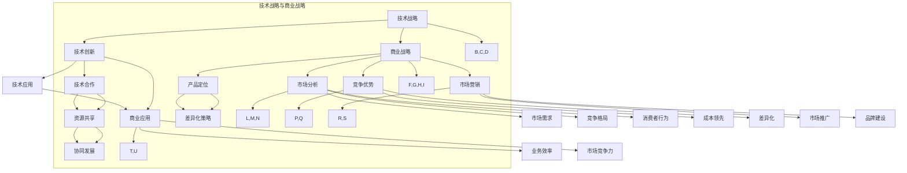

                 

# 《从技术专家到商业领袖的思维转变》

> **关键词：** 技术专家、商业领袖、思维转变、领导力、战略决策、创新思维、商业模型、市场布局、转型案例

> **摘要：** 本文深入探讨了从技术专家到商业领袖的思维转变。通过分析技术发展、核心概念联系、转型策略、领导力建设、战略决策和市场布局等多个方面，本文旨在为技术专家提供一套系统的转型方法论，帮助他们成功跨越技术与管理之间的鸿沟，成为具备商业思维和领导能力的商业领袖。

## 第1章 引言与背景

### 1.1 引言

在科技高速发展的今天，技术专家在各个领域扮演着至关重要的角色。他们以其深厚的技术功底和创新思维，推动了技术的进步和应用。然而，随着商业环境的不断变化，越来越多的技术专家开始意识到，单纯的技术能力已经不足以应对复杂的市场竞争和业务挑战。为了实现个人价值的最大化，许多技术专家开始寻求向商业领袖的角色转变。

技术专家和商业领袖之间存在显著的差异。技术专家通常专注于技术研发和产品实现，他们具备丰富的专业知识和实践经验。而商业领袖则更多地关注企业的战略方向、市场机会和团队管理。他们需要具备全局观念和跨领域整合能力，能够有效地制定和实施商业战略。

### 1.1.1 技术专家与商业领袖的定义

技术专家：技术专家是那些在特定技术领域拥有深厚知识、丰富经验和卓越技能的专业人士。他们通常具备以下特征：

- 精通一种或多种技术领域，如软件开发、数据分析、人工智能等。
- 具备解决复杂技术问题的能力。
- 对新兴技术趋势有敏锐的洞察力。

商业领袖：商业领袖则是那些能够带领企业实现持续增长和成功的高级管理者。他们通常具备以下特征：

- 具备全局观念，能够从战略高度审视企业的发展。
- 拥有强大的领导力和团队管理能力。
- 熟悉市场动态和商业运营模式。

### 1.1.2 技术专家到商业领袖的转变必要性

技术专家向商业领袖的转变是时代发展的必然趋势。以下是一些推动这一转变的主要因素：

1. **企业对商业领袖的新要求**：在当今快速变化的商业环境中，企业需要具备快速响应和创新能力。商业领袖不仅需要技术专家的专业技能，还需要具备战略眼光、领导力和商业敏感度。

2. **个人职业发展的需求**：技术专家在职业生涯中达到一定阶段后，可能会感到技术发展的瓶颈，寻求更广阔的职业发展空间。向商业领袖转型可以为他们提供新的职业机会和挑战。

3. **技术红利的消减**：随着互联网和人工智能等技术的普及，技术领域的红利逐渐消退。技术专家需要通过转型来应对这一挑战，寻找新的发展机遇。

### 1.2 技术发展的趋势与挑战

科技行业的发展日新月异，技术专家面临着前所未有的挑战和机遇。以下是一些关键的趋势和挑战：

1. **技术创新加速**：随着云计算、大数据、人工智能等新兴技术的快速发展，技术专家需要不断更新知识，掌握前沿技术。

2. **跨界融合**：技术不再局限于单一领域，跨领域的融合和创新成为主流趋势。技术专家需要具备跨领域的视野和技能，实现不同技术领域的融合。

3. **商业模式的转变**：互联网和数字化技术的普及，改变了传统商业模式。技术专家需要理解这些变化，并在商业战略中发挥关键作用。

4. **数据隐私和安全**：随着数据量的爆炸式增长，数据隐私和安全成为重要的挑战。技术专家需要具备数据保护能力，确保企业的数据安全和合规性。

5. **全球竞争加剧**：随着全球化的发展，科技行业的竞争日益激烈。技术专家需要具备全球视野，能够应对国际市场的竞争和挑战。

### 1.2.1 科技行业的发展动态

科技行业的发展动态体现在以下几个方面：

1. **人工智能的崛起**：人工智能技术正在迅速发展，成为科技行业的焦点。从自动驾驶、智能客服到医疗诊断，人工智能的应用场景不断扩展。

2. **5G技术的普及**：5G技术的普及为物联网、虚拟现实和增强现实等应用提供了强大的基础设施支持，推动了科技行业的发展。

3. **云计算的成熟**：云计算技术已经从初期的探索阶段走向成熟，成为企业数字化转型的重要支撑。云计算提供了弹性的计算资源，降低了企业的IT成本。

4. **区块链技术的应用**：区块链技术在金融、供应链和身份认证等领域得到广泛应用，为行业带来了新的机遇和挑战。

5. **可持续发展和绿色科技**：随着环保意识的提升，可持续发展和绿色科技成为科技行业的重要方向。从能源节约到碳排放减少，绿色科技为企业提供了新的发展机遇。

### 1.2.2 企业对商业领袖的新要求

企业对商业领袖的新要求主要体现在以下几个方面：

1. **战略规划能力**：商业领袖需要具备强大的战略规划能力，能够制定和实施企业的长期发展战略。

2. **创新思维**：在快速变化的商业环境中，商业领袖需要具备创新思维，能够引领企业不断创新，把握市场机会。

3. **领导力和团队管理能力**：商业领袖需要具备优秀的领导力和团队管理能力，能够激发团队的潜力和创造力。

4. **跨领域整合能力**：商业领袖需要具备跨领域的整合能力，能够整合不同领域的资源，实现企业的协同发展。

5. **全球视野**：在全球化背景下，商业领袖需要具备全球视野，能够应对国际市场的竞争和挑战。

总之，从技术专家到商业领袖的转变是一个复杂而艰巨的过程。技术专家需要不断学习、积累经验，提升自己的商业思维和领导能力。通过这一转变，他们不仅能够实现个人职业发展，还能够为企业和社会带来更大的价值。

## 第2章 核心概念与联系

在探讨从技术专家到商业领袖的转型过程中，理解核心概念之间的联系至关重要。本章节将深入分析技术战略与商业战略之间的关系，以及商业思维模式的核心要素。通过这些核心概念的联系，我们将为技术专家提供清晰的转型路径。

### 2.1 技术战略与商业战略的关系

#### 2.1.1 技术战略的概念

技术战略是指企业为了实现其长期目标，对技术研发、应用和创新进行的系统性规划和部署。技术战略不仅关注技术的先进性和创新性，还关注技术对企业整体业务的价值贡献。技术战略的核心目标是通过技术创新提升企业的竞争力，实现商业成功。

技术战略的组成部分包括：

1. **技术方向**：明确企业将在哪些技术领域进行投资和研发。
2. **技术创新**：通过研发和创新，推动技术的进步和应用。
3. **技术应用**：将技术应用到企业的产品和服务中，提升业务效率和市场竞争力。
4. **技术合作**：与其他企业、科研机构合作，共享技术资源和知识。

#### 2.1.2 商业战略的概念

商业战略是指企业为了实现其长期目标，对市场定位、产品定位、竞争优势、市场营销等方面进行的系统性规划和部署。商业战略的核心目标是通过有效的市场定位和运营，实现企业的盈利和可持续发展。

商业战略的组成部分包括：

1. **市场分析**：对市场需求、竞争格局、消费者行为等进行深入分析，确定企业的市场定位。
2. **产品定位**：根据市场分析结果，确定企业的产品定位和差异化策略。
3. **竞争优势**：通过差异化、成本领先等策略，建立企业的竞争优势。
4. **市场营销**：制定和实施市场营销策略，提升产品的市场知名度和销售额。

#### 2.1.3 技术战略与商业战略的关联图

为了更好地理解技术战略与商业战略之间的联系，我们可以通过以下关联图进行阐述：

```
                  +-------------------+
                  |   商业战略       |
                  +-------------------+
                          |
                  +------v----------+-----+
                  |      / \         |     |
                  |     /   \        |     |
                  |    /     \       |     |
                  |   /       \      |     |
  +----------------+---------------+-----+
  |      / \         |     / \         |     / \ 
  |     /   \        |    /   \        |    /   \ 
  |    /     \       |   /     \       |   /     \ 
  |   /       \      |  /       \      |  /       \ 
  +----------------+---------------+----------------+
  |    技术战略    |                |      应用      |
  +----------------+---------------+----------------+
```

从关联图中可以看出，技术战略和商业战略是相互影响、相互促进的。技术战略为商业战略提供了技术支持和创新动力，而商业战略则为技术战略提供了市场应用场景和商业模式。

### 2.2 商业思维模式

商业思维模式是指企业领导者在制定和实施商业战略过程中所采用的一系列思考方式和决策模型。商业思维模式对于企业的成功至关重要，它决定了企业如何应对市场变化、如何抓住机遇、如何规避风险。以下是一些核心的商业思维模式：

#### 2.2.1 创新思维

创新思维是指企业在面临问题时，能够从不同的角度和思路出发，寻找新的解决方案。创新思维是企业持续发展的动力，它可以帮助企业应对市场竞争和技术变革。

创新思维的核心要素包括：

1. **发散思维**：从多个角度和维度思考问题，寻找不同的解决方案。
2. **收敛思维**：在多个解决方案中，筛选出最优的方案，进行深入的优化和实施。
3. **跨界思维**：将不同领域的知识和技术进行融合，实现创新的突破。

#### 2.2.2 客户导向思维

客户导向思维是指企业以客户需求为中心，将客户的需求和满意度作为制定和实施商业战略的出发点和归宿。客户导向思维可以帮助企业更好地满足客户需求，提升客户满意度和忠诚度。

客户导向思维的核心要素包括：

1. **客户需求分析**：通过市场调研和数据分析，深入了解客户的需求和痛点。
2. **客户体验优化**：从客户的角度出发，优化产品和服务的用户体验。
3. **客户关系管理**：建立和维护良好的客户关系，提升客户满意度和忠诚度。

#### 2.2.3 风险管理思维

风险管理思维是指企业在面对不确定性时，能够通过科学的方法和工具，识别、评估和控制风险。风险管理思维可以帮助企业降低风险，确保企业的稳定发展。

风险管理思维的核心要素包括：

1. **风险识别**：通过风险识别工具和方法，识别企业可能面临的风险。
2. **风险评估**：对识别出的风险进行评估，确定风险的严重程度和发生的可能性。
3. **风险控制**：采取相应的控制措施，降低风险的负面影响。

通过理解技术战略与商业战略的关系，以及商业思维模式的核心要素，技术专家可以更好地把握转型方向，提升自己的商业思维和领导能力。在接下来的章节中，我们将进一步探讨技术专家转型策略和领导力建设，帮助技术专家实现从技术专家到商业领袖的转变。

### 2.1.3 技术战略与商业战略的关联图

为了更清晰地展示技术战略与商业战略之间的关联，我们可以使用Mermaid流程图来描绘这一关系。以下是技术战略与商业战略关联的Mermaid流程图：



上述Mermaid流程图详细展示了技术战略和商业战略之间的相互关系。技术战略包括技术创新、技术应用和技术合作，而商业战略则包括市场分析、产品定位、竞争优势和市场营销。这些元素相互影响，共同构成企业的整体战略布局。

- **技术创新**（B）：技术创新是技术战略的核心，通过不断研发和改进技术，企业能够保持竞争优势和创新能力。
- **技术应用**（C）与**商业应用**（J）：技术应用是将技术创新转化为实际业务成果的关键环节。商业应用进一步将技术应用嵌入到企业的产品和服务中，提升业务效率和竞争力。
- **技术合作**（D）与**资源共享**（K）：技术合作是整合外部技术资源和知识的重要手段。通过资源共享，企业能够实现技术和知识的最大化利用，推动协同发展。
- **市场分析**（F）：市场分析是商业战略的基础，通过分析市场需求、竞争格局和消费者行为，企业能够确定市场定位和产品策略。
- **产品定位**（G）与**差异化策略**（O）：产品定位是商业战略的重要组成部分，通过差异化策略，企业能够在市场中脱颖而出，满足特定客户群体的需求。
- **竞争优势**（H）：竞争优势是企业通过成本领先、差异化等策略，在市场中获得优势地位的关键因素。
- **市场营销**（I）：市场营销是将产品推向市场的关键手段，通过市场推广和品牌建设，企业能够提升产品的市场知名度和销售额。
- **业务效率**（T）与**市场竞争力**（U）：通过提升业务效率和竞争力，企业能够更好地满足市场需求，赢得市场份额。
- **协同发展**（V）：协同发展是技术战略与商业战略相互融合的结果，通过跨领域的资源整合和协同，企业能够实现全面的发展。

通过这一关联图，技术专家可以更直观地理解技术战略与商业战略之间的联系，从而在转型过程中有针对性地提升自己的能力和思维方式。

## 第3章 技术专家转型策略

从技术专家到商业领袖的转型是一个复杂且富有挑战的过程。在这个过程中，技术专家需要不仅在技术领域继续深耕，还需要在商业和管理领域进行系统的学习和提升。以下将详细探讨技术专家在转型过程中应采取的策略，包括技术知识体系的拓展、商业技能的提升、团队协作与管理的改进，以及项目管理和沟通技巧的强化。

### 3.1 技术知识体系拓展

技术知识体系的拓展是技术专家转型的基础。随着科技的不断进步和行业竞争的加剧，技术专家需要不断更新自己的知识体系，以适应新的技术趋势和业务需求。以下是一些具体的方法和策略：

#### 3.1.1 技术领域的跨界融合

跨界融合是当前技术发展的重要趋势，技术专家需要具备跨领域的视野和技能，将不同领域的技术进行整合和创新。例如，将人工智能与物联网、大数据等技术相结合，开发出更智能、更高效的解决方案。

- **学习跨学科知识**：技术专家可以通过学习相关领域的课程和文献，了解跨学科的基本概念和原理。
- **参与跨领域项目**：在实际工作中，技术专家可以主动参与跨领域的项目，与不同领域的专家合作，提升自己的跨界能力。
- **关注新兴技术趋势**：通过订阅科技资讯、参加行业会议等方式，保持对新兴技术趋势的敏感度，及时调整自己的知识体系。

#### 3.1.2 新兴技术趋势分析

新兴技术的快速涌现对技术专家提出了更高的要求。技术专家需要关注和了解新兴技术的应用场景、技术原理和发展趋势，以便在转型过程中能够迅速掌握和运用这些新技术。

- **深度学习与人工智能**：深度学习是人工智能的重要分支，技术专家可以通过学习深度学习的基本理论和应用，提升自己在人工智能领域的能力。
- **区块链技术**：区块链技术具有去中心化、安全可靠的特点，广泛应用于金融、供应链等领域。技术专家可以通过学习区块链的基本原理和应用案例，掌握这一新兴技术。
- **物联网技术**：物联网技术将各种设备通过网络连接起来，实现智能化的管理和控制。技术专家可以通过学习物联网技术，了解其在智能家居、智能城市等领域的应用。

### 3.2 商业技能提升

商业技能的提升是技术专家转型的关键。技术专家需要从单纯的技术思维转向商业思维，学会从企业的战略角度思考问题，掌握商业分析和决策能力。以下是一些具体的提升策略：

#### 3.2.1 商业分析能力

商业分析能力是技术专家在转型过程中需要掌握的重要技能。通过商业分析，技术专家能够更好地理解企业的业务需求和市场动态，为企业的决策提供数据支持。

- **数据收集与处理**：技术专家需要掌握数据收集、处理和分析的基本方法，能够使用Excel、SQL等工具进行数据处理，利用Python、R等编程语言进行数据分析和可视化。
- **商业智能工具**：学习并熟练使用商业智能工具，如Tableau、Power BI等，能够更直观地呈现分析结果，为企业的决策提供可视化支持。
- **业务知识**：了解企业的核心业务流程、盈利模式和市场策略，从业务角度出发，进行商业分析。

#### 3.2.2 团队协作与管理

团队协作与管理能力是商业领袖的重要素质之一。技术专家在转型过程中需要提升自己的团队协作和领导能力，学会如何激励和引导团队成员，实现团队目标。

- **团队建设**：通过团队建设活动，增强团队成员之间的信任和合作，提高团队的整体绩效。
- **沟通技巧**：学会有效的沟通技巧，能够清晰地表达自己的想法，同时倾听和理解团队成员的意见和需求。
- **冲突管理**：掌握冲突管理的策略和技巧，能够及时解决团队内部的矛盾和冲突，保持团队的和谐与稳定。

#### 3.2.3 项目管理与沟通技巧

项目管理和沟通技巧是技术专家转型过程中必不可少的能力。通过有效的项目管理和沟通，技术专家能够确保项目的顺利进行，实现预期目标。

- **项目管理方法**：学习并应用项目管理的方法和工具，如PDCA循环、Scrum等，提升项目管理的效率和质量。
- **时间管理**：掌握时间管理技巧，合理安排时间和任务，确保项目按时交付。
- **沟通策略**：通过有效的沟通策略，确保信息的准确传递和团队成员之间的有效协作。

### 3.3 跨部门协作与领导力培养

技术专家在转型过程中不仅需要提升自身的商业技能和项目管理能力，还需要增强跨部门协作和领导力。以下是一些具体的提升策略：

#### 3.3.1 跨部门协作

跨部门协作是现代企业运营的重要一环。技术专家需要学会如何与不同部门的同事合作，共同推动企业的发展。

- **建立合作关系**：通过主动沟通和合作，建立与其他部门的良好关系，形成协同效应。
- **跨部门会议**：定期组织跨部门会议，分享各自的工作进展和需求，促进信息的透明和协作。
- **共享资源**：与其他部门共享资源和知识，提升整个团队的工作效率和创新能力。

#### 3.3.2 领导力培养

领导力是商业领袖的重要素质之一。技术专家在转型过程中需要通过学习和实践，提升自己的领导力。

- **领导力培训**：参加领导力培训课程，学习领导力的理论和实践方法。
- **实践领导力**：通过参与项目管理和团队领导，将领导力知识应用到实际工作中，不断提升自己的领导能力。
- **自我反思**：定期进行自我反思，总结自己的领导经验，找到改进的方向和措施。

通过以上策略，技术专家可以逐步实现从技术专家到商业领袖的转型，提升自己的综合素质和领导能力，为企业的持续发展做出更大的贡献。

### 第4章 商业领袖的领导力建设

作为技术专家向商业领袖转型的关键一步，领导力建设显得尤为重要。领导力不仅仅是管理团队的技能，更是一种思维方式和价值观的体现。在这一章中，我们将深入探讨领导力的核心要素，以及如何通过有效的领导力和领导力培养，成为优秀的商业领袖。

#### 4.1.1 领导力的定义

领导力是指个人或团队在特定情境下，通过影响力、激励和指导他人，实现共同目标的能力。它不仅仅涉及技术和管理能力，还包括情感智慧、价值观和领导风格等方面。领导力不仅关乎个人的成功，更关乎团队和组织的整体绩效。

#### 4.1.2 领导风格与团队绩效

领导风格对团队绩效有着直接的影响。不同的领导风格适用于不同的情境和团队类型，以下是一些常见的领导风格：

- **指令型领导**：领导者明确指示团队成员的任务和目标，提供详细的指导和反馈。这种风格适用于任务复杂、团队成员经验不足的情况。
- **民主型领导**：领导者鼓励团队成员参与决策，尊重和倾听成员的意见。这种风格有助于增强团队凝聚力和创新能力。
- **教练型领导**：领导者通过指导和辅导，帮助团队成员提高技能和实现个人成长。这种风格适用于培养高素质的人才和建立长期团队合作关系。
- **授权型领导**：领导者赋予团队成员自主权和决策权，鼓励他们自主解决问题。这种风格适用于高度自治和自我激励的团队。

不同的领导风格在不同情境下可能效果不同，商业领袖需要根据具体情境和团队特点，灵活运用不同的领导风格，以实现最佳绩效。

#### 4.1.3 领导力发展的模型

领导力发展是一个持续的过程，可以通过以下模型进行系统性的培养：

- **基于行为的模型**：这种模型通过观察和分析领导者在不同情境下的行为，识别有效的领导行为模式。例如，Goleman的领导力模型将领导力分为五大维度：智慧型领导、情感智慧领导、团队领导、变革型领导和自我领导。
- **基于情境的模型**：这种模型认为领导力不是固定不变的，而是随着情境的变化而调整。例如，Hersey和Blanchard的情境领导模型根据下属的成熟度，提出四种不同的领导风格：指导型、支持型、参与型和授权型。
- **基于能力的模型**：这种模型强调领导力的发展是一个逐步提升的过程，领导者需要具备一系列核心能力。例如，中心化领导力模型（Centered Leadership Model）提出领导者需要具备五大能力：个人品牌、战略性思考、人才发展、团队合作和企业文化。

#### 4.2.1 领导力培养方法

为了提升领导力，商业领袖可以通过以下方法进行系统性的培养：

- **自我反思**：通过定期进行自我反思，领导者可以识别自己的优势和劣势，找到改进的方向。自我反思可以是日记、博客或与其他领导者进行对话的形式。
- **领导力培训**：参加领导力培训课程，学习领导力的理论知识、实践方法和工具。这些课程可以是工作坊、讲座或在线课程等形式。
- **导师指导**：通过导师指导，领导者可以从经验丰富的导师那里获得指导和建议，加速自己的领导力发展。导师可以是组织内部的资深员工或外部的顾问。
- **实践领导力**：通过实际的工作任务和项目，领导者可以将领导力理论应用到实践中，不断提升自己的领导能力。例如，担任团队领导、项目主管或志愿者领导等角色。

#### 4.2.2 领导力实践案例

以下是一些成功的领导力实践案例，可以帮助我们理解领导力在实际工作中的应用：

- **谷歌的“20%时间”政策**：谷歌允许员工将20%的工作时间用于自己感兴趣的项目，这种政策激发了员工的创新精神和团队协作，促进了公司内部创新文化的形成。
- **丰田的“问题解决会议”**：丰田通过定期举行问题解决会议，鼓励员工提出问题并共同寻找解决方案，这种实践不仅提升了员工的工作积极性，也促进了公司的持续改进。
- **微软的“敏捷开发”**：微软通过实施敏捷开发方法，使团队能够更快速地响应市场需求，提高产品开发效率和质量。敏捷开发的核心理念之一是团队协作和持续改进，这些理念在微软的领导力实践中得到了体现。

#### 4.2.3 领导力发展的挑战与应对

在领导力发展的过程中，商业领袖可能会面临以下挑战：

- **领导者的角色转变**：从技术专家到商业领袖，领导者需要适应新的角色和职责，这可能会带来心理上的压力和挑战。
- **团队管理经验不足**：新的领导者可能缺乏管理经验，需要通过学习和实践不断提升自己的管理能力。
- **平衡工作与生活**：领导者的工作压力较大，需要平衡工作与生活，确保身心健康。

为了应对这些挑战，商业领袖可以采取以下策略：

- **持续学习**：通过参加培训、阅读书籍和参加研讨会，不断更新自己的知识和技能。
- **建立支持网络**：与同行的领导者建立联系，分享经验和最佳实践，互相支持和学习。
- **建立反馈机制**：通过定期的员工反馈和绩效评估，了解自己的领导效果，及时调整和改进。

通过以上策略，商业领袖可以不断提升自己的领导能力，成为优秀的领导者，为企业的成功和团队的成长贡献力量。

### 第5章 创新思维与战略决策

在商业环境中，创新思维和战略决策是商业领袖成功的关键要素。创新思维能够帮助企业抓住市场机遇，提升竞争力，而战略决策则能够指导企业在复杂多变的环境中实现持续增长。本章节将深入探讨创新思维的方法和战略决策框架，帮助商业领袖在创新和决策过程中更加有效和系统。

#### 5.1 创新思维的方法

创新思维是指企业在面对挑战和机遇时，运用创造性思维寻找新解决方案的能力。以下是一些常用的创新思维方法：

##### 5.1.1 框架思维

框架思维是通过构建结构化的思考框架，将复杂的问题分解为若干个子问题，然后逐一解决。这种方法有助于提高思维的清晰度和系统性。

- **步骤**：
  1. 确定问题或挑战。
  2. 建立框架，明确各个子问题的关系和优先级。
  3. 对每个子问题进行深入分析和解决。
  4. 整合各个子问题的解决方案，形成整体的解决方案。

##### 5.1.2 设计思维

设计思维是一种以用户需求为中心的创新方法，强调通过反复试验和迭代，找到最佳解决方案。设计思维的核心理念是“以人为本”，注重用户体验和实际需求。

- **步骤**：
  1. 确定用户需求。
  2. 收集用户反馈。
  3. 设计原型并进行测试。
  4. 根据用户反馈进行迭代优化。
  5. 实施最终的解决方案。

##### 5.1.3 创业思维

创业思维强调创新和风险承担，通过快速试错和迭代，找到可行的商业机会。创业思维适用于初创企业和现有企业的创新项目。

- **步骤**：
  1. 确定创新目标。
  2. 寻找市场需求和痛点。
  3. 构建原型并进行市场测试。
  4. 根据市场反馈进行产品迭代。
  5. 实施商业计划并持续优化。

#### 5.2 战略决策框架

战略决策是企业为了实现长期目标，对资源、市场、产品等方面进行的系统性规划和决策。以下是一些常用的战略决策框架：

##### 5.2.1 战略规划流程

战略规划流程是指企业在不同阶段制定和调整战略的方法。以下是一个典型的战略规划流程：

1. **环境分析**：通过市场调研、竞争分析等手段，了解外部环境和内部资源。
2. **目标设定**：根据企业的使命和愿景，设定长期和短期的战略目标。
3. **战略选择**：基于目标，选择适合企业的战略方向和策略。
4. **实施计划**：制定详细的实施计划，明确责任人和时间表。
5. **监控与调整**：通过定期的监控和评估，调整战略实施过程，确保目标的实现。

##### 5.2.2 SWOT分析

SWOT分析是一种常用的战略分析工具，通过分析企业的优势（Strengths）、劣势（Weaknesses）、机会（Opportunities）和威胁（Threats），帮助企业制定战略。

- **步骤**：
  1. **优势**：识别企业的核心竞争优势，如技术、品牌、资源等。
  2. **劣势**：识别企业的弱点，如管理、市场、产品等。
  3. **机会**：分析外部环境中的机会，如市场趋势、技术进步等。
  4. **威胁**：分析外部环境中的威胁，如竞争对手、政策法规等。
  5. **综合分析**：根据SWOT分析结果，制定相应的战略和策略。

##### 5.2.3 波特五力模型

波特五力模型是分析行业竞争态势的重要工具，通过分析五种力量（供应商、买家、潜在进入者、替代品和现有竞争者），评估行业的竞争强度。

- **步骤**：
  1. **供应商**：分析供应商的谈判能力，如供应稳定性、供应质量等。
  2. **买家**：分析买家的谈判能力，如购买集中度、议价能力等。
  3. **潜在进入者**：分析行业进入壁垒，如市场准入成本、政策法规等。
  4. **替代品**：分析替代品的存在和潜在威胁。
  5. **现有竞争者**：分析现有竞争者的竞争策略和市场表现。

通过创新思维和战略决策框架，商业领袖能够更加系统性地应对市场变化和挑战，找到创新的解决方案，实现企业的长期发展。在接下来的章节中，我们将进一步探讨商业模型创新与市场布局的策略，帮助商业领袖构建和实施成功的商业战略。

### 第6章 商业模型创新与市场布局

商业模型创新和市场布局是商业领袖在竞争激烈的市场环境中取得成功的关键因素。一个成功的商业模型不仅能够为企业带来持续的盈利能力，还能够提升企业的市场竞争力和影响力。在这一章节中，我们将探讨商业模型创新的方法和市场布局策略，帮助商业领袖构建和实施有效的商业战略。

#### 6.1 商业模型创新的方法

商业模型创新是指通过创造性地改变企业的商业模式、运营方式或客户价值主张，来实现业务增长和市场扩张。以下是一些常见的商业模型创新方法：

##### 6.1.1 商业模式的定义

商业模式是指企业如何创造、传递和捕获价值的方法。它包括企业所提供的产品或服务、客户群体、价值网络、利润模式等多个方面。一个成功的商业模式能够清晰地定义企业的核心竞争力、市场定位和盈利模式。

##### 6.1.2 商业模式创新框架

为了系统地开展商业模型创新，商业领袖可以参考以下框架：

1. **价值定位**：明确企业的目标客户群体和客户需求，确定企业的价值主张。
2. **价值创造**：通过产品、服务或解决方案，实现客户价值最大化。
3. **价值传递**：构建有效的渠道和运营体系，将价值传递给客户。
4. **价值捕获**：设计合理的利润模式和收入来源，确保企业的可持续发展。

##### 6.1.3 成功案例解析

以下是一些成功的商业模型创新案例，可以为我们提供有益的启示：

- **Airbnb**：Airbnb通过共享经济模式，将闲置的房屋资源转化为商业机会，为旅行者提供住宿服务。这种创新的商业模式不仅颠覆了传统酒店行业，还创造了巨大的市场价值。
- **Amazon**：Amazon通过“一切皆可售”的电商模式，将广泛的商品和服务整合到平台上，为消费者提供了便捷的购物体验。同时，Amazon通过物流和云计算等业务拓展，实现了跨领域的多元化发展。
- **Uber**：Uber通过移动应用程序，将乘客和司机连接起来，创造了全新的共享出行模式。Uber不仅改变了传统出租车行业，还推动了整个交通出行市场的变革。

#### 6.2 市场布局策略

市场布局策略是企业根据自身资源和市场环境，制定的市场扩张和竞争策略。以下是一些关键的市场布局策略：

##### 6.2.1 市场调研与分析

市场调研与分析是市场布局的基础。通过市场调研，企业可以了解目标市场的规模、竞争态势、客户需求等关键信息，为市场布局提供数据支持。

- **市场规模**：评估目标市场的潜在规模和增长趋势。
- **竞争对手**：分析主要竞争对手的市场份额、产品定位和营销策略。
- **客户需求**：了解目标客户的需求和购买行为，为产品开发和市场定位提供依据。

##### 6.2.2 目标市场定位

目标市场定位是企业确定市场战略的核心步骤。企业需要根据市场调研结果，明确目标市场的定位和差异化策略。

- **市场细分**：将整体市场划分为不同的子市场，针对具有相似需求和行为的客户群体进行定位。
- **市场定位**：确定企业在目标市场中的独特价值和竞争优势。
- **差异化策略**：通过产品创新、服务优化或品牌塑造，实现与竞争对手的差异化。

##### 6.2.3 市场进入策略

市场进入策略是企业进入新市场的具体方法和步骤。企业需要根据市场环境和自身资源，选择合适的进入策略。

- **直接进入**：直接进入目标市场，建立自己的销售和服务网络。
- **间接进入**：通过合作伙伴、代理商或分销商等间接进入市场。
- **渐进式进入**：逐步扩大市场份额，通过试点项目或局部市场进入，逐步扩大到全国或全球市场。

##### 6.2.4 竞争优势与差异化策略

竞争优势和差异化策略是企业市场布局的关键。企业需要通过以下方式建立和维持竞争优势：

- **成本领先**：通过规模效应、技术优势或供应链优化，实现成本领先。
- **产品差异化**：通过独特的产品功能、设计或服务，满足特定客户群体的需求。
- **品牌价值**：通过品牌塑造和营销，提升企业的品牌影响力和市场认知度。

通过商业模型创新和市场布局策略，商业领袖可以有效地开拓新市场，提升企业的市场竞争力和盈利能力。在下一章节中，我们将探讨成功转型案例与经验分享，为技术专家提供实用的转型经验和策略。

### 第7章 成功转型案例与经验分享

在从技术专家到商业领袖的转型过程中，许多成功的技术专家通过不断的学习和实践，最终实现了职业生涯的华丽转变。本章节将通过两个成功转型案例，详细解析他们的转型之路，并分享他们在转型过程中遇到的挑战及其应对策略。

#### 7.1 成功转型的技术专家

**案例一：A技术专家的转型之路**

**背景**：A技术专家在一家知名科技公司担任高级技术研究员，专注于人工智能领域的研究。在职业生涯的早期，他凭借出色的技术能力和研究成果，在技术领域取得了显著的成就。然而，随着公司业务的发展和市场竞争的加剧，他逐渐意识到单纯的技术能力已经不足以应对复杂的商业环境。

**转型策略**：

1. **商业知识学习**：为了更好地理解商业环境，A技术专家开始系统性地学习商业知识，包括市场营销、战略规划和财务管理等。他通过参加公司内部的商业培训课程和阅读相关书籍，不断提升自己的商业素养。

2. **跨部门合作**：A技术专家主动寻求与其他部门的合作机会，特别是市场营销和销售部门。通过与这些部门的紧密合作，他逐渐了解了企业的商业模式和客户需求，为转型奠定了基础。

3. **领导力培养**：A技术专家通过参与领导力培训和导师指导，不断提升自己的领导力和团队管理能力。他学会了如何激励和引导团队成员，确保项目目标的实现。

**挑战与应对**：

- **心理压力**：在转型初期，A技术专家面临巨大的心理压力。为了应对这一挑战，他通过与同事和导师的沟通，以及定期进行自我反思，逐步调整自己的心态。

- **时间管理**：转型过程中，A技术专家需要同时应对技术研究和商业决策的双重压力。他通过优化时间管理，提高了工作效率，确保两个领域的平衡。

**结果**：经过多年的努力，A技术专家成功转型为公司的CTO，带领团队推动企业的技术革新和业务增长。他的转型经验为其他技术专家提供了宝贵的参考。

**案例二：B技术专家的商业崛起**

**背景**：B技术专家在一家初创公司担任技术总监，负责公司核心产品的研发。在公司初创阶段，他凭借卓越的技术能力和项目管理经验，成功地带领团队完成了多个重要项目。然而，随着公司业务的拓展和市场的变化，B技术专家意识到自己需要从技术主导转向商业主导，以实现公司的长期发展。

**转型策略**：

1. **市场调研**：为了更好地了解市场动态和客户需求，B技术专家进行了深入的市场调研。通过分析市场趋势和竞争对手，他制定了针对性的产品策略和商业计划。

2. **战略规划**：B技术专家与公司高层共同制定了长期的战略规划，明确了公司的业务方向和市场目标。他学会了如何从战略角度审视企业的整体发展，确保技术团队与公司战略的协调一致。

3. **团队建设**：B技术专家重视团队建设，通过提升团队成员的技能和激励措施，增强了团队的凝聚力和战斗力。

**挑战与应对**：

- **业务转型**：从技术主导转向商业主导，B技术专家面临业务转型带来的挑战。他通过不断学习和实践，逐步适应了新的角色和职责。

- **资源协调**：转型过程中，B技术专家需要协调不同部门之间的资源，以确保项目顺利进行。他通过与各部门的密切合作和沟通，解决了资源协调的难题。

**结果**：B技术专家成功带领公司实现了从初创到上市的成功转型， himself 成为公司的CEO。他的转型经验和商业思维为公司带来了巨大的成功，也为其他技术专家提供了宝贵的借鉴。

#### 7.2 转型过程中的挑战与应对

从技术专家到商业领袖的转型过程中，技术专家可能会面临以下挑战：

1. **角色转变**：从技术主导转向商业主导，技术专家需要适应新的角色和职责，这可能带来心理压力和挑战。
2. **时间管理**：转型过程中，技术专家需要同时应对技术研究和商业决策的双重压力，需要优化时间管理，确保两个领域的平衡。
3. **商业知识**：缺乏商业知识是技术专家转型的一个主要挑战。通过系统学习和实践，技术专家可以逐步提升自己的商业素养。
4. **领导力培养**：领导力和团队管理能力是商业领袖的重要素质。通过参加培训、导师指导和实际工作，技术专家可以不断提升自己的领导力。

为了应对这些挑战，技术专家可以采取以下策略：

1. **持续学习**：通过参加商业培训课程、阅读商业书籍和参加行业会议，不断更新自己的知识和技能。
2. **跨部门合作**：通过与其他部门的合作，了解企业的商业模式和运营机制，提升自己的商业视角。
3. **实践领导力**：通过实际的项目管理和团队领导，将领导力理论应用到实践中，不断提升自己的领导能力。
4. **建立支持网络**：与同行的商业领袖建立联系，分享经验和最佳实践，互相支持和学习。

通过成功转型案例和经验分享，技术专家可以了解从技术专家到商业领袖的转型路径和策略。这些经验和策略不仅为技术专家提供了宝贵的参考，也为他们在转型过程中提供了实际的支持和指导。

## 附录

### A.1 技术专家到商业领袖转型的资源推荐

为了帮助技术专家更好地进行从技术到商业的转型，以下是一些建议的资源和推荐，包括书籍、网络资源和在线课程，这些资源将有助于技术专家在转型过程中提升商业知识和领导能力。

#### A.1.1 书籍推荐

1. **《创新与企业家精神》（Innovation and Entrepreneurship）** - 作者：彼得·德鲁克（Peter Drucker）
   - 内容简介：德鲁克详细阐述了创新和企业家精神的基本原理，为技术专家提供了关于如何通过创新推动企业发展的深入见解。

2. **《战略管理：概念与案例》（Strategic Management: Concept and Cases）** - 作者：阿尔弗雷德·D·钱德勒（Alfred D. Chandler）
   - 内容简介：这本书提供了关于企业战略的全面分析，包括企业如何制定、实施和调整战略，对技术专家了解企业战略管理具有重要意义。

3. **《创业维艰》（Hard Things About Hard Things）** - 作者：本·霍洛维茨（Ben Horowitz）
   - 内容简介：本·霍洛维茨结合自己的创业经验，分享了创业过程中面临的挑战和解决方案，为技术专家提供了宝贵的实战指导。

4. **《深度工作：如何有效利用每一点脑力》（Deep Work: Rules for Focused Success in a Distracted World）** - 作者：卡尔·纽波特（Cal Newport）
   - 内容简介：纽波特介绍了如何在信息过载和分心严重的环境中保持专注，提高工作效率，这对于技术专家在转型过程中尤为重要。

#### A.1.2 网络资源推荐

1. **哈佛商学院公开课**
   - 网址：https://www.hbs.edu/online/course/
   - 内容简介：哈佛商学院提供的一系列免费在线课程，包括商业分析、战略管理、领导力等，适合技术专家系统性地学习商业知识。

2. **Coursera**
   - 网址：https://www.coursera.org/
   - 内容简介：Coursera上有许多与商业相关的课程，如市场营销、财务管理、数据科学等，许多课程由世界顶尖大学提供。

3. **edX**
   - 网址：https://www.edx.org/
   - 内容简介：edX提供了各种领域的在线课程，包括商业管理、领导力、创新等，这些课程通常由知名大学和专业机构提供。

#### A.1.3 在线课程推荐

1. **“商业分析基础”课程**
   - 提供平台：Coursera
   - 内容简介：该课程涵盖了商业分析的基本概念、方法和工具，帮助技术专家理解如何将数据分析应用于商业决策。

2. **“商业策略”课程**
   - 提供平台：edX
   - 内容简介：该课程讲解了商业策略的制定和执行过程，包括市场分析、竞争策略、战略规划等，适合技术专家提升战略思维。

3. **“领导力与个人发展”课程**
   - 提供平台：LinkedIn Learning
   - 内容简介：该课程提供了关于领导力、团队合作、沟通技巧等方面的知识和实践方法，帮助技术专家提升领导能力和团队管理能力。

通过以上书籍、网络资源和在线课程的推荐，技术专家可以系统地学习商业知识和领导能力，为从技术专家到商业领袖的转型提供坚实的支持和指导。这些资源不仅丰富了技术专家的知识体系，也提供了实践操作的指南，帮助他们在转型过程中取得成功。

## 参考文献

1. 德鲁克, 彼得·德鲁克. (1995). 《创新与企业家精神》. 机械工业出版社.
2. 钱德勒, 阿尔弗雷德·D·钱德勒. (1990). 《战略管理：概念与案例》. 中国人民大学出版社.
3. 霍洛维茨, 本·霍洛维茨. (2014). 《创业维艰》. 中信出版社.
4. 纽波特, 卡尔·纽波特. (2016). 《深度工作：如何有效利用每一点脑力》. 中国人民大学出版社.
5. 哈佛商学院. (多种课程). https://www.hbs.edu/online/course/
6. Coursera. (多种课程). https://www.coursera.org/
7. edX. (多种课程). https://www.edx.org/
8. LinkedIn Learning. (多种课程). https://www.linkedin.com/learning/

通过以上参考文献，读者可以进一步深入了解本文所述的主题和内容，并在实际学习和应用过程中，获取更广泛的理论和实践支持。这些资源为技术专家提供了宝贵的学习材料和参考框架，帮助他们更好地实现从技术专家到商业领袖的转变。

