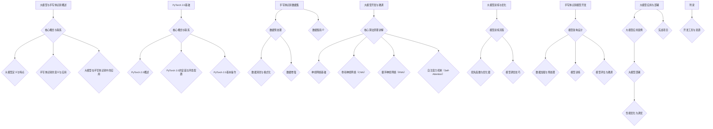

                 

# 从零开始大模型开发与微调：实战基于PyTorch 2.0的手写体识别模型

## 关键词

- 大模型
- PyTorch 2.0
- 手写体识别
- 深度学习
- 数据预处理
- 训练与微调

## 摘要

本文将带您从零开始，学习如何开发和使用大模型进行手写体识别。我们将详细介绍大模型的基础概念、PyTorch 2.0 的安装与基础操作、手写体识别数据集的预处理与增强、大模型的开发与微调过程，以及如何部署和应用这些模型。通过实际的代码示例，您将能够了解整个开发流程，并掌握如何优化模型性能的方法。

## 第一部分: 从零开始大模型开发与微调基础

### 第1章: 大模型与手写体识别概述

#### 1.1 大模型的基本概念

大模型是一种具有大量参数的深度学习模型，能够捕捉复杂的数据特征。它们通常用于图像识别、自然语言处理等任务。大模型的特点如下：

1. **模型大小**：大模型通常包含数十亿甚至上百亿个参数，这使得它们能够处理复杂的数据模式。
2. **训练数据需求**：大模型的训练需要大量的数据，因为这些模型需要从数据中学习到有效的特征表示。
3. **计算资源**：大模型需要高性能的计算资源，如GPU或TPU，以支持其大规模训练。

#### 1.2 手写体识别的意义与应用

手写体识别是将手写文字转换为机器可读文本的过程。其应用场景广泛，包括但不限于：

1. **OCR（光学字符识别）**：将扫描的文档中的文字转换为机器可处理的格式。
2. **电子发票**：自动提取发票上的文字信息，提高数据处理效率。
3. **智能客服**：理解用户的手写留言，提供个性化的服务。

#### 1.3 大模型在手写体识别中的应用

大模型在手写体识别中具有显著的优势：

1. **高精度**：大模型能够处理复杂的手写文字，提高识别的准确性。
2. **自适应**：大模型能够根据不同的手写风格进行自适应，适应各种书写习惯。

### 第2章: PyTorch 2.0基础

#### 2.1 PyTorch 2.0概述

PyTorch 2.0 是 PyTorch 深度学习框架的一个主要版本更新，它带来了许多改进和新特性，包括：

1. **更快的训练速度**：通过改进的自动微分系统，PyTorch 2.0 显著提高了模型的训练速度。
2. **更好的内存管理**：PyTorch 2.0 引入了动态内存分配，提高了内存利用效率。
3. **更丰富的功能**：PyTorch 2.0 新增了许多模型架构和优化器，为开发者提供了更多的选择。

#### 2.2 PyTorch 2.0的安装与环境配置

要安装 PyTorch 2.0，可以按照以下步骤进行：

**Windows 安装**

```bash
pip install torch==2.0.0+cu113 torchvision==0.14.0+cu113 torchaudio==0.14.0+cu113 -f https://download.pytorch.org/whl/torch_stable.html
```

**Linux 安装**

```bash
pip install torch==2.0.0+cu113 torchvision==0.14.0+cu113 torchaudio==0.14.0+cu113 -f https://download.pytorch.org/whl/torch_stable.html
```

#### 2.3 PyTorch 2.0基本操作

PyTorch 2.0 的基本操作包括创建Tensor和数据类型转换：

**创建Tensor**

```python
x = torch.tensor([1.0, 2.0, 3.0])
```

**数据类型转换**

```python
y = x.float()
```

### 第3章: 手写体识别数据集

#### 3.1 数据集简介

在开发手写体识别模型时，常用的数据集包括：

1. **EMNIST**：手写数字识别数据集。
2. **HTR**：手写文字识别数据集。
3. **GAISHE**：中文手写体数据集。

#### 3.2 数据预处理

数据预处理是手写体识别模型开发的重要步骤，主要包括以下内容：

1. **数据清洗与格式化**：去除噪声和格式化数据，使其符合模型的输入要求。
2. **数据归一化**：将数据缩放到特定的范围内，以提高模型的训练效率。
3. **字符分割**：将手写体分割成单个字符，以便模型进行逐字符识别。

#### 3.3 数据增强

数据增强是一种提高模型泛化能力的方法，常见的数据增强方法包括：

1. **随机裁剪**：随机裁剪图像，模拟不同的观察角度。
2. **形变**：对图像进行随机形变，模拟不同的书写风格。
3. **彩色化**：将灰度图像转换为彩色图像，增加模型的输入维度。

## 第二部分: 大模型开发与微调

### 第4章: 大模型结构与算法

#### 4.1 神经网络基础

神经网络是深度学习的基础，其基本结构包括输入层、隐藏层和输出层。常见的激活函数有 ReLU、Sigmoid 和 Tanh。

#### 4.2 卷积神经网络（CNN）

卷积神经网络在图像处理任务中表现出色，其核心结构包括卷积层、池化层和全连接层。

#### 4.3 循环神经网络（RNN）

循环神经网络适用于序列数据处理，其基本原理是通过循环机制将前一个时刻的信息传递到下一个时刻。

#### 4.4 自注意力机制（Self-Attention）

自注意力机制是一种用于处理序列数据的高级机制，其核心思想是通过计算序列中每个元素之间的相对重要性，从而提高模型的表示能力。

### 第5章: 大模型训练与优化

#### 5.1 模型训练流程

模型训练流程包括数据加载与预处理、模型定义、损失函数选择、优化器选择和训练与验证等步骤。

#### 5.2 损失函数与优化器

常见的损失函数包括交叉熵损失和均方误差损失。优化器如随机梯度下降（SGD）和 Adam 优化器用于调整模型参数。

#### 5.3 模型调优技巧

模型调优包括学习率调整、批量大小调整和数据增强等策略，以提高模型的训练效率和预测性能。

### 第6章: 手写体识别模型开发

#### 6.1 模型架构设计

手写体识别模型的设计通常结合卷积神经网络（CNN）和循环神经网络（RNN）或 Transformer 架构。

#### 6.2 数据加载与预处理

数据加载与预处理包括数据集划分、数据增强和批次加载等步骤。

#### 6.3 模型训练

模型训练过程涉及损失函数选择、优化器选择和训练与验证等环节。

#### 6.4 模型评估与微调

模型评估通过准确率、召回率和 F1 分数等指标进行，微调技巧包括预训练模型和调整学习率等。

### 第7章: 大模型应用与部署

#### 7.1 大模型应用案例

手写体识别模型的应用案例包括电子发票处理和智能客服等。

#### 7.2 大模型部署

大模型部署包括本地部署和云部署，涉及模型转换和部署环境配置等步骤。

#### 7.3 性能优化与调优

性能优化与调优包括模型压缩、量化和技术优化等策略。

## 第三部分: 实战项目

### 第8章: 手写体识别项目实战

#### 8.1 项目需求与目标

本项目目标是开发一个手写数字识别模型，应用场景包括日常使用和教育辅助等。

#### 8.2 开发环境搭建

开发环境包括操作系统、Python 版本和深度学习框架等。

#### 8.3 源代码实现与解析

本节将详细解析手写体识别模型的代码实现，包括数据加载与预处理、模型定义、训练过程和模型评估等。

#### 8.4 代码解读与分析

代码解读与分析将涵盖数据加载与预处理代码、模型定义代码和训练过程代码等，并进行性能分析。

## 附录

### 附录 A: 开发工具与资源

本附录列出了开发过程中使用的工具和资源，包括 PyTorch 官方文档、手写体识别数据集下载和常用模型架构与实现等。

## Mermaid 流程图



### 损失函数的详细解释与举例

损失函数是衡量模型预测结果与实际结果之间差异的重要指标。在深度学习中，损失函数的选择对模型的训练过程和最终性能有着至关重要的影响。本文将详细解释一个常见的损失函数——交叉熵损失函数，并给出具体的数学公式和举例说明。

#### 数学公式

交叉熵损失函数的公式可以表示为：

$$
L(\theta) = -\frac{1}{N} \sum_{i=1}^{N} \sum_{j=1}^{M} y_{ij} \log(p_{ij}(\theta))
$$

其中：
- \( N \) 是样本数量。
- \( M \) 是类别数量。
- \( y_{ij} \) 是指示函数，如果第 \( i \) 个样本属于第 \( j \) 个类别，则 \( y_{ij} = 1 \)，否则 \( y_{ij} = 0 \)。
- \( p_{ij}(\theta) \) 是模型对于第 \( i \) 个样本属于第 \( j \) 个类别的概率预测值。

交叉熵损失函数的目的是最小化模型预测概率分布与实际标签分布之间的差异。在训练过程中，模型的参数会通过反向传播算法不断调整，以最小化损失函数的值。

#### 举例说明

假设我们有一个二分类问题，有两个类别 0 和 1。我们的模型预测 \( p_1 \) 是类别 1 的概率，\( p_0 \) 是类别 0 的概率。实际标签 \( y \) 为 1，那么交叉熵损失函数为：

$$
L(\theta) = -1 \cdot \log(p_1)
$$

如果我们预测 \( p_1 \) 接近 1，则损失接近于 0 ，因为对数函数在输入接近 1 时接近于 0。相反，如果预测 \( p_1 \) 接近 0，则损失会非常大，因为对数函数在输入接近 0 时趋向于负无穷。

这种损失函数鼓励模型学习正确的概率分布，从而提高分类准确性。

#### 实际代码示例

下面是一个简单的 PyTorch 代码示例，展示了如何使用交叉熵损失函数进行训练：

```python
import torch
import torch.nn as nn
import torch.optim as optim

# 定义模型
class SimpleModel(nn.Module):
    def __init__(self, input_size, hidden_size, output_size):
        super(SimpleModel, self).__init__()
        self.fc1 = nn.Linear(input_size, hidden_size)
        self.relu = nn.ReLU()
        self.fc2 = nn.Linear(hidden_size, output_size)
    
    def forward(self, x):
        x = self.fc1(x)
        x = self.relu(x)
        x = self.fc2(x)
        return x

# 实例化模型、损失函数和优化器
model = SimpleModel(input_size=10, hidden_size=50, output_size=2)
criterion = nn.CrossEntropyLoss()
optimizer = optim.SGD(model.parameters(), lr=0.01)

# 生成一些随机数据作为输入和标签
x = torch.randn(32, 10)
y = torch.randint(0, 2, (32,))

# 训练模型
for epoch in range(100):
    optimizer.zero_grad()
    outputs = model(x)
    loss = criterion(outputs, y)
    loss.backward()
    optimizer.step()
    if (epoch + 1) % 10 == 0:
        print(f'Epoch [{epoch + 1}/100], Loss: {loss.item()}')

# 预测
with torch.no_grad():
    predicted = model(x).argmax(dim=1)
    print(f'Predicted labels: {predicted}')
```

在这个示例中，我们首先定义了一个简单的全连接神经网络模型，然后使用交叉熵损失函数和随机梯度下降（SGD）优化器进行训练。通过训练过程，模型会不断调整其参数，以最小化损失函数的值。

通过这个示例，我们可以看到交叉熵损失函数在实际训练中的应用，以及它如何帮助模型提高分类性能。在实际项目中，我们可以根据具体任务需求选择合适的损失函数和优化器，以获得最佳的训练效果。

