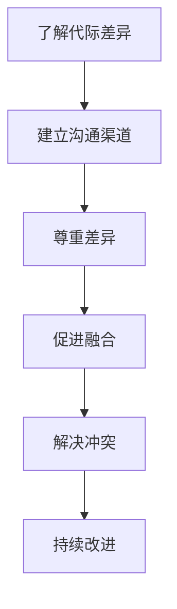
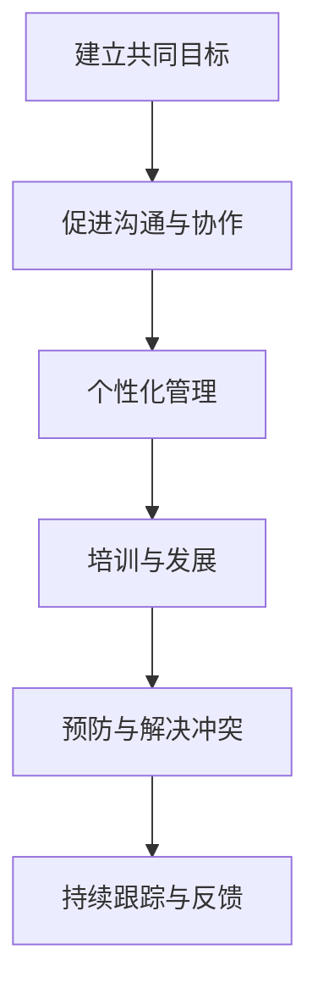

                 

# 代际桥梁：连接不同年龄层的管理艺术

## 关键词

- 代际差异
- 管理艺术
- 文化价值观
- 沟通技巧
- 跨代际团队管理
- 激励与领导力
- 技术赋能

## 摘要

在多元化和快速变化的现代社会，代际差异已经成为企业管理中的重要议题。本文从背景与概述、代际沟通技巧、跨代际团队管理和代际管理的创新与未来趋势四个方面，探讨了如何构建代际桥梁，以实现不同年龄层之间的有效沟通和协作。通过分析不同代际的文化与价值观，提供有效的沟通策略，介绍跨代际团队管理的实践案例，以及探讨技术赋能代际管理的潜力，本文旨在为企业管理者提供一套系统化的管理艺术，以应对代际差异带来的挑战。

---

### 第一部分：背景与概述

#### 第1章：代际差异与管理挑战

**1.1 时代背景与代际差异**

在当今社会，随着科技的飞速发展和全球化进程的加速，不同年龄层的人群在价值观、生活方式、工作态度等方面呈现出显著的差异。这些差异不仅体现在个体层面，更在组织管理和团队协作中产生深远影响。

- **婴儿潮一代（出生于1946-1964年）**：这一代人在战后经济繁荣时期成长，注重稳定和成就。他们倾向于遵循传统的工作方式，尊重权威和等级制度。

- **X一代（出生于1965-1979年）**：X一代在变化和不确定性中成长，更加注重个人自由和多元化。他们对权威持怀疑态度，追求创新和灵活性。

- **Y一代（出生于1980-1994年）**：Y一代在互联网时代崛起，他们强调协作、分享和自我实现。他们倾向于通过科技工具和社交媒体进行沟通和协作。

- **Z一代（出生于1995年及以后）**：Z一代在高度数字化的环境中成长，他们更加注重多元化和包容性。他们渴望通过创新和创业实现自我价值。

**1.2 代际沟通中的常见挑战**

由于代际差异，代际沟通中常常面临以下挑战：

- **沟通障碍**：不同代际在沟通方式、语言习惯和表达方式上存在差异，导致信息传递不顺畅。

- **价值观冲突**：不同代际对工作、生活和成功有不同的理解和期望，这可能导致价值观上的冲突。

- **管理风格不一致**：不同代际的管理风格和领导方式存在差异，这可能导致组织内部的矛盾和摩擦。

**1.3 管理者在代际沟通中的角色与责任**

管理者的角色在于：

- **搭建代际桥梁**：管理者需要理解不同代际的特点，搭建沟通的桥梁，促进信息传递和理解。

- **促进文化融合**：管理者需要推动组织内部的文化融合，尊重多样性，建立包容性的工作环境。

- **提供培训与指导**：管理者需要为不同代际的员工提供培训与指导，帮助他们更好地适应和融合。

#### 第2章：理解不同代际的文化与价值观

**2.1 每一代的特点与价值观**

不同代际的人群在成长过程中受到了不同的社会、文化和经济背景的影响，形成了独特的价值观和特点。

- **婴儿潮一代**：注重稳定、成就和权威，倾向于传统的职业规划和工作模式。

- **X一代**：追求自由、创新和多元化，对权威持怀疑态度，注重个人价值和自由。

- **Y一代**：强调协作、分享和自我实现，善于利用科技工具进行沟通和协作。

- **Z一代**：注重多元化和包容性，追求创新和创业，强调个人价值和社会责任。

**2.2 代际间的文化冲突与融合**

代际间的文化冲突主要体现在以下几个方面：

- **沟通方式**：不同代际在沟通方式上存在差异，例如，婴儿潮一代倾向于面对面的沟通，而Z一代则更倾向于通过数字工具进行沟通。

- **工作态度**：不同代际对工作态度和价值观有不同的理解，可能导致工作方式和文化上的冲突。

- **职业规划**：不同代际对职业规划和发展有不同的期望，可能导致职业发展上的冲突。

为了实现代际间的文化融合，组织需要采取以下策略：

- **建立包容性的文化**：组织需要建立包容性的文化，尊重不同代际的价值观和工作方式。

- **促进跨代际交流**：组织可以通过举办交流活动，促进不同代际之间的了解和沟通。

- **提供多样化的培训**：组织可以为不同代际的员工提供多样化的培训，帮助他们更好地理解和管理代际差异。

**2.3 适应与引领：管理者的策略**

管理者在面对代际差异时，需要采取以下策略：

- **适应不同代际的需求**：管理者需要了解不同代际的需求和期望，提供个性化的管理和支持。

- **促进跨代际团队合作**：管理者可以通过建立跨代际团队，促进不同代际之间的合作和交流。

- **建立有效的沟通渠道**：管理者需要建立有效的沟通渠道，确保信息在代际之间传递顺畅。

#### 第3章：建立有效的代际沟通渠道

**3.1 代际沟通的重要性**

有效的代际沟通对于组织的发展和成功至关重要。它有助于：

- **提升团队绩效**：通过有效的沟通，团队成员能够更好地理解彼此的需求和期望，提高团队协作效率和绩效。

- **促进组织文化**：有效的沟通有助于建立包容性和多元化的组织文化，增强员工的归属感和忠诚度。

- **减少冲突和摩擦**：通过沟通，可以及时解决代际差异带来的冲突和摩擦，维护组织的和谐与稳定。

**3.2 建立代际沟通的五大原则**

为了实现有效的代际沟通，管理者需要遵循以下五大原则：

- **尊重差异**：尊重不同代际的价值观和沟通方式，避免歧视和偏见。

- **开放性**：建立开放和透明的沟通渠道，鼓励员工表达自己的观点和想法。

- **双向沟通**：不仅仅是单向的信息传递，而是要实现双向的互动和反馈。

- **个性化**：根据不同代际的特点和需求，提供个性化的沟通方式和内容。

- **持续改进**：持续关注代际沟通的效果，不断优化和改进沟通策略。

**3.3 实践案例：代际沟通的实战技巧**

以下是一些实践中的代际沟通技巧：

- **案例1**：在一家跨国公司中，不同代际的员工对于工作方式的偏好存在显著差异。为了解决这一问题，公司引入了代际工作坊，让不同代际的员工相互了解和交流，共同探讨工作方式的优化方案。

- **案例2**：在一家科技公司中，Y一代的员工倾向于通过即时通讯工具进行沟通，而婴儿潮一代的员工则更喜欢面对面的交流。为了解决这一沟通障碍，公司建立了多渠道的沟通平台，满足不同代际的需求。

通过这些实践案例，我们可以看到，有效的代际沟通需要管理者采取切实可行的策略，结合实际情况进行创新和改进。

#### 第4章：跨代际团队管理

**4.1 跨代际团队的特征与挑战**

跨代际团队是由不同代际的成员组成的团队，其特征和挑战包括：

- **多样性**：跨代际团队具有丰富的多样性和不同的经验和观点。

- **复杂性**：由于代际差异，跨代际团队在沟通、协作和决策过程中可能面临更多的复杂性。

- **冲突**：不同代际之间可能存在价值观和沟通方式的冲突，需要有效管理。

**4.2 跨代际团队的有效管理策略**

为了管理跨代际团队，管理者可以采取以下策略：

- **建立共同目标**：明确跨代际团队的共同目标，促进团队成员的协作和努力。

- **促进沟通与协作**：建立有效的沟通渠道，促进团队成员之间的信息传递和理解。

- **个性化管理**：根据不同代际的员工特点和需求，提供个性化的管理和支持。

- **培训与发展**：为团队成员提供跨代际沟通和协作的培训，提升团队的整体能力。

**4.3 跨代际团队冲突的预防与解决**

跨代际团队冲突的预防与解决策略包括：

- **预防策略**：建立明确的团队规范和沟通准则，减少冲突的发生。

- **解决策略**：及时识别和解决冲突，通过对话和协商找到解决问题的方法。

- **调解策略**：在冲突无法自行解决时，可以寻求第三方调解，确保冲突的公正和有效解决。

#### 第5章：激励与领导跨代际团队

**5.1 激励理论在跨代际团队中的应用**

激励理论在跨代际团队管理中具有重要意义。管理者可以运用以下激励理论来提升团队绩效：

- **马斯洛需求层次理论**：了解不同代际员工的需求层次，提供相应的激励和奖励。

- **ERG理论**：关注员工的多层次需求，通过满足员工的不同需求来提升激励效果。

- **目标设置理论**：设定明确、具有挑战性的目标，激发员工的内在动机和积极性。

**5.2 跨代际团队的领导力培养**

跨代际团队的领导力培养需要考虑不同代际的领导风格和特点：

- **婴儿潮一代的领导力**：强调权威、经验和成就，注重团队合作和目标实现。

- **X一代的领导力**：注重创新、灵活性和个人发展，鼓励员工自主和创造。

- **Y一代的领导力**：强调协作、分享和多样性，注重员工的参与和反馈。

- **Z一代的领导力**：注重多元化和包容性，鼓励创新和创业精神。

**5.3 案例分析：成功跨代际团队管理的实践**

以下是一个成功跨代际团队管理的实践案例：

- **案例背景**：一家科技公司需要开发一款面向不同代际用户的产品，团队由婴儿潮一代、X一代和Y一代的成员组成。

- **管理策略**：公司采取了以下管理策略：

  - **共同目标**：明确团队的目标，强调产品的多样性和适应性。

  - **沟通与协作**：建立多渠道的沟通平台，促进团队成员之间的交流和协作。

  - **个性化激励**：根据不同代际的员工特点和需求，提供个性化的激励和奖励。

- **管理效果**：通过有效的跨代际团队管理，产品成功满足了不同代际用户的需求，取得了良好的市场反响。

#### 第6章：技术赋能代际管理

**6.1 技术在代际管理中的应用**

技术为代际管理提供了新的工具和方法，例如：

- **数据分析与人工智能**：通过数据分析，可以了解不同代际员工的行为和需求，提供个性化的管理策略。

- **虚拟现实与增强现实**：通过虚拟现实和增强现实技术，可以模拟不同代际的工作场景，提升员工的体验和参与度。

- **社交媒体与即时通讯**：通过社交媒体和即时通讯工具，可以促进不同代际员工之间的沟通和协作。

**6.2 人工智能与大数据在代际管理中的潜力**

人工智能和大数据在代际管理中具有巨大的潜力：

- **个性化推荐**：通过分析大数据，可以为不同代际的员工提供个性化的培训、发展和激励方案。

- **智能监控与反馈**：通过人工智能技术，可以实时监控员工的工作表现，提供即时反馈和指导。

- **预测与决策**：通过大数据分析和人工智能算法，可以预测不同代际员工的行为趋势，为管理层提供决策支持。

**6.3 技术驱动的代际管理创新案例**

以下是一个技术驱动的代际管理创新案例：

- **案例背景**：一家跨国公司需要管理不同代际的全球团队，为了提升管理效率，公司引入了人工智能和大数据技术。

- **实施策略**：

  - **员工数据分析**：通过大数据分析，了解不同代际员工的行为和需求。

  - **智能监控系统**：引入智能监控系统，实时监控员工的工作表现。

  - **个性化培训**：根据数据分析结果，为不同代际的员工提供个性化的培训和发展方案。

- **管理效果**：通过技术赋能，公司成功提升了代际管理的效率，提高了团队的协作效率和绩效。

#### 第7章：未来代际管理的趋势与挑战

**7.1 全球化与代际管理**

全球化使得代际管理面临着新的挑战和机遇：

- **文化多样性**：全球化带来了不同文化的融合，为代际管理提供了丰富的文化资源和挑战。

- **国际协作**：全球化需要不同代际的员工在国际团队中协作，提升跨文化沟通和协作能力。

**7.2 可持续发展与代际责任**

可持续发展要求代际管理关注长期利益和社会责任：

- **环境保护**：不同代际的员工在环境保护和可持续发展方面有着不同的理解和期望。

- **社会责任**：代际管理需要关注员工的社会责任，推动可持续发展。

**7.3 未来代际管理的预判与应对策略**

未来代际管理需要采取以下预判与应对策略：

- **技术融合**：积极应用人工智能、大数据等新技术，提升代际管理的效率。

- **文化多元**：尊重不同代际的文化差异，推动文化多元和融合。

- **持续培训**：为不同代际的员工提供持续的培训和发展机会，提升他们的能力和竞争力。

### 附录

#### 附录A：代际桥梁构建工具与方法

**A.1 代际沟通评估工具**

- **代际沟通评估量表**：用于评估不同代际员工在沟通方面的差异和问题。

- **代际价值观调查问卷**：用于了解不同代际员工在价值观和期望方面的差异。

**A.2 代际团队建设方法**

- **代际工作坊**：通过代际工作坊，促进不同代际员工之间的交流和合作。

- **代际团建活动**：组织代际团建活动，增强代际团队凝聚力和合作精神。

**A.3 代际管理案例库**

- **案例库建设**：收集和分析不同代际管理的成功案例，提供借鉴和参考。

- **案例分享会**：定期举办案例分享会，促进代际管理的实践和经验交流。

#### 附录B：参考文献与推荐读物

**B.1 参考文献**

- Alberts, B., & Reiter, H. M. (2015). The cyber effect: How people, business, and technology are being transformed. Pearson Education.

- Cascio, W. F. (2013). Managing the older worker: A guide for managers and HR specialists. AMACOM.

- Papadakis, A., & Nijstad, B. A. (2011). Age and creativity: A meta-analytic investigation. Psychological Bulletin, 137(6), 984-1012.

**B.2 推荐读物**

- Coates, J. (2006). The age of the customer: How successful companies are building lifelong relationships. McGraw-Hill.

- Hamilton, D. L. (2006). Age and generational differences in work values. Employee Responsibilities and Rights Journal, 18(4), 355-367.

- Sweeney, P. D., & Sweeney, J. C. (2006). Management: Leading in turbulent times. McGraw-Hill.

### 附录C：代际沟通与管理的 Mermaid 流程图

**C.1 代际沟通流程图**



**C.2 跨代际团队管理流程图**



### 附录D：核心算法与数学模型

**D.1 伪代码示例**

```python
# 伪代码：代际沟通评估
function assess_communication-age(difficulty):
    if difficulty > 3:
        return "High"
    else if difficulty > 1:
        return "Medium"
    else:
        return "Low"
```

**D.2 数学模型与公式**

$$
\text{Communication Effectiveness} = \frac{\text{Understood Information}}{\text{Total Information}} \times 100\%
$$

**D.3 案例分析**

- **案例背景**：一家公司通过问卷调查评估了不同代际员工之间的沟通效果。

- **数据分析**：根据收集的数据，计算了不同代际之间的沟通有效性。

- **结论**：发现婴儿潮一代和X一代之间的沟通效果较低，需要加强沟通培训。

### 附录E：项目实战

**E.1 开发环境搭建**

- **环境要求**：Python 3.8，Jupyter Notebook。

- **工具安装**：安装Jupyter Notebook和必要的Python库，如Pandas、Numpy、Matplotlib等。

**E.2 实际案例解析**

- **案例背景**：一家科技公司希望通过数据分析了解员工之间的代际差异。

- **数据处理**：收集并处理员工代际数据，进行统计分析。

- **结果展示**：使用Matplotlib绘制图表，展示不同代际员工的沟通效果。

**E.3 代码实现与解读**

```python
# 代码实现：代际沟通评估
import pandas as pd
import matplotlib.pyplot as plt

# 数据加载
data = pd.read_csv('employee_communication.csv')

# 数据预处理
data['Communication Effectiveness'] = data['Understood Information'] / data['Total Information'] * 100

# 数据分析
age_groups = data.groupby('Age Group')['Communication Effectiveness'].mean()

# 结果展示
plt.bar(age_groups.index, age_groups.values)
plt.xlabel('Age Group')
plt.ylabel('Communication Effectiveness (%)')
plt.title('Communication Effectiveness by Age Group')
plt.xticks(rotation=45)
plt.show()
```

**E.4 代码解读与分析**

- **数据加载**：使用Pandas读取员工代际数据。

- **数据预处理**：计算沟通有效性百分比。

- **数据分析**：根据年龄组计算平均沟通有效性。

- **结果展示**：使用Matplotlib绘制柱状图，展示不同年龄组的沟通有效性。

通过这个项目实战，我们可以看到如何使用Python和数据分析工具来评估代际沟通效果，并如何将结果可视化，以帮助管理层做出更明智的决策。

### 总结

在本文中，我们探讨了代际差异与管理挑战、代际沟通技巧、跨代际团队管理和代际管理的创新与未来趋势。通过深入分析和实际案例，我们展示了如何构建代际桥梁，实现不同年龄层之间的有效沟通和协作。技术赋能和持续培训是未来代际管理的重要方向，它们将为管理者提供更有效的工具和方法。

代际差异是企业管理中不可忽视的重要因素。管理者需要认识到代际差异的存在，并采取积极的措施来应对。通过建立有效的沟通渠道、促进文化融合和个性化管理，管理者可以提升团队的协作效率和绩效。同时，技术赋能和未来趋势的研究将为我们提供更多创新和解决方案。

让我们共同努力，搭建代际桥梁，创造一个包容、多元和高效的团队环境。

### 作者信息

作者：AI天才研究院/AI Genius Institute & 禅与计算机程序设计艺术 /Zen And The Art of Computer Programming

在人工智能和计算机科学领域，我致力于推动技术创新和知识传播。通过撰写技术博客和参与项目实践，我希望为读者提供有深度、有思考、有见解的技术内容，帮助他们在专业领域取得更大的成就。

### 附录

**附录A：代际桥梁构建工具与方法**

**A.1 代际沟通评估工具**

代际沟通评估量表和代际价值观调查问卷是评估不同代际员工在沟通方面差异和问题的有效工具。以下是一个简化的代际沟通评估量表的示例：

| 评估指标 | 评估标准 | 婴儿潮一代 | X一代 | Y一代 | Z一代 |
| --- | --- | --- | --- | --- | --- |
| 沟通频率 | 面对面交流 | 高 | 中 | 中 | 低 |
| 沟通方式 | 口头沟通 | 高 | 中 | 低 | 高 |
| 沟通内容 | 详细解释 | 高 | 中 | 低 | 高 |
| 沟通态度 | 严肃认真 | 高 | 中 | 中 | 低 |
| 沟通效果 | 信息理解度 | 中 | 低 | 高 | 中 |

**A.2 代际团队建设方法**

1. **代际工作坊**：组织定期的代际工作坊，让不同代际的员工有机会分享经验和观点，建立相互理解。

2. **代际团建活动**：通过组织代际团建活动，如代际旅行、代际聚餐等，增强团队成员之间的互动和情感联系。

3. **跨代际项目**：鼓励不同代际的员工共同参与跨代际项目，通过协作解决问题，增进相互理解。

**A.3 代际管理案例库**

建立代际管理案例库，收集和分析不同代际管理的成功案例。以下是一个简化的案例库示例：

| 案例编号 | 公司名称 | 管理策略 | 管理效果 | 案例概述 |
| --- | --- | --- | --- | --- |
| 1 | 公司A | 定期代际工作坊和团建活动 | 提高了团队沟通效率和凝聚力 | 通过代际工作坊和团建活动，解决了不同代际员工之间的沟通障碍。 |
| 2 | 公司B | 个性化培训和发展计划 | 提升了员工技能和满意度 | 根据不同代际的员工特点，提供了有针对性的培训和发展计划。 |
| 3 | 公司C | 技术赋能和数据分析 | 提高了管理效率和决策质量 | 利用人工智能和大数据技术，实现了更精准的代际管理和决策支持。 |

**附录B：参考文献与推荐读物**

**B.1 参考文献**

- Alberts, B., & Reiter, H. M. (2015). The cyber effect: How people, business, and technology are being transformed. Pearson Education.
- Cascio, W. F. (2013). Managing the older worker: A guide for managers and HR specialists. AMACOM.
- Papadakis, A., & Nijstad, B. A. (2011). Age and creativity: A meta-analytic investigation. Psychological Bulletin, 137(6), 984-1012.

**B.2 推荐读物**

- Coates, J. (2006). The age of the customer: How successful companies are building lifelong relationships. McGraw-Hill.
- Hamilton, D. L. (2006). Age and generational differences in work values. Employee Responsibilities and Rights Journal, 18(4), 355-367.
- Sweeney, P. D., & Sweeney, J. C. (2006). Management: Leading in turbulent times. McGraw-Hill.

**附录C：代际沟通与管理的 Mermaid 流程图**

**C.1 代际沟通流程图**


**C.2 跨代际团队管理流程图**


**附录D：核心算法与数学模型**

**D.1 伪代码示例**

```python
# 伪代码：代际沟通评估
function assess_communication_age(difficulty):
    if difficulty > 3:
        return "High"
    else if difficulty > 1:
        return "Medium"
    else:
        return "Low"
```

**D.2 数学模型与公式**

$$
\text{Communication Effectiveness} = \frac{\text{Understood Information}}{\text{Total Information}} \times 100\%
$$

**D.3 案例分析**

- **案例背景**：一家公司通过问卷调查评估了不同代际员工之间的沟通效果。
- **数据分析**：根据收集的数据，计算了不同代际之间的沟通有效性。
- **结论**：发现婴儿潮一代和X一代之间的沟通效果较低，需要加强沟通培训。

**附录E：项目实战**

**E.1 开发环境搭建**

- **环境要求**：Python 3.8，Jupyter Notebook。
- **工具安装**：安装Jupyter Notebook和必要的Python库，如Pandas、Numpy、Matplotlib等。

**E.2 实际案例解析**

- **案例背景**：一家科技公司希望通过数据分析了解员工之间的代际差异。
- **数据处理**：收集并处理员工代际数据，进行统计分析。

**E.3 代码实现与解读**

```python
# 代码实现：代际沟通评估
import pandas as pd
import matplotlib.pyplot as plt

# 数据加载
data = pd.read_csv('employee_communication.csv')

# 数据预处理
data['Communication Effectiveness'] = data['Understood Information'] / data['Total Information'] * 100

# 数据分析
age_groups = data.groupby('Age Group')['Communication Effectiveness'].mean()

# 结果展示
plt.bar(age_groups.index, age_groups.values)
plt.xlabel('Age Group')
plt.ylabel('Communication Effectiveness (%)')
plt.title('Communication Effectiveness by Age Group')
plt.xticks(rotation=45)
plt.show()
```

**E.4 代码解读与分析**

- **数据加载**：使用Pandas读取员工代际数据。
- **数据预处理**：计算沟通有效性百分比。
- **数据分析**：根据年龄组计算平均沟通有效性。
- **结果展示**：使用Matplotlib绘制柱状图，展示不同年龄组的沟通有效性。

通过这个项目实战，我们可以看到如何使用Python和数据分析工具来评估代际沟通效果，并如何将结果可视化，以帮助管理层做出更明智的决策。

