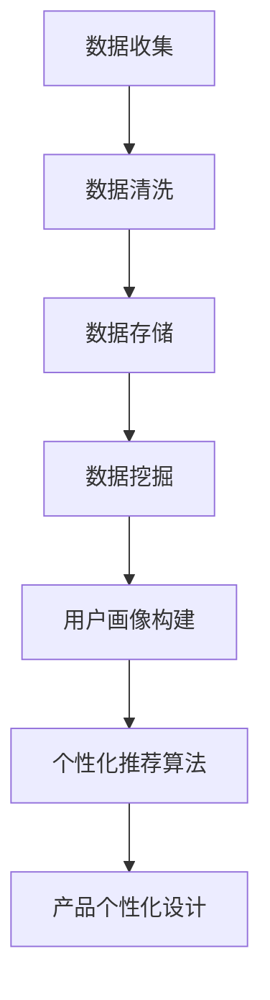

                 

# 《信息差的产品个性化之路：大数据如何推动产品个性化》

> **关键词：** 信息差、产品个性化、大数据、个性化推荐、用户画像

> **摘要：** 本文将深入探讨信息差在产品个性化中的作用，以及大数据如何利用其海量数据处理能力，为产品个性化提供强有力的支持。我们将一步步解析大数据在用户行为数据收集、分析、用户画像构建以及个性化推荐系统设计中的关键作用，并分享成功案例，探讨面临的挑战和未来发展趋势。

### 第一部分：引言与背景

#### 1.1 信息差的定义与重要性

**信息差**，简而言之，是指不同个体或群体之间在获取和处理信息方面的差异。在商业环境中，信息差的重要性不言而喻。首先，信息差能够为企业带来竞争优势，通过掌握更多信息，企业可以更精准地定位市场需求，推出更符合用户期望的产品或服务。其次，信息差能够提升企业的决策效率，减少因信息不对称导致的错误决策。此外，信息差还能够创造商业机会，例如，通过信息差，企业可以发掘未被满足的用户需求，从而开拓新的市场。

#### 1.2 信息差在商业中的应用

信息差在商业中的应用非常广泛。例如，电商企业通过用户浏览、购买行为等数据，了解用户偏好，从而实现个性化推荐，提高转化率。金融行业通过分析客户数据，提供个性化理财建议，提升客户满意度。在媒体行业，通过分析用户阅读习惯，推荐相关文章，提高用户粘性。

#### 1.3 信息差与产品个性化

信息差与产品个性化有着密不可分的关系。产品个性化是指根据用户的需求、偏好和行为，为用户提供定制化的产品或服务。信息差为产品个性化提供了基础数据支持，使得企业能够更深入地了解用户，从而提供更精准的个性化服务。

### 第二部分：大数据与产品个性化的关系

#### 2.1 大数据的基本概念

大数据，即大规模数据集，具有“4V”特征：Volume（大量）、Velocity（高速）、Variety（多样）和Veracity（真实性）。大数据的规模和复杂性使得传统的数据处理方法难以胜任，因此需要新的技术和方法来应对。

#### 2.2 大数据与个性化推荐

个性化推荐是大数据应用的一个重要领域。通过分析海量用户数据，系统可以识别出用户的兴趣和行为模式，从而推荐用户可能感兴趣的产品或内容。大数据为个性化推荐提供了强大的数据支撑，使得推荐结果更加精准。

#### 2.3 大数据在产品个性化中的作用

大数据在产品个性化中发挥着关键作用。首先，大数据可以帮助企业更好地了解用户需求，从而设计出更符合用户期望的产品。其次，大数据可以实时分析用户行为，快速调整产品策略，提高用户满意度。此外，大数据还可以为产品优化提供数据支持，帮助企业不断改进产品，提升用户体验。

### 第三部分：产品个性化之路

#### 3.1 产品个性化的概念与类型

**产品个性化**是指根据用户的需求、偏好和行为，为用户提供定制化的产品或服务。产品个性化可以分为以下几种类型：

- **基于需求的个性化**：根据用户需求提供定制化产品或服务。
- **基于行为的个性化**：根据用户行为模式提供个性化推荐。
- **基于偏好的个性化**：根据用户偏好提供个性化内容。

#### 3.2 产品个性化的类型

产品个性化的类型多种多样，主要包括：

- **个性化推荐**：根据用户历史行为和偏好推荐相关产品或内容。
- **定制化服务**：根据用户需求提供个性化服务，如个性化推送、个性化订阅等。
- **个性化界面**：根据用户习惯和偏好，提供定制化的界面设计。

#### 3.3 产品个性化的目标

产品个性化的目标是提高用户满意度和忠诚度，从而提升企业的市场竞争力和盈利能力。具体来说，产品个性化的目标包括：

- **提高用户粘性**：通过提供个性化服务，增加用户使用产品的频率和时间。
- **提升用户满意度**：根据用户需求提供定制化产品或服务，满足用户期望。
- **增加转化率**：通过个性化推荐，提高用户购买产品的概率。

### 第四部分：大数据分析在产品个性化中的应用

#### 4.1 用户行为数据的收集

用户行为数据是产品个性化的重要基础。收集用户行为数据的方法包括：

- **网站分析工具**：如Google Analytics等，可以收集用户浏览、点击等行为数据。
- **客户端日志**：通过SDK等技术，实时收集用户在移动设备上的行为数据。
- **问卷调查**：通过问卷调查，了解用户需求和偏好。

#### 4.2 用户行为数据的价值

用户行为数据具有极高的价值，主要体现在以下几个方面：

- **用户需求分析**：通过分析用户行为数据，了解用户需求，为产品优化提供依据。
- **用户画像构建**：基于用户行为数据，构建用户画像，为个性化推荐提供基础。
- **用户行为预测**：通过分析用户行为数据，预测用户未来的行为，为产品策略制定提供支持。

#### 4.3 用户画像的构建

用户画像是指通过收集和分析用户行为数据，构建出一个全面、详细的用户画像。用户画像的构建主要包括以下几个步骤：

- **数据收集**：收集用户行为数据，如浏览历史、购买记录、评价等。
- **数据清洗**：对收集到的数据进行清洗和预处理，去除无效数据。
- **特征提取**：从清洗后的数据中提取出有用的特征，如用户偏好、兴趣、行为模式等。
- **模型构建**：使用机器学习算法，构建用户画像模型，对用户进行分类和标注。

### 第五部分：大数据分析技术介绍

#### 4.4 数据挖掘技术

数据挖掘技术是指从大量数据中提取出有价值的信息和知识的方法。在产品个性化中，数据挖掘技术可以用于以下方面：

- **用户行为分析**：通过分析用户行为数据，了解用户需求和行为模式。
- **市场趋势分析**：通过分析市场数据，预测市场趋势，为产品策略提供支持。
- **客户细分**：通过分析用户数据，将用户分为不同的群体，为个性化推荐提供基础。

#### 4.5 机器学习算法

机器学习算法是数据挖掘的核心技术之一。在产品个性化中，常见的机器学习算法包括：

- **协同过滤算法**：通过分析用户行为数据，为用户推荐相关产品或内容。
- **聚类算法**：通过将用户分为不同的群体，为个性化推荐提供基础。
- **分类算法**：通过分析用户数据，对用户进行分类，为个性化推荐提供依据。

#### 4.6 数据可视化技术

数据可视化技术是将数据以图形或图表的形式展示出来，使人们更容易理解和分析数据。在产品个性化中，数据可视化技术可以用于以下方面：

- **用户行为可视化**：通过图表展示用户行为数据，了解用户需求和行为模式。
- **推荐结果可视化**：通过图表展示推荐结果，帮助用户更好地理解推荐内容。
- **数据趋势可视化**：通过图表展示数据趋势，为产品策略制定提供支持。

### 第六部分：大数据驱动的个性化产品

#### 6.1 个性化推荐系统设计与实现

个性化推荐系统是大数据在产品个性化中的典型应用。个性化推荐系统的主要设计包括以下几个方面：

- **用户建模**：构建用户画像，包括用户偏好、兴趣、行为模式等。
- **推荐算法**：选择合适的推荐算法，如协同过滤、聚类等。
- **推荐结果**：根据用户建模和推荐算法，生成个性化推荐结果。
- **反馈机制**：收集用户反馈，不断优化推荐系统。

个性化推荐系统的实现主要包括以下几个步骤：

- **数据收集**：收集用户行为数据，如浏览历史、购买记录、评价等。
- **数据预处理**：对收集到的数据进行清洗和预处理，去除无效数据。
- **用户建模**：使用机器学习算法，构建用户画像模型。
- **推荐算法**：选择合适的推荐算法，生成个性化推荐结果。
- **系统部署**：将推荐系统部署到生产环境，为用户提供个性化推荐服务。

#### 6.2 推荐算法的选择与优化

推荐算法的选择和优化是个性化推荐系统的关键。常见的推荐算法包括协同过滤、聚类、分类等。选择合适的推荐算法，需要考虑以下因素：

- **数据量**：数据量较大的场景适合使用协同过滤算法，而数据量较小的场景适合使用聚类算法。
- **用户活跃度**：用户活跃度较高的场景适合使用基于行为的推荐算法，而用户活跃度较低的场景适合使用基于内容的推荐算法。
- **计算资源**：计算资源丰富的场景适合使用复杂的推荐算法，而计算资源有限的场景适合使用简单的推荐算法。

推荐算法的优化主要包括以下方面：

- **参数调优**：通过调整算法参数，优化推荐效果。
- **特征工程**：通过构建新的特征，提高推荐效果。
- **算法融合**：将不同的推荐算法结合起来，提高推荐效果。

#### 6.3 个性化推荐系统的实施案例

以下是一个个性化推荐系统的实施案例：

- **项目背景**：某电商平台希望通过个性化推荐系统，提高用户购买率和转化率。
- **解决方案**：采用基于协同过滤的推荐算法，构建用户画像，实现个性化推荐。
- **实施过程**：
  1. 收集用户行为数据，包括浏览历史、购买记录、评价等。
  2. 对数据进行分析和处理，构建用户画像。
  3. 选择基于协同过滤的推荐算法，生成个性化推荐结果。
  4. 将推荐系统部署到生产环境，为用户提供个性化推荐服务。
- **效果评估**：通过A/B测试，对比个性化推荐系统与传统推荐系统的效果，发现个性化推荐系统显著提高了用户购买率和转化率。

### 第七部分：个性化用户体验设计

#### 7.1 用户体验设计的基本原则

个性化用户体验设计需要遵循以下基本原则：

- **以用户为中心**：设计过程要以用户需求为导向，关注用户的使用体验。
- **简洁明了**：设计要简洁明了，避免复杂的操作流程，提高用户使用效率。
- **易用性**：设计要易于使用，用户能够轻松上手。
- **个性化**：根据用户需求和偏好，提供个性化的产品或服务。

#### 7.2 个性化设计的方法与工具

个性化设计的方法包括：

- **用户调研**：通过用户调研，了解用户需求、偏好和行为。
- **用户画像**：构建用户画像，为个性化设计提供基础。
- **数据驱动**：通过数据分析，优化产品设计和用户体验。

个性化设计的工具包括：

- **用户调研工具**：如问卷星、调研云等，用于收集用户反馈。
- **用户画像工具**：如用户画像平台、用户标签管理等，用于构建用户画像。
- **数据可视化工具**：如ECharts、Tableau等，用于分析用户数据。

#### 7.3 个性化设计的实际应用案例

以下是一个个性化设计的实际应用案例：

- **项目背景**：某视频平台希望通过个性化设计，提高用户粘性和观看时长。
- **解决方案**：采用用户画像和数据驱动的设计方法，实现个性化视频推荐。
- **实施过程**：
  1. 收集用户观看数据，包括观看时长、观看频次、观看偏好等。
  2. 构建用户画像，包括用户年龄段、观看偏好等。
  3. 根据用户画像和观看数据，生成个性化推荐列表。
  4. 将个性化推荐列表展示给用户，提高用户观看时长。
- **效果评估**：通过用户调研和数据分析，发现个性化设计显著提高了用户粘性和观看时长。

### 第八部分：大数据与产品个性化的挑战与未来

#### 8.1 大数据与产品个性化面临的挑战

大数据与产品个性化面临以下挑战：

- **数据隐私与安全**：大数据处理过程中，如何保护用户隐私和安全是一个重要问题。
- **数据质量与多样性**：大数据的质量和多样性直接影响产品个性化效果。
- **技术与人才的挑战**：大数据和人工智能技术的发展，对技术和人才提出了更高的要求。

#### 8.2 大数据与产品个性化的未来趋势

大数据与产品个性化的未来趋势包括：

- **人工智能与大数据的结合**：通过人工智能技术，提高大数据分析能力和产品个性化效果。
- **新兴技术的应用**：如区块链、物联网等新兴技术，为产品个性化提供新的可能性。
- **持续优化的个性化设计**：通过不断优化产品设计和用户体验，提高用户满意度和忠诚度。

### 第九部分：案例研究

#### 9.1 某电商平台的个性化推荐

某电商平台通过大数据和个性化推荐技术，实现了产品个性化，显著提高了用户购买率和转化率。

- **数据收集**：收集用户浏览历史、购买记录、评价等数据。
- **用户画像**：根据用户行为数据，构建用户画像。
- **推荐算法**：采用协同过滤算法，生成个性化推荐列表。
- **效果评估**：通过A/B测试，发现个性化推荐显著提高了用户购买率和转化率。

#### 9.2 某视频平台的个性化内容推荐

某视频平台通过大数据和个性化推荐技术，实现了内容个性化，提高了用户粘性和观看时长。

- **数据收集**：收集用户观看数据，包括观看时长、观看频次、观看偏好等。
- **用户画像**：根据用户观看数据，构建用户画像。
- **推荐算法**：采用基于内容的推荐算法，生成个性化推荐列表。
- **效果评估**：通过用户调研和数据分析，发现个性化推荐显著提高了用户粘性和观看时长。

### 第十部分：附录

#### 10.1 大数据产品个性化工具与资源

- **大数据工具对比**：Hadoop、Spark、Flink等。
- **机器学习框架介绍**：TensorFlow、PyTorch、Scikit-learn等。
- **个性化产品开发指南**：用户画像构建指南、推荐算法优化指南、数据安全与隐私保护指南等。

### 结论

大数据与产品个性化相辅相成，为商业带来了前所未有的机遇。通过深入挖掘大数据的价值，企业可以更好地了解用户需求，提供个性化产品和服务，从而提升用户满意度和忠诚度。未来，随着人工智能和大数据技术的不断发展，产品个性化将更加精准和智能化，为企业和用户带来更多价值。

### 致谢

感谢读者对本文的阅读，感谢所有参与讨论和提供反馈的朋友。如果您有任何建议或意见，欢迎随时联系我们。让我们共同探讨大数据与产品个性化的未来，共创美好商业世界！

### 作者简介

作者：AI天才研究院/AI Genius Institute & 禅与计算机程序设计艺术 /Zen And The Art of Computer Programming

### Mermaid 流程图：大数据分析流程



### 个性化推荐算法伪代码

```python
def personalized_recommendation算法(user_data, product_data):
    # 步骤1：构建用户画像
    user_profile = build_user_profile(user_data)

    # 步骤2：计算用户相似度
    similarity_scores = calculate_similarity(user_profile, product_data)

    # 步骤3：根据相似度排序推荐列表
    ranked_recommendations = sort_recommendations(similarity_scores)

    # 步骤4：返回推荐列表
    return ranked_recommendations
```

### 数学模型与公式

- **协同过滤算法中的相似度计算公式：**
  $$ similarity(u, v) = \frac{\sum_{i \in common\_items}(r_{ui} - \mu_u)(r_{vi} - \mu_v)}{\sqrt{\sum_{i \in common\_items}(r_{ui} - \mu_u)^2 \sum_{i \in common\_items}(r_{vi} - \mu_v)^2}} $$
- **用户兴趣度计算公式：**
  $$ interest(u, i) = \sum_{v \in neighbors(u)} similarity(u, v) \cdot rating(v, i) $$

### 个性化产品设计案例分析

- **案例分析1：** 某电商平台的个性化推荐系统，通过用户购买历史和行为数据，实现个性化商品推荐，提高了用户满意度和转化率。
- **案例分析2：** 某视频平台的个性化内容推荐，基于用户观看历史和偏好，为用户推荐相关视频，增加了用户粘性和平台活跃度。

### 大数据产品个性化开发工具与资源

- **大数据工具对比：**
  - **Hadoop**
  - **Spark**
  - **Flink**
- **机器学习框架介绍：**
  - **TensorFlow**
  - **PyTorch**
  - **Scikit-learn**
- **个性化产品开发指南：**
  - **用户画像构建指南**
  - **推荐算法优化指南**
  - **数据安全与隐私保护指南**<|vq_10236|><|priv_0|><|vq_16285|>

