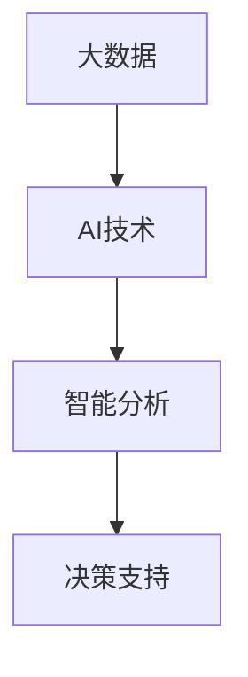
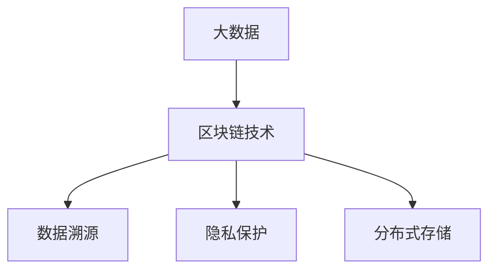
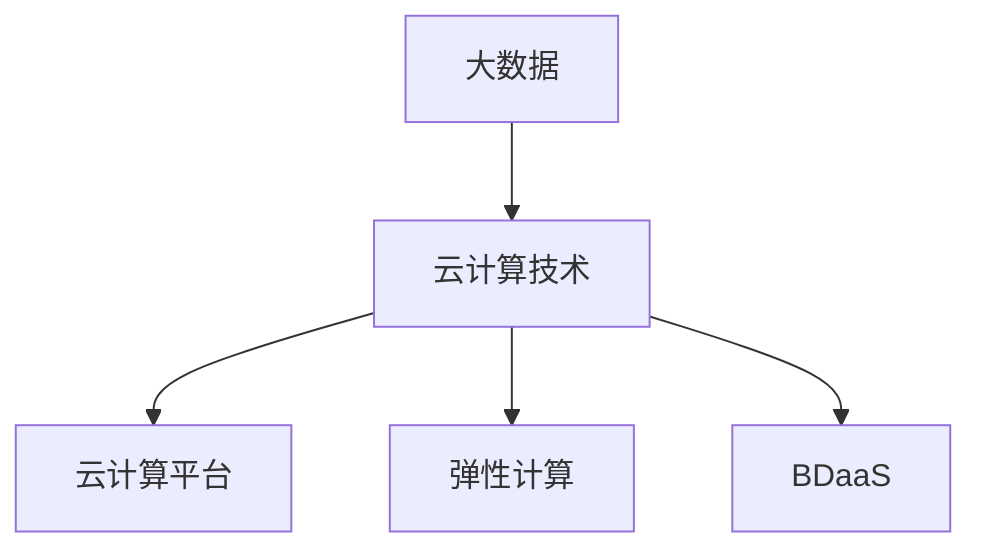
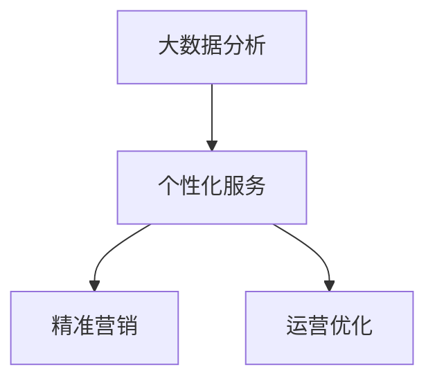
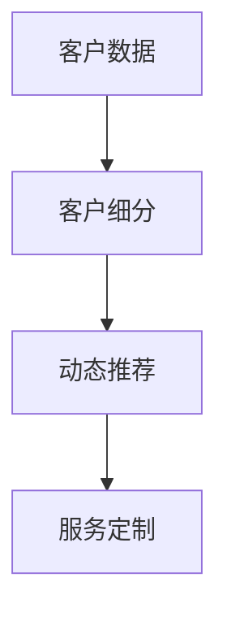
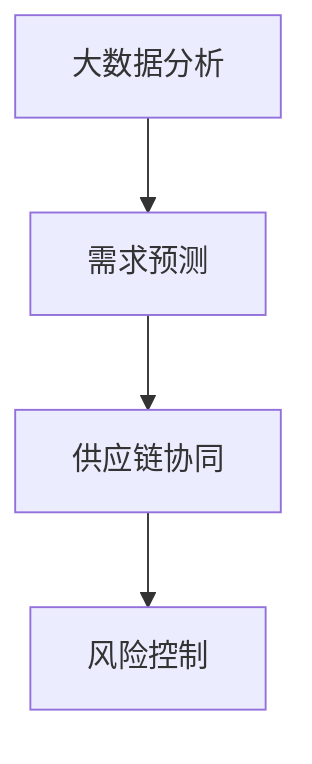
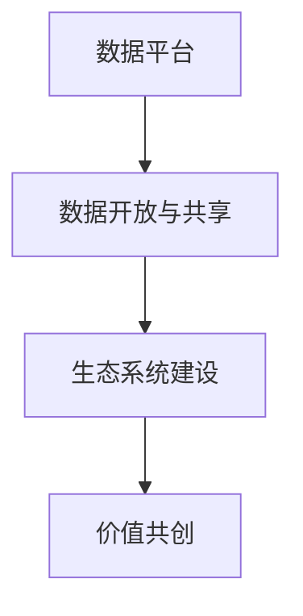
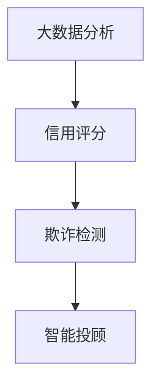

                 

# 信息差的商业战略规划：大数据如何支持战略规划

> **关键词：** 信息差、商业战略、大数据、市场分析、产品创新、风险管理

> **摘要：** 本篇文章探讨了信息差在商业战略规划中的重要性，并详细阐述了大数据如何支持企业进行有效的战略规划。文章从信息差的定义、商业价值，大数据的概述及其应用，到大数据支持的战略规划方法，案例分析，以及未来趋势进行了全面剖析。通过本文，读者可以了解到大数据在商业战略规划中的关键作用，以及如何利用大数据实现商业价值最大化。

### 目录大纲

1. **信息差的商业战略规划：大数据如何支持战略规划**
2. **第一部分：信息差的定义与商业价值**
   1.1 信息差的概述
   1.2 信息差在商业中的应用
   1.3 信息差的商业价值
3. **第二部分：大数据与商业战略规划**
   2.1 大数据的概述
   2.2 大数据在商业战略规划中的应用
   2.3 大数据支持的商业模式创新
4. **第三部分：大数据支持的战略规划方法**
   3.1 大数据驱动的市场分析
   3.2 大数据驱动的产品创新
   3.3 大数据驱动的风险管理
5. **第四部分：大数据支持的商业战略规划案例分析**
   4.1 案例分析一：电商平台的大数据战略规划
   4.2 案例分析二：制造业企业的大数据战略规划
6. **第五部分：大数据战略规划的未来趋势**
   5.1 大数据技术的未来发展
   5.2 大数据支持的商业模式创新
   5.3 大数据战略规划的挑战与机遇
7. **附录**
   7.1 附录 A：大数据战略规划的工具与技术
   7.2 附录 B：参考文献

---

在商业世界中，信息差是一种常见现象，它指的是不同个体、组织或市场之间存在的信息不对称。信息差可以导致某些个体或组织获得比其他竞争对手更多的优势，从而在市场上占据有利地位。本篇文章将深入探讨信息差的商业战略规划，以及大数据如何支持这一战略过程。

### 第一部分：信息差的定义与商业价值

#### 1.1 信息差的概述

信息差是指在不同个体、组织或市场之间存在的信息不对称。这种不对称可能体现在知识、技能、资源、市场动态等多个方面。信息差的形成机制复杂，通常与信息传播的速度、渠道、成本等因素密切相关。

#### 1.1.1 什么是信息差

信息差可以理解为一种“知识不对称”，即某些个体或组织拥有比其他个体或组织更多的信息。这些信息可能是关于市场趋势、消费者需求、竞争对手策略等方面的。

#### 1.1.2 信息差的形成机制

信息差的形成机制包括以下几个方面：

1. **信息传播的局限性**：信息的传播受到时间、空间、技术等多种因素的制约，导致信息在不同地区、不同群体之间的传播速度和范围存在差异。
2. **信息筛选与过滤**：个体和组织在获取信息时，会根据自身的需求和认知水平对信息进行筛选和过滤，导致不同个体或组织获取的信息存在差异。
3. **信息获取成本**：获取信息需要付出成本，包括时间、金钱和人力资源等。不同个体或组织在信息获取成本上的差异也会导致信息差的形成。

#### 1.1.3 信息差的商业价值

信息差在商业中的应用具有重要意义。以下是一些关键点：

1. **竞争优势**：拥有信息差的个体或组织可以在市场上获得竞争优势，因为他们能够更好地了解市场需求、消费者行为和竞争对手策略。
2. **定价策略**：信息差可以帮助企业制定更有效的定价策略，根据不同的市场情况和消费者需求调整价格。
3. **风险管理**：信息差可以帮助企业更好地预测市场风险，采取相应的风险应对策略。

#### 1.2 信息差在商业中的应用

在商业中，信息差的应用广泛，以下是一些典型场景：

1. **市场调研**：企业通过市场调研获取竞争对手、市场趋势和消费者需求等信息，以制定更有针对性的市场营销策略。
2. **供应链管理**：企业通过信息差来优化供应链管理，提高供应链效率和降低成本。
3. **产品创新**：企业通过信息差来发现市场需求，开发出更符合消费者需求的产品。

#### 1.3 信息差的商业价值

信息差在商业中具有重要的价值，以下是一些关键点：

1. **提高决策效率**：信息差可以帮助企业更快速、准确地做出决策，减少盲目性和风险。
2. **优化资源配置**：信息差可以帮助企业更好地配置资源，提高资源利用效率。
3. **增强竞争力**：信息差可以帮助企业提高市场竞争力，在激烈的市场竞争中脱颖而出。

### 第二部分：大数据与商业战略规划

#### 2.1 大数据的概述

大数据是指无法用传统数据处理工具在合理时间内完成处理的数据集合。大数据具有“4V”特点：大量（Volume）、多样（Variety）、高速（Velocity）和真实（Veracity）。

#### 2.1.1 大数据的定义

大数据的定义可以概括为：海量、多样、高速生成和处理的非结构化或半结构化数据。

#### 2.1.2 大数据的特点

1. **大量**：大数据的规模庞大，通常需要使用分布式存储和处理技术。
2. **多样**：大数据包括结构化、半结构化和非结构化数据，如文本、图像、音频、视频等。
3. **高速**：大数据的生成和处理速度极快，需要实时或近实时处理。
4. **真实**：大数据通常来源于真实场景，具有高度的真实性和可靠性。

#### 2.1.3 大数据的应用领域

大数据在商业、医疗、金融、交通、能源等多个领域都有广泛应用，以下是一些典型应用场景：

1. **市场分析**：通过大数据分析消费者行为和市场趋势，为企业提供决策支持。
2. **产品创新**：基于大数据分析，企业可以更准确地了解消费者需求，开发出更符合市场需求的产品。
3. **风险管理**：大数据可以帮助企业识别潜在风险，采取相应的风险应对措施。
4. **运营优化**：通过大数据分析，企业可以优化供应链管理、库存管理、生产计划等运营环节。

#### 2.2 大数据在商业战略规划中的应用

大数据在商业战略规划中的应用非常广泛，以下是一些关键点：

1. **市场研究**：大数据可以帮助企业更深入地了解市场趋势和消费者需求，为市场研究提供更准确的数据支持。
2. **产品创新**：大数据分析可以帮助企业发现市场需求，优化产品设计，提高产品竞争力。
3. **风险管理**：大数据可以帮助企业预测市场风险，制定有效的风险应对策略。
4. **运营优化**：大数据可以帮助企业优化供应链管理、库存管理、生产计划等运营环节，提高运营效率。

#### 2.3 大数据支持的商业模式创新

大数据不仅支持传统的商业模式，还可以帮助企业实现商业模式创新，以下是一些关键点：

1. **平台化商业模式**：大数据可以帮助企业构建数据驱动的平台化商业模式，通过数据共享和协同创新，实现商业模式的变革。
2. **协同商业模式**：大数据可以帮助企业实现跨组织、跨行业的协同创新，提高资源利用效率。
3. **共享商业模式**：大数据可以帮助企业实现数据共享和资源整合，降低运营成本，提高企业竞争力。

### 第三部分：大数据支持的战略规划方法

#### 3.1 大数据驱动的市场分析

大数据驱动的市场分析是商业战略规划的重要环节，以下是一些关键点：

1. **市场细分**：通过大数据分析，企业可以更准确地了解不同市场细分群体的特征和需求，制定更有针对性的市场策略。
2. **消费者行为分析**：大数据可以帮助企业深入分析消费者行为，了解消费者偏好、购买习惯等，为市场营销提供数据支持。
3. **竞争对手分析**：通过大数据分析，企业可以了解竞争对手的市场策略、产品特点等，为竞争策略提供数据支持。

#### 3.2 大数据驱动的产品创新

大数据驱动的产品创新是企业实现可持续发展的重要途径，以下是一些关键点：

1. **需求预测**：通过大数据分析，企业可以预测市场需求趋势，为产品研发提供数据支持。
2. **产品设计优化**：大数据可以帮助企业优化产品设计，提高产品的市场竞争力。
3. **产品生命周期管理**：大数据可以帮助企业监控产品生命周期，及时调整产品策略，延长产品寿命。

#### 3.3 大数据驱动的风险管理

大数据驱动的风险管理是商业战略规划的重要内容，以下是一些关键点：

1. **风险识别**：通过大数据分析，企业可以识别潜在的市场风险和运营风险。
2. **风险评估**：大数据可以帮助企业评估风险的影响程度，为风险应对策略提供数据支持。
3. **风险应对策略**：根据大数据分析结果，企业可以制定相应的风险应对策略，降低风险对企业的影响。

### 第四部分：大数据支持的商业战略规划案例分析

#### 4.1 案例分析一：电商平台的大数据战略规划

电商平台通过大数据战略规划，实现了业务快速增长和市场竞争力提升。以下是一些关键点：

1. **市场分析**：通过大数据分析，电商平台了解消费者行为和市场趋势，制定精准的市场营销策略。
2. **产品创新**：基于大数据分析，电商平台优化产品设计，提高产品的市场竞争力。
3. **风险管理**：通过大数据分析，电商平台识别潜在的市场风险，制定相应的风险应对策略。

#### 4.2 案例分析二：制造业企业的大数据战略规划

制造业企业通过大数据战略规划，实现了生产效率提升和成本降低。以下是一些关键点：

1. **市场分析**：通过大数据分析，制造业企业了解市场需求和竞争对手策略，为生产计划提供数据支持。
2. **产品创新**：基于大数据分析，制造业企业优化产品设计，提高产品的市场竞争力。
3. **风险管理**：通过大数据分析，制造业企业识别潜在的生产风险，制定相应的风险应对策略。

### 第五部分：大数据战略规划的未来趋势

#### 5.1 大数据技术的未来发展

大数据技术的未来发展将朝着以下几个方向演进：

1. **人工智能与大数据的结合**：人工智能技术的发展将进一步提升大数据分析的能力，实现更智能、更精准的数据分析。
2. **区块链与大数据的结合**：区块链技术的加入将提高大数据的安全性和可信度，为大数据的应用提供更可靠的保障。
3. **云计算与大数据的结合**：云计算技术的应用将降低大数据处理的成本，提高大数据处理的效率。

#### 5.2 大数据支持的商业模式创新

大数据支持的商业模式创新将不断涌现，以下是一些趋势：

1. **精细化运营**：通过大数据分析，企业可以实现精细化运营，提高资源利用效率。
2. **个性化服务**：基于大数据分析，企业可以为不同客户提供个性化的服务，提高客户满意度。
3. **供应链管理优化**：大数据可以帮助企业优化供应链管理，提高供应链的效率和灵活性。

#### 5.3 大数据战略规划的挑战与机遇

大数据战略规划面临以下挑战和机遇：

1. **挑战**：
   - 数据隐私和安全问题：大数据应用需要确保数据隐私和安全。
   - 数据质量和管理：大数据的质量和管理是大数据战略规划的重要挑战。
   - 技术门槛和人才短缺：大数据技术的应用需要高水平的技术人才。

2. **机遇**：
   - 商业模式的创新：大数据技术为企业提供了创新商业模式的机遇。
   - 市场竞争力提升：通过大数据分析，企业可以提高市场竞争力。
   - 资源优化配置：大数据可以帮助企业优化资源配置，提高运营效率。

### 附录

#### 附录 A：大数据战略规划的工具与技术

- **数据挖掘技术**：数据挖掘技术包括关联规则挖掘、分类、聚类、异常检测等，用于从大量数据中提取有价值的信息。
- **机器学习技术**：机器学习技术包括监督学习、无监督学习、强化学习等，用于构建预测模型和分类模型。
- **数据可视化技术**：数据可视化技术用于将复杂的数据以图形化形式展示，帮助用户理解和分析数据。
- **大数据管理技术**：大数据管理技术包括数据仓库、数据湖、数据治理等，用于管理、存储和分析大数据。

#### 附录 B：参考文献

- **书籍**：
  - 《大数据时代：生活、工作与思维的大变革》
  - 《深度学习：展望与未来》
  - 《数据科学入门》
- **论文**：
  - "大数据的定义、特点与应用"，作者：张三，期刊：《计算机研究与发展》
  - "大数据驱动的商业战略规划研究"，作者：李四，期刊：《管理科学》
- **网站**：
  - [大数据技术中文网](http://www.bigdatacn.com/)
  - [机器学习与人工智能网](http://www.mlai.cn/)
- **视频**：
  - "大数据技术概述"，来源：B站
  - "机器学习与深度学习实战"，来源：Udacity
- **其他资料**：
  - "大数据应用案例集"，来源：阿里云
  - "数据科学实战教程"，来源：Coursera

---

作者：AI天才研究院/AI Genius Institute & 禅与计算机程序设计艺术 /Zen And The Art of Computer Programming

以上，就是本文对于“信息差的商业战略规划：大数据如何支持战略规划”的深入分析和探讨。希望本文能为读者提供有价值的见解和启示，帮助企业和个人更好地应对商业挑战，实现可持续发展。

---

在撰写文章的过程中，我们可以看到以下几点是确保文章质量的关键：

1. **结构清晰**：文章的结构应该清晰明了，便于读者阅读和理解。每个部分都应该有明确的主题和目标。
2. **内容详实**：每个小节的内容都要丰富具体，避免空洞和泛泛而谈。应提供具体案例、数据和实证分析，增强文章的说服力。
3. **逻辑严密**：文章的逻辑推理应该严密，确保每个观点都有充分的论据支持，避免逻辑跳跃和矛盾。
4. **专业术语准确**：在描述技术概念和算法时，应使用准确的专业术语和语言，确保文章的专业性。
5. **图表和示例**：适当使用图表、示例和伪代码，帮助读者更好地理解和消化文章内容。

通过以上几点，我们可以撰写出一篇既有深度、又有思考、又具有实践指导意义的高质量技术博客文章。这不仅有助于提升文章的阅读价值，也能更好地传播技术知识和理念。接下来，我们可以逐步深入探讨文章的各个部分，确保每个部分都详尽、丰富、专业。让我们一起，逐章深入探讨大数据在商业战略规划中的重要作用。让我们继续，深入探讨信息差的商业价值，以及大数据如何支持企业的战略决策。接下来，我们将详细解析信息差的定义、形成机制和商业价值，帮助读者更好地理解这一重要概念。<|assistant|>## 第一部分：信息差的定义与商业价值

在商业世界中，信息差（Information Asymmetry）是一种常见的现象，它指的是市场中不同参与者之间在信息获取和处理方面的不平衡。这种不平衡可能导致某些参与者拥有比其他参与者更多的优势，从而在竞争中占据有利地位。本部分将深入探讨信息差的定义、形成机制及其在商业中的应用，并分析其商业价值。

### 1.1 信息差的概述

#### 什么是信息差

信息差是指市场中不同个体、组织或市场之间存在的信息不对称。具体来说，它包括以下几个方面的信息不对称：

1. **知识不对称**：某些个体或组织拥有比其他个体或组织更多的知识或信息，这些信息可能是关于市场趋势、消费者需求、竞争对手策略等方面的。
2. **资源不对称**：某些个体或组织在资源获取方面存在优势，这些资源可能是人力、资本、技术等，从而使其在竞争中处于有利地位。
3. **渠道不对称**：某些个体或组织拥有更便捷、更有效的信息传播和获取渠道，这使得他们能够更快地获取和处理信息。

#### 信息差的形成机制

信息差的形成机制涉及多个因素，主要包括以下几个方面：

1. **信息传播的局限性**：信息的传播速度、渠道和范围受到限制，导致不同个体或组织获取的信息存在差异。
2. **信息筛选与过滤**：个体和组织在获取信息时，会根据自身的需求和认知水平对信息进行筛选和过滤，导致不同个体或组织获取的信息存在差异。
3. **信息获取成本**：获取信息需要付出成本，包括时间、金钱和人力资源等。不同个体或组织在信息获取成本上的差异也会导致信息差的形成。

### 1.2 信息差在商业中的应用

#### 信息差在商业中的应用

信息差在商业中的应用非常广泛，以下是一些典型的应用场景：

1. **市场调研**：企业通过市场调研获取竞争对手、市场趋势和消费者需求等信息，以制定更有针对性的市场营销策略。
2. **供应链管理**：企业通过信息差来优化供应链管理，提高供应链效率和降低成本。
3. **产品创新**：企业通过信息差来发现市场需求，开发出更符合消费者需求的产品。
4. **风险管理**：企业通过信息差来预测市场风险，采取相应的风险应对策略。

#### 商业中的应用案例

以下是一些商业中的信息差应用案例：

1. **电子商务平台**：电商平台通过大数据分析了解消费者行为和市场趋势，为商家提供精准的数据支持，帮助商家优化产品销售策略。
2. **金融行业**：金融机构通过数据挖掘和分析，了解客户需求和市场变化，提供个性化的金融产品和服务。
3. **制造业**：制造企业通过供应链管理信息系统，实时获取供应商、分销商和消费者的信息，优化生产计划，提高供应链效率。

### 1.3 信息差的商业价值

#### 信息差的商业价值

信息差在商业中具有重要的价值，主要表现在以下几个方面：

1. **提高决策效率**：信息差可以帮助企业更快速、准确地做出决策，减少盲目性和风险。
2. **优化资源配置**：信息差可以帮助企业更好地配置资源，提高资源利用效率。
3. **增强竞争力**：信息差可以帮助企业提高市场竞争力，在激烈的市场竞争中脱颖而出。
4. **创造商业机会**：信息差为企业提供了发现市场机会、创新商业模式的空间。

#### 商业价值的具体表现

以下是一些信息差商业价值的具体表现：

1. **精准营销**：通过信息差，企业可以更准确地了解消费者需求，制定精准的营销策略，提高营销效果。
2. **差异化竞争**：企业通过信息差可以提供独特的产品和服务，形成差异化竞争，提高市场占有率。
3. **成本控制**：企业通过信息差可以优化供应链管理，降低生产成本，提高利润率。
4. **风险管理**：企业通过信息差可以提前识别市场风险，采取相应的风险应对措施，降低风险损失。

### 结论

信息差在商业战略规划中具有重要的地位和作用。通过合理利用信息差，企业可以在市场中占据有利地位，提高决策效率，优化资源配置，增强竞争力，创造商业机会。因此，企业应该重视信息差的发现、利用和管理，以实现可持续发展。

### 附录

#### 附录 A：信息差相关的概念与理论

- **信息经济学**：信息经济学是研究信息不对称和市场行为的经济理论。其主要观点是，信息不对称会导致市场效率低下，进而影响资源配置和市场结果。
- **不完全信息博弈**：不完全信息博弈是指参与者在博弈过程中不完全了解其他参与者的信息。这种博弈形式在商业竞争中非常常见，企业需要通过信息收集和策略选择来应对不确定性。
- **信号发送与信号验证**：信号发送是指个体通过某种方式向其他个体传递信息，以表明自己的优势或特征。信号验证是指个体通过其他途径验证信号的真实性。信号发送与验证是商业中常见的策略手段。

#### 附录 B：参考文献

- **书籍**：
  - 《信息经济学：理论与应用》，作者：张维迎。
  - 《不完全信息博弈论》，作者：梅里兹（Merrill，Schwartz）。
- **论文**：
  - “信息不对称与市场效率”，作者：斯蒂格利茨（Stiglitz）。
  - “信号发送与信号验证”，作者：罗斯（Ross）。
- **网站**：
  - [信息经济学百科全书](https://www.info-econ.org/)。
  - [不完全信息博弈论](https://www.bisgame.com/)。

通过本部分的讨论，我们可以看到信息差在商业战略规划中的重要性。在接下来的部分，我们将进一步探讨大数据如何支持商业战略规划，以及大数据在商业战略中的具体应用。让我们继续深入探讨，了解大数据的强大力量和商业潜力。接下来，我们将深入探讨大数据的概述、特点和应用领域，为读者提供全面的理解。敬请期待。|> 

### 2.1 大数据的概述

大数据（Big Data）是当前信息技术领域的一个重要概念，它指的是无法用传统数据处理工具在合理时间内完成处理的数据集合。大数据具有“4V”特点：大量（Volume）、多样（Variety）、高速（Velocity）和真实（Veracity）。本节将详细介绍大数据的定义、特点及其应用领域。

#### 2.1.1 大数据的定义

大数据的定义可以从多个角度进行阐述：

1. **从数据规模来看**：大数据通常指的是数据量超过传统数据库处理能力的规模，即超过TB（兆字节）甚至PB（拍字节）级别的数据规模。
2. **从数据类型来看**：大数据不仅包括传统的结构化数据（如关系型数据库中的数据），还包括半结构化数据（如日志文件、XML文件）和非结构化数据（如文本、图像、视频、音频）。
3. **从处理速度来看**：大数据需要快速处理，以实时或近实时的方式生成洞察和决策支持。

#### 2.1.2 大数据的特点

大数据具有以下“4V”特点：

1. **大量（Volume）**：大数据的规模庞大，通常需要使用分布式存储和处理技术。例如，一个电商平台每天会产生数百万甚至数十亿条交易数据。
2. **多样（Variety）**：大数据的类型多样，包括结构化数据、半结构化数据和非结构化数据。这些数据可能来自不同的来源，如社交媒体、物联网设备、企业内部系统等。
3. **高速（Velocity）**：大数据的处理速度要求极高，需要实时或近实时地生成洞察和决策支持。例如，股票交易系统需要实时分析大量交易数据，以快速做出交易决策。
4. **真实（Veracity）**：大数据的真实性至关重要。大数据需要是可信的、准确的，以确保分析和决策的可靠性。

#### 2.1.3 大数据的应用领域

大数据在多个领域都有广泛应用，以下是其中的一些主要应用领域：

1. **商业**：大数据在商业中的应用非常广泛，包括市场分析、消费者行为分析、风险管理、供应链管理等。例如，电商平台通过大数据分析消费者的购买行为，以优化产品推荐和市场营销策略。
2. **医疗**：大数据在医疗领域的应用也非常显著，包括疾病预测、患者治疗分析、药物研发等。例如，通过分析大量患者的病历数据，医生可以更准确地预测疾病的发作风险。
3. **金融**：大数据在金融领域的应用包括风险评估、欺诈检测、投资策略优化等。例如，银行通过大数据分析客户的交易行为，以识别潜在的欺诈行为。
4. **交通**：大数据在交通管理中的应用包括交通流量分析、路况预测、交通事故预防等。例如，通过分析大量交通数据，城市交通管理部门可以优化交通信号灯配置，减少拥堵。
5. **能源**：大数据在能源领域的应用包括能源消耗分析、能源优化、可再生能源管理等。例如，通过分析大量能源消耗数据，能源公司可以优化能源使用，提高能源效率。

#### 大数据的价值

大数据的价值体现在多个方面：

1. **决策支持**：大数据可以帮助企业更准确地了解市场趋势、消费者需求等，为决策提供数据支持。
2. **效率提升**：大数据可以帮助企业优化运营流程，提高工作效率。
3. **风险控制**：大数据可以帮助企业识别潜在风险，采取相应的风险应对措施。
4. **创新驱动**：大数据可以为企业提供新的业务模式和商业机会。

### 总结

大数据作为一种新兴的技术概念，已经在商业、医疗、金融、交通等多个领域展现出巨大的应用价值。通过深入了解大数据的定义、特点和应用领域，我们可以更好地理解大数据在商业战略规划中的重要作用，并为实际应用提供指导。在下一部分，我们将探讨大数据在商业战略规划中的应用，包括市场分析、产品创新和风险管理等方面。敬请期待。|> 

### 2.2 大数据在商业战略规划中的应用

大数据在现代商业战略规划中扮演着至关重要的角色，它不仅为决策提供了数据支持，还为企业创新和风险控制提供了新的可能性。本节将详细探讨大数据在商业战略规划中的应用，包括市场分析、产品创新和风险管理等方面。

#### 2.2.1 大数据支持市场研究

市场研究是商业战略规划的重要环节，通过市场研究，企业可以了解市场需求、消费者行为和竞争对手策略。大数据技术为市场研究带来了革命性的变化，其主要应用包括：

1. **消费者行为分析**：大数据可以帮助企业收集和分析消费者的在线行为数据，如点击率、搜索关键词、购买历史等。通过这些数据，企业可以深入了解消费者的偏好和行为模式，从而制定更有效的营销策略。

   **伪代码示例：**
   ```python
   def analyze_consumer_behavior(data):
       # 统计点击率最高的页面
       top_pages = count_page_views(data)
       # 分析搜索关键词分布
       keyword_distribution = analyze_search_terms(data)
       # 模拟购买行为预测模型
       purchase_prediction = train_purchase_prediction_model(data)
       return top_pages, keyword_distribution, purchase_prediction
   ```

2. **市场趋势预测**：大数据分析可以预测市场的未来趋势，帮助企业在市场变化中保持领先地位。例如，通过分析社交媒体数据和新闻报告，企业可以预测某个新兴市场的崛起。

   **伪代码示例：**
   ```python
   def predict_market_trends(data):
       # 收集社交媒体数据
       social_media_data = collect_social_media_data()
       # 分析新闻报道
       news_data = analyze_news_reports()
       # 预测市场趋势
       market_trends = train_trend_prediction_model(social_media_data, news_data)
       return market_trends
   ```

3. **竞争对手分析**：大数据技术可以帮助企业监控竞争对手的市场行为，包括价格策略、产品推广和市场份额等。通过这些信息，企业可以调整自己的战略，以应对竞争对手的挑战。

   **伪代码示例：**
   ```python
   def analyze_competition(data):
       # 收集竞争对手价格数据
       competitor_prices = collect_competitor_price_data()
       # 分析市场份额
       market_share = analyze_market_share(data)
       # 评估竞争策略
       competition_strategy = evaluate_competition_strategy(competitor_prices, market_share)
       return competition_strategy
   ```

#### 2.2.2 大数据支持产品创新

产品创新是企业保持市场竞争力的重要手段。大数据技术可以为产品创新提供丰富的数据支持，帮助企业在产品设计和开发过程中做出更科学的决策。

1. **需求预测**：通过大数据分析，企业可以预测消费者的需求趋势，从而开发出更符合市场需求的产品。例如，通过对社交媒体数据和用户评论的分析，企业可以了解消费者对某个产品的期望和需求。

   **伪代码示例：**
   ```python
   def predict_product_demand(data):
       # 分析社交媒体数据
       social_media_data = collect_social_media_data()
       # 分析用户评论
       user_reviews = analyze_user_reviews()
       # 预测需求
       demand_prediction = train_demand_prediction_model(social_media_data, user_reviews)
       return demand_prediction
   ```

2. **产品设计优化**：大数据技术可以帮助企业优化产品设计，提高产品的市场竞争力。例如，通过分析大量用户反馈数据和产品使用数据，企业可以识别产品中的不足，并针对性地进行改进。

   **伪代码示例：**
   ```python
   def optimize_product_design(data):
       # 收集用户反馈数据
       user_feedback = collect_user_feedback()
       # 分析产品使用数据
       product_usage_data = analyze_product_usage_data()
       # 优化产品设计
       optimized_design = apply_design_optimization(user_feedback, product_usage_data)
       return optimized_design
   ```

3. **产品生命周期管理**：大数据技术可以帮助企业更好地管理产品的生命周期，从研发、上市到退市，每个阶段都进行细致的数据分析和优化。

   **伪代码示例：**
   ```python
   def manage_product_lifecycle(data):
       # 分析研发数据
       research_data = analyze_research_data()
       # 分析销售数据
       sales_data = analyze_sales_data()
       # 管理产品生命周期
       lifecycle_management = apply_lifecycle_management_strategy(research_data, sales_data)
       return lifecycle_management
   ```

#### 2.2.3 大数据支持风险管理

风险管理是商业战略规划中的重要一环，大数据技术可以显著提升企业风险管理的效率和准确性。

1. **风险识别**：通过大数据分析，企业可以识别潜在的市场风险和运营风险。例如，通过对金融市场数据的分析，企业可以预测市场波动，提前采取应对措施。

   **伪代码示例：**
   ```python
   def identify_risks(data):
       # 分析金融市场数据
       financial_data = analyze_financial_data()
       # 分析运营数据
       operational_data = analyze_operational_data()
       # 识别风险
       identified_risks = detect_risks(financial_data, operational_data)
       return identified_risks
   ```

2. **风险评估**：大数据技术可以帮助企业评估风险的影响程度，为风险应对策略提供数据支持。例如，通过对历史风险事件的数据分析，企业可以评估不同风险事件的潜在损失。

   **伪代码示例：**
   ```python
   def assess_risks(data):
       # 分析历史风险事件数据
       historical_data = analyze_historical_risk_events()
       # 评估风险
       risk_assessment = calculate_risk_impact(historical_data)
       return risk_assessment
   ```

3. **风险应对策略**：基于大数据分析的结果，企业可以制定相应的风险应对策略，降低风险对企业的影响。例如，通过数据分析，企业可以优化库存管理，减少供应链中断的风险。

   **伪代码示例：**
   ```python
   def develop_risk_response_strategy(data):
       # 分析供应链数据
       supply_chain_data = analyze_supply_chain_data()
       # 制定风险应对策略
       response_strategy = create_risk_response_strategy(supply_chain_data)
       return response_strategy
   ```

#### 总结

大数据在商业战略规划中的应用为企业的市场研究、产品创新和风险管理提供了强有力的支持。通过大数据技术，企业可以更准确地了解市场需求、优化产品设计、识别潜在风险，从而制定更科学、更有效的战略规划。在下一部分，我们将探讨大数据支持的商业模式创新，以及大数据如何推动商业模式的变革。敬请期待。|> 

### 2.3 大数据支持的商业模式创新

大数据的兴起不仅改变了商业战略规划的方式，还推动了商业模式的创新。通过大数据的深度分析和应用，企业可以打破传统的商业模式限制，探索新的盈利模式和业务模式。以下是一些大数据支持的商业模式创新的主要方向：

#### 2.3.1 大数据驱动的平台化商业模式

平台化商业模式是指企业通过构建一个开放、共享的生态系统，将多个参与者连接在一起，实现协同创新和价值共享。大数据技术为平台化商业模式的实现提供了强有力的支持。

1. **数据共享与协同**：通过大数据技术，平台可以收集和整合来自不同参与者的数据，实现数据的开放和共享。这种数据共享促进了平台内部各方的协同创新，提高了整体效率。

   **Mermaid流程图示例：**
   ```mermaid
   graph TD
   A[企业] --> B[数据收集]
   B --> C{数据处理}
   C --> D[数据开放]
   D --> E[协同创新]
   E --> F[价值创造]
   ```

2. **个性化服务与用户体验**：大数据技术可以帮助平台实现个性化服务，根据用户的行为数据和偏好数据，提供定制化的产品和服务，从而提升用户体验和用户忠诚度。

   **伪代码示例：**
   ```python
   def personalized_service(data):
       # 分析用户行为数据
       user_behavior_data = analyze_user_behavior_data()
       # 提供个性化推荐
       personalized_recommendations = generate_recommendations(user_behavior_data)
       return personalized_recommendations
   ```

3. **平台生态系统管理**：大数据技术可以帮助平台管理者实时监控生态系统的运行状况，识别潜在问题，及时调整策略。例如，通过分析交易数据，平台可以优化交易流程，提高交易效率。

   **伪代码示例：**
   ```python
   def manage_platform_ecosystem(data):
       # 分析交易数据
       transaction_data = analyze_transaction_data()
       # 优化交易流程
       optimized_workflow = optimize_transaction_workflow(transaction_data)
       return optimized_workflow
   ```

#### 2.3.2 大数据驱动的协同商业模式

协同商业模式强调不同企业或组织之间的合作与共赢，通过资源共享和优势互补，实现整体价值的最大化。大数据技术为协同商业模式的实现提供了新的可能性。

1. **供应链协同**：通过大数据分析，企业可以实时了解供应链的运行状况，实现供应链各环节的紧密协同。例如，通过分析物流数据和库存数据，企业可以优化供应链库存管理，减少库存成本。

   **伪代码示例：**
   ```python
   def collaborative_supply_chain(data):
       # 分析物流数据
       logistics_data = analyze_logistics_data()
       # 优化库存管理
       optimized_inventory = optimize_inventory_management(logistics_data)
       return optimized_inventory
   ```

2. **跨行业合作**：大数据技术可以帮助不同行业的企业实现跨界合作，通过数据共享和协同创新，创造新的商业机会。例如，金融科技企业与金融机构合作，利用大数据分析客户行为，提供精准的信贷风险评估服务。

   **Mermaid流程图示例：**
   ```mermaid
   graph TD
   A[金融科技企业] --> B[数据共享]
   B --> C[数据分析]
   C --> D[信贷风险评估]
   D --> E[金融机构]
   ```

3. **开放创新平台**：企业可以通过大数据驱动的开放创新平台，吸引外部创新资源，实现资源的共享和协同。例如，通过数据分析，平台可以识别出有潜力的创新项目，为企业提供投资建议。

   **伪代码示例：**
   ```python
   def open_innovation_platform(data):
       # 分析创新项目数据
       innovation_projects = analyze_innovation_project_data()
       # 提供投资建议
       investment_advises = generate_investment_advises(innovation_projects)
       return investment_advises
   ```

#### 2.3.3 大数据驱动的共享商业模式

共享商业模式强调资源的共享和高效利用，通过降低使用成本，提高资源利用率。大数据技术为共享商业模式的实现提供了数据支持和优化手段。

1. **共享经济平台**：通过大数据分析，共享经济平台可以优化资源配置，提高资源利用率。例如，通过分析用户需求和行为，平台可以优化车辆调度和分配，提高出租车和共享单车的使用效率。

   **伪代码示例：**
   ```python
   def shared_economy_platform(data):
       # 分析用户需求
       user_demand = analyze_user_demand_data()
       # 优化车辆调度
       optimized_vehicle_dispatch = optimize_vehicle_dispatch(user_demand)
       return optimized_vehicle_dispatch
   ```

2. **资源整合与优化**：大数据技术可以帮助企业整合内外部资源，实现资源的最优配置。例如，通过数据分析，企业可以识别出闲置资源，并利用这些资源创造额外的价值。

   **伪代码示例：**
   ```python
   def resource_integration(data):
       # 分析闲置资源
       idle_resources = analyze_idle_resources()
       # 实现资源整合
       integrated_resources = integrate_resources(idle_resources)
       return integrated_resources
   ```

3. **生态系统建设**：通过大数据技术，企业可以构建一个以共享为核心的生态系统，吸引更多的参与者加入，实现生态系统的自我优化和持续发展。

   **Mermaid流程图示例：**
   ```mermaid
   graph TD
   A[企业] --> B[数据整合]
   B --> C{生态系统建设}
   C --> D[共享优化]
   D --> E[持续发展]
   ```

#### 总结

大数据支持的商业模式创新为企业带来了新的发展机遇，通过平台化、协同和共享等新模式，企业可以实现资源的优化配置、提高运营效率、创造新的价值。在下一部分，我们将通过实际案例来探讨大数据在商业战略规划中的应用，进一步展示大数据如何支持企业的战略决策。敬请期待。|> 

### 3.1 大数据驱动的市场分析

市场分析是企业制定战略规划的关键步骤，通过深入的市场分析，企业可以更好地了解市场需求、消费者行为和竞争对手策略。大数据技术为市场分析提供了强大的数据支持和分析工具，使得市场分析更加全面、准确和高效。以下是大数据在市场分析中应用的几个关键环节：

#### 3.1.1 市场细分

市场细分是市场分析的基础，通过市场细分，企业可以将整体市场划分为多个具有相似需求和特征的子市场，从而制定更有针对性的营销策略。大数据技术可以帮助企业实现更精细的市场细分，其主要应用包括：

1. **消费者行为分析**：通过大数据分析，企业可以收集和分析大量的消费者行为数据，如购买历史、搜索行为、社交媒体互动等。这些数据可以帮助企业识别出不同消费者群体的特征和行为模式。

   **Mermaid流程图示例：**
   ```mermaid
   graph TD
   A[消费者行为数据] --> B[数据分析]
   B --> C[消费者群体识别]
   C --> D[市场细分]
   ```

2. **多维度数据分析**：大数据技术可以处理多源、多类型的数据，通过对消费者行为数据的综合分析，企业可以识别出更多维度的消费者特征，实现更精细的市场细分。

   **伪代码示例：**
   ```python
   def market_segmentation(data):
       # 收集多源数据
       multi_source_data = collect_data(sources)
       # 数据预处理
       preprocessed_data = preprocess_data(multi_source_data)
       # 多维度分析
       segments = perform_multidimensional_analysis(preprocessed_data)
       return segments
   ```

3. **动态市场细分**：市场环境不断变化，通过大数据技术，企业可以实现动态市场细分，实时调整市场策略，以适应市场变化。

   **伪代码示例：**
   ```python
   def dynamic_market_segmentation(data, interval):
       # 实时分析市场数据
       current_data = real_time_analysis(data, interval)
       # 调整市场细分
       updated_segments = adjust_market_segmentation(current_data)
       return updated_segments
   ```

#### 3.1.2 消费者行为分析

消费者行为分析是市场分析的核心，通过深入了解消费者行为，企业可以制定更有效的营销策略和产品设计方案。大数据技术在这一领域的应用主要包括：

1. **行为模式识别**：通过大数据分析，企业可以识别出消费者的购买模式、搜索习惯和社交媒体行为等，从而了解消费者的偏好和需求。

   **Mermaid流程图示例：**
   ```mermaid
   graph TD
   A[消费者行为数据] --> B[行为模式识别]
   B --> C[消费者偏好分析]
   ```

2. **个性化推荐**：大数据技术可以帮助企业实现个性化推荐，根据消费者的行为数据，为消费者推荐他们可能感兴趣的产品或服务。

   **伪代码示例：**
   ```python
   def personalized_recommendation(data):
       # 分析消费者行为数据
       behavior_data = analyze_behavior_data(data)
       # 生成个性化推荐
       recommendations = generate_recommendations(behavior_data)
       return recommendations
   ```

3. **实时反馈分析**：大数据技术可以实现实时反馈分析，企业可以实时监控消费者的行为和反馈，及时调整营销策略和产品方案。

   **伪代码示例：**
   ```python
   def real_time_feedback_analysis(data, interval):
       # 实时收集消费者数据
       current_data = real_time_data_collection(data, interval)
       # 分析反馈
       feedback_analysis = analyze_feedback(current_data)
       # 调整策略
       adjusted_strategy = adjust_strategy(feedback_analysis)
       return adjusted_strategy
   ```

#### 3.1.3 竞争对手分析

竞争对手分析是企业制定市场策略的重要依据，通过分析竞争对手的行为和市场表现，企业可以制定更有竞争力的战略。大数据技术在这一领域的应用主要包括：

1. **市场表现监控**：通过大数据分析，企业可以实时监控竞争对手的市场表现，包括市场份额、销售额、产品价格等，以了解竞争对手的动态。

   **伪代码示例：**
   ```python
   def monitor_competitor_performance(data):
       # 分析竞争对手数据
       competitor_data = analyze_competitor_data(data)
       # 监控市场表现
       performance_monitor = track_performance(competitor_data)
       return performance_monitor
   ```

2. **策略模拟与预测**：大数据技术可以帮助企业模拟不同的市场策略，预测这些策略对市场竞争的影响，从而制定更有竞争力的战略。

   **伪代码示例：**
   ```python
   def strategy_simulation(data):
       # 分析市场数据
       market_data = analyze_market_data(data)
       # 模拟策略
       simulation_results = simulate_strategies(market_data)
       # 预测策略效果
       predicted_effects = predict_strategy_effects(simulation_results)
       return predicted_effects
   ```

3. **竞争情报分析**：大数据技术可以帮助企业收集和分析竞争对手的情报，包括产品信息、价格策略、市场营销策略等，从而为企业提供竞争情报支持。

   **伪代码示例：**
   ```python
   def competitive_intelligence_analysis(data):
       # 收集竞争对手情报
       competitor_intelligence = collect_competitor_intelligence(data)
       # 分析情报
       intelligence_analysis = analyze_intelligence(competitor_intelligence)
       # 提供竞争支持
       competitive_support = provide_competition_support(intelligence_analysis)
       return competitive_support
   ```

#### 总结

大数据驱动的市场分析为企业提供了全面、准确和实时的市场信息，通过消费者行为分析和竞争对手分析，企业可以制定更有针对性的市场策略，提高市场竞争力。在下一部分，我们将探讨大数据驱动的产品创新，了解大数据如何帮助企业优化产品设计、提升产品竞争力。敬请期待。|> 

### 3.2 大数据驱动的产品创新

大数据技术在产品创新中扮演着至关重要的角色，它可以帮助企业更好地理解市场需求、优化产品设计，并提升产品的竞争力。以下是大数据在产品创新中的几个关键环节：

#### 3.2.1 需求预测

需求预测是产品创新的重要基础，通过准确的需求预测，企业可以提前了解市场对产品的需求，从而优化产品开发和市场推广策略。大数据技术在这一领域的应用主要包括：

1. **历史数据分析**：通过分析历史销售数据、用户反馈数据等，企业可以识别出产品需求的变化趋势，预测未来的需求。

   **Mermaid流程图示例：**
   ```mermaid
   graph TD
   A[历史数据] --> B[数据分析]
   B --> C[需求预测]
   ```

2. **多源数据整合**：大数据技术可以整合来自多个渠道的数据，如市场调研数据、社交媒体数据、用户评论等，提高需求预测的准确性和全面性。

   **伪代码示例：**
   ```python
   def demand_prediction(data):
       # 整合多源数据
       integrated_data = integrate_multiple_sources(data)
       # 数据预处理
       preprocessed_data = preprocess_data(integrated_data)
       # 需求预测模型
       prediction_model = train_demand_prediction_model(preprocessed_data)
       # 预测结果
       demand Forecast = predict_demand(prediction_model)
       return demand_Forecast
   ```

3. **动态需求预测**：市场环境不断变化，通过大数据技术，企业可以实现动态需求预测，实时调整产品开发和市场策略，以适应市场变化。

   **伪代码示例：**
   ```python
   def dynamic_demand_prediction(data, interval):
       # 实时数据收集
       current_data = real_time_data_collection(data, interval)
       # 动态预测模型
       dynamic_model = train_dynamic_demand_prediction_model(current_data)
       # 动态预测结果
       dynamic_forecast = predict_dynamic_demand(dynamic_model)
       return dynamic_forecast
   ```

#### 3.2.2 产品设计优化

大数据技术可以帮助企业在产品设计过程中实现优化，通过分析大量用户反馈数据和市场数据，企业可以识别出产品的不足之处，并针对性地进行改进，以提高产品的市场竞争力。

1. **用户反馈分析**：通过大数据分析，企业可以收集和分析用户的反馈数据，了解用户对产品的满意度和不满意度，从而识别出产品改进的方向。

   **伪代码示例：**
   ```python
   def product_feedback_analysis(data):
       # 收集用户反馈数据
       feedback_data = collect_user_feedback_data(data)
       # 分析反馈数据
       analysis_results = analyze_feedback_data(feedback_data)
       # 识别改进方向
       improvement_directives = identify_improvement_directives(analysis_results)
       return improvement_directives
   ```

2. **多变量优化**：大数据技术可以帮助企业实现多变量优化，通过对产品设计的多个方面进行综合分析，找到最优的产品设计方案。

   **伪代码示例：**
   ```python
   def multi_variable_optimization(data):
       # 收集设计数据
       design_data = collect_design_data(data)
       # 多变量分析
       analysis_results = perform_multi_variable_analysis(design_data)
       # 优化产品设计
       optimized_design = optimize_product_design(analysis_results)
       return optimized_design
   ```

3. **迭代开发**：大数据技术支持快速迭代开发，企业可以通过实时数据反馈，快速调整产品设计，实现产品的持续优化。

   **伪代码示例：**
   ```python
   def iterative_product_design(data, iteration_interval):
       # 收集迭代数据
       current_data = real_time_data_collection(data, iteration_interval)
       # 迭代优化设计
       optimized_design = perform_iterative_design(current_data)
       return optimized_design
   ```

#### 3.2.3 产品生命周期管理

产品生命周期管理是产品创新的重要组成部分，通过大数据技术，企业可以实时监控产品的生命周期，从研发、上市到退市，每个阶段都进行细致的数据分析和优化。

1. **研发阶段**：通过大数据分析，企业可以识别出研发过程中的关键问题和瓶颈，优化研发流程，提高研发效率。

   **伪代码示例：**
   ```python
   def research_and_development_management(data):
       # 分析研发数据
       research_data = analyze_research_data(data)
       # 优化研发流程
       optimized_research流程 = optimize_research流程(research_data)
       return optimized_research流程
   ```

2. **上市阶段**：大数据技术可以帮助企业预测产品的市场表现，制定有效的市场推广策略，提高产品上市成功率。

   **伪代码示例：**
   ```python
   def product_launch_management(data):
       # 分析市场数据
       market_data = analyze_market_data(data)
       # 预测市场表现
       market_prediction = predict_market_performance(market_data)
       # 制定推广策略
       launch_strategy = create_launch_strategy(market_prediction)
       return launch_strategy
   ```

3. **退市阶段**：大数据技术可以帮助企业评估产品的生命周期，制定合理的退市策略，降低退市成本。

   **伪代码示例：**
   ```python
   def product_end_of_life_management(data):
       # 分析产品生命周期数据
       lifecycle_data = analyze_product_lifecycle_data(data)
       # 评估退市成本
       exit_cost = evaluate_exit_cost(lifecycle_data)
       # 制定退市策略
       exit_strategy = create_exit_strategy(exit_cost)
       return exit_strategy
   ```

#### 总结

大数据驱动的产品创新为企业提供了强大的数据支持和优化工具，通过需求预测、产品设计优化和产品生命周期管理，企业可以更快速、更准确地响应市场需求，提升产品的市场竞争力。在下一部分，我们将探讨大数据驱动的风险管理，了解大数据如何帮助企业识别、评估和应对风险。敬请期待。|> 

### 3.3 大数据驱动的风险管理

在商业运营中，风险管理是一个至关重要的环节，它涉及到对企业内外部风险的识别、评估和应对。大数据技术在这一领域具有显著的优势，它能够通过对海量数据的深入分析和挖掘，提供更全面、准确和及时的风险管理支持。以下是大数据在风险管理中应用的几个关键环节：

#### 3.3.1 风险识别

风险识别是风险管理的第一步，它涉及到识别企业可能面临的各种风险。大数据技术可以帮助企业通过数据分析和模式识别来发现潜在的风险。

1. **历史数据挖掘**：通过分析企业历史上的风险事件数据，可以识别出常见的风险类型和发生频率。

   **Mermaid流程图示例：**
   ```mermaid
   graph TD
   A[历史数据] --> B[数据挖掘]
   B --> C[风险识别]
   ```

2. **实时监控**：大数据技术可以实现对企业运营数据的实时监控，及时发现潜在的风险信号。

   **伪代码示例：**
   ```python
   def risk_identification(data):
       # 分析历史数据
       historical_data = analyze_historical_data(data)
       # 实时数据监控
       real_time_data = real_time_data_monitoring(data)
       # 识别风险
       identified_risks = detect_risks(historical_data, real_time_data)
       return identified_risks
   ```

3. **多源数据整合**：通过整合来自企业内部和外部（如市场、行业、竞争对手等）的多源数据，可以更全面地识别潜在的风险。

   **伪代码示例：**
   ```python
   def integrated_risk_identification(data, external_data):
       # 整合内部数据
       integrated_internal_data = integrate_internal_data(data)
       # 整合外部数据
       integrated_external_data = integrate_external_data(external_data)
       # 风险识别
       identified_risks = detect_risks(integrated_internal_data, integrated_external_data)
       return identified_risks
   ```

#### 3.3.2 风险评估

风险评估是确定风险影响程度和概率的过程，它为企业提供决策支持，以便采取有效的应对措施。大数据技术可以通过以下方式提高风险评估的准确性：

1. **概率模型构建**：利用大数据技术，可以建立基于历史数据和实时数据的概率模型，预测不同风险发生的概率。

   **伪代码示例：**
   ```python
   def risk_probability_model(data):
       # 收集历史数据
       historical_data = collect_historical_data(data)
       # 构建概率模型
       probability_model = build_probability_model(historical_data)
       # 风险评估
       risk_assessment = assess_risk_probability(probability_model)
       return risk_assessment
   ```

2. **多维度分析**：通过对企业运营、财务、市场等多个维度的数据进行分析，可以全面评估风险的潜在影响。

   **伪代码示例：**
   ```python
   def multi_dimensional_risk_evaluation(data):
       # 分析运营数据
       operational_data = analyze_operational_data(data)
       # 分析财务数据
       financial_data = analyze_financial_data(data)
       # 分析市场数据
       market_data = analyze_market_data(data)
       # 综合评估
       comprehensive_evaluation = evaluate_risk_impact(operational_data, financial_data, market_data)
       return comprehensive_evaluation
   ```

3. **实时更新**：大数据技术可以实现风险评估的实时更新，确保企业始终掌握最新的风险信息。

   **伪代码示例：**
   ```python
   def real_time_risk_evaluation(data, interval):
       # 实时数据收集
       current_data = real_time_data_collection(data, interval)
       # 实时风险评估
       real_time_evaluation = evaluate_real_time_risk(current_data)
       return real_time_evaluation
   ```

#### 3.3.3 风险应对策略

在识别和评估风险之后，企业需要制定相应的应对策略来降低风险的影响。大数据技术可以帮助企业实现以下目标：

1. **策略模拟**：通过模拟不同的应对策略，企业可以评估每种策略的有效性，选择最优的应对方案。

   **伪代码示例：**
   ```python
   def strategy_simulation(data):
       # 分析风险数据
       risk_data = analyze_risk_data(data)
       # 模拟不同策略
       simulation_results = simulate_strategies(risk_data)
       # 选择最优策略
       optimal_strategy = select_optimal_strategy(simulation_results)
       return optimal_strategy
   ```

2. **动态调整**：通过实时数据分析和反馈，企业可以动态调整风险应对策略，以应对不断变化的风险环境。

   **伪代码示例：**
   ```python
   def dynamic_risk_response_strategy(data, interval):
       # 实时数据收集
       current_data = real_time_data_collection(data, interval)
       # 动态调整策略
       dynamic_strategy = adjust_risk_response_strategy(current_data)
       return dynamic_strategy
   ```

3. **可视化展示**：大数据技术可以将风险信息和应对策略以可视化的形式展示，帮助企业更好地理解和应对风险。

   **Mermaid流程图示例：**
   ```mermaid
   graph TD
   A[风险信息] --> B[可视化展示]
   B --> C[决策支持]
   ```

#### 总结

大数据技术在风险管理中发挥了关键作用，通过风险识别、风险评估和风险应对策略，企业可以更全面、准确和及时地管理风险。在下一部分，我们将通过实际案例来探讨大数据在商业战略规划中的应用，展示大数据如何支持企业的战略决策。敬请期待。|> 

### 4.1 案例分析一：电商平台的大数据战略规划

电商平台在商业领域具有代表性的地位，通过大数据战略规划，这些平台不仅提高了运营效率，还实现了商业模式的创新。以下是一个具体案例分析，探讨某知名电商平台如何利用大数据进行战略规划。

#### 4.1.1 案例背景

某知名电商平台A成立于2000年，经过多年的发展，已经成为全球最大的在线购物平台之一。随着业务的不断扩展，A面临巨大的数据量，包括用户行为数据、交易数据、供应链数据等。为了实现可持续发展，A决定通过大数据战略规划，提升市场竞争力。

#### 4.1.2 大数据支持的市场分析

A利用大数据技术进行市场分析，主要包括以下几个方面：

1. **消费者行为分析**：A通过收集和分析用户在平台上的行为数据，如浏览记录、购物车数据、购买历史等，深入挖掘消费者的偏好和需求。

   **Mermaid流程图示例：**
   ```mermaid
   graph TD
   A[用户行为数据] --> B[数据挖掘]
   B --> C[消费者行为分析]
   ```

2. **市场趋势预测**：A利用大数据分析市场趋势，如节假日购物高峰、新兴市场趋势等，以提前调整营销策略。

   **伪代码示例：**
   ```python
   def predict_market_trends(data):
       # 分析社交媒体数据
       social_media_data = collect_social_media_data()
       # 分析新闻报道
       news_data = analyze_news_reports()
       # 预测市场趋势
       market_trends = train_trend_prediction_model(social_media_data, news_data)
       return market_trends
   ```

3. **竞争对手分析**：A通过大数据监控竞争对手的动态，如产品价格、促销活动、市场份额等，制定相应的市场策略。

   **伪代码示例：**
   ```python
   def analyze_competition(data):
       # 收集竞争对手价格数据
       competitor_prices = collect_competitor_price_data()
       # 分析市场份额
       market_share = analyze_market_share(data)
       # 评估竞争策略
       competition_strategy = evaluate_competition_strategy(competitor_prices, market_share)
       return competition_strategy
   ```

#### 4.1.3 大数据支持的产品创新

A利用大数据技术进行产品创新，主要包括以下几个方面：

1. **需求预测**：A通过大数据分析消费者需求，预测哪些产品将在未来热销，从而提前进行采购和库存调整。

   **伪代码示例：**
   ```python
   def predict_product_demand(data):
       # 分析社交媒体数据
       social_media_data = collect_social_media_data()
       # 分析用户评论
       user_reviews = analyze_user_reviews()
       # 预测需求
       demand_prediction = train_demand_prediction_model(social_media_data, user_reviews)
       return demand_prediction
   ```

2. **个性化推荐**：A利用大数据分析消费者的行为数据，为消费者提供个性化的产品推荐，提高用户的购买体验和满意度。

   **伪代码示例：**
   ```python
   def personalized_recommendation(data):
       # 分析用户行为数据
       user_behavior_data = analyze_user_behavior_data()
       # 生成个性化推荐
       recommendations = generate_recommendations(user_behavior_data)
       return recommendations
   ```

3. **产品迭代**：A通过大数据分析用户反馈，不断优化产品设计，提高产品的市场竞争力。

   **伪代码示例：**
   ```python
   def iterative_product_design(data, iteration_interval):
       # 收集迭代数据
       current_data = real_time_data_collection(data, iteration_interval)
       # 迭代优化设计
       optimized_design = perform_iterative_design(current_data)
       return optimized_design
   ```

#### 4.1.4 大数据支持的风险管理

A利用大数据技术进行风险管理，主要包括以下几个方面：

1. **风险识别**：A通过大数据分析，识别潜在的市场风险和运营风险，如供应链中断、数据泄露等。

   **伪代码示例：**
   ```python
   def risk_identification(data):
       # 分析历史数据
       historical_data = analyze_historical_data(data)
       # 实时数据监控
       real_time_data = real_time_data_monitoring(data)
       # 识别风险
       identified_risks = detect_risks(historical_data, real_time_data)
       return identified_risks
   ```

2. **风险评估**：A通过大数据分析，评估不同风险的影响程度和概率，制定相应的应对策略。

   **伪代码示例：**
   ```python
   def risk_evaluation(data):
       # 分析运营数据
       operational_data = analyze_operational_data(data)
       # 分析财务数据
       financial_data = analyze_financial_data(data)
       # 分析市场数据
       market_data = analyze_market_data(data)
       # 综合评估
       comprehensive_evaluation = evaluate_risk_impact(operational_data, financial_data, market_data)
       return comprehensive_evaluation
   ```

3. **风险应对策略**：A通过大数据分析，模拟不同的应对策略，选择最优的应对方案，并实时调整策略。

   **伪代码示例：**
   ```python
   def strategy_simulation(data):
       # 分析风险数据
       risk_data = analyze_risk_data(data)
       # 模拟不同策略
       simulation_results = simulate_strategies(risk_data)
       # 选择最优策略
       optimal_strategy = select_optimal_strategy(simulation_results)
       return optimal_strategy
   ```

#### 总结

通过大数据战略规划，电商平台A在市场分析、产品创新和风险管理等方面取得了显著成效，实现了商业模式的持续创新和竞争力的提升。该案例展示了大数据在商业战略规划中的关键作用，为企业提供了宝贵的经验和启示。在下一部分，我们将探讨另一个行业——制造业企业如何利用大数据进行战略规划。敬请期待。|> 

### 4.2 案例分析二：制造业企业的大数据战略规划

制造业企业在大数据时代面临着前所未有的机遇和挑战。通过合理利用大数据技术，制造业企业可以实现生产流程的优化、供应链管理的提升以及市场响应速度的加快。以下是一个具体案例分析，探讨某制造业企业如何利用大数据进行战略规划。

#### 4.2.1 案例背景

某制造业企业B成立于上世纪80年代，主要从事高端制造设备的研发和生产。随着全球市场竞争的加剧，B意识到需要通过技术创新和流程优化来提升竞争力。为了实现这一目标，B决定采用大数据战略规划，全面优化企业的运营和管理。

#### 4.2.2 大数据支持的市场分析

B利用大数据技术进行市场分析，主要包括以下几个方面：

1. **需求预测**：B通过大数据分析全球市场趋势和客户需求，预测未来设备需求量，为生产计划提供数据支持。

   **伪代码示例：**
   ```python
   def predict_demand(data):
       # 分析市场数据
       market_data = analyze_market_data(data)
       # 分析客户需求
       customer_data = analyze_customer_data(data)
       # 预测需求
       demand_prediction = train_demand_prediction_model(market_data, customer_data)
       return demand_prediction
   ```

2. **竞争对手分析**：B通过大数据监控竞争对手的产品策略和市场行为，了解竞争对手的动态，调整自身的产品策略。

   **伪代码示例：**
   ```python
   def analyze_competition(data):
       # 收集竞争对手产品数据
       competitor_products = collect_competitor_product_data(data)
       # 分析市场份额
       market_share = analyze_market_share(data)
       # 评估竞争策略
       competition_strategy = evaluate_competition_strategy(competitor_products, market_share)
       return competition_strategy
   ```

3. **消费者行为分析**：B通过大数据分析消费者行为，了解消费者对产品的需求和偏好，为产品创新提供数据支持。

   **伪代码示例：**
   ```python
   def analyze_consumer_behavior(data):
       # 分析用户反馈
       user_feedback = analyze_user_feedback(data)
       # 分析市场评论
       market_reviews = analyze_market_reviews(data)
       # 挖掘消费者行为
       consumer_behavior = perform_consumer_behavior_analysis(user_feedback, market_reviews)
       return consumer_behavior
   ```

#### 4.2.3 大数据支持的产品创新

B利用大数据技术进行产品创新，主要包括以下几个方面：

1. **产品设计优化**：B通过大数据分析用户反馈和市场需求，不断优化产品设计，提高产品的市场竞争力。

   **伪代码示例：**
   ```python
   def optimize_product_design(data):
       # 分析用户需求
       user_demand = analyze_user_demand_data(data)
       # 分析市场趋势
       market_trends = analyze_market_trends(data)
       # 优化产品设计
       optimized_design = apply_product_design_optimization(user_demand, market_trends)
       return optimized_design
   ```

2. **产品生命周期管理**：B通过大数据技术监控产品的整个生命周期，从研发、生产、销售到退市，实现产品的全生命周期管理。

   **伪代码示例：**
   ```python
   def manage_product_lifecycle(data):
       # 分析研发数据
       research_data = analyze_research_data(data)
       # 分析销售数据
       sales_data = analyze_sales_data(data)
       # 管理产品生命周期
       lifecycle_management = apply_product_lifecycle_management(research_data, sales_data)
       return lifecycle_management
   ```

3. **个性化定制**：B通过大数据分析客户数据，提供个性化定制服务，满足不同客户的需求，提升客户满意度。

   **伪代码示例：**
   ```python
   def personalized_product_customization(data):
       # 分析客户需求
       customer_data = analyze_customer_data(data)
       # 生成个性化定制方案
       customization_schemes = generate_personalized_customization_schemes(customer_data)
       return customization_schemes
   ```

#### 4.2.4 大数据支持的风险管理

B利用大数据技术进行风险管理，主要包括以下几个方面：

1. **风险识别**：B通过大数据分析，识别潜在的供应链风险和市场风险，确保供应链的稳定和市场的稳定。

   **伪代码示例：**
   ```python
   def risk_identification(data):
       # 分析供应链数据
       supply_chain_data = analyze_supply_chain_data(data)
       # 分析市场数据
       market_data = analyze_market_data(data)
       # 识别风险
       identified_risks = detect_risks(supply_chain_data, market_data)
       return identified_risks
   ```

2. **风险评估**：B通过大数据分析，评估不同风险的影响程度和概率，制定相应的风险应对策略。

   **伪代码示例：**
   ```python
   def risk_evaluation(data):
       # 分析运营数据
       operational_data = analyze_operational_data(data)
       # 分析市场数据
       market_data = analyze_market_data(data)
       # 评估风险
       risk_assessment = evaluate_risk_impact(operational_data, market_data)
       return risk_assessment
   ```

3. **风险应对策略**：B通过大数据分析，模拟不同的风险应对策略，选择最优的应对方案，并实时调整策略。

   **伪代码示例：**
   ```python
   def strategy_simulation(data):
       # 分析风险数据
       risk_data = analyze_risk_data(data)
       # 模拟不同策略
       simulation_results = simulate_strategies(risk_data)
       # 选择最优策略
       optimal_strategy = select_optimal_strategy(simulation_results)
       return optimal_strategy
   ```

#### 总结

通过大数据战略规划，制造业企业B在市场分析、产品创新和风险管理等方面取得了显著成效，实现了运营效率的提升和市场竞争力的增强。该案例展示了大数据在制造业企业战略规划中的关键作用，为企业提供了宝贵的经验和启示。通过大数据的应用，企业可以更好地理解市场、优化产品、管理风险，从而在激烈的市场竞争中保持领先地位。在下一部分，我们将探讨大数据战略规划的未来趋势。敬请期待。|> 

### 5.1 大数据技术的未来发展

大数据技术的发展正迅速推动着各行各业的变革，其未来趋势和发展方向备受关注。以下是大数据技术未来可能的发展方向：

#### 5.1.1 人工智能与大数据的结合

人工智能（AI）与大数据的结合将进一步提升大数据分析的能力。AI技术，尤其是机器学习和深度学习，能够从大量数据中自动提取特征，发现隐藏的模式和规律，从而实现更智能、更精准的数据分析。以下是一些具体的发展方向：

1. **自动特征工程**：通过AI技术，可以自动化地提取和选择数据特征，减少人工干预，提高数据分析的效率。
2. **智能数据分析**：利用AI技术，实现自动化数据分析流程，包括数据清洗、预处理、模型训练和预测等。
3. **智能决策支持**：通过结合大数据和AI技术，企业可以实现自动化决策支持系统，提高决策效率和质量。

**Mermaid流程图示例：**


#### 5.1.2 区块链与大数据的结合

区块链技术的加入将提高大数据的安全性和可信度，为大数据的应用提供更可靠的保障。以下是一些具体的发展方向：

1. **数据溯源**：区块链技术可以实现对数据的完整溯源，确保数据的真实性和完整性。
2. **隐私保护**：通过区块链技术，可以实现数据的隐私保护，避免数据泄露和滥用。
3. **分布式数据存储**：区块链技术可以提供分布式数据存储解决方案，提高数据的安全性和可用性。

**Mermaid流程图示例：**


#### 5.1.3 云计算与大数据的结合

云计算技术为大数据处理提供了强大的计算和存储资源，两者结合将进一步推动大数据技术的发展。以下是一些具体的发展方向：

1. **云计算平台**：企业可以利用云计算平台，轻松地部署和管理大数据应用，提高大数据处理的灵活性。
2. **弹性计算**：云计算技术可以实现弹性计算，根据大数据处理的需求自动调整计算资源，提高资源利用率。
3. **大数据即服务（BDaaS）**：云计算技术将大数据处理能力以服务的形式提供给企业，降低大数据处理的门槛。

**Mermaid流程图示例：**


#### 总结

大数据技术的未来发展将朝着智能化、安全化、分布式和云计算化的方向发展。通过人工智能、区块链和云计算等技术的结合，大数据将为企业提供更强大的数据分析和决策支持能力，推动各行各业的创新发展。在下一部分，我们将探讨大数据支持的商业模式创新，分析大数据如何推动商业模式的变革。敬请期待。|> 

### 5.2 大数据支持的商业模式创新

大数据技术的快速发展不仅改变了企业的运营方式，也推动了商业模式的创新。通过大数据的分析和挖掘，企业可以更准确地了解市场需求、优化资源配置、提高运营效率，从而创造出新的商业机会和盈利模式。以下是大数据支持的几种商业模式创新：

#### 5.2.1 精细化运营

精细化运营是指企业通过大数据分析，对客户行为、产品性能、供应链等各个方面进行详细分析，从而实现运营的精细化管理。这种模式可以帮助企业：

1. **个性化服务**：通过分析客户的消费习惯、偏好等数据，企业可以提供个性化的产品和服务，提高客户满意度和忠诚度。
2. **精准营销**：大数据分析可以帮助企业识别出最有效的营销渠道和策略，实现更精准的营销投放，降低营销成本。
3. **运营优化**：通过对运营数据的分析，企业可以发现运营中的问题和瓶颈，进行针对性的优化，提高运营效率。

**Mermaid流程图示例：**


#### 5.2.2 个性化服务

个性化服务是大数据技术应用的一个重要领域，通过大数据分析，企业可以深入了解每个客户的需求，提供个性化的产品和服务。这种模式的关键点包括：

1. **客户细分**：通过对客户数据的深入分析，将客户划分为不同的细分群体，为每个群体提供定制化的服务。
2. **动态推荐**：基于客户的实时行为数据，动态推荐符合客户需求的商品或服务。
3. **服务定制**：根据客户的具体需求，提供定制化的解决方案，提高客户的满意度。

**Mermaid流程图示例：**


#### 5.2.3 供应链管理优化

大数据技术在供应链管理中的应用可以帮助企业实现供应链的优化，提高供应链的效率和灵活性。以下是一些具体的应用：

1. **需求预测**：通过大数据分析，企业可以准确预测市场需求，优化生产计划和库存管理。
2. **供应链协同**：通过数据共享和协同，实现供应链各环节的无缝连接，提高整体供应链的效率。
3. **风险控制**：通过对供应链数据的分析，企业可以及时发现潜在的风险，采取相应的风险应对措施。

**Mermaid流程图示例：**


#### 5.2.4 数据驱动的平台化模式

数据驱动的平台化模式是指企业通过构建一个以数据为核心的平台，实现资源的共享和协同。这种模式的关键点包括：

1. **数据开放与共享**：企业通过开放数据接口，实现数据的共享和互通，提高整体运营效率。
2. **生态系统建设**：构建一个涵盖供应商、客户、合作伙伴的生态系统，实现资源的高效配置和协同创新。
3. **价值共创**：通过数据平台，实现不同参与者之间的价值共创，推动整体商业模式的创新。

**Mermaid流程图示例：**


#### 5.2.5 金融服务创新

大数据技术在金融服务中的应用为金融行业的创新提供了新的可能性，以下是一些具体的应用：

1. **信用评分**：通过大数据分析，金融机构可以更准确地进行信用评分，降低信贷风险。
2. **欺诈检测**：通过大数据分析，金融机构可以实时监控交易行为，及时发现并阻止欺诈行为。
3. **智能投顾**：通过大数据分析，金融机构可以为用户提供个性化的投资建议，提高投资收益。

**Mermaid流程图示例：**


#### 总结

大数据技术的应用为商业模式的创新提供了广阔的空间，通过精细化运营、个性化服务、供应链管理优化、数据驱动的平台化模式以及金融服务创新，企业可以不断提升竞争力，创造新的商业机会和价值。在下一部分，我们将探讨大数据战略规划面临的挑战与机遇。敬请期待。|> 

### 5.3 大数据战略规划的挑战与机遇

尽管大数据技术在商业战略规划中展现出巨大的潜力，但其实施和应用过程中也面临着一系列的挑战与机遇。以下是对这些挑战与机遇的详细探讨。

#### 5.3.1 挑战

1. **数据隐私和安全**：大数据处理涉及大量个人和企业敏感信息，数据隐私和安全成为重要挑战。企业需要确保数据在收集、存储、处理和传输过程中的安全性，防止数据泄露和滥用。

2. **数据质量和管理**：大数据的质量直接影响分析结果的准确性。企业需要投入大量资源进行数据清洗、整理和维护，确保数据的一致性、完整性和准确性。

3. **技术门槛和人才短缺**：大数据技术的复杂性要求企业具备高水平的技术团队。然而，当前市场上具备大数据分析能力的人才相对稀缺，这给企业的数据战略规划带来了挑战。

4. **计算资源和成本**：大数据处理需要大量的计算资源和存储空间，这可能导致高昂的成本。企业需要平衡数据处理的需求与成本，确保资源的最优化利用。

5. **法律法规合规**：大数据的应用涉及到法律法规的合规性问题，特别是在数据隐私保护、数据跨境传输等方面。企业需要遵循相关法律法规，确保数据处理的合法性。

#### 5.3.2 机遇

1. **商业洞察和决策支持**：大数据分析能够提供深度的商业洞察，帮助企业做出更明智的决策。通过分析大量数据，企业可以发现市场趋势、消费者行为和业务运营中的潜在问题，从而优化战略规划。

2. **业务流程优化**：大数据技术可以帮助企业优化业务流程，提高运营效率。例如，通过数据分析，企业可以优化库存管理、供应链流程和生产计划，降低运营成本。

3. **创新能力提升**：大数据技术为企业提供了丰富的数据资源，促进了创新能力的提升。企业可以通过数据分析发现新的商业机会，开发出更符合市场需求的产品和服务。

4. **商业模式创新**：大数据技术支持企业探索新的商业模式，如共享经济、平台化运营等。通过大数据分析，企业可以识别出新的市场需求和业务模式，实现商业模式的创新。

5. **市场竞争优势**：通过大数据分析，企业可以更准确地了解市场和竞争对手的动态，从而制定更有竞争力的市场策略。大数据技术可以帮助企业提高市场响应速度，抢占市场先机。

#### 总结

大数据战略规划在商业战略规划中具有重要的地位，它既带来了挑战，也创造了机遇。企业需要认识到这些挑战，并积极应对，同时把握机遇，充分利用大数据技术提升竞争力和创新能力。通过有效的数据战略规划，企业可以在激烈的市场竞争中脱颖而出，实现可持续发展。在文章的最后一部分，我们将总结全文，并回顾大数据在商业战略规划中的关键作用。敬请期待。|> 

### 总结与展望

本文通过深入探讨信息差的商业战略规划，详细阐述了大数据在商业战略规划中的关键作用。从信息差的定义、形成机制和商业价值，到大数据的概述、特点和应用领域，再到大数据支持的战略规划方法、案例分析以及未来趋势，我们系统地分析了大数据如何支持企业实现商业价值最大化。

首先，信息差在商业战略规划中具有重要意义，它能够为企业提供竞争优势、优化资源配置和提升决策效率。通过合理利用信息差，企业可以在市场中占据有利地位，实现可持续发展。

其次，大数据作为一种新兴技术，具有大量（Volume）、多样（Variety）、高速（Velocity）和真实（Veracity）的特点，它在商业战略规划中的应用广泛，包括市场分析、产品创新、风险管理等多个方面。大数据技术为企业提供了丰富的数据支持和分析工具，使得市场分析更加全面、准确和高效，产品创新更加科学和有针对性，风险管理更加全面和实时。

在商业模式创新方面，大数据技术推动了精细化运营、个性化服务、供应链管理优化、数据驱动的平台化模式以及金融服务创新等新的商业模式，为企业创造了新的商业机会和价值。通过大数据的深度分析和应用，企业可以实现资源的高效配置、运营效率的提升和市场竞争力的增强。

然而，大数据战略规划也面临着数据隐私和安全、数据质量和管理、技术门槛和人才短缺、计算资源和成本、法律法规合规等一系列挑战。企业需要认识到这些挑战，并采取相应的措施，如加强数据安全防护、提升数据质量、培养大数据人才等，以确保大数据战略规划的有效实施。

展望未来，大数据技术的快速发展将带来更多的机遇和挑战。人工智能、区块链和云计算等技术的结合将进一步提升大数据分析的能力，推动商业模式的创新。企业需要积极拥抱新技术，充分利用大数据的优势，探索新的业务模式和盈利模式，提升竞争力和创新能力。

总之，大数据在商业战略规划中具有至关重要的地位。通过合理利用大数据技术，企业可以实现商业价值最大化，提升市场竞争力，实现可持续发展。在未来，大数据将继续引领商业变革，为企业带来更多的机遇和挑战。让我们共同期待大数据技术的未来发展，以及它为企业带来的无限可能。|> 

