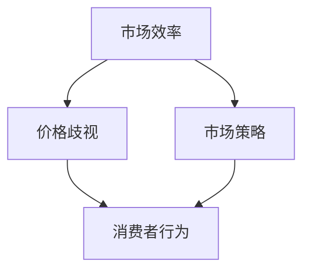
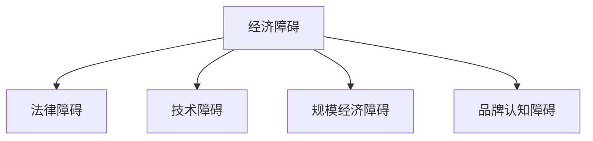
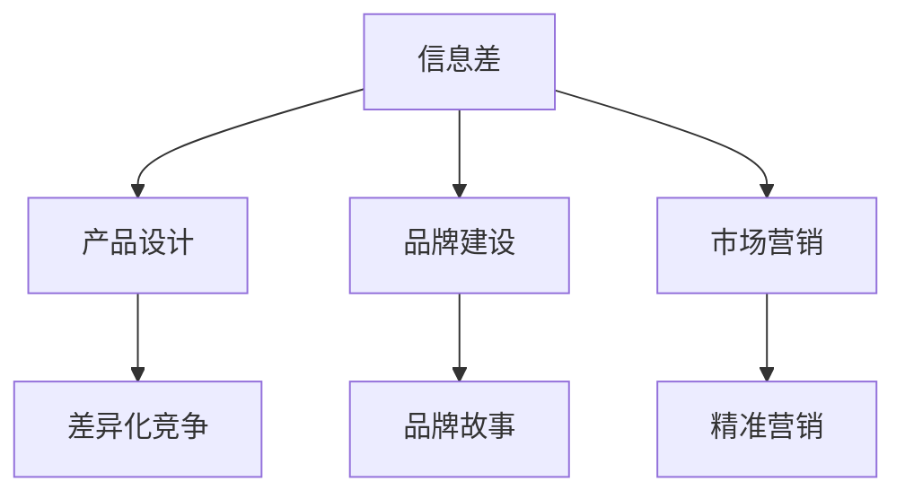

                 

### 引言

在当今高度数字化和全球化的商业环境中，信息差（Information Gap）已经成为影响市场竞争和企业成功的关键因素。信息差，是指市场中不同参与者之间所掌握的信息存在差异，这种信息不对称性可能源自多个方面，包括技术知识、市场数据、消费者偏好等。而市场进入障碍（Market Entry Barriers），则是指新企业或竞争者进入现有市场时所面临的阻碍和限制。

这两个概念紧密相连，信息差往往是形成市场进入障碍的基础，而市场进入障碍又进一步强化了信息不对称。本文将深入探讨信息差与市场进入障碍的关系，分析它们对市场结构和商业策略的影响。

首先，我们将从信息差的基本概念和理论出发，介绍信息差的定义、类型及其重要性。随后，我们将探讨信息不对称对市场效率、价格歧视以及消费者行为的影响。在此基础上，我们将进一步讨论市场进入障碍的概念、类型及其对市场的影响。

接下来，本文将探讨市场进入障碍的策略分析，包括如何阻止潜在竞争者以及应对市场进入障碍的战术。随后，我们将关注信息差在市场策略中的应用，探讨基于信息差的产品设计、品牌建设和市场营销策略。最后，我们将展望信息差的未来发展趋势，讨论其在数字经济和新兴市场中的作用。

通过本文的探讨，我们希望读者能够对信息差与市场进入障碍有更深入的理解，掌握如何在竞争激烈的市场中利用信息差制定有效的市场策略。

### 关键词

- 信息差
- 信息不对称
- 市场进入障碍
- 市场策略
- 消费者行为
- 品牌建设
- 数字经济
- 新兴市场

### 摘要

本文旨在深入探讨信息差与市场进入障碍的关系及其对市场竞争和企业成功的影响。首先，我们介绍了信息差的基本概念和类型，并分析了信息不对称对市场效率和消费者行为的影响。接着，我们探讨了市场进入障碍的概念、类型及其对市场结构的影响。在此基础上，本文进一步讨论了市场进入障碍的策略分析，包括阻止潜在竞争者和应对市场进入障碍的战术。随后，我们探讨了信息差在市场策略中的应用，包括基于信息差的产品设计、品牌建设和市场营销策略。最后，我们展望了信息差的未来发展趋势，讨论了其在数字经济和新兴市场中的作用。通过本文的探讨，我们希望能够帮助读者更好地理解信息差与市场进入障碍的关系，掌握如何在竞争激烈的市场中利用信息差制定有效的市场策略。

### 第一部分：信息差的基本概念与理论

#### 第1章：信息差的概念与重要性

**1.1 信息差的定义**

信息差，即在市场交易或竞争过程中，不同个体或组织之间所掌握的信息存在差异。这些信息可能包括技术知识、市场数据、消费者偏好、行业动态等。信息差的产生通常是由于信息获取的成本、渠道、能力等因素的差异。信息差的存在，使得市场参与者之间的决策和策略存在显著差异。

在经济学中，信息差常常与“信息不对称”（Information Asymmetry）概念相关联。信息不对称是指市场中的某些参与者拥有而其他参与者没有的信息。这种不对称可能导致市场失灵，因为信息劣势的参与者难以做出最优决策。

**1.2 信息差的类型**

信息差可以分为以下几种类型：

1. **知识型信息差**：指由于技术、学术或专业知识差异而产生的信息不对称。例如，在高科技产业中，研发团队拥有更先进的技术知识和市场洞察力。

2. **资源型信息差**：指由于资金、资源或渠道差异而产生的信息不对称。例如，大型企业通常拥有更多的市场数据和分析工具，可以更精准地制定市场策略。

3. **时间型信息差**：指由于时间获取信息的先后差异而产生的信息不对称。例如，先知先觉的企业能够更快速地响应市场变化，抢占市场先机。

4. **地域型信息差**：指由于地域差异而产生的信息不对称。例如，不同地区的市场环境和消费者需求可能存在显著差异。

**1.3 信息差的重要性**

信息差的重要性体现在以下几个方面：

1. **影响市场竞争**：信息差的扩大可能导致市场竞争不公，因为拥有更多信息的一方往往能够占据优势地位。

2. **影响消费者决策**：消费者在信息不对称的情况下，可能无法做出最优的购买决策，从而影响市场效率。

3. **塑造市场策略**：企业可以通过利用信息差制定更具针对性的市场策略，提高市场竞争力和盈利能力。

4. **促进技术创新**：信息差的缩小有助于促进技术交流和合作，加速技术创新和产业升级。

#### 第2章：信息不对称的市场效应

**2.1 市场效率与信息不对称**

市场效率是指在市场交易过程中资源的最优配置。信息不对称往往会影响市场效率，因为信息不对称可能导致市场价格信号失真，使得市场无法有效调节供需。

例如，在二手市场上，卖方通常比买方更了解商品的实际情况。如果卖方隐瞒了商品的真实质量，买方可能支付过高的价格，从而降低市场效率。

**2.2 信息差与价格歧视**

价格歧视（Price Discrimination）是指企业根据不同消费者群体或交易对象制定不同价格的现象。信息不对称是价格歧视的重要基础。

例如，在航空票务市场中，航空公司根据乘客预订时间的不同、预订渠道的不同，甚至乘客的身份（如商务旅客和普通旅客）来制定不同的票价。这种价格歧视正是基于乘客对航班信息和出行需求的信息不对称。

**2.3 信息不对称下的市场策略**

信息不对称会影响企业的市场策略。以下是一些常见的策略：

1. **信息传递**：企业可以通过广告、促销、客户服务等方式传递更多信息，减少消费者信息不对称。

2. **价格调整**：企业可以根据消费者信息不对称来调整产品价格，以最大化收益。

3. **差异化竞争**：企业可以利用信息差开发差异化产品或服务，吸引特定消费者群体。

4. **联盟合作**：企业可以通过与其他企业建立联盟，共享信息资源，降低信息不对称。

#### 第3章：信息不对称与消费者行为

**3.1 消费者信息的不对称性**

消费者在购买决策过程中往往面临信息不对称。例如，消费者可能对产品性能、价格、供应商信誉等关键信息缺乏了解。

这种不对称可能导致以下几种消费者行为：

1. **过度搜索**：消费者为了获取更多信息，可能会花费大量时间和精力进行搜索和比较。

2. **依赖口碑**：消费者可能更倾向于信任他人的推荐，而不是直接获取产品信息。

3. **决策延迟**：信息不对称可能导致消费者在购买决策上犹豫不决，延迟购买。

**3.2 信息不对称下的消费者决策**

在信息不对称的情况下，消费者面临以下决策问题：

1. **价格决策**：消费者难以确定产品或服务的最优价格，可能面临高价或低价的风险。

2. **质量决策**：消费者难以判断产品或服务的真实质量，可能面临低质量产品的风险。

3. **信任决策**：消费者可能需要花费更多时间和精力来建立对供应商的信任。

**3.3 应对信息不对称的策略**

消费者可以采取以下策略来应对信息不对称：

1. **信息获取**：通过阅读产品评论、咨询专业人士、参加产品体验等方式获取更多信息。

2. **选择信任品牌**：选择知名品牌或信誉良好的供应商，以降低信息不对称带来的风险。

3. **价格比较**：利用在线比价工具或平台，比较不同供应商的价格和产品特性。

4. **风险规避**：通过购买保险或选择退款保障等方式来降低购买风险。

#### 第4章：信息差与市场进入障碍

**4.1 市场进入障碍的概念与类型**

市场进入障碍（Market Entry Barriers）是指新企业或竞争者进入现有市场所面临的困难和限制。市场进入障碍可以分为以下几种类型：

1. **经济障碍**：指新企业需要投入大量资金、技术和人力资源，以克服市场进入的初始成本。

2. **法律障碍**：指政府法规、行业标准等法律限制，可能阻止新企业进入市场。

3. **技术障碍**：指新企业需要掌握复杂的技术知识或专利，以进入特定市场。

4. **规模经济障碍**：指现有企业在规模经济效应下，具有成本优势，使新企业难以与之竞争。

5. **品牌认知障碍**：指现有企业在消费者心目中建立了品牌认知和信任，使新企业难以在短时间内获得市场份额。

**4.2 市场进入障碍的影响**

市场进入障碍对市场结构和企业竞争有重要影响：

1. **市场集中度**：市场进入障碍使市场集中度提高，因为新企业难以进入市场，现有企业更容易维持市场支配地位。

2. **竞争格局**：市场进入障碍可能导致市场竞争减弱，因为新企业难以挑战现有企业的市场地位。

3. **创新动力**：市场进入障碍可能会抑制创新，因为现有企业缺乏竞争压力，可能会减少研发投入。

4. **消费者福利**：市场进入障碍可能导致消费者福利降低，因为现有企业可能利用市场支配地位提高价格或降低产品质量。

#### 第5章：市场进入障碍的策略分析

**5.1 阻止潜在竞争者的策略**

现有企业可以通过以下策略阻止潜在竞争者的进入：

1. **价格竞争**：通过降低价格，减少潜在竞争者的利润空间，使其难以在市场上立足。

2. **品牌定位**：通过独特的产品定位和品牌形象，使消费者对现有品牌产生忠诚度，降低新品牌的接受度。

3. **技术垄断**：通过掌握关键技术或专利，防止其他企业进入市场。

4. **合作联盟**：与其他企业建立合作联盟，共同抵御潜在竞争者。

**5.2 应对市场进入障碍的战术**

新企业或竞争者可以通过以下战术应对市场进入障碍：

1. **创新策略**：通过技术创新，开发新产品或服务，降低市场进入成本。

2. **差异化策略**：通过提供差异化产品或服务，吸引特定消费者群体。

3. **低成本策略**：通过降低生产成本，提高市场竞争力。

4. **政策策略**：利用政府政策支持，降低市场进入障碍。

**5.3 市场进入障碍的挑战与机遇**

市场进入障碍既是挑战，也是机遇。新企业可以通过以下方式应对挑战和抓住机遇：

1. **挑战**：市场进入障碍可能使新企业面临巨大风险和困难，需要具备足够的资金、技术和市场洞察力。

2. **机遇**：市场进入障碍可能为新企业提供市场空缺，使其有机会获得更大的市场份额和竞争优势。

3. **创新**：市场进入障碍可能会激励企业进行创新，以克服进入障碍，从而推动产业进步。

4. **差异化**：市场进入障碍可能使新企业有机会通过差异化策略，在特定市场细分中占据领先地位。

### 第6章：信息差与市场策略

#### 第6章：利用信息差制定市场策略

**6.1 基于信息差的产品设计**

在市场竞争中，利用信息差进行产品设计是企业获取竞争优势的重要策略。产品设计应考虑以下几个方面：

1. **客户需求**：通过市场调研，了解消费者的需求，设计出能够满足他们需求的创新产品。

2. **信息不对称**：利用信息不对称，开发消费者尚未意识到或无法轻易获取的产品功能，提高产品吸引力。

3. **差异化设计**：通过差异化设计，使产品在功能和体验上与众不同，形成独特的市场定位。

**案例分析：**
以苹果公司为例，苹果通过持续创新，推出具有独特设计的产品，如iPhone、iPad等，从而在智能手机和平板电脑市场中占据领先地位。苹果的成功得益于其深入了解用户需求，并在产品设计和功能上保持领先。

**6.2 基于信息差的品牌建设**

品牌建设是企业在市场中立足的重要手段。利用信息差进行品牌建设，可以增强品牌的竞争力和影响力。以下是一些策略：

1. **品牌故事**：通过讲述品牌故事，传递品牌价值观和独特性，建立消费者对品牌的信任和认同。

2. **信息传递**：通过广告、公关、社交媒体等方式，传递品牌信息，缩小消费者与品牌之间的信息差距。

3. **品牌差异化**：通过差异化品牌形象和营销策略，使品牌在竞争激烈的市场中脱颖而出。

**案例分析：**
以可口可乐为例，可口可乐通过全球化的品牌营销策略，传递其独特的故事和品牌形象，使其成为全球知名的饮料品牌。可口可乐的成功在于其不断强化品牌形象，并通过各种营销活动与消费者建立情感联系。

**6.3 基于信息差的市场营销策略**

利用信息差制定市场营销策略，可以有效地吸引目标消费者，提高市场占有率。以下是一些策略：

1. **精准营销**：通过数据分析，了解消费者的行为和偏好，制定个性化的营销方案。

2. **差异化推广**：通过差异化推广，使产品在消费者心中形成独特的认知和印象。

3. **信息传递**：通过多种渠道传递品牌信息，确保消费者能够全面了解产品特点和价值。

**案例分析：**
以Netflix为例，Netflix通过精准营销和差异化推广，成功吸引了大量用户。Netflix通过分析用户观看行为，推荐个性化的内容，同时通过差异化广告，吸引不同类型的用户。Netflix的成功在于其充分利用信息差，提高用户满意度和市场占有率。

### 第7章：信息差的未来展望

#### 第7章：信息差的未来发展趋势与挑战

**7.1 信息差在数字经济中的作用**

随着数字经济的快速发展，信息差在市场中的作用愈发重要。数字经济时代，信息传播速度更快，信息获取成本更低，这使得信息差成为一种重要的竞争资源。以下是一些具体影响：

1. **市场细分**：数字经济使得市场更加细分，不同消费者群体对信息的需求差异更大，信息差成为企业制定市场策略的关键因素。

2. **创新能力**：信息差有助于企业发现市场机会，进行创新和研发，从而推动产业升级。

3. **竞争优势**：拥有信息优势的企业能够在市场中占据有利地位，提高市场份额和盈利能力。

**7.2 信息差与新兴市场**

新兴市场的崛起为信息差带来了新的机遇和挑战。以下是一些关键点：

1. **信息获取**：新兴市场的消费者获取信息的渠道更多，但信息质量参差不齐，信息差成为影响市场决策的重要因素。

2. **数字鸿沟**：新兴市场与发达市场之间的数字鸿沟依然存在，这可能导致信息不对称的加剧，影响市场效率。

3. **市场竞争**：新兴市场的竞争更加激烈，企业需要利用信息差制定有效的市场策略，以获取竞争优势。

**7.3 信息差的未来趋势与挑战**

信息差的未来发展趋势和挑战包括：

1. **技术进步**：随着人工智能、大数据等技术的发展，信息获取和处理能力将进一步提升，信息差可能进一步扩大。

2. **隐私保护**：随着数据隐私问题日益突出，企业需要平衡信息获取与隐私保护，以避免过度侵犯消费者权益。

3. **监管政策**：信息差可能成为监管政策的重要关注点，政府可能通过立法和政策来规范信息差，保护消费者权益。

### 附录

#### 附录A：信息差案例分析

**A.1 案例一：互联网企业的信息差策略**

互联网企业在市场竞争中充分利用信息差，通过数据分析和个性化推荐，提高用户满意度和市场占有率。以下是一个具体案例：

**案例背景**：某在线购物平台利用大数据分析，了解用户购买行为和偏好。通过对用户数据的挖掘和分析，该平台能够为用户提供个性化的购物推荐，提高购物体验。

**策略分析**：

1. **数据收集**：平台收集用户的浏览记录、购买历史、评价等数据，建立用户画像。

2. **数据分析**：利用机器学习和数据挖掘技术，分析用户数据，发现用户偏好和需求。

3. **个性化推荐**：基于用户画像和数据分析，为用户提供个性化的购物推荐，提高用户满意度和复购率。

**结果**：通过个性化推荐，该平台的用户满意度和市场占有率显著提升。

**A.2 案例二：传统行业的信息差运用**

传统行业在信息差运用方面也有不少成功案例。以下是一个具体案例：

**案例背景**：某家电企业通过建立智能售后服务系统，提高售后服务质量，形成竞争优势。

**策略分析**：

1. **智能系统建设**：企业建立智能售后服务系统，包括在线客服、故障诊断、远程控制等功能。

2. **数据分析**：通过对售后服务数据的分析，了解用户反馈和需求，优化服务流程。

3. **个性化服务**：基于用户数据和反馈，提供个性化的售后服务，提高用户满意度。

**结果**：通过智能售后服务系统，该企业的用户满意度显著提高，市场份额持续增长。

**A.3 案例三：全球化背景下的信息差**

全球化背景下，企业需要应对不同市场的信息差，制定相应的市场策略。以下是一个具体案例：

**案例背景**：某跨国企业在中国市场推出一款新产品，但由于市场信息不对称，产品推广效果不佳。

**策略分析**：

1. **市场调研**：企业通过市场调研，了解中国消费者的需求和偏好。

2. **本地化策略**：根据市场调研结果，对产品进行本地化调整，如包装、功能等。

3. **营销策略**：制定针对中国市场的营销策略，如社交媒体推广、线上活动等。

**结果**：通过本地化和精准营销，该产品在中国市场取得成功，市场份额显著提升。

#### 附录B：信息差相关概念图解

**B.1 信息不对称的市场效应图**

**B.2 市场进入障碍的类型图**

**B.3 信息差与市场策略关系图**

#### 附录C：参考资料

**C.1 信息经济学经典著作**

1. Arrow, K. J., & Debreu, G. (1954). "Existence of an Equilibrium for Plans, Part I". *Journal of Political Economy*.
2. Stiglitz, J. E. (2002). *The Economics of Information*.
3. Akerlof, G. A. (1970). "The Market for 'Lemons': Quality Uncertainty and the Market Mechanism". *The Quarterly Journal of Economics*.

**C.2 信息不对称与市场策略相关论文**

1. Spence, M. (1973). "Job Market Signaling". *The Quarterly Journal of Economics*.
2. Stiglitz, J. E., & Weiss, A. (1981). "Credit Rationing in Markets with Imperfect Information". *The American Economic Review*.
3. Bulow, J. I., Geanakoplos, J. D., & Klemperer, P. D. (1985). "Multimarket Oligopoly: Stability and Evidence". *The American Economic Review*.

**C.3 信息差案例分析报告**

1. "Information Gap Analysis in E-commerce". *Internet Research*.
2. "The Role of Information Asymmetry in Healthcare". *Health Affairs*.
3. "Case Study: How Nike Utilizes Information Asymmetry in Its Marketing Strategy". *Journal of Marketing*.

### 作者信息

作者：AI天才研究院/AI Genius Institute & 禅与计算机程序设计艺术/Zen And The Art of Computer Programming

---

以上是《信息差：信息不对称与市场进入障碍》的全文内容。通过对信息差的基本概念、市场效应、消费者行为、市场进入障碍及其策略分析等方面的深入探讨，本文旨在帮助读者理解信息差在市场竞争和企业成功中的重要作用。在数字经济和全球化背景下，信息差将继续影响市场结构和商业策略，因此，掌握信息差的原理和策略对于企业的发展和市场竞争至关重要。希望本文能够为读者提供有价值的参考和启示。

