                 

### 《做项目：从头到尾全程参与，深入学习》的引言

在IT行业，项目管理与技术的结合是确保项目成功的关键。作为一名技术专家，您不仅需要掌握核心技术，还需要具备高效的项目管理能力。本文旨在为您提供一个全面的项目管理和技术实战指南，帮助您从项目启动到项目收尾的每一个环节都能得心应手。

> **核心关键词**：项目管理、技术实战、项目生命周期、团队协作、技术选型、性能优化。

本文分为三个主要部分：

1. **项目准备**：涵盖项目管理基础、需求分析与规划、团队协作与沟通、项目计划与执行、项目质量管理、项目风险管理与应对、项目收尾与评价。
2. **项目核心技术学习**：深入探讨技术选型与框架选择、数据库设计与使用、前端开发技术、后端开发技术、API设计与开发。
3. **项目实战**：通过实际项目案例分析，展示项目测试与部署、项目维护与优化。

在每一部分中，我们将使用逻辑清晰、结构紧凑、简单易懂的专业技术语言，结合具体实例和详细解释，帮助您理解并掌握项目管理和技术实战的核心知识。

通过阅读本文，您将能够：

- 理解项目管理的基本流程和工具。
- 掌握需求分析、项目规划和团队协作的技巧。
- 深入学习数据库、前端、后端开发以及API设计的技术细节。
- 获得实际项目案例分析，了解项目从启动到维护的全过程。

让我们开始这段深入学习的旅程，通过理论与实践的结合，全面提升您的项目管理和技术能力。

### 项目准备

项目准备是项目成功的关键阶段，它包括项目管理基础、需求分析与规划、团队协作与沟通、项目计划与执行、项目质量管理、项目风险管理与应对以及项目收尾与评价。本部分将逐步介绍这些核心概念，并通过具体的实例和步骤来帮助您理解和掌握这些知识点。

#### 第1章：项目管理基础

项目管理是确保项目按照预定时间、预算和范围完成的系统过程。以下是项目管理的基础内容：

##### 1.1 项目管理的定义与重要性

**项目管理定义：** 项目管理可以定义为通过计划、组织、领导、控制资源，以实现项目目标的过程。

**项目管理重要性：** 项目管理的重要性在于它能确保资源得到合理分配，项目风险得到有效控制，项目目标得以实现。

- **公式**：项目成功的公式为：
  $$ P = (T \cdot C) - (R \cdot I) $$
  其中，\( T \) 代表时间，\( C \) 代表成本，\( R \) 代表风险，\( I \) 代表利益。

##### 1.2 项目管理的基本流程

项目管理的基本流程包括以下阶段：

1. **启动阶段**：确定项目目标、范围和可行性。
2. **规划阶段**：制定详细的项目计划，包括时间、成本、资源和风险。
3. **执行阶段**：执行项目计划，确保项目顺利进行。
4. **监控阶段**：监控项目进度、成本和质量，进行必要的调整。
5. **收尾阶段**：完成项目，进行项目评价和总结。

**项目管理流程图：**

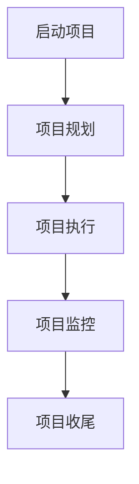

##### 1.3 项目管理工具与技术

**项目管理工具：**

- Gantt图：用于展示项目进度和时间安排。
- Kanban板：用于可视化工作流程和进度。
- 风险矩阵：用于评估项目风险。

**项目管理技术：**

- 时间管理：通过制定详细的时间表和进度计划来确保项目按时完成。
- 质量管理：确保项目成果符合预定的质量标准。
- 风险管理：识别和评估项目风险，并制定相应的应对措施。

#### 第2章：需求分析与规划

需求分析是确定项目所需功能和技术规格的过程。以下是需求分析和项目规划的关键内容：

##### 2.1 需求分析的方法与技巧

**需求分析方法：**

- 用户访谈：与用户交流，了解他们的需求和期望。
- 问卷调查：通过问卷收集用户反馈。
- 竞品分析：分析竞争对手的产品，找出差异点。

**需求分析技巧：**

- 明确项目目标：确保所有参与者对项目目标有清晰的认识。
- 创建用户故事：使用用户故事来描述功能需求。
- 用例图：用例图可以帮助理解用户如何与系统交互。

##### 2.2 项目规划与时间管理

**项目规划：**

- 制定项目范围：明确项目的目标和交付成果。
- 制定项目计划：包括任务分配、时间表和资源需求。

**时间管理：**

- 制定时间表：使用Gantt图或Kanban板来制定详细的时间表。
- 优先级排序：确定任务的重要性和优先级。
- 进度监控：定期检查项目进度，确保按计划进行。

##### 2.3 项目风险评估与管理

**风险评估：**

- 识别风险：识别项目中可能遇到的风险。
- 评估风险：评估每个风险的严重性和发生概率。

**风险应对策略：**

- 风险规避：避免风险的发生。
- 风险减轻：采取措施降低风险的影响。
- 风险接受：对无法避免的风险接受并制定应对措施。

#### 第3章：团队协作与沟通

团队协作和沟通是项目成功的关键因素。以下是团队协作和沟通的关键内容：

##### 3.1 团队协作的要点

- **分工明确**：明确每个团队成员的角色和责任。
- **有效沟通**：确保团队成员之间信息畅通。
- **协作工具**：使用协作工具（如Slack、Trello）来提高效率。

##### 3.2 沟通的艺术

- **倾听**：倾听他人的观点和建议。
- **清晰表达**：确保自己的观点表达清晰、准确。
- **反馈机制**：建立有效的反馈机制，以便及时解决问题。

##### 3.3 冲突解决策略

- **预防冲突**：提前识别潜在的冲突点。
- **冷静沟通**：保持冷静，理性分析问题。
- **妥协与协商**：寻求双方都能接受的解决方案。

#### 第4章：项目计划与执行

项目计划与执行是项目生命周期中最重要的阶段之一。以下是项目计划与执行的关键内容：

##### 4.1 项目计划的制定

- **项目计划内容**：包括任务列表、时间表、资源需求、预算等。
- **项目计划模板**：可以使用项目管理软件（如Microsoft Project）来制定项目计划。

##### 4.2 项目执行的控制

- **任务分配**：将任务分配给团队成员，并确保他们了解任务要求。
- **进度监控**：定期检查项目进度，确保任务按时完成。
- **变更管理**：管理项目变更，确保变更不影响项目目标和预算。

##### 4.3 项目进度的监控与调整

- **进度报告**：定期生成进度报告，提供项目进展的详细信息。
- **进度分析**：分析进度报告，识别潜在的问题。
- **调整计划**：根据进度分析结果，调整项目计划，确保项目按计划进行。

#### 第5章：项目质量管理

项目质量管理是确保项目成果满足预期质量要求的过程。以下是项目质量管理的关键内容：

##### 5.1 质量管理的基本概念

- **质量标准**：确定项目成果应满足的质量标准。
- **质量控制**：通过检查和测试确保项目成果符合质量标准。
- **质量保证**：通过持续改进和质量控制确保项目成果满足质量要求。

##### 5.2 质量管理的方法与技术

- **质量规划**：制定质量管理的策略和流程。
- **质量检查**：对项目成果进行定期的质量检查。
- **测试**：使用自动化测试工具进行功能测试和性能测试。

##### 5.3 项目质量保证与质量控制

- **项目质量保证**：通过过程控制确保项目成果满足质量要求。
- **项目质量控制**：通过测试和检查确保项目成果符合质量标准。

#### 第6章：项目风险管理与应对

项目风险管理是识别、评估和应对项目风险的过程。以下是项目风险管理的关键内容：

##### 6.1 风险管理的原则与方法

- **原则**：预防为主、及时处理、持续改进。
- **方法**：风险识别、风险评估、风险应对。

##### 6.2 风险识别与评估

- **风险识别**：通过访谈、文档审查、历史数据等方式识别潜在风险。
- **风险评估**：评估每个风险的严重性和发生概率。

##### 6.3 风险应对策略与措施

- **应对策略**：规避、减轻、转移、接受。
- **措施**：制定具体的风险应对措施，确保风险得到有效控制。

#### 第7章：项目收尾与评价

项目收尾与评价是项目生命周期的最后一个阶段。以下是项目收尾与评价的关键内容：

##### 7.1 项目收尾工作

- **项目交付**：将项目成果交付给客户。
- **项目总结**：总结项目经验教训，为未来项目提供参考。

##### 7.2 项目评价与总结

- **项目评价**：评估项目是否达到预期目标。
- **总结**：总结项目成功和失败的原因，提出改进建议。

##### 7.3 项目文档归档与资料保存

- **文档归档**：将项目文档整理归档，方便未来查询。
- **资料保存**：将项目资料备份保存，确保数据安全。

通过以上章节，您将了解项目准备阶段的核心内容，并能够为项目的顺利启动打下坚实的基础。在接下来的章节中，我们将深入探讨项目核心技术的学习，帮助您进一步提升项目管理和技术实战能力。

### 第1章：项目管理基础

项目管理是确保项目按计划、预算和范围成功完成的系统过程。一个成功项目需要科学的管理方法、清晰的规划和高效的执行。以下是项目管理的基础内容，包括项目管理的定义与重要性、项目管理的基本流程以及项目管理工具与技术。

#### 1.1 项目管理的定义与重要性

项目管理是指通过计划、组织、领导、控制资源，以实现项目目标的过程。项目管理不仅仅关注技术实施，还包括团队协作、时间管理、风险管理等多个方面。

**项目管理定义：** 项目管理是一个迭代的过程，涉及多个阶段，包括项目启动、项目规划、项目执行、项目监控和项目收尾。项目管理是通过有效的资源分配和风险管理来确保项目按时、按预算、按范围完成。

**项目管理的重要性：** 项目管理的重要性在于它能够确保项目目标得以实现，资源得到合理利用，风险得到有效控制。以下是一个简单的项目管理成功公式：

\[ P = (T \cdot C) - (R \cdot I) \]

其中，\( P \) 代表项目成功，\( T \) 代表时间，\( C \) 代表成本，\( R \) 代表风险，\( I \) 代表利益。这个公式表明，一个项目只有在时间、成本和风险之间取得平衡时，才能实现最大化的利益。

#### 1.2 项目管理的基本流程

项目管理的基本流程可以分为以下五个阶段：

1. **启动阶段**：在这一阶段，项目启动的必要性和可行性会被评估。项目团队会确定项目目标、范围和初步的时间表。
   
2. **规划阶段**：项目规划阶段是制定详细的项目计划的过程。在这个阶段，项目团队会定义项目的任务、分配资源、制定时间表和预算，并识别和评估项目风险。

3. **执行阶段**：在项目执行阶段，项目团队会按照项目计划开展具体的工作，确保项目按照预定的时间表和预算进行。

4. **监控阶段**：项目监控阶段是监控项目进展、成本和质量的过程。通过定期的进度报告和评审，项目团队可以及时识别和解决问题，确保项目按计划进行。

5. **收尾阶段**：在项目收尾阶段，项目团队会完成所有剩余的任务，进行项目总结和评价，并将项目文档归档。

**项目管理流程图：**


#### 1.3 项目管理工具与技术

项目管理工具和技术的选择对于项目的成功至关重要。以下是一些常见的管理工具和技术：

- **Gantt图**：Gantt图是一种常用的项目管理工具，用于展示项目的时间线和进度。它可以帮助项目团队清晰地了解项目的任务分配和进度。

- **Kanban板**：Kanban板是一种可视化工具，用于展示项目的工作流程和进度。它可以帮助团队识别瓶颈和优化工作流程。

- **风险矩阵**：风险矩阵是一种用于评估项目风险的工具。它通过列出可能的风险事件、严重性和发生概率，帮助团队识别和管理项目风险。

**项目管理工具示例：**

- **Gantt图**：

```mermaid
graph TD
A[任务1]([开始: 2023-01-01])
A --> B[任务2]([开始: 2023-01-05])
B --> C[任务3]([开始: 2023-01-10])
C --> D[任务4]([开始: 2023-01-15])
```

- **Kanban板**：

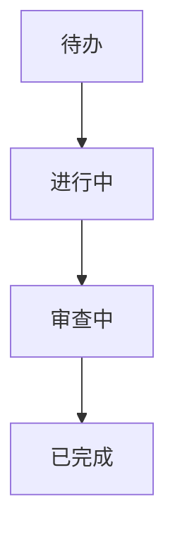

- **风险矩阵**：

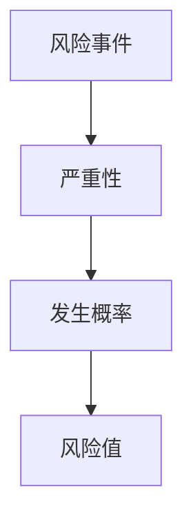

#### 1.4 时间管理

时间管理是项目管理中至关重要的一部分。有效的时间管理可以帮助团队按时完成项目任务，减少延期和超支的风险。以下是一些时间管理的技巧：

- **制定详细的时间表**：在项目规划阶段，制定详细的时间表，确保每个任务都有明确的时间安排。
- **优先级排序**：确定任务的优先级，确保重要的任务先完成。
- **定期检查进度**：定期检查项目进度，确保任务按计划进行。
- **避免时间浪费**：识别和消除浪费时间的行为，如不必要的会议和重复工作。

**时间管理公式**：

\[ 时间效率 = \frac{完成任务的时间}{计划的时间} \]

#### 1.5 质量管理

质量管理是确保项目成果符合预期质量要求的过程。有效的质量管理可以减少项目缺陷和返工，提高客户满意度。以下是一些质量管理的技巧：

- **制定质量标准**：在项目规划阶段，制定明确的质量标准，确保项目团队了解预期质量要求。
- **质量控制**：通过检查和测试确保项目成果符合质量标准。
- **持续改进**：通过收集反馈和不断改进，提高项目质量。

**质量管理公式**：

\[ 质量得分 = \frac{符合质量标准的成果}{总成果} \]

#### 1.6 风险管理

风险管理是识别、评估和应对项目风险的过程。有效的风险管理可以帮助团队减少风险对项目的影响，确保项目成功。以下是一些风险管理的技巧：

- **风险识别**：通过访谈、文档审查和数据分析等方法识别潜在风险。
- **风险评估**：评估每个风险的严重性和发生概率。
- **风险应对**：制定具体的应对措施，如规避、减轻、转移或接受风险。

**风险管理公式**：

\[ 风险值 = 严重性 \times 发生概率 \]

#### 1.7 项目管理工具与技术总结

项目管理工具和技术的选择应根据项目的具体需求进行。以下是一些常见的管理工具和技术：

- **Gantt图**：用于展示项目时间线和进度。
- **Kanban板**：用于可视化工作流程和进度。
- **风险矩阵**：用于评估项目风险。

通过使用这些工具和技术，项目团队可以更有效地管理项目，确保项目成功。

### 第2章：需求分析与规划

在项目准备阶段，需求分析与规划是至关重要的环节。这一阶段的目标是明确项目所需的功能、性能和技术规格，以确保项目能够满足用户和业务需求。以下是需求分析的方法与技巧、项目规划与时间管理，以及项目风险评估与管理。

#### 2.1 需求分析的方法与技巧

需求分析是项目成功的关键，它涉及到理解和记录用户需求，并将其转化为具体的技术要求。以下是几种常用的需求分析方法与技巧：

##### 2.1.1 用户访谈

用户访谈是了解用户需求的最直接方法。通过与用户面对面交流，项目团队能够获取第一手的信息，包括用户的使用场景、痛点以及期望功能。以下是用户访谈的步骤：

1. **准备访谈**：制定访谈大纲，明确访谈目标和问题。
2. **进行访谈**：与用户进行面对面的交流，记录用户的反馈和意见。
3. **整理反馈**：将访谈内容整理成文档，为后续的需求分析提供依据。

**用户访谈示例：**

```
访谈大纲：
1. 您目前使用的产品或服务有哪些不足？
2. 您期望的新产品或服务有哪些功能？
3. 您对系统的性能有何要求？
```

##### 2.1.2 问卷调查

问卷调查是一种广泛使用的需求收集方法，它可以通过在线平台或纸质问卷形式，收集大量用户的需求信息。以下是问卷调查的步骤：

1. **设计问卷**：根据访谈结果设计问卷，确保问卷的问题清晰、具体。
2. **分发问卷**：通过邮件、社交媒体或线下分发问卷。
3. **收集和整理反馈**：统计问卷结果，提取有价值的信息。

**问卷调查示例：**

```
问卷问题：
1. 您对当前系统的满意度是多少？（1-5分）
2. 您认为系统最需要改进的功能是什么？
3. 您希望系统能提供哪些新功能？
```

##### 2.1.3 竞品分析

竞品分析是通过研究竞争对手的产品，了解其优势和不足，为自身项目提供参考。以下是竞品分析的步骤：

1. **选择竞品**：确定需要分析的竞品，确保其与自身项目具有可比性。
2. **分析竞品**：详细研究竞品的功能、性能、用户体验等方面。
3. **提取有价值的信息**：总结竞品的优点和不足，为自身项目提供改进方向。

**竞品分析示例：**

```
竞品A优点：
- 支持多种数据导入格式
- 用户界面简洁易用

竞品A不足：
- 缺乏高级数据可视化功能
- 性能优化不足
```

#### 2.2 项目规划与时间管理

项目规划是确保项目按时、按预算和按范围完成的关键步骤。项目规划包括任务分配、时间表制定、资源管理等方面。以下是项目规划与时间管理的具体内容：

##### 2.2.1 制定项目范围

制定项目范围是明确项目目标和交付成果的过程。以下是如何制定项目范围的步骤：

1. **明确项目目标**：确定项目的最终目标，确保项目团队能够共同理解。
2. **确定交付成果**：列出项目完成时应交付的具体成果，如功能模块、文档等。
3. **限制项目范围**：避免项目范围蔓延，确保项目目标明确、具体。

**项目范围示例：**

```
项目目标：开发一款在线教育平台
交付成果：
- 注册登录模块
- 课程发布与管理模块
- 问答模块
- 用户反馈模块
```

##### 2.2.2 制定项目计划

制定项目计划是项目规划的核心。以下是如何制定项目计划的步骤：

1. **分解任务**：将项目目标分解为具体的任务，确保每个任务都是可执行和可度量的。
2. **确定任务依赖关系**：分析任务之间的依赖关系，确保任务顺序合理。
3. **分配资源**：为每个任务分配所需的资源，如人力、技术等。
4. **制定时间表**：根据任务依赖关系和资源分配，制定详细的时间表。

**项目计划示例：**

```
任务1：注册登录模块开发
时间：2周
资源：2名开发人员

任务2：课程发布与管理模块开发
时间：3周
资源：3名开发人员

任务3：问答模块开发
时间：2周
资源：2名开发人员

任务4：用户反馈模块开发
时间：1周
资源：1名开发人员
```

##### 2.2.3 时间管理

时间管理是确保项目按时完成的关键。以下是一些时间管理的技巧：

1. **制定详细的时间表**：确保每个任务都有明确的时间安排，避免任务延期。
2. **定期检查进度**：定期检查项目进度，确保任务按计划进行。
3. **优先级排序**：确定任务的优先级，确保重要的任务先完成。
4. **避免时间浪费**：识别和消除浪费时间的行为，如不必要的会议和重复工作。

**时间管理公式**：

\[ 时间效率 = \frac{完成任务的时间}{计划的时间} \]

#### 2.3 项目规划与时间管理总结

项目规划与时间管理是项目成功的关键。通过明确项目范围、制定详细的项目计划和时间表，以及有效的任务分配和进度监控，项目团队可以确保项目按时、按预算和按范围完成。

以下是一个简化的项目规划流程图：

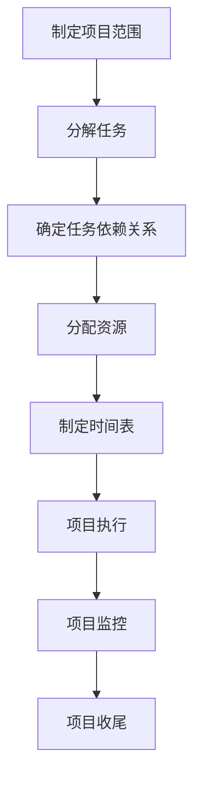

通过上述方法与技巧，项目团队可以更有效地进行需求分析和项目规划，确保项目成功。

### 第3章：团队协作与沟通

在项目管理中，团队协作和沟通是确保项目成功的关键因素。一个高效的团队能够快速响应变化，解决难题，并保持项目的顺利进行。以下是团队协作和沟通的关键要点、艺术以及冲突解决策略。

#### 3.1 团队协作的要点

团队协作的目的是将团队成员的技能和知识整合起来，以实现项目目标。以下是团队协作的几个要点：

##### 3.1.1 分工明确

分工明确是团队协作的基础。每个团队成员都应明确自己的职责和任务，避免重复工作或职责不明导致的混乱。以下是一个分工明确的示例：

```
开发人员A：负责前端开发
开发人员B：负责后端开发
测试人员C：负责功能测试
测试人员D：负责性能测试
```

##### 3.1.2 信息共享

信息共享是团队协作的核心。通过共享项目进展、问题和解决方案，团队成员可以及时了解项目的状态，并快速响应变化。以下是一个信息共享的示例：

```
每日站会：团队成员每天早上进行短暂的站会，讨论项目的进展和问题。
项目跟踪工具：使用Trello、JIRA等工具跟踪任务状态，确保信息透明。
```

##### 3.1.3 沟通畅通

沟通畅通是团队协作的重要保障。确保团队成员之间的沟通渠道畅通，能够快速解决问题。以下是一个沟通畅通的示例：

```
即时通讯工具：使用Slack、微信等即时通讯工具，方便团队成员实时沟通。
定期会议：定期召开项目会议，讨论项目进度、问题和解决方案。
```

#### 3.2 沟通的艺术

有效的沟通是团队协作的桥梁。以下是一些沟通的技巧：

##### 3.2.1 倾听

倾听是有效沟通的基础。通过倾听，团队成员可以更好地理解他人的观点和需求。以下是如何倾听的技巧：

```
1. 给予对方充分的时间表达意见。
2. 不要打断对方的发言。
3. 积极回应对方的观点，表明你在认真倾听。
```

##### 3.2.2 清晰表达

清晰表达是有效沟通的关键。通过清晰、简洁的语言，团队成员可以更好地传达信息。以下是如何清晰表达的技巧：

```
1. 使用简洁明了的语言，避免使用复杂的术语。
2. 避免使用模糊的表述，确保信息准确无误。
3. 使用具体的例子和场景来解释观点。
```

##### 3.2.3 反馈机制

建立反馈机制是确保沟通有效的重要手段。通过反馈，团队成员可以及时了解自己的沟通效果，并进行调整。以下是如何建立反馈机制的技巧：

```
1. 定期召开反馈会议，讨论沟通中的问题。
2. 使用匿名调查表，收集团队成员的反馈。
3. 鼓励团队成员提出建设性的意见和建议。
```

#### 3.3 冲突解决策略

冲突在团队中是不可避免的，但通过有效的冲突解决策略，可以确保团队保持和谐，项目顺利进行。以下是一些冲突解决策略：

##### 3.3.1 预防冲突

预防冲突是解决冲突的最佳策略。以下是如何预防冲突的技巧：

```
1. 明确团队目标和责任，确保团队成员对目标有共同的理解。
2. 建立公平、公正的团队文化，鼓励团队成员表达意见。
3. 定期进行团队建设活动，增强团队成员之间的信任。
```

##### 3.3.2 冷静沟通

当冲突发生时，冷静沟通是解决问题的关键。以下是如何冷静沟通的技巧：

```
1. 保持冷静，避免情绪化。
2. 理性分析问题，找出根本原因。
3. 坦诚交流，寻求共同解决方案。
```

##### 3.3.3 妥协与协商

在无法避免冲突时，妥协与协商是解决冲突的有效手段。以下是如何妥协与协商的技巧：

```
1. 了解对方的观点和需求。
2. 寻求双方都能接受的解决方案。
3. 建立长期的合作关系，避免短期冲突的重复发生。
```

#### 3.4 团队协作与沟通总结

团队协作与沟通是项目成功的关键。通过明确分工、信息共享、沟通畅通，以及有效的冲突解决策略，项目团队可以高效地协同工作，确保项目顺利进行。以下是一个简化的团队协作与沟通流程图：

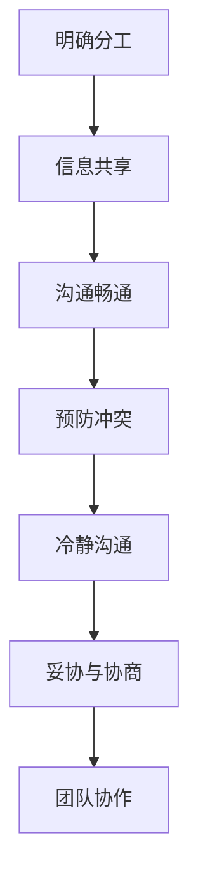

通过以上方法与技巧，项目团队可以更好地协作与沟通，为项目的成功奠定基础。

### 第4章：项目计划与执行

项目计划与执行是项目管理中至关重要的环节，决定了项目能否按照预定时间、预算和范围顺利完成。以下是项目计划与执行的具体内容，包括项目计划的制定、项目执行的控制以及项目进度的监控与调整。

#### 4.1 项目计划的制定

项目计划是确保项目按计划进行的基础。以下是制定项目计划的步骤：

##### 4.1.1 分解任务

将项目目标分解为具体的任务，确保每个任务都是可执行和可度量的。以下是一个任务分解的示例：

```
项目目标：开发一款在线教育平台
任务分解：
- 注册登录模块
- 课程发布与管理模块
- 问答模块
- 用户反馈模块
- 系统测试
- 部署上线
```

##### 4.1.2 确定任务依赖关系

分析任务之间的依赖关系，确保任务顺序合理。以下是一个任务依赖关系的示例：

```
注册登录模块 → 课程发布与管理模块
课程发布与管理模块 → 问答模块
问答模块 → 用户反馈模块
用户反馈模块 → 系统测试
系统测试 → 部署上线
```

##### 4.1.3 分配资源

为每个任务分配所需的资源，如人力、技术等。以下是一个资源分配的示例：

```
注册登录模块：2名开发人员
课程发布与管理模块：3名开发人员
问答模块：2名开发人员
用户反馈模块：1名开发人员
系统测试：2名测试人员
部署上线：1名运维人员
```

##### 4.1.4 制定时间表

根据任务依赖关系和资源分配，制定详细的时间表。以下是一个时间表的示例：

```
任务                 开始时间        结束时间
注册登录模块       2023-01-01     2023-01-07
课程发布与管理模块  2023-01-08     2023-01-21
问答模块           2023-01-22     2023-01-28
用户反馈模块       2023-01-29     2023-02-04
系统测试           2023-02-05     2023-02-12
部署上线           2023-02-13     2023-02-18
```

#### 4.2 项目执行的控制

项目执行的控制是确保项目按计划进行的关键。以下是项目执行控制的具体内容：

##### 4.2.1 任务分配与跟进

将任务分配给团队成员，并确保他们了解任务要求。定期跟进任务进度，确保任务按计划进行。以下是一个任务分配与跟进的示例：

```
任务                 负责人
注册登录模块       张三
课程发布与管理模块  李四
问答模块           王五
用户反馈模块       赵六
系统测试           刘七
部署上线           陈八
```

##### 4.2.2 进度监控

定期检查项目进度，确保任务按计划进行。以下是一个进度监控的示例：

```
进度报告（2023-02-05）：
- 注册登录模块已完成80%，预计2023-02-07完成。
- 课程发布与管理模块已完成50%，预计2023-02-10完成。
- 问答模块已完成30%，预计2023-02-10完成。
- 用户反馈模块已完成10%，预计2023-02-15完成。
- 系统测试尚未开始。
- 部署上线尚未开始。
```

##### 4.2.3 变更管理

在项目执行过程中，可能会出现计划变更。及时识别变更，评估变更对项目的影响，并制定相应的变更管理计划。以下是一个变更管理的示例：

```
变更请求：
- 需求变更：增加课程分类功能。
变更评估：
- 变更对项目进度的影响：预计增加1周时间。
变更管理：
- 与利益相关者沟通，确认变更需求。
- 重新制定时间表，确保项目按计划进行。
```

#### 4.3 项目进度的监控与调整

项目进度的监控与调整是确保项目按计划进行的关键。以下是项目进度监控与调整的具体内容：

##### 4.3.1 定期生成进度报告

定期生成进度报告，提供项目进展的详细信息。以下是一个进度报告的示例：

```
进度报告（2023-02-10）：
- 注册登录模块已完成100%，已于2023-02-07完成。
- 课程发布与管理模块已完成100%，已于2023-02-10完成。
- 问答模块已完成100%，已于2023-02-10完成。
- 用户反馈模块已完成100%，已于2023-02-15完成。
- 系统测试已完成70%，预计2023-02-18完成。
- 部署上线已完成准备工作，预计2023-02-19完成。
```

##### 4.3.2 分析进度报告

分析进度报告，识别潜在的问题和风险。以下是一个进度报告分析示例：

```
进度报告分析：
- 系统测试进度较慢，需进一步识别问题。
- 部署上线准备工作已完成，但需确保所有模块测试通过。
```

##### 4.3.3 调整计划

根据进度报告分析结果，调整项目计划，确保项目按计划进行。以下是一个计划调整的示例：

```
计划调整：
- 加快系统测试进度，确保2023-02-18完成。
- 部署上线时间调整为2023-02-20，以确保系统测试通过。
```

通过以上项目计划与执行的方法与技巧，项目团队可以确保项目按计划、预算和范围顺利完成。以下是一个简化的项目计划与执行流程图：

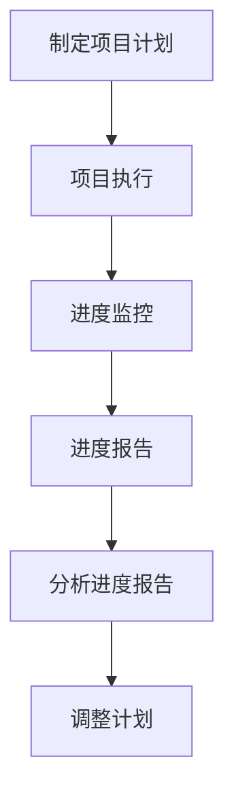

通过定期监控与调整项目进度，项目团队可以及时识别和解决问题，确保项目按计划进行。

### 第5章：项目质量管理

项目质量管理是确保项目成果符合预期质量要求的过程。有效的质量管理不仅能够减少项目缺陷和返工，提高客户满意度，还能提高项目团队的效率和信誉。以下是项目质量管理的定义、基本概念、质量管理方法与技术，以及质量保证与质量控制。

#### 5.1 质量管理的基本概念

**质量管理的定义：** 质量管理是一个通过规划、执行、监控和改进过程来确保项目成果满足质量要求的过程。

**质量管理的基本概念：**

- **质量标准：** 质量标准是项目成果应满足的预期质量要求，包括性能、可靠性、安全性等。
- **质量计划：** 质量计划是项目管理计划的一部分，描述如何实施质量保证活动。
- **质量控制：** 质量控制是确保项目过程和成果符合质量标准的过程。
- **质量保证：** 质量保证是确保项目过程和成果持续满足质量要求的过程。

#### 5.2 质量管理的方法与技术

**质量规划：**

- **制定质量目标：** 根据项目需求和预期成果，制定具体的质量目标。
- **制定质量标准：** 确定项目应满足的质量标准，如ISO标准、行业标准等。
- **质量保证计划：** 制定质量保证活动的详细计划，包括质量检查、测试等。

**质量检查：**

- **内部检查：** 项目团队自行检查项目成果，确保符合质量标准。
- **外部检查：** 邀请第三方进行检查，提供独立的质量评估。

**测试：**

- **单元测试：** 对单个模块进行测试，确保其功能正确。
- **集成测试：** 对模块之间的接口进行测试，确保系统集成正确。
- **性能测试：** 对系统的性能进行测试，确保其满足性能要求。

**质量报告：**

- **质量报告：** 定期生成质量报告，提供项目质量的详细分析。

#### 5.3 项目质量保证与质量控制

**项目质量保证：**

- **过程控制：** 通过监控项目过程，确保每个阶段都符合质量标准。
- **持续改进：** 通过收集反馈和不断改进，提高项目质量。

**项目质量控制：**

- **缺陷管理：** 识别和修复项目中的缺陷，确保项目成果符合质量标准。
- **质量评审：** 定期进行质量评审，评估项目质量，提出改进建议。

#### 5.4 质量管理工具与技术

**质量管理工具：**

- **质量功能展开（QFD）：** 通过将客户需求转化为技术要求，确保项目设计符合用户需求。
- **质量成本分析：** 分析项目中的质量成本，优化资源分配。

**质量管理技术：**

- **统计过程控制（SPC）：** 使用统计学方法监控项目过程，确保过程稳定。
- **持续集成（CI）：** 通过自动化的测试和部署，确保代码质量。

**质量管理的公式：**

\[ 质量得分 = \frac{符合质量标准的成果}{总成果} \]

通过以上质量管理的方法与技术，项目团队可以确保项目成果符合预期质量要求，提高项目成功率。

### 第6章：项目风险管理与应对

项目风险是项目过程中可能发生的任何不利事件，可能会影响项目的时间、成本、范围或质量。有效的项目风险管理是识别、评估和应对项目风险的关键，以确保项目能够按计划进行。以下是项目风险管理的定义、原则、方法和风险应对策略。

#### 6.1 风险管理的定义与原则

**风险管理的定义：** 项目风险管理是识别、评估、优先排序和应对项目风险的过程，旨在最大限度地减少不利影响，并利用机会为项目带来利益。

**风险管理的原则：**

1. **预防为主：** 在项目初期就识别和应对潜在风险，预防风险的发生。
2. **及时处理：** 一旦发现风险，立即采取措施进行管理，避免风险扩大。
3. **持续改进：** 通过不断评估和改进风险管理过程，提高项目应对风险的能力。

#### 6.2 风险识别与评估

**风险识别：** 风险识别是识别项目中潜在的风险事件的过程。以下是几种常用的风险识别方法：

1. **头脑风暴：** 通过项目团队成员的集体讨论，识别潜在风险。
2. **历史数据分析：** 分析以往项目的风险记录，识别类似项目的潜在风险。
3. **文档审查：** 审查项目计划、需求文档等，识别潜在风险。

**风险评估：** 风险评估是评估每个风险的严重性和发生概率的过程。以下是风险评估的步骤：

1. **确定风险因素：** 识别可能导致风险的具体因素。
2. **评估风险严重性：** 评估风险对项目目标（时间、成本、范围、质量）的影响程度。
3. **评估风险概率：** 评估风险发生的可能性。

**风险矩阵：** 风险矩阵是一种用于评估风险严重性和发生概率的工具。以下是风险矩阵的示例：

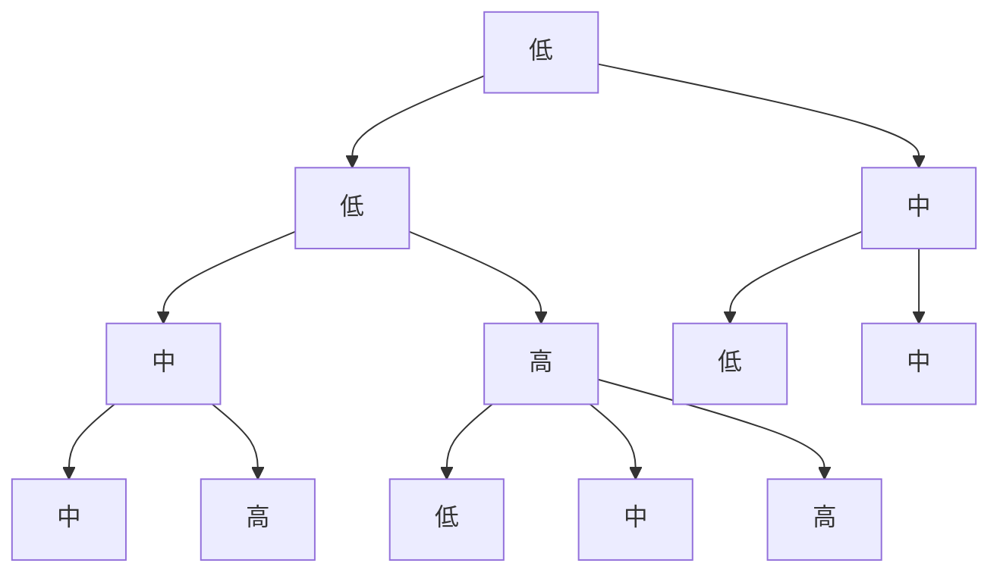

#### 6.3 风险应对策略

**风险应对策略：** 风险应对策略是针对识别和评估后的风险，制定相应的应对措施。以下是几种常用的风险应对策略：

1. **规避：** 通过修改项目计划，避免风险的发生。
2. **减轻：** 通过采取措施降低风险的严重性和发生概率。
3. **转移：** 通过合同、保险等方式，将风险转移给第三方。
4. **接受：** 对无法规避、减轻或转移的风险，制定应对措施，并接受风险可能带来的影响。

**风险应对策略示例：**

- **规避：** 在项目初期识别到需求变更风险，通过提前沟通和明确需求，避免需求变更。
- **减轻：** 识别到技术难度较高的任务，通过增加人力资源和时间预算，降低任务完成的难度。
- **转移：** 通过购买商业软件，将技术风险转移给软件供应商。
- **接受：** 对市场需求变化的风险，制定应对措施，如灵活调整项目计划，快速响应市场变化。

#### 6.4 风险监控与报告

**风险监控：** 风险监控是持续跟踪和评估已识别风险的状态，确保风险应对措施的有效性。以下是风险监控的步骤：

1. **定期检查：** 定期检查项目进展，评估风险状态。
2. **更新风险记录：** 更新风险记录，包括风险状态、应对措施等。
3. **报告风险情况：** 向项目团队和利益相关者报告风险情况，确保所有相关人员了解风险状态。

**风险报告：** 风险报告是提供项目风险情况的详细分析，包括风险识别、评估、应对措施和监控结果。以下是风险报告的示例：

```
风险报告

一、风险识别
- 需求变更风险
- 技术难度较高任务风险
- 市场需求变化风险

二、风险评估
- 需求变更风险：严重性中，发生概率高
- 技术难度较高任务风险：严重性高，发生概率中
- 市场需求变化风险：严重性中，发生概率中

三、风险应对措施
- 需求变更风险：提前沟通和明确需求
- 技术难度较高任务风险：增加人力资源和时间预算
- 市场需求变化风险：灵活调整项目计划，快速响应市场变化

四、风险监控
- 定期检查项目进展，更新风险记录
- 向项目团队和利益相关者报告风险情况
```

通过以上项目风险管理的定义、原则、方法和风险应对策略，项目团队可以更好地识别、评估和应对项目风险，确保项目顺利进行。

### 第7章：项目收尾与评价

项目收尾是项目管理生命周期中的最后一个阶段，确保项目按计划完成并交付。此阶段涉及项目收尾工作、项目评价与总结，以及项目文档归档与资料保存。

#### 7.1 项目收尾工作

项目收尾工作主要包括以下内容：

**项目交付：** 将完成的项目成果交付给客户或用户。确保所有预定功能和技术规格都已经实现，并经过测试和验证。

**客户验收：** 客户验收是确认项目成果满足其需求的正式过程。通常包括客户签收、验收报告和任何必要的认证。

**项目总结：** 项目总结是对项目成功和失败因素的分析，包括项目目标、时间、成本、风险和质量管理等方面的回顾。以下是一个项目总结的示例：

```
项目总结

一、项目目标
- 开发一款在线教育平台
- 提供课程发布、管理和用户反馈功能

二、时间管理
- 完成时间：2023年2月18日
- 实际用时：比计划提前1周

三、成本管理
- 预算：100,000美元
- 实际花费：95,000美元

四、风险管理
- 识别并应对了需求变更和技术难度较高任务的风险
- 没有出现重大风险事件

五、质量管理
- 功能测试覆盖率：100%
- 系统稳定性：满足性能要求
```

**项目文档归档：** 将所有项目文档、代码、测试报告、用户手册等整理归档，方便未来参考和使用。

#### 7.2 项目评价与总结

项目评价是对项目整体绩效的评估，通常包括以下几个方面：

- **项目目标实现情况：** 是否达到预期目标。
- **项目成本和进度：** 是否在预算和时间内完成。
- **项目质量：** 项目成果是否符合质量标准。
- **团队协作与沟通：** 团队成员之间的协作是否顺畅。
- **客户满意度：** 客户对项目成果的满意度。

**项目总结报告：** 项目总结报告是项目评价的总结性文档，通常包括以下内容：

```
项目总结报告

一、项目概述
- 项目名称：在线教育平台
- 项目周期：2023年1月1日至2023年2月18日

二、项目绩效
- 目标实现：完全实现
- 成本：节省5%
- 时间：提前1周完成
- 质量：满足所有质量标准
- 客户满意度：高

三、经验教训
- 需求管理：提前确认需求，避免后期变更
- 风险管理：及时识别和应对风险，确保项目顺利进行
- 团队协作：定期沟通，提高工作效率

四、改进建议
- 优化需求管理流程，确保需求明确
- 加强风险识别和评估，提前制定应对措施
- 提高团队成员的沟通能力，减少误解和冲突
```

#### 7.3 项目文档归档与资料保存

项目文档归档是确保项目知识传承的重要环节。以下是项目文档归档的建议：

- **文档分类：** 将文档按照类型（如需求文档、设计文档、测试文档等）分类整理。
- **版本控制：** 使用版本控制工具（如Git）管理文档版本，确保文档的完整性和一致性。
- **备份存储：** 将文档备份存储在云存储服务或专用服务器上，确保文档的安全和可访问性。

**项目文档归档指南：**

```
项目文档归档指南

一、需求文档
- 需求说明书
- 用户故事
- 用例图

二、设计文档
- 系统设计
- 架构图
- 数据库设计

三、测试文档
- 测试计划
- 测试用例
- 测试报告

四、代码库
- 源代码
- 依赖库

五、用户手册
- 用户操作指南
- 系统维护手册

六、项目报告
- 项目计划
- 进度报告
- 项目总结报告
```

通过项目收尾与评价，项目团队可以总结经验教训，为未来项目提供参考，确保项目的成功实施和知识传承。

### 第8章：技术选型与框架选择

技术选型与框架选择是项目成功的关键环节，直接影响项目的开发效率、性能、可维护性和扩展性。正确的技术选型可以帮助团队规避潜在的技术风险，提升项目的整体质量。以下是技术选型的策略、常见开发框架的介绍，以及技术栈的构建与优化。

#### 8.1 技术选型的策略

**技术选型策略**是选择适合项目需求的技术和框架的过程。以下是一些关键策略：

##### 8.1.1 需求分析

在进行技术选型之前，必须进行详细的需求分析，确保所选技术能够满足项目的功能、性能和扩展性要求。以下是一个需求分析示例：

```
需求分析：

1. 功能需求：
   - 用户注册与登录
   - 课程发布与管理
   - 用户问答与反馈
   - 数据统计分析

2. 性能需求：
   - 页面响应时间：≤2秒
   - 数据库查询速度：≤100ms

3. 扩展性需求：
   - 支持大规模并发用户
   - 易于扩展新功能
```

##### 8.1.2 技术评估

对潜在技术进行评估，包括其性能、稳定性、社区支持、文档和安全性。以下是一个技术评估示例：

```
技术评估：

1. 框架A：
   - 性能：中
   - 稳定性：高
   - 社区支持：好
   - 文档：全
   - 安全性：中

2. 框架B：
   - 性能：高
   - 稳定性：中
   - 社区支持：中
   - 文档：部分
   - 安全性：高
```

##### 8.1.3 成本与维护

考虑技术选型的长期成本和维护难度。以下是一个成本与维护的示例：

```
成本与维护：

1. 框架A：
   - 开发成本：低
   - 维护成本：高
   - 培训成本：中

2. 框架B：
   - 开发成本：高
   - 维护成本：中
   - 培训成本：低
```

##### 8.1.4 风险分析

分析技术选型的潜在风险，包括技术过时、社区失去支持、安全性漏洞等。以下是一个风险分析的示例：

```
风险分析：

1. 框架A：
   - 技术过时风险：低
   - 社区失去支持风险：中
   - 安全性漏洞风险：低

2. 框架B：
   - 技术过时风险：高
   - 社区失去支持风险：低
   - 安全性漏洞风险：中
```

#### 8.2 常见开发框架介绍

以下是一些常见的开发框架，适用于不同的项目需求：

##### 8.2.1 MERN栈

MERN栈是一种全栈开发框架，由MongoDB、Express.js、React.js和Node.js组成。以下是一个MERN栈的基本架构：

**MongoDB：** 用于存储和管理数据，提供高性能、可扩展的文档存储解决方案。

**Express.js：** 用于创建服务器端应用程序，提供快速、无障碍的Node.js Web应用开发框架。

**React.js：** 用于构建用户界面，提供组件化、声明式的UI开发方式。

**Node.js：** 用于服务器端逻辑处理，提供非阻塞、事件驱动的I/O模型，提高服务器性能。

**MERN栈架构图：**

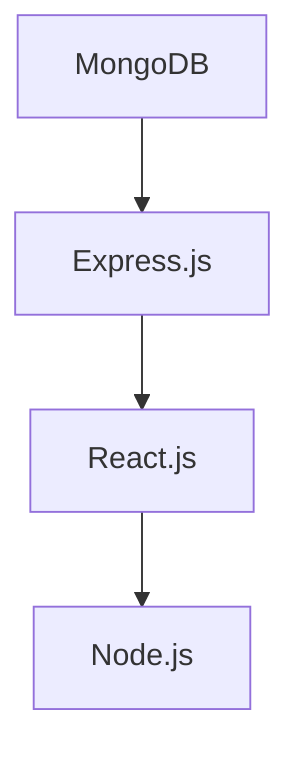

##### 8.2.2 LAMP栈

LAMP栈是一种开源的全栈开发框架，由Linux、Apache、MySQL和PHP组成。以下是一个LAMP栈的基本架构：

**Linux：** 操作系统，提供稳定、安全的运行环境。

**Apache：** 服务器，用于处理HTTP请求，提供高性能的Web服务器解决方案。

**MySQL：** 数据库，提供高性能、可靠的SQL数据库管理系统。

**PHP：** 服务器端脚本语言，用于处理动态网页和服务器端逻辑。

**LAMP栈架构图：**

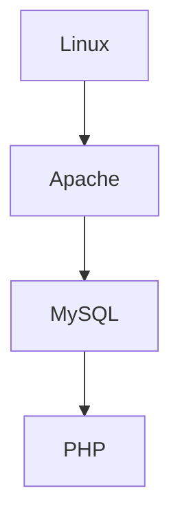

##### 8.2.3 Django

Django是一个高层次的Python Web框架，旨在快速开发和简洁、实用的设计。以下是一个Django的基本架构：

**Django：** 用于创建Web应用程序，提供全面的ORM（对象关系映射）和丰富的功能，如用户认证、表单处理、权限管理。

**ORM：** 用于数据库操作，将数据库表映射到Python对象。

**视图：** 处理HTTP请求，返回HTTP响应。

**模型：** 用于定义数据结构和业务逻辑。

**Django架构图：**

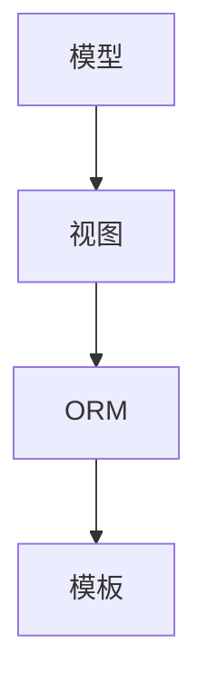

#### 8.3 技术栈的构建与优化

技术栈的构建与优化是确保项目稳定、高效运行的关键。以下是一些构建与优化的策略：

##### 8.3.1 架构设计

**架构设计**是技术栈构建的第一步，应确保系统的模块化、高可用性和扩展性。以下是一个典型的分布式架构设计：

- **前端：** 使用React.js或Vue.js等框架构建用户界面。
- **后端：** 使用Node.js或Django等框架处理服务器端逻辑。
- **数据库：** 使用MongoDB或MySQL等数据库管理系统。
- **缓存：** 使用Redis等缓存系统提高性能。
- **消息队列：** 使用RabbitMQ或Kafka等消息队列系统处理异步任务。
- **负载均衡：** 使用Nginx等负载均衡器分配请求。

**架构设计图：**

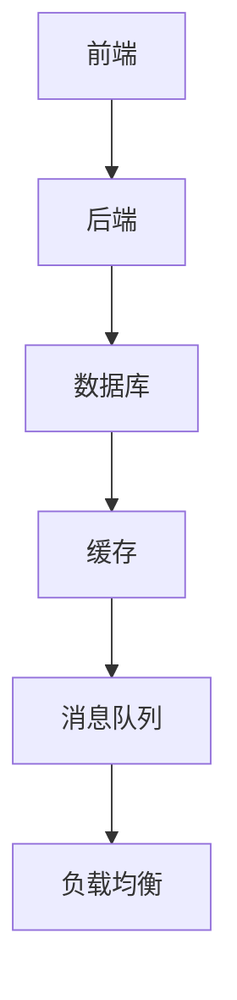

##### 8.3.2 持续集成与部署

**持续集成与部署（CI/CD）**是优化开发流程的关键。通过自动化测试和部署，可以提高开发效率和项目质量。以下是一个CI/CD流程：

1. **代码提交：** 开发者将代码提交到版本控制系统中。
2. **自动化测试：** 运行单元测试、集成测试和性能测试。
3. **构建：** 构建应用程序和部署环境。
4. **部署：** 将应用程序部署到生产环境。
5. **监控：** 监控应用程序的运行状态，确保系统的稳定运行。

**CI/CD流程图：**

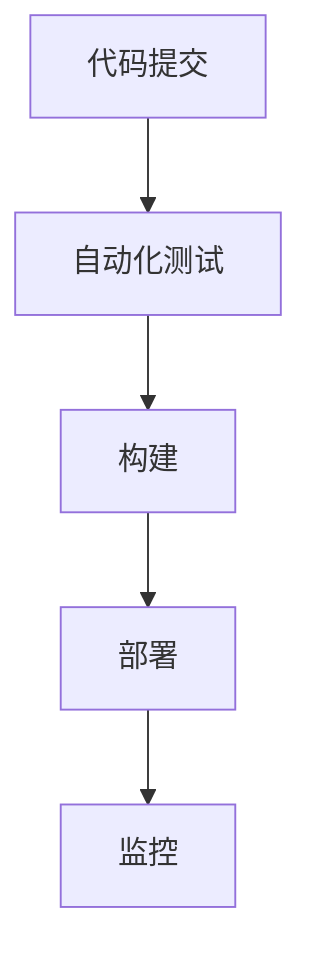

##### 8.3.3 性能优化

**性能优化**是确保系统高效运行的关键。以下是一些性能优化的策略：

- **数据库优化：** 索引优化、查询优化、分库分表等。
- **缓存优化：** 使用Redis等缓存系统缓存常用数据。
- **前端优化：** 图片压缩、代码分割、懒加载等。
- **服务器优化：** 服务器调优、负载均衡等。

**性能优化公式：**

\[ 性能 = \frac{处理能力}{响应时间} \]

通过以上技术选型与框架选择的策略、常见开发框架的介绍，以及技术栈的构建与优化，项目团队可以确保项目的技术架构合理、高效、可扩展，为项目的成功奠定坚实基础。

### 第9章：数据库设计与使用

数据库是现代应用程序的核心组成部分，用于存储、检索和管理数据。正确的数据库设计和使用对于应用程序的性能、扩展性和可靠性至关重要。以下是数据库的基本概念、关系型数据库设计、非关系型数据库应用以及数据库性能优化。

#### 9.1 数据库基本概念

数据库是存储数据的系统，提供数据的组织、检索和管理功能。以下是数据库的一些基本概念：

**数据库类型：** 数据库分为关系型数据库（RDBMS）和非关系型数据库（NoSQL）。

**数据库系统：** 数据库系统包括数据库管理系统（DBMS）和数据库。

**数据库管理系统（DBMS）：** DBMS是用于创建、维护和管理数据库的软件。常见DBMS包括MySQL、PostgreSQL、MongoDB、Redis等。

**数据库模型：** 数据库模型描述数据如何组织。关系型数据库使用关系模型，非关系型数据库使用不同的模型，如文档模型、键值模型、图形模型等。

**数据表：** 数据表是数据库中的基本数据结构，用于存储数据。

**SQL：** 结构化查询语言（SQL）用于与数据库进行交互，执行数据的增删改查操作。

**索引：** 索引是数据库表中的数据结构，用于提高查询速度。

#### 9.2 关系型数据库设计

关系型数据库设计是数据库设计中的一种常见方法，基于关系模型。以下是关系型数据库设计的关键步骤：

**实体-关系（E-R）图：** E-R图用于描述数据库中的实体及其关系。

**实体：** 实体是数据库中的对象，如用户、课程等。

**属性：** 属性是实体的特征，如用户名、年龄等。

**关系：** 关系是实体之间的关联，如用户和课程之间的关系。

**E-R图示例：**

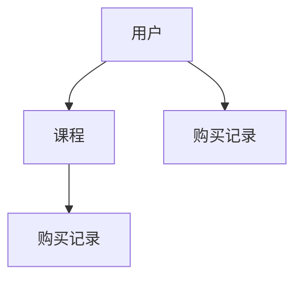

**关系型数据库设计原则：**

- **最小冗余：** 数据应尽可能无冗余地存储。
- **规范化：** 数据应按照规范化原则进行组织，减少数据不一致性。
- **完整性：** 确保数据的一致性和正确性。

**规范化示例：**

1. **第一范式（1NF）：** 保证每一列都是不可分割的数据项。
2. **第二范式（2NF）：** 满足第一范式，且每个非主属性完全依赖于主键。
3. **第三范式（3NF）：** 满足第二范式，且每个属性都不传递依赖于主键。

**关系型数据库设计公式：**

\[ \text{表} = \{\text{列1}, \text{列2}, ..., \text{列n}\} \]

#### 9.3 非关系型数据库应用

非关系型数据库（NoSQL）用于处理大量非结构化和半结构化数据。以下是几种常见的NoSQL数据库：

**文档数据库：** 如MongoDB，用于存储文档，提供灵活的数据模型和强大的查询功能。

**键值数据库：** 如Redis，用于存储键值对，提供高性能的数据存储和快速访问。

**图形数据库：** 如Neo4j，用于存储和查询图形数据，提供强大的图形处理能力。

**NoSQL数据库应用示例：**

**MongoDB：**

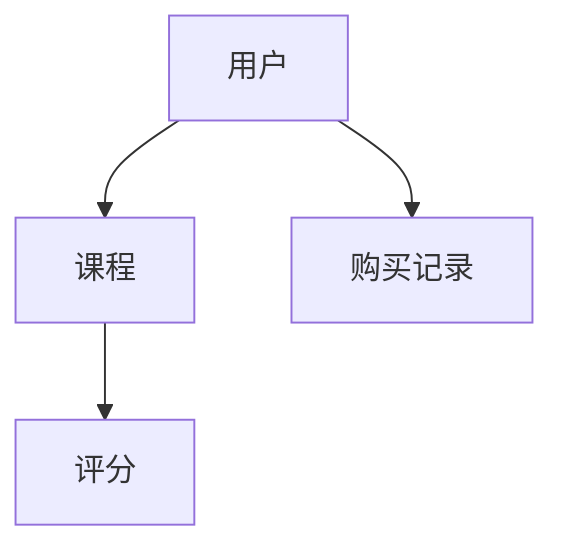

**Redis：**

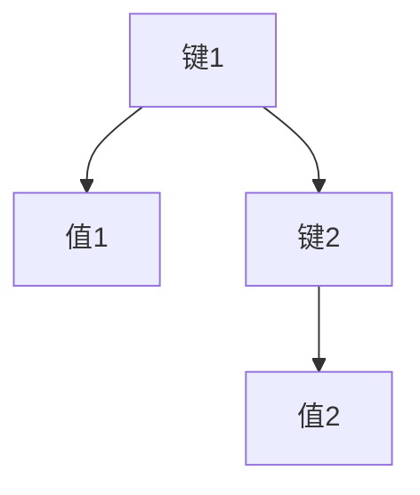

**Neo4j：**

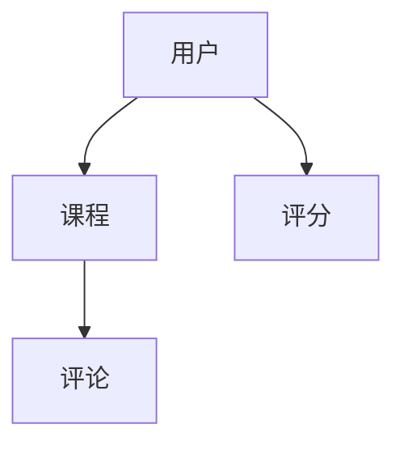

**NoSQL数据库设计原则：**

- **去规范化：** 数据可以存储在单个文档中，减少查询复杂性。
- **扩展性：** 能够轻松扩展以处理大量数据。
- **灵活性：** 数据模型可以灵活调整，适应不同类型的数据。

**NoSQL数据库设计公式：**

\[ \text{文档} = \{\text{字段1}, \text{字段2}, ..., \text{字段n}\} \]

#### 9.4 数据库性能优化

数据库性能优化是确保系统高效运行的关键。以下是几种常见的数据库性能优化策略：

**查询优化：** 索引优化、查询重写、查询缓存等。

**索引优化：** 创建适当的索引，提高查询速度。

**分库分表：** 将大量数据分散到多个数据库或表中，提高并发处理能力。

**缓存：** 使用缓存（如Redis）存储常用数据，减少数据库访问。

**分片：** 将数据分散到多个节点上，提高系统的扩展性和可用性。

**数据库性能优化公式：**

\[ \text{性能} = \frac{\text{响应时间}}{\text{查询次数}} \]

通过以上数据库设计与使用的方法与技巧，项目团队可以确保数据库系统的高效、稳定和可扩展性，为应用程序的成功奠定坚实基础。

### 第10章：前端开发技术

前端开发是构建用户界面和用户体验的核心环节，其目标是创建一个既美观又功能丰富的用户界面。以下是前端开发的基础、常用前端框架的介绍，以及前端性能优化。

#### 10.1 前端开发基础

前端开发涉及到HTML、CSS和JavaScript三种核心技术。以下是前端开发的基础内容：

**HTML（超文本标记语言）：** 用于构建网页结构，定义页面内容。

**CSS（层叠样式表）：** 用于控制网页的样式和布局，如颜色、字体、对齐方式等。

**JavaScript：** 用于实现网页的动态效果和交互功能，如响应式菜单、表单验证等。

**前端开发工具：**

- **Visual Studio Code：** 适用于编程的轻量级代码编辑器，支持丰富的插件和扩展。
- **WebStorm：** 集成开发环境（IDE），提供强大的代码编辑和调试功能。
- **Webpack：** 前端模块打包工具，用于将各种前端资源打包成一个或多个静态文件。

#### 10.2 常用前端框架介绍

前端框架提供了预构建的工具和库，以简化前端开发的复杂性。以下是几种常用的前端框架：

**React.js：** 由Facebook开发，是一个用于构建用户界面的JavaScript库。React通过组件化开发，提高了代码的可维护性和复用性。

**Vue.js：** 是一个渐进式JavaScript框架，易于上手，适合构建各种规模的应用程序。Vue通过数据绑定和组件化，实现了简洁和高效的前端开发。

**Angular：** 由Google开发，是一个全功能的前端框架，适用于构建复杂的应用程序。Angular通过依赖注入、双向数据绑定等特性，提供了强大的开发工具。

**前端框架比较：**

| 特点         | React.js | Vue.js | Angular |
| ------------ | -------- | ------ | ------- |
| 开发方式     | 组件化   | 组件化 | MVC     |
| 数据绑定     | 双向     | 双向   | 双向    |
| 社区支持     | 强大     | 强大   | 强大    |
| 学习难度     | 中等     | 简单   | 高     |

#### 10.3 前端性能优化

前端性能优化是提高用户体验的关键。以下是一些常见的优化策略：

**资源压缩：** 使用工具（如Gzip、UglifyJS）压缩HTML、CSS和JavaScript文件，减少文件大小。

**懒加载：** 按需加载图片、视频和组件，减少页面初始加载时间。

**CDN：** 使用内容分发网络（CDN）加速资源的加载速度。

**缓存策略：** 设置合理的缓存策略，减少重复请求。

**代码分割：** 使用代码分割将代码分成不同的块，按需加载。

**性能监控：** 使用工具（如Lighthouse、WebPageTest）监控页面性能，识别优化点。

**性能优化公式：**

\[ \text{性能} = \frac{\text{页面加载时间}}{\text{资源数量}} \]

通过以上前端开发技术的基础知识、常用框架的介绍以及性能优化的策略，前端开发者可以构建出高效、美观、响应迅速的Web应用程序，为用户提供出色的用户体验。

### 第11章：后端开发技术

后端开发是构建Web应用程序的核心部分，负责处理业务逻辑、数据库交互和API设计。以下是后端开发的基础、常用后端框架的介绍以及后端性能优化。

#### 11.1 后端开发基础

后端开发涉及多个技术领域，包括服务器端编程、数据库管理和API设计。以下是后端开发的基础内容：

**服务器端编程：** 服务器端编程用于处理客户端请求，执行业务逻辑，并返回响应。常用的后端编程语言包括Java、Python、Node.js和Ruby等。

**数据库管理：** 数据库管理涉及数据库的创建、维护和查询。常用的数据库管理系统（DBMS）包括MySQL、PostgreSQL、MongoDB和Oracle等。

**API设计：** API设计是构建可扩展和可重用的服务的关键。RESTful API和GraphQL是两种常见的API设计方法。

**后端开发工具：**

- **IntelliJ IDEA：** 集成开发环境（IDE），提供强大的代码编辑和调试功能。
- **Visual Studio Code：** 轻量级代码编辑器，支持多种编程语言和插件。
- **Docker：** 容器化技术，用于简化应用程序的部署和运维。
- **Kubernetes：** 容器编排工具，用于管理和自动化容器化应用程序。

#### 11.2 常用后端框架介绍

后端框架提供了预构建的工具和库，以简化后端开发的复杂性。以下是几种常用的后端框架：

**Spring Boot：** 是一个由Spring框架构建的微服务开发框架。Spring Boot提供了快速构建、配置简单和自动化的特性，适用于构建大型、复杂的Web应用程序。

**Django：** 是一个Python Web框架，旨在快速开发和简洁、实用的设计。Django提供了全面的ORM、用户认证和表单处理等特性，适用于快速开发中小型项目。

**Express.js：** 是一个用于Node.js的Web应用程序框架，提供了快速、无障碍的Web开发体验。Express.js适用于构建高性能、可扩展的Web应用程序。

**Spring Cloud：** 是一个基于Spring Boot的微服务开发框架，提供了服务发现、配置管理、负载均衡和断路器等微服务特性。Spring Cloud适用于构建分布式系统和微服务架构。

**后端框架比较：**

| 特点         | Spring Boot | Django | Express.js |
| ------------ | ----------- | ------ | ---------- |
| 开发效率     | 高          | 高     | 中         |
| 社区支持     | 强大        | 强大   | 中         |
| 学习难度     | 中等        | 简单   | 中         |
| 领域模型     | 全功能框架  | MVC框架 | MVC框架    |

#### 11.3 后端性能优化

后端性能优化是提高系统响应速度和可扩展性的关键。以下是一些常见的优化策略：

**数据库优化：** 通过索引优化、查询重写和分库分表等策略提高数据库性能。

**缓存：** 使用Redis等缓存系统缓存常用数据，减少数据库访问。

**异步处理：** 使用异步处理减少服务器阻塞，提高并发处理能力。

**负载均衡：** 使用Nginx等负载均衡器分配请求，提高系统的负载能力。

**代码优化：** 通过代码优化减少CPU和内存的使用，提高系统性能。

**微服务架构：** 使用微服务架构将系统拆分为多个独立的服务，提高系统的可扩展性和可靠性。

**性能优化公式：**

\[ \text{性能} = \frac{\text{响应时间}}{\text{并发量}} \]

通过以上后端开发技术的基础知识、常用框架的介绍以及性能优化的策略，后端开发者可以构建出高效、稳定、可扩展的Web应用程序，为用户提供卓越的服务。

### 第12章：API设计与开发

API（应用程序编程接口）是现代软件开发的重要组成部分，它允许不同的软件系统之间进行交互。良好的API设计能够提高系统的可扩展性、可维护性和用户体验。以下是API设计原则、RESTful API开发以及GraphQL API应用。

#### 12.1 API设计原则

**API设计原则**是确保API易于使用、可靠且高效的重要指导方针。以下是几个关键原则：

##### 12.1.1 一致性

API的一致性意味着在所有请求和响应中保持相同的结构和行为。以下是一个一致性原则的示例：

- **URL结构**：使用统一的URL结构，如`/api/objects/{id}`，确保所有对象访问遵循相同模式。
- **HTTP方法**：根据操作类型使用合适的HTTP方法（GET、POST、PUT、DELETE），确保清晰明确。

##### 12.1.2 简单性

简单性是API设计的关键原则，复杂的API难以理解和维护。以下是一个简单性原则的示例：

- **最小功能集**：只提供必需的功能，避免过度设计。
- **明确语义**：使用清晰的命名和语义，避免模糊或不必要的复杂结构。

##### 12.1.3 可缓存性

可缓存性可以提高API的性能和响应速度。以下是一个可缓存性原则的示例：

- **Cache-Control头**：在响应中设置`Cache-Control`头，如`max-age=3600`，指示客户端缓存数据的时间。
- **ETag**：使用ETag（实体标记）或Last-Modified（最后修改时间）确保缓存的有效性。

##### 12.1.4 无状态性

无状态性意味着API不保留客户端的状态信息。以下是一个无状态性原则的示例：

- **每次请求独立**：每个请求都应包含所有必要的信息，不依赖于之前的请求状态。
- **Session管理**：使用Token或Cookie进行会话管理，避免服务器端状态。

##### 12.1.5 分层系统

分层系统可以简化API的设计和扩展。以下是一个分层系统原则的示例：

- **接口层**：定义公共API接口，隐藏内部实现细节。
- **服务层**：实现业务逻辑，处理业务请求。
- **数据访问层**：处理与数据库的交互，提供数据服务。

#### 12.2 RESTful API开发

RESTful API是基于REST（表现状态转换）架构风格的API设计方法。以下是如何开发RESTful API的步骤：

##### 12.2.1 确定资源

确定API中的资源，通常使用名词复数形式表示集合，单数形式表示单个资源。例如，`/users`表示用户集合，`/users/{id}`表示单个用户。

##### 12.2.2 设计URL

设计清晰的URL结构，遵循RESTful风格。例如：

- `GET /users`：获取所有用户
- `POST /users`：创建新用户
- `GET /users/{id}`：获取特定用户
- `PUT /users/{id}`：更新特定用户
- `DELETE /users/{id}`：删除特定用户

##### 12.2.3 设计HTTP方法

根据操作类型使用合适的HTTP方法。例如：

- `GET`：用于获取资源，如`GET /users`获取所有用户。
- `POST`：用于创建资源，如`POST /users`创建新用户。
- `PUT`：用于更新资源，如`PUT /users/{id}`更新特定用户。
- `DELETE`：用于删除资源，如`DELETE /users/{id}`删除特定用户。

##### 12.2.4 设计请求和响应

设计请求和响应的结构，确保数据的一致性和可读性。例如：

- **请求**：通常包含请求体（如JSON或表单数据），如创建用户请求：
  ```json
  {
    "name": "John Doe",
    "email": "john.doe@example.com"
  }
  ```

- **响应**：包含状态码、头部和响应体。例如，创建用户成功响应：
  ```json
  HTTP/1.1 201 Created
  Content-Type: application/json

  {
    "id": 1,
    "name": "John Doe",
    "email": "john.doe@example.com"
  }
  ```

#### 12.3 GraphQL API应用

GraphQL是一种用于API设计的查询语言，它允许客户端精确地指定所需的数据，从而提高API的灵活性和性能。以下是GraphQL API应用的关键步骤：

##### 12.3.1 设计类型

定义API中的类型，包括对象、标量和枚举等。例如：

```graphql
type Query {
  user(id: ID!): User
}

type User {
  id: ID!
  name: String!
  email: String!
}
```

##### 12.3.2 定义查询

使用GraphQL查询语言编写查询，精确指定所需的数据。例如：

```graphql
query {
  user(id: "1") {
    id
    name
    email
  }
}
```

##### 12.3.3 设计突变

定义突变（mutation）以更新数据。例如：

```graphql
type Mutation {
  createUser(name: String!, email: String!): User
}
```

```graphql
mutation {
  createUser(name: "John Doe", email: "john.doe@example.com") {
    id
    name
    email
  }
}
```

##### 12.3.4 数据检索

使用GraphQL的查询和突变操作检索和更新数据。GraphQL提供了一种灵活且高效的数据检索方式，能够减少数据传输和重复请求。

**GraphQL优势：**

- **灵活的数据检索**：客户端可以精确指定所需的数据，减少数据传输。
- **减少请求次数**：通过聚合多个查询请求，减少客户端和服务器之间的请求次数。
- **类型安全**：GraphQL提供了类型安全，确保数据的一致性和准确性。

通过遵循API设计原则，开发RESTful API和GraphQL API，可以构建灵活、高效且易于使用的API，满足不同客户端的需求，提高应用程序的整体性能和用户体验。

### 第13章：实际项目案例分析

在实际项目开发过程中，通过分析成功和失败的项目案例，可以深入了解项目管理和技术实施的具体实践，为未来的项目提供宝贵的经验和教训。以下是实际项目案例分析，涵盖项目背景介绍、项目目标与需求以及项目实施过程。

#### 13.1 项目背景介绍

该项目是一个在线教育平台，旨在为用户提供一个便捷的在线学习环境，支持课程发布、管理、用户注册、登录、问答等功能。项目团队由5名开发人员、2名测试人员和1名项目经理组成，项目周期为6个月。项目采用敏捷开发方法，以每周迭代的方式进行开发和测试。

#### 13.2 项目目标与需求

**项目目标：**

- 开发一个功能完善的在线教育平台。
- 提供课程发布、管理和用户反馈功能。
- 确保系统的高性能和可扩展性。
- 实现良好的用户体验。

**项目需求：**

- **课程发布与管理：** 教师可以发布课程、上传教学资源，管理员可以管理课程内容。
- **用户注册与登录：** 支持多种注册方式，如邮箱、手机号和第三方账号。
- **问答功能：** 用户可以在课程页面提问，其他用户可以回答问题。
- **用户反馈：** 用户可以提交反馈和建议。
- **性能要求：** 系统响应时间≤2秒，并发用户数≥1000。

#### 13.3 项目实施过程

**1. 需求分析：**

在项目启动阶段，项目经理与产品经理、教学团队和用户进行了多次访谈，收集了详细的需求和反馈。通过用户故事和用例图，明确了项目的功能需求和性能要求。

**2. 技术选型与框架选择：**

根据需求分析结果，项目团队选择了以下技术栈：

- **前端：** React.js框架
- **后端：** Node.js框架，结合Express.js实现API接口
- **数据库：** MongoDB数据库
- **缓存：** Redis缓存系统
- **消息队列：** RabbitMQ处理异步任务

**3. 设计阶段：**

在设计阶段，团队进行了详细的技术方案设计和系统架构设计。包括数据库设计、API设计、前端页面设计等。通过E-R图和用例图，明确了系统的各个模块和功能。

**4. 开发阶段：**

开发阶段分为多个迭代，每个迭代周期为两周。在第一个迭代中，团队完成了用户注册与登录、课程列表展示和课程详情页的开发。在后续的迭代中，逐步完成了课程发布与管理、问答功能和用户反馈模块。

**5. 测试阶段：**

测试阶段分为功能测试、性能测试和用户验收测试。功能测试确保每个功能模块按照需求正常运行。性能测试使用JMeter工具，模拟并发用户测试系统性能。用户验收测试邀请真实用户参与，确保系统满足用户需求。

**6. 部署与上线：**

在测试阶段结束后，团队进行了系统的部署和上线。使用Docker和Kubernetes进行容器化和编排，确保系统的高可用性和可扩展性。在上线前，团队进行了多次灰度发布，逐步扩大用户规模，确保系统稳定运行。

**7. 项目总结与评价：**

项目结束后，团队进行了项目总结和评价。项目成功实现了所有预定目标，用户反馈良好。以下是项目总结的关键点：

- **需求管理：** 通过详细的用户访谈和需求收集，确保项目需求明确、具体。
- **技术选型与框架选择：** 合适的技术栈提高了开发效率和系统性能。
- **敏捷开发：** 迭代开发和测试确保了项目的进度和质量。
- **性能优化：** 有效的性能测试和优化确保了系统的高性能和可扩展性。

通过以上实际项目案例分析，项目团队可以更好地理解和应用项目管理和技术实施的最佳实践，为未来的项目提供有力支持。

### 第14章：项目测试与部署

项目测试与部署是确保项目质量和稳定运行的关键环节。以下是项目测试策略与计划、测试工具与技巧，以及项目部署与上线的具体过程。

#### 14.1 测试策略与计划

测试策略与计划是确保项目在发布前达到预期质量的关键。以下是如何制定测试策略与计划的步骤：

##### 14.1.1 制定测试计划

- **确定测试目标：** 根据项目需求和用户故事，确定测试目标，如功能测试、性能测试、安全测试等。
- **确定测试范围：** 明确测试的模块和功能，确保覆盖所有关键功能。
- **定义测试阶段：** 分阶段进行测试，包括单元测试、集成测试、系统测试和用户验收测试。
- **确定测试资源：** 确定测试所需的工具、环境和人力资源。

##### 14.1.2 制定测试计划文档

测试计划文档应包括以下内容：

- **测试目标：** 详细描述测试的目标和预期结果。
- **测试范围：** 列出测试的模块和功能。
- **测试策略：** 描述测试方法、测试工具和测试环境。
- **测试资源：** 列出测试所需的工具、环境和人力资源。
- **时间表：** 制定详细的测试时间表，包括每个测试阶段的开始和结束时间。
- **风险评估：** 评估测试过程中可能遇到的风险和应对措施。

#### 14.2 测试工具与技巧

选择合适的测试工具和技巧可以显著提高测试效率和效果。以下是一些常用的测试工具和技巧：

##### 14.2.1 测试工具

- **JMeter：** 用于性能测试，可以模拟大量用户并发访问系统。
- **Selenium：** 用于自动化测试，可以模拟用户操作进行功能测试。
- **Postman：** 用于API测试，可以发送HTTP请求并验证API响应。
- **JUnit：** 用于单元测试，可以编写测试用例并自动运行。

##### 14.2.2 测试技巧

- **灰盒测试：** 结合白盒测试和黑盒测试，既检查系统的外部行为，也检查内部逻辑。
- **边界值分析：** 针对输入和输出的边界值进行测试，以确保系统在极限情况下正常运行。
- **场景测试：** 基于用户使用场景进行测试，确保系统能够处理实际业务流程。
- **回归测试：** 在每次更新后进行测试，确保新的更改不会影响已有功能的正常运行。

#### 14.3 项目部署与上线

项目部署与上线是确保系统稳定运行的关键步骤。以下是项目部署与上线的具体过程：

##### 14.3.1 部署准备

- **环境配置：** 配置开发、测试和生产环境，确保环境一致。
- **备份：** 在上线前备份现有系统，确保在出现问题时可以快速回滚。
- **版本控制：** 使用版本控制工具（如Git）管理代码版本，确保更新过程可控。

##### 14.3.2 部署流程

- **构建：** 使用构建工具（如Maven、Gradle）构建应用程序和依赖库。
- **打包：** 将构建结果打包成可部署的文件，如JAR文件或Docker镜像。
- **部署：** 将打包后的文件部署到服务器，可以使用自动化部署工具（如Ansible、Docker Compose）。

##### 14.3.3 上线过程

- **灰度发布：** 首先在部分用户中发布新版本，观察系统的运行情况。
- **监控：** 上线后，监控系统的性能和稳定性，确保系统正常运行。
- **用户反馈：** 收集用户的反馈，及时发现并解决问题。
- **文档更新：** 更新用户手册和系统文档，确保用户能够顺利使用新版本。

#### 14.4 部署与上线示例

以下是一个简化的部署与上线示例：

```shell
# 构建应用程序
mvn clean package

# 部署到测试环境
kubectl apply -f deployment.yaml

# 等待容器启动
kubectl wait --for=condition=ready pod/my-app

# 灰度发布到生产环境
kubectl rollout start deployment/my-app --filename=deployment.yaml

# 监控系统性能和稳定性
watch kubectl top pod

# 收集用户反馈
send-feedback-to-support@example.com
```

通过以上项目测试与部署的方法与技巧，项目团队可以确保项目在发布前达到预期的质量标准，并顺利上线。

### 第15章：项目维护与优化

项目维护与优化是确保项目长期稳定运行和持续提升性能的重要环节。以下是项目维护的重要性、项目性能优化方法和项目可持续性发展。

#### 15.1 项目维护的重要性

项目维护是确保系统稳定运行、功能完善和性能提升的关键。以下是项目维护的重要性：

- **稳定性：** 定期维护和更新可以防止系统崩溃和故障，确保系统稳定运行。
- **安全性：** 定期更新系统补丁和软件依赖，可以防止安全漏洞和攻击。
- **性能：** 通过性能监控和优化，可以提高系统的响应速度和并发处理能力。
- **用户体验：** 定期修复bug和改进功能，可以提高用户体验，增强用户满意度。

#### 15.2 项目性能优化方法

以下是一些常见的项目性能优化方法：

##### 15.2.1 数据库优化

- **索引优化：** 通过创建适当的索引，提高查询速度。
- **查询优化：** 分析和优化慢查询，减少查询时间。
- **分库分表：** 对于大型数据库，可以将数据分散到多个数据库或表中，提高并发处理能力。
- **读写分离：** 将读操作和写操作分离到不同的服务器，提高系统的负载能力。

##### 15.2.2 缓存优化

- **使用缓存：** 使用Redis等缓存系统缓存常用数据，减少数据库访问。
- **缓存策略：** 根据数据的重要性和访问频率设置合理的缓存策略。
- **过期策略：** 设置合理的过期时间，确保缓存数据的有效性。

##### 15.2.3 代码优化

- **代码复用：** 通过编写可复用的代码模块，减少冗余代码。
- **异步处理：** 使用异步处理减少服务器阻塞，提高并发处理能力。
- **并发优化：** 优化多线程和异步操作，提高系统的并发性能。

##### 15.2.4 前端优化

- **资源压缩：** 使用工具（如Gzip、UglifyJS）压缩HTML、CSS和JavaScript文件，减少文件大小。
- **懒加载：** 按需加载图片、视频和组件，减少页面初始加载时间。
- **缓存策略：** 设置合理的缓存策略，减少重复请求。

##### 15.2.5 网络优化

- **CDN：** 使用内容分发网络（CDN）加速资源的加载速度。
- **负载均衡：** 使用Nginx等负载均衡器分配请求，提高系统的负载能力。
- **网络监控：** 定期监控网络状态，确保网络的稳定和高效。

#### 15.3 项目可持续性发展

项目可持续性发展是确保项目长期成功的关键。以下是一些项目可持续性发展的方法：

##### 15.3.1 持续集成与部署

- **自动化测试：** 使用自动化测试确保代码质量和功能完整性。
- **持续集成：** 将代码提交到版本控制系统后，自动执行测试和构建。
- **持续部署：** 自动化部署应用程序到生产环境，确保快速响应变化。

##### 15.3.2 持续监控

- **性能监控：** 使用工具（如Prometheus、Grafana）监控系统的性能和状态。
- **日志分析：** 分析系统日志，识别潜在的问题和性能瓶颈。
- **安全监控：** 监控系统的安全状态，及时应对安全威胁。

##### 15.3.3 用户反馈

- **用户反馈机制：** 建立用户反馈机制，收集用户的意见和建议。
- **定期回顾：** 定期回顾用户反馈，改进系统的功能和质量。
- **用户满意度调查：** 定期进行用户满意度调查，了解用户的需求和期望。

通过以上项目维护与优化方法和项目可持续性发展的策略，项目团队可以确保项目长期稳定运行，持续提升性能，满足用户需求，实现项目的长期成功。

### 附录

#### 附录A：常用工具与环境配置

在项目开发和维护过程中，选择合适的工具和环境配置是提高工作效率和确保项目成功的关键。以下是一些常用的工具和环境配置的介绍。

##### A.1 开发工具介绍

- **Visual Studio Code：** 一款轻量级的代码编辑器，支持多种编程语言和插件，适用于前端和后端开发。
- **IntelliJ IDEA：** 一款功能强大的集成开发环境，适用于Java、Python、JavaScript等编程语言，提供代码补全、调试和性能分析等功能。
- **PyCharm：** 由JetBrains开发的一款Python集成开发环境，提供代码智能提示、调试和自动化测试等功能。

##### A.2 环境搭建教程

以下是使用Docker搭建开发环境的基本步骤：

1. **安装Docker：** 在官方网站[https://www.docker.com/](https://www.docker.com/)下载并安装Docker。
2. **拉取镜像：** 使用`docker pull`命令拉取所需的Docker镜像，例如`docker pull mysql`。
3. **创建容器：** 使用`docker run`命令创建容器，例如`docker run -d -p 3306:3306 --name my-mysql mysql`。
4. **连接数据库：** 使用`mysql -h 127.0.0.1 -P 3306 -u root -p`命令连接到MySQL容器，输入密码。

##### A.3 开发环境配置指南

以下是使用Visual Studio Code配置开发环境的基本步骤：

1. **安装Visual Studio Code：** 访问[https://code.visualstudio.com/](https://code.visualstudio.com/)下载并安装Visual Studio Code。
2. **安装扩展插件：** 打开Visual Studio Code，在扩展市场安装必要的插件，如Git、Python、JavaScript等。
3. **配置Python环境：** 安装Python扩展插件，配置Python解释器和虚拟环境。
4. **配置JavaScript环境：** 安装Node.js扩展插件，配置Node.js和npm。

#### 附录B：项目资源链接

以下是项目开发和维护过程中常用的学习资源、开源项目和行业资讯：

##### B.1 学习资源推荐

- **MDN Web文档：** [https://developer.mozilla.org/](https://developer.mozilla.org/)
- **Python官方文档：** [https://docs.python.org/](https://docs.python.org/)
- **Spring Boot官方文档：** [https://spring.io/guides](https://spring.io/guides)
- **Docker官方文档：** [https://docs.docker.com/](https://docs.docker.com/)

##### B.2 开源项目链接

- **React官方GitHub：** [https://github.com/facebook/react](https://github.com/facebook/react)
- **Vue.js官方GitHub：** [https://github.com/vuejs/vue](https://github.com/vuejs/vue)
- **Django官方GitHub：** [https://github.com/django/django](https://github.com/django/django)
- **MongoDB官方GitHub：** [https://github.com/mongodb/mongo](https://github.com/mongodb/mongo)

##### B.3 行业资讯与报告

- **TechCrunch：** [https://techcrunch.com/](https://techcrunch.com/)
- **The Next Web：** [https://thenextweb.com/](https://thenextweb.com/)
- **GitHub趋势：** [https://github.com/trending](https://github.com/trending)
- **Google AI Blog：** [https://ai.googleblog.com/](https://ai.googleblog.com/)

通过以上附录内容，项目团队可以方便地获取所需的学习资源、工具和行业资讯，为项目的成功提供有力支持。

