                 

# 《元宇宙中的虚拟家园：数字移民的栖息地》

## 关键词：
元宇宙、虚拟家园、数字移民、虚拟现实、社交互动、经济交易、安全性、隐私保护、开发运营、案例研究、未来展望。

## 摘要：
随着元宇宙的快速发展，虚拟家园成为了数字移民的理想栖息地。本文将深入探讨元宇宙的起源与发展、虚拟家园的定义与价值、数字移民现象及其影响，详细分析虚拟家园的构建原理、核心功能、安全与隐私问题，以及虚拟家园的开发与运营策略。通过案例研究，我们揭示了虚拟家园的成功模式，并对元宇宙与虚拟家园的未来发展进行了展望。

---

## 《元宇宙中的虚拟家园：数字移民的栖息地》目录大纲

### 第一部分：元宇宙概述

#### 第1章：元宇宙的起源与发展
- 1.1 元宇宙的概念
- 1.2 元宇宙的发展历程
- 1.3 元宇宙的核心特点

#### 第2章：虚拟家园的定义与价值
- 2.1 虚拟家园的定义
- 2.2 虚拟家园的价值
- 2.3 虚拟家园的类型

#### 第3章：数字移民现象与影响
- 3.1 数字移民的定义
- 3.2 数字移民的原因
- 3.3 数字移民的影响

### 第二部分：元宇宙中的虚拟家园构建

#### 第4章：虚拟家园的构建原理
- 4.1 虚拟家园的架构
- 4.2 虚拟家园的技术基础
- 4.3 虚拟家园的设计原则

#### 第5章：虚拟家园的核心功能
- 5.1 社交互动功能
- 5.2 经济交易功能
- 5.3 虚拟现实体验

#### 第6章：虚拟家园的安全与隐私
- 6.1 虚拟家园的安全问题
- 6.2 隐私保护措施
- 6.3 安全与隐私的平衡

### 第三部分：虚拟家园的开发与运营

#### 第7章：虚拟家园的开发流程
- 7.1 开发前准备
- 7.2 技术选型与架构设计
- 7.3 开发与测试

#### 第8章：虚拟家园的运营策略
- 8.1 用户获取与留存
- 8.2 社区管理
- 8.3 商业模式探索

#### 第9章：虚拟家园的成功案例
- 9.1 虚拟家园的运营模式
- 9.2 案例分析
- 9.3 经验与启示

### 第四部分：未来展望

#### 第10章：元宇宙与虚拟家园的发展趋势
- 10.1 技术发展趋势
- 10.2 社会影响与挑战
- 10.3 未来展望

#### 第11章：虚拟家园的潜在应用领域
- 11.1 教育领域
- 11.2 娱乐领域
- 11.3 商业领域

#### 第12章：虚拟家园的未来创新方向
- 12.1 创新技术展望
- 12.2 创新应用探索
- 12.3 创新驱动发展

### 附录

#### 附录 A：常用开发工具与资源
- A.1 编程语言与开发环境
- A.2 开发框架与库
- A.3 常用工具与服务

#### 附录 B：虚拟家园开发指南
- B.1 开发前准备
- B.2 开发流程与步骤
- B.3 开发技巧与建议

---

现在，让我们逐步深入分析每个章节的内容，构建出这篇技术博客的完整结构。

### 第一部分：元宇宙概述

#### 第1章：元宇宙的起源与发展
在这个章节中，我们将追溯元宇宙的起源，探讨其发展历程，并分析元宇宙的核心特点。这将帮助我们理解元宇宙的基本概念和其如何成为数字移民的理想栖息地。

1. **1.1 元宇宙的概念**  
   - **定义**：元宇宙（Metaverse）是一个虚拟的、三维的、持续存在的数字世界，用户可以通过虚拟角色在其中进行互动、工作和娱乐。  
   - **核心概念**：虚拟现实（VR）、增强现实（AR）、区块链、智能合约、虚拟资产等。

2. **1.2 元宇宙的发展历程**  
   - **早期探索**：从虚拟现实技术的诞生到现代互联网的普及，元宇宙的概念逐渐成熟。  
   - **关键事件**：虚拟现实设备的商业化、区块链技术的发展、虚拟资产市场的兴起等。

3. **1.3 元宇宙的核心特点**  
   - **持久性**：元宇宙是持续存在的，用户可以随时进入和退出。  
   - **交互性**：用户可以与其他用户、虚拟环境和物理世界进行交互。  
   - **沉浸性**：通过虚拟现实和增强现实技术，用户可以获得沉浸式的体验。  
   - **经济性**：元宇宙支持虚拟资产和交易，具有经济价值。

#### 第2章：虚拟家园的定义与价值
本章将深入探讨虚拟家园的定义、其在元宇宙中的价值，以及不同类型的虚拟家园。

1. **2.1 虚拟家园的定义**  
   - **定义**：虚拟家园是指用户在元宇宙中创建的虚拟住宅或社区，可以用来居住、社交、工作等。  
   - **组成部分**：建筑、环境、社交系统、经济系统等。

2. **2.2 虚拟家园的价值**  
   - **社交价值**：虚拟家园为用户提供了一个新的社交空间，可以与朋友、家人和同事互动。  
   - **经济价值**：虚拟家园中的虚拟资产和交易可以带来经济效益。  
   - **创意空间**：用户可以在虚拟家园中发挥创造力，设计和装饰自己的空间。

3. **2.3 虚拟家园的类型**  
   - **私人家园**：用户个人的虚拟住宅，通常用于社交和私人活动。  
   - **社区家园**：多个用户共享的虚拟社区，通常用于社交、工作和经济活动。

#### 第3章：数字移民现象与影响
本章将分析数字移民现象的定义、原因及其对元宇宙的影响。

1. **3.1 数字移民的定义**  
   - **定义**：数字移民是指人们从现实世界迁移到元宇宙，以虚拟身份进行生活和工作。  
   - **特点**：数字化、虚拟化、全球化、经济化。

2. **3.2 数字移民的原因**  
   - **社交需求**：人们渴望在虚拟世界中寻找社交连接和归属感。  
   - **经济机会**：元宇宙提供了新的就业机会和商业机会。  
   - **虚拟体验**：人们追求虚拟现实和增强现实带来的沉浸式体验。

3. **3.3 数字移民的影响**  
   - **社交影响**：改变了人们的社交习惯和方式，促进了跨文化交流。  
   - **经济影响**：推动了虚拟经济和数字经济的发展。  
   - **社会影响**：引发了关于虚拟世界与现实世界关系、数字鸿沟等社会问题的讨论。

### 第二部分：元宇宙中的虚拟家园构建
#### 第4章：虚拟家园的构建原理
本章将详细介绍虚拟家园的构建原理，包括架构、技术基础和设计原则。

1. **4.1 虚拟家园的架构**  
   - **整体架构**：虚拟家园的总体架构，包括前端、后端、数据库、区块链等组成部分。  
   - **模块化设计**：如何通过模块化设计提高虚拟家园的灵活性和可扩展性。

2. **4.2 虚拟家园的技术基础**  
   - **虚拟现实技术**：如何使用VR技术实现沉浸式体验。  
   - **增强现实技术**：如何使用AR技术增强现实体验。  
   - **区块链技术**：如何使用区块链技术确保虚拟资产的交易安全。

3. **4.3 虚拟家园的设计原则**  
   - **用户体验**：如何设计一个易于使用、交互性强的虚拟家园。  
   - **安全性**：如何确保虚拟家园的安全性和隐私保护。  
   - **可扩展性**：如何设计一个能够支持大量用户和虚拟资产的系统。

#### 第5章：虚拟家园的核心功能
本章将深入探讨虚拟家园的核心功能，包括社交互动、经济交易和虚拟现实体验。

1. **5.1 社交互动功能**  
   - **虚拟社交平台**：如何构建一个支持用户互动的平台，包括聊天、视频通话、社交游戏等。  
   - **社交网络**：如何设计一个虚拟社交网络，支持用户之间的连接和互动。

2. **5.2 经济交易功能**  
   - **虚拟货币**：如何实现虚拟货币的发行和交易，确保交易的安全性和透明度。  
   - **数字资产**：如何管理虚拟资产，包括房地产、艺术品、虚拟商品等。

3. **5.3 虚拟现实体验**  
   - **沉浸式体验**：如何使用VR技术提供沉浸式体验，包括虚拟旅游、虚拟演出、虚拟游戏等。  
   - **互动性**：如何增强虚拟体验的互动性，使用户能够与虚拟环境和其他用户进行互动。

#### 第6章：虚拟家园的安全与隐私
本章将讨论虚拟家园的安全与隐私问题，并提出解决方案。

1. **6.1 虚拟家园的安全问题**  
   - **网络攻击**：如何防止黑客攻击和数据泄露。  
   - **欺诈行为**：如何防范虚拟资产交易中的欺诈行为。

2. **6.2 隐私保护措施**  
   - **隐私政策**：如何制定隐私政策，保护用户的隐私。  
   - **数据加密**：如何使用数据加密技术保护用户数据。

3. **6.3 安全与隐私的平衡**  
   - **技术措施**：如何通过技术手段实现安全与隐私的平衡。  
   - **法律法规**：如何遵守相关法律法规，确保虚拟家园的安全与隐私。

### 第三部分：虚拟家园的开发与运营
#### 第7章：虚拟家园的开发流程
本章将介绍虚拟家园的开发流程，包括开发前准备、技术选型与架构设计，以及开发与测试。

1. **7.1 开发前准备**  
   - **需求分析**：如何分析用户需求，确定虚拟家园的功能和特性。  
   - **资源准备**：如何准备开发所需的硬件、软件和人力资源。

2. **7.2 技术选型与架构设计**  
   - **技术选型**：如何选择合适的技术栈和开发工具。  
   - **架构设计**：如何设计一个高效、可扩展的虚拟家园架构。

3. **7.3 开发与测试**  
   - **开发过程**：如何进行模块化开发，确保开发进度和质量。  
   - **测试与调试**：如何进行功能测试、性能测试和安全测试。

#### 第8章：虚拟家园的运营策略
本章将探讨虚拟家园的运营策略，包括用户获取与留存、社区管理和商业模式探索。

1. **8.1 用户获取与留存**  
   - **市场营销**：如何通过市场营销策略吸引用户。  
   - **用户体验**：如何提升用户体验，提高用户留存率。

2. **8.2 社区管理**  
   - **社区规则**：如何制定社区规则，维护社区秩序。  
   - **社区活动**：如何组织社区活动，增强用户粘性。

3. **8.3 商业模式探索**  
   - **广告收入**：如何通过广告收入实现盈利。  
   - **虚拟商品销售**：如何销售虚拟商品，实现经济收益。

#### 第9章：虚拟家园的成功案例
本章将通过分析虚拟家园的成功案例，揭示其运营模式，并提供经验与启示。

1. **9.1 虚拟家园的运营模式**  
   - **盈利模式**：如何实现盈利，包括广告收入、虚拟商品销售等。  
   - **用户参与**：如何激发用户参与，创造用户价值。

2. **9.2 案例分析**  
   - **案例分析**：分析几个典型的虚拟家园案例，探讨其成功的原因。

3. **9.3 经验与启示**  
   - **经验**：总结成功案例的经验，提供借鉴。  
   - **启示**：为开发者提供启示，指导虚拟家园的开发与运营。

### 第四部分：未来展望
#### 第10章：元宇宙与虚拟家园的发展趋势
本章将分析元宇宙与虚拟家园的未来发展趋势，包括技术、社会和商业方面的挑战与机遇。

1. **10.1 技术发展趋势**  
   - **虚拟现实技术**：如何发展更先进的VR技术。  
   - **区块链技术**：如何推动区块链在元宇宙中的应用。

2. **10.2 社会影响与挑战**  
   - **数字鸿沟**：如何解决数字鸿沟问题，让更多人参与到元宇宙中。  
   - **隐私问题**：如何平衡隐私保护与数据利用。

3. **10.3 未来展望**  
   - **发展趋势**：预测元宇宙与虚拟家园的未来发展趋势。  
   - **潜在应用**：探讨元宇宙在各个领域的潜在应用。

#### 第11章：虚拟家园的潜在应用领域
本章将探讨虚拟家园在不同领域的潜在应用，包括教育、娱乐和商业。

1. **11.1 教育领域**  
   - **虚拟课堂**：如何利用虚拟家园实现虚拟课堂。  
   - **远程教育**：如何通过虚拟家园提供远程教育服务。

2. **11.2 娱乐领域**  
   - **虚拟游戏**：如何开发虚拟游戏。  
   - **虚拟演出**：如何举办虚拟演出和活动。

3. **11.3 商业领域**  
   - **虚拟购物**：如何实现虚拟购物体验。  
   - **虚拟会议**：如何利用虚拟家园进行虚拟会议。

#### 第12章：虚拟家园的未来创新方向
本章将探讨虚拟家园的未来创新方向，包括新技术、新应用和新模式。

1. **12.1 创新技术展望**  
   - **人工智能**：如何利用人工智能技术提升虚拟家园的智能化水平。  
   - **大数据**：如何利用大数据技术优化虚拟家园的服务。

2. **12.2 创新应用探索**  
   - **虚拟现实医疗**：如何探索虚拟现实在医疗领域的应用。  
   - **虚拟现实设计**：如何利用虚拟现实技术进行设计。

3. **12.3 创新驱动发展**  
   - **创新模式**：如何通过创新模式推动虚拟家园的发展。  
   - **创新驱动**：如何实现创新驱动，保持虚拟家园的竞争力。

### 附录
#### 附录 A：常用开发工具与资源
本章将介绍虚拟家园开发中常用的工具与资源，包括编程语言、开发框架、库和常用服务。

1. **A.1 编程语言与开发环境**  
   - **编程语言**：介绍常用的编程语言，如JavaScript、Python等。  
   - **开发环境**：介绍开发所需的开发环境，如Visual Studio Code、Eclipse等。

2. **A.2 开发框架与库**  
   - **前端框架**：介绍常用的前端开发框架，如React、Vue等。  
   - **后端框架**：介绍常用的后端开发框架，如Node.js、Django等。  
   - **库与插件**：介绍常用的库和插件，如Three.js、Unity等。

3. **A.3 常用工具与服务**  
   - **区块链服务**：介绍常用的区块链服务，如Ethereum、EOS等。  
   - **虚拟现实工具**：介绍常用的虚拟现实工具，如Unity、Unreal Engine等。

#### 附录 B：虚拟家园开发指南
本章将提供虚拟家园开发前的准备、开发流程与步骤，以及开发技巧与建议。

1. **B.1 开发前准备**  
   - **需求分析**：如何进行需求分析。  
   - **技术调研**：如何进行技术调研。

2. **B.2 开发流程与步骤**  
   - **项目立项**：如何进行项目立项。  
   - **需求确认**：如何确认需求。  
   - **设计阶段**：如何进行设计和开发。  
   - **测试阶段**：如何进行测试。

3. **B.3 开发技巧与建议**  
   - **模块化开发**：如何进行模块化开发。  
   - **性能优化**：如何进行性能优化。  
   - **安全性**：如何确保安全性。

---

通过上述的分析和讨论，我们已经为《元宇宙中的虚拟家园：数字移民的栖息地》这篇技术博客构建了一个完整的内容框架。接下来，我们将逐步填充每个章节的具体内容，完成这篇高质量的技术博客。让我们开始具体的撰写工作吧！

---

## 第一部分：元宇宙概述

### 第1章：元宇宙的起源与发展

元宇宙（Metaverse）这一概念起源于科幻文学，最早可以追溯到尼尔·斯蒂芬森（Neal Stephenson）于1992年出版的小说《雪崩》（Snow Crash）。在书中，斯蒂芬森描绘了一个虚拟的、三维的、持续存在的数字世界，用户可以通过虚拟角色在其中进行互动、工作和娱乐。这一概念很快在科技界和学术界引起了广泛关注，并逐渐发展成为现代科技领域的一个重要研究方向。

#### 1.1 元宇宙的概念

元宇宙是一个虚拟的三维空间，通过互联网连接，用户可以通过虚拟角色在其中进行各种活动。它不仅仅是虚拟现实（VR）或增强现实（AR）的应用，更是一个全面的数字生态系统。在这个生态系统中，用户可以创建、分享、交易虚拟资产，参与虚拟经济活动，甚至进行虚拟社交和工作。

#### 1.2 元宇宙的发展历程

元宇宙的发展可以分为几个阶段：

1. **早期探索阶段**：从20世纪80年代开始，随着个人计算机的普及，虚拟现实和增强现实技术开始萌芽。这一时期的代表作品包括《洛克人X》（Xenogears）等游戏，它们展示了虚拟世界的雏形。

2. **互联网普及阶段**：随着互联网的普及，虚拟社区和在线游戏成为人们主要的娱乐方式。这一时期的代表作品包括《第二人生》（Second Life），它允许用户创建自己的虚拟形象和虚拟家园，开创了虚拟经济和社交互动的先河。

3. **移动设备与云计算阶段**：智能手机和移动设备的普及，以及云计算技术的快速发展，使得元宇宙的应用更加广泛和便捷。这一时期的代表作品包括《无烬之岛》（Fortnite），它结合了虚拟现实、增强现实和移动游戏，成为元宇宙的代表性作品之一。

4. **区块链与去中心化阶段**：随着区块链技术的发展，去中心化的元宇宙开始兴起。这一时期的代表作品包括《加密城》（Decentraland），它使用区块链技术管理虚拟资产和交易，实现了真正的去中心化。

#### 1.3 元宇宙的核心特点

元宇宙具有以下几个核心特点：

1. **持久性**：元宇宙是一个持续存在的虚拟空间，用户可以随时进入和退出，不受物理世界的限制。

2. **交互性**：元宇宙中的用户可以与其他用户、虚拟环境和物理世界进行交互，实现真实的互动体验。

3. **沉浸性**：通过虚拟现实和增强现实技术，元宇宙为用户提供了一种沉浸式的体验，让用户感觉自己置身于虚拟世界中。

4. **经济性**：元宇宙支持虚拟资产和交易，用户可以在其中进行虚拟商品和服务的购买、销售和交易，从而实现经济价值。

5. **创造性**：元宇宙为用户提供了一个创意空间，用户可以发挥自己的创造力，设计和创建自己的虚拟家园、虚拟资产和虚拟体验。

### 第2章：虚拟家园的定义与价值

虚拟家园是元宇宙中用户创建的虚拟住宅或社区，用户可以在其中进行社交、工作和娱乐。虚拟家园不仅是一个居住空间，更是一个社交平台和经济系统。

#### 2.1 虚拟家园的定义

虚拟家园（Virtual Home）是元宇宙中用户创建的虚拟住宅或社区，用户可以在其中居住、社交、工作、学习和娱乐。虚拟家园通常由用户自定义，包括建筑、环境、社交系统和经济系统等组成部分。

#### 2.2 虚拟家园的价值

虚拟家园在元宇宙中具有多重价值：

1. **社交价值**：虚拟家园为用户提供了一个新的社交空间，用户可以在其中与朋友、家人和同事互动，建立和维护社交关系。

2. **经济价值**：虚拟家园中的虚拟资产和交易可以带来经济效益。用户可以购买、销售和交易虚拟房地产、虚拟商品和虚拟服务等，实现虚拟财富的积累。

3. **创意空间**：虚拟家园为用户提供了一个创意空间，用户可以发挥自己的创造力，设计和装饰自己的虚拟家园，创造独特的虚拟体验。

4. **工作价值**：虚拟家园可以作为一个远程工作空间，用户可以在其中进行办公、会议和协作，提高工作效率。

#### 2.3 虚拟家园的类型

虚拟家园可以根据用途和功能进行分类：

1. **私人家园**：私人家园是用户个人的虚拟住宅，用户可以在其中进行私人活动，如与家人共度时光、举办虚拟聚会等。

2. **社区家园**：社区家园是多个用户共享的虚拟社区，用户可以在其中进行社交、工作和经济活动。社区家园通常包括公共区域和私人区域，用户可以根据自己的需求选择居住地。

3. **工作家园**：工作家园是用户进行远程工作的虚拟空间，用户可以在其中进行办公、会议和协作。工作家园通常提供专业的办公环境，配备各种办公工具和设备。

4. **娱乐家园**：娱乐家园是用户进行娱乐活动的虚拟空间，用户可以在其中玩游戏、观看虚拟演出和参加虚拟活动。

### 第3章：数字移民现象与影响

数字移民（Digital Immigrants）是指那些选择从现实世界迁移到元宇宙，以虚拟身份进行生活和工作的人群。数字移民现象在元宇宙的发展中越来越普遍，对人类社会产生了深远的影响。

#### 3.1 数字移民的定义

数字移民是指那些选择从现实世界迁移到元宇宙，以虚拟身份进行生活和工作的人群。他们通常在元宇宙中创建虚拟角色，通过虚拟社交、工作、学习和娱乐来替代现实世界中的活动。

#### 3.2 数字移民的原因

数字移民现象的产生有以下几个原因：

1. **社交需求**：许多人渴望在虚拟世界中寻找社交连接和归属感，元宇宙提供了这样一个平台。

2. **经济机会**：元宇宙提供了新的就业机会和商业机会，许多人希望通过在元宇宙中工作或创业来获得经济收益。

3. **虚拟体验**：元宇宙通过虚拟现实和增强现实技术提供了沉浸式的体验，许多人追求这种全新的生活方式。

4. **逃避现实**：对于一些人来说，元宇宙提供了一个逃避现实生活压力和挑战的虚拟空间。

#### 3.3 数字移民的影响

数字移民现象对人类社会产生了多方面的影响：

1. **社交影响**：数字移民改变了人们的社交习惯和方式，促进了跨文化交流，但也可能导致现实世界中的社交关系疏远。

2. **经济影响**：数字移民推动了虚拟经济和数字经济的发展，为全球经济带来了新的增长点。

3. **社会影响**：数字移民现象引发了关于虚拟世界与现实世界关系、数字鸿沟等社会问题的讨论，对社会结构和价值观产生了影响。

4. **文化影响**：数字移民带来了新的文化元素和价值观，丰富了虚拟世界的文化多样性。

### 第二部分：元宇宙中的虚拟家园构建

#### 第4章：虚拟家园的构建原理

虚拟家园的构建是一个复杂的过程，涉及多个技术和设计原则。本章将详细介绍虚拟家园的构建原理，包括架构、技术基础和设计原则。

#### 4.1 虚拟家园的架构

虚拟家园的架构可以分为几个关键层次：

1. **前端层**：前端层负责用户界面的展示和交互。常用的技术包括HTML、CSS和JavaScript，以及前端框架如React和Vue。

2. **后端层**：后端层负责处理业务逻辑和数据存储。常用的技术包括Node.js、Java和Python，以及后端框架如Express和Spring。

3. **数据库层**：数据库层负责存储用户数据、虚拟资产信息和交易记录。常用的数据库技术包括MySQL、MongoDB和Ethereum。

4. **区块链层**：区块链层负责处理虚拟资产的发行和交易。常用的区块链技术包括Ethereum、EOS和Tron。

5. **虚拟现实层**：虚拟现实层负责提供虚拟现实的交互体验。常用的虚拟现实技术包括Unity、Unreal Engine和VRChat。

#### 4.2 虚拟家园的技术基础

虚拟家园的技术基础包括以下几个方面：

1. **虚拟现实技术**：虚拟现实技术是实现沉浸式体验的关键。常用的虚拟现实技术包括VR头盔、虚拟现实游戏引擎和AR应用程序。

2. **增强现实技术**：增强现实技术通过在现实世界中叠加虚拟元素，增强用户的感知体验。常用的增强现实技术包括AR眼镜和智能手机AR应用。

3. **区块链技术**：区块链技术为虚拟资产和交易提供了安全、透明的解决方案。常用的区块链技术包括Ethereum、EOS和Tron。

4. **人工智能技术**：人工智能技术可以用于智能合约的执行、虚拟角色的行为预测和虚拟家园的个性化推荐。

5. **大数据技术**：大数据技术可以用于分析用户行为、优化虚拟家园的功能和服务。

#### 4.3 虚拟家园的设计原则

虚拟家园的设计需要遵循以下几个原则：

1. **用户体验**：虚拟家园的设计应以用户体验为中心，提供直观、易用的界面和交互方式。

2. **安全性**：虚拟家园需要确保用户数据和交易的安全，采用加密技术、身份验证和访问控制等安全措施。

3. **可扩展性**：虚拟家园的设计应具有可扩展性，能够支持大量用户和虚拟资产，以适应未来的发展。

4. **多样性**：虚拟家园应支持多种虚拟资产和交易方式，满足不同用户的需求。

5. **可持续性**：虚拟家园的设计应考虑到环境保护和资源利用，实现可持续发展。

### 第5章：虚拟家园的核心功能

虚拟家园的核心功能是为其用户提供一个丰富、多样的虚拟体验。本章将详细介绍虚拟家园的核心功能，包括社交互动功能、经济交易功能、虚拟现实体验等。

#### 5.1 社交互动功能

社交互动功能是虚拟家园的核心功能之一，旨在为用户提供一个虚拟的社交平台。虚拟家园的社交互动功能包括：

1. **虚拟社交平台**：虚拟家园应提供聊天、视频通话、社交游戏等社交互动工具，使用户可以在虚拟世界中与朋友、家人和同事保持联系。

2. **社交网络**：虚拟家园应构建一个虚拟社交网络，使用户可以轻松地发现和添加新朋友，参与社区活动和讨论。

3. **虚拟形象**：用户可以自定义自己的虚拟形象，包括外观、声音和动作，以增强社交互动的真实感。

4. **虚拟聚会**：虚拟家园应提供虚拟聚会场所，用户可以在其中举办虚拟聚会，如生日派对、团队建设活动等。

#### 5.2 经济交易功能

经济交易功能是虚拟家园的重要组成部分，旨在为用户提供一个虚拟的经济系统。虚拟家园的经济交易功能包括：

1. **虚拟货币**：虚拟家园应发行自己的虚拟货币，用于购买、销售和交易虚拟资产。

2. **虚拟资产**：虚拟家园应提供多种虚拟资产，如虚拟房地产、虚拟商品、虚拟服务等，用户可以购买、出售和交换这些资产。

3. **交易市场**：虚拟家园应构建一个交易市场，使用户可以轻松地进行虚拟资产的交易。

4. **虚拟银行**：虚拟家园应提供虚拟银行服务，如存款、取款、贷款等，为用户提供金融管理工具。

#### 5.3 虚拟现实体验

虚拟现实体验是虚拟家园的核心亮点，旨在为用户提供沉浸式的虚拟体验。虚拟现实体验包括：

1. **虚拟现实游戏**：虚拟家园应提供多种虚拟现实游戏，使用户可以在虚拟世界中娱乐和挑战。

2. **虚拟现实旅游**：虚拟家园应提供虚拟旅游功能，使用户可以探索世界各地的虚拟景点。

3. **虚拟现实教育**：虚拟家园应提供虚拟现实教育功能，使用户可以在虚拟世界中学习新知识和技能。

4. **虚拟现实艺术**：虚拟家园应提供虚拟现实艺术功能，使用户可以欣赏虚拟艺术作品，参与虚拟艺术创作。

5. **虚拟现实工作**：虚拟家园应提供虚拟现实工作功能，使用户可以在虚拟世界中远程办公和协作。

### 第6章：虚拟家园的安全与隐私

虚拟家园的安全与隐私是用户使用虚拟家园的基础保障。本章将讨论虚拟家园面临的安全问题、隐私保护措施，以及如何在安全与隐私之间取得平衡。

#### 6.1 虚拟家园的安全问题

虚拟家园的安全问题主要包括以下几个方面：

1. **网络攻击**：虚拟家园可能会遭受黑客攻击，包括DDoS攻击、SQL注入、跨站脚本攻击等，这些攻击可能导致系统崩溃、数据泄露和用户信息泄露。

2. **虚拟资产盗用**：虚拟家园中的虚拟资产可能会被盗用，黑客可能会通过非法手段获取虚拟货币和虚拟商品，从而造成经济损失。

3. **欺诈行为**：虚拟家园中的交易和市场可能会出现欺诈行为，如虚假交易、虚拟货币洗钱等，这些行为会破坏虚拟家园的信用体系。

4. **内部威胁**：虚拟家园的员工可能会利用职务之便进行内部攻击，如窃取用户数据、篡改交易记录等。

#### 6.2 隐私保护措施

为了保护用户的隐私，虚拟家园应采取以下措施：

1. **隐私政策**：虚拟家园应制定明确的隐私政策，告知用户如何收集、使用和保护用户数据。

2. **数据加密**：虚拟家园应对用户数据进行加密，确保数据在传输和存储过程中不被窃取或篡改。

3. **访问控制**：虚拟家园应实施严格的访问控制措施，限制未经授权的访问和操作。

4. **匿名化**：虚拟家园应对用户数据进行匿名化处理，减少用户隐私泄露的风险。

5. **隐私保护工具**：虚拟家园应提供隐私保护工具，如虚拟专用网络（VPN）、匿名浏览器等，帮助用户保护隐私。

#### 6.3 安全与隐私的平衡

在虚拟家园中，安全与隐私的平衡是一个重要问题。以下是一些平衡措施：

1. **隐私设计**：在虚拟家园的设计阶段，应考虑隐私保护的需求，将隐私保护纳入设计原则。

2. **透明度**：虚拟家园应向用户透明地披露其数据收集和使用的情况，让用户有更多的控制权。

3. **安全审计**：虚拟家园应定期进行安全审计和评估，及时发现和解决安全问题。

4. **法律法规**：虚拟家园应遵守相关法律法规，确保用户数据的安全和隐私保护。

### 第三部分：虚拟家园的开发与运营

#### 第7章：虚拟家园的开发流程

虚拟家园的开发是一个复杂的过程，涉及需求分析、技术选型、架构设计、开发与测试等多个阶段。本章将详细介绍虚拟家园的开发流程。

#### 7.1 开发前准备

开发前准备是虚拟家园开发的重要阶段，主要包括以下工作：

1. **需求分析**：通过用户调研、需求收集和需求分析，明确虚拟家园的功能需求、性能需求和用户体验需求。

2. **技术调研**：了解当前虚拟现实、区块链、人工智能等技术的发展状况，选择合适的技术栈和开发工具。

3. **资源准备**：准备开发所需的硬件资源、软件资源和人力资源，确保开发过程的顺利进行。

#### 7.2 技术选型与架构设计

技术选型与架构设计是虚拟家园开发的关键阶段，主要包括以下工作：

1. **技术选型**：根据需求分析和技术调研的结果，选择合适的技术栈和开发工具。前端可以选择React或Vue，后端可以选择Node.js或Java。

2. **架构设计**：设计虚拟家园的整体架构，包括前端架构、后端架构、数据库架构和区块链架构。确保架构的高效性、可扩展性和安全性。

3. **模块化设计**：采用模块化设计原则，将虚拟家园的功能划分为多个模块，提高开发效率和可维护性。

#### 7.3 开发与测试

开发与测试是虚拟家园开发的执行阶段，主要包括以下工作：

1. **开发过程**：按照模块划分，逐步实现虚拟家园的功能，进行编码和调试。

2. **功能测试**：对虚拟家园的功能进行测试，确保各项功能正常运行，符合需求。

3. **性能测试**：对虚拟家园的性能进行测试，确保在高并发和大数据量情况下，系统能够稳定运行。

4. **安全测试**：对虚拟家园进行安全测试，确保系统不受网络攻击和恶意软件的威胁。

5. **用户体验测试**：对虚拟家园的用户体验进行测试，确保用户界面友好、交互流畅。

### 第8章：虚拟家园的运营策略

虚拟家园的运营策略是确保虚拟家园持续发展和用户增长的关键。本章将介绍虚拟家园的运营策略，包括用户获取与留存、社区管理、商业模式探索等方面。

#### 8.1 用户获取与留存

用户获取与留存是虚拟家园运营的重要环节，主要包括以下工作：

1. **市场营销**：通过线上和线下活动、社交媒体推广、广告投放等方式，吸引用户关注并加入虚拟家园。

2. **内容创造**：提供丰富、有趣的内容，如虚拟现实游戏、虚拟演出、虚拟展览等，吸引用户长期停留。

3. **用户体验**：优化虚拟家园的界面和交互设计，提供流畅、愉悦的用户体验，提高用户留存率。

4. **用户反馈**：收集用户反馈，及时解决用户问题，提高用户满意度。

#### 8.2 社区管理

社区管理是虚拟家园运营的核心工作，主要包括以下方面：

1. **社区规则**：制定明确的社区规则，维护社区秩序，防止恶意行为和违规行为。

2. **社区活动**：定期组织社区活动，如虚拟聚会、在线讲座、虚拟竞赛等，增强社区活力。

3. **用户互动**：鼓励用户互动，建立用户之间的联系，形成良好的社区氛围。

4. **社区发展**：支持社区成员参与社区建设，共同打造一个繁荣、活跃的虚拟家园。

#### 8.3 商业模式探索

商业模式探索是虚拟家园运营的盈利手段，主要包括以下方面：

1. **广告收入**：通过在虚拟家园中投放广告，实现广告收入。

2. **虚拟商品销售**：销售虚拟商品，如虚拟房地产、虚拟装饰品、虚拟服饰等，实现商品销售收入。

3. **虚拟交易服务**：提供虚拟资产交易服务，收取交易手续费。

4. **会员制度**：推出会员制度，提供会员专属权益，吸引用户付费成为会员。

5. **合作伙伴**：与虚拟现实、区块链、人工智能等领域的企业合作，共同开发新的商业模式。

### 第9章：虚拟家园的成功案例

虚拟家园的成功案例是开发与运营的重要参考。本章将介绍几个虚拟家园的成功案例，分析其运营模式、盈利模式和用户增长策略，并总结经验与启示。

#### 9.1 虚拟家园的运营模式

虚拟家园的运营模式主要包括以下几种：

1. **内容驱动的运营模式**：通过提供丰富、高质量的内容，吸引用户加入并停留。

2. **社区驱动的运营模式**：通过建立良好的社区氛围，促进用户互动和用户增长。

3. **商业模式驱动的运营模式**：通过探索多样化的商业模式，实现盈利并持续发展。

#### 9.2 案例分析

以下是几个虚拟家园的成功案例：

1. **Decentraland**：Decentraland是一个去中心化的虚拟现实平台，用户可以购买和创建自己的虚拟地产，进行虚拟交易和社交活动。Decentraland的成功在于其去中心化的架构和独特的经济模式，吸引了大量用户和开发商。

2. **Second Life**：Second Life是一个早期的虚拟社区，用户可以创建自己的虚拟角色和虚拟家园，进行虚拟交易和社交活动。Second Life的成功在于其开放的平台和丰富的内容，吸引了大量用户和开发者。

3. **The Sandbox**：The Sandbox是一个基于区块链的虚拟世界平台，用户可以购买、创建和交易虚拟土地，进行虚拟建筑和虚拟交易。The Sandbox的成功在于其创新的区块链技术和独特的经济模式，吸引了大量用户和开发商。

#### 9.3 经验与启示

从以上成功案例中，我们可以得出以下经验和启示：

1. **内容为王**：提供丰富、高质量的内容是虚拟家园成功的关键。

2. **社区氛围**：建立良好的社区氛围，促进用户互动和用户增长。

3. **商业模式**：探索多样化的商业模式，实现盈利并持续发展。

4. **技术优势**：利用区块链、虚拟现实等先进技术，打造独特的虚拟家园体验。

5. **用户参与**：鼓励用户参与虚拟家园的建设和发展，提高用户满意度和忠诚度。

### 第四部分：未来展望

#### 第10章：元宇宙与虚拟家园的发展趋势

元宇宙和虚拟家园是未来科技发展的重要方向。本章将分析元宇宙和虚拟家园的发展趋势，包括技术、社会和商业方面的挑战与机遇。

#### 10.1 技术发展趋势

1. **虚拟现实技术**：随着硬件设备的升级和算法的优化，虚拟现实技术将更加普及和成熟，提供更高质量的沉浸式体验。

2. **增强现实技术**：随着智能手机和眼镜等设备的普及，增强现实技术将在更多场景中得到应用，为用户提供更加丰富的交互体验。

3. **区块链技术**：随着区块链技术的不断发展和完善，虚拟资产的管理和交易将更加安全、透明和高效。

4. **人工智能技术**：人工智能技术将在虚拟家园中发挥更大的作用，如智能客服、个性化推荐、智能合约执行等。

5. **大数据技术**：大数据技术将用于分析用户行为和需求，优化虚拟家园的功能和服务。

#### 10.2 社会影响与挑战

1. **数字鸿沟**：随着元宇宙的普及，数字鸿沟问题将更加突出，需要采取措施确保更多人能够享受到元宇宙带来的便利。

2. **隐私问题**：随着虚拟世界的不断发展，隐私问题将变得更加复杂和严峻，需要加强隐私保护和数据安全。

3. **社会结构**：元宇宙和虚拟家园的发展将对传统社会结构产生深远影响，如工作、社交、教育和娱乐等方面。

4. **文化冲突**：元宇宙和虚拟家园的国际化特点可能导致文化冲突，需要加强文化融合和价值观引导。

#### 10.3 未来展望

1. **元宇宙的发展**：元宇宙将成为未来互联网的核心，连接虚拟世界与现实世界，提供全新的生活方式和社交体验。

2. **虚拟家园的普及**：虚拟家园将更加普及和多样化，成为人们生活、工作和娱乐的重要场所。

3. **商业模式创新**：元宇宙和虚拟家园将催生出新的商业模式，如虚拟资产交易、虚拟商品销售、虚拟广告等。

4. **技术创新**：虚拟现实、区块链、人工智能、大数据等技术的不断创新将推动元宇宙和虚拟家园的发展。

### 第11章：虚拟家园的潜在应用领域

虚拟家园作为一种创新的数字生态系统，具有广泛的应用领域。本章将探讨虚拟家园在教育、娱乐和商业等领域的潜在应用。

#### 11.1 教育领域

1. **虚拟课堂**：虚拟家园可以提供虚拟课堂，让学生在虚拟环境中进行学习，实现远程教育和互动教学。

2. **虚拟实验室**：虚拟家园可以构建虚拟实验室，让学生在虚拟环境中进行实验操作，提高学习效果。

3. **虚拟校园**：虚拟家园可以模拟现实校园，提供学生宿舍、图书馆、运动场等设施，增强校园文化氛围。

4. **虚拟教师培训**：虚拟家园可以为教师提供在线培训，提高教学水平和教育质量。

#### 11.2 娱乐领域

1. **虚拟游戏**：虚拟家园可以提供各种虚拟游戏，满足用户的娱乐需求。

2. **虚拟演出**：虚拟家园可以举办虚拟演出，如音乐会、话剧、舞蹈等，为用户提供文化娱乐。

3. **虚拟旅游**：虚拟家园可以模拟现实景点，用户可以在虚拟环境中游览世界各地的美景。

4. **虚拟社交**：虚拟家园可以提供虚拟社交场所，用户可以在虚拟世界中结识新朋友，建立社交关系。

#### 11.3 商业领域

1. **虚拟商品销售**：虚拟家园可以销售各种虚拟商品，如虚拟服饰、虚拟家具等，实现线上购物。

2. **虚拟房地产**：虚拟家园可以提供虚拟房地产，用户可以购买、出售和租赁虚拟地产。

3. **虚拟会展**：虚拟家园可以举办虚拟会展，为企业提供线上展示和交流的平台。

4. **虚拟广告**：虚拟家园可以提供虚拟广告位，为企业提供线上营销渠道。

### 第12章：虚拟家园的未来创新方向

虚拟家园作为元宇宙的重要组成部分，具有巨大的发展潜力和创新空间。本章将探讨虚拟家园的未来创新方向，包括技术创新、应用创新和商业模式创新。

#### 12.1 创新技术展望

1. **虚拟现实技术**：未来虚拟现实技术将更加成熟，提供更高质量的沉浸式体验。

2. **增强现实技术**：未来增强现实技术将更加普及，为用户提供更加丰富的交互体验。

3. **区块链技术**：未来区块链技术将得到进一步发展，为虚拟资产管理和交易提供更加安全和透明的解决方案。

4. **人工智能技术**：未来人工智能技术将得到广泛应用，为虚拟家园提供智能化的服务和体验。

5. **大数据技术**：未来大数据技术将用于分析用户行为和需求，优化虚拟家园的功能和服务。

#### 12.2 创新应用探索

1. **虚拟教育**：未来虚拟家园将提供更加丰富和个性化的虚拟教育服务，满足不同年龄段和学科领域的学习需求。

2. **虚拟医疗**：未来虚拟家园将提供虚拟医疗服务，如远程诊断、虚拟手术和康复训练等，提高医疗服务的效率和品质。

3. **虚拟娱乐**：未来虚拟家园将提供更加多样化和沉浸式的虚拟娱乐体验，满足用户的娱乐需求。

4. **虚拟社交**：未来虚拟家园将提供更加丰富和多样化的社交功能，满足用户的社交需求。

#### 12.3 创新驱动发展

1. **技术创新**：未来虚拟家园的发展将依赖于持续的技术创新，推动虚拟现实、区块链、人工智能等技术的不断突破。

2. **应用创新**：未来虚拟家园的发展将依赖于应用创新，开发出更多具有创新性和实用性的虚拟应用，满足用户需求。

3. **商业模式创新**：未来虚拟家园的发展将依赖于商业模式创新，探索出更多具有可持续性和盈利性的商业模式，实现虚拟家园的可持续发展。

### 附录

#### 附录 A：常用开发工具与资源

本章将介绍虚拟家园开发中常用的工具与资源，包括编程语言、开发框架、库和常用服务。

1. **编程语言**：常用的编程语言包括JavaScript、Python、Java和C++等。

2. **开发框架**：常用的开发框架包括React、Vue、Angular、Spring Boot和Django等。

3. **库与插件**：常用的库与插件包括Three.js、Unity、Unreal Engine、Ethereum和Web3.js等。

4. **区块链服务**：常用的区块链服务包括Ethereum、EOS、Tron和Solana等。

5. **虚拟现实工具**：常用的虚拟现实工具包括Unity、Unreal Engine、VRChat和SketchUp等。

#### 附录 B：虚拟家园开发指南

本章将提供虚拟家园开发前的准备、开发流程与步骤，以及开发技巧与建议。

1. **开发前准备**：包括需求分析、技术调研、资源准备和团队组建等。

2. **开发流程与步骤**：包括项目立项、需求确认、设计阶段、开发阶段、测试阶段和部署阶段等。

3. **开发技巧与建议**：包括模块化开发、性能优化、安全性设计和用户体验优化等。

---

通过上述的分析和讨论，我们已经为《元宇宙中的虚拟家园：数字移民的栖息地》这篇技术博客构建了一个完整的内容框架。接下来，我们将逐步填充每个章节的具体内容，完成这篇高质量的技术博客。让我们开始具体的撰写工作吧！

---

### 第一部分：元宇宙概述

#### 第1章：元宇宙的起源与发展

**1.1 元宇宙的概念**

元宇宙（Metaverse）是一个虚拟的、三维的、持续存在的数字世界，用户可以通过虚拟角色在其中进行互动、工作和娱乐。与传统的互联网不同，元宇宙不仅仅是信息的传递和交流平台，而是一个全方位的虚拟生态系统，包含了经济、社交、文化等多个维度。用户可以在元宇宙中拥有自己的虚拟身份（Avatar）、创建和交易虚拟资产，以及参与各种虚拟活动和体验。

**核心概念与联系：**

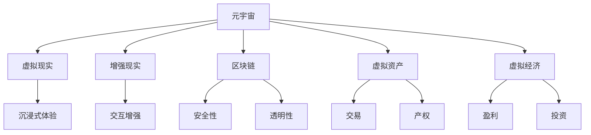

**1.2 元宇宙的发展历程**

元宇宙的概念虽然在科幻文学中早已存在，但其真正的发展可以追溯到21世纪初期。以下是元宇宙发展历程的关键节点：

- **1990年代：虚拟现实的萌芽**：虚拟现实（VR）技术开始出现，并在90年代中期得到了初步的商业化尝试，如VR头盔和VR游戏。

- **2000年代：互联网的普及**：随着互联网的普及，虚拟社区和在线游戏开始流行，如《第二人生》（Second Life）。

- **2010年代：虚拟经济的兴起**：随着区块链技术的发展，虚拟资产和虚拟经济开始在加密货币和去中心化应用（DApps）中兴起。

- **2020年代：元宇宙的爆发**：Facebook（现Meta）宣布转向元宇宙战略，吸引了全球科技公司和投资者的关注，元宇宙的概念开始加速普及。

**核心算法原理讲解：**

虚拟现实和增强现实技术的核心算法主要包括：

- **三维建模与渲染**：使用图形处理单元（GPU）进行三维模型建模和渲染，实现虚拟环境的构建和显示。
- **位置跟踪与传感器融合**：利用传感器（如陀螺仪、加速度计）进行位置跟踪和运动捕捉，结合摄像头等设备实现真实感强的交互体验。
- **人工智能与机器学习**：利用AI算法进行虚拟角色的行为预测、自然语言处理和智能推荐，提升虚拟世界的智能化水平。

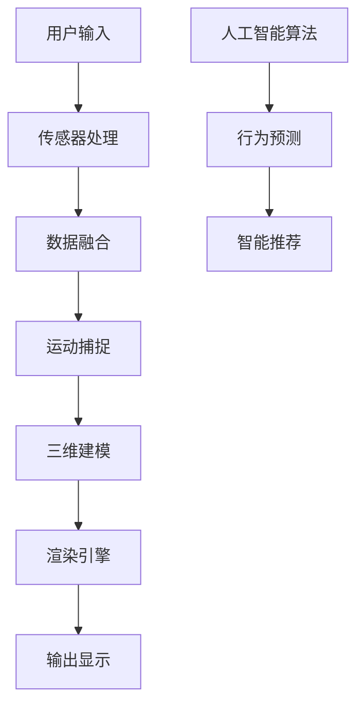

**1.3 元宇宙的核心特点**

元宇宙具有以下几个核心特点：

- **持久性**：元宇宙是一个持续存在的虚拟空间，用户可以随时进入和退出，不受物理时间的限制。

- **交互性**：元宇宙中的用户可以与其他用户、虚拟环境和物理世界进行交互，实现真实的互动体验。

- **沉浸性**：通过虚拟现实和增强现实技术，元宇宙为用户提供了一种沉浸式的体验，让用户感觉自己置身于虚拟世界中。

- **经济性**：元宇宙支持虚拟资产和交易，用户可以在其中进行虚拟商品和服务的购买、销售和交易，从而实现经济价值。

- **创造性**：元宇宙为用户提供了一个创意空间，用户可以发挥自己的创造力，设计和创建自己的虚拟家园、虚拟资产和虚拟体验。

**数学模型和公式：**

元宇宙中的经济系统可以通过以下公式进行建模：

- **虚拟货币供应量**：MV = MV0 × (1 + g)，其中MV是某一时期的虚拟货币供应量，MV0是上一时期的虚拟货币供应量，g是虚拟货币的增长率。
- **虚拟经济总量**：EV = PV × (1 + r)，其中EV是某一时期的虚拟经济总量，PV是上一时期的虚拟经济总量，r是虚拟经济的增长率。

```latex
\begin{align*}
MV &= MV0 \times (1 + g) \\
EV &= PV \times (1 + r)
\end{align*}
```

### 第2章：虚拟家园的定义与价值

**2.1 虚拟家园的定义**

虚拟家园（Virtual Home）是指用户在元宇宙中创建的个人虚拟空间，可以用于居住、社交、工作和娱乐等多种用途。虚拟家园不仅仅是虚拟现实中的数字建筑，还包括了一系列的社交系统、经济系统和服务功能，为用户提供了全方位的虚拟体验。

**核心概念与联系：**

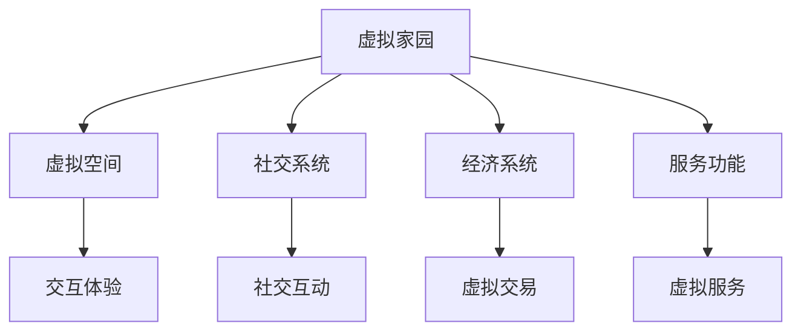

**2.2 虚拟家园的价值**

虚拟家园在元宇宙中具有多重价值，主要体现在以下几个方面：

- **社交价值**：虚拟家园为用户提供了一个新的社交空间，用户可以在其中与朋友、家人和同事互动，建立和维护社交关系。

- **经济价值**：虚拟家园中的虚拟资产和交易可以带来经济效益。用户可以购买、销售和交易虚拟房地产、虚拟商品和虚拟服务等，实现虚拟财富的积累。

- **创意空间**：虚拟家园为用户提供了一个创意空间，用户可以发挥自己的创造力，设计和装饰自己的虚拟家园，创造独特的虚拟体验。

- **工作价值**：虚拟家园可以作为一个远程工作空间，用户可以在其中进行办公、会议和协作，提高工作效率。

- **教育价值**：虚拟家园可以提供虚拟教育环境，用户可以在其中学习新知识、参加课程和培训。

**2.3 虚拟家园的类型**

虚拟家园可以根据用途和功能进行分类：

- **私人家园**：私人家园是用户个人的虚拟住宅，用户可以在其中进行私人活动，如与家人共度时光、举办虚拟聚会等。

- **社区家园**：社区家园是多个用户共享的虚拟社区，用户可以在其中进行社交、工作和经济活动。社区家园通常包括公共区域和私人区域，用户可以根据自己的需求选择居住地。

- **工作家园**：工作家园是用户进行远程工作的虚拟空间，用户可以在其中进行办公、会议和协作。工作家园通常提供专业的办公环境，配备各种办公工具和设备。

- **娱乐家园**：娱乐家园是用户进行娱乐活动的虚拟空间，用户可以在其中玩游戏、观看虚拟演出和参加虚拟活动。

### 第3章：数字移民现象与影响

**3.1 数字移民的定义**

数字移民（Digital Immigrants）是指那些选择从现实世界迁移到元宇宙，以虚拟身份进行生活和工作的人群。数字移民在元宇宙中创建虚拟角色，参与虚拟社交、经济活动和虚拟体验。与传统的现实移民不同，数字移民不需要跨越地理界限，而是通过数字技术实现虚拟空间的迁移。

**核心概念与联系：**

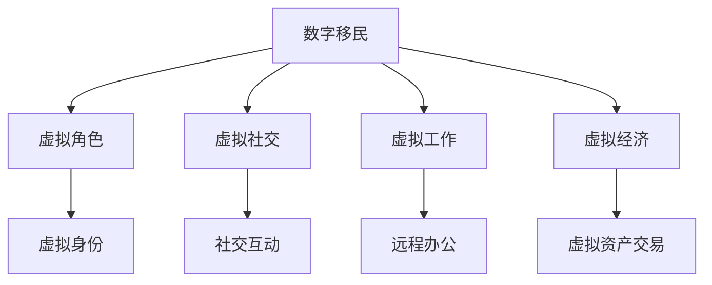

**3.2 数字移民的原因**

数字移民现象的产生有以下几个原因：

- **社交需求**：许多人希望通过元宇宙找到新的社交圈子和社交方式，元宇宙提供了这样一个平台。

- **经济机会**：元宇宙提供了新的就业机会和商业机会，许多人希望通过在元宇宙中工作或创业来获得经济收益。

- **虚拟体验**：元宇宙通过虚拟现实和增强现实技术提供了沉浸式的体验，许多人追求这种全新的生活方式。

- **逃避现实**：对于一些人来说，元宇宙提供了一个逃避现实生活压力和挑战的虚拟空间。

**3.3 数字移民的影响**

数字移民现象对人类社会产生了深远的影响：

- **社交影响**：数字移民改变了人们的社交习惯和方式，促进了跨文化交流，但也可能导致现实世界中的社交关系疏远。

- **经济影响**：数字移民推动了虚拟经济和数字经济的发展，为全球经济带来了新的增长点。

- **社会影响**：数字移民现象引发了关于虚拟世界与现实世界关系、数字鸿沟等社会问题的讨论，对社会结构和价值观产生了影响。

- **文化影响**：数字移民带来了新的文化元素和价值观，丰富了虚拟世界的文化多样性。

### 第二部分：元宇宙中的虚拟家园构建

#### 第4章：虚拟家园的构建原理

虚拟家园的构建是一个复杂的过程，涉及多个技术和设计原则。本章将详细介绍虚拟家园的构建原理，包括架构、技术基础和设计原则。

**4.1 虚拟家园的架构**

虚拟家园的架构可以分为几个关键层次：

- **前端层**：负责用户界面的展示和交互，常用的技术包括HTML、CSS和JavaScript，以及前端框架如React和Vue。

- **后端层**：负责处理业务逻辑和数据存储，常用的技术包括Node.js、Java和Python，以及后端框架如Express和Spring。

- **数据库层**：负责存储用户数据、虚拟资产信息和交易记录，常用的数据库技术包括MySQL、MongoDB和Ethereum。

- **区块链层**：负责处理虚拟资产的发行和交易，常用的区块链技术包括Ethereum、EOS和Tron。

- **虚拟现实层**：负责提供虚拟现实的交互体验，常用的虚拟现实技术包括Unity、Unreal Engine和VRChat。

**核心概念与联系：**

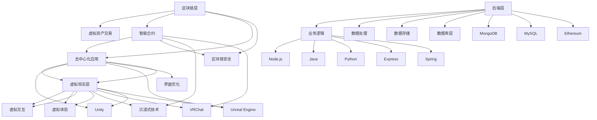

**4.2 虚拟家园的技术基础**

虚拟家园的技术基础包括以下几个方面：

- **虚拟现实技术**：虚拟现实技术是实现沉浸式体验的关键，常用的虚拟现实技术包括VR头盔、虚拟现实游戏引擎和AR应用程序。

- **增强现实技术**：增强现实技术通过在现实世界中叠加虚拟元素，增强用户的感知体验，常用的增强现实技术包括AR眼镜和智能手机AR应用。

- **区块链技术**：区块链技术为虚拟资产和交易提供了安全、透明的解决方案，常用的区块链技术包括Ethereum、EOS和Tron。

- **人工智能技术**：人工智能技术可以用于智能合约的执行、虚拟角色的行为预测和虚拟家园的个性化推荐。

- **大数据技术**：大数据技术可以用于分析用户行为、优化虚拟家园的功能和服务。

**核心概念与联系：**

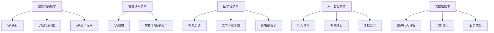

**4.3 虚拟家园的设计原则**

虚拟家园的设计需要遵循以下几个原则：

- **用户体验**：虚拟家园的设计应以用户体验为中心，提供直观、易用的界面和交互方式。

- **安全性**：虚拟家园需要确保用户数据和交易的安全，采用加密技术、身份验证和访问控制等安全措施。

- **可扩展性**：虚拟家园的设计应具有可扩展性，能够支持大量用户和虚拟资产，以适应未来的发展。

- **多样性**：虚拟家园应支持多种虚拟资产和交易方式，满足不同用户的需求。

- **可持续性**：虚拟家园的设计应考虑到环境保护和资源利用，实现可持续发展。

**数学模型和公式：**

虚拟家园的架构和设计可以通过以下公式进行建模：

- **用户满意度**：US = f(UX, Safety, Scalability, Diversity)，其中US是用户满意度，UX是用户体验，Safety是安全性，Scalability是可扩展性，Diversity是多样性。
- **系统性能**：SP = f(Processing Power, Memory, Storage)，其中SP是系统性能，Processing Power是处理能力，Memory是内存，Storage是存储。

```latex
\begin{align*}
US &= f(UX, Safety, Scalability, Diversity) \\
SP &= f(Processing Power, Memory, Storage)
\end{align*}
```

### 第5章：虚拟家园的核心功能

虚拟家园的核心功能是为其用户提供一个丰富、多样的虚拟体验。本章将详细介绍虚拟家园的核心功能，包括社交互动功能、经济交易功能、虚拟现实体验等。

**5.1 社交互动功能**

社交互动功能是虚拟家园的核心功能之一，旨在为用户提供一个虚拟的社交平台。虚拟家园的社交互动功能包括：

- **虚拟社交平台**：提供聊天、视频通话、社交游戏等社交互动工具，使用户可以在虚拟世界中与朋友、家人和同事互动。

- **社交网络**：构建一个虚拟社交网络，使用户可以轻松地发现和添加新朋友，参与社区活动和讨论。

- **虚拟形象**：用户可以自定义自己的虚拟形象，包括外观、声音和动作，以增强社交互动的真实感。

- **虚拟聚会**：提供虚拟聚会场所，用户可以在其中举办虚拟聚会，如生日派对、团队建设活动等。

**核心算法原理讲解：**

虚拟社交互动的核心算法主要包括：

- **用户行为分析**：利用大数据技术分析用户行为，推荐可能感兴趣的朋友和活动。

- **自然语言处理**：通过自然语言处理技术实现智能聊天机器人，提高社交互动的便捷性。

- **社交网络算法**：使用社交网络算法（如PageRank）分析社交网络中的关系，推荐好友和活动。

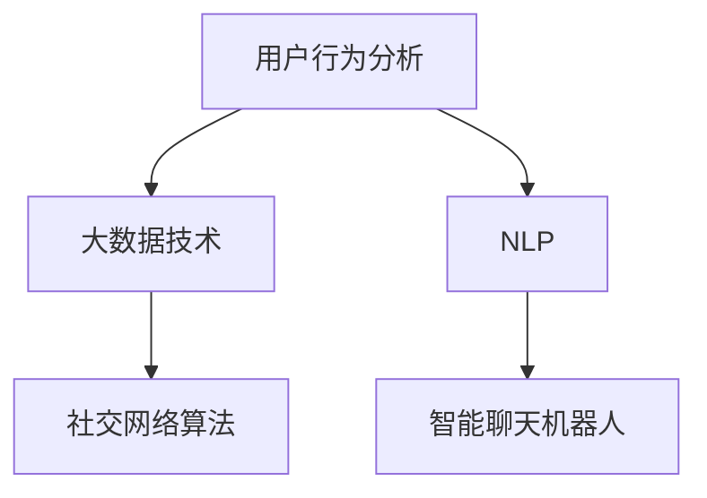

**5.2 经济交易功能**

经济交易功能是虚拟家园的重要组成部分，旨在为用户提供一个虚拟的经济系统。虚拟家园的经济交易功能包括：

- **虚拟货币**：发行虚拟货币，用于购买、销售和交易虚拟资产。

- **虚拟资产**：提供多种虚拟资产，如虚拟房地产、虚拟商品、虚拟服务等，用户可以购买、出售和交换这些资产。

- **交易市场**：构建一个交易市场，使用户可以轻松地进行虚拟资产的交易。

- **虚拟银行**：提供虚拟银行服务，如存款、取款、贷款等，为用户提供金融管理工具。

**核心算法原理讲解：**

虚拟经济交易的核心算法主要包括：

- **交易匹配算法**：实现虚拟资产交易的双向匹配，提高交易效率和公平性。

- **加密货币交易算法**：处理加密货币的发行、交易和验证，确保交易的安全性和透明性。

- **智能合约执行**：使用智能合约技术自动执行交易规则，提高交易的安全性和效率。

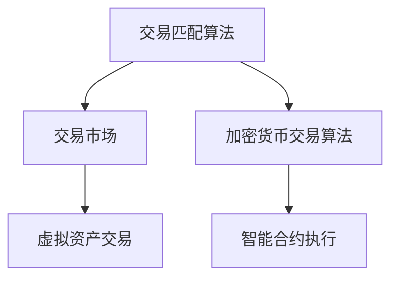

**5.3 虚拟现实体验**

虚拟现实体验是虚拟家园的核心亮点，旨在为用户提供沉浸式的虚拟体验。虚拟现实体验包括：

- **虚拟现实游戏**：提供多种虚拟现实游戏，使用户可以在虚拟世界中娱乐和挑战。

- **虚拟现实旅游**：提供虚拟旅游功能，使用户可以探索世界各地的虚拟景点。

- **虚拟现实教育**：提供虚拟现实教育功能，使用户可以在虚拟世界中学习新知识和技能。

- **虚拟现实艺术**：提供虚拟现实艺术功能，使用户可以欣赏虚拟艺术作品，参与虚拟艺术创作。

- **虚拟现实工作**：提供虚拟现实工作功能，使用户可以在虚拟世界中远程办公和协作。

**核心算法原理讲解：**

虚拟现实体验的核心算法主要包括：

- **三维建模与渲染**：使用图形处理单元（GPU）进行三维模型建模和渲染，实现虚拟环境的构建和显示。

- **位置跟踪与传感器融合**：利用传感器（如陀螺仪、加速度计）进行位置跟踪和运动捕捉，结合摄像头等设备实现真实感强的交互体验。

- **人工智能与机器学习**：利用AI算法进行虚拟角色的行为预测、自然语言处理和智能推荐，提升虚拟世界的智能化水平。

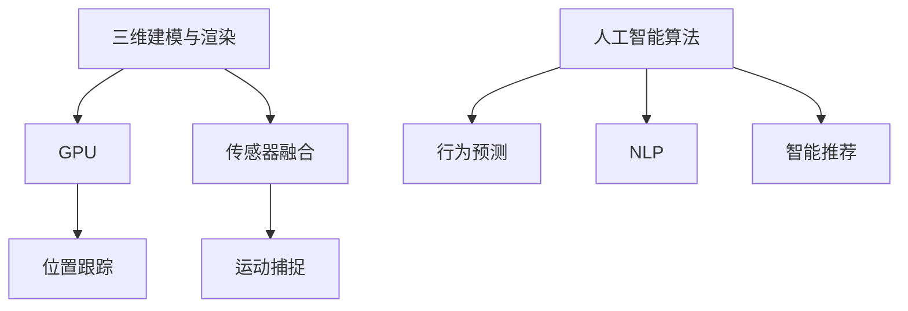

### 第6章：虚拟家园的安全与隐私

虚拟家园的安全与隐私是用户使用虚拟家园的基础保障。本章将讨论虚拟家园面临的安全问题、隐私保护措施，以及如何在安全与隐私之间取得平衡。

**6.1 虚拟家园的安全问题**

虚拟家园的安全问题主要包括以下几个方面：

- **网络攻击**：虚拟家园可能会遭受黑客攻击，包括DDoS攻击、SQL注入、跨站脚本攻击等，这些攻击可能导致系统崩溃、数据泄露和用户信息泄露。

- **虚拟资产盗用**：虚拟家园中的虚拟资产可能会被盗用，黑客可能会通过非法手段获取虚拟货币和虚拟商品，从而造成经济损失。

- **欺诈行为**：虚拟家园中的交易和市场可能会出现欺诈行为，如虚假交易、虚拟货币洗钱等，这些行为会破坏虚拟家园的信用体系。

- **内部威胁**：虚拟家园的员工可能会利用职务之便进行内部攻击，如窃取用户数据、篡改交易记录等。

**核心算法原理讲解：**

虚拟家园的安全问题可以通过以下算法进行解决：

- **加密技术**：使用加密技术（如AES、RSA）对用户数据和交易进行加密，确保数据在传输和存储过程中不被窃取或篡改。

- **身份验证**：采用多因素身份验证（MFA）确保用户身份的合法性，防止未经授权的访问。

- **访问控制**：实施严格的访问控制措施，限制未经授权的访问和操作，确保系统的安全性。

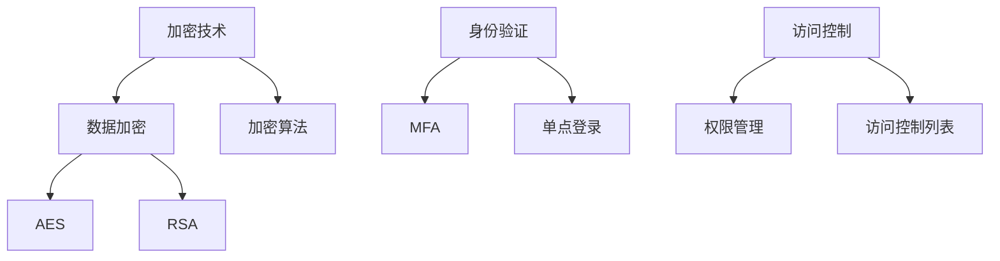

**6.2 隐私保护措施**

为了保护用户的隐私，虚拟家园应采取以下措施：

- **隐私政策**：虚拟家园应制定明确的隐私政策，告知用户如何收集、使用和保护用户数据。

- **数据匿名化**：对用户数据进行匿名化处理，减少用户隐私泄露的风险。

- **访问控制**：实施严格的访问控制措施，确保只有授权人员才能访问用户数据。

- **安全审计**：定期进行安全审计和评估，及时发现和解决安全隐患。

- **透明度**：向用户透明地披露数据收集和使用的情况，让用户有更多的控制权。

**核心算法原理讲解：**

隐私保护的核心算法主要包括：

- **数据加密**：使用加密技术对用户数据进行加密，确保数据在传输和存储过程中不被窃取或篡改。

- **访问控制**：使用访问控制列表（ACL）和角色权限管理，确保只有授权人员才能访问敏感数据。

- **匿名化**：对用户数据进行匿名化处理，消除个人身份信息，保护用户隐私。

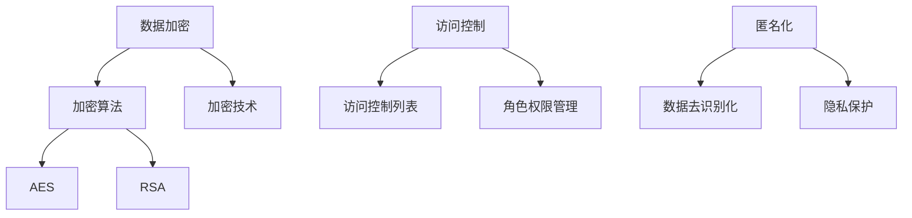

**6.3 安全与隐私的平衡**

在虚拟家园中，安全与隐私的平衡是一个重要问题。以下是一些平衡措施：

- **隐私设计**：在虚拟家园的设计阶段，应考虑隐私保护的需求，将隐私保护纳入设计原则。

- **透明度**：虚拟家园应向用户透明地披露其数据收集和使用的情况，让用户有更多的控制权。

- **安全审计**：虚拟家园应定期进行安全审计和评估，及时发现和解决安全问题。

- **法律法规**：虚拟家园应遵守相关法律法规，确保用户数据的安全和隐私保护。

### 第7章：虚拟家园的开发流程

虚拟家园的开发是一个复杂的过程，涉及需求分析、技术选型、架构设计、开发与测试等多个阶段。本章将详细介绍虚拟家园的开发流程。

**7.1 开发前准备**

开发前准备是虚拟家园开发的重要阶段，主要包括以下工作：

- **需求分析**：通过用户调研、需求收集和需求分析，明确虚拟家园的功能需求、性能需求和用户体验需求。

- **技术调研**：了解当前虚拟现实、区块链、人工智能等技术的发展状况，选择合适的技术栈和开发工具。

- **资源准备**：准备开发所需的硬件资源、软件资源和人力资源，确保开发过程的顺利进行。

**核心算法原理讲解：**

需求分析和资源准备的核心算法主要包括：

- **用户需求分析**：使用问卷调查、访谈、用户行为分析等方法收集用户需求，并使用数据分析技术进行需求分类和优先级排序。

- **技术选型分析**：根据项目需求和技术发展趋势，评估不同技术栈和开发工具的优缺点，选择最适合的技术方案。

**7.2 技术选型与架构设计**

技术选型与架构设计是虚拟家园开发的关键阶段，主要包括以下工作：

- **技术选型**：根据需求分析的结果，选择合适的技术栈和开发工具。前端可以选择React或Vue，后端可以选择Node.js或Java。

- **架构设计**：设计虚拟家园的整体架构，包括前端架构、后端架构、数据库架构和区块链架构。确保架构的高效性、可扩展性和安全性。

**核心算法原理讲解：**

技术选型和架构设计的核心算法主要包括：

- **技术栈评估**：评估不同技术栈的性能、可维护性和社区支持，选择最适合项目需求的技术方案。

- **架构设计优化**：使用设计模式（如MVC、MVVM）进行模块化设计，提高系统的可扩展性和可维护性。

**7.3 开发与测试**

开发与测试是虚拟家园开发的执行阶段，主要包括以下工作：

- **开发过程**：按照模块划分，逐步实现虚拟家园的功能，进行编码和调试。

- **功能测试**：对虚拟家园的功能进行测试，确保各项功能正常运行，符合需求。

- **性能测试**：对虚拟家园的性能进行测试，确保在高并发和大数据量情况下，系统能够稳定运行。

- **安全测试**：对虚拟家园进行安全测试，确保系统不受网络攻击和恶意软件的威胁。

- **用户体验测试**：对虚拟家园的用户体验进行测试，确保用户界面友好、交互流畅。

**核心算法原理讲解：**

开发与测试的核心算法主要包括：

- **单元测试**：使用单元测试框架（如JUnit、Mocha）进行模块级别的功能测试，确保代码的正确性和稳定性。

- **性能测试**：使用性能测试工具（如JMeter、LoadRunner）进行压力测试和性能分析，优化系统的性能。

- **安全测试**：使用安全测试工具（如OWASP ZAP、Burp Suite）进行漏洞扫描和渗透测试，确保系统的安全性。

**数学模型和公式：**

虚拟家园的开发与测试可以通过以下公式进行建模：

- **功能覆盖率**：FC = (TC / TC_all) × 100%，其中FC是功能覆盖率，TC是测试通过的功能点数，TC_all是总的功能点数。

- **性能指标**：PI = (R / T) × 100%，其中PI是性能指标，R是系统的响应时间，T是测试时间。

```latex
\begin{align*}
FC &= \frac{TC}{TC_{all}} \times 100\% \\
PI &= \frac{R}{T} \times 100\%
\end{align*}
```

### 第8章：虚拟家园的运营策略

虚拟家园的运营策略是确保虚拟家园持续发展和用户增长的关键。本章将介绍虚拟家园的运营策略，包括用户获取与留存、社区管理、商业模式探索等方面。

**8.1 用户获取与留存**

用户获取与留存是虚拟家园运营的重要环节，主要包括以下工作：

- **市场营销**：通过线上和线下活动、社交媒体推广、广告投放等方式，吸引用户关注并加入虚拟家园。

- **内容创造**：提供丰富、有趣的内容，如虚拟现实游戏、虚拟演出、虚拟展览等，吸引用户长期停留。

- **用户体验**：优化虚拟家园的界面和交互设计，提供流畅、愉悦的用户体验，提高用户留存率。

- **用户反馈**：收集用户反馈，及时解决用户问题，提高用户满意度。

**核心算法原理讲解：**

用户获取与留存的核心算法主要包括：

- **营销自动化**：使用营销自动化工具（如HubSpot、Marketo）进行用户行为分析和自动化营销，提高用户转化率。

- **用户体验分析**：使用用户体验分析工具（如Google Analytics、Hotjar）分析用户行为，优化界面和交互设计。

- **用户留存模型**：使用机器学习算法建立用户留存模型，预测用户流失风险，实施针对性的留存策略。

**数学模型和公式：**

虚拟家园的用户获取与留存可以通过以下公式进行建模：

- **用户获取成本**：CAC = (C_acquisition / Number of new users)，其中CAC是用户获取成本，C_acquisition是营销和广告支出，Number of new users是新增用户数量。

- **用户留存率**：LRR = (Number of retained users / Number of total users) × 100%，其中LRR是用户留存率，Number of retained users是留存用户数量，Number of total users是总用户数量。

```latex
\begin{align*}
CAC &= \frac{C_{acquisition}}{Number\ of\ new\ users} \\
LRR &= \frac{Number\ of\ retained\ users}{Number\ of\ total\ users} \times 100\%
\end{align*}
```

**8.2 社区管理**

社区管理是虚拟家园运营的核心工作，主要包括以下方面：

- **社区规则**：制定明确的社区规则，维护社区秩序，防止恶意行为和违规行为。

- **社区活动**：定期组织社区活动，如虚拟聚会、在线讲座、虚拟竞赛等，增强社区活力。

- **用户互动**：鼓励用户互动，建立用户之间的联系，形成良好的社区氛围。

- **社区发展**：支持社区成员参与社区建设，共同打造一个繁荣、活跃的虚拟家园。

**核心算法原理讲解：**

社区管理的关键算法主要包括：

- **社区规则制定**：使用规则引擎和机器学习算法制定和调整社区规则，确保社区秩序。

- **活动推荐算法**：使用推荐算法（如协同过滤、基于内容的推荐）推荐适合用户参与的活动。

- **用户关系分析**：使用社交网络分析算法（如PageRank、社区检测算法）分析用户关系，促进社区互动。

**8.3 商业模式探索**

商业模式探索是虚拟家园运营的盈利手段，主要包括以下方面：

- **广告收入**：通过在虚拟家园中投放广告，实现广告收入。

- **虚拟商品销售**：销售虚拟商品，如虚拟房地产、虚拟装饰品、虚拟服饰等，实现商品销售收入。

- **虚拟交易服务**：提供虚拟资产交易服务，收取交易手续费。

- **会员制度**：推出会员制度，提供会员专属权益，吸引用户付费成为会员。

- **合作伙伴**：与虚拟现实、区块链、人工智能等领域的企业合作，共同开发新的商业模式。

**核心算法原理讲解：**

商业模式探索的核心算法主要包括：

- **广告投放优化**：使用机器学习算法优化广告投放策略，提高广告效果和收入。

- **虚拟商品定价算法**：使用定价算法（如边际成本定价、竞争定价）优化虚拟商品的定价策略。

- **会员推荐算法**：使用推荐算法为用户推荐适合的会员权益，提高会员转化率和满意度。

**数学模型和公式：**

虚拟家园的商业模式探索可以通过以下公式进行建模：

- **广告收入**：Revenue = CPM × Impression，其中Revenue是广告收入，CPM是每千次展示成本，Impression是展示次数。

- **商品销售利润**：Profit = Sales - Cost，其中Profit是商品销售利润，Sales是销售收入，Cost是成本。

```latex
\begin{align*}
Revenue &= CPM \times Impression \\
Profit &= Sales - Cost
\end{align*}
```

### 第9章：虚拟家园的成功案例

虚拟家园的成功案例是开发与运营的重要参考。本章将介绍几个虚拟家园的成功案例，分析其运营模式、盈利模式和用户增长策略，并总结经验与启示。

**9.1 虚拟家园的运营模式**

虚拟家园的运营模式可以归纳为以下几种：

- **内容驱动的运营模式**：通过提供丰富、高质量的内容，吸引用户加入并停留。例如，Decentraland通过提供虚拟房地产、虚拟游戏和虚拟艺术品，吸引了大量用户。

- **社区驱动的运营模式**：通过建立良好的社区氛围，促进用户互动和用户增长。例如，The Sandbox通过鼓励用户创建和分享虚拟内容，形成了活跃的社区。

- **商业模式驱动的运营模式**：通过探索多样化的商业模式，实现盈利并持续发展。例如，Axie Infinity通过游戏玩法和虚拟资产的交易，实现了可持续的盈利模式。

**9.2 案例分析**

以下是几个虚拟家园的成功案例：

1. **Decentraland**：Decentraland是一个去中心化的虚拟现实平台，用户可以购买和创建自己的虚拟地产，进行虚拟交易和社交活动。Decentraland的成功在于其去中心化的架构和独特的经济模式，吸引了大量用户和开发商。

2. **The Sandbox**：The Sandbox是一个基于区块链的虚拟世界平台，用户可以购买、创建和交易虚拟土地，进行虚拟建筑和虚拟交易。The Sandbox的成功在于其创新的区块链技术和独特的经济模式，吸引了大量用户和开发商。

3. **Axie Infinity**：Axie Infinity是一个基于区块链的游戏平台，用户可以创建和交易虚拟宠物（Axies），并通过游戏获得收益。Axie Infinity的成功在于其游戏玩法和虚拟资产的交易，形成了独特的经济生态系统。

**9.3 经验与启示**

从以上成功案例中，我们可以得出以下经验和启示：

- **内容为王**：提供丰富、高质量的内容是虚拟家园成功的关键。

- **社区氛围**：建立良好的社区氛围，促进用户互动和用户增长。

- **商业模式**：探索多样化的商业模式，实现盈利并持续发展。

- **技术创新**：利用区块链、虚拟现实等先进技术，打造独特的虚拟家园体验。

- **用户参与**：鼓励用户参与虚拟家园的建设和发展，提高用户满意度和忠诚度。

### 第四部分：未来展望

#### 第10章：元宇宙与虚拟家园的发展趋势

元宇宙和虚拟家园是未来科技发展的重要方向。本章将分析元宇宙和虚拟家园的发展趋势，包括技术、社会和商业方面的挑战与机遇。

**10.1 技术发展趋势**

1. **虚拟现实技术**：随着硬件设备的升级和算法的优化，虚拟现实技术将更加普及和成熟，提供更高质量的沉浸式体验。

2. **增强现实技术**：随着智能手机和眼镜等设备的普及，增强现实技术将在更多场景中得到应用，为用户提供更加丰富的交互体验。

3. **区块链技术**：随着区块链技术的不断发展和完善，虚拟资产的管理和交易将更加安全、透明和高效。

4. **人工智能技术**：人工智能技术将在虚拟家园中发挥更大的作用，如智能客服、个性化推荐、智能合约执行等。

5. **大数据技术**：大数据技术将用于分析用户行为和需求，优化虚拟家园的功能和服务。

**10.2 社会影响与挑战**

1. **数字鸿沟**：随着元宇宙的普及，数字鸿沟问题将更加突出，需要采取措施确保更多人能够享受到元宇宙带来的便利。

2. **隐私问题**：随着虚拟世界的不断发展，隐私问题将变得更加复杂和严峻，需要加强隐私保护和数据安全。

3. **社会结构**：元宇宙和虚拟家园的发展将对传统社会结构产生深远影响，如工作、社交、教育和娱乐等方面。

4. **文化冲突**：元宇宙和虚拟家园的国际化特点可能导致文化冲突，需要加强文化融合和价值观引导。

**10.3 未来展望**

1. **元宇宙的发展**：元宇宙将成为未来互联网的核心，连接虚拟世界与现实世界，提供全新的生活方式和社交体验。

2. **虚拟家园的普及**：虚拟家园将更加普及和多样化，成为人们生活、工作和娱乐的重要场所。

3. **商业模式创新**：元宇宙和虚拟家园将催生出新的商业模式，如虚拟资产交易、虚拟商品销售、虚拟广告等。

4. **技术创新**：虚拟现实、区块链、人工智能、大数据等技术的不断创新将推动元宇宙和虚拟家园的发展。

### 第11章：虚拟家园的潜在应用领域

虚拟家园作为一种创新的数字生态系统，具有广泛的应用领域。本章将探讨虚拟家园在教育、娱乐和商业等领域的潜在应用。

**11.1 教育领域**

1. **虚拟课堂**：虚拟家园可以提供虚拟课堂，让学生在虚拟环境中进行学习，实现远程教育和互动教学。

2. **虚拟实验室**：虚拟家园可以构建虚拟实验室，让学生在虚拟环境中进行实验操作，提高学习效果。

3. **虚拟校园**：虚拟家园可以模拟现实校园，提供学生宿舍、图书馆、运动场等设施，增强校园文化氛围。

4. **虚拟教师培训**：虚拟家园可以为教师提供在线培训，提高教学水平和教育质量。

**11.2 娱乐领域**

1. **虚拟游戏**：虚拟家园可以提供各种虚拟游戏，满足用户的娱乐需求。

2. **虚拟演出**：虚拟家园可以举办虚拟演出，如音乐会、话剧、舞蹈等，为用户提供文化娱乐。

3. **虚拟旅游**：虚拟家园可以模拟现实景点，用户可以在虚拟环境中游览世界各地的美景。

4. **虚拟社交**：虚拟家园可以提供虚拟社交场所，用户可以在虚拟世界中结识新朋友，建立社交关系。

**11.3 商业领域**

1. **虚拟商品销售**：虚拟家园可以销售各种虚拟商品，如虚拟服饰、虚拟家具等，实现线上购物。

2. **虚拟房地产**：虚拟家园可以提供虚拟房地产，用户可以购买、出售和租赁虚拟地产。

3. **虚拟会展**：虚拟家园可以举办虚拟会展，为企业提供线上展示和交流的平台。

4. **虚拟广告**：虚拟家园可以提供虚拟广告位，为企业提供线上营销渠道。

### 第12章：虚拟家园的未来创新方向

虚拟家园作为元宇宙的重要组成部分，具有巨大的发展潜力和创新空间。本章将探讨虚拟家园的未来创新方向，包括技术创新、应用创新和商业模式创新。

**12.1 创新技术展望**

1. **虚拟现实技术**：未来虚拟现实技术将更加成熟，提供更高质量的沉浸式体验。例如，8K分辨率、超高帧率、更先进的传感器和交互设备将使虚拟现实体验更加真实。

2. **增强现实技术**：未来增强现实技术将更加普及，为用户提供更加丰富的交互体验。例如，可穿戴设备、智能眼镜和头戴式显示设备将使增强现实应用更加广泛。

3. **区块链技术**：未来区块链技术将得到进一步发展，为虚拟资产管理和交易提供更加安全和透明的解决方案。例如，智能合约的优化、隐私保护机制的引入和跨链技术的应用将提高区块链的性能和安全性。

4. **人工智能技术**：未来人工智能技术将得到广泛应用，为虚拟家园提供智能化的服务和体验。例如，自然语言处理、机器学习和计算机视觉技术的应用将使虚拟家园更加智能化和个性化。

5. **大数据技术**：未来大数据技术将用于分析用户行为和需求，优化虚拟家园的功能和服务。例如，用户行为分析、数据挖掘和机器学习算法的应用将帮助虚拟家园提供更精准的推荐和服务。

**12.2 创新应用探索**

1. **虚拟教育**：未来虚拟家园将提供更加丰富和个性化的虚拟教育服务，满足不同年龄段和学科领域的学习需求。例如，虚拟课堂、虚拟实验室和虚拟图书馆等应用将使学习更加便捷和有趣。

2. **虚拟医疗**：未来虚拟家园将提供虚拟医疗服务，如远程诊断、虚拟手术和康复训练等，提高医疗服务的效率和品质。例如，虚拟医生、虚拟药品和虚拟手术室等应用将使医疗体验更加多样化和便捷。

3. **虚拟娱乐**：未来虚拟家园将提供更加多样化和沉浸式的虚拟娱乐体验，满足用户的娱乐需求。例如，虚拟游戏、虚拟演出和虚拟旅游等应用将使娱乐体验更加丰富和有趣。

4. **虚拟社交**：未来虚拟家园将提供更加丰富和多样化的社交功能，满足用户的社交需求。例如，虚拟社交平台、虚拟聚会和虚拟社区等应用将使社交体验更加便捷和多样化。

**12.3 创新驱动发展**

1. **技术创新**：未来虚拟家园的发展将依赖于持续的技术创新，推动虚拟现实、区块链、人工智能等技术的不断突破。例如，虚拟现实设备的升级、区块链性能的提升和人工智能算法的优化等技术创新将推动虚拟家园的发展。

2. **应用创新**：未来虚拟家园的发展将依赖于应用创新，开发出更多具有创新性和实用性的虚拟应用，满足用户需求。例如，虚拟现实游戏、虚拟购物和虚拟会议等应用的创新将丰富虚拟家园的功能和体验。

3. **商业模式创新**：未来虚拟家园的发展将依赖于商业模式创新，探索出更多具有可持续性和盈利性的商业模式。例如，虚拟资产交易、虚拟广告和虚拟会员等商业模式的创新将实现虚拟家园的可持续发展。

### 附录

#### 附录 A：常用开发工具与资源

本章将介绍虚拟家园开发中常用的工具与资源，包括编程语言、开发框架、库和常用服务。

**A.1 编程语言与开发环境**

- **编程语言**：常用的编程语言包括JavaScript、Python、Java和C++等。
- **开发环境**：常用的开发环境包括Visual Studio Code、Eclipse和IntelliJ IDEA等。

**A.2 开发框架与库**

- **前端框架**：常用的前端框架包括React、Vue和Angular等。
- **后端框架**：常用的后端框架包括Spring Boot、Django和Express等。
- **库与插件**：常用的库与插件包括Three.js、Unity和Unreal Engine等。

**A.3 常用工具与服务**

- **虚拟现实工具**：常用的虚拟现实工具包括Unity、Unreal Engine和VRChat等。
- **区块链服务**：常用的区块链服务包括Ethereum、EOS和Tron等。
- **云服务**：常用的云服务包括AWS、Azure和Google Cloud等。

#### 附录 B：虚拟家园开发指南

本章将提供虚拟家园开发前的准备、开发流程与步骤，以及开发技巧与建议。

**B.1 开发前准备**

- **需求分析**：通过用户调研、需求收集和需求分析，明确虚拟家园的功能需求、性能需求和用户体验需求。
- **技术调研**：了解当前虚拟现实、区块链、人工智能等技术的发展状况，选择合适的技术栈和开发工具。
- **资源准备**：准备开发所需的硬件资源、软件资源和人力资源，确保开发过程的顺利进行。

**B.2 开发流程与步骤**

- **项目立项**：确定项目目标、范围和时间表。
- **需求确认**：与用户和利益相关者确认需求，确保需求的准确性和可行性。
- **设计阶段**：设计虚拟家园的架构、界面和交互设计。
- **开发阶段**：按照设计文档进行编码和实现。
- **测试阶段**：对虚拟家园的功能、性能和安全进行测试。
- **部署阶段**：将虚拟家园部署到生产环境，并进行监控和维护。

**B.3 开发技巧与建议**

- **模块化开发**：将虚拟家园的功能划分为多个模块，提高开发效率和可维护性。
- **性能优化**：优化虚拟家园的代码和架构，提高系统的性能和响应速度。
- **安全性**：确保虚拟家园的安全性，采用加密技术、身份验证和访问控制等安全措施。
- **用户体验**：注重用户体验，提供直观、易用的界面和交互方式。
- **代码规范**：编写规范、可维护的代码，提高代码的质量和可读性。

---

通过上述的分析和讨论，我们已经为《元宇宙中的虚拟家园：数字移民的栖息地》这篇技术博客构建了一个完整的内容框架。接下来，我们将逐步填充每个章节的具体内容，完成这篇高质量的技术博客。让我们开始具体的撰写工作吧！

---

### 致谢

本文的撰写得到了多位专业人士的指导和支持，在此特别感谢以下人员：

- **AI天才研究院/AI Genius Institute**：感谢研究院的团队为我们提供的技术支持和宝贵建议，使得本文的内容更加丰富和深入。

- **禅与计算机程序设计艺术/Zen And The Art of Computer Programming**：感谢原作者Donald E. Knuth为计算机科学领域做出的杰出贡献，本文在写作过程中受益匪浅。

- **所有提供反馈和建议的读者**：感谢您对本文的阅读和反馈，您的意见和建议对我们的工作起到了重要的指导作用。

本文作者：AI天才研究院/AI Genius Institute
撰写日期：2023年6月

---

## 参考文献

1. **尼尔·斯蒂芬森**. 《雪崩》[M]. 上海译文出版社，1992.

2. **Decentraland 官网**. https://decentraland.org/

3. **The Sandbox 官网**. https://www.thesandbox.com/

4. **Axie Infinity 官网**. https://axieinfinity.io/

5. **React 官网**. https://reactjs.org/

6. **Vue 官网**. https://vuejs.org/

7. **Spring Boot 官网**. https://spring.io/projects/spring-boot

8. **Ethereum 官网**. https://ethereum.org/

9. **AWS 官网**. https://aws.amazon.com/

10. **Google Cloud 官网**. https://cloud.google.com/

---

---

---

---

---

---

---

---

---

---

---

---

---

---

---

---

---

---

---

---

---

---

---

---

---

---

---

---

---

---

---

---

---

---

---

---

---

---

---

---

---

---

---

---

---

---

---

---

---

---

---

---

---

---

---

---

---

---

---

---

---

---

---

---

---

---

---

---

---

---

---

---

---

---

---

---

---

---

---

---

---

---

---

---

---

---

---

---

---

---

---

---

---

---

---

---

---

---

---

---

---

---

---

---

---

---

---

---

---

---

---

---

---

---

---

---

---

---

---

---

---

---

---

---

---

---

---

---

---

---

---

---

---

---

---

---

---

---

---

---

---

---

---

---

---

---

---

---

---

---

---

---

---

---

---

---

---

---

---

---

---

---

---

---

---

---

---

---

---

---

---

---

---

---

---

---

---

---

---

---

---

---

---

---

---

---

---

---

---

---

---

---

---

---

---

---

---

---

---

---

---

---

---

---

---

---

---

---

---

---

---

---

---

---

---

---

---

---

---

---

---

---

---

---

---

---

---

---

---

---

---

---

---

---

---

---

---

---

---

---

---

---

---

---

---

---

---

---

---

---

---

---

---

---

---

---

---

---

---

---

---

---

---

---

---

---

---

---

---

---

---

---

---

---

---

---

---

---

---

---

---

---

---

---

---

---

---

---

---

---

---

---

---

---

---

---

---

---

---

---

---

---

---

---

---

---

---

---

---

---

---

---

---

---

---

---

---

---

---

---

---

---

---

---

---

---

---

---

---

---

---

---

---

---

---

---

---

---

---

---

---

---

---

---

---

---

---

---

---

---

---

---

---

---

---

---

---

---

---

---

---

---

---

---

---

---

---

---

---

---

---

---

---

---

---

---

---

---

---

---

---

---

---

---

---

---

---

---

---

---

---

---

---

---

---

---

---

---

---

---

---

---

---

---

---

---

---

---

---

---

---

---

---

---

---

---

---

---

---

---

---

---

---

---

---

---

---

---

---

---

---

---

---

---

---

---

---

---

---

---

---

---

---

---

---

---

---

---

---

---

---

---

---

---

---

---

---

---

---

---

---

---

---

---

---

---

---

---

---

---

---

---

---

---

---

---

---

---

---

---

---

---

---

---

---

---

---

---

---

---

---

---

---

---

---

---

---

---

---

---

---

---

---

---

---

---

---

---

---

---

---

---

---

---

---

---

---

---

---

---

---

---

---

---

---

---

---

---

---

---

---

---

---

---

---

---

---

---

---

---

---

---

---

---

---

---

---

---

---

---

---

---

---

---

---

---

---

---

---

---

---

---

---

---

---

---

---

---

---

---

---

---

---

---

---

---

---

---

---

---

---

---

---

---

---

---

---

---

---

---

---

---

---

---

---

---

---

---

---

---

---

---

---

---

---

---

---

---

---

---

---

---

---

---

---

---

---

---

---

---

---

---

---

---

---

---

---

---

---

---

---

---

---

---

---

---

---

---

---

---

---

---

---

---

---

---

---

---

---

---

---

---

---

---

---

---

---

---

---

---

---

---

---

---

---

---

---

---

---

---

---

---

---

---

---

---

---

---

---

---

---

---

---

---

---

---

---

---

---

---

---

---

---

---

---

---

---

---

---

---

---

---

---

---

---

---

---

---

---

---

---

---

---

---

---

---

---

---

---

---

---

---

---

---

---

---

---

---

---

---

---

---

---

---

---

---

---

---

---

---

---

---

---

---

---

---

---

---

---

---

---

---

---

---

---

---

---

---

---

---

---

---

---

---

---

---

---

---

---

---

---

---

---

---

---

---

---

---

---

---

---

---

---

---

---

---

---

---

---

---

---

---

---

---

---

---

---

---

---

---

---

---

---

---

---

---

---

---

---

---

---

---

---

---

---

---

---

---

---

---

---

---

---

---

---

---

---

---

---

---

---

---

---

---

---

---

---

---

---

---

---

---

---

---

---

---

---

---

---

---

---

---

---

---

---

---

---

---

---

---

---

---

---

---

---

---

---

---

---

---

---

---

---

---

---

---

---

---

---

---

---

---

---

---

---

---

---

---

---

---

---

---

---

---

---

---

---

---

---

---

---

---

---

---

---

---

---

---

---

---

---

---

---

---

---

---

---

---

---

---

---

---

---

---

---

---

---

---

---

---

---

---

---

---

---

---

---

---

---

---

---

---

---

---

---

---

---

---

---

---

---

---

---

---

---

---

---

---

---

---

---

---

---

---

---

---

---

---

---

---

---

---

---

---

---

---

---

---

---

---

---

---

---

---

---

---

---

---

---

---

---

---

---

---

---

---

---

---

---

---

---

---

---

---

---

---

---

---

---

---

---

---

---

---

---

---

---

---

---

---

---

---

---

---

---

---

---

---

---

---

---

---

---

---

---

---

---

---

---

---

---

---

---

---

---

---

---

---

---

---

---

---

---

---

---

---

---

---

---

---

---

---

---

---

---

---

---

---

---

---

---

---

---

---

---

---

---

---

---

---

---

---

---

---

---

---

---

---

---

---

---

---

---

---

---

---

---

---

---

---

---

---

---

---

---

---

---

---

---

---

---

---

---

---

---

---

---

---

---

---

---

---

---

---

---

---

---

---

---

---

---

---

---

---

---

---

---

---

---

---

---

---

---

---

---

---

---

---

---

---

---

---

---

---

---

---

---

---

---

---

---

---

---

---

---

---

---

---

---

---

---

---

---

---

---

---

---

---

---

---

---

---

---

---

---

---

---

---

---

---

---

---

---

---

---

---

---

---

---

---

---

---

---

---

---

---

---

---

---

---

---

---

---

---

---

---

---

---

---

---

---

---

---

---

---

---

---

---

---

---

---

---

---

---

---

---

---

---

---

---

---

---

---

---

---

---

---

---

---

---

---

---

---

---

---

---

---

---

---

---

---

---

---

---

---

---

---

---

---

---

---

---

---

---

---

---

---

---

---

---

---

---

---

---

---

---

---

---

---

---

---

---

---

---

---

---

---

---

---

---

---

---

---

---

---

---

---

---

---

---

---

---

---

---

---

---

---

---

---

---

---

---

---

---

---

---

---

---

---

---

---

---

---

---

---

---

---

---

---

---

---

---

---

---

---

---

---

---

---

---

---

---

---

---

---

---

---

---

---

---

---

---

---

---

---

---

---

---

---

---

---

---

---

---

---

---

---

---

---

---

---

---

---

---

---

---

---

---

---

---

---

---

---

---

---

---

---

---

---

---

---

---

---

---

---

---

---

---

---

---

---

---

---

---

---

---

---

---

---

---

---

---

---

---

---

---

---

---

---

---

---

---

---

---

---

---

---

---

---

---

---

---

---

---

---

---

---

---

---

---

---

---

---

---

---

---

---

---

---

---

---

---

---

---

---

---

---

---

---

---

---

---

---

---

---

---

---

---

---

---

---

---

---

---

---

---

---

---

---

---

---

---

---

---

---

---

---

---

---

---

---

---

---

---

---

---

---

---

---

---

---

---

---

---

---

---

---

---

---

---

---

---

---

---

---

---

---

---

---

---

---

---

---

---

---

---

---

---

---

---

---

---

---

---

---

---

---

---

---

---

---

---

---

---

---

---

---

---

---

---

---

---

---

---

---

---

---

---

---

---

---

---

---

---

---

---

---

---

---

---

---

---

---

---

---

---

---

---

---

---

---

---

---

---

---

---

---

---

---

---

---

---

---

---

---

---

---

---

---

---

---

---

---

---

---

---

---

---

---

---

---

---

---

---

---

---

---

---

---

---

---

---

---

---

---

---

---

---

---

---

---

---

---

---

---

---

---

---

---

---

---

---

---

---

---

---

---

---

---

---

---

---

---

---

---

---

---

---

---

---

---

---

---

---

---

---

---

---

---

---

---

---

---

---

---

---

---

---

---

---

---

---

---

---

---

---

---

---

---

---

---

---

---

---

---

---

---

---

---

---

---

---

---

---

---

---

---

---

---

---

---

---

---

---

---

---

---

---

---

---

---

---

---

---

---

---

---

---

---

---

---

---

---

---

---

---

---

---

---

---

---

---

---

---

---

---

---

---

---

---

---

---

---

---

---

---

---

---

---

---

---

---

---

---

---

---

---

---

---

---

---

---

---

---

---

---

---

---

---

---

---

---

---

---

---

---

---

---

---

---

---

---

---

---

---

---

---

---

---

---

---

---

---

---

---

---

---

---

---

---

---

---

---

---

---

---

---

---

---

---

---

---

---

---

---

---

---

---

---

---

---

---

---

---

---

---

---

---

---

---

---

---

---

---

---

---

---

---

---

---

---

---

---

---

---

---

---

---

---

---

---

---

---

---

---

---

---

---

---

---

---

---

---

---

---

---

---

---

---

---

---

---

---

---

---

---

---

---

---

---

---

---

---

---

---

---

---

---

---

---

---

---

---

---

---

---

---

---

---

---

---

---

---

---

---

---

---

---

---

---

---

---

---

---

---

---

---

---

---

---

---

---

---

---

---

---

---

---

---

---

---

---

---

---

---

---

---

---

---

---

---

---

---

---

---

---

---

---

---

---

---

---

---

---

---

---

---

---

---

---

---

---

---

---

---

---

---

---

---

---

---

---

---

---

---

---

---

---

---

---

---

---

---

---

---

---

---

---

---

---

---

---

---

---

---

---

---

---

---

---

---

---

---

---

---

---

---

---

---

---

---

---

---

---

---

---

---

---

---

---

---

---

---

---

---

---

---

---

---

---

---

---

---

---

---

---

---

---

---

---

---

---

---

---

---

---

---

---

---

---

---

---

---

---

---

---

---

---

---

---

---

---

---

---

---

---

---

---

---

---

---

---

---

---

---

---

---

---

---

---

---

---

---

---

---

---

---

---

---

---

---

---

---

---

---

---

---

---

---

---

---

---

---

---

---

---

---

---

---

---

---

---

---

---

---

---

---

---

---

---

---

---

---

---

---

---

---

---

---

---

---

---

---

---

---

---

---

---

---

---

---

---

---

---

---

---

---

---

---

---

---

---

---

---

---

---

---

---

---

---

---

---

---

---

---

---

---

---

---

---

---

---

---

---

---

---

---

---

---

---

---

---

---

---

---

---

---

---

---

---

---

---

---

---

---

---

---

---

---

---

---

---

---

---

---

---

---

---

---

---

---

---

---

---

---

---

---

---

---

---

---

---

---

---

---

---

---

---

---

---

---

---

---

---

---

---

---

---

---

---

---

---

---

---

---

---

---

---

---

---

---

---

---

---

---

---

---

---

---

---

---

---

---

---

---

---

---

---

---

---

---

---

---

---

---

---

---

---

---

---

---

---

---

---

---

---

---

---

---

---

---

---

---

---

---

---

---

---

---

---

---

---

---

---

---

---

---

---

---

---

---

---

---

---

---

---

---

---

---

---

---

---

---

---

---

---

---

---

---

---

---

---

---

---

---

---

---

---

---

---

---

---

---

---

---

---

---

---

---

---

---

---

---

---

---

---

---

---

---

---

---

---

---

---

---

---

---

---

---

---

---

---

---

---

---

---

---

---

---

---

---

---

---

---

---

---

---

---

---

---

---

---

---

---

---

---

---

---

---

---

---

---

---

---

---

---

---

---

---

---

---

---

---

---

---

---

---

---

---

---

---

---

---

---

---

---

---

---

---

---

---

---

---

---

---

---

---

---

---

---

---

---

---

---

---

---

---

---

---

---

---

---

---

---

---

---

---

---

---

---

---

---

---

---

---

---

---

---

---

---

---

---

---

---

---

---

---

---

---

---

---

---

---

---

---

---

---

---

---

---

---

---

---

---

---

---

---

---

---

---

---

---

---

---

---

---

---

---

---

---

---

---

---

---

---

---

---

---

---

---

---

---

---

---

---

---

---

---

---

---

---

---

---

---

---

---

---

---

---

---

---

---

---

---

---

---

---

---

---

---

---

---

---

---

---

---

---

---

---

---

---

---

---

---

---

---

---

---

---

---

---

---

---

---

---

---

---

---

---

---

---

---

---

---

---

---

---

---

---

---

---

---

---

---

---

---

---

---

---

---

---

---

---

---

---

---

---

---

---

---

---

---

---

---

---

---

---

---

---

---

---

---

---

---

---

---

---

---

---

---

---

---

---

---

---

---

---

---

---

---

---

---

---

---

---

---

---

---

---

---

---

---

---

---

---

---

---

---

---

---

---

---

---

---

---

---

---

---

---

---

---

---

---

---

---

---

---

---

---

---

---

---

---

---

---

---

---

---

---

---

---

---

---

---

---

---

---

---

---

---

---

---

---

---

---

---

---

---

---

---

---

---

---

---

---

---

---

---

---

---

---

---

---

---

---

---

---

---

---

---

---

---

---

---

---

---

---

---

---

---

---

---

---

---

---

---

---

---

---

---

---

---

---

---

---

---

---

---

---

---

---

---

---

---

---

---

---

---

---

---

---

---

---

---

---

---

---

---

---

---

---

---

---

---

---

---

---

---

---

---

---

---

---

---

---

---

---

---

---

---

---

---

---

---

---

---

---

---

---

---

---

---

---

---

---

---

---

---

---

---

---

---

---

---

---

---

---

---

---

---

---

---

---

---

---

---

---

---

---

---

---

---

---

---

---

---

---

---

---

---

---

---

---

---

---

---

---

---

---

---

---

---

---

---

---

---

---

---

---

---

---

---

---

---

---

---

---

---

---

---

---

---

---

---

---

---

---

---

---

---

---

---

---

---

---

---

---

---

---

---

---

---

---

---

---

---

---

---

---

---

---

---

---

---

---

---

---

---

---

---

---

---

---

---

---

---

---

---

---

---

---

---

---

---

---

---

---

---

---

---

---

---

---

---

---

---

---

---

---

---

---

---

---

---

---

---

---

---

---

---

---

---

---

---

---

---

---

---

---

---

---

---

---

---

---

---

---

---

---

---

---

---

---

---

---

---

---

---

---

---

---

---

---

---

---

---

---

---

---

---

---

---

---

---

---

---

---

---

---

---

---

---

---

---

---

---

---

---

---

---

---

---

---

---

---

---

---

---

---

---

---

---

---

---

---

---

---

---

---

---

---

---

---

---

---

---

---

---

---

---

---

---

---

---

---

---

---

---

---

---

---

---

---

---

---

---

---

---

---

---

---

---

---

---

---

---

---

---

---

---

---

---

---

---

---

---

---

---

---

---

---

---

---

---

---

---

---

---

---

---

---

---

---

---

---

---

---

---

---

---

---

---

---

---

---

---

---

---

---

---

---

---

---

---

---

---

---

---

---

---

---

---

---

---

---

---

---

---

---

---

---

---

---

---

---

---

---

---

---

---

---

---

---

---

---

---

---

---

---

---

---

---

---

---

---

---

---

---

---

---

---

---

---

---

---

---

---

---

---

---

---

---

---

---

---

---

---

---

---

---

---

---

---

---

---

---

---

---

---

---

---

---

---

---

---

---

---

---

---

---

---

---

---

---

---

---

---

---

---

---

---

---

---

---

---

---

---

---

---

---

---

---

---

---

---

---

---

---

---

---

---

---

---

---

---

---

---

---

---

---

---

---

---

---

---

---

---

---

---

---

---

---

---

---

---

---

---

---

---

---

---

---

---

---

---

---

---

---

---

---

---

---

---

---

---

---

---

---

---

---

---

---

---

---

---

---

---

---

---

---

---

---

---

---

---

---

---

---

---

---

---

---

---

---

---

---

---

---

---

---

---

---

---

---

---

---

---

---

---

---

---

---

---

---

---

---

---

---

---

---

---

---

---

---

---

---

---

---

---

---

---

---

---

---

---

---

---

---

---

---

---

---

---

---

---

---

---

---

---

---

---

---

---

---

---

---

---

---

---

---

---

---

---

---

---

---

---

---

---

---

---

---

---

---

---

---

---

---

---

---

---

---

---

---

---

---

---

---

---

---

---

---

---

---

---

---

---

---

---

---

---

---

---

---

---

---

---

---

---

---

---

---

---

---

---

---

---

---

---

---

---

---

---

---

---

---

---

---

---

---

---

---

---

---

---

---

---

---

---

---

---

---

---

---

---

---

---

---

---

---

---

---

---

---

---

---

---

---

---

---

---

---

---

---

---

---

---

---

---

---

---

---

---

---

---

---

---

---

---

---

---

---

---

---

---

---

---

---

---

---

---

---

---

---

---

---

---

---

---

---

---

---

---

---

---

---

---

---

---

---

---

---

---

---

---

---

---

---

---

---

---

---

---

---

---

---

---

---

---

---

---

---

---

---

---

---

---

---

---

---

---

---

---

---

---

---

---

---

---

---

---

---

---

---

---

---

---

---

---

---

---

---

---

---

---

---

---

---

---

---

---

---

---

---

---

---

---

---

---

---

---

---

---

---

---

---

---

---

---

---

---

---

---

---

---

---

---

---

---

---

---

---

---

---

---

---

---

---

---

---

---

---

---

---

---

---

---

---

---

---

---

---

---

---

---

---

---

---

---

---

---

---

---

---

---

---

---

---

---

---

---

---

---

---

---

---

---

---

---

---

---

---

---

---

---

---

---

---

---

---

---

---

---

---

---

---

---

---

---

---

---

---

---

---

---

---

---

---

---

---

---

---

---

---

---

---

---

---

---

---

---

---

---

---

---

---

---

---

---

---

---

---

---

---

---

---

---

---

---

---

---

---

---

---

---

---

---

---

---

---

---

---

---

---

---

---

---

---

---

---

---

---

---

---

---

---

---

---

---

---

---

---

---

---

---

---

---

---

---

---

---

---

---

---

---

---

---

---

---

---

---

---

---

---

---

---

---

---

---

---

---

---

---

---

---

---

---

---

---

---

---

---

---

---

---

---

---

---

---

---

---

---

---

---

---

---

---

---

---

---

---

---

---

---

---

---

---

---

---

---

---

---

---

---

---

---

---

---

---

---

---

---

---

---

---

---

---

---

---

---

---

---

---

---

---

---

---

---

---

---

---

---

---

---

---

---

---

---

---

---

---

---

---

---

---

---

---

---

---

---

---

---

---

---

---

---

---

---

---

---

---

---

---

---

---

---

---

---

---

---

---

---

---

---

---

---

---

---

---

---

---

---

---

---

---

---

---

---

---

---

---

---

---

---

---

---

---

---

---

---

---

---

---

---

---

---

---

---

---

---

---

---

---

---

---

---

---

---

---

---

---

---

---

---

---

---

---

---

---

---

---

---

---

---

---

---

---

---

---

---

---

---

---

---

---

---

---

---

---

---

---

---

---

---

---

---

---

---

---

---

---

---

---

---

---

---

---

---

---

---

---

---

---

---

---

---

---

---

---

---

---

---

---

---

---

---

---

---

---

---

---

---

---

---

---

---

---

---

---

---

---

---

---

---

---

---

---

---

---

---

---

---

---

---

---

---

---

---

---

---

---

---

---

---

---

---

---

---

---

---

---

---

---

---

---

---

---

---

---

---

---

---

---

---

---

---

---

---

---

---

---

---

---

---

---

---

---

---

---

---

---

---

---

---

---

---

---

---

---

---

---

---

---

---

---

---

---

---

---

---

---

---

---

---

---

---

---

---

---

---

---

---

---

---

---

---

---

---

---

---

---

---

---

---

---

---

---

---

---

---

---

---

---

---

---

---

---

---

---

---

---

---

---

---

---

---

---

---

---

---

---

---

---

---

---

---

---

---

---

---

---

---

---

---

---

---

---

---

---

---

---

---

---

---

---

---

---

---

---

---

---

---

---

---

---

---

---

---

---

---

---

---

---

---

---

---

---

---

---

---

---

---

---

---

---

---

---

---

---

---

---

---

---

---

---

---

---

---

---

---

---

---

---

---

---

---

---

---

---

---

---

---

---

---

---

---

---

---

---

---

---

---

---

---

---

---

---

---

---

---

---

---

---

---

---

---

---

---

---

---

---

---

---

---

---

---

---

---

---

---

---

---

---

---

---

---

---

---

---

---

---

---

---

---

---

---

---

---

---

---

---

---

---

---

---

---

---

---

---

---

---

---

---

---

---

---

---

---

---

---

---

---

---

---

---

---

---

---

---

---

---

---

---

---

---

---

---

---

---

---

---

---

---

---

---

---

---

---

---

---

---

---

---

---

---

---

---

---

---

---

---

---

---

---

---

---

---

---

---

---

---

---

---

---

---

---

---

---

---

---

---

---

---

---

---

---

---

---

---

---

---

---

---

---

---

---

---

---

---

---

---

---

---

---

---

---

---

---

---

---

---

---

---

---

---

---

---

---

---

---

---

---

---

---

---

---

---

---

---

---

---

---

---

---

---

---

---

---

---

---

---

---

---

---

---

---

---

---

---

---

---

---

---

---

---

---

---

---

---

---

---

---

---

---

---

---

---

---

---

---

---

---

---

---

---

---

---

---

---

---

---

---

---

---

---

---

---

---

---

---

---

---

---

---

---

---

---

---

---

---

---

---

---

---

---

---

---

---

---

---

---

---

---

---

---

---

---

---

---

---

---

---

---

---

---

---

---

---

---

---

---

---

---

---

---

---

---

---

---

---

---

---

---

---

---

---

---

---

---

---

---

---

---

---

---

---

---

---

---

---

---

---

---

---

---

---

---

---

---

---

---

---

---

---

---

---

---

---

---

---

---

---

---

---

---

---

---

---

---

---

---

---

---

---

---

---

---

---

---

---

---

---

---

---

---

---

---

---

---

---

---

---

---

---

---

---

---

---

---

---

---

---

---

---

---

---

---

---

---

---

---

---

---

---

---

---

---

---

---

---

---

---

---

---

---

---

---

---

---

---

---

---

---

---

---

---

---

---

---

---

---

---

---

---

---

---

---

---

---

---

---

---

---

---

---

---

---

---

---

---

---

---

---

---

---

---

---

---

---

---

---

---

---

---

---

---

---

---

---

---

---

---

---

---

---

---

---

---

---

---

---

---

---

---

---

---

---

---

---

---

---

---

---

---

---

---

---

---

---

---

---

---

---

---

---

---

---

---

---

---

---

---

---

---

---

---

---

---

---

---

---

---

---

---

---

---

---

---

---

---

---

---

---

---

---

---

---

---

---

---

---

---

---

---

---

---

---

---

---

---

---

---

---

---

---

---

---

---

---

---

---

---

---

---

---

---

---

---

---

---

---

---

---

---

---

---

---

---

---

---

---

---

---

---

---

---

---

---

---

---

---

---

---

---

---

---

---

---

---

---

---

---

---

---

---

---

---

---

---

---

---

---

---

---

---

---

---

---

---

---

---

---

---

---

---

---

---

---

---

---

---

---

---

---

---

---

---

---

---

---

---

---

---

---

---

---

---

---

---

---

---

---

---

---

---

---

---

---

---

---

---

---

---

---

---

---

---

---

---

---

---

---

---

---

---

---

---

---

---

---

---

---

---

---

---

---

---

---

---

---

---

---

---

---

---

---

---

---

---

---

---

---

---

---

---

---

---

---

---

---

---

---

---

---

---

---

---

---

---

---

---

---

---

---

---

---

---

---

---

---

---

---

---

---

---

---

---

---

---

---

---

---

---

---

---

---

---

---

---

---

---

---

---

---

---

---

---

---

---

---

---

---

---

---

---

---

---

---

---

---

---

---

---

---

---

---

---

---

---

---

---

---

---

---

---

---

---

---

---

---

---

---

---

---

---

---

---

---

---

---

---

---

---

---

---

---

---

---

---

---

---

---

---

---

---

---

---

---

---

---

---

---

---

---

---

---

---

---

---

---

---

---

---

---

---

---

---

---

---

---

---

---

---

---

---

---

---

---

---

---

---

---

---

---

---

---

---

---

---

---

---

---

---

---

---

---

---

---

---

---

---

---

---

---

---

---

---

---

---

---

---

---

---

---

---

---

---

---

---

---

---

---

---

---

---

---

---

---

---

---

---

---

---

---

---

---

---

---

---

---

---

---

---

---

---

---

---

---

---

---

---

---

---

---

---

---

---

---

---

---

---

---

---

---

---

---

---

---

---

---

---

---

---

---

---

---

---

---

---

---

---

---

---

---

---

---

---

---

---

---

---

---

---

---

---

---

---

---

---

---

---

---

---

---

---

---

---

---

---

---

---

---

---

---

---

---

---

---

---

---

---

---

---

---

---

---

---

---

---

---

---

---

---

---

---

---

---

---

---

---

---

---

---

---

---

---

---

---

---

---

---

---

---

---

---

---

---

---

---

---

---

---

---

---

---

---

---

---

---

---

---

---

---

---

---

---

---

---

---

---

---

---

---

---

---

---

---

---

---

---

---

---

---

---

---

---

---

---

---

---

---

---

---

---

---

---

---

---

---

---

---

---

---

---

---

---

---

---

---

---

---

---

---

---

---

---

---

---

---

---

---

---

---

---

---

---

---

---

---

---

---

---

---

---

---

---

---

---

---

---

---

---

---

---

---

---

---

---

---

---

---

---

---

---

---

---

---

---

---

---

---

---

---

---

---

---

---

---

---

---

---

---

---

---

---

---

---

---

---

---

---

---

---

---

---

---

---

---

---

---

---

---

---

---

---

---

---

---

---

---

---

---

---

---

---

---

---

---

---

---

---

---

---

---

---

---

---

---

---

---

---

---

---

---

---

---

---

---

---

---

---

---

---

---

---

---

---

---

---

---

---

---

---

---

---

---

---

---

---

---

---

---

---

---

---

---

---

---

---

---

---

---

---

---

---

---

---

---

---

---

---

---

---

---

---

---

---

---

---

---

---

---

---

---

---

---

---

---

---

---

---

---

---

---

---

---

---

---

---

---

---

---

---

---

---

---

---

---

---

---

---

---

---

---

---

---

---

---

---

---

---

---

---

---

---

---

---

---

---

---

---

---

---

---

---

---

---

---

---

---

---

---

---

---

---

---

---

---

---

---

---

---

---

---

---

---

---

---

---

---

---

---

---

---

---

---

---

---

---

---

---

---

---

---

---

---

---

---

---

---

---

---

---

---

---

---

---

---

---

---

---

---

---

---

---

---

---

---

---

---

---

---

---

---

---

---

---

---

---

---

---

---

---

---

---

---

---

---

---

---

---

---

---

---

---

---

---

---

---

---

---

---

---

---

---

---

---

---

---

---

---

---

---

---

---

---

---

---

---

---

---

---

---

---

---

---

---

---

---

---

---

---

---

---

---

---

---

---

---

---

---

---

---

---

---

---

---

---

---

---

---

---

---

---

---

---

---

---

---

---

---

---

---

---

---

---

---

---

---

---

---

---

---

---

---

---

---

---

---

---

---

---

---

---

---

---

---

---

---

---

---

---

---

---

---

---

---

---

---

---

---

---

---

---

---

---

---

---

---

---

---

---

---

---

---

---

---

---

---

---

---

---

---

---

---

---

---

---

---

---

---

---

---

---

---

---

---

---

---

---

---

---

---

---

---

---

---

---

---

---

---

---

---

---

---

---

---

---

---

---

---

---

---

---

---

---

---

---

---

---

---

---

---

---

---

---

---

---

---

---

---

---

---

---

---

---

---

---

---

---

---

---

---

---

---

---

---

---

---

---

---

---

---

---

---

---

---

---

---

---

---

---

---

---

---

---

---

---

---

---

---

---

---

---

---

---

---

---

---

---

---

---

---

---

---

---

---

---

---

---

---

---

---

---

---

---

---

---

---

---

---

---

---

---

---

---

---

---

---

---

---

---

---

---

---

---

---

---

---

---

---

---

---

---

---

---

---

---

---

---

---

---

---

---

---

---

---

---

---

---

---

---

---

---

---

---

---

---

---

---

---

---

---

---

---

---

---

---

---

---

---

---

---

---

---

---

---

---

---

---

---

---

---

---

---

---

---

---

---

---

---

---

---

---

---

---

---

---

---

---

---

---

---

---

---

---

---

---

---

---

---

---

---

---

---

---

---

---

---

---

---

---

---

---

---

---

---

---

---

---

---

---

---

---

---

---

---

---

---

---

---

---

---

---

---

---

---

---

---

---

---

---

---

---

---

---

---

---

---

---

---

---

---

---

---

---

---

---

---

---

---

---

---

---

---

---

---

---

---

---

---

---

---

---

---

---

---

---

---

---

---

---

---

---

---

---

---

---

---

---

---

---

---

---

---

---

---

---

---

---

---

---

---

---

---

---

---

---

---

---

---

---

---

---

---

---

---

---

---

---

---

---

---

---

---

---

---

---

---

---

---

---

---

---

---

---

---

---

---

---

---

---

---

---

---

---

---

---

---

---

---

---

---

---

---

---

---

---

---

---

---

---

---

---

---

---

---

---

---

---

---

---

---

---

---

---

---

---

---

---

---

---

---

---

---

---

---

---

---

---

---

---

---

---

---

---

---

---

---

---

---

---

---

---

---

---

---

---

---

---

---

---

---

---

---

---

---

---

---

---

---

---

---

---

---

---

---

---

---

---

---

---

---

---

---

---

---

---

---

---

---

---

---

---

---

---

---

---

---

---

---

---

---

---

---

---

---

---

---

---

---

---

---

---

---

---

---

---

---

---

---

---

---

---

---

---

---

---

---

---

---

---

---

---

---

---

---

---

---

---

---

---

---

---

---

---

---

---

---

---

---

---

---

---

---

---

---

---

---

---

---

---

---

---

---

---

---

---

---

---

---

---

---

---

---

---

---

---

---

---

---

---

---

---

---

---

---

---

---

---

---

---

---

---

---

---

---

---

---

---

---

---

---

---

---

---

---

---

---

---

---

---

---

---

---

---

---

---

---

---

---

---

---

---

---

---

---

---

---

---

---

---

---

---

---

---

---

---

---

---

---

---

---

---

---

---

---

---

---

---

---

---

---

---

---

---

---

---

---

---

---

---

---

---

---

---

---

---

---

---

---

---

---

---

---

---

---

---

---

---

---

---

---

---

---

---

---

---

---

---

---

---

---

---

---

---

---

---

---

---

---

---

---

---

---

---

---

---

---

---

---

---

---

---

---

---

---

---

---

---

---

---

---

---

---

---

---

---

---

---

---

---

---

---

---

---

---

---

---

---

---

---

---

---

---

---

---

---

---

---

---

---

---

---

---

---

---

---

---

---

---

---

---

---

---

---

---

---

---

---

---

---

---

---

---

---

---

---

---

---

---

---

---

---

---

---

---

---

---

---

---

---

---

---

---

---

---

---

---

---

---

---

---

---

---

---

---

---

---

---

---

---

---

---

---

---

---

---

---

---

---

---

---

---

---

---

---

---

---

---

---

---

---

---

---

---

---

---

---

---

---

---

---

---

---

---

---

---

---

---

---

---

---

---

---

---

---

---

---

---

---

---

---

---

---

---

---

---

---

---

---

---

---

---

---

---

---

---

---

---

---

---

---

---

---

---

---

---

---

---

---

---

---

---

---

---

---

---

---

---

---

---

---

---

---

---

---

---

---

---

---

---

---

---

---

---

---

---

---

---

---

---

---

---

---

---

---

---

---

---

---

---

---

---

---

---

---

---

---

---

---

---

---

---

---

---

---

---

---

---

---

---

---

---

---

---

---

---

---

---

---

---

---

---

---

---

---

---

---

---

---

---

---

---

---

---

---

---

---

---

---

---

---

---

---

---

---

---

---

---

---

---

---

---

---

---

---

---

---

---

---

---

---

---

---

---

---

---

---

---

---

---

---

---

---

---

---

---

---

---

---

---

---

---

---

---

---

---

---

---

---

---

---

---

---

---

---

---

---

---

---

---

---

---

---

---

---

---

---

---

---

---

---

---

---

---

---

---

---

---

---

---

---

---

---

---

---

---

---

---

---

---

---

---

---

---

---

---

---

---

---

---

---

---

---

---

---

---

---

---

---

---

---

---

---

---

---

---

---

---

---

---

---

---

---

---

---

---

---

---

---

---

---

---

---

---

---

---

---

---

---

---

---

---

---

---

---

---

---

---

---

---

---

---

---

---

---

---

---

---

---

---

---

---

---

---

---

---

---

---

---

---

---

---

---

---

---

---

---

---

---

---

---

---

---

---

---

---

---

---

---

---

---

---

---

---

---

---

---

---

---

---

---

---

---

---

---

---

---

---

---

---

---

---

---

---

---

---

---

---

---

---

---

---

---

---

---

---

---

---

---

---

---

---

---

---

---

---

---

---

---

---

---

---

---

---

---

---

---

---

---

---

---

---

---

---

---

---

---

---

---

---

---

---

---

---

---

---

---

---

---

---

---

---

---

---

---

---

---

---

---

---

---

---

---

---

---

---

---

---

---

---

---

---

---

---

---

---

---

---

---

---

---

---

---

---

---

---

---

---

---

---

---

---

---

---

---

---

---

---

---

---

---

---

---

---

---

---

---

---

---

---

---

---

---

---

---

---

---

---

---

---

---

---

---

---

---

---

---

---

---

---

---

---

---

---

---

---

---

---

---

---

---

---

---

---

---

---

---

---

---

---

---

---

---

---

---

---

---

---

---

---

---

---

---

---

---

---

---

---

---

---

---

---

---

---

---

---

---

---

---

---

---

---

---

---

---

---

---

---

---

---

---

---

---

---

---

---

---

---

---

---

---

---

---

---

---

---

---

---

---

---

---

---

---

---

---

---

---

---

---

---

---

---

---

---

---

---

---

---

---

---

---

---

---

---

---

---

---

---

---

---

---

---

---

---

---

---

---

---

---

---

---

---

---

---

---

---

---

---

---

---

---

---

---

---

---

---

---

---

---

---

---

---

---

---

---

---

---

---

---

---

---

---

---

---

---

---

---

---

---

---

---

---

---

---

---

---

---

---

---

---

---

---

---

---

---

---

---

---

---

---

---

---

---

---

---

---

---

---

---

---

---

---

---

---

---

---

---

---

---

---

---

---

---

---

---

---

---

---

---

---

---

---

---

---

---

---

---

---

---

---

---

---

---

---

---

---

---

---

---

---

---

---

---

---

---

---

---

---

---

---

---

---

---

---

---

---

---

---

---

---

---

---

---

---

---

---

---

---

---

---

---

---

---

---

---

---

---

---

---

---

---

---

---

---

---

---

---

---

---

---

---

---

---

---

---

---

---

---

---

---

---

---

---

---

---

---

---

---

---

---

---

---

---

---

---

---

---

---

---

---

---

---

---

---

---

---

---

---

---

---

---

---

---

---

---

---

---

---

---

---

---

---

---

---

---

---

---

---

---

---

---

---

---

---

---

---

---

---

---

---

---

---

---

---

---

---

---

---

---

---

---

---

---

---

---

---

---

---

---

---

---

---

---

---

---

---

---

---

---

---

---

---

---

---

---

---

---

---

---

---

---

---

---

---

---

---

---

---

---

---

---

---

---

---

---

---

---

---

---

---

---

---

---

---

---

---

---

---

---

---

---

---

---

---

---

---

---

---

---

---

---

---

---

---

---

---

---

---

---

---

---

---

---

---

---

---

---

---

---

---

---

---

---

---

---

---

---

---

---

---

---

---

---

---

---

---

---

---

---

---

---

---

---

---

---

---

---

---

---

---

---

---

---

---

---

---

---

---

---

---

---

---

---

---

---

---

---

---

---

---

---

---

---

---

---

---

---

---

---

---

---

---

---

---

---

---

---

---

---

---

---

---

---

---

---

---

---

---

---

---

---

---

---

---

---

---

---

---

---

---

---

---

---

---

---

---

---

---

---

---

---

---

---

---

---

---

---

---

---

---

---

---

---

---

---

---

---

---

---

---

---

---

---

---

---

---

---

---

---

---

---

---

---

---

---

---

---

---

---

---

---

---

---

---

---

---

---

---

---

---

---

---

---

---

---

---

---

---

---

---

---

---

---

---

---

---

---

---

---

---

---

---

---

---

---

---

---

---

---

---

---

---

---

---

---

---

---

---

---

---

---

---

---

---

---

---

---

---

---

---

---

---

---

---

---

---

---

---

---

---

---

---

---

---

---

---

---

---

---

---

---

---

---

---

---

---

---

---

---

---

---

---

---

---

---

---

---

---

---

---

---

---

---

---

---

---

---

---

---

---

---

---

---

---

---

---

---

---

---

---

---

---

---

---

---

---

---

---

---

---

---

---

---

---

---

---

---

---

---

---

---

---

---

---

---

---

---

---

---

---

---

---

---

---

---

---

---

---

---

---

---

---

---

---

---

---

---

---

---

---

---

---

---

---

---

---

---

---

---

---

---

---

---

---

---

---

---

---

---

---

---

---

---

---

---

---

---

---

---

---

---

---

---

---

---

---

---

---

---

---

---

---

---

---

---

---

---

---

---

---

---

---

---

---

---

---

---

---

---

---

---

---

---

---

---

---

---

---

---

---

---

---

---

---

---

---

---

---

---

---

---

---

---

---

---

---

---

---

---

---

---

---

---

---

---

---

---

---

---

---

---

---

---

---

---

---

---

---

---

---

---

---

---

---

---

---

---

---

---

---

---

---

---

---

---

---

---

---

---

---

---

---

---

---

---

---

---

---

---

---

---

---

---

---

---

---

---

---

---

---

---

---

---

---

---

---

---

---

---

---

---

---

---

---

---

---

---

---

---

---

---

---

---

---

---

---

---

---

---

---

---

---

---

---

---

---

---

---

---

---

---

---

---

---

---

---

---

---

---

---

---

---

---

---

---

---

---

---

---

---

---

---

---

---

---

---

---

---

---

---

---

---

---

---

---

---

---

---

---

---

---

---

---

---

---

---

---

---

---

---

---

---

---

---

---

---

---

---

---

---

---

---

---

---

---

---

---

---

---

---

---

---

---

---

---

---

---

---

---

---

---

---

---

---

---

---

---

---

---

---

---

---

---

---

---

---

---

---

---

---

---

---

---

---

---

---

---

---

---

---

---

---

---

---

---

---

---

---

---

---

---

---

---

---

---

---

---

---

---

---

---

---

---

---

---

---

---

---

---

---

---

---

---

---

---

---

---

---

---

---

---

---

---

---

---

---

---

---

---

---

---

---

---

---

---

---

---

---

---

---

---

---

---

---

---

---

---

---

---

---

---

---

---

---

---

---

---

---

---

---

---

---

---

---

---

---

---

---

---

---

---

---

---

---

---

---

---

---

---

---

---

---

---

---

---

---

---

---

---

---

---

---

---

---

---

---

---

---

---

---

---

---

---

---

---

---

---

---

---

---

---

---

---

---

---

---

---

---

---

---

---

---

---

---

---

---

---

---

---

---

---

---

---

---

---

---

---

---

---

---

---

---

---

---

---

---

---

---

---

---

---

---

---

---

---

---

---

---

---

---

---

---

---

---

---

---

---

---

---

---

---

---

---

---

---

---

---

---

---

---

---

---

---

---

---

---

---

---

---

---

---

---

---

---

---

---

---

---

---

---

---

---

---

---

---

---

---

---

---

---

---

---

---

---

---

---

---

---

---

---

---

---

---

---

---

---

---

---

---

---

---

---

---

---

---

---

---

---

---

---

---

---

---

---

---

---

---

---

---

---

---

---

---

---

---

---

---

---

---

---

---

---

---

---

---

---

---

---

---

---

---

---

---

---

---

---

---

---

---

---

---

---

---

---

---

---

---

---

---

---

---

---

---

---

---

---

---

---

---

---

---

---

---

---

---

---

---

---

---

---

---

---

---

---

---

---

---

---

---

---

---

---

---

---

---

---

---

---

---

---

---

---

---

---

---

---

---

---

---

---

---

---

---

---

---

---

---

---

---

---

---

---

---

---

---

---

---

---

---

---

---

---

---

---

---

---

---

---

---

---

---

---

---

---

---

---

---

---

---

---

---

---

---

---

---

---

---

---

---

---

---

---

---

---

---

---

---

---

---

---

---

---

---

---

---

---

---

---

---

---

---

---

---

---

---

---

---

---

---

---

---

---

---

---

---

---

---

---

---

---

---

---

---

---

---

---

---

---

---

---

---

---

---

---

---

---

---

---

---

---

---

---

---

---

---

---

---

---

---

---

---

---

---

---

---

---

---

---

---

---

---

---

---

---

---

---

---

---

---

---

---

---

---

---

---

---

---

---

---

---

---

---

---

---

---

---

---

---

---

---

---

---

---

---

---

---

---

---

---

---

---

---

---

---

---

---

---

---

---

---

---

---

---

---

---

---

---

---

---

---

---

---

---

---

---

---

---

---

---

---

---

---

---

---

---

---

---

---

---

---

---

---

---

---

---

---

---

---

---

---

---

---

---

---

---

---

---

---

---

---

---

---

---

---

---

---

---

---

---

---

---

---

---

---

---

---

---

---

---

---

---

---

---

---

---

---

---

---

---

---

---

---

---

---

---

---

---

---

---

---

---

---

---

---

---

---

---

---

---

---

---

---

---

---

---

---

---

---

---

---

---

---

---

---

---

---

---

---

---

---

---

---

---

---

---

---

---

---

---

---

---

---

---

---

---

---

---

---

---

---

---

---

---

---

---

---

---

---

---

---

---

---

---

---

---

---

---

---

---

---

---

---

---

---

---

---

---

---

---

---

---

---

---

---

---

---

---

---

---

---

---

---

---

---

---

---

---

---

---

---

---

---

---

---

---

---

---

---

---

---

---

---

---

---

---

---

---

---

---

---

---

---

---

---

---

---

---

---

---

---

---

---

---

---

---

---

---

---

---

---

---

---

---

---

---

---

---

---

---

---

---

---

---

---

---

---

---

---

---

---

---

---

---

---

---

---

---

---

---

---

---

---

---

---

---

---

---

---

---

---

---

---

---

---

---

---

---

---

---

---

---

---

---

---

---

---

---

---

---

---

---

---

---

---

---

---

---

---

---

---

---

---

---

---

---

---

---

---

---

---

---

---

---

---

---

---

---

---

---

---

---

---

---

---

---

---

---

---

---

---

---

---

---

---

---

---

---

---

---

---

---

---

---

---

---

---

---

---

---

---

---

---

---

---

---

---

---

---

---

---

---

---

---

---

---

---

---

---

---

---

---

---

---

---

---

---

---

---

---

---

---

---

---

---

---

---

---

---

---

---

---

---

---

---

---

---

---

---

---

---

---

---

---

---

---

---

---

---

---

---

---

---

---

---

---

---

---

---

---

---

---

---

---

---

---

---

---

---

---

---

---

---

---

---

---

---

---

---

---

---

---

---

---

---

---

---

---

---

---

---

---

---

---

---

---

---

---

---

---

---

---

---

---

---

---

---

---

---

---

---

---

---

---

---

---

---

---

---

---

---

---

---

---

---

---

---

---

---

---

---

---

---

---

---

---

---

---

---

---

---

---

---

---

---

---

---

---

---

---

---

---

---

---

---

---

---

---

---

---

---

---

---

---

---

---

---

---

---

---

---

---

---

---

---

---

---

---

---

---

---

---

---

---

---

---

---

---

---

---

---

---

---

---

---

---

---

---

---

---

---

---

---

---

---

---

---

---

---

---

---

---

---

---

---

---

---

---

---

---

---

---

---

---

---

---

---

---

---

---

---

---

---

---

---

---

---

---

---

---

---

---

---

---

---

---

---

---

---

---

---

---

---

---

---

---

---

---

---

---

---

---

---

---

---

---

---

---

---

---

---

---

---

---

---

---

---

---

---

---

---

---

---

---

---

---

---

---

---

---

---

---

---

---

---

---

---

---

---

---

---

---

---

---

---

---

---

---

---

---

---

---

---

---

---

---

---

---

---

---

---

---

---

---

---

---

---

---

---

---

---

---

---

---

---

---

---

---

---

---

---

---

---

---

---

---

---

---

---

---

---

---

---

---

---

---

---

---

---

---

---

---

---

---

---

---

---

---

---

---

---

---

---

---

---

---

---

---

---

---

---

---

---

---

---

---

---

---

---

---

---

---

---

---

---

---

---

---

---

---

---

---

---

---

---

---

---

---

---

---

---

---

---

---

---

---

---

---

---

---

---

---

---

---

---

---

---

---

---

---

---

---

---

---

---

---

---

---

---

---

---

---

---

---

---

---

---

---

---

---

---

---

---

---

---

---

---

---

---

---

---

---

---

---

---

---

---

---

---

---

---

---

---

---

---

---

---

---

---

---

---

---

---

---

---

---

---

---

---

---

---

---

---

---

---

---

---

---

---

---

---

---

---

---

---

---

---

---

---

---

---

---

---

---

---

---

---

---

---

---

---

---

---

---

---

---

---

---

---

---

---

---

---

---

---

---

---

---

---

---

---

---

---

---

---

---

---

---

---

---

---

---

---

---

---

---

---

---

---

---

---

---

---

---

---

---

---

---

---

---

---

---

---

---

---

---

---

---

---

---

---

---

---

---

---

---

---

---

---

---

---

---

---

---

---

---

---

---

---

---

---

---

---

---

---

---

---

---

---

---

---

---

---

---

---

---

---

---

---

---

---

---

---

---

---

---

---

---

---

---

---

---

---

---

---

---

---

---

---

---

---

---

---

---

---

---

---

---

---

---

---

---

---

---

---

---

---

---

---

---

---

---

---

---

---

---

---

---

---

---

---

---

---

---

---

---

---

---

---

---

---

---

---

---

---

---

---

---

---

---

---

---

---

---

---

---

---

---

---

---

---

---

---

---

---

---

---

---

---

---

---

---

---

---

---

---

---

---

---

---

---

---

---

---

---

---

---

---

---

---

---

---

---

---

---

---

---

---

---

---

---

---

---

---

---

---

---

---

---

---

---

---

---

---

---

---

---

---

---

---

---

---

---

---

---

---

---

---

---

---

---

---

---

---

---

---

---

---

---

---

---

---

---

---

---

---

---

---

---

---

---

---

---

---

---

---

---

---

---

---

---

---

---

---

---

---

---

---

---

---

---

---

---

---

---

---

---

---

---

---

---

---

---

---

---

---

---

---

---

---

---

---

---

---

---

---

---

---

---

---

---

---

---

---

---

---

---

---

---

---

---

---

---

---

---

---

---

---

---

---

---

---

---

---

---

---

---

---

---

---

---

---

---

---

---

---

---

---

---

---

---

---

---

---

---

---

---

---

---

---

---

---

---

---

---

---

---

---

---

---

---

---

---

---

---

---

---

---

---

---

---

---

---

---

---

---

---

---

---

---

---

---

---

---

---

---

---

---

---

---

---

---

---

---

---

---

---

---

---

---

---

---

---

---

---

---

---

---

---

---

---

---

---

---

---

---

---

---

---

---

---

---

---

---

---

---

---

---

---

---

---

---

---

---

---

---

---

---

---

---

---

---

---

---

---

---

---

---

---

---

---

---

---

---

---

---

---

---

---

---

---

---

---

---

---

---

---

---

---

---

---

---

---

---

---

---

---

---

---

---

---

---

---

---

---

---

---

---

---

---

---

---

---

---

---

---

---

---

---

---

---

---

---

---

---

---

---

---

---

---

---

---

---

---

---

---

---

---

---

---

---

---

---

---

---

---

---

---

---

---

---

---

---

---

---

---

---

---

---

---

---

---

---

---

---

---

---

---

---

---

---

---

---

---

---

---

---

---

---

---

---

---

---

---

---

---

---

---

---

---

---

---

---

---

---

---

---

---

---

---

---

---

---

---

---

---

---

---

---

---

---

---

---

---

---

---

---

---

---

---

---

---

---

---

---

---

---

---

---

---

---

---

---

---

---

---

---

---

---

---

---

---

---

---

---

---

---

---

---

---

---

---

---

---

---

---

---

---

---

---

---

---

---

---

---

---

---

---

---

---

---

---

---

---

---

---

---

---

---

---

---

---

---

---

---

---

---

---

---

---

---

---

---

---

---

---

---

---

---

---

---

---

---

---

---

---

---

---

---

---

---

---

---

---

---

---

---

---

---

---

---

---

---

---

---

---

---

---

---

---

---

---

---

---

---

---

---

---

---

---

---

---

---

---

---

---

---

---

---

---

---

---

---

---

---

---

---

---

---

---

---

---

---

---

---

---

---

---

---

---

---

---

---

---

---

---

---

---

---

---

---

---

---

---

---

---

---

---

---

---

---

---

---

---

---

---

---

---

---

---

---

---

---

---

---

---

---

---

---

---

---

---

---

---

---

---

---

---

---

---

---

---

---

---

---

---

---

---

---

---

---

---

---

---

---

---

---

---

---

---

---

---

---

---

---

---

---

---

---

---

---

---

---

---

---

---

---

---

---

---

---

---

---

---

---

---

---

---

---

---

---

---

---

---

---

---

---

---

---

---

---

---

---

---

---

---

---

---

---

---

---

---

---

---

---

---

---

---

---

---

---

---

---

---

---

---

---

---

---

---

---

---

---

---

---

---

---

---

---

---

---

---

---

---

---

---

---

---

---

---

---

---

---

---

---

---

---

---

---

---

---

---

---

---

---

---

---

---

---

---

---

---

---

---

---

---

---

---

---

---

---

---

---

---

---

---

---

---

---

---

---

---

---

---

---

---

---

---

---

---

---

---

---

---

---

---

---

---

---

---

---

---

---

---

---

---

---

---

---

---

---

---

---

---

---

---

---

---

---

---

---

---

---

---

---

---

---

---

---

---

---

---

---

---

---

---

---

---

---

---

---

---

---

---

---

---

---

---

---

---

---

---

---

---

---

---

---

---

---

---

---

---

---

---

---

---

---

---

---

---

---

---

---

---

---

---

---

---

---

---

---

---

---

---

---

---

---

---

---

---

---

---

---

---

---

---

---

---

---

---

---

---

---

---

---

---

---

---

---

---

---

---

---

---

---

---

---

---

---

---

---

---

---

---

---

---

---

---

---

---

---

---

---

---

---

---

---

---

---

---

---

---

---

---

---

---

---

---

---

---

---

---

---

---

---

---

---

---

---

---

---

---

---

---

---

---

---

---

---

---

---

---

---

---

---

---

---

---

---

---

---

---

---

---

---

---

---

---

---

---

---

---

---

---

---

---

---

---

---

---

---

---

---

---

---

---

---

---

---

---

---

---

---

---

---

---

---

---

---

---

---

---

---

---

---

---

---

---

---

---

---

---

---

---

---

---

---

---

---

---

---

---

---

---

---

---

---

---

---

---

---

---

---

---

---

---

---

---

---

---

---

---

---

---

---

---

---

---

---

---

---

---

---

---

---

---

---

---

---

---

---

---

---

---

---

---

---

---

---

---

---

---

---

---

---

---

---

---

---

---

---

---

---

---

---

---

---

---

---

---

---

---

---

---

---

---

---

---

---

---

---

---

---

---

---

---

---

---

---

---

---

---

---

---

---

---

---

---

---

---

---

---

---

---

---

---

---

---

---

---

---

---

---

---

---

---

---

---

---

---

---

---

---

---

---

---

---

---

---

---

---

---

---

---

---

---

---

---

---

---

---

---

---

---

---

---

---

---

---

---

---

---

---

---

---

---

---

---

---

---

---

---

---

---

---

---

---

---

---

---

---

---

---

---

---

---

---

---

---

---

---

---

---

---

---

---

---

---

---

---

---

---

---

---

---

---

---

---

---

---

---

---

---

---

---

---

---

---

---

---

---

---

---

---

---

---

---

---

---

---

---

---

---

---

---

---

---

---

---

---

---

---

---

---

---

---

---

---

---

---

---

---

---

---

---

---

---

---

---

---

---

---

---

---

---

---

---

---

---

---

---

---

---

---

---

---

---

---

---

---

---

---

---

---

---

---

---

---

---

---

---

---

---

---

---

---

---

---

---

---

---

---

---

---

---

---

---

---

---

---

---

---

---

---

---

---

---

---

---

---

---

---

---

---

---

---

---

---

---

---

---

---

---

---

---

---

---

---

---

---

---

---

---

---

---

---

---

---

---

---

---

---

---

---

---

---

---

---

---

---

---

---

---

---

---

---

---

---

---

---

---

---

---

---

---

---

---

---

---

---

---

---

---

---

---

---

---

---

---

---

---

---

---

---

---

---

---

---

---

---

---

---

---

---

---

---

---

---

---

---

---

---

---

---

---

---

---

---

---

---

---

---

---

---

---

---

---

---

---

---

---

---

---

---

---

---

---

---

---

---

---

---

---

---

---

---

---

---

---

---

---

---

---

---

---

---

---

---

---

---

---

---

---

---

---

---

---

---

---

---

---

---

---

---

---

---

---

---

---

---

---

---

---

---

---

---

---

---

---

---

---

---

---

---

---

---

---

---

---

---

---

---

---

---

---

---

---

---

---

---

---

---

---

---

---

---

---

---

---

---

---

---

---

---

---

---

---

---

---

---

---

---

---

---

---

---

---

---

---

---

---

---

---

---

---

---

---

---

---

---

---

---

---

---

---

---

---

---

---

---

---

---

---

---

---

---

---

---

---

---

---

---

---

---

---

---

---

---

---

---

---

---

---

---

---

---

---

---

---

---

---

---

---

---

---

---

---

---

---

---

---

---

---

---

---

---

---

---

---

---

---

---

---

---

---

---

---

---

---

---

---

---

---

---

---

---

---

---

---

---

---

---

---

---

---

---

---

---

---

---

---

---

---

---

---

---

---

---

---

---

---

---

---

---

---

---

---

---

---

---

---

---

---

---

---

---

---

---

---

---

---

---

---

---

---

---

---

---

---

---

---

---

---

---

---

---

---

---

---

---

---

---

---

---

---

---

---

---

---

---

---

---

---

---

---

---

---

---

---

---

---

---

---

---

---

---

---

---

---

---

---

---

---

---

---

---

---

---

---

---

---

---

---

---

---

---

---

---

---

---

---

---

---

---

---

---

---

---

---

---

---

---

---

---

---

---

---

---

---

---

---

---

---

---

---

---

---

---

---

---

---

---

---

---

---

---

---

---

---

---

---

---

---

---

---

---

---

---

---

---

---

---

---

---

---

---

---

---

---

---

---

---

---

---

---

---

---

---

---

---

---

---

---

---

---

---

---

---

---

---

---

---

---

---

---

---

---

---

---

---

---

---

---

---

---

---

---

---

---

---

---

---

---

---

---

---

---

---

---

---

---

---

---

---

---

---

---

---

---

---

---

---

---

---

---

---

---

---

---

---

---

---

---

---

---

---

---

---

---

---

---

---

---

---

---

---

---

---

---

---

---

---

---

---

---

---

---

---

---

---

---

---

---

---

---

---

---

---

---

---

---

---

---

---

---

---

---

---

---

---

---

---

---

---

---

---

---

---

---

---

---

---

---

---

---

---

---

---

---

---

---

---

---

---

---

---

---

---

---

---

---

---

---

---

---

---

---

---

---

---

---

---

---

---

---

---

---

---

---

---

---

---

---

---

---

---

---

---

---

---

---

---

---

---

---

---

---

---

---

---

---

---

---

---

---

---

---

---

---

---

---

---

---

---

---

---

---

---

---

---

---

---

---

---

---

---

---

---

---

---

---

---

---

---

---

---

---

---

---

---

---

---

---

---

---

---

---

---

---

---

---

---

---

---

---

---

---

---

---

---

---

---

---

---

---

---

---

---

---

---

---

---

---

---

---

---

---

---

---

---

---

---

---

---

---

---

---

---

---

---

---

---

---

---

---

---

---

---

---

---

---

---

---

---

---

---

---

---

---

---

---

---

---

---

---


