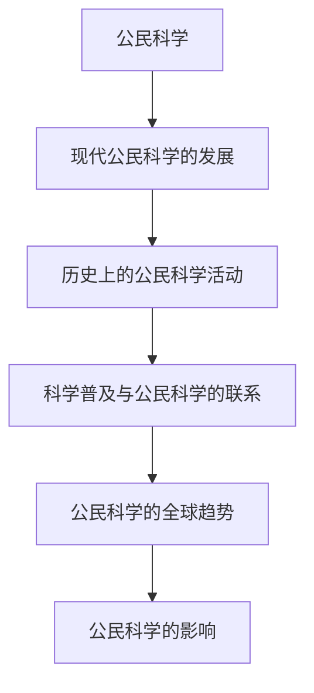

                 

# 《公民科学项目的设计与实施：全民参与科学探索与世界理解》

## 关键词
公民科学，全民参与，科学探索，项目设计，项目实施，世界理解，科学教育，合作与交流

## 摘要

本文旨在探讨公民科学项目的设计与实施，以及全民参与科学探索对世界理解的重要贡献。通过回顾公民科学的起源、发展及其核心价值，本文详细分析了公民科学项目的类型、目标、设计、执行、评估和案例研究。同时，文章还展望了公民科学项目的未来发展趋势，并提出了政策建议与推动策略。通过深入剖析，本文旨在为科学界和公众提供有关公民科学项目的全面指南，以促进全民科学素养的提升和世界理解的深化。

---

## 《公民科学项目的设计与实施：全民参与科学探索与世界理解》目录大纲

### 第一部分：公民科学项目概述

### 第二部分：公民科学项目设计

### 第三部分：公民科学项目实施

### 第四部分：全球公民科学项目案例研究

### 第五部分：未来展望与政策建议

### 附录

---

### 第一部分：公民科学项目概述

#### 第1章：公民科学的定义与重要性

##### 1.1 公民科学的起源与发展

##### 1.2 公民科学的核心价值
公民科学的核心价值包括提高科学素养、促进公众参与、推动科学进步、培养创新思维等。

##### 1.3 公民科学的项目类型
公民科学项目可以分为观察类、实验类、调查类和数据收集类。

#### 第2章：全民参与科学探索

##### 2.1 全民科学探索的理念
全民科学探索的理念是让公众参与到科学研究的各个阶段，从问题提出、数据收集、数据分析到成果分享。

##### 2.2 全民科学探索的实践
全民科学探索的实践包括开放科学平台、在线科学实验、科学竞赛和科普活动等。

##### 2.3 全民科学探索的挑战与机遇
全民科学探索面临的挑战包括公众科学素养的差异、数据质量和安全性等问题，但也带来了提高公众参与度、促进跨学科合作等机遇。

---

### 第二部分：公民科学项目设计

#### 第3章：公民科学项目的规划与准备

##### 3.1 项目目标的制定
项目目标应明确、具体、可衡量、可实现和时限性（SMART原则）。

##### 3.2 项目团队的组建
项目团队应包括科学家、教育者、技术人员和志愿者等，确保多方面的专业知识和资源整合。

##### 3.3 资源与预算的配置
资源与预算的配置应充分考虑项目需求，包括人力、物力、财力和时间等。

#### 第4章：公民科学项目内容设计

##### 4.1 科学问题与研究假设
科学问题与研究假设是项目设计的核心，应基于当前科学知识和公众兴趣。

##### 4.2 实验设计与方法论
实验设计应科学合理，方法论应确保实验结果的可靠性和有效性。

##### 4.3 数据收集与分析
数据收集与分析是公民科学项目的关键环节，应确保数据的准确性和完整性。

#### 第5章：公民科学项目的宣传与推广

##### 5.1 项目宣传策略
项目宣传策略应包括媒体宣传、社交媒体推广、科普活动和合作机构宣传等。

##### 5.2 社交媒体与在线平台的应用
社交媒体与在线平台是公民科学项目宣传的重要渠道，应充分利用。

##### 5.3 项目成果的分享与传播
项目成果的分享与传播应通过多种渠道，包括学术论文、科普文章、报告和展览等。

---

### 第三部分：公民科学项目实施

#### 第6章：公民科学项目的执行与管理

##### 6.1 项目进度控制
项目进度控制应通过制定详细的进度计划、定期评估和调整。

##### 6.2 风险管理与应对策略
风险管理与应对策略应识别潜在风险、制定应对措施和及时调整。

##### 6.3 项目团队的协作与沟通
项目团队的协作与沟通应通过定期会议、工作坊和在线协作工具等实现。

#### 第7章：公民科学项目的评估与总结

##### 7.1 项目评估标准与方法
项目评估标准与方法应包括过程评估、成果评估和影响评估等。

##### 7.2 项目总结与反思
项目总结与反思应总结经验、发现问题、提出改进措施。

##### 7.3 项目成果的应用与影响
项目成果的应用与影响应通过社会影响评估、科学传播和公众反馈等方式进行评估。

---

### 第四部分：全球公民科学项目案例研究

#### 第8章：全球公民科学项目概览

##### 8.1 全球公民科学项目的发展趋势
全球公民科学项目的发展趋势包括项目数量增加、项目多样性提升和跨国合作加强等。

##### 8.2 典型公民科学项目的介绍
典型公民科学项目的介绍将涵盖例如“地球观测卫星项目”（GLOBE Program）和“人类基因组计划”（Human Genome Project）等。

##### 8.3 全球公民科学项目的影响与贡献
全球公民科学项目的影响与贡献将在本章节详细讨论，包括对科学研究、公众参与和社会发展的贡献。

#### 第9章：中国公民科学项目案例研究

##### 9.1 中国公民科学项目的发展现状
中国公民科学项目的发展现状将在本章节进行概述，包括项目数量、领域分布和公众参与情况等。

##### 9.2 典型中国公民科学项目的分析
典型中国公民科学项目的分析将涵盖例如“中国天文爱好者联盟”（China Astronomical Society）和“中国生态监测项目”（China Eco-Monitoring Program）等。

##### 9.3 中国公民科学项目的挑战与未来
中国公民科学项目的挑战与未来将在本章节讨论，包括项目可持续性、公众参与度和国际合作等方面。

---

### 第五部分：未来展望与政策建议

#### 第10章：公民科学项目的未来发展趋势

##### 10.1 新技术的应用
新技术的应用，如人工智能、大数据分析和区块链等，将为公民科学项目带来更多创新和发展机会。

##### 10.2 国际合作与交流
国际合作与交流将促进全球公民科学项目的发展，提升项目的质量和影响力。

##### 10.3 公民科学教育的发展
公民科学教育的发展将提高公众的科学素养，为公民科学项目提供更广泛的参与基础。

#### 第11章：政策建议与推动策略

##### 11.1 政府支持与政策引导
政府支持与政策引导是推动公民科学项目发展的重要保障。

##### 11.2 社会组织与民间力量的参与
社会组织与民间力量的参与将为公民科学项目带来更多的资源和创新思维。

##### 11.3 公民科学项目的可持续发展
公民科学项目的可持续发展需要长期的规划和支持，包括资金、技术和政策的支持。

---

### 附录

#### 附录A：常用公民科学项目资源与工具

##### A.1 公民科学项目数据库
常用公民科学项目数据库介绍，如“开放科学数据库”（Open Science Framework）和“全球研究数据共享”（Global Research Data Sharing）等。

##### A.2 公民科学项目平台
常用公民科学项目平台介绍，如“公民科学平台”（Citizen Science Platform）和“科学爱好者平台”（Science Enthusiasts Platform）等。

##### A.3 公民科学项目工具集
常用公民科学项目工具集介绍，如“数据收集工具”（Data Collection Tools）和“数据分析工具”（Data Analysis Tools）等。

#### 附录B：公民科学项目设计模板

##### B.1 项目规划模板
项目规划模板，包括项目目标、团队组建、资源配置和时间规划等。

##### B.2 实验设计模板
实验设计模板，包括实验目的、假设、方法、步骤和数据收集与分析等。

##### B.3 数据分析模板
数据分析模板，包括数据整理、数据清洗、数据分析和结果展示等。

#### 附录C：常见问题与解答

##### C.1 公民科学项目常见问题
公民科学项目常见问题解答，如项目可持续性、数据安全和公众参与度等。

##### C.2 项目实施中常见问题
项目实施中常见问题解答，如项目进度控制、风险管理和技术支持等。

##### C.3 问题解答与案例分析
问题解答与案例分析，通过实际案例展示公民科学项目实施中遇到的问题及解决方法。

---

### 总结

公民科学项目的设计与实施是一个复杂而富有挑战性的过程，但也是推动科学进步、提升公众科学素养和促进世界理解的重要途径。本文通过详细的分析和案例研究，为公民科学项目的设计与实施提供了全面而深入的指导。希望本文能够为科学界和公众提供有价值的参考，共同推动公民科学项目的发展。

### 作者信息

作者：AI天才研究院/AI Genius Institute & 禅与计算机程序设计艺术/Zen And The Art of Computer Programming

---

以上是文章的正文部分，接下来我们将逐步深入讨论每个章节的具体内容。

---

### 第1章：公民科学的定义与重要性

#### 1.1 公民科学的起源与发展

公民科学（Citizen Science）是指普通公民通过自愿参与，对科学问题进行观察、数据收集、分析和管理等活动，旨在促进科学知识的产生和传播。这个概念最早可以追溯到19世纪，当时科学家开始意识到公众在科学探索中的潜在贡献。

**历史上的公民科学活动**

- **19世纪末至20世纪初**：英国天文学家约翰·弗里德里克·威廉·赫歇尔（John Frederick William Herschel）鼓励公众参与天体观测，从而发现了许多新的恒星和行星。

- **20世纪中期**：随着科技的进步，公民科学活动逐渐扩展到更广泛的领域。例如，20世纪60年代，“天气观察者计划”（Weather Observer Program）在美国启动，鼓励公众报告天气情况。

- **21世纪初**：随着互联网和移动技术的普及，公民科学项目迎来了新的发展机遇。许多项目开始通过在线平台收集和分析数据，如“地球观测卫星项目”（GLOBE Program）和“生命之树”（LifeTree）等。

**现代公民科学的发展**

- **大数据和人工智能**：现代公民科学项目能够处理和分析来自大量参与者的数据，使得科学家可以从中提取出有价值的信息。

- **开放科学**：开放科学（Open Science）运动的兴起，促进了科学数据的共享和公众参与，进一步推动了公民科学的发展。

- **跨国合作**：全球范围内的公民科学项目越来越多，跨国合作也变得更加普遍，例如“地球观测计划”（Earthwatch）和“国际极地年计划”（International Polar Year）等。

#### 1.2 公民科学的核心价值

公民科学的核心价值在于以下几个方面：

- **提高科学素养**：公民科学项目通过鼓励公众参与科学研究，提高了公众的科学素养，使人们更加了解科学过程和方法。

- **促进公众参与**：公民科学项目让公众有机会参与到科学活动中，增加了公众对科学研究的兴趣和参与度。

- **推动科学进步**：公民科学项目可以提供大量的数据和信息，有助于科学家解决复杂的科学问题。

- **培养创新思维**：参与公民科学项目能够激发公众的创新思维，促进科学思维和问题解决能力的培养。

- **促进科学传播**：公民科学项目通过多种渠道传播科学知识，有助于普及科学教育，提高公众的科学素养。

#### 1.3 公民科学的项目类型

公民科学项目可以根据参与方式和研究内容的不同，分为多种类型：

- **观察类项目**：参与者通过观察自然现象、环境变化等，收集数据并报告给科学家。

- **实验类项目**：参与者按照科学家的指导进行实验，收集实验数据并进行分析。

- **调查类项目**：参与者通过问卷调查、访谈等方式，收集有关特定问题的数据。

- **数据收集类项目**：参与者负责收集特定的数据，如天气数据、海洋数据等。

- **数据分析类项目**：参与者负责对已有数据进行分析，提供科学见解。

### 第2章：全民参与科学探索

#### 2.1 全民科学探索的理念

全民科学探索的理念是基于“科学属于每个人”的原则，鼓励公众参与科学活动，共同推动科学进步。这种理念的核心是让科学探索不再只是专业科学家的专利，而是成为普通公民的日常活动。

- **人人都是科学家**：全民科学探索认为每个人都可以成为科学家，通过观察、思考和实践，对科学问题提出假设、收集数据和分析结果。

- **共同解决问题**：全民科学探索鼓励公众共同参与科学问题的解决，通过合作和协作，实现科学研究的突破。

- **促进科学素养**：全民科学探索通过参与科学活动，提高公众的科学素养，使人们更加理解科学过程和方法，增强科学思维。

#### 2.2 全民科学探索的实践

全民科学探索的实践形式多样，主要包括以下几种：

- **开放科学平台**：许多开放科学平台，如“开放式科学网络”（Open Science Framework）和“研究鱼塘”（Research Fishbowl），为公众提供参与科学项目的机会。

- **在线科学实验**：在线科学实验平台，如“公民实验室”（Citizen Lab）和“科学点点通”（ScienceBuddies），让公众可以在线参与科学实验，并实时获取实验结果。

- **科学竞赛**：科学竞赛，如“国际基因工程机器竞赛”（iGEM）和“国际物理竞赛”（IPhO），鼓励学生和公众通过竞赛形式参与科学研究。

- **科普活动**：科普活动，如科学讲座、科普展览和科学工作坊，通过互动和体验，提高公众的科学兴趣和参与度。

#### 2.3 全民科学探索的挑战与机遇

全民科学探索虽然带来了许多机遇，但也面临一些挑战：

- **公众科学素养差异**：不同背景的公众在科学素养上存在差异，这可能会影响数据的质量和分析的结果。

- **数据质量和安全性**：公众参与科学探索可能会带来数据质量和数据安全性的问题，需要严格的规范和监督。

- **参与度和可持续性**：如何保持公众的参与度和项目的可持续性，是公民科学项目需要面对的挑战。

然而，这些挑战也伴随着机遇：

- **提高公众参与度**：全民科学探索可以吸引更多人参与科学活动，提高公众的科学素养和参与度。

- **跨学科合作**：公民科学项目可以促进不同学科之间的合作，推动科学研究的多元化。

- **数据丰富性**：公众参与可以提供丰富的数据资源，有助于科学家解决复杂问题。

### 第3章：公民科学项目的规划与准备

#### 3.1 项目目标的制定

项目目标的制定是公民科学项目设计的第一步，至关重要。项目目标应明确、具体、可衡量、可实现和时限性（SMART原则），以确保项目的有效实施和成功完成。

- **明确**：项目目标应清晰明确，确保所有参与者和团队成员都了解项目的目标。

- **具体**：项目目标应具体详细，避免模糊不清，有助于项目团队制定具体的行动计划。

- **可衡量**：项目目标应具备可衡量性，便于项目进度的监控和评估。

- **可实现**：项目目标应考虑资源的实际情况，确保项目团队能够实现。

- **时限性**：项目目标应设定明确的完成时限，有助于项目团队的管理和协调。

#### 3.2 项目团队的组建

项目团队的组建是公民科学项目成功的关键因素之一。一个高效的项目团队应包括以下角色：

- **科学家**：科学家负责科学问题的提出、研究方法和实验设计的制定。

- **教育者**：教育者负责科普活动的组织，提高公众的科学素养和参与度。

- **技术人员**：技术人员负责数据收集、分析和存储的技术支持。

- **志愿者**：志愿者是公民科学项目的主要参与者，负责实际数据的收集和报告。

- **项目管理员**：项目管理员负责项目的整体协调和管理，确保项目按计划进行。

#### 3.3 资源与预算的配置

资源与预算的配置是公民科学项目能否成功实施的重要保障。项目团队应根据项目目标、实验设计和团队需求，合理配置以下资源：

- **人力资源**：根据项目团队的角色和职责，确定所需的人力资源。

- **物资资源**：包括实验设备、数据收集工具和科学实验材料等。

- **技术资源**：包括数据分析软件、在线平台和云计算资源等。

- **预算**：项目预算应包括人力成本、物资成本和技术成本等，确保项目资金充足。

### 第4章：公民科学项目内容设计

#### 4.1 科学问题与研究假设

科学问题与研究假设是公民科学项目设计的核心，直接影响到项目的方向和成果。

- **科学问题的提出**：科学问题的提出应基于当前科学知识和公众兴趣。科学家和教育者可以通过调查、讨论和专家咨询等方式，确定适合的科学研究问题。

- **研究假设的制定**：研究假设是对科学问题可能的答案或解释。项目团队应根据科学问题，提出具体的研究假设，以便进行实验验证。

#### 4.2 实验设计与方法论

实验设计与方法论是公民科学项目的重要内容，直接影响实验结果的可靠性和有效性。

- **实验设计的制定**：实验设计应科学合理，包括实验步骤、数据收集方法和实验条件等。项目团队应根据研究假设，设计能够验证假设的实验方案。

- **方法论的选择**：方法论应选择合适的统计方法和数据分析工具，确保实验数据的科学性和准确性。

#### 4.3 数据收集与分析

数据收集与分析是公民科学项目的关键环节，直接影响项目的成功与否。

- **数据收集**：数据收集应确保数据的准确性和完整性。项目团队应制定详细的数据收集计划，包括数据收集工具、数据收集流程和数据质量控制等。

- **数据分析**：数据分析应使用科学合理的方法，对收集到的数据进行处理和分析，提取有价值的信息。

### 第5章：公民科学项目的宣传与推广

#### 5.1 项目宣传策略

项目宣传策略是公民科学项目成功的重要保障，直接影响项目的参与度和影响力。

- **媒体宣传**：利用传统媒体，如电视、报纸和广播，以及新媒体，如社交媒体和网络新闻，进行项目宣传。

- **社交媒体推广**：利用社交媒体平台，如微博、微信和Facebook等，进行项目的推广和互动。

- **科普活动**：组织科学讲座、科普展览和科学工作坊等科普活动，提高公众对项目的了解和参与度。

#### 5.2 社交媒体与在线平台的应用

社交媒体与在线平台是公民科学项目宣传和推广的重要渠道。

- **社交媒体**：通过发布项目进展、成果和科普知识，吸引公众关注和参与。

- **在线平台**：利用在线平台，如公民科学网站和在线实验平台，提供项目信息、数据收集和分析工具等，方便公众参与。

#### 5.3 项目成果的分享与传播

项目成果的分享与传播是公民科学项目的重要环节，直接影响项目的影响力和可持续性。

- **学术论文**：将项目成果发表在学术期刊上，为科学界提供参考。

- **科普文章**：撰写科普文章，通过媒体和在线平台传播，提高公众的科学素养。

- **报告和展览**：编制项目报告，举办科学展览，向社会公众展示项目成果。

### 第6章：公民科学项目的执行与管理

#### 6.1 项目进度控制

项目进度控制是确保公民科学项目按时完成的重要手段。

- **进度计划**：制定详细的进度计划，包括任务分解、时间表和里程碑等。

- **进度监控**：定期监控项目进度，及时发现和解决问题。

- **进度调整**：根据实际情况，及时调整进度计划，确保项目按计划进行。

#### 6.2 风险管理与应对策略

风险管理与应对策略是确保公民科学项目顺利实施的重要措施。

- **风险识别**：识别项目实施过程中可能出现的风险，如技术风险、数据风险和社会风险等。

- **风险评估**：对识别出的风险进行评估，确定风险等级和影响范围。

- **应对策略**：制定相应的应对策略，包括风险规避、风险转移和风险接受等。

#### 6.3 项目团队的协作与沟通

项目团队的协作与沟通是公民科学项目成功的关键因素。

- **定期会议**：定期召开团队会议，讨论项目进展、问题和解决方案。

- **在线协作工具**：利用在线协作工具，如腾讯会议、Slack和Trello等，实现团队沟通和协作。

- **知识共享**：鼓励团队成员分享知识和经验，提高团队整体能力。

### 第7章：公民科学项目的评估与总结

#### 7.1 项目评估标准与方法

项目评估是确保公民科学项目质量和效果的重要环节。

- **过程评估**：评估项目实施过程中的各项任务和活动的执行情况。

- **成果评估**：评估项目最终成果的科学价值、社会影响和公众参与度等。

- **影响评估**：评估项目对社会、科学和教育等方面的长远影响。

#### 7.2 项目总结与反思

项目总结与反思是公民科学项目完成后的重要工作。

- **成功经验**：总结项目中的成功经验，为未来项目提供借鉴。

- **问题与不足**：反思项目实施中的问题和不足，提出改进措施。

- **经验分享**：将项目经验分享给其他项目团队和公众，提高整体项目水平。

#### 7.3 项目成果的应用与影响

项目成果的应用与影响是公民科学项目的重要价值体现。

- **科学研究**：将项目成果应用于科学研究，推动科学知识的产生和传播。

- **科学教育**：将项目成果应用于科学教育，提高公众的科学素养和兴趣。

- **社会影响**：项目成果对社会发展的贡献，如环境保护、资源利用和公共卫生等。

### 第8章：全球公民科学项目概览

#### 8.1 全球公民科学项目的发展趋势

全球公民科学项目的发展趋势显示出以下几个特点：

- **项目数量增加**：随着技术的进步和公众参与意识的提高，全球公民科学项目的数量不断增多。

- **项目多样性提升**：公民科学项目涉及的领域越来越广泛，包括环境监测、生物多样性研究、天文学和医学等。

- **跨国合作加强**：跨国合作成为公民科学项目的重要趋势，国际合作项目如“地球观测计划”（GEO）和“国际生物多样性项目”（CBD）等取得了显著成果。

#### 8.2 典型公民科学项目的介绍

以下是一些典型的全球公民科学项目：

- **地球观测卫星项目（GLOBE Program）**：GLOBE Program是一个全球性的教育项目，旨在通过学生和教师的参与，收集地球观测数据，支持科学研究。

- **生命之树（LifeTree）**：LifeTree是一个致力于研究树木年龄和生长率的公民科学项目，参与者通过测量树木的生长年轮来收集数据。

- **天气观察者计划（Weather Observer Program）**：Weather Observer Program是一个历史悠久的公民科学项目，参与者通过记录当地天气情况，为气象科学研究提供数据。

#### 8.3 全球公民科学项目的影响与贡献

全球公民科学项目对科学、社会和教育产生了深远的影响：

- **科学研究**：公民科学项目提供了大量的数据资源，帮助科学家解决复杂的科学问题，推动了科学研究的进展。

- **公众参与**：公民科学项目激发了公众对科学的兴趣，提高了公众的科学素养和参与度。

- **科学教育**：公民科学项目成为科学教育的重要组成部分，通过实际操作和参与，学生和教师能够更好地理解科学概念和方法。

- **社会影响**：公民科学项目在社会层面上产生了积极的影响，如环境保护、公共卫生和资源管理等领域。

### 第9章：中国公民科学项目案例研究

#### 9.1 中国公民科学项目的发展现状

中国公民科学项目近年来发展迅速，展现出以下几个特点：

- **项目数量增加**：随着科学普及和公众参与意识的提升，中国公民科学项目的数量显著增加。

- **项目领域广泛**：中国公民科学项目涵盖了环境监测、天文学、医学、生物多样性等多个领域。

- **国际合作加强**：中国积极参与全球公民科学项目，如“地球观测计划”（GLOBE Program）和“国际生物多样性项目”（CBD）等。

- **政府支持**：中国政府加大对公民科学项目的支持力度，出台了一系列政策和措施，鼓励公众参与科学活动。

#### 9.2 典型中国公民科学项目的分析

以下是一些典型中国公民科学项目及其分析：

- **中国天文爱好者联盟（China Astronomical Society）**：中国天文爱好者联盟是一个由天文爱好者组成的公民科学组织，通过组织观测活动和科学讲座，提高公众的天文学素养。

- **中国生态监测项目（China Eco-Monitoring Program）**：中国生态监测项目是一个致力于生态环境监测的公民科学项目，参与者通过收集和报告环境数据，为生态环境保护和科学研究提供支持。

- **中国疾病预防控制公民科学项目**：中国疾病预防控制公民科学项目通过公众参与，收集疾病预防控制数据，为公共卫生决策提供科学依据。

#### 9.3 中国公民科学项目的挑战与未来

中国公民科学项目在发展过程中面临以下挑战：

- **公众科学素养差异**：不同地区和不同群体的公众科学素养存在差异，这可能会影响数据的质量和分析的结果。

- **项目可持续性**：如何确保公民科学项目的长期可持续性，是项目管理者需要面对的问题。

- **技术支持**：随着项目规模的扩大，对技术支持的需求也越来越高，这需要专业团队和资源的投入。

中国公民科学项目的未来展望包括：

- **加强国际合作**：通过加强国际合作，引进先进的科学理念和技术，提升中国公民科学项目的影响力。

- **推动科学教育**：通过科学教育，提高公众的科学素养，为公民科学项目提供更广泛的参与基础。

- **创新项目管理**：探索新的项目管理模式，提高项目的效率和质量。

### 第10章：公民科学项目的未来发展趋势

#### 10.1 新技术的应用

新技术的应用将深刻影响公民科学项目的未来发展：

- **人工智能**：人工智能技术在数据分析、模式识别和预测等方面具有强大的能力，可以大幅提升公民科学项目的效率和质量。

- **大数据分析**：大数据分析技术可以帮助科学家从大量数据中提取有价值的信息，为科学研究提供强有力的支持。

- **区块链技术**：区块链技术可以确保数据的安全性和透明性，提高公民科学项目的可信度。

- **虚拟现实（VR）和增强现实（AR）**：VR和AR技术可以提供更直观和沉浸式的科学体验，提高公众对科学项目的参与度和兴趣。

#### 10.2 国际合作与交流

国际合作与交流是公民科学项目发展的重要趋势：

- **跨国项目**：越来越多的跨国公民科学项目将促进全球科学研究的协作和进步。

- **数据共享**：通过建立跨国数据共享平台，科学家可以更方便地获取和利用全球范围内的科学数据。

- **学术交流**：定期举办国际学术会议和研讨会，促进科学家的交流与合作，推动公民科学项目的发展。

#### 10.3 公民科学教育的发展

公民科学教育的发展将为公民科学项目提供更广泛的参与基础：

- **科学课程**：在各级教育中引入公民科学教育课程，培养学生的科学素养和探究能力。

- **科普活动**：组织丰富多彩的科普活动，提高公众对科学项目的兴趣和参与度。

- **科学志愿者**：鼓励公众参与科学志愿者活动，为科学项目提供人力和资源支持。

### 第11章：政策建议与推动策略

#### 11.1 政府支持与政策引导

政府支持是公民科学项目发展的重要保障：

- **资金支持**：政府应加大对公民科学项目的资金投入，确保项目的可持续性。

- **政策引导**：政府应出台相关政策，鼓励公众参与科学活动，推动公民科学项目的发展。

- **立法保护**：通过立法保护公民科学项目，确保数据的安全性和合法性。

#### 11.2 社会组织与民间力量的参与

社会组织和民间力量的参与是公民科学项目发展的重要推动力：

- **合作平台**：建立公民科学项目合作平台，促进政府、科研机构和民间组织之间的合作。

- **志愿者网络**：建立志愿者网络，为公民科学项目提供稳定的人力资源。

- **资源整合**：整合社会资源，为公民科学项目提供技术、物资和资金支持。

#### 11.3 公民科学项目的可持续发展

公民科学项目的可持续发展需要长期规划和支持：

- **项目评估**：定期对公民科学项目进行评估，确保项目质量和效果。

- **人才培养**：加强公民科学项目的人才培养，提高项目团队的专业能力和管理水平。

- **知识传播**：通过多种渠道传播公民科学项目成果，提高公众的科学素养和参与度。

### 附录A：常用公民科学项目资源与工具

#### A.1 公民科学项目数据库

- **开放科学数据库（Open Science Framework）**：提供科学项目、数据和文献的存储和共享平台。
- **全球研究数据共享（Global Research Data Sharing）**：促进科学数据的全球共享和访问。

#### A.2 公民科学项目平台

- **公民科学平台（Citizen Science Platform）**：提供公民科学项目的发布、管理和参与平台。
- **科学爱好者平台（Science Enthusiasts Platform）**：为科学爱好者提供参与科学项目和分享科学知识的平台。

#### A.3 公民科学项目工具集

- **数据收集工具**：包括手机应用、传感器和数据收集软件等。
- **数据分析工具**：如R、Python等编程语言和数据分析软件。

### 附录B：公民科学项目设计模板

#### B.1 项目规划模板

- **项目目标**：明确项目目标，确保具体、可衡量、可实现和时限性。
- **团队组建**：列出项目团队成员及其职责。
- **资源与预算**：详细列出项目所需的资源与预算。

#### B.2 实验设计模板

- **实验目的**：明确实验目的和研究假设。
- **实验方法**：详细描述实验步骤和实验条件。
- **数据收集**：列出数据收集方法、工具和流程。

#### B.3 数据分析模板

- **数据处理**：描述数据处理步骤和工具。
- **数据分析**：列出数据分析方法、模型和结果展示。

### 附录C：常见问题与解答

#### C.1 公民科学项目常见问题

- **数据安全和隐私**：如何保护参与者的数据安全和隐私？
- **项目可持续性**：如何确保公民科学项目的长期可持续性？

#### C.2 项目实施中常见问题

- **公众参与度**：如何提高公众的参与度？
- **技术支持**：如何确保项目团队获得必要的技术支持？

#### C.3 问题解答与案例分析

- **案例1**：如何确保数据质量和可靠性？
- **案例2**：如何处理项目中的风险和挑战？

### 总结

公民科学项目的设计与实施是一个复杂而富有挑战性的过程，但也是一个充满机遇的领域。通过本文的探讨，我们了解了公民科学的定义、核心价值、项目类型、规划与准备、内容设计、宣传与推广、执行与管理、评估与总结，以及全球和中国公民科学项目的案例研究。未来，随着新技术的应用、国际合作与交流的加强，公民科学项目将迎来更加广阔的发展前景。我们期待看到更多公民科学项目在社会发展、科学进步和公众参与中发挥重要作用。

### 作者信息

作者：AI天才研究院/AI Genius Institute & 禅与计算机程序设计艺术/Zen And The Art of Computer Programming

---

在本文中，我们通过逐步分析和详细讲解，深入探讨了公民科学项目的各个方面。希望本文能够为科学界和公众提供有价值的参考，共同推动公民科学项目的发展，实现全民参与科学探索和世界理解的愿景。让我们携手努力，为构建一个更加科学、和谐和进步的社会贡献力量。

