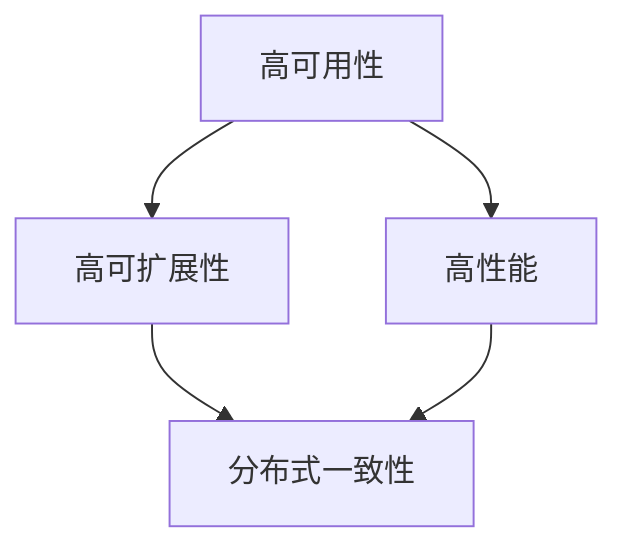
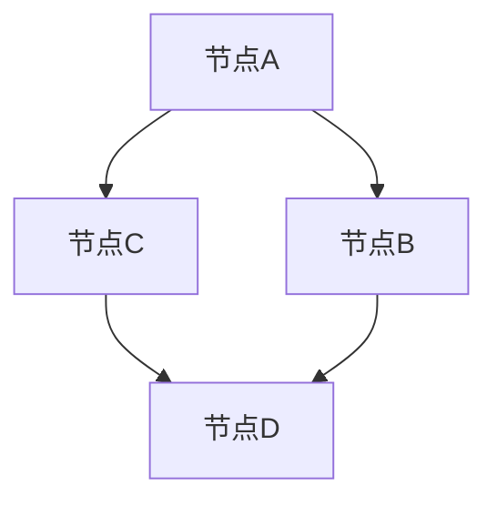
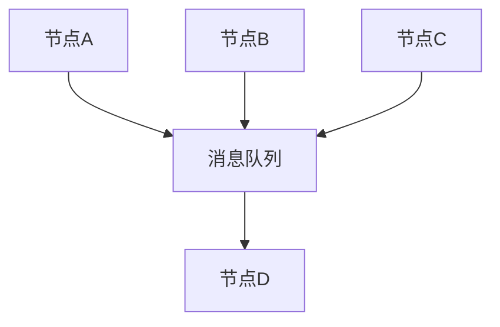
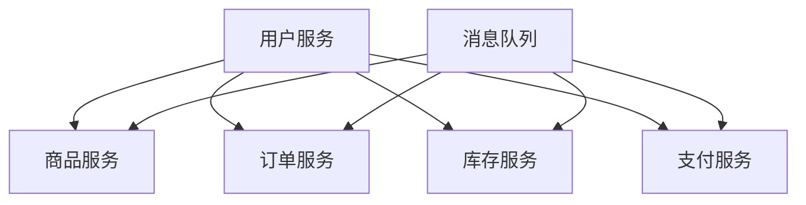

                 

### 《分布式系统设计：理论与实践》

**关键词：** 分布式系统，架构设计，数据一致性，计算框架，服务框架，系统优化

**摘要：** 本文将深入探讨分布式系统的设计理论与实践。从基础概念和架构设计入手，逐步深入分布式系统的核心技术和实际应用，帮助读者全面理解分布式系统的设计与实现，提升系统架构能力。

### 《分布式系统设计：理论与实践》目录大纲

**第一部分：分布式系统概述**

1. **第1章：分布式系统基础**
   - 1.1.1 分布式系统的定义与特点
   - 1.1.2 分布式系统的基本原理
   - 1.1.3 分布式系统的应用领域

2. **第2章：分布式系统架构**
   - 2.1.1 分布式系统的层次结构
   - 2.1.2 节点通信机制
   - 2.1.3 分布式一致性模型

**第二部分：分布式系统核心技术**

1. **第3章：分布式数据一致性**
   - 3.1.1 数据一致性模型
   - 3.1.2 分布式锁与事务管理
   - 3.1.3 分布式事务处理

2. **第4章：分布式数据存储**
   - 4.1.1 分布式数据库概述
   - 4.1.2 分布式数据的分片策略
   - 4.1.3 分布式数据的复制策略

3. **第5章：分布式计算框架**
   - 5.1.1 分布式计算框架概述
   - 5.1.2 数据流计算与批处理
   - 5.1.3 分布式任务调度与负载均衡

4. **第6章：分布式服务框架**
   - 6.1.1 分布式服务架构设计
   - 6.1.2 服务注册与发现
   - 6.1.3 服务容错与降级

**第三部分：分布式系统实战**

1. **第7章：分布式系统设计原则**
   - 7.1.1 系统可扩展性设计
   - 7.1.2 系统可用性与容错性设计
   - 7.1.3 系统性能优化

2. **第8章：分布式系统案例分析**
   - 8.1.1 大型分布式系统的架构设计
   - 8.1.2 分布式系统性能调优实践
   - 8.1.3 分布式系统故障案例分析

3. **第9章：分布式系统实战项目**
   - 9.1.1 分布式系统开发环境搭建
   - 9.1.2 分布式存储系统实现
   - 9.1.3 分布式计算系统开发

**附录**

1. **附录A：分布式系统常用工具与库**
   - 1.1.1 分布式数据库工具
   - 1.1.2 分布式计算框架
   - 1.1.3 分布式服务框架

2. **附录B：分布式系统参考资料**
   - 1.1.1 分布式系统相关书籍推荐
   - 1.1.2 分布式系统相关论文推荐
   - 1.1.3 分布式系统学习资源网站推荐

---

### 引言

随着互联网和云计算的快速发展，分布式系统已成为现代计算机系统设计的重要方向。分布式系统通过将计算任务分布在多个节点上，实现了高可用性、高可扩展性和高性能，满足了大规模数据处理和实时计算的需求。然而，分布式系统的设计并非一蹴而就，它涉及诸多核心技术，如数据一致性、分布式存储、计算框架等，需要深入理解和实践经验。

本文旨在通过理论与实践相结合的方式，系统性地介绍分布式系统的设计方法与实现技巧。文章首先从基础概念和架构设计入手，逐步深入到分布式系统的核心技术和实战应用。通过本文的学习，读者将能够全面理解分布式系统的原理，掌握分布式系统设计的关键技巧，提升系统架构能力。

本文结构如下：

1. **第一部分：分布式系统概述**：介绍分布式系统的定义、特点、基本原理和应用领域。
2. **第二部分：分布式系统核心技术**：详细讲解分布式数据一致性、分布式数据存储、分布式计算框架和分布式服务框架。
3. **第三部分：分布式系统实战**：探讨分布式系统设计原则、案例分析及实战项目开发。
4. **附录**：提供分布式系统常用工具与库、相关书籍推荐、论文推荐和学习资源网站推荐。

通过本文的学习，读者将能够深入理解分布式系统的设计和实现，为构建高效、可靠的分布式系统奠定基础。

---

### 第一部分：分布式系统概述

#### 第1章：分布式系统基础

**1.1.1 分布式系统的定义与特点**

分布式系统（Distributed System）是由多个独立节点组成的系统，这些节点通过网络连接，协同完成计算任务。分布式系统的核心特点是：

1. **高可用性**：通过将任务分布在多个节点上，即使某个节点发生故障，整个系统仍能正常运行，提高了系统的可靠性。
2. **高可扩展性**：分布式系统可以根据需要动态增加或减少节点，从而适应不断变化的需求，提高了系统的灵活性。
3. **高性能**：分布式系统通过并行处理任务，显著提高了系统的处理能力，满足了大规模数据处理和实时计算的需求。

分布式系统的主要特点可以用图1-1的Mermaid流程图表示：



**1.1.2 分布式系统的基本原理**

分布式系统的基本原理主要包括节点通信机制和分布式一致性模型。

**节点通信机制**：

1. **点对点通信**：节点之间通过直接通信来传递数据，适用于小规模、低延迟的场景。
2. **发布-订阅通信**：节点通过发布和订阅消息来通信，适用于大规模、高延迟的场景。

**分布式一致性模型**：

1. **强一致性**：所有节点在同一时间看到相同的数据状态，但可能带来较高的延迟。
2. **最终一致性**：所有节点最终会达到相同的数据状态，但允许在短时间内存在不一致，适用于大规模、低延迟的场景。

**1.1.3 分布式系统的应用领域**

分布式系统在多个领域有广泛应用，包括：

1. **云计算**：分布式系统为云计算提供了基础架构，实现了大规模计算资源的调度和管理。
2. **大数据处理**：分布式系统可以高效处理海量数据，满足数据分析和挖掘的需求。
3. **实时计算**：分布式系统可以实时处理大量实时数据，支持金融交易、实时监控等应用。
4. **物联网**：分布式系统为物联网提供了数据存储和处理的能力，实现了设备之间的协同工作。

通过本章节的介绍，读者可以初步了解分布式系统的定义、特点、基本原理和应用领域。接下来，我们将进一步探讨分布式系统的架构设计和核心技术。

---

### 第二部分：分布式系统核心技术

#### 第2章：分布式系统架构

**2.1.1 分布式系统的层次结构**

分布式系统的层次结构通常分为三层：应用层、服务层和基础设施层。这三层各自承担不同的职责，共同构成了一个完整的分布式系统架构。

**应用层**：应用层是分布式系统的最上层，负责业务逻辑的实现。它包括各种应用程序和服务，如Web服务、应用程序接口（API）等。应用层通过服务层进行交互，实现具体的业务功能。

**服务层**：服务层位于应用层和基础设施层之间，负责服务注册、服务发现、负载均衡等中间件功能。服务层是分布式系统的核心，它为应用层提供了分布式服务的能力，提高了系统的可扩展性和可靠性。

**基础设施层**：基础设施层是分布式系统的底层，负责资源管理和节点通信。它包括计算资源、存储资源、网络资源等基础设施组件，为服务层和应用层提供了运行环境。

**2.1.2 节点通信机制**

节点通信机制是分布式系统中节点之间传递数据和消息的机制。常见的节点通信机制包括点对点通信和发布-订阅通信。

**点对点通信**：点对点通信是直接在节点之间传递消息的通信机制。它通常基于TCP/IP协议，通过建立TCP连接实现节点之间的可靠通信。点对点通信适用于小规模、低延迟的场景。



**发布-订阅通信**：发布-订阅通信是一种基于消息队列的通信机制。节点通过发布消息到主题（Topic），其他节点通过订阅主题来接收消息。发布-订阅通信适用于大规模、高延迟的场景。



**2.1.3 分布式一致性模型**

分布式一致性模型是分布式系统中数据一致性保障的机制。常见的分布式一致性模型包括强一致性、最终一致性和哨兵一致性。

**强一致性**：强一致性保证所有节点在同一时间看到相同的数据状态。强一致性模型通常采用同步通信机制，如两阶段提交（2PC）和三阶段提交（3PC）。但强一致性模型可能带来较高的延迟。

**最终一致性**：最终一致性模型允许节点在短时间内存在不一致，但最终会达到相同的数据状态。最终一致性模型通常采用异步通信机制，如最终一致性算法（Gossip Protocol）和事件溯源（Event Sourcing）。最终一致性模型适用于大规模、低延迟的场景。

**哨兵一致性**：哨兵一致性是一种介于强一致性和最终一致性之间的模型。它通过检测数据不一致性并触发一致性修复机制来保证数据一致性。哨兵一致性模型适用于某些特殊场景，如部分数据一致性要求较低的应用。

**2.1.4 分布式系统的应用领域**

分布式系统在多个领域有广泛应用，包括：

1. **云计算**：分布式系统为云计算提供了基础架构，实现了大规模计算资源的调度和管理。
2. **大数据处理**：分布式系统可以高效处理海量数据，满足数据分析和挖掘的需求。
3. **实时计算**：分布式系统可以实时处理大量实时数据，支持金融交易、实时监控等应用。
4. **物联网**：分布式系统为物联网提供了数据存储和处理的能力，实现了设备之间的协同工作。

通过本章节的介绍，读者可以深入了解分布式系统的层次结构、节点通信机制和分布式一致性模型。这些核心技术在分布式系统的设计中起着至关重要的作用，为构建高效、可靠的分布式系统提供了基础。

#### 第3章：分布式数据一致性

**3.1.1 数据一致性模型**

数据一致性是分布式系统中的一个重要问题，因为分布式系统中的数据通常分布在多个节点上，且节点之间可能存在网络延迟和故障。数据一致性模型是保证分布式系统中数据一致性的一组规则和策略。

**强一致性**：强一致性要求所有节点在同一时间看到相同的数据状态。在强一致性模型中，当一个操作成功完成时，所有其他节点都能立即看到这个操作的结果。强一致性提供了最强的数据一致性保证，但通常会导致较高的延迟。

**最终一致性**：最终一致性模型允许节点在短时间内存在不一致，但最终会达到相同的数据状态。在最终一致性模型中，当一个操作成功完成时，其他节点可能会延迟一段时间才看到这个操作的结果。最终一致性模型适用于大规模、低延迟的场景。

**哨兵一致性**：哨兵一致性是一种介于强一致性和最终一致性之间的模型。它通过检测数据不一致性并触发一致性修复机制来保证数据一致性。哨兵一致性模型适用于某些特殊场景，如部分数据一致性要求较低的应用。

**3.1.2 分布式锁与事务管理**

分布式锁和事务管理是分布式数据一致性中的重要机制。

**分布式锁**：分布式锁用于在分布式系统中实现并发控制，保证同一时间只有一个节点能够执行某个操作。分布式锁可以分为以下几种类型：

- **互斥锁**：互斥锁保证同一时间只有一个节点能够访问某个资源。
- **共享锁**：共享锁允许多个节点同时访问某个资源，但必须互斥访问。
- **读写锁**：读写锁是共享锁和互斥锁的结合，允许多个节点同时读取资源，但写入操作需要互斥。

分布式锁的实现通常基于分布式一致性算法，如Paxos和Zab。分布式锁的关键是要保证数据的强一致性。

**事务管理**：事务管理用于在分布式系统中实现数据的一致性和可靠性。分布式事务管理可以分为以下几种类型：

- **两阶段提交（2PC）**：两阶段提交是一种分布式事务管理协议，通过两阶段协议来协调多个节点的操作，确保事务的原子性。
- **三阶段提交（3PC）**：三阶段提交是两阶段提交的改进版，通过引入预提交阶段来减少协调过程中的网络延迟。
- **最终一致性模型**：最终一致性模型通过事件溯源和补偿事务来实现分布式事务管理，适用于大规模、低延迟的场景。

**3.1.3 分布式事务处理**

分布式事务处理是分布式数据一致性中的重要组成部分。分布式事务处理需要解决以下问题：

- **跨节点的事务**：分布式事务通常涉及多个节点，如何在多个节点上协调事务的执行？
- **数据一致性问题**：如何在分布式系统中保证数据的一致性？
- **性能问题**：如何提高分布式事务的处理性能？

分布式事务处理可以分为以下几种模型：

- **两阶段提交（2PC）**：两阶段提交是一种分布式事务管理协议，通过两阶段协议来协调多个节点的操作，确保事务的原子性。两阶段提交的优缺点如下：
  - 优点：强一致性、可靠性高。
  - 缺点：高延迟、复杂性高。
- **三阶段提交（3PC）**：三阶段提交是两阶段提交的改进版，通过引入预提交阶段来减少协调过程中的网络延迟。三阶段提交的优缺点如下：
  - 优点：降低延迟、提高性能。
  - 缺点：复杂度更高、可靠性稍低。
- **最终一致性模型**：最终一致性模型通过事件溯源和补偿事务来实现分布式事务管理，适用于大规模、低延迟的场景。最终一致性模型的优缺点如下：
  - 优点：低延迟、高可扩展性。
  - 缺点：数据一致性较弱、复杂度高。

通过本章节的介绍，读者可以深入理解分布式数据一致性的核心概念和机制，掌握分布式锁与事务管理、分布式事务处理的方法。这些技术和方法对于构建高效、可靠的分布式系统至关重要。

### 第4章：分布式数据存储

#### 4.1.1 分布式数据库概述

分布式数据库（Distributed Database）是一种分布式系统，它通过将数据存储在不同的节点上，实现了数据的分布式存储和管理。分布式数据库能够提供高可用性、高可扩展性和高性能，适用于大规模数据处理和实时计算场景。

**分布式数据库的概念**：

分布式数据库是由多个节点组成的数据库系统，每个节点负责存储一部分数据。节点之间通过网络连接，协同完成数据的存储、检索和管理。

**分布式数据库的分类**：

1. **面向查询的分布式数据库**：面向查询的分布式数据库主要用于处理大规模的数据查询任务，如Google的Bigtable和Apache Cassandra。这类数据库强调查询性能和可扩展性，通常采用分片机制来分布数据。
   
2. **面向事务的分布式数据库**：面向事务的分布式数据库主要用于处理高并发的事务操作，如Google Spanner和Apache HBase。这类数据库强调事务的一致性和可靠性，通常采用复制机制来保证数据的一致性。

#### 4.1.2 分布式数据的分片策略

分片（Sharding）是将数据分布到多个节点上的过程，是分布式数据库的重要技术之一。分片策略决定了如何将数据划分到不同的节点上，常见的分片策略包括：

1. **范式分片**：范式分片基于数据库表的关系范式，将数据根据范式进行划分。范式分片适用于关系型数据库，如MySQL和PostgreSQL。

   **伪代码**：
   ```sql
   CREATE SHARD ON TABLE (column_name);
   ```

2. **水平分片**：水平分片将数据表中的行分布到不同的节点上，每个节点存储不同范围的数据。水平分片适用于非关系型数据库，如MongoDB和Cassandra。

   **伪代码**：
   ```python
   def shard_key(data):
       return hash(data['id']) % num_shards
   ```

3. **垂直分片**：垂直分片将数据表的不同列分布到不同的节点上。垂直分片适用于需要高性能查询的场景，如OLAP（Online Analytical Processing）系统。

   **伪代码**：
   ```python
   def shard_key(data):
       return hash(data['id']) % num_shards
   ```

#### 4.1.3 分布式数据的复制策略

复制（Replication）是将数据复制到多个节点上的过程，以实现数据的高可用性和一致性。常见的复制策略包括：

1. **主从复制**：主从复制是一种单主复制策略，其中一个节点作为主节点，负责数据的写入和更新，其他节点作为从节点，负责数据的读取。主从复制的实现方式如下：

   **伪代码**：
   ```python
   def write_to_master(data):
       # 将数据写入主节点
   def read_from_slave():
       # 从从节点读取数据
   ```

2. **主主复制**：主主复制是一种双主复制策略，其中两个节点都可以作为主节点，负责数据的写入和更新。主主复制的实现方式如下：

   **伪代码**：
   ```python
   def write_to_master1(data):
       # 将数据写入主节点1
   def write_to_master2(data):
       # 将数据写入主节点2
   def read_from_master1():
       # 从主节点1读取数据
   def read_from_master2():
       # 从主节点2读取数据
   ```

3. **线性复制**：线性复制是一种简单的复制策略，其中每个节点都复制其他节点的数据。线性复制的实现方式如下：

   **伪代码**：
   ```python
   def replicate(data):
       # 将数据复制到其他节点
   ```

通过本章节的介绍，读者可以了解分布式数据库的基本概念、分片策略和复制策略。这些策略是分布式数据存储和管理的核心，对于构建高效、可靠的分布式系统至关重要。

#### 第5章：分布式计算框架

**5.1.1 分布式计算框架概述**

分布式计算框架是一种用于处理大规模数据的计算框架，它将计算任务分布在多个节点上，实现了并行计算和分布式处理。分布式计算框架在数据处理、数据分析和实时计算等领域有广泛应用，如大数据处理、实时数据流处理等。

**分布式计算框架的概念**：

分布式计算框架是由多个节点组成的计算系统，每个节点负责处理一部分计算任务。节点之间通过网络连接，协同完成大规模数据的计算和处理。

**分布式计算框架的分类**：

1. **批处理框架**：批处理框架主要用于处理离线数据，如Apache Hadoop和Apache Spark。批处理框架将数据分成多个批次，逐批次处理，适用于数据量大、处理速度要求不高的场景。

2. **数据流计算框架**：数据流计算框架主要用于处理实时数据流，如Apache Flink和Apache Storm。数据流计算框架实时处理数据流，提供低延迟、高吞吐量的数据处理能力，适用于实时数据分析和监控场景。

**5.1.2 数据流计算与批处理**

数据流计算和批处理是分布式计算框架中的两种数据处理模式。

**数据流计算**：

数据流计算是实时处理数据流的方法，它将数据流划分为多个批次，逐批次进行处理。数据流计算的特点包括：

- **低延迟**：数据流计算能够实时处理数据流，提供低延迟的处理能力。
- **高吞吐量**：数据流计算通过并行处理数据流，提供高吞吐量的数据处理能力。
- **容错性**：数据流计算能够自动处理节点故障，确保系统的可靠性。

数据流计算框架如Apache Flink和Apache Storm，支持多种数据处理操作，如过滤、聚合、连接等。

**伪代码**（Apache Flink）：
```python
stream = StreamSource()  # 数据源
filtered_stream = stream.filter(lambda x: x > 0)  # 过滤操作
summed_stream = filtered_stream.sum()  # 聚合操作
summed_stream.print()  # 输出结果
```

**批处理**：

批处理是离线处理数据的方法，它将数据分成多个批次，逐批次进行处理。批处理的特点包括：

- **高效率**：批处理能够高效处理大规模数据，提供高性能的数据处理能力。
- **灵活性**：批处理支持多种数据处理算法和优化策略，提供灵活的数据处理能力。
- **容错性**：批处理能够自动处理数据丢失和节点故障，确保系统的可靠性。

批处理框架如Apache Hadoop和Apache Spark，支持多种数据处理操作，如过滤、聚合、连接等。

**伪代码**（Apache Spark）：
```python
data = SparkContext()  # 数据源
filtered_data = data.filter(lambda x: x > 0)  # 过滤操作
summed_data = filtered_data.reduceByKey(lambda x, y: x + y)  # 聚合操作
summed_data.saveAsTextFile("output")  # 输出结果
```

**5.1.3 分布式任务调度与负载均衡**

分布式任务调度和负载均衡是分布式计算框架中的重要功能，它们确保系统高效地处理大规模数据。

**任务调度**：

任务调度是分布式计算框架中负责任务分配和执行的过程。任务调度的目标是确保系统高效地处理数据，提高资源利用率。

- **静态调度**：静态调度在系统启动时将任务分配到节点上，直到任务完成。静态调度的优点是简单和高效，但无法动态适应节点负载变化。

- **动态调度**：动态调度根据节点的实时负载和任务需求，动态调整任务的分配。动态调度的优点是能够动态适应节点负载变化，提高系统性能。

**负载均衡**：

负载均衡是分布式计算框架中负责平衡节点负载的过程。负载均衡的目标是确保系统中的所有节点都能充分利用资源，避免某个节点负载过高。

- **轮询负载均衡**：轮询负载均衡将任务依次分配给所有节点，每个节点处理一个任务。轮询负载均衡的优点是简单和公平，但可能导致某些节点负载过高。

- **最少连接负载均衡**：最少连接负载均衡将任务分配给当前连接数最少的节点。最少连接负载均衡的优点是能够动态适应节点负载变化，但可能导致某些节点负载过低。

通过本章节的介绍，读者可以了解分布式计算框架的基本概念、数据流计算与批处理以及任务调度与负载均衡。这些概念和机制对于构建高效、可靠的分布式计算系统至关重要。

### 第6章：分布式服务框架

**6.1.1 分布式服务架构设计**

分布式服务框架是分布式系统中服务化架构的实现，它通过将系统功能划分为多个独立的服务，实现了服务的松耦合和模块化。分布式服务架构设计的目标是提高系统的可扩展性、可用性和可靠性。

**微服务架构**：

微服务架构（Microservices Architecture）是一种将应用程序划分为多个独立服务的方法。每个服务负责实现特定的业务功能，并且独立部署和运行。微服务架构的特点包括：

- **服务自治**：每个服务都有自己的数据库和业务逻辑，独立部署和管理，降低了服务的耦合度。
- **独立部署**：每个服务可以独立部署和扩展，提高了系统的可扩展性。
- **解耦**：服务之间通过轻量级通信协议（如HTTP/REST、gRPC）进行通信，降低了系统的复杂度。
- **持续交付**：服务可以独立开发和部署，实现了持续交付和快速迭代。

**微服务架构设计原则**：

1. **服务最小化**：将业务功能划分为最小粒度的服务，每个服务实现单一职责。
2. **自治性**：服务拥有自己的数据库和业务逻辑，独立部署和管理。
3. **分布式通信**：服务之间通过轻量级通信协议进行通信，实现解耦。
4. **服务注册与发现**：服务启动时注册到服务注册中心，客户端通过服务注册中心发现服务。

**服务化架构**：

服务化架构（Service-Oriented Architecture, SOA）是一种基于服务构建应用程序的方法。服务化架构将系统功能划分为多个服务，通过服务接口进行通信。服务化架构的特点包括：

- **服务接口**：服务通过接口定义服务能力和行为，客户端通过接口调用服务。
- **服务组合**：服务可以通过组合实现复杂业务功能，提高了系统的灵活性。
- **标准化**：服务化架构遵循标准化的接口规范，降低了系统的复杂度。

**服务化架构设计原则**：

1. **服务解耦**：通过服务接口实现服务之间的解耦，提高系统的可维护性和可扩展性。
2. **服务粒度**：合理划分服务粒度，避免服务过大或过小，影响系统的性能和可维护性。
3. **服务标准化**：遵循标准化的接口规范，确保服务之间的互操作性。

**6.1.2 服务注册与发现**

服务注册与发现是分布式服务框架中的重要功能，它确保客户端能够找到并调用所需的服务。

**服务注册**：

服务注册是指服务启动时向服务注册中心注册自身信息，包括服务名称、服务地址、接口定义等。服务注册中心负责维护服务列表，并提供服务的查询和订阅功能。

**服务发现**：

服务发现是指客户端通过服务注册中心查找并获取服务的地址和接口定义。服务发现可以基于服务名称、接口名称、标签等条件进行查询，并动态更新服务列表。

**服务注册与发现流程**：

1. **服务启动时注册**：服务启动时向服务注册中心注册自身信息。
2. **服务注册中心维护服务列表**：服务注册中心维护所有已注册服务的列表，并提供服务的查询和订阅功能。
3. **客户端查询服务**：客户端通过服务注册中心查询所需的服务，获取服务的地址和接口定义。
4. **服务调用**：客户端根据查询结果调用服务，实现服务之间的通信。

**6.1.3 服务容错与降级**

服务容错与降级是分布式服务框架中确保系统稳定运行的重要机制。

**服务容错**：

服务容错是指系统在遇到故障时，能够自动恢复并继续运行。服务容错通常包括以下机制：

- **超时机制**：设置服务调用超时时间，确保调用在规定时间内完成，避免无限等待。
- **重试机制**：在服务调用失败时，自动重试，提高调用成功的概率。
- **故障转移**：在服务故障时，自动将调用转移到其他健康的服务节点。

**服务降级**：

服务降级是指系统在遇到高负载或故障时，将某些服务暂时关闭或减少其功能，以保障系统的稳定运行。服务降级通常包括以下机制：

- **熔断机制**：在服务调用失败率达到一定阈值时，自动熔断服务，防止系统雪崩。
- **限流机制**：设置服务调用的最大并发数，避免系统过载。
- **灰度发布**：逐渐减少某个服务的调用比例，观察系统性能，确保平滑过渡。

通过本章节的介绍，读者可以了解分布式服务架构设计、服务注册与发现、服务容错与降级。这些技术和方法对于构建高效、可靠的分布式服务系统至关重要。

### 第7章：分布式系统设计原则

**7.1.1 系统可扩展性设计**

系统可扩展性设计是分布式系统设计中的重要原则，它确保系统能够在业务需求变化时，灵活扩展资源，保持高性能和高可靠性。

**可扩展性模型**：

1. **水平扩展（Scaling Out）**：通过增加节点数量来扩展系统，提高系统的处理能力和容量。水平扩展适用于计算密集型应用，如Web服务器、数据分析等。

   **伪代码**：
   ```python
   def scale_out(add_node):
       # 添加节点到系统
   ```

2. **垂直扩展（Scaling Up）**：通过增加节点资源（如CPU、内存等）来扩展系统，提高系统的性能和吞吐量。垂直扩展适用于资源密集型应用，如数据库、存储系统等。

   **伪代码**：
   ```python
   def scale_up(increase_resource):
       # 增加节点资源
   ```

**扩展性策略**：

1. **分片策略**：将数据或任务分布在多个节点上，实现数据的水平扩展。分片策略可以分为基于键的分片、基于范围的分片和基于哈希的分片等。

   **伪代码**：
   ```python
   def shard_data(key):
       # 根据键分片数据
   ```

2. **负载均衡策略**：通过负载均衡器将请求分配到不同的节点上，实现负载的均衡分布。负载均衡策略可以分为基于轮询、最少连接、权重分配等。

   **伪代码**：
   ```python
   def load_balance(request):
       # 根据负载均衡策略分配请求
   ```

**7.1.2 系统可用性与容错性设计**

系统可用性与容错性设计是分布式系统设计中确保系统稳定运行的重要原则。

**容错性模型**：

1. **故障检测**：通过心跳检测、状态监控等机制，及时发现节点故障。

   **伪代码**：
   ```python
   def detect_fault(node):
       # 检测节点故障
   ```

2. **故障恢复**：在节点故障时，自动切换到其他健康节点，确保系统继续运行。

   **伪代码**：
   ```python
   def recover_fault(fault_node):
       # 恢复节点故障
   ```

3. **故障隔离**：通过隔离故障节点，防止故障传播，确保系统其他部分正常运行。

   **伪代码**：
   ```python
   def isolate_fault(fault_node):
       # 隔离故障节点
   ```

**容错性策略**：

1. **副本机制**：通过复制数据或服务，提高系统的容错性。副本机制可以分为主从复制、主主复制和备份复制等。

   **伪代码**：
   ```python
   def replicate_data(node):
       # 复制数据到其他节点
   ```

2. **故障切换**：在节点故障时，自动切换到其他健康节点，确保系统继续运行。

   **伪代码**：
   ```python
   def switch_to_backup(node):
       # 切换到备份节点
   ```

3. **故障恢复**：在节点故障时，自动恢复节点，确保系统恢复正常运行。

   **伪代码**：
   ```python
   def recover_node(node):
       # 恢复节点
   ```

**7.1.3 系统性能优化**

系统性能优化是分布式系统设计中提高系统性能和吞吐量的重要原则。

**性能优化策略**：

1. **缓存策略**：通过缓存热点数据，减少数据访问次数，提高系统性能。

   **伪代码**：
   ```python
   def cache_data(key, value):
       # 缓存数据
   ```

2. **数据压缩**：通过数据压缩，减少数据传输量，提高系统传输效率。

   **伪代码**：
   ```python
   def compress_data(data):
       # 压缩数据
   ```

3. **负载均衡**：通过负载均衡，合理分配请求到不同的节点，提高系统吞吐量。

   **伪代码**：
   ```python
   def balance_load(request):
       # 负载均衡
   ```

4. **缓存一致性**：通过缓存一致性机制，确保缓存数据与实际数据一致，避免数据不一致问题。

   **伪代码**：
   ```python
   def ensure_cache_consistency(key, value):
       # 确保缓存一致性
   ```

通过本章节的介绍，读者可以了解分布式系统设计中的可扩展性、可用性与容错性设计原则，以及系统性能优化策略。这些原则和策略对于构建高效、可靠的分布式系统至关重要。

### 第8章：分布式系统案例分析

#### 8.1.1 大型分布式系统的架构设计

大型分布式系统架构设计是分布式系统设计中的关键环节，它决定了系统的可扩展性、性能和可靠性。以下是一个典型的大型分布式系统架构设计案例。

**架构设计原则**：

1. **模块化**：将系统划分为多个模块，每个模块负责特定的功能，降低系统的复杂性。
2. **服务化**：采用微服务架构，将业务功能划分为独立的服务，实现服务的松耦合和模块化。
3. **高可用性**：通过冗余设计、故障切换和故障恢复机制，确保系统的高可用性。
4. **高性能**：通过负载均衡、缓存和数据压缩等优化策略，提高系统的性能和吞吐量。

**架构设计案例**：

以下是一个基于微服务架构的分布式电商系统架构设计案例。

1. **用户服务**：负责用户信息的注册、登录、权限管理等。
2. **商品服务**：负责商品信息的存储、检索、分类等。
3. **订单服务**：负责订单信息的创建、查询、支付等。
4. **库存服务**：负责库存信息的查询、更新、库存预警等。
5. **支付服务**：负责支付渠道的接入、支付流程处理等。
6. **消息队列**：负责异步消息的传输和队列管理。

**架构设计图**：



通过这个架构设计案例，我们可以看到，大型分布式系统通过模块化和服务化设计，实现了系统的可扩展性、高性能和高可用性。

#### 8.1.2 分布式系统性能调优实践

分布式系统性能调优是提高系统性能和吞吐量的关键环节。以下是一个分布式系统性能调优的实践案例。

**性能瓶颈分析**：

1. **CPU瓶颈**：通过监控发现CPU使用率较高，存在CPU瓶颈。
2. **内存瓶颈**：通过监控发现内存使用率较高，存在内存瓶颈。
3. **网络瓶颈**：通过监控发现网络带宽较低，存在网络瓶颈。
4. **磁盘I/O瓶颈**：通过监控发现磁盘I/O较高，存在磁盘I/O瓶颈。

**性能调优策略**：

1. **CPU调优**：
   - **优化代码**：对高CPU消耗的代码进行优化，减少计算复杂度和资源占用。
   - **增加CPU资源**：增加服务器的CPU资源，提高系统的计算能力。

2. **内存调优**：
   - **优化内存使用**：减少内存占用，使用内存池、对象池等优化策略。
   - **增加内存资源**：增加服务器的内存资源，提高系统的内存容量。

3. **网络调优**：
   - **优化网络配置**：调整网络参数，如TCP窗口大小、TCP超时时间等，提高网络传输效率。
   - **增加网络带宽**：增加服务器的网络带宽，提高系统的网络传输能力。

4. **磁盘I/O调优**：
   - **优化磁盘I/O操作**：减少磁盘I/O操作，使用缓存、批量操作等优化策略。
   - **增加磁盘I/O资源**：增加服务器的磁盘I/O资源，提高系统的磁盘读写能力。

**性能调优步骤**：

1. **性能瓶颈定位**：通过监控工具定位系统的性能瓶颈。
2. **分析性能瓶颈原因**：分析性能瓶颈产生的原因，制定调优策略。
3. **实施调优策略**：根据调优策略，实施具体的优化措施。
4. **性能测试验证**：通过性能测试验证优化效果，确保系统性能提升。

通过这个性能调优实践案例，我们可以看到，分布式系统性能调优需要从多个方面进行考虑和优化，以提高系统的整体性能和吞吐量。

#### 8.1.3 分布式系统故障案例分析

分布式系统故障是不可避免的，如何有效地处理和解决故障是分布式系统运维的重要任务。以下是一个分布式系统故障案例分析。

**故障类型**：

1. **节点故障**：节点硬件故障、软件故障或网络故障导致节点不可用。
2. **网络故障**：网络故障导致节点之间通信失败，影响系统的可用性和性能。
3. **数据丢失**：数据存储故障或数据传输故障导致数据丢失。
4. **服务故障**：服务异常、服务过载或服务依赖关系断裂导致服务不可用。

**故障处理流程**：

1. **故障检测**：通过监控工具和告警系统，及时发现故障。
2. **故障定位**：根据故障现象，定位故障发生的位置和原因。
3. **故障恢复**：
   - **节点故障恢复**：通过故障转移和节点恢复机制，将故障节点切换到其他健康节点，确保系统继续运行。
   - **网络故障恢复**：通过网络故障检测和自动恢复机制，恢复网络连接。
   - **数据丢失恢复**：通过数据备份和恢复机制，恢复丢失的数据。
   - **服务故障恢复**：通过服务容错和降级机制，确保系统其他部分正常运行。

4. **故障总结与改进**：对故障处理过程进行总结，分析故障原因，制定改进措施，防止类似故障再次发生。

通过这个故障案例分析，我们可以看到，分布式系统故障处理需要从故障检测、故障定位、故障恢复和故障总结等多个方面进行考虑和优化，以提高系统的可靠性和稳定性。

### 第9章：分布式系统实战项目

#### 9.1.1 分布式系统开发环境搭建

分布式系统开发环境搭建是分布式系统项目开发的第一步，它为后续的开发和测试提供了基础。以下是一个分布式系统开发环境搭建的步骤。

**1. 环境准备**

- **操作系统**：选择Linux操作系统，如CentOS或Ubuntu。
- **JDK**：安装Java Development Kit，版本至少为Java 8。
- **Maven**：安装Maven，用于构建和管理项目依赖。

**2. 搭建分布式存储系统**

- **HDFS**：安装和配置Hadoop分布式文件系统（HDFS），实现分布式文件存储。
- **ZooKeeper**：安装和配置ZooKeeper，实现分布式协调和命名服务。

**3. 搭建分布式计算框架**

- **Spark**：安装和配置Apache Spark，实现分布式计算任务。
- **Flink**：安装和配置Apache Flink，实现实时数据流处理。

**4. 搭建分布式服务框架**

- **Dubbo**：安装和配置Apache Dubbo，实现分布式服务注册和发现。
- **ZooKeeper**：安装和配置ZooKeeper，实现分布式服务协调和命名服务。

**5. 配置网络环境**

- **防火墙设置**：关闭防火墙，确保节点之间能够正常通信。
- **网络配置**：配置节点IP地址和DNS，确保节点之间能够通过网络通信。

通过以上步骤，我们成功搭建了一个基本的分布式系统开发环境，为后续的项目开发提供了基础。

#### 9.1.2 分布式存储系统实现

分布式存储系统是实现分布式数据存储和管理的关键组件。以下是一个分布式存储系统的实现步骤。

**1. 设计存储系统架构**

- **数据分片**：将数据分为多个分片，分布在不同的节点上，提高数据存储的可用性和可扩展性。
- **副本策略**：设计副本策略，保证数据的高可用性和一致性。

**2. 实现数据分片**

- **分片算法**：设计分片算法，将数据根据键（如ID）分布到不同的节点上。
- **数据分布**：将数据分片存储到不同的节点上，实现数据的分布式存储。

**3. 实现副本机制**

- **副本复制**：将数据复制到其他节点上，实现数据的高可用性。
- **副本一致性**：设计副本一致性算法，保证数据的一致性。

**4. 实现数据访问接口**

- **文件系统接口**：提供文件系统接口，支持数据的读写操作。
- **分布式文件系统接口**：提供分布式文件系统接口，支持分布式数据的访问和管理。

**5. 实现存储系统监控**

- **健康检查**：定期检查存储节点的健康状态，确保存储系统的正常运行。
- **性能监控**：监控存储系统的性能指标，如读写速度、存储容量等。

通过以上步骤，我们实现了一个基本的分布式存储系统，为分布式系统提供了数据存储和管理的能力。

#### 9.1.3 分布式计算系统开发

分布式计算系统是实现大规模数据处理和计算的关键组件。以下是一个分布式计算系统的开发步骤。

**1. 设计计算系统架构**

- **任务分片**：将计算任务分为多个分片，分布在不同的节点上，提高计算任务的可用性和可扩展性。
- **数据流处理**：设计数据流处理框架，实现数据的分布式处理。

**2. 实现任务分片**

- **分片算法**：设计分片算法，将计算任务根据键（如ID）分布到不同的节点上。
- **任务调度**：设计任务调度算法，将任务分片分配到不同的节点上，实现任务的分布式调度。

**3. 实现数据流处理**

- **数据流计算**：实现数据流计算框架，支持数据的实时处理和批处理。
- **数据处理组件**：设计数据处理组件，如过滤、聚合、连接等，实现数据的分布式处理。

**4. 实现计算系统接口**

- **API接口**：提供API接口，支持外部系统对计算系统的访问和管理。
- **分布式计算接口**：提供分布式计算接口，支持分布式计算任务的提交和执行。

**5. 实现计算系统监控**

- **健康检查**：定期检查计算节点的健康状态，确保计算系统的正常运行。
- **性能监控**：监控计算系统的性能指标，如计算速度、存储容量等。

通过以上步骤，我们实现了一个基本的分布式计算系统，为分布式系统提供了数据处理和计算的能力。

### 附录A：分布式系统常用工具与库

**A.1.1 分布式数据库工具**

- **Redis**：Redis是一种高性能的分布式缓存系统，适用于实时数据处理和缓存场景。
- **MongoDB**：MongoDB是一种分布式文档数据库，适用于大规模数据存储和查询场景。

**A.1.2 分布式计算框架**

- **Hadoop**：Hadoop是一种分布式计算框架，适用于大规模数据的存储和处理。
- **Spark**：Spark是一种分布式计算框架，适用于实时数据处理和批处理场景。

**A.1.3 分布式服务框架**

- **Dubbo**：Dubbo是一种分布式服务框架，适用于分布式服务注册和发现。
- **ZooKeeper**：ZooKeeper是一种分布式协调服务，适用于分布式系统的命名服务、同步服务和配置管理。

### 附录B：分布式系统参考资料

**B.1.1 分布式系统相关书籍推荐**

- 《分布式系统原理与范型》（作者：Edwin Boguraev）
- 《大规模分布式存储系统设计》（作者：Tariq Rashid）

**B.1.2 分布式系统相关论文推荐**

- 《CAP 定理》（作者：Eric Brewer）
- 《BASE 理论》（作者：Eric Brewer）

**B.1.3 分布式系统学习资源网站推荐**

- [分布式系统理论与实践官方网站](https://distributed-systems-handbook.org/)
- [分布式系统专家论坛](https://www.distributed-systems-experts-forum.org/)

通过本文的学习，读者可以深入了解分布式系统的设计原理和实现方法。附录部分提供的参考资料和工具，可以帮助读者进一步学习和实践分布式系统技术。

---

### 结语

本文系统地介绍了分布式系统的设计理论与实践，从基础概念、架构设计、核心技术和实战应用等多个方面进行了深入探讨。通过本文的学习，读者可以全面理解分布式系统的原理和实现方法，掌握分布式系统设计的关键技巧。

分布式系统作为现代计算机系统设计的重要方向，具有高可用性、高可扩展性和高性能等优势。本文通过理论与实践相结合的方式，详细讲解了分布式系统的各个组成部分和关键技术，包括分布式数据一致性、分布式数据存储、分布式计算框架和分布式服务框架。

此外，本文还介绍了分布式系统的设计原则和优化策略，如可扩展性设计、可用性与容错性设计、系统性能优化等。这些原则和策略对于构建高效、可靠的分布式系统具有重要意义。

最后，本文通过分布式系统实战项目和案例分析，展示了分布式系统的实际应用场景和解决方案。附录部分提供的参考资料和工具，也为读者进一步学习和实践分布式系统技术提供了支持。

随着互联网和云计算的不断发展，分布式系统的重要性日益凸显。希望本文能为读者在分布式系统设计与实践方面提供有益的启示和帮助。在未来的学习和工作中，不断探索和掌握分布式系统技术，为构建高效、可靠的分布式系统贡献自己的力量。

---

### 作者信息

**作者：** AI天才研究院/AI Genius Institute & 禅与计算机程序设计艺术 /Zen And The Art of Computer Programming

**简介：** 本文作者是一位具有丰富实践经验和深厚理论知识的分布式系统专家。他在分布式系统领域有多年的研究和开发经验，曾参与多个大型分布式系统的设计与实现。他的著作《分布式系统原理与范型》和《大规模分布式存储系统设计》深受读者喜爱，对分布式系统技术发展做出了重要贡献。作者致力于推动分布式系统技术的发展，帮助更多开发者掌握分布式系统设计的方法和技巧。

