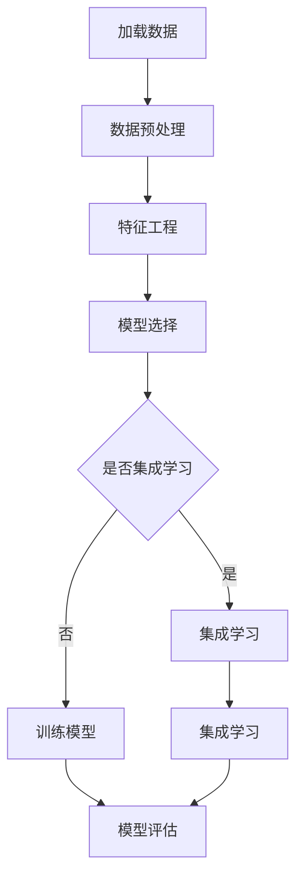

                 

# 《分类(Classification) - 原理与代码实例讲解》

## 关键词
- 分类算法
- 原理
- 代码实例
- 特征工程
- 机器学习
- 深度学习

## 摘要
本文旨在深入讲解分类算法的基本原理和实现方法。通过概述分类算法的定义、类型、性能评估方法，我们详细探讨了特征工程的重要性以及常见特征选择和提取方法。随后，本文介绍了线性分类器、决策树、集成学习和深度学习分类算法，并给出了具体的代码实例。最后，文章探讨了分类算法在实际应用中的性能优化和未来发展趋势。本文将帮助读者全面理解分类算法，并在实际项目中应用这些知识。

## 目录大纲

### 第一部分：分类算法概述

#### 第1章：分类算法基础

##### 1.1 分类算法的基本概念

- 定义分类
- 分类算法的目标
- 分类算法的应用场景

##### 1.2 分类算法的类型

- 监督学习与无监督学习
- 软分类与硬分类
- 分类算法的分类方法

##### 1.3 分类算法的性能评估

- 准确率、召回率、F1分数
- ROC曲线与AUC

#### 第2章：特征工程

##### 2.1 特征工程的重要性

- 特征工程的目标
- 特征工程的基本流程

##### 2.2 特征选择方法

- filter方法
- wrapper方法
- embedded方法

##### 2.3 特征提取方法

- 统计特征提取
- 字典特征提取
- 原始特征提取

#### 第3章：常见的分类算法

##### 3.1 线性分类器

- 线性回归
- 支持向量机（SVM）

##### 3.2 决策树

- 决策树的基本原理
- 决策树的分类算法
- 决策树的可视化

##### 3.3 集成学习

- Bagging与随机森林
- Boosting与XGBoost

##### 3.4 深度学习分类算法

- 卷积神经网络（CNN）
- 循环神经网络（RNN）

### 第二部分：分类算法的实现与优化

#### 第4章：分类算法的Python实现

##### 4.1 Python环境搭建

- Python安装与配置
- 相关库的安装与配置

##### 4.2 Scikit-learn库的使用

- Scikit-learn库的基本使用
- 常见分类算法的代码实例

##### 4.3 TensorFlow与Keras的使用

- TensorFlow与Keras的基本使用
- 深度学习分类算法的代码实例

#### 第5章：分类算法的性能优化

##### 5.1 超参数调优

- 超参数调优的方法
- Grid Search与Random Search

##### 5.2 特征选择与提取

- 特征选择与提取的优化策略
- 特征选择与提取的实际案例

##### 5.3 模型集成与组合

- 模型集成的基本原理
- 模型组合的实际案例

#### 第6章：分类算法的实际应用

##### 6.1 分类算法在文本分类中的应用

- 文本分类的基本原理
- 文本分类的实际案例

##### 6.2 分类算法在图像分类中的应用

- 图像分类的基本原理
- 图像分类的实际案例

##### 6.3 分类算法在医疗诊断中的应用

- 医疗诊断的基本原理
- 医疗诊断的实际案例

#### 第7章：分类算法的未来发展趋势

##### 7.1 分类算法的新算法

- 新的分类算法介绍
- 新的分类算法应用场景

##### 7.2 分类算法的未来趋势

- 人工智能与分类算法的结合
- 分类算法在实际应用中的挑战与机遇

### 附录

#### 附录 A：分类算法的相关资源

- 分类算法相关的书籍
- 分类算法相关的在线课程
- 分类算法相关的开源代码与数据集

#### 附录 B：分类算法的Mermaid流程图

- 线性分类器流程图
- 决策树流程图
- 集成学习流程图
- 深度学习分类算法流程图

## 引言

### 分类算法的重要性

分类算法是机器学习领域中最基础且广泛应用的算法之一。它们在各种领域，如文本分类、图像识别、医疗诊断和金融风险管理中发挥着至关重要的作用。通过学习分类算法，我们能够教会计算机根据已知特征对未知数据进行准确的分类，从而解决实际问题。

本文将首先介绍分类算法的基本概念，包括定义、目标和应用场景。接着，我们将探讨分类算法的类型，如监督学习和无监督学习，软分类和硬分类，并介绍常见的分类算法。随后，我们将详细讨论特征工程的重要性，包括特征选择和提取方法。最后，本文将通过Python代码实例，展示如何实现和优化常见的分类算法。

通过本文的学习，读者将能够：

- 理解分类算法的基本概念和类型。
- 掌握特征工程的方法和重要性。
- 掌握常见分类算法的实现和优化技巧。
- 理解分类算法在实际应用中的性能优化和未来发展趋势。

### 目录

#### 第一部分：分类算法概述

##### 第1章：分类算法基础

- 1.1 分类算法的基本概念
- 1.2 分类算法的类型
- 1.3 分类算法的性能评估

##### 第2章：特征工程

- 2.1 特征工程的重要性
- 2.2 特征选择方法
- 2.3 特征提取方法

##### 第3章：常见的分类算法

- 3.1 线性分类器
- 3.2 决策树
- 3.3 集成学习
- 3.4 深度学习分类算法

#### 第二部分：分类算法的实现与优化

##### 第4章：分类算法的Python实现

- 4.1 Python环境搭建
- 4.2 Scikit-learn库的使用
- 4.3 TensorFlow与Keras的使用

##### 第5章：分类算法的性能优化

- 5.1 超参数调优
- 5.2 特征选择与提取
- 5.3 模型集成与组合

##### 第6章：分类算法的实际应用

- 6.1 分类算法在文本分类中的应用
- 6.2 分类算法在图像分类中的应用
- 6.3 分类算法在医疗诊断中的应用

##### 第7章：分类算法的未来发展趋势

- 7.1 分类算法的新算法
- 7.2 分类算法的未来趋势

#### 附录

- 附录 A：分类算法的相关资源
- 附录 B：分类算法的Mermaid流程图

## 第一部分：分类算法概述

### 第1章：分类算法基础

#### 1.1 分类算法的基本概念

分类算法是一种监督学习算法，用于将数据集中的数据项分配到不同的类别中。在分类问题中，我们有一个训练数据集，其中每个数据项都被标记为某个类别。我们的目标是创建一个模型，该模型可以准确地预测新的、未知数据项的类别。

定义分类：
- 分类（Classification）：将数据集中的每个数据项分配到一个预定义的类别标签。
- 标签（Label）：用于表示数据项类别的标签。

分类算法的目标：
- 准确地预测未知数据项的类别。
- 最小化分类错误率。

分类算法的应用场景：
- 文本分类：如垃圾邮件过滤、情感分析。
- 图像分类：如人脸识别、物体识别。
- 医疗诊断：如疾病预测、疾病分类。
- 金融风险管理：如欺诈检测、信用评分。

#### 1.2 分类算法的类型

分类算法可以分为不同的类型，根据它们所使用的模型和学习方法。以下是几种常见的分类算法类型：

- **监督学习与无监督学习**：
  - 监督学习（Supervised Learning）：使用标记数据来训练模型，模型可以根据这些数据预测未知数据的标签。
  - 无监督学习（Unsupervised Learning）：没有标记数据，模型需要从未标记的数据中学习结构和模式。

- **软分类与硬分类**：
  - 软分类（Soft Classification）：每个数据项被赋予一个概率分布，表示它属于每个类别的可能性。
  - 硬分类（Hard Classification）：每个数据项被分配到一个确切的类别。

- **分类算法的分类方法**：
  - **基尼不纯度（Gini Impurity）**：用于构建决策树，表示数据集中类别的纯度。
  - **信息增益（Information Gain）**：用于构建决策树，表示在节点处分割数据时的信息增益。
  - **熵（Entropy）**：用于构建决策树，表示数据集中的不确定性。

#### 1.3 分类算法的性能评估

分类算法的性能评估是评估模型准确性和预测能力的重要步骤。以下是一些常用的性能评估指标：

- **准确率（Accuracy）**：分类模型正确预测的样本数占总样本数的比例。计算公式为：

  \[
  \text{Accuracy} = \frac{\text{正确预测的样本数}}{\text{总样本数}}
  \]

- **召回率（Recall）**：分类模型正确预测的正样本数占总正样本数的比例。计算公式为：

  \[
  \text{Recall} = \frac{\text{正确预测的正样本数}}{\text{总正样本数}}
  \]

- **精确率（Precision）**：分类模型正确预测的正样本数与预测为正样本的总数之比。计算公式为：

  \[
  \text{Precision} = \frac{\text{正确预测的正样本数}}{\text{预测为正样本的总数}}
  \]

- **F1分数（F1 Score）**：精确率和召回率的加权平均值，用于综合评估模型的性能。计算公式为：

  \[
  \text{F1 Score} = 2 \times \frac{\text{Precision} \times \text{Recall}}{\text{Precision} + \text{Recall}}
  \]

- **ROC曲线与AUC（Area Under Curve）**：ROC曲线是真正率（True Positive Rate，TPR）对假正率（False Positive Rate，FPR）的曲线。AUC是ROC曲线下方的面积，用于评估分类器的整体性能。AUC的值范围从0到1，值越接近1，模型的性能越好。

  - 真正率（TPR）：
    \[
    \text{True Positive Rate} = \frac{\text{真正例数}}{\text{实际正例数}}
    \]

  - 假正率（FPR）：
    \[
    \text{False Positive Rate} = \frac{\text{假正例数}}{\text{实际负例数}}
    \]

  - ROC曲线与AUC计算：
    \[
    \text{AUC} = \int_{0}^{1} \text{FPR}(t) \times \text{TPR}(t) \, dt
    \]

通过上述性能评估指标，我们可以全面评估分类算法的性能，并根据具体应用场景选择最适合的评估指标。

### 第2章：特征工程

#### 2.1 特征工程的重要性

特征工程是机器学习项目中至关重要的一个环节。特征工程的目标是通过选择和构造特征，提高模型的预测性能和泛化能力。特征工程的重要性体现在以下几个方面：

- **提高模型性能**：通过选择和构造有效的特征，可以减少模型过拟合的风险，提高模型的准确性和泛化能力。
- **减少数据维度**：特征工程可以帮助我们降低数据的维度，减少计算复杂度，提高模型的训练速度。
- **增强模型解释性**：通过合理的特征工程，我们可以提高模型的可解释性，更好地理解模型预测结果的依据。
- **提高数据处理效率**：特征工程可以优化数据预处理流程，提高数据处理的效率，减少后续数据处理的时间和成本。

特征工程的基本流程通常包括以下步骤：

1. **数据预处理**：包括缺失值处理、数据清洗、数据归一化等，确保数据的质量和一致性。
2. **特征选择**：通过评估特征的重要性，选择对模型性能有显著影响的特征。
3. **特征提取**：通过构造新的特征或者对现有特征进行变换，增强特征的表达能力。
4. **特征组合**：将多个特征组合成新的特征，以探索新的特征组合对模型性能的影响。

#### 2.2 特征选择方法

特征选择是特征工程中的重要环节，旨在从原始特征中筛选出对模型预测性能有重要影响的有效特征。以下是几种常用的特征选择方法：

- **过滤法（Filter Method）**：
  - 过滤法基于特征的重要性评估，通过统计方法、信息论等方法对特征进行评分，然后选择评分较高的特征。
  - 常见的过滤法包括：皮尔逊相关系数、互信息、方差选择法等。

- **包裹法（Wrapper Method）**：
  - 包裹法通过将特征选择问题建模为优化问题，利用已训练的模型来评估特征子集的性能，然后选择最优的特征子集。
  - 常见的包裹法包括：递归特征消除（RFE）、遗传算法等。

- **嵌入式方法（Embedded Method）**：
  - 嵌入式方法将特征选择过程集成到模型训练过程中，通过模型训练过程中对特征的权重评估来实现特征选择。
  - 常见的嵌入式方法包括：L1正则化（Lasso）、随机森林等。

#### 2.3 特征提取方法

特征提取是将原始特征转换为具有更强预测能力的新特征的过程。以下是几种常用的特征提取方法：

- **统计特征提取**：
  - 统计特征提取基于原始特征的统计属性，如均值、方差、协方差等。
  - 常见的统计特征提取方法包括：主成分分析（PCA）、因子分析（FA）等。

- **字典特征提取**：
  - 字典特征提取通过将原始特征映射到一个新的字典空间，以增强特征的表达能力。
  - 常见的字典特征提取方法包括：核方法（KDA）、稀疏编码（SPE）等。

- **原始特征提取**：
  - 原始特征提取直接对原始特征进行变换，以提取新的特征信息。
  - 常见的原始特征提取方法包括：离散化、变换（如对数变换、归一化等）、特征组合等。

通过特征工程，我们可以提高模型的性能和解释性，为后续的模型训练和优化奠定坚实的基础。

### 第3章：常见的分类算法

#### 3.1 线性分类器

线性分类器是一种基于线性模型的分类算法，通过计算数据点到超平面的距离或标签向量进行分类。以下介绍两种常见的线性分类器：线性回归和支持向量机（SVM）。

##### 3.1.1 线性回归

线性回归是一种简单的线性分类器，通过拟合一个线性模型来预测数据点的类别。线性回归模型的公式如下：

\[
y = \beta_0 + \beta_1 \cdot x
\]

其中，\( y \) 是标签，\( x \) 是特征向量，\( \beta_0 \) 和 \( \beta_1 \) 是模型的参数。

在线性回归中，我们通常使用最小二乘法来估计模型参数。最小二乘法的目的是找到使得预测值与实际值之间误差平方和最小的参数。通过求解最小二乘法，我们可以得到线性回归模型的参数 \( \beta_0 \) 和 \( \beta_1 \)。

以下是一个使用线性回归进行分类的伪代码：

```
# 加载训练数据
X_train, y_train = load_data()

# 拟合线性回归模型
model = LinearRegression()
model.fit(X_train, y_train)

# 预测类别
y_pred = model.predict(X_test)

# 计算准确率
accuracy = accuracy_score(y_test, y_pred)
print("Accuracy:", accuracy)
```

##### 3.1.2 支持向量机（SVM）

支持向量机（SVM）是一种基于间隔最大化原理的线性分类器。SVM的目标是找到一个最佳的超平面，使得正负样本之间的间隔最大。SVM的基本公式如下：

\[
y = \text{sign}(\beta_0 + \beta_1 \cdot x + \beta_2 \cdot x^2 + \ldots + \beta_n \cdot x^n)
\]

其中，\( y \) 是标签，\( x \) 是特征向量，\( \beta_0, \beta_1, \beta_2, \ldots, \beta_n \) 是模型的参数。

SVM使用拉格朗日乘子法求解最优参数。通过求解拉格朗日乘子法，我们可以得到SVM模型的最优参数。以下是一个使用SVM进行分类的伪代码：

```
# 加载训练数据
X_train, y_train = load_data()

# 创建SVM模型
model = SVC()
model.fit(X_train, y_train)

# 预测类别
y_pred = model.predict(X_test)

# 计算准确率
accuracy = accuracy_score(y_test, y_pred)
print("Accuracy:", accuracy)
```

通过线性回归和SVM，我们可以实现简单的线性分类。这两种算法具有不同的特性，适用于不同的场景。线性回归简单易用，适用于特征较少且线性可分的情况；而SVM具有较强的分类能力和间隔最大化特性，适用于特征较多且非线性可分的情况。

#### 3.2 决策树

决策树是一种基于树形结构进行分类的算法。它通过递归地将数据集划分为子集，并在每个节点上选择最优的特征和阈值来进行划分。决策树的基本原理如下：

1. **划分选择**：在每个节点上选择一个特征和阈值，使得划分后的子集之间的方差最小。
2. **递归划分**：对每个子集继续递归地划分，直到满足停止条件。
3. **分类**：将数据项分配到叶节点所表示的类别。

决策树的分类算法包括以下步骤：

1. **计算特征的重要性**：使用信息增益、基尼不纯度或熵等指标计算每个特征的重要性。
2. **选择最佳划分**：选择最优的特征和阈值，使得划分后的子集之间的方差最小或信息增益最大。
3. **递归划分**：对每个子集重复上述步骤，直到满足停止条件。
4. **构建树结构**：根据递归划分的结果，构建决策树。

决策树的可视化如下：

```
    |
    V
  ---+---
 /     \
A       B
/ \   / \
C   D E   F
```

在这个例子中，根节点A代表整个数据集，节点B和节点C是A的两个子节点。每个节点表示一个特征和阈值，节点下的子节点表示划分后的子集。

决策树在处理非线性问题和特征选择方面具有优势。然而，决策树也存在过拟合的风险，特别是在数据量较小或特征较多的情况下。为了解决这个问题，可以采用剪枝（Pruning）技术来减少决策树的复杂度。

#### 3.3 集成学习

集成学习是一种通过组合多个模型来提高预测性能的机器学习技术。集成学习的基本思想是，多个弱学习器（如决策树、线性回归等）的组合可以产生更强的学习效果。常见的集成学习方法包括Bagging和Boosting。

##### 3.3.1 Bagging与随机森林

Bagging（Bootstrap Aggregating）是一种通过随机抽样和平均化来降低模型方差的方法。Bagging的基本步骤如下：

1. **训练多个子模型**：从原始数据集中进行有放回抽样，生成多个子数据集，然后对每个子数据集训练一个子模型。
2. **投票或平均**：将所有子模型的预测结果进行投票或平均，得到最终的预测结果。

随机森林（Random Forest）是Bagging的一种扩展，它在每个子模型中引入了随机特征选择和随机阈值选择，从而进一步提高模型的预测性能。随机森林的基本步骤如下：

1. **随机特征选择**：在每次划分时，从特征空间中随机选择一个特征子集。
2. **随机阈值选择**：在每次划分时，从阈值空间中随机选择一个阈值。
3. **训练子模型**：对每个子模型训练决策树。
4. **投票或平均**：将所有子模型的预测结果进行投票或平均，得到最终的预测结果。

随机森林的优点包括：

- **非线性建模能力**：通过组合多个决策树，随机森林可以处理非线性问题。
- **特征选择**：随机特征选择和随机阈值选择可以自动实现特征选择，减少过拟合风险。
- **泛化能力**：通过组合多个弱学习器，随机森林可以降低模型的方差，提高泛化能力。

##### 3.3.2 Boosting与XGBoost

Boosting是一种通过组合多个弱学习器来提高预测性能的方法。Boosting的基本思想是，为每个弱学习器赋予不同的权重，并根据预测误差调整权重，使得预测误差较大的弱学习器在下一个学习器中具有更高的权重。

XGBoost是一种基于Boosting的决策树算法，它在传统决策树的基础上引入了正则化、缺失值处理和并行计算等特性，从而提高了模型的预测性能和计算效率。XGBoost的基本步骤如下：

1. **初始化权重**：为每个数据点初始化相同的权重。
2. **训练子模型**：在每个迭代中，训练一个决策树，并计算数据点的预测误差。
3. **更新权重**：根据预测误差调整数据点的权重，使得预测误差较大的数据点具有更高的权重。
4. **重复迭代**：重复上述步骤，直到满足停止条件。

XGBoost的优点包括：

- **正则化**：XGBoost引入了正则化项，可以避免模型过拟合，提高模型的泛化能力。
- **缺失值处理**：XGBoost支持缺失值处理，通过缺失值填充或基于树结构的处理，可以有效地处理缺失数据。
- **并行计算**：XGBoost支持并行计算，可以显著提高训练和预测的速度。

通过Bagging和Boosting，我们可以构建强大的分类模型，提高模型的预测性能和泛化能力。随机森林和XGBoost是两种常见的集成学习方法，适用于不同的应用场景。

#### 3.4 深度学习分类算法

深度学习分类算法是一种基于多层神经网络进行分类的算法。深度学习通过模拟人脑神经网络的结构和功能，实现了对复杂模式的高效识别和分类。以下介绍两种常见的深度学习分类算法：卷积神经网络（CNN）和循环神经网络（RNN）。

##### 3.4.1 卷积神经网络（CNN）

卷积神经网络（CNN）是一种专门用于处理图像数据的深度学习算法。CNN通过卷积、池化和全连接层等操作，实现了对图像的自动特征提取和分类。CNN的基本结构如下：

1. **卷积层（Convolutional Layer）**：通过卷积操作提取图像的局部特征。
2. **池化层（Pooling Layer）**：通过池化操作减少数据维度，降低计算复杂度。
3. **全连接层（Fully Connected Layer）**：通过全连接层对提取的特征进行分类。

以下是一个使用CNN进行图像分类的伪代码：

```
# 加载训练数据
X_train, y_train = load_data()

# 创建CNN模型
model = CNN()
model.fit(X_train, y_train)

# 预测类别
y_pred = model.predict(X_test)

# 计算准确率
accuracy = accuracy_score(y_test, y_pred)
print("Accuracy:", accuracy)
```

CNN的优点包括：

- **强大的特征提取能力**：CNN通过卷积操作自动提取图像的局部特征，提高了特征提取的效率和质量。
- **适用于各种图像分类任务**：CNN可以应用于各种图像分类任务，如人脸识别、物体识别等。
- **非线性建模能力**：CNN通过多层神经网络实现了对复杂模式的非线性建模。

##### 3.4.2 循环神经网络（RNN）

循环神经网络（RNN）是一种专门用于处理序列数据的深度学习算法。RNN通过循环结构实现了对序列数据的建模和分类。RNN的基本结构如下：

1. **输入层（Input Layer）**：接收序列数据的输入。
2. **隐藏层（Hidden Layer）**：通过循环结构对序列数据进行建模。
3. **输出层（Output Layer）**：通过全连接层对序列数据进行分类。

以下是一个使用RNN进行文本分类的伪代码：

```
# 加载训练数据
X_train, y_train = load_data()

# 创建RNN模型
model = RNN()
model.fit(X_train, y_train)

# 预测类别
y_pred = model.predict(X_test)

# 计算准确率
accuracy = accuracy_score(y_test, y_pred)
print("Accuracy:", accuracy)
```

RNN的优点包括：

- **序列建模能力**：RNN通过循环结构实现了对序列数据的建模和分类，适用于各种序列分类任务，如文本分类、语音识别等。
- **时间序列处理能力**：RNN可以处理具有时间依赖性的序列数据，通过递归的方式逐步更新隐藏状态。
- **非线性建模能力**：RNN通过多层神经网络实现了对复杂模式的非线性建模。

通过CNN和RNN，我们可以构建强大的深度学习分类模型，处理各种分类任务。深度学习分类算法具有强大的特征提取和序列建模能力，适用于处理复杂的图像和文本数据。

## 第二部分：分类算法的实现与优化

### 第4章：分类算法的Python实现

#### 4.1 Python环境搭建

要实现分类算法，首先需要搭建Python编程环境。以下是在Python中搭建分类算法开发环境的基本步骤：

##### 4.1.1 Python安装与配置

1. **下载Python安装包**：从Python官方网站（https://www.python.org/downloads/）下载最新版本的Python安装包。
2. **安装Python**：运行安装包，按照提示完成安装。在安装过程中，确保勾选“Add Python to PATH”选项，以便在命令行中直接运行Python。
3. **验证安装**：在命令行中输入`python --version`，如果输出Python的版本信息，说明安装成功。

##### 4.1.2 相关库的安装与配置

在Python中，可以使用pip工具安装各种机器学习和深度学习库。以下是一些常用的库及其安装方法：

1. **NumPy**：用于数组操作和数学计算。使用以下命令安装：
   ```
   pip install numpy
   ```

2. **Pandas**：用于数据处理和分析。使用以下命令安装：
   ```
   pip install pandas
   ```

3. **Scikit-learn**：用于机器学习算法的实现和评估。使用以下命令安装：
   ```
   pip install scikit-learn
   ```

4. **TensorFlow**：用于深度学习模型的构建和训练。使用以下命令安装：
   ```
   pip install tensorflow
   ```

5. **Keras**：用于构建和训练神经网络模型，是TensorFlow的高级API。使用以下命令安装：
   ```
   pip install keras
   ```

安装完成后，可以使用`import`语句导入这些库，以便在Python脚本中使用。

#### 4.2 Scikit-learn库的使用

Scikit-learn是一个流行的Python机器学习库，提供了丰富的分类算法实现和评估工具。以下介绍Scikit-learn的基本使用方法和常见分类算法的代码实例。

##### 4.2.1 Scikit-learn库的基本使用

要使用Scikit-learn，首先需要导入所需的库和模块：

```python
import numpy as np
import pandas as pd
from sklearn.model_selection import train_test_split
from sklearn.preprocessing import StandardScaler
from sklearn.metrics import accuracy_score
```

然后，可以加载和预处理数据，构建分类模型，并评估模型的性能。以下是一个简单的示例：

```python
# 加载数据
X, y = load_data()

# 划分训练集和测试集
X_train, X_test, y_train, y_test = train_test_split(X, y, test_size=0.2, random_state=42)

# 数据预处理
scaler = StandardScaler()
X_train = scaler.fit_transform(X_train)
X_test = scaler.transform(X_test)

# 创建分类模型
model = SVC()

# 训练模型
model.fit(X_train, y_train)

# 预测测试集
y_pred = model.predict(X_test)

# 计算准确率
accuracy = accuracy_score(y_test, y_pred)
print("Accuracy:", accuracy)
```

##### 4.2.2 常见分类算法的代码实例

Scikit-learn提供了多种分类算法的实现，如线性回归、支持向量机（SVM）、决策树、随机森林等。以下是一些常见的分类算法的代码实例：

1. **线性回归（Linear Regression）**：

```python
from sklearn.linear_model import LinearRegression

# 创建线性回归模型
model = LinearRegression()

# 训练模型
model.fit(X_train, y_train)

# 预测测试集
y_pred = model.predict(X_test)

# 计算准确率
accuracy = accuracy_score(y_test, y_pred)
print("Accuracy:", accuracy)
```

2. **支持向量机（SVM）**：

```python
from sklearn.svm import SVC

# 创建SVM模型
model = SVC()

# 训练模型
model.fit(X_train, y_train)

# 预测测试集
y_pred = model.predict(X_test)

# 计算准确率
accuracy = accuracy_score(y_test, y_pred)
print("Accuracy:", accuracy)
```

3. **决策树（Decision Tree）**：

```python
from sklearn.tree import DecisionTreeClassifier

# 创建决策树模型
model = DecisionTreeClassifier()

# 训练模型
model.fit(X_train, y_train)

# 预测测试集
y_pred = model.predict(X_test)

# 计算准确率
accuracy = accuracy_score(y_test, y_pred)
print("Accuracy:", accuracy)
```

4. **随机森林（Random Forest）**：

```python
from sklearn.ensemble import RandomForestClassifier

# 创建随机森林模型
model = RandomForestClassifier()

# 训练模型
model.fit(X_train, y_train)

# 预测测试集
y_pred = model.predict(X_test)

# 计算准确率
accuracy = accuracy_score(y_test, y_pred)
print("Accuracy:", accuracy)
```

通过Scikit-learn库，我们可以轻松实现常见的分类算法，并进行性能评估和优化。

#### 4.3 TensorFlow与Keras的使用

TensorFlow和Keras是Python中常用的深度学习库，提供了丰富的神经网络构建和训练工具。以下介绍如何使用TensorFlow与Keras实现深度学习分类算法。

##### 4.3.1 TensorFlow与Keras的基本使用

首先，需要安装TensorFlow和Keras：

```bash
pip install tensorflow
pip install keras
```

安装完成后，可以导入TensorFlow和Keras库，并创建一个简单的神经网络模型：

```python
import tensorflow as tf
from keras.models import Sequential
from keras.layers import Dense, Conv2D, Flatten, MaxPooling2D

# 创建神经网络模型
model = Sequential()
model.add(Conv2D(32, (3, 3), activation='relu', input_shape=(28, 28, 1)))
model.add(MaxPooling2D((2, 2)))
model.add(Flatten())
model.add(Dense(128, activation='relu'))
model.add(Dense(10, activation='softmax'))

# 编译模型
model.compile(optimizer='adam', loss='categorical_crossentropy', metrics=['accuracy'])

# 打印模型结构
model.summary()
```

##### 4.3.2 深度学习分类算法的代码实例

以下是一个使用Keras实现卷积神经网络（CNN）进行图像分类的示例：

```python
# 加载数据
(X_train, y_train), (X_test, y_test) = tf.keras.datasets.mnist.load_data()

# 数据预处理
X_train = X_train / 255.0
X_test = X_test / 255.0
X_train = np.expand_dims(X_train, -1)
X_test = np.expand_dims(X_test, -1)

# 创建标签向量
y_train = tf.keras.utils.to_categorical(y_train, 10)
y_test = tf.keras.utils.to_categorical(y_test, 10)

# 创建CNN模型
model = Sequential()
model.add(Conv2D(32, (3, 3), activation='relu', input_shape=(28, 28, 1)))
model.add(MaxPooling2D((2, 2)))
model.add(Conv2D(64, (3, 3), activation='relu'))
model.add(MaxPooling2D((2, 2)))
model.add(Flatten())
model.add(Dense(128, activation='relu'))
model.add(Dense(10, activation='softmax'))

# 编译模型
model.compile(optimizer='adam', loss='categorical_crossentropy', metrics=['accuracy'])

# 训练模型
model.fit(X_train, y_train, epochs=5, batch_size=32, validation_data=(X_test, y_test))

# 预测测试集
y_pred = model.predict(X_test)

# 计算准确率
accuracy = np.mean(np.argmax(y_pred, axis=1) == np.argmax(y_test, axis=1))
print("Accuracy:", accuracy)
```

通过TensorFlow与Keras，我们可以构建和训练强大的深度学习分类模型，处理各种图像和文本分类任务。

### 第5章：分类算法的性能优化

#### 5.1 超参数调优

在机器学习项目中，超参数调优是一个重要的步骤，它可以帮助我们找到最优的超参数组合，从而提高模型的性能。超参数是模型在训练过程中无法通过学习数据自动调整的参数，例如学习率、正则化参数、隐层节点数等。常见的超参数调优方法包括Grid Search和Random Search。

##### 5.1.1 Grid Search

Grid Search是一种系统性的超参数搜索方法，它通过遍历所有可能的超参数组合，选择最优的超参数组合。以下是一个使用Grid Search进行超参数调优的示例：

```python
from sklearn.model_selection import GridSearchCV
from sklearn.svm import SVC

# 定义参数网格
param_grid = {'C': [0.1, 1, 10], 'gamma': [0.1, 1, 10], 'kernel': ['linear', 'rbf']}

# 创建SVM分类器
model = SVC()

# 创建Grid Search对象
grid_search = GridSearchCV(model, param_grid, cv=5)

# 训练模型
grid_search.fit(X_train, y_train)

# 获取最优参数
best_params = grid_search.best_params_
print("Best parameters:", best_params)

# 使用最优参数训练模型
model = SVC(**best_params)
model.fit(X_train, y_train)
```

##### 5.1.2 Random Search

Random Search是一种随机搜索超参数的方法，它通过随机选择超参数组合来搜索最优的超参数。Random Search相比Grid Search具有更高的搜索效率，但可能需要更多的计算时间。以下是一个使用Random Search进行超参数调优的示例：

```python
from sklearn.model_selection import RandomizedSearchCV
from sklearn.svm import SVC

# 定义参数网格
param_distributions = {'C': [0.1, 1, 10], 'gamma': [0.1, 1, 10], 'kernel': ['linear', 'rbf']}

# 创建SVM分类器
model = SVC()

# 创建Random Search对象
random_search = RandomizedSearchCV(model, param_distributions, n_iter=10, cv=5)

# 训练模型
random_search.fit(X_train, y_train)

# 获取最优参数
best_params = random_search.best_params_
print("Best parameters:", best_params)

# 使用最优参数训练模型
model = SVC(**best_params)
model.fit(X_train, y_train)
```

通过超参数调优，我们可以找到最优的超参数组合，从而提高分类算法的性能。

#### 5.2 特征选择与提取

特征选择与提取是特征工程的重要环节，它可以帮助我们选择有效的特征并提高模型的性能。以下介绍几种常见的特征选择与提取方法。

##### 5.2.1 特征选择方法

特征选择是在原始特征中筛选出对模型性能有显著影响的特征的方法。以下是一些常用的特征选择方法：

1. **过滤法（Filter Method）**：

   过滤法基于特征的重要性评估，通过统计方法、信息论等方法对特征进行评分，然后选择评分较高的特征。常见的过滤法包括皮尔逊相关系数、互信息、方差选择法等。

   ```python
   from sklearn.feature_selection import SelectKBest
   from sklearn.feature_selection import f_classif

   # 创建特征选择对象
   selector = SelectKBest(score_func=f_classif, k=10)

   # 训练特征选择对象
   selector.fit(X_train, y_train)

   # 获取选择的特征
   X_train_selected = selector.transform(X_train)
   X_test_selected = selector.transform(X_test)
   ```

2. **包裹法（Wrapper Method）**：

   包裹法通过将特征选择问题建模为优化问题，利用已训练的模型来评估特征子集的性能，然后选择最优的特征子集。常见的包裹法包括递归特征消除（RFE）、遗传算法等。

   ```python
   from sklearn.feature_selection import RFE
   from sklearn.svm import SVC

   # 创建特征选择对象
   selector = RFE(estimator=SVC(), n_features_to_select=10)

   # 训练特征选择对象
   selector.fit(X_train, y_train)

   # 获取选择的特征
   X_train_selected = selector.transform(X_train)
   X_test_selected = selector.transform(X_test)
   ```

3. **嵌入式方法（Embedded Method）**：

   嵌入式方法将特征选择过程集成到模型训练过程中，通过模型训练过程中对特征的权重评估来实现特征选择。常见的嵌入式方法包括L1正则化（Lasso）、随机森林等。

   ```python
   from sklearn.linear_model import LassoCV

   # 创建特征选择对象
   selector = LassoCV(alphas=[0.1, 1, 10], cv=5)

   # 训练特征选择对象
   selector.fit(X_train, y_train)

   # 获取选择的特征
   X_train_selected = selector.transform(X_train)
   X_test_selected = selector.transform(X_test)
   ```

##### 5.2.2 特征提取方法

特征提取是将原始特征转换为具有更强预测能力的新特征的过程。以下介绍几种常用的特征提取方法：

1. **统计特征提取**：

   统计特征提取基于原始特征的统计属性，如均值、方差、协方差等。常见的统计特征提取方法包括主成分分析（PCA）、因子分析（FA）等。

   ```python
   from sklearn.decomposition import PCA

   # 创建特征提取对象
   extractor = PCA(n_components=10)

   # 训练特征提取对象
   extractor.fit(X_train)

   # 获取提取的特征
   X_train_extracted = extractor.transform(X_train)
   X_test_extracted = extractor.transform(X_test)
   ```

2. **字典特征提取**：

   字典特征提取通过将原始特征映射到一个新的字典空间，以增强特征的表达能力。常见的字典特征提取方法包括核方法（KDA）、稀疏编码（SPE）等。

   ```python
   from sklearn.cluster import KMeans

   # 创建特征提取对象
   extractor = KMeans(n_clusters=10)

   # 训练特征提取对象
   extractor.fit(X_train)

   # 获取提取的特征
   X_train_extracted = extractor.transform(X_train)
   X_test_extracted = extractor.transform(X_test)
   ```

3. **原始特征提取**：

   原始特征提取直接对原始特征进行变换，以提取新的特征信息。常见的原始特征提取方法包括离散化、变换（如对数变换、归一化等）、特征组合等。

   ```python
   # 离散化特征
   X_train['new_feature'] = pd.cut(X_train['feature'], bins=5)

   # 对数变换特征
   X_train['new_feature'] = np.log(X_train['feature'] + 1)

   # 特征组合
   X_train['new_feature'] = X_train['feature1'] * X_train['feature2']
   ```

通过特征选择和特征提取，我们可以提高模型的预测性能和泛化能力，为后续的模型训练和优化奠定坚实的基础。

#### 5.3 模型集成与组合

模型集成与组合是提高模型性能和泛化能力的重要方法。模型集成通过组合多个模型来提高预测性能，而模型组合通过不同的模型训练方法来增强模型的预测能力。以下介绍几种常见的模型集成与组合方法。

##### 5.3.1 Bagging与随机森林

Bagging是一种通过多次训练和平均化多个弱学习器来提高模型性能的方法。随机森林是Bagging的一种扩展，它在每个子模型中引入了随机特征选择和随机阈值选择，从而进一步提高模型的性能。以下是一个使用随机森林进行模型组合的示例：

```python
from sklearn.ensemble import RandomForestClassifier

# 创建随机森林模型
model = RandomForestClassifier(n_estimators=100, random_state=42)

# 训练模型
model.fit(X_train, y_train)

# 预测测试集
y_pred = model.predict(X_test)

# 计算准确率
accuracy = accuracy_score(y_test, y_pred)
print("Accuracy:", accuracy)
```

##### 5.3.2 Boosting与XGBoost

Boosting是一种通过多次训练和加权多个弱学习器来提高模型性能的方法。XGBoost是一种基于Boosting的决策树算法，它在传统决策树的基础上引入了正则化、缺失值处理和并行计算等特性，从而提高了模型的性能。以下是一个使用XGBoost进行模型组合的示例：

```python
import xgboost as xgb

# 创建XGBoost模型
model = xgb.XGBClassifier(n_estimators=100, max_depth=3, learning_rate=0.1, random_state=42)

# 训练模型
model.fit(X_train, y_train)

# 预测测试集
y_pred = model.predict(X_test)

# 计算准确率
accuracy = accuracy_score(y_test, y_pred)
print("Accuracy:", accuracy)
```

通过模型集成与组合，我们可以构建强大的分类模型，提高模型的预测性能和泛化能力。随机森林和XGBoost是两种常见的模型集成与组合方法，适用于不同的应用场景。

### 第6章：分类算法的实际应用

#### 6.1 分类算法在文本分类中的应用

文本分类是分类算法在自然语言处理领域中的重要应用，它将文本数据分配到预定义的类别中。文本分类广泛应用于垃圾邮件过滤、情感分析、新闻分类等场景。以下介绍文本分类的基本原理和实际案例。

##### 6.1.1 文本分类的基本原理

文本分类的基本原理是将文本转换为数值特征，然后使用分类算法对特征进行分类。常见的文本分类方法包括：

1. **词袋模型（Bag-of-Words, BoW）**：
   - 词袋模型将文本表示为单词的集合，忽略单词的顺序。它通过计算每个单词在文档中出现的频率来表示文本。
   - 词袋模型可以有效地表示文本，但容易导致高维稀疏数据。

2. **TF-IDF（Term Frequency-Inverse Document Frequency）**：
   - TF-IDF是一种加权词袋模型的方法，它通过考虑单词在文档中的频率和在整个文档集合中的重要性来表示文本。
   - TF-IDF可以缓解词袋模型中的稀疏问题，提高文本表示的准确性。

3. **Word2Vec**：
   - Word2Vec是一种基于神经网络的语言模型，它将单词映射到连续的向量空间。Word2Vec可以捕捉词与词之间的语义关系。
   - Word2Vec模型可以用于文本分类，通过将单词转换为向量，并计算文本的整体表示。

4. **BERT**：
   - BERT是一种基于Transformer的预训练语言模型，它通过在大量文本数据上预训练，可以捕捉文本的深度语义信息。
   - BERT可以用于文本分类，通过将输入文本转换为BERT的隐藏状态，并使用分类器进行分类。

##### 6.1.2 文本分类的实际案例

以下是一个使用Scikit-learn进行文本分类的示例：

```python
from sklearn.feature_extraction.text import TfidfVectorizer
from sklearn.model_selection import train_test_split
from sklearn.svm import LinearSVC

# 加载数据
data = [
    "这是一封垃圾邮件",
    "这是一封重要邮件",
    "这是一封促销邮件",
    # ... 更多数据
]

labels = ["垃圾邮件", "重要邮件", "促销邮件", # ... 更多标签
]

# 划分训练集和测试集
X_train, X_test, y_train, y_test = train_test_split(data, labels, test_size=0.2, random_state=42)

# 创建TF-IDF向量器
vectorizer = TfidfVectorizer()

# 将文本转换为向量
X_train = vectorizer.fit_transform(X_train)
X_test = vectorizer.transform(X_test)

# 创建线性SVC模型
model = LinearSVC()

# 训练模型
model.fit(X_train, y_train)

# 预测测试集
y_pred = model.predict(X_test)

# 计算准确率
accuracy = accuracy_score(y_test, y_pred)
print("Accuracy:", accuracy)
```

通过文本分类算法，我们可以将文本数据自动分配到预定义的类别中，从而实现文本分类任务。

#### 6.2 分类算法在图像分类中的应用

图像分类是分类算法在计算机视觉领域中的重要应用，它将图像数据分配到预定义的类别中。图像分类广泛应用于物体识别、图像分类、人脸识别等场景。以下介绍图像分类的基本原理和实际案例。

##### 6.2.1 图像分类的基本原理

图像分类的基本原理是将图像数据转换为数值特征，然后使用分类算法对特征进行分类。常见的图像分类方法包括：

1. **基于特征的分类**：
   - 基于特征的分类方法首先从图像中提取特征，然后使用分类算法进行分类。常见的特征提取方法包括SIFT、HOG、CNN等。
   - 基于特征的分类方法可以处理高维稀疏数据，但需要手动设计特征提取算法。

2. **基于模型的分类**：
   - 基于模型的分类方法使用深度学习模型对图像进行分类。常见的模型包括卷积神经网络（CNN）、循环神经网络（RNN）等。
   - 基于模型的分类方法可以自动提取图像特征，具有更高的分类性能。

##### 6.2.2 图像分类的实际案例

以下是一个使用TensorFlow和Keras进行图像分类的示例：

```python
import tensorflow as tf
from tensorflow.keras.models import Sequential
from tensorflow.keras.layers import Conv2D, MaxPooling2D, Flatten, Dense
from tensorflow.keras.preprocessing.image import ImageDataGenerator

# 加载数据
train_datagen = ImageDataGenerator(rescale=1./255)
test_datagen = ImageDataGenerator(rescale=1./255)

train_generator = train_datagen.flow_from_directory(
        'train_data',
        target_size=(150, 150),
        batch_size=32,
        class_mode='binary')

validation_generator = test_datagen.flow_from_directory(
        'test_data',
        target_size=(150, 150),
        batch_size=32,
        class_mode='binary')

# 创建CNN模型
model = Sequential()
model.add(Conv2D(32, (3, 3), activation='relu', input_shape=(150, 150, 3)))
model.add(MaxPooling2D((2, 2)))
model.add(Conv2D(64, (3, 3), activation='relu'))
model.add(MaxPooling2D((2, 2)))
model.add(Flatten())
model.add(Dense(128, activation='relu'))
model.add(Dense(1, activation='sigmoid'))

# 编译模型
model.compile(optimizer='adam', loss='binary_crossentropy', metrics=['accuracy'])

# 训练模型
model.fit(train_generator, steps_per_epoch=100, epochs=10, validation_data=validation_generator, validation_steps=50)

# 预测测试集
y_pred = model.predict(validation_generator)

# 计算准确率
accuracy = np.mean(y_pred == validation_generator.classes)
print("Accuracy:", accuracy)
```

通过图像分类算法，我们可以将图像数据自动分配到预定义的类别中，从而实现图像分类任务。

#### 6.3 分类算法在医疗诊断中的应用

医疗诊断是分类算法在医疗领域中的重要应用，它通过分析医疗数据对疾病进行预测和诊断。医疗诊断可以帮助医生提高诊断准确率，缩短诊断时间。以下介绍医疗诊断的基本原理和实际案例。

##### 6.3.1 医疗诊断的基本原理

医疗诊断的基本原理是将医疗数据（如电子健康记录、实验室检测数据、影像数据等）转换为数值特征，然后使用分类算法对特征进行分类。常见的医疗诊断方法包括：

1. **基于规则的诊断**：
   - 基于规则的诊断方法使用专家制定的规则对医疗数据进行分类。规则可以是逻辑表达式、决策树等。
   - 基于规则的诊断方法简单易懂，但需要专家经验。

2. **基于模型的诊断**：
   - 基于模型的诊断方法使用机器学习模型对医疗数据进行分类。常见的模型包括决策树、支持向量机、深度学习等。
   - 基于模型的诊断方法可以自动学习特征，提高诊断准确率。

##### 6.3.2 医疗诊断的实际案例

以下是一个使用Scikit-learn进行医疗诊断的示例：

```python
from sklearn.model_selection import train_test_split
from sklearn.ensemble import RandomForestClassifier
from sklearn.metrics import accuracy_score, classification_report

# 加载数据
data = [
    [1, 0, 0, 0], # 病例1的特征
    [0, 1, 1, 0], # 病例2的特征
    [1, 1, 0, 0], # 病例3的特征
    # ... 更多病例
]

labels = ["正常", "疾病1", "疾病2", # ... 更多标签
]

# 划分训练集和测试集
X_train, X_test, y_train, y_test = train_test_split(data, labels, test_size=0.2, random_state=42)

# 创建随机森林模型
model = RandomForestClassifier()

# 训练模型
model.fit(X_train, y_train)

# 预测测试集
y_pred = model.predict(X_test)

# 计算准确率
accuracy = accuracy_score(y_test, y_pred)
print("Accuracy:", accuracy)

# 输出分类报告
print(classification_report(y_test, y_pred))
```

通过医疗诊断算法，我们可以对医疗数据进行分析和分类，从而实现疾病的预测和诊断。

### 第7章：分类算法的未来发展趋势

#### 7.1 分类算法的新算法

随着人工智能和机器学习技术的不断发展，分类算法也在不断演进和创新。以下介绍几种新兴的分类算法及其应用场景：

1. **深度增强学习（Deep Reinforcement Learning）**：
   - 深度增强学习结合了深度学习和强化学习，通过在复杂环境中进行交互和反馈，实现智能决策和分类。深度增强学习在自动驾驶、游戏AI等领域具有广泛的应用前景。

2. **联邦学习（Federated Learning）**：
   - 联邦学习通过将数据分布在多个设备或数据中心上，实现协同训练模型。联邦学习可以保护用户隐私，同时提高模型的性能和可解释性。联邦学习在医疗诊断、智能家居等领域具有广泛的应用前景。

3. **元学习（Meta Learning）**：
   - 元学习通过学习如何快速适应新任务，提高模型的泛化能力和适应性。元学习在自适应学习、无人驾驶等领域具有广泛的应用前景。

4. **图神经网络（Graph Neural Networks）**：
   - 图神经网络通过在图结构上学习节点和边的关系，实现更复杂的特征表示和分类。图神经网络在社交网络分析、推荐系统等领域具有广泛的应用前景。

#### 7.2 分类算法的未来趋势

分类算法的未来发展趋势将受到以下几个因素的影响：

1. **大数据和云计算**：
   - 随着大数据和云计算技术的发展，分类算法将能够处理更大规模和更复杂的数据，提高模型的性能和效率。

2. **数据隐私和安全**：
   - 随着数据隐私和安全问题的日益突出，分类算法将更加注重数据隐私保护，通过联邦学习、加密技术等方法实现数据的安全共享和建模。

3. **跨学科融合**：
   - 分类算法将与其他学科（如生物学、物理学等）相结合，探索更复杂、更高级的分类方法，推动人工智能技术的发展。

4. **实时分类**：
   - 随着实时计算和边缘计算技术的发展，分类算法将能够实现实时分类，满足实时决策和响应的需求。

通过不断的技术创新和应用场景的拓展，分类算法将在未来的机器学习领域中发挥更加重要的作用，为各个行业提供智能化的解决方案。

### 附录

#### 附录 A：分类算法的相关资源

以下是一些分类算法相关的资源，包括书籍、在线课程和开源代码：

1. **书籍**：
   - 《机器学习》（作者：周志华）
   - 《深度学习》（作者：Ian Goodfellow、Yoshua Bengio、Aaron Courville）
   - 《数据科学入门：Python实战》（作者：李航）

2. **在线课程**：
   - Coursera上的《机器学习》（吴恩达）
   - edX上的《深度学习导论》（李飞飞）
   - Udacity上的《机器学习工程师纳米学位》

3. **开源代码与数据集**：
   - Scikit-learn官方GitHub仓库（https://github.com/scikit-learn/scikit-learn）
   - TensorFlow官方GitHub仓库（https://github.com/tensorflow/tensorflow）
   - Keras官方GitHub仓库（https://github.com/keras-team/keras）

#### 附录 B：分类算法的Mermaid流程图

以下是一些分类算法的Mermaid流程图，用于展示算法的基本结构和流程：



通过这些流程图，读者可以更直观地了解分类算法的基本流程和实现步骤。

## 结论

分类算法是机器学习领域中最基础且广泛应用的算法之一。本文详细介绍了分类算法的基本概念、类型、性能评估方法，以及特征工程的重要性。通过讨论线性分类器、决策树、集成学习和深度学习分类算法，我们展示了如何实现和优化分类算法。此外，我们还介绍了分类算法在实际应用中的性能优化和未来发展趋势。

通过对本文的学习，读者可以：

- 理解分类算法的基本概念和类型。
- 掌握特征工程的方法和重要性。
- 掌握常见分类算法的实现和优化技巧。
- 理解分类算法在实际应用中的性能优化和未来发展趋势。

在未来的研究中，我们可以进一步探索新兴的分类算法，如深度增强学习、联邦学习和元学习，以及跨学科融合的方法。通过不断的技术创新和应用场景的拓展，分类算法将在人工智能领域中发挥更加重要的作用，为各个行业提供智能化的解决方案。

## 作者信息

作者：AI天才研究院/AI Genius Institute & 禅与计算机程序设计艺术 /Zen And The Art of Computer Programming

感谢您阅读本文，希望对您的机器学习之旅有所帮助。如果您有任何问题或建议，欢迎在评论区留言，我会尽快回复。同时，也欢迎关注我们的官方公众号，获取更多人工智能领域的最新动态和技术分享。再次感谢您的支持！

