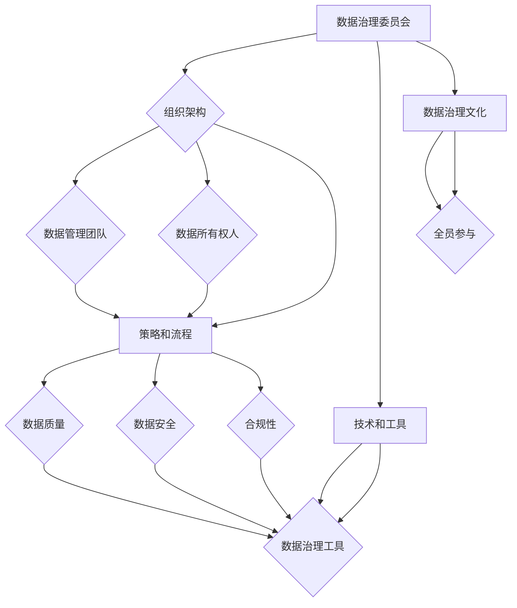

                 

### 《创业公司的数据治理与合规实践》

#### 关键词：
- 数据治理
- 合规性实践
- 数据质量
- 数据安全
- GDPR
- CCPA

#### 摘要：
本文旨在为创业公司提供数据治理与合规性的深入指导。通过详细探讨数据治理的核心概念、框架、实践以及合规性要求，本文帮助创业公司了解如何有效地管理数据，确保数据质量与安全性，同时满足法规要求，为业务发展奠定坚实基础。

----------------------------------------------------------------

## 《创业公司的数据治理与合规实践》目录大纲

### 第一部分：数据治理基础

#### 第1章：数据治理概述

##### 1.1 数据治理的定义与重要性
##### 1.2 数据治理的核心目标和原则
##### 1.3 数据治理的挑战和机遇

#### 第2章：数据治理框架

##### 2.1 数据治理体系架构
##### 2.2 数据治理组织与职责
##### 2.3 数据治理流程与方法

#### 第3章：数据质量与治理

##### 3.1 数据质量的定义与度量
##### 3.2 数据质量治理策略
##### 3.3 数据清洗与数据转换

#### 第4章：数据安全与隐私保护

##### 4.1 数据安全的基本概念
##### 4.2 数据隐私保护策略
##### 4.3 GDPR和 CCPA合规性要求

#### 第5章：数据合规性管理

##### 5.1 合规性管理的重要性
##### 5.2 合规性管理的实施步骤
##### 5.3 合规性管理的关键因素

### 第二部分：数据治理实战

#### 第6章：数据治理项目规划与执行

##### 6.1 数据治理项目的启动
##### 6.2 数据治理项目的管理
##### 6.3 数据治理项目的风险评估与控制

#### 第7章：数据治理工具与技术

##### 7.1 数据治理工具概述
##### 7.2 数据治理技术实践
##### 7.3 数据治理工具选型与评估

#### 第8章：数据治理案例分析

##### 8.1 创业公司数据治理案例介绍
##### 8.2 数据治理案例分析与总结
##### 8.3 数据治理案例中的挑战与解决方案

#### 第9章：数据治理持续改进与优化

##### 9.1 数据治理持续改进机制
##### 9.2 数据治理效果的评估与反馈
##### 9.3 数据治理优化策略与实践

### 第三部分：附录

#### 附录A：数据治理相关资源与工具

##### A.1 数据治理相关书籍与文献
##### A.2 数据治理工具列表
##### A.3 数据治理标准与规范

#### 附录B：数据治理常用术语表

##### B.1 数据治理相关术语定义
##### B.2 数据治理常见问题与解答

---

### 《创业公司的数据治理与合规实践》

#### 关键词：
- 数据治理
- 合规性实践
- 数据质量
- 数据安全
- GDPR
- CCPA

#### 摘要：
本文旨在为创业公司提供数据治理与合规性的深入指导。通过详细探讨数据治理的核心概念、框架、实践以及合规性要求，本文帮助创业公司了解如何有效地管理数据，确保数据质量与安全性，同时满足法规要求，为业务发展奠定坚实基础。

----------------------------------------------------------------

### 第一部分：数据治理基础

#### 第1章：数据治理概述

##### 1.1 数据治理的定义与重要性

**数据治理**（Data Governance）是指一系列策略、过程、技术和资源的组合，用于确保数据的准确性、完整性、一致性、可用性和安全性。数据治理的目标是建立一套机制，确保数据在整个生命周期中得到有效管理，从而支持业务决策、提高运营效率并降低风险。

**数据治理的重要性**在于多个方面：

1. **数据质量保障**：数据治理通过制定数据质量标准和流程，确保数据在采集、存储、处理和使用过程中的准确性和一致性。
2. **业务决策支持**：高质量的数据有助于管理者做出更准确和及时的决策，从而提高业务竞争力。
3. **风险控制**：数据治理能够识别和管理数据相关的风险，包括数据泄露、误用和合规性问题。
4. **合规性要求**：在日益严格的法规环境中，数据治理有助于确保公司符合各种数据保护法规和标准。

##### 1.2 数据治理的核心目标和原则

**数据治理的核心目标**包括：

- **数据质量保障**：确保数据的准确性、完整性、一致性、及时性和可靠性。
- **数据安全保护**：通过加密、访问控制和审计，保护数据的安全性。
- **数据合规性**：确保数据处理活动符合法律法规、行业标准和内部政策。

**数据治理的原则**包括：

- **一致性**：数据治理策略和流程应在不同部门和团队中保持一致，确保数据管理的统一性。
- **完整性**：确保所有相关的数据和数据治理信息都得到全面管理和控制。
- **可行性**：确保数据治理策略和流程能够在实际业务环境中有效实施。
- **可持续性**：数据治理活动应能够长期持续，适应业务环境的变化。

##### 1.3 数据治理的挑战和机遇

**数据治理的挑战**包括：

- **数据量庞大**：随着数据量的不断增加，数据治理变得更加复杂。
- **数据多样性**：不同类型的数据需要不同的治理策略和技术支持。
- **合规性要求**：随着法规的日益严格，公司需要不断更新和适应数据合规性要求。

**数据治理的机遇**包括：

- **数据资产的价值提升**：通过有效的数据治理，可以挖掘数据中的潜在价值，支持业务创新和增长。
- **提高业务决策效率**：通过数据治理，可以提供高质量、一致性和可信赖的数据，支持更准确和及时的决策。
- **降低数据风险**：通过数据治理，可以减少数据泄露、误用和合规风险。

---

### 第一部分：数据治理基础

#### 第2章：数据治理框架

##### 2.1 数据治理体系架构

数据治理体系架构是指确保数据在整个生命周期中得到有效管理和治理的结构框架。一个完善的数据治理体系通常包括以下组成部分：

- **组织架构**：明确数据治理委员会、数据管理团队和数据所有权人的职责和角色。
- **策略和流程**：制定数据质量、数据安全和合规性的策略和流程。
- **技术和工具**：选择合适的数据治理工具和技术，支持数据治理活动的实施。
- **数据治理文化**：建立数据治理文化，促进全员参与和数据治理意识。

下面是一个典型的数据治理体系架构的Mermaid流程图：



**数据治理组织架构**

- **数据治理委员会**：负责制定数据治理战略和决策，通常由高级管理层组成。
- **数据管理团队**：负责执行数据治理策略和流程，通常包括数据管理员、数据分析师和数据工程师等角色。
- **数据所有权人**：负责确保数据质量和合规性，通常为业务部门的主管或项目经理。

**策略和流程**

- **数据质量策略**：定义数据质量的标准、指标和治理流程。
- **数据安全策略**：定义数据安全的要求、措施和响应计划。
- **合规性策略**：确保数据处理活动符合相关法律法规、行业标准和内部政策。

**技术和工具**

- **数据质量管理工具**：用于数据清洗、数据集成、数据转换等数据质量管理活动。
- **数据安全与隐私保护工具**：用于数据加密、访问控制、审计追踪等数据安全与隐私保护活动。
- **数据治理平台**：集成多种数据治理功能，提供统一的数据治理解决方案。

**数据治理文化**

- **数据治理意识**：提高员工对数据治理重要性的认识，培养数据治理意识。
- **数据共享与协作**：促进不同部门和团队之间的数据共享和协作，提高数据利用率。
- **持续改进机制**：建立持续改进机制，定期评估和优化数据治理策略和流程。

##### 2.2 数据治理组织与职责

**数据治理组织的作用**

- **确保数据治理策略的执行**：通过明确的数据治理组织架构，确保数据治理策略和流程在各个层级得到有效执行。
- **协调各部门之间的合作**：促进不同部门和团队之间的协作，确保数据治理活动的顺利进行。
- **提升数据治理效率**：通过分工合作和职责明确，提高数据治理工作的效率和质量。

**数据治理委员会的职责**

- **制定数据治理战略**：根据公司的业务需求和合规要求，制定数据治理战略和目标。
- **审批数据治理政策**：审批数据质量、数据安全和合规性等数据治理政策。
- **监督数据治理执行**：监督数据治理活动的执行情况，确保各项策略和流程得到有效实施。

**数据管理团队的职责**

- **执行数据治理策略和流程**：根据数据治理委员会的决策，执行数据质量、数据安全、合规性等数据治理活动。
- **监测数据质量**：定期监测数据质量，识别数据质量问题，并采取相应的改进措施。
- **管理数据安全与隐私**：确保数据安全措施的有效实施，保护数据隐私，遵守相关法规和标准。

**数据所有权人的职责**

- **确保数据质量**：负责确保所管理的数据的质量和准确性，制定数据质量标准，实施数据质量改进措施。
- **确保数据合规性**：确保数据处理活动符合相关法律法规、行业标准和内部政策，承担数据合规性责任。
- **数据治理参与**：积极参与数据治理活动，支持数据管理团队的工作，提供数据需求和反馈。

##### 2.3 数据治理流程与方法

**数据治理流程**

数据治理流程是指确保数据在整个生命周期中得到有效管理和治理的一系列步骤。典型的数据治理流程包括以下阶段：

- **数据采集**：确保数据的完整性和准确性，制定数据采集标准和流程。
- **数据存储**：选择合适的数据存储方案，确保数据的可访问性和可靠性。
- **数据处理**：通过数据清洗、整合和标准化，提高数据的质量和一致性。
- **数据使用**：确保数据在业务决策和应用中的有效性和合规性。
- **数据归档与销毁**：根据数据的重要性和使用频率，制定数据归档和销毁策略。

**数据治理方法**

- **数据质量管理方法**：通过数据质量评估、数据清洗和数据标准化等技术手段，确保数据的准确性、完整性和一致性。
- **数据安全保护方法**：通过数据加密、访问控制和审计追踪等技术手段，确保数据的安全性。
- **合规性管理方法**：通过制定合规性策略、实施合规性措施和监测合规性执行情况，确保数据处理活动符合法规要求。

**数据质量评估**

- **准确性评估**：评估数据是否真实反映了现实世界的情况。
- **完整性评估**：评估数据是否包含了所有必要的信息，没有缺失值。
- **一致性评估**：评估数据在不同系统、不同部门之间是否保持一致。
- **及时性评估**：评估数据是否在需要时能够及时提供。
- **可靠性评估**：评估数据在存储、传输和处理过程中的稳定性。

**数据清洗**

- **缺失值处理**：使用统计方法或预设值来填补缺失值。
- **异常值处理**：识别和处理异常值，确保数据的准确性。
- **数据标准化**：将不同单位或格式统一转换为标准格式。

**数据标准化**

- **数据格式转换**：将不同格式或编码的数据转换为统一格式。
- **数据映射**：将不同来源或系统的数据映射到统一的数据模型。
- **数据整合**：将不同数据源的数据整合为一个统一的数据视图。

---

### 第一部分：数据治理基础

#### 第3章：数据质量与治理

##### 3.1 数据质量的定义与度量

**数据质量**是指数据在满足业务需求和使用目的方面的程度，包括数据的准确性、完整性、一致性、及时性和可靠性等方面。高质量的数据对业务决策、运营效率和客户满意度至关重要。

**数据质量度量方法**：

- **准确性**：数据是否真实反映了现实世界的情况。可以使用数据验证、比对和校验等方法进行准确性评估。
- **完整性**：数据是否包含了所有必要的信息，没有缺失值。可以通过统计缺失值的比例和种类来评估完整性。
- **一致性**：数据在不同系统、不同部门之间是否保持一致。可以使用比对分析、数据一致性检查等方法进行评估。
- **及时性**：数据是否在需要时能够及时提供。可以通过数据更新频率和响应时间来衡量及时性。
- **可靠性**：数据在存储、传输和处理过程中的稳定性。可以使用数据稳定性测试、错误率分析等方法进行可靠性评估。

##### 3.2 数据质量治理策略

**数据质量治理策略**是指为确保数据质量而制定的一系列指导方针和行动方案。一个有效的数据质量治理策略应包括以下方面：

- **数据质量标准**：定义数据质量的要求、标准和方法，确保数据在不同阶段和不同部门中得到统一管理和控制。
- **数据质量评估流程**：建立数据质量评估机制，定期对数据进行质量检查和评估，及时发现和解决问题。
- **数据清洗和标准化流程**：制定数据清洗、整合和标准化的方法，确保数据在采集、存储和处理过程中的一致性和准确性。
- **责任分配**：明确数据质量的责任人，确保每个环节都有相应的责任人和责任人。
- **持续改进机制**：建立持续改进机制，通过反馈和评估，不断优化和改进数据质量治理策略和流程。

**数据质量治理策略的实施步骤**：

1. **分析业务需求**：了解业务部门对数据质量的要求和期望，确定数据质量的关键指标。
2. **制定数据质量标准**：根据业务需求和合规要求，制定具体的数据质量标准，包括准确性、完整性、一致性、及时性和可靠性等方面的要求。
3. **实施数据质量评估**：定期对数据进行质量评估，识别和解决数据质量问题，确保数据符合质量标准。
4. **数据清洗与标准化**：采用数据清洗、整合和标准化的方法，提高数据的准确性和一致性。
5. **责任分配**：明确数据质量的责任人，确保每个环节都有相应的责任人和责任人。
6. **持续改进**：通过反馈和评估，不断优化和改进数据质量治理策略和流程。

##### 3.3 数据清洗与数据转换

**数据清洗**是指对采集到的数据进行处理，以消除错误、纠正缺失值、处理异常值等，提高数据的质量和一致性。常见的数据清洗方法包括：

- **缺失值处理**：使用统计方法或预设值来填补缺失值。例如，可以使用平均值、中位数或最大值等填充缺失值。
- **异常值处理**：识别和处理异常值，确保数据的准确性。例如，可以使用统计学方法识别异常值，然后进行修正或删除。
- **数据标准化**：将不同单位或格式统一转换为标准格式，确保数据的一致性和可比性。例如，将不同货币单位统一转换为同一货币单位。

**数据转换**是指将不同来源或系统的数据进行整合和转换，以满足业务需求和数据治理的要求。常见的数据转换方法包括：

- **数据格式转换**：将不同格式或编码的数据转换为统一格式，确保数据的兼容性和一致性。例如，将CSV文件转换为JSON格式。
- **数据映射**：将不同来源或系统的数据映射到统一的数据模型，确保数据的一致性和完整性。例如，将不同数据库中的数据映射到统一的数据表中。
- **数据整合**：将不同数据源的数据整合为一个统一的数据视图，提供全面的数据支持。例如，将不同部门的数据整合到一个数据仓库中。

通过数据清洗与数据转换，可以确保数据的准确性、完整性和一致性，为数据治理和业务决策提供可靠的数据基础。

---

### 第一部分：数据治理基础

#### 第4章：数据安全与隐私保护

##### 4.1 数据安全的基本概念

**数据安全**是指通过技术和管理手段，保护数据在存储、传输和处理过程中的完整性和保密性，防止未经授权的访问和破坏。数据安全的基本概念包括：

- **保密性**：确保数据不被未授权的个人或实体访问。
- **完整性**：确保数据在存储、传输和处理过程中的完整性和准确性。
- **可用性**：确保数据在需要时能够被合法用户访问和使用。
- **可审计性**：确保数据访问和操作的记录可以被审计和追踪。

**数据安全的重要性**：

- **防止数据泄露**：数据泄露可能导致敏感信息泄露，给公司带来法律风险和声誉损失。
- **确保业务连续性**：数据安全是确保业务连续性的关键，防止因数据损坏或丢失导致业务中断。
- **保护客户权益**：确保客户数据的安全和隐私，增强客户对公司的信任。

##### 4.2 数据隐私保护策略

**数据隐私保护**是指通过技术和管理手段，保护个人隐私数据不被泄露、滥用或非法使用。数据隐私保护策略包括以下几个方面：

- **隐私数据识别**：识别业务中涉及的敏感数据，明确数据的隐私级别和处理要求。
- **数据加密**：使用加密技术保护敏感数据的存储和传输，防止数据泄露。
- **访问控制**：通过访问控制机制，确保只有授权用户可以访问敏感数据。
- **数据匿名化**：对敏感数据进行匿名化处理，降低隐私泄露的风险。
- **数据安全培训**：定期对员工进行数据安全培训，提高员工的数据保护意识。

**数据隐私保护策略的实施步骤**：

1. **制定隐私保护政策**：明确公司的数据隐私保护政策，包括数据收集、使用、存储和共享的要求。
2. **识别隐私数据**：分析业务流程，识别涉及的个人隐私数据，明确数据的隐私级别和处理要求。
3. **数据加密**：采用合适的加密技术，对敏感数据进行加密存储和传输。
4. **访问控制**：建立严格的访问控制机制，确保只有授权用户可以访问敏感数据。
5. **数据匿名化**：对敏感数据进行匿名化处理，减少隐私泄露的风险。
6. **数据安全培训**：定期对员工进行数据安全培训，提高员工的数据保护意识和能力。
7. **监控与审计**：建立监控和审计机制，定期检查数据安全措施的有效性，确保数据隐私保护政策的实施。

##### 4.3 GDPR和CCPA合规性要求

**GDPR（通用数据保护条例）**是欧盟制定的数据保护法规，旨在保护个人数据的隐私权和自由权。GDPR的基本要求包括：

- **数据主体权利**：确保数据主体对其个人数据的知情权、访问权、删除权等。
- **数据处理合法性和透明度**：确保数据处理活动合法、透明，并告知数据主体。
- **数据安全保护**：采取必要的技术和管理措施，保护数据安全。

**CCPA（加州消费者隐私法案）**是美国的消费者隐私保护法案，旨在保护加州居民的个人信息隐私权。CCPA的基本要求包括：

- **权利告知**：告知消费者其个人数据的收集、使用和共享情况。
- **权利行使**：为消费者提供方便的途径来行使知情权、访问权和删除权。
- **数据安全与合规性**：确保数据处理活动符合CCPA的要求，采取必要的安全措施。

**GDPR和CCPA合规性要求的影响**：

- **数据收集和使用规范**：公司需要明确数据收集的目的、使用方式和范围，确保符合GDPR和CCPA的要求。
- **数据安全措施**：公司需要采取必要的数据安全措施，包括数据加密、访问控制、数据匿名化等，确保数据安全。
- **合规性管理和审计**：公司需要建立合规性管理机制，定期进行合规性审计，确保数据处理活动符合GDPR和CCPA的要求。

---

### 第一部分：数据治理基础

#### 第5章：数据合规性管理

##### 5.1 合规性管理的重要性

**数据合规性管理**是指确保数据处理活动符合法律法规、行业标准、内部政策和客户要求的管理活动。合规性管理对于创业公司具有重要意义，主要体现在以下几个方面：

1. **法律合规性**：确保数据处理活动符合相关法律法规的要求，避免因违规操作而导致的法律风险和罚款。
2. **业务合规性**：通过合规性管理，确保数据处理活动符合行业标准和内部政策，提高业务流程的规范性和效率。
3. **客户信任**：遵守合规性要求有助于增强客户对公司的信任，提高客户满意度。
4. **持续改进**：合规性管理是一个持续改进的过程，有助于公司不断优化和改进数据处理活动，提高整体运营效率。

##### 5.2 合规性管理的实施步骤

**合规性管理的实施步骤**主要包括以下几个方面：

1. **识别合规性要求**：分析业务流程和数据使用情况，明确需要遵守的法律法规、行业标准、内部政策和客户要求。
2. **制定合规性策略**：根据合规性要求，制定具体的合规性策略和流程，包括数据收集、存储、处理、共享和销毁等。
3. **实施合规性措施**：按照合规性策略，实施具体的合规性措施，包括数据加密、访问控制、数据匿名化等。
4. **合规性监控与审计**：建立监控和审计机制，定期检查合规性措施的执行情况，确保数据处理活动符合合规性要求。
5. **持续改进**：根据合规性监控和审计结果，不断评估和改进合规性管理策略和措施，提高合规性管理水平。

**识别合规性要求**：

- **法律法规要求**：分析涉及的数据处理活动是否符合相关法律法规的要求，如GDPR、CCPA等。
- **行业标准要求**：分析业务流程是否符合行业标准和最佳实践，如ISO/IEC 27001等。
- **内部政策要求**：分析业务流程是否符合公司的内部政策和规定，如数据使用指南、安全策略等。
- **客户要求**：分析业务流程是否符合客户的要求和期望，如数据隐私保护、数据安全等。

**制定合规性策略**：

- **数据收集策略**：明确数据收集的目的、范围和方法，确保数据收集的合法性和透明性。
- **数据存储策略**：选择合适的数据存储方案，确保数据的安全性和可访问性。
- **数据处理策略**：制定数据处理的方法和流程，确保数据处理活动的合规性。
- **数据共享策略**：明确数据共享的范围、方式和条件，确保数据共享的合规性。
- **数据销毁策略**：制定数据销毁的标准和流程，确保数据在不再需要时得到安全销毁。

**实施合规性措施**：

- **数据加密**：采用加密技术保护敏感数据，防止数据泄露。
- **访问控制**：建立严格的访问控制机制，确保只有授权用户可以访问敏感数据。
- **数据匿名化**：对敏感数据进行匿名化处理，降低隐私泄露的风险。
- **审计追踪**：记录数据处理活动的日志，确保数据操作的可追溯性。
- **培训与意识**：定期对员工进行合规性培训，提高员工的数据保护意识和能力。

**合规性监控与审计**：

- **监控机制**：建立监控机制，定期检查合规性措施的执行情况，识别和解决潜在问题。
- **审计机制**：定期进行内部审计和外部审计，评估合规性管理的效果和不足，提出改进建议。

**持续改进**：

- **反馈与评估**：根据监控和审计结果，收集员工的反馈和建议，评估合规性管理的效果。
- **改进与优化**：根据反馈和评估结果，不断改进和优化合规性管理策略和措施，提高合规性管理水平。
- **培训与提升**：定期对员工进行合规性培训，提高员工的数据保护意识和技能。

---

### 第二部分：数据治理实战

#### 第6章：数据治理项目规划与执行

##### 6.1 数据治理项目的启动

数据治理项目的启动是项目成功的关键阶段，它涉及到项目团队的组建、项目目标的确定以及项目计划的制定。以下是数据治理项目启动的具体步骤：

1. **确定项目目标**：明确数据治理项目的具体目标，包括提升数据质量、加强数据安全、确保合规性等。项目目标应具体、可衡量、可实现、相关性强且有时间限制（SMART）。

2. **组建项目团队**：确定项目团队成员，包括项目经理、数据分析师、数据工程师、数据所有者等。每个团队成员应明确其职责和角色，确保项目顺利进行。

3. **制定项目计划**：制定详细的项目计划，包括项目范围、时间表、预算、里程碑和关键任务。项目计划应确保项目在既定时间内完成，同时考虑潜在的风险和挑战。

4. **进行项目启动会议**：召开项目启动会议，向团队成员介绍项目目标、计划、组织架构和期望成果。确保团队成员对项目有清晰的理解和认同，为后续工作奠定基础。

**项目启动会议的内容**：

- 项目目标与范围的确认
- 项目计划的详细讲解
- 项目组织架构的介绍
- 各团队成员的职责和角色
- 风险识别与应对策略
- 沟通与协作机制的建立

##### 6.2 数据治理项目的管理

数据治理项目管理的核心内容包括项目进度管理、资源管理、风险管理、质量管理、沟通管理等方面。以下是数据治理项目管理的关键步骤和策略：

1. **项目进度管理**：

   - **制定进度计划**：根据项目计划，制定详细的进度计划，包括每个阶段的目标和时间表。
   - **监控进度**：定期跟踪项目进度，确保项目按计划进行。使用项目管理工具，如甘特图、看板等，提高进度监控的效率。
   - **进度调整**：在项目执行过程中，根据实际情况调整进度计划，确保项目能够按时完成。

2. **资源管理**：

   - **资源分配**：合理分配项目资源，包括人力、时间和预算。确保项目有足够的资源支持，避免资源短缺导致项目延误。
   - **资源监控**：定期监控资源使用情况，及时发现和解决资源分配不均或资源浪费的问题。

3. **风险管理**：

   - **风险识别**：识别项目中可能出现的风险，包括数据质量风险、数据安全风险、合规性风险等。
   - **风险评估**：评估风险的严重性和发生的可能性，确定风险等级。
   - **风险应对**：制定相应的风险应对策略，包括风险规避、风险转移、风险减轻等。

4. **质量管理**：

   - **质量标准**：制定数据质量标准，确保数据在采集、存储、处理和使用过程中的准确性、完整性、一致性等。
   - **质量监控**：定期对数据进行质量检查和评估，识别和解决数据质量问题。
   - **质量改进**：根据质量评估结果，采取相应的改进措施，持续提升数据质量。

5. **沟通管理**：

   - **沟通计划**：制定沟通计划，明确项目团队之间的沟通频率、方式和渠道。
   - **沟通会议**：定期召开项目会议，讨论项目进展、问题和解决方案，确保信息畅通。
   - **沟通记录**：记录项目沟通内容，确保项目文档的完整性和可追溯性。

##### 6.3 数据治理项目的风险评估与控制

数据治理项目的风险评估与控制是确保项目成功实施的重要环节。以下是数据治理项目风险评估与控制的关键步骤和策略：

1. **风险识别**：

   - **识别风险来源**：分析项目中的各种风险来源，包括技术风险、人员风险、流程风险等。
   - **收集风险信息**：通过访谈、问卷调查、文献调研等方式，收集项目风险的相关信息。
   - **记录风险清单**：记录识别出的所有风险，包括风险的名称、类型、发生概率和可能的影响。

2. **风险评估**：

   - **评估风险严重性**：对识别出的风险进行评估，确定其严重性，包括风险发生的可能性及其可能对项目的影响。
   - **评估风险概率**：评估每个风险的发生的概率，通常使用定性或定量方法进行分析。
   - **风险分类**：根据风险的严重性和概率，对风险进行分类，为风险控制提供依据。

3. **风险应对**：

   - **风险规避**：采取措施避免风险的发生，例如修改项目计划或流程。
   - **风险转移**：通过购买保险、签订合同等方式，将风险转移给第三方。
   - **风险减轻**：采取措施降低风险的严重性和概率，例如增加冗余资源、制定应急预案。
   - **风险接受**：对于无法规避、转移或减轻的风险，制定接受策略，确保项目能够继续进行。

4. **风险监控与报告**：

   - **监控风险变化**：定期监控风险的变化，包括风险的发生概率和严重性的变化。
   - **风险报告**：向项目团队和利益相关者报告风险的状态和变化，确保所有相关人员了解风险的情况。
   - **风险调整**：根据风险监控和报告的结果，调整风险应对策略和项目计划，确保项目能够应对新的风险挑战。

---

### 第二部分：数据治理实战

#### 第7章：数据治理工具与技术

##### 7.1 数据治理工具概述

数据治理工具是支持数据治理活动的重要技术手段，它们可以帮助企业有效地管理数据质量、数据安全和合规性。以下是常见的数据治理工具类型及其主要功能：

1. **数据质量管理工具**：

   - **功能**：数据质量评估、数据清洗、数据整合、数据转换等。
   - **示例**：Talend、Informatica、IBM InfoSphere。

2. **数据安全与隐私保护工具**：

   - **功能**：数据加密、访问控制、审计追踪、数据匿名化等。
   - **示例**：Symantec Data Loss Prevention、IBM Guardium、Bitglass。

3. **数据治理平台**：

   - **功能**：提供数据质量管理、数据安全、合规性管理、数据分类等功能，实现数据治理的全面解决方案。
   - **示例**：Collibra、Alation、Informatica Cloud Data Governance。

**数据治理工具的关键功能**：

- **数据质量评估**：通过数据分析技术，评估数据的质量指标，如准确性、完整性、一致性、及时性等。
- **数据清洗**：自动或手动处理数据中的错误、缺失值、异常值，提高数据的准确性。
- **数据转换**：将不同格式或编码的数据转换为标准格式，确保数据的一致性和可比性。
- **数据整合**：将来自不同来源的数据整合为一个统一的数据视图，提供全面的数据支持。
- **数据加密**：使用加密技术保护数据的安全性，防止数据泄露。
- **访问控制**：通过访问控制机制，确保只有授权用户可以访问敏感数据。
- **审计追踪**：记录数据访问和操作的日志，确保数据操作的可追溯性。
- **合规性管理**：监控和评估数据处理活动是否符合法律法规、行业标准、内部政策和客户要求。

##### 7.2 数据治理技术实践

**数据质量管理技术实践**：

- **数据清洗**：使用数据质量管理工具，对采集到的数据进行清洗，包括填补缺失值、处理异常值、数据标准化等。以下是一个简单的数据清洗伪代码示例：

```python
def clean_data(data):
    # 填补缺失值
    data = fill_missing_values(data)
    # 处理异常值
    data = handle_outliers(data)
    # 数据标准化
    data = standardize_data(data)
    return data

def fill_missing_values(data):
    # 使用平均值填充缺失值
    for column in data.columns:
        if data[column].isnull().any():
            data[column].fillna(data[column].mean(), inplace=True)
    return data

def handle_outliers(data):
    # 使用Z分数识别和处理异常值
    for column in data.columns:
        z_scores = calculate_z_scores(data[column])
        outliers = data[z_scores.abs() > 3]
        data = data[~data.isin(outliers)]
    return data

def standardize_data(data):
    # 将数据转换为标准格式
    for column in data.columns:
        if is_categorical(data[column]):
            data[column] = convert_to_categorical(data[column])
        else:
            data[column] = normalize(data[column])
    return data
```

- **数据转换**：将不同来源或系统的数据进行转换，以确保数据的一致性和可比性。以下是一个简单的数据转换伪代码示例：

```python
def convert_data(data_source1, data_source2):
    # 将数据源1转换为标准格式
    data_source1 = convert_to_standard_format(data_source1)
    # 将数据源2转换为标准格式
    data_source2 = convert_to_standard_format(data_source2)
    # 数据源合并
    merged_data = merge_data(data_source1, data_source2)
    return merged_data

def convert_to_standard_format(data_source):
    # 转换数据为标准格式
    for column in data_source.columns:
        if is_categorical(data_source[column]):
            data_source[column] = convert_to_categorical(data_source[column])
        else:
            data_source[column] = normalize(data_source[column])
    return data_source

def merge_data(data_source1, data_source2):
    # 合并数据源
    merged_data = pd.merge(data_source1, data_source2, on=['common_column'])
    return merged_data
```

**数据安全与隐私保护技术实践**：

- **数据加密**：使用加密技术保护数据的存储和传输。以下是一个简单的数据加密算法示例：

```python
from Crypto.Cipher import AES
from Crypto.Util.Padding import pad, unpad

def encrypt_data(data, key):
    cipher = AES.new(key, AES.MODE_CBC)
    ct_bytes = cipher.encrypt(pad(data.encode('utf-8'), AES.block_size))
    iv = cipher.iv
    return iv + ct_bytes

def decrypt_data(ct, key, iv):
    try:
        ct = ct[ivlen:ivlen + ctlen]
        cipher = AES.new(key, AES.MODE_CBC, iv)
        pt = unpad(cipher.decrypt(ct), AES.block_size)
        return pt.decode('utf-8')
    except (ValueError, KeyError):
        print("Incorrect decryption")
        return False
```

- **访问控制**：通过访问控制机制，确保只有授权用户可以访问敏感数据。以下是一个简单的访问控制策略示例：

```python
import json

def check_access(user, resource, permissions):
    # 检查用户是否有权限访问资源
    user_permissions = json.loads(user['permissions'])
    required_permissions = json.loads(resource['permissions'])
    if all(permission in user_permissions for permission in required_permissions):
        return True
    else:
        return False

user = {'permissions': '[\"read\", \"write\", \"delete\"]'}
resource = {'permissions': '[\"read\"]'}
print(check_access(user, resource, permissions))
```

**数据治理技术实践案例**：

- **案例一：数据质量管理实践**：某创业公司使用Talend数据质量管理工具，对销售数据进行清洗和转换。通过数据清洗，填补缺失值、处理异常值和数据标准化，提高了销售数据的准确性。通过数据转换，将不同销售平台的数据整合为一个统一的数据视图，为销售分析提供了全面支持。

- **案例二：数据安全与隐私保护实践**：某创业公司在数据处理过程中，采用AES加密算法对敏感数据进行加密存储。同时，使用访问控制机制，确保只有授权员工可以访问敏感数据，提高了数据的安全性。

##### 7.3 数据治理工具选型与评估

**数据治理工具选型考虑因素**：

- **功能需求**：根据数据治理的需求，选择具备所需功能的数据治理工具。例如，如果公司主要关注数据质量管理，应选择具备数据清洗、数据整合等功能的工具。
- **可扩展性**：选择能够支持业务增长和数据增长的数据治理工具。确保工具能够适应公司未来的发展需求。
- **用户友好性**：选择易于使用和维护的数据治理工具，提高用户的工作效率。用户友好性包括直观的用户界面、详细的文档和培训支持等。
- **成本效益**：选择性价比高的数据治理工具，确保项目预算的可控性。考虑工具的初始购买成本、维护成本和使用成本等。

**数据治理工具评估方法**：

- **功能评估**：根据功能需求，评估数据治理工具的功能是否完整和适用。可以通过实际测试或模拟环境，验证工具的功能和性能。
- **性能评估**：评估数据治理工具的性能，包括数据处理速度、内存占用、并发处理能力等。性能评估可以通过压力测试或基准测试进行。
- **用户满意度评估**：通过用户反馈，评估数据治理工具的用户友好性和用户体验。用户满意度是评估工具的重要指标。
- **成本效益评估**：评估数据治理工具的成本效益，包括购买成本、维护成本和使用成本等。通过比较不同工具的成本效益，选择最合适的工具。

---

### 第二部分：数据治理实战

#### 第8章：数据治理案例分析

##### 8.1 创业公司数据治理案例介绍

**案例背景**：

某创业公司主要从事在线零售业务，业务涵盖了电商、物流、支付等多个环节。随着业务的快速发展，公司积累了大量的用户数据和交易数据。然而，数据治理方面的挑战也随之而来，包括数据质量参差不齐、数据安全风险、合规性要求等问题。为了提升数据治理水平，确保数据质量和合规性，公司决定开展数据治理项目。

**数据治理挑战**：

- **数据质量差**：不同数据源的数据质量参差不齐，存在缺失值、异常值和数据格式不统一等问题。
- **数据安全风险**：敏感数据未得到有效保护，存在数据泄露的风险。
- **合规性要求**：随着数据保护法规的日益严格，公司需要确保数据处理活动符合相关法律法规的要求。

##### 8.2 数据治理案例分析与总结

**案例分析**：

1. **数据质量提升**：

   - **数据清洗**：公司使用数据质量管理工具对各个数据源的数据进行清洗，包括填补缺失值、处理异常值和数据标准化等。具体步骤如下：

     ```python
     def clean_data(data):
         # 填补缺失值
         data = fill_missing_values(data)
         # 处理异常值
         data = handle_outliers(data)
         # 数据标准化
         data = standardize_data(data)
         return data

     def fill_missing_values(data):
         # 使用平均值填充缺失值
         for column in data.columns:
             if data[column].isnull().any():
                 data[column].fillna(data[column].mean(), inplace=True)
         return data

     def handle_outliers(data):
         # 使用Z分数识别和处理异常值
         for column in data.columns:
             z_scores = calculate_z_scores(data[column])
             outliers = data[z_scores.abs() > 3]
             data = data[~data.isin(outliers)]
         return data

     def standardize_data(data):
         # 将数据转换为标准格式
         for column in data.columns:
             if is_categorical(data[column]):
                 data[column] = convert_to_categorical(data[column])
             else:
                 data[column] = normalize(data[column])
         return data
     ```

   - **数据转换**：对来自不同数据源的数据进行转换，确保数据的一致性和可比性。具体步骤如下：

     ```python
     def convert_data(data_source1, data_source2):
         # 将数据源1转换为标准格式
         data_source1 = convert_to_standard_format(data_source1)
         # 将数据源2转换为标准格式
         data_source2 = convert_to_standard_format(data_source2)
         # 数据源合并
         merged_data = merge_data(data_source1, data_source2)
         return merged_data

     def convert_to_standard_format(data_source):
         # 转换数据为标准格式
         for column in data_source.columns:
             if is_categorical(data_source[column]):
                 data_source[column] = convert_to_categorical(data_source[column])
             else:
                 data_source[column] = normalize(data_source[column])
         return data_source

     def merge_data(data_source1, data_source2):
         # 合并数据源
         merged_data = pd.merge(data_source1, data_source2, on=['common_column'])
         return merged_data
     ```

2. **数据安全与隐私保护**：

   - **数据加密**：对敏感数据使用AES加密算法进行加密存储。具体步骤如下：

     ```python
     from Crypto.Cipher import AES
     from Crypto.Util.Padding import pad, unpad

     def encrypt_data(data, key):
         cipher = AES.new(key, AES.MODE_CBC)
         ct_bytes = cipher.encrypt(pad(data.encode('utf-8'), AES.block_size))
         iv = cipher.iv
         return iv + ct_bytes

     def decrypt_data(ct, key, iv):
         try:
             ct = ct[ivlen:ivlen + ctlen]
             cipher = AES.new(key, AES.MODE_CBC, iv)
             pt = unpad(cipher.decrypt(ct), AES.block_size)
             return pt.decode('utf-8')
         except (ValueError, KeyError):
             print("Incorrect decryption")
             return False
     ```

   - **访问控制**：通过访问控制机制，确保只有授权用户可以访问敏感数据。具体步骤如下：

     ```python
     import json

     def check_access(user, resource, permissions):
         # 检查用户是否有权限访问资源
         user_permissions = json.loads(user['permissions'])
         required_permissions = json.loads(resource['permissions'])
         if all(permission in user_permissions for permission in required_permissions):
             return True
         else:
             return False

     user = {'permissions': '[\"read\", \"write\", \"delete\"]'}
     resource = {'permissions': '[\"read\"]'}
     print(check_access(user, resource, permissions))
     ```

3. **合规性管理**：

   - **合规性策略**：制定具体的合规性策略和流程，确保数据处理活动符合相关法律法规、行业标准、内部政策和客户要求。
   - **合规性监控与审计**：建立监控和审计机制，定期检查合规性措施的执行情况，确保数据处理活动符合合规性要求。

**案例总结**：

通过数据治理项目，公司实现了以下成果：

- **数据质量提升**：通过数据清洗和数据转换，提高了数据的准确性和一致性，为业务决策提供了可靠的数据支持。
- **数据安全与隐私保护**：通过数据加密和访问控制，确保了敏感数据的安全和隐私保护。
- **合规性管理**：通过制定合规性策略和实施监控与审计，确保数据处理活动符合相关法律法规和标准。

**经验教训**：

- **数据治理需要全员参与**：数据治理不仅仅是技术问题，还需要全员参与，提高员工的数据治理意识和能力。
- **持续改进是关键**：数据治理是一个持续的过程，需要不断评估和优化数据治理策略和流程，以适应业务环境的变化。
- **合规性管理至关重要**：在日益严格的法规环境中，合规性管理是数据治理的重要一环，必须确保数据处理活动符合相关法律法规和标准。

---

### 第二部分：数据治理实战

#### 第9章：数据治理持续改进与优化

##### 9.1 数据治理持续改进机制

数据治理的持续改进机制是指通过定期评估、优化和调整数据治理策略和流程，确保数据治理效果的不断提升。以下是数据治理持续改进机制的关键步骤和策略：

1. **定期评估**：

   - **评估指标**：根据数据治理的目标和需求，制定具体的评估指标，如数据质量指标、数据安全指标、合规性指标等。
   - **评估方法**：采用数据质量评估工具、安全审计工具和合规性评估工具，定期对数据治理效果进行评估。
   - **评估报告**：根据评估结果，生成评估报告，明确数据治理的优点和不足，为改进提供依据。

2. **优化策略**：

   - **流程优化**：根据评估报告，优化数据治理流程，简化操作步骤，提高流程效率。可以通过流程图分析、流程模拟等方法进行优化。
   - **技术升级**：采用新技术和工具，提升数据治理的能力和效果。例如，使用先进的机器学习算法进行数据质量评估，采用区块链技术增强数据安全。
   - **组织优化**：调整数据治理组织架构，明确职责分工，提高团队协作效率。可以通过流程再造、职责调整等方法进行优化。
   - **培训与提升**：定期对员工进行培训，提高员工的业务能力和数据治理意识。通过内部培训、外部培训、在线学习等方式，提高员工的专业技能。

3. **持续改进机制**：

   - **改进计划**：根据评估报告和优化策略，制定具体的改进计划，明确改进的目标、步骤和时间表。
   - **实施改进**：按照改进计划，逐步实施改进措施，确保改进效果的实现。
   - **监控与反馈**：建立监控和反馈机制，持续监控改进措施的实施效果，收集员工的反馈和建议，及时调整和优化改进措施。
   - **文档更新**：将改进过程中的经验教训和最佳实践进行总结，更新数据治理文档，为未来的数据治理工作提供参考。

##### 9.2 数据治理效果的评估与反馈

数据治理效果的评估与反馈是确保数据治理持续改进的重要环节。以下是数据治理效果评估与反馈的关键步骤和策略：

1. **评估步骤**：

   - **确定评估目标**：根据数据治理的目标和需求，明确评估的具体目标和指标。
   - **收集数据**：通过数据质量评估工具、安全审计工具和合规性评估工具，收集相关数据，如数据质量指标、安全事件记录、合规性违规记录等。
   - **分析数据**：对收集的数据进行分析，评估数据治理的效果，包括数据质量、数据安全、合规性等方面的表现。
   - **生成报告**：根据分析结果，生成评估报告，详细描述数据治理的效果和存在的问题。

2. **反馈机制**：

   - **用户反馈**：收集业务部门对数据治理效果的反馈，了解用户的需求和意见。可以通过用户满意度调查、用户访谈等方式进行收集。
   - **内部审计**：定期进行内部审计，评估数据治理策略和流程的执行情况和效果。内部审计可以由内部审计部门或第三方审计机构进行。
   - **反馈汇总**：将用户反馈和内部审计结果进行汇总，分析数据治理的优点和不足，为改进提供依据。
   - **反馈报告**：根据反馈汇总结果，生成反馈报告，向数据治理委员会和利益相关者报告数据治理效果和改进建议。

##### 9.3 数据治理优化策略与实践

数据治理优化策略是指通过一系列措施，提高数据治理的效果和效率，确保数据治理能够适应业务环境的变化。以下是数据治理优化策略的关键步骤和策略：

1. **流程优化**：

   - **流程分析**：通过流程图、流程模拟等方法，对现有的数据治理流程进行分析，识别流程中的瓶颈和优化点。
   - **流程改进**：根据流程分析结果，制定具体的流程改进措施，包括简化流程、去除冗余步骤、优化流程逻辑等。
   - **流程测试**：在实施流程改进措施前，进行流程测试，确保改进后的流程能够正常运作，并达到预期的效果。

2. **技术升级**：

   - **技术评估**：评估现有数据治理技术的能力和性能，确定需要升级的技术领域，如数据质量评估技术、数据加密技术、数据安全监控技术等。
   - **技术选型**：根据技术评估结果，选择合适的新技术和工具，进行技术升级。
   - **技术培训**：对员工进行新技术的培训，提高员工对新技术和工具的使用能力。

3. **组织优化**：

   - **组织结构优化**：根据业务需求和数据治理的需要，调整数据治理组织结构，明确职责分工，提高团队协作效率。
   - **人员配备**：根据组织结构优化结果，配备合适的人员，确保数据治理团队有足够的能力和资源。
   - **人员培训**：对数据治理团队成员进行培训，提高其业务能力和数据治理技能。

4. **持续监控与改进**：

   - **建立监控机制**：建立数据治理效果监控机制，定期评估数据治理的效果和效率。
   - **收集改进建议**：通过用户反馈、内部审计等方式，收集改进建议，为数据治理优化提供依据。
   - **实施改进措施**：根据改进建议，制定和实施数据治理的优化措施，确保数据治理效果的持续提升。

**数据治理优化实践案例**：

- **案例一：数据质量管理优化**：某创业公司通过对数据质量管理流程进行分析，发现数据清洗步骤过于繁琐，影响了数据处理的效率。公司决定引入自动化数据清洗工具，简化数据清洗流程，提高了数据处理效率。

- **案例二：数据安全保护优化**：某创业公司在数据安全监控方面存在漏洞，无法及时发现和应对安全事件。公司决定采用实时数据监控工具和安全事件响应系统，增强了数据安全监控能力，降低了数据泄露的风险。

- **案例三：合规性管理优化**：某创业公司通过内部审计发现，合规性管理的部分流程存在不完善的情况，影响了合规性管理的效果。公司决定对合规性管理流程进行优化，加强合规性监控和审计，确保数据处理活动符合相关法律法规和标准。

---

### 第三部分：附录

#### 附录A：数据治理相关资源与工具

##### A.1 数据治理相关书籍与文献

- 《数据治理实践指南》
- 《数据治理：策略、方法与实践》
- 《数据治理架构：设计与实施》
- 《数据治理与数据管理：理论与实践》

##### A.2 数据治理工具列表

- **数据质量管理工具**：
  - Talend Data Quality
  - Informatica Data Quality
  - IBM InfoSphere QualityStage

- **数据安全与隐私保护工具**：
  - Symantec Data Loss Prevention
  - IBM Guardium
  - Bitglass

- **数据治理平台**：
  - Collibra Data Governance
  - Alation
  - Informatica Cloud Data Governance

##### A.3 数据治理标准与规范

- **ISO/IEC 27001**：信息安全管理标准
- **COBIT**：信息技术治理框架
- **GDPR**：通用数据保护条例
- **CCPA**：加州消费者隐私法案

#### 附录B：数据治理常用术语表

##### B.1 数据治理相关术语定义

- **数据治理**：确保数据质量、数据安全、合规性等方面的综合管理活动。
- **数据质量**：数据的准确性、完整性、一致性、及时性和可靠性。
- **数据安全**：保护数据不被未授权访问和破坏。
- **数据隐私保护**：保护个人数据的隐私不被泄露。
- **合规性**：遵守法律法规、行业标准、内部政策和客户要求。

##### B.2 数据治理常见问题与解答

- **Q：数据治理是否需要全员参与？**
  - **A：是的。数据治理不仅仅是技术问题，还需要全员参与，提高员工的数据治理意识和能力。数据治理需要各个部门和团队的合作，确保数据治理策略和流程得到有效执行。**

- **Q：数据治理工具如何选型？**
  - **A：选择数据治理工具时，应考虑功能需求、可扩展性、用户友好性和成本效益。评估工具的功能是否完整、性能是否满足需求、用户界面是否直观、成本是否在预算范围内。同时，可以参考行业报告、用户评价和实际测试结果，选择最适合的工具。**

- **Q：如何评估数据治理效果？**
  - **A：通过制定评估指标、收集数据、分析数据和生成报告，评估数据治理效果。评估指标可以包括数据质量指标、数据安全指标、合规性指标等。定期进行评估，可以及时发现数据治理的优点和不足，为改进提供依据。**

---

## 作者信息

**作者：AI天才研究院/AI Genius Institute & 禅与计算机程序设计艺术 /Zen And The Art of Computer Programming**

本文由AI天才研究院/AI Genius Institute撰写，结合禅与计算机程序设计艺术的哲学，旨在为创业公司的数据治理与合规实践提供深入指导。希望通过本文，能够帮助创业公司有效地管理数据，确保数据质量与安全性，同时满足法规要求，为业务发展奠定坚实基础。如有任何问题或建议，欢迎联系作者。谢谢阅读！<|user|>### 《创业公司的数据治理与合规实践》

#### 关键词：
- 数据治理
- 合规性实践
- 数据质量
- 数据安全
- GDPR
- CCPA

#### 摘要：
本文旨在为创业公司提供数据治理与合规性的深入指导。通过详细探讨数据治理的核心概念、框架、实践以及合规性要求，本文帮助创业公司了解如何有效地管理数据，确保数据质量与安全性，同时满足法规要求，为业务发展奠定坚实基础。

----------------------------------------------------------------

### 第一部分：数据治理基础

#### 第1章：数据治理概述

##### 1.1 数据治理的定义与重要性

**数据治理**（Data Governance）是指一系列策略、过程、技术和资源的组合，用于确保数据的准确性、完整性、一致性、可用性和安全性。数据治理的目标是建立一套机制，确保数据在整个生命周期中得到有效管理，从而支持业务决策、提高运营效率并降低风险。

**数据治理的重要性**在于多个方面：

1. **数据质量保障**：数据治理通过制定数据质量标准和流程，确保数据在采集、存储、处理和使用过程中的准确性和一致性。
2. **业务决策支持**：高质量的数据有助于管理者做出更准确和及时的决策，从而提高业务竞争力。
3. **风险控制**：数据治理能够识别和管理数据相关的风险，包括数据泄露、误用和合规性问题。
4. **合规性要求**：在日益严格的法规环境中，数据治理有助于确保公司符合各种数据保护法规和标准。

##### 1.2 数据治理的核心目标和原则

**数据治理的核心目标**包括：

- **数据质量保障**：确保数据的准确性、完整性、一致性、及时性和可靠性。
- **数据安全保护**：通过加密、访问控制和审计，保护数据的安全性。
- **数据合规性**：确保数据处理活动符合法律法规、行业标准和内部政策。

**数据治理的原则**包括：

- **一致性**：数据治理策略和流程应在不同部门和团队中保持一致，确保数据管理的统一性。
- **完整性**：确保所有相关的数据和数据治理信息都得到全面管理和控制。
- **可行性**：确保数据治理策略和流程能够在实际业务环境中有效实施。
- **可持续性**：数据治理活动应能够长期持续，适应业务环境的变化。

##### 1.3 数据治理的挑战和机遇

**数据治理的挑战**包括：

- **数据量庞大**：随着数据量的不断增加，数据治理变得更加复杂。
- **数据多样性**：不同类型的数据需要不同的治理策略和技术支持。
- **合规性要求**：随着法规的日益严格，公司需要不断更新和适应数据合规性要求。

**数据治理的机遇**包括：

- **数据资产的价值提升**：通过有效的数据治理，可以挖掘数据中的潜在价值，支持业务创新和增长。
- **提高业务决策效率**：通过数据治理，可以提供高质量、一致性和可信赖的数据，支持更准确和及时的决策。
- **降低数据风险**：通过数据治理，可以减少数据泄露、误用和合规风险。

---

### 第一部分：数据治理基础

#### 第2章：数据治理框架

##### 2.1 数据治理体系架构

数据治理体系架构是指确保数据在整个生命周期中得到有效管理和治理的结构框架。一个完善的数据治理体系通常包括以下组成部分：

- **组织架构**：明确数据治理委员会、数据管理团队和数据所有权人的职责和角色。
- **策略和流程**：制定数据质量、数据安全和合规性的策略和流程。
- **技术和工具**：选择合适的数据治理工具和技术，支持数据治理活动的实施。
- **数据治理文化**：建立数据治理文化，促进全员参与和数据治理意识。

下面是一个典型的数据治理体系架构的Mermaid流程图：


**数据治理组织架构**

- **数据治理委员会**：负责制定数据治理战略和决策，通常由高级管理层组成。
- **数据管理团队**：负责执行数据治理策略和流程，通常包括数据管理员、数据分析师和数据工程师等角色。
- **数据所有权人**：负责确保数据质量和合规性，通常为业务部门的主管或项目经理。

**策略和流程**

- **数据质量策略**：定义数据质量的标准、指标和治理流程。
- **数据安全策略**：定义数据安全的要求、措施和响应计划。
- **合规性策略**：确保数据处理活动符合相关法律法规、行业标准和内部政策。

**技术和工具**

- **数据质量管理工具**：用于数据清洗、数据集成、数据转换等数据质量管理活动。
- **数据安全与隐私保护工具**：用于数据加密、访问控制、审计追踪等数据安全与隐私保护活动。
- **数据治理平台**：集成多种数据治理功能，提供统一的数据治理解决方案。

**数据治理文化**

- **数据治理意识**：提高员工对数据治理重要性的认识，培养数据治理意识。
- **数据共享与协作**：促进不同部门和团队之间的数据共享和协作，提高数据利用率。
- **持续改进机制**：建立持续改进机制，定期评估和优化数据治理策略和流程。

##### 2.2 数据治理组织与职责

**数据治理组织的作用**

- **确保数据治理策略的执行**：通过明确的数据治理组织架构，确保数据治理策略和流程在各个层级得到有效执行。
- **协调各部门之间的合作**：促进不同部门和团队之间的协作，确保数据治理活动的顺利进行。
- **提升数据治理效率**：通过分工合作和职责明确，提高数据治理工作的效率和质量。

**数据治理委员会的职责**

- **制定数据治理战略**：根据公司的业务需求和合规要求，制定数据治理战略和目标。
- **审批数据治理政策**：审批数据质量、数据安全和合规性等数据治理政策。
- **监督数据治理执行**：监督数据治理活动的执行情况，确保各项策略和流程得到有效实施。

**数据管理团队的职责**

- **执行数据治理策略和流程**：根据数据治理委员会的决策，执行数据质量、数据安全、合规性等数据治理活动。
- **监测数据质量**：定期监测数据质量，识别数据质量问题，并采取相应的改进措施。
- **管理数据安全与隐私**：确保数据安全措施的有效实施，保护数据隐私，遵守相关法规和标准。

**数据所有权人的职责**

- **确保数据质量**：负责确保所管理的数据的质量和准确性，制定数据质量标准，实施数据质量改进措施。
- **确保数据合规性**：确保数据处理活动符合相关法律法规、行业标准和内部政策，承担数据合规性责任。
- **数据治理参与**：积极参与数据治理活动，支持数据管理团队的工作，提供数据需求和反馈。

##### 2.3 数据治理流程与方法

**数据治理流程**

数据治理流程是指确保数据在整个生命周期中得到有效管理和治理的一系列步骤。典型的数据治理流程包括以下阶段：

- **数据采集**：确保数据的完整性和准确性，制定数据采集标准和流程。
- **数据存储**：选择合适的数据存储方案，确保数据的可访问性和可靠性。
- **数据处理**：通过数据清洗、整合和标准化，提高数据的质量和一致性。
- **数据使用**：确保数据在业务决策和应用中的有效性和合规性。
- **数据归档与销毁**：根据数据的重要性和使用频率，制定数据归档和销毁策略。

**数据治理方法**

- **数据质量管理方法**：通过数据质量评估、数据清洗和数据标准化等技术手段，确保数据的准确性、完整性和一致性。
- **数据安全保护方法**：通过数据加密、访问控制和审计追踪等技术手段，确保数据的安全性。
- **合规性管理方法**：通过制定合规性策略、实施合规性措施和监测合规性执行情况，确保数据处理活动符合法规要求。

**数据质量评估**

- **准确性评估**：评估数据是否真实反映了现实世界的情况。
- **完整性评估**：评估数据是否包含了所有必要的信息，没有缺失值。
- **一致性评估**：评估数据在不同系统、不同部门之间是否保持一致。
- **及时性评估**：评估数据是否在需要时能够及时提供。
- **可靠性评估**：评估数据在存储、传输和处理过程中的稳定性。

**数据清洗**

- **缺失值处理**：使用统计方法或预设值来填补缺失值。
- **异常值处理**：识别和处理异常值，确保数据的准确性。
- **数据标准化**：将不同单位或格式统一转换为标准格式。

**数据标准化**

- **数据格式转换**：将不同格式或编码的数据转换为统一格式。
- **数据映射**：将不同来源或系统的数据映射到统一的数据模型。
- **数据整合**：将不同数据源的数据整合为一个统一的数据视图。

---

### 第一部分：数据治理基础

#### 第3章：数据质量与治理

##### 3.1 数据质量的定义与度量

**数据质量**是指数据在满足业务需求和使用目的方面的程度，包括数据的准确性、完整性、一致性、及时性和可靠性等方面。高质量的数据对业务决策、运营效率和客户满意度至关重要。

**数据质量度量方法**：

- **准确性**：数据是否真实反映了现实世界的情况。可以使用数据验证、比对和校验等方法进行准确性评估。
- **完整性**：数据是否包含了所有必要的信息，没有缺失值。可以通过统计缺失值的比例和种类来评估完整性。
- **一致性**：数据在不同系统、不同部门之间是否保持一致。可以使用比对分析、数据一致性检查等方法进行评估。
- **及时性**：数据是否在需要时能够及时提供。可以通过数据更新频率和响应时间来衡量及时性。
- **可靠性**：数据在存储、传输和处理过程中的稳定性。可以使用数据稳定性测试、错误率分析等方法进行可靠性评估。

##### 3.2 数据质量治理策略

**数据质量治理策略**是指为确保数据质量而制定的一系列指导方针和行动方案。一个有效的数据质量治理策略应包括以下方面：

- **数据质量标准**：定义数据质量的要求、标准和方法，确保数据在不同阶段和不同部门中得到统一管理和控制。
- **数据质量评估流程**：建立数据质量评估机制，定期对数据进行质量检查和评估，及时发现和解决问题。
- **数据清洗和标准化流程**：制定数据清洗、整合和标准化的方法，确保数据在采集、存储和处理过程中的一致性和准确性。
- **责任分配**：明确数据质量的责任人，确保每个环节都有相应的责任人和责任人。
- **持续改进机制**：建立持续改进机制，通过反馈和评估，不断优化和改进数据质量治理策略和流程。

**数据质量治理策略的实施步骤**：

1. **分析业务需求**：了解业务部门对数据质量的要求和期望，确定数据质量的关键指标。
2. **制定数据质量标准**：根据业务需求和合规要求，制定具体的数据质量标准，包括准确性、完整性、一致性、及时性和可靠性等方面的要求。
3. **实施数据质量评估**：定期对数据进行质量评估，识别和解决数据质量问题，确保数据符合质量标准。
4. **数据清洗与标准化**：采用数据清洗、整合和标准化的方法，提高数据的准确性和一致性。
5. **责任分配**：明确数据质量的责任人，确保每个环节都有相应的责任人和责任人。
6. **持续改进**：通过反馈和评估，不断优化和改进数据质量治理策略和流程。

##### 3.3 数据清洗与数据转换

**数据清洗**是指对采集到的数据进行处理，以消除错误、纠正缺失值、处理异常值等，提高数据的质量和一致性。常见的数据清洗方法包括：

- **缺失值处理**：使用统计方法或预设值来填补缺失值。例如，可以使用平均值、中位数或最大值等填充缺失值。
- **异常值处理**：识别和处理异常值，确保数据的准确性。例如，可以使用统计学方法识别异常值，然后进行修正或删除。
- **数据标准化**：将不同单位或格式统一转换为标准格式，确保数据的一致性和可比性。例如，将不同货币单位统一转换为同一货币单位。

**数据转换**是指将不同来源或系统的数据进行整合和转换，以满足业务需求和数据治理的要求。常见的数据转换方法包括：

- **数据格式转换**：将不同格式或编码的数据转换为统一格式，确保数据的兼容性和一致性。例如，将CSV文件转换为JSON格式。
- **数据映射**：将不同来源或系统的数据映射到统一的数据模型，确保数据的一致性和完整性。例如，将不同数据库中的数据映射到统一的数据表中。
- **数据整合**：将不同数据源的数据整合为一个统一的数据视图，提供全面的数据支持。例如，将不同部门的数据整合到一个数据仓库中。

通过数据清洗与数据转换，可以确保数据的准确性、完整性和一致性，为数据治理和业务决策提供可靠的数据基础。

---

### 第一部分：数据治理基础

#### 第4章：数据安全与隐私保护

##### 4.1 数据安全的基本概念

**数据安全**是指通过技术和管理手段，保护数据在存储、传输和处理过程中的完整性和保密性，防止未经授权的访问和破坏。数据安全的基本概念包括：

- **保密性**：确保数据不被未授权的个人或实体访问。
- **完整性**：确保数据在存储、传输和处理过程中的完整性和准确性。
- **可用性**：确保数据在需要时能够被合法用户访问和使用。
- **可审计性**：确保数据访问和操作的记录可以被审计和追踪。

**数据安全的重要性**：

- **防止数据泄露**：数据泄露可能导致敏感信息泄露，给公司带来法律风险和声誉损失。
- **确保业务连续性**：数据安全是确保业务连续性的关键，防止因数据损坏或丢失导致业务中断。
- **保护客户权益**：确保客户数据的安全和隐私，增强客户对公司的信任。

##### 4.2 数据隐私保护策略

**数据隐私保护**是指通过技术和管理手段，保护个人隐私数据不被泄露、滥用或非法使用。数据隐私保护策略包括以下几个方面：

- **隐私数据识别**：识别业务中涉及的敏感数据，明确数据的隐私级别和处理要求。
- **数据加密**：使用加密技术保护敏感数据的存储和传输，防止数据泄露。
- **访问控制**：通过访问控制机制，确保只有授权用户可以访问敏感数据。
- **数据匿名化**：对敏感数据进行匿名化处理，降低隐私泄露的风险。
- **数据安全培训**：定期对员工进行数据安全培训，提高员工的数据保护意识。

**数据隐私保护策略的实施步骤**：

1. **制定隐私保护政策**：明确公司的数据隐私保护政策，包括数据收集、使用、存储和共享的要求。
2. **识别隐私数据**：分析业务流程，识别涉及的个人隐私数据，明确数据的隐私级别和处理要求。
3. **数据加密**：采用合适的加密技术，对敏感数据进行加密存储和传输。
4. **访问控制**：建立严格的访问控制机制，确保只有授权用户可以访问敏感数据。
5. **数据匿名化**：对敏感数据进行匿名化处理，减少隐私泄露的风险。
6. **数据安全培训**：定期对员工进行数据安全培训，提高员工的数据保护意识和能力。
7. **监控与审计**：建立监控和审计机制，定期检查数据安全措施的有效性，确保数据隐私保护政策的实施。

##### 4.3 GDPR和CCPA合规性要求

**GDPR（通用数据保护条例）**是欧盟制定的数据保护法规，旨在保护个人数据的隐私权和自由权。GDPR的基本要求包括：

- **数据主体权利**：确保数据主体对其个人数据的知情权、访问权、删除权等。
- **数据处理合法性和透明度**：确保数据处理活动合法、透明，并告知数据主体。
- **数据安全保护**：采取必要的技术和管理措施，保护数据安全。

**CCPA（加州消费者隐私法案）**是美国的消费者隐私保护法案，旨在保护加州居民的个人信息隐私权。CCPA的基本要求包括：

- **权利告知**：告知消费者其个人数据的收集、使用和共享情况。
- **权利行使**：为消费者提供方便的途径来行使知情权、访问权和删除权。
- **数据安全与合规性**：确保数据处理活动符合CCPA的要求，采取必要的安全措施。

**GDPR和CCPA合规性要求的影响**：

- **数据收集和使用规范**：公司需要明确数据收集的目的、使用方式和范围，确保符合GDPR和CCPA的要求。
- **数据安全措施**：公司需要采取必要的数据安全措施，包括数据加密、访问控制、数据匿名化等，确保数据安全。
- **合规性管理和审计**：公司需要建立合规性管理机制，定期进行合规性审计，确保数据处理活动符合GDPR和CCPA的要求。

---

### 第一部分：数据治理基础

#### 第5章：数据合规性管理

##### 5.1 合规性管理的重要性

**数据合规性管理**是指确保数据处理活动符合法律法规、行业标准、内部政策和客户要求的管理活动。合规性管理对于创业公司具有重要意义，主要体现在以下几个方面：

1. **法律合规性**：确保数据处理活动符合相关法律法规的要求，避免因违规操作而导致的法律风险和罚款。
2. **业务合规性**：通过合规性管理，确保数据处理活动符合行业标准和内部政策，提高业务流程的规范性和效率。
3. **客户信任**：遵守合规性要求有助于增强客户对公司的信任，提高客户满意度。
4. **持续改进**：合规性管理是一个持续改进的过程，有助于公司不断优化和改进数据处理活动，提高整体运营效率。

##### 5.2 合规性管理的实施步骤

**合规性管理的实施步骤**主要包括以下几个方面：

1. **识别合规性要求**：分析业务流程和数据使用情况，明确需要遵守的法律法规、行业标准、内部政策和客户要求。
2. **制定合规性策略**：根据合规性要求，制定具体的合规性策略和流程，包括数据收集、存储、处理、共享和销毁等。
3. **实施合规性措施**：按照合规性策略，实施具体的合规性措施，包括数据加密、访问控制、数据匿名化等。
4. **合规性监控与审计**：建立监控和审计机制，定期检查合规性措施的执行情况，确保数据处理活动符合合规性要求。
5. **持续改进**：根据合规性监控和审计结果，不断评估和改进合规性管理策略和措施，提高合规性管理水平。

**识别合规性要求**：

- **法律法规要求**：分析涉及的数据处理活动是否符合相关法律法规的要求，如GDPR、CCPA等。
- **行业标准要求**：分析业务流程是否符合行业标准和最佳实践，如ISO/IEC 27001等。
- **内部政策要求**：分析业务流程是否符合公司的内部政策和规定，如数据使用指南、安全策略等。
- **客户要求**：分析业务流程是否符合客户的要求和期望，如数据隐私保护、数据安全等。

**制定合规性策略**：

- **数据收集策略**：明确数据收集的目的、范围和方法，确保数据收集的合法性和透明性。
- **数据存储策略**：选择合适的数据存储方案，确保数据的安全性和可访问性。
- **数据处理策略**：制定数据处理的方法和流程，确保数据处理活动的合规性。
- **数据共享策略**：明确数据共享的范围、方式和条件，确保数据共享的合规性。
- **数据销毁策略**：制定数据销毁的标准和流程，确保数据在不再需要时得到安全销毁。

**实施合规性措施**：

- **数据加密**：采用加密技术保护敏感数据，防止数据泄露。
- **访问控制**：建立严格的访问控制机制，确保只有授权用户可以访问敏感数据。
- **数据匿名化**：对敏感数据进行匿名化处理，降低隐私泄露的风险。
- **审计追踪**：记录数据处理活动的日志，确保数据操作的可追溯性。
- **培训与意识**：定期对员工进行合规性培训，提高员工的数据保护意识和能力。

**合规性监控与审计**：

- **监控机制**：建立监控机制，定期检查合规性措施的执行情况，识别和解决潜在问题。
- **审计机制**：定期进行内部审计和外部审计，评估合规性管理的效果和不足，提出改进建议。

**持续改进**：

- **反馈与评估**：根据监控和审计结果，收集员工的反馈和建议，评估合规性管理的效果。
- **改进与优化**：根据反馈和评估结果，不断改进和优化合规性管理策略和措施，提高合规性管理水平。
- **培训与提升**：定期对员工进行合规性培训，提高员工的数据保护意识和技能。

---

### 第二部分：数据治理实战

#### 第6章：数据治理项目规划与执行

##### 6.1 数据治理项目的启动

数据治理项目的启动是项目成功的关键阶段，它涉及到项目团队的组建、项目目标的确定以及项目计划的制定。以下是数据治理项目启动的具体步骤：

1. **确定项目目标**：明确数据治理项目的具体目标，包括提升数据质量、加强数据安全、确保合规性等。项目目标应具体、可衡量、可实现、相关性强且有时间限制（SMART）。

2. **组建项目团队**：确定项目团队成员，包括项目经理、数据分析师、数据工程师、数据所有者等。每个团队成员应明确其职责和角色，确保项目顺利进行。

3. **制定项目计划**：制定详细的项目计划，包括项目范围、时间表、预算、里程碑和关键任务。项目计划应确保项目在既定时间内完成，同时考虑潜在的风险和挑战。

4. **进行项目启动会议**：召开项目启动会议，向团队成员介绍项目目标、计划、组织架构和期望成果。确保团队成员对项目有清晰的理解和认同，为后续工作奠定基础。

**项目启动会议的内容**：

- 项目目标与范围的确认
- 项目计划的详细讲解
- 项目组织架构的介绍
- 各团队成员的职责和角色
- 风险识别与应对策略
- 沟通与协作机制的建立

##### 6.2 数据治理项目的管理

数据治理项目管理的核心内容包括项目进度管理、资源管理、风险管理、质量管理、沟通管理等方面。以下是数据治理项目管理的关键步骤和策略：

1. **项目进度管理**：

   - **制定进度计划**：根据项目计划，制定详细的进度计划，包括每个阶段的目标和时间表。
   - **监控进度**：定期跟踪项目进度，确保项目按计划进行。使用项目管理工具，如甘特图、看板等，提高进度监控的效率。
   - **进度调整**：在项目执行过程中，根据实际情况调整进度计划，确保项目能够按时完成。

2. **资源管理**：

   - **资源分配**：合理分配项目资源，包括人力、时间和预算。确保项目有足够的资源支持，避免资源短缺导致项目延误。
   - **资源监控**：定期监控资源使用情况，及时发现和解决资源分配不均或资源浪费的问题。

3. **风险管理**：

   - **风险识别**：识别项目中可能出现的风险，包括数据质量风险、数据安全风险、合规性风险等。
   - **风险评估**：评估风险的严重性和发生的可能性，确定风险等级。
   - **风险应对**：制定相应的风险应对策略，包括风险规避、风险转移、风险减轻等。

4. **质量管理**：

   - **质量标准**：制定数据质量标准，确保数据在采集、存储、处理和使用过程中的准确性、完整性、一致性等。
   - **质量监控**：定期对数据进行质量检查和评估，识别和解决数据质量问题。
   - **质量改进**：根据质量评估结果，采取相应的改进措施，持续提升数据质量。

5. **沟通管理**：

   - **沟通计划**：制定沟通计划，明确项目团队之间的沟通频率、方式和渠道。
   - **沟通会议**：定期召开项目会议，讨论项目进展、问题和解决方案，确保信息畅通。
   - **沟通记录**：记录项目沟通内容，确保项目文档的完整性和可追溯性。

##### 6.3 数据治理项目的风险评估与控制

数据治理项目的风险评估与控制是确保项目成功实施的重要环节。以下是数据治理项目风险评估与控制的关键步骤和策略：

1. **风险识别**：

   - **识别风险来源**：分析项目中的各种风险来源，包括技术风险、人员风险、流程风险等。
   - **收集风险信息**：通过访谈、问卷调查、文献调研等方式，收集项目风险的相关信息。
   - **记录风险清单**：记录识别出的所有风险，包括风险的名称、类型、发生概率和可能的影响。

2. **风险评估**：

   - **评估风险严重性**：对识别出的风险进行评估，确定其严重性，包括风险发生的可能性及其可能对项目的影响。
   - **评估风险概率**：评估每个风险的发生的概率，通常使用定性或定量方法进行分析。
   - **风险分类**：根据风险的严重性和概率，对风险进行分类，为风险控制提供依据。

3. **风险应对**：

   - **风险规避**：采取措施避免风险的发生，例如修改项目计划或流程。
   - **风险转移**：通过购买保险、签订合同等方式，将风险转移给第三方。
   - **风险减轻**：采取措施降低风险的严重性和概率，例如增加冗余资源、制定应急预案。
   - **风险接受**：对于无法规避、转移或减轻的风险，制定接受策略，确保项目能够继续进行。

4. **风险监控与报告**：

   - **监控风险变化**：定期监控风险的变化，包括风险的发生概率和严重性的变化。
   - **风险报告**：向项目团队和利益相关者报告风险的状态和变化，确保所有相关人员了解风险的情况。
   - **风险调整**：根据风险监控和报告的结果，调整风险应对策略和项目计划，确保项目能够应对新的风险挑战。

---

### 第二部分：数据治理实战

#### 第7章：数据治理工具与技术

##### 7.1 数据治理工具概述

数据治理工具是支持数据治理活动的重要技术手段，它们可以帮助企业有效地管理数据质量、数据安全和合规性。以下是常见的数据治理工具类型及其主要功能：

1. **数据质量管理工具**：

   - **功能**：数据质量评估、数据清洗、数据整合、数据转换等。
   - **示例**：Talend、Informatica、IBM InfoSphere。

2. **数据安全与隐私保护工具**：

   - **功能**：数据加密、访问控制、审计追踪、数据匿名化等。
   - **示例**：Symantec Data Loss Prevention、IBM Guardium、Bitglass。

3. **数据治理平台**：

   - **功能**：提供数据质量管理、数据安全、合规性管理、数据分类等功能，实现数据治理的全面解决方案。
   - **示例**：Collibra、Alation、Informatica Cloud Data Governance。

**数据治理工具的关键功能**：

- **数据质量评估**：通过数据分析技术，评估数据的质量指标，如准确性、完整性、一致性、及时性等。
- **数据清洗**：自动或手动处理数据中的错误、缺失值、异常值，提高数据的准确性。
- **数据转换**：将不同格式或编码的数据转换为标准格式，确保数据的一致性和可比性。
- **数据整合**：将来自不同来源的数据整合为一个统一的数据视图，提供全面的数据支持。
- **数据加密**：使用加密技术保护数据的安全性，防止数据泄露。
- **访问控制**：通过访问控制机制，确保只有授权用户可以访问敏感数据。
- **审计追踪**：记录数据访问和操作的日志，确保数据操作的可追溯性。
- **合规性管理**：监控和评估数据处理活动是否符合法律法规、行业标准、内部政策和客户要求。

##### 7.2 数据治理技术实践

**数据质量管理技术实践**：

- **数据清洗**：使用数据质量管理工具，对采集到的数据进行清洗，包括填补缺失值、处理异常值、数据标准化等。以下是一个简单的数据清洗伪代码示例：

```python
def clean_data(data):
    # 填补缺失值
    data = fill_missing_values(data)
    # 处理异常值
    data = handle_outliers(data)
    # 数据标准化
    data = standardize_data(data)
    return data

def fill_missing_values(data):
    # 使用平均值填充缺失值
    for column in data.columns:
        if data[column].isnull().any():
            data[column].fillna(data[column].mean(), inplace=True)
    return data

def handle_outliers(data):
    # 使用Z分数识别和处理异常值
    for column in data.columns:
        z_scores = calculate_z_scores(data[column])
        outliers = data[z_scores.abs() > 3]
        data = data[~data.isin(outliers)]
    return data

def standardize_data(data):
    # 将数据转换为标准格式
    for column in data.columns:
        if is_categorical(data[column]):
            data[column] = convert_to_categorical(data[column])
        else:
            data[column] = normalize(data[column])
    return data
```

- **数据转换**：将不同来源或系统的数据进行转换，以确保数据的一致性和可比性。以下是一个简单的数据转换伪代码示例：

```python
def convert_data(data_source1, data_source2):
    # 将数据源1转换为标准格式
    data_source1 = convert_to_standard_format(data_source1)
    # 将数据源2转换为标准格式
    data_source2 = convert_to_standard_format(data_source2)
    # 数据源合并
    merged_data = merge_data(data_source1, data_source2)
    return merged_data

def convert_to_standard_format(data_source):
    # 转换数据为标准格式
    for column in data_source.columns:
        if is_categorical(data_source[column]):
            data_source[column] = convert_to_categorical(data_source[column])
        else:
            data_source[column] = normalize(data_source[column])
    return data_source

def merge_data(data_source1, data_source2):
    # 合并数据源
    merged_data = pd.merge(data_source1, data_source2, on=['common_column'])
    return merged_data
```

**数据安全与隐私保护技术实践**：

- **数据加密**：使用加密技术保护数据的存储和传输。以下是一个简单的数据加密算法示例：

```python
from Crypto.Cipher import AES
from Crypto.Util.Padding import pad, unpad

def encrypt_data(data, key):
    cipher = AES.new(key, AES.MODE_CBC)
    ct_bytes = cipher.encrypt(pad(data.encode('utf-8'), AES.block_size))
    iv = cipher.iv
    return iv + ct_bytes

def decrypt_data(ct, key, iv):
    try:
        ct = ct[ivlen:ivlen + ctlen]
        cipher = AES.new(key, AES.MODE_CBC, iv)
        pt = unpad(cipher.decrypt(ct), AES.block_size)
        return pt.decode('utf-8')
    except (ValueError, KeyError):
        print("Incorrect decryption")
        return False
```

- **访问控制**：通过访问控制机制，确保只有授权用户可以访问敏感数据。以下是一个简单的访问控制策略示例：

```python
import json

def check_access(user, resource, permissions):
    # 检查用户是否有权限访问资源
    user_permissions = json.loads(user['permissions'])
    required_permissions = json.loads(resource['permissions'])
    if all(permission in user_permissions for permission in required_permissions):
        return True
    else:
        return False

user = {'permissions': '[\"read\", \"write\", \"delete\"]'}
resource = {'permissions': '[\"read\"]'}
print(check_access(user, resource, permissions))
```

**数据治理技术实践案例**：

- **案例一：数据质量管理实践**：某创业公司使用Talend数据质量管理工具，对销售数据进行清洗和转换。通过数据清洗，填补缺失值、处理异常值和数据标准化，提高了销售数据的准确性。通过数据转换，将不同销售平台的数据整合为一个统一的数据视图，为销售分析提供了全面支持。

- **案例二：数据安全与隐私保护实践**：某创业公司在数据处理过程中，采用AES加密算法对敏感数据进行加密存储。同时，使用访问控制机制，确保只有授权员工可以访问敏感数据，提高了数据的安全性。

##### 7.3 数据治理工具选型与评估

**数据治理工具选型考虑因素**：

- **功能需求**：根据数据治理的需求，选择具备所需功能的数据治理工具。例如，如果公司主要关注数据质量管理，应选择具备数据清洗、数据整合等功能的工具。
- **可扩展性**：选择能够支持业务增长和数据增长的数据治理工具。确保工具能够适应公司未来的发展需求。
- **用户友好性**：选择易于使用和维护的数据治理工具，提高用户的工作效率。用户友好性包括直观的用户界面、详细的文档和培训支持等。
- **成本效益**：选择性价比高的数据治理工具，确保项目预算的可控性。考虑工具的初始购买成本、维护成本和使用成本等。

**数据治理工具评估方法**：

- **功能评估**：根据功能需求，评估数据治理工具的功能是否完整和适用。可以通过实际测试或模拟环境，验证工具的功能和性能。
- **性能评估**：评估数据治理工具的性能，包括数据处理速度、内存占用、并发处理能力等。性能评估可以通过压力测试或基准测试进行。
- **用户满意度评估**：通过用户反馈，评估数据治理工具的用户友好性和用户体验。用户满意度是评估工具的重要指标。
- **成本效益评估**：评估数据治理工具的成本效益，包括购买成本、维护成本和使用成本等。通过比较不同工具的成本效益，选择最合适的工具。

---

### 第二部分：数据治理实战

#### 第8章：数据治理案例分析

##### 8.1 创业公司数据治理案例介绍

**案例背景**：

某创业公司主要从事在线零售业务，业务涵盖了电商、物流、支付等多个环节。随着业务的快速发展，公司积累了大量的用户数据和交易数据。然而，数据治理方面的挑战也随之而来，包括数据质量参差不齐、数据安全风险、合规性要求等问题。为了提升数据治理水平，确保数据质量和合规性，公司决定开展数据治理项目。

**数据治理挑战**：

- **数据质量差**：不同数据源的数据质量参差不齐，存在缺失值、异常值和数据格式不统一等问题。
- **数据安全风险**：敏感数据未得到有效保护，存在数据泄露的风险。
- **合规性要求**：随着数据保护法规的日益严格，公司需要确保数据处理活动符合相关法律法规的要求。

##### 8.2 数据治理案例分析与总结

**案例分析**：

1. **数据质量提升**：

   - **数据清洗**：公司使用数据质量管理工具对各个数据源的数据进行清洗，包括填补缺失值、处理异常值和数据标准化等。具体步骤如下：

     ```python
     def clean_data(data):
         # 填补缺失值
         data = fill_missing_values(data)
         # 处理异常值
         data = handle_outliers(data)
         # 数据标准化
         data = standardize_data(data)
         return data

     def fill_missing_values(data):
         # 使用平均值填充缺失值
         for column in data.columns:
             if data[column].isnull().any():
                 data[column].fillna(data[column].mean(), inplace=True)
         return data

     def handle_outliers(data):
         # 使用Z分数识别和处理异常值
         for column in data.columns:
             z_scores = calculate_z_scores(data[column])
             outliers = data[z_scores.abs() > 3]
             data = data[~data.isin(outliers)]
         return data

     def standardize_data(data):
         # 将数据转换为标准格式
         for column in data.columns:
             if is_categorical(data[column]):
                 data[column] = convert_to_categorical(data[column])
             else:
                 data[column] = normalize(data[column])
         return data
     ```

   - **数据转换**：对来自不同数据源的数据进行转换，确保数据的一致性和可比性。具体步骤如下：

     ```python
     def convert_data(data_source1, data_source2):
         # 将数据源1转换为标准格式
         data_source1 = convert_to_standard_format(data_source1)
         # 将数据源2转换为标准格式
         data_source2 = convert_to_standard_format(data_source2)
         # 数据源合并
         merged_data = merge_data(data_source1, data_source2)
         return merged_data

     def convert_to_standard_format(data_source):
         # 转换数据为标准格式
         for column in data_source.columns:
             if is_categorical(data_source[column]):
                 data_source[column] = convert_to_categorical(data_source[column])
             else:
                 data_source[column] = normalize(data_source[column])
         return data_source

     def merge_data(data_source1, data_source2):
         # 合并数据源
         merged_data = pd.merge(data_source1, data_source2, on=['common_column'])
         return merged_data
     ```

2. **数据安全与隐私保护**：

   - **数据加密**：对敏感数据使用AES加密算法进行加密存储。具体步骤如下：

     ```python
     from Crypto.Cipher import AES
     from Crypto.Util.Padding import pad, unpad

     def encrypt_data(data, key):
         cipher = AES.new(key, AES.MODE_CBC)
         ct_bytes = cipher.encrypt(pad(data.encode('utf-8'), AES.block_size))
         iv = cipher.iv
         return iv + ct_bytes

     def decrypt_data(ct, key, iv):
         try:
             ct = ct[ivlen:ivlen + ctlen]
             cipher = AES.new(key, AES.MODE_CBC, iv)
             pt = unpad(cipher.decrypt(ct), AES.block_size)
             return pt.decode('utf-8')
         except (ValueError, KeyError):
             print("Incorrect decryption")
             return False
     ```

   - **访问控制**：通过访问控制机制，确保只有授权用户可以访问敏感数据。具体步骤如下：

     ```python
     import json

     def check_access(user, resource, permissions):
         # 检查用户是否有权限访问资源
         user_permissions = json.loads(user['permissions'])
         required_permissions = json.loads(resource['permissions'])
         if all(permission in user_permissions for permission in required_permissions):
             return True
         else:
             return False

     user = {'permissions': '[\"read\", \"write\", \"delete\"]'}
     resource = {'permissions': '[\"read\"]'}
     print(check_access(user, resource, permissions))
     ```

3. **合规性管理**：

   - **合规性策略**：制定具体的合规性策略和流程，确保数据处理活动符合相关法律法规、行业标准、内部政策和客户要求。
   - **合规性监控与审计**：建立监控和审计机制，定期检查合规性措施的执行情况，确保数据处理活动符合合规性要求。

**案例总结**：

通过数据治理项目，公司实现了以下成果：

- **数据质量提升**：通过数据清洗和数据转换，提高了数据的准确性和一致性，为业务决策提供了可靠的数据支持。
- **数据安全与隐私保护**：通过数据加密和访问控制，确保了敏感数据的安全和隐私保护。
- **合规性管理**：通过制定合规性策略和实施监控与审计，确保数据处理活动符合相关法律法规和标准。

**经验教训**：

- **数据治理需要全员参与**：数据治理不仅仅是技术问题，还需要全员参与，提高员工的数据治理意识和能力。
- **持续改进是关键**：数据治理是一个持续的过程，需要不断评估和优化数据治理策略和流程，以适应业务环境的变化。
- **合规性管理至关重要**：在日益严格的法规环境中，合规性管理是数据治理的重要一环，必须确保数据处理活动符合相关法律法规和标准。

---

### 第二部分：数据治理实战

#### 第9章：数据治理持续改进与优化

##### 9.1 数据治理持续改进机制

数据治理的持续改进机制是指通过定期评估、优化和调整数据治理策略和流程，确保数据治理效果的不断提升。以下是数据治理持续改进机制的关键步骤和策略：

1. **定期评估**：

   - **评估指标**：根据数据治理的目标和需求，制定具体的评估指标，如数据质量指标、数据安全指标、合规性指标等。
   - **评估方法**：采用数据质量评估工具、安全审计工具和合规性评估工具，定期对数据治理效果进行评估。
   - **评估报告**：根据评估结果，生成评估报告，明确数据治理的优点和不足，为改进提供依据。

2. **优化策略**：

   - **流程优化**：根据评估报告，优化数据治理流程，简化操作步骤，提高流程效率。可以通过流程图分析、流程模拟等方法进行优化。
   - **技术升级**：采用新技术和工具，提升数据治理的能力和效果。例如，使用先进的机器学习算法进行数据质量评估，采用区块链技术增强数据安全。
   - **组织优化**：调整数据治理组织架构，明确职责分工，提高团队协作效率。可以通过流程再造、职责调整等方法进行优化。
   - **培训与提升**：定期对员工进行培训，提高员工的业务能力和数据治理意识。通过内部培训、外部培训、在线学习等方式，提高员工的专业技能。

3. **持续改进机制**：

   - **改进计划**：根据评估报告和优化策略，制定具体的改进计划，明确改进的目标、步骤和时间表。
   - **实施改进**：按照改进计划，逐步实施改进措施，确保改进效果的实现。
   - **监控与反馈**：建立监控和反馈机制，持续监控改进措施的实施效果，收集员工的反馈和建议，及时调整和优化改进措施。
   - **文档更新**：将改进过程中的经验教训和最佳实践进行总结，更新数据治理文档，为未来的数据治理工作提供参考。

##### 9.2 数据治理效果的评估与反馈

数据治理效果的评估与反馈是确保数据治理持续改进的重要环节。以下是数据治理效果评估与反馈的关键步骤和策略：

1. **评估步骤**：

   - **确定评估目标**：根据数据治理的目标和需求，明确评估的具体目标和指标。
   - **收集数据**：通过数据质量评估工具、安全审计工具和合规性评估工具，收集相关数据，如数据质量指标、安全事件记录、合规性违规记录等。
   - **分析数据**：对收集的数据进行分析，评估数据治理的效果，包括数据质量、数据安全、合规性等方面的表现。
   - **生成报告**：根据分析结果，生成评估报告，详细描述数据治理的效果和存在的问题。

2. **反馈机制**：

   - **用户反馈**：收集业务部门对数据治理效果的反馈，了解用户的需求和意见。可以通过用户满意度调查、用户访谈等方式进行收集。
   - **内部审计**：定期进行内部审计，评估数据治理策略和流程的执行情况和效果。内部审计可以由内部审计部门或第三方审计机构进行。
   - **反馈汇总**：将用户反馈和内部审计结果进行汇总，分析数据治理的优点和不足，为改进提供依据。
   - **反馈报告**：根据反馈汇总结果，生成反馈报告，向数据治理委员会和利益相关者报告数据治理效果和改进建议。

##### 9.3 数据治理优化策略与实践

数据治理优化策略是指通过一系列措施，提高数据治理的效果和效率，确保数据治理能够适应业务环境的变化。以下是数据治理优化策略的关键步骤和策略：

1. **流程优化**：

   - **流程分析**：通过流程图、流程模拟等方法，对现有的数据治理流程进行分析，识别流程中的瓶颈和优化点。
   - **流程改进**：根据流程分析结果，制定具体的流程改进措施，包括简化流程、去除冗余步骤、优化流程逻辑等。
   - **流程测试**：在实施流程改进措施前，进行流程测试，确保改进后的流程能够正常运作，并达到预期的效果。

2. **技术升级**：

   - **技术评估**：评估现有数据治理技术的能力和性能，确定需要升级的技术领域，如数据质量评估技术、数据加密技术、数据安全监控技术等。
   - **技术选型**：根据技术评估结果，选择合适的新技术和工具，进行技术升级。
   - **技术培训**：对员工进行新技术的培训，提高员工对新技术和工具的使用能力。

3. **组织优化**：

   - **组织结构优化**：根据业务需求和数据治理的需要，调整数据治理组织结构，明确职责分工，提高团队协作效率。
   - **人员配备**：根据组织结构优化结果，配备合适的人员，确保数据治理团队有足够的能力和资源。
   - **人员培训**：对数据治理团队成员进行培训，提高其业务能力和数据治理技能。

4. **持续监控与改进**：

   - **建立监控机制**：建立数据治理效果监控机制，定期评估数据治理的效果和效率。
   - **收集改进建议**：通过用户反馈、内部审计等方式，收集改进建议，为数据治理优化提供依据。
   - **实施改进措施**：根据改进建议，制定和实施数据治理的优化措施，确保数据治理效果的持续提升。

**数据治理优化实践案例**：

- **案例一：数据质量管理优化**：某创业公司通过对数据质量管理流程进行分析，发现数据清洗步骤过于繁琐，影响了数据处理的效率。公司决定引入自动化数据清洗工具，简化数据清洗流程，提高了数据处理效率。

- **案例二：数据安全保护优化**：某创业公司在数据安全监控方面存在漏洞，无法及时发现和应对安全事件。公司决定采用实时数据监控工具和安全事件响应系统，增强了数据安全监控能力，降低了数据泄露的风险。

- **案例三：合规性管理优化**：某创业公司通过内部审计发现，合规性管理的部分流程存在不完善的情况，影响了合规性管理的效果。公司决定对合规性管理流程进行优化，加强合规性监控和审计，确保数据处理活动符合相关法律法规和标准。

---

### 第三部分：附录

#### 附录A：数据治理相关资源与工具

##### A.1 数据治理相关书籍与文献

- 《数据治理实践指南》
- 《数据治理：策略、方法与实践》
- 《数据治理架构：设计与实施》
- 《数据治理与数据管理：理论与实践

