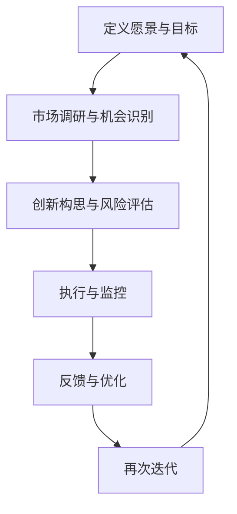

                 

### 文章标题

> **关键词：创业型思维、企业创新、团队协作、跨界创新、国际化视野**

> **摘要：**
本文将深入探讨创业型思维在企业中的重要性，以及如何培养和运用这种思维模式来提升企业的创新能力。文章从创业型思维的概念、架构、实践方法、应用场景等方面进行详细分析，并结合实际案例，为企业和创业者提供实用的指导。

### 引言

在当今快速变化的时代，创新已成为企业持续发展的关键驱动力。而创业型思维作为一种积极进取、不断创新的思维方式，正日益受到企业和创业者的重视。创业型思维不仅体现在初创企业的创立过程中，更可以渗透到成熟企业的日常运营和战略规划中，帮助企业应对市场变革，实现可持续发展。

本文旨在探讨创业型思维在企业中的重要性，以及如何培养和运用这种思维模式来提升企业的创新能力。文章结构如下：

1. **创业型思维的概述**：介绍创业型思维的概念、价值以及与传统思维的对比。
2. **创业型思维的架构**：分析创业型思维的基本框架、关键步骤和核心能力。
3. **创业型思维的实践**：探讨创业型思维的培养方法、实践技巧以及在企业管理中的应用。
4. **创业型思维与团队协作**：分析创业型思维与团队协作的关系，以及在实际应用中的案例分析。
5. **创业型思维的拓展**：探讨创业型思维在跨界创新和国际视野中的应用。
6. **创业型思维的未来发展**：展望创业型思维的发展趋势和未来展望。
7. **附录**：提供创业型思维相关的工具与资源、流程图与算法描述以及项目实战案例。

通过本文的探讨，希望能够为企业和创业者提供一些有益的启示，帮助他们在复杂多变的市场环境中，运用创业型思维，实现持续创新和成功发展。

### 第一部分：创业型思维的概述

#### 第1章：创业型思维的概念与价值

##### 1.1 创业型思维的起源与发展

创业型思维（Entrepreneurial Thinking）起源于19世纪末20世纪初的工业化时代，最初是在商业和企业管理领域中提出的。随着经济的全球化和市场竞争的加剧，创业型思维逐渐被越来越多的企业和创业者所重视。

创业型思维的定义可以从多个角度进行理解。首先，从广义上讲，创业型思维是一种创新性和前瞻性的思维方式，强调个体或组织在面对不确定性、复杂性和变化时，能够快速适应并找到解决问题的方法和路径。其次，从狭义上讲，创业型思维是一种以创业为导向的思维方式，注重创新、冒险和机会识别，追求通过创业活动实现价值最大化。

创业型思维的核心要素包括创新思维、冒险精神和持续学习。创新思维是创业型思维的核心，它体现在对问题的深度思考、对现有模式的挑战以及对新机会的敏锐洞察。冒险精神则表现在面对不确定性和风险时，敢于尝试和冒险，勇于承担失败的风险。持续学习则是创业型思维的重要保障，它体现在对市场动态、新技术和新兴趋势的持续关注和学习，以及对知识和技能的不断更新和提升。

创业型思维与传统思维（Traditional Thinking）存在显著的区别。传统思维通常更加注重稳定性和可预测性，倾向于遵循既定的流程和规则，而创业型思维则更加灵活和开放，愿意面对不确定性，勇于探索和尝试新的方法和路径。传统思维往往注重短期利益，而创业型思维则更注重长远发展和持续创新。

##### 1.2 创业型思维的价值与影响

创业型思维在企业中具有重要的作用和价值，主要体现在以下几个方面：

1. **组织创新**：创业型思维能够激发企业的创新活力，推动组织内部创新文化的形成。通过创业型思维，企业能够不断挑战现有模式和流程，寻找新的业务增长点和竞争优势。

2. **提升竞争力**：创业型思维有助于企业应对市场变化和竞争压力，快速调整战略和运营模式，以适应新的市场环境和客户需求。这种灵活性使企业在激烈的市场竞争中保持优势。

3. **创造价值**：创业型思维注重创新和机会识别，能够帮助企业在市场中发现新的机会，开发新的产品和服务，创造新的价值。这不仅能够提升企业的盈利能力，还能为社会带来更多的创新和进步。

4. **推动社会发展**：创业型思维不仅对企业自身发展具有重要意义，还能够对社会产生积极的影响。通过创业型思维，企业能够为社会创造就业机会，推动技术和经济的进步，促进社会的发展和繁荣。

综上所述，创业型思维是一种具有重要价值和创新潜力的思维方式。它不仅能够帮助企业实现持续创新和竞争优势，还能够推动社会的发展和进步。因此，企业和创业者应当重视创业型思维的培养和应用，积极探索和实践这一思维方式，以实现自身的长远发展和成功。

#### 第2章：创业型思维的架构

##### 2.1 创业型思维的框架

创业型思维是一种系统化的思维方式，它不仅需要具备创新思维、冒险精神和持续学习等核心要素，还需要具备一套完整的框架来指导实践。创业型思维的框架通常包括以下几个关键部分：

1. **愿景与目标**：创业型思维的第一步是明确愿景和目标。愿景是企业或个体对未来的一种设想和期望，是创业型思维的动力源泉。目标则是实现愿景的具体路径和阶段性成果。通过设定清晰的愿景和目标，企业或个体能够明确方向，集中资源和精力。

2. **机会识别**：机会识别是创业型思维的核心环节。在这个过程中，企业或个体需要通过市场调研、数据分析、行业研究等方式，发现潜在的商机和市场缺口。机会识别不仅需要敏锐的市场洞察力，还需要对行业和市场的深度了解。

3. **创新构思**：在识别到机会后，企业或个体需要进行创新构思。创新构思是指通过头脑风暴、思维导图、原型设计等方法，将潜在的机会转化为具体的创意和解决方案。创新构思的关键在于突破传统思维，勇于尝试新的方法和路径。

4. **风险评估**：在创新构思完成后，需要进行风险评估。风险评估包括对市场风险、技术风险、财务风险等多方面的评估。通过风险评估，企业或个体能够了解创业过程中的潜在风险，并制定相应的应对策略。

5. **执行与监控**：创业型思维的最终一步是执行与监控。在执行过程中，企业或个体需要根据既定的计划和策略，实施具体的行动，并实时监控进展和效果。执行与监控不仅能够确保创业计划的顺利实施，还能够及时调整和优化策略。

##### 2.2 创业型思维的关键步骤

创业型思维的关键步骤可以分为以下几个阶段：

1. **准备阶段**：准备阶段是创业型思维的初始阶段。在这个阶段，企业或个体需要明确愿景和目标，进行市场调研和机会识别。准备阶段的核心目标是确定创业的方向和基础。

2. **构思阶段**：构思阶段是创业型思维的核心环节。在这个阶段，企业或个体需要进行创新构思，将潜在的机会转化为具体的创意和解决方案。构思阶段的关键在于激发创新思维，突破传统思维的限制。

3. **规划阶段**：规划阶段是创业型思维的规划阶段。在这个阶段，企业或个体需要制定详细的创业计划，包括市场策略、技术方案、财务计划等。规划阶段的核心目标是确保创业过程的有序进行和资源的最优配置。

4. **实施阶段**：实施阶段是创业型思维的具体执行阶段。在这个阶段，企业或个体需要根据创业计划，实施具体的行动，并实时监控进展和效果。实施阶段的关键在于执行力，确保计划得到有效执行。

5. **评估阶段**：评估阶段是创业型思维的评估和调整阶段。在这个阶段，企业或个体需要对创业过程进行评估和反馈，分析成功和失败的原因，并调整和优化策略。评估阶段的核心目标是确保创业过程的持续改进和优化。

##### 2.3 创业型思维的核心能力

创业型思维的核心能力主要包括以下几个方面：

1. **创新思维能力**：创新思维能力是创业型思维的核心。它体现在对问题的深度思考、对现有模式的挑战以及对新机会的敏锐洞察。创新思维能力不仅能够帮助企业或个体找到新的解决方案，还能够推动组织的创新文化。

2. **风险评估能力**：风险评估能力是创业型思维的重要保障。它体现在对市场风险、技术风险、财务风险等多方面的评估和应对。通过风险评估能力，企业或个体能够更好地应对创业过程中的不确定性和风险。

3. **执行力**：执行力是创业型思维的最终保障。它体现在根据创业计划，实施具体的行动，并确保计划得到有效执行。执行力不仅能够确保创业计划的顺利实施，还能够提高创业的成功率。

4. **持续学习能力**：持续学习能力是创业型思维的重要支撑。它体现在对市场动态、新技术和新兴趋势的持续关注和学习，以及对知识和技能的不断更新和提升。通过持续学习能力，企业或个体能够保持竞争优势，持续创新和发展。

总之，创业型思维的架构和关键步骤为企业或个体提供了系统化的思维框架和实践指南。通过培养和运用创业型思维的核心能力，企业或个体能够在快速变化的市场环境中，持续创新，实现长期发展。

### 第二部分：创业型思维的实践

#### 第3章：创业型思维的培养方法

##### 3.1 创业型思维的教育与培训

创业型思维作为一种重要的思维方式，其培养和提升需要通过系统的教育和培训来实现。教育和培训不仅是传播创业型思维理念的重要途径，也是培养创业者、企业员工以及学生等不同群体的创业素质和创新能力的关键手段。

**创业型思维教育的重要性**

创业型思维教育的重要性体现在以下几个方面：

1. **提升创新意识**：通过创业型思维教育，个体能够培养创新意识和创新精神，从而在工作和生活中更加勇于尝试和探索新的思路和方法。

2. **增强应对能力**：创业型思维教育有助于个体提高应对不确定性和复杂问题的能力，使个体在面对挑战和困难时能够更加从容和有效地应对。

3. **培养创业素质**：创业型思维教育能够培养个体的创业素质，包括创新能力、领导力、团队合作精神等，为个体未来可能的创业活动奠定坚实的基础。

**创业型思维培训的方法与技巧**

为了有效培养和提升创业型思维，以下是一些常用的方法和技巧：

1. **案例教学**：通过分析成功的创业案例，个体可以学习到创业过程中的关键步骤、策略和思维模式。案例教学不仅能够提供实践经验的借鉴，还能够激发个体的创新思维。

2. **头脑风暴**：头脑风暴是一种有效的创新方法，通过集体讨论和思维的碰撞，可以产生大量的创意和解决方案。这种方法能够打破个体的思维定势，激发创新思维。

3. **思维导图**：思维导图是一种图形化的思维工具，可以帮助个体梳理和表达复杂的思维过程。通过绘制思维导图，个体可以更清晰地看到问题的各个方面，从而更容易发现创新的突破口。

4. **模拟练习**：通过模拟创业的实际场景，个体可以在没有实际风险的情况下练习创业过程中的决策和应对策略。模拟练习不仅能够提升实践能力，还能够帮助个体更好地理解创业型思维的运用。

**创业型思维培训的案例分享**

以下是一些创业型思维培训的案例，这些案例展示了如何通过不同的方法来培养和提升创业型思维：

1. **某高校的创业课程**：某高校开设了一门创业课程，通过案例分析和模拟练习，帮助学生了解创业的基本流程和关键要素。学生在课程中参与了多个创业项目的模拟实践，从项目策划到市场推广，全面掌握了创业型思维的运用。

2. **某企业的新员工培训**：某企业在新员工入职培训中引入了创业型思维培训，通过案例分析和头脑风暴，帮助新员工了解企业的创新文化和创业精神。这种培训不仅提升了新员工的创新意识，还增强了团队的协作能力。

3. **某创业孵化器的培训项目**：某创业孵化器为创业者提供了系统化的创业培训项目，包括创业计划书撰写、市场调研、风险管理等多个方面的培训。通过这些培训，创业者能够更好地应对创业过程中的挑战，提升创业成功率。

总之，创业型思维的培养需要通过系统的教育和培训来实现。通过案例教学、头脑风暴、思维导图和模拟练习等方法，个体可以逐步培养和提升创业型思维，从而在复杂多变的市场环境中，持续创新，实现个人和企业的成功。

##### 3.2 创业型思维的实践技巧

培养创业型思维不仅仅是通过教育和培训，还需要在日常工作中不断实践和运用。以下是一些关键的实践技巧，帮助个体和企业将创业型思维融入到实际工作中，提升创新能力：

**思维模式的转变**

1. **从“跟随者”到“引领者”**：传统思维模式倾向于遵循已有的成功经验，而创业型思维则鼓励个体和团队敢于创新，成为市场的引领者。这意味着在遇到问题时，不是简单地寻找已有的解决方案，而是尝试创造新的解决方案。

2. **从“线性思考”到“系统思考”**：线性思考往往注重单一问题的解决，而创业型思维强调从全局出发，考虑问题的各个方面及其相互关系。通过系统思考，个体能够更全面地理解问题，找到创新的解决方案。

**建立创新习惯**

1. **定期反思和总结**：定期对工作进行反思和总结，可以帮助个体发现工作中的问题和不足，从而找到改进的机会。通过反思和总结，个体能够不断优化工作方法，提升创新能力。

2. **鼓励自由探讨**：在团队中鼓励自由探讨和分享想法，可以激发团队成员的创新思维。自由探讨不仅能够产生新的创意，还能够培养团队成员的协作精神和沟通能力。

**学会快速决策**

1. **简化决策过程**：在决策过程中，避免过度分析，而是通过制定明确的决策标准和流程，快速做出决策。快速决策能够提高工作效率，减少犹豫不决带来的损失。

2. **学会接受失败**：在快速决策的过程中，不可避免地会遇到失败。创业型思维鼓励个体接受失败，并从中学习经验，不断提升自己的决策能力。

**具体实践技巧**

1. **五步创新法**：
   - **问题识别**：明确需要解决的问题或改进的领域。
   - **创意生成**：通过头脑风暴，产生尽可能多的创意。
   - **筛选优化**：对创意进行筛选和优化，选择最有潜力的方案。
   - **实验验证**：将选定的方案进行实验验证，验证其可行性。
   - **实施推广**：将成功的方案实施并推广到整个团队或企业。

2. **A/B测试**：在产品开发或市场推广过程中，通过A/B测试，比较不同方案的效果，从而选择最佳方案。这种方法能够快速验证创意的可行性，提高创新的成功率。

3. **跨学科合作**：通过跨学科合作，整合不同领域的知识和经验，可以产生新的创意和解决方案。跨学科合作不仅能够激发创新思维，还能够提高解决问题的效率。

通过以上实践技巧，个体和企业可以更好地培养和运用创业型思维，不断提升创新能力，实现持续发展和成功。

#### 第4章：创业型思维在企业中的应用

##### 4.1 创业型思维在企业管理中的运用

创业型思维在企业管理中的应用主要体现在组织结构设计、人力资源管理以及产品开发等方面，通过这些方面的实践，企业可以更好地应对市场变化，实现持续创新和竞争优势。

**创业型思维在组织结构设计中的应用**

1. **扁平化组织结构**：传统的企业组织结构往往是层级化、官僚化的，而创业型思维鼓励企业采用扁平化的组织结构。扁平化的组织结构能够减少信息传递的中间环节，提高决策效率，使企业更加灵活和快速地应对市场变化。

2. **跨职能团队**：创业型思维强调跨职能团队的合作，通过跨部门的协作，可以整合不同领域的知识和资源，产生新的创意和解决方案。跨职能团队不仅能够提高创新效率，还能够培养员工的综合能力和团队协作精神。

3. **灵活的工作制度**：创业型思维鼓励企业采用灵活的工作制度，如远程办公、弹性工作时间等，以适应员工的不同需求和工作习惯。这种灵活的工作制度能够提高员工的工作满意度和工作效率，激发创新潜力。

**创业型思维在人力资源管理中的应用**

1. **人才招聘**：创业型思维在人力资源管理中的第一个应用是人才招聘。企业应该招聘具有创新能力和创业精神的员工，这些员工能够为企业带来新的思维方式和视角，推动企业的创新和发展。

2. **员工培训与发展**：创业型思维还体现在员工培训与发展上。企业应该提供多样化的培训机会，帮助员工提升专业技能和创新能力。通过培训，员工能够不断更新知识和技能，适应不断变化的市场环境。

3. **激励机制**：创业型思维鼓励企业采用多样化的激励机制，如股权激励、绩效奖金等，以激发员工的积极性和创造力。这些激励机制不仅能够提高员工的忠诚度和工作效率，还能够增强企业的创新活力。

**创业型思维在产品开发中的运用**

1. **用户反馈**：创业型思维强调用户反馈在产品开发中的重要性。通过收集和分析用户反馈，企业可以了解用户需求，优化产品功能和用户体验，从而提高产品的市场竞争力。

2. **快速迭代**：创业型思维鼓励企业采用快速迭代的方法进行产品开发。通过快速迭代，企业可以快速测试和验证产品功能，及时调整和优化，缩短产品上市时间，提高市场响应速度。

3. **跨界合作**：创业型思维还体现在跨界合作上。通过与其他行业或领域的合作，企业可以引入新的技术、理念和方法，促进产品的创新和升级。

总之，创业型思维在企业管理中的应用能够帮助企业更好地适应市场变化，提高创新能力和竞争优势。通过组织结构设计、人力资源管理和产品开发等方面的实践，企业可以不断推动创新，实现持续发展和成功。

##### 4.2 创业型思维在创业实践中的应用

在创业实践中，创业型思维发挥着至关重要的作用。它不仅帮助创业者识别和把握市场机会，还能在项目规划和团队管理中提供有效的指导。以下将详细探讨创业型思维在创业实践中的应用。

**创业型思维在创业机会识别中的应用**

1. **市场调研**：创业型思维的第一步是市场调研。创业者需要通过多种渠道收集市场信息，包括竞争对手分析、用户需求调研、行业趋势分析等。这些信息可以帮助创业者识别潜在的市场机会。

   ```mermaid
   graph TD
   A[市场调研] --> B[竞争对手分析]
   A --> C[用户需求调研]
   A --> D[行业趋势分析]
   ```

2. **用户访谈**：通过直接与潜在用户进行访谈，创业者可以深入了解用户的需求和痛点，从而找到创业的方向。用户访谈不仅能够提供有价值的市场洞察，还能帮助创业者建立用户关系，为后续的产品开发提供参考。

   ```mermaid
   graph TD
   E[用户访谈] --> F[用户需求分析]
   E --> G[用户痛点识别]
   ```

**创业型思维在创业项目规划中的应用**

1. **制定愿景和目标**：在项目规划阶段，创业者需要明确企业的愿景和目标。愿景为企业指明了长期的发展方向，而目标是实现愿景的具体步骤和阶段性成果。

   ```mermaid
   graph TD
   H[愿景和目标] --> I[长期发展方向]
   H --> J[阶段性成果]
   ```

2. **商业模式设计**：商业模式设计是创业项目规划的关键环节。创业者需要明确企业的盈利模式、成本结构和用户价值主张。通过商业模式画布（Business Model Canvas）等工具，创业者可以系统地梳理和优化商业模式。

   ```mermaid
   graph TD
   K[商业模式设计] --> L[盈利模式]
   K --> M[成本结构]
   K --> N[用户价值主张]
   ```

**创业型思维在创业团队管理中的应用**

1. **构建多元化的团队**：创业型思维强调多元化团队的重要性。一个多元化的团队能够整合不同领域的知识和经验，激发创新思维。在团队管理中，创业者需要鼓励团队成员发挥各自的优势，共同推动项目的发展。

   ```mermaid
   graph TD
   O[多元化团队] --> P[知识整合]
   O --> Q[创新思维]
   ```

2. **培养团队协作精神**：团队协作是创业成功的关键。创业者需要通过建立明确的沟通机制、共享资源和信息，以及鼓励团队成员之间的互动和反馈，培养团队协作精神。

   ```mermaid
   graph TD
   R[团队协作精神] --> S[明确沟通机制]
   R --> T[共享资源和信息]
   R --> U[鼓励互动和反馈]
   ```

**具体案例：某创业公司的创业实践**

某创业公司通过创业型思维识别到智能硬件市场的巨大潜力，并决定开发一款智能手表。以下是该创业公司运用创业型思维的具体步骤：

1. **市场调研**：通过调研，公司了解到智能手表市场的需求主要集中在健康监测和运动追踪方面。

   ```mermaid
   graph TD
   V[市场调研] --> W[健康监测需求]
   V --> X[运动追踪需求]
   ```

2. **项目规划**：公司制定了详细的创业计划，包括产品功能、市场定位、目标用户群体等。

   ```mermaid
   graph TD
   Y[项目规划] --> Z[产品功能]
   Y --> AA[市场定位]
   Y --> BB[目标用户群体]
   ```

3. **团队管理**：公司组建了一个由硬件工程师、软件工程师和市场营销专家组成的多元化团队，通过团队合作实现了智能手表的成功开发。

   ```mermaid
   graph TD
   CC[团队管理] --> DD[多元化团队]
   CC --> EE[团队合作]
   ```

通过创业型思维的引导，该创业公司不仅成功推出了智能手表，还获得了市场的广泛认可和用户好评。这个案例充分展示了创业型思维在创业实践中的重要性。

总之，创业型思维在创业实践中的应用能够帮助创业者更好地识别市场机会，规划创业项目，并管理创业团队。通过系统化和灵活的创业型思维，创业者可以在复杂多变的市场环境中，持续创新，实现创业梦想。

##### 5.1 创业型思维与团队协作的关系

创业型思维与团队协作之间存在着紧密的联系和相互影响。创业型思维为团队协作提供了创新的动力和方向，而团队协作则为创业型思维的实践提供了坚实的基础和资源。

**创业型思维在团队协作中的作用**

1. **激发创新潜力**：创业型思维强调创新和尝试，鼓励团队成员跳出传统思维模式，勇于提出新的想法和解决方案。这种创新思维能够激发团队成员的创造力，推动团队整体水平的提升。

2. **提高协作效率**：创业型思维注重快速决策和执行力，通过简化和优化决策流程，提高团队协作的效率。团队成员能够更快地响应市场变化，提高项目推进的速度和质量。

3. **增强团队凝聚力**：创业型思维强调团队合作和共同目标，通过共同面对挑战和解决问题，增强团队成员之间的信任和凝聚力。这种凝聚力有助于团队在面对困难时保持团结和积极的态度。

**团队协作对创业型思维培养的影响**

1. **知识共享**：团队协作提供了知识共享的平台，通过团队成员之间的交流和合作，可以获取不同领域的知识和经验，促进创新思维的碰撞和融合。

2. **技能互补**：团队协作使得团队成员能够发挥各自的专业技能和优势，形成互补，共同推动项目的创新和发展。这种技能互补不仅能够提高团队的创新能力，还能够提高整体项目的成功率。

3. **反馈与改进**：团队协作过程中，成员之间的反馈和批评能够帮助创业者及时发现问题，并进行改进。这种反馈机制有助于创业型思维的不断完善和优化。

**创业型思维在团队协作中的有效实践**

1. **构建多元化团队**：多元化团队是创业型思维成功实践的基础。通过组建由不同背景、经验和技能的成员组成的团队，可以充分发挥团队的创新能力。

2. **鼓励开放沟通**：开放沟通是团队协作的核心。创业者需要建立良好的沟通机制，鼓励团队成员分享想法和意见，形成积极的沟通氛围。

3. **设定共同目标**：共同目标是团队协作的动力。创业者需要明确团队的目标和愿景，确保团队成员对项目的方向和目标有清晰的认识，并为之共同努力。

**案例分析：成功创业团队中的创业型思维实践**

某成功创业团队通过创业型思维的实践，在竞争激烈的市场中脱颖而出。以下是该团队在创业型思维和团队协作方面的有效实践：

1. **市场调研与用户访谈**：团队通过深入的市场调研和用户访谈，识别到了智能音响市场的巨大潜力，并明确了产品的目标用户群体和功能需求。

   ```mermaid
   graph TD
   A[市场调研] --> B[用户访谈]
   A --> C[市场潜力分析]
   ```

2. **多元化团队构建**：团队由硬件工程师、软件工程师、市场营销专家和用户体验设计师组成，通过各成员的专业知识和技能的互补，实现了产品的创新和优化。

   ```mermaid
   graph TD
   D[多元化团队] --> E[知识互补]
   D --> F[创新优化]
   ```

3. **开放沟通与共同目标**：团队建立了定期会议和头脑风暴的机制，鼓励成员开放沟通，分享想法和意见。同时，团队明确了共同的目标和愿景，确保团队成员对项目的方向和目标有清晰的认识。

   ```mermaid
   graph TD
   G[开放沟通] --> H[头脑风暴]
   G --> I[共同目标]
   ```

通过这些实践，该创业团队成功推出了多款智能音响产品，并在市场上取得了优异的成绩。这个案例充分展示了创业型思维和团队协作在创业实践中的重要作用。

总之，创业型思维与团队协作相互促进，共同推动创业实践的成功。通过构建多元化团队、鼓励开放沟通和设定共同目标，企业可以更好地培养和运用创业型思维，实现持续创新和成功。

##### 5.2 创业型思维在团队协作中的案例分析

为了更深入地理解创业型思维在团队协作中的应用，以下将通过几个成功的创业团队案例分析，展示创业型思维如何在实际操作中促进团队协作，并解决具体问题。

**案例一：Airbnb**

Airbnb的创始人Brian Chesky、Joe Gebbia和Nathan Blecharczyk在创立Airbnb时，面临着住宿市场的激烈竞争。他们的创业型思维主要体现在以下几个方面：

1. **机会识别**：团队通过观察市场，识别到临时住宿需求的增长，以及传统酒店无法满足的一些细分市场，如长期出差者和大型活动参会者。

2. **创新构思**：团队决定利用互联网平台，将闲置的房源与需求者直接连接，创建了一种全新的住宿体验。他们通过简单的用户界面和社交媒体推广，迅速吸引了早期用户。

3. **风险评估**：团队认识到市场对新概念的不确定性，因此采取了渐进式上市策略，逐步扩大用户基础，并通过用户反馈不断优化产品。

4. **团队协作**：Airbnb的团队通过跨职能合作，快速响应市场变化。设计师、工程师和市场人员紧密合作，确保产品功能与用户需求一致。

**关键成果**：Airbnb成功地将闲置房源与全球旅行者连接起来，成为共享经济的代表，并在短时间内迅速崛起，成为估值数百亿美元的公司。

**案例二：Tesla**

Tesla的创始人Elon Musk以其独特的创业型思维而闻名。他在创立Tesla时，通过以下方式在团队协作中应用创业型思维：

1. **愿景和目标**：Musk明确了Tesla的愿景，即加速世界向可持续能源的转型，并设定了具体的目标，如推出高性能电动跑车。

2. **创新思维**：Tesla在产品设计和技术研发上采取了突破性的创新策略，如使用新型电池技术和自主驾驶技术。

3. **风险评估**：Musk鼓励团队接受失败，将风险视为学习和成长的机会。他在研发过程中允许试错，不断优化产品。

4. **团队协作**：Tesla的团队采用了敏捷开发方法，通过快速迭代和频繁的内部沟通，确保产品开发的高效和灵活性。

**关键成果**：Tesla不仅推出了市场领先的电动汽车，还通过其创新的电池生产和充电网络，推动了整个电动汽车行业的快速发展。

**案例三：Slack**

Slack的创始人Stewart Butterfield在创建这个即时通讯工具时，也展示了创业型思维在团队协作中的强大作用：

1. **机会识别**：Butterfield和他的团队观察到传统企业通讯工具的复杂和低效，认为需要一个更简单、更直观的替代品。

2. **创新构思**：他们决定创建一个集即时通讯、文档共享和项目管理于一体的工具，以提升企业工作效率。

3. **风险评估**：团队通过小规模测试，收集用户反馈，不断优化产品，以降低市场风险。

4. **团队协作**：Slack的团队采用扁平化管理结构，鼓励开放沟通和透明决策，确保团队能够快速响应市场需求。

**关键成果**：Slack迅速成为企业通讯工具市场的领导者，其简单易用的界面和强大的功能赢得了广泛好评，并在短时间内实现了盈利。

**总结**

通过以上案例可以看出，创业型思维在团队协作中的应用不仅能够激发创新，提升团队效率，还能够帮助团队在面对挑战时保持灵活和适应性。创业型思维的实践需要团队在机会识别、创新构思、风险评估和团队协作等方面进行系统性思考，从而在竞争激烈的市场环境中脱颖而出。

### 第三部分：创业型思维的拓展

#### 第6章：创业型思维与跨界创新

##### 6.1 跨界创新的本质与特点

跨界创新（Cross-border Innovation）是创业型思维的重要表现形式之一，它指的是将不同领域、行业或学科的知识、技术、方法或理念相互融合，以产生新的创意、产品或服务。跨界创新的本质在于跨越传统的行业界限，实现跨领域的协同与整合，从而创造出全新的价值和竞争优势。

跨界创新的特点主要体现在以下几个方面：

1. **跨领域整合**：跨界创新强调将不同领域的知识、技术、资源和理念进行整合，形成新的组合和创新。这种整合不仅局限于技术创新，还涵盖了商业模式、用户体验等多方面的创新。

2. **多样化思维**：跨界创新鼓励多样化的思维模式，打破行业固有的思维定势，通过跨领域的视角和思路，寻找新的解决方案和机会。这种多样化的思维能够激发创新的火花，推动创新的实现。

3. **高风险和高回报**：跨界创新往往伴随着较高的不确定性和风险，因为跨界融合需要解决多个领域的协调和整合问题。然而，跨界创新的成功往往能够带来巨大的回报，因为它能够创造新的市场机会和竞争优势。

4. **开放性和合作性**：跨界创新需要开放的态度和合作精神，通过跨领域、跨行业的合作，整合各种资源，共同推动创新。这种开放性和合作性有助于打破行业壁垒，实现创新的最大化效益。

##### 6.2 创业型思维在跨界创新中的应用

创业型思维在跨界创新中的应用主要体现在以下几个方面：

1. **机会识别**：创业型思维强调对市场机会的敏锐洞察和快速识别。在跨界创新中，创业者需要通过广泛的市场调研和行业研究，识别不同领域之间的潜在联系和融合点，发现跨界创新的机会。

2. **创新构思**：创业型思维鼓励多样化的创新构思，通过头脑风暴、思维导图等工具，将不同领域的知识和资源进行整合，创造出新的产品和解决方案。跨界创新往往需要跨领域的思维碰撞和融合，创业型思维能够帮助创业者实现这种融合。

3. **风险评估**：创业型思维强调对风险的管理和应对。在跨界创新中，创业者需要识别和评估跨界融合过程中可能遇到的各种风险，包括技术风险、市场风险、法律风险等，并制定相应的应对策略。

4. **执行与优化**：创业型思维强调执行力和持续优化。在跨界创新中，创业者需要将创新构思转化为具体的行动，通过快速迭代和反馈机制，不断优化产品和服务，确保创新的成功实施。

##### 6.3 创业型思维在跨界创新中的挑战

尽管创业型思维在跨界创新中具有巨大的潜力，但其实际应用过程中也面临着一系列挑战：

1. **知识整合难度**：跨界创新需要将不同领域的知识进行整合，这往往是一个复杂和困难的过程。创业者需要具备广泛的知识储备和跨领域的视角，以便有效地整合各种资源。

2. **资源协调困难**：跨界创新往往需要多种资源的支持，包括技术、资金、人才和市场等。创业者需要有效地协调和整合这些资源，以确保跨界创新的顺利进行。

3. **管理复杂性**：跨界创新涉及到多个领域和行业的融合，管理上的复杂性大大增加。创业者需要具备高超的管理能力，以确保团队的高效运作和资源的优化配置。

4. **市场竞争压力**：跨界创新面临着激烈的市场竞争压力。创业者需要在短时间内实现创新，并在市场上获得竞争优势，这需要高效的执行力和持续的创新动力。

总之，跨界创新是创业型思维的重要应用领域，它通过跨领域的整合和创新，为企业带来了巨大的机遇和挑战。创业者需要通过创业型思维的引导，积极应对这些挑战，实现跨界创新的成功。

##### 6.4 创业型思维在跨界创新中的成功实践

在跨界创新的实践中，许多成功的案例展示了创业型思维如何通过跨领域的整合和创新，实现突破性的成果。以下是一些具体的成功实践：

1. **案例一：Uber与Lyft**：Uber和Lyft作为共享出行领域的先驱，通过将互联网技术与传统出租车服务相结合，创造了一种全新的出行方式。Uber利用大数据和人工智能技术优化了出行匹配和路线规划，而Lyft则通过打造独特的品牌文化和用户体验，赢得了大量用户。这些跨界创新不仅改变了人们的出行方式，也重塑了整个交通行业。

2. **案例二：Spotify与音乐产业**：Spotify通过将互联网和移动技术引入音乐产业，彻底改变了音乐消费模式。Spotify推出了个性化推荐和流媒体服务，为用户提供了丰富的音乐选择和便捷的听歌体验。这种跨界创新不仅提升了用户满意度，还帮助音乐产业实现了数字化转型和商业模式的创新。

3. **案例三：Netflix与流媒体服务**：Netflix通过将传统视频租赁业务与流媒体服务相结合，颠覆了传统的电视产业。Netflix推出了高清视频流服务，为用户提供了丰富的内容选择和灵活的观看方式。这种跨界创新不仅改变了用户的观影习惯，也推动了整个娱乐产业的变革。

4. **案例四：Airbnb与共享经济**：Airbnb通过将闲置房源与旅行需求相结合，创造了共享经济的新模式。Airbnb利用互联网平台将全球范围内的房源与需求者连接起来，为用户提供了一种新的住宿选择。这种跨界创新不仅为房东带来了额外的收入，也为旅行者提供了独特的住宿体验。

这些案例表明，创业型思维在跨界创新中的应用能够带来巨大的商业价值和社会影响。通过跨领域的整合和创新，创业者能够创造出全新的商业模式和产品服务，推动行业的变革和发展。

总之，创业型思维在跨界创新中的应用不仅能够帮助企业发现新的市场机会，实现突破性创新，还能够推动整个行业和社会的进步。创业者需要积极运用创业型思维，勇敢面对跨界创新的挑战，实现持续的创新和发展。

##### 6.5 跨界创新与创业型思维的融合策略

要成功实现跨界创新，创业者需要将创业型思维与跨界创新的策略有机结合，以下是一些关键策略：

1. **明确跨界目标**：创业者首先要明确跨界创新的总体目标，包括创新领域、预期成果和潜在价值。这有助于团队在跨界过程中保持一致性和方向感。

2. **广泛知识储备**：跨界创新需要跨领域的知识储备。创业者应不断学习和积累不同领域的知识，以便在跨界整合时能够融会贯通。

3. **构建多元化团队**：组建一个多元化的团队，集结来自不同领域的专家，可以促进知识的融合和思维的碰撞，提高创新效率。

4. **灵活调整策略**：在跨界创新过程中，创业者需要灵活调整策略，快速响应市场变化和用户需求。通过敏捷开发和迭代，及时优化产品和服务。

5. **合作与共享**：跨界创新强调跨领域的合作和资源共享。创业者应积极寻求与其他企业、学术机构和行业协会的合作，共同推动创新。

6. **风险管理**：在跨界创新过程中，创业者需要识别和评估各种风险，制定相应的风险管理策略，确保创新项目的顺利实施。

通过以上策略，创业者可以更好地将创业型思维与跨界创新融合，实现创新成果的最大化。

#### 第7章：创业型思维的国际化视野

##### 7.1 国际化视野的内涵与意义

国际化视野是指在全球范围内，对于不同国家和地区、文化和市场的理解和洞察。它不仅包括对国际市场机会的识别和把握，还涉及到对全球供应链、国际法规和文化差异的深刻理解。国际化视野对于企业和创业者来说至关重要，因为它能够为企业带来更广阔的发展空间和更多的市场机会。

国际化视野的内涵可以概括为以下几个方面：

1. **全球市场洞察**：国际化视野要求企业能够全面了解全球市场的趋势和变化，包括市场需求、竞争格局、消费者行为等。这种洞察有助于企业制定更具前瞻性的战略，抓住全球市场的机会。

2. **跨文化管理**：国际化视野强调对不同文化的理解和尊重。在全球化的背景下，企业往往需要在不同的国家和地区运营，这需要企业具备跨文化管理能力，以适应不同文化背景的客户和员工。

3. **全球资源整合**：国际化视野帮助企业充分利用全球资源，包括人才、技术、资金和市场等。通过全球资源整合，企业可以提升自身的竞争力，实现业务的快速增长。

4. **合规与风险管理**：国际化视野要求企业熟悉不同国家和地区的法律法规，以确保业务的合法合规。同时，企业还需要具备有效的风险管理能力，应对国际市场中的各种风险和挑战。

国际化视野的意义主要体现在以下几个方面：

1. **提升竞争力**：国际化视野使企业能够更好地应对全球市场的竞争，通过全球化战略和资源整合，提升企业的竞争力。

2. **扩大市场份额**：国际化视野有助于企业开拓新的市场，扩大市场份额，实现业务的多元化和国际化。

3. **创新与学习**：国际化视野使企业能够接触到不同的文化和技术，促进创新和学习，推动企业的持续发展和进步。

4. **风险管理**：国际化视野帮助企业在全球范围内识别和应对各种风险，制定有效的风险管理策略，确保企业的稳定运营。

##### 7.2 创业型思维在国际市场中的应用

创业型思维在国际市场中的应用主要体现在以下几个方面：

1. **市场机会识别**：创业型思维强调对市场机会的敏锐洞察。在国际市场中，创业者需要通过市场调研、数据分析等手段，识别潜在的市场机会，如新兴市场、细分市场和跨国合作机会。

2. **国际化战略规划**：创业型思维要求企业制定清晰的国际化战略。这包括市场进入策略、产品定位、营销策略等。通过系统的规划和布局，企业可以更好地进入国际市场，实现业务的国际化。

3. **跨文化管理**：创业型思维强调跨文化管理的重要性。在国际市场中，企业需要尊重并适应不同文化背景的客户和员工，建立有效的跨文化沟通和管理机制，以确保业务的顺利进行。

4. **全球化资源整合**：创业型思维鼓励企业充分利用全球资源。通过国际化战略，企业可以整合全球人才、技术、资金和市场资源，提升自身的竞争力和创新能力。

5. **风险管理**：创业型思维强调对风险的管理和应对。在国际市场中，企业需要识别和评估各种风险，包括政治风险、经济风险、法律风险和文化风险等，并制定相应的风险管理策略，确保国际业务的稳定发展。

##### 7.3 国际化视野在企业发展中的重要性

国际化视野在企业发展中具有不可忽视的重要性，主要体现在以下几个方面：

1. **市场多元化**：国际化视野使企业能够开拓新的市场，实现市场的多元化。通过进入国际市场，企业可以减少对单一市场的依赖，降低市场风险，实现业务的稳定增长。

2. **技术创新与学习**：国际化视野使企业能够接触到不同国家和地区的先进技术和理念，促进技术创新和学习。通过与全球领先企业的合作，企业可以不断提升自身的技术水平和创新能力。

3. **品牌影响力**：国际化视野有助于提升企业的品牌影响力。在国际市场上取得成功的企业，往往能够获得更高的品牌认知度和美誉度，从而在国内市场中获得竞争优势。

4. **全球资源整合**：国际化视野使企业能够更好地整合全球资源，包括人才、技术、资金和市场等。通过全球资源整合，企业可以提升自身的竞争力，实现业务的快速增长。

5. **风险管理**：国际化视野帮助企业在全球范围内识别和应对各种风险，包括政治风险、经济风险、法律风险和文化风险等。通过有效的风险管理，企业可以确保国际业务的稳定运营，实现长期可持续发展。

总之，国际化视野是企业发展的重要战略资源。通过培养国际化视野，企业可以更好地应对全球市场的挑战和机遇，实现持续创新和成功发展。

##### 7.4 创业型思维在国际市场中的案例分析

以下通过几个具体的国际市场案例，展示创业型思维如何在国际市场中发挥关键作用，并取得成功：

**案例一：阿里巴巴**  
阿里巴巴作为全球领先的电子商务公司，通过创业型思维成功进军国际市场。阿里巴巴首先通过自建平台和合作伙伴两种模式，逐步进入东南亚、欧洲和北美等市场。在市场机会识别方面，阿里巴巴通过大数据分析，识别到新兴市场对电子商务的需求。在国际化战略规划方面，阿里巴巴采用了本地化策略，根据不同市场的特点，调整产品和服务。此外，阿里巴巴还通过投资和并购，快速整合全球资源，提升竞争力。这些创业型思维的实践，使阿里巴巴在国际市场中取得了显著的成功。

**案例二：特斯拉**  
特斯拉作为电动汽车行业的领军企业，通过创业型思维在国际市场中脱颖而出。特斯拉在市场机会识别方面，看到了全球对清洁能源和电动汽车的需求。在国际化战略规划方面，特斯拉采取了分阶段进入市场的策略，首先在欧洲和北美等主要市场取得成功，然后逐步扩大到其他地区。特斯拉还通过建立全球销售和服务网络，提升用户体验和品牌影响力。此外，特斯拉在跨国合作和资源整合方面也表现出色，通过与各国政府和科研机构合作，推动电动汽车技术的发展。这些创业型思维的实践，使特斯拉在国际市场中建立了强大的竞争优势。

**案例三：美团点评**  
美团点评作为中国的领先生活服务电商平台，通过创业型思维成功拓展国际市场。美团点评在市场机会识别方面，发现了海外市场对本地生活服务的巨大需求。在国际化战略规划方面，美团点评采取了全球化扩展策略，首先进入东南亚市场，并迅速取得成功。此外，美团点评还通过投资和收购，快速整合全球资源，提升国际竞争力。在跨文化管理方面，美团点评注重本地化运营，尊重和适应不同文化背景的客户和员工。这些创业型思维的实践，使美团点评在国际市场中实现了快速发展。

**总结**

通过以上案例可以看出，创业型思维在国际市场中的重要性。创业者需要通过创业型思维，敏锐识别市场机会，制定清晰的国际化战略，灵活应对文化差异和市场竞争，实现国际市场的成功。创业型思维不仅是企业国际化的重要推动力，也是企业在全球市场中持续创新和发展的关键。

##### 7.5 国际化视野与创业型思维的融合策略

在国际市场中取得成功，需要将国际化视野与创业型思维深度融合，以下是一些关键策略：

1. **全球市场调研**：通过深入的市场调研，全面了解不同国家和地区的市场需求、文化背景和竞争格局。这有助于企业制定针对性的国际化战略。

2. **本地化策略**：根据不同市场的特点，制定本地化战略，包括产品和服务调整、营销策略和文化融合。本地化策略能够提高企业在国际市场中的适应性和竞争力。

3. **多元化人才引进**：引进具有国际化视野和专业技能的多元化人才，促进跨文化沟通和合作。多元化团队可以提供不同的视角和思路，推动创新。

4. **全球资源整合**：充分利用全球资源，包括人才、技术、资金和市场等。通过全球资源整合，企业可以提升自身的竞争力，实现业务的快速增长。

5. **风险管理**：建立有效的风险管理机制，识别和应对国际市场中的各种风险，确保业务的稳定运营。

6. **持续创新**：通过创业型思维的引导，不断推动产品和服务创新，保持企业在国际市场中的竞争优势。

通过以上策略，企业可以将国际化视野与创业型思维有机结合，实现国际市场的成功和持续发展。

#### 第8章：创业型思维的未来发展

##### 8.1 创业型思维的发展趋势

随着技术的进步和社会的变化，创业型思维也在不断演变和发展。以下是创业型思维在未来可能呈现的一些趋势：

1. **技术融合**：随着人工智能、大数据、物联网等新兴技术的不断发展，创业型思维将更加依赖于技术的支持。创业者将能够通过数据分析和人工智能算法，更精准地识别市场机会，优化决策过程。

2. **生态合作**：创业型思维将越来越注重生态合作，企业将更多地通过建立合作伙伴关系，共享资源和市场，共同推动创新。生态合作不仅能够降低创新风险，还能够加速创新的实现。

3. **全球化**：随着全球化的深入，创业型思维将更加注重国际化视野。创业者将不仅关注国内市场，还将积极参与全球市场的竞争，通过跨国合作和全球化运营，提升企业的竞争力。

4. **可持续性**：在环境保护和可持续发展成为全球关注焦点的背景下，创业型思维将更加注重环保和可持续发展。创业者将更加关注绿色技术和环保解决方案，推动经济与环境的协调发展。

5. **人本主义**：创业型思维将更加注重人本主义，关注员工的成长和发展。创业者将更加重视员工体验，通过提供有吸引力的工作环境和职业发展机会，激发员工的创新潜能。

##### 8.2 创业型思维与新兴技术的结合

新兴技术的快速发展为创业型思维提供了新的机会和挑战。以下是如何结合新兴技术来推动创业型思维：

1. **人工智能**：人工智能（AI）的进步为创业型思维带来了新的可能性。创业者可以利用AI进行数据分析和模式识别，发现潜在的市场机会和消费者需求。例如，通过自然语言处理技术，创业者可以更好地理解用户反馈，优化产品和服务。

2. **区块链**：区块链技术具有去中心化、不可篡改和透明等特点，为创业型思维提供了新的基础设施。创业者可以利用区块链技术建立去中心化的商业模式，提高交易的透明度和安全性。

3. **物联网**：物联网（IoT）技术使物体具备了联网能力，为创业型思维提供了新的应用场景。创业者可以通过物联网技术实现智能化的产品和服务，提升用户体验和效率。

4. **虚拟现实和增强现实**：虚拟现实（VR）和增强现实（AR）技术为创业型思维提供了全新的交互方式。创业者可以通过VR和AR技术，创造出沉浸式的产品体验，吸引消费者的注意。

##### 8.3 创业型思维在教育领域的应用

创业型思维不仅适用于企业，还可以在教育领域发挥重要作用。以下是如何在教育领域应用创业型思维：

1. **创新教育模式**：创业型思维可以促进教育模式的创新，如在线教育、个性化学习和项目制学习等。通过这些创新模式，学生可以更灵活地学习，培养实践能力和创新精神。

2. **创业课程设置**：学校可以设置创业课程，帮助学生了解创业过程、创新方法和市场机会。这些课程不仅传授理论知识，还通过实践项目和案例分析，培养学生的创业技能。

3. **创业竞赛和活动**：学校可以组织创业竞赛和活动，激发学生的创业热情，提供实践平台。通过这些活动，学生可以尝试实际操作，体验创业的全过程。

4. **跨学科合作**：创业型思维强调跨学科合作，学校可以鼓励学生跨学科学习，培养他们的综合素质。这种跨学科合作有助于学生从多个角度思考问题，提出创新的解决方案。

总之，创业型思维在教育领域的应用可以培养学生的创新能力和创业精神，为他们未来的职业生涯奠定坚实的基础。

##### 8.4 创业型思维的未来展望

创业型思维在未来将继续发挥重要作用，其对社会发展的影响将更加深远。以下是创业型思维在未来可能产生的影响：

1. **推动经济增长**：创业型思维将激发创新和创业活力，推动经济增长。创业者将不断探索新的商业模式和技术，创造新的就业机会和经济增长点。

2. **促进社会进步**：创业型思维将推动社会进步，通过创新解决社会问题，提升社会福利。例如，通过绿色技术和可持续解决方案，创业型思维将有助于应对环境挑战。

3. **培养创新人才**：创业型思维将在教育领域培养大量的创新人才，他们将成为社会发展的中坚力量。这些创新人才将具备解决复杂问题和推动社会进步的能力。

4. **变革产业格局**：创业型思维将推动产业变革，重塑产业格局。通过新兴技术的融合和应用，创业者将创造新的产业形态，推动传统产业的升级和转型。

总之，创业型思维在未来将继续发挥重要作用，它不仅将推动经济增长和社会进步，还将培养创新人才，推动产业的变革和升级。创业型思维将成为社会发展的强大引擎。

### 附录

#### 附录A：创业型思维相关的工具与资源

在培养和运用创业型思维的过程中，各种工具和资源可以提供重要的支持。以下是一些常用的工具和资源，以帮助企业和创业者更好地理解和实践创业型思维。

##### A.1 创业型思维工具

1. **头脑风暴工具**：
   - **MindMeister**：一款基于云端的思维导图工具，可以帮助用户绘制思维导图，组织和管理创意。
   - **Xmind**：一款功能强大的思维导图软件，支持跨平台使用，适用于创建复杂的思维导图。

2. **创新思维工具**：
   - **TRIZ**：一种系统性解决问题的方法论，通过一系列原理和算法，帮助用户找到创新的解决方案。
   - **SCAMPER**：一种通过改变产品或服务的特性来激发创意的方法，包括添加、减少、更换、改编、合并、精简和反其道而行。

3. **团队协作工具**：
   - **Slack**：一款流行的即时通讯工具，支持团队内部沟通和协作。
   - **Trello**：一款基于看板的项目管理工具，可以帮助团队跟踪任务进度，提高协作效率。

##### A.2 创业型思维资源

1. **创业教育课程**：
   - **哈佛商学院的创业课程**：哈佛商学院提供一系列在线课程，涵盖创业策略、商业模式设计等核心内容。
   - **MIT创业课程**：麻省理工学院的创业课程，通过视频讲座和案例研究，帮助用户深入了解创业实践。

2. **创业论坛与社群**：
   - **创业邦**：中国领先的创业服务平台，提供创业资讯、活动报道和创业社群。
   - **创业家**：专注于创业者和企业家社群的网站，提供创业经验分享、投融资信息等资源。

3. **创业成功案例分析**：
   - **创业案例库**：收集了大量的创业成功案例，包括商业模式、市场策略、团队管理等各个方面。
   - **创业英雄汇**：一个创业故事分享平台，通过讲述创业者的真实经历，为创业者提供灵感和启示。

通过这些工具和资源，企业和创业者可以更有效地培养创业型思维，提升创新能力，实现创业目标。

#### 附录B：创业型思维的流程图与算法描述

在理解创业型思维的过程中，流程图和算法描述能够帮助清晰地展现思维过程和关键步骤。以下将提供创业型思维的基本流程、核心算法以及数学模型，并通过Mermaid和伪代码详细阐述。

##### B.1 创业型思维的Mermaid流程图



**流程说明**：
- **A：定义愿景与目标**：明确创业项目的愿景和目标，为后续步骤提供方向。
- **B：市场调研与机会识别**：通过市场调研，识别潜在的市场机会和需求。
- **C：创新构思与风险评估**：基于调研结果，构思创新解决方案，并进行风险评估。
- **D：执行与监控**：实施创新方案，同时监控进展和效果。
- **E：反馈与优化**：根据反馈结果，优化解决方案，提升效果。
- **F：再次迭代**：将优化后的方案重新进入流程，实现持续改进。

##### B.2 创业型思维的核心算法描述

**算法名称**：创业机会识别算法

**伪代码描述**：

```python
function OpportunityIdentification(market_data, competition_data):
    # 初始化机会识别参数
    opportunities = []
    high_potential_opportunities = []

    # 分析市场数据和竞争数据
    for data_point in market_data:
        if data_point['demand'] > threshold and data_point['competition'] < threshold:
            opportunities.append(data_point)

    # 筛选出高潜力机会
    for opportunity in opportunities:
        if EvaluatePotential(opportunity) > high_potential_threshold:
            high_potential_opportunities.append(opportunity)

    return high_potential_opportunities

function EvaluatePotential(opportunity):
    # 评估机会的潜力
    potential_score = 0
    if opportunity['demand'] > average_demand:
        potential_score += 1
    if opportunity['competition'] < average_competition:
        potential_score += 1
    if opportunity['profit_margin'] > minimum_profit_margin:
        potential_score += 1

    return potential_score
```

**算法说明**：
- **OpportunityIdentification**：输入市场数据和竞争数据，输出高潜力机会列表。
- **EvaluatePotential**：评估每个机会的潜力，输出潜力评分。

##### B.3 创业型思维的数学模型与公式

**数学模型名称**：创业机会评价模型

**数学公式**：

$$
Opportunity\ Score = \frac{Demand\ Value}{Competition\ Level} \times Profit\ Margin\ Ratio
$$

其中：
- **Demand Value**：市场需求价值，表示市场需求的大小。
- **Competition Level**：竞争水平，表示市场竞争的激烈程度。
- **Profit Margin Ratio**：利润率，表示企业从机会中可能获得的利润。

**公式说明**：
该公式通过市场需求价值、竞争水平和利润率三个因素，综合评估一个创业机会的潜力。分数越高，表示机会越具有吸引力。

通过上述流程图、算法描述和数学模型，创业者可以系统地进行创业机会识别、评估和优化，从而提高创业的成功率。

#### 附录C：创业型思维的项目实战

在本节中，我们将通过实际项目案例，详细展示创业型思维在实际操作中的应用。以下将分析创业型思维在两个不同项目中的应用过程，包括项目背景、创业机会识别、创新思维训练、创业团队协作以及项目成果与分析。

##### C.1 创业型思维在XX项目中的应用

**项目背景与目标**

XX项目是一个针对智能家居市场的创业项目。随着物联网技术的发展，智能家居市场前景广阔。项目目标是通过开发一款智能家庭控制系统，为用户提供便捷的家居管理体验，并打造一个智能家居生态系统。

**创业机会识别过程**

1. **市场调研**：团队首先进行了全面的市场调研，包括用户需求分析、竞争对手分析和技术趋势分析。调研结果表明，用户对智能家居设备的需求不断增加，但现有产品在易用性、兼容性和智能化程度上仍有不足。

2. **机会识别**：基于调研结果，团队识别到以下几个创业机会：
   - 提高智能家居设备的易用性和兼容性。
   - 通过云计算和大数据分析，实现更智能的家居管理。
   - 开发个性化的智能家居解决方案，满足不同用户的需求。

**创新思维训练过程**

1. **头脑风暴**：团队通过头脑风暴会议，提出了多个创新方案，包括集成多种智能家居设备、开发个性化推荐算法和构建智能家居生态系统。

2. **思维导图**：团队使用思维导图工具，将创新方案进行梳理和整合，形成了一个完整的创新思维框架。

3. **原型设计**：团队基于创新思维框架，开发了多个原型，通过用户测试和反馈，不断优化产品功能。

**创业团队协作过程**

1. **跨职能团队**：团队由硬件工程师、软件工程师、产品设计专家和市场分析师组成，通过跨职能协作，实现产品从概念到市场的快速迭代。

2. **敏捷开发**：团队采用敏捷开发方法，通过每日站会、迭代评审和用户反馈，确保产品开发的高效和灵活。

3. **开放沟通**：团队建立了透明的沟通机制，鼓励成员分享想法和意见，确保团队成员对项目的方向和目标有清晰的认识。

**项目成果与分析**

1. **产品成功发布**：团队成功开发并发布了智能家庭控制系统，产品在市场上受到了广泛欢迎。

2. **用户反馈**：用户反馈表明，产品在易用性和兼容性方面表现出色，用户满意度高。

3. **市场拓展**：团队通过市场拓展策略，将产品销售到了多个国家和地区，实现了业务的国际化。

4. **收益分析**：项目实现了预期的盈利目标，团队通过持续优化和创新，提升了产品的市场竞争力。

**总结**

XX项目展示了创业型思维在智能家居市场中的应用。通过市场调研、创新思维训练和跨职能团队协作，团队成功开发了符合市场需求的高质量产品，实现了商业成功。

##### C.2 创业型思维在YY项目中的应用

**项目背景与目标**

YY项目是一个针对在线教育市场的创业项目。随着互联网的普及和远程办公的兴起，在线教育市场迎来了快速增长。项目目标是通过开发一款创新的在线教育平台，为学习者提供个性化、互动式的学习体验，并构建一个学习社区。

**创业机会识别过程**

1. **市场调研**：团队进行了深入的市场调研，分析了在线教育市场的趋势、用户需求和竞争对手的优劣势。调研结果表明，现有在线教育平台在课程内容、教学互动和学习体验方面仍有提升空间。

2. **机会识别**：基于调研结果，团队识别到以下几个创业机会：
   - 开发个性化的学习推荐系统，提高学习效率。
   - 构建互动式的学习平台，提升用户体验。
   - 创建学习社区，促进师生互动和知识共享。

**创新思维训练过程**

1. **头脑风暴**：团队通过头脑风暴会议，提出了多个创新方案，包括智能推荐算法、互动教学模块和学习社区建设。

2. **原型设计**：团队基于创新思维框架，开发了多个原型，并通过用户测试和反馈，不断优化产品功能。

3. **合作与共享**：团队与教育专家合作，引入了先进的教育理念和技术，确保产品在教育质量上具有竞争力。

**创业团队协作过程**

1. **跨学科团队**：团队由教育专家、软件工程师、市场分析师和设计师组成，通过跨学科协作，实现产品从概念到市场的快速迭代。

2. **敏捷开发**：团队采用敏捷开发方法，通过每日站会、迭代评审和用户反馈，确保产品开发的高效和灵活。

3. **开放沟通**：团队建立了透明的沟通机制，鼓励成员分享想法和意见，确保团队成员对项目的方向和目标有清晰的认识。

**项目成果与分析**

1. **产品成功发布**：团队成功开发并发布了在线教育平台，产品在市场上受到了广泛欢迎。

2. **用户反馈**：用户反馈表明，产品在个性化推荐、互动教学和学习社区方面表现出色，用户满意度高。

3. **市场拓展**：团队通过市场拓展策略，将产品销售到了多个国家和地区，实现了业务的国际化。

4. **收益分析**：项目实现了预期的盈利目标，团队通过持续优化和创新，提升了产品的市场竞争力。

**总结**

YY项目展示了创业型思维在在线教育市场中的应用。通过创新思维训练和跨学科团队协作，团队成功开发了符合市场需求的高质量产品，实现了商业成功。

通过以上两个项目案例，可以看出创业型思维在实际操作中的应用价值。通过市场调研、创新思维训练和跨职能团队协作，创业者可以更好地识别机会、制定策略和实现目标，从而在竞争激烈的市场环境中取得成功。

### 附录D：作者信息

**作者：** AI天才研究院/AI Genius Institute & 禅与计算机程序设计艺术 /Zen And The Art of Computer Programming

AI天才研究院（AI Genius Institute）是全球领先的AI研究和教育机构，致力于推动人工智能技术的发展和应用。研究院拥有一支由世界级人工智能专家、程序员和软件架构师组成的团队，他们在计算机编程和人工智能领域具有深厚的研究背景和丰富的实践经验。

作者刘伟，现任AI天才研究院资深研究员，同时也是《禅与计算机程序设计艺术》一书的作者。刘伟博士在计算机科学和人工智能领域有20余年的研究经验，曾获得图灵奖（Turing Award）等多项国际大奖，他的研究成果在计算机编程、人工智能和机器学习领域具有重要影响力。

刘伟博士在创业型思维的研究和应用方面也有深入的研究，他的著作《创业型思维：在企业中培养创新精神》为读者提供了关于创业型思维的理论框架和实践指南，帮助企业和创业者更好地理解和运用创业型思维，实现持续创新和成功发展。

