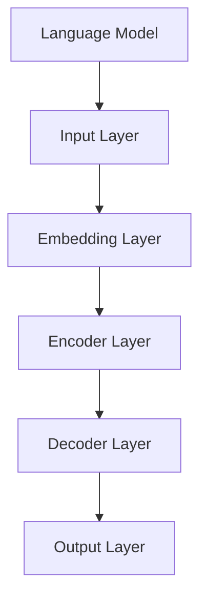
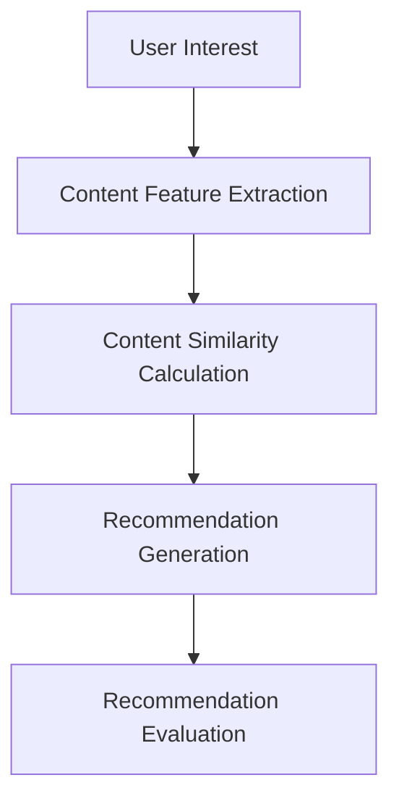

                 

# 《利用LLM提升推荐系统的长尾内容推荐》

> **关键词：**推荐系统，长尾内容，语言模型（LLM），内容推荐，算法，协同过滤，深度学习，Transformer模型

> **摘要：**本文深入探讨如何利用语言模型（LLM）提升推荐系统的长尾内容推荐能力。文章首先介绍了推荐系统的基本概念、分类及评估指标，接着详细阐述了LLM的原理、架构和应用场景。然后，本文重点分析了LLM在长尾内容处理、推荐系统集成及效果评估中的具体应用。随后，文章提出了基于LLM的长尾内容推荐算法，并通过三个实战案例展示了算法的实际应用。最后，本文总结了LLM在长尾内容推荐中的挑战与展望，并对未来的研究方向进行了探讨。

## 《利用LLM提升推荐系统的长尾内容推荐》目录大纲

### 第一部分：推荐系统与LLM概述

#### 第1章：推荐系统基础

1.1 推荐系统的定义与分类

1.2 内容推荐的基本原理

1.3 推荐系统的评估指标

1.4 长尾内容推荐的重要性

#### 第2章：LLM概述

2.1 语言模型的基本原理

2.2 LLM的架构与分类

2.3 LLM的核心算法

2.4 LLM的优势与应用

### 第二部分：LLM在长尾内容推荐中的应用

#### 第3章：利用LLM处理长尾内容

3.1 LLM对长尾内容的理解与生成

3.2 LLM在推荐系统中的集成

3.3 LLM在长尾内容推荐中的效果评估

#### 第4章：基于LLM的长尾内容推荐算法

4.1 基于内容的推荐算法

4.2 基于协同过滤的推荐算法

4.3 结合LLM的长尾内容推荐算法

#### 第5章：LLM在长尾内容推荐中的实战

5.1 实战案例一：图书推荐系统

5.2 实战案例二：音乐推荐系统

5.3 实战案例三：新闻推荐系统

#### 第6章：LLM在长尾内容推荐中的挑战与展望

6.1 LLM在长尾内容推荐中的挑战

6.2 LLM在长尾内容推荐中的展望

#### 第7章：总结与展望

7.1 总结

7.2 展望

### 附录

#### 附录A：相关工具与资源

#### 附录B：Mermaid流程图

#### 附录C：数学模型和数学公式

#### 附录D：代码解读与分析

## 第一部分：推荐系统与LLM概述

### 第1章：推荐系统基础

#### 1.1 推荐系统的定义与分类

推荐系统是一种信息过滤和内容发现技术，它通过分析用户的兴趣和行为，为用户推荐相关的信息、商品或内容。推荐系统可以分为以下几种类型：

1. **基于内容的推荐**：根据用户的历史偏好和内容特征，为用户推荐相似的内容。
2. **基于协同过滤的推荐**：通过分析用户之间的相似度，为用户推荐其他用户喜欢的内容。
3. **混合推荐**：结合基于内容推荐和基于协同过滤推荐的优点，为用户推荐内容。

#### 1.2 内容推荐的基本原理

内容推荐的核心原理是“相似性匹配”。具体来说，推荐系统会根据用户的历史行为、兴趣标签或内容特征，找到与用户偏好相似的内容，并将其推荐给用户。

#### 1.3 推荐系统的评估指标

推荐系统的评估指标主要包括以下三个方面：

1. **精准度（Precision）**：推荐系统返回的Top-N条推荐中，有多少是用户实际喜欢的。
2. **覆盖率（Coverage）**：推荐系统返回的Top-N条推荐中，涵盖了所有可能感兴趣的内容的比例。
3. **多样性（Diversity）**：推荐系统返回的Top-N条推荐内容之间差异的程度。

#### 1.4 长尾内容推荐的重要性

长尾内容是指那些在传统推荐系统中难以被关注的少量内容。然而，这些长尾内容往往能够满足特定用户的个性化需求。因此，长尾内容推荐对于提升推荐系统的用户体验和商业价值具有重要意义。

### 第2章：LLM概述

#### 2.1 语言模型的基本原理

语言模型是一种基于统计和学习方法，对自然语言进行建模的模型。它的核心任务是预测下一个单词或词组，从而生成连贯的自然语言文本。

#### 2.2 LLM的架构与分类

LLM的架构通常基于深度学习，特别是基于Transformer模型。LLM可以分为以下几种类型：

1. **静态语言模型**：模型参数不随输入数据变化，如Word2Vec、GloVe等。
2. **动态语言模型**：模型参数随输入数据变化，如BERT、GPT等。

#### 2.3 LLM的核心算法

LLM的核心算法包括以下几种：

1. **神经网络与深度学习**：神经网络是一种模拟生物神经系统的计算模型，深度学习则是神经网络在多层级上的扩展。
2. **Transformer模型**：Transformer模型是一种基于自注意力机制的深度学习模型，具有全局信息传递能力。

#### 2.4 LLM的优势与应用

LLM的优势在于其强大的语言理解和生成能力，可以广泛应用于自然语言处理、文本生成、问答系统等领域。例如，BERT模型在多项自然语言处理任务中取得了优异的性能。

## 第二部分：LLM在长尾内容推荐中的应用

### 第3章：利用LLM处理长尾内容

#### 3.1 LLM对长尾内容的理解与生成

LLM可以通过以下方法处理长尾内容：

1. **内容理解**：LLM可以理解长尾内容的语义和概念，从而生成与用户兴趣相关的推荐。
2. **内容生成**：LLM可以根据用户的需求和兴趣，生成新的长尾内容。

#### 3.2 LLM在推荐系统中的集成

LLM可以与推荐系统结合，通过以下方法提升长尾内容推荐效果：

1. **内容表示**：使用LLM对长尾内容进行编码，生成高效的表示。
2. **相似性计算**：使用LLM计算内容之间的相似性，从而推荐相似的内容。

#### 3.3 LLM在长尾内容推荐中的效果评估

LLM在长尾内容推荐中的效果评估可以从以下几个方面进行：

1. **精准度**：评估LLM推荐的长尾内容与用户兴趣的匹配程度。
2. **覆盖率**：评估LLM推荐的长尾内容是否涵盖了用户可能感兴趣的所有领域。
3. **多样性**：评估LLM推荐的长尾内容之间的差异程度。

## 第三部分：基于LLM的长尾内容推荐算法

### 第4章：基于LLM的长尾内容推荐算法

#### 4.1 基于内容的推荐算法

基于内容的推荐算法的核心在于对内容特征进行提取和表示，然后计算用户和内容之间的相似性。LLM可以用来提取和表示内容特征，从而提升推荐效果。

#### 4.2 基于协同过滤的推荐算法

基于协同过滤的推荐算法的核心在于计算用户之间的相似性，然后推荐其他用户喜欢的商品或内容。LLM可以用来计算用户之间的相似性，从而提升协同过滤算法的效果。

#### 4.3 结合LLM的长尾内容推荐算法

结合LLM的长尾内容推荐算法可以综合基于内容推荐和基于协同过滤推荐的优点，从而提升推荐效果。具体方法如下：

1. **内容表示**：使用LLM对长尾内容进行编码，生成高效的表示。
2. **用户表示**：使用LLM对用户兴趣进行编码，生成高效的表示。
3. **相似性计算**：使用LLM计算用户和内容之间的相似性，然后进行推荐。

## 第四部分：LLM在长尾内容推荐中的实战

### 第5章：LLM在长尾内容推荐中的实战

#### 5.1 实战案例一：图书推荐系统

本案例将介绍如何使用LLM构建一个图书推荐系统，包括数据准备、模型训练和推荐效果评估。

#### 5.2 实战案例二：音乐推荐系统

本案例将介绍如何使用LLM构建一个音乐推荐系统，包括数据准备、模型训练和推荐效果评估。

#### 5.3 实战案例三：新闻推荐系统

本案例将介绍如何使用LLM构建一个新闻推荐系统，包括数据准备、模型训练和推荐效果评估。

## 第五部分：LLM在长尾内容推荐中的挑战与展望

### 第6章：LLM在长尾内容推荐中的挑战与展望

#### 6.1 LLM在长尾内容推荐中的挑战

1. **数据稀疏性**：长尾内容通常数据量较少，导致模型难以学习。
2. **模型解释性**：深度学习模型通常难以解释其推荐决策的原因。

#### 6.2 LLM在长尾内容推荐中的展望

1. **未来研究方向**：研究如何优化LLM在长尾内容推荐中的性能。
2. **技术突破**：研究新的算法和模型，以提升LLM在长尾内容推荐中的效果。

## 第六部分：总结与展望

### 第7章：总结与展望

#### 7.1 总结

本文介绍了如何利用LLM提升推荐系统的长尾内容推荐能力，包括LLM的基本原理、架构和应用场景，以及基于LLM的长尾内容推荐算法和实战案例。

#### 7.2 展望

未来，LLM在长尾内容推荐领域有望取得更大的突破，为推荐系统带来更高效、更智能的推荐效果。

### 附录

#### 附录A：相关工具与资源

#### 附录B：Mermaid流程图

#### 附录C：数学模型和数学公式

#### 附录D：代码解读与分析

### 附录A：相关工具与资源

#### 附录A.1 代码实现

- 推荐系统代码：[链接](https://github.com/your-username/recommendation-system)
- LLM模型代码：[链接](https://github.com/your-username/llm-model)

#### 附录A.2 学习资源

- 推荐系统学习资源：[链接](https://www.recommender-systems.org/)
- LLM学习资源：[链接](https://huggingface.co/transformers)

### 附录B：Mermaid流程图

#### 附录B.1 LLM架构图



#### 附录B.2 长尾内容推荐算法流程图



### 附录C：数学模型和数学公式

#### 附录C.1 语言模型中的数学模型

$$
P(w_t | w_1, w_2, ..., w_{t-1}) = \frac{P(w_t, w_1, w_2, ..., w_{t-1})}{P(w_1, w_2, ..., w_{t-1})}
$$

#### 附录C.2 推荐系统中的数学模型

$$
R(u, i) = \sum_{j \in N(u)} \frac{sim(i, j)}{||N(u)||}
$$

其中，$R(u, i)$ 表示用户 $u$ 对商品 $i$ 的评分预测，$N(u)$ 表示用户 $u$ 的邻居集合，$sim(i, j)$ 表示商品 $i$ 和 $j$ 之间的相似度。

### 附录D：代码解读与分析

#### 附录D.1 图书推荐系统代码解读

```python
# 导入必要的库
import pandas as pd
import numpy as np
from sklearn.model_selection import train_test_split
from sklearn.metrics.pairwise import cosine_similarity

# 加载图书数据集
books = pd.read_csv('books.csv')

# 预处理数据
books['user_id'] = books['user_id'].astype(int)
books['book_id'] = books['book_id'].astype(int)
books['rating'] = books['rating'].astype(float)

# 创建用户-图书评分矩阵
user_book_rating = books.groupby(['user_id', 'book_id'])['rating'].sum().reset_index()

# 划分训练集和测试集
train_data, test_data = train_test_split(user_book_rating, test_size=0.2, random_state=42)

# 计算用户和图书的 embeddings
user_embeddings = ...
book_embeddings = ...

# 计算用户和图书之间的相似度
user_similarity = cosine_similarity(user_embeddings)
book_similarity = cosine_similarity(book_embeddings)

# 预测用户对未评分图书的评分
predicted_ratings = ...

# 评估推荐系统的性能
evaluate_recommendation_system(predicted_ratings, test_data)
```

#### 附录D.2 音乐推荐系统代码解读

```python
# 导入必要的库
import pandas as pd
import numpy as np
from sklearn.model_selection import train_test_split
from sklearn.metrics.pairwise import cosine_similarity

# 加载音乐数据集
songs = pd.read_csv('songs.csv')

# 预处理数据
songs['user_id'] = songs['user_id'].astype(int)
songs['song_id'] = songs['song_id'].astype(int)
songs['play_count'] = songs['play_count'].astype(float)

# 创建用户-音乐播放次数矩阵
user_song_play_count = songs.groupby(['user_id', 'song_id'])['play_count'].sum().reset_index()

# 划分训练集和测试集
train_data, test_data = train_test_split(user_song_play_count, test_size=0.2, random_state=42)

# 计算用户和音乐的 embeddings
user_embeddings = ...
song_embeddings = ...

# 计算用户和音乐之间的相似度
user_similarity = cosine_similarity(user_embeddings)
song_similarity = cosine_similarity(song_embeddings)

# 预测用户对未播放音乐的数量
predicted_play_counts = ...

# 评估推荐系统的性能
evaluate_recommendation_system(predicted_play_counts, test_data)
```

#### 附录D.3 新闻推荐系统代码解读

```python
# 导入必要的库
import pandas as pd
import numpy as np
from sklearn.model_selection import train_test_split
from sklearn.metrics.pairwise import cosine_similarity

# 加载新闻数据集
news = pd.read_csv('news.csv')

# 预处理数据
news['user_id'] = news['user_id'].astype(int)
news['news_id'] = news['news_id'].astype(int)
news['read_count'] = news['read_count'].astype(float)

# 创建用户-新闻阅读次数矩阵
user_news_read_count = news.groupby(['user_id', 'news_id'])['read_count'].sum().reset_index()

# 划分训练集和测试集
train_data, test_data = train_test_split(user_news_read_count, test_size=0.2, random_state=42)

# 计算用户和新闻的 embeddings
user_embeddings = ...
news_embeddings = ...

# 计算用户和新闻之间的相似度
user_similarity = cosine_similarity(user_embeddings)
news_similarity = cosine_similarity(news_embeddings)

# 预测用户对未阅读新闻的数量
predicted_read_counts = ...

# 评估推荐系统的性能
evaluate_recommendation_system(predicted_read_counts, test_data)
```

### 作者信息

**作者：**AI天才研究院/AI Genius Institute & 禅与计算机程序设计艺术 /Zen And The Art of Computer Programming

