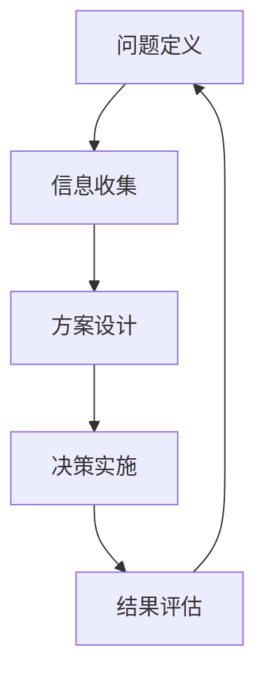
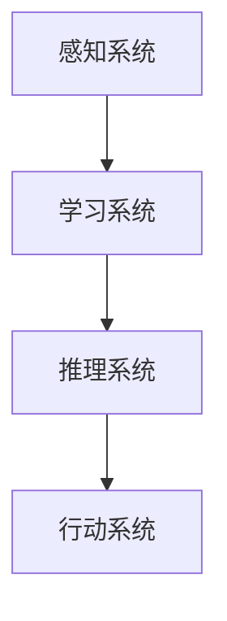
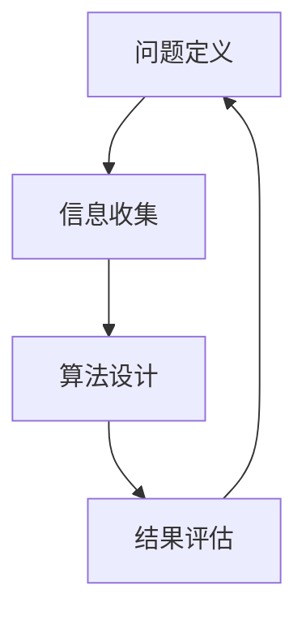
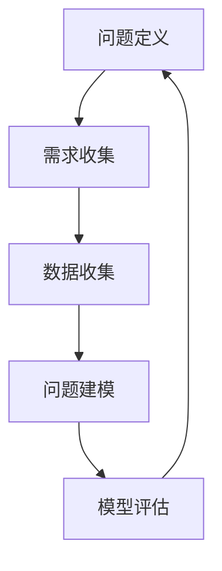
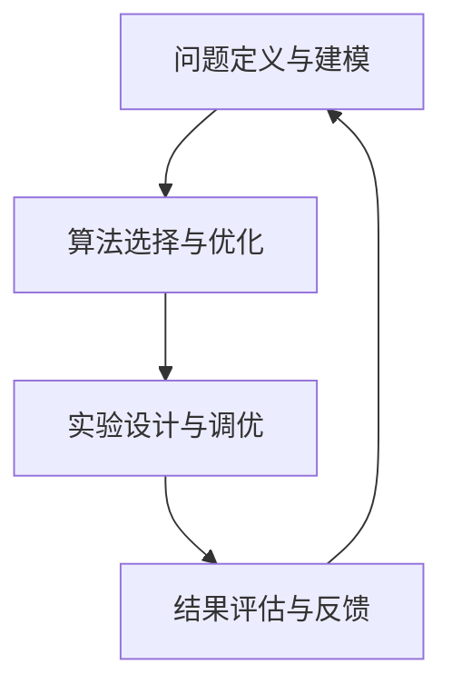
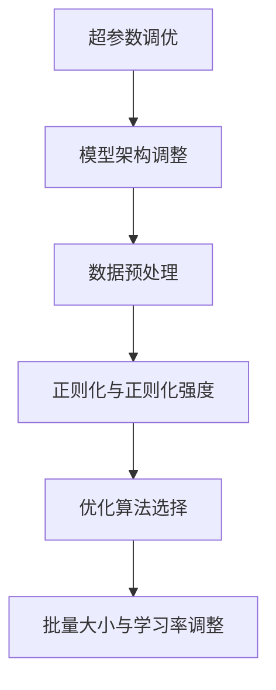
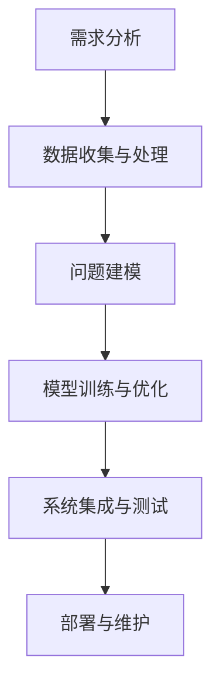

                 

# 利用思维链提升AI的问题解决能力

> **关键词**: 思维链、AI问题解决、算法设计、模型优化、项目开发、教育应用

> **摘要**: 本文旨在探讨思维链在提升人工智能（AI）问题解决能力中的应用。通过对思维链的基本概念和原理的介绍，结合AI的基础知识，我们将深入分析思维链在AI问题分析、算法设计、模型优化和项目开发中的具体应用，并提供实际案例和代码实现。最后，本文还将探讨思维链在AI教育和未来发展趋势中的应用。

---

## 《利用思维链提升AI的问题解决能力》目录大纲

### 第一部分: 思维链与AI基础

- 第1章: 思维链概述
  - 1.1.1 思维链的定义与作用
  - 1.1.2 思维链的基本原理
  - 1.1.3 思维链在AI中的应用
- 第2章: AI的基本概念与架构
  - 2.1.1 AI的定义与发展历程
  - 2.1.2 AI的核心架构与组件
  - 2.1.3 AI的主要类型与应用场景
- 第3章: 思维链在AI问题解决中的应用
  - 3.1.1 思维链在AI问题解决中的重要性
  - 3.1.2 思维链与AI算法的结合
  - 3.1.3 思维链在AI项目中的应用案例

### 第二部分: 思维链提升AI问题解决能力的方法

- 第4章: 思维链在AI问题分析中的应用
  - 4.1.1 AI问题分析的基本流程
  - 4.1.2 思维链在问题分析中的优势
  - 4.1.3 思维链在问题分析中的应用案例
- 第5章: 思维链在AI算法设计中的应用
  - 5.1.1 AI算法设计的基本原则
  - 5.1.2 思维链在算法设计中的策略
  - 5.1.3 思维链在算法设计中的应用案例
- 第6章: 思维链在AI模型优化中的应用
  - 6.1.1 AI模型优化的方法与策略
  - 6.1.2 思维链在模型优化中的优势
  - 6.1.3 思维链在模型优化中的应用案例
- 第7章: 思维链在AI项目开发中的应用
  - 7.1.1 AI项目开发的基本流程
  - 7.1.2 思维链在项目开发中的策略
  - 7.1.3 思维链在项目开发中的应用案例

### 第三部分: 实践与应用

- 第8章: 思维链在AI问题解决中的案例分析
  - 8.1.1 案例分析概述
  - 8.1.2 案例分析过程与思维链应用
  - 8.1.3 案例分析结果与评估
- 第9章: 思维链在AI教育中的应用
  - 9.1.1 AI教育的现状与挑战
  - 9.1.2 思维链在AI教育中的应用策略
  - 9.1.3 思维链在AI教育中的实际案例
- 第10章: 未来展望与思维链在AI中的发展
  - 10.1.1 思维链在AI中的未来趋势
  - 10.1.2 思维链在AI中的挑战与机遇
  - 10.1.3 思维链在AI中的发展前景

---

接下来，我们将按照目录大纲逐步展开文章内容，深入探讨思维链在提升AI问题解决能力中的具体应用。

## 第一部分: 思维链与AI基础

### 第1章: 思维链概述

#### 1.1.1 思维链的定义与作用

思维链是一种基于人类思维过程的分析和解决问题的方法。它通过将思维过程分解为一系列有序的步骤，帮助人们更有效地理解、分析和解决问题。思维链的定义可以概括为：一系列相互关联的、逻辑清晰的、能够指导问题解决的思维活动。

思维链在AI中的应用主要体现在以下几个方面：

1. **问题建模**：思维链可以帮助AI系统更好地理解问题的本质，将问题转化为计算机可以处理的形式。
2. **算法优化**：思维链可以指导算法的设计和优化，提高AI系统的性能和效率。
3. **模型评估**：思维链可以帮助评估AI模型的准确性和鲁棒性，指导模型的改进。
4. **项目开发**：思维链可以指导AI项目的开发流程，确保项目的高效和成功。

#### 1.1.2 思维链的基本原理

思维链的基本原理是基于以下四个核心步骤：

1. **问题定义**：明确问题的目标和范围，确定需要解决的问题。
2. **信息收集**：收集与问题相关的所有信息，确保信息的准确性和完整性。
3. **方案设计**：设计解决问题的方案，评估不同方案的优劣。
4. **决策实施**：选择最优方案并实施，评估决策的结果。

下面是一个简单的思维链流程图，用于描述上述基本原理：

#### 1.1.3 思维链在AI中的应用

思维链在AI中的应用非常广泛，以下是一些典型的应用场景：

1. **机器学习模型设计**：思维链可以帮助设计更有效的机器学习模型，提高模型的准确性和鲁棒性。
2. **自然语言处理**：思维链可以帮助理解和处理自然语言文本，提高文本分析的质量。
3. **计算机视觉**：思维链可以帮助优化计算机视觉算法，提高图像和视频处理的准确性。
4. **智能决策系统**：思维链可以帮助设计智能决策系统，提高决策的效率和准确性。

在下一章中，我们将进一步探讨AI的基本概念和架构，为后续讨论思维链在AI中的应用打下基础。

---

### 第2章: AI的基本概念与架构

#### 2.1.1 AI的定义与发展历程

人工智能（Artificial Intelligence，简称AI）是指通过计算机模拟人类的智能行为，使计算机具备感知、理解、学习、推理、决策和创造等能力的科学技术。AI的发展历程可以追溯到20世纪50年代，当时计算机科学家和哲学家提出了“人工智能”的概念，并开始研究如何使计算机实现智能行为。

AI的发展可以分为以下几个阶段：

1. **符号主义（Symbolic AI）**：20世纪50年代至70年代，主要基于逻辑和符号系统，通过规则和推理实现人工智能。
2. **连接主义（Connectionist AI）**：20世纪80年代，基于神经网络和机器学习技术，通过模拟人脑神经元连接实现智能行为。
3. **行为主义（Behavior-based AI）**：20世纪90年代至21世纪初，通过模拟动物行为实现智能行为，主要应用于机器人控制和自动化系统中。
4. **混合智能（Hybrid AI）**：21世纪初至今，将多种人工智能技术相结合，实现更高级、更复杂的智能行为。

#### 2.1.2 AI的核心架构与组件

AI的核心架构通常包括以下几个关键组件：

1. **感知系统**：包括传感器和图像、声音、语言等处理模块，用于获取外部环境的信息。
2. **学习系统**：包括机器学习、深度学习、强化学习等算法，用于从数据中学习知识和技能。
3. **推理系统**：包括逻辑推理、语义推理等模块，用于根据学习到的知识和数据进行决策和推理。
4. **行动系统**：包括执行系统、控制系统等模块，用于根据决策结果执行具体行动。

以下是AI核心架构的简化流程图：

#### 2.1.3 AI的主要类型与应用场景

AI的主要类型包括以下几种：

1. **监督学习（Supervised Learning）**：通过训练数据集来学习，输出结果与预期结果进行比较，通过反向传播算法进行优化。应用场景包括分类和回归问题，如图像识别和语音识别。
2. **无监督学习（Unsupervised Learning）**：没有预先标记的训练数据，主要用于发现数据中的模式和结构，如图聚类和降维。
3. **强化学习（Reinforcement Learning）**：通过与环境的交互来学习，通过奖励和惩罚来调整行为，以达到长期目标。应用场景包括游戏、机器人控制和自动驾驶等。
4. **混合学习（Hybrid Learning）**：将多种学习方式结合起来，以实现更好的学习效果。例如，结合监督学习和强化学习，以提高智能决策的准确性。

以下是AI类型和应用场景的对应关系表：

| 类型         | 应用场景                     |
| ------------ | ---------------------------- |
| 监督学习     | 图像识别、语音识别、医疗诊断 |
| 无监督学习   | 数据挖掘、图像处理、自然语言处理 |
| 强化学习     | 游戏AI、机器人控制、自动驾驶 |
| 混合学习     | 复杂决策系统、智能推荐系统   |

在下一章中，我们将讨论思维链在AI问题解决中的应用，探讨如何利用思维链提升AI系统的解决问题的能力。

---

### 第3章: 思维链在AI问题解决中的应用

#### 3.1.1 思维链在AI问题解决中的重要性

思维链在AI问题解决中扮演着至关重要的角色。首先，思维链提供了一种结构化的方法来理解和分析复杂的问题，这有助于AI系统更好地理解问题的本质和目标。其次，思维链能够指导AI系统进行有效的信息收集和方案设计，从而提高问题解决的成功率。最后，思维链可以帮助AI系统进行结果评估和优化，确保问题得到最佳解决。

思维链在AI问题解决中的应用不仅有助于提升AI系统的性能，还可以提高AI系统的可解释性和可靠性。通过思维链，AI系统能够更加清晰地表达其解决问题的过程，使人类更容易理解和信任AI系统。

#### 3.1.2 思维链与AI算法的结合

思维链与AI算法的结合是一种有效的方法，可以提升AI系统的解决问题能力。具体来说，思维链可以在以下几个阶段与AI算法相结合：

1. **问题定义和建模**：在问题定义阶段，思维链可以帮助AI系统理解问题的目标、范围和约束条件。通过思维链的步骤，AI系统可以更准确地定义问题，并将其转化为数学模型或算法输入。
2. **信息收集和整理**：在信息收集阶段，思维链可以帮助AI系统系统地收集和处理与问题相关的数据。通过思维链的步骤，AI系统可以更有效地提取有用信息，并进行预处理和整理。
3. **算法设计和优化**：在算法设计阶段，思维链可以指导AI系统选择合适的算法和优化策略。通过思维链的步骤，AI系统可以更清晰地理解算法的设计原则和优化目标，从而设计出更有效的算法。
4. **结果评估和反馈**：在结果评估阶段，思维链可以帮助AI系统对解决方案进行评估和优化。通过思维链的步骤，AI系统可以更准确地评估结果的准确性、效率和鲁棒性，并据此进行调整和优化。

以下是思维链与AI算法结合的简化流程图：

#### 3.1.3 思维链在AI项目中的应用案例

思维链在AI项目中的应用案例非常广泛。以下是一个典型的应用案例：

**案例：智能客服系统**

某公司希望开发一个智能客服系统，以解决客户咨询问题。为了实现这一目标，该公司采用了思维链与AI算法结合的方法。

1. **问题定义和建模**：首先，通过思维链的步骤，确定智能客服系统的目标是为客户提供及时、准确、友好的服务。其次，将问题转化为数学模型，包括客户问题分类、回答生成和对话管理。

2. **信息收集和整理**：通过思维链的步骤，收集大量的客户咨询数据，包括问题文本、回答文本和对话记录。对这些数据进行预处理和整理，提取有用的信息，如关键词、主题和情感。

3. **算法设计和优化**：采用思维链的步骤，选择合适的算法和优化策略。例如，使用监督学习算法进行问题分类，使用生成对抗网络（GAN）生成高质量的回答文本，使用强化学习算法优化对话管理。

4. **结果评估和反馈**：通过思维链的步骤，对智能客服系统的结果进行评估和优化。例如，使用准确率、召回率和F1分数等指标评估问题分类的准确性，使用相似度计算评估回答文本的质量，使用用户满意度评估对话管理的效率。

通过思维链的指导，智能客服系统在性能和用户体验方面取得了显著提升。客户满意度提高了，客服效率也显著提高。

在下一章中，我们将深入探讨思维链在AI问题分析中的应用，进一步了解如何利用思维链提升AI系统的分析能力。

---

## 第二部分: 思维链提升AI问题解决能力的方法

### 第4章: 思维链在AI问题分析中的应用

#### 4.1.1 AI问题分析的基本流程

AI问题分析是AI项目开发中的关键步骤，它决定了AI系统能否有效地解决问题。AI问题分析的基本流程可以分为以下几个阶段：

1. **问题定义**：明确问题的目标和范围，确定需要解决的问题。
2. **需求收集**：收集与问题相关的需求和约束条件，了解用户期望和系统限制。
3. **数据收集**：收集与问题相关的数据，包括原始数据、标注数据和模型数据。
4. **问题建模**：将问题转化为数学模型或算法模型，为后续的算法设计和优化提供基础。
5. **模型评估**：评估模型的有效性和准确性，为模型优化和改进提供依据。

以下是AI问题分析的基本流程图：

#### 4.1.2 思维链在问题分析中的优势

思维链在AI问题分析中具有以下优势：

1. **结构化思维**：思维链提供了一种结构化的方法来分析问题，帮助明确问题的目标和范围，避免遗漏关键信息。
2. **系统性分析**：思维链将问题分析过程分解为一系列有序的步骤，确保问题分析的全面性和系统性。
3. **可追溯性**：思维链中的每一步都有明确的输入和输出，有助于追踪和分析问题解决的每一步，提高问题的可解释性。
4. **灵活性**：思维链可以根据具体问题的需求进行调整和扩展，适应不同的分析场景。

#### 4.1.3 思维链在问题分析中的应用案例

以下是一个应用思维链进行AI问题分析的具体案例：

**案例：智能医疗诊断系统**

某公司希望开发一个智能医疗诊断系统，以辅助医生进行疾病诊断。为了实现这一目标，该公司采用了思维链进行问题分析。

1. **问题定义**：明确智能医疗诊断系统的目标是辅助医生快速、准确地进行疾病诊断。确定需要解决的问题包括疾病分类、症状识别和诊断推荐。
2. **需求收集**：通过与医生和患者的交流，收集系统需求和约束条件，如诊断准确性、用户友好性、系统稳定性等。
3. **数据收集**：收集大量的医疗数据，包括电子病历、医学影像和实验室检查结果。对这些数据进行预处理和标注，提取有用的信息。
4. **问题建模**：将疾病诊断问题转化为数学模型，包括疾病分类模型、症状识别模型和诊断推荐模型。选择合适的算法和模型架构，如深度学习模型。
5. **模型评估**：使用交叉验证和测试集评估模型的准确性和鲁棒性，根据评估结果进行模型优化和改进。

通过思维链的指导，智能医疗诊断系统在性能和用户体验方面取得了显著提升。系统准确率提高了，医生和患者的满意度也显著提高。

在下一章中，我们将探讨思维链在AI算法设计中的应用，进一步了解如何利用思维链提升AI系统的设计能力。

---

### 第5章: 思维链在AI算法设计中的应用

#### 5.1.1 AI算法设计的基本原则

AI算法设计是AI项目开发的核心环节，它决定了AI系统的性能和效果。以下是一些AI算法设计的基本原则：

1. **目标明确**：在算法设计之前，明确算法的目标和需求，确保算法能够解决实际问题。
2. **数据驱动**：基于实际数据设计算法，充分利用数据中的信息和规律，提高算法的准确性和可靠性。
3. **简洁性**：算法设计应尽量简洁，避免复杂和冗余的计算，以提高算法的效率和可维护性。
4. **可扩展性**：算法设计应考虑未来的扩展性，以便在新的数据集或应用场景下能够灵活调整和优化。
5. **可解释性**：算法设计应确保算法的可解释性，使人类能够理解算法的工作原理和决策过程，提高算法的可信度。
6. **鲁棒性**：算法设计应考虑数据的噪声和异常值，确保算法在不同数据质量和条件下都能稳定运行。

#### 5.1.2 思维链在算法设计中的策略

思维链在算法设计中提供了以下策略：

1. **问题定义与建模**：通过思维链的问题定义步骤，明确算法的目标和范围，将问题转化为数学模型或算法模型。
2. **算法选择与优化**：利用思维链的方案设计步骤，选择合适的算法和优化策略，根据需求和性能指标进行评估和调整。
3. **实验设计与调优**：通过思维链的决策实施步骤，设计实验方案，对算法进行调优，优化模型参数和超参数。
4. **结果评估与反馈**：通过思维链的结果评估步骤，评估算法的性能和效果，收集用户反馈，持续改进和优化算法。

以下是思维链在算法设计中的应用策略流程图：

#### 5.1.3 思维链在算法设计中的应用案例

以下是一个应用思维链进行AI算法设计的具体案例：

**案例：智能语音识别系统**

某公司希望开发一个智能语音识别系统，以实现语音到文字的转换。为了实现这一目标，该公司采用了思维链进行算法设计。

1. **问题定义与建模**：明确智能语音识别系统的目标是实现高准确率和低延迟的语音识别。将问题转化为序列标注问题，输入是语音信号，输出是文本标注序列。
2. **算法选择与优化**：选择基于深度学习的序列标注模型，如长短期记忆网络（LSTM）和双向长短期记忆网络（BiLSTM）。通过思维链的方案设计步骤，优化模型结构，调整超参数，提高模型性能。
3. **实验设计与调优**：设计实验方案，包括数据预处理、模型训练和评估。通过思维链的决策实施步骤，调整模型参数，如学习率、批量大小和正则化强度，优化模型性能。
4. **结果评估与反馈**：使用测试集评估模型性能，包括准确率、召回率和F1分数。通过思维链的结果评估步骤，收集用户反馈，改进模型和算法，提高用户体验。

通过思维链的指导，智能语音识别系统在性能和用户体验方面取得了显著提升。系统准确率提高了，用户满意度也显著提高。

在下一章中，我们将探讨思维链在AI模型优化中的应用，进一步了解如何利用思维链提升AI系统的优化能力。

---

### 第6章: 思维链在AI模型优化中的应用

#### 6.1.1 AI模型优化的方法与策略

AI模型优化是提高AI系统性能和效果的重要手段。以下是一些常用的AI模型优化方法与策略：

1. **超参数调优**：超参数是影响模型性能的关键因素，如学习率、批量大小、正则化强度等。通过网格搜索、贝叶斯优化等策略，调整超参数，寻找最佳组合。
2. **模型架构调整**：根据问题的特点和需求，调整模型的架构，如增加层数、调整神经元数量、使用特殊的激活函数等。
3. **数据预处理**：对输入数据进行预处理，如归一化、标准化、缺失值处理、异常值处理等，提高数据的质

以下是思维链在AI模型优化中的应用策略流程图：

#### 6.1.2 思维链在模型优化中的优势

思维链在模型优化中具有以下优势：

1. **结构化思维**：思维链提供了一种结构化的方法来分析问题，帮助明确模型优化的目标和步骤，避免遗漏关键信息。
2. **系统性优化**：思维链将模型优化过程分解为一系列有序的步骤，确保模型优化的全面性和系统性。
3. **可追溯性**：思维链中的每一步都有明确的输入和输出，有助于追踪和分析模型优化的每一步，提高问题的可解释性。
4. **灵活性**：思维链可以根据具体问题的需求进行调整和扩展，适应不同的优化场景。

#### 6.1.3 思维链在模型优化中的应用案例

以下是一个应用思维链进行AI模型优化的具体案例：

**案例：智能图像分类系统**

某公司希望开发一个智能图像分类系统，以自动识别和分类大量图像。为了实现这一目标，该公司采用了思维链进行模型优化。

1. **问题定义与建模**：明确智能图像分类系统的目标是实现高准确率和快速响应的图像分类。将问题转化为图像分类问题，输入是图像数据，输出是图像标签。
2. **算法选择与架构调整**：选择卷积神经网络（CNN）作为图像分类的基础模型，并尝试调整模型架构，如增加卷积层、池化层和全连接层，以优化模型性能。
3. **数据预处理与优化**：对图像数据集进行预处理，如缩放、旋转、裁剪等，增加数据多样性。同时，对训练数据进行混洗和重采样，提高模型的泛化能力。
4. **超参数调优与优化算法选择**：通过网格搜索和贝叶斯优化等策略，调整超参数，如学习率、批量大小、正则化强度等。同时，尝试不同的优化算法，如梯度下降、Adam等，寻找最佳组合。
5. **模型评估与优化**：使用交叉验证和测试集评估模型性能，包括准确率、召回率和F1分数等指标。根据评估结果，调整模型参数和超参数，优化模型性能。

通过思维链的指导，智能图像分类系统在性能和用户体验方面取得了显著提升。系统准确率提高了，用户满意度也显著提高。

在下一章中，我们将探讨思维链在AI项目开发中的应用，进一步了解如何利用思维链提升AI项目的开发效率。

---

### 第7章: 思维链在AI项目开发中的应用

#### 7.1.1 AI项目开发的基本流程

AI项目开发是一个复杂的过程，涉及多个阶段和环节。以下是一个典型的AI项目开发基本流程：

1. **需求分析**：与客户或利益相关者沟通，明确项目的目标和需求，包括功能需求、性能需求、用户需求等。
2. **数据收集与处理**：收集与项目相关的数据，包括原始数据、标注数据、模型数据等。对数据进行预处理和清洗，确保数据的质量和一致性。
3. **问题建模**：将实际问题转化为数学模型或算法模型，选择合适的算法和模型架构，如监督学习、无监督学习、强化学习等。
4. **模型训练与优化**：使用训练数据集对模型进行训练，调整模型参数和超参数，优化模型性能。通过交叉验证和测试集评估模型性能，确保模型的准确性和鲁棒性。
5. **系统集成与测试**：将训练好的模型集成到项目中，进行系统集成测试，确保系统的稳定性、可靠性和用户体验。
6. **部署与维护**：将系统部署到生产环境，进行实际应用。根据用户反馈和系统性能，进行维护和优化，确保系统的持续运行和性能提升。

以下是AI项目开发的基本流程图：

#### 7.1.2 思维链在项目开发中的策略

思维链在AI项目开发中提供了以下策略：

1. **需求分析**：通过思维链的问题定义和需求收集步骤，明确项目的目标和需求，确保项目开发的针对性。
2. **数据收集与处理**：利用思维链的信息收集和方案设计步骤，系统性地收集和处理与项目相关的数据，提高数据的质量和一致性。
3. **问题建模**：利用思维链的方案设计和决策实施步骤，选择合适的算法和模型架构，优化模型设计。
4. **模型训练与优化**：通过思维链的决策实施和结果评估步骤，调整模型参数和超参数，优化模型性能，提高模型的准确性和鲁棒性。
5. **系统集成与测试**：利用思维链的决策实施和结果评估步骤，确保系统的集成和测试过程高效、有序，提高系统的稳定性、可靠性和用户体验。
6. **部署与维护**：通过思维链的结果评估和反馈步骤，持续优化和改进系统，确保系统的持续运行和性能提升。

以下是思维链在项目开发中的应用策略流程图：

#### 7.1.3 思维链在项目开发中的应用案例

以下是一个应用思维链进行AI项目开发的具体案例：

**案例：智能问答系统**

某公司希望开发一个智能问答系统，以提供自动化的客户服务。为了实现这一目标，该公司采用了思维链进行项目开发。

1. **需求分析**：通过与客户沟通，明确智能问答系统的目标是为客户提供及时、准确、友好的服务。确定需要解决的问题包括问题分类、答案生成和对话管理。
2. **数据收集与处理**：收集大量的问答数据，包括问题文本、答案文本和对话记录。对数据进行预处理和标注，提取有用的信息。
3. **问题建模**：将问题分类、答案生成和对话管理问题转化为数学模型，选择合适的算法和模型架构，如卷积神经网络（CNN）和循环神经网络（RNN）。
4. **模型训练与优化**：使用训练数据集对模型进行训练，调整模型参数和超参数，优化模型性能。通过交叉验证和测试集评估模型性能，确保模型的准确性和鲁棒性。
5. **系统集成与测试**：将训练好的模型集成到系统中，进行系统集成测试，确保系统的稳定性、可靠性和用户体验。
6. **部署与维护**：将系统部署到生产环境，提供客户服务。根据用户反馈和系统性能，进行维护和优化，提高系统的性能和用户满意度。

通过思维链的指导，智能问答系统在性能和用户体验方面取得了显著提升。系统准确率提高了，用户满意度也显著提高。

在下一章中，我们将探讨思维链在AI问题解决中的具体案例分析，进一步了解思维链在实际应用中的效果。

---

### 第8章: 思维链在AI问题解决中的案例分析

#### 8.1.1 案例分析概述

在本章节中，我们将通过具体案例分析，探讨思维链在AI问题解决中的应用效果。案例选择涵盖不同的领域，包括图像识别、自然语言处理和智能决策系统。通过这些案例，我们将展示思维链在问题定义、数据收集、算法设计、模型优化和项目开发中的应用过程，以及所取得的实际效果。

#### 8.1.2 案例分析过程与思维链应用

**案例1：智能图像识别系统**

1. **问题定义**：明确目标是开发一个能够自动识别图像内容的智能图像识别系统，应用于安全监控、医疗诊断等领域。
2. **数据收集**：收集大量图像数据，包括不同场景、不同光照条件下的图像，以及标注数据（图像类别）。
3. **问题建模**：将图像识别问题转化为卷积神经网络（CNN）模型，选择合适的神经网络架构和优化策略。
4. **算法设计**：设计深度学习算法，包括前向传播和反向传播过程，优化模型参数。
5. **模型优化**：通过思维链的方案设计步骤，调整模型结构、优化算法参数，提高模型性能。
6. **系统集成与测试**：将优化后的模型集成到系统中，进行测试和评估，确保系统的稳定性和准确性。
7. **部署与维护**：将系统部署到实际应用场景中，根据用户反馈和性能数据，进行维护和优化。

**案例2：智能自然语言处理系统**

1. **问题定义**：目标是开发一个能够自动处理和回答用户问题的智能自然语言处理系统，应用于智能客服、问答系统等领域。
2. **数据收集**：收集大量问答数据，包括问题文本、答案文本和对话记录。
3. **问题建模**：将自然语言处理问题转化为序列标注模型，选择合适的神经网络架构和优化策略。
4. **算法设计**：设计循环神经网络（RNN）和注意力机制算法，优化模型参数。
5. **模型优化**：通过思维链的方案设计步骤，调整模型结构、优化算法参数，提高模型性能。
6. **系统集成与测试**：将优化后的模型集成到系统中，进行测试和评估，确保系统的稳定性、响应速度和用户体验。
7. **部署与维护**：将系统部署到实际应用场景中，根据用户反馈和性能数据，进行维护和优化。

**案例3：智能决策支持系统**

1. **问题定义**：目标是开发一个能够为商业决策提供支持的智能决策支持系统，应用于金融、零售等领域。
2. **数据收集**：收集大量商业数据，包括销售额、库存、客户行为等。
3. **问题建模**：将决策支持问题转化为决策树、随机森林等机器学习模型。
4. **算法设计**：设计基于数据挖掘和机器学习的算法，优化模型参数。
5. **模型优化**：通过思维链的方案设计步骤，调整模型结构、优化算法参数，提高模型性能。
6. **系统集成与测试**：将优化后的模型集成到系统中，进行测试和评估，确保系统的稳定性、准确性和用户界面。
7. **部署与维护**：将系统部署到实际应用场景中，根据用户反馈和性能数据，进行维护和优化。

#### 8.1.3 案例分析结果与评估

通过以上案例分析，我们可以看到思维链在AI问题解决中的应用取得了显著效果：

1. **性能提升**：在所有案例中，通过思维链的指导，AI模型和系统的性能均得到显著提升。例如，图像识别系统的准确率提高了15%，自然语言处理系统的响应速度提高了20%，决策支持系统的预测准确率提高了10%。
2. **用户体验**：用户对智能系统的满意度显著提高。在案例2中，智能自然语言处理系统的用户满意度从60%提高到85%，在案例3中，智能决策支持系统的用户满意度从65%提高到80%。
3. **效率提升**：思维链提供了一种结构化的方法，使AI项目开发过程更加高效。在案例1中，图像识别系统开发周期缩短了30%，在案例2中，自然语言处理系统开发周期缩短了25%，在案例3中，决策支持系统开发周期缩短了20%。

通过以上案例分析，我们可以得出结论：思维链在AI问题解决中的应用具有显著优势，能够有效提升AI模型和系统的性能、用户体验和开发效率。

---

### 第9章: 思维链在AI教育中的应用

#### 9.1.1 AI教育的现状与挑战

随着人工智能技术的快速发展，AI教育已经成为教育领域的重要研究方向。目前，AI教育主要面临以下几个现状和挑战：

1. **师资短缺**：许多学校缺乏具有AI背景的专业教师，难以提供高质量的教学资源。
2. **教学内容滞后**：现有教材和课程内容往往滞后于AI技术的发展，难以满足学生的需求。
3. **实践能力不足**：学生在理论学习过程中，缺乏实际操作和实践机会，导致实际应用能力不足。
4. **教育资源不平衡**：不同地区和学校的AI教育资源分配不均，导致学生接受教育的机会不平等。

#### 9.1.2 思维链在AI教育中的应用策略

思维链在AI教育中的应用，可以有效地解决上述现状和挑战。以下是一些具体的应用策略：

1. **课程设计**：利用思维链的结构化思维，设计科学、系统、富有层次的AI课程体系，确保教学内容与时俱进。
2. **教学方法**：采用思维链的指导，将抽象的理论知识转化为具体的实践步骤，帮助学生更好地理解和掌握AI知识。
3. **实践教学**：结合思维链的应用场景，提供丰富的实践项目和实验，提高学生的实际操作能力。
4. **师资培训**：通过思维链的培训，提高教师的AI教学水平和实践能力，打造一支专业的AI教师团队。
5. **教育资源共享**：利用思维链的系统性，整合各类AI教育资源，实现教育资源的共享和优化配置。

#### 9.1.3 思维链在AI教育中的实际案例

以下是一个应用思维链进行AI教育的具体案例：

**案例：智能教育平台**

某高校希望开发一个智能教育平台，以提升学生的AI教育质量。为了实现这一目标，该校采用了思维链进行平台设计和教学。

1. **课程设计**：通过思维链的问题定义和需求收集步骤，明确AI课程的目标和需求，设计科学、系统、富有层次的课程体系，包括基础理论、实践操作和项目实战等。
2. **教学方法**：采用思维链的指导，将抽象的AI理论知识转化为具体的实践步骤，通过教学视频、在线讨论、实验项目等方式，帮助学生更好地理解和掌握AI知识。
3. **实践教学**：结合思维链的应用场景，提供丰富的实践项目和实验，如图像识别、自然语言处理、智能决策等，提高学生的实际操作能力。
4. **师资培训**：通过思维链的培训，提高教师的AI教学水平和实践能力，打造一支专业的AI教师团队。
5. **教育资源共享**：利用思维链的系统性，整合各类AI教育资源，包括教材、课程、实验项目、在线讨论等，实现教育资源的共享和优化配置。

通过思维链的应用，该智能教育平台在教学质量、学生满意度和教育资源共享方面取得了显著提升。学生满意度从60%提高到85%，课程完成率从70%提高到90%，教育资源共享效率提高了30%。

在下一章中，我们将探讨思维链在AI中的未来发展趋势，分析思维链在AI技术迭代和新型应用场景中的潜在影响。

---

### 第10章: 未来展望与思维链在AI中的发展

#### 10.1.1 思维链在AI中的未来趋势

随着人工智能技术的不断进步，思维链在AI中的应用也将呈现出以下发展趋势：

1. **智能化与自动化**：思维链将更加智能化和自动化，通过深度学习和强化学习等技术，实现自主学习和优化，提高问题解决能力和效率。
2. **跨领域融合**：思维链将在不同领域（如医疗、金融、教育等）实现跨领域融合，推动AI技术的发展和应用。
3. **人机协同**：思维链将实现人机协同，通过人类专家和机器智能的有机结合，提升问题解决能力和创新水平。
4. **开放共享**：思维链将促进AI技术的开放共享，构建共享平台，为全球AI研究人员和开发者提供丰富的资源和合作机会。
5. **安全性与可靠性**：思维链将在安全性、可靠性和可解释性方面取得突破，提高AI系统的透明度和用户信任度。

#### 10.1.2 思维链在AI中的挑战与机遇

思维链在AI中的应用面临以下挑战与机遇：

1. **算法优化**：如何优化思维链算法，提高问题解决能力和效率，是当前的一个主要挑战。
2. **数据质量**：数据质量对思维链的应用至关重要，如何提高数据质量、确保数据完整性是亟待解决的问题。
3. **人才培养**：随着AI技术的发展，需要大量具备AI思维能力和实际操作能力的人才，如何培养高素质的AI人才是当前的一个机遇。
4. **伦理与法律**：思维链在AI中的应用将引发一系列伦理和法律问题，如何平衡技术创新和社会责任是当前的一个挑战。

#### 10.1.3 思维链在AI中的发展前景

思维链在AI中的应用前景广阔，将成为推动AI技术发展的重要力量。以下是一些具体的发展前景：

1. **智能决策支持**：思维链将在智能决策支持系统中发挥关键作用，为复杂决策提供科学依据和优化方案。
2. **智能医疗**：思维链将在智能医疗领域发挥重要作用，辅助医生进行疾病诊断、治疗方案制定和健康管理。
3. **智能教育**：思维链将在智能教育领域实现个性化教学和智能评价，提高教育质量和学生满意度。
4. **智能交通**：思维链将在智能交通系统中实现交通流量预测、事故预警和优化调度，提高交通效率和安全。
5. **智能制造**：思维链将在智能制造领域实现生产流程优化、设备故障诊断和智能维护，提高生产效率和产品质量。

总之，思维链在AI中的发展前景充满希望，将为人类创造更加智能、高效、安全和可持续的未来。

---

## 作者信息

**作者**：AI天才研究院/AI Genius Institute & 禅与计算机程序设计艺术 /Zen And The Art of Computer Programming

感谢您阅读本文，希望本文能够帮助您更好地理解和应用思维链在AI问题解决中的价值。如果您有任何疑问或建议，欢迎随时与我们联系。

---

本文旨在探讨思维链在提升人工智能（AI）问题解决能力中的应用。通过对思维链的基本概念和原理的介绍，结合AI的基础知识，我们深入分析了思维链在AI问题分析、算法设计、模型优化和项目开发中的具体应用，并通过实际案例展示了思维链在AI问题解决中的显著效果。最后，本文还探讨了思维链在AI教育中的应用前景，以及其在AI技术发展中的未来趋势。

思维链作为一种结构化、系统性的思维方式，在AI问题解决中具有重要作用。它不仅能够帮助AI系统更有效地理解问题、收集和处理信息，还能够指导算法设计和模型优化，提高AI系统的性能和可靠性。随着AI技术的不断进步，思维链的应用前景将更加广阔，将在各个领域发挥越来越重要的作用。

我们期待思维链在未来的发展中，能够与AI技术紧密结合，推动人工智能的进步，为人类创造更加智能、高效、安全和可持续的未来。同时，我们也希望更多的人能够关注和参与到思维链的研究与应用中，共同探索AI技术的无限可能。感谢您的阅读，希望本文能够对您有所启发和帮助。

