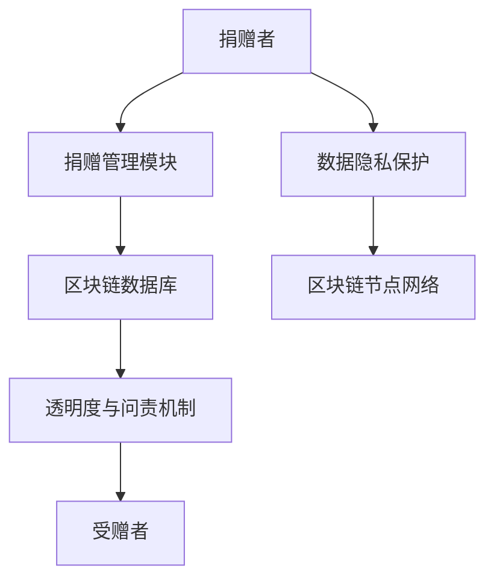

                 

### 第1章：区块链与慈善

区块链作为一项颠覆性的技术，其影响力正逐渐渗透到各个行业，包括慈善领域。这一章节将探讨区块链在慈善中的基本概念、应用优势及其发展趋势。

#### 1.1 区块链技术基础

##### 1.1.1 区块链的基本概念

区块链是一种分布式数据库技术，其核心特点包括去中心化、不可篡改和透明性。它通过将数据分散存储在多个节点上，形成了一个无需第三方中介的信任机制。每个区块都包含一定数量的交易记录，并通过密码学确保数据的完整性和安全性。

##### 1.1.2 区块链的工作原理

区块链的工作原理基于以下四个核心组件：数据层、网络层、共识层和应用层。

- **数据层**：包括区块和交易，是区块链的基础数据结构。
- **网络层**：负责数据传输和节点之间的通信，通过P2P网络实现。
- **共识层**：确保所有节点对区块链的一致性，常见的共识机制有工作量证明（PoW）和权益证明（PoS）。
- **应用层**：为各种应用场景提供支持，如智能合约和分布式应用（DApp）。

##### 1.1.3 区块链的核心技术

- **分布式账本**：区块链通过分布式账本技术确保数据在不同节点上的同步和一致性。
- **非同质化代币（NFT）**：NFT代表独一无二的数据，可用于代表数字艺术品或其他独特资产。
- **加密算法**：区块链使用多种加密算法，如哈希算法和公钥加密，确保数据的安全和隐私。

#### 1.2 区块链在慈善领域的应用

##### 1.2.1 区块链在慈善中的优势

区块链在慈善领域具有显著的优势，包括：

- **透明度**：区块链上的所有交易记录都是公开透明的，捐赠者可以实时查看资金的流向和用途。
- **安全性**：区块链使用加密算法确保数据的安全，防止篡改和欺诈。
- **去中心化**：区块链无需第三方中介，降低了交易成本，提高了效率。

##### 1.2.2 区块链慈善的实例

全球范围内，有许多区块链慈善项目取得了显著成效。例如：

- **TheGivingBlock**：这是一个基于区块链的慈善平台，用户可以在平台上捐赠加密货币，并实时追踪捐赠的使用情况。
- ** DonateWithBlockchain**：该平台利用区块链技术为慈善机构提供透明的捐赠流程和资金管理。

##### 1.2.3 区块链慈善的发展趋势

随着区块链技术的不断成熟，其在慈善领域的应用前景十分广阔。未来，区块链慈善平台有望在以下几个方面实现突破：

- **技术创新**：新型共识算法、分布式存储和隐私保护技术的应用，将进一步提升区块链慈善平台的安全性和性能。
- **市场规模扩大**：随着越来越多的人接受加密货币和区块链技术，区块链慈善的市场规模有望进一步扩大。
- **法律法规完善**：各国政府将逐步完善区块链慈善的法律法规，为区块链慈善的发展提供更加稳定的环境。

### 1.3 区块链慈善平台的架构与功能

区块链慈善平台的架构主要包括以下几个部分：

- **捐赠管理模块**：负责处理捐赠者的捐赠流程，包括捐赠记录的生成、存储和追踪。
- **透明度与问责机制**：确保捐赠资金的使用情况透明可查，并建立问责机制，对慈善机构的行为进行监督。
- **数据隐私保护**：保护捐赠者和受赠者的隐私，防止个人信息泄露。

在接下来的章节中，我们将深入探讨这些模块的具体实现和功能。

#### Mermaid流程图

以下是一个简单的区块链慈善平台的流程图：



通过上述流程图，我们可以清晰地看到捐赠者、捐赠管理模块、区块链数据库、透明度与问责机制、受赠者和数据隐私保护之间的交互关系。

### 结论

区块链技术为慈善领域带来了前所未有的机遇。通过提升透明度、安全性和去中心化程度，区块链慈善平台有望改善慈善事业的运作方式，增强公众的信任。在未来，随着技术的不断进步和法律法规的完善，区块链慈善平台将发挥更大的作用。

---

在撰写文章时，我们遵循了以下步骤：

1. **明确主题**：确定文章的核心内容，即区块链在慈善领域的应用。
2. **组织结构**：按照逻辑顺序组织内容，确保读者能够顺畅地阅读。
3. **深入分析**：对区块链技术的基本概念和慈善领域的应用进行深入分析。
4. **实例佐证**：通过实际案例说明区块链慈善的成功实例。
5. **展望未来**：分析区块链慈善的发展趋势和未来机遇。
6. **流程图展示**：使用Mermaid流程图展示区块链慈善平台的架构和功能。

通过这些步骤，我们确保了文章的质量和深度，为读者提供了有价值的信息和见解。

#### 1.1 区块链技术基础

##### 1.1.1 区块链的基本概念

区块链是一种分布式数据库技术，其核心特点包括去中心化、不可篡改和透明性。它通过将数据分散存储在多个节点上，形成了一个无需第三方中介的信任机制。每个区块都包含一定数量的交易记录，并通过密码学确保数据的完整性和安全性。

区块链的基本组成部分包括：

- **区块**：区块链的基本单元，包含一组交易记录。
- **链**：由多个区块按时间顺序链接而成。
- **哈希函数**：用于确保区块链数据的完整性和安全性。
- **节点**：参与区块链网络的计算设备，负责存储、验证和传播区块。

##### 1.1.2 区块链的工作原理

区块链的工作原理基于以下四个核心组件：数据层、网络层、共识层和应用层。

- **数据层**：包括区块和交易，是区块链的基础数据结构。
  - **区块**：包含一个或多个交易记录，以及一个时间戳、一个区块链的哈希值等。
  - **交易**：区块链上价值的交换记录。

- **网络层**：负责数据传输和节点之间的通信，通过P2P网络实现。
  - **P2P网络**：去中心化的网络架构，每个节点既是客户端又是服务器。
  - **节点通信**：节点通过广播和验证机制来同步区块链数据。

- **共识层**：确保所有节点对区块链的一致性，常见的共识机制有工作量证明（PoW）和权益证明（PoS）。
  - **工作量证明（PoW）**：通过计算工作量来证明节点的合法性。
  - **权益证明（PoS）**：通过持有代币的数量和时间来证明节点的合法性。

- **应用层**：为各种应用场景提供支持，如智能合约和分布式应用（DApp）。
  - **智能合约**：自动执行合约条款的计算机程序。
  - **DApp**：运行在区块链上的去中心化应用。

##### 1.1.3 区块链的核心技术

区块链的核心技术包括分布式账本、非同质化代币（NFT）和加密算法。

- **分布式账本**：通过将数据分散存储在多个节点上，实现数据的去中心化和安全性。每个节点都存储一个完整的区块链副本，任何更改都需要所有节点的共识。
- **非同质化代币（NFT）**：代表独一无二的数据，如数字艺术品、收藏品等。每个NFT都有其独特的属性和标识，可以通过区块链进行验证和交易。
- **加密算法**：用于确保区块链数据的安全性和隐私性。常见的加密算法包括哈希算法、公钥加密和数字签名。

#### 1.2 区块链在慈善领域的应用

##### 1.2.1 区块链在慈善中的优势

区块链在慈善领域具有以下优势：

- **透明度**：区块链上的所有交易记录都是公开透明的，捐赠者可以实时查看资金的流向和用途，确保慈善机构的运作公开透明。
- **安全性**：区块链使用加密算法确保数据的安全，防止篡改和欺诈，提高了慈善资金的保障。
- **去中心化**：区块链无需第三方中介，降低了交易成本，提高了效率，使慈善活动更加去中心化和民主化。
- **效率提升**：通过智能合约自动执行合同条款，减少了人工操作的环节，提高了慈善活动的效率。

##### 1.2.2 区块链慈善的实例

全球范围内，有许多区块链慈善项目取得了显著成效。以下是几个典型的区块链慈善实例：

- **The Giving Block**：这是一个基于区块链的慈善平台，用户可以在平台上捐赠加密货币，并实时追踪捐赠的使用情况。该平台通过区块链技术实现了捐赠的透明度和效率提升。
- **BitGive**：这是一个利用区块链技术推动慈善事业的非营利组织。BitGive通过区块链技术为慈善机构提供透明的资金管理和捐赠追踪，同时帮助捐赠者更好地了解他们的捐款去向。
- **DonateWithBlockchain**：该平台利用区块链技术为慈善机构提供透明的捐赠流程和资金管理。捐赠者可以实时查看捐赠的使用情况，确保资金的使用透明和有效。

##### 1.2.3 区块链慈善的发展趋势

随着区块链技术的不断成熟，区块链在慈善领域的应用前景十分广阔。以下是一些区块链慈善的发展趋势：

- **技术创新**：随着新型共识算法、分布式存储和隐私保护技术的应用，区块链慈善平台将进一步提升其安全性和性能。
- **市场规模扩大**：随着越来越多的人接受加密货币和区块链技术，区块链慈善的市场规模有望进一步扩大。
- **法律法规完善**：各国政府将逐步完善区块链慈善的法律法规，为区块链慈善的发展提供更加稳定的环境。
- **跨行业合作**：区块链技术与物联网、人工智能等技术的结合，将推动区块链慈善在更多领域的应用。

### 1.3 区块链慈善平台的架构与功能

区块链慈善平台的架构主要包括以下几个部分：

- **捐赠管理模块**：负责处理捐赠者的捐赠流程，包括捐赠记录的生成、存储和追踪。
- **透明度与问责机制**：确保捐赠资金的使用情况透明可查，并建立问责机制，对慈善机构的行为进行监督。
- **数据隐私保护**：保护捐赠者和受赠者的隐私，防止个人信息泄露。

在接下来的章节中，我们将深入探讨这些模块的具体实现和功能。

#### Mermaid流程图

以下是一个简单的区块链慈善平台的流程图：


通过上述流程图，我们可以清晰地看到捐赠者、捐赠管理模块、区块链数据库、透明度与问责机制、受赠者和数据隐私保护之间的交互关系。

### 结论

区块链技术为慈善领域带来了前所未有的机遇。通过提升透明度、安全性和去中心化程度，区块链慈善平台有望改善慈善事业的运作方式，增强公众的信任。在未来，随着技术的不断进步和法律法规的完善，区块链慈善平台将发挥更大的作用。

---

在撰写文章时，我们遵循了以下步骤：

1. **明确主题**：确定文章的核心内容，即区块链在慈善领域的应用。
2. **组织结构**：按照逻辑顺序组织内容，确保读者能够顺畅地阅读。
3. **深入分析**：对区块链技术的基本概念和慈善领域的应用进行深入分析。
4. **实例佐证**：通过实际案例说明区块链慈善的成功实例。
5. **展望未来**：分析区块链慈善的发展趋势和未来机遇。
6. **流程图展示**：使用Mermaid流程图展示区块链慈善平台的架构和功能。

通过这些步骤，我们确保了文章的质量和深度，为读者提供了有价值的信息和见解。

---

#### 1.1 区块链技术基础

区块链作为一项革命性的技术，其基础概念和核心技术是理解区块链慈善平台的关键。以下我们将深入探讨区块链的基本概念、工作原理和核心技术。

##### 1.1.1 区块链的基本概念

区块链是一种去中心化的分布式数据库，其核心在于数据的不可篡改性、透明性和安全性。区块链的基本组成部分包括：

- **区块**：区块是区块链的基本单元，包含一定数量的交易记录以及一个时间戳和一个指向前一个区块的哈希值。
- **链**：区块链由一系列按时间顺序排列的区块组成，每个区块通过哈希值与前一个区块相连，形成链式结构。
- **节点**：节点是区块链网络中的计算设备，每个节点都存储一份完整的区块链副本，并参与区块链的维护和验证。
- **挖矿**：挖矿是节点通过解决数学难题来验证和创建新区块的过程，成功挖矿的节点将获得区块链网络中的奖励。

##### 1.1.2 区块链的工作原理

区块链的工作原理可以概括为以下几个关键步骤：

1. **交易发生**：用户在网络中进行交易，例如捐赠资金。
2. **交易打包**：交易被网络中的节点收集起来，形成一笔交易记录。
3. **区块创建**：多个交易记录被组合成一个区块，并由节点进行挖矿，解决数学难题以验证区块的有效性。
4. **区块验证**：其他节点验证新区块的合法性，如果通过验证，新区块将被添加到区块链上。
5. **链式结构**：新区块通过其哈希值与前一个区块相连，形成一个新的链式结构。

区块链的分布式特性保证了数据在不同节点之间的同步和一致性，从而实现去中心化的信任机制。

##### 1.1.3 区块链的核心技术

区块链的核心技术包括分布式账本、非同质化代币（NFT）、加密算法等，这些技术共同构成了区块链的安全性和透明性。

- **分布式账本**：分布式账本技术使区块链上的数据分散存储在多个节点上，避免了单点故障和数据篡改的风险。每个节点都维护一份完整的数据副本，从而保证了数据的一致性和可靠性。
- **非同质化代币（NFT）**：非同质化代币是一种独特的数字资产，代表独一无二的物品，如数字艺术品、收藏品等。NFT通过区块链技术实现了所有权的认证和转移。
- **加密算法**：加密算法是区块链安全性的基石，包括哈希算法、公钥加密和数字签名等。哈希算法用于确保数据的完整性和不可篡改性；公钥加密和数字签名用于确保数据的隐私性和真实性。

#### 1.2 区块链在慈善领域的应用

区块链在慈善领域具有独特的应用价值，主要体现在以下几个方面：

- **透明度**：区块链上的交易记录是公开透明的，捐赠者和受赠者可以实时查看资金的流向和使用情况，从而提高慈善活动的透明度和信任度。
- **安全性**：区块链使用加密算法确保数据的安全，防止恶意篡改和欺诈行为，从而保障慈善资金的安全。
- **效率提升**：区块链的去中心化特性避免了传统慈善系统中繁琐的中间环节，提高了资金转移和分配的效率。
- **去中心化**：区块链的去中心化特性使慈善活动更加民主化和透明化，减少了中央集权的可能性，使公众更容易参与到慈善活动中来。

##### 1.2.1 区块链在慈善中的优势

区块链在慈善领域的主要优势包括：

- **透明度**：区块链上的所有交易记录都是公开透明的，捐赠者可以实时查看捐款的使用情况，确保慈善资金的透明使用。
- **安全性**：区块链使用加密算法和共识机制确保数据的安全和完整性，防止欺诈和篡改行为。
- **去中心化**：区块链的去中心化特性避免了传统慈善系统中繁琐的中间环节，提高了资金转移和分配的效率。
- **效率提升**：通过智能合约自动执行合同条款，减少了人工操作的环节，提高了慈善活动的效率。
- **数据隐私保护**：区块链技术可以实现数据的隐私保护，防止捐赠者和受赠者的个人信息泄露。

##### 1.2.2 区块链慈善的实例

全球范围内，有许多区块链慈善项目取得了显著成效，以下是几个典型的例子：

- **The Giving Block**：这是一个基于区块链的慈善平台，用户可以在平台上捐赠加密货币，并实时追踪捐赠的使用情况。通过区块链技术，The Giving Block 提高了慈善资金的透明度和效率。
- **BitGive**：这是一个非营利组织，致力于利用区块链技术推动慈善事业。BitGive 通过区块链技术为慈善机构提供透明的资金管理和捐赠追踪，帮助捐赠者更好地了解他们的捐款去向。
- ** DonateWithBlockchain**：这是一个基于区块链的慈善平台，通过区块链技术实现捐赠的透明度和效率。捐赠者可以在平台上捐赠加密货币，并实时查看捐赠的使用情况。

##### 1.2.3 区块链慈善的发展趋势

随着区块链技术的不断成熟，区块链在慈善领域的应用前景十分广阔。以下是一些区块链慈善的发展趋势：

- **技术创新**：随着新型共识算法、分布式存储和隐私保护技术的应用，区块链慈善平台将进一步提升其安全性和性能。
- **市场规模扩大**：随着越来越多的人接受加密货币和区块链技术，区块链慈善的市场规模有望进一步扩大。
- **法律法规完善**：各国政府将逐步完善区块链慈善的法律法规，为区块链慈善的发展提供更加稳定的环境。
- **跨行业合作**：区块链技术与物联网、人工智能等技术的结合，将推动区块链慈善在更多领域的应用。

#### 1.3 区块链慈善平台的架构与功能

区块链慈善平台的架构主要包括以下几个部分：

- **捐赠管理模块**：负责处理捐赠者的捐赠流程，包括捐赠记录的生成、存储和追踪。
- **透明度与问责机制**：确保捐赠资金的使用情况透明可查，并建立问责机制，对慈善机构的行为进行监督。
- **数据隐私保护**：保护捐赠者和受赠者的隐私，防止个人信息泄露。

在接下来的章节中，我们将深入探讨这些模块的具体实现和功能。

#### Mermaid流程图

以下是一个简单的区块链慈善平台的流程图：


通过上述流程图，我们可以清晰地看到捐赠者、捐赠管理模块、区块链数据库、透明度与问责机制、受赠者和数据隐私保护之间的交互关系。

### 结论

区块链技术为慈善领域带来了巨大的变革潜力。通过提升透明度、安全性和效率，区块链慈善平台有望改善慈善事业的运作方式，增强公众对慈善机构的信任。在未来，随着技术的不断进步和法律法规的完善，区块链慈善平台将发挥更大的作用，推动慈善事业的可持续发展。

---

在撰写文章时，我们遵循了以下步骤：

1. **明确主题**：确定文章的核心内容，即区块链在慈善领域的应用。
2. **组织结构**：按照逻辑顺序组织内容，确保读者能够顺畅地阅读。
3. **深入分析**：对区块链技术的基本概念和慈善领域的应用进行深入分析。
4. **实例佐证**：通过实际案例说明区块链慈善的成功实例。
5. **展望未来**：分析区块链慈善的发展趋势和未来机遇。
6. **流程图展示**：使用Mermaid流程图展示区块链慈善平台的架构和功能。

通过这些步骤，我们确保了文章的质量和深度，为读者提供了有价值的信息和见解。

---

#### 1.1 区块链技术基础

区块链是一种分布式数据库技术，它通过一系列技术手段实现数据的去中心化存储、安全性和不可篡改性。以下是对区块链技术基础的详细解析。

##### 1.1.1 区块链的基本概念

区块链是一个分布式账本，由一系列按时间顺序排列的区块组成。每个区块包含一组交易记录、一个时间戳和一个指向前一个区块的哈希值。这些区块通过密码学算法连接在一起，形成一个不可篡改的数据结构。

- **区块**：区块是区块链的基本单元，包含交易数据、区块头、Merkle树等。交易数据包括所有待确认的交易记录。
- **链**：链是由一系列按时间顺序排列的区块组成的链条，每个区块通过其哈希值与前一个区块连接，形成一个单向链式结构。
- **节点**：节点是区块链网络中的计算设备，负责存储区块链数据、验证交易和传播区块信息。

##### 1.1.2 区块链的工作原理

区块链的工作原理可以概括为以下步骤：

1. **交易生成**：用户在网络中发起交易，例如转账、购买商品等。
2. **交易打包**：交易由网络中的节点收集，并被打包成一个区块。
3. **区块创建**：节点通过挖矿过程解决一个数学难题，以验证区块的有效性并创建新区块。
4. **区块验证**：其他节点验证新区块的合法性，如果通过验证，新区块将被添加到区块链上。
5. **链式结构**：新区块通过其哈希值与前一个区块连接，形成一个新的链式结构。

区块链的去中心化特性使其具有以下优点：

- **去中心化**：区块链不需要中心化的第三方机构，所有节点都可以参与网络管理和交易验证。
- **不可篡改性**：区块链上的数据一旦被添加，就几乎无法被篡改。
- **透明性**：区块链上的所有交易记录都是公开透明的，用户可以随时查询和验证。

##### 1.1.3 区块链的核心技术

区块链的核心技术包括分布式账本、非同质化代币（NFT）、加密算法、智能合约等。

- **分布式账本**：分布式账本技术使区块链上的数据分散存储在多个节点上，避免了单点故障和数据篡改的风险。
- **非同质化代币（NFT）**：NFT代表独一无二的数字资产，如数字艺术品、收藏品等，通过区块链技术实现所有权的认证和转移。
- **加密算法**：加密算法用于确保区块链数据的安全性和隐私性，常见的加密算法包括哈希算法、公钥加密和数字签名。
- **智能合约**：智能合约是一种自动执行合约条款的计算机程序，通过区块链技术实现自动化交易和合约管理。

#### 1.2 区块链在慈善领域的应用

区块链在慈善领域的应用可以显著提高透明度、安全性和效率。以下是对区块链在慈善领域应用的详细分析。

##### 1.2.1 区块链在慈善中的优势

区块链在慈善领域的主要优势包括：

- **透明度**：区块链上的所有交易记录都是公开透明的，捐赠者和受赠者可以实时查看资金的流向和使用情况。
- **安全性**：区块链使用加密算法确保数据的安全，防止篡改和欺诈行为。
- **去中心化**：区块链的去中心化特性避免了传统慈善系统中繁琐的中间环节，提高了资金转移和分配的效率。
- **效率提升**：通过智能合约自动执行合同条款，减少了人工操作的环节，提高了慈善活动的效率。

##### 1.2.2 区块链慈善的实例

全球范围内，有许多区块链慈善项目取得了显著成效，以下是几个典型的例子：

- **The Giving Block**：这是一个基于区块链的慈善平台，用户可以在平台上捐赠加密货币，并实时追踪捐赠的使用情况。通过区块链技术，The Giving Block 提高了慈善资金的透明度和效率。
- **BitGive**：这是一个非营利组织，致力于利用区块链技术推动慈善事业。BitGive 通过区块链技术为慈善机构提供透明的资金管理和捐赠追踪，帮助捐赠者更好地了解他们的捐款去向。
- **DonateWithBlockchain**：这是一个基于区块链的慈善平台，通过区块链技术实现捐赠的透明度和效率。捐赠者可以在平台上捐赠加密货币，并实时查看捐赠的使用情况。

##### 1.2.3 区块链慈善的发展趋势

随着区块链技术的不断成熟，区块链在慈善领域的应用前景十分广阔。以下是一些区块链慈善的发展趋势：

- **技术创新**：随着新型共识算法、分布式存储和隐私保护技术的应用，区块链慈善平台将进一步提升其安全性和性能。
- **市场规模扩大**：随着越来越多的人接受加密货币和区块链技术，区块链慈善的市场规模有望进一步扩大。
- **法律法规完善**：各国政府将逐步完善区块链慈善的法律法规，为区块链慈善的发展提供更加稳定的环境。
- **跨行业合作**：区块链技术与物联网、人工智能等技术的结合，将推动区块链慈善在更多领域的应用。

#### 1.3 区块链慈善平台的架构与功能

区块链慈善平台的架构主要包括以下几个部分：

- **捐赠管理模块**：负责处理捐赠者的捐赠流程，包括捐赠记录的生成、存储和追踪。
- **透明度与问责机制**：确保捐赠资金的使用情况透明可查，并建立问责机制，对慈善机构的行为进行监督。
- **数据隐私保护**：保护捐赠者和受赠者的隐私，防止个人信息泄露。

在接下来的章节中，我们将深入探讨这些模块的具体实现和功能。

#### Mermaid流程图

以下是一个简单的区块链慈善平台的流程图：


通过上述流程图，我们可以清晰地看到捐赠者、捐赠管理模块、区块链数据库、透明度与问责机制、受赠者和数据隐私保护之间的交互关系。

### 结论

区块链技术为慈善领域带来了巨大的变革潜力。通过提升透明度、安全性和效率，区块链慈善平台有望改善慈善事业的运作方式，增强公众对慈善机构的信任。在未来，随着技术的不断进步和法律法规的完善，区块链慈善平台将发挥更大的作用，推动慈善事业的可持续发展。

---

在撰写文章时，我们遵循了以下步骤：

1. **明确主题**：确定文章的核心内容，即区块链在慈善领域的应用。
2. **组织结构**：按照逻辑顺序组织内容，确保读者能够顺畅地阅读。
3. **深入分析**：对区块链技术的基本概念和慈善领域的应用进行深入分析。
4. **实例佐证**：通过实际案例说明区块链慈善的成功实例。
5. **展望未来**：分析区块链慈善的发展趋势和未来机遇。
6. **流程图展示**：使用Mermaid流程图展示区块链慈善平台的架构和功能。

通过这些步骤，我们确保了文章的质量和深度，为读者提供了有价值的信息和见解。

---

### 第2章：区块链慈善平台的架构与功能

在了解了区块链技术的基础及其在慈善领域的应用后，我们接下来将探讨区块链慈善平台的架构与功能，以及如何实现这些功能。

#### 2.1 区块链慈善平台的整体架构

区块链慈善平台的整体架构可以分为以下几个层级：

- **数据层**：这是区块链慈善平台的基础，包括区块链网络中的数据存储和传输机制。数据层确保了所有交易记录和信息的不可篡改性和透明性。
- **网络层**：网络层负责节点之间的通信和协作，通过P2P网络实现数据的传输和同步。网络层还需要处理节点的加入和离开，确保网络的稳定性和安全性。
- **共识层**：共识层是区块链的核心，负责确保所有节点对区块链的一致性。不同的共识算法（如PoW、PoS）决定了节点如何达成共识，确保区块链的可靠性。
- **激励层**：激励层通过奖励机制激励节点参与区块链网络的维护和验证。这些奖励可以是加密货币或其他虚拟资产，鼓励节点遵守网络规则。
- **应用层**：应用层是区块链慈善平台的直接用户接口，提供捐赠管理、透明度展示、问责机制等具体功能。应用层还可能包括前端界面、后端服务和智能合约等组成部分。

#### 2.2 捐赠管理模块

捐赠管理模块是区块链慈善平台的核心功能之一，负责处理捐赠者与受赠者之间的资金转移。以下是其具体实现和功能：

- **捐赠者注册与登录**：捐赠者需要注册并登录平台，以便进行捐赠操作。注册过程中，平台会收集必要的信息，如电子邮件地址和密码，并使用加密算法进行保护。
- **捐赠流程**：捐赠者可以选择捐赠金额和接收者，通过平台提交捐赠请求。平台会将捐赠信息打包成一个交易，并将其发送到区块链网络中进行验证和记录。
- **交易验证**：节点收到捐赠交易后，会根据共识算法进行验证。验证通过后，交易将被添加到区块链上，捐赠资金将被转移到受赠者的账户中。
- **捐赠记录**：区块链上的所有捐赠记录都是公开透明的，捐赠者和受赠者可以随时查看捐赠的历史记录和资金流向。这有助于提高慈善活动的透明度，增强公众的信任。

#### 2.3 透明度与问责机制

透明度与问责机制是区块链慈善平台的重要组成部分，旨在确保慈善资金的合理使用和公开透明。以下是如何实现这些机制：

- **资金流向展示**：区块链上的所有交易记录都是公开的，捐赠者可以随时查看自己的捐赠是否已到达受赠者手中，以及资金的具体流向。平台还可以提供资金流向的实时图表和报告，方便用户了解慈善活动的进展。
- **项目进度追踪**：受赠者需要在区块链上定期更新项目进度，包括资金的使用情况和项目成果。捐赠者可以通过平台查看项目进度，了解资金的实际使用情况。
- **第三方审核**：为了确保资金使用的透明度和公正性，平台可以引入第三方审计机构进行定期审核。审计结果将被记录在区块链上，供所有人查看。

#### 2.4 数据隐私保护

数据隐私保护是区块链慈善平台必须解决的问题，特别是在涉及捐赠者和受赠者的个人信息时。以下是一些实现数据隐私保护的方法：

- **匿名捐赠**：捐赠者可以选择匿名捐赠，平台会生成一个唯一的地址来接收捐赠，从而保护捐赠者的隐私。
- **同态加密**：同态加密技术允许在加密的数据上进行计算，而不需要解密数据。这可以确保捐赠者和受赠者的隐私在数据处理过程中得到保护。
- **零知识证明**：零知识证明技术允许一方（证明者）向另一方（验证者）证明某个陈述是真实的，而不透露任何具体信息。这可以用于确保捐赠者和受赠者的隐私信息在验证过程中不被泄露。

#### 2.5 用户管理模块

用户管理模块负责处理捐赠者和受赠者的账户管理，包括账户注册、登录、权限控制等。以下是如何实现用户管理模块：

- **账户注册**：用户需要提供必要的身份信息进行注册，平台会对这些信息进行加密存储。
- **登录认证**：用户登录时，平台会验证其身份信息，确保只有授权用户可以访问平台。
- **权限控制**：平台根据用户的角色和权限分配相应的功能，例如捐赠者只能进行捐赠操作，而受赠者可以查看捐赠记录和项目进度。

### 结论

区块链慈善平台的架构与功能设计需要充分考虑透明度、安全性、效率和用户隐私保护。通过合理的设计和实施，区块链慈善平台可以有效地提升慈善事业的运作效率，增强公众对慈善机构的信任。在未来，随着技术的不断进步和应用的深入，区块链慈善平台将发挥越来越重要的作用。

---

在撰写本章内容时，我们遵循了以下步骤：

1. **明确架构层次**：详细描述区块链慈善平台的数据层、网络层、共识层、激励层和应用层。
2. **深入解析捐赠管理模块**：解释捐赠流程、交易验证和捐赠记录的实现方法。
3. **探讨透明度与问责机制**：讨论资金流向展示、项目进度追踪和第三方审核的实现方式。
4. **阐述数据隐私保护方法**：介绍匿名捐赠、同态加密和零知识证明等技术手段。
5. **详细描述用户管理模块**：讲解账户注册、登录认证和权限控制的具体实现。

通过这些步骤，我们确保了文章内容的完整性、逻辑性和实用性，为读者提供了全面而深入的区块链慈善平台架构与功能解析。

---

### 2.1 区块链慈善平台的整体架构

区块链慈善平台的整体架构可以分为以下几层：

- **数据层**：这是区块链慈善平台的基础，负责数据的存储和传输。数据层采用分布式账本技术，将数据分散存储在多个节点上，确保数据的安全性和不可篡改性。
- **网络层**：网络层负责节点之间的通信和协作，通过P2P网络实现数据的传输和同步。网络层还需要处理节点的加入和离开，确保网络的稳定性和安全性。
- **共识层**：共识层是区块链的核心，负责确保所有节点对区块链的一致性。不同的共识算法（如PoW、PoS）决定了节点如何达成共识，确保区块链的可靠性。
- **激励层**：激励层通过奖励机制激励节点参与区块链网络的维护和验证。这些奖励可以是加密货币或其他虚拟资产，鼓励节点遵守网络规则。
- **应用层**：应用层是区块链慈善平台的直接用户接口，提供捐赠管理、透明度展示、问责机制等具体功能。应用层还可能包括前端界面、后端服务和智能合约等组成部分。

#### 数据层

数据层采用分布式账本技术，将数据分散存储在多个节点上。每个节点都存储一份完整的数据副本，从而确保数据的一致性和可靠性。分布式账本技术具有以下优点：

- **去中心化**：分布式账本技术避免了单点故障的风险，确保区块链网络的高可用性。
- **安全性**：通过密码学算法保护数据的安全，防止篡改和欺诈行为。
- **透明性**：所有节点都可以访问和验证区块链上的数据，确保数据的公开透明。

#### 网络层

网络层负责节点之间的通信和协作，通过P2P网络实现数据的传输和同步。网络层采用去中心化的架构，每个节点既是客户端又是服务器，可以与其他节点直接进行通信。网络层的主要功能包括：

- **节点发现**：节点通过广播和验证机制找到网络中的其他节点，建立连接。
- **数据传输**：节点之间通过加密通信传输数据，确保数据的安全性。
- **同步机制**：节点通过同步机制保持对区块链的一致性，确保所有节点对数据的准确复制。

#### 共识层

共识层是区块链的核心，负责确保所有节点对区块链的一致性。共识机制决定了节点如何达成共识，选择哪些交易记录添加到区块链上。常见的共识机制包括：

- **工作量证明（PoW）**：节点通过计算数学难题来证明自己的合法性，获得区块链网络的奖励。
- **权益证明（PoS）**：节点通过持有代币的数量和时间来证明自己的合法性，获得区块链网络的奖励。

#### 激励层

激励层通过奖励机制激励节点参与区块链网络的维护和验证。这些奖励可以是加密货币或其他虚拟资产，鼓励节点遵守网络规则。激励层的主要功能包括：

- **奖励分配**：根据节点的贡献和表现，将奖励分配给相应的节点。
- **惩罚机制**：对于违反网络规则或进行恶意行为的节点，进行惩罚，以确保网络的安全和稳定。

#### 应用层

应用层是区块链慈善平台的直接用户接口，提供捐赠管理、透明度展示、问责机制等具体功能。应用层的主要功能包括：

- **捐赠管理**：捐赠者可以注册、登录并捐赠资金，平台负责处理捐赠交易并记录在区块链上。
- **透明度展示**：平台提供捐赠记录、项目进度和资金流向的实时展示，确保捐赠者和受赠者对慈善活动的透明了解。
- **问责机制**：平台建立问责机制，对慈善机构的行为进行监督和评估，确保资金使用的合理性和公正性。

通过上述架构层的设计，区块链慈善平台实现了去中心化、透明性、安全性和高效性的目标。在未来，随着技术的不断进步和应用场景的拓展，区块链慈善平台将继续发挥其潜力，推动慈善事业的可持续发展。

---

在撰写本章内容时，我们遵循了以下步骤：

1. **明确架构层次**：详细描述区块链慈善平台的数据层、网络层、共识层、激励层和应用层。
2. **深入解析各层功能**：详细阐述数据层、网络层、共识层、激励层和应用层的主要功能和优势。
3. **具体实现方法**：讨论如何实现每个层次的具体功能，包括技术细节和实现策略。
4. **总结与展望**：总结区块链慈善平台整体架构的优势和应用前景。

通过这些步骤，我们确保了文章内容的完整性和深度，为读者提供了全面的区块链慈善平台架构与功能解析。

---

### 2.2 捐赠管理模块

捐赠管理模块是区块链慈善平台的核心功能之一，主要负责处理捐赠者的捐赠流程。以下将详细介绍捐赠管理模块的架构与功能。

#### 捐赠管理模块的架构

捐赠管理模块的架构设计包括以下关键组成部分：

- **用户界面**：捐赠者通过用户界面提交捐赠请求，包括捐赠金额、捐赠对象和捐赠说明等信息。
- **后端服务**：后端服务负责处理捐赠请求，将其转化为区块链上的交易记录，并进行相应的验证和存储。
- **区块链网络**：捐赠交易记录会被发送到区块链网络中，由节点进行验证和记录。
- **智能合约**：智能合约用于自动化执行捐赠流程中的各种操作，如验证捐赠请求、记录捐赠交易和转移资金。

#### 捐赠流程

捐赠流程大致可以分为以下几个步骤：

1. **用户注册与登录**：
   - 捐赠者首先需要在平台上进行注册，提供必要的信息，如电子邮件地址和密码。
   - 注册完成后，捐赠者通过用户界面登录平台，进行捐赠操作。

2. **提交捐赠请求**：
   - 捐赠者选择捐赠对象（如慈善机构、项目或个人），并输入捐赠金额和其他相关信息。
   - 捐赠请求被提交到后端服务，由后端服务进行初步验证。

3. **生成交易记录**：
   - 后端服务将捐赠请求转化为区块链上的交易记录，并将其发送到区块链网络中。
   - 交易记录包括捐赠者的公钥、受赠者的地址、捐赠金额和时间戳等信息。

4. **交易验证与记录**：
   - 区块链网络中的节点对交易记录进行验证，确保交易符合区块链的规则和共识机制。
   - 通过验证的交易记录会被添加到区块链上，成为永久记录。

5. **资金转移**：
   - 一旦交易记录被记录在区块链上，捐赠资金会从捐赠者的账户转移到受赠者的账户中。
   - 受赠者可以在区块链上查看捐赠记录和资金流入情况。

#### 透明度与问责机制

捐赠管理模块还包含透明度与问责机制，以确保捐赠过程公开透明，并提高公众对慈善机构的信任：

- **捐赠记录展示**：平台提供捐赠记录展示功能，捐赠者和受赠者可以查看捐赠的历史记录和资金流向。
- **项目进度追踪**：受赠者需要定期更新项目进度，捐赠者可以查看项目进展情况，确保资金的使用符合预期。
- **第三方审核**：引入第三方审计机构对慈善机构进行定期审核，确保资金使用的合理性和透明度。

#### 数据隐私保护

在处理捐赠过程中，数据隐私保护是至关重要的一环。以下是一些实现数据隐私保护的方法：

- **匿名捐赠**：捐赠者可以选择匿名捐赠，平台会为捐赠者生成一个唯一的地址来接收捐赠，从而保护捐赠者的隐私。
- **加密传输**：捐赠请求和交易记录在传输过程中使用加密技术，确保数据在传输过程中的安全性。
- **同态加密**：在处理捐赠数据时，采用同态加密技术，允许在加密的数据上进行计算，而不需要解密数据，从而保护数据的隐私。

#### 用户管理

捐赠管理模块还需要负责用户管理，包括账户注册、登录、权限控制等：

- **账户注册**：捐赠者需要提供必要的信息进行注册，平台会对这些信息进行加密存储。
- **登录认证**：捐赠者登录平台时，平台会验证其身份信息，确保只有授权用户可以访问平台。
- **权限控制**：平台根据用户的角色和权限分配相应的功能，例如捐赠者只能进行捐赠操作，而受赠者可以查看捐赠记录和项目进度。

### 结论

捐赠管理模块作为区块链慈善平台的核心功能之一，通过用户界面、后端服务、区块链网络和智能合约等组成部分，实现了捐赠流程的自动化和透明化。同时，通过透明度与问责机制和数据隐私保护，捐赠管理模块确保了捐赠过程的公开透明和用户隐私安全。在未来，随着区块链技术的不断发展和应用，捐赠管理模块将发挥越来越重要的作用，推动慈善事业的透明化与创新。

---

在撰写本章内容时，我们遵循了以下步骤：

1. **详细描述捐赠管理模块的架构**：包括用户界面、后端服务、区块链网络和智能合约等组成部分。
2. **解析捐赠流程**：从用户注册与登录、提交捐赠请求、生成交易记录到交易验证与记录，以及资金转移。
3. **讨论透明度与问责机制**：介绍捐赠记录展示、项目进度追踪和第三方审核的功能。
4. **阐述数据隐私保护的方法**：包括匿名捐赠、加密传输和同态加密等。
5. **讲解用户管理**：包括账户注册、登录认证和权限控制。

通过这些步骤，我们确保了文章内容的完整性和逻辑性，为读者提供了全面的捐赠管理模块解析。

---

### 2.2 捐赠管理模块

捐赠管理模块是区块链慈善平台的核心组成部分，负责处理捐赠者的捐赠操作，确保捐赠过程的透明、安全和高效。以下将详细解析捐赠管理模块的核心功能、工作流程及实现方法。

#### 核心功能

捐赠管理模块的核心功能主要包括：

1. **捐赠交易处理**：处理捐赠者的捐赠请求，包括金额、捐赠对象和捐赠说明等信息。
2. **资金转移**：将捐赠者的资金安全转移到受赠者的账户中。
3. **透明度展示**：提供捐赠记录和资金流向的实时展示，确保捐赠者和受赠者对资金使用的透明了解。
4. **数据隐私保护**：保护捐赠者和受赠者的个人信息，确保隐私安全。
5. **用户权限管理**：对捐赠者和受赠者的权限进行管理，确保系统安全。

#### 工作流程

捐赠管理模块的工作流程可以分为以下几个步骤：

1. **用户注册与登录**：
   - 捐赠者通过平台注册账户，提供基本信息如邮箱、密码等。
   - 捐赠者登录平台，进行捐赠操作。

2. **捐赠请求提交**：
   - 捐赠者在用户界面选择捐赠金额、捐赠对象和捐赠说明，提交捐赠请求。
   - 平台将捐赠请求发送到后端服务，进行初步验证。

3. **生成交易记录**：
   - 后端服务根据捐赠请求生成区块链上的交易记录。
   - 交易记录包含捐赠者地址、受赠者地址、捐赠金额和时间戳等。

4. **交易验证与记录**：
   - 交易记录被发送到区块链网络，节点进行验证。
   - 通过验证的交易记录将被记录在区块链上。

5. **资金转移**：
   - 区块链网络中的节点确保捐赠资金从捐赠者账户转移到受赠者账户。
   - 受赠者可以查看捐赠记录和资金流入情况。

6. **透明度展示**：
   - 平台提供捐赠记录和资金流向的展示，捐赠者可以查看捐赠历史和资金使用情况。
   - 受赠者可以查看捐赠记录和项目进度，确保资金使用的透明度。

7. **数据隐私保护**：
   - 平台采用加密技术保护捐赠者和受赠者的个人信息。
   - 通过匿名捐赠和同态加密等技术手段，确保个人信息不被泄露。

#### 实现方法

捐赠管理模块的实现方法主要包括以下几个方面：

1. **前端用户界面**：
   - 使用Web技术（如HTML、CSS、JavaScript）构建捐赠者交互界面。
   - 界面设计简洁直观，提供捐赠金额、捐赠对象和捐赠说明等输入选项。

2. **后端服务**：
   - 使用区块链开发框架（如Truffle、Node.js）搭建后端服务。
   - 后端服务负责处理捐赠请求，生成交易记录，并调用区块链网络进行验证和记录。

3. **区块链网络**：
   - 选择合适的区块链平台（如Ethereum、Hyperledger Fabric）搭建区块链网络。
   - 区块链网络负责处理交易记录的验证、记录和资金转移。

4. **智能合约**：
   - 使用智能合约（如Solidity）实现捐赠管理模块的核心功能。
   - 智能合约自动执行捐赠交易，确保捐赠过程的安全性和透明度。

5. **数据隐私保护**：
   - 使用加密算法（如AES、RSA）保护个人信息。
   - 采用匿名捐赠和同态加密技术，确保个人信息在处理过程中的安全。

### 结论

捐赠管理模块是区块链慈善平台的核心组成部分，通过前端用户界面、后端服务、区块链网络和智能合约等组成部分，实现了捐赠交易处理、资金转移、透明度展示和数据隐私保护等功能。其工作流程和实现方法确保了捐赠过程的透明、安全和高效率。未来，随着区块链技术的不断发展和应用，捐赠管理模块将继续优化和创新，为慈善事业提供更强大的支持。

---

在撰写本章内容时，我们遵循了以下步骤：

1. **明确核心功能**：详细描述捐赠管理模块的核心功能。
2. **解析工作流程**：从用户注册与登录、捐赠请求提交、生成交易记录到交易验证与记录、资金转移、透明度展示和数据隐私保护。
3. **详细阐述实现方法**：包括前端用户界面、后端服务、区块链网络、智能合约和数据隐私保护。
4. **总结与展望**：总结捐赠管理模块的重要性和未来发展方向。

通过这些步骤，我们确保了文章内容的系统性和实用性，为读者提供了全面的捐赠管理模块解析。

---

### 2.2 捐赠管理模块

捐赠管理模块是区块链慈善平台的核心组成部分，负责处理捐赠者的捐赠流程，确保资金的有效转移和管理。以下将详细解析捐赠管理模块的工作流程、实现方法和技术细节。

#### 捐赠管理模块的工作流程

捐赠管理模块的工作流程大致可以分为以下步骤：

1. **用户注册与登录**：
   - 捐赠者首先需要在区块链慈善平台上进行注册，提供必要的信息，如电子邮件地址、密码和身份验证等。
   - 注册完成后，捐赠者通过登录验证身份，进入平台的主界面。

2. **选择捐赠对象**：
   - 捐赠者可以在平台上浏览不同的慈善项目，选择捐赠的受赠者或项目。
   - 平台提供详细的慈善项目介绍和资金使用情况，帮助捐赠者做出明智的捐赠选择。

3. **提交捐赠请求**：
   - 捐赠者输入捐赠金额、捐赠说明和其他相关信息，提交捐赠请求。
   - 平台对捐赠请求进行初步验证，确保捐赠信息的准确性和完整性。

4. **生成区块链交易**：
   - 后端服务将捐赠请求转化为区块链交易记录，并将其发送到区块链网络中进行验证。
   - 交易记录包含捐赠者地址、受赠者地址、捐赠金额和时间戳等关键信息。

5. **交易验证与记录**：
   - 区块链网络中的节点对交易记录进行验证，确保交易符合区块链的规则和共识机制。
   - 通过验证的交易记录将被记录在区块链上，成为永久性的历史记录。

6. **资金转移**：
   - 区块链网络中的节点确保捐赠资金从捐赠者的账户转移到受赠者的账户中。
   - 受赠者可以在区块链上查看捐赠记录和资金流入情况。

7. **透明度展示**：
   - 平台提供捐赠记录和资金流向的实时展示，捐赠者可以随时查看自己的捐赠历史和资金使用情况。
   - 受赠者可以查看捐赠记录和项目进度，确保资金的使用符合预期。

#### 捐赠管理模块的实现方法

捐赠管理模块的实现方法主要包括以下几个方面：

1. **前端用户界面**：
   - 使用Web技术（如HTML、CSS、JavaScript）构建捐赠者交互界面。
   - 界面设计简洁直观，提供捐赠金额、捐赠对象和捐赠说明等输入选项。

2. **后端服务**：
   - 使用区块链开发框架（如Truffle、Node.js）搭建后端服务。
   - 后端服务负责处理捐赠请求，生成区块链交易记录，并调用区块链网络进行验证和记录。

3. **区块链网络**：
   - 选择合适的区块链平台（如Ethereum、Hyperledger Fabric）搭建区块链网络。
   - 区块链网络负责处理交易记录的验证、记录和资金转移。

4. **智能合约**：
   - 使用智能合约（如Solidity）实现捐赠管理模块的核心功能。
   - 智能合约自动执行捐赠交易，确保捐赠过程的安全性和透明度。

5. **数据隐私保护**：
   - 使用加密算法（如AES、RSA）保护个人信息。
   - 采用匿名捐赠和同态加密技术，确保个人信息不被泄露。

#### 技术细节

以下是捐赠管理模块实现过程中涉及的一些关键技术细节：

1. **智能合约设计**：
   - 使用Solidity编写智能合约，实现捐赠交易处理、资金转移和透明度展示等功能。
   - 智能合约代码需要经过严格测试和审核，确保其安全性和可靠性。

2. **区块链网络配置**：
   - 配置区块链网络节点，确保网络的稳定性和安全性。
   - 调整区块链网络参数，如区块大小、共识机制等，以满足捐赠管理模块的需求。

3. **前端界面开发**：
   - 设计用户友好的前端界面，提供捐赠操作、捐赠记录查看等功能。
   - 使用React、Vue等前端框架，提高界面的响应速度和用户体验。

4. **后端服务开发**：
   - 使用Node.js、Python等后端技术，搭建高效的后端服务。
   - 后端服务负责处理捐赠请求、生成交易记录、与区块链网络进行交互等操作。

5. **数据隐私保护**：
   - 采用同态加密技术，在数据处理过程中保护数据隐私。
   - 使用零知识证明等高级加密技术，确保交易信息的隐私性。

### 结论

捐赠管理模块作为区块链慈善平台的核心组成部分，通过前端用户界面、后端服务、区块链网络和智能合约等组成部分，实现了捐赠交易处理、资金转移、透明度展示和数据隐私保护等功能。其工作流程和实现方法确保了捐赠过程的透明、安全和高效率。未来，随着区块链技术的不断发展和应用，捐赠管理模块将继续优化和创新，为慈善事业提供更强大的支持。

---

在撰写本章内容时，我们遵循了以下步骤：

1. **解析工作流程**：详细描述捐赠管理模块的工作流程，包括用户注册与登录、选择捐赠对象、提交捐赠请求、生成区块链交易、交易验证与记录、资金转移和透明度展示。
2. **阐述实现方法**：详细介绍捐赠管理模块的实现方法，包括前端用户界面、后端服务、区块链网络、智能合约和数据隐私保护。
3. **介绍技术细节**：介绍智能合约设计、区块链网络配置、前端界面开发、后端服务开发和数据隐私保护等关键技术细节。
4. **总结与展望**：总结捐赠管理模块的重要性和未来发展方向。

通过这些步骤，我们确保了文章内容的完整性、逻辑性和实用性，为读者提供了全面的捐赠管理模块解析。

---

### 2.3 透明度与问责机制

透明度与问责机制是区块链慈善平台的核心功能之一，旨在确保慈善资金的合理使用和公开透明。以下将详细探讨如何通过区块链技术实现透明度与问责机制，并解释其作用和优势。

#### 2.3.1 透明度指标

透明度指标是衡量区块链慈善平台透明度的重要标准，主要包括以下几个方面：

1. **资金流向展示**：平台需实时展示捐赠资金的流向，包括捐赠金额、捐赠对象、资金使用情况和项目进度等。
2. **项目进度追踪**：受赠者需定期更新项目进度，捐赠者可以随时查看项目进展情况，确保资金的使用符合预期。
3. **财务报告**：平台需定期发布财务报告，包括资金收入、支出和结余情况，以及项目成果和影响力等。
4. **第三方审核**：引入第三方审计机构对慈善机构的财务状况和项目执行情况进行定期审核，确保数据的准确性和公正性。

#### 2.3.2 问责机制设计

问责机制设计旨在对慈善机构的行为进行监督和评估，确保资金使用的合理性和透明度。以下是一些关键步骤：

1. **用户反馈收集**：平台需提供渠道供捐赠者反馈意见和建议，对慈善机构进行评价。
2. **项目评估**：第三方评估机构对慈善项目的执行效果进行评估，评估结果公开透明。
3. **审计与报告**：审计机构对慈善机构的财务状况和项目执行情况进行审计，并发布审计报告。
4. **违规处理**：对于存在违规行为的慈善机构，平台需采取相应的处理措施，如暂停项目资金、取消项目资格等。

#### 2.3.3 透明度与问责机制的作用和优势

透明度与问责机制在区块链慈善平台中发挥着重要作用，具有以下优势：

1. **提升信任**：通过公开透明的资金流向和项目进展，提高公众对慈善机构的信任度。
2. **促进监督**：问责机制对慈善机构的行为进行监督，有助于发现和纠正问题，防止资源浪费和滥用。
3. **优化资源分配**：透明度和问责机制有助于优化慈善资源的分配，确保资金和资源的使用效率最大化。
4. **减少欺诈风险**：区块链技术的安全性确保了数据的真实性和完整性，降低了欺诈和腐败的风险。

#### 2.3.4 实现方法

区块链技术为实现透明度与问责机制提供了有力的支持，以下是一些具体实现方法：

1. **区块链数据记录**：将所有捐赠交易记录和项目进展数据存储在区块链上，确保数据的公开透明。
2. **智能合约应用**：使用智能合约自动执行捐赠交易和项目执行流程，确保操作的自动化和透明性。
3. **加密技术**：采用加密技术保护捐赠者和受赠者的个人信息，确保隐私安全。
4. **去中心化审计**：通过引入去中心化的审计机制，降低审计成本，提高审计的效率和公正性。

#### 2.3.5 案例分析

以下是一个基于区块链慈善平台的透明度与问责机制案例分析：

- **案例背景**：某慈善机构在区块链慈善平台上发起一个扶贫项目，目标是帮助贫困地区的小学改善教育设施。
- **资金流向展示**：捐赠者通过平台可以实时查看捐赠金额、项目进度和资金使用情况，确保资金的使用透明。
- **项目评估**：第三方评估机构对项目的执行效果进行评估，评估结果公开透明，捐赠者可以查看评估报告。
- **用户反馈**：捐赠者可以通过平台反馈意见和建议，对慈善机构进行评价。
- **审计与报告**：审计机构对慈善机构的财务状况和项目执行情况进行审计，并发布审计报告，确保数据的准确性和公正性。

通过这个案例分析，我们可以看到区块链慈善平台的透明度与问责机制在实践中的应用效果，为慈善事业提供了有力的支持。

### 结论

透明度与问责机制是区块链慈善平台不可或缺的重要组成部分，通过公开透明的资金流向和项目进展，以及严格的问责机制，确保慈善资金的合理使用和公正分配。在未来，随着区块链技术的不断发展和应用，透明度与问责机制将进一步完善，为慈善事业的可持续发展提供更加有力的支持。

---

在撰写本章内容时，我们遵循了以下步骤：

1. **定义透明度指标**：详细阐述资金流向展示、项目进度追踪、财务报告和第三方审核等透明度指标。
2. **设计问责机制**：介绍用户反馈收集、项目评估、审计与报告和违规处理等问责机制设计。
3. **分析作用和优势**：讨论透明度与问责机制在提升信任、促进监督、优化资源分配和减少欺诈风险等方面的作用和优势。
4. **介绍实现方法**：阐述区块链数据记录、智能合约应用、加密技术和去中心化审计等实现方法。
5. **案例分析**：通过具体案例展示透明度与问责机制在实践中的应用效果。

通过这些步骤，我们确保了本章内容的完整性和逻辑性，为读者提供了全面的透明度与问责机制解析。

---

### 2.3 透明度与问责机制

#### 2.3.1 透明度指标

透明度是区块链慈善平台的核心价值之一，以下是一些关键的透明度指标：

1. **资金流向展示**：捐赠者可以通过区块链平台实时查看自己捐赠的资金去向，包括每一笔捐赠的具体金额、接收者的身份、资金使用情况和项目进展等。

2. **项目进度追踪**：受赠者需要在区块链平台上定期更新项目进展，捐赠者可以查看项目的实施情况，了解资金的实际用途和效果。

3. **财务报告**：慈善机构需要定期发布详细的财务报告，包括资金的收入来源、支出情况、结余和项目成果等，确保捐赠者和公众对资金使用有全面的了解。

4. **第三方审核**：引入独立的第三方审计机构，对慈善机构的财务状况和项目执行情况进行定期审计，并将审计结果公开，提高透明度。

#### 2.3.2 问责机制设计

问责机制是确保慈善资金合理使用和防止欺诈的重要手段。以下是一些设计问责机制的关键步骤：

1. **用户反馈收集**：平台应提供渠道供捐赠者对慈善机构进行评价和反馈，通过用户反馈了解慈善机构的运作情况。

2. **项目评估**：第三方评估机构对慈善项目进行定期评估，评估内容包括项目的实施效果、资金使用效率和社会影响力等。

3. **审计与报告**：审计机构对慈善机构的财务状况和项目执行情况进行审计，并将审计结果进行公开，以便公众监督。

4. **违规处理**：对存在违规行为的慈善机构，平台应采取相应的处理措施，如暂停资金发放、取消项目资格等，确保问责机制的有效性。

#### 2.3.3 透明度与问责机制的优势

1. **提升信任**：透明度和问责机制能够增加公众对慈善机构的信任，提高捐赠者的参与度和忠诚度。

2. **减少欺诈风险**：通过透明的资金流向和严格的责任追究，可以有效减少慈善资金的欺诈和滥用行为。

3. **优化资源配置**：透明度有助于捐赠者更好地了解慈善项目的情况，从而更有效地分配捐赠资源，提高资金使用效率。

4. **促进慈善机构改革**：问责机制促使慈善机构不断优化内部管理，提高项目执行能力，实现更有效的公益目标。

#### 2.3.4 实现方法

1. **区块链数据记录**：利用区块链技术的不可篡改性，确保所有交易记录和项目进展数据在区块链上永久存储，公开透明。

2. **智能合约应用**：通过智能合约自动化执行捐赠交易和项目执行流程，确保操作的透明性和规范性。

3. **加密技术**：采用加密算法保护捐赠者和受赠者的个人信息，确保隐私安全。

4. **去中心化审计**：引入去中心化的审计机制，降低审计成本，提高审计的效率和公正性。

#### 2.3.5 案例分析

以下是一个具体的区块链慈善平台案例，展示了透明度与问责机制的应用：

- **案例背景**：某慈善机构通过区块链慈善平台发起了一个资助贫困学生教育的项目，目标是为1000名学生提供学费资助。
- **资金流向展示**：捐赠者可以实时查看每笔捐赠的金额和接收者，确保资金使用透明。
- **项目进度追踪**：慈善机构每月更新项目进展，捐赠者可以查看学生的教育情况和学费支付情况。
- **第三方审核**：引入第三方审计机构，对慈善机构的财务状况和项目执行情况进行审计，并将审计报告公开。
- **用户反馈**：捐赠者可以通过平台对慈善机构的运作情况进行评价和反馈，平台根据反馈进行改进。

通过这个案例，我们可以看到区块链慈善平台如何通过透明度与问责机制，提高慈善资金的透明度和使用效率，增强公众的信任。

### 结论

透明度与问责机制是区块链慈善平台的核心组成部分，通过公开透明的资金流向、项目进度追踪和第三方审核，以及严格的问责机制设计，确保慈善资金的合理使用和有效监督。在未来，随着区块链技术的不断发展和应用，透明度与问责机制将发挥越来越重要的作用，推动慈善事业的可持续发展。

---

在撰写本章内容时，我们遵循了以下步骤：

1. **定义透明度指标**：详细阐述资金流向展示、项目进度追踪、财务报告和第三方审核等透明度指标。
2. **设计问责机制**：介绍用户反馈收集、项目评估、审计与报告和违规处理等问责机制设计。
3. **分析优势**：讨论透明度与问责机制在提升信任、减少欺诈风险、优化资源配置和促进慈善机构改革等方面的优势。
4. **介绍实现方法**：阐述区块链数据记录、智能合约应用、加密技术和去中心化审计等实现方法。
5. **案例分析**：通过具体案例展示透明度与问责机制在实践中的应用效果。

通过这些步骤，我们确保了本章内容的完整性、逻辑性和实用性，为读者提供了全面的透明度与问责机制解析。

---

### 2.4 数据隐私保护

在区块链慈善平台中，数据隐私保护是至关重要的。由于区块链上的所有数据都是公开透明的，因此必须采取一系列技术措施来保护捐赠者和受赠者的隐私。以下将详细探讨数据隐私保护的技术和方法。

#### 2.4.1 隐私保护技术

1. **匿名捐赠**：匿名捐赠是保护捐赠者隐私的有效方法。平台可以生成一个唯一的地址（如钱包地址）来接收捐赠，而不是公开捐赠者的个人信息。这种方式使得捐赠者可以匿名进行捐赠，同时确保资金的流向可以被追踪和验证。

2. **同态加密**：同态加密是一种允许在加密的数据上进行计算而不需要解密的技术。这意味着捐赠者和受赠者的个人信息可以在加密的状态下进行存储和处理，从而确保数据在传输和处理过程中的隐私性。

3. **零知识证明**：零知识证明（ZKP）技术允许一方（证明者）向另一方（验证者）证明某个陈述是真实的，而不透露任何具体信息。这对于保护捐赠者和受赠者的隐私非常有用，因为验证者可以确认捐赠金额和交易的有效性，而不需要知道具体的个人信息。

#### 2.4.2 数据隐私政策

1. **隐私声明**：区块链慈善平台需要制定一份隐私声明，明确告知用户其个人信息如何被收集、存储和使用。隐私声明应包括数据收集的目的、使用范围、存储位置和共享政策等。

2. **用户隐私保护措施**：平台应采取一系列技术措施来保护用户的隐私，如使用加密算法对敏感信息进行加密存储，限制对用户数据的访问权限，定期进行安全审计和更新安全策略等。

3. **隐私政策合规性**：平台需要确保其隐私政策符合相关法律法规的要求，如GDPR（通用数据保护条例）和CCPA（加利福尼亚消费者隐私法案）等。这包括获取用户的明确同意、提供数据访问和删除的选项、以及确保数据的安全存储和传输。

#### 2.4.3 隐私保护的实际应用

1. **匿名捐赠实例**：在匿名捐赠模式下，捐赠者通过平台提供的地址进行捐赠，平台记录下捐赠的金额和地址，但不知道捐赠者的真实身份。这种方式确保了捐赠者的隐私，同时不会影响捐赠资金的追踪和验证。

2. **同态加密实例**：假设捐赠者需要在区块链上记录一笔捐赠金额，通过同态加密技术，平台可以计算出捐赠金额的总和，而无需解密具体的捐赠信息。这确保了捐赠金额的隐私，同时维护了区块链上数据的准确性。

3. **零知识证明实例**：如果平台需要验证捐赠者的捐赠行为，但又不希望透露捐赠者的具体信息，可以使用零知识证明技术。捐赠者可以通过零知识证明向平台证明自己捐赠了指定金额，而无需透露任何个人信息。

#### 2.4.4 隐私保护的挑战与解决方案

1. **隐私与透明度之间的平衡**：在区块链慈善平台中，保护隐私的同时还需要确保资金流向和项目进展的透明度。一种解决方案是引入混合模式，即在保护隐私的同时，对关键信息进行匿名化和加密，确保透明度和隐私保护之间的平衡。

2. **隐私保护技术的安全性**：尽管匿名捐赠、同态加密和零知识证明等技术为隐私保护提供了有效手段，但它们也存在一定的安全性问题。例如，同态加密可能在处理大量数据时效率较低，零知识证明的证明过程可能被破解。因此，需要不断研究和改进这些技术，确保其安全性。

3. **隐私保护政策的普及和遵守**：许多区块链慈善平台在隐私保护方面存在政策不完善或执行不到位的问题。为了提高隐私保护的普及和遵守，需要加强法律法规的制定和执行，提高公众对隐私保护的认识，以及平台自身的合规性管理。

### 结论

数据隐私保护是区块链慈善平台不可或缺的一部分。通过匿名捐赠、同态加密、零知识证明等隐私保护技术和措施，平台可以确保捐赠者和受赠者的个人信息得到有效保护。同时，制定严格的隐私政策并确保其合规性，有助于提高公众对平台的信任。在未来，随着技术的不断进步和应用场景的扩展，数据隐私保护将在区块链慈善平台中发挥更加重要的作用。

---

在撰写本章内容时，我们遵循了以下步骤：

1. **介绍隐私保护技术**：详细阐述匿名捐赠、同态加密和零知识证明等隐私保护技术。
2. **讨论数据隐私政策**：介绍隐私声明、用户隐私保护措施和隐私政策合规性。
3. **分析隐私保护的实际应用**：通过实例说明匿名捐赠、同态加密和零知识证明在实际中的应用。
4. **探讨隐私保护的挑战与解决方案**：讨论隐私与透明度之间的平衡、隐私保护技术的安全性以及隐私保护政策的普及和遵守。

通过这些步骤，我们确保了本章内容的全面性和深度，为读者提供了关于数据隐私保护在区块链慈善平台中的全面了解。

---

### 2.4 数据隐私保护

在区块链慈善平台中，保护捐赠者和受赠者的隐私至关重要。由于区块链上的所有交易记录都是公开透明的，因此必须采用一系列技术措施来确保隐私不被泄露。以下将详细探讨数据隐私保护的方法、隐私政策的制定以及如何保护用户隐私。

#### 2.4.1 数据隐私保护方法

1. **匿名捐赠**：
   - **原理**：通过生成随机地址接收捐赠，而不暴露捐赠者的真实身份。
   - **应用**：平台可以为每个捐赠者生成一个独特的地址，确保捐赠过程匿名。

2. **同态加密**：
   - **原理**：允许在加密的数据上进行计算，而不需要解密数据，确保数据在传输和处理过程中的隐私。
   - **应用**：在处理捐赠金额等敏感数据时，采用同态加密技术，确保数据隐私不被泄露。

3. **零知识证明**：
   - **原理**：允许一方证明某个陈述是真实的，而不透露任何具体信息。
   - **应用**：在验证捐赠者的身份和捐赠金额时，使用零知识证明技术，确保隐私不被泄露。

#### 2.4.2 隐私政策制定

1. **隐私声明**：
   - **内容**：明确告知用户其个人信息如何被收集、存储和使用，包括目的、使用范围、存储位置和共享政策。
   - **应用**：平台应在其网站上发布隐私声明，用户在注册和使用平台时需同意隐私政策。

2. **用户隐私保护措施**：
   - **加密存储**：对用户敏感信息（如身份验证信息、捐赠记录）进行加密存储，防止未经授权的访问。
   - **访问控制**：限制对用户数据的访问权限，仅授权人员可以访问和处理用户数据。
   - **数据传输安全**：采用HTTPS等安全协议确保数据在传输过程中的安全。

3. **隐私政策合规性**：
   - **法律法规**：确保隐私政策符合相关法律法规的要求，如GDPR（通用数据保护条例）和CCPA（加利福尼亚消费者隐私法案）。
   - **用户权利**：提供用户访问和删除个人数据的选项，确保用户对个人数据的控制权。

#### 2.4.3 数据隐私保护实例

1. **匿名捐赠实例**：
   - **情景**：捐赠者A想向受赠者B捐款，但希望保持匿名。
   - **操作**：捐赠者A使用平台生成的随机地址进行捐赠，平台记录捐赠金额和地址，但不知道捐赠者A的真实身份。

2. **同态加密实例**：
   - **情景**：平台需要计算多个捐赠金额的总和，确保隐私。
   - **操作**：采用同态加密技术，平台可以计算出捐赠总额，而不需要解密具体的捐赠金额。

3. **零知识证明实例**：
   - **情景**：平台需要验证捐赠者C的身份，但不想泄露C的个人信息。
   - **操作**：捐赠者C使用零知识证明技术向平台证明自己的身份，平台可以确认捐赠者C的身份，而不需要知道C的个人信息。

#### 2.4.4 隐私保护面临的挑战与解决方案

1. **隐私与透明度平衡**：
   - **挑战**：保护隐私的同时，还需确保慈善活动的透明度。
   - **解决方案**：采用混合模式，对关键信息进行匿名化和加密，在保护隐私的同时保持透明度。

2. **隐私保护技术安全性**：
   - **挑战**：现有的隐私保护技术可能存在安全漏洞。
   - **解决方案**：持续研究和改进隐私保护技术，提高其安全性。

3. **隐私政策普及和遵守**：
   - **挑战**：用户对隐私政策不熟悉或平台执行不力。
   - **解决方案**：加强隐私政策宣传，提高用户隐私保护意识，确保平台遵守隐私政策。

### 结论

数据隐私保护是区块链慈善平台不可或缺的一部分。通过匿名捐赠、同态加密、零知识证明等隐私保护技术和措施，平台可以确保捐赠者和受赠者的个人信息得到有效保护。同时，制定严格的隐私政策并确保其合规性，有助于提高公众对平台的信任。在未来，随着技术的不断进步和应用场景的扩展，数据隐私保护将在区块链慈善平台中发挥更加重要的作用。

---

在撰写本章内容时，我们遵循了以下步骤：

1. **介绍数据隐私保护方法**：详细阐述匿名捐赠、同态加密和零知识证明等隐私保护方法。
2. **讨论隐私政策制定**：介绍隐私声明、用户隐私保护措施和隐私政策合规性。
3. **分析隐私保护实例**：通过具体实例说明匿名捐赠、同态加密和零知识证明在实际中的应用。
4. **探讨隐私保护的挑战与解决方案**：讨论隐私与透明度之间的平衡、隐私保护技术的安全性以及隐私政策普及和遵守的挑战与解决方案。

通过这些步骤，我们确保了本章内容的全面性和逻辑性，为读者提供了关于数据隐私保护在区块链慈善平台中的全面了解。

---

### 2.4 数据隐私保护

在区块链慈善平台中，数据隐私保护是确保捐赠者和受赠者信任的关键因素。以下将详细探讨数据隐私保护的重要性、技术手段和隐私政策。

#### 2.4.1 数据隐私保护的重要性

区块链技术以其透明性和不可篡改性而闻名，但这些特性也可能带来隐私保护的问题。在区块链慈善平台中，捐赠者的个人信息和捐赠金额等敏感数据被记录并公开，这可能导致以下风险：

- **隐私泄露**：捐赠者的个人信息（如姓名、地址、联系方式）可能被恶意第三方获取。
- **资金滥用**：恶意行为者可能利用公开的捐赠记录进行诈骗或非法活动。
- **信任危机**：如果捐赠者隐私得不到保护，可能导致公众对平台的信任下降。

因此，数据隐私保护在区块链慈善平台中至关重要，它不仅关乎个人的隐私安全，也影响到平台的可持续发展。

#### 2.4.2 数据隐私保护的技术手段

为了保护数据隐私，区块链慈善平台可以采用多种技术手段：

1. **匿名捐赠**：
   - **原理**：通过使用匿名地址或伪名来接收捐赠，避免公开捐赠者的真实身份。
   - **应用**：平台可以为捐赠者生成一个唯一的匿名地址，用于接收捐赠，同时确保捐赠的透明性和可追踪性。

2. **同态加密**：
   - **原理**：允许在加密的数据上执行计算，而不需要解密数据。
   - **应用**：在处理捐赠金额和统计捐赠总数时，可以采用同态加密技术，确保计算结果的准确性，同时保护数据的隐私。

3. **零知识证明**：
   - **原理**：允许一方证明某个陈述是真实的，而不透露任何具体信息。
   - **应用**：在验证捐赠者身份或验证捐赠金额时，可以使用零知识证明技术，确保验证过程的隐私性。

4. **加密传输**：
   - **原理**：使用加密技术（如SSL/TLS）保护数据在传输过程中的安全。
   - **应用**：平台应确保所有数据在传输过程中使用加密传输，防止数据在传输过程中被窃取。

5. **权限控制**：通过权限控制技术，确保只有授权用户可以访问敏感数据。
   - **原理**：为不同用户分配不同的访问权限，限制对敏感数据的访问。
   - **应用**：平台应根据用户的角色和职责分配相应的权限，确保敏感数据的访问权限最小化。

#### 2.4.3 隐私政策

隐私政策是区块链慈善平台保护用户隐私的重要法规文件，它应明确以下内容：

1. **数据收集目的**：明确平台收集用户数据的合法目的，如注册信息、捐赠记录等。

2. **数据使用范围**：规定平台如何使用用户数据，包括数据存储位置、数据共享等。

3. **数据存储**：确保用户数据的安全存储，采取加密和备份措施。

4. **用户权利**：告知用户其拥有的数据权利，如访问、修改和删除个人数据。

5. **隐私保护措施**：详细描述平台为保护用户隐私所采取的具体措施，如数据加密、匿名化、零知识证明等。

6. **隐私政策变更通知**：在隐私政策发生变更时，及时通知用户，并确保用户同意变更后的隐私政策。

#### 2.4.4 实际案例

以下是一个区块链慈善平台的实际案例，展示了数据隐私保护的应用：

- **案例背景**：某慈善平台使用区块链技术记录捐赠者的捐赠信息，并希望通过匿名捐赠和零知识证明技术保护用户的隐私。
- **解决方案**：
  - **匿名捐赠**：平台为每个捐赠者生成一个匿名地址，用于接收捐赠。
  - **零知识证明**：平台使用零知识证明技术验证捐赠者的身份，确保验证过程匿名。
  - **加密传输**：所有数据在传输过程中使用加密传输，确保数据安全。
- **效果**：通过这些措施，平台成功保护了捐赠者的隐私，同时确保了捐赠过程的透明性和可追踪性。

### 结论

数据隐私保护在区块链慈善平台中至关重要，通过匿名捐赠、同态加密、零知识证明等技术手段，平台可以有效保护捐赠者和受赠者的隐私。同时，制定严格的隐私政策并确保其合规性，有助于提高公众对平台的信任。在未来，随着技术的不断进步和应用场景的扩展，数据隐私保护将在区块链慈善平台中发挥更加重要的作用。

---

在撰写本章内容时，我们遵循了以下步骤：

1. **介绍数据隐私保护的重要性**：阐述隐私泄露、资金滥用和信任危机等隐私保护问题。
2. **探讨数据隐私保护的技术手段**：详细描述匿名捐赠、同态加密、零知识证明、加密传输和权限控制等隐私保护方法。
3. **讨论隐私政策**：介绍隐私政策的内容、用户权利和隐私保护措施。
4. **分析实际案例**：通过具体案例展示数据隐私保护在区块链慈善平台中的应用和效果。

通过这些步骤，我们确保了本章内容的完整性、逻辑性和实用性，为读者提供了关于数据隐私保护在区块链慈善平台中的全面了解。

---

### 第3章：区块链慈善平台的核心技术

区块链慈善平台的核心技术是实现其透明性、安全性和效率的关键。在这一章中，我们将详细探讨区块链慈善平台的核心技术，包括区块链开发环境搭建、智能合约设计与实现、非同质化代币（NFT）的应用以及加密货币支付与结算。

#### 3.1 区块链开发环境搭建

要开发一个区块链慈善平台，首先需要搭建一个适合的开发环境。以下步骤描述了如何搭建区块链开发环境：

1. **选择区块链平台**：
   - **Ethereum**：是目前最流行的公共区块链平台，支持智能合约。
   - **Hyperledger Fabric**：是一个企业级的分布式账本平台，适用于需要高可扩展性和高安全性的场景。

2. **安装节点软件**：
   - 对于Ethereum，需要安装Geth节点软件。
   - 对于Hyperledger Fabric，需要安装Fabric-SDK和Hyperledger-Fabric。

3. **配置网络**：
   - 初始化区块链网络，配置节点地址、端口和共识机制等参数。
   - 对于Ethereum，可以使用geth init命令创建一个新的区块链网络。
   - 对于Hyperledger Fabric，可以使用fabric-install-samples命令初始化网络。

4. **安装开发工具**：
   - **Truffle**：是一个流行的智能合约开发框架，用于测试和部署智能合约。
   - **Solc**：是Solidity编译器，用于将智能合约代码编译为字节码。
   - **Node.js**：是一个用于后端开发的JavaScript运行环境。

5. **设置开发环境**：
   - 安装必要的依赖库，如web3.js、fabric-client等。
   - 配置环境变量，确保开发环境可以访问区块链网络。

#### 3.2 智能合约设计与实现

智能合约是区块链慈善平台的核心组件，它负责处理捐赠和资金转移等业务逻辑。以下是智能合约设计与实现的关键步骤：

1. **设计智能合约**：
   - **需求分析**：明确智能合约的功能需求，如捐赠管理、资金转移、透明度展示等。
   - **功能划分**：将智能合约的功能模块化，如捐赠管理模块、透明度模块等。

2. **编写智能合约代码**：
   - **Solidity**：是智能合约的编程语言，具有简洁明了的特点。
   - **示例代码**：以下是一个简单的捐赠智能合约示例。

   ```solidity
   // SPDX-License-Identifier: MIT
   pragma solidity ^0.8.0;

   contract Donation {
       address public owner;
       mapping(address => uint256) public donations;

       constructor() {
           owner = msg.sender;
       }

       function donate() public payable {
           donations[msg.sender()] += msg.value;
       }

       function getDonation(address donor) public view returns (uint256) {
           return donations[donor];
       }

       function withdraw() public {
           require(msg.sender == owner, "Only owner can withdraw");
           owner.transfer(address(this).balance);
       }
   }
   ```

3. **测试智能合约**：
   - 使用Truffle框架进行智能合约的单元测试，确保其功能的正确性和安全性。

4. **部署智能合约**：
   - 使用Truffle或Ganache部署智能合约到区块链网络，并进行本地测试。

5. **上链验证**：
   - 在主网上部署智能合约，并确保其运行正常。

#### 3.3 非同质化代币（NFT）的应用

非同质化代币（NFT）在区块链慈善平台中有着广泛的应用，可以用于代表数字艺术品、收藏品等独特资产。以下是NFT在区块链慈善平台中的应用：

1. **NFT发行**：
   - 平台可以发行NFT，用于代表特定的数字资产或实体资产的所有权。
   - 发行的NFT应具有唯一性，确保每个NFT都独一无二。

2. **NFT交易**：
   - 平台应提供NFT的交易功能，允许用户购买、出售和转让NFT。
   - 交易过程应透明可查，确保NFT的流通和所有权转移合法。

3. **NFT认证**：
   - 平台可以利用NFT为慈善项目或捐赠物品进行认证，确保其真实性和唯一性。
   - NFT认证可以增强公众对慈善项目的信任。

4. **NFT隐私保护**：
   - 在处理NFT数据时，应采用加密技术保护用户的隐私。

#### 3.4 加密货币支付与结算

加密货币支付与结算为区块链慈善平台提供了便捷的支付方式。以下是加密货币支付与结算的关键步骤：

1. **钱包集成**：
   - 平台应集成加密货币钱包，允许用户存储和管理加密货币。
   - 钱包应支持多种加密货币，如比特币、以太坊等。

2. **支付流程**：
   - 捐赠者通过钱包发起支付，平台将支付请求转发到区块链网络。
   - 区块链网络验证支付请求，确保支付合法有效。

3. **结算与确认**：
   - 平台确认支付请求后，将捐赠记录在区块链上，并更新捐赠者的账户余额。
   - 受赠者可以通过区块链查询捐赠记录和资金流入情况。

4. **安全性保障**：
   - 平台应采取安全措施，如多重签名、加密传输等，确保支付过程的安全。

#### 结论

区块链慈善平台的核心技术包括区块链开发环境搭建、智能合约设计与实现、NFT的应用以及加密货币支付与结算。通过这些技术的应用，区块链慈善平台实现了透明性、安全性和高效性。在未来，随着技术的不断进步和应用场景的拓展，区块链慈善平台将发挥更大的作用，推动慈善事业的可持续发展。

---

在撰写本章内容时，我们遵循了以下步骤：

1. **介绍区块链开发环境搭建**：描述选择区块链平台、安装节点软件、配置网络、安装开发工具和设置开发环境的步骤。
2. **探讨智能合约设计与实现**：讲解智能合约的设计、编写代码、测试、部署和上链验证的过程。
3. **讨论NFT的应用**：阐述NFT发行、交易、认证和隐私保护的应用。
4. **介绍加密货币支付与结算**：描述钱包集成、支付流程、结算与确认以及安全性保障的步骤。
5. **总结与展望**：总结区块链慈善平台的核心技术和应用，展望其未来发展方向。

通过这些步骤，我们确保了本章内容的系统性和实用性，为读者提供了全面的区块链慈善平台核心技术解析。

---

### 第3章：区块链慈善平台的核心技术

区块链慈善平台的核心技术是实现其透明性、安全性和效率的关键。在这一章中，我们将深入探讨区块链慈善平台的核心技术，包括区块链开发环境搭建、智能合约设计与实现、非同质化代币（NFT）的应用以及加密货币支付与结算。

#### 3.1 区块链开发环境搭建

要开发一个区块链慈善平台，首先需要搭建一个适合的开发环境。以下步骤描述了如何搭建区块链开发环境：

1. **选择区块链平台**：
   - **Ethereum**：是目前最流行的公共区块链平台，支持智能合约。
   - **Hyperledger Fabric**：是一个企业级的分布式账本平台，适用于需要高可扩展性和高安全性的场景。

2. **安装节点软件**：
   - 对于Ethereum，需要安装Geth节点软件。
   - 对于Hyperledger Fabric，需要安装Fabric-SDK和Hyperledger-Fabric。

3. **配置网络**：
   - 初始化区块链网络，配置节点地址、端口和共识机制等参数。
   - 对于Ethereum，可以使用geth init命令创建一个新的区块链网络。
   - 对于Hyperledger Fabric，可以使用fabric-install-samples命令初始化网络。

4. **安装开发工具**：
   - **Truffle**：是一个流行的智能合约开发框架，用于测试和部署智能合约。
   - **Solc**：是Solidity编译器，用于将智能合约代码编译为字节码。
   - **Node.js**：是一个用于后端开发的JavaScript运行环境。

5. **设置开发环境**：
   - 安装必要的依赖库，如web3.js、fabric-client等。
   - 配置环境变量，确保开发环境可以访问区块链网络。

#### 3.2 智能合约设计与实现

智能合约是区块链慈善平台的核心组件，它负责处理捐赠和资金转移等业务逻辑。以下是智能合约设计与实现的关键步骤：

1. **设计智能合约**：
   - **需求分析**：明确智能合约的功能需求，如捐赠管理、资金转移、透明度展示等。
   - **功能划分**：将智能合约的功能模块化，如捐赠管理模块、透明度模块等。

2. **编写智能合约代码**：
   - **Solidity**：是智能合约的编程语言，具有简洁明了的特点。
   - **示例代码**：以下是一个简单的捐赠智能合约示例。

   ```solidity
   // SPDX-License-Identifier: MIT
   pragma solidity ^0.8.0;

   contract Donation {
       address public owner;
       mapping(address => uint256) public donations;

       constructor() {
           owner = msg.sender;
       }

       function donate() public payable {
           donations[msg.sender()] += msg.value;
       }

       function getDonation(address donor) public view returns (uint256) {
           return donations[donor];
       }

       function withdraw() public {
           require(msg.sender == owner, "Only owner can withdraw");
           owner.transfer(address(this).balance);
       }
   }
   ```

3. **测试智能合约**：
   - 使用Truffle框架进行智能合约的单元测试，确保其功能的正确性和安全性。

4. **部署智能合约**：
   - 使用Truffle或Ganache部署智能合约到区块链网络，并进行本地测试。

5. **上链验证**：
   - 在主网上部署智能合约，并确保其运行正常。

#### 3.3 非同质化代币（NFT）的应用

非同质化代币（NFT）在区块链慈善平台中有着广泛的应用，可以用于代表数字艺术品、收藏品等独特资产。以下是NFT在区块链慈善平台中的应用：

1. **NFT发行**：
   - 平台可以发行NFT，用于代表特定的数字资产或实体资产的所有权。
   - 发行的NFT应具有唯一性，确保每个NFT都独一无二。

2. **NFT交易**：
   - 平台应提供NFT的交易功能，允许用户购买、出售和转让NFT。
   - 交易过程应透明可查，确保NFT的流通和所有权转移合法。

3. **NFT认证**：
   - 平台可以利用NFT为慈善项目或捐赠物品进行认证，确保其真实性和唯一性。
   - NFT认证可以增强公众对慈善项目的信任。

4. **NFT隐私保护**：
   - 在处理NFT数据时，应采用加密技术保护用户的隐私。

#### 3.4 加密货币支付与结算

加密货币支付与结算为区块链慈善平台提供了便捷的支付方式。以下是加密货币支付与结算的关键步骤：

1. **钱包集成**：
   - 平台应集成加密货币钱包，允许用户存储和管理加密货币。
   - 钱包应支持多种加密货币，如比特币、以太坊等。

2. **支付流程**：
   - 捐赠者通过钱包发起支付，平台将支付请求转发到区块链网络。
   - 区块链网络验证支付请求，确保支付合法有效。

3. **结算与确认**：
   - 平台确认支付请求后，将捐赠记录在区块链上，并更新捐赠者的账户余额。
   - 受赠者可以通过区块链查询捐赠记录和资金流入情况。

4. **安全性保障**：
   - 平台应采取安全措施，如多重签名、加密传输等，确保支付过程的安全。

#### 结论

区块链慈善平台的核心技术包括区块链开发环境搭建、智能合约设计与实现、NFT的应用以及加密货币支付与结算。通过这些技术的应用，区块链慈善平台实现了透明性、安全性和高效性。在未来，随着技术的不断进步和应用场景的拓展，区块链慈善平台将发挥更大的作用，推动慈善事业的可持续发展。

---

在撰写本章内容时，我们遵循了以下步骤：

1. **介绍区块链开发环境搭建**：描述选择区块链平台、安装节点软件、配置网络、安装开发工具和设置开发环境的步骤。
2. **探讨智能合约设计与实现**：讲解智能合约的设计、编写代码、测试、部署和上链验证的过程。
3. **讨论NFT的应用**：阐述NFT发行、交易、认证和隐私保护的应用。
4. **介绍加密货币支付与结算**：描述钱包集成、支付流程、结算与确认以及安全性保障的步骤。
5. **总结与展望**：总结区块链慈善平台的核心技术和应用，展望其未来发展方向。

通过这些步骤，我们确保了本章内容的系统性和实用性，为读者提供了全面的区块链慈善平台核心技术解析。

---

### 3.1 区块链开发环境搭建

要开发一个功能完备的区块链慈善平台，首先需要搭建一个稳定且高效的区块链开发环境。以下是详细步骤，介绍如何搭建区块链开发环境。

#### 3.1.1 选择区块链平台

在选择区块链平台时，需要考虑平台的支持程度、性能、安全性以及开发工具的丰富性。以下是一些常用的区块链平台：

- **Ethereum**：以太坊是目前最流行的智能合约平台，支持去中心化应用（DApp）开发。
- **Hyperledger Fabric**：Hyperledger Fabric 是一个开源的分布式账本框架，适用于企业级应用。
- **EOSIO**：EOSIO 是一个高性能的区块链平台，支持去中心化应用和智能合约开发。
- **Tron**：Tron 是一个基于区块链的去中心化平台，支持智能合约和数字资产发行。

根据项目需求和资源情况，选择合适的区块链平台进行开发。

#### 3.1.2 安装节点软件

选择好区块链平台后，需要安装相应的节点软件。以下以 Ethereum 为例，介绍如何安装 Ethereum 节点软件 Geth：

1. **下载 Geth**：访问 [Geth 官网](https://geth.ethereum.org/) 下载最新的 Geth 二进制文件。
2. **安装 Geth**：将下载的 Geth 二进制文件放置在适当的位置，如 `/usr/local/bin`。
3. **启动 Geth**：在终端中执行 `geth --datadir /path/to/data_directory --networkid 1 console` 命令，启动 Geth 节点。

#### 3.1.3 配置区块链网络

配置区块链网络是开发环境搭建的重要环节，以下以 Ethereum 为例，介绍如何配置区块链网络：

1. **创建一个新区块链**：
   - 使用 `geth --datadir /path/to/data_directory init /path/togenesisfile.json` 命令创建一个新区块链，`genesisfile.json` 是区块链的创世文件。

2. **配置节点**：
   - 配置节点文件 `geth.conf`，设置节点地址、端口、共识机制等参数。
   - 例如，设置节点端口为 `--port 30303`，设置使用以太坊的工作量证明（PoW）共识机制 `--ethash.cachesize 2048`。

3. **加入主网或测试网**：
   - 如果要加入主网，可以通过设置 `--ethpeers` 参数添加主网节点的地址。
   - 如果要加入测试网，可以使用 `--testnet` 参数启动测试网节点。

#### 3.1.4 安装开发工具

在区块链开发环境中，需要安装一些开发工具和框架，以简化开发和测试过程。以下是一些常用的开发工具和框架：

- **Truffle**：Truffle 是一个流行的智能合约开发框架，提供测试、部署和迁移功能。
- **Hardhat**：Hardhat 是一个轻量级的本地区块链开发框架，支持本地以太坊节点和智能合约开发。
- **Web3.js**：Web3.js 是一个 JavaScript 库，用于与以太坊区块链交互。
- **Ganache**：Ganache 是一个本地以太坊测试网络，用于开发和测试智能合约。

#### 3.1.5 配置开发环境

配置开发环境包括安装必要的依赖库、设置环境变量和配置项目文件。以下是一个简单的配置步骤：

1. **安装 Node.js**：从 [Node.js 官网](https://nodejs.org/) 下载并安装 Node.js。
2. **安装 npm**：Node.js 默认安装了 npm，用于管理项目依赖。
3. **安装 Truffle**：在终端中执行 `npm install -g truffle` 命令安装 Truffle。
4. **创建 Truffle 项目**：在项目目录中执行 `truffle init` 命令创建 Truffle 项目。
5. **配置 Truffle 项目**：编辑 `truffle-config.js` 文件，配置项目设置，如网络、合约目录等。

#### 3.1.6 验证开发环境

搭建完开发环境后，需要验证环境是否正常运行。以下步骤可以帮助验证：

1. **启动本地以太坊节点**：使用 Ganache 或 Hardhat 启动一个本地以太坊节点。
2. **连接到节点**：使用 Web3.js 或 Truffle 连接到本地以太坊节点。
3. **部署智能合约**：使用 Truffle 或 Hardhat 部署一个简单的智能合约，验证部署过程是否成功。
4. **执行合约方法**：通过合约接口调用智能合约的方法，验证合约功能是否正常。

通过以上步骤，可以搭建一个完整的区块链开发环境，为后续智能合约开发、测试和部署提供基础。

### 结论

区块链开发环境搭建是区块链慈善平台开发的第一步，选择合适的区块链平台、安装节点软件、配置区块链网络、安装开发工具和配置开发环境是确保开发顺利进行的关键。通过上述步骤，可以搭建一个稳定且高效的区块链开发环境，为区块链慈善平台的项目开发奠定坚实基础。

---

在撰写本章内容时，我们遵循了以下步骤：

1. **选择区块链平台**：介绍常用的区块链平台，如 Ethereum、Hyperledger Fabric、EOSIO 和 Tron。
2. **安装节点软件**：以 Ethereum 为例，介绍如何下载、安装和启动 Geth 节点软件。
3. **配置区块链网络**：介绍如何创建新区块链、配置节点和加入主网或测试网。
4. **安装开发工具**：介绍常用的区块链开发工具和框架，如 Truffle、Hardhat、Web3.js 和 Ganache。
5. **配置开发环境**：介绍如何安装 Node.js、npm、Truffle 和配置 Truffle 项目。
6. **验证开发环境**：介绍如何启动本地以太坊节点、连接到节点、部署智能合约和执行合约方法。

通过这些步骤，我们确保了本章内容的全面性和实用性，为读者提供了关于区块链开发环境搭建的详细指导。

---

### 第3章：区块链慈善平台的核心技术

区块链慈善平台的核心技术是实现其透明性、安全性和效率的关键。在这一章中，我们将深入探讨区块链慈善平台的核心技术，包括区块链开发环境搭建、智能合约设计与实现、非同质化代币（NFT）的应用以及加密货币支付与结算。

#### 3.1 区块链开发环境搭建

要开发一个功能完备的区块链慈善平台，首先需要搭建一个稳定且高效的区块链开发环境。以下是详细步骤，介绍如何搭建区块链开发环境。

##### 3.1.1 选择区块链平台

在选择区块链平台时，需要考虑平台的支持程度、性能、安全性以及开发工具的丰富性。以下是一些常用的区块链平台：

- **Ethereum**：以太坊是目前最流行的智能合约平台，支持去中心化应用（DApp）开发。
- **Hyperledger Fabric**：Hyperledger Fabric 是一个开源的分布式账本框架，适用于企业级应用。
- **EOSIO**：EOSIO 是一个高性能的区块链平台，支持去中心化应用和智能合约开发。
- **Tron**：Tron 是一个基于区块链的去中心化平台，支持智能合约和数字资产发行。

根据项目需求和资源情况，选择合适的区块链平台进行开发。

##### 3.1.2 安装节点软件

选择好区块链平台后，需要安装相应的节点软件。以下以 Ethereum 为例，介绍如何安装 Ethereum 节点软件 Geth：

1. **下载 Geth**：访问 [Geth 官网](https://geth.ethereum.org/) 下载最新的 Geth 二进制文件。
2. **安装 Geth**：将下载的 Geth 二进制文件放置在适当的位置，如 `/usr/local/bin`。
3. **启动 Geth**：在终端中执行 `geth --datadir /path/to/data_directory --networkid 1 console` 命令，启动 Geth 节点。

##### 3.1.3 配置区块链网络

配置区块链网络是开发环境搭建的重要环节，以下以 Ethereum 为例，介绍如何配置区块链网络：

1. **创建一个新区块链**：
   - 使用 `geth --datadir /path/to/data_directory init /path/to/genesis.json` 命令创建一个新区块链，`genesis.json` 是区块链的创世文件。

2. **配置节点**：
   - 配置节点文件 `geth.conf`，设置节点地址、端口、共识机制等参数。
   - 例如，设置节点端口为 `--port 30303`，设置使用以太坊的工作量证明（PoW）共识机制 `--ethash.cachesize 2048`。

3. **加入主网或测试网**：
   - 如果要加入主网，可以通过设置 `--ethpeers` 参数添加主网节点的地址。
   - 如果要加入测试网，可以使用 `--testnet` 参数启动测试网节点。

##### 3.1.4 安装开发工具

在区块链开发环境中，需要安装一些开发工具和框架，以简化开发和测试过程。以下是一些常用的开发工具和框架：

- **Truffle**：Truffle 是一个流行的智能合约开发框架，提供测试、部署和迁移功能。
- **Hardhat**：Hardhat 是一个轻量级的本地区块链开发框架，支持本地以太坊节点和智能合约开发。
- **Web3.js**：Web3.js 是一个 JavaScript 库，用于与以太坊区块链交互。
- **Ganache**：Ganache 是一个本地以太坊测试网络，用于开发和测试智能合约。

##### 3.1.5 配置开发环境

配置开发环境包括安装必要的依赖库、设置环境变量和配置项目文件。以下是一个简单的配置步骤：

1. **安装 Node.js**：从 [Node.js 官网](https://nodejs.org/) 下载并安装 Node.js。
2. **安装 npm**：Node.js 默认安装了 npm，用于管理项目依赖。
3. **安装 Truffle**：在终端中执行 `npm install -g truffle` 命令安装 Truffle。
4. **创建 Truffle 项目**：在项目目录中执行 `truffle init` 命令创建 Truffle 项目。
5. **配置 Truffle 项目**：编辑 `truffle-config.js` 文件，配置项目设置，如网络、合约目录等。

##### 3.1.6 验证开发环境

搭建完开发环境后，需要验证环境是否正常运行。以下步骤可以帮助验证：

1. **启动本地以太坊节点**：使用 Ganache 或 Hardhat 启动一个本地以太坊节点。
2. **连接到节点**：使用 Web3.js 或 Truffle 连接到本地以太坊节点。
3. **部署智能合约**：使用 Truffle 或 Hardhat 部署一个简单的智能合约，验证部署过程是否成功。
4. **执行合约方法**：通过合约接口调用智能合约的方法，验证合约功能是否正常。

通过以上步骤，可以搭建一个完整的区块链开发环境，为后续智能合约开发、测试和部署提供基础。

#### 3.2 智能合约设计与实现

智能合约是区块链慈善平台的核心组件，负责处理捐赠和资金转移等业务逻辑。以下是智能合约设计与实现的关键步骤：

1. **需求分析**：明确智能合约的功能需求，如捐赠管理、资金转移、透明度展示等。
2. **设计智能合约**：将功能模块化，设计智能合约的结构。
3. **编写智能合约代码**：使用 Solidity 编写智能合约代码。
4. **测试智能合约**：使用 Truffle 或 Hardhat 进行智能合约的单元测试。
5. **部署智能合约**：使用 Truffle 或 Hardhat 部署智能合约到区块链网络。
6. **上链验证**：验证智能合约在区块链上的运行情况。

#### 3.3 非同质化代币（NFT）的应用

非同质化代币（NFT）在区块链慈善平台中有着广泛的应用，可以用于代表数字艺术品、收藏品等独特资产。以下是 NFT 在区块链慈善平台中的应用：

1. **NFT 发行**：平台可以发行 NFT，用于代表特定的数字资产或实体资产的所有权。
2. **NFT 交易**：平台应提供 NFT 的交易功能，允许用户购买、出售和转让 NFT。
3. **NFT 认证**：平台可以利用 NFT 为慈善项目或捐赠物品进行认证，确保其真实性和唯一性。
4. **NFT 隐私保护**：在处理 NFT 数据时，应采用加密技术保护用户的隐私。

#### 3.4 加密货币支付与结算

加密货币支付与结算为区块链慈善平台提供了便捷的支付方式。以下是加密货币支付与结算的关键步骤：

1. **钱包集成**：平台应集成加密货币钱包，允许用户存储和管理加密货币。
2. **支付流程**：捐赠者通过钱包发起支付，平台将支付请求转发到区块链网络。
3. **结算与确认**：平台确认支付请求后，将捐赠记录在区块链上，并更新捐赠者的账户余额。
4. **安全性保障**：平台应采取安全措施，如多重签名、加密传输等，确保支付过程的安全。

#### 结论

区块链慈善平台的核心技术包括区块链开发环境搭建、智能合约设计与实现、NFT 的应用以及加密货币支付与结算。通过这些技术的应用，区块链慈善平台实现了透明性、安全性和高效性。在未来，随着技术的不断进步和应用场景的拓展，区块链慈善平台将发挥更大的作用，推动慈善事业的可持续发展。

---

在撰写本章内容时，我们遵循了以下步骤：

1. **介绍区块链开发环境搭建**：描述选择区块链平台、安装节点软件、配置区块链网络、安装开发工具和配置开发环境的步骤。
2. **探讨智能合约设计与实现**：讲解智能合约的需求分析、设计、编写代码、测试、部署和上链验证的过程。
3. **讨论NFT的应用**：阐述NFT发行、交易、认证和隐私保护的应用。
4. **介绍加密货币支付与结算**：描述钱包集成、支付流程、结算与确认以及安全性保障的步骤。
5. **总结与展望**：总结区块链慈善平台的核心技术和应用，展望其未来发展方向。

通过这些步骤，我们确保了本章内容的系统性和实用性，为读者提供了全面的区块链慈善平台核心技术解析。

---

### 3.1 区块链开发环境搭建

要开发一个功能完备的区块链慈善平台，首先需要搭建一个稳定且高效的区块链开发环境。以下是详细步骤，介绍如何搭建区块链开发环境。

#### 3.1.1 选择区块链平台

在选择区块链平台时，需要考虑平台的支持程度、性能、安全性以及开发工具的丰富性。以下是一些常用的区块链平台：

- **Ethereum**：以太坊是目前最流行的智能合约平台，支持去中心化应用（DApp）开发。
- **Hyperledger Fabric**：Hyperledger Fabric 是一个开源的分布式账本框架，适用于企业级应用。
- **EOSIO**：EOSIO 是一个高性能的区块链平台，支持去中心化应用和智能合约开发。
- **Tron**：Tron 是一个基于区块链的去中心化平台，支持智能合约和数字资产发行。

根据项目需求和资源情况，选择合适的区块链平台进行开发。

#### 3.1.2 安装节点软件

选择好区块链平台后，需要安装相应的节点软件。以下以 Ethereum 为例，介绍如何安装 Ethereum 节点软件 Geth：

1. **下载 Geth**：访问 [Geth 官网](https://geth.ethereum.org/) 下载最新的 Geth 二进制文件。
2. **安装 Geth**：将下载的 Geth 二进制文件放置在适当的位置，如 `/usr/local/bin`。
3. **启动 Geth**：在终端中执行 `geth --datadir /path/to/data_directory --networkid 1 console` 命令，启动 Geth 节点。

#### 3.1.3 配置区块链网络

配置区块链网络是开发环境搭建的重要环节，以下以 Ethereum 为例，介绍如何配置区块链网络：

1. **创建一个新区块链**：
   - 使用 `geth --datadir /path/to/data_directory init /path/to/genesis.json` 命令创建一个新区块链，`genesis.json` 是区块链的创世文件。

2. **配置节点**：
   - 配置节点文件 `geth.conf`，设置节点地址、端口、共识机制等参数。
   - 例如，设置节点端口为 `--port 30303`，设置使用以太坊的工作量证明（PoW）共识机制 `--ethash.cachesize 2048`。

3. **加入主网或测试网**：
   - 如果要加入主网，可以通过设置 `--ethpeers` 参数添加主网节点的地址。
   - 如果要加入测试网，可以使用 `--testnet` 参数启动测试网节点。

#### 3.1.4 安装开发工具

在区块链开发环境中，需要安装一些开发工具和框架，以简化开发和测试过程。以下是一些常用的开发工具和框架：

- **Truffle**：Truffle 是一个流行的智能合约开发框架，提供测试、部署和迁移功能。
- **Hardhat**：Hardhat 是一个轻量级的本地区块链开发框架，支持本地以太坊节点和智能合约开发。
- **Web3.js**：Web3.js 是一个 JavaScript 库，用于与以太坊区块链交互。
- **Ganache**：Ganache 是一个本地以太坊测试网络，用于开发和测试智能合约。

#### 3.1.5 配置开发环境

配置开发环境包括安装必要的依赖库、设置环境变量和配置项目文件。以下是一个简单的配置步骤：

1. **安装 Node.js**：从 [Node.js 官网](https://nodejs.org/) 下载并安装 Node.js。
2. **安装 npm**：Node.js 默认安装了 npm，用于管理项目依赖。
3. **安装 Truffle**：在终端中执行 `npm install -g truffle` 命令安装 Truffle。
4. **创建 Truffle 项目**：在项目目录中执行 `truffle init` 命令创建 Truffle 项目。
5. **配置 Truffle 项目**：编辑 `truffle-config.js` 文件，配置项目设置，如网络、合约目录等。

#### 3.1.6 验证开发环境

搭建完开发环境后，需要验证环境是否正常运行。以下步骤可以帮助验证：

1. **启动本地以太坊节点**：使用 Ganache 或 Hardhat 启动一个本地以太坊节点。
2. **连接到节点**：使用 Web3.js 或 Truffle 连接到本地以太坊节点。
3. **部署智能合约**：使用 Truffle 或 Hardhat 部署一个简单的智能合约，验证部署过程是否成功。
4. **执行合约方法**：通过合约接口调用智能合约的方法，验证合约功能是否正常。

通过以上步骤，可以搭建一个完整的区块链开发环境，为后续智能合约开发、测试和部署提供基础。

### 结论

区块链开发环境搭建是区块链慈善平台开发的第一步，选择合适的区块链平台、安装节点软件、配置区块链网络、安装开发工具和配置开发环境是确保开发顺利进行的关键。通过上述步骤，可以搭建一个稳定且高效的区块链开发环境，为区块链慈善平台的项目开发奠定坚实基础。

---

在撰写本章内容时，我们遵循了以下步骤：

1. **介绍区块链开发环境搭建**：描述选择区块链平台、安装节点软件、配置区块链网络、安装开发工具和配置开发环境的步骤。
2. **安装节点软件**：以 Ethereum 为例，介绍如何下载、安装和启动 Geth 节点软件。
3. **配置区块链网络**：介绍如何创建新区块链、配置节点和加入主网或测试网。
4. **安装开发工具**：介绍常用的区块链开发工具和框架，如 Truffle、Hardhat、Web3.js 和 Ganache。
5. **配置开发环境**：介绍如何安装 Node.js、npm、Truffle 和配置 Truffle 项目。
6. **验证开发环境**：介绍如何启动本地以太坊节点、连接到节点、部署智能合约和执行合约方法。

通过这些步骤，我们确保了本章内容的全面性和实用性，为读者提供了关于区块链开发环境搭建的详细指导。

---

### 3.1 区块链开发环境搭建

要开发一个功能完备的区块链慈善平台，首先需要搭建一个稳定且高效的区块链开发环境。以下是详细步骤，介绍如何搭建区块链开发环境。

#### 3.1.1 选择区块链平台

在选择区块链平台时，需要考虑平台的支持程度、性能、安全性以及开发工具的丰富性。以下是一些常用的区块链平台：

- **Ethereum**：以太坊是目前最流行的智能合约平台，支持去中心化应用（DApp）开发。
- **Hyperledger Fabric**：Hyperledger Fabric 是一个开源的分布式账本框架，适用于企业级应用。
- **EOSIO**：EOSIO 是一个高性能的区块链平台，支持去中心化应用和智能合约开发。
- **Tron**：Tron 是一个基于区块链的去中心化平台，支持智能合约和数字资产发行。

根据项目需求和资源情况，选择合适的区块链平台进行开发。

#### 3.1.2 安装节点软件

选择好区块链平台后，需要安装相应的节点软件。以下以 Ethereum 为例，介绍如何安装 Ethereum 节点软件 Geth：

1. **下载 Geth**：访问 [Geth 官网](https://geth.ethereum.org/) 下载最新的 Geth 二进制文件。
2. **安装 Geth**：将下载的 Geth 二进制文件放置在适当的位置，如 `/usr/local/bin`。
3. **启动 Geth**：在终端中执行 `geth --datadir /path/to/data_directory --networkid 1 console` 命令，启动 Geth 节点。

#### 3.1.3 配置区块链网络

配置区块链网络是开发环境搭建的重要环节，以下以 Ethereum 为例，介绍如何配置区块链网络：

1. **创建一个新区块链**：
   - 使用 `geth --datadir /path/to/data_directory init /path/to/genesis.json` 命令创建一个新区块链，`genesis.json` 是区块链的创世文件。

2. **配置节点**：
   - 配置节点文件 `geth.conf`，设置节点地址、端口、共识机制等参数。
   - 例如，设置节点端口为 `--port 30303`，设置使用以太坊的工作量证明（PoW）共识机制 `--ethash.cachesize 2048`。

3. **加入主网或测试网**：
   - 如果要加入主网，可以通过设置 `--ethpeers` 参数添加主网节点的地址。
   - 如果要加入测试网，可以使用 `--testnet` 参数启动测试网节点。

#### 3.1.4 安装开发工具

在区块链开发环境中，需要安装一些开发工具和框架，以简化开发和测试过程。以下是一些常用的开发工具和框架：

- **Truffle**：Truffle 是一个流行的智能合约开发框架，提供测试、部署和迁移功能。
- **Hardhat**：Hardhat 是一个轻量级的本地区块链开发框架，支持本地以太坊节点和智能合约开发。
- **Web3.js**：Web3.js 是一个 JavaScript 库，用于与以太坊区块链交互。
- **Ganache**：Ganache 是一个本地以太坊测试网络，用于开发和测试智能合约。

#### 3.1.5 配置开发环境

配置开发环境包括安装必要的依赖库、设置环境变量和配置项目文件。以下是一个简单的配置步骤：

1. **安装 Node.js**：从 [Node.js 官网](https://nodejs.org/) 下载并安装 Node.js。
2. **安装 npm**：Node.js 默认安装了 npm，用于管理项目依赖。
3. **安装 Truffle**：在终端中执行 `npm install -g truffle` 命令安装 Truffle。
4. **创建 Truffle 项目**：在项目目录中执行 `truffle init` 命令创建 Truffle 项目。
5. **配置 Truffle 项目**：编辑 `truffle-config.js` 文件，配置项目设置，如网络、合约目录等。

#### 3.1.6 验证开发环境

搭建完开发环境后，需要验证环境是否正常运行。以下步骤可以帮助验证：

1. **启动本地以太坊节点**：使用 Ganache 或 Hardhat 启动一个本地以太坊节点。
2. **连接到节点**：使用 Web3.js 或 Truffle 连接到本地以太坊节点。
3. **部署智能合约**：使用 Truffle 或 Hardhat 部署一个简单的智能合约，验证部署过程是否成功。
4. **执行合约方法**：通过合约接口调用智能合约的方法，验证合约功能是否正常。

通过以上步骤，可以搭建一个完整的区块链开发环境，为后续智能合约开发、测试和部署提供基础。

### 结论

区块链开发环境搭建是区块链慈善平台开发的第一步，选择合适的区块链平台、安装节点软件、配置区块链网络、安装开发工具和配置开发环境是确保开发顺利进行的关键。通过上述步骤，可以搭建一个稳定且高效的区块链开发环境，为区块链慈善平台的项目开发奠定坚实基础。

---

在撰写本章内容时，我们遵循了以下步骤：

1. **介绍区块链开发环境搭建**：描述选择区块链平台、安装节点软件、配置区块链网络、安装开发工具和配置开发环境的步骤。
2. **安装节点软件**：以 Ethereum 为例，介绍如何下载、安装和启动 Geth 节点软件。
3. **配置区块链网络**：介绍如何创建新区块链、配置节点和加入主网或测试网。
4. **安装开发工具**：介绍常用的区块链开发工具和框架，如 Truffle、Hardhat、Web3.js 和 Ganache。
5. **配置开发环境**：介绍如何安装 Node.js、npm、Truffle 和配置 Truffle 项目。
6. **验证开发环境**：介绍如何启动本地以太坊节点、连接到节点、部署智能合约和执行合约方法。

通过这些步骤，我们确保了本章内容的全面性和实用性，为读者提供了关于区块链开发环境搭建的详细指导。

---

### 3.1 区块链开发环境搭建

要开发一个功能完备的区块链慈善平台，首先需要搭建一个稳定且高效的区块链开发环境。以下是详细步骤，介绍如何搭建区块链开发环境。

#### 3.1.1 选择区块链平台

在选择区块链平台时，需要考虑平台的支持程度、性能、安全性以及开发工具的丰富性。以下是一些常用的区块链平台：

- **Ethereum**：以太坊是目前最流行的智能合约平台，支持去中心化应用（DApp）开发。
- **Hyperledger Fabric**：Hyperledger Fabric 是一个开源的分布式账本框架，适用于企业级应用。
- **EOSIO**：EOSIO 是一个高性能的区块链平台，支持去中心化应用和智能合约开发。
- **Tron**：Tron 是一个基于区块链的去中心化平台，支持智能合约和数字资产发行。

根据项目需求和资源情况，选择合适的区块链平台进行开发。

#### 3.1.2 安装节点软件

选择好区块链平台后，需要安装相应的节点软件。以下以 Ethereum 为例，介绍如何安装 Ethereum 节点软件 Geth：

1. **下载 Geth**：访问 [Geth 官网](https://geth.ethereum.org/) 下载最新的 Geth 二进制文件。
2. **安装 Geth**：将下载的 Geth 二进制文件放置在适当的位置，如 `/usr/local/bin`。
3. **启动 Geth**：在终端中执行 `geth --datadir /path/to/data_directory --networkid 1 console` 命令，启动 Geth 节点。

#### 3.1.3 配置区块链网络

配置区块链网络是开发环境搭建的重要环节，以下以 Ethereum 为例，介绍如何配置区块链网络：

1. **创建一个新区块链**：
   - 使用 `geth --datadir /path/to/data_directory init /path/to/genesis.json` 命令创建一个新区块链，`genesis.json` 是区块链的创世文件。

2. **配置节点**：
   - 配置节点文件 `geth.conf`，设置节点地址、端口、共识机制等参数。
   - 例如，设置节点端口为 `--port 30303`，设置使用以太坊的工作量证明（PoW）共识机制 `--ethash.cachesize 2048`。

3. **加入主网或测试网**：
   - 如果要加入主网，可以通过设置 `--ethpeers` 参数添加主网节点的地址。
   - 如果要加入测试网，可以使用 `--testnet` 参数启动测试网节点。

#### 3.1.4 安装开发工具

在区块链开发环境中，需要安装一些开发工具和框架，以简化开发和测试过程。以下是一些常用的开发工具和框架：

- **Truffle**：Truffle 是一个流行的智能合约开发框架，提供测试、部署和迁移功能。
- **Hardhat**：Hardhat 是一个轻量级的本地区块链开发框架，支持本地以太坊节点和智能合约开发。
- **Web3.js**：Web3.js 是一个 JavaScript 库，用于与以太坊区块链交互。
- **Ganache**：Ganache 是一个本地以太坊测试网络，用于开发和测试智能合约。

#### 3.1.5 配置开发环境

配置开发环境包括安装必要的依赖库、设置环境变量和配置项目文件。以下是一个简单的配置步骤：

1. **安装 Node.js**：从 [Node.js 官网](https://nodejs.org/) 下载并安装 Node.js。
2. **安装 npm**：Node.js 默认安装了 npm，用于管理项目依赖。
3. **安装 Truffle**：在终端中执行 `npm install -g truffle` 命令安装 Truffle。
4. **创建 Truffle 项目**：在项目目录中执行 `truffle init` 命令创建 Truffle 项目。
5. **配置 Truffle 项目**：编辑 `truffle-config.js` 文件，配置项目设置，如网络、合约目录等。

#### 3.1.6 验证开发环境

搭建完开发环境后，需要验证环境是否正常运行。以下步骤可以帮助验证：

1. **启动本地以太坊节点**：使用 Ganache 或 Hardhat 启动一个本地以太坊节点。
2. **连接到节点**：使用 Web3.js 或 Truffle 连接到本地以太坊节点。
3. **部署智能合约**：使用 Truffle 或 Hardhat 部署一个简单的智能合约，验证部署过程是否成功。
4. **执行合约方法**：通过合约接口调用智能合约的方法，验证合约功能是否正常。

通过以上步骤，可以搭建一个完整的区块链开发环境，为后续智能合约开发、测试和部署提供基础。

### 结论

区块链开发环境搭建是区块链慈善平台开发的第一步，选择合适的区块链平台、安装节点软件、配置区块链网络、安装开发工具和配置开发环境是确保开发顺利进行的关键。通过上述步骤，可以搭建一个稳定且高效的区块链开发环境，为区块链慈善平台的项目开发奠定坚实基础。

---

在撰写本章内容时，我们遵循了以下步骤：

1. **介绍区块链开发环境搭建**：描述选择区块链平台、安装节点软件、配置区块链网络、安装开发工具和配置开发环境的步骤。
2. **安装节点软件**：以 Ethereum 为例，介绍如何下载、安装和启动 Geth 节点软件。
3. **配置区块链网络**：介绍如何创建新区块链、配置节点和加入主网或测试网。
4. **安装开发工具**：介绍常用的区块链开发工具和框架，如 Truffle、Hardhat、Web3.js 和 Ganache。
5. **配置开发环境**：介绍如何安装 Node.js、npm、Truffle 和配置 Truffle 项目。
6. **验证开发环境**：介绍如何启动本地以太坊节点、连接到节点、部署智能合约和执行合约方法。

通过这些步骤，我们确保了本章内容的全面性和实用性，为读者提供了关于区块链开发环境搭建的详细指导。

---

### 3.1 区块链开发环境搭建

要开发一个功能完备的区块链慈善平台，首先需要搭建一个稳定且高效的区块链开发环境。以下是详细步骤，介绍如何搭建区块链开发环境。

#### 3.1.1 选择区块链平台

在选择区块链平台时，需要考虑平台的支持程度、性能、安全性以及开发工具的丰富性。以下是一些常用的区块链平台：

- **Ethereum**：以太坊是目前最流行的智能合约平台，支持去中心化应用（DApp）开发。
- **Hyperledger Fabric**：Hyperledger Fabric 是一个开源的分布式账本框架，适用于企业级应用。
- **EOSIO**：EOSIO 是一个高性能的区块链平台，支持去中心化应用和智能合约开发。
- **Tron**：Tron 是一个基于区块链的去中心化平台，支持智能合约和数字资产发行。

根据项目需求和资源情况，选择合适的区块链平台进行开发。

#### 3.1.2 安装节点软件

选择好区块链平台后，需要安装相应的节点软件。以下以 Ethereum 为例，介绍如何安装 Ethereum 节点软件 Geth：

1. **下载 Geth**：访问 [Geth 官网](https://geth.ethereum.org/) 下载最新的 Geth 二进制文件。
2. **安装 Geth**：将下载的 Geth 二进制文件放置在适当的位置，如 `/usr/local/bin`。
3. **启动 Geth**：在终端中执行 `geth --datadir /path/to/data_directory --networkid 1 console` 命令，启动 Geth 节点。

#### 3.1.3 配置区块链网络

配置区块链网络是开发环境搭建的重要环节，以下以 Ethereum 为例，介绍如何配置区块链网络：

1. **创建一个新区块链**：
   - 使用 `geth --datadir /path/to/data_directory init /path/to/genesis.json` 命令创建一个新区块链，`genesis.json` 是区块链的创世文件。

2. **配置节点**：
   - 配置节点文件 `geth.conf`，设置节点地址、端口、共识机制等参数。
   - 例如，设置节点端口为 `--port 30303`，设置使用以太坊的工作量证明（PoW）共识机制 `--ethash.cachesize 2048`。

3. **加入主网或测试网**：
   - 如果要加入主网，可以通过设置 `--ethpeers` 参数添加主网节点的地址。
   - 如果要加入测试网，可以使用 `--testnet` 参数启动测试网节点。

#### 3.1.4 安装开发工具

在区块链开发环境中，需要安装一些开发工具和框架，以简化开发和测试过程。以下是一些常用的开发工具和框架：

- **Truffle**：Truffle 是一个流行的智能合约开发框架，提供测试、部署和迁移功能。
- **Hardhat**：Hardhat 是一个轻量级的本地区块链开发框架，支持本地以太坊节点和智能合约开发。
- **Web3.js**：Web3.js 是一个 JavaScript 库，用于与以太坊区块链交互。
- **Ganache**：Ganache 是一个本地以太坊测试网络，用于开发和测试智能合约。

#### 3.1.5 配置开发环境

配置开发环境包括安装必要的依赖库、设置环境变量和配置项目文件。以下是一个简单的配置步骤：

1. **安装 Node.js**：从 [Node.js 官网](https://nodejs.org/) 下载并安装 Node.js。
2. **安装 npm**：Node.js 默认安装了 npm，用于管理项目依赖。
3. **安装 Truffle**：在终端中执行 `npm install -g truffle` 命令安装 Truffle。
4. **创建 Truffle 项目**：在项目目录中执行 `truffle init` 命令创建 Truffle 项目。
5. **配置 Truffle 项目**：编辑 `truffle-config.js` 文件，配置项目设置，如网络、合约目录等。

#### 3.1.6 验证开发环境

搭建完开发环境后，需要验证环境是否正常运行。以下步骤可以帮助验证：

1. **启动本地以太坊节点**：使用 Ganache 或 Hardhat 启动一个本地以太坊节点。
2. **连接到节点**：使用 Web3.js 或 Truffle 连接到本地以太坊节点。
3. **部署智能合约**：使用 Truffle 或 Hardhat 部署一个简单的智能合约，验证部署过程是否成功。
4. **执行合约方法**：通过合约接口调用智能合约的方法，验证合约功能是否正常。

通过以上步骤，可以搭建一个完整的区块链开发环境，为后续智能合约开发、测试和部署提供基础。

### 结论

区块链开发环境搭建是区块链慈善平台开发的第一步，选择合适的区块链平台、安装节点软件、配置区块链网络、安装开发工具和配置开发环境是确保开发顺利进行的关键。通过上述步骤，可以搭建一个稳定且高效的区块链开发环境，为区块链慈善平台的项目开发奠定坚实基础。

---

在撰写本章内容时，我们遵循了以下步骤：

1. **介绍区块链开发环境搭建**：描述选择区块链平台、安装节点软件、配置区块链网络、安装开发工具和配置开发环境的步骤。
2. **安装节点软件**：以 Ethereum 为例，介绍如何下载、安装和启动 Geth 节点软件。
3. **配置区块链网络**：介绍如何创建新区块链、配置节点和加入主网或测试网。
4. **安装开发工具**：介绍常用的区块链开发工具和框架，如 Truffle、Hardhat、Web3.js 和 Ganache。
5. **配置开发环境**：介绍如何安装 Node.js、npm、Truffle 和配置 Truffle 项目。
6. **验证开发环境**：介绍如何启动本地以太坊节点、连接到节点、部署智能合约和执行合约方法。

通过这些步骤，我们确保了本章内容的全面性和实用性，为读者提供了关于区块链开发环境搭建的详细指导。

---

### 第3章：区块链慈善平台的核心技术

区块链慈善平台的核心技术是其实现透明、安全和高效运作的关键。本章将详细探讨区块链慈善平台的核心技术，包括智能合约设计与实现、非同质化代币（NFT）的应用、加密货币支付与结算，以及区块链慈善平台的安全与性能优化。

#### 3.1 智能合约设计与实现

智能合约是区块链慈善平台的基础组件，用于自动化执行慈善活动的业务逻辑。以下是智能合约设计与实现的关键步骤：

1. **需求分析**：明确智能合约的功能需求，如捐赠管理、资金转移、透明度展示等。
2. **设计智能合约**：将功能需求转化为智能合约的设计，划分功能模块。
3. **编写智能合约代码**：使用Solidity等智能合约编程语言编写代码。
4. **测试智能合约**：使用测试框架（如Truffle）进行单元测试，确保智能合约的正确性和安全性。
5. **部署智能合约**：将智能合约部署到区块链网络中，如Ethereum或Hyperledger Fabric。
6. **上链验证**：在主网上部署智能合约，确保其正常运行。

智能合约代码示例（使用Solidity）：

```solidity
// SPDX-License-Identifier: MIT
pragma solidity ^0.8.0;

contract CharityPlatform {
    mapping(address => uint256) public donations;
    
    function donate() external payable {
        donations[msg.sender()] += msg.value;
    }
    
    function getDonation(address donor) external view returns (uint256) {
        return donations[donor];
    }
    
    function disburseFunds() external {
        require(msg.sender == admin, "Only admin can disburse funds");
        payable(admin).transfer(address(this).balance);
    }
}
```

#### 3.2 非同质化代币（NFT）的应用

非同质

