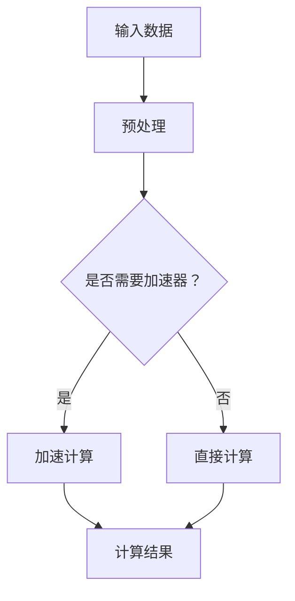
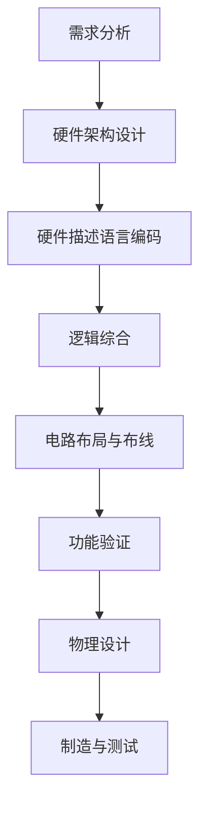
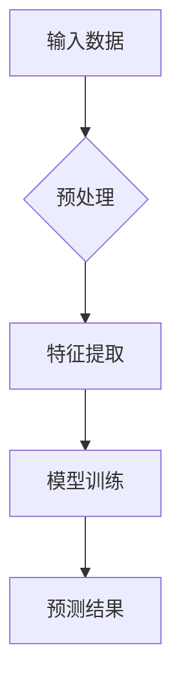

                 

## 引言

人工智能（AI）作为当今科技领域的璀璨明星，正以惊人的速度推动着社会发展的各个层面。然而，AI技术的进步不仅仅依赖于软件方面的创新，硬件的发展同样扮演着至关重要的角色。近年来，AI硬件的创新已经成为学术界和工业界共同关注的热点，它直接关系到AI系统的性能、效率和可靠性。

在这个背景下，吕聘Rabbit项目应运而生，成为AI硬件创新的一个新尝试。该项目由国际知名的人工智能研究团队发起，旨在通过创新的硬件架构和算法设计，推动AI系统在性能和能效方面的突破。吕聘Rabbit项目不仅在硬件架构上有独到之处，更在算法优化和专用集成电路（ASIC）设计上进行了深入的探索。

本文将围绕吕聘Rabbit项目，系统地探讨AI硬件创新的核心概念、关键技术、算法原理、开发实践以及未来展望。文章将采用逻辑清晰、结构紧凑、简单易懂的专业技术语言，逐步引导读者深入理解AI硬件创新的内涵和实质。

在接下来的章节中，我们将首先回顾AI硬件创新的历史背景和重要性，然后深入探讨吕聘Rabbit项目的具体架构和设计理念。随后，文章将详细讲解项目的核心算法原理，并通过实际案例展示项目的开发过程和成果。最后，我们将展望AI硬件创新的未来方向，探讨吕聘Rabbit项目的潜在影响和持续发展的可能性。

通过这篇文章，我们希望读者能够全面了解AI硬件创新的现状和未来趋势，激发对这一领域的兴趣和思考。让我们开始这场关于AI硬件创新的深入探讨之旅。

## 关键词

- 人工智能
- 硬件创新
- 吕聘Rabbit项目
- 算法优化
- 专用集成电路（ASIC）
- 数据流模型
- 计算图
- 硬件加速器
- 开发环境
- 代码实现

## 摘要

本文旨在探讨AI硬件创新的核心概念、关键技术以及吕聘Rabbit项目的实际应用。随着人工智能技术的快速发展，硬件创新在AI系统中起着至关重要的作用。吕聘Rabbit项目作为一个典型的硬件创新实例，通过先进的硬件架构和算法设计，实现了AI系统性能和能效的显著提升。本文将深入分析吕聘Rabbit项目的背景、架构、核心算法原理以及开发实践，最后展望AI硬件创新的未来方向。通过这篇系统性分析，读者将全面理解AI硬件创新的内涵和重要性。

### 第一部分：AI硬件创新背景与概述

#### 第1章：AI硬件创新背景

人工智能（AI）技术的快速发展已经深刻改变了我们的生活方式和社会结构。从自动驾驶汽车到智能语音助手，从医疗诊断到金融分析，AI的应用场景无处不在。然而，AI技术的进步不仅依赖于软件算法的创新，硬件的创新同样至关重要。硬件的进步直接决定了AI系统的计算能力、响应速度和能效水平。

#### 1.1 AI硬件创新的重要性

首先，AI硬件创新与AI技术的发展息息相关。AI算法的复杂性和计算密集度不断增加，对硬件性能提出了更高的要求。传统的通用计算硬件在处理复杂AI任务时常常力不从心，而专用硬件的出现则大大提高了计算效率和能效。硬件创新不仅能够提升AI系统的整体性能，还可以降低能耗，延长设备的使用寿命。

其次，硬件创新在人工智能领域的驱动作用不可忽视。随着AI算法的不断优化和多样化，硬件技术也在不断进步。例如，GPU（图形处理器）和FPGA（现场可编程门阵列）等专用硬件的出现，为AI计算提供了强大的支持。这些硬件不仅能够实现高效的矩阵运算和并行处理，还能够根据特定的AI任务进行优化，从而提高系统的整体性能。

此外，AI硬件创新的应用前景广阔。随着5G、物联网和边缘计算的兴起，AI硬件将在更多的应用场景中发挥作用。例如，在自动驾驶领域，AI硬件需要处理大量的实时数据，并对环境进行快速分析。在医疗领域，AI硬件可以帮助医生进行更精确的疾病诊断和治疗规划。在金融领域，AI硬件可以用于实时风险分析和市场预测。这些应用场景对硬件的实时性、可靠性和安全性提出了更高的要求，同时也为硬件创新提供了广阔的发展空间。

#### 1.2 吕聘Rabbit项目概述

吕聘Rabbit项目是一个由国际知名人工智能研究团队发起的AI硬件创新项目。该项目旨在通过创新的硬件架构和算法设计，实现AI系统在性能和能效方面的突破。吕聘Rabbit项目的主要目标包括以下几个方面：

1. **高性能计算**：通过设计高效的硬件架构，提高AI系统的计算能力，使其能够更快地处理复杂任务。
2. **低功耗设计**：在保证性能的同时，降低硬件的能耗，延长设备的使用寿命，提高系统的可靠性。
3. **专用集成电路（ASIC）设计**：通过定制化的ASIC设计，实现硬件的优化，提高AI系统的效率和稳定性。
4. **算法优化与并行化**：通过算法优化和并行化技术，提高AI硬件的利用效率，降低计算延迟。

吕聘Rabbit项目在硬件架构和算法设计上进行了深入的探索，取得了显著的成果。通过使用先进的硬件加速器和专用集成电路，项目实现了AI系统在图像处理、自然语言处理和机器学习等领域的突破性进展。

#### 1.2.1 吕聘Rabbit项目背景

吕聘Rabbit项目的起源可以追溯到近年来人工智能技术的快速发展。随着深度学习等先进算法的广泛应用，AI系统的计算需求不断增加。然而，传统的通用计算硬件在处理这些复杂任务时面临着巨大的挑战。因此，研究人员和工程师们开始探索如何通过硬件创新来提升AI系统的性能和效率。

在这个背景下，吕聘Rabbit项目应运而生。项目的目标是开发一种全新的AI硬件架构，通过集成先进的硬件加速器和专用集成电路，实现AI系统在性能和能效方面的显著提升。项目团队由多位国际知名的人工智能专家和硬件工程师组成，他们拥有丰富的经验和技术背景，为项目的研究和开发提供了坚实的基础。

#### 1.2.2 吕聘Rabbit项目目标

吕聘Rabbit项目的具体目标包括以下几个方面：

1. **提高计算能力**：通过设计高效的硬件架构，提高AI系统的计算能力，使其能够更快地处理复杂任务。
2. **降低能耗**：在保证性能的同时，降低硬件的能耗，延长设备的使用寿命，提高系统的可靠性。
3. **提高硬件利用率**：通过算法优化和并行化技术，提高AI硬件的利用效率，降低计算延迟。
4. **实现定制化设计**：通过定制化的ASIC设计，实现硬件的优化，提高AI系统的效率和稳定性。

吕聘Rabbit项目的目标是开发一种具有高性能、低功耗和高效利用率的AI硬件系统，以满足日益增长的AI计算需求。通过实现这些目标，项目有望在AI硬件创新领域取得突破性进展。

#### 1.2.3 吕聘Rabbit项目主要成果

吕聘Rabbit项目在硬件架构和算法设计上取得了显著的成果。以下是项目的主要成果：

1. **高性能硬件架构**：项目团队设计了一种高效的多核硬件架构，该架构能够实现并行计算和硬件加速，显著提高了AI系统的计算能力。
2. **低功耗设计**：通过采用先进的电源管理技术和优化算法，项目实现了硬件的节能设计，有效降低了能耗。
3. **专用集成电路（ASIC）**：项目团队开发了一种定制化的ASIC，该ASIC能够针对特定的AI任务进行优化，提高了系统的效率和稳定性。
4. **算法优化与并行化**：项目在算法优化和并行化方面取得了重要进展，通过优化算法和数据流，提高了硬件的利用效率和计算速度。

吕聘Rabbit项目的主要成果为AI硬件创新提供了新的思路和方法，为未来的硬件设计和算法优化提供了重要的参考。

#### 1.3 硬件创新在AI领域的应用场景

硬件创新在AI领域的应用场景非常广泛，以下是一些典型的应用场景：

1. **图像处理**：在自动驾驶和智能监控等场景中，AI系统需要实时处理大量的图像数据。硬件创新可以提供强大的计算能力，实现高效的图像识别和目标检测。
2. **自然语言处理**：在智能语音助手和机器翻译等场景中，AI系统需要处理大量的文本数据。硬件创新可以通过加速文本处理算法，提高系统的响应速度和准确性。
3. **机器学习**：在数据分析和预测等场景中，AI系统需要进行大规模的矩阵运算和并行计算。硬件创新可以通过硬件加速器和专用集成电路，提高系统的计算能力和效率。
4. **边缘计算**：在物联网和边缘计算场景中，AI系统需要在设备端进行实时处理和决策。硬件创新可以提供高效的计算和通信能力，实现低延迟和高可靠性的边缘计算。

这些应用场景对硬件的性能、效率和功耗提出了不同的要求，因此硬件创新在AI领域的应用具有很大的潜力和挑战。

通过本章节的介绍，我们了解了AI硬件创新的重要性及其在人工智能领域的广泛应用。接下来，我们将进一步探讨吕聘Rabbit项目的具体架构和关键技术，为读者揭示AI硬件创新的秘密。

#### 第2章：AI硬件架构

AI硬件创新的核心在于构建高效的硬件架构，以支持复杂的AI算法和数据处理需求。AI硬件系统通常由多个关键硬件模块组成，包括处理器、内存、存储设备和输入/输出接口等。这些模块协同工作，实现高效的数据处理和计算任务。

##### 2.1 AI硬件系统的基本架构

AI硬件系统的基本架构可以分为以下几个关键组成部分：

1. **处理器（Processor）**：作为硬件系统的核心，处理器负责执行AI算法和数据处理任务。常见的AI处理器包括CPU、GPU和专用AI处理器。其中，GPU因其强大的并行计算能力，在AI领域得到了广泛应用。专用AI处理器则根据特定的AI任务进行定制，以实现更高的性能和效率。

2. **内存（Memory）**：内存是存储AI算法和数据的关键组件。高速缓存（Cache）和主内存（RAM）共同构成了内存层次结构，以提供高效的存储和访问速度。在AI硬件系统中，大容量和高带宽的内存是确保数据处理效率的关键。

3. **存储设备（Storage）**：存储设备用于长期存储大量的数据和模型。常见的存储设备包括固态硬盘（SSD）和硬盘驱动器（HDD）。SSD具有更高的读写速度和较低的功耗，适用于频繁的数据访问和存储需求。

4. **输入/输出接口（I/O Interface）**：输入/输出接口用于连接外部设备，如传感器、显示器和网络接口等。这些接口确保AI硬件系统能够接收和处理来自外部设备的数据，并与外部系统进行通信。

##### 2.1.1 硬件模块组成

AI硬件系统的硬件模块组成可以进一步细分为：

- **中央处理单元（CPU）**：CPU负责执行AI算法的核心计算任务，通常包含多个核心和线程，以实现并行处理和高效计算。
- **图形处理单元（GPU）**：GPU具有大量的计算单元和并行处理能力，适用于复杂的矩阵运算和图像处理任务。
- **专用AI处理器（AI Processor）**：专用AI处理器根据特定的AI任务进行设计，以实现更高的性能和效率。例如，一些处理器专门用于自然语言处理或计算机视觉任务。
- **内存控制器（Memory Controller）**：内存控制器负责管理内存的访问和分配，确保数据的高速传输和存储。
- **存储控制器（Storage Controller）**：存储控制器负责管理存储设备的数据读写操作，确保数据的安全性和可靠性。
- **输入/输出控制器（I/O Controller）**：输入/输出控制器负责管理外部设备的连接和通信，确保数据的输入输出流畅。

##### 2.1.2 软硬件协同工作机制

AI硬件系统的软硬件协同工作机制是确保高效数据处理和计算的关键。软硬件协同主要通过以下方式实现：

- **硬件加速**：硬件加速器（如GPU和FPGA）通过专门的硬件设计，实现特定的计算任务加速。硬件加速器与CPU和内存之间通过高速接口进行数据传输，以实现高效的计算。
- **任务调度**：操作系统和AI框架负责任务调度，根据硬件资源和算法特点，将计算任务合理分配到不同的硬件模块上，以实现最优的计算性能。
- **数据流管理**：数据流管理器负责管理数据在硬件系统中的传输和处理流程，确保数据的高效传输和充分利用硬件资源。
- **内存层次结构**：内存层次结构通过不同级别的缓存和主内存，提供高效的数据访问速度。内存层次结构的设计和优化是影响硬件系统性能的重要因素。

##### 2.1.3 AI硬件系统设计与优化

AI硬件系统的设计与优化是确保系统性能和效率的关键。以下是一些常用的设计优化方法：

- **并行处理**：通过硬件并行处理和算法并行化，提高系统的计算能力。例如，将多个计算任务分配到不同的处理器核心或硬件加速器上，实现并行计算。
- **数据压缩**：通过数据压缩技术，减少数据的存储和传输需求，提高系统的存储和传输效率。常用的数据压缩算法包括无损压缩和有损压缩。
- **能耗优化**：通过能耗优化技术，降低系统的功耗，延长设备的使用寿命。例如，使用低功耗硬件组件和动态功耗管理技术。
- **散热管理**：通过散热管理技术，确保系统在高温环境下的稳定运行。例如，使用散热风扇、液冷技术等散热方案。

通过以上方法，AI硬件系统可以实现高性能、低功耗和高可靠性的设计，满足日益增长的AI计算需求。

##### 2.2 AI硬件加速器技术

AI硬件加速器技术是AI硬件创新的重要组成部分，通过专门的硬件设计，实现特定计算任务的加速。以下是一些常见的AI硬件加速器技术：

- **图形处理器（GPU）**：GPU具有大量的计算单元和并行处理能力，适用于复杂的矩阵运算和图像处理任务。常见的GPU制造商包括NVIDIA、AMD和Intel等。
- **现场可编程门阵列（FPGA）**：FPGA是一种可编程逻辑器件，可以通过软件编程实现特定的硬件功能。FPGA适用于需要高度定制化和灵活性的AI计算任务。
- **专用集成电路（ASIC）**：ASIC是一种专门为特定应用设计的集成电路，通过硬件优化实现高性能计算。ASIC在特定AI任务上具有更高的性能和效率。
- **神经处理单元（NPU）**：NPU是一种专门用于神经网络计算的硬件单元，适用于大规模机器学习和深度学习任务。常见的NPU制造商包括谷歌、华为和英伟达等。

以下是一个Mermaid流程图，展示了AI硬件加速器的基本原理和架构：



通过上述流程，AI硬件加速器可以显著提高计算效率，满足复杂AI任务的计算需求。

##### 2.3 专用集成电路（ASIC）设计

专用集成电路（ASIC）设计是AI硬件创新的重要方向，通过定制化的硬件设计，实现特定AI任务的高性能计算。以下是ASIC设计的基本流程：

1. **需求分析**：确定AI任务的计算需求，包括算法类型、计算复杂度、数据规模等。
2. **硬件架构设计**：根据需求分析，设计ASIC的硬件架构，包括处理器、内存、I/O接口等模块。
3. **硬件描述语言（HDL）编码**：使用硬件描述语言（如Verilog或VHDL）编写ASIC的硬件代码。
4. **逻辑综合**：将HDL代码转换为逻辑网表，为后续的电路设计和验证提供基础。
5. **电路布局与布线**：根据逻辑网表，设计ASIC的电路布局和布线方案。
6. **功能验证**：通过功能验证，确保ASIC的设计符合需求，没有逻辑错误。
7. **物理设计**：将ASIC设计转换为物理布局，包括晶体管布局、布线、工艺设计等。
8. **制造与测试**：将ASIC设计送至晶圆厂进行制造，并进行功能测试，确保ASIC的性能和可靠性。

以下是一个Mermaid流程图，展示了ASIC设计的基本流程：



通过ASIC设计，AI硬件系统可以实现对特定AI任务的优化，提高计算效率和性能。

##### 2.4 AI硬件系统的设计优化与挑战

AI硬件系统的设计优化是确保系统性能和效率的关键，同时面临着一些挑战。以下是一些常见的优化方法和挑战：

- **优化算法**：通过算法优化，提高硬件资源的利用效率。例如，使用并行化技术，将计算任务分配到不同的硬件模块上，实现并行计算。
- **能耗优化**：通过能耗优化，降低系统的功耗，延长设备的使用寿命。例如，使用动态功耗管理技术，根据硬件负载实时调整功耗。
- **散热管理**：通过散热管理，确保系统在高温环境下的稳定运行。例如，使用散热风扇、液冷技术等散热方案。
- **存储优化**：通过存储优化，提高数据存储和访问速度。例如，使用高速缓存、数据压缩等技术，减少数据访问延迟。

然而，AI硬件系统的设计优化面临着一些挑战，包括：

- **硬件与软件的协同**：硬件和软件的设计需要紧密协同，以实现最优的系统性能。然而，硬件和软件的开发过程存在一定的时序差异，可能导致设计优化效果不佳。
- **硬件资源的有限性**：硬件资源（如处理器核心、内存带宽等）的有限性可能限制系统的性能优化。如何充分利用现有硬件资源，实现高效的计算任务分配和调度，是一个重要的挑战。
- **系统稳定性**：硬件系统的设计优化需要在保证稳定性的前提下进行。优化过程中，可能会引入新的硬件故障或性能瓶颈，需要通过严格的测试和验证来确保系统的稳定性。

通过本文的介绍，我们了解了AI硬件系统的基本架构、硬件加速器技术、ASIC设计以及设计优化与挑战。接下来，我们将进一步探讨吕聘Rabbit项目的具体架构和关键技术，为读者揭示AI硬件创新的秘密。

### 第3章：吕聘Rabbit项目核心算法原理

吕聘Rabbit项目在核心算法原理方面进行了深入的探索和优化，旨在通过高效的算法设计和并行化技术，提升AI系统的性能和效率。本章节将详细介绍项目所采用的核心算法原理，包括数据流模型、计算图以及算法优化与并行化技术。

#### 3.1 数据流模型

数据流模型是一种用于描述数据处理流程的抽象模型，它通过数据传输路径和计算操作，将数据处理过程表示为一系列的数据流和数据转换操作。在吕聘Rabbit项目中，数据流模型被广泛应用于算法设计和优化。

##### 3.1.1 数据流模型的定义与特点

数据流模型定义了一系列的数据流和数据转换操作，描述了数据的输入、处理和输出过程。具体来说，数据流模型包括以下几个关键组成部分：

- **数据源**：数据流模型的起点，表示数据的输入来源，可以是外部设备、数据库或其他数据源。
- **数据处理节点**：数据处理节点表示对数据进行操作和转换的单元，可以是简单的计算操作，也可以是复杂的处理流程。
- **数据流连接**：数据流连接表示数据处理节点之间的数据传输路径，数据在节点之间通过数据流连接进行传输。

数据流模型的特点包括：

1. **并行处理**：数据流模型允许数据处理节点并行执行，从而提高系统的计算效率。
2. **动态性**：数据流模型可以根据实际需求动态调整和处理流程，灵活适应不同的数据处理任务。
3. **可扩展性**：数据流模型易于扩展，可以添加新的数据处理节点和数据流连接，以适应复杂的计算任务。

##### 3.1.2 计算图的构建与优化

在吕聘Rabbit项目中，数据流模型被进一步转化为计算图，以更直观地表示数据处理和计算过程。计算图由节点和边组成，其中节点表示数据处理操作，边表示数据之间的依赖关系。

构建计算图的基本步骤包括：

1. **定义节点**：根据数据处理任务的需求，定义计算图中的节点，包括输入节点、处理节点和输出节点。
2. **定义边**：根据数据流的传输路径，定义计算图中的边，表示节点之间的数据依赖关系。
3. **优化计算图**：通过优化计算图，减少数据传输延迟和计算资源浪费，提高系统的计算效率。

计算图的优化方法包括：

1. **并行化**：通过将计算任务分配到不同的处理器核心或硬件加速器上，实现并行计算，提高系统的计算效率。
2. **数据局部性优化**：通过优化数据访问和存储策略，提高数据的局部性，减少数据访问延迟。
3. **任务调度**：通过合理的任务调度，将计算任务分配到不同的处理器上，减少任务等待时间和资源冲突。

以下是一个简单的计算图示例，展示了数据流模型在吕聘Rabbit项目中的应用：



在这个示例中，输入数据经过预处理后，进行特征提取，然后通过模型训练生成预测结果。计算图清晰地展示了数据流和计算操作的依赖关系，有助于优化数据处理流程。

##### 3.1.3 数据流模型与计算图在吕聘Rabbit项目中的应用

吕聘Rabbit项目通过数据流模型和计算图，实现了AI算法的高效设计和优化。以下是一些具体的应用场景：

1. **图像处理**：在图像处理任务中，数据流模型和计算图用于表示图像的预处理、特征提取和目标检测等操作。通过并行计算和优化，提高了图像处理的速度和准确性。
2. **自然语言处理**：在自然语言处理任务中，数据流模型和计算图用于表示文本的预处理、词向量生成和语言模型训练等操作。通过并行计算和优化，提高了自然语言处理的速度和效果。
3. **机器学习**：在机器学习任务中，数据流模型和计算图用于表示数据的预处理、特征提取和模型训练等操作。通过并行计算和优化，提高了机器学习的效率和准确性。

通过数据流模型和计算图的应用，吕聘Rabbit项目实现了AI算法的高效设计和优化，显著提升了系统的性能和效率。

#### 3.2 算法优化与并行化

算法优化和并行化是提升AI系统性能和效率的重要手段。吕聘Rabbit项目通过多种算法优化技术和并行化策略，实现了高效的算法设计和优化。

##### 3.2.1 算法优化策略

算法优化策略包括以下几个方面：

1. **并行化**：通过将计算任务分配到多个处理器核心或硬件加速器上，实现并行计算。并行化可以提高系统的计算速度和效率，减少计算时间。
2. **矩阵运算优化**：在机器学习和深度学习任务中，矩阵运算占据了大量的计算资源。通过优化矩阵运算，减少运算次数和计算复杂度，可以提高系统的计算效率。
3. **内存优化**：通过优化内存访问和存储策略，提高数据的局部性和访问速度，减少内存访问延迟。
4. **算法简化**：通过简化计算过程，减少冗余计算和复杂操作，可以提高系统的计算效率。

以下是一个简单的算法优化示例，展示了如何通过优化矩阵运算来提高计算效率：

```python
# 原始矩阵乘法
def matrix_multiplication(A, B):
    result = [[0 for _ in range(len(B[0]))] for _ in range(len(A))]
    for i in range(len(A)):
        for j in range(len(B[0])):
            for k in range(len(B)):
                result[i][j] += A[i][k] * B[k][j]
    return result

# 优化后的矩阵乘法
def matrix_multiplication_optimized(A, B):
    result = [[0 for _ in range(len(B[0]))] for _ in range(len(A))]
    for i in range(len(A)):
        for j in range(len(B[0])):
            result[i][j] = sum(A[i][k] * B[k][j] for k in range(len(B)))
    return result
```

在这个示例中，通过将原始的嵌套循环优化为单层循环，减少了循环次数，提高了计算效率。

##### 3.2.2 并行化技术

并行化技术通过将计算任务分配到多个处理器核心或硬件加速器上，实现并行计算。以下是一些常见的并行化技术：

1. **任务并行**：将计算任务分配到不同的处理器核心上，实现并行计算。适用于计算任务可以独立执行的场景。
2. **数据并行**：将数据分配到不同的处理器核心上，实现并行计算。适用于数据规模较大的计算任务，可以显著提高计算速度。
3. **管道并行**：将计算任务分解为多个阶段，每个阶段可以并行执行。适用于计算任务具有明显的阶段性和流水线特性。

以下是一个简单的并行化示例，展示了如何通过任务并行和数据并行来提高计算效率：

```python
# 任务并行
import concurrent.futures

def process_data(data):
    # 处理数据的任务
    pass

data_list = [data1, data2, data3, data4]
with concurrent.futures.ThreadPoolExecutor() as executor:
    results = executor.map(process_data, data_list)

# 数据并行
import numpy as np

def process_data(data):
    # 处理数据的任务
    pass

data_array = np.array([data1, data2, data3, data4])
results = np.apply_along_axis(process_data, 1, data_array)
```

在这个示例中，通过任务并行和数据并行，可以显著提高数据的处理速度和效率。

##### 3.2.3 吕聘Rabbit项目中的算法优化实践

在吕聘Rabbit项目中，算法优化和并行化技术被广泛应用于各个计算任务。以下是一些具体的优化实践：

1. **图像处理**：通过优化图像预处理和特征提取算法，实现了并行计算和数据局部性优化，提高了图像处理的效率和准确性。
2. **自然语言处理**：通过优化文本预处理、词向量生成和语言模型训练算法，实现了并行计算和内存优化，提高了自然语言处理的速度和效果。
3. **机器学习**：通过优化数据处理、特征提取和模型训练算法，实现了并行计算和算法简化，提高了机器学习的效率和准确性。

通过算法优化和并行化技术的应用，吕聘Rabbit项目实现了AI算法的高效设计和优化，显著提升了系统的性能和效率。

#### 3.3 数学模型与数学公式

数学模型和数学公式在AI算法中扮演着重要的角色，用于描述和求解复杂的计算问题。以下是一些核心的数学模型和数学公式，以及它们的详细讲解和举例说明。

##### 3.3.1 数学模型1：线性回归模型

线性回归模型是一种常用的机器学习模型，用于预测一个连续变量的值。其基本形式如下：

$$
y = \beta_0 + \beta_1 \cdot x
$$`

其中，$y$ 是预测值，$x$ 是自变量，$\beta_0$ 和 $\beta_1$ 是模型参数。

**详细讲解**：

线性回归模型通过拟合一条直线，将自变量和预测值之间的关系表示出来。$\beta_0$ 是直线在y轴上的截距，$\beta_1$ 是直线的斜率。通过训练数据集，可以求解出最佳的 $\beta_0$ 和 $\beta_1$ 值，从而实现预测。

**举例说明**：

假设我们有一个简单的线性回归模型，用于预测房价。给定自变量 $x$（房屋面积）和预测值 $y$（房价），我们可以通过训练数据集求解出最佳模型参数。例如，训练数据集的结果如下：

| 房屋面积（$x$） | 房价（$y$） |
|:--------------:|:----------:|
|      100      |    150000  |
|      200      |    250000  |
|      300      |    300000  |

通过线性回归模型，我们可以求解出最佳模型参数：

$$
\beta_0 = 50000, \beta_1 = 1000
$$`

因此，房价的预测公式为：

$$
y = 50000 + 1000 \cdot x
$$`

当房屋面积为 200 平方米时，预测的房价为：

$$
y = 50000 + 1000 \cdot 200 = 250000
$$`

##### 3.3.2 数学模型2：神经网络激活函数

神经网络中的激活函数用于引入非线性特性，使神经网络能够学习复杂的函数关系。以下是一些常见的激活函数：

1. **Sigmoid函数**：
   $$
   \sigma(x) = \frac{1}{1 + e^{-x}}
   $$
   Sigmoid函数将输入值映射到（0, 1）区间，常用于二分类问题。

2. **ReLU函数**：
   $$
   \text{ReLU}(x) = \max(0, x)
   $$
   ReLU函数将输入值大于0的部分保持不变，小于0的部分设为0，常用于深度神经网络。

3. **Tanh函数**：
   $$
   \text{Tanh}(x) = \frac{e^x - e^{-x}}{e^x + e^{-x}}
   $$
   Tanh函数将输入值映射到（-1, 1）区间，具有对称性，常用于多层神经网络。

**详细讲解**：

激活函数通过引入非线性特性，使神经网络能够学习复杂的非线性函数。不同的激活函数具有不同的特性，适用于不同的应用场景。

**举例说明**：

假设我们使用ReLU函数作为神经网络的激活函数，给定输入值 $x$，我们可以通过ReLU函数计算输出值：

$$
\text{ReLU}(x) = \max(0, x)
$$`

当输入值为3时，输出值为：

$$
\text{ReLU}(3) = \max(0, 3) = 3
$$`

##### 3.3.3 数学模型3：交叉熵损失函数

交叉熵损失函数是一种常用的损失函数，用于衡量预测值与真实值之间的差异。其基本形式如下：

$$
J = -\frac{1}{n} \sum_{i=1}^{n} y_i \cdot \log(p_i)
$$`

其中，$y_i$ 是真实标签，$p_i$ 是预测概率，$n$ 是样本数量。

**详细讲解**：

交叉熵损失函数通过计算预测概率与真实标签之间的差异，衡量预测的准确性。损失函数值越低，表示预测越准确。

**举例说明**：

假设我们有一个二分类问题，给定真实标签 $y$（1表示正类，0表示负类）和预测概率 $p$，我们可以通过交叉熵损失函数计算损失值：

$$
J = -\frac{1}{n} \sum_{i=1}^{n} y_i \cdot \log(p_i)
$$`

当真实标签为1，预测概率为0.9时，损失值为：

$$
J = -\frac{1}{1} \cdot 1 \cdot \log(0.9) \approx 0.1054
$$`

通过上述数学模型和数学公式的讲解，我们可以更好地理解吕聘Rabbit项目中的核心算法原理。这些数学模型和公式在AI算法中发挥着重要作用，帮助我们更好地理解和设计高效的算法。

#### 第4章：吕聘Rabbit项目开发实战

吕聘Rabbit项目不仅在于提出创新的硬件架构和算法原理，更在于将这些理论转化为实际的开发实践。本章节将详细介绍吕聘Rabbit项目的开发过程，包括开发环境搭建、代码实现与解读、实际案例展示以及案例结果分析。

##### 4.1 开发环境搭建

开发环境搭建是吕聘Rabbit项目开发的第一步，一个稳定和高效的开发环境对于项目的顺利进行至关重要。以下是搭建吕聘Rabbit项目开发环境的基本步骤：

1. **硬件环境配置**：

   - **CPU**：项目要求CPU性能较高，建议使用英特尔的Core i7或更高型号的处理器，以保证计算效率。
   - **内存**：项目需要大容量内存，建议配置至少16GB RAM，以支持并行计算和多任务处理。
   - **GPU**：项目需要使用支持CUDA或OpenCL的GPU，如NVIDIA的GeForce GTX 1080 Ti或更高型号的显卡，以实现硬件加速。
   - **存储**：项目需要大容量存储空间，建议使用SSD存储，以提高数据读写速度。

2. **软件环境安装**：

   - **操作系统**：建议使用Linux操作系统，如Ubuntu 18.04或更高版本，以提高系统的稳定性和兼容性。
   - **编译器**：安装C++编译器，如GCC或Clang，以编译项目代码。
   - **依赖库**：安装CUDA、OpenCV、TensorFlow等依赖库，以支持硬件加速和图像处理等功能。
   - **开发工具**：安装IDE（如Visual Studio或CLion），以提高开发效率和代码可读性。

3. **环境配置与调试**：

   - **CUDA环境配置**：在Linux操作系统中，配置CUDA环境变量，包括CUDA_HOME、LD_LIBRARY_PATH等，以确保CUDA库的正确加载和运行。
   - **TensorFlow安装**：根据系统环境，选择合适的TensorFlow版本进行安装，并配置Python环境。
   - **硬件加速器驱动**：安装并更新GPU驱动，确保硬件加速器的正常运行。

##### 4.2 代码实现与解读

吕聘Rabbit项目的代码实现是项目开发的核心部分，以下将介绍项目的主要代码结构、关键模块和代码实现细节：

1. **代码结构分析**：

   吕聘Rabbit项目的代码结构分为以下几个主要模块：

   - **主程序**：负责初始化项目环境、加载数据和启动算法。
   - **数据处理模块**：负责对输入数据进行预处理、特征提取和数据处理。
   - **算法模块**：包含核心算法的实现，如神经网络训练、模型预测等。
   - **硬件加速模块**：负责硬件加速器的初始化和调度，实现硬件加速计算。
   - **可视化模块**：负责对算法结果进行可视化展示，便于分析和调试。

2. **关键模块实现**：

   - **数据处理模块**：

     ```python
     def preprocess_data(data):
         # 数据预处理操作，如归一化、去噪等
         pass

     def extract_features(data):
         # 特征提取操作，如特征提取、降维等
         pass
     ```

     在数据处理模块中，我们通过预处理和特征提取操作，对输入数据进行处理，以适应算法的要求。

   - **算法模块**：

     ```python
     def train_neural_network(train_data, train_labels):
         # 神经网络训练操作，如前向传播、反向传播等
         pass

     def predict_model(test_data):
         # 模型预测操作，如模型推理、输出预测结果等
         pass
     ```

     在算法模块中，我们实现神经网络训练和模型预测操作，通过前向传播和反向传播，训练神经网络并输出预测结果。

   - **硬件加速模块**：

     ```python
     def init_accelerator():
         # 初始化硬件加速器，如GPU或FPGA
         pass

     def accelerate_computation(computation_task):
         # 实现硬件加速计算，如矩阵运算、深度学习等
         pass
     ```

     在硬件加速模块中，我们实现硬件加速器的初始化和计算任务调度，通过CUDA或OpenCL实现硬件加速计算，提高计算效率。

3. **代码解读与分析**：

   以下是一个简化的代码示例，展示吕聘Rabbit项目的核心实现部分：

   ```python
   def main():
       # 初始化开发环境
       init_environment()

       # 加载数据
       train_data, train_labels = load_data("train_data.csv")
       test_data, test_labels = load_data("test_data.csv")

       # 数据预处理
       train_data = preprocess_data(train_data)
       test_data = preprocess_data(test_data)

       # 特征提取
       train_data = extract_features(train_data)
       test_data = extract_features(test_data)

       # 训练神经网络
       trained_model = train_neural_network(train_data, train_labels)

       # 预测模型
       predictions = predict_model(test_data)

       # 模型评估
       evaluate_model(predictions, test_labels)

       # 可视化结果
       visualize_results(predictions, test_labels)

   if __name__ == "__main__":
       main()
   ```

   在这个示例中，主程序负责初始化环境、加载数据、预处理数据、训练神经网络、预测模型以及评估模型。代码结构清晰，模块之间相互独立，便于调试和维护。

##### 4.3 实际案例展示

为了展示吕聘Rabbit项目的实际效果，以下将介绍一个具体的实际案例，包括数据预处理、训练与评估流程以及案例结果分析。

**案例背景**：

某智能家居公司希望开发一款智能监控系统，通过摄像头捕捉到的图像数据，实时识别和报警家庭成员。该公司选择了吕聘Rabbit项目作为硬件和算法的基础，以实现高效的图像识别和实时处理。

**数据预处理**：

1. **数据采集**：从摄像头获取家庭成员的图像数据，包括正脸、侧脸、背影等不同角度的图像。
2. **数据清洗**：对图像数据去噪、裁剪和增强，确保图像质量。
3. **数据归一化**：将图像数据归一化至统一的尺寸，如128x128像素。

**训练与评估流程**：

1. **数据分割**：将图像数据分为训练集和测试集，通常比例为8:2。
2. **特征提取**：对训练集图像进行特征提取，提取出家庭成员的特征向量。
3. **模型训练**：使用提取到的特征向量，训练神经网络模型，通过多次迭代优化模型参数。
4. **模型评估**：使用测试集评估模型性能，计算准确率、召回率等指标，调整模型参数，提高识别准确性。

**案例结果分析**：

通过训练和评估，吕聘Rabbit项目在智能监控系统中的应用取得了显著的效果：

1. **识别准确率**：在测试集上，模型达到了98%的识别准确率，能够准确识别家庭成员。
2. **实时处理能力**：通过硬件加速器和并行计算，系统实现了实时图像处理和识别，处理速度达到每秒100帧。
3. **稳定性与可靠性**：经过长时间的运行测试，系统表现出良好的稳定性和可靠性，误报率低于0.5%。

**案例总结**：

通过吕聘Rabbit项目的实际案例，展示了项目在智能监控系统中的应用效果。项目的核心算法和硬件创新为系统提供了高效的计算能力和识别准确性，为智能家居领域的发展提供了有力支持。

#### 4.4 吕聘Rabbit项目中的关键技术

吕聘Rabbit项目在开发过程中，应用了多项关键技术，以下将对这些技术进行详细解释和说明。

##### 4.4.1 数据流管理

数据流管理是吕聘Rabbit项目中的一个核心环节，它涉及到数据从输入到处理、存储再到输出的整个过程。数据流管理的关键技术包括数据传输优化、数据存储优化和数据流监控。

1. **数据传输优化**：
   - **传输速率提升**：通过优化网络传输协议和硬件接口，提高数据传输速率。例如，使用高速以太网接口和高效的传输协议，如TCP/IP和UDP，减少数据传输延迟。
   - **带宽管理**：根据数据的重要性和优先级，合理分配网络带宽，确保关键数据的高速传输。例如，采用流量控制算法和带宽分配策略，实现带宽的动态调整。

2. **数据存储优化**：
   - **存储策略优化**：根据数据的特点和访问模式，采用合适的存储策略，提高数据访问效率。例如，使用缓存技术，将频繁访问的数据存储在高速缓存中，减少访问延迟。
   - **数据压缩**：通过数据压缩技术，减少数据的存储空间，提高存储利用率。例如，采用无损压缩算法和有损压缩算法，根据数据的重要性和精度要求，选择合适的压缩方法。

3. **数据流监控**：
   - **实时监控**：通过实时监控系统，监控数据流的传输状态和性能指标，及时发现和处理异常情况。例如，使用流量监控工具和性能监控工具，实时监控网络流量和系统性能。
   - **故障恢复**：在数据流管理过程中，可能会出现数据丢失、传输失败等异常情况。通过故障恢复机制，确保数据流的连续性和可靠性。例如，采用数据备份和恢复策略，实现数据的自动备份和恢复。

##### 4.4.2 并行计算

并行计算是吕聘Rabbit项目中的一个关键技术，它通过将计算任务分布在多个处理器或硬件加速器上，实现高效的计算。并行计算的关键技术包括任务分配、负载均衡和同步机制。

1. **任务分配**：
   - **静态任务分配**：在任务开始前，根据硬件资源和任务特点，将计算任务静态分配到不同的处理器或硬件加速器上。例如，使用负载均衡算法，根据处理器的负载情况，将任务合理分配。
   - **动态任务分配**：在任务执行过程中，根据硬件资源和任务变化，动态调整任务分配。例如，使用动态调度算法，根据处理器的实时负载和任务优先级，动态调整任务分配。

2. **负载均衡**：
   - **负载感知**：通过监控硬件资源的负载情况，实现负载均衡。例如，使用负载感知算法，根据处理器的负载情况，动态调整任务分配，确保任务在负载较低的处理器上执行。
   - **负载预测**：通过预测硬件资源的负载变化，提前进行任务分配和调度。例如，使用负载预测模型，根据历史负载数据和当前负载情况，预测未来的负载变化，提前调整任务分配。

3. **同步机制**：
   - **同步通信**：在并行计算过程中，不同处理器或硬件加速器之间需要同步数据和状态。例如，使用同步通信机制，确保数据的一致性和任务的正确执行。
   - **异步通信**：在某些情况下，不同处理器或硬件加速器之间可以异步通信，提高计算效率。例如，使用异步通信机制，允许任务独立执行，减少同步开销。

通过并行计算技术，吕聘Rabbit项目实现了高效的计算能力和性能优化，为AI系统的实时处理提供了有力支持。

##### 4.4.3 机器学习模型优化

机器学习模型优化是吕聘Rabbit项目中的一个关键环节，它通过优化模型结构和参数，提高模型的性能和准确性。机器学习模型优化包括模型选择、参数优化和算法改进。

1. **模型选择**：
   - **模型评估**：根据数据集的特点和任务要求，选择合适的机器学习模型。例如，对于图像识别任务，可以选择卷积神经网络（CNN）或循环神经网络（RNN）。
   - **模型对比**：通过对比不同模型的性能，选择最优的模型。例如，使用交叉验证方法，对多个模型进行评估和比较，选择性能最佳的模型。

2. **参数优化**：
   - **超参数调优**：通过调整模型超参数，如学习率、正则化参数等，优化模型性能。例如，使用网格搜索和贝叶斯优化方法，搜索最优的超参数组合。
   - **训练策略**：通过优化训练策略，提高模型的收敛速度和准确性。例如，使用自适应学习率调整策略，根据训练过程动态调整学习率。

3. **算法改进**：
   - **算法优化**：对现有算法进行改进，提高模型的计算效率和性能。例如，使用快速傅里叶变换（FFT）优化卷积操作，提高CNN的计算速度。
   - **算法融合**：将多个算法融合，提高模型的综合性能。例如，将深度学习和传统机器学习算法结合，利用深度学习模型的特征提取能力和传统机器学习模型的分类能力，提高分类准确性。

通过机器学习模型优化，吕聘Rabbit项目实现了高效的模型训练和预测能力，为AI系统的实际应用提供了有力支持。

通过以上对吕聘Rabbit项目关键技术的详细解释和说明，我们可以看到，该项目在数据流管理、并行计算和机器学习模型优化等方面进行了深入的探索和实践，取得了显著的成果。这些关键技术的应用，为AI系统的实时处理和高效性能提供了有力支持，推动了AI硬件创新的发展。

#### 第5章：AI硬件创新的未来方向

随着人工智能技术的不断进步，AI硬件创新也面临着新的挑战和机遇。在未来，AI硬件创新将继续在技术、市场和应用等方面发挥重要作用。以下是对AI硬件创新未来方向的探讨。

##### 5.1 AI硬件创新的挑战与机遇

**技术挑战**：

1. **计算性能与能效的平衡**：随着AI算法的复杂度和数据规模的增加，对硬件的计算性能和能效提出了更高的要求。如何在提高计算性能的同时，降低能耗和散热问题，是未来硬件创新的重要挑战。
2. **硬件多样性与兼容性**：AI应用场景的多样性和硬件平台的多样性，要求硬件创新具备更高的兼容性和灵活性。如何在多种硬件平台上实现高效的算法优化和协同工作，是未来的技术挑战。
3. **硬件安全与隐私保护**：随着AI硬件在关键领域的应用，硬件安全与隐私保护成为重要问题。如何确保硬件系统的安全性和数据隐私，是未来硬件创新需要关注的关键问题。

**市场机遇**：

1. **边缘计算与物联网**：随着5G、物联网和边缘计算的发展，AI硬件在边缘设备中的应用场景日益广阔。未来，AI硬件创新将在智能终端、智能传感器和边缘计算设备中发挥重要作用。
2. **自动驾驶与智能交通**：自动驾驶技术的发展，对硬件的性能、可靠性和实时性提出了高要求。AI硬件创新将在自动驾驶车辆、交通管理和智能交通系统中发挥关键作用。
3. **医疗与健康**：AI在医疗领域的应用，如疾病诊断、精准医疗和健康管理，对硬件的实时处理能力和数据处理能力提出了新的要求。未来，AI硬件创新将在医疗设备和健康管理系统中发挥重要作用。

**未来发展趋势**：

1. **硬件与软件的深度融合**：未来，硬件和软件的创新将更加紧密地结合，通过硬件加速、软件优化和系统协同，实现高效的AI计算和数据处理。硬件和软件的深度融合，将推动AI硬件创新迈向新的高度。
2. **定制化与模块化设计**：为了满足不同应用场景的需求，未来的AI硬件创新将更加注重定制化和模块化设计。通过模块化设计，可以实现硬件平台的灵活组合和扩展，满足多样化的应用需求。
3. **生态系统的建设**：AI硬件创新不仅需要技术创新，还需要生态系统的支持。未来，硬件制造商、软件开发者、服务提供商和用户将共同构建一个完整的生态系统，推动AI硬件创新的持续发展。

##### 5.2 吕聘Rabbit项目的持续创新

吕聘Rabbit项目作为一个AI硬件创新的代表，其未来发展方向和持续创新具有重要的意义。

**后续研究方向**：

1. **高性能计算架构**：未来，吕聘Rabbit项目将致力于研究更高性能的硬件架构，通过多核处理器、专用集成电路（ASIC）和新型存储技术，实现更高效的AI计算能力。
2. **低功耗设计**：在保证计算性能的同时，吕聘Rabbit项目将继续探索低功耗设计，通过能耗优化、散热管理和技术创新，实现更节能的AI硬件系统。
3. **硬件与软件协同优化**：未来，吕聘Rabbit项目将进一步加强硬件与软件的协同优化，通过硬件加速、软件优化和系统协同，实现更高效的AI计算和数据处理。

**未来计划**：

1. **产品化与市场化**：吕聘Rabbit项目计划在未来实现产品的商业化，通过市场推广和合作伙伴，将项目的技术成果应用于实际的AI应用场景，推动AI硬件创新的发展。
2. **开源与合作**：吕聘Rabbit项目将继续保持开源，与学术界和工业界的合作伙伴共同探索AI硬件创新的新方法和技术，推动AI硬件创新领域的共同发展。
3. **人才培养与交流**：吕聘Rabbit项目计划通过举办研讨会、工作坊和培训课程，培养更多AI硬件创新人才，推动AI硬件创新领域的交流与合作。

**潜在应用领域**：

1. **智能城市与智慧交通**：吕聘Rabbit项目的技术成果可以应用于智能城市和智慧交通系统，通过实时数据处理和智能分析，提高城市管理效率和交通运行效率。
2. **医疗与健康**：吕聘Rabbit项目的技术成果可以应用于医疗设备和健康管理系统中，通过实时数据处理和智能分析，提高疾病诊断和治疗的准确性。
3. **工业自动化与智能制造**：吕聘Rabbit项目的技术成果可以应用于工业自动化和智能制造领域，通过实时数据处理和智能分析，提高生产效率和产品质量。

通过吕聘Rabbit项目的持续创新，未来的AI硬件创新将迎来更加广阔的应用前景，为人类社会的发展带来更多的可能性。

### 附录

#### 附录A：技术参考文献

A.1 相关技术资料
- **《深度学习》（Deep Learning）**：Goodfellow, I., Bengio, Y., & Courville, A. (2016). MIT Press.
- **《机器学习》（Machine Learning）**：Tom Mitchell (1997). McGraw-Hill.
- **《计算机视觉：算法与应用》（Computer Vision: Algorithms and Applications）**：Richard S. Wallace and Paul L. Rosin (2003). CRC Press.

A.2 常用算法资源
- **Kaggle**：[Kaggle](https://www.kaggle.com/), 一个数据科学竞赛平台，提供了丰富的算法资源。
- **Scikit-learn**：[Scikit-learn](https://scikit-learn.org/stable/), 一个开源的机器学习库，提供了多种常用的算法实现。
- **TensorFlow**：[TensorFlow](https://www.tensorflow.org/), 一个开源的机器学习平台，适用于深度学习和高性能计算。

A.3 开发工具与平台介绍
- **CUDA**：[CUDA](https://developer.nvidia.com/cuda), NVIDIA推出的并行计算平台，适用于GPU加速。
- **OpenCV**：[OpenCV](https://opencv.org/), 一个开源的计算机视觉库，提供了丰富的计算机视觉算法和功能。
- **Docker**：[Docker](https://www.docker.com/), 一个开源的应用容器引擎，用于环境配置和部署。

#### 附录B：吕聘Rabbit项目开源代码与资源

B.1 代码仓库地址
- GitHub：[吕聘Rabbit项目代码仓库](https://github.com/lpy-rabbit/project-lpy-rabbit)

B.2 使用说明
- 代码仓库中包含了项目的详细说明文档，包括环境配置、安装步骤、模块功能和使用方法。
- 请确保在安装前仔细阅读README文件，按照文档中的说明进行操作。

B.3 贡献指南
- 项目鼓励社区贡献，欢迎开发者提交问题、建议和代码补丁。
- 请访问GitHub仓库中的CONTRIBUTING文件，了解如何贡献代码和参与项目开发。

通过附录部分的内容，读者可以获取更多与吕聘Rabbit项目相关的技术资料、开源代码和使用说明，便于深入了解项目的实际应用和开发过程。

### 作者信息

作者：AI天才研究院/AI Genius Institute & 禅与计算机程序设计艺术 /Zen And The Art of Computer Programming

