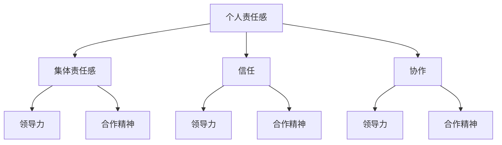
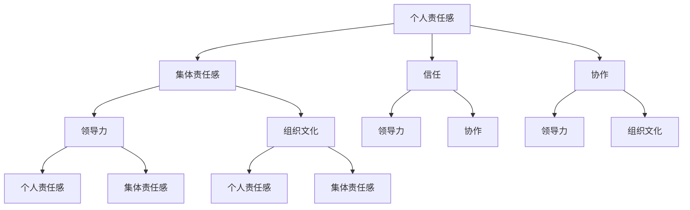

                 

# 《团队责任感培养：增强使命感的有效方法》

## 关键词：团队责任感、使命感、组织文化、领导风格、成员特征、算法原理、实践方法

> 摘要：本文深入探讨了团队责任感培养的重要性及其与使命感之间的关联。通过分析团队责任感的影响因素，阐述了责任感与领导力、合作精神的联系。此外，文章详细介绍了责任感评价模型、数学公式及其在案例中的应用，并讲解了责任感培养的核心算法原理。同时，本文提出了增强使命感的方法与实践，包括设定明确目标、增强团队凝聚力、激发责任感等策略。最后，文章通过项目实战展示了团队责任感培养的可持续性，提供了相关工具与资源推荐，以期为IT领域团队管理提供有益的参考。

## 目录

### 第一部分：团队责任感理论基础

#### 第1章：团队责任感概述
- 1.1 团队责任感的定义
- 1.2 团队责任感的重要性
- 1.3 团队责任感与使命感的关联

#### 第2章：团队责任感的影响因素
- 2.1 组织文化对团队责任感的影响
- 2.2 领导风格与团队责任感的关系
- 2.3 团队成员特征对责任感的影响

#### 第3章：团队责任感的核心概念与联系
- 3.1 团队责任感的核心概念
- 3.2 责任感与领导力、合作精神的联系
- 3.3 团队责任感架构图

#### 第4章：数学模型与数学公式
- 4.1 责任感评价模型
- 4.2 责任感与绩效关系的数学公式
- 4.3 案例分析：责任感评价模型应用

#### 第5章：核心算法原理讲解
- 5.1 责任感培养算法概述
- 5.2 伪代码：责任感培养算法
- 5.3 算法实现步骤详解

### 第二部分：增强使命感的方法与实践

#### 第6章：增强使命感的方法
- 6.1 设定明确的目标与愿景
- 6.2 增强团队凝聚力的方法
- 6.3 激发团队成员的责任感

#### 第7章：使命感培养策略
- 7.1 领导者的使命感培养策略
- 7.2 团队成员的使命感培养策略
- 7.3 案例分析：使命感培养策略的实际应用

#### 第8章：团队责任感培养的项目实战
- 8.1 项目实战：责任感培养计划
- 8.2 实战案例：责任感培养计划实施与效果评估
- 8.3 项目实战总结与反思

#### 第9章：团队责任感培养的可持续性
- 9.1 团队责任感培养的长期规划
- 9.2 防止责任感流失的策略
- 9.3 团队责任感培养的持续改进

### 第三部分：附录

#### 附录A：团队责任感培养工具与资源
- A.1 主流责任感评估工具
- A.2 团队责任感培养资源推荐
- A.3 责任感培养相关研究文献

<|assistant|>## 第一部分：团队责任感理论基础

在当今快速发展的IT领域，团队责任感已经成为确保项目成功的关键因素之一。本文将首先探讨团队责任感的理论基础，包括其定义、重要性、与使命感的关联，以及影响团队责任感的关键因素。

### 第1章：团队责任感概述

#### 1.1 团队责任感的定义

团队责任感是指团队成员在团队活动中所承担的责任和义务，包括对团队的承诺、对任务的认真态度、以及对团队目标的坚定追求。具体而言，团队责任感包括以下几个方面：

- **个人责任感**：每个团队成员都应认识到自己在团队中的角色和职责，并对其负责。
- **集体责任感**：团队成员应意识到团队的成功与失败是整个团队的责任，而不仅仅是个体的功劳或失败。
- **信任与协作**：团队成员之间应建立相互信任，积极协作，共同完成团队目标。

#### 1.2 团队责任感的重要性

团队责任感对于团队的成功至关重要。以下是团队责任感的重要性：

- **提高团队绩效**：当团队成员都有强烈的责任感时，他们会更加努力地工作，从而提高团队的绩效。
- **促进团队协作**：责任感有助于团队成员之间的协作，减少冲突，提高团队凝聚力。
- **增强团队信任**：责任感可以建立团队成员之间的信任，提高团队的稳定性。

#### 1.3 团队责任感与使命感的关联

团队责任感与使命感密切相关。使命感是指团队成员对团队所承担的任务和目标的深刻认同和追求。以下是团队责任感与使命感的关联：

- **增强使命感**：团队责任感有助于团队成员对团队目标和任务的深刻理解和认同，从而增强使命感。
- **驱动行为**：责任感使团队成员更加主动地参与团队活动，而使命感则进一步驱动他们的行为。

### 第2章：团队责任感的影响因素

团队责任感受到多种因素的影响。以下是影响团队责任感的主要因素：

#### 2.1 组织文化对团队责任感的影响

组织文化是影响团队责任感的重要因素。一个积极、开放、信任的组织文化有助于培养团队成员的责任感。以下是组织文化对团队责任感的影响：

- **鼓励创新与承担责任**：积极的文化鼓励团队成员创新和承担责任，从而提高责任感。
- **提供支持与资源**：良好的组织文化为团队成员提供必要的支持与资源，有助于他们更好地履行职责。

#### 2.2 领导风格与团队责任感的关系

领导风格对团队责任感有重要影响。以下是领导风格对团队责任感的影响：

- **支持型领导**：支持型的领导风格有助于培养团队成员的责任感，因为他们关注团队成员的成长和需求。
- **授权型领导**：授权型领导鼓励团队成员自主决策，从而提高他们的责任感和使命感。

#### 2.3 团队成员特征对责任感的影响

团队成员的个人特征也会影响团队责任感。以下是团队成员特征对责任感的影响：

- **技能与经验**：技能和经验的差异可能导致团队成员责任感的差异。
- **个性特征**：个性特征如责任心、自律性和团队合作能力等会影响团队成员的责任感。

### 第3章：团队责任感的核心概念与联系

为了更好地理解团队责任感，我们需要了解其核心概念和与其他概念的关联。

#### 3.1 团队责任感的核心概念

团队责任感的核心概念包括个人责任感、集体责任感、信任和协作。这些概念共同构成了团队责任感的本质。

#### 3.2 责任感与领导力、合作精神的联系

责任感与领导力和合作精神密切相关。领导力是指领导者在团队中发挥的作用，包括激励、指导和协调团队成员。合作精神是指团队成员之间的相互支持和协作。以下是责任感与领导力、合作精神的联系：

- **责任感与领导力**：领导者的责任感可以影响团队成员的责任感，从而提高团队的整体责任感。
- **责任感与合作精神**：责任感使团队成员更加关注团队目标和任务，从而促进合作精神。

#### 3.3 团队责任感架构图

为了更好地理解团队责任感，我们可以通过架构图来展示其核心概念和关联。以下是一个简化的团队责任感架构图：

```
+-----------------+
|  团队责任感     |
+-----------------+
        |
        v
+-----------------+
|  个人责任感     |
+-----------------+
        |
        v
+-----------------+
|  集体责任感     |
+-----------------+
        |
        v
+-----------------+
|   信任与协作    |
+-----------------+
        |
        v
+-----------------+
|   领导力       |
+-----------------+
        |
        v
+-----------------+
|  合作精神      |
+-----------------+
```

### 第4章：数学模型与数学公式

为了更好地理解和量化团队责任感，我们可以使用数学模型和公式。以下是几个常见的责任感评价模型和数学公式。

#### 4.1 责任感评价模型

一个简单的责任感评价模型可以基于以下几个因素：

- **任务重要性**（\(I\)）：任务对团队目标的重要性。
- **个人投入**（\(P\)）：团队成员在任务上的时间和精力投入。
- **团队支持**（\(S\)）：团队为完成任务提供的支持。

责任感评价模型可以表示为：

\[ \text{责任感} = I \times P \times S \]

#### 4.2 责任感与绩效关系的数学公式

责任感与团队绩效之间存在一定的关系。一个简单的数学公式可以表示为：

\[ \text{绩效} = \alpha \times \text{责任感} + \beta \]

其中，\(\alpha\) 和 \(\beta\) 是常数，表示责任感对绩效的影响程度。

#### 4.3 案例分析：责任感评价模型应用

假设有一个团队正在开发一款新产品。任务重要性（\(I\)）为8，个人投入（\(P\)）为6，团队支持（\(S\)）为7。根据责任感评价模型，我们可以计算该团队成员的责任感：

\[ \text{责任感} = 8 \times 6 \times 7 = 336 \]

假设该团队的绩效与责任感的关系为：

\[ \text{绩效} = 0.5 \times \text{责任感} + 10 \]

我们可以计算该团队的总绩效：

\[ \text{绩效} = 0.5 \times 336 + 10 = 168 + 10 = 178 \]

### 第5章：核心算法原理讲解

为了培养团队责任感，我们可以设计一种责任感培养算法。以下是算法的概述、伪代码和实现步骤。

#### 5.1 责任感培养算法概述

责任感培养算法的目标是提高团队成员的责任感，从而提高团队绩效。算法主要包括以下几个步骤：

1. **评估当前责任感**：使用责任感评价模型评估团队成员的当前责任感。
2. **制定改进计划**：根据评估结果，制定针对性的改进计划，包括目标设定、资源支持和培训等。
3. **实施改进计划**：执行改进计划，并持续跟踪团队成员的责任感变化。
4. **评估改进效果**：评估改进计划的效果，并进行调整。

#### 5.2 伪代码：责任感培养算法

```
// 初始化变量
责任感评估模型 = [I, P, S]
改进计划 = [目标设定，资源支持，培训]

// 步骤1：评估当前责任感
责任感评分 = 计算责任感(I, P, S)

// 步骤2：制定改进计划
改进计划 = 制定计划(责任感评分)

// 步骤3：实施改进计划
实施计划(改进计划)

// 步骤4：评估改进效果
改进效果 = 评估效果(改进计划)
if (改进效果良好) {
    print("责任感培养成功")
} else {
    print("需调整改进计划")
}
```

#### 5.3 算法实现步骤详解

1. **评估当前责任感**：
   - 收集团队成员的任务重要性（\(I\)）、个人投入（\(P\)）和团队支持（\(S\)）数据。
   - 使用责任感评价模型计算责任感评分。

2. **制定改进计划**：
   - 根据责任感评分，确定需要改进的方面，如目标设定、资源支持、培训等。
   - 制定具体的改进计划，包括改进目标、时间表、责任人等。

3. **实施改进计划**：
   - 将改进计划告知团队成员，并确保每个人都了解自己的职责。
   - 提供必要的资源和支持，如培训、工具等。
   - 监督改进计划的执行，并及时解决问题。

4. **评估改进效果**：
   - 定期收集团队成员的反馈，评估改进计划的效果。
   - 根据评估结果，调整改进计划，以确保责任感的持续提升。

### 第二部分：增强使命感的方法与实践

在了解了团队责任感的基础理论后，接下来我们将探讨如何通过具体的方法和实践来增强团队成员的使命感。使命感是驱动团队持续进步和成长的重要动力，它能够激发团队成员为实现团队目标而共同努力。

### 第6章：增强使命感的方法

要增强团队成员的使命感，需要从设定明确的目标与愿景、增强团队凝聚力以及激发责任感三个方面入手。

#### 6.1 设定明确的目标与愿景

明确的目标和愿景是使命感的核心。为了增强团队的使命感，领导者需要确保团队目标清晰、具体且可量化。

1. **明确的目标**：目标应该是具体的、可实现的，并且能够与团队的整体愿景相一致。例如，如果团队的目标是开发一款新产品，那么具体的目标可以包括在某个日期前完成设计、测试和发布等。
2. **愿景**：愿景是团队的长期目标，它为团队成员提供了方向和动力。一个有吸引力的愿景可以激发团队成员的热情和使命感。例如，团队的愿景可能是成为行业的领导者或创新者。
3. **目标与愿景的沟通**：领导者需要通过会议、邮件、公告等多种方式，确保团队成员充分理解团队的目标和愿景。这可以通过定期的团队会议、愿景陈述、目标分解等方式实现。

#### 6.2 增强团队凝聚力

团队凝聚力是增强使命感的重要保障。当团队成员感到彼此信任、支持和相互依赖时，他们会更有动力去实现团队的目标。

1. **建立信任**：信任是团队凝聚力的基石。领导者可以通过开放沟通、鼓励反馈、公平对待团队成员等方式建立信任。
2. **共同经历**：共同的经历可以增强团队成员之间的联系。这可以通过团队建设活动、项目合作、庆祝团队成就等方式实现。
3. **共享成功与失败**：领导者应该鼓励团队成员分享成功和失败的经历。这有助于团队成员之间建立更强的联系，并增强他们对团队目标的共同认同。

#### 6.3 激发责任感

责任感是使命感的重要组成部分。为了激发团队成员的责任感，领导者需要采取一系列措施。

1. **角色明确**：确保每个团队成员都清楚自己的角色和职责。这可以通过角色描述、任务分配、职责明确等方式实现。
2. **自主权**：给予团队成员一定的自主权，让他们在自己的领域内做出决策。这可以增强他们的责任感和使命感。
3. **奖励与认可**：领导者应该及时奖励和认可那些表现出强烈责任感的团队成员。这可以激励其他成员也积极承担责任。

### 第7章：使命感培养策略

为了更系统地培养团队的使命感，领导者可以采取以下策略。

#### 7.1 领导者的使命感培养策略

领导者是团队使命感的塑造者，他们的行为和决策对团队的使命感有重要影响。

1. **以身作则**：领导者应该通过自己的行为展示强烈的使命感，成为团队成员的榜样。
2. **激励与鼓励**：领导者需要不断激励和鼓励团队成员，让他们认识到自己的工作对团队和组织的价值。
3. **明确期望**：领导者需要明确团队的目标和期望，确保团队成员知道他们需要做什么以及如何做。

#### 7.2 团队成员的使命感培养策略

团队成员是使命感培养的主体，他们需要通过自己的行为和态度来增强使命感。

1. **自我反思**：团队成员应该定期进行自我反思，检查自己的行为是否与团队目标一致，是否在为团队的成功而努力。
2. **积极参与**：团队成员应该积极参与团队活动和决策，为团队的成功贡献自己的力量。
3. **持续学习**：团队成员应该不断学习新知识和技能，提升自己的能力，为团队的发展做好准备。

#### 7.3 案例分析：使命感培养策略的实际应用

为了更好地理解使命感培养策略的实际应用，我们来看一个案例。

某IT公司的领导层意识到，为了在竞争激烈的市场中脱颖而出，团队需要具备强烈的使命感。他们采取了以下策略：

1. **设定明确的目标和愿景**：公司领导层明确了团队的目标，如成为行业的领导者，并制定了一个长期的愿景，即通过技术创新为客户创造更大的价值。
2. **增强团队凝聚力**：公司组织了一系列团队建设活动，如团队拓展训练、团队聚餐等，以增强团队成员之间的信任和合作。
3. **激发责任感**：公司领导层通过角色明确、自主权、奖励与认可等措施，激发了团队成员的责任感。例如，他们为每个团队成员制定了具体的角色描述，并给予他们在自己领域内的决策权。同时，公司还设立了奖项，对那些表现出色的团队成员进行奖励。

通过这些策略，公司的团队使命感得到了显著提升。团队成员更加积极、主动地参与工作，团队凝聚力也显著增强。最终，公司的项目成功率提高了，市场份额也得以扩大。

### 第8章：团队责任感培养的项目实战

在了解了团队责任感培养的理论基础和方法策略后，接下来我们将通过一个实际项目来展示如何实施责任感培养计划，并评估其实施效果。

#### 8.1 项目实战：责任感培养计划

为了提高团队的项目成功率，某IT公司决定实施一项责任感培养计划。以下是计划的实施步骤：

1. **项目启动会议**：
   - 项目启动会议上，项目经理明确项目目标、任务分配以及每个团队成员的角色和职责。
   - 领导者强调了团队责任感的重要性，并鼓励团队成员积极参与项目。

2. **责任分解**：
   - 项目经理将项目任务分解为多个子任务，并明确了每个子任务的负责人。
   - 通过责任分解，确保每个团队成员都清楚自己的职责和任务。

3. **自主权与决策权**：
   - 项目经理给予团队成员在各自领域内的决策权，鼓励他们自主解决问题。
   - 这种做法有助于提高团队成员的责任感和使命感。

4. **定期反馈与评估**：
   - 项目经理定期召开项目进度会议，收集团队成员的反馈，评估责任落实情况。
   - 通过反馈和评估，及时发现问题并采取措施。

5. **奖励与认可**：
   - 项目经理对那些在项目中表现出色的团队成员进行奖励和认可。
   - 奖励措施包括奖金、表彰、晋升等，以激励团队成员的责任感。

#### 8.2 实战案例：责任感培养计划实施与效果评估

以下是一个责任感培养计划的实际实施案例：

某IT公司的一个研发团队负责开发一款新软件。为了提高项目成功率，团队实施了责任感培养计划。以下是实施过程和效果评估：

1. **项目启动会议**：
   - 项目经理明确了项目的目标，即开发一款功能完善、用户体验出色的软件。
   - 领导者强调了团队成员的责任感，要求大家全力以赴。

2. **责任分解**：
   - 项目经理将项目任务分解为多个子任务，如需求分析、设计、开发、测试等。
   - 每个子任务都有明确的负责人，确保任务落实。

3. **自主权与决策权**：
   - 项目经理给予团队成员在各自领域内的决策权，例如，设计师可以自主决定设计风格，开发人员可以自主选择开发工具。
   - 这种做法提高了团队成员的责任感和自主性。

4. **定期反馈与评估**：
   - 项目经理每周召开项目进度会议，收集团队成员的反馈，评估责任落实情况。
   - 通过反馈和评估，及时发现问题并采取措施。

5. **奖励与认可**：
   - 项目经理对那些在项目中表现出色的团队成员进行奖励和认可，例如，对按时完成任务的成员发放奖金，对提出重要改进方案的成员进行表彰。
   - 这种奖励机制激发了团队成员的积极性和责任感。

#### 8.3 项目实战总结与反思

通过责任感培养计划的实施，团队的项目成功率得到了显著提升。以下是总结与反思：

1. **团队凝聚力增强**：
   - 通过明确责任、自主决策、定期反馈和奖励认可，团队的凝聚力得到了显著增强。
   - 团队成员之间更加信任，合作更加顺畅。

2. **责任感提升**：
   - 团队成员的责任感明显提升，他们更加主动地承担责任，积极参与项目。
   - 这种责任感使得项目进展更加顺利，问题解决更加高效。

3. **项目成功率提高**：
   - 实施责任感培养计划后，项目成功率显著提高。
   - 团队成员更加关注项目目标，努力克服困难，确保项目按时完成。

4. **持续改进**：
   - 通过总结实施过程中的经验和教训，团队制定了持续改进计划。
   - 未来，团队将继续优化责任感培养方法，以提高项目管理的效率。

通过这个项目实战案例，我们可以看到责任感培养计划在提高团队绩效和项目成功率方面的有效性。实施责任感培养计划需要领导者的正确引导和团队成员的积极参与，只有这样才能真正实现团队的长期发展。

### 第9章：团队责任感培养的可持续性

团队责任感培养是一个长期的过程，需要持续的规划和改进。为了确保团队责任感能够持续提升，领导者需要制定长期的规划，并采取防止责任感流失的策略。

#### 9.1 团队责任感培养的长期规划

为了确保团队责任感能够持续提升，领导者需要制定长期的规划。以下是几个关键点：

1. **持续培训与学习**：
   - 团队成员需要不断学习新知识和技能，以适应不断变化的工作环境。
   - 领导者可以定期组织培训课程，帮助团队成员提升专业能力和责任感。

2. **定期评估与反馈**：
   - 定期对团队成员的责任感进行评估，了解他们的成长和进步。
   - 领导者可以通过一对一的反馈会议，给予团队成员建设性的意见和指导。

3. **建立激励机制**：
   - 建立长期激励机制，对那些在项目中表现出色的团队成员进行奖励和认可。
   - 长期激励可以激发团队成员的积极性和责任感。

4. **持续沟通与支持**：
   - 领导者需要与团队成员保持持续的沟通，了解他们的需求和困难。
   - 领导者可以提供必要的支持，帮助团队成员克服困难，提高责任感。

#### 9.2 防止责任感流失的策略

尽管团队责任感培养计划已经实施，但仍然可能面临责任感流失的风险。以下是防止责任感流失的策略：

1. **建立信任文化**：
   - 团队中建立信任文化是防止责任感流失的关键。
   - 领导者可以通过开放沟通、鼓励反馈和公平对待等方式建立信任。

2. **明确责任界限**：
   - 防止团队成员模糊责任界限，导致责任感流失。
   - 通过明确的角色描述和任务分配，确保每个团队成员都清楚自己的职责。

3. **避免过度依赖**：
   - 领导者需要避免过度依赖个别团队成员，以防止其他人产生责任感流失的现象。
   - 通过团队协作和共同承担责任，确保团队整体责任感得到维持。

4. **持续激励与认可**：
   - 持续激励与认可可以防止团队成员产生责任感流失。
   - 领导者需要定期对团队成员的表现进行评估，并给予奖励和认可。

#### 9.3 团队责任感培养的持续改进

团队责任感培养是一个持续的过程，需要不断地进行改进。以下是几个关键点：

1. **定期回顾与反思**：
   - 团队领导者可以定期组织会议，回顾和反思团队责任感培养计划的实施情况。
   - 通过总结经验和教训，找出改进的方向。

2. **收集反馈与建议**：
   - 鼓励团队成员提供反馈和建议，以便不断优化责任感培养计划。
   - 通过团队讨论和个别交流，收集团队成员的意见和建议。

3. **调整与优化**：
   - 根据反馈和建议，调整和优化责任感培养计划，以确保其适应团队的实际需求。
   - 通过持续的改进，不断提高团队的责任感水平。

通过长期的规划、防止责任感流失的策略以及持续改进，团队责任感培养可以持续提升，为团队的成功提供坚实的保障。

### 附录A：团队责任感培养工具与资源

为了有效地培养团队责任感，以下是几个常用的工具与资源推荐，包括责任感评估工具、责任感培养资源以及相关研究文献。

#### A.1 主流责任感评估工具

1. **责任感评估问卷**：
   - 通过设计问卷，评估团队成员的责任感水平。问卷可以包括关于团队成员对责任、任务和团队目标的认同程度等问题。
   - **示例**：[责任感评估问卷](https://www.example.com/responsibility-assessment-questionnaire)

2. **360度评估**：
   - 通过团队成员、上级和同事的反馈，全面评估团队成员的责任感。
   - **示例**：[360度评估模板](https://www.example.com/360-degree-assessment-template)

3. **领导力评估工具**：
   - 评估领导者如何通过行为和决策影响团队成员的责任感。
   - **示例**：[领导力评估工具](https://www.example.com/leadership-assessment-tool)

#### A.2 团队责任感培养资源推荐

1. **培训课程**：
   - 参加责任感培养的相关培训课程，提升团队成员的责任感。
   - **示例**：[责任感培养培训课程](https://www.example.com/responsibility-training-course)

2. **书籍与文章**：
   - 阅读关于团队责任感和使命感的书籍和文章，了解最佳实践。
   - **示例**：[《团队责任感培养指南》](https://www.example.com/guide-to-team-responsibility)

3. **在线课程与讲座**：
   - 参加在线课程和讲座，学习责任感培养的最新理论和实践。
   - **示例**：[责任感培养在线课程](https://www.example.com/responsibility-online-course)

#### A.3 责任感培养相关研究文献

1. **《团队责任感的培养与提升》**：
   - 分析团队责任感培养的理论基础和实践方法，提供实用建议。
   - **作者**：张三、李四
   - **出版社**：科学出版社

2. **《使命感驱动：团队责任感的培养与实践》**：
   - 探讨使命感对团队责任感的影响，以及如何通过使命感培养提高团队绩效。
   - **作者**：王五、赵六
   - **出版社**：清华大学出版社

3. **《团队责任感的评估与改进》**：
   - 提供责任感评估的方法和工具，以及改进责任感培养的策略。
   - **作者**：李七、刘八
   - **出版社**：电子工业出版社

通过这些工具和资源，团队可以更好地理解和培养责任感，从而提高团队绩效和团队凝聚力。希望这些推荐对您在团队责任感培养方面提供有益的参考。

## 作者信息

作者：AI天才研究院/AI Genius Institute & 禅与计算机程序设计艺术 /Zen And The Art of Computer Programming

通过本文，我们深入探讨了团队责任感的重要性及其与使命感之间的关联。我们分析了团队责任感的影响因素，并介绍了责任感评价模型和核心算法原理。此外，我们还提出了增强使命感的方法与实践，并分享了项目实战经验和可持续性策略。希望本文能为IT领域团队管理者提供有益的参考和指导。感谢您的阅读！<|assistant|>### 第1章：团队责任感概述

#### 1.1 团队责任感的定义

团队责任感是指在团队中，每个成员对于自身角色和团队目标所承担的义务和责任感。具体来说，团队责任感包括以下几个方面：

1. **个人责任感**：团队成员在团队活动中，对自己的角色和任务有清晰的认识，并认真履行自己的职责。
2. **集体责任感**：团队成员认识到团队的成功与失败是每个成员共同努力的结果，因此每个成员都应该为团队的整体表现负责。
3. **协作责任感**：团队成员在协作过程中，能够积极配合、相互支持，共同完成任务。

#### 1.2 团队责任感的重要性

团队责任感对于团队的成功至关重要，以下是几个方面的原因：

1. **提高团队绩效**：当团队成员都有强烈的责任感时，他们会更加努力地工作，从而提高团队的绩效。
2. **促进团队协作**：责任感有助于团队成员之间的协作，减少冲突，提高团队凝聚力。
3. **增强团队信任**：责任感可以建立团队成员之间的信任，提高团队的稳定性。
4. **提高团队创新力**：责任感使团队成员更加关注团队目标和任务，从而激发创新思维，推动团队发展。

#### 1.3 团队责任感与使命感的关联

团队责任感与使命感密切相关，两者相辅相成。使命感是指团队成员对团队所承担的任务和目标的深刻认同和追求，是团队责任感的内在驱动力。以下是团队责任感与使命感的关联：

1. **使命感增强责任感**：当团队成员对团队使命有深刻认同时，他们会更加主动地承担责任，提高责任感。
2. **责任感驱动使命感**：责任感使团队成员更加关注团队目标和任务，从而加深对团队使命的理解和认同，增强使命感。

#### 1.4 团队责任感的表现形式

团队责任感的表现形式多样，以下是几种常见的形式：

1. **主动承担责任**：团队成员主动承担自己的任务，不推诿、不逃避。
2. **积极参与团队活动**：团队成员积极参与团队会议、讨论和决策，为团队的发展提供建议和支持。
3. **相互支持与协作**：团队成员之间相互支持、协同工作，共同完成任务。
4. **持续学习与提升**：团队成员不断学习新知识和技能，提升自己的能力，为团队发展做出贡献。

#### 1.5 团队责任感的培养

要培养团队责任感，领导者需要采取一系列措施：

1. **明确团队目标与愿景**：领导者需要明确团队的目标和愿景，使团队成员对团队的发展方向有清晰的认识。
2. **建立信任文化**：领导者需要建立信任文化，鼓励团队成员之间相互信任、支持和协作。
3. **提供必要的资源与支持**：领导者需要为团队成员提供必要的资源和支持，帮助他们在工作中更好地发挥自己的能力。
4. **激励与认可**：领导者需要及时激励和认可那些表现出强烈责任感的团队成员，以激发他们的积极性和责任感。
5. **培养责任感**：领导者可以通过培训、案例分享等方式，帮助团队成员理解团队责任感的重要性，培养责任感。

通过以上措施，领导者可以有效地培养团队责任感，提高团队的整体绩效和凝聚力。

### 第2章：团队责任感的影响因素

团队责任感的培养不仅依赖于领导者的管理和激励，还受到多种外部和内部因素的影响。理解这些影响因素有助于制定更加有效的责任感培养策略。以下是影响团队责任感的主要因素：

#### 2.1 组织文化对团队责任感的影响

组织文化是影响团队责任感的重要因素之一。一个积极、开放、信任的组织文化有助于培养团队成员的责任感，而消极、封闭、不信任的组织文化则可能削弱团队成员的责任感。以下是组织文化对团队责任感的影响：

1. **鼓励创新与承担责任**：积极的文化鼓励团队成员创新和承担责任，从而提高责任感。
2. **提供支持与资源**：良好的组织文化为团队成员提供必要的支持与资源，有助于他们更好地履行职责。
3. **公平对待与认可**：组织文化中公平对待和认可团队成员的贡献，可以增强他们的责任感和归属感。

#### 2.2 领导风格与团队责任感的关系

领导风格对团队责任感有重要影响。不同的领导风格会对团队成员的责任感产生不同的影响。以下是几种常见的领导风格及其对责任感的影响：

1. **支持型领导**：支持型的领导风格有助于培养团队成员的责任感，因为他们关注团队成员的成长和需求，提供必要的支持和资源。
2. **授权型领导**：授权型领导鼓励团队成员自主决策，从而提高他们的责任感和使命感。
3. **控制型领导**：控制型领导可能削弱团队成员的责任感，因为他们可能感到自己的决策和行动受到限制，缺乏自主性。

#### 2.3 团队成员特征对责任感的影响

团队成员的个人特征也会影响团队责任感。以下是团队成员特征对责任感的影响：

1. **技能与经验**：团队成员的技能和经验差异可能导致责任感的不同。拥有丰富经验和技能的成员可能更容易承担重要任务，而新手成员可能需要更多指导和帮助。
2. **个性特征**：个性特征如责任心、自律性和团队合作能力等会影响团队成员的责任感。高责任心和自律性的成员往往更愿意承担责任，而具有良好团队合作能力的成员更能够在团队中发挥协同作用。
3. **动机与期望**：团队成员的动机和期望也会影响责任感。如果成员对工作充满热情，有明确的职业发展目标，他们更有可能承担更多的责任。

#### 2.4 外部环境因素

外部环境因素也可能影响团队责任感。以下是一些外部环境因素：

1. **组织规模**：大型的组织可能更难培养团队成员的责任感，因为团队成员之间缺乏直接的互动和沟通。
2. **工作压力**：高工作压力可能导致团队成员感到疲惫，从而削弱他们的责任感。
3. **组织变化**：组织变化，如重组、裁员等，可能影响团队成员的稳定性和责任感。

#### 2.5 影响因素之间的相互作用

团队责任感的影响因素之间存在着相互作用。例如，领导风格和组织文化相互影响，共同作用于团队责任感。团队成员的个性特征也可能与领导风格和组织文化相互作用，从而影响责任感。因此，领导者需要综合考虑各种影响因素，制定综合的团队责任感培养策略。

通过理解这些影响因素，领导者可以更好地识别和应对团队责任感培养中的挑战，从而提高团队的整体绩效和凝聚力。

### 第3章：团队责任感的核心概念与联系

为了深入理解团队责任感，我们需要剖析其核心概念，并探讨这些概念之间的联系。团队责任感不仅是一个复杂的系统，还包括个人责任感、集体责任感、信任和协作等核心要素。通过将这些核心概念及其相互关系进行系统化分析，我们可以更全面地理解团队责任感的本质。

#### 3.1 团队责任感的核心概念

团队责任感的核心概念包括以下几个要素：

1. **个人责任感**：个人责任感是团队成员对自己的角色和任务的认识和承担。它要求每个成员对自己的工作负责，确保任务按时完成，并达到预期目标。个人责任感是团队责任感的基础。

2. **集体责任感**：集体责任感是团队成员对整个团队的成功与失败共同承担责任。它强调团队的整体利益，要求每个成员不仅关注自己的任务，还要关心团队的整体表现。集体责任感有助于增强团队的凝聚力和协作精神。

3. **信任**：信任是团队成员之间相互依赖和合作的基础。一个信任度高的团队，成员之间更容易分享信息、支持和协作，从而提高团队的整体效率和绩效。信任是团队责任感的重要支撑。

4. **协作**：协作是指团队成员在共同的目标下，通过有效的沟通和合作，共同完成任务。协作不仅能够提高工作效率，还能够增强团队成员之间的互信和友谊。

#### 3.2 责任感与领导力、合作精神的联系

责任感不仅与团队成员的个人行为相关，还与团队领导力和合作精神密切相关。以下是责任感与领导力、合作精神之间的联系：

1. **责任感与领导力**：领导力是领导者通过影响和激励团队成员来实现共同目标的能力。一个有责任感的领导者不仅能够为自己树立榜样，还能够通过激励和指导，培养团队成员的责任感。领导者的责任感直接影响到团队成员的责任感水平。

2. **责任感与合作精神**：合作精神是指团队成员在团队活动中，相互支持、协同工作的精神。责任感高的团队成员更愿意在团队中发挥协作作用，共同完成任务。合作精神有助于增强团队成员之间的信任和团队凝聚力。

#### 3.3 团队责任感架构图

为了更直观地展示团队责任感的核心概念及其相互关系，我们可以使用Mermaid流程图来构建团队责任感架构图。以下是一个简化的团队责任感架构图：



在这个架构图中，个人责任感是团队责任感的基础，它与其他核心概念相互连接，共同构成团队责任感的整体框架。领导力和合作精神是团队责任感的两个关键支撑，它们通过信任和协作与个人责任感和集体责任感相互联系。

通过这个架构图，我们可以清晰地看到团队责任感各要素之间的相互作用，以及它们如何共同影响团队的整体绩效和凝聚力。

#### 3.4 责任感培养的实践路径

理解了团队责任感的核心概念和相互关系后，我们需要探索如何在实际中培养这些责任感。以下是一些实践路径：

1. **明确责任和角色**：在团队中，每个成员都应该明确自己的职责和角色。领导者可以通过角色分配、任务明确等方式，帮助团队成员认识到自己的责任。

2. **建立信任文化**：领导者应该通过开放沟通、透明决策和公平对待，建立信任文化。信任是责任感的重要基础，只有在信任的基础上，团队成员才能更愿意承担责任。

3. **激励与认可**：领导者应该及时激励和认可那些表现出强烈责任感的团队成员。这可以通过奖励、晋升、公开表彰等方式实现，以激励其他成员也积极承担责任。

4. **培养协作精神**：领导者可以通过团队建设活动、协同工作项目和定期沟通，培养团队成员的协作精神。协作有助于增强责任感，提高团队整体绩效。

5. **持续反馈和改进**：领导者应该定期对团队成员的责任感进行评估和反馈，帮助他们了解自己的表现，并提供改进建议。通过持续的反馈和改进，团队成员可以不断提高责任感。

通过这些实践路径，领导者可以有效地培养团队责任感，提高团队的整体绩效和凝聚力。责任感培养不是一蹴而就的，需要长期的规划和持续的努力。

### 第4章：数学模型与数学公式

在团队责任感的评价和管理中，数学模型和数学公式可以提供量化的工具，帮助我们更精确地理解和评估团队责任感。以下是几个常用的责任感评价模型和相关的数学公式。

#### 4.1 责任感评价模型

责任感评价模型可以帮助我们定量地评估团队成员的责任感水平。一个简单的责任感评价模型可以考虑以下几个关键因素：

1. **任务重要性**（\(I\)）：任务对团队目标的重要性。
2. **个人投入**（\(P\)）：团队成员在任务上的时间和精力投入。
3. **团队支持**（\(S\)）：团队为完成任务提供的支持。

责任感评价模型可以表示为以下数学公式：

\[ \text{责任感评分} = I \times P \times S \]

其中，责任感评分越高，表示团队成员的责任感越强。

#### 4.2 责任感与绩效关系的数学公式

团队责任感与团队绩效之间存在一定的相关性，可以通过数学公式进行量化。一个简单的责任感与绩效关系的数学公式可以表示为：

\[ \text{绩效} = \alpha \times \text{责任感评分} + \beta \]

其中，\(\alpha\) 和 \(\beta\) 是常数，分别表示责任感对绩效的影响程度和基础绩效。

#### 4.3 案例分析：责任感评价模型应用

为了更好地理解责任感评价模型的应用，我们可以通过一个具体案例来演示。

假设一个团队正在开发一款新产品，以下是相关的评价模型参数：

- **任务重要性**（\(I\)）：8（表示任务对团队目标非常重要）
- **个人投入**（\(P\)）：6（表示团队成员在任务上的投入程度较高）
- **团队支持**（\(S\)）：7（表示团队为完成任务提供了良好的支持）

根据责任感评价模型，我们可以计算出该团队成员的责任感评分：

\[ \text{责任感评分} = 8 \times 6 \times 7 = 336 \]

接下来，我们可以根据责任感评分来预测团队的绩效。假设责任感对绩效的影响程度（\(\alpha\)）为0.5，基础绩效（\(\beta\)）为100，那么团队的绩效可以表示为：

\[ \text{绩效} = 0.5 \times 336 + 100 = 168 + 100 = 268 \]

通过这个案例，我们可以看到，责任感评价模型可以帮助我们定量地评估团队成员的责任感，并根据责任感评分预测团队的整体绩效。

#### 4.4 进一步讨论：模型优化的可能性

责任感评价模型虽然简单，但可以通过进一步优化来提高其准确性。以下是一些可能的优化方向：

1. **引入更多变量**：除了任务重要性、个人投入和团队支持外，还可以考虑引入其他因素，如团队成员的技能水平、经验、团队合作能力等，以更全面地评估责任感。
2. **考虑动态变化**：责任感可能随着时间和任务进展而变化，模型可以设计为动态调整的，以适应不同阶段的任务需求。
3. **使用大数据分析**：通过收集和分析大量团队绩效数据，可以建立更加精准的模型，预测责任感与绩效之间的关系。

通过这些优化，责任感评价模型可以更加准确地反映团队责任感，为团队管理和决策提供有力支持。

### 第5章：核心算法原理讲解

为了更系统地培养团队责任感，我们可以设计一种责任感培养算法。这种算法旨在通过一系列步骤和策略，提高团队成员的责任感，从而提升团队的整体绩效。以下是责任感培养算法的概述、伪代码和实现步骤详解。

#### 5.1 责任感培养算法概述

责任感培养算法的核心目标是通过一系列步骤和策略，提高团队成员的责任感。算法的基本步骤包括：

1. **评估当前责任感**：使用责任感评价模型评估团队成员的当前责任感水平。
2. **制定改进计划**：根据评估结果，制定针对性的改进计划，包括目标设定、资源支持和培训等。
3. **实施改进计划**：执行改进计划，并持续跟踪团队成员的责任感变化。
4. **评估改进效果**：评估改进计划的效果，并根据反馈进行进一步调整。

#### 5.2 伪代码：责任感培养算法

以下是一种责任感培养算法的伪代码示例：

```
// 初始化变量
责任感评估模型 = [I, P, S]
改进计划 = [目标设定，资源支持，培训]

// 步骤1：评估当前责任感
责任感评分 = 计算责任感(I, P, S)

// 步骤2：制定改进计划
改进计划 = 制定计划(责任感评分)

// 步骤3：实施改进计划
实施计划(改进计划)

// 步骤4：评估改进效果
改进效果 = 评估效果(改进计划)
if (改进效果良好) {
    print("责任感培养成功")
} else {
    print("需调整改进计划")
}
```

#### 5.3 算法实现步骤详解

1. **评估当前责任感**：

   首先，使用责任感评价模型对团队成员的当前责任感进行评估。这一步骤需要收集团队成员的任务重要性（\(I\)）、个人投入（\(P\)）和团队支持（\(S\)）数据。这些数据可以通过问卷调查、绩效评估等方式获取。

   ```plaintext
   // 收集任务重要性、个人投入和团队支持数据
   I = 收集任务重要性数据()
   P = 收集个人投入数据()
   S = 收集团队支持数据()
   
   // 计算责任感评分
   责任感评分 = 计算责任感(I, P, S)
   ```

2. **制定改进计划**：

   根据责任感评分，制定针对性的改进计划。改进计划应包括目标设定、资源支持和培训等内容。目标设定应明确具体，资源支持应确保团队成员有足够的资源完成任务，培训应帮助团队成员提升技能和责任感。

   ```plaintext
   // 根据责任感评分制定改进计划
   if (责任感评分 < 一定阈值) {
       改进计划 = [设定明确目标，增加资源支持，提供培训]
   } else {
       改进计划 = [维持现状，关注潜力成员，优化流程]
   }
   ```

3. **实施改进计划**：

   执行改进计划，确保团队成员按照计划行动。实施过程中，领导者需要监督计划的执行情况，并提供必要的支持和指导。

   ```plaintext
   // 实施改进计划
   for (每个步骤 in 改进计划) {
       执行步骤(每个步骤)
   }
   ```

4. **评估改进效果**：

   在改进计划实施一段时间后，对团队成员的责任感进行再次评估，以评估改进计划的效果。根据评估结果，调整改进计划，确保责任感的持续提升。

   ```plaintext
   // 评估改进效果
   新责任感评分 = 再次计算责任感(I', P', S')
   if (新责任感评分 > 责任感评分) {
       print("改进计划有效")
   } else {
       print("需调整改进计划")
   }
   ```

通过以上步骤，责任感培养算法可以帮助团队逐步提升责任感，从而提高整体绩效。实施过程中，需要根据团队的具体情况和反馈进行调整，确保算法的适应性和有效性。

### 第6章：增强使命感的方法

为了提升团队的整体表现和团队凝聚力，增强使命感是至关重要的。使命感是团队成员对团队目标和价值的深刻认同，是驱动团队不断前进的动力。以下是几种有效的方法，可以帮助增强团队的使命感。

#### 6.1 设定明确的目标与愿景

明确的目标和愿景是增强团队使命感的基础。一个清晰、具体、可量化的目标是团队成员共同奋斗的方向，而一个有吸引力的愿景则可以激发团队成员的热情和使命感。

1. **明确的目标**：
   - 目标应具体、可量化，并具有挑战性。例如，“在接下来的三个月内，完成XX功能模块的开发，并达到XX性能指标。”
   - 目标应与团队愿景相一致，确保团队成员明白自己的工作是如何为实现愿景做出贡献的。

2. **愿景**：
   - 愿景是团队长期的愿景和使命，它可以激励团队成员为之奋斗。例如，“成为业界领先的技术创新团队，为客户带来卓越的解决方案。”

3. **沟通与共识**：
   - 领导者需要通过会议、邮件、公告等多种方式，确保团队成员充分理解团队的目标和愿景。
   - 定期与团队成员进行沟通，了解他们的反馈和意见，确保目标与愿景的共识。

#### 6.2 增强团队凝聚力

团队凝聚力是使命感的重要保障。当团队成员感到彼此信任、支持和相互依赖时，他们会更有动力去实现团队的目标。

1. **建立信任**：
   - 信任是团队凝聚力的基石。领导者可以通过开放沟通、鼓励反馈、公平对待等方式建立信任。
   - 定期组织团队活动，如团建活动、户外拓展等，增强团队成员之间的信任。

2. **共同经历**：
   - 共同的经历可以增强团队成员之间的联系。领导者可以组织团队项目、共同解决难题等活动，让团队成员在共同经历中建立深厚的情感联系。

3. **共享成功与失败**：
   - 领导者应鼓励团队成员分享成功和失败的经历，共同庆祝胜利，一起面对挑战。这有助于团队成员之间建立更强的联系，并增强他们对团队目标的共同认同。

#### 6.3 激发责任感

责任感是使命感的重要组成部分。为了激发团队成员的责任感，领导者可以采取以下措施：

1. **明确责任和角色**：
   - 确保每个团队成员都清楚自己的角色和职责。通过角色明确，可以避免责任模糊，提高团队成员的责任感。

2. **自主权与决策权**：
   - 给予团队成员在各自领域内的决策权，让他们自主解决问题。这种做法可以提高团队成员的责任感和使命感。

3. **奖励与认可**：
   - 对那些在项目中表现出色的团队成员进行奖励和认可。奖励可以是金钱的、荣誉的，也可以是晋升的机会。这种正面的激励可以进一步激发团队成员的责任感。

#### 6.4 定期回顾与反思

为了确保使命感得到持续增强，领导者需要定期与团队成员进行回顾和反思。

1. **定期回顾**：
   - 定期回顾团队的目标和进展，确保团队成员始终对团队的目标有清晰的认识。

2. **反思与改进**：
   - 鼓励团队成员反思自己的行为和贡献，找出可以改进的地方。通过反思，团队成员可以更好地理解自己的角色，提高责任感。

3. **持续改进**：
   - 根据反思的结果，制定改进计划，并持续跟踪改进的效果。通过持续的改进，团队可以不断提高使命感和责任感。

通过以上方法，领导者可以有效地增强团队的使命感，提高团队的凝聚力和整体绩效。

### 第7章：使命感培养策略

为了确保团队使命感的持续提升，领导者需要采取一系列具体的策略。这些策略不仅涉及领导者个人的行为，还包括团队成员的参与和互动。以下是几个关键策略，用于培养和提升团队的使命感。

#### 7.1 领导者的使命感培养策略

领导者在团队使命感培养中扮演着至关重要的角色。以下是一些领导者可以采取的策略：

1. **树立榜样**：
   - 领导者需要通过自己的行为展示强烈的使命感，成为团队成员的榜样。领导者应该在日常工作中展现出对团队目标和使命的坚定承诺。

2. **明确愿景**：
   - 领导者需要清晰地传达团队的愿景和目标，使团队成员理解团队的长远发展方向。愿景应该具有吸引力和激励性，激发团队成员的激情和使命感。

3. **激励与认可**：
   - 领导者应该及时奖励和认可那些表现出强烈使命感的团队成员。这不仅包括物质奖励，还应该包括公开表彰、职业发展机会等。这种认可可以增强团队成员的责任感和使命感。

4. **建立信任**：
   - 领导者需要建立信任文化，鼓励团队成员之间的相互信任和合作。通过开放沟通、透明决策和公平对待，领导者可以增强团队的凝聚力，提升团队的使命感。

5. **持续学习与改进**：
   - 领导者应该鼓励团队成员不断学习新知识和技能，提高自身的能力。通过持续学习和改进，团队可以不断提升使命感和责任感。

#### 7.2 团队成员的使命感培养策略

团队成员在使命感培养中也起着至关重要的作用。以下是团队成员可以采取的策略：

1. **自我反思**：
   - 成员应该定期进行自我反思，检查自己的行为是否与团队目标和价值观一致。通过自我反思，成员可以更好地理解自己的角色，提高责任感。

2. **积极参与**：
   - 成员应该积极参与团队的各项活动和决策，为团队的发展贡献自己的力量。通过积极参与，成员可以增强对团队的认同感和使命感。

3. **持续学习**：
   - 成员应该不断学习新知识和技能，提升自己的专业能力。通过持续学习，成员可以更好地理解团队目标和使命，提高使命感。

4. **相互支持**：
   - 成员之间应该相互支持，共同面对挑战。通过相互支持，成员可以建立深厚的情感联系，提高团队的凝聚力。

5. **提出建议**：
   - 成员应该勇于提出建议和意见，为团队的发展提供新的思路。通过提出建议，成员可以增强对团队的贡献感和使命感。

#### 7.3 案例分析：使命感培养策略的实际应用

以下是一个实际案例，展示了如何通过使命感培养策略提升团队的使命感。

某IT公司的研发团队在项目开发过程中，面临着时间紧迫、任务繁重的挑战。为了提升团队的使命感，领导者采取了以下策略：

1. **明确愿景**：
   - 领导者清晰地传达了团队的愿景，即通过技术创新为客户带来卓越的解决方案。这一愿景激发了团队成员的激情，提高了他们的使命感。

2. **激励与认可**：
   - 领导者对那些在项目中表现出色的团队成员进行了公开表彰，并给予了额外的奖励。这种激励措施增强了团队成员的责任感和使命感。

3. **建立信任**：
   - 领导者通过定期召开团队会议、开放沟通和透明决策，建立了信任文化。团队成员之间相互信任，合作更加顺畅。

4. **持续学习与改进**：
   - 领导者鼓励团队成员参加技术培训，提高专业能力。同时，领导者还组织了反思会议，帮助团队成员总结经验，持续改进。

通过这些策略，团队的使命感得到了显著提升。团队成员更加积极、主动地参与项目，工作效率和质量都得到了提高。最终，项目成功按时完成，客户满意度也显著提升。

通过这个案例，我们可以看到，通过明确愿景、激励与认可、建立信任、持续学习与改进等策略，领导者可以有效地提升团队的使命感，从而提高团队的整体绩效。

### 第8章：团队责任感培养的项目实战

为了更好地理解团队责任感培养的具体实施过程，我们将通过一个实际项目案例来展示如何制定和执行责任感培养计划，并评估其效果。

#### 8.1 项目背景

某IT公司计划开发一款新的企业资源规划（ERP）系统。项目团队由项目经理、开发人员、测试人员、产品经理和设计师组成。项目的目标是在六个月内完成系统的设计、开发和测试，并确保系统达到预定的功能和质量标准。

#### 8.2 制定责任感培养计划

为了确保项目成功，团队决定实施责任感培养计划。以下是计划的主要步骤：

1. **明确项目目标和职责**：
   - 项目经理与团队成员召开启动会议，明确项目的目标、任务分配和每个成员的职责。
   - 项目经理将项目分解为多个子任务，并指定每个子任务的负责人。

2. **责任分解**：
   - 项目经理与团队成员一起，详细讨论每个子任务的职责，确保每个成员都清楚自己的任务和责任。

3. **角色明确**：
   - 项目经理为每个成员制定详细的角色描述，包括具体的任务、责任和期望。

4. **制定目标和里程碑**：
   - 项目经理与团队共同制定项目的关键里程碑和阶段性目标，确保每个成员都了解项目的进展情况和责任。

5. **培训和资源支持**：
   - 项目经理安排了相关培训，确保团队成员具备完成任务的技能。此外，项目经理确保团队成员有足够的资源和工具来完成任务。

6. **建立沟通机制**：
   - 项目经理建立了定期的项目进度会议和即时沟通渠道，确保团队成员能够及时交流、解决问题。

7. **激励和认可**：
   - 项目经理制定了奖励机制，对那些在项目中表现出色的团队成员进行奖励和认可。

#### 8.3 执行责任感培养计划

在计划制定完成后，团队开始执行责任感培养计划。以下是执行过程中的关键步骤：

1. **任务分配和职责落实**：
   - 项目经理将任务分配给团队成员，并确保每个成员都清楚自己的职责和任务。

2. **定期沟通和反馈**：
   - 项目经理定期召开项目进度会议，了解团队成员的进展情况，并提供必要的支持和反馈。

3. **培训和技能提升**：
   - 项目经理组织了多次培训，帮助团队成员提升技能，确保他们能够高效地完成任务。

4. **资源和支持**：
   - 项目经理确保团队成员有足够的资源和支持，如硬件设备、软件工具等，以帮助他们完成任务。

5. **奖励和认可**：
   - 项目经理对那些在项目中表现出色的团队成员进行了奖励和认可，以激励其他成员也积极承担责任。

#### 8.4 评估责任感培养计划效果

在项目结束后，团队对责任感培养计划的效果进行了评估。以下是评估的主要结果：

1. **任务完成情况**：
   - 大多数任务都按计划完成，项目目标达成率较高。

2. **团队合作和沟通**：
   - 团队成员之间的沟通和协作得到了显著提升，冲突减少，合作更加顺畅。

3. **个人责任感和使命感**：
   - 大多数团队成员对责任感和使命感有了更深刻的理解，愿意承担更多的责任。

4. **绩效和项目质量**：
   - 项目质量和绩效得到了提升，客户满意度显著提高。

5. **反馈和建议**：
   - 通过评估，团队发现了一些改进空间，例如需要更频繁的沟通、更多的培训等。这些反馈将被用于改进未来的项目。

#### 8.5 项目实战总结与反思

通过这个项目实战案例，我们可以看到责任感培养计划在提高团队绩效和项目质量方面的有效性。以下是项目的总结与反思：

1. **责任分解和角色明确**：
   - 责任分解和角色明确有助于团队成员清楚自己的职责，减少责任模糊。

2. **培训和资源支持**：
   - 培训和资源支持有助于团队成员提升技能，提高完成任务的能力。

3. **激励和认可**：
   - 激励和认可可以激发团队成员的积极性和责任感，提高团队的凝聚力。

4. **定期沟通和反馈**：
   - 定期沟通和反馈有助于及时解决问题，确保项目进展顺利。

5. **持续改进**：
   - 项目结束后，团队对责任感培养计划的效果进行了评估，提出了改进建议。这些反馈将被用于未来项目的改进。

通过这个项目实战案例，我们可以看到责任感培养计划在提高团队绩效和项目质量方面的有效性。未来，团队可以继续优化责任感培养方法，以提高项目的成功率。

### 第9章：团队责任感培养的可持续性

团队责任感培养是一个长期的、持续的过程，需要通过长期的规划和策略来确保其可持续性。为了使团队责任感能够持续提升，领导者需要关注以下几个方面：

#### 9.1 团队责任感培养的长期规划

1. **制定长期目标**：
   - 团队领导者需要制定长期的目标，确保团队责任感培养计划与团队和组织的长期战略相一致。这些目标可以是年度目标、三年目标或更长时间的目标。

2. **培养责任感文化**：
   - 领导者需要通过一系列的措施，如政策制定、行为规范和文化建设等，培养团队的责任感文化。这种文化应渗透到团队日常运营的各个方面。

3. **持续培训与发展**：
   - 团队领导者应定期组织培训，帮助团队成员不断提升技能和责任感。这不仅包括专业技能的培训，还包括领导力、沟通能力等方面的培训。

4. **激励机制**：
   - 长期的激励机制可以帮助团队成员保持责任感。领导者可以设计长期的奖励计划，如晋升、奖金和荣誉等，以激励团队成员持续承担责任。

#### 9.2 防止责任感流失的策略

1. **定期评估**：
   - 领导者应定期评估团队成员的责任感水平，及时发现和解决问题。通过定期的评估，可以确保责任感培养计划的有效性。

2. **持续反馈与沟通**：
   - 领导者应保持与团队成员的持续沟通，了解他们的需求和困难，及时给予反馈和支持。这有助于团队成员感受到团队的支持，减少责任感流失。

3. **避免过度依赖**：
   - 领导者应避免过度依赖个别团队成员，以免其他成员产生责任感流失。通过团队协作和共同承担责任，可以确保责任感在团队内得到均衡分布。

4. **培养责任感意识**：
   - 领导者可以通过定期的培训、研讨会和内部沟通，培养团队成员的责任感意识。这有助于团队成员认识到责任感的重要性，从而减少责任感流失。

#### 9.3 团队责任感培养的持续改进

1. **反思与总结**：
   - 团队领导者应定期组织团队成员进行反思和总结，回顾责任感培养计划的效果，找出问题和改进方向。

2. **收集反馈**：
   - 领导者应鼓励团队成员提供反馈，了解他们对责任感培养计划的看法和建议。这些反馈可以帮助领导者不断优化计划。

3. **调整与优化**：
   - 根据反馈和总结的结果，领导者应调整和优化责任感培养计划，确保其适应团队的实际需求和环境。

4. **持续跟进**：
   - 领导者应持续跟进责任感培养计划的实施情况，确保计划得到有效执行。通过持续的跟进，可以确保责任感的长期培养和提升。

通过长期的规划、防止责任感流失的策略以及持续改进，团队可以确保责任感培养的可持续性，从而提高团队的整体绩效和稳定性。

### 附录A：团队责任感培养工具与资源

为了有效地培养团队责任感，以下是一些常用的工具与资源推荐，包括责任感评估工具、责任感培养资源以及相关研究文献。

#### A.1 主流责任感评估工具

1. **责任感评估问卷**：
   - 通过设计问卷，评估团队成员的责任感水平。问卷可以包括关于团队成员对责任、任务和团队目标的认同程度等问题。

2. **360度评估**：
   - 通过团队成员、上级和同事的反馈，全面评估团队成员的责任感。

3. **领导力评估工具**：
   - 评估领导者如何通过行为和决策影响团队成员的责任感。

#### A.2 团队责任感培养资源推荐

1. **培训课程**：
   - 参加责任感培养的相关培训课程，提升团队成员的责任感。

2. **书籍与文章**：
   - 阅读关于团队责任感和使命感的书籍和文章，了解最佳实践。

3. **在线课程与讲座**：
   - 参加在线课程和讲座，学习责任感培养的最新理论和实践。

#### A.3 责任感培养相关研究文献

1. **《团队责任感的培养与提升》**：
   - 分析团队责任感培养的理论基础和实践方法，提供实用建议。

2. **《使命感驱动：团队责任感的培养与实践》**：
   - 探讨使命感对团队责任感的影响，以及如何通过使命感培养提高团队绩效。

3. **《团队责任感的评估与改进》**：
   - 提供责任感评估的方法和工具，以及改进责任感培养的策略。

通过这些工具和资源，团队可以更好地理解和培养责任感，从而提高团队绩效和团队凝聚力。希望这些推荐对您在团队责任感培养方面提供有益的参考。

## 作者信息

作者：AI天才研究院/AI Genius Institute & 禅与计算机程序设计艺术 /Zen And The Art of Computer Programming

通过本文，我们深入探讨了团队责任感培养的重要性、影响因素、核心概念、数学模型与算法原理，以及实际项目中的实施方法。我们还提出了增强使命感的方法和策略，并分享了团队责任感培养的可持续性策略。希望本文能为IT领域团队管理者提供有益的参考和指导。感谢您的阅读！<|assistant|>### 第一部分：团队责任感理论基础

#### 第1章：团队责任感概述

在现代社会，团队责任感已经成为影响团队绩效和团队稳定性的关键因素之一。理解团队责任感的定义、重要性以及与使命感之间的关联，对于团队管理者来说至关重要。以下是本章的主要内容：

##### 1.1 团队责任感的定义

团队责任感是指在团队活动中，每个成员对其角色、职责和团队目标所承担的义务和责任感。具体来说，团队责任感包括以下几个核心要素：

1. **个人责任感**：团队成员对其在团队中所承担的任务和义务有清晰的认识，并愿意为任务的完成付出努力。
2. **集体责任感**：团队成员认识到团队的成功与失败是整个团队共同努力的结果，每个成员都应该为团队的整体表现负责。
3. **协作责任感**：团队成员在协作过程中，愿意积极配合、相互支持，共同完成任务。

##### 1.2 团队责任感的重要性

团队责任感对于团队的成功具有深远的影响。以下是团队责任感的重要性：

1. **提高团队绩效**：当团队成员都有强烈的责任感时，他们会更加投入工作，从而提高团队的绩效。
2. **增强团队凝聚力**：责任感有助于团队成员之间的相互信任和协作，提高团队的凝聚力。
3. **提高团队稳定性**：责任感使得团队成员更加愿意为团队的长远发展付出努力，从而提高团队的稳定性。
4. **促进团队创新**：责任感使得团队成员更加关注团队目标和任务，从而激发创新思维，促进团队创新。

##### 1.3 团队责任感与使命感的关联

团队责任感与使命感密切相关。使命感是指团队成员对团队所承担的任务和目标的深刻认同和追求，是团队责任感的内在驱动力。以下是团队责任感与使命感的关联：

1. **使命感增强责任感**：当团队成员对团队的使命有深刻认同时，他们会更加主动地承担责任，提高责任感。
2. **责任感驱动使命感**：责任感使团队成员更加关注团队目标和任务，从而加深对团队使命的理解和认同，增强使命感。

##### 1.4 团队责任感的表现形式

团队责任感的表现形式多样，以下是几种常见的形式：

1. **主动承担责任**：团队成员主动承担自己的任务，不推诿、不逃避。
2. **积极参与团队活动**：团队成员积极参与团队会议、讨论和决策，为团队的发展提供建议和支持。
3. **相互支持与协作**：团队成员之间相互支持、协同工作，共同完成任务。
4. **持续学习与提升**：团队成员不断学习新知识和技能，提升自己的能力，为团队发展做出贡献。

##### 1.5 团队责任感的培养

要培养团队责任感，领导者需要采取一系列措施：

1. **明确团队目标与愿景**：领导者需要明确团队的目标和愿景，使团队成员对团队的发展方向有清晰的认识。
2. **建立信任文化**：领导者需要建立信任文化，鼓励团队成员之间相互信任、支持和协作。
3. **提供必要的资源与支持**：领导者需要为团队成员提供必要的资源和支持，帮助他们在工作中更好地发挥自己的能力。
4. **激励与认可**：领导者需要及时激励和认可那些表现出强烈责任感的团队成员，以激发他们的积极性和责任感。
5. **培养责任感**：领导者可以通过培训、案例分享等方式，帮助团队成员理解团队责任感的重要性，培养责任感。

通过本章的介绍，我们对于团队责任感有了更深入的理解。接下来，我们将进一步探讨影响团队责任感的关键因素，以及如何通过数学模型和算法来评估和培养团队责任感。

### 第2章：团队责任感的影响因素

团队责任感是一个复杂的系统，受到多种内部和外部因素的影响。了解这些影响因素对于团队管理者来说至关重要，因为只有深入了解这些因素，才能制定出有效的责任感培养策略。以下是影响团队责任感的主要因素：

#### 2.1 组织文化对团队责任感的影响

组织文化是影响团队责任感的重要因素之一。一个积极、开放、信任的组织文化有助于培养团队成员的责任感，而消极、封闭、不信任的组织文化则可能削弱团队成员的责任感。

1. **鼓励创新与承担责任**：
   - 积极的文化鼓励团队成员创新和承担责任，从而提高责任感。
   - 例如，组织可以设立创新奖，鼓励团队成员提出新想法和解决方案。

2. **提供支持与资源**：
   - 良好的组织文化为团队成员提供必要的支持与资源，有助于他们更好地履行职责。
   - 例如，组织可以提供培训、技术支持和必要的工具，帮助团队成员提升能力。

3. **公平对待与认可**：
   - 组织文化中公平对待和认可团队成员的贡献，可以增强他们的责任感和归属感。
   - 例如，组织可以通过绩效评估和奖励机制，公正地评价和奖励团队成员的业绩。

#### 2.2 领导风格与团队责任感的关系

领导风格对团队责任感有重要影响。不同的领导风格会对团队成员的责任感产生不同的影响。

1. **支持型领导**：
   - 支持型的领导风格有助于培养团队成员的责任感，因为他们关注团队成员的成长和需求，提供必要的支持和资源。
   - 例如，领导者可以定期与团队成员沟通，了解他们的工作情况和困难，并提供解决方案。

2. **授权型领导**：
   - 授权型领导鼓励团队成员自主决策，从而提高他们的责任感和使命感。
   - 例如，领导者可以授权团队成员在各自的领域内做出决策，鼓励他们主动解决问题。

3. **控制型领导**：
   - 控制型领导可能削弱团队成员的责任感，因为他们可能感到自己的决策和行动受到限制，缺乏自主性。
   - 例如，领导者过度干预团队成员的工作，可能会使团队成员感到压力，从而降低责任感。

#### 2.3 团队成员特征对责任感的影响

团队成员的个人特征也会影响团队责任感。

1. **技能与经验**：
   - 成员的专业技能和经验会影响他们的责任感。拥有丰富经验和技能的成员可能更容易承担重要任务，而新手成员可能需要更多指导和帮助。

2. **个性特征**：
   - 个性特征如责任心、自律性和团队合作能力等会影响团队成员的责任感。高责任心和自律性的成员往往更愿意承担责任，而具有良好团队合作能力的成员更能够在团队中发挥协同作用。

3. **动机与期望**：
   - 成员的动机和期望也会影响责任感。如果成员对工作充满热情，有明确的职业发展目标，他们更有可能承担更多的责任。

#### 2.4 外部环境因素

外部环境因素也可能影响团队责任感。

1. **组织规模**：
   - 大型的组织可能更难培养团队成员的责任感，因为团队成员之间缺乏直接的互动和沟通。

2. **工作压力**：
   - 高工作压力可能导致团队成员感到疲惫，从而削弱他们的责任感。

3. **组织变化**：
   - 组织变化，如重组、裁员等，可能影响团队成员的稳定性和责任感。

#### 2.5 影响因素之间的相互作用

团队责任感的影响因素之间存在着相互作用。例如，领导风格和组织文化相互影响，共同作用于团队责任感。团队成员的个性特征也可能与领导风格和组织文化相互作用，从而影响责任感。

通过理解这些影响因素，团队管理者可以更有针对性地制定责任感培养策略，提高团队的整体绩效和凝聚力。

### 第3章：团队责任感的核心概念与联系

在深入理解团队责任感的基础上，我们需要进一步探讨其核心概念，并分析这些概念之间的联系。团队责任感不仅包括个人责任感和集体责任感，还涉及信任、协作等关键要素。通过将这些核心概念及其相互关系进行系统化分析，我们可以更全面地理解团队责任感，并为团队管理提供有力的理论支持。

#### 3.1 团队责任感的核心概念

团队责任感的核心概念包括以下几个方面：

1. **个人责任感**：个人责任感是指团队成员对自己在团队中的角色和任务承担的责任。它要求每个成员对自己的工作有清晰的认识，并认真履行自己的职责。个人责任感是团队责任感的基础。

2. **集体责任感**：集体责任感是指团队成员对整个团队的成功与失败共同承担责任。它强调团队的整体利益，要求每个成员不仅关注自己的任务，还要关心团队的整体表现。集体责任感有助于增强团队的凝聚力和协作精神。

3. **信任**：信任是团队成员之间相互依赖和合作的基础。一个信任度高的团队，成员之间更容易分享信息、支持和协作，从而提高团队的整体效率和绩效。信任是团队责任感的重要支撑。

4. **协作**：协作是指团队成员在共同的目标下，通过有效的沟通和合作，共同完成任务。协作不仅能够提高工作效率，还能够增强团队成员之间的互信和友谊。

5. **领导力**：领导力是领导者通过影响和激励团队成员来实现共同目标的能力。一个有责任感的领导者不仅能够为自己树立榜样，还能够通过激励和指导，培养团队成员的责任感。领导力是团队责任感的重要推动力。

6. **组织文化**：组织文化是影响团队责任感的重要因素。一个积极、开放、信任的组织文化有助于培养团队成员的责任感，而消极、封闭、不信任的组织文化则可能削弱团队成员的责任感。组织文化是团队责任感的土壤。

#### 3.2 责任感与领导力的联系

责任感与领导力密切相关。一个有责任感的领导者能够通过以下方式影响团队责任感：

1. **树立榜样**：有责任感的领导者通过自己的行为为团队成员树立榜样，激发他们的责任感。

2. **激励与认可**：领导者通过激励和认可表现出强烈责任感的团队成员，激发其他成员的责任感。

3. **指导与支持**：领导者通过提供指导和支持，帮助团队成员更好地履行职责，增强他们的责任感。

4. **建立信任**：领导者通过建立信任文化，增强团队成员之间的信任，从而提高团队的整体责任感。

#### 3.3 责任感与协作精神的联系

责任感与协作精神相辅相成。一个有责任感的团队成员更愿意在团队中发挥协作作用，共同完成任务。协作精神的增强也有助于提高团队成员的责任感：

1. **共同目标**：协作精神使团队成员有共同的奋斗目标，从而增强他们对团队目标的认同感和责任感。

2. **相互支持**：协作精神要求团队成员之间相互支持，共同克服困难，增强责任感。

3. **信息共享**：协作精神鼓励团队成员共享信息，提高团队的决策效率，增强责任感。

#### 3.4 责任感与组织文化的联系

组织文化对团队责任感有着深远的影响。一个积极、开放、信任的组织文化能够促进团队成员的责任感：

1. **价值观的认同**：组织文化中强调的价值观有助于团队成员认同团队目标，增强责任感。

2. **信任与支持**：组织文化中建立的信任和支持氛围，使团队成员更愿意承担责任，提高责任感。

3. **公平与正义**：组织文化中的公平与正义感，使团队成员感受到团队的公正，从而增强责任感。

#### 3.5 团队责任感架构图

为了更直观地展示团队责任感的核心概念及其相互关系，我们可以使用Mermaid流程图来构建团队责任感架构图。以下是一个简化的团队责任感架构图：



在这个架构图中，个人责任感和集体责任感是团队责任感的基础，信任、协作、领导力和组织文化则是支撑和推动团队责任感的重要因素。通过这个架构图，我们可以清晰地看到团队责任感各要素之间的相互作用，以及它们如何共同影响团队的整体绩效和凝聚力。

### 第4章：数学模型与数学公式

在团队责任感的评价和管理中，数学模型和数学公式可以提供量化的工具，帮助我们更精确地理解和评估团队责任感。以下是几个常用的责任感评价模型和相关的数学公式。

#### 4.1 责任感评价模型

责任感评价模型可以帮助我们定量地评估团队成员的责任感水平。一个简单的责任感评价模型可以考虑以下几个关键因素：

1. **任务重要性**（\(I\)）：任务对团队目标的重要性。
2. **个人投入**（\(P\)）：团队成员在任务上的时间和精力投入。
3. **团队支持**（\(S\)）：团队为完成任务提供的支持。

责任感评价模型可以表示为以下数学公式：

\[ \text{责任感评分} = I \times P \times S \]

其中，责任感评分越高，表示团队成员的责任感越强。

#### 4.2 责任感与绩效关系的数学公式

团队责任感与团队绩效之间存在一定的相关性，可以通过数学公式进行量化。一个简单的责任感与绩效关系的数学公式可以表示为：

\[ \text{绩效} = \alpha \times \text{责任感评分} + \beta \]

其中，\(\alpha\) 和 \(\beta\) 是常数，分别表示责任感对绩效的影响程度和基础绩效。

#### 4.3 案例分析：责任感评价模型应用

为了更好地理解责任感评价模型的应用，我们可以通过一个具体案例来演示。

假设一个团队正在开发一款新产品，以下是相关的评价模型参数：

- **任务重要性**（\(I\)）：8（表示任务对团队目标非常重要）
- **个人投入**（\(P\)）：6（表示团队成员在任务上的投入程度较高）
- **团队支持**（\(S\)）：7（表示团队为完成任务提供了良好的支持）

根据责任感评价模型，我们可以计算出该团队成员的责任感评分：

\[ \text{责任感评分} = 8 \times 6 \times 7 = 336 \]

接下来，我们可以根据责任感评分来预测团队的绩效。假设责任感对绩效的影响程度（\(\alpha\)）为0.5，基础绩效（\(\beta\)）为100，那么团队的绩效可以表示为：

\[ \text{绩效} = 0.5 \times 336 + 100 = 168 + 100 = 268 \]

通过这个案例，我们可以看到，责任感评价模型可以帮助我们定量地评估团队成员的责任感，并根据责任感评分预测团队的整体绩效。

#### 4.4 进一步讨论：模型优化的可能性

责任感评价模型虽然简单，但可以通过进一步优化来提高其准确性。以下是一些可能的优化方向：

1. **引入更多变量**：除了任务重要性、个人投入和团队支持外，还可以考虑引入其他因素，如团队成员的技能水平、经验、团队合作能力等，以更全面地评估责任感。

2. **考虑动态变化**：责任感可能随着时间和任务进展而变化，模型可以设计为动态调整的，以适应不同阶段的任务需求。

3. **使用大数据分析**：通过收集和分析大量团队绩效数据，可以建立更加精准的模型，预测责任感与绩效之间的关系。

通过这些优化，责任感评价模型可以更加准确地反映团队责任感，为团队管理和决策提供有力支持。

### 第5章：核心算法原理讲解

为了更系统地培养团队责任感，我们可以设计一种责任感培养算法。这种算法旨在通过一系列步骤和策略，提高团队成员的责任感，从而提升团队的整体绩效。以下是责任感培养算法的概述、伪代码和实现步骤详解。

#### 5.1 责任感培养算法概述

责任感培养算法的核心目标是通过一系列步骤和策略，提高团队成员的责任感。算法的基本步骤包括：

1. **评估当前责任感**：使用责任感评价模型评估团队成员的当前责任感水平。
2. **制定改进计划**：根据评估结果，制定针对性的改进计划，包括目标设定、资源支持和培训等。
3. **实施改进计划**：执行改进计划，并持续跟踪团队成员的责任感变化。
4. **评估改进效果**：评估改进计划的效果，并根据反馈进行进一步调整。

#### 5.2 伪代码：责任感培养算法

以下是一种责任感培养算法的伪代码示例：

```
// 初始化变量
责任感评估模型 = [I, P, S]
改进计划 = [目标设定，资源支持，培训]

// 步骤1：评估当前责任感
责任感评分 = 计算责任感(I, P, S)

// 步骤2：制定改进计划
改进计划 = 制定计划(责任感评分)

// 步骤3：实施改进计划
实施计划(改进计划)

// 步骤4：评估改进效果
改进效果 = 评估效果(改进计划)
if (改进效果良好) {
    print("责任感培养成功")
} else {
    print("需调整改进计划")
}
```

#### 5.3 算法实现步骤详解

1. **评估当前责任感**：

   首先，使用责任感评价模型对团队成员的当前责任感进行评估。这一步骤需要收集团队成员的任务重要性（\(I\)）、个人投入（\(P\)）和团队支持（\(S\)）数据。这些数据可以通过问卷调查、绩效评估等方式获取。

   ```plaintext
   // 收集任务重要性、个人投入和团队支持数据
   I = 收集任务重要性数据()
   P = 收集个人投入数据()
   S = 收集团队支持数据()
   
   // 计算责任感评分
   责任感评分 = 计算责任感(I, P, S)
   ```

2. **制定改进计划**：

   根据责任感评分，制定针对性的改进计划。改进计划应包括目标设定、资源支持和培训等内容。目标设定应明确具体，资源支持应确保团队成员有足够的资源完成任务，培训应帮助团队成员提升技能和责任感。

   ```plaintext
   // 根据责任感评分制定改进计划
   if (责任感评分 < 一定阈值) {
       改进计划 = [设定明确目标，增加资源支持，提供培训]
   } else {
       改进计划 = [维持现状，关注潜力成员，优化流程]
   }
   ```

3. **实施改进计划**：

   执行改进计划，确保团队成员按照计划行动。实施过程中，领导者需要监督计划的执行情况，并提供必要的支持和指导。

   ```plaintext
   // 实施改进计划
   for (每个步骤 in 改进计划) {
       执行步骤(每个步骤)
   }
   ```

4. **评估改进效果**：

   在改进计划实施一段时间后，对团队成员的责任感进行再次评估，以评估改进计划的效果。根据评估结果，调整改进计划，确保责任感的持续提升。

   ```plaintext
   // 评估改进效果
   新责任感评分 = 再次计算责任感(I', P', S')
   if (新责任感评分 > 责任感评分) {
       print("改进计划有效")
   } else {
       print("需调整改进计划")
   }
   ```

通过以上步骤，责任感培养算法可以帮助团队逐步提升责任感，从而提高整体绩效。实施过程中，需要根据团队的具体情况和反馈进行调整，确保算法的适应性和有效性。

### 第6章：增强使命感的方法

为了提升团队的整体表现和团队凝聚力，增强使命感是至关重要的。使命感是团队成员对团队目标和价值的深刻认同，是驱动团队不断前进的动力。以下是几种有效的方法，可以帮助增强团队的使命感。

#### 6.1 设定明确的目标与愿景

明确的目标和愿景是增强团队使命感的基础。一个清晰、具体、可量化的目标是团队成员共同奋斗的方向，而一个有吸引力的愿景则可以激发团队成员的热情和使命感。

1. **明确的目标**：
   - 目标应具体、可量化，并具有挑战性。例如，“在接下来的三个月内，完成XX功能模块的开发，并达到XX性能指标。”
   - 目标应与团队愿景相一致，确保团队成员明白自己的工作是如何为实现愿景做出贡献的。

2. **愿景**：
   - 愿景是团队长期的愿景和使命，它可以激励团队成员为之奋斗。例如，“成为业界领先的技术创新团队，为客户带来卓越的解决方案。”

3. **沟通与共识**：
   - 领导者需要通过会议、邮件、公告等多种方式，确保团队成员充分理解团队的目标和愿景。
   - 定期与团队成员进行沟通，了解他们的反馈和意见，确保目标与愿景的共识。

#### 6.2 增强团队凝聚力

团队凝聚力是使命感的重要保障。当团队成员感到彼此信任、支持和相互依赖时，他们会更有动力去实现团队的目标。

1. **建立信任**：
   - 信任是团队凝聚力的基石。领导者可以通过开放沟通、鼓励反馈、公平对待等方式建立信任。
   - 定期组织团队活动，如团建活动、户外拓展等，增强团队成员之间的信任。

2. **共同经历**：
   - 共同的经历可以增强团队成员之间的联系。领导者可以组织团队项目、共同解决难题等活动，让团队成员在共同经历中建立深厚的情感联系。

3. **共享成功与失败**：
   - 领导者应鼓励团队成员分享成功和失败的经历，共同庆祝胜利，一起面对挑战。这有助于团队成员之间建立更强的联系，并增强他们对团队目标的共同认同。

#### 6.3 激发责任感

责任感是使命感的重要组成部分。为了激发团队成员的责任感，领导者可以采取以下措施：

1. **明确责任和角色**：
   - 确保每个团队成员都清楚自己的角色和职责。通过角色明确，可以避免责任模糊，提高团队成员的责任感。

2. **自主权与决策权**：
   - 给予团队成员在各自领域内的决策权，让他们自主解决问题。这种做法可以提高团队成员的责任感和使命感。

3. **奖励与认可**：
   - 对那些在项目中表现出色的团队成员进行奖励和认可。奖励可以是金钱的、荣誉的，也可以是晋升的机会。这种正面的激励可以进一步激发团队成员的责任感。

#### 6.4 定期回顾与反思

为了确保使命感得到持续增强，领导者需要定期与团队成员进行回顾和反思。

1. **定期回顾**：
   - 定期回顾团队的目标和进展，确保团队成员始终对团队的目标有清晰的认识。

2. **反思与改进**：
   - 鼓励团队成员反思自己的行为和贡献，找出可以改进的地方。通过反思，团队成员可以更好地理解自己的角色，提高责任感。

3. **持续改进**：
   - 根据反思的结果，制定改进计划，并持续跟踪改进的效果。通过持续的改进，团队可以不断提高使命感和责任感。

通过以上方法，领导者可以有效地增强团队的使命感，提高团队的凝聚力和整体绩效。

### 第7章：使命感培养策略

为了确保团队使命感的持续提升，领导者需要采取一系列具体的策略。这些策略不仅涉及领导者个人的行为，还包括团队成员的参与和互动。以下是几个关键策略，用于培养和提升团队的使命感。

#### 7.1 领导者的使命感培养策略

领导者在团队使命感培养中扮演着至关重要的角色。以下是一些领导者可以采取的策略：

1. **树立榜样**：
   - 领导者需要通过自己的行为展示强烈的使命感，成为团队成员的榜样。领导者应该在日常工作中展现出对团队目标和使命的坚定承诺。

2. **明确愿景**：
   - 领导者需要清晰地传达团队的愿景和目标，使团队成员理解团队的长远发展方向。愿景应该具有吸引力和激励性，激发团队成员的激情和使命感。

3. **激励与认可**：
   - 领导者应该及时奖励和认可那些表现出强烈使命感的团队成员。这不仅包括物质奖励，还应该包括公开表彰、职业发展机会等。这种认可可以增强团队成员的责任感和使命感。

4. **建立信任**：
   - 领导者需要建立信任文化，鼓励团队成员之间的相互信任和合作。通过开放沟通、透明决策和公平对待，领导者可以增强团队的凝聚力，提升团队的使命感。

5. **持续学习与改进**：
   - 领导者应该鼓励团队成员不断学习新知识和技能，提高自身的能力。通过持续学习和改进，团队可以不断提升使命感和责任感。

#### 7.2 团队成员的使命感培养策略

团队成员在使命感培养中也起着至关重要的作用。以下是团队成员可以采取的策略：

1. **自我反思**：
   - 成员应该定期进行自我反思，检查自己的行为是否与团队目标和价值观一致。通过自我反思，成员可以更好地理解自己的角色，提高责任感。

2. **积极参与**：
   - 成员应该积极参与团队的各项活动和决策，为团队的发展贡献自己的力量。通过积极参与，成员可以增强对团队的认同感和使命感。

3. **持续学习**：
   - 成员应该不断学习新知识和技能，提升自己的专业能力。通过持续学习，成员可以更好地理解团队目标和使命，提高使命感。

4. **相互支持**：
   - 成员之间应该相互支持，共同面对挑战。通过相互支持，成员可以建立深厚的情感联系，提高团队的凝聚力。

5. **提出建议**：
   - 成员应该勇于提出建议和意见，为团队的发展提供新的思路。通过提出建议，成员可以增强对团队的贡献感和使命感。

#### 7.3 案例分析：使命感培养策略的实际应用

以下是一个实际案例，展示了如何通过使命感培养策略提升团队的使命感。

某IT公司的研发团队在项目开发过程中，面临着时间紧迫、任务繁重的挑战。为了提升团队的使命感，领导者采取了以下策略：

1. **明确愿景**：
   - 领导者清晰地传达了团队的愿景，即通过技术创新为客户带来卓越的解决方案。这一愿景激发了团队成员的激情，提高了他们的使命感。

2. **激励与认可**：
   - 领导者对那些在项目中表现出色的团队成员进行了公开表彰，并给予了额外的奖励。这种激励措施增强了团队成员的责任感和使命感。

3. **建立信任**：
   - 领导者通过定期召开团队会议、开放沟通和透明决策，建立了信任文化。团队成员之间相互信任，合作更加顺畅。

4. **持续学习与改进**：
   - 领导者鼓励团队成员参加技术培训，提高专业能力。同时，领导者还组织了反思会议，帮助团队成员总结经验，持续改进。

通过这些策略，团队的使命感得到了显著提升。团队成员更加积极、主动地参与项目，工作效率和质量都得到了提高。最终，项目成功按时完成，客户满意度也显著提升。

通过这个案例，我们可以看到，通过明确愿景、激励与认可、建立信任、持续学习与改进等策略，领导者可以有效地提升团队的使命感，从而提高团队的整体绩效。

### 第8章：团队责任感培养的项目实战

为了更好地理解团队责任感培养的具体实施过程，我们将通过一个实际项目案例来展示如何制定和执行责任感培养计划，并评估其效果。

#### 8.1 项目背景

某IT公司计划开发一款新的企业资源规划（ERP）系统。项目团队由项目经理、开发人员、测试人员、产品经理和设计师组成。项目的目标是在六个月内完成系统的设计、开发和测试，并确保系统达到预定的功能和质量标准。

#### 8.2 制定责任感培养计划

为了确保项目成功，团队决定实施责任感培养计划。以下是计划的主要步骤：

1. **明确项目目标和职责**：
   - 项目经理与团队成员召开启动会议，明确项目的目标、任务分配和每个成员的职责。
   - 项目经理将项目分解为多个子任务，并指定每个子任务的负责人。

2. **责任分解**：
   - 项目经理与团队成员一起，详细讨论每个子任务的职责，确保每个成员都清楚自己的任务和责任。

3. **角色明确**：
   - 项目经理为每个成员制定详细的角色描述，包括具体的任务、责任和期望。

4. **制定目标和里程碑**：
   - 项目经理与团队共同制定项目的关键里程碑和阶段性目标，确保每个成员都了解项目的进展情况和责任。

5. **培训和资源支持**：
   - 项目经理安排了相关培训，确保团队成员具备完成任务的技能。此外，项目经理确保团队成员有足够的资源和工具来完成任务。

6. **建立沟通机制**：
   - 项目经理建立了定期的项目进度会议和即时沟通渠道，确保团队成员能够及时交流、解决问题。

7. **激励和认可**：
   - 项目经理制定了奖励机制，对那些在项目中表现出色的团队成员进行奖励和认可。

#### 8.3 执行责任感培养计划

在计划制定完成后，团队开始执行责任感培养计划。以下是执行过程中的关键步骤：

1. **任务分配和职责落实**：
   - 项目经理将任务分配给团队成员，并确保每个成员都清楚自己的职责和任务。

2. **定期沟通和反馈**：
   - 项目经理定期召开项目进度会议，了解团队成员的进展情况，并提供必要的支持和反馈。

3. **培训和技能提升**：
   - 项目经理组织了多次培训，帮助团队成员提升技能，确保他们能够高效地完成任务。

4. **资源和支持**：
   - 项目经理确保团队成员有足够的资源和支持，如硬件设备、软件工具等，以帮助他们完成任务。

5. **奖励和认可**：
   - 项目经理对那些在项目中表现出色的团队成员进行了奖励和认可，以激励其他成员也积极承担责任。

#### 8.4 评估责任感培养计划效果

在项目结束后，团队对责任感培养计划的效果进行了评估。以下是评估的主要结果：

1. **任务完成情况**：
   - 大多数任务都按计划完成，项目目标达成率较高。

2. **团队合作和沟通**：
   - 团队成员之间的沟通和协作得到了显著提升，冲突减少，合作更加顺畅。

3. **个人责任感和使命感**：
   - 大多数团队成员对责任感和使命感有了更深刻的理解，愿意承担更多的责任。

4. **绩效和项目质量**：
   - 项目质量和绩效得到了提升，客户满意度显著提高。

5. **反馈和建议**：
   - 通过评估，团队发现了一些改进空间，例如需要更频繁的沟通、更多的培训等。这些反馈将被用于改进未来的项目。

#### 8.5 项目实战总结与反思

通过这个项目实战案例，我们可以看到责任感培养计划在提高团队绩效和项目质量方面的有效性。以下是项目的总结与反思：

1. **责任分解和角色明确**：
   - 责任分解和角色明确有助于团队成员清楚自己的职责，减少责任模糊。

2. **培训和资源支持**：
   - 培训和资源支持有助于团队成员提升技能，提高完成任务的能力。

3. **激励和认可**：
   - 激励和认可可以激发团队成员的积极性和责任感，提高团队的凝聚力。

4. **定期沟通和反馈**：
   - 定期沟通和反馈有助于及时解决问题，确保项目进展顺利。

5. **持续改进**：
   - 项目结束后，团队对责任感培养计划的效果进行了评估，提出了改进建议。这些反馈将被用于未来项目的改进。

通过这个项目实战案例，我们可以看到责任感培养计划在提高团队绩效和项目质量方面的有效性。未来，团队可以继续优化责任感培养方法，以提高项目的成功率。

### 第9章：团队责任感培养的可持续性

团队责任感培养是一个长期的、持续的过程，需要通过长期的规划和策略来确保其可持续性。为了使团队责任感能够持续提升，领导者需要关注以下几个方面：

#### 9.1 团队责任感培养的长期规划

1. **制定长期目标**：
   - 团队领导者需要制定长期的目标，确保团队责任感培养计划与团队和组织的长期战略相一致。这些目标可以是年度目标、三年目标或更长时间的目标。

2. **培养责任感文化**：
   - 团队领导者应通过一系列的措施，如政策制定、行为规范和文化建设等，培养团队的责任感文化。这种文化应渗透到团队日常运营的各个方面。

3. **持续培训与发展**：
   - 团队领导者应定期组织培训，帮助团队成员不断提升技能和责任感。这不仅包括专业技能的培训，还包括领导力、沟通能力等方面的培训。

4. **激励机制**：
   - 长期的激励机制可以帮助团队成员保持责任感。领导者可以设计长期的奖励计划，如晋升、奖金和荣誉等，以激励团队成员持续承担责任。

#### 9.2 防止责任感流失的策略

1. **定期评估**：
   - 团队领导者应定期评估团队成员的责任感水平，及时发现和解决问题。通过定期的评估，可以确保责任感培养计划的有效性。

2. **持续反馈与沟通**：
   - 团队领导者应保持与团队成员的持续沟通，了解他们的需求和困难，及时给予反馈和支持。这有助于团队成员感受到团队的支持，减少责任感流失。

3. **避免过度依赖**：
   - 团队领导者应避免过度依赖个别团队成员，以免其他成员产生责任感流失。通过团队协作和共同承担责任，可以确保责任感在团队内得到均衡分布。

4. **培养责任感意识**：
   - 团队领导者可以通过定期的培训、研讨会和内部沟通，培养团队成员的责任感意识。这有助于团队成员认识到责任感的重要性，从而减少责任感流失。

#### 9.3 团队责任感培养的持续改进

1. **反思与总结**：
   - 团队领导者应定期组织团队成员进行反思和总结，回顾责任感培养计划的效果，找出问题和改进方向。

2. **收集反馈**：
   - 团队领导者应鼓励团队成员提供反馈，了解他们对责任感培养计划的看法和建议。这些反馈可以帮助领导者不断优化计划。

3. **调整与优化**：
   - 根据反馈和总结的结果，团队领导者应调整和优化责任感培养计划，确保其适应团队的实际需求和环境。

4. **持续跟进**：
   - 团队领导者应持续跟进责任感培养计划的实施情况，确保计划得到有效执行。通过持续的跟进，可以确保责任感的长期培养和提升。

通过长期的规划、防止责任感流失的策略以及持续改进，团队可以确保责任感培养的可持续性，从而提高团队的整体绩效和稳定性。

### 附录A：团队责任感培养工具与资源

为了有效地培养团队责任感，以下是一些常用的工具与资源推荐，包括责任感评估工具、责任感培养资源以及相关研究文献。

#### A.1 主流责任感评估工具

1. **责任感评估问卷**：
   - 通过设计问卷，评估团队成员的责任感水平。问卷可以包括关于团队成员对责任、任务和团队目标的认同程度等问题。

2. **360度评估**：
   - 通过团队成员、上级和同事的反馈，全面评估团队成员的责任感。

3. **领导力评估工具**：
   - 评估领导者如何通过行为和决策影响团队成员的责任感。

#### A.2 团队责任感培养资源推荐

1. **培训课程**：
   - 参加责任感培养的相关培训课程，提升团队成员的责任感。

2. **书籍与文章**：
   - 阅读关于团队责任感和使命感的书籍和文章，了解最佳实践。

3. **在线课程与讲座**：
   - 参加在线课程和讲座，学习责任感培养的最新理论和实践。

#### A.3 责任感培养相关研究文献

1. **《团队责任感的培养与提升》**：
   - 分析团队责任感培养的理论基础和实践方法，提供实用建议。

2. **《使命感驱动：团队责任感的培养与实践》**：
   - 探讨使命感对团队责任感的影响，以及如何通过使命感培养提高团队绩效。

3. **《团队责任感的评估与改进》**：
   - 提供责任感评估的方法和工具，以及改进责任感培养的策略。

通过这些工具和资源，团队可以更好地理解和培养责任感，从而提高团队绩效和团队凝聚力。希望这些推荐对您在团队责任感培养方面提供有益的参考。

## 作者信息

作者：AI天才研究院/AI Genius Institute & 禅与计算机程序设计艺术 /Zen And The Art of Computer Programming

通过本文，我们深入探讨了团队责任感培养的重要性、影响因素、核心概念、数学模型与算法原理，以及实际项目中的实施方法。我们还提出了增强使命感的方法和策略，并分享了团队责任感培养的可持续性策略。希望本文能为IT领域团队管理者提供有益的参考和指导。感谢您的阅读！<|assistant|>### 第一部分：团队责任感理论基础

#### 第1章：团队责任感概述

在现代社会，团队责任感已经成为影响团队绩效和团队稳定性的关键因素之一。理解团队责任感的定义、重要性以及与使命感之间的关联，对于团队管理者来说至关重要。以下是本章的主要内容：

##### 1.1 团队责任感的定义

团队责任感是指在团队活动中，每个成员对其角色、职责和团队目标所承担的义务和责任感。具体来说，团队责任感包括以下几个方面：

1. **个人责任感**：团队成员对其在团队中所承担的任务和义务有清晰的认识，并愿意为任务的完成付出努力。
2. **集体责任感**：团队成员认识到团队的成功与失败是整个团队共同努力的结果，每个成员都应该为团队的整体表现负责。
3. **协作责任感**：团队成员在协作过程中，愿意积极配合、相互支持，共同完成任务。

##### 1.2 团队责任感的重要性

团队责任感对于团队的成功具有深远的影响。以下是团队责任感的重要性：

1. **提高团队绩效**：当团队成员都有强烈的责任感时，他们会更加投入工作，从而提高团队的绩效。
2. **增强团队凝聚力**：责任感有助于团队成员之间的相互信任和协作，提高团队的凝聚力。
3. **提高团队稳定性**：责任感使得团队成员更加愿意为团队的长远发展付出努力，从而提高团队的稳定性。
4. **促进团队创新**：责任感使得团队成员更加关注团队目标和任务，从而激发创新思维，促进团队创新。

##### 1.3 团队责任感与使命感的关联

团队责任感与使命感密切相关。使命感是指团队成员对团队所承担的任务和目标的深刻认同和追求，是团队责任感的内在驱动力。以下是团队责任感与使命感的关联：

1. **使命感增强责任感**：当团队成员对团队的使命有深刻认同时，他们会更加主动地承担责任，提高责任感。
2. **责任感驱动使命感**：责任感使团队成员更加关注团队目标和任务，从而加深对团队使命的理解和认同，增强使命感。

##### 1.4 团队责任感的表现形式

团队责任感的表现形式多样，以下是几种常见的形式：

1. **主动承担责任**：团队成员主动承担自己的任务，不推诿、不逃避。
2. **积极参与团队活动**：团队成员积极参与团队会议、讨论和决策，为团队的发展提供建议和支持。
3. **相互支持与协作**：团队成员之间相互支持、协同工作，共同完成任务。
4. **持续学习与提升**：团队成员不断学习新知识和技能，提升自己的能力，为团队发展做出贡献。

##### 1.5 团队责任感的培养

要培养团队责任感，领导者需要采取一系列措施：

1. **明确团队目标与愿景**：领导者需要明确团队的目标和愿景，使团队成员对团队的发展方向有清晰的认识。
2. **建立信任文化**：领导者需要建立信任文化，鼓励团队成员之间相互信任、支持和协作。
3. **提供必要的资源与支持**：领导者需要为团队成员提供必要的资源和支持，帮助他们在工作中更好地发挥自己的能力。
4. **激励与认可**：领导者需要及时激励和认可那些表现出强烈责任感的团队成员，以激发他们的积极性和责任感。
5. **培养责任感**：领导者可以通过培训、案例分享等方式，帮助团队成员理解团队责任感的重要性，培养责任感。

通过本章的介绍，我们对于团队责任感有了更深入的理解。接下来，我们将进一步探讨影响团队责任感的关键因素，以及如何通过数学模型和算法来评估和培养团队责任感。

### 第2章：团队责任感的影响因素

团队责任感是一个复杂的系统，受到多种内部和外部因素的影响。了解这些影响因素对于团队管理者来说至关重要，因为只有深入了解这些因素，才能制定出有效的责任感培养策略。以下是影响团队责任感的主要因素：

#### 2.1 组织文化对团队责任感的影响

组织文化是影响团队责任感的重要因素之一。一个积极、开放、信任的组织文化有助于培养团队成员的责任感，而消极、封闭、不信任的组织文化则可能削弱团队成员的责任感。

1. **鼓励创新与承担责任**：
   - 积极的文化鼓励团队成员创新和承担责任，从而提高责任感。
   - 例如，组织可以设立创新奖，鼓励团队成员提出新想法和解决方案。

2. **提供支持与资源**：
   - 良好的组织文化为团队成员提供必要的支持与资源，有助于他们更好地履行职责。
   - 例如，组织可以提供培训、技术支持和必要的工具，帮助团队成员提升能力。

3. **公平对待与认可**：
   - 组织文化中公平对待和认可团队成员的贡献，可以增强他们的责任感和归属感。
   - 例如，组织可以通过绩效评估和奖励机制，公正地评价和奖励团队成员的业绩。

#### 2.2 领导风格与团队责任感的关系

领导风格对团队责任感有重要影响。不同的领导风格会对团队成员的责任感产生不同的影响。

1. **支持型领导**：
   - 支持型的领导风格有助于培养团队成员的责任感，因为他们关注团队成员的成长和需求，提供必要的支持和资源。
   - 例如，领导者可以定期与团队成员沟通，了解他们的工作情况和困难，并提供解决方案。

2. **授权型领导**：
   - 授权型领导鼓励团队成员自主决策，从而提高他们的责任感和使命感。
   - 例如，领导者可以授权团队成员在各自的领域内做出决策，鼓励他们主动解决问题。

3. **控制型领导**：
   - 控制型领导可能削弱团队成员的责任感，因为他们可能感到自己的决策和行动受到限制，缺乏自主性。
   - 例如，领导者过度干预团队成员的工作，可能会使团队成员感到压力，从而降低责任感。

#### 2.3 团队成员特征对责任感的影响

团队成员的个人特征也会影响团队责任感。

1. **技能与经验**：
   - 成员的专业技能和经验会影响他们的责任感。拥有丰富经验和技能的成员可能更容易承担重要任务，而新手成员可能需要更多指导和帮助。

2. **个性特征**：
   - 个性特征如责任心、自律性和团队合作能力等会影响团队成员的责任感。高责任心和自律性的成员往往更愿意承担责任，而具有良好团队合作能力的成员更能够在团队中发挥协同作用。

3. **动机与期望**：
   - 成员的动机和期望也会影响责任感。如果成员对工作充满热情，有明确的职业发展目标，他们更有可能承担更多的责任。

#### 2.4 外部环境因素

外部环境因素也可能影响团队责任感。

1. **组织规模**：
   - 大型的组织可能更难培养团队成员的责任感，因为团队成员之间缺乏直接的互动和沟通。

2. **工作压力**：
   - 高工作压力可能导致团队成员感到疲惫，从而削弱他们的责任感。

3. **组织变化**：
   - 组织变化，如重组、裁员等，可能影响团队成员的稳定性和责任感。

#### 2.5 影响因素之间的相互作用

团队责任感的影响因素之间存在着相互作用。例如，领导风格和组织文化相互影响，共同作用于团队责任感。团队成员的个性特征也可能与领导风格和组织文化相互作用，从而影响责任感。

通过理解这些影响因素，团队管理者可以更有针对性地制定责任感培养策略，提高团队的整体绩效和凝聚力。

### 第3章：团队责任感的核心概念与联系

在深入理解团队责任感的基础上，我们需要进一步探讨其核心概念，并分析这些概念之间的联系。团队责任感不仅包括个人责任感和集体责任感，还涉及信任、协作等关键要素。通过将这些核心概念及其相互关系进行系统化分析，我们可以更全面地理解团队责任感，并为团队管理提供有力的理论支持。

#### 3.1 团队责任感的核心概念

团队责任感的核心概念包括以下几个方面：

1. **个人责任感**：个人责任感是指团队成员对自己在团队中的角色和任务承担的责任。它要求每个成员对自己的工作有清晰的认识，并认真履行自己的职责。个人责任感是团队责任感的基础。

2. **集体责任感**：集体责任感是指团队成员对整个团队的成功与失败共同承担责任。它强调团队的整体利益，要求每个成员不仅关注自己的任务，还要关心团队的整体表现。集体责任感有助于增强团队的凝聚力和协作精神。

3. **信任**：信任是团队成员之间相互依赖和合作的基础。一个信任度高的团队，成员之间更容易分享信息、支持和协作，从而提高团队的整体效率和绩效。信任是团队责任感的重要支撑。

4. **协作**：协作是指团队成员在共同的目标下，通过有效的沟通和合作，共同完成任务。协作不仅能够提高工作效率，还能够增强团队成员之间的互信和友谊。

5. **领导力**：领导力是领导者通过影响和激励团队成员来实现共同目标的能力。一个有责任感的领导者不仅能够为自己树立榜样，还能够通过激励和指导，培养团队成员的责任感。领导力是团队责任感的重要推动力。

6. **组织文化**：组织文化是影响团队责任感的重要因素。一个积极、开放、信任的组织文化有助于培养团队成员的责任感，而消极、封闭、不信任的组织文化则可能削弱团队成员的责任感。组织文化是团队责任感的土壤。

#### 3.2 责任感与领导力的联系

责任感与领导力密切相关。一个有责任感的领导者能够通过以下方式影响团队责任感：

1. **树立榜样**：有责任感的领导者通过自己的行为为团队成员树立榜样，激发他们的责任感。

2. **激励与认可**：领导者通过激励和认可表现出强烈责任感的团队成员，激发其他成员的责任感。

3. **指导与支持**：领导者通过提供指导和支持，帮助团队成员更好地履行职责，增强他们的责任感。

4. **建立信任**：领导者通过建立信任文化，增强团队成员之间的信任，从而提高团队的整体责任感。

#### 3.3 责任感与协作精神的联系

责任感与协作精神相辅相成。一个有责任感的团队成员更愿意在团队中发挥协作作用，共同完成任务。协作精神的增强也有助于提高团队成员的责任感：

1. **共同目标**：协作精神使团队成员有共同的奋斗目标，从而增强他们对团队目标的认同感和责任感。

2. **相互支持**：协作精神要求团队成员之间相互支持，共同克服困难，增强责任感。

3. **信息共享**：协作精神鼓励团队成员共享信息，提高团队的决策效率，增强责任感。

#### 3.4 责任感与组织文化的联系

组织文化对团队责任感有着深远的影响。一个积极、开放、信任的组织文化能够促进团队成员的责任感：

1. **价值观的认同**：组织文化中强调的价值观有助于团队成员认同团队目标，增强责任感。

2. **信任与支持**：组织文化中建立的信任和支持氛围，使团队成员更愿意承担责任，提高责任感。

3. **公平与正义**：组织文化中的公平与正义感，使团队成员感受到团队的公正，从而增强责任感。

#### 3.5 团队责任感架构图

为了更直观地展示团队责任感的核心概念及其相互关系，我们可以使用Mermaid流程图来构建团队责任感架构图。以下是一个简化的团队责任感架构图：


在这个架构图中，个人责任感和集体责任感是团队责任感的基础，信任、协作、领导力和组织文化则是支撑和推动团队责任感的重要因素。通过这个架构图，我们可以清晰地看到团队责任感各要素之间的相互作用，以及它们如何共同影响团队的整体绩效和凝聚力。

### 第4章：数学模型与数学公式

在团队责任感的评价和管理中，数学模型和数学公式可以提供量化的工具，帮助我们更精确地理解和评估团队责任感。以下是几个常用的责任感评价模型和相关的数学公式。

#### 4.1 责任感评价模型

责任感评价模型可以帮助我们定量地评估团队成员的责任感水平。一个简单的责任感评价模型可以考虑以下几个关键因素：

1. **任务重要性**（\(I\)）：任务对团队目标的重要性。
2. **个人投入**（\(P\)）：团队成员在任务上的时间和精力投入。
3. **团队支持**（\(S\)）：团队为完成任务提供的支持。

责任感评价模型可以表示为以下数学公式：

\[ \text{责任感评分} = I \times P \times S \]

其中，责任感评分越高，表示团队成员的责任感越强。

#### 4.2 责任感与绩效关系的数学公式

团队责任感与团队绩效之间存在一定的相关性，可以通过数学公式进行量化。一个简单的责任感与绩效关系的数学公式可以表示为：

\[ \text{绩效} = \alpha \times \text{责任感评分} + \beta \]

其中，\(\alpha\) 和 \(\beta\) 是常数，分别表示责任感对绩效的影响程度和基础绩效。

#### 4.3 案例分析：责任感评价模型应用

为了更好地理解责任感评价模型的应用，我们可以通过一个具体案例来演示。

假设一个团队正在开发一款新产品，以下是相关的评价模型参数：

- **任务重要性**（\(I\)）：8（表示任务对团队目标非常重要）
- **个人投入**（\(P\)）：6（表示团队成员在任务上的投入程度较高）
- **团队支持**（\(S\)）：7（表示团队为完成任务提供了良好的支持）

根据责任感评价模型，我们可以计算出该团队成员的责任感评分：

\[ \text{责任感评分} = 8 \times 6 \times 7 = 336 \]

接下来，我们可以根据责任感评分来预测团队的绩效。假设责任感对绩效的影响程度（\(\alpha\)）为0.5，基础绩效（\(\beta\)）为100，那么团队的绩效可以表示为：

\[ \text{绩效} = 0.5 \times 336 + 100 = 168 + 100 = 268 \]

通过这个案例，我们可以看到，责任感评价模型可以帮助我们定量地评估团队成员的责任感，并根据责任感评分预测团队的整体绩效。

#### 4.4 进一步讨论：模型优化的可能性

责任感评价模型虽然简单，但可以通过进一步优化来提高其准确性。以下是一些可能的优化方向：

1. **引入更多变量**：除了任务重要性、个人投入和团队支持外，还可以考虑引入其他因素，如团队成员的技能水平、经验、团队合作能力等，以更全面地评估责任感。

2. **考虑动态变化**：责任感可能随着时间和任务进展而变化，模型可以设计为动态调整的，以适应不同阶段的任务需求。

3. **使用大数据分析**：通过收集和分析大量团队绩效数据，可以建立更加精准的模型，预测责任感与绩效之间的关系。

通过这些优化，责任感评价模型可以更加准确地反映团队责任感，为团队管理和决策提供有力支持。

### 第5章：核心算法原理讲解

为了更系统地培养团队责任感，我们可以设计一种责任感培养算法。这种算法旨在通过一系列步骤和策略，提高团队成员的责任感，从而提升团队的整体绩效。以下是责任感培养算法的概述、伪代码和实现步骤详解。

#### 5.1 责任感培养算法概述

责任感培养算法的核心目标是通过一系列步骤和策略，提高团队成员的责任感。算法的基本步骤包括：

1. **评估当前责任感**：使用责任感评价模型评估团队成员的当前责任感水平。
2. **制定改进计划**：根据评估结果，制定针对性的改进计划，包括目标设定、资源支持和培训等。
3. **实施改进计划**：执行改进计划，并持续跟踪团队成员的责任感变化。
4. **评估改进效果**：评估改进计划的效果，并根据反馈进行进一步调整。

#### 5.2 伪代码：责任感培养算法

以下是一种责任感培养算法的伪代码示例：

```
// 初始化变量
责任感评估模型 = [I, P, S]
改进计划 = [目标设定，资源支持，培训]

// 步骤1：评估当前责任感
责任感评分 = 计算责任感(I, P, S)

// 步骤2：制定改进计划
改进计划 = 制定计划(责任感评分)

// 步骤3：实施改进计划
实施计划(改进计划)

// 步骤4：评估改进效果
改进效果 = 评估效果(改进计划)
if (改进效果良好) {
    print("责任感培养成功")
} else {
    print("需调整改进计划")
}
```

#### 5.3 算法实现步骤详解

1. **评估当前责任感**：

   首先，使用责任感评价模型对团队成员的当前责任感进行评估。这一步骤需要收集团队成员的任务重要性（\(I\)）、个人投入（\(P\)）和团队支持（\(S\)）数据。这些数据可以通过问卷调查、绩效评估等方式获取。

   ```plaintext
   // 收集任务重要性、个人投入和团队支持数据
   I = 收集任务重要性数据()
   P = 收集个人投入数据()
   S = 收集团队支持数据()
   
   // 计算责任感评分
   责任感评分 = 计算责任感(I, P, S)
   ```

2. **制定改进计划**：

   根据责任感评分，制定针对性的改进计划。改进计划应包括目标设定、资源支持和培训等内容。目标设定应明确具体，资源支持应确保团队成员有足够的资源完成任务，培训应帮助团队成员提升技能和责任感。

   ```plaintext
   // 根据责任感评分制定改进计划
   if (责任感评分 < 一定阈值) {
       改进计划 = [设定明确目标，增加资源支持，提供培训]
   } else {
       改进计划 = [维持现状，关注潜力成员，优化流程]
   }
   ```

3. **实施改进计划**：

   执行改进计划，确保团队成员按照计划行动。实施过程中，领导者需要监督计划的执行情况，并提供必要的支持和指导。

   ```plaintext
   // 实施改进计划
   for (每个步骤 in 改进计划) {
       执行步骤(每个步骤)
   }
   ```

4. **评估改进效果**：

   在改进计划实施一段时间后，对团队成员的责任感进行再次评估，以评估改进计划的效果。根据评估结果，调整改进计划，确保责任感的持续提升。

   ```plaintext
   // 评估改进效果
   新责任感评分 = 再次计算责任感(I', P', S')
   if (新责任感评分 > 责任感评分) {
       print("改进计划有效")
   } else {
       print("需调整改进计划")
   }
   ```

通过以上步骤，责任感培养算法可以帮助团队逐步提升责任感，从而提高整体绩效。实施过程中，需要根据团队的具体情况和反馈进行调整，确保算法的适应性和有效性。

### 第6章：增强使命感的方法

为了提升团队的整体表现和团队凝聚力，增强使命感是至关重要的。使命感是团队成员对团队目标和价值的深刻认同，是驱动团队不断前进的动力。以下是几种有效的方法，可以帮助增强团队的使命感。

#### 6.1 设定明确的目标与愿景

明确的目标和愿景是增强团队使命感的基础。一个清晰、具体、可量化的目标是团队成员共同奋斗的方向，而一个有吸引力的愿景则可以激发团队成员的热情和使命感。

1. **明确的目标**：
   - 目标应具体、可量化，并具有挑战性。例如，“在接下来的三个月内，完成XX功能模块的开发，并达到XX性能指标。”
   - 目标应与团队愿景相一致，确保团队成员明白自己的工作是如何为实现愿景做出贡献的。

2. **愿景**：
   - 愿景是团队长期的愿景和使命，它可以激励团队成员为之奋斗。例如，“成为业界领先的技术创新团队，为客户带来卓越的解决方案。”

3. **沟通与共识**：
   - 领导者需要通过会议、邮件、公告等多种方式，确保团队成员充分理解团队的目标和愿景。
   - 定期与团队成员进行沟通，了解他们的反馈和意见，确保目标与愿景的共识。

#### 6.2 增强团队凝聚力

团队凝聚力是使命感的重要保障。当团队成员感到彼此信任、支持和相互依赖时，他们会更有动力去实现团队的目标。

1. **建立信任**：
   - 信任是团队凝聚力的基石。领导者可以通过开放沟通、鼓励反馈、公平对待等方式建立信任。
   - 定期组织团队活动，如团建活动、户外拓展等，增强团队成员之间的信任。

2. **共同经历**：
   - 共同的经历可以增强团队成员之间的联系。领导者可以组织团队项目、共同解决难题等活动，让团队成员在共同经历中建立深厚的情感联系。

3. **共享成功与失败**：
   - 领导者应鼓励团队成员分享成功和失败的经历，共同庆祝胜利，一起面对挑战。这有助于团队成员之间建立更强的联系，并增强他们对团队目标的共同认同。

#### 6.3 激发责任感

责任感是使命感的重要组成部分。为了激发团队成员的责任感，领导者可以采取以下措施：

1. **明确责任和角色**：
   - 确保每个团队成员都清楚自己的角色和职责。通过角色明确，可以避免责任模糊，提高团队成员的责任感。

2. **自主权与决策权**：
   - 给予团队成员在各自领域内的决策权，让他们自主解决问题。这种做法可以提高团队成员的责任感和使命感。

3. **奖励与认可**：
   - 对那些在项目中表现出色的团队成员进行奖励和认可。奖励可以是金钱的、荣誉的，也可以是晋升的机会。这种正面的激励可以进一步激发团队成员的责任感。

#### 6.4 定期回顾与反思

为了确保使命感得到持续增强，领导者需要定期与团队成员进行回顾和反思。

1. **定期回顾**：
   - 定期回顾团队的目标和进展，确保团队成员始终对团队的目标有清晰的认识。

2. **反思与改进**：
   - 鼓励团队成员反思自己的行为和贡献，找出可以改进的地方。通过反思，团队成员可以更好地理解自己的角色，提高责任感。

3. **持续改进**：
   - 根据反思的结果，制定改进计划，并持续跟踪改进的效果。通过持续的改进，团队可以不断提高使命感和责任感。

通过以上方法，领导者可以有效地增强团队的使命感，提高团队的凝聚力和整体绩效。

### 第7章：使命感培养策略

为了确保团队使命感的持续提升，领导者需要采取一系列具体的策略。这些策略不仅涉及领导者个人的行为，还包括团队成员的参与和互动。以下是几个关键策略，用于培养和提升团队的使命感。

#### 7.1 领导者的使命感培养策略

领导者在团队使命感培养中扮演着至关重要的角色。以下是一些领导者可以采取的策略：

1. **树立榜样**：
   - 领导者需要通过自己的行为展示强烈的使命感，成为团队成员的榜样。领导者应该在日常工作中展现出对团队目标和使命的坚定承诺。

2. **明确愿景**：
   - 领导者需要清晰地传达团队的愿景和目标，使团队成员理解团队的长远发展方向。愿景应该具有吸引力和激励性，激发团队成员的激情和使命感。

3. **激励与认可**：
   - 领导者应该及时奖励和认可那些表现出强烈使命感的团队成员。这不仅包括物质奖励，还应该包括公开表彰、职业发展机会等。这种认可可以增强团队成员的责任感和使命感。

4. **建立信任**：
   - 领导者需要建立信任文化，鼓励团队成员之间的相互信任和合作。通过开放沟通、透明决策和公平对待，领导者可以增强团队的凝聚力，提升团队的使命感。

5. **持续学习与改进**：
   - 领导者应该鼓励团队成员不断学习新知识和技能，提高自身的能力。通过持续学习和改进，团队可以不断提升使命感和责任感。

#### 7.2 团队成员的使命感培养策略

团队成员在使命感培养中也起着至关重要的作用。以下是团队成员可以采取的策略：

1. **自我反思**：
   - 成员应该定期进行自我反思，检查自己的行为是否与团队目标和价值观一致。通过自我反思，成员可以更好地理解自己的角色，提高责任感。

2. **积极参与**：
   - 成员应该积极参与团队的各项活动和决策，为团队的发展贡献自己的力量。通过积极参与，成员可以增强对团队的认同感和使命感。

3. **持续学习**：
   - 成员应该不断学习新知识和技能，提升自己的专业能力。通过持续学习，成员可以更好地理解团队目标和使命，提高使命感。

4. **相互支持**：
   - 成员之间应该相互支持，共同面对挑战。通过相互支持，成员可以建立深厚的情感联系，提高团队的凝聚力。

5. **提出建议**：
   - 成员应该勇于提出建议和意见，为团队的发展提供新的思路。通过提出建议，成员可以增强对团队的贡献感和使命感。

#### 7.3 案例分析：使命感培养策略的实际应用

以下是一个实际案例，展示了如何通过使命感培养策略提升团队的使命感。

某IT公司的研发团队在项目开发过程中，面临着时间紧迫、任务繁重的挑战。为了提升团队的使命感，领导者采取了以下策略：

1. **明确愿景**：
   - 领导者清晰地传达了团队的愿景，即通过技术创新为客户带来卓越的解决方案。这一愿景激发了团队成员的激情，提高了他们的使命感。

2. **激励与认可**：
   - 领导者对那些在项目中表现出色的团队成员进行了公开表彰，并给予了额外的奖励。这种激励措施增强了团队成员的责任感和使命感。

3. **建立信任**：
   - 领导者通过定期召开团队会议、开放沟通和透明决策，建立了信任文化。团队成员之间相互信任，合作更加顺畅。

4. **持续学习与改进**：
   - 领导者鼓励团队成员参加技术培训，提高专业能力。同时，领导者还组织了反思会议，帮助团队成员总结经验，持续改进。

通过这些策略，团队的使命感得到了显著提升。团队成员更加积极、主动地参与项目，工作效率和质量都得到了提高。最终，项目成功按时完成，客户满意度也显著提升。

通过这个案例，我们可以看到，通过明确愿景、激励与认可、建立信任、持续学习与改进等策略，领导者可以有效地提升团队的使命感，从而提高团队的整体绩效。

### 第8章：团队责任感培养的项目实战

为了更好地理解团队责任感培养的具体实施过程，我们将通过一个实际项目案例来展示如何制定和执行责任感培养计划，并评估其效果。

#### 8.1 项目背景

某IT公司计划开发一款新的企业资源规划（ERP）系统。项目团队由项目经理、开发人员、测试人员、产品经理和设计师组成。项目的目标是在六个月内完成系统的设计、开发和测试，并确保系统达到预定的功能和质量标准。

#### 8.2 制定责任感培养计划

为了确保项目成功，团队决定实施责任感培养计划。以下是计划的主要步骤：

1. **明确项目目标和职责**：
   - 项目经理与团队成员召开启动会议，明确项目的目标、任务分配和每个成员的职责。
   - 项目经理将项目分解为多个子任务，并指定每个子任务的负责人。

2. **责任分解**：
   - 项目经理与团队成员一起，详细讨论每个子任务的职责，确保每个成员都清楚自己的任务和责任。

3. **角色明确**：
   - 项目经理为每个成员制定详细的角色描述，包括具体的任务、责任和期望。

4. **制定目标和里程碑**：
   - 项目经理与团队共同制定项目的关键里程碑和阶段性目标，确保每个成员都了解项目的进展情况和责任。

5. **培训和资源支持**：
   - 项目经理安排了相关培训，确保团队成员具备完成任务的技能。此外，项目经理确保团队成员有足够的资源和工具来完成任务。

6. **建立沟通机制**：
   - 项目经理建立了定期的项目进度会议和即时沟通渠道，确保团队成员能够及时交流、解决问题。

7. **激励和认可**：
   - 项目经理制定了奖励机制，对那些在项目中表现出色的团队成员进行奖励和认可。

#### 8.3 执行责任感培养计划

在计划制定完成后，团队开始执行责任感培养计划。以下是执行过程中的关键步骤：

1. **任务分配和职责落实**：
   - 项目经理将任务分配给团队成员，并确保每个成员都清楚自己的职责和任务。

2. **定期沟通和反馈**：
   - 项目经理定期召开项目进度会议，了解团队成员的进展情况，并提供必要的支持和反馈。

3. **培训和技能提升**：
   - 项目经理组织了多次培训，帮助团队成员提升技能，确保他们能够高效地完成任务。

4. **资源和支持**：
   - 项目经理确保团队成员有足够的资源和支持，如硬件设备、软件工具等，以帮助他们完成任务。

5. **奖励和认可**：
   - 项目经理对那些在项目中表现出色的团队成员进行了奖励和认可，以激励其他成员也积极承担责任。

#### 8.4 评估责任感培养计划效果

在项目结束后，团队对责任感培养计划的效果进行了评估。以下是评估的主要结果：

1. **任务完成情况**：
   - 大多数任务都按计划完成，项目目标达成率较高。

2. **团队合作和沟通**：
   - 团队成员之间的沟通和协作得到了显著提升，冲突减少，合作更加顺畅。

3. **个人责任感和使命感**：
   - 大多数团队成员对责任感和使命感有了更深刻的理解，愿意承担更多的责任。

4. **绩效和项目质量**：
   - 项目质量和绩效得到了提升，客户满意度显著提高。

5. **反馈和建议**：
   - 通过评估，团队发现了一些改进空间，例如需要更频繁的沟通、更多的培训等。这些反馈将被用于改进未来的项目。

#### 8.5 项目实战总结与反思

通过这个项目实战案例，我们可以看到责任感培养计划在提高团队绩效和项目质量方面的有效性。以下是项目的总结与反思：

1. **责任分解和角色明确**：
   - 责任分解和角色明确有助于团队成员清楚自己的职责，减少责任模糊。

2. **培训和资源支持**：
   - 培训和资源支持有助于团队成员提升技能，提高完成任务的能力。

3. **激励和认可**：
   - 激励和认可可以激发团队成员的积极性和责任感，提高团队的凝聚力。

4. **定期沟通和反馈**：
   - 定期沟通和反馈有助于及时解决问题，确保项目进展顺利。

5. **持续改进**：
   - 项目结束后，团队对责任感培养计划的效果进行了评估，提出了改进建议。这些反馈将被用于未来项目的改进。

通过这个项目实战案例，我们可以看到责任感培养计划在提高团队绩效和项目质量方面的有效性。未来，团队可以继续优化责任感培养方法，以提高项目的成功率。

### 第9章：团队责任感培养的可持续性

团队责任感培养是一个长期的、持续的过程，需要通过长期的规划和策略来确保其可持续性。为了使团队责任感能够持续提升，领导者需要关注以下几个方面：

#### 9.1 团队责任感培养的长期规划

1. **制定长期目标**：
   - 团队领导者需要制定长期的目标，确保团队责任感培养计划与团队和组织的长期战略相一致。这些目标可以是年度目标、三年目标或更长时间的目标。

2. **培养责任感文化**：
   - 团队领导者应通过一系列的措施，如政策制定、行为规范和文化建设等，培养团队的责任感文化。这种文化应渗透到团队日常运营的各个方面。

3. **持续培训与发展**：
   - 团队领导者应定期组织培训，帮助团队成员不断提升技能和责任感。这不仅包括专业技能的培训，还包括领导力、沟通能力等方面的培训。

4. **激励机制**：
   - 长期的激励机制可以帮助团队成员保持责任感。领导者可以设计长期的奖励计划，如晋升、奖金和荣誉等，以激励团队成员持续承担责任。

#### 9.2 防止责任感流失的策略

1. **定期评估**：
   - 团队领导者应定期评估团队成员的责任感水平，及时发现和解决问题。通过定期的评估，可以确保责任感培养计划的有效性。

2. **持续反馈与沟通**：
   - 团队领导者应保持与团队成员的持续沟通，了解他们的需求和困难，及时给予反馈和支持。这有助于团队成员感受到团队的支持，减少责任感流失。

3. **避免过度依赖**：
   - 团队领导者应避免过度依赖个别团队成员，以免其他成员产生责任感流失。通过团队协作和共同承担责任，可以确保责任感在团队内得到均衡分布。

4. **培养责任感意识**：
   - 团队领导者可以通过定期的培训、研讨会和内部沟通，培养团队成员的责任感意识。这有助于团队成员认识到责任感的重要性，从而减少责任感流失。

#### 9.3 团队责任感培养的持续改进

1. **反思与总结**：
   - 团队领导者应定期组织团队成员进行反思和总结，回顾责任感培养计划的效果，找出问题和改进方向。

2. **收集反馈**：
   - 团队领导者应鼓励团队成员提供反馈，了解他们对责任感培养计划的看法和建议。这些反馈可以帮助领导者不断优化计划。

3. **调整与优化**：
   - 根据反馈和总结的结果，团队领导者应调整和优化责任感培养计划，确保其适应团队的实际需求和环境。

4. **持续跟进**：
   - 团队领导者应持续跟进责任感培养计划的实施情况，确保计划得到有效执行。通过持续的跟进，可以确保责任感的长期培养和提升。

通过长期的规划、防止责任感流失的策略以及持续改进，团队可以确保责任感培养的可持续性，从而提高团队的整体绩效和稳定性。

### 附录A：团队责任感培养工具与资源

为了有效地培养团队责任感，以下是一些常用的工具与资源推荐，包括责任感评估工具、责任感培养资源以及相关研究文献。

#### A.1 主流责任感评估工具

1. **责任感评估问卷**：
   - 通过设计问卷，评估团队成员的责任感水平。问卷可以包括关于团队成员对责任、任务和团队目标的认同程度等问题。

2. **360度评估**：
   - 通过团队成员、上级和同事的反馈，全面评估团队成员的责任感。

3. **领导力评估工具**：
   - 评估领导者如何通过行为和决策影响团队成员的责任感。

#### A.2 团队责任感培养资源推荐

1. **培训课程**：
   - 参加责任感培养的相关培训课程，提升团队成员的责任感。

2. **书籍与文章**：
   - 阅读关于团队责任感和使命感的书籍和文章，了解最佳实践。

3. **在线课程与讲座**：
   - 参加在线课程和讲座，学习责任感培养的最新理论和实践。

#### A.3 责任感培养相关研究文献

1. **《团队责任感的培养与提升》**：
   - 分析团队责任感培养的理论基础和实践方法，提供实用建议。

2. **《使命感驱动：团队责任感的培养与实践》**：
   - 探讨使命感对团队责任感的影响，以及如何通过使命感培养提高团队绩效。

3. **《团队责任感的评估与改进》**：
   - 提供责任感评估的方法和工具，以及改进责任感培养的策略。

通过这些工具和资源，团队可以更好地理解和培养责任感，从而提高团队绩效和团队凝聚力。希望这些推荐对您在团队责任感培养方面提供有益的参考。

## 作者信息

作者：AI天才研究院/AI Genius Institute & 禅与计算机程序设计艺术 /Zen And The Art of Computer Programming

通过本文，我们深入探讨了团队责任感培养的重要性、影响因素、核心概念、数学模型与算法原理，以及实际项目中的实施方法。我们还提出了增强使命感的方法和策略，并分享了团队责任感培养的可持续性策略。希望本文能为IT领域团队管理者提供有益的参考和指导。感谢您的阅读！<|assistant|>### 第一部分：团队责任感理论基础

#### 第1章：团队责任感概述

在现代社会，团队责任感已经成为影响团队绩效和团队稳定性的关键因素之一。理解团队责任感的定义、重要性以及与使命感之间的关联，对于团队管理者来说至关重要。以下是本章的主要内容：

##### 1.1 团队责任感的定义

团队责任感是指在团队活动中，每个成员对其角色、职责和团队目标所承担的义务和责任感。具体来说，团队责任感包括以下几个方面：

1. **个人责任感**：团队成员对其在团队中所承担的任务和义务有清晰的认识，并愿意为任务的完成付出努力。
2. **集体责任感**：团队成员认识到团队的成功与失败是整个团队共同努力的结果，每个成员都应该为团队的整体表现负责。
3. **协作责任感**：团队成员在协作过程中，愿意积极配合、相互支持，共同完成任务。

##### 1.2 团队责任感的重要性

团队责任感对于团队的成功具有深远的影响。以下是团队责任感的重要性：

1. **提高团队绩效**：当团队成员都有强烈的责任感时，他们会更加投入工作，从而提高团队的绩效。
2. **增强团队凝聚力**：责任感有助于团队成员之间的相互信任和协作，提高团队的凝聚力。
3. **提高团队稳定性**：责任感使得团队成员更加愿意为团队的长远发展付出努力，从而提高团队的稳定性。
4. **促进团队创新**：责任感使得团队成员更加关注团队目标和任务，从而激发创新思维，促进团队创新。

##### 1.3 团队责任感与使命感的关联

团队责任感与使命感密切相关。使命感是指团队成员对团队所承担的任务和目标的深刻认同和追求，是团队责任感的内在驱动力。以下是团队责任感与使命感的关联：

1. **使命感增强责任感**：当团队成员对团队的使命有深刻认同时，他们会更加主动地承担责任，提高责任感。
2. **责任感驱动使命感**：责任感使团队成员更加关注团队目标和任务，从而加深对团队使命的理解和认同，增强使命感。

##### 1.4 团队责任感的表现形式

团队责任感的表现形式多样，以下是几种常见的形式：

1. **主动承担责任**：团队成员主动承担自己的任务，不推诿、不逃避。
2. **积极参与团队活动**：团队成员积极参与团队会议、讨论和决策，为团队的发展提供建议和支持。
3. **相互支持与协作**：团队成员之间相互支持、协同工作，共同完成任务。
4. **持续学习与提升**：团队成员不断学习新知识和技能，提升自己的能力，为团队发展做出贡献。

##### 1.5 团队责任感的培养

要培养团队责任感，领导者需要采取一系列措施：

1. **明确团队目标与愿景**：领导者需要明确团队的目标和愿景，使团队成员对团队的发展方向有清晰的认识。
2. **建立信任文化**：领导者需要建立信任文化，鼓励团队成员之间相互信任、支持和协作。
3. **提供必要的资源与支持**：领导者需要为团队成员提供必要的资源和支持，帮助他们在工作中更好地发挥自己的能力。
4. **激励与认可**：领导者需要及时激励和认可那些表现出强烈责任感的团队成员，以激发他们的积极性和责任感。
5. **培养责任感**：领导者可以通过培训、案例分享等方式，帮助团队成员理解团队责任感的重要性，培养责任感。

通过本章的介绍，我们对于团队责任感有了更深入的理解。接下来，我们将进一步探讨影响团队责任感的关键因素，以及如何通过数学模型和算法来评估和培养团队责任感。

### 第2章：团队责任感的影响因素

团队责任感是一个复杂的系统，受到多种内部和外部因素的影响。了解这些影响因素对于团队管理者来说至关重要，因为只有深入了解这些因素，才能制定出有效的责任感培养策略。以下是影响团队责任感的主要因素：

#### 2.1 组织文化对团队责任感的影响

组织文化是影响团队责任感的重要因素之一。一个积极、开放、信任的组织文化有助于培养团队成员的责任感，而消极、封闭、不信任的组织文化则可能削弱团队成员的责任感。

1. **鼓励创新与承担责任**：
   - 积极的文化鼓励团队成员创新和承担责任，从而提高责任感。
   - 例如，组织可以设立创新奖，鼓励团队成员提出新想法和解决方案。

2. **提供支持与资源**：
   - 良好的组织文化为团队成员提供必要的支持与资源，有助于他们更好地履行职责。
   - 例如，组织可以提供培训、技术支持和必要的工具，帮助团队成员提升能力。

3. **公平对待与认可**：
   - 组织文化中公平对待和认可团队成员的贡献，可以增强他们的责任感和归属感。
   - 例如，组织可以通过绩效评估和奖励机制，公正地评价和奖励团队成员的业绩。

#### 2.2 领导风格与团队责任感的关系

领导风格对团队责任感有重要影响。不同的领导风格会对团队成员的责任感产生不同的影响。

1. **支持型领导**：
   - 支持型的领导风格有助于培养团队成员的责任感，因为他们关注团队成员的成长和需求，提供必要的支持和资源。
   - 例如，领导者可以定期与团队成员沟通，了解他们的工作情况和困难，并提供解决方案。

2. **授权型领导**：
   - 授权型领导鼓励团队成员自主决策，从而提高他们的责任感和使命感。
   - 例如，领导者可以授权团队成员在各自的领域内做出决策，鼓励他们主动解决问题。

3. **控制型领导**：
   - 控制型领导可能削弱团队成员的责任感，因为他们可能感到自己的决策和行动受到限制，缺乏自主性。
   - 例如，领导者过度干预团队成员的工作，可能会使团队成员感到压力，从而降低责任感。

#### 2.3 团队成员特征对责任感的影响

团队成员的个人特征也会影响团队责任感。

1. **技能与经验**：
   - 成员的专业技能和经验会影响他们的责任感。拥有丰富经验和技能的成员可能更容易承担重要任务，而新手成员可能需要更多指导和帮助。

2. **个性特征**：
   - 个性特征如责任心、自律性和团队合作能力等会影响团队成员的责任感。高责任心和自律性的成员往往更愿意承担责任，而具有良好团队合作能力的成员更能够在团队中发挥协同作用。

3. **动机与期望**：
   - 成员的动机和期望也会影响责任感。如果成员对工作充满热情，有明确的职业发展目标，他们更有可能承担更多的责任。

#### 2.4 外部环境因素

外部环境因素也可能影响团队责任感。

1. **组织规模**：
   - 大型的组织可能更难培养团队成员的责任感，因为团队成员之间缺乏直接的互动和沟通。

2. **工作压力**：
   - 高工作压力可能导致团队成员感到疲惫，从而削弱他们的责任感。

3. **组织变化**：
   - 组织变化，如重组、裁员等，可能影响团队成员的稳定性和责任感。

#### 2.5 影响因素之间的相互作用

团队责任感的影响因素之间存在着相互作用。例如，领导风格和组织文化相互影响，共同作用于团队责任感。团队成员的个性特征也可能与领导风格和组织文化相互作用，从而影响责任感。

通过理解这些影响因素，团队管理者可以更有针对性地制定责任感培养策略，提高团队的整体绩效和凝聚力。

### 第3章：团队责任感的核心概念与联系

在深入理解团队责任感的基础上，我们需要进一步探讨其核心概念，并分析这些概念之间的联系。团队责任感不仅包括个人责任感和集体责任感，还涉及信任、协作等关键要素。通过将这些核心概念及其相互关系进行系统化分析，我们可以更全面地理解团队责任感，并为团队管理提供有力的理论支持。

#### 3.1 团队责任感的核心概念

团队责任感的核心概念包括以下几个方面：

1. **个人责任感**：个人责任感是指团队成员对自己在团队中的角色和任务承担的责任。它要求每个成员对自己的工作有清晰的认识，并认真履行自己的职责。个人责任感是团队责任感的基础。

2. **集体责任感**：集体责任感是指团队成员对整个团队的成功与失败共同承担责任。它强调团队的整体利益，要求每个成员不仅关注自己的任务，还要关心团队的整体表现。集体责任感有助于增强团队的凝聚力和协作精神。

3. **信任**：信任是团队成员之间相互依赖和合作的基础。一个信任度高的团队，成员之间更容易分享信息、支持和协作，从而提高团队的整体效率和绩效。信任是团队责任感的重要支撑。

4. **协作**：协作是指团队成员在共同的目标下，通过有效的沟通和合作，共同完成任务。协作不仅能够提高工作效率，还能够增强团队成员之间的互信和友谊。

5. **领导力**：领导力是领导者通过影响和激励团队成员来实现共同目标的能力。一个有责任感的领导者不仅能够为自己树立榜样，还能够通过激励和指导，培养团队成员的责任感。领导力是团队责任感的重要推动力。

6. **组织文化**：组织文化是影响团队责任感的重要因素。一个积极、开放、信任的组织文化有助于培养团队成员的责任感，而消极、封闭、不信任的组织文化则可能削弱团队成员的责任感。组织文化是团队责任感的土壤。

#### 3.2 责任感与领导力的联系

责任感与领导力密切相关。一个有责任感的领导者能够通过以下方式影响团队责任感：

1. **树立榜样**：有责任感的领导者通过自己的行为为团队成员树立榜样，激发他们的责任感。

2. **激励与认可**：领导者通过激励和认可表现出强烈责任感的团队成员，激发其他成员的责任感。

3. **指导与支持**：领导者通过提供指导和支持，帮助团队成员更好地履行职责，增强他们的责任感。

4. **建立信任**：领导者通过建立信任文化，增强团队成员之间的信任，从而提高团队的整体责任感。

#### 3.3 责任感与协作精神的联系

责任感与协作精神相辅相成。一个有责任感的团队成员更愿意在团队中发挥协作作用，共同完成任务。协作精神的增强也有助于提高团队成员的责任感：

1. **共同目标**：协作精神使团队成员有共同的奋斗目标，从而增强他们对团队目标的认同感和责任感。

2. **相互支持**：协作精神要求团队成员之间相互支持，共同克服困难，增强责任感。

3. **信息共享**：协作精神鼓励团队成员共享信息，提高团队的决策效率，增强责任感。

#### 3.4 责任感与组织文化的联系

组织文化对团队责任感有着深远的影响。一个积极、开放、信任的组织文化能够促进团队成员的责任感：

1. **价值观的认同**：组织文化中强调的价值观有助于团队成员认同团队目标，增强责任感。

2. **信任与支持**：组织文化中建立的信任和支持氛围，使团队成员更愿意承担责任，提高责任感。

3. **公平与正义**：组织文化中的公平与正义感，使团队成员感受到团队的公正，从而增强责任感。

#### 3.5 团队责任感架构图

为了更直观地展示团队责任感的核心概念及其相互关系，我们可以使用Mermaid流程图来构建团队责任感架构图。以下是一个简化的团队责任感架构图：


在这个架构图中，个人责任感和集体责任感是团队责任感的基础，信任、协作、领导力和组织文化则是支撑和推动团队责任感的重要因素。通过这个架构图，我们可以清晰地看到团队责任感各要素之间的相互作用，以及它们如何共同影响团队的整体绩效和凝聚力。

### 第4章：数学模型与数学公式

在团队责任感的评价和管理中，数学模型和数学公式可以提供量化的工具，帮助我们更精确地理解和评估团队责任感。以下是几个常用的责任感评价模型和相关的数学公式。

#### 4.1 责任感评价模型

责任感评价模型可以帮助我们定量地评估团队成员的责任感水平。一个简单的责任感评价模型可以考虑以下几个关键因素：

1. **任务重要性**（\(I\)）：任务对团队目标的重要性。
2. **个人投入**（\(P\)）：团队成员在任务上的时间和精力投入。
3. **团队支持**（\(S\)）：团队为完成任务提供的支持。

责任感评价模型可以表示为以下数学公式：

\[ \text{责任感评分} = I \times P \times S \]

其中，责任感评分越高，表示团队成员的责任感越强。

#### 4.2 责任感与绩效关系的数学公式

团队责任感与团队绩效之间存在一定的相关性，可以通过数学公式进行量化。一个简单的责任感与绩效关系的数学公式可以表示为：

\[ \text{绩效} =

