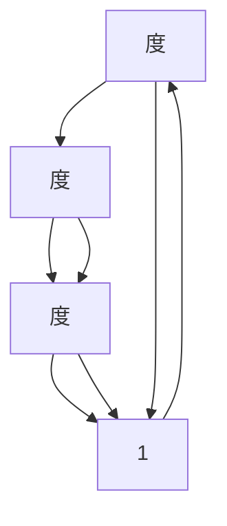

                 

## 第二部分：图神经网络基础

### 第3章 图神经网络基础

#### 3.1 图论基础

图论是数学的一个分支，主要研究图的性质和图中的各种关系。在图神经网络（Graph Neural Networks, GNN）中，图论基础至关重要，因为GNN的核心在于对图的表示、操作和理解。以下是对图论基础的一些简要介绍。

#### 3.1.1 图的定义

**图（Graph）** 是由一组节点（也称为顶点，Vertex）和一组边（Edge）组成的结构。节点代表实体，边代表节点之间的关系。图可以分为以下几种类型：

- **无向图（Undirected Graph）**：边没有方向，例如社交网络。
- **有向图（Directed Graph）**：边有方向，例如网页链接。

#### 3.1.2 图的表示

图的表示方法主要有以下两种：

- **邻接矩阵（Adjacency Matrix）**：用一个二维矩阵表示图，矩阵的元素表示节点之间的连接情况。如果节点 \(i\) 和节点 \(j\) 之间存在边，则矩阵中的对应位置为1，否则为0。
- **邻接表（Adjacency List）**：用一个列表表示图，每个列表对应一个节点，列表中包含了与该节点相连的其他节点。

#### 3.1.3 图的基本概念

- **度（Degree）**：节点所连接的边的数量。对于无向图，节点的度是边的数量；对于有向图，节点的度是入边和出边的总和。
- **路径（Path）**：节点之间的一条序列，每两个连续节点之间都有一条边。
- **环（Cycle）**：包含三个或更多节点的路径，其起点和终点相同。
- **连通图（Connected Graph）**：图中任意两个节点都是连通的。
- **连通分量（Connected Component）**：连通图中的最大子图，其中任意两个节点都是连通的。

#### 3.1.4 图的连通性

- **连通度（Connectivity）**：图是否连通，以及如何保持连通。
- **桥（Bridge）**：如果移除边会导致图不再连通，则该边称为桥。
- **连通度（Connectivity）**：图的最小连通度称为图的连通度。

#### 3.1.5 图的算法

- **最短路径算法（Shortest Path Algorithms）**：如迪杰斯特拉算法（Dijkstra）和贝尔曼-福特算法（Bellman-Ford）。
- **最小生成树算法（Minimum Spanning Tree Algorithms）**：如普里姆算法（Prim）和克鲁斯卡尔算法（Kruskal）。
- **最大流算法（Maximum Flow Algorithms）**：如埃尔多斯-卡茨算法（Edmonds-Karp）和推拉法（Push-Relabel）。

#### 3.1.6 Mermaid 流程图

以下是一个简单的Mermaid流程图，展示图的一些基本概念：



通过这些基本概念和算法，我们可以更好地理解图神经网络的工作原理，为后续章节的深入学习打下基础。

#### 3.2 初始化权重

在图神经网络（GNN）中，初始化权重是模型训练过程中至关重要的一步。合适的权重初始化可以减少训练时间，提高模型的稳定性和泛化能力。以下是对几种常见权重初始化方法的详细讨论。

#### 3.2.1 随机初始化

随机初始化是最常用的权重初始化方法之一。这种方法的基本思想是在一个指定的范围内随机生成权重值。通常，我们会选择在 [-1, 1] 或 [0, 1] 范围内进行随机初始化。

- **优势**：简单易行，计算复杂度低。
- **劣势**：可能导致梯度消失或梯度爆炸问题，特别是在深层网络中。

伪代码：

```python
import numpy as np

def random_init(weights, range_min=-1, range_max=1):
    return np.random.uniform(range_min, range_max, size=weights.shape)
```

#### 3.2.2 高斯分布初始化

高斯分布初始化是基于统计学原理的一种方法。这种方法的基本思想是使用高斯分布（也称为正态分布）生成权重值，通常设置均值为0，标准差为1。

- **优势**：有助于避免梯度消失和梯度爆炸问题。
- **劣势**：需要更多的计算资源。

伪代码：

```python
import numpy as np

def normal_init(weights, mean=0, std=1):
    return np.random.normal(mean, std, size=weights.shape)
```

#### 3.2.3 高斯均值为0，方差为1的初始化

在高斯分布初始化中，有时会进一步优化，将均值设置为0，方差设置为1，这种初始化方法在某些情况下表现出更好的性能。

- **优势**：优化了计算效率，同时保持了良好的性能。
- **劣势**：可能需要调整学习率。

伪代码：

```python
import numpy as np

def normal_init_zero_mean_one_std(weights):
    return np.random.normal(0, 1, size=weights.shape)
```

#### 3.2.4 Xavier初始化

Xavier初始化是由Xavier Glorot和Yoshua Bengio提出的一种方法，旨在解决梯度消失和梯度爆炸问题。这种方法的基本思想是根据层的输入和输出的维度来调整权重。

- **优势**：减少了梯度消失和梯度爆炸问题，有助于模型更快地收敛。
- **劣势**：计算复杂度稍高。

Xavier初始化的权重计算公式如下：

$$
\text{weight} = \frac{\sqrt{2 / (n_{in} + n_{out})}}{\sqrt{n_{out}}}
$$

其中，\(n_{in}\) 是输入维度，\(n_{out}\) 是输出维度。

伪代码：

```python
import numpy as np

def xavier_init(weights, n_in, n_out):
    return np.random.uniform(-1 / np.sqrt(n_in + n_out), 1 / np.sqrt(n_in + n_out), size=weights.shape)
```

#### 3.2.5 He初始化

He初始化是由Kaiming He提出的一种方法，主要用于深度卷积神经网络（Deep Convolutional Neural Networks, CNN）。He初始化考虑了激活函数的方差，从而优化了权重的初始化。

- **优势**：减少了梯度消失和梯度爆炸问题，特别适用于ReLU激活函数。
- **劣势**：计算复杂度较高。

He初始化的权重计算公式如下：

$$
\text{weight} = \frac{\sqrt{2 / n_{in}}}{\sqrt{n_{out}}}
$$

其中，\(n_{in}\) 是输入维度，\(n_{out}\) 是输出维度。

伪代码：

```python
import numpy as np

def he_init(weights, n_in, n_out):
    return np.random.uniform(-np.sqrt(3 / n_in), np.sqrt(3 / n_in), size=weights.shape)
```

#### 3.2.6 小结

每种权重初始化方法都有其独特的优势和劣势。在实际应用中，根据具体问题选择合适的初始化方法至关重要。随机初始化简单高效，但容易导致梯度问题；高斯分布初始化和Xavier初始化有助于缓解梯度问题，但计算复杂度较高；He初始化特别适用于ReLU激活函数，但在GNN中可能不是最佳选择。通过合理选择和调整权重初始化方法，我们可以显著提高GNN的训练效率和性能。

#### 3.3 激活函数与优化算法

在图神经网络（GNN）中，激活函数和优化算法是模型性能的关键因素。激活函数引入非线性，优化算法则用于调整模型参数以最小化损失函数。以下是对几种常见激活函数和优化算法的详细讨论。

#### 3.3.1 激活函数

激活函数是神经网络中的一个关键组件，它为模型引入了非线性，从而使得神经网络能够拟合复杂的函数关系。以下是几种常见的激活函数：

1. **Sigmoid函数**：

Sigmoid函数是一个将输入值映射到[0, 1]区间的函数，其公式为：

$$
\sigma(x) = \frac{1}{1 + e^{-x}}
$$

- **优点**：简单易实现，输出范围在[0, 1]，适合概率型输出。
- **缺点**：梯度消失问题严重，特别是在输入值接近0或1时。

2. **ReLU函数**：

ReLU（Rectified Linear Unit）函数是一个简单且有效的激活函数，其公式为：

$$
\text{ReLU}(x) = \max(0, x)
$$

- **优点**：计算效率高，避免了梯度消失问题，有助于加速模型训练。
- **缺点**：可能存在梯度消失问题，当输入为负值时。

3. **Tanh函数**：

Tanh（双曲正切）函数是一个将输入值映射到[-1, 1]区间的函数，其公式为：

$$
\tanh(x) = \frac{e^x - e^{-x}}{e^x + e^{-x}}
$$

- **优点**：输出范围均匀分布，减少了梯度消失问题。
- **缺点**：计算复杂度较高，可能存在梯度消失问题。

4. **Leaky ReLU**：

Leaky ReLU是对ReLU函数的一个改进，通过引入一个非常小的常数α来避免梯度消失问题，其公式为：

$$
\text{Leaky ReLU}(x) = \max(0, x) + \alpha \cdot \min(0, x)
$$

- **优点**：解决了ReLU函数的梯度消失问题。
- **缺点**：增加了额外的参数α，需要额外调整。

5. **Sigmoid激活函数**：

Sigmoid激活函数是一个对输入值进行非线性变换的函数，其公式为：

$$
\sigma(x) = \frac{1}{1 + e^{-x}}
$$

- **优点**：输出范围在[0, 1]，适合概率型输出。
- **缺点**：梯度消失问题严重，特别是在输入值接近0或1时。

#### 3.3.2 优化算法

优化算法用于最小化损失函数，从而调整模型参数。以下是几种常见的优化算法：

1. **梯度下降（Gradient Descent）**：

梯度下降是一种基于梯度的优化算法，其基本思想是沿着损失函数梯度的反方向更新模型参数，以最小化损失函数。梯度下降可以分为以下几种类型：

- **批量梯度下降（Batch Gradient Descent）**：在每个训练样本上计算梯度，然后对所有样本进行参数更新。
- **随机梯度下降（Stochastic Gradient Descent, SGD）**：在每个训练样本上计算梯度，然后对该样本进行参数更新。
- **小批量梯度下降（Mini-batch Gradient Descent）**：在每批训练样本上计算梯度，然后对这批样本进行参数更新。

伪代码：

```python
def gradient_descent(model, X, y, learning_rate, num_epochs):
    for epoch in range(num_epochs):
        for x, y in zip(X, y):
            gradient = compute_gradient(model, x, y)
            update_params(model, gradient, learning_rate)
    return model
```

- **优点**：简单易懂，易于实现。
- **缺点**：可能需要较长的训练时间，收敛速度较慢。

2. **动量法（Momentum）**：

动量法是一种改进的梯度下降算法，通过引入动量项来加速模型收敛。动量项可以累积过去的梯度信息，从而在更新参数时增加稳定性。

$$
v_t = \gamma \cdot v_{t-1} + \beta \cdot \nabla J(\theta)
$$

$$
\theta_t = \theta_{t-1} - \alpha \cdot v_t
$$

其中，\(v_t\) 是动量项，\(\gamma\) 是动量系数，\(\beta\) 是学习率。

- **优点**：提高了收敛速度，减少了参数调整的时间。
- **缺点**：需要调整动量系数，可能增加计算复杂度。

3. **RMSprop**：

RMSprop是一种基于梯度平方历史的优化算法，它通过计算梯度的平方历史来调整学习率。这种方法有助于减少振荡，提高收敛速度。

$$
\text{RMSprop} = \frac{\gamma \cdot \text{RMSprop}_{t-1} + (1 - \gamma) \cdot \text{gradient}^2}{1 - \gamma^2}
$$

$$
\theta_t = \theta_{t-1} - \alpha \cdot \text{RMSprop}_t
$$

其中，\(\gamma\) 是遗忘因子，\(\alpha\) 是学习率。

- **优点**：减少了参数调整的时间，提高了收敛速度。
- **缺点**：需要调整遗忘因子，可能增加计算复杂度。

4. **Adam**：

Adam是一种结合了动量法和RMSprop优点的优化算法。它通过计算一阶矩估计（均值）和二阶矩估计（方差）来更新参数，从而提高了收敛速度。

$$
m_t = \beta_1 \cdot m_{t-1} + (1 - \beta_1) \cdot \text{gradient}
$$

$$
v_t = \beta_2 \cdot v_{t-1} + (1 - \beta_2) \cdot \text{gradient}^2
$$

$$
\theta_t = \theta_{t-1} - \alpha \cdot \frac{m_t}{\sqrt{v_t} + \epsilon}
$$

其中，\(\beta_1\) 和 \(\beta_2\) 是动量系数，\(\alpha\) 是学习率，\(\epsilon\) 是一个小常数。

- **优点**：结合了动量法和RMSprop的优点，收敛速度快，适用范围广。
- **缺点**：需要调整动量系数和学习率，可能增加计算复杂度。

#### 3.3.3 小结

激活函数和优化算法在图神经网络中发挥着关键作用。选择合适的激活函数可以增强模型的非线性表示能力，而选择合适的优化算法可以加速模型训练，提高收敛速度。在实际应用中，我们可以根据具体问题和数据特点，选择合适的激活函数和优化算法，以获得最佳的性能。

### 3.4 图神经网络的工作原理

图神经网络（Graph Neural Networks, GNN）是一种用于处理图结构数据的深度学习模型。与传统的卷积神经网络（Convolutional Neural Networks, CNN）和循环神经网络（Recurrent Neural Networks, RNN）不同，GNN能够直接处理图结构数据，并从图中提取结构化信息。以下是对GNN工作原理的详细讨论。

#### 3.4.1 图卷积操作

图卷积操作是GNN的核心组件，用于更新节点的特征。图卷积操作基于节点和其邻居节点的特征，通过聚合邻居信息来更新节点的特征表示。以下是一个简化的图卷积操作的伪代码：

```python
# 输入：节点特征矩阵 A，权重矩阵 W，激活函数 f
# 输出：更新后的节点特征矩阵 H

for each node i:
    # 获取邻居节点特征和边权重
    neighbor_features = A[:, i] * W
    # 聚合邻居节点特征
    aggregated_features = sum(neighbor_features)
    # 应用激活函数
    new_feature = f(aggregated_features)
    # 更新节点特征
    H[:, i] = new_feature
```

在这个伪代码中，`A` 是邻接矩阵，`W` 是权重矩阵，`H` 是节点特征矩阵。对于每个节点 \(i\)，我们首先计算其邻居节点的特征乘以边权重，然后聚合这些特征，最后应用激活函数得到更新后的节点特征。

#### 3.4.2 消息传递机制

在GNN中，消息传递机制用于节点特征与邻居节点的特征之间的交互。通过消息传递，节点能够获取其邻居节点的特征信息，并将其用于更新自身特征。以下是一个简化的消息传递机制的伪代码：

```python
# 输入：节点特征矩阵 H，邻接矩阵 A
# 输出：更新后的节点特征矩阵 H'

for each node i:
    # 获取邻居节点特征
    neighbor_features = A[:, i] * H
    # 聚合邻居节点特征
    aggregated_features = sum(neighbor_features)
    # 更新节点特征
    H[:, i] = aggregated_features
```

在这个伪代码中，`A` 是邻接矩阵，`H` 是节点特征矩阵。对于每个节点 \(i\)，我们首先计算其邻居节点的特征，然后聚合这些特征，最后更新节点特征。

#### 3.4.3 层叠图卷积

在多层GNN中，每层图卷积操作都是在前一层特征基础上进行的。通过层叠图卷积，GNN能够逐渐提取更复杂的图结构信息。以下是一个简化的层叠图卷积操作的伪代码：

```python
# 输入：初始节点特征矩阵 H，邻接矩阵 A，层数 L
# 输出：多层更新后的节点特征矩阵 H_L

for l in range(L):
    # 第一层：初始化节点特征矩阵 H
    H = H_init
    # 对于每一层，进行图卷积操作
    for each node i:
        # 获取邻居节点特征和边权重
        neighbor_features = A[:, i] * H
        # 聚合邻居节点特征
        aggregated_features = sum(neighbor_features)
        # 应用激活函数
        new_feature = f(aggregated_features)
        # 更新节点特征
        H[:, i] = new_feature
    # 更新当前层的节点特征矩阵
    H_l = H
```

在这个伪代码中，`A` 是邻接矩阵，`H` 是节点特征矩阵，`L` 是层数。我们首先初始化节点特征矩阵 `H`，然后对于每一层，进行图卷积操作，并更新节点特征。最后，我们得到多层更新后的节点特征矩阵 `H_L`。

#### 3.4.4 图池化操作

图池化操作用于从局部特征中提取全局特征。在GNN中，图池化操作通常用于整合多层图卷积操作的结果。以下是一个简化的图池化操作的伪代码：

```python
# 输入：多层更新后的节点特征矩阵 H_L
# 输出：全局特征矩阵 G

# 对于每一层，聚合节点特征
for l in range(L):
    # 获取当前层的节点特征
    node_features = H_l[:, i]
    # 聚合所有节点特征
    aggregated_features = sum(node_features)
    # 更新全局特征
    G[:, i] = aggregated_features
```

在这个伪代码中，`H_L` 是多层更新后的节点特征矩阵，`G` 是全局特征矩阵。对于每一层，我们聚合所有节点的特征，并将其作为全局特征矩阵 `G` 的一个维度。

#### 3.4.5 图神经网络的整体流程

GNN的整体流程包括以下几个步骤：

1. **初始化节点特征**：首先，我们初始化节点的特征矩阵 `H`。
2. **进行图卷积操作**：对于每一层，我们进行图卷积操作，通过聚合邻居节点的特征来更新节点特征。
3. **进行图池化操作**：在多层图卷积操作之后，我们进行图池化操作，从局部特征中提取全局特征。
4. **输出节点和边特征**：最后，我们输出节点的特征矩阵 `H` 和全局特征矩阵 `G`。

以下是一个简化的GNN整体流程的伪代码：

```python
# 输入：初始节点特征矩阵 H，邻接矩阵 A，层数 L
# 输出：多层更新后的节点特征矩阵 H_L，全局特征矩阵 G

# 初始化节点特征矩阵 H
H = H_init

# 对于每一层，进行图卷积操作
for l in range(L):
    # 获取邻居节点特征和边权重
    neighbor_features = A[:, i] * H
    # 聚合邻居节点特征
    aggregated_features = sum(neighbor_features)
    # 应用激活函数
    new_feature = f(aggregated_features)
    # 更新节点特征
    H[:, i] = new_feature

# 进行图池化操作
for l in range(L):
    # 获取当前层的节点特征
    node_features = H_l[:, i]
    # 聚合所有节点特征
    aggregated_features = sum(node_features)
    # 更新全局特征
    G[:, i] = aggregated_features

# 输出节点和边特征
return H_L, G
```

在这个伪代码中，`A` 是邻接矩阵，`H` 是节点特征矩阵，`L` 是层数。我们首先初始化节点特征矩阵 `H`，然后对于每一层，进行图卷积操作和图池化操作，并更新节点特征和全局特征。最后，我们输出多层更新后的节点特征矩阵 `H_L` 和全局特征矩阵 `G`。

通过这些操作，GNN能够有效地提取图结构中的复杂信息，并用于节点分类、图分类、链接预测等任务。接下来，我们将详细讨论几种常见的GNN模型，如图卷积网络（Graph Convolutional Network, GCN）、图注意力网络（Graph Attention Network, GAT）和图自编码器（Graph Autoencoder, GAE）。

### 3.5 Graph Convolutional Network（GCN）

Graph Convolutional Network（GCN）是一种基于图卷积操作的深度学习模型，主要用于处理图结构数据。GCN通过逐步聚合节点的邻接信息，从而提取图中的结构化特征。以下是对GCN的详细讨论，包括其数学公式、工作原理和变体。

#### 3.5.1 数学公式

GCN的核心操作是图卷积，其数学公式如下：

$$
h_i^{(l+1)} = \sigma(\sum_{j \in \mathcal{N}(i)} A_{ij} h_j^{(l)} W^{(l)})
$$

其中，\(h_i^{(l)}\) 和 \(h_i^{(l+1)}\) 分别表示节点 \(i\) 在第 \(l\) 次迭代和第 \(l+1\) 次迭代的特征向量，\(\mathcal{N}(i)\) 表示节点 \(i\) 的邻居节点集合，\(A_{ij}\) 表示节点 \(i\) 和节点 \(j\) 之间的边权重，\(\sigma\) 是激活函数，\(W^{(l)}\) 是权重矩阵。

在这个公式中，对于每个节点 \(i\)，我们首先计算其邻居节点 \(j\) 的特征 \(h_j^{(l)}\) 乘以边权重 \(A_{ij}\)，然后将这些特征相加，并乘以权重矩阵 \(W^{(l)}\)，最后应用激活函数 \(\sigma\) 得到更新后的节点特征 \(h_i^{(l+1)}\)。

#### 3.5.2 工作原理

GCN的工作原理可以概括为以下几个步骤：

1. **初始化节点特征**：每个节点都有一个初始特征向量 \(h_i^{(0)}\)。
2. **计算邻接矩阵**：通过邻接矩阵 \(A\) 来表示节点间的连接关系。邻接矩阵是一个二进制矩阵，如果节点 \(i\) 和节点 \(j\) 之间存在边，则 \(A_{ij} = 1\)，否则为 0。
3. **进行图卷积操作**：对于每个节点 \(i\)，计算其邻居节点的特征 \(h_j^{(l)}\) 乘以边权重 \(A_{ij}\)，然后相加，并乘以权重矩阵 \(W^{(l)}\)，最后应用激活函数 \(\sigma\) 得到更新后的节点特征 \(h_i^{(l+1)}\)。
4. **迭代更新节点特征**：重复上述步骤，直到达到预定的迭代次数或节点特征不再显著变化。

通过迭代更新节点特征，GCN能够逐步提取图中的结构化特征，从而实现对节点的分类、聚类等任务。

#### 3.5.3 变体

GCN有多种变体，以下介绍几种常见的变体：

1. **带有偏置的GCN**：在原始GCN的基础上，加入偏置项 \(b^{(l)}\)，使得每个节点都有额外的特征。

$$
h_i^{(l+1)} = \sigma(\sum_{j \in \mathcal{N}(i)} A_{ij} h_j^{(l)} W^{(l)} + b^{(l)})
$$

2. **多层GCN**：通过堆叠多个GCN层，可以提取更复杂的图结构特征。多层GCN的输出可以表示为：

$$
h_i^{(L+1)} = \sigma(\sum_{j \in \mathcal{N}(i)} A_{ij} h_j^{(L)} W^{(L)} + b^{(L)})
$$

其中，\(L\) 是GCN的层数。

3. **卷积层融合**：在GCN的每一层中，可以融合多个卷积层，从而提取更丰富的特征。

$$
h_i^{(l+1)} = \sigma(\sum_{k=1}^{K} \sum_{j \in \mathcal{N}(i)} A_{ij} h_j^{(l)} W_k^{(l)})
$$

其中，\(K\) 是卷积层的数量，\(W_k^{(l)}\) 是第 \(k\) 个卷积层的权重矩阵。

#### 3.5.4 应用案例

GCN在各种领域有广泛的应用，以下列举几个常见的应用案例：

1. **节点分类**：通过GCN提取节点的特征，可以使用支持向量机（SVM）、决策树等分类算法进行节点分类。
2. **图分类**：GCN可以用于对图进行分类，例如，将社交网络中的图分类为不同的社交群体。
3. **链接预测**：通过GCN预测节点间的链接关系，可以用于推荐系统、社交网络分析等。
4. **社交网络分析**：GCN可以用于分析社交网络中的用户关系，例如，识别社交网络中的关键节点和社区结构。

通过这些应用案例，我们可以看到GCN在处理图结构数据中的强大能力。接下来，我们将继续讨论其他GNN模型，如图注意力网络（Graph Attention Network, GAT）和图自编码器（Graph Autoencoder, GAE）。

### 3.6 Graph Attention Network（GAT）

Graph Attention Network（GAT）是一种基于注意力机制的图神经网络，旨在提高节点表示学习的效果。GAT通过引入注意力权重，使模型能够自适应地关注邻居节点中的关键信息。以下是对GAT的详细讨论，包括其数学公式、工作原理和变体。

#### 3.6.1 数学公式

GAT的核心思想是在每个图卷积操作中引入注意力权重，从而动态地调整节点特征聚合的权重。GAT的数学公式如下：

$$
a_{ij}^{(l)} = \text{Attention}(h_{i}^{(l)}, h_{j}^{(l)}, \alpha^{(l)})
$$

$$
h_i^{(l+1)} = \sigma(\sum_{j \in \mathcal{N}(i)} a_{ij}^{(l) } h_j^{(l)} W^{(l)})
$$

其中，\(a_{ij}^{(l)}\) 表示节点 \(i\) 和节点 \(j\) 之间的注意力权重，\(h_i^{(l)}\) 和 \(h_j^{(l)}\) 分别表示节点 \(i\) 和节点 \(j\) 在第 \(l\) 次迭代的特征向量，\(\text{Attention}\) 是注意力函数，\(\alpha^{(l)}\) 是权重矩阵，\(\sigma\) 是激活函数。

在这个公式中，对于每个节点 \(i\)，我们首先计算其邻居节点 \(j\) 的特征 \(h_j^{(l)}\) 的注意力权重 \(a_{ij}^{(l)}\)，然后利用这些权重聚合邻居节点的特征 \(h_j^{(l)}\)，并乘以权重矩阵 \(W^{(l)}\)，最后应用激活函数 \(\sigma\) 得到更新后的节点特征 \(h_i^{(l+1)}\)。

#### 3.6.2 工作原理

GAT的工作原理可以概括为以下几个步骤：

1. **初始化节点特征**：每个节点都有一个初始特征向量 \(h_i^{(0)}\)。
2. **计算注意力权重**：对于每个节点 \(i\)，计算其邻居节点 \(j\) 的特征 \(h_j^{(l)}\) 的注意力权重 \(a_{ij}^{(l)}\)。这个权重通过注意力函数 \(\text{Attention}\) 计算，通常是一个带有可训练参数的函数，如加性注意力或点积注意力。
3. **聚合邻居节点特征**：利用注意力权重 \(a_{ij}^{(l)}\) 聚合邻居节点 \(j\) 的特征 \(h_j^{(l)}\)，并乘以权重矩阵 \(W^{(l)}\)。
4. **更新节点特征**：应用激活函数 \(\sigma\) 对聚合后的特征进行非线性变换，得到更新后的节点特征 \(h_i^{(l+1)}\)。
5. **迭代更新节点特征**：重复上述步骤，直到达到预定的迭代次数或节点特征不再显著变化。

通过这些步骤，GAT能够自适应地关注邻居节点中的关键信息，从而提高节点表示学习的效果。

#### 3.6.3 变体

GAT有多种变体，以下介绍几种常见的变体：

1. **多头注意力**：在GAT中，可以引入多头注意力机制，即在每个节点上同时计算多个注意力权重，并将这些权重聚合起来。多头注意力的数学公式如下：

$$
\alpha_{ij}^{(l)} = \text{Attention}(h_{i}^{(l)}, h_{j}^{(l)}, \alpha^{(l)})
$$

$$
h_i^{(l+1)} = \sigma(\sum_{j \in \mathcal{N}(i)} \alpha_{ij}^{(l) } h_j^{(l)} W^{(l)})
$$

其中，\(\alpha_{ij}^{(l)}\) 表示节点 \(i\) 和节点 \(j\) 之间的第 \(k\) 个注意力权重，\(W_k^{(l)}\) 是第 \(k\) 个权重矩阵。

2. **序列注意力**：在GAT中，可以引入序列注意力机制，即对邻居节点特征进行排序，并根据其顺序计算注意力权重。序列注意力的数学公式如下：

$$
\alpha_{ij}^{(l)} = \text{Attention}(h_{i}^{(l)}, [h_1^{(l)}, h_2^{(l)}, ..., h_n^{(l)}], \alpha^{(l)})
$$

$$
h_i^{(l+1)} = \sigma(\sum_{j \in \mathcal{N}(i)} \alpha_{ij}^{(l) } h_j^{(l)} W^{(l)})
$$

其中，\([h_1^{(l)}, h_2^{(l)}, ..., h_n^{(l)}]\) 是邻居节点特征的序列。

3. **自注意力**：在GAT中，可以引入自注意力机制，即在每个节点上计算其自身的注意力权重。自注意力的数学公式如下：

$$
\alpha_{ii}^{(l)} = \text{Attention}(h_{i}^{(l)}, h_{i}^{(l)}, \alpha^{(l)})
$$

$$
h_i^{(l+1)} = \sigma(\sum_{j \in \mathcal{N}(i)} \alpha_{ij}^{(l) } h_j^{(l)} W^{(l)})
$$

其中，\(\alpha_{ii}^{(l)}\) 表示节点 \(i\) 的自注意力权重。

#### 3.6.4 应用案例

GAT在各种领域有广泛的应用，以下列举几个常见的应用案例：

1. **节点分类**：通过GAT提取节点的特征，可以使用支持向量机（SVM）、决策树等分类算法进行节点分类。
2. **图分类**：GAT可以用于对图进行分类，例如，将社交网络中的图分类为不同的社交群体。
3. **链接预测**：通过GAT预测节点间的链接关系，可以用于推荐系统、社交网络分析等。
4. **社交网络分析**：GAT可以用于分析社交网络中的用户关系，例如，识别社交网络中的关键节点和社区结构。

通过这些应用案例，我们可以看到GAT在处理图结构数据中的强大能力。GAT通过引入注意力机制，使模型能够自适应地关注邻居节点中的关键信息，从而提高节点表示学习的效果。接下来，我们将继续讨论其他GNN模型，如图自编码器（Graph Autoencoder, GAE）。

### 3.7 Graph Autoencoder（GAE）

Graph Autoencoder（GAE）是一种基于图结构的无监督学习模型，主要用于节点特征学习和降维。GAE通过学习一个编码器和解码器来重构输入图的结构和特征。以下是对GAE的详细讨论，包括其数学公式、工作原理和变体。

#### 3.7.1 数学公式

GAE的数学公式可以分为编码器和解码器两部分：

编码器：

$$
z_i = \text{encode}(h_i; \theta_e)
$$

解码器：

$$
h_i' = \text{decode}(z_i; \theta_d)
$$

其中，\(h_i\) 是节点 \(i\) 的原始特征向量，\(z_i\) 是编码后的特征向量，\(h_i'\) 是解码后的特征向量，\(\theta_e\) 是编码器的参数，\(\theta_d\) 是解码器的参数。

编码器和解码器的具体实现可以使用不同的神经网络结构，但通常它们都是基于多层感知机（MLP）。

#### 3.7.2 工作原理

GAE的工作原理可以概括为以下几个步骤：

1. **编码器**：编码器的作用是将输入图的节点特征 \(h_i\) 映射到一个新的特征空间 \(z_i\)。这个映射通常是一个压缩过程，目的是提取输入特征的关键信息。
2. **解码器**：解码器的作用是将编码后的特征向量 \(z_i\) 重构回原始的节点特征 \(h_i'\)。这个重构过程通过重建输入图的结构和特征来实现。
3. **损失函数**：GAE

